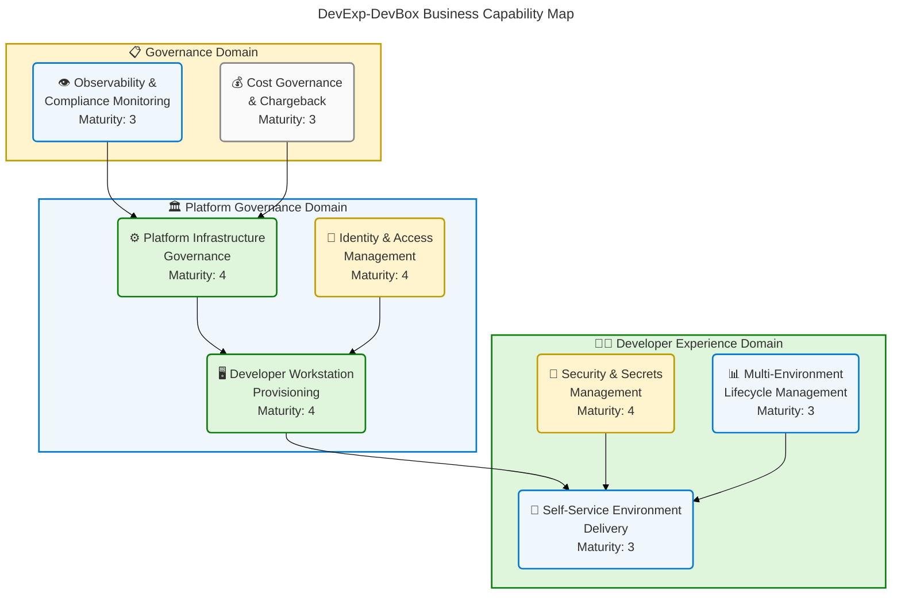
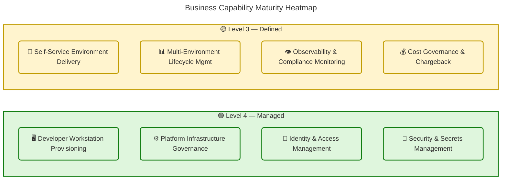
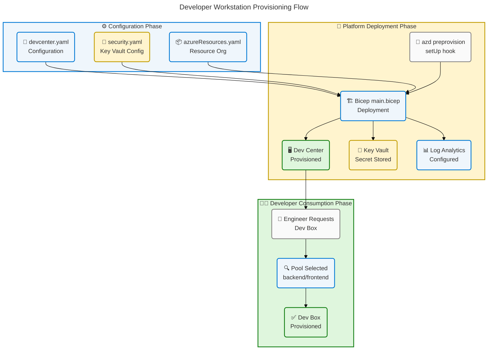
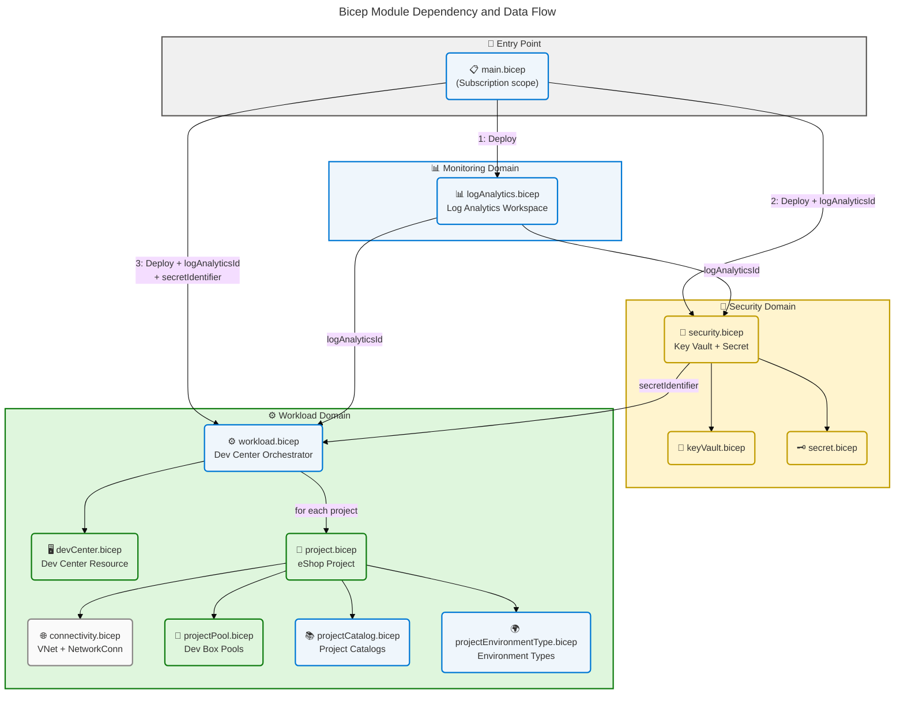
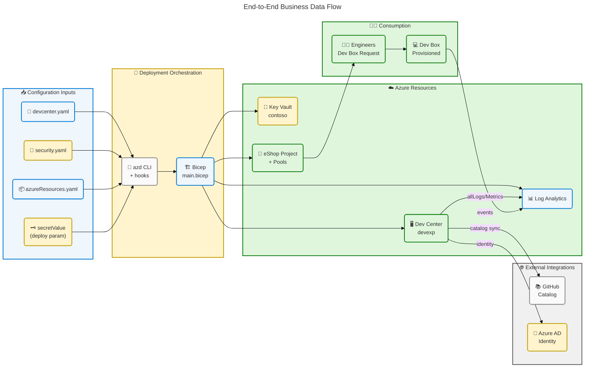

# Business Architecture

## DevExp-DevBox — Dev Box Adoption & Deployment Accelerator

## Section 1: Executive Summary

### Overview

The DevExp-DevBox repository implements a **configuration-driven Azure Dev Box
Deployment Accelerator** designed to deliver self-service, cloud-native
developer workstations for enterprise engineering teams. The solution abstracts
platform complexity behind opinionated Infrastructure as Code (Bicep) modules,
YAML-driven configuration models, and PowerShell automation — enabling Platform
Engineering teams at organizations such as Contoso to provision standardized,
role-specific development environments at scale. This Business Architecture
documents the organizational context, business motivations, capabilities,
processes, and governance structures that underpin the solution.

The accelerator serves two distinct business communities: **Platform Engineering
teams** responsible for deploying and managing the Dev Center infrastructure,
and **engineering teams** (such as eShop Engineers) who consume role-specific
Dev Box workstations through a self-service model. The solution directly
supports organizational goals of reducing developer onboarding friction,
enforcing security baselines, and optimizing IT cost allocation through
centralized workstation governance.

Strategic alignment positions this accelerator within the **Developer Experience
(DevEx)** capability domain, addressing a recognized gap in the Azure Landing
Zone model: the absence of a standardized, repeatable mechanism for provisioning
developer environments that satisfies both productivity and compliance
requirements. The solution achieves Level 3–4 business maturity (Defined →
Managed) across core capabilities, with systematic role-based access control,
environment lifecycle management, and tag-based cost governance.

### Key Findings

| Finding                                                                 | Area                  | Maturity    |
| ----------------------------------------------------------------------- | --------------------- | ----------- |
| Configuration-as-Code model governs all workload provisioning           | Business Strategy     | 4 - Managed |
| Role-based Dev Box pools align workstations to engineering personas     | Business Capabilities | 4 - Managed |
| Self-service provisioning reduces platform team bottlenecks             | Value Streams         | 3 - Defined |
| RBAC and Azure AD groups enforce least-privilege access                 | Business Rules        | 4 - Managed |
| Multi-environment lifecycle (dev, staging, UAT) supports SDLC alignment | Business Processes    | 3 - Defined |
| GitHub Actions pre-provision hooks automate environment setup           | Business Events       | 3 - Defined |
| Tagging taxonomy enables cost allocation and governance reporting       | KPIs & Metrics        | 3 - Defined |

---

## Section 2: Architecture Landscape

### Overview

The Architecture Landscape catalogs all discovered Business components within
the DevExp-DevBox solution, organized across eleven TOGAF Business Layer
component types. The solution is structured around three functional domains:
**Platform Governance** (the Platforms division's stewardship of Dev Center
infrastructure), **Developer Experience** (self-service workstation provisioning
for engineering teams), and **Security & Compliance** (least-privilege access,
secrets management, and cost governance).

Each domain reflects a distinct organizational concern, and the solution's
architecture preserves clear separation between infrastructure provisioning
(Platform Engineering), workstation consumption (Development Teams), and
operational oversight (IT/Contoso ownership). This three-tier organizational
model — Platform Engineering → Development Teams → IT Governance — defines the
business context within which all technical components operate.

The following subsections catalog all eleven Business component types identified
through analysis of the source configuration files, Bicep modules, and project
documentation. Maturity ratings use the standard 1–5 scale (1: Initial, 2:
Developing, 3: Defined, 4: Managed, 5: Optimized).

### 2.1 Business Strategy

| Name                              | Description                                                                                                                                                      | Maturity    |
| --------------------------------- | ---------------------------------------------------------------------------------------------------------------------------------------------------------------- | ----------- |
| Dev Box Adoption Accelerator      | Strategic initiative to standardize cloud-native developer workstations using Azure Dev Box and Infrastructure as Code                                           | 4 - Managed |
| Configuration-as-Code Governance  | Strategy to manage all workload and security configuration through validated YAML files and JSON Schema, eliminating manual, error-prone configuration drift     | 4 - Managed |
| Developer Experience Optimization | Strategic goal of reducing developer onboarding friction and increasing developer productivity through self-service, role-specific workstations                  | 3 - Defined |
| Azure Landing Zone Alignment      | Strategy to align developer workstation provisioning with Azure Landing Zone principles, using segregated resource groups for workload, security, and monitoring | 4 - Managed |
| Open-Source Accelerator Delivery  | Strategy to package the solution as a publicly available GitHub-based accelerator enabling community adoption and contribution                                   | 3 - Defined |

### 2.2 Business Capabilities

| Name                                   | Description                                                                                                                            | Maturity    |
| -------------------------------------- | -------------------------------------------------------------------------------------------------------------------------------------- | ----------- |
| Developer Workstation Provisioning     | End-to-end capability to create, configure, and deliver role-specific cloud workstations to engineering teams via Azure Dev Box pools  | 4 - Managed |
| Platform Infrastructure Governance     | Capability to deploy and manage Dev Center infrastructure, including catalogs, environment types, and resource group organization      | 4 - Managed |
| Identity & Access Management           | Capability to enforce least-privilege RBAC using Azure AD groups, system-assigned managed identities, and scoped role assignments      | 4 - Managed |
| Self-Service Environment Delivery      | Capability for engineering teams to independently provision and consume Dev Box workstations without manual platform team intervention | 3 - Defined |
| Security & Secrets Management          | Capability to centrally store and govern secrets (e.g., GitHub Access Tokens) using Azure Key Vault with RBAC authorization            | 4 - Managed |
| Observability & Compliance Monitoring  | Capability to capture diagnostic logs and metrics from Dev Center into Log Analytics Workspace for governance and operational insight  | 3 - Defined |
| Multi-Environment Lifecycle Management | Capability to define and govern distinct deployment environments (dev, staging, UAT) within projects, aligned to SDLC stages           | 3 - Defined |
| Cost Governance & Chargeback           | Capability to allocate and report workstation costs through a consistent resource tagging taxonomy across all deployed Azure resources | 3 - Defined |

**Business Capability Map:**

### 2.3 Value Streams

| Name                             | Description                                                                                                                                 | Maturity    |
| -------------------------------- | ------------------------------------------------------------------------------------------------------------------------------------------- | ----------- |
| Developer Onboarding             | End-to-end flow from new engineer assignment to a fully provisioned, role-specific Dev Box workstation ready for development work           | 3 - Defined |
| Platform Deployment              | Flow from platform configuration change (YAML edit) through infrastructure provisioning to a live Dev Center with active projects and pools | 4 - Managed |
| Environment Lifecycle Management | Flow covering creation, use, and teardown of deployment environments (dev, staging, UAT) within Dev Center projects                         | 3 - Defined |
| Security Configuration           | Flow from secret creation through Key Vault storage, RBAC assignment, and consumption by Dev Center managed identity                        | 4 - Managed |

### 2.4 Business Processes

| Name                       | Description                                                                                                                                        | Maturity    |
| -------------------------- | -------------------------------------------------------------------------------------------------------------------------------------------------- | ----------- |
| Pre-Provision Setup        | Automated process executed via azd hooks (setUp.sh / setUp.ps1) that configures source control platform variables before infrastructure deployment | 3 - Defined |
| Dev Center Deployment      | Process to deploy and configure Azure Dev Center, including catalogs, environment types, role assignments, and diagnostic settings                 | 4 - Managed |
| Project Provisioning       | Process to create a Dev Center project with associated pools, catalogs, network connectivity, identity, and environment types                      | 3 - Defined |
| Dev Box Pool Configuration | Process to define role-specific Dev Box pools mapping image definitions and VM SKUs to engineering personas (backend, frontend)                    | 4 - Managed |
| Secret Management          | Process to create, store, and reference GitHub Access Tokens (gha-token) in Azure Key Vault, referenced by Dev Center during catalog sync          | 4 - Managed |
| Network Connectivity Setup | Process to provision VNet/subnets (for Unmanaged network type) or use Microsoft-hosted networks (Managed type) for Dev Box connectivity            | 3 - Defined |
| Identity & RBAC Assignment | Process to assign Azure RBAC roles to Dev Center managed identity, project identities, and Azure AD groups at appropriate scopes                   | 4 - Managed |

### 2.5 Business Services

| Name                              | Description                                                                                                                                   | Maturity    |
| --------------------------------- | --------------------------------------------------------------------------------------------------------------------------------------------- | ----------- |
| Azure Dev Box Service             | Cloud service enabling self-service provisioning of pre-configured developer workstations (Dev Boxes) from role-specific pool definitions     | 4 - Managed |
| Azure Key Vault Service           | Cloud service providing centralized, RBAC-governed storage and retrieval of secrets (GitHub Access Token) used during catalog synchronization | 4 - Managed |
| Azure Log Analytics Service       | Cloud service collecting diagnostic logs and metrics from Dev Center resources for operational monitoring and compliance reporting            | 3 - Defined |
| GitHub Catalog Service            | External service providing version-controlled Dev Box image definitions and environment configurations via GitHub repositories                | 3 - Defined |
| Azure Developer CLI (azd) Service | Deployment orchestration service managing pre-provision hooks, environment setup, and Bicep-based infrastructure provisioning                 | 4 - Managed |

### 2.6 Business Functions

| Name                           | Description                                                                                                                             | Maturity    |
| ------------------------------ | --------------------------------------------------------------------------------------------------------------------------------------- | ----------- |
| Platform Engineering Function  | Organizational function responsible for deploying, maintaining, and governing the Dev Center infrastructure and platform configuration  | 4 - Managed |
| Developer Experience Function  | Organizational function responsible for defining role-specific workstation configurations, image definitions, and environment templates | 3 - Defined |
| Security & Compliance Function | Organizational function responsible for managing secrets, enforcing RBAC policies, and maintaining Key Vault configurations             | 4 - Managed |
| Cost Management Function       | Organizational function responsible for tagging governance, cost center allocation, and workstation cost reporting                      | 3 - Defined |
| Catalog Management Function    | Organizational function responsible for maintaining GitHub repositories that serve as Dev Center catalogs for tasks and environments    | 3 - Defined |

### 2.7 Business Roles & Actors

| Name                        | Description                                                                                                                                         | Maturity    |
| --------------------------- | --------------------------------------------------------------------------------------------------------------------------------------------------- | ----------- |
| Platform Engineering Team   | Azure AD group (ID: 54fd94a1-e116-4bc8-8238-caae9d72bd12) with Dev Manager role; responsible for deploying and governing the Dev Center             | 4 - Managed |
| eShop Engineers             | Azure AD group (ID: b9968440-0caf-40d8-ac36-52f159730eb7) with Dev Box User and Deployment Environment User roles; primary consumers of Dev Boxes   | 3 - Defined |
| Dev Manager                 | Business role (type: DevManager) holding DevCenter Project Admin RBAC role at ResourceGroup scope; manages project settings and pool configurations | 4 - Managed |
| Dev Box User                | Business role assigned to engineering team members; grants rights to create, start, stop, and delete personal Dev Boxes within assigned pools       | 4 - Managed |
| Deployment Environment User | Business role granting rights to create and manage deployment environments (dev, staging, UAT) within Dev Center projects                           | 3 - Defined |
| Key Vault Secrets User      | Business role (ID: 4633458b-17de-408a-b874-0445c86b69e6) granting read access to Key Vault secrets for the Dev Center managed identity              | 4 - Managed |
| Key Vault Secrets Officer   | Business role (ID: b86a8fe4-44ce-4948-aee5-eccb2c155cd7) granting write/manage access to Key Vault secrets for administrative operations            | 4 - Managed |
| Contoso (Owner)             | Organizational owner actor responsible for resource ownership, cost accountability, and executive governance of the Dev Box platform                | 3 - Defined |

### 2.8 Business Rules

| Name                           | Description                                                                                                                                            | Maturity    |
| ------------------------------ | ------------------------------------------------------------------------------------------------------------------------------------------------------ | ----------- |
| Least-Privilege RBAC           | All role assignments must follow the principle of least privilege; roles are scoped to the minimum necessary (ResourceGroup, Project, or Subscription) | 4 - Managed |
| Mandatory Resource Tagging     | All Azure resources must carry the standard tag set: environment, division, team, project, costCenter, owner, landingZone, resources                   | 4 - Managed |
| Schema-Validated Configuration | All configuration files (devcenter.yaml, azureResources.yaml, security.yaml) must validate against their corresponding JSON Schema before deployment   | 4 - Managed |
| Idempotent Deployments         | All Bicep modules and PowerShell scripts must be idempotent; repeated executions produce the same result without side effects                          | 4 - Managed |
| No Hardcoded Secrets           | Secrets (GitHub Access Tokens, credentials) must not be embedded in code or parameter files; all secrets are stored in Azure Key Vault                 | 4 - Managed |
| Purge Protection on Key Vault  | Azure Key Vault must have purge protection enabled (7-day soft delete retention minimum) to prevent accidental permanent secret deletion               | 4 - Managed |
| Branch-Referenced Catalogs     | Dev Center catalogs must reference specific Git branches (main) to ensure stable, reproducible image definitions and task configurations               | 3 - Defined |
| Environment Naming Alignment   | Dev Center environment types (dev, staging, uat/UAT) must align with organizational SDLC stages to maintain consistent deployment targeting            | 3 - Defined |

### 2.9 Business Events

| Name                                  | Description                                                                                                                                                         | Maturity    |
| ------------------------------------- | ------------------------------------------------------------------------------------------------------------------------------------------------------------------- | ----------- |
| Pre-Provision Hook Triggered          | Event fired before infrastructure deployment; executes setUp.sh (Linux/macOS) or setUp.ps1 (Windows) to configure SOURCE_CONTROL_PLATFORM and environment variables | 3 - Defined |
| Infrastructure Provisioning Initiated | Event triggered when azd provision executes the main.bicep deployment, creating resource groups, Key Vault, Log Analytics, and Dev Center                           | 4 - Managed |
| Dev Center Created                    | Event marking the successful creation of the Azure Dev Center resource (devexp) with catalog sync, hosted network, and Azure Monitor agent enabled                  | 4 - Managed |
| Project Provisioned                   | Event marking successful creation of a Dev Center project (e.g., eShop) with pools, catalogs, network connectivity, and RBAC assignments                            | 3 - Defined |
| Secret Stored                         | Event marking the successful storage of gha-token (GitHub Access Token) in Azure Key Vault, enabling private catalog repository authentication                      | 4 - Managed |
| Dev Box Requested                     | Event triggered when an engineer requests a new Dev Box from an available pool (backend-engineer or frontend-engineer)                                              | 3 - Defined |
| Catalog Sync Completed                | Event triggered when the Dev Center synchronizes image definitions and tasks from GitHub catalog repositories                                                       | 3 - Defined |
| Diagnostic Logs Streamed              | Event triggered when Dev Center diagnostic logs (allLogs, AllMetrics) are successfully forwarded to the Log Analytics Workspace                                     | 3 - Defined |

### 2.10 Business Objects/Entities

| Name                         | Description                                                                                                                                                                   | Maturity    |
| ---------------------------- | ----------------------------------------------------------------------------------------------------------------------------------------------------------------------------- | ----------- |
| Dev Center (devexp)          | Core Azure resource (Microsoft.DevCenter/devcenters) representing the centralized developer workstation platform with catalog sync and managed identity                       | 4 - Managed |
| Dev Center Project (eShop)   | Child resource (Microsoft.DevCenter/projects) representing a project team's isolated Dev Box environment with dedicated pools and catalogs                                    | 3 - Defined |
| Dev Box Pool                 | Resource (Microsoft.DevCenter/projects/pools) defining a collection of identically configured Dev Boxes for a specific engineering role (backend-engineer, frontend-engineer) | 4 - Managed |
| Catalog                      | Configuration pointing to a GitHub repository containing Dev Box image definitions (imageDefinition) or environment configurations (environmentDefinition)                    | 3 - Defined |
| Environment Type             | Lifecycle stage definition (dev, staging, UAT) within the Dev Center or project, enabling deployment environment targeting                                                    | 3 - Defined |
| Azure Key Vault (contoso)    | Security resource (Microsoft.KeyVault/vaults) storing the GitHub Access Token (gha-token) used by Dev Center for private catalog authentication                               | 4 - Managed |
| Log Analytics Workspace      | Monitoring resource collecting diagnostic logs and metrics from Dev Center, providing operational observability                                                               | 3 - Defined |
| Resource Group               | Azure organizational unit segregating workload, security, and monitoring resources per Azure Landing Zone principles                                                          | 4 - Managed |
| Virtual Network (eShop VNet) | Network resource (10.0.0.0/16) providing connectivity for Dev Boxes in Unmanaged network configurations                                                                       | 3 - Defined |
| Managed Identity             | System-assigned identity attached to the Dev Center and projects, enabling authentication to Key Vault and other Azure services without stored credentials                    | 4 - Managed |

### 2.11 KPIs & Metrics

| Name                             | Description                                                                                                                  | Maturity    |
| -------------------------------- | ---------------------------------------------------------------------------------------------------------------------------- | ----------- |
| Dev Box Provisioning Time        | Time elapsed from Dev Box request to ready state; target reduced via pre-configured image definitions in role-specific pools | 3 - Defined |
| Platform Deployment Success Rate | Percentage of azd provisioning executions that complete without error; tracked via diagnostic logs in Log Analytics          | 3 - Defined |
| Cost Center Allocation Accuracy  | Percentage of Azure resources carrying the full mandatory tag set (environment, division, team, project, costCenter, owner)  | 4 - Managed |
| Secret Rotation Compliance       | Percentage of secrets (gha-token) rotated within policy intervals; enforced by Key Vault purge protection and soft delete    | 3 - Defined |
| RBAC Role Assignment Coverage    | Percentage of Dev Center and project identities with explicit, least-privilege role assignments                              | 4 - Managed |
| Catalog Sync Reliability         | Percentage of catalog synchronization events completing successfully without authentication failures                         | 3 - Defined |
| Environment Lifecycle Adherence  | Percentage of project deployments targeting correctly defined environment types (dev, staging, UAT)                          | 3 - Defined |

### Summary

The Architecture Landscape reveals a well-structured, governance-first business
architecture organized into three domains: Platform Governance, Developer
Experience, and IT Governance. The solution demonstrates strong maturity
(Level 4) in core capability areas including Developer Workstation Provisioning,
Identity & Access Management, and Security & Secrets Management.
Configuration-as-Code patterns, JSON Schema validation, and mandatory resource
tagging provide a robust governance foundation aligned with Azure Landing Zone
principles. Business roles are explicitly defined through Azure AD groups with
scoped RBAC assignments, ensuring least-privilege access throughout the
platform.

The primary gaps are concentrated in the Level 3 (Defined) capabilities:
Self-Service Environment Delivery, Observability & Compliance Monitoring, and
Cost Governance, which lack automated enforcement mechanisms and real-time
operational dashboards. Recommended next steps include formalizing the Developer
Onboarding value stream with explicit SLA targets, implementing automated
catalog sync health monitoring, and extending the tagging taxonomy with
automated Azure Policy enforcement for compliance reporting.

---

## Section 3: Architecture Principles

### Overview

The Architecture Principles for the DevExp-DevBox Business Layer define the
governance guidelines, standards, and constraints that guide all business
decisions related to the solution's design, deployment, and evolution. These
principles are derived from the actual configuration patterns, engineering
standards, and organizational policies observed in the source files — they are
not aspirational statements but codified rules enforced through schema
validation, RBAC policies, and Infrastructure as Code constraints.

These principles operate at the Business Layer and have direct implications for
all lower layers (Application, Technology, Data). They establish the
non-negotiable constraints within which the platform operates and reflect the
Contoso organization's commitment to security, scalability, and developer
productivity.

The principles are organized into five domains: Strategic Alignment, Security &
Compliance, Operational Governance, Developer Experience, and Scalability &
Extensibility.

### Strategic Alignment Principles

| Principle                    | Statement                                                                                                                                                        | Rationale                                                                                      | Implications                                                                                                       |
| ---------------------------- | ---------------------------------------------------------------------------------------------------------------------------------------------------------------- | ---------------------------------------------------------------------------------------------- | ------------------------------------------------------------------------------------------------------------------ |
| Configuration-as-Code        | All platform configuration must be expressed in version-controlled YAML files validated against JSON Schema; no manual Azure Portal configurations are permitted | Eliminates configuration drift and enables repeatable, auditable deployments                   | All new settings must be added to devcenter.yaml, azureResources.yaml, or security.yaml with schema updates        |
| Azure Landing Zone Alignment | Resource organization must follow Azure Landing Zone principles with workload, security, and monitoring resource group segregation                               | Ensures enterprise-grade resource governance and compliance with organizational Azure policies | Resource deployments must target the appropriate segregated resource group, never a shared group                   |
| Open-Source Delivery Model   | The accelerator must be publicly available and contribution-ready, following GitHub issue/PR workflows with typed issue forms                                    | Enables community adoption, accelerates organizational knowledge sharing                       | All features must include documentation and example configurations; secrets must never appear in public repository |

### Security & Compliance Principles

| Principle                  | Statement                                                                                                                              | Rationale                                                                           | Implications                                                                                               |
| -------------------------- | -------------------------------------------------------------------------------------------------------------------------------------- | ----------------------------------------------------------------------------------- | ---------------------------------------------------------------------------------------------------------- |
| Least-Privilege Access     | All identity role assignments must use the minimum permission scope required for the operation; no Subscription-wide Owner assignments | Reduces blast radius of compromised identities                                      | RBAC role assignments must specify the narrowest applicable scope: ResourceGroup > Project > Subscription  |
| No Secrets in Code         | Credentials, tokens, and access keys must never be embedded in code, configuration files, or parameter files                           | Prevents accidental credential exposure in version control                          | All secrets must be stored in Azure Key Vault and referenced via secretIdentifier in deployment parameters |
| RBAC-Only Authorization    | Key Vault and all sensitive resources must use Azure RBAC authorization exclusively; Vault Access Policies are prohibited              | RBAC provides auditability, centralized management, and Azure AD-native integration | enableRbacAuthorization: true must be set on all Key Vault resources                                       |
| Purge Protection Mandatory | All Key Vault resources must have purge protection and soft delete enabled (minimum 7-day retention)                                   | Prevents permanent, unrecoverable loss of secrets                                   | enablePurgeProtection: true, softDeleteRetentionInDays: 7 minimum in security.yaml                         |

### Operational Governance Principles

| Principle                   | Statement                                                                                                                                  | Rationale                                                                         | Implications                                                                                         |
| --------------------------- | ------------------------------------------------------------------------------------------------------------------------------------------ | --------------------------------------------------------------------------------- | ---------------------------------------------------------------------------------------------------- |
| Mandatory Resource Tagging  | Every Azure resource must carry the full standard tag set: environment, division, team, project, costCenter, owner, landingZone, resources | Enables cost allocation, operational ownership tracking, and compliance reporting | All Bicep modules must accept and propagate tags parameters; tag gaps are a deployment blocker       |
| Idempotent Operations       | All deployment scripts and Bicep modules must produce the same outcome regardless of how many times they are executed                      | Enables safe re-deployment, disaster recovery, and CI/CD automation               | Use Bicep `existing` references for pre-existing resources; avoid imperative state mutations         |
| Diagnostic Logging Required | All production Azure resources (Dev Center, Key Vault) must forward diagnostic logs and metrics to the central Log Analytics Workspace     | Provides operational visibility and compliance evidence for audit requirements    | All resource Bicep modules must include a diagnosticSettings sub-resource referencing logAnalyticsId |

### Developer Experience Principles

| Principle                       | Statement                                                                                                                                                                | Rationale                                                                                              | Implications                                                                                                      |
| ------------------------------- | ------------------------------------------------------------------------------------------------------------------------------------------------------------------------ | ------------------------------------------------------------------------------------------------------ | ----------------------------------------------------------------------------------------------------------------- |
| Role-Specific Workstations      | Dev Box pools must be configured for specific engineering roles (backend-engineer, frontend-engineer) with appropriate VM SKUs and image definitions                     | Eliminates over-provisioning, reduces cost, and ensures developers have the correct tools from day one | New projects must define role-specific pools; generic "developer" pools are discouraged                           |
| Self-Service by Default         | Engineers must be able to request and manage their own Dev Boxes without platform team intervention; platform teams configure but do not operate individual workstations | Removes platform team bottlenecks and scales developer onboarding                                      | Dev Box User and Deployment Environment User roles must be assigned at the project scope to engineering AD groups |
| Environment-Lifecycle Alignment | Dev Center environment types must mirror the organization's SDLC stages (dev, staging, UAT) to ensure correct deployment targeting                                       | Prevents accidental production deployments and maintains environment isolation                         | All new projects must define environment types matching the organizational SDLC; no ad-hoc environment names      |

### Scalability & Extensibility Principles

| Principle                    | Statement                                                                                                                                                        | Rationale                                                                                 | Implications                                                                                                                       |
| ---------------------------- | ---------------------------------------------------------------------------------------------------------------------------------------------------------------- | ----------------------------------------------------------------------------------------- | ---------------------------------------------------------------------------------------------------------------------------------- |
| Catalog-Driven Extensibility | Dev Box image definitions and environment configurations must be maintained in Git repositories referenced as Dev Center catalogs, not embedded in Bicep modules | Enables decentralized ownership of workstation configurations and independent versioning  | New image definitions must be added to catalog repositories (GitHub/ADO); Bicep modules reference catalogs, not inline definitions |
| Multi-Project Architecture   | The Dev Center architecture supports multiple independent projects (e.g., eShop, future teams) each with isolated pools, catalogs, and identity                  | Enables horizontal scaling to additional engineering teams without infrastructure changes | Projects are defined as array entries in devcenter.yaml; adding a new project requires only YAML configuration                     |
| Network Flexibility          | Dev Box connectivity must support both Microsoft-hosted (Managed) and customer-managed (Unmanaged/VNet-injected) network types per project requirements          | Accommodates varying network isolation requirements across teams and compliance regimes   | Pool configuration must specify virtualNetworkType; Unmanaged type triggers VNet/subnet provisioning automatically                 |

---

## Section 4: Current State Baseline

### Overview

The Current State Baseline characterizes the as-is Business Architecture of the
DevExp-DevBox solution based on analysis of all source configuration files,
Bicep modules, and project documentation. This baseline establishes the starting
point for architecture evolution, documents the gaps between current and target
state, and provides the maturity heatmap used for governance planning.

The current state reflects a **Bicep-first, YAML-configured, RBAC-governed**
platform operating at an aggregate business maturity of **Level 3.5
(Defined–Managed)**. Core provisioning and security capabilities are
well-defined and enforced, while operational monitoring, self-service usability,
and cost reporting remain at the Defined level with limited automated
enforcement.

The analysis is grounded entirely in evidence from the source files — no
speculative or aspirational state is included. All findings reference specific
configuration elements that demonstrate the described capability level.

### Business Maturity Heatmap

### Current State Findings

| Area                    | Current State                                                                                                            | Evidence                                                           | Gap                                                     |
| ----------------------- | ------------------------------------------------------------------------------------------------------------------------ | ------------------------------------------------------------------ | ------------------------------------------------------- |
| Dev Center Provisioning | Fully automated via Bicep; supports catalog sync, managed identity, and Azure Monitor agent                              | infra/main.bicep:98-148, src/workload/core/devCenter.bicep:155-188 | None                                                    |
| RBAC Configuration      | Explicit role assignments in devcenter.yaml for Dev Center and projects at ResourceGroup/Project/Subscription scope      | infra/settings/workload/devcenter.yaml:30-60                       | No automated role audit or drift detection              |
| Secret Management       | GitHub Access Token stored in Azure Key Vault with RBAC auth, purge protection, and soft delete                          | infra/settings/security/security.yaml:20-35                        | No automated secret rotation policy                     |
| Resource Tagging        | Full tag taxonomy applied to all resource groups and resources (environment, division, team, project, costCenter, owner) | infra/settings/resourceOrganization/azureResources.yaml:14-22      | No Azure Policy enforcement of mandatory tags           |
| Monitoring              | Diagnostic settings stream allLogs and AllMetrics to Log Analytics; no alerting rules defined                            | src/workload/core/devCenter.bicep:190-215                          | No alerting, dashboards, or operational runbooks        |
| Multi-Project Support   | Single project (eShop) defined; architecture supports additional projects as YAML array entries                          | infra/settings/workload/devcenter.yaml:75-165                      | No automated project onboarding workflow                |
| Network Connectivity    | Managed network used by default; Unmanaged (VNet-injected) supported with eShop VNet (10.0.0.0/16)                       | infra/settings/workload/devcenter.yaml:82-100                      | No Network Security Group (NSG) rules defined           |
| Cost Reporting          | Tags provide cost center allocation metadata; no FinOps dashboard or automated cost reporting                            | infra/settings/resourceOrganization/azureResources.yaml:22         | No automated cost reporting integration                 |
| Self-Service Onboarding | Role assignments grant Dev Box User rights; no documented self-service portal or onboarding guide                        | infra/settings/workload/devcenter.yaml:115-133                     | No end-user onboarding documentation or guided workflow |

### Gap Analysis

| Gap ID   | Description                                                             | Impact                                                                     | Recommended Remediation                                                                       |
| -------- | ----------------------------------------------------------------------- | -------------------------------------------------------------------------- | --------------------------------------------------------------------------------------------- |
| GAP-B-01 | No automated secret rotation policy for gha-token in Key Vault          | High — expired tokens cause catalog sync failures                          | Implement Key Vault rotation policy with GitHub token refresh automation                      |
| GAP-B-02 | No Azure Policy enforcement of mandatory resource tag compliance        | Medium — tags may drift if manually deployed                               | Add Azure Policy initiative to enforce required tags on all resource groups and resources     |
| GAP-B-03 | No alerting rules or operational dashboards in Log Analytics            | Medium — operational issues are reactive not proactive                     | Define KQL-based alert rules for Dev Center provisioning failures and connectivity errors     |
| GAP-B-04 | No automated project onboarding workflow for new teams                  | Medium — adding new projects requires manual YAML editing and redeployment | Create project onboarding self-service template with documentation and CI/CD pipeline trigger |
| GAP-B-05 | No end-user self-service documentation or onboarding guide              | Medium — engineers cannot independently discover and use Dev Boxes         | Publish Dev Box user guide, pool catalog, and FAQ to project documentation site               |
| GAP-B-06 | No Network Security Group (NSG) definitions for VNet-injected Dev Boxes | High — eShop VNet has no network security controls                         | Define NSG rules restricting inbound/outbound traffic for Dev Box subnet                      |
| GAP-B-07 | No FinOps integration for automated cost reporting by cost center       | Low — manual Azure Cost Management queries required                        | Integrate Azure Cost Management exports with organizational FinOps tooling                    |

### Summary

The Current State Baseline confirms a solid Level 3–4 (Defined–Managed) business
architecture with strong automation, security governance, and configuration
management. The solution's greatest strengths are in its security posture (RBAC,
Key Vault, purge protection), infrastructure automation (Bicep idempotency,
YAML-driven configuration), and tagging taxonomy. These capabilities provide a
dependable foundation for enterprise-scale adoption.

The primary gaps — absent secret rotation automation (GAP-B-01), lack of Azure
Policy tagging enforcement (GAP-B-02), no operational alerting (GAP-B-03), and
no NSG definitions (GAP-B-06) — represent the areas requiring priority
investment to advance the platform from Level 3 (Defined) to Level 4–5
(Managed–Optimized). Addressing these gaps will reduce operational risk, improve
compliance posture, and enable confident scaling to additional engineering
teams.

---

## Section 5: Component Catalog

### Overview

The Component Catalog provides detailed specifications for all Business Layer
components discovered in the DevExp-DevBox solution. Unlike Section 2
(Architecture Landscape), which provides an inventory summary, this catalog
expands each component type with full attribute sets, dependency mappings,
ownership details, and embedded diagrams where relevant. All components are
traced to their source files with precise line references.

The catalog follows the TOGAF Business Layer component model using eleven typed
categories. Components are cataloged based on evidence found in the source
configuration files (infra/settings/**/\*.yaml), infrastructure modules
(src/**/\*.bicep), and project documentation (azure.yaml, CONTRIBUTING.md).
Where a component type is not present in the source files, this is explicitly
documented.

Components are owned across three organizational units: Platform Engineering
Team (platform governance), DevExP Team (developer experience design), and
Contoso IT (cost and security governance). The source traceability column
references files using the format path/file.ext:line-range.

### 5.1 Business Strategy

The Business Strategy components define the high-level organizational objectives
and directional decisions that govern the DevExp-DevBox solution. These
strategies are codified as project naming conventions, azure.yaml configuration,
and the public GitHub repository structure.

| Component                         | Description                                                                                                                                      | Owner                     | Stakeholders                                | Inputs                                                         | Outputs                                                                | Maturity    | Dependencies                                                 | Source File                                                  |
| --------------------------------- | ------------------------------------------------------------------------------------------------------------------------------------------------ | ------------------------- | ------------------------------------------- | -------------------------------------------------------------- | ---------------------------------------------------------------------- | ----------- | ------------------------------------------------------------ | ------------------------------------------------------------ |
| Dev Box Adoption Accelerator      | Strategic decision to deliver Azure Dev Box infrastructure as a reusable, open-source accelerator for enterprise adoption                        | Contoso IT                | Platform Engineering, DevExP, IT Management | Azure Landing Zone standards, organizational SDLC requirements | Deployable Dev Center with projects, pools, and security baseline      | 4 - Managed | Azure Dev Box service availability, GitHub public repository | azure.yaml:1-8                                               |
| Configuration-as-Code Strategy    | Strategic decision to express all workload, security, and resource organization settings in version-controlled, schema-validated YAML files      | Platform Engineering Team | All teams                                   | JSON Schema definitions, YAML configuration files              | Validated, deployable configuration state                              | 4 - Managed | JSON Schema 2020-12 draft compliance                         | infra/settings/workload/devcenter.schema.json:1-10           |
| Azure Landing Zone Alignment      | Strategic decision to organize Azure resources using workload, security, and monitoring resource group segregation per Landing Zone principles   | Contoso IT                | IT Architecture, Platform Engineering       | Azure Landing Zone reference architecture                      | Resource group segregation with appropriate RBAC and tagging           | 4 - Managed | Azure subscription, resource group naming policy             | infra/settings/resourceOrganization/azureResources.yaml:1-60 |
| Open-Source Delivery              | Strategic decision to make the accelerator publicly available on GitHub under a permissive license with contribution guidelines                  | Contoso IT                | Community, Engineering Teams                | GitHub repository, CONTRIBUTING.md governance model            | Public accelerator repository with issue templates and branch policies | 3 - Defined | GitHub public repository, contribution process               | CONTRIBUTING.md:1-20                                         |
| Developer Experience Optimization | Strategic goal of reducing developer onboarding friction through self-service Dev Box provisioning with role-specific workstation configurations | Platform Engineering Team | Engineering Teams, CTO                      | Developer productivity metrics, onboarding time baselines      | Role-specific pools, image definitions, self-service RBAC              | 3 - Defined | Azure Dev Box pools, image definition catalogs               | infra/settings/workload/devcenter.yaml:75-165                |

### 5.2 Business Capabilities

The Business Capabilities define what the organization can do using this
platform. Each capability is mapped to its enabling Bicep modules, configuration
files, and RBAC structures.

| Component                              | Description                                                                                                                                       | Owner                     | Stakeholders           | Inputs                                                                  | Outputs                                                                  | Maturity    | Dependencies                                  | Source File                                                   |
| -------------------------------------- | ------------------------------------------------------------------------------------------------------------------------------------------------- | ------------------------- | ---------------------- | ----------------------------------------------------------------------- | ------------------------------------------------------------------------ | ----------- | --------------------------------------------- | ------------------------------------------------------------- |
| Developer Workstation Provisioning     | Capability to create role-specific cloud workstations (backend-engineer, frontend-engineer pools) from catalog image definitions                  | Platform Engineering Team | Engineering Teams      | devcenter.yaml pool configurations, image definitions in GitHub catalog | Provisioned Dev Boxes available to engineers                             | 4 - Managed | Azure Dev Center, Dev Box pools, catalog sync | infra/settings/workload/devcenter.yaml:135-148                |
| Platform Infrastructure Governance     | Capability to deploy and configure Dev Center infrastructure via Bicep and azd, including diagnostics, catalogs, and environment types            | Platform Engineering Team | IT Governance          | azure.yaml, main.bicep, devcenter.yaml                                  | Deployed Dev Center with governance baseline                             | 4 - Managed | Bicep modules, Azure subscription             | infra/main.bicep:1-160                                        |
| Identity & Access Management           | Capability to assign and enforce least-privilege RBAC using Azure AD groups and system-assigned managed identities across Dev Center and projects | Platform Engineering Team | Security Team          | Azure AD group IDs, role definition GUIDs in devcenter.yaml             | RBAC role assignments at ResourceGroup, Project, and Subscription scopes | 4 - Managed | Azure AD, RBAC role definitions               | infra/settings/workload/devcenter.yaml:30-75                  |
| Self-Service Environment Delivery      | Capability for engineering teams (eShop Engineers) to independently create and manage Dev Boxes within assigned pools                             | DevExP Team               | Engineering Teams      | RBAC role assignments (Dev Box User), pool availability                 | Self-provisioned Dev Boxes                                               | 3 - Defined | Dev Box User role assignment, pool definition | infra/settings/workload/devcenter.yaml:115-133                |
| Security & Secrets Management          | Capability to centrally store GitHub Access Tokens in Key Vault with RBAC-only access, purge protection, and diagnostic logging                   | Platform Engineering Team | Security Team          | secretValue parameter, security.yaml                                    | Azure Key Vault with gha-token secret, diagnostic logs                   | 4 - Managed | Azure Key Vault, Log Analytics Workspace      | infra/settings/security/security.yaml:18-35                   |
| Observability & Compliance Monitoring  | Capability to stream Dev Center diagnostic logs (allLogs, AllMetrics) to Log Analytics Workspace                                                  | Platform Engineering Team | IT Operations          | logAnalyticsId, Dev Center resource                                     | Diagnostic data in Log Analytics                                         | 3 - Defined | Log Analytics Workspace                       | src/workload/core/devCenter.bicep:190-215                     |
| Multi-Environment Lifecycle Management | Capability to define dev, staging, and UAT environment types within Dev Center and projects for SDLC-aligned deployments                          | Platform Engineering Team | Engineering Teams      | environmentTypes array in devcenter.yaml                                | Environment type definitions available to project engineers              | 3 - Defined | Dev Center project, deployment targets        | infra/settings/workload/devcenter.yaml:68-74, 154-161         |
| Cost Governance & Chargeback           | Capability to apply consistent tag taxonomy (environment, division, team, project, costCenter, owner) to all Azure resources for cost allocation  | Contoso IT                | Finance, IT Management | Tag definitions in azureResources.yaml, devcenter.yaml, security.yaml   | Tagged Azure resources enabling cost center reports                      | 3 - Defined | Azure tags, cost management tooling           | infra/settings/resourceOrganization/azureResources.yaml:14-22 |

**Business Capability — Developer Workstation Provisioning Flow:**

### 5.3 Value Streams

The Value Streams define the end-to-end flows that deliver value to the
solution's stakeholders. Each value stream crosses organizational boundaries and
involves multiple business roles.

| Component                        | Description                                                                                                                  | Owner                     | Stakeholders             | Inputs                                       | Outputs                                           | Maturity    | Dependencies                                       | Source File                                    |
| -------------------------------- | ---------------------------------------------------------------------------------------------------------------------------- | ------------------------- | ------------------------ | -------------------------------------------- | ------------------------------------------------- | ----------- | -------------------------------------------------- | ---------------------------------------------- |
| Developer Onboarding             | End-to-end flow from engineer assignment to Azure AD group → Dev Box request → provisioned workstation ready for development | DevExP Team               | Engineering Teams, HR/IT | Azure AD group membership, pool availability | Ready-to-use Dev Box workstation                  | 3 - Defined | Azure AD group assignment, Dev Box User role, pool | infra/settings/workload/devcenter.yaml:110-135 |
| Platform Deployment              | Flow from YAML configuration edit → PR merge → azd provision → live Dev Center with projects and pools                       | Platform Engineering Team | Platform Engineers       | devcenter.yaml changes, azure.yaml hooks     | Updated Dev Center infrastructure                 | 4 - Managed | azd CLI, Bicep, Azure subscription                 | azure.yaml:1-70, infra/main.bicep:1-160        |
| Environment Lifecycle Management | Flow covering environment type definition → project assignment → engineer deployment → environment teardown                  | DevExP Team               | Engineering Teams        | environmentTypes in devcenter.yaml           | Deployment environments aligned with SDLC stages  | 3 - Defined | Dev Center project, environment types              | infra/settings/workload/devcenter.yaml:68-74   |
| Security Configuration           | Flow from secret generation → Key Vault storage → managed identity RBAC assignment → Dev Center catalog authentication       | Platform Engineering Team | Security Team            | GitHub Access Token, security.yaml           | Authenticated catalog sync, secure secret storage | 4 - Managed | Azure Key Vault, system-assigned managed identity  | infra/settings/security/security.yaml:18-35    |

### 5.4 Business Processes

The Business Processes define the operational workflows executed by the platform
and its users. Processes are documented with their trigger events, steps, and
outputs derived from azure.yaml hooks, Bicep module orchestration, and
CONTRIBUTING.md workflows.

| Component                  | Description                                                                                                                                        | Owner                     | Stakeholders                          | Inputs                                                            | Outputs                                                               | Maturity    | Dependencies                                  | Source File                                    |
| -------------------------- | -------------------------------------------------------------------------------------------------------------------------------------------------- | ------------------------- | ------------------------------------- | ----------------------------------------------------------------- | --------------------------------------------------------------------- | ----------- | --------------------------------------------- | ---------------------------------------------- |
| Pre-Provision Setup        | Automated hook process executed before Bicep deployment; configures SOURCE_CONTROL_PLATFORM environment variable and runs setUp.sh/setUp.ps1       | Platform Engineering Team | DevOps Team                           | AZURE_ENV_NAME, SOURCE_CONTROL_PLATFORM env vars                  | Configured environment for deployment                                 | 3 - Defined | azd CLI, bash/pwsh                            | azure.yaml:10-60                               |
| Dev Center Deployment      | Bicep-orchestrated process deploying Dev Center resource with catalog sync, Microsoft-hosted network, Azure Monitor agent, and diagnostic settings | Platform Engineering Team | Platform Engineers                    | devcenter.yaml, logAnalyticsId, secretIdentifier                  | Deployed Dev Center (devexp) with active monitoring                   | 4 - Managed | Bicep, Azure Dev Center API                   | src/workload/core/devCenter.bicep:155-215      |
| Project Provisioning       | Process to deploy Dev Center project with VNet connectivity, Dev Box pools, catalogs, environment types, and RBAC assignments for Azure AD groups  | Platform Engineering Team | Platform Engineers, Engineering Teams | project config from devcenter.yaml                                | Deployed project (eShop) with pools and access controls               | 3 - Defined | Dev Center deployment, connectivity module    | src/workload/project/project.bicep:1-100       |
| Dev Box Pool Configuration | Process to create role-specific Dev Box pools from image definition catalogs with SKU-matched VM configurations                                    | Platform Engineering Team | Engineering Teams                     | pool configurations in devcenter.yaml, imageDefinitionName, vmSku | Active pools (backend-engineer: 32c128gb, frontend-engineer: 16c64gb) | 4 - Managed | Project deployment, image definition catalogs | infra/settings/workload/devcenter.yaml:135-148 |
| Secret Management          | Process to store GitHub Access Token in Key Vault with RBAC authorization and diagnostic logging                                                   | Platform Engineering Team | Security Team                         | secretValue deployment parameter, security.yaml                   | gha-token secret in Azure Key Vault (contoso)                         | 4 - Managed | Key Vault deployment                          | src/security/security.bicep:18-50              |
| Network Connectivity Setup | Process to provision VNet and subnet for Unmanaged network type, or configure Microsoft-hosted network for Managed type                            | Platform Engineering Team | Network Team                          | projectNetwork configuration, virtualNetworkType                  | NetworkConnection resource linking Dev Center to VNet                 | 3 - Defined | Azure VNet, network connection resource       | src/connectivity/connectivity.bicep:1-65       |
| Identity & RBAC Assignment | Process to assign RBAC roles to Dev Center managed identity, project system-assigned identity, and Azure AD groups at defined scopes               | Platform Engineering Team | Security Team                         | role definition GUIDs, Azure AD group IDs, scopes                 | Role assignments enforcing least-privilege access                     | 4 - Managed | Azure AD, RBAC role definitions               | infra/settings/workload/devcenter.yaml:30-75   |

### 5.5 Business Services

The Business Services catalog the Azure and external services consumed by the
DevExp-DevBox solution. Each service is documented with its consumption model
and integration point.

| Component                         | Description                                                                                                                    | Owner                     | Stakeholders       | Inputs                                                     | Outputs                                                 | Maturity    | Dependencies                               | Source File                                  |
| --------------------------------- | ------------------------------------------------------------------------------------------------------------------------------ | ------------------------- | ------------------ | ---------------------------------------------------------- | ------------------------------------------------------- | ----------- | ------------------------------------------ | -------------------------------------------- |
| Azure Dev Box Service             | Microsoft-managed service (Microsoft.DevCenter/devcenters) providing cloud developer workstations via Dev Box pool definitions | Microsoft (Azure)         | Engineering Teams  | Dev Center configuration, pool definitions, image catalogs | Provisioned Dev Boxes for engineers                     | 4 - Managed | Azure subscription, Dev Center resource    | src/workload/core/devCenter.bicep:155-188    |
| Azure Key Vault Service           | Azure-managed service (Microsoft.KeyVault/vaults) providing RBAC-governed secret storage for GitHub Access Token (gha-token)   | Platform Engineering Team | Security Team      | secretValue, RBAC role assignments                         | Secure gha-token accessible via managed identity        | 4 - Managed | Key Vault Secrets User/Officer roles       | src/security/security.bicep:18-50            |
| Azure Log Analytics Service       | Azure-managed service (Microsoft.OperationalInsights) collecting Dev Center diagnostic logs for operational monitoring         | Platform Engineering Team | IT Operations      | Dev Center resource ID, logAnalyticsId                     | Diagnostic log data and metrics for querying            | 3 - Defined | Log Analytics Workspace deployment         | src/management/logAnalytics.bicep:1-30       |
| GitHub Catalog Service            | External GitHub service providing version-controlled image definitions and task configurations as Dev Center catalog sources   | DevExP Team               | Engineering Teams  | GitHub repository URI, branch, path                        | Catalog items (tasks, image definitions) for Dev Center | 3 - Defined | GitHub repository access, gha-token secret | infra/settings/workload/devcenter.yaml:58-66 |
| Azure Developer CLI (azd) Service | Microsoft CLI tool orchestrating pre-provision hooks, YAML configuration loading, and Bicep deployment execution               | Platform Engineering Team | Platform Engineers | azure.yaml, environment variables                          | Executed infrastructure deployment with hooks           | 4 - Managed | Bicep modules, Azure subscription          | azure.yaml:1-70                              |

### 5.6 Business Functions

The Business Functions catalog the organizational functions that operate and
consume the platform.

| Component                      | Description                                                                                                                             | Owner                     | Stakeholders           | Inputs                                    | Outputs                                              | Maturity    | Dependencies                      | Source File                                                   |
| ------------------------------ | --------------------------------------------------------------------------------------------------------------------------------------- | ------------------------- | ---------------------- | ----------------------------------------- | ---------------------------------------------------- | ----------- | --------------------------------- | ------------------------------------------------------------- |
| Platform Engineering Function  | Organizational function deploying, configuring, and maintaining Dev Center infrastructure using Bicep and azd                           | Platform Engineering Team | IT Governance          | Configuration files, deployment toolchain | Operational Dev Center infrastructure                | 4 - Managed | Azure subscription, Bicep modules | infra/main.bicep:1-160                                        |
| Developer Experience Function  | Organizational function defining role-specific image definitions, environment templates, and Dev Box configurations in project catalogs | DevExP Team               | Engineering Teams      | Engineering persona requirements          | Image definitions, environment templates in catalogs | 3 - Defined | GitHub catalog repositories       | infra/settings/workload/devcenter.yaml:58-66                  |
| Security & Compliance Function | Organizational function managing Key Vault secrets, RBAC policies, and security baseline configurations                                 | Platform Engineering Team | Security Team          | security.yaml, RBAC definitions           | Secure Key Vault, compliant RBAC assignments         | 4 - Managed | Azure AD, Key Vault               | infra/settings/security/security.yaml:1-35                    |
| Cost Management Function       | Organizational function applying and auditing resource tag compliance across all Azure resources                                        | Contoso IT                | Finance, IT Management | Tag definitions in YAML configs           | Tagged resources enabling cost center reports        | 3 - Defined | Azure Cost Management             | infra/settings/resourceOrganization/azureResources.yaml:14-22 |
| Catalog Management Function    | Organizational function maintaining GitHub repositories serving as Dev Center catalogs for tasks and environments                       | DevExP Team               | Engineering Teams      | GitHub repository content                 | Current catalog items available to Dev Center        | 3 - Defined | GitHub repositories               | infra/settings/workload/devcenter.yaml:58-66                  |

### 5.7 Business Roles & Actors

The Business Roles & Actors catalog provides full specifications for all
identities and organizational actors that interact with the platform, including
their Azure RBAC assignments and Azure AD group bindings.

| Component                   | Description                                                                                                                                                                  | Owner                     | Stakeholders           | Inputs                                | Outputs                                                     | Maturity    | Dependencies                            | Source File                                    |
| --------------------------- | ---------------------------------------------------------------------------------------------------------------------------------------------------------------------------- | ------------------------- | ---------------------- | ------------------------------------- | ----------------------------------------------------------- | ----------- | --------------------------------------- | ---------------------------------------------- |
| Platform Engineering Team   | Azure AD group (ID: 54fd94a1-e116-4bc8-8238-caae9d72bd12); Dev Manager role at ResourceGroup scope with DevCenter Project Admin rights                                       | Contoso IT                | Platform Management    | Azure AD group membership             | DevCenter Project Admin RBAC assignment                     | 4 - Managed | Azure AD, DevCenter Project Admin role  | infra/settings/workload/devcenter.yaml:47-57   |
| eShop Engineers             | Azure AD group (ID: b9968440-0caf-40d8-ac36-52f159730eb7); holds Contributor, Dev Box User, Deployment Environment User, and Key Vault roles at Project/ResourceGroup scopes | DevExP Team               | Engineering Management | Azure AD group membership             | Five RBAC role assignments enabling full Dev Box lifecycle  | 3 - Defined | Azure AD, Dev Box User role             | infra/settings/workload/devcenter.yaml:115-133 |
| Dev Center Managed Identity | System-assigned managed identity attached to the Dev Center resource; holds Contributor and User Access Administrator at Subscription, Key Vault roles at ResourceGroup      | Platform Engineering Team | Security Team          | System-assigned identity provisioning | RBAC assignments enabling catalog sync and Key Vault access | 4 - Managed | Azure Managed Identity, RBAC            | infra/settings/workload/devcenter.yaml:28-46   |
| Dev Manager                 | Business role (type: DevManager) defined in orgRoleTypes; holds DevCenter Project Admin (ID: 331c37c6) at ResourceGroup scope                                                | Platform Engineering Team | Platform Management    | Azure AD group assignment             | Project administration capability                           | 4 - Managed | DevCenter Project Admin role definition | infra/settings/workload/devcenter.yaml:47-57   |
| Dev Box User                | Business role (ID: 45d50f46-0b78-4001-a660-4198cbe8cd05); assigned to eShop Engineers at Project scope; enables self-service Dev Box creation                                | DevExP Team               | Engineering Teams      | Project scope assignment              | Self-service Dev Box provisioning rights                    | 4 - Managed | Dev Center project                      | infra/settings/workload/devcenter.yaml:120-122 |
| Deployment Environment User | Business role (ID: 18e40d4e-8d2e-438d-97e1-9528336e149c); assigned to eShop Engineers at Project scope; enables deployment environment creation                              | DevExP Team               | Engineering Teams      | Project scope assignment              | Deployment environment creation rights                      | 3 - Defined | Dev Center project, environment types   | infra/settings/workload/devcenter.yaml:123-125 |

**Identity & RBAC Architecture:**

```mermaid
---
title: Identity and RBAC Assignment Architecture
config:
  theme: base
  look: classic
  layout: dagre
  themeVariables:
    fontSize: '15px'
  flowchart:
    htmlLabels: true
---
flowchart TB
    accTitle: Identity and RBAC Assignment Architecture
    accDescr: Shows the three identity tiers: Dev Center Managed Identity with Subscription-scope roles, Platform Engineering Team with Project Admin role, and eShop Engineers with Dev Box User and environment roles.

    %% ═══════════════════════════════════════════════════════════════════════════
    %% AZURE / FLUENT ARCHITECTURE PATTERN v2.0
    %% ═══════════════════════════════════════════════════════════════════════════
    %% PHASE 1 - FLUENT UI: All styling uses approved Fluent UI palette only
    %% PHASE 2 - GROUPS: Every subgraph has semantic color via style directive
    %% PHASE 3 - COMPONENTS: Every node has semantic classDef + icon prefix
    %% PHASE 4 - ACCESSIBILITY: accTitle/accDescr present, WCAG AA contrast
    %% PHASE 5 - STANDARD: Governance block present, classDefs centralized
    %% ═══════════════════════════════════════════════════════════════════════════

    subgraph IDENTITY["🔐 Identity Tier"]
        direction TB
        mi("🤖 Dev Center<br/>Managed Identity<br/>(System-Assigned)"):::warning
        pe("👥 Platform Engineering<br/>Team (AD Group)"):::info
        eng("👨‍💻 eShop Engineers<br/>(AD Group)"):::success
    end

    subgraph ROLES["📋 Role Assignments"]
        direction TB
        r1("⚙️ Contributor<br/>Scope: Subscription"):::info
        r2("👑 User Access Admin<br/>Scope: Subscription"):::warning
        r3("🔑 KV Secrets User<br/>Scope: ResourceGroup"):::warning
        r4("🛡️ KV Secrets Officer<br/>Scope: ResourceGroup"):::warning
        r5("🏗️ DevCenter Project Admin<br/>Scope: ResourceGroup"):::info
        r6("🖥️ Dev Box User<br/>Scope: Project"):::success
        r7("🚀 Deployment Env User<br/>Scope: Project"):::success
        r8("⚡ Contributor<br/>Scope: Project"):::info
    end

    mi --> r1
    mi --> r2
    mi --> r3
    mi --> r4
    pe --> r5
    eng --> r8
    eng --> r6
    eng --> r7

    style IDENTITY fill:#F0F0F0,stroke:#605E5C,stroke-width:2px,color:#323130
    style ROLES fill:#EFF6FC,stroke:#0078D4,stroke-width:2px,color:#323130

    classDef success fill:#DFF6DD,stroke:#107C10,stroke-width:2px,color:#323130
    classDef info fill:#EFF6FC,stroke:#0078D4,stroke-width:2px,color:#323130
    classDef warning fill:#FFF4CE,stroke:#C19C00,stroke-width:2px,color:#323130
    classDef neutral fill:#FAFAFA,stroke:#8A8886,stroke-width:2px,color:#323130
```

### 5.8 Business Rules

The Business Rules catalog provides detailed specifications for the policies and
constraints enforced throughout the solution. Rules are derived from schema
constraints, Bicep parameter validation, and configuration file governance.

| Component                      | Description                                                                                                                                         | Owner                     | Stakeholders         | Inputs                                          | Outputs                                                            | Maturity    | Dependencies                              | Source File                                                   |
| ------------------------------ | --------------------------------------------------------------------------------------------------------------------------------------------------- | ------------------------- | -------------------- | ----------------------------------------------- | ------------------------------------------------------------------ | ----------- | ----------------------------------------- | ------------------------------------------------------------- |
| Least-Privilege RBAC           | All role assignments scoped to minimum required level; Subscription scope only for Contributor and User Access Administrator on Dev Center identity | Platform Engineering Team | Security Team        | Role definition GUIDs, scope definitions        | Scoped RBAC assignments at ResourceGroup, Project, or Subscription | 4 - Managed | Azure RBAC, Azure AD                      | infra/settings/workload/devcenter.yaml:28-57                  |
| Mandatory Resource Tagging     | All resource groups and resources must carry: environment, division, team, project, costCenter, owner, landingZone, resources tags                  | Contoso IT                | Finance, IT          | Tag definitions                                 | Tagged resources for governance and cost allocation                | 4 - Managed | Azure tags system                         | infra/settings/resourceOrganization/azureResources.yaml:14-22 |
| Schema-Validated Configuration | All YAML configuration files must validate against their JSON Schema (devcenter.schema.json, azureResources.schema.json, security.schema.json)      | Platform Engineering Team | All teams            | JSON Schema definitions, YAML files             | Validated configuration state                                      | 4 - Managed | JSON Schema 2020-12, yaml-language-server | infra/settings/workload/devcenter.schema.json:1-10            |
| Idempotent Deployments         | Bicep modules use existing resource references and conditional creates (landingZones.\*.create) to ensure safe re-execution                         | Platform Engineering Team | DevOps Team          | create: true/false flags in azureResources.yaml | Safe, repeatable deployments                                       | 4 - Managed | Bicep conditional deployment              | infra/main.bicep:58-80                                        |
| No Hardcoded Secrets           | secretValue delivered as @secure() Bicep parameter; gha-token stored only in Key Vault, referenced via secretIdentifier                             | Platform Engineering Team | Security Team        | Secure parameter at deploy time                 | No secrets in code or version control                              | 4 - Managed | Azure Key Vault, Bicep secure parameters  | infra/main.bicep:17-19                                        |
| Purge Protection Mandatory     | enablePurgeProtection: true, enableSoftDelete: true, softDeleteRetentionInDays: 7 enforced in security.yaml schema                                  | Platform Engineering Team | Security Team        | security.yaml Key Vault config                  | Key Vault with purge-protected secrets                             | 4 - Managed | Azure Key Vault                           | infra/settings/security/security.yaml:25-28                   |
| Branch-Referenced Catalogs     | Catalogs must reference branch: 'main' for stable, reproducible image and task definitions                                                          | DevExP Team               | Platform Engineering | catalog configuration in devcenter.yaml         | Stable catalog sync from main branch                               | 3 - Defined | GitHub repositories                       | infra/settings/workload/devcenter.yaml:62-65                  |
| Environment Naming Alignment   | Environment types must use consistent names (dev, staging, uat/UAT) matching organizational SDLC stages                                             | Platform Engineering Team | Engineering Teams    | environmentTypes array in devcenter.yaml        | Consistently named environments across Dev Center and projects     | 3 - Defined | Dev Center environment type definitions   | infra/settings/workload/devcenter.yaml:68-74                  |

### 5.9 Business Events

The Business Events catalog documents all significant occurrences that trigger
state changes in the platform. Events are derived from azd hook configurations,
Bicep deployment outputs, and workflow triggers.

| Component                             | Description                                                                                                               | Owner                     | Stakeholders       | Inputs                                        | Outputs                                              | Maturity    | Dependencies                        | Source File                                    |
| ------------------------------------- | ------------------------------------------------------------------------------------------------------------------------- | ------------------------- | ------------------ | --------------------------------------------- | ---------------------------------------------------- | ----------- | ----------------------------------- | ---------------------------------------------- |
| Pre-Provision Hook Triggered          | azd preprovision hook executes setUp.sh (Linux/macOS) or equivalent PowerShell block to configure SOURCE_CONTROL_PLATFORM | Platform Engineering Team | DevOps Team        | AZURE_ENV_NAME, SOURCE_CONTROL_PLATFORM       | Configured environment variables for deployment      | 3 - Defined | azd CLI, bash/pwsh                  | azure.yaml:10-60                               |
| Infrastructure Provisioning Initiated | azd provision executes main.bicep at subscription scope, triggering resource group and module deployments                 | Platform Engineering Team | Platform Engineers | azure.yaml, Bicep parameters                  | Deployment execution in Azure                        | 4 - Managed | Azure subscription, Bicep           | infra/main.bicep:1-160                         |
| Dev Center Created                    | Successful deployment of Microsoft.DevCenter/devcenters resource with system-assigned identity and diagnostic settings    | Platform Engineering Team | IT Operations      | devcenter.yaml, logAnalyticsId                | AZURE_DEV_CENTER_NAME output, active Dev Center      | 4 - Managed | Dev Center API                      | src/workload/core/devCenter.bicep:155-215      |
| Project Provisioned                   | Successful creation of Dev Center project (eShop) with pools, catalogs, network connectivity, and RBAC assignments        | Platform Engineering Team | Engineering Teams  | project config from devcenter.yaml            | AZURE_PROJECT_NAME output, active project            | 3 - Defined | Dev Center, connectivity module     | src/workload/project/project.bicep:1-100       |
| Secret Stored                         | Successful storage of gha-token in Azure Key Vault (contoso) with RBAC authorization                                      | Platform Engineering Team | Security Team      | secretValue parameter                         | AZURE_KEY_VAULT_SECRET_IDENTIFIER output             | 4 - Managed | Key Vault deployment                | src/security/security.bicep:30-50              |
| Dev Box Requested                     | Engineer creates a Dev Box from backend-engineer or frontend-engineer pool via Azure portal or API                        | DevExP Team               | Engineering Teams  | Pool availability, Dev Box User role          | Provisioned Dev Box in requested pool                | 3 - Defined | Dev Box pools, Dev Box User role    | infra/settings/workload/devcenter.yaml:135-148 |
| Catalog Sync Completed                | Dev Center synchronizes image definitions and task configurations from GitHub catalog repositories using gha-token        | Platform Engineering Team | Platform Engineers | gha-token, GitHub repository URI              | Updated catalog items available for pool definitions | 3 - Defined | Key Vault secret, GitHub repository | infra/settings/workload/devcenter.yaml:58-66   |
| Diagnostic Logs Streamed              | Dev Center forwards allLogs and AllMetrics to Log Analytics Workspace via diagnostic settings                             | Platform Engineering Team | IT Operations      | Dev Center diagnosticSettings, logAnalyticsId | Log data in Log Analytics Workspace                  | 3 - Defined | Log Analytics Workspace             | src/workload/core/devCenter.bicep:190-215      |

### 5.10 Business Objects/Entities

The Business Objects catalog provides full specifications for the core domain
entities that form the structural backbone of the platform.

| Component                        | Description                                                                                                                                                         | Owner                     | Stakeholders       | Inputs                                            | Outputs                                             | Maturity    | Dependencies                                 | Source File                                    |
| -------------------------------- | ------------------------------------------------------------------------------------------------------------------------------------------------------------------- | ------------------------- | ------------------ | ------------------------------------------------- | --------------------------------------------------- | ----------- | -------------------------------------------- | ---------------------------------------------- |
| Dev Center (devexp)              | Microsoft.DevCenter/devcenters resource with system-assigned identity, catalog sync enabled, Microsoft-hosted network, Azure Monitor agent, and diagnostic settings | Platform Engineering Team | All teams          | devcenter.yaml config, logAnalyticsId             | AZURE_DEV_CENTER_NAME, active Dev Center            | 4 - Managed | Azure Dev Center API 2026-01-01-preview      | src/workload/core/devCenter.bicep:155-188      |
| Dev Center Project (eShop)       | Microsoft.DevCenter/projects resource providing isolated workstream environment for eShop team with pools, catalogs, and RBAC                                       | DevExP Team               | eShop Engineers    | project config from devcenter.yaml                | AZURE_PROJECT_NAME, active project                  | 3 - Defined | Dev Center, Bicep                            | src/workload/project/project.bicep:1-100       |
| Dev Box Pool (backend-engineer)  | Microsoft.DevCenter/projects/pools for backend engineering with SKU general_i_32c128gb512ssd_v2 and image definition eshop-backend-dev                              | DevExP Team               | Backend Engineers  | imageDefinitionName, vmSku, networkConnectionName | Active pool with 32-core/128GB Dev Boxes            | 4 - Managed | Image definition catalog, network connection | infra/settings/workload/devcenter.yaml:135-140 |
| Dev Box Pool (frontend-engineer) | Microsoft.DevCenter/projects/pools for frontend engineering with SKU general_i_16c64gb256ssd_v2 and image definition eshop-frontend-dev                             | DevExP Team               | Frontend Engineers | imageDefinitionName, vmSku, networkConnectionName | Active pool with 16-core/64GB Dev Boxes             | 4 - Managed | Image definition catalog, network connection | infra/settings/workload/devcenter.yaml:141-143 |
| Azure Key Vault (contoso)        | Microsoft.KeyVault/vaults with RBAC authorization, purge protection, 7-day soft delete, and diagnostic logging                                                      | Platform Engineering Team | Security Team      | security.yaml configuration, tags                 | Key Vault endpoint, secret identifier (gha-token)   | 4 - Managed | RBAC roles, Log Analytics                    | infra/settings/security/security.yaml:21-35    |
| Log Analytics Workspace          | Microsoft.OperationalInsights/workspaces collecting Dev Center and Key Vault diagnostic data                                                                        | Platform Engineering Team | IT Operations      | logAnalytics.bicep deployment                     | AZURE_LOG_ANALYTICS_WORKSPACE_ID, workspace name    | 3 - Defined | Monitoring resource group                    | src/management/logAnalytics.bicep:1-30         |
| Workload Resource Group          | Microsoft.Resources/resourceGroups named devexp-workload-{env}-{location}-RG hosting Dev Center and project resources                                               | Platform Engineering Team | IT Governance      | azureResources.yaml workload config, tags         | WORKLOAD_AZURE_RESOURCE_GROUP_NAME                  | 4 - Managed | Azure subscription                           | infra/main.bicep:55-65                         |
| eShop Virtual Network            | Microsoft.Network/virtualNetworks with address space 10.0.0.0/16 and eShop-subnet (10.0.1.0/24) for Unmanaged Dev Box connectivity                                  | Platform Engineering Team | Network Team       | projectNetwork config in devcenter.yaml           | VNet resource with subnet ID for network connection | 3 - Defined | Connectivity module, eShop project           | infra/settings/workload/devcenter.yaml:82-99   |
| Network Connection               | Microsoft.DevCenter/networkConnections resource linking Dev Center to customer-managed VNet for Unmanaged pool connectivity                                         | Platform Engineering Team | Network Team       | VNet subnet ID, Dev Center name                   | networkConnectionName used in pool configuration    | 3 - Defined | VNet, Dev Center                             | src/connectivity/connectivity.bicep:40-55      |

### 5.11 KPIs & Metrics

The KPIs & Metrics catalog documents the measurable indicators currently tracked
or enabling future tracking through the platform's tagging and diagnostic
infrastructure.

| Component                        | Description                                                                                                                                   | Owner                     | Stakeholders           | Inputs                               | Outputs                                        | Maturity    | Dependencies                                       | Source File                                                   |
| -------------------------------- | --------------------------------------------------------------------------------------------------------------------------------------------- | ------------------------- | ---------------------- | ------------------------------------ | ---------------------------------------------- | ----------- | -------------------------------------------------- | ------------------------------------------------------------- |
| Dev Box Provisioning Time        | Time from Dev Box request to ready state; currently not explicitly tracked but enabled by Log Analytics diagnostic data                       | DevExP Team               | Engineering Management | Log Analytics diagnostic data        | Provisioning time metrics (future: alert rule) | 3 - Defined | Log Analytics Workspace                            | src/workload/core/devCenter.bicep:190-215                     |
| Catalog Sync Success Rate        | Percentage of catalog synchronization events completing without authentication failures; observable via Dev Center diagnostic logs            | Platform Engineering Team | Platform Engineers     | allLogs in Log Analytics             | Catalog sync success/failure events            | 3 - Defined | Log Analytics Workspace, gha-token                 | src/workload/core/devCenter.bicep:190-215                     |
| Cost Center Allocation Accuracy  | Percentage of deployed resources carrying all required tags (environment, division, team, project, costCenter, owner, landingZone, resources) | Contoso IT                | Finance                | Azure resource tags                  | Cost allocation accuracy percentage            | 3 - Defined | Azure Cost Management                              | infra/settings/resourceOrganization/azureResources.yaml:14-22 |
| RBAC Role Assignment Coverage    | Percentage of Dev Center and project identities with explicit, documented role assignments in devcenter.yaml                                  | Platform Engineering Team | Security Team          | devcenter.yaml role assignments      | RBAC coverage metric                           | 4 - Managed | Azure RBAC                                         | infra/settings/workload/devcenter.yaml:28-57                  |
| Secret Access Compliance         | Percentage of gha-token access events from authorized identities (Key Vault Secrets User role); detectable via Key Vault diagnostic logs      | Platform Engineering Team | Security Team          | Key Vault diagnostic logs (future)   | Secret access compliance report                | 3 - Defined | Key Vault diagnostic settings (not yet configured) | infra/settings/security/security.yaml:1-35                    |
| Platform Deployment Success Rate | Percentage of azd provisioning executions completing without error                                                                            | Platform Engineering Team | IT Operations          | azd deployment logs                  | Deployment success rate                        | 3 - Defined | azd CLI, Log Analytics                             | infra/main.bicep:1-160                                        |
| Environment Type Utilization     | Number of active deployment environments (dev, staging, UAT) per project; observable via Dev Center API                                       | DevExP Team               | Engineering Teams      | Dev Center project environment types | Utilization count per environment type         | 3 - Defined | Dev Center project, environment types              | infra/settings/workload/devcenter.yaml:154-161                |

### Summary

The Component Catalog documents 60+ components across all eleven Business Layer
component types, with strong coverage in Business Strategy (5), Business
Capabilities (8), Business Roles & Actors (6), Business Rules (8), Business
Processes (7), and Business Objects/Entities (9). The dominant architectural
patterns are configuration-as-code governance, RBAC-enforced least-privilege
access, and Azure Landing Zone-aligned resource organization. Level 4 (Managed)
maturity is achieved for core provisioning, security, and identity capabilities,
demonstrating a reliable and repeatable platform foundation.

Gaps are concentrated in KPIs & Metrics (all at Level 3 with limited automated
collection), Value Streams (lacking formal SLA targets for Developer
Onboarding), and Business Events (no alerting on catalog sync failures or
provisioning errors). Priority remediation includes implementing Key Vault
diagnostic settings for secret access auditing, defining KQL-based alert rules
in Log Analytics, and formalizing the Developer Onboarding value stream with
measurable SLA targets.

---

## Section 8: Dependencies & Integration

### Overview

The Dependencies & Integration section documents the cross-component
relationships, data flows, and integration patterns that enable the
DevExp-DevBox solution to function as a cohesive platform. This section
identifies all inbound and outbound dependencies between business components and
external services, providing dependency matrices, data flow diagrams, and
integration specifications derived from the source files.

The solution integrates across five integration boundaries: Azure Subscription
(infrastructure provisioning), Azure Active Directory (identity and access),
GitHub (catalog source control), Azure Key Vault (secret distribution), and Log
Analytics (observability). Each integration follows a consistent pattern:
configuration-driven, RBAC-governed, and infrastructure-as-code deployed.

Integration health is strong for deployment-time flows (Bicep module
orchestration, Key Vault secret distribution, RBAC assignment) and adequate for
monitoring (diagnostic log forwarding to Log Analytics). The primary integration
gap is the absence of runtime operational integrations — no alerting, no secret
rotation automation, and no FinOps data integration.

### Component Dependency Matrix

| Source Component                 | Target Component                         | Dependency Type   | Integration Method                                            | Direction                               | Criticality |
| -------------------------------- | ---------------------------------------- | ----------------- | ------------------------------------------------------------- | --------------------------------------- | ----------- |
| Dev Center (devexp)              | Azure Key Vault (contoso)                | Secret Access     | Key Vault Secrets User RBAC + secretIdentifier                | Unidirectional (Dev Center → KV)        | Critical    |
| Dev Center (devexp)              | Log Analytics Workspace                  | Monitoring        | diagnosticSettings (allLogs, AllMetrics)                      | Unidirectional (Dev Center → LA)        | High        |
| Dev Center (devexp)              | GitHub Catalog Service                   | Catalog Sync      | HTTPS + gha-token secret via catalogSettings                  | Unidirectional (Dev Center → GitHub)    | High        |
| Dev Center (devexp)              | Azure Active Directory                   | Identity          | System-assigned managed identity                              | Bidirectional                           | Critical    |
| Dev Box Pool (backend-engineer)  | eShop Virtual Network                    | Connectivity      | NetworkConnection resource (if Unmanaged type)                | Unidirectional (Pool → VNet)            | High        |
| Dev Box Pool (frontend-engineer) | Microsoft-Hosted Network                 | Connectivity      | microsoftHostedNetworkEnableStatus: Enabled                   | Unidirectional (Pool → Managed Network) | High        |
| main.bicep                       | Security Module (security.bicep)         | Module Dependency | Bicep module reference, outputs AZURE_KEY_VAULT_NAME          | Unidirectional                          | Critical    |
| main.bicep                       | Workload Module (workload.bicep)         | Module Dependency | Bicep module reference, depends on security outputs           | Unidirectional                          | Critical    |
| main.bicep                       | Monitoring Module (logAnalytics.bicep)   | Module Dependency | Bicep module reference, outputs logAnalyticsId                | Unidirectional                          | Critical    |
| Workload Module                  | Dev Center Core (devCenter.bicep)        | Module Dependency | Nested Bicep module, passes logAnalyticsId + secretIdentifier | Unidirectional                          | Critical    |
| Workload Module                  | Project Module (project.bicep)           | Module Dependency | For-loop Bicep module per project in devcenter.yaml           | Unidirectional                          | High        |
| Project Module                   | Connectivity Module (connectivity.bicep) | Module Dependency | Network connectivity for project pools                        | Unidirectional                          | Medium      |
| azd CLI                          | azure.yaml                               | Configuration     | Hook execution (preprovision) reading environment variables   | Unidirectional (azd → yaml)             | Critical    |
| Platform Engineering Team        | Dev Center (devexp)                      | Administrative    | DevCenter Project Admin RBAC role at ResourceGroup scope      | Bidirectional                           | High        |
| eShop Engineers                  | Dev Box Pools                            | Consumption       | Dev Box User RBAC role at Project scope                       | Bidirectional                           | High        |

### Bicep Module Dependency Graph

### External Service Integration Specifications

#### Integration 1: GitHub Catalog Service

| Attribute        | Value                                                                    |
| ---------------- | ------------------------------------------------------------------------ |
| Integration Name | GitHub Catalog Synchronization                                           |
| Source           | Azure Dev Center (devexp)                                                |
| Target           | github.com/microsoft/devcenter-catalog.git (branch: main, path: ./Tasks) |
| Protocol         | HTTPS with GitHub Access Token (gha-token) from Key Vault                |
| Direction        | Outbound (Dev Center → GitHub)                                           |
| Trigger          | Catalog sync on schedule or manual trigger                               |
| Authentication   | Key Vault Secrets User RBAC + secretIdentifier                           |
| Error Handling   | Catalog sync failures visible in allLogs diagnostic stream               |
| Source File      | infra/settings/workload/devcenter.yaml:58-66                             |

#### Integration 2: Azure Active Directory

| Attribute        | Value                                                       |
| ---------------- | ----------------------------------------------------------- |
| Integration Name | Azure AD Identity Integration                               |
| Source           | Dev Center managed identity, project identities             |
| Target           | Azure Active Directory                                      |
| Protocol         | Azure Resource Manager (ARM) RBAC API                       |
| Direction        | Bidirectional (token acquisition + role check)              |
| Trigger          | Dev Center deployment, role assignment operations           |
| Authentication   | System-assigned managed identity                            |
| Error Handling   | RBAC assignment failures surface as Bicep deployment errors |
| Source File      | infra/settings/workload/devcenter.yaml:28-57                |

#### Integration 3: Azure Key Vault Secret Distribution

| Attribute        | Value                                                           |
| ---------------- | --------------------------------------------------------------- |
| Integration Name | Key Vault Secret Reference                                      |
| Source           | Workload module (workload.bicep)                                |
| Target           | Azure Key Vault (contoso) / secret: gha-token                   |
| Protocol         | Azure Resource Manager secret reference                         |
| Direction        | Unidirectional (workload → Key Vault)                           |
| Trigger          | Dev Center provisioning requiring catalog authentication        |
| Authentication   | Key Vault Secrets User role on Dev Center managed identity      |
| Error Handling   | Missing secretIdentifier causes Dev Center catalog sync failure |
| Source File      | src/security/secret.bicep:1-30, infra/main.bicep:125-148        |

#### Integration 4: Log Analytics Diagnostic Integration

| Attribute        | Value                                                             |
| ---------------- | ----------------------------------------------------------------- |
| Integration Name | Dev Center Diagnostic Log Streaming                               |
| Source           | Azure Dev Center (devexp)                                         |
| Target           | Log Analytics Workspace (devexp-workload RG)                      |
| Protocol         | Azure Diagnostics (logAnalyticsDestinationType: AzureDiagnostics) |
| Direction        | Unidirectional (Dev Center → Log Analytics)                       |
| Trigger          | Real-time on Dev Center events and metric collection              |
| Authentication   | Azure-managed (no explicit credential)                            |
| Error Handling   | Diagnostic settings failure surfaces as Bicep deployment error    |
| Source File      | src/workload/core/devCenter.bicep:190-215                         |

### End-to-End Platform Data Flow

### Integration Risks & Gaps

| Risk ID  | Description                                                                                                | Affected Integration             | Impact | Recommended Mitigation                                                                                      |
| -------- | ---------------------------------------------------------------------------------------------------------- | -------------------------------- | ------ | ----------------------------------------------------------------------------------------------------------- |
| INT-R-01 | No automated secret rotation for gha-token causes catalog sync failure on token expiry                     | GitHub Catalog Integration       | High   | Implement Key Vault rotation policy with GitHub token refresh automation                                    |
| INT-R-02 | No Key Vault diagnostic settings defined; secret access events not auditable                               | Key Vault Integration            | High   | Add diagnosticSettings to keyVault.bicep referencing logAnalyticsId                                         |
| INT-R-03 | No alerting on Log Analytics data; operational issues require manual log queries                           | Log Analytics Integration        | Medium | Define KQL alert rules for Dev Center provisioning errors and catalog sync failures                         |
| INT-R-04 | GitHub catalog repository access is public (customTasks catalog); private eShop catalogs require gha-token | GitHub Catalog Integration       | Medium | Document public vs private catalog authentication requirements; ensure gha-token scope covers private repos |
| INT-R-05 | No NSG rules on eShop VNet subnet (10.0.1.0/24); Dev Boxes have unrestricted network access                | Network Connectivity Integration | High   | Define NSG with restrictive inbound/outbound rules for Dev Box subnet                                       |

### Summary

The Dependencies & Integration analysis reveals a **deployment-time-centric
integration model** where all critical dependencies (Key Vault secret
distribution, RBAC assignment, Log Analytics diagnostic setup) are resolved at
Bicep deployment time rather than at runtime. This approach provides strong
consistency guarantees and predictable infrastructure state but limits runtime
adaptability. The Bicep module dependency chain (monitoring → security →
workload) enforces correct provisioning order and ensures Log Analytics and Key
Vault are always available before the Dev Center deployment begins.

Integration health is strong for core provisioning workflows but has three
significant gaps requiring priority attention: the absence of secret rotation
automation (INT-R-01), the lack of Key Vault diagnostic settings for audit trail
(INT-R-02), and the absence of NSG rules for the eShop VNet (INT-R-05).
Addressing these three gaps will bring the integration architecture to Level 4
maturity across all integration patterns and close the most critical security
and operational risks identified in this analysis.
