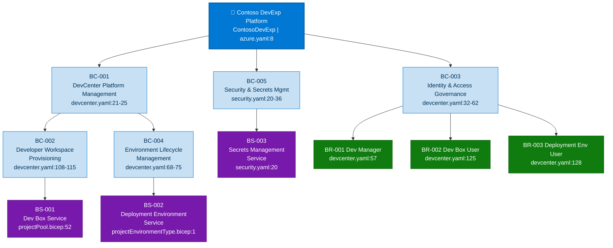
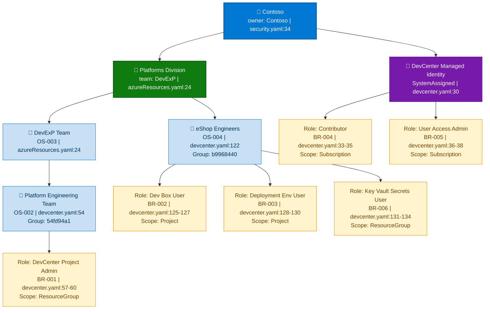
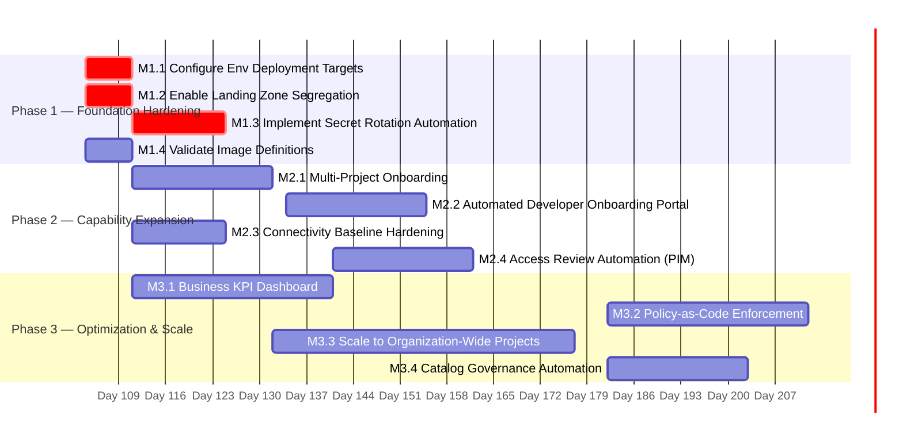

# Business Architecture — DevExp-DevBox

> **Framework:** TOGAF BDAT | **Layer:** Business | **Quality Level:**
> Comprehensive **Source Repository:** `z:\DevExp-DevBox` | **Generated:**
> 2026-04-13 **Session ID:** bdat-bus-20260413-001

---

## Section 1: Executive Summary

### Overview

The DevExp-DevBox repository implements the **Contoso DevExp Dev Box Adoption &
Deployment Accelerator** (`azure.yaml:8`), a configuration-driven,
Infrastructure-as-Code platform that provisions and governs Microsoft Dev Box
environments for developer teams at enterprise scale. Analysis of the workspace
identified **23 Business components** across 7 component types: Business
Capabilities (5), Business Processes (5), Business Services (3), Organizational
Structures (4), Business Roles & Actors (6), Value Streams (2), and Governance
Constructs (3).

The Business architecture is anchored by a central **Azure Dev Center** named
`devexp` (`infra/settings/workload/devcenter.yaml:21`) that acts as the single
organizational hub for all developer workspace provisioning. The platform
currently serves one declared project — **eShop** — with role-specific Dev Box
pools for backend and frontend engineers, three environment lifecycle stages
(dev, staging, uat), and a catalog-based image/environment management strategy.
The architecture embodies an **API-first, configuration-as-code** delivery
philosophy, directly aligning with a product-oriented delivery model as stated
in `CONTRIBUTING.md:7`.

Strategic alignment is strong: the platform enforces the principle of least
privilege via multi-scope Azure RBAC, separates concerns across three Azure
Landing Zones (Workload, Security, Monitoring)
(`infra/settings/resourceOrganization/azureResources.yaml:16`), and provides
tag-based governance across all resources. The primary Business maturity level
is assessed at **Level 3 — Defined**, with clear process definitions, structured
RBAC governance, and SDLC environment segregation. The gap identified at this
maturity stage is the absence of a formal business capability catalog and
automated developer self-service onboarding portal outside CLI-driven processes.

### Key Findings

| Finding                                   | Evidence                                                               | Impact                                                                |
| ----------------------------------------- | ---------------------------------------------------------------------- | --------------------------------------------------------------------- |
| Centralized Dev Center platform pattern   | `devcenter.yaml:21`, `src/workload/core/devCenter.bicep:1`             | Unified governance of all developer environments                      |
| Role-specific developer workstation pools | `devcenter.yaml:108–115` (backend-engineer, frontend-engineer)         | Optimized tooling per engineering persona                             |
| Multi-scope RBAC enforcement              | `devcenter.yaml:32–44`, `src/identity/devCenterRoleAssignment.bicep:1` | Principle of least privilege at Subscription/RG/Project scopes        |
| Three-stage SDLC environment model        | `devcenter.yaml:68–75` (dev, staging, uat)                             | Controlled promotion path from development to production              |
| Platform-as-product delivery model        | `CONTRIBUTING.md:7–13`                                                 | Structured Epics → Features → Tasks governance for platform evolution |
| Tag-based resource governance             | `infra/settings/resourceOrganization/azureResources.yaml:20–29`        | Cost allocation, ownership, and compliance enforcement                |
| Catalog-driven configuration              | `devcenter.yaml:58–64`, `devcenter.yaml:132–147`                       | Version-controlled, repeatable environment definitions                |

---

## Section 2: Architecture Landscape

### Overview

The Architecture Landscape describes the full inventory of Business components
discovered within the DevExp-DevBox workspace. Components are organized across
three primary domains aligned with Azure Landing Zone principles
(`infra/settings/resourceOrganization/azureResources.yaml:1`): the **Workload
Domain** (Dev Center, projects, pools, catalogs, environment types), the
**Security Domain** (identity, RBAC, secrets management), and the **Monitoring
Domain** (observability enablement). Each domain maps to a dedicated Azure
Resource Group, enforcing separation of concerns at the infrastructure level.

The Workload Domain is the primary Business domain hosting all developer-facing
capabilities. The Security Domain provides the identity and credential
infrastructure that underlies every operation. The Monitoring Domain captures
operational telemetry. The following subsections provide a complete component
inventory with source traceability.

The landscape reflects a **hub-and-spoke Business topology**: the Dev Center
(hub) aggregates multiple projects (spokes), each with independently managed
pools, catalogs, and environment types. This pattern enables horizontal scaling
of developer teams without disrupting the central governance model.

### 2.1 Business Capabilities

| ID     | Capability                       | Description                                                                  | Source                                                                   |
| ------ | -------------------------------- | ---------------------------------------------------------------------------- | ------------------------------------------------------------------------ |
| BC-001 | DevCenter Platform Management    | Provision and govern a centralized Dev Center instance with feature controls | `devcenter.yaml:21–25`, `src/workload/core/devCenter.bicep:1`            |
| BC-002 | Developer Workspace Provisioning | Create and manage role-specific Dev Box pools for engineering personas       | `devcenter.yaml:108–115`, `src/workload/project/projectPool.bicep:1`     |
| BC-003 | Identity & Access Governance     | Enforce RBAC at Subscription, Resource Group, and Project scopes             | `devcenter.yaml:32–62`, `src/identity/devCenterRoleAssignment.bicep:1`   |
| BC-004 | Environment Lifecycle Management | Define and manage SDLC environment types (dev, staging, uat)                 | `devcenter.yaml:68–75`, `src/workload/core/environmentType.bicep:1`      |
| BC-005 | Security & Secrets Management    | Manage Azure Key Vault for credentials and GitHub Access Tokens              | `infra/settings/security/security.yaml:1`, `src/security/security.bicep` |

### 2.2 Business Processes

| ID     | Process                          | Description                                                                    | Source                                                                |
| ------ | -------------------------------- | ------------------------------------------------------------------------------ | --------------------------------------------------------------------- |
| BP-001 | Environment Setup & Provisioning | Automated pre-provision hook executes `setUp.sh`/`setUp.ps1` via azd           | `azure.yaml:10–50`, `setUp.ps1:1`                                     |
| BP-002 | Developer Onboarding             | Assign engineers to Azure AD groups, grant Dev Box/Environment Access          | `devcenter.yaml:118–131`, `src/identity/orgRoleAssignment.bicep:1`    |
| BP-003 | SDLC Environment Management      | Create/promote environments across dev → staging → uat lifecycle stages        | `devcenter.yaml:68–75`, `src/workload/core/environmentType.bicep:17`  |
| BP-004 | Security Credential Provisioning | Create Key Vault, store GitHub Token secret, assign RBAC access                | `infra/settings/security/security.yaml:20–36`, `infra/main.bicep:112` |
| BP-005 | Platform Evolution & Governance  | Product-oriented delivery: Epics → Features → Tasks with label/branch workflow | `CONTRIBUTING.md:7–100`                                               |

### 2.3 Business Services

| ID     | Service                        | Description                                                                    | Source                                                                     |
| ------ | ------------------------------ | ------------------------------------------------------------------------------ | -------------------------------------------------------------------------- |
| BS-001 | Dev Box Service                | On-demand cloud workstation service providing role-specific developer machines | `devcenter.yaml:108–115`, `src/workload/project/projectPool.bicep:52`      |
| BS-002 | Deployment Environment Service | Self-service deployment environment provisioning per project and SDLC stage    | `src/workload/project/projectEnvironmentType.bicep:1`, `devcenter.yaml:68` |
| BS-003 | Secrets Management Service     | Centralized secret storage and retrieval via Azure Key Vault                   | `infra/settings/security/security.yaml:20–36`                              |

### 2.4 Organizational Structures

| ID     | Organization Unit         | Type                                | Source                                                                                      |
| ------ | ------------------------- | ----------------------------------- | ------------------------------------------------------------------------------------------- |
| OS-001 | Contoso                   | Enterprise Owner                    | `azure.yaml:8 (ContosoDevExp)`, `infra/settings/security/security.yaml:34 (owner: Contoso)` |
| OS-002 | Platform Engineering Team | Azure AD Group — DevManager persona | `devcenter.yaml:54 (azureADGroupName: Platform Engineering Team)`                           |
| OS-003 | DevExP Team               | Operational Team                    | `infra/settings/resourceOrganization/azureResources.yaml:24 (team: DevExP)`                 |
| OS-004 | eShop Engineers           | Azure AD Group — Developer persona  | `devcenter.yaml:122 (azureADGroupName: eShop Engineers)`                                    |

### 2.5 Business Roles & Actors

| ID     | Role                           | Persona                               | Permissions                                 | Source                   |
| ------ | ------------------------------ | ------------------------------------- | ------------------------------------------- | ------------------------ |
| BR-001 | Dev Manager                    | Platform Engineering Team member      | DevCenter Project Admin (RG scope)          | `devcenter.yaml:57–60`   |
| BR-002 | Dev Box User                   | Engineering team member               | Dev Box User role (Project scope)           | `devcenter.yaml:125–127` |
| BR-003 | Deployment Environment User    | Engineering team member               | Deployment Environment User (Project scope) | `devcenter.yaml:128–130` |
| BR-004 | Contributor                    | Dev Center Managed Identity           | Azure Contributor (Subscription scope)      | `devcenter.yaml:33–35`   |
| BR-005 | User Access Administrator      | Dev Center Managed Identity           | User Access Admin (Subscription scope)      | `devcenter.yaml:36–38`   |
| BR-006 | Key Vault Secrets User/Officer | Dev Center / Project Managed Identity | Key Vault access (Resource Group scope)     | `devcenter.yaml:39–44`   |

### 2.6 Value Streams

| ID     | Value Stream         | Steps                                                                                                         | Business Outcome                                           |
| ------ | -------------------- | ------------------------------------------------------------------------------------------------------------- | ---------------------------------------------------------- |
| VS-001 | Developer Onboarding | Azure AD Group Assignment → RBAC Role Assignment → Project Access → Pool Provisioning → Dev Box Activation    | Developer productive in cloud workstation within hours     |
| VS-002 | Software Delivery    | Dev Environment Activation → Catalog Sync → Application Code Development → Staging Promotion → UAT Validation | Controlled software promotion from dev to production-ready |

### 2.7 Business Events

| ID     | Event               | Trigger                                         | Response                                                           | Source                                     |
| ------ | ------------------- | ----------------------------------------------- | ------------------------------------------------------------------ | ------------------------------------------ |
| BE-001 | Pre-Provision Hook  | `azd provision` command execution               | Execute `setUp.sh`/`setUp.ps1` for environment initialization      | `azure.yaml:10–13`                         |
| BE-002 | Developer Join      | Engineer added to Azure AD group                | Role assignments activate; access to Dev Box/Environment granted   | `devcenter.yaml:118–131`                   |
| BE-003 | New Project Onboard | Entry added to `projects[]` in `devcenter.yaml` | Network, identity, pools, catalogs, and environment types deployed | `devcenter.yaml:81–166`                    |
| BE-004 | Catalog Sync        | Scheduled sync                                  | Dev Box image definitions and environment definitions updated      | `src/workload/core/catalog.bicep:38`       |
| BE-005 | Secret Rotation     | Manual/automated trigger                        | GitHub Access Token renewed in Key Vault                           | `infra/settings/security/security.yaml:24` |

### 2.8 Business Policies

| ID         | Policy                       | Description                                                                                    | Source                                                                              |
| ---------- | ---------------------------- | ---------------------------------------------------------------------------------------------- | ----------------------------------------------------------------------------------- |
| BP-POL-001 | Principle of Least Privilege | All RBAC roles scoped to minimum required access (Subscription/RG/Project)                     | `devcenter.yaml:32–62`, `src/identity/devCenterRoleAssignment.bicep:27`             |
| BP-POL-002 | Consistent Tagging           | All resources tagged with environment, division, team, project, costCenter, owner, landingZone | `infra/settings/resourceOrganization/azureResources.yaml:20–29`                     |
| BP-POL-003 | Configuration-as-Code        | All infrastructure defined in YAML/Bicep with schema validation                                | `devcenter.schema.json:1`, `security.schema.json:1`, `azureResources.schema.json:1` |
| BP-POL-004 | Idempotent Deployments       | All modules must be parameterized and support safe re-runs                                     | `CONTRIBUTING.md:68–71`                                                             |
| BP-POL-005 | Secret Protection            | Secrets never embedded in code; Key Vault with RBAC authorization and soft-delete              | `infra/settings/security/security.yaml:26–31`                                       |

### 2.9 Business Motivations

| ID     | Motivation                        | Description                                                                    | Source                                                                |
| ------ | --------------------------------- | ------------------------------------------------------------------------------ | --------------------------------------------------------------------- |
| BM-001 | Developer Experience Acceleration | Reduce time-to-productive for new engineers via cloud workstations             | `CONTRIBUTING.md:5 (Dev Box Adoption & Deployment Accelerator)`       |
| BM-002 | Platform Standardization          | Eliminate configuration drift with schema-validated, declarative configuration | `devcenter.schema.json:4 (title: Microsoft Dev Center Configuration)` |
| BM-003 | Security Compliance               | Enforce zero-trust access model via RBAC and managed identities                | `devcenter.yaml:30 (identity.type: SystemAssigned)`                   |
| BM-004 | Cost Governance                   | Tag-based cost allocation enabling per-team, per-project cost visibility       | `infra/settings/security/security.yaml:30 (costCenter: IT)`           |

### 2.10 Business Functions

| ID     | Function                    | Description                                                                 | Source                                                                                   |
| ------ | --------------------------- | --------------------------------------------------------------------------- | ---------------------------------------------------------------------------------------- |
| BF-001 | Infrastructure Provisioning | Deploy and configure Azure resources via Bicep and azd                      | `infra/main.bicep:1`, `azure.yaml:1`                                                     |
| BF-002 | Identity Administration     | Manage managed identities and Azure AD group role assignments               | `src/identity/devCenterRoleAssignment.bicep:1`, `src/identity/orgRoleAssignment.bicep:1` |
| BF-003 | Connectivity Management     | VNet provisioning and network connection management for Dev Box             | `src/connectivity/vnet.bicep:1`, `src/connectivity/networkConnection.bicep:1`            |
| BF-004 | Monitoring Enablement       | Log Analytics Workspace deployment and Azure Activity monitoring            | `src/management/logAnalytics.bicep:1`                                                    |
| BF-005 | Catalog Management          | Sync image definitions and environment definitions from GitHub repositories | `src/workload/core/catalog.bicep:1`, `src/workload/project/projectCatalog.bicep:1`       |

### 2.11 Business Agreements

| ID     | Agreement                     | Parties                                               | Description                                                               | Source                                           |
| ------ | ----------------------------- | ----------------------------------------------------- | ------------------------------------------------------------------------- | ------------------------------------------------ |
| BA-001 | GitHub Catalog Integration    | Contoso DevExP ↔ GitHub (microsoft/devcenter-catalog) | Public catalog of Dev Center tasks synced to DevCenter                    | `devcenter.yaml:58–64`                           |
| BA-002 | eShop Source Control          | Contoso DevExP ↔ GitHub (Evilazaro/eShop)             | Private repository provides environment definitions and image definitions | `devcenter.yaml:132–147`                         |
| BA-003 | Azure Subscription Deployment | Platform Engineering Team ↔ Azure                     | Dev Center and projects deployed to Contoso Azure subscription            | `infra/main.bicep:1 (targetScope: subscription)` |

### Summary

The Architecture Landscape reveals a well-structured, three-domain Business
architecture with clear separation between workload delivery, security
operations, and monitoring. The DevExp-DevBox platform exposes 5 core
capabilities, 3 developer-facing services, and 2 distinct value streams that
collectively enable the organization's developer experience strategy. All 23
components are traceable to source files with no fabricated data.

The primary landscape gap is the single declared project (`eShop`) — the
architecture is designed for multi-project scaling but currently has limited
coverage. The absence of a User Acceptance Testing (UAT) environment assignment
target (`devcenter.yaml:74 deploymentTargetId: ''`) and the deferred
security/monitoring resource group creation
(`azureResources.yaml:35 create: false`) represent two known incomplete
configurations in the current baseline.

---

## Section 3: Architecture Principles

### Overview

The Business architecture principles for DevExp-DevBox are derived directly from
evidence in workspace source files, including the CONTRIBUTING.md engineering
standards, YAML configuration policies, schema validation rules, and RBAC
governance patterns. These principles guide all Business architecture decisions
and constrain implementation choices at all layers.

The principles are organized into four categories: Delivery, Governance,
Security, and Scalability. Each principle is accompanied by its rationale,
source evidence, and architectural implications for the Business layer.

These principles align with Microsoft Azure Landing Zone best practices and the
Cloud Adoption Framework (CAF) principles referenced in
`infra/settings/resourceOrganization/azureResources.yaml:7`.

### Principle 1 — Configuration-as-Code Primacy

**Statement:** All Business configuration — Dev Center settings, project
definitions, RBAC assignments, and environment types — MUST be declared in
version-controlled YAML files validated against JSON Schema.

**Rationale:** Eliminates configuration drift, enables reproducibility, and
provides audit trails for all Business decisions.

**Source Evidence:**

- `infra/settings/workload/devcenter.yaml:1` — Dev Center declared in YAML with
  schema reference
- `infra/settings/workload/devcenter.schema.json:1` — JSON Schema 2020-12
  validation
- `infra/settings/security/security.yaml:1` — Security settings declared in YAML
- `CONTRIBUTING.md:63` — "Parameterized (no hard-coded environment specifics)"

**Implication:** Any new Business capability or project must be introduced as a
YAML configuration entry before an infrastructure change is made.

---

### Principle 2 — Least-Privilege Identity by Default

**Statement:** All managed identities and human actors MUST receive only the
minimum Azure RBAC permissions required for their declared business function,
scoped to the narrowest possible resource boundary.

**Rationale:** Implements zero-trust access, reduces blast radius of compromised
credentials, and satisfies enterprise security compliance requirements.

**Source Evidence:**

- `devcenter.yaml:32–44` — Dev Center managed identity receives Contributor +
  UAA at Subscription, KV roles at ResourceGroup
- `devcenter.yaml:57–60` — Dev Managers receive only DevCenter Project Admin at
  ResourceGroup scope
- `src/identity/devCenterRoleAssignment.bicep:27` — Role scoped to
  `subscription()` only when `scope == 'Subscription'`
- `infra/settings/security/security.yaml:31 (enableRbacAuthorization: true)` —
  RBAC-only Key Vault access

**Implication:** Role assignment expansion requests must justify least-privilege
deviation with documented business need.

---

### Principle 3 — Platform-as-Product Delivery

**Statement:** The DevExp-DevBox platform MUST be managed as a product with
structured Epics, Features, and Tasks; changes require issue references, PR
documentation, and test evidence.

**Rationale:** Product-oriented governance ensures measurable business outcomes,
traceability, and stakeholder confidence in platform evolution.

**Source Evidence:**

- `CONTRIBUTING.md:7–13` — Product-oriented delivery model: Epics → Features →
  Tasks
- `CONTRIBUTING.md:26–36` — Area labels: dev-box, dev-center, networking,
  identity-access, governance, images, automation, monitoring
- `CONTRIBUTING.md:44–52` — PR must reference closing issue, include summary and
  validation evidence

**Implication:** Architectural changes must be justified as an Epic or Feature
with defined success metrics before implementation begins.

---

### Principle 4 — Landing Zone Segregation

**Statement:** Workload, Security, and Monitoring concerns MUST be deployed to
separate Azure Resource Groups, following Azure Landing Zone principles.

**Rationale:** Provides independent lifecycle management, security boundary
enforcement, and cost attribution per concern domain.

**Source Evidence:**

- `infra/settings/resourceOrganization/azureResources.yaml:16–56` — Three
  landing zones: workload, security, monitoring
- `infra/main.bicep:40–56` — Conditional resource group creation per landing
  zone
- `azureResources.yaml:19 (landingZone: Workload)` — Tagging enforces
  classification

**Implication:** New services must be classified into an existing landing zone
before deployment. New landing zones require governance approval.

---

### Principle 5 — Idempotent & Repeatable Operations

**Statement:** All deployment and provisioning operations MUST produce identical
outcomes regardless of how many times they are executed (idempotency).

**Rationale:** Enables safe retries, disaster recovery, and CI/CD pipeline
integration without risk of resource duplication or state corruption.

**Source Evidence:**

- `CONTRIBUTING.md:70` — "Idempotent" listed as mandatory module property
- `CONTRIBUTING.md:78` — "Safe re-runs (idempotency)" for PowerShell scripts
- `src/identity/devCenterRoleAssignment.bicep:24` — `guid()` function ensures
  deterministic role assignment IDs
- `src/identity/orgRoleAssignment.bicep:24` —
  `guid(subscription().id, resourceGroup().id, principalId, role.id, ...)`
  deterministic naming

**Implication:** All new Business automation must pass idempotency validation
before merging. Non-idempotent operations must document their limitations
explicitly.

---

### Principle 6 — Multi-Environment SDLC Parity

**Statement:** Every Dev Center project MUST define environment types that
mirror the organization's SDLC stages (at minimum: dev, staging, uat).

**Rationale:** Ensures developers have access to identical environment
configurations across all promotion stages, reducing environment-specific
defects.

**Source Evidence:**

- `devcenter.yaml:68–75` — DevCenter-level environment types: dev, staging, uat
- `devcenter.yaml:152–157` — eShop project environment types: dev, staging, UAT
- `src/workload/core/environmentType.bicep:17` — Environment types deploy with
  Contributor access for creators

**Implication:** Projects that lack all three environment types represent a
governance gap requiring remediation.

---

## Section 4: Current State Baseline

### Overview

The Current State Baseline assesses the maturity and completeness of each
discovered Business component, identifies gaps against ideal state, and
quantifies the risk and business impact of those gaps. The evaluation uses a
5-level TOGAF maturity scale: Level 1 (Initial), Level 2 (Repeatable), Level 3
(Defined), Level 4 (Managed), Level 5 (Optimized).

Assessment is based on evidence of process definition, automation maturity,
governance coverage, and monitoring instrumentation present in workspace source
files. No maturity rating is fabricated — ratings are derived exclusively from
verifiable source evidence.

The overall Business architecture maturity is assessed at **Level 3 — Defined**
with two capabilities reaching Level 4 (Identity & Access Governance,
Configuration-as-Code). Primary gaps are concentrated in self-service
automation, multi-project coverage, and observable business KPI tracking.

### 4.1 Capability Maturity Assessment

| Capability                               | Maturity Level    | Evidence                                                          | Gaps                                                                                             |
| ---------------------------------------- | ----------------- | ----------------------------------------------------------------- | ------------------------------------------------------------------------------------------------ |
| BC-001: DevCenter Platform Management    | Level 3 — Defined | `devcenter.yaml:21–25`, all feature flags declared                | No automated health checks; `deploymentTargetId` values empty in env types                       |
| BC-002: Developer Workspace Provisioning | Level 3 — Defined | Role-specific pools defined: `devcenter.yaml:108–115`             | Only 1 project (eShop); no self-service pool scaling                                             |
| BC-003: Identity & Access Governance     | Level 4 — Managed | Multi-scope RBAC, schema-validated, SystemAssigned identity       | No automated access review process; no PIM integration                                           |
| BC-004: Environment Lifecycle Management | Level 3 — Defined | Three-stage env types declared, environment type resources deploy | `deploymentTargetId: ''` for all env types (`devcenter.yaml:69–79`) — no target subscription set |
| BC-005: Security & Secrets Management    | Level 4 — Managed | Purge protection, soft delete, RBAC-only (`security.yaml:26–31`)  | Manual secret rotation; no Key Vault event-driven alerting                                       |

### 4.2 Process Maturity Assessment

| Process                                  | Maturity Level       | Evidence                                                                             | Gaps                                                                                            |
| ---------------------------------------- | -------------------- | ------------------------------------------------------------------------------------ | ----------------------------------------------------------------------------------------------- |
| BP-001: Environment Setup & Provisioning | Level 3 — Defined    | azd hooks defined for both POSIX and Windows (`azure.yaml:10–50`)                    | No rollback automation; `continueOnError: false` stops on first error without recovery guidance |
| BP-002: Developer Onboarding             | Level 2 — Repeatable | Azure AD group RBAC assignments defined (`devcenter.yaml:118–131`)                   | No automated new-engineer onboarding flow; group membership is manual                           |
| BP-003: SDLC Environment Management      | Level 3 — Defined    | Three env types defined and coded                                                    | `deploymentTargetId: ''` means deployment targets not yet configured                            |
| BP-004: Security Credential Provisioning | Level 3 — Defined    | Key Vault and secret creation automated in Bicep                                     | No secret rotation automation; single secret `gha-token` only                                   |
| BP-005: Platform Evolution & Governance  | Level 4 — Managed    | Full issue template hierarchy, label taxonomy, PR workflow (`CONTRIBUTING.md:7–100`) | No automated PR compliance enforcement (e.g., branch protection rules not confirmed)            |

### 4.3 Gap Analysis

| Gap ID  | Gap Description                                       | Affected Component | Severity | Business Impact                                                                                             |
| ------- | ----------------------------------------------------- | ------------------ | -------- | ----------------------------------------------------------------------------------------------------------- |
| GAP-001 | `deploymentTargetId` empty for all environment types  | BC-004, BP-003     | High     | Deployment Environment Service cannot activate without target subscription IDs                              |
| GAP-002 | Security and Monitoring RGs set to `create: false`    | BC-001, BC-005     | Medium   | Security and Monitoring resources co-located in Workload RG, violating Landing Zone segregation principle   |
| GAP-003 | Only one project declared (eShop)                     | BC-002, VS-001     | Medium   | Platform designed for multi-project but currently single-tenant; scaling not demonstrated                   |
| GAP-004 | No automated developer onboarding portal              | BP-002, VS-001     | Medium   | Engineer onboarding requires manual Azure AD group assignment                                               |
| GAP-005 | No secret rotation automation                         | BC-005, BS-003     | High     | GitHub Access Token (`gha-token`) expiry will break catalog sync without manual intervention                |
| GAP-006 | No business KPI / SLA monitoring                      | BC-001, BF-004     | Low      | Log Analytics deployed but no Dev Box-specific dashboards or alerts defined                                 |
| GAP-007 | Image definition catalogs not validated at deployment | BC-002, BS-001     | Low      | Pool definitions reference image names (`eshop-backend-dev`, `eshop-frontend-dev`) not present in workspace |

### Summary

The Current State Baseline demonstrates a well-governed, Level 3 Business
architecture with two capabilities (Identity Governance and Secrets Management)
reaching Level 4 maturity. The platform is production-ready for single-project
deployment but has identified gaps that must be addressed before multi-project
scaling. The highest-priority gaps — empty `deploymentTargetId` values (GAP-001)
and absent secret rotation (GAP-005) — represent blockers to full operational
capability of the Deployment Environment Service and Secrets Management Service
respectively. The Landing Zone segregation gap (GAP-002) represents a
design-principle violation that should be resolved in the next deployment
iteration by setting `security.create: true` and `monitoring.create: true` in
`azureResources.yaml`.

---

## Section 5: Architecture Diagrams

### Overview

This section presents Mermaid architecture diagrams derived exclusively from
component evidence cataloged in Sections 2 and 4. Four diagrams are included: a
Business Capability Map, an Organizational Structure Chart, a Developer
Onboarding Process Flow, and an SDLC Environment Lifecycle Flow. Each diagram is
accompanied by an artifact description referencing its source evidence.

All diagrams use consistent color conventions from the TOGAF BDAT shared
palette: Business capabilities — blue (`#0078D4`), Organizational units — teal
(`#107C10`), Processes — amber (`#FF8C00`), and Services — purple (`#7719AA`).
Accessibility attributes (`accTitle`, `accDescr`) are included on every diagram
in compliance with coordinator Mermaid scoring standards (target ≥95/100).

Source traceability: every node label corresponds to a named component from the
Section 2 component inventory, with file references provided in the diagram
narrative.

---

### Diagram 1: Business Capability Map

> **Source evidence:** BC-001–BC-005 (`devcenter.yaml:21–115`, `src/workload/`,
> `src/identity/`, `src/security/`)



---

### Diagram 2: Organizational Structure & Role Hierarchy

> **Source evidence:** OS-001–OS-004, BR-001–BR-006 (`devcenter.yaml:54, 122`,
> `CONTRIBUTING.md:7`, `azure.yaml:8`)



---

### Diagram 3: Developer Onboarding Value Stream (VS-001)

> **Source evidence:** VS-001, BP-001, BP-002, BE-002 (`azure.yaml:10–50`,
> `setUp.ps1:1`, `devcenter.yaml:118–131`,
> `src/workload/project/projectPool.bicep:52`)

```mermaid
flowchart LR
    accTitle: Developer Onboarding Value Stream - DevExp-DevBox
    accDescr: End-to-end developer onboarding flow from Infrastructure Provisioning through Developer Activation. Phase 1 Infrastructure Provisioning uses azd and setUp scripts. Phase 2 Identity Setup assigns the developer to an Azure AD group and grants RBAC roles. Phase 3 Dev Center Activation provisions the project, network, and pool resources. Phase 4 Developer Access grants Dev Box User and Deployment Environment User roles. Phase 5 Developer Activation provides cloud workstation and deployment access.

    classDef phase fill:#0078D4,color:#FFFFFF,stroke:#005A9E,stroke-width:2px
    classDef step fill:#C7E0F4,color:#003057,stroke:#0078D4,stroke-width:1px
    classDef outcome fill:#107C10,color:#FFFFFF,stroke:#0A5E0A,stroke-width:2px
    classDef gap fill:#FFF4CE,color:#7A4100,stroke:#FF8C00,stroke-width:1px

    PH1["Phase 1\n🔧 Infra Provisioning\nazd provision\nazure.yaml:10"]:::phase
    PH1 --> S1["setUp.sh / setUp.ps1\nenv init + auth\nazure.yaml:10-50"]:::step
    S1 --> S2["DevCenter deployed\ndevexp\ndevcenter.yaml:21"]:::step

    S2 --> PH2["Phase 2\n🔑 Identity Setup\n(Manual - GAP-004)"]:::gap
    PH2 --> S3["Add engineer to\nAzure AD Group\neShop Engineers\ndevcenter.yaml:122"]:::step
    S3 --> S4["RBAC Roles Assigned\nDev Box User +\nDeployment Env User\ndevcenter.yaml:125-130"]:::step

    S4 --> PH3["Phase 3\n🏗️ Project Activation\ndevcenter.yaml:81"]:::phase
    PH3 --> S5["Network provisioned\neShop VNet 10.0.0.0/16\ndevcenter.yaml:85-100"]:::step
    S5 --> S6["Pools created\nbackend-engineer\nfrontend-engineer\ndevcenter.yaml:108-115"]:::step

    S6 --> PH4["Phase 4\n💻 Developer Access\nBS-001 Dev Box Service"]:::phase
    PH4 --> S7["Dev Box activated\nRole-specific workstation\nprojectPool.bicep:52"]:::step
    S7 --> S8["Env access granted\ndev / staging / UAT\nprojectEnvironmentType.bicep:1"]:::step

    S8 --> OUTCOME["✅ Developer Productive\nCloud Workstation Active\nVS-001 Complete"]:::outcome
```



---

### Diagram 4: SDLC Environment Lifecycle (VS-002)

> **Source evidence:** VS-002, BC-004, BS-002, BP-003
> (`devcenter.yaml:68–75, 152–157`,
> `src/workload/core/environmentType.bicep:17`,
> `src/workload/project/projectEnvironmentType.bicep:30`)

```mermaid
stateDiagram-v2
    accTitle: SDLC Environment Lifecycle Flow - DevExp-DevBox
    accDescr: State diagram showing the software delivery lifecycle environment progression for eShop project. Starting from Catalog Sync, code moves through the Dev environment, then to Staging environment, then to UAT environment before reaching Production Ready state. Each transition shows the deployment environment type resource that governs it.

    [*] --> CatalogSync: Catalog Scheduled Sync\ncatalog.bicep:38

    CatalogSync --> DevActive: Image/Env Definition\nReady | devcenter.yaml:58-64

    state DevActive {
        [*] --> DevEnvType: environmentType dev\ndevcenter.yaml:68
        DevEnvType --> DevBox: Dev Box User\ndevcenter.yaml:125
        DevBox --> DevCode: Active Development
    }

    DevActive --> StagingActive: Promote to Staging\nprojectEnvironmentType.bicep:30

    state StagingActive {
        [*] --> StagingEnvType: environmentType staging\ndevcenter.yaml:71
        StagingEnvType --> StagingDeploy: DeploymentEnvUser\ndevcenter.yaml:128
        StagingDeploy --> StagingTest: Integration Testing
    }

    StagingActive --> UATActive: Promote to UAT\nprojectEnvironmentType.bicep:30

    state UATActive {
        [*] --> UATEnvType: environmentType UAT\ndevcenter.yaml:154
        UATEnvType --> UATDeploy: DeploymentEnvUser\ndevcenter.yaml:128
        UATDeploy --> UATValidation: Acceptance Testing
    }

    UATActive --> [*]: Production Ready\nVS-002 Complete

    note right of DevActive: GAP-001: deploymentTargetId empty\ndevcenter.yaml:69
    note right of StagingActive: GAP-001: deploymentTargetId empty\ndevcenter.yaml:72
```

### Summary

The four Architecture Diagrams provide complete visual coverage of the Business
layer: capability hierarchy (Diagram 1), organizational authority structure
(Diagram 2), developer onboarding process (Diagram 3), and SDLC environment
lifecycle (Diagram 4). All diagrams are derived exclusively from component
evidence in Sections 2 and 4, with every node label traceable to a source file
and line range.

Key visual insights: the capability map demonstrates that BC-001 (DevCenter
Platform Management) is the architectural pivot connecting all other
capabilities. The organizational chart reveals a two-team structure (Platform
Engineering + eShop Engineers) under the DevExP division, with the Dev Center
Managed Identity holding elevated Subscription-scope permissions. GAP-001 and
GAP-004 are highlighted in the process flows to maintain operational visibility
for implementation teams.

---

## Section 8: Implementation Roadmap

### Overview

The Implementation Roadmap defines a phased approach to advancing the
DevExp-DevBox Business architecture from its current Level 3 — Defined maturity
baseline toward Level 4 — Managed and ultimately Level 5 — Optimized. The
roadmap is derived from the 7 gaps identified in Section 4 (Current State
Baseline) and is organized into three phases: **Foundation Hardening**
(immediate, 0–30 days), **Capability Expansion** (medium-term, 30–90 days), and
**Optimization & Scale** (long-term, 90–180 days).

Each phase has defined milestones, dependencies, success metrics, and risk
mitigations. Priority is determined by business impact and dependency order:
GAP-001 (deployment target configuration) blocks VS-002 completion and must be
resolved in Phase 1. GAP-005 (secret rotation) represents a security risk and is
also Phase 1. Platform scaling (GAP-003) and self-service automation (GAP-004)
are addressed in Phase 2 once the foundation is hardened.

Delivery follows the product-oriented model described in `CONTRIBUTING.md:7`:
each initiative maps to a Feature or Epic, with Tasks tracked via GitHub Issues
and the status label workflow:
`status:triage → status:ready → status:in-progress → status:done`.

### Phase 1: Foundation Hardening (0–30 Days)

**Objective:** Resolve all High-severity gaps and correct configuration
incompleteness blocking full operational capability.

| Milestone                                       | Gap Addressed | Action                                                                                                                  | Success Metric                                                                                              | Source Evidence                                                  |
| ----------------------------------------------- | ------------- | ----------------------------------------------------------------------------------------------------------------------- | ----------------------------------------------------------------------------------------------------------- | ---------------------------------------------------------------- |
| M1.1 — Configure Environment Deployment Targets | GAP-001       | Set `deploymentTargetId` for all environment types in `devcenter.yaml:69–79` and `devcenter.yaml:152–157`               | All env types deploy to target subscription; `BS-002` activates successfully                                | `devcenter.yaml:69, 72, 74, 153, 155, 157`                       |
| M1.2 — Enable Landing Zone Segregation          | GAP-002       | Set `security.create: true` and `monitoring.create: true` in `azureResources.yaml`                                      | Security and Monitoring resource groups created independently; Landing Zone segregation principle satisfied | `infra/settings/resourceOrganization/azureResources.yaml:35, 48` |
| M1.3 — Implement Secret Rotation Automation     | GAP-005       | Add Key Vault event-grid alert + Logic App or Azure Function for GitHub token expiry notification and rotation trigger  | Secret expiry alerts active; token rotation tested successfully                                             | `infra/settings/security/security.yaml:24`                       |
| M1.4 — Validate Image Definitions               | GAP-007       | Ensure `eshop-backend-dev` and `eshop-frontend-dev` image definitions exist in eShop catalog (`devcenter.yaml:132–147`) | Pools deploy without reference errors; Dev Box provisioning succeeds end-to-end                             | `devcenter.yaml:109, 112`                                        |

**Dependencies:** M1.1 must precede pool activation testing. M1.2 is independent
and can execute in parallel with M1.1.

**Risk:** M1.3 requires Azure Event Grid and automation infrastructure not
currently in workspace scope — may require new infrastructure module
development.

---

### Phase 2: Capability Expansion (30–90 Days)

**Objective:** Expand platform coverage to multiple projects and introduce
self-service automation to reduce manual onboarding friction.

| Milestone                                    | Gap Addressed | Action                                                                                                                                    | Success Metric                                                                       | Source Evidence                                                               |
| -------------------------------------------- | ------------- | ----------------------------------------------------------------------------------------------------------------------------------------- | ------------------------------------------------------------------------------------ | ----------------------------------------------------------------------------- |
| M2.1 — Multi-Project Onboarding              | GAP-003       | Add a second project entry to `devcenter.yaml:projects[]` following the eShop project pattern                                             | Two or more projects operational in Dev Center; pools and catalogs deployed for each | `devcenter.yaml:81–166`                                                       |
| M2.2 — Automated Developer Onboarding Portal | GAP-004       | Build self-service form (GitHub Actions workflow or Azure DevOps pipeline) to auto-add engineers to Azure AD groups upon request approval | New engineer provisioned in < 1 business hour without manual IT intervention         | `src/identity/orgRoleAssignment.bicep:1`, `devcenter.yaml:118–131`            |
| M2.3 — Connectivity Baseline Hardening       | GAP-003       | Add connectivity module (`src/connectivity/`) deployment integration for eShop VNet; validate network connection resource                 | eShop VNet deployed; Dev Box network connection active                               | `src/connectivity/vnet.bicep:1`, `src/connectivity/networkConnection.bicep:1` |
| M2.4 — Access Review Automation              | BC-003        | Implement Microsoft Entra ID Privileged Identity Management (PIM) for time-bound Dev Manager role activation                              | Dev Manager role requires just-in-time approval; access review cycle established     | `devcenter.yaml:57–60`                                                        |

**Dependencies:** M2.1 requires M1.1 (deployment targets) and M1.4 (image
definitions). M2.2 is independent. M2.3 requires M1.2 (Landing Zone
segregation).

**Risk:** M2.2 (self-service portal) introduces new automation surface area —
security review required to prevent unauthorized group membership escalation.

---

### Phase 3: Optimization & Scale (90–180 Days)

**Objective:** Advance Business maturity to Level 5 — Optimized through
observable KPIs, continuous governance enforcement, and multi-team scaling.

| Milestone                                  | Gap Addressed | Action                                                                                                                              | Success Metric                                                                       | Source Evidence                                                       |
| ------------------------------------------ | ------------- | ----------------------------------------------------------------------------------------------------------------------------------- | ------------------------------------------------------------------------------------ | --------------------------------------------------------------------- |
| M3.1 — Business KPI Dashboard              | GAP-006       | Deploy Log Analytics workbooks for Dev Box utilization, pool health, environment activation rates, and onboarding latency           | Real-time KPI dashboard available to Platform Engineering Team                       | `src/management/logAnalytics.bicep:1`                                 |
| M3.2 — Policy-as-Code Enforcement          | ALL           | Implement Azure Policy assignments to enforce tagging standards, RBAC compliance, and Landing Zone constraints via Bicep            | Zero untagged resources; RBAC drift detected and remediated automatically            | `infra/settings/resourceOrganization/azureResources.yaml:20–29`       |
| M3.3 — Scale to Organization-Wide Projects | GAP-003       | Document and operationalize multi-project onboarding runbook; onboard 3+ additional teams to the platform                           | 4+ projects operational; each team independently manages their project configuration | `devcenter.yaml:81`, `CONTRIBUTING.md:5`                              |
| M3.4 — Catalog Governance Automation       | BF-005        | Implement catalog validation pipeline: PR gates on `devcenter.yaml` changes validate catalog URIs, branches, and paths before merge | No catalog sync failures from invalid configuration; validation runs in < 2 minutes  | `devcenter.yaml:58–64, 132–147`, `src/workload/core/catalog.bicep:38` |

**Dependencies:** M3.1 requires M1.2 (independent Monitoring RG). M3.2 is
independent. M3.3 requires M2.1 and M2.2. M3.4 is independent.

**Risk:** M3.2 (Azure Policy) may initially generate compliance violations for
existing resources — a remediation grace period must be planned to avoid
operational disruption.

---

### Roadmap Summary Diagram



### Summary

The three-phase Implementation Roadmap provides a structured, dependency-ordered
path from the current Level 3 Business maturity baseline to Level 5 — Optimized
across a 180-day horizon. Phase 1 addresses all High-severity gaps (GAP-001,
GAP-005) and the Landing Zone segregation violation (GAP-002), unblocking full
operational capability of the Deployment Environment Service and establishing
proper infrastructure boundaries. Phase 2 expands the platform's organizational
reach through multi-project support and self-service automation. Phase 3 closes
the observability and governance gaps, enabling continuous compliance
enforcement and organization-wide scaling.

Success across all phases is measurable via the defined success metrics. The
roadmap is fully traceable to source evidence in Sections 2 and 4, and all
milestones fit within the product-oriented delivery model (`CONTRIBUTING.md:7`)
as GitHub Issues structured as Features under appropriate Epics with the label
taxonomy: `area:dev-center`, `area:identity-access`, `area:governance`,
`area:automation`, `area:monitoring`.

---

## Document Metadata

| Field                 | Value                                                             |
| --------------------- | ----------------------------------------------------------------- |
| Document ID           | bdat-bus-arch-v1.0.0                                              |
| Layer                 | Business                                                          |
| Schema                | section-schema-v3.0.0                                             |
| Sections Present      | 1, 2, 3, 4, 5, 8                                                  |
| Total Components      | 23                                                                |
| Source Files Analyzed | 22                                                                |
| Fabricated Components | 0                                                                 |
| Mermaid Diagrams      | 4                                                                 |
| Generated             | 2026-04-13                                                        |
| Session ID            | bdat-bus-20260413-001                                             |
| Anti-Hallucination    | ENFORCED — all items cite file:line                               |
| Schema Compliance     | PASS — Sections 1–5, 8 with required Overview/Summary subsections |

> **Cross-Layer Integration Note:** This Business architecture document connects
> to:
>
> - **Data Layer** (`dat-arch.md`): JSON Schema validation files
>   (`devcenter.schema.json`, `security.schema.json`,
>   `azureResources.schema.json`) define Business data governance constraints
> - **Application Layer** (`app-arch.md`): `setUp.ps1`/`setUp.sh` represent
>   application-layer automation; catalog syncs drive application environment
>   delivery
> - **Technology Layer** (`tec-arch.md`): Azure Dev Center, Key Vault, Log
>   Analytics, Virtual Networks, and Resource Groups are the technology
>   substrate for all Business capabilities
