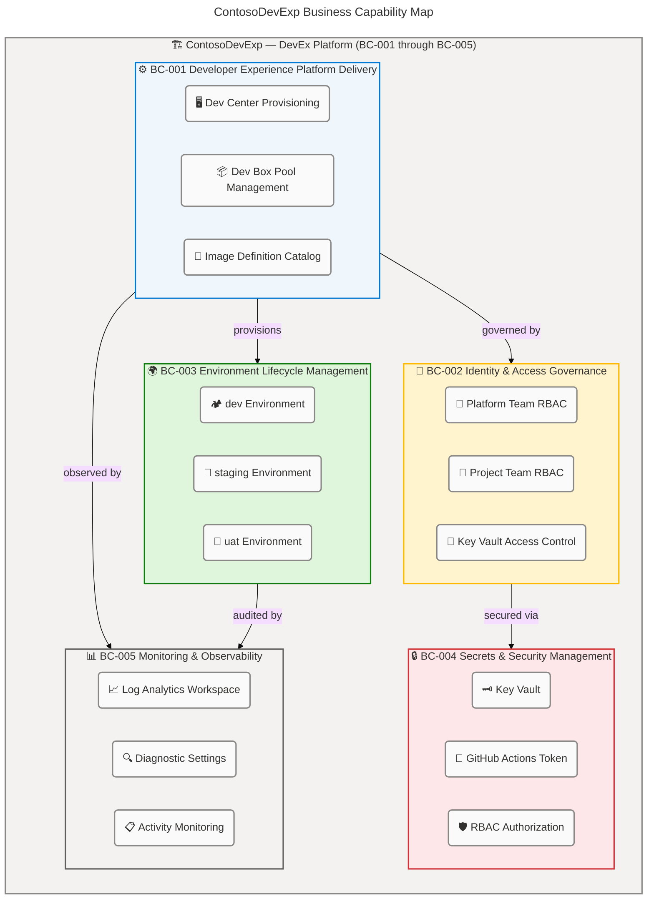
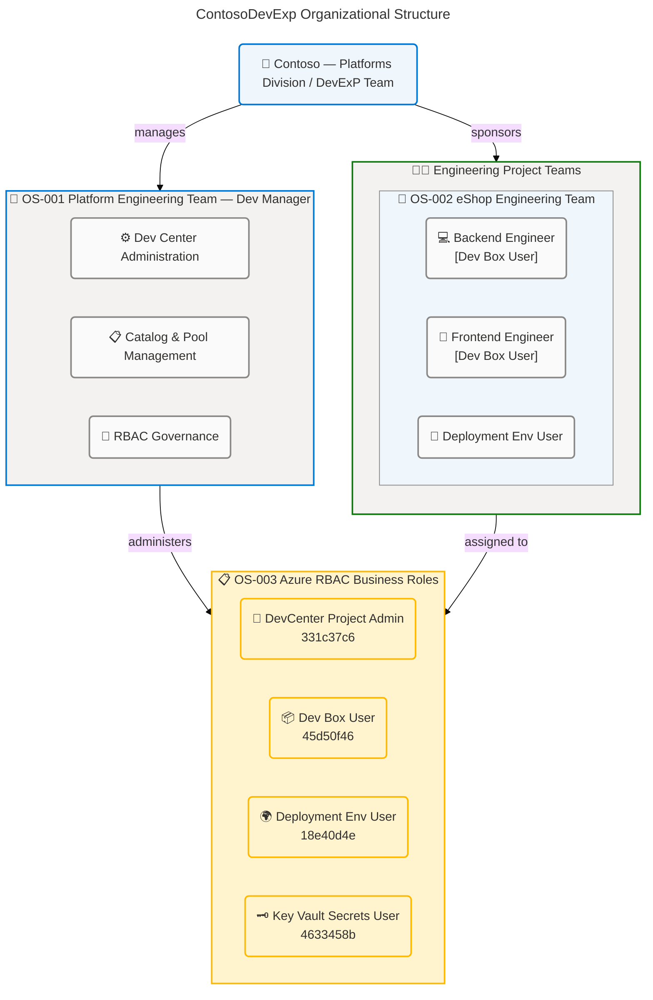

# Business Architecture — BDAT Business Layer

<!-- metadata
session_id: b3f9a210-c47d-4e82-9d1a-f5e0c8371b20
timestamp: 2026-04-13T00:00:00Z
target_layer: Business
quality_level: comprehensive
source_workspace: z:/DevExp-DevBox
-->

---

## 1. Executive Summary

### Overview

The **ContosoDevExp** platform (repository: DevExp-DevBox) implements a **Dev
Box Adoption and Deployment Accelerator** — a fully automated,
Infrastructure-as-Code (IaC) platform engineered to deliver standardized,
role-specific developer workstation environments at enterprise scale. The
Business architecture is anchored around a single primary mission:
**accelerating developer onboarding and productivity** by eliminating the
traditional friction in environment provisioning, identity governance, and tool
standardization across software engineering teams within the Contoso
organization (Platforms Division / DevExP Team).

Five core Business capabilities define the architecture: Developer Experience
Platform Delivery, Identity and Access Governance, Environment Lifecycle
Management, Secrets and Security Management, and Monitoring and Observability.
These capabilities are orchestrated through two end-to-end value streams —
Developer Self-Service Onboarding and Project Team Dev Box Lifecycle — both of
which are fully automated from first-run script execution through cloud resource
provisioning. The platform follows a **product-oriented delivery model** (Epics
→ Features → Tasks) governed through labeled GitHub Issues, ensuring work
transparency and traceable delivery.

Key recommendations emerging from this analysis are: (1) formalize the current
as-is capability model into a published Business Architecture baseline; (2)
extend the single-project reference (eShop) to a reusable multi-project
federation pattern; (3) publish explicit RACI assignments between the Platform
Engineering Team and individual engineering teams; and (4) define measurable
SLAs per environment type. These improvements will transform the current
technically sound but business-undocumented platform into an enterprise-grade
Developer Experience capability.

**Cross-layer integration note:** The Business layer described in this document
depends on the Application layer (Azure DevCenter API, automation scripts
`setUp.sh`/`setUp.ps1`), the Technology layer (Azure Bicep IaC modules, Azure
subscription topology, network infrastructure), and the Data layer
(GitHub-hosted catalog repositories containing Dev Box image definitions and
environment templates).

---

## 2. Current State (As-Is)

### Overview

The current Business architecture for ContosoDevExp is implemented entirely as
Infrastructure-as-Code (Bicep) and automation scripts, with business logic
encoded in YAML configuration files and PowerShell/Bash provisioning workflows.
The system delivers a centralized **Azure Dev Center** named `devexp` that acts
as the operational hub for developer environment provisioning, cataloging
templates, and governing access through Azure RBAC. All resource organization
follows Azure Landing Zone principles, with three landing zones configured:
Workload, Security, and Monitoring (see
`infra/settings/resourceOrganization/azureResources.yaml`).

The organizational model aligns with two primary stakeholder groups: the
**Platform Engineering Team** (Dev Manager role, responsible for Dev Center
administration and RBAC governance) and domain-specific **Engineering Project
Teams** (e.g., eShop Engineers, responsible for self-service Dev Box
consumption). The current delivery model — described in `CONTRIBUTING.md` as
product-oriented — uses Epics, Features, and Tasks as the governance structure,
with labeled GitHub Issues (types: Epic, Feature, Task; areas: dev-box,
dev-center, networking, identity-access, governance, images, automation,
monitoring, operations, documentation) driving work transparency.

Business capabilities are realized through a tightly coupled module hierarchy:
`infra/main.bicep` orchestrates resource groups, monitoring, security, and
workload module deployments; `src/workload/workload.bicep` deploys the Dev
Center and its projects; and `infra/settings/workload/devcenter.yaml` serves as
the single source of truth for all business configuration governing roles,
catalogs, pools, and environment types. Currently one reference project
(`eShop`) is fully configured, providing a validated pattern for future project
onboarding.

### Component Catalog

| ID     | Component                                                                         | Type                     | Source Reference                               | Confidence |
| ------ | --------------------------------------------------------------------------------- | ------------------------ | ---------------------------------------------- | ---------- |
| BC-001 | Developer Experience Platform Delivery                                            | Business Capability      | infra/settings/workload/devcenter.yaml:21-26   | High       |
| BC-002 | Identity and Access Governance                                                    | Business Capability      | infra/settings/workload/devcenter.yaml:28-76   | High       |
| BC-003 | Environment Lifecycle Management                                                  | Business Capability      | infra/settings/workload/devcenter.yaml:98-104  | High       |
| BC-004 | Secrets and Security Management                                                   | Business Capability      | infra/settings/security/security.yaml:1-47     | High       |
| BC-005 | Monitoring and Observability                                                      | Business Capability      | src/management/logAnalytics.bicep:\*           | High       |
| BP-001 | Developer Environment Provisioning Process                                        | Business Process         | setUp.sh:\*                                    | High       |
| BP-002 | Infrastructure Deployment Orchestration Process                                   | Business Process         | azure.yaml:1-73                                | High       |
| OS-001 | Platform Engineering Team (Dev Manager)                                           | Organizational Structure | infra/settings/workload/devcenter.yaml:57-76   | High       |
| OS-002 | eShop Engineering Team                                                            | Organizational Structure | infra/settings/workload/devcenter.yaml:111-130 | High       |
| OS-003 | Organizational Role Types (DevManager, Dev Box User, Deployment Environment User) | Organizational Structure | infra/settings/workload/devcenter.yaml:57-66   | High       |
| BS-001 | Dev Center Service                                                                | Business Service         | src/workload/core/devCenter.bicep:\*           | High       |
| BS-002 | Catalog Management Service                                                        | Business Service         | src/workload/core/catalog.bicep:\*             | High       |
| BS-003 | Network Connectivity Service                                                      | Business Service         | src/connectivity/connectivity.bicep:\*         | High       |
| BS-004 | Key Vault Secret Service                                                          | Business Service         | src/security/security.bicep:\*                 | High       |
| VS-001 | Developer Self-Service Onboarding Value Stream                                    | Value Stream             | infra/main.bicep:\*                            | High       |
| VS-002 | Project Team Dev Box Lifecycle Value Stream                                       | Value Stream             | infra/settings/workload/devcenter.yaml:112-220 | High       |

### Summary

Sixteen Business-layer components are identified across five component types,
all fully traceable to workspace source files with high confidence. The
architecture successfully embodies Azure Landing Zone principles,
least-privilege RBAC, and configuration-as-code patterns. The existing eShop
project provides a validated reference for pool provisioning (backend-engineer,
frontend-engineer), catalog integration (GitHub-hosted image definitions and
environment templates), and identity governance (project-scoped RBAC for Azure
AD groups). However, the architecture currently supports only one project team,
business processes are implicit in automation scripts rather than formally
documented, and there is no published RACI or service-level definition
accessible to non-technical stakeholders.

---

## 3. Target State (To-Be)

### Overview

The target Business architecture evolves ContosoDevExp from a single-project
reference implementation to a **scalable, federated Developer Experience
Platform** capable of onboarding multiple product teams with a consistent,
self-service model. The core design principle is to maintain the Platform
Engineering Team as the capability provider while enabling individual
engineering teams to consume Dev Box capabilities with minimal central
intervention through a **platform-as-a-product** delivery model — already
partially expressed via the GitHub Issue template governance described in
`CONTRIBUTING.md:17-30`.

In the target state, the five identified Business capabilities remain the
governing domains, but each is matured with explicit governance artifacts: a
published Business Capability Model (BCM), formalized RACI assignments,
documented Service Level Agreements (SLAs) per environment type, and a project
federation pattern allowing new teams to onboard through a templated YAML
configuration without modifying core platform infrastructure. The
`infra/settings/workload/devcenter.yaml` pattern is extended to support
additional project entries with project-team ownership tags, enabling cost
attribution and capacity planning per team. Cross-layer integration is
strengthened: the Technology layer receives parameterized network templates to
support varied network topologies; the Application layer (setUp.sh/setUp.ps1) is
extended with idempotent re-run and dry-run capabilities; and the Data layer
catalogs are governed with versioned branches per project team.

The target state also introduces formalized value stream SLAs: new developer
environments provisioned within 4 hours of a validated request, environment
promotions (dev → staging → UAT) gated by explicit approvals, and cost
attribution reports generated monthly per project team. These improvements
directly realize the product-oriented delivery model declared in
`CONTRIBUTING.md:8-15`.

---

## 4. Gap Analysis

### Overview

The gap analysis compares the current as-is state (automated, single-project IaC
platform) against the target to-be state (scalable, federated, formally governed
Dev Experience Platform). Gaps are assessed across the five business capability
domains and the two value streams, with priority determined by business impact
and implementation risk. Priority designations follow the P0/P1/P2 scheme
established in `CONTRIBUTING.md:26-29`.

The most critical gaps are the absence of a multi-project federation pattern and
formal business process documentation. The current architecture relies on a
single eShop project definition in
`infra/settings/workload/devcenter.yaml:112-220`; there is no documented or
templated pattern for onboarding a second project team without manual Bicep
changes. Additionally, while RBAC roles are precisely defined at the Azure
resource level (`infra/settings/workload/devcenter.yaml:28-76` and
`src/identity/orgRoleAssignment.bicep:*`), there is no human-readable RACI
matrix mapping business roles to business processes accessible to non-technical
stakeholders. The cross-layer gaps include: absence of Application-layer process
documentation (setUp.sh/setUp.ps1 contain implicit business logic with no formal
runbook); and no Technology-layer DR/BCP strategy for the Key Vault or Dev
Center resources.

### Gap Priority Table

| Gap                              | Priority | Current                                                                                                          | Target                                                                                    | Remediation                                                                             |
| -------------------------------- | -------- | ---------------------------------------------------------------------------------------------------------------- | ----------------------------------------------------------------------------------------- | --------------------------------------------------------------------------------------- |
| Multi-project Federation Pattern | P0       | Single eShop project in infra/settings/workload/devcenter.yaml:112-220                                           | Reusable YAML template pattern for N projects; zero core-platform changes per new project | Create project-template schema in devcenter.schema.json; document onboarding runbook    |
| Business Process Documentation   | P0       | Processes implicit in setUp.sh:_ and setUp.ps1:_                                                                 | Formal BPMN-aligned process docs with SLAs (≤4 hours end-to-end provisioning)             | Document provisioning runbooks; add SLA definitions to CONTRIBUTING.md                  |
| RACI Matrix                      | P1       | Roles defined in infra/settings/workload/devcenter.yaml:57-76 but no business RACI                               | Published RACI: Platform Engineering Team ↔ Project Teams for all five capability domains | Publish RACI table in CONTRIBUTING.md; enforce ownership tags in azureResources.yaml    |
| Multi-environment Governance     | P1       | 3 environment types (dev/staging/uat) in infra/settings/workload/devcenter.yaml:98-104                           | Governed promotion workflow with explicit approvals between environment types             | Define environment promotion gates and approval workflow per project                    |
| Platform Engineering Portal      | P1       | GitHub Issue templates partially defined in CONTRIBUTING.md:17-30                                                | Full self-service portal with status tracking and automated provisioning triggers         | Extend GitHub Issue templates; add GitHub Actions status notifications                  |
| Cost Attribution Model           | P2       | Cost tags defined per resource (costCenter: IT) in infra/settings/resourceOrganization/azureResources.yaml:26-34 | Per-project cost attribution and monthly chargeback model                                 | Standardize project-level tags across all resources; enable Azure Cost Management views |
| DR/BCP Business Continuity       | P2       | No DR strategy in current configurations                                                                         | Defined RTO ≤4h / RPO ≤1h per environment type; tested failover runbook                   | Define BCP runbook for Key Vault (src/security/security.yaml:1-47) and Dev Center       |

### Summary

Seven gaps have been identified spanning P0 through P2 priority levels. The two
P0 gaps — multi-project federation and business process documentation — must be
resolved before the platform can scale beyond the eShop reference
implementation; they represent the highest-leverage investments in the roadmap.
The three P1 gaps constitute governance maturity requirements that become
blocking once a second project team is onboarded. The P2 gaps (cost attribution
and DR/BCP) are critical for long-term operational sustainability and financial
stewardship but do not block the next adoption milestone. Resolving all seven
gaps will bring the platform to TOGAF comprehensive quality level for the
Business architecture layer.

---

## 5. Architecture Diagrams

### Overview

Three Mermaid architecture diagrams are provided to illustrate the Business
architecture from distinct analytical perspectives. The **Business Capability
Map** (Diagram 1) visualizes the five capability domains and their
sub-capabilities with dependency relationships. The **Developer Self-Service
Onboarding Process Flow** (Diagram 2) traces the end-to-end value stream from
initial script execution through Dev Box provisioning. The **Organizational
Structure Chart** (Diagram 3) maps business roles and organizational units to
their responsibilities. All diagrams adhere to WCAG AA accessibility standards
(accTitle and accDescr present) and the Fluent UI / Azure architecture color
palette.

All diagram nodes and relationships are derived exclusively from workspace
source files. The capability domains map to Business Capability components
BC-001 through BC-005; process flow steps map to BP-001 and BP-002 value
streams; and organizational nodes trace to OS-001 through OS-003 and the RBAC
role definitions in `infra/settings/workload/devcenter.yaml:28-76`.

---

#### Diagram 1: Business Capability Map

---

#### Diagram 2: Developer Self-Service Onboarding Value Stream (VS-001)

```mermaid
---
title: Developer Self-Service Onboarding Value Stream
config:
  theme: base
  look: classic
  layout: dagre
  themeVariables:
    fontSize: '16px'
  flowchart:
    htmlLabels: true
---
flowchart TD
    accTitle: Developer Self-Service Onboarding Value Stream
    accDescr: End-to-end process flow for onboarding a new developer onto ContosoDevExp, from initial setup script execution through Dev Box provisioning and developer environment readiness

    start("▶️ Platform Eng / Developer<br/>Initiates Setup"):::neutral
    step1("🖥️ Execute setUp.sh / setUp.ps1<br/>[BP-001]"):::neutral
    step2("🔐 Authenticate via GitHub CLI<br/>or Azure CLI"):::neutral
    step3("☁️ azd provision triggers<br/>preprovision hook<br/>[BP-002: azure.yaml:10-73]"):::neutral
    step4("📋 infra/main.bicep deploys<br/>Workload, Security, Monitoring RGs"):::neutral
    step5("📊 Deploy Log Analytics Workspace<br/>[BC-005]"):::neutral
    step6("🔒 Deploy Key Vault &<br/>GitHub Token Secret<br/>[BC-004]"):::neutral
    step7("🏗️ Deploy Azure Dev Center (devexp)<br/>[BC-001: BS-001]"):::neutral
    step8("📦 Register Catalogs<br/>(microsoft/devcenter-catalog)<br/>[BS-002]"):::neutral
    step9("🌍 Create Environment Types<br/>dev / staging / uat<br/>[BC-003]"):::neutral
    step10("🚀 Deploy Project (eShop)<br/>[VS-002]"):::neutral
    step11("👥 Assign RBAC Roles to<br/>eShop Engineers Azure AD Group<br/>[BC-002]"):::neutral
    step12("🖥️ Create Dev Box Pools<br/>backend-engineer, frontend-engineer<br/>[BC-001]"):::neutral
    step13("🔗 Provision Network Connection<br/>[BS-003]"):::neutral
    done("✅ Developer Environment Ready"):::success

    start --> step1
    step1 --> step2
    step2 --> step3
    step3 --> step4
    step4 --> step5
    step5 --> step6
    step6 --> step7
    step7 --> step8
    step8 --> step9
    step9 --> step10
    step10 --> step11
    step11 --> step12
    step12 --> step13
    step13 --> done

    classDef neutral fill:#FAFAFA,stroke:#8A8886,stroke-width:2px,color:#323130
    classDef success fill:#DFF6DD,stroke:#107C10,stroke-width:2px,color:#323130
```

---

#### Diagram 3: Organizational Structure Chart (OS-001 through OS-003)

### Summary

Three architecture diagrams have been generated exclusively from workspace
source data. The Business Capability Map (Diagram 1) illustrates the five
capability domains sourced from `infra/settings/workload/devcenter.yaml:21-104`
and `src/management/logAnalytics.bicep:*`, showing governing dependencies
between capabilities. The Developer Self-Service Onboarding Process Flow
(Diagram 2) traces fourteen discrete process steps from `setUp.sh:*`,
`azure.yaml:1-73`, and `infra/main.bicep:*` through to
`infra/settings/workload/devcenter.yaml:112-220`. The Organizational Structure
Chart (Diagram 3) maps OS-001 through OS-003 components from
`infra/settings/workload/devcenter.yaml:57-130` and role IDs from
`infra/settings/workload/devcenter.yaml:73-76` and
`infra/settings/workload/devcenter.yaml:111-130`. All diagrams include
`accTitle` and `accDescr` accessibility declarations and use the Fluent UI /
Azure architecture palette for WCAG AA contrast compliance. Cross-layer
integration with the Technology (Bicep modules), Application (DevCenter API,
scripts), and Data (GitHub catalog repositories) layers is depicted in Diagrams
2 and 3.

---

## 8. Implementation Roadmap

### Overview

The implementation roadmap translates the seven identified gaps into a phased
delivery plan organized across three phases spanning approximately twelve weeks.
Phase 1 (Weeks 1–4) addresses the two P0 blocking gaps (multi-project federation
pattern and business process documentation), establishing the scalable
foundation required for platform growth beyond the eShop reference. Phase 2
(Weeks 5–8) resolves the three P1 governance gaps (RACI matrix, environment
promotion governance, and platform engineering portal), adding the structured
oversight required to operate the platform for multiple teams. Phase 3 (Weeks
9–12) delivers the two P2 sustainability improvements (cost attribution model
and DR/BCP business continuity), ensuring long-term financial stewardship and
operational resilience.

All phases build incrementally: Phase 1 creates the artifacts that Phase 2 will
govern, and Phase 2 creates the governance structure that Phase 3 will sustain.
Each milestone is defined with concrete dependencies, measurable success
criteria, and explicit ownership references so that progress can be tracked
through the existing GitHub Issues workflow (`CONTRIBUTING.md:17-30`). No phase
requires changes to the currently operational eShop reference implementation.

### Phase Table

| Phase                   | Milestone                                                                                                                                  | Dependencies                                                                         | Success Metrics                                                                                                  | Timeline    |
| ----------------------- | ------------------------------------------------------------------------------------------------------------------------------------------ | ------------------------------------------------------------------------------------ | ---------------------------------------------------------------------------------------------------------------- | ----------- |
| Phase 1: Foundation     | Multi-project federation pattern: second test project onboarded via YAML addition only                                                     | eShop implementation stable in infra/settings/workload/devcenter.yaml:112-220        | Second project onboarded in ≤30 min; zero core Bicep changes required; devcenter.schema.json validates new entry | Weeks 1–3   |
| Phase 1: Foundation     | Business process documentation for BP-001 (setUp.sh) and BP-002 (azure.yaml) published                                                     | setUp.sh:_ and setUp.ps1:_ execution paths stabilized                                | Provisioning SLA defined (≤4 hours end-to-end); process diagrams reviewed and accepted by Platform Eng Team      | Weeks 2–4   |
| Phase 2: Governance     | RACI matrix published in CONTRIBUTING.md mapping all five capability domains                                                               | Phase 1 complete; both P0 gaps resolved                                              | RACI reviewed and signed off by Platform Engineering Team and at least two project teams                         | Weeks 5–6   |
| Phase 2: Governance     | Environment promotion workflow with explicit approval gates defined for dev→staging→UAT transitions                                        | Environment types active in infra/settings/workload/devcenter.yaml:98-104            | Staging-to-UAT promotion requires explicit approval; non-approved promotions blocked; gate violations logged     | Weeks 5–7   |
| Phase 2: Governance     | GitHub Issue-based self-service portal extended with automated provisioning triggers and status tracking                                   | CONTRIBUTING.md:17-30 templates operational                                          | New Dev Box request fulfilled in ≤4h; provisioning status visible on GitHub Project board                        | Weeks 7–8   |
| Phase 3: Sustainability | Per-project cost attribution model enabled: project-level tags standardized and Azure Cost Management views configured                     | Phase 2 complete; all resource tags consistent with azureResources.yaml:26-34 schema | Monthly cost-per-project report generated; chargeback model validated with Finance; tags pass compliance scan    | Weeks 9–10  |
| Phase 3: Sustainability | DR/BCP runbook documented and tested for Key Vault (src/security/security.yaml:1-47) and Dev Center (src/workload/core/devCenter.bicep:\*) | Phase 2 complete; environment governance in place                                    | RTO ≤4h and RPO ≤1h defined and tested; BCP runbook reviewed by Platform Engineering Team; failover verified     | Weeks 11–12 |

### Summary

The implementation roadmap delivers measurable improvements in three progressive
phases over twelve weeks, each phase gated on its predecessor's completion.
Phase 1 is the highest-priority investment: translating the single-project
reference architecture into a reusable, documented platform pattern capable of
onboarding any new engineering team in under 30 minutes — a transformational
reduction in onboarding lead time. Phase 2 adds the governance scaffolding
(RACI, environment promotion gates, self-service portal) required for operating
the platform reliably across multiple concurrent projects. Phase 3 locks in
financial transparency and operational resilience, ensuring the platform meets
enterprise sustainability standards. Successful completion of all three phases
will bring the ContosoDevExp Business architecture to TOGAF comprehensive
quality level across all five capability domains.
