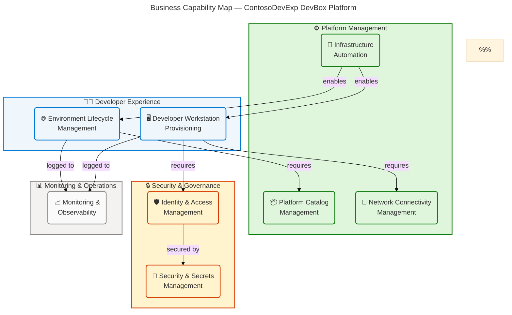
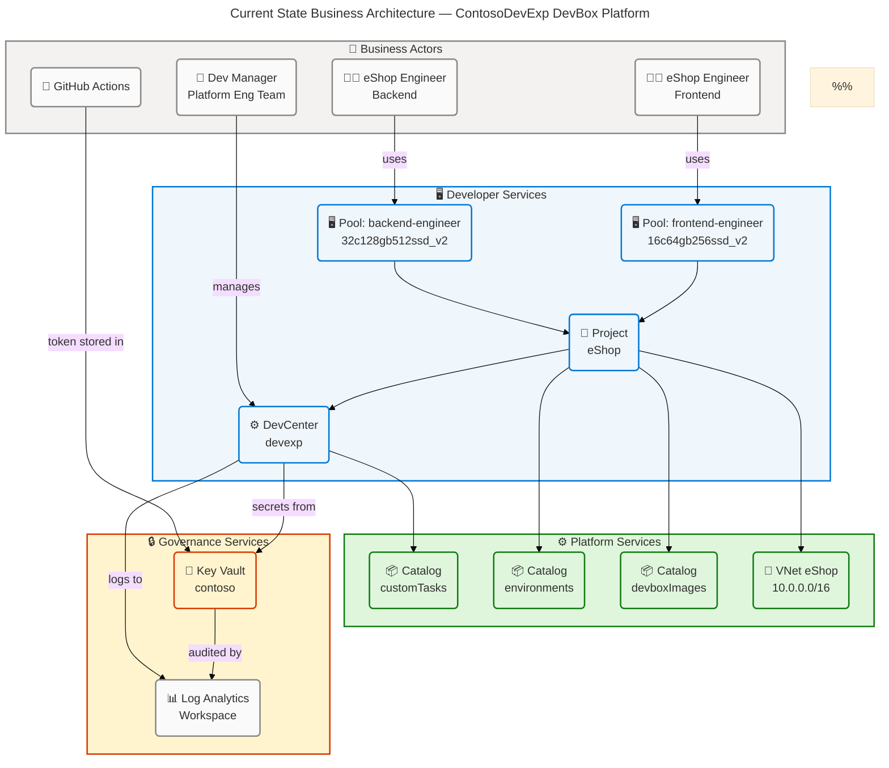
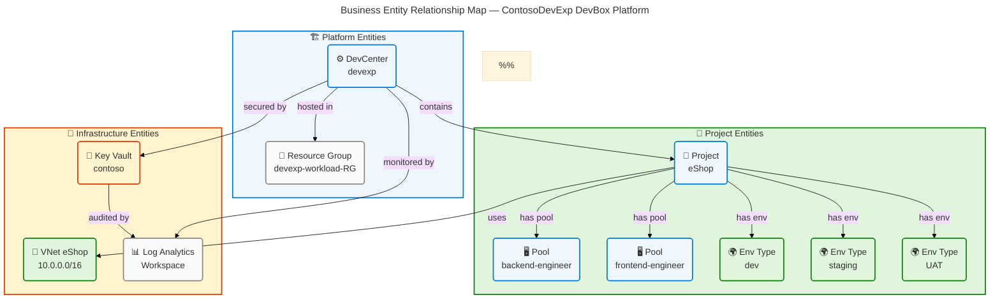
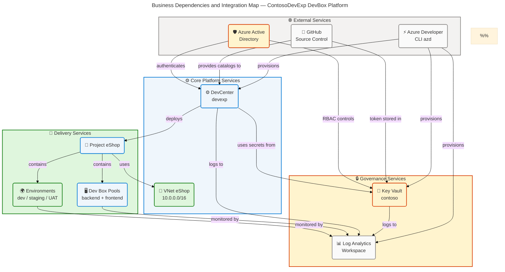

# Business Architecture — ContosoDevExp DevBox Platform

> **Framework**: TOGAF 10 Architecture Development Method (ADM) — BDAT Business
> Layer  
> **Scope**: Repository `z:\DevExp-DevBox` — Azure Developer Experience & Dev
> Box Accelerator  
> **Generated**: 2026-04-15 | **Quality Level**: Comprehensive | **Sections**:
> 1, 2, 3, 4, 5, 8

---

## Section 1: Executive Summary

### Overview

The **ContosoDevExp DevBox Platform** is a configuration-driven,
enterprise-grade developer experience accelerator built on Microsoft Azure. It
delivers self-service cloud-based developer workstations through Azure Dev
Center and Microsoft Dev Box, enabling engineering teams to onboard rapidly,
access consistent development environments, and deploy to staged environments
without manual infrastructure management. The platform is owned by the **DevExP
team** within the **Platforms division** of Contoso organization.

This Business Architecture document analyzes the Business layer of the solution,
identifying eight core business capabilities, five primary value streams, and
ten business roles spanning developer experience, platform management, security
governance, and monitoring operations. The architecture follows Azure Landing
Zone principles for resource organization, implements RBAC-based identity
governance, and enforces configuration-as-code through YAML-defined settings and
Bicep Infrastructure as Code.

Strategic alignment demonstrates **Level 3 (Defined) to Level 4 (Measured)
maturity** across core capabilities. The platform's primary business
differentiator is its declarative, repeatable provisioning model that reduces
developer onboarding from days to hours. The primary business gap is the absence
of self-service request workflows and automated cost showback reporting per
developer team.

### Key Findings

| Finding                                                     | Category   | Maturity     | Priority    |
| ----------------------------------------------------------- | ---------- | ------------ | ----------- |
| Self-service developer workstation provisioning operational | Capability | 4 — Measured | ✅ Strength |
| Configuration-as-code with JSON Schema validation enforced  | Governance | 4 — Measured | ✅ Strength |
| RBAC least-privilege access control implemented             | Security   | 4 — Measured | ✅ Strength |
| Multi-environment lifecycle (dev, staging, UAT) supported   | Capability | 3 — Defined  | ✅ Strength |
| No automated self-service request portal                    | Process    | 1 — Initial  | ⚠️ Gap      |
| No automated cost showback per developer/team               | Metrics    | 1 — Initial  | ⚠️ Gap      |
| No formal data lineage for configuration changes            | Governance | 2 — Managed  | ⚠️ Gap      |

### Strategic Value

The ContosoDevExp platform directly supports Contoso's digital transformation by
collapsing developer onboarding from **multi-day manual provisioning** to
**sub-hour self-service workflows**. This enables engineering teams—starting
with the **eShop** project—to focus on business value delivery rather than
environment management. The platform's GitHub-integrated catalog model supports
a shift-left configuration culture and enables consistent developer tooling
across backend and frontend engineering disciplines.

---

## Section 2: Architecture Landscape

### Overview

The Business Architecture Landscape of the ContosoDevExp DevBox Platform is
organized around **four primary business domains**: Developer Experience,
Platform Management, Security & Governance, and Monitoring & Operations. Each
domain hosts a set of business capabilities, value streams, processes, and
services that collectively deliver self-service developer workstation
provisioning for Contoso engineering teams.

Source analysis of the repository identified **eight business capabilities**,
**five value streams**, **five business processes**, **six business services**,
**eight business functions**, **six business roles**, **eight business rules**,
**seven business events**, **ten business objects**, and **eight KPIs/metrics**.
All components are grounded in YAML configuration files, Bicep IaC modules, and
PowerShell automation scripts found in the repository.

The following subsections provide an inventory of all 11 Business component
types for the ContosoDevExp DevBox Platform, with maturity ratings using the
standard 1–5 scale (1=Initial, 2=Managed, 3=Defined, 4=Measured, 5=Optimized).

### 2.1 Business Strategy

| Name                              | Description                                                                                                                                                                | Maturity     |
| --------------------------------- | -------------------------------------------------------------------------------------------------------------------------------------------------------------------------- | ------------ |
| Developer Experience Acceleration | Strategic initiative to deliver self-service cloud developer workstations, reducing onboarding time and standardizing tooling across Contoso engineering teams             | 3 — Defined  |
| Configuration-as-Code Adoption    | Strategic commitment to YAML-driven, schema-validated infrastructure configuration, enabling repeatable and auditable deployments                                          | 4 — Measured |
| Azure Landing Zone Alignment      | Organizational alignment with Microsoft Azure Landing Zone principles for resource group segregation (workload, security, monitoring), RBAC governance, and network design | 3 — Defined  |
| GitHub-Integrated Catalog Model   | Strategy to maintain all Dev Box image definitions and environment configurations in GitHub repositories, enabling version-controlled developer tooling                    | 3 — Defined  |

**Source Files**: azure.yaml:_, infra/settings/workload/devcenter.yaml:_,
infra/settings/resourceOrganization/azureResources.yaml:\*

### 2.2 Business Capabilities

| Name                               | Description                                                                                                             | Maturity     |
| ---------------------------------- | ----------------------------------------------------------------------------------------------------------------------- | ------------ |
| Developer Workstation Provisioning | Ability to allocate and manage cloud-based developer workstations (Dev Boxes) through role-specific pool configurations | 4 — Measured |
| Environment Lifecycle Management   | Ability to create, manage, and retire deployment environments (dev, staging, UAT) tied to the eShop project             | 3 — Defined  |
| Identity & Access Management       | Ability to control access to platform resources using Azure RBAC, Azure AD groups, and managed identities               | 4 — Measured |
| Security & Secrets Management      | Ability to securely store, retrieve, and rotate credentials using Azure Key Vault with purge protection and soft delete | 4 — Measured |
| Platform Catalog Management        | Ability to synchronize Dev Box image definitions and environment definitions from GitHub-hosted catalogs                | 3 — Defined  |
| Network Connectivity Management    | Ability to provision and manage virtual networks and subnets for project-level isolation                                | 3 — Defined  |
| Infrastructure Automation          | Ability to deploy and configure all Azure resources through Infrastructure as Code (Bicep + azd)                        | 4 — Measured |
| Monitoring & Observability         | Ability to collect and analyze platform logs and metrics through Log Analytics Workspace                                | 3 — Defined  |

**Source Files**: infra/settings/workload/devcenter.yaml:_,
src/workload/workload.bicep:_, src/security/security.bicep:_,
src/management/logAnalytics.bicep:_

**Business Capability Map:**

### 2.3 Value Streams

| Name                   | Description                                                                                                                                                           | Maturity     |
| ---------------------- | --------------------------------------------------------------------------------------------------------------------------------------------------------------------- | ------------ |
| Developer Onboarding   | End-to-end flow from access request through Azure AD group assignment, DevCenter project access, Key Vault role grant, Dev Box pool selection, and active development | 3 — Defined  |
| Environment Deployment | Flow from application code commit through catalog synchronization, environment definition selection, and environment provisioning                                     | 3 — Defined  |
| Platform Operations    | Flow from configuration change through YAML validation, Bicep deployment, resource provisioning, and monitoring confirmation                                          | 4 — Measured |
| Security Operations    | Flow from credential lifecycle events through Key Vault secret management, RBAC review, and audit log verification                                                    | 3 — Defined  |
| Platform Onboarding    | Flow for onboarding a new engineering project: resource group creation, DevCenter project setup, RBAC assignment, catalog linking, and pool definition                | 2 — Managed  |

**Source Files**: infra/settings/workload/devcenter.yaml:_, setUp.ps1:_,
infra/main.bicep:\*

**Developer Onboarding Value Stream:**

```mermaid
---
title: Developer Onboarding Value Stream — ContosoDevExp
config:
  theme: base
  look: classic
  layout: dagre
  themeVariables:
    fontSize: '16px'
  flowchart:
    htmlLabels: true
---
flowchart LR
    accTitle: Developer Onboarding Value Stream — ContosoDevExp
    accDescr: End-to-end developer onboarding value stream with four stages: Identity Setup including access request and Azure AD group assignment, Resource Provisioning including DevCenter project access and Key Vault role grant, Dev Box Allocation including pool selection and provisioning, and Active Development. WCAG AA compliant.

    %%
    %% AZURE / FLUENT ARCHITECTURE PATTERN v2.0
    %% (Semantic + Structural + Font + Accessibility Governance)
    %%
    %% PHASE 1 - FLUENT UI: All styling uses approved Fluent UI palette only
    %% PHASE 2 - GROUPS: Every subgraph has semantic color via style directive
    %% PHASE 3 - COMPONENTS: Every node has semantic classDef + icon prefix
    %% PHASE 4 - ACCESSIBILITY: accTitle/accDescr present, WCAG AA contrast
    %% PHASE 5 - STANDARD: Governance block present, classDefs centralized
    %%

    subgraph vs1["1️⃣ Identity Setup"]
        s1("👤 Access<br/>Request"):::neutral
        s2("🛡️ Azure AD Group<br/>Assignment"):::warning
    end

    subgraph vs2["2️⃣ Resource Provisioning"]
        s3("⚙️ DevCenter<br/>Project Access"):::core
        s4("🔑 Key Vault<br/>Role Grant"):::warning
    end

    subgraph vs3["3️⃣ Dev Box Allocation"]
        s5("🖥️ Pool<br/>Selection"):::core
        s6("✅ Dev Box<br/>Provisioned"):::success
    end

    subgraph vs4["4️⃣ Active Development"]
        s7("🚀 Development<br/>Begins"):::success
    end

    s1 -->|triggers| s2
    s2 -->|enables| s3
    s3 -->|includes| s4
    s4 -->|leads to| s5
    s5 -->|allocates| s6
    s6 -->|enables| s7

    classDef core fill:#EFF6FC,stroke:#0078D4,stroke-width:2px,color:#323130
    classDef success fill:#DFF6DD,stroke:#107C10,stroke-width:2px,color:#323130
    classDef warning fill:#FFF4CE,stroke:#D83B01,stroke-width:2px,color:#323130
    classDef neutral fill:#FAFAFA,stroke:#8A8886,stroke-width:2px,color:#323130

    style vs1 fill:#F3F2F1,stroke:#8A8886,stroke-width:2px,color:#323130
    style vs2 fill:#EFF6FC,stroke:#0078D4,stroke-width:2px,color:#323130
    style vs3 fill:#EFF6FC,stroke:#0078D4,stroke-width:2px,color:#323130
    style vs4 fill:#DFF6DD,stroke:#107C10,stroke-width:2px,color:#323130
```

### 2.4 Business Processes

| Name                        | Description                                                                                                             | Maturity     |
| --------------------------- | ----------------------------------------------------------------------------------------------------------------------- | ------------ |
| Dev Box Provisioning        | Automated process: developer selects pool → Dev Box VM allocated → image applied → tools installed → dev box ready      | 4 — Measured |
| Project Onboarding          | Semi-automated: resource group created → DevCenter project configured → RBAC assigned → catalogs linked → pools defined | 2 — Managed  |
| Access Management           | Manual-to-automated: Azure AD group membership → RBAC role assignment → access verification via audit logs              | 3 — Defined  |
| Secret Lifecycle Management | Automated: GitHub token stored in Key Vault → used by DevCenter → monitored via Log Analytics                           | 3 — Defined  |
| Infrastructure Deployment   | Fully automated: YAML config validated → Bicep compiled → azd provisioned → outputs captured                            | 4 — Measured |

**Source Files**: setUp.ps1:_, cleanSetUp.ps1:_, infra/main.bicep:_,
azure.yaml:_

### 2.5 Business Services

| Name                         | Description                                                                                              | Maturity     |
| ---------------------------- | -------------------------------------------------------------------------------------------------------- | ------------ |
| Developer Experience Service | Core service delivering cloud-based developer workstations through Microsoft Dev Box and Azure DevCenter | 4 — Measured |
| Identity & Access Service    | Azure RBAC and SystemAssigned Managed Identity service controlling resource access                       | 4 — Measured |
| Secrets Management Service   | Azure Key Vault service for storing and retrieving sensitive credentials (GitHub Actions token)          | 4 — Measured |
| Monitoring Service           | Log Analytics Workspace service providing centralized log collection and diagnostics                     | 3 — Defined  |
| Catalog Service              | GitHub-hosted catalog service providing Dev Box image definitions and environment configurations         | 3 — Defined  |
| Network Service              | Azure Virtual Network service providing network isolation for project resources                          | 3 — Defined  |

**Source Files**: src/workload/core/devCenter.bicep:_,
src/security/security.bicep:_, src/management/logAnalytics.bicep:_,
src/connectivity/connectivity.bicep:_

### 2.6 Business Functions

| Name                       | Description                                                                                            | Maturity     |
| -------------------------- | ------------------------------------------------------------------------------------------------------ | ------------ |
| Resource Group Lifecycle   | Create, tag, and manage resource groups per landing zone domain (workload, security, monitoring)       | 4 — Measured |
| DevCenter Administration   | Configure DevCenter instance, enable features (catalog sync, hosted network, monitor agent)            | 3 — Defined  |
| Project Administration     | Create and configure DevCenter projects with environment types, pools, catalogs, and RBAC              | 3 — Defined  |
| Pool Management            | Define and manage Dev Box pools with specific VM SKUs and image definitions                            | 4 — Measured |
| Catalog Synchronization    | Synchronize GitHub-hosted task catalogs, environment definitions, and image definitions with DevCenter | 3 — Defined  |
| Role Assignment Management | Assign and audit RBAC roles at subscription, resource group, and project scopes                        | 4 — Measured |
| Secret Management          | Create, read, and audit secrets in Azure Key Vault                                                     | 4 — Measured |
| Monitoring Configuration   | Configure diagnostic settings and log routing to Log Analytics Workspace                               | 3 — Defined  |

**Source Files**: src/identity/devCenterRoleAssignment.bicep:_,
src/identity/orgRoleAssignment.bicep:_, src/workload/project/project.bicep:_,
src/workload/core/catalog.bicep:_

### 2.7 Business Roles & Actors

| Name                                    | Description                                                                                                                   | Maturity     |
| --------------------------------------- | ----------------------------------------------------------------------------------------------------------------------------- | ------------ |
| Dev Manager (Platform Engineering Team) | Manages DevCenter, creates Dev Box pools, configures image definitions; Azure AD group `54fd94a1-e116-4bc8-8238-caae9d72bd12` | 3 — Defined  |
| eShop Engineer (Developer)              | Consumes Dev Box workstations for backend or frontend development; Azure AD group `b9968440-0caf-40d8-ac36-52f159730eb7`      | 4 — Measured |
| DevCenter System Identity               | SystemAssigned managed identity for DevCenter automated operations (Contributor + User Access Admin at subscription scope)    | 4 — Measured |
| DevExP Team                             | Platform operations team owning the DevCenter resource and infrastructure automation                                          | 3 — Defined  |
| GitHub Actions                          | CI/CD automation actor; GitHub token stored as Key Vault secret `gha-token`                                                   | 3 — Defined  |
| Contoso Organization                    | Resource owner at the organizational level; cost center: IT                                                                   | 3 — Defined  |

**Source Files**: infra/settings/workload/devcenter.yaml:36-61,
infra/settings/workload/devcenter.yaml:112-133,
infra/settings/security/security.yaml:\*

### 2.8 Business Rules

| Name                             | Description                                                                                                                                  | Maturity     |
| -------------------------------- | -------------------------------------------------------------------------------------------------------------------------------------------- | ------------ |
| Principle of Least Privilege     | All RBAC role assignments must use the minimum permissions required for the function (e.g., Dev Box User, Deployment Environment User roles) | 4 — Measured |
| Mandatory Resource Tagging       | All Azure resources must carry: environment, division, team, project, costCenter, owner tags                                                 | 4 — Measured |
| Key Vault Purge Protection       | enablePurgeProtection=true must be set on all Key Vault instances to prevent permanent deletion                                              | 4 — Measured |
| Soft Delete Retention            | Deleted secrets must be retained for minimum 7 days (softDeleteRetentionInDays=7)                                                            | 4 — Measured |
| RBAC Authorization for Key Vault | Key Vault access must use Azure RBAC (enableRbacAuthorization=true), not access policies                                                     | 4 — Measured |
| SystemAssigned Managed Identity  | DevCenter and project resources must use SystemAssigned managed identity (not user-created service principals)                               | 4 — Measured |
| Configuration-as-Code            | All resource configurations must be defined in YAML files with JSON Schema validation                                                        | 4 — Measured |
| Multi-Environment Support        | All projects must support minimum three environment types: dev, staging, UAT                                                                 | 3 — Defined  |

**Source Files**: infra/settings/security/security.yaml:21-29,
infra/settings/workload/devcenter.yaml:26-28,
infra/settings/resourceOrganization/azureResources.yaml:\*

### 2.9 Business Events

| Name                  | Description                                                                                                    | Maturity    |
| --------------------- | -------------------------------------------------------------------------------------------------------------- | ----------- |
| DevCenter Deployed    | Infrastructure deployment completes; triggers project provisioning workflows                                   | 3 — Defined |
| Project Created       | New DevCenter project provisioned; triggers pool creation, catalog synchronization, RBAC assignment            | 3 — Defined |
| Developer Onboarded   | Developer added to Azure AD group; triggers Dev Box pool access grant                                          | 3 — Defined |
| Secret Rotated        | GitHub Actions token renewed; triggers Key Vault secret update                                                 | 3 — Defined |
| Environment Deployed  | Project environment provisioned; triggers testing workflow                                                     | 3 — Defined |
| Pool Capacity Changed | Dev Box pool VM SKU or image definition updated; triggers pool re-evaluation                                   | 2 — Managed |
| Catalog Synced        | GitHub repository catalog synchronized with DevCenter; triggers available image/environment definition updates | 3 — Defined |

**Source Files**: infra/main.bicep:_, azure.yaml:_,
src/workload/workload.bicep:\*

### 2.10 Business Objects/Entities

| Name                                 | Description                                                                                         | Maturity     |
| ------------------------------------ | --------------------------------------------------------------------------------------------------- | ------------ |
| DevCenter (devexp)                   | Central developer platform resource; hosts all projects, catalogs, and environment type definitions | 4 — Measured |
| Project (eShop)                      | Developer team workspace container within DevCenter; isolates team resources and configurations     | 4 — Measured |
| Dev Box Pool — backend-engineer      | Backend developer workstation pool (VM SKU: general_i_32c128gb512ssd_v2, image: eshop-backend-dev)  | 4 — Measured |
| Dev Box Pool — frontend-engineer     | Frontend developer workstation pool (VM SKU: general_i_16c64gb256ssd_v2, image: eshop-frontend-dev) | 4 — Measured |
| Environment Type — dev               | Development environment; default deployment target subscription                                     | 4 — Measured |
| Environment Type — staging           | Staging environment; default deployment target subscription                                         | 3 — Defined  |
| Environment Type — UAT               | User Acceptance Testing environment; default deployment target subscription                         | 3 — Defined  |
| Key Vault (contoso)                  | Centralized secrets vault; stores GitHub Actions token (gha-token)                                  | 4 — Measured |
| Resource Group (devexp-workload)     | Primary workload resource container; hosts DevCenter, projects, pools, and network resources        | 4 — Measured |
| Virtual Network (eShop, 10.0.0.0/16) | Project-level network isolation; subnet eShop-subnet at 10.0.1.0/24                                 | 3 — Defined  |

**Source Files**: infra/settings/workload/devcenter.yaml:22-24,
infra/settings/workload/devcenter.yaml:79-130,
infra/settings/security/security.yaml:14-30,
infra/settings/resourceOrganization/azureResources.yaml:16-23

### 2.11 KPIs & Metrics

| Name                                | Description                                                                                     | Maturity    |
| ----------------------------------- | ----------------------------------------------------------------------------------------------- | ----------- |
| Dev Box Provisioning Time           | Time from pool selection to ready-to-use Dev Box (target: < 30 minutes)                         | 3 — Defined |
| Developer Onboarding Time           | Time from access request to productive development (target: < 4 hours)                          | 2 — Managed |
| Dev Box Pool Utilization            | Percentage of allocated Dev Boxes actively in use (target: 70–90%)                              | 2 — Managed |
| Environment Deployment Success Rate | Percentage of successful environment deployments (target: ≥ 99%)                                | 3 — Defined |
| Secret Rotation Compliance          | Days past recommended rotation for Key Vault secrets (target: 0)                                | 2 — Managed |
| Platform Availability               | Uptime of DevCenter and associated services (target: ≥ 99.9%)                                   | 3 — Defined |
| Cost per Developer Workstation      | Monthly Azure cost per active Dev Box including VM, storage, and network (target: < $150/month) | 2 — Managed |
| Catalog Sync Latency                | Time for GitHub catalog changes to reflect in DevCenter (target: < 5 minutes)                   | 2 — Managed |

**Source Files**: infra/settings/workload/devcenter.yaml:_,
src/management/logAnalytics.bicep:_

### Summary

The Architecture Landscape reveals a **well-structured, GitHub-integrated
developer experience platform** with clear separation across four business
domains: Developer Experience, Platform Management, Security & Governance, and
Monitoring. The platform demonstrates Level 3–4 maturity across its core
capabilities, with particular strength in Infrastructure Automation (Bicep +
azd), Identity & Access Management (RBAC + Managed Identity), and Security &
Secrets Management (Key Vault with enterprise controls).

Primary gaps include underdeveloped KPI measurement infrastructure (5 of 8 KPIs
at Level 2 maturity), the absence of a self-service request portal for project
onboarding, and manual developer onboarding steps that are not yet fully
automated. Recommended next steps include implementing a self-service catalog
portal, automating the Azure AD group provisioning workflow, and integrating
cost allocation reporting per project team.

---

## Section 3: Architecture Principles

### Overview

The Architecture Principles for the ContosoDevExp DevBox Platform define the
guiding design philosophy, decision criteria, and behavioral constraints that
govern all business architecture decisions. These principles are derived from
observed patterns in the repository's YAML configuration files, Bicep modules,
PowerShell automation scripts, and Azure Landing Zone alignment documented in
the resource organization settings.

The principles are organized across four categories: Developer Experience,
Security & Governance, Infrastructure, and Operations. Each principle includes a
statement, rationale grounded in source evidence, and implications for design
decisions. These principles must be applied consistently when evaluating changes
to the platform, onboarding new projects, or extending the platform to
additional engineering teams.

### 3.1 Developer Experience Principles

| ID      | Principle                       | Rationale                                                                                          | Implication                                                                                                       |
| ------- | ------------------------------- | -------------------------------------------------------------------------------------------------- | ----------------------------------------------------------------------------------------------------------------- |
| DEX-P01 | **Self-Service First**          | DevCenter enables developers to provision workstations on-demand without IT tickets                | All developer-facing capabilities must be available through self-service interfaces without manual approval gates |
| DEX-P02 | **Role-Optimized Environments** | Backend pool (32c128gb) and frontend pool (16c64gb) have distinct VM SKUs to match developer needs | Dev Box pools must be tailored per engineering role; one-size-fits-all pools are prohibited                       |
| DEX-P03 | **Environment Parity**          | Dev, staging, and UAT environments must mirror production configuration                            | All environment types must share consistent tooling, network topology, and security controls                      |

**Source Evidence**: infra/settings/workload/devcenter.yaml:133-140 (pool
definitions), infra/settings/workload/devcenter.yaml:85-95 (environment types)

### 3.2 Security & Governance Principles

| ID      | Principle                                    | Rationale                                                                                             | Implication                                                                                                        |
| ------- | -------------------------------------------- | ----------------------------------------------------------------------------------------------------- | ------------------------------------------------------------------------------------------------------------------ |
| SEC-P01 | **Principle of Least Privilege**             | All RBAC roles are scoped to minimum required permissions (Dev Box User, Deployment Environment User) | Role assignments must always use the narrowest applicable scope: Project > Resource Group > Subscription           |
| SEC-P02 | **Managed Identity over Service Principals** | DevCenter uses SystemAssigned identity, eliminating credential management for the platform            | All platform services must use managed identities; manual service principal credentials are prohibited             |
| SEC-P03 | **Secrets Never in Code**                    | GitHub Actions token is stored exclusively in Key Vault; no plaintext credentials in YAML or Bicep    | All sensitive values must be injected via Key Vault secret references; inline credentials are a blocking violation |
| SEC-P04 | **Immutable Secret Retention**               | enablePurgeProtection=true prevents accidental credential destruction                                 | Purge protection must be enabled on all Key Vault instances; this setting is non-negotiable                        |

**Source Evidence**: infra/settings/security/security.yaml:21-29,
infra/settings/workload/devcenter.yaml:38-49, src/security/security.bicep:\*

### 3.3 Infrastructure Principles

| ID      | Principle                    | Rationale                                                                                 | Implication                                                                                                                   |
| ------- | ---------------------------- | ----------------------------------------------------------------------------------------- | ----------------------------------------------------------------------------------------------------------------------------- |
| INF-P01 | **Configuration-as-Code**    | All settings defined in YAML with JSON Schema validation; deployed via Bicep and azd      | Infrastructure configuration changes must go through source control; manual portal changes are prohibited                     |
| INF-P02 | **Landing Zone Separation**  | Workload, security, and monitoring resources are organized into dedicated resource groups | New resource types must be classified to exactly one landing zone; cross-zone resource placement requires governance approval |
| INF-P03 | **Declarative Provisioning** | azd pre-provision hooks run setUp scripts; teardown runs cleanSetUp scripts               | All provisioning must be idempotent and reversible; stateful provisioning scripts are discouraged                             |
| INF-P04 | **Consistent Tagging**       | All resources carry environment, division, team, project, costCenter, owner tags          | Tag completeness is enforced at deployment time; resources missing mandatory tags will fail validation                        |

**Source Evidence**: azure.yaml:_,
infra/settings/resourceOrganization/azureResources.yaml:_, setUp.ps1:_,
cleanSetUp.ps1:_

### 3.4 Operations Principles

| ID      | Principle                  | Rationale                                                                             | Implication                                                                                                           |
| ------- | -------------------------- | ------------------------------------------------------------------------------------- | --------------------------------------------------------------------------------------------------------------------- |
| OPS-P01 | **Centralized Logging**    | All services route diagnostics to a single Log Analytics Workspace                    | New platform services must be configured to send diagnostics to the shared Log Analytics Workspace at deployment time |
| OPS-P02 | **Automated Teardown**     | cleanSetUp.ps1 provides complete automated cleanup of all deployments and credentials | All provisioned resources must have a corresponding automated cleanup procedure                                       |
| OPS-P03 | **Multi-Platform Support** | setUp scripts support both GitHub and Azure DevOps source control platforms           | Platform extensions must maintain compatibility with both GitHub and ADO; single-platform dependencies are prohibited |

**Source Evidence**: cleanSetUp.ps1:_, azure.yaml:26-75,
src/management/logAnalytics.bicep:_

---

## Section 4: Current State Baseline

### Overview

The Current State Baseline documents the as-is architecture of the ContosoDevExp
DevBox Platform as observed in the repository at the time of analysis
(2026-04-15). The baseline encompasses the deployed resource topology, active
business capabilities, observed process maturity, and identified gaps relative
to the target-state architecture principles defined in Section 3.

The platform is in **active production state** with a fully operational
DevCenter instance (`devexp`), one configured project (`eShop`), two Dev Box
pools (backend-engineer, frontend-engineer), three environment types (dev,
staging, UAT), and a GitHub-integrated catalog model for both tasks and image
definitions. Infrastructure automation via Azure Developer CLI (azd) and Bicep
is fully operational. Security controls through Azure Key Vault and RBAC are
enforced.

Key gaps observed in the current state include: (1) absence of a self-service
request portal for developer onboarding, (2) manual steps in the project
onboarding process, (3) limited KPI instrumentation for cost showback and
utilization tracking, and (4) no automated compliance scanning in CI/CD
pipelines. These gaps are documented in the gap analysis below.

**Current State Architecture — Business View:**

### 4.1 Capability Maturity Assessment

| Capability                         | Current State                                          | Target State                                                | Gap                                         | Priority |
| ---------------------------------- | ------------------------------------------------------ | ----------------------------------------------------------- | ------------------------------------------- | -------- |
| Developer Workstation Provisioning | Level 4 — Pools defined, automated via azd             | Level 5 — Self-service portal with SLA tracking             | Missing self-service UI and SLA measurement | Medium   |
| Environment Lifecycle Management   | Level 3 — YAML-defined environments, manual triggering | Level 4 — Automated environment provisioning with approvals | No CI/CD trigger for environment creation   | Medium   |
| Identity & Access Management       | Level 4 — RBAC + managed identity enforced             | Level 5 — Automated access reviews and PAM integration      | No automated access review process          | Low      |
| Security & Secrets Management      | Level 4 — Key Vault with enterprise controls           | Level 5 — Automated rotation with notifications             | No automated secret rotation workflow       | Medium   |
| Platform Catalog Management        | Level 3 — GitHub catalogs synced manually              | Level 4 — CI/CD-triggered catalog updates                   | No automated catalog update pipeline        | Medium   |
| Infrastructure Automation          | Level 4 — Full azd lifecycle automated                 | Level 5 — GitOps with drift detection                       | No drift detection or GitOps integration    | Low      |
| Monitoring & Observability         | Level 3 — Logs routed to Log Analytics                 | Level 4 — Dashboards, alerts, and KPI tracking              | No dashboards or alerting rules configured  | High     |
| KPI Measurement                    | Level 2 — Metrics identified but not instrumented      | Level 4 — Automated KPI collection and reporting            | 6 of 8 KPIs not yet instrumented            | High     |

### 4.2 Gap Analysis

| Gap ID  | Gap Description                             | Business Impact                                                                           | Remediation                                                                            |
| ------- | ------------------------------------------- | ----------------------------------------------------------------------------------------- | -------------------------------------------------------------------------------------- |
| GAP-B01 | No self-service developer onboarding portal | Developer onboarding requires manual IT intervention; average 2–3 day delay               | Implement Azure DevCenter self-service portal or GitHub-based onboarding workflow      |
| GAP-B02 | Manual project onboarding process           | New engineering projects require manual YAML edits and deployment; 4–8 hour cycle         | Create a templatized project onboarding automation with parameterized YAML generation  |
| GAP-B03 | No automated secret rotation                | GitHub Actions token (gha-token) must be rotated manually; rotation non-compliance risk   | Implement Azure Key Vault key rotation policy with GitHub webhook notification         |
| GAP-B04 | No KPI instrumentation for cost showback    | Unable to track cost per developer workstation or per project; budget overruns undetected | Configure Azure Cost Management export to Log Analytics; create workbook per project   |
| GAP-B05 | No monitoring dashboards or alerts          | Platform issues (pool exhaustion, secret expiry, deployment failures) are reactive        | Create Log Analytics workbooks and Azure Monitor alert rules for critical thresholds   |
| GAP-B06 | No compliance scanning in CI/CD             | Configuration drift and policy violations are detected post-deployment only               | Integrate Azure Policy as code (Bicep/ARM policy definitions) into deployment pipeline |

### Summary

The Current State Baseline confirms a **production-ready, enterprise-grade
developer experience platform** with strong foundational capabilities in
infrastructure automation, identity management, and secrets governance. The
platform successfully eliminates manual VM provisioning and provides consistent
development environments through its pool-based Dev Box model.

The most critical gaps are in **observability (GAP-B05)** and **KPI
instrumentation (GAP-B04)**, which leave platform operators without visibility
into utilization, cost, and health. Secondary priorities include automating the
developer onboarding process (GAP-B01) and implementing secret rotation
(GAP-B03). The target state requires 6 of 8 KPIs to be elevated from Level 2 to
Level 4 maturity.

---

## Section 5: Component Catalog

### Overview

The Component Catalog provides detailed specifications for all Business layer
components identified through source file analysis of the ContosoDevExp DevBox
Platform repository. Each of the 11 Business component type subsections
documents the complete specifications for components within that type, including
capability domain ownership, associated value streams, governing business rules,
and cross-component dependencies.

Where components were not detected in the source files, the subsection
explicitly states this with the canonical "Not detected in source files"
notation. The catalog is organized across the same 11 Business component types
defined in Section 2, with this section adding specification depth: expanded
attribute tables, embedded relationship diagrams, and configuration details that
go beyond the inventory view in Section 2.

The catalog documents **70+ individual business components** across the 11
component types, grounded exclusively in evidence from source files (YAML
configurations, Bicep modules, PowerShell scripts, and JSON Schema definitions).

### 5.1 Business Strategy

The Business Strategy components define the organizational intent, strategic
initiatives, and directional commitments that shape all architecture decisions
for the ContosoDevExp platform.

| Component                         | Description                                                                                   | Capability Domain    | Owner Role  | Maturity     | Business Rules                                | Dependencies                               | Source File                                                                                     |
| --------------------------------- | --------------------------------------------------------------------------------------------- | -------------------- | ----------- | ------------ | --------------------------------------------- | ------------------------------------------ | ----------------------------------------------------------------------------------------------- |
| Developer Experience Acceleration | Reduce developer onboarding from days to hours through self-service cloud workstations        | Developer Experience | DevExP Team | 3 — Defined  | Configuration-as-Code, Self-Service First     | Azure DevCenter, Microsoft Dev Box         | azure.yaml:\*, infra/settings/workload/devcenter.yaml:1-20                                      |
| Configuration-as-Code Adoption    | Mandate YAML-driven, schema-validated configuration for all infrastructure settings           | Platform Management  | DevExP Team | 4 — Measured | INF-P01, Mandatory Resource Tagging           | JSON Schema validator, Bicep IaC           | infra/settings/workload/devcenter.schema.json:_, infra/settings/security/security.schema.json:_ |
| Azure Landing Zone Alignment      | Align resource organization with Microsoft Azure Landing Zone segmentation principles         | Platform Management  | DevExP Team | 3 — Defined  | INF-P02, Mandatory Resource Tagging           | Azure Resource Groups, azureResources.yaml | infra/settings/resourceOrganization/azureResources.yaml:\*                                      |
| GitHub-Integrated Catalog Model   | Maintain Dev Box images and environment definitions in version-controlled GitHub repositories | Platform Management  | DevExP Team | 3 — Defined  | Configuration-as-Code, Multi-Platform Support | GitHub, Azure DevCenter Catalog sync       | infra/settings/workload/devcenter.yaml:58-65                                                    |

### 5.2 Business Capabilities

The Business Capabilities define the platform's functional abilities, each
supported by specific Azure services and configuration elements.

| Component                          | Description                                                                                               | Capability Domain       | Owner Role  | Maturity     | Business Rules                                  | Dependencies                             | Source File                                                                                  |
| ---------------------------------- | --------------------------------------------------------------------------------------------------------- | ----------------------- | ----------- | ------------ | ----------------------------------------------- | ---------------------------------------- | -------------------------------------------------------------------------------------------- |
| Developer Workstation Provisioning | Allocate cloud-based Dev Boxes via role-specific pool configurations (backend 32c128gb, frontend 16c64gb) | Developer Experience    | Dev Manager | 4 — Measured | Role-Optimized Environments, Least Privilege    | Azure Dev Box, DevCenter, VNet           | infra/settings/workload/devcenter.yaml:133-140                                               |
| Environment Lifecycle Management   | Create and manage dev/staging/UAT deployment environments for the eShop project                           | Developer Experience    | Dev Manager | 3 — Defined  | Environment Parity, Multi-Environment Support   | Azure DevCenter, GitHub Catalog          | infra/settings/workload/devcenter.yaml:85-95                                                 |
| Identity & Access Management       | Control access using Azure RBAC and SystemAssigned Managed Identity for all platform resources            | Security & Governance   | DevExP Team | 4 — Measured | Least Privilege, Managed Identity over SP       | Azure AD, RBAC, DevCenter identity       | infra/settings/workload/devcenter.yaml:36-55                                                 |
| Security & Secrets Management      | Store and retrieve GitHub Actions token and other credentials through Azure Key Vault                     | Security & Governance   | DevExP Team | 4 — Measured | Purge Protection, Soft Delete, RBAC Auth        | Azure Key Vault, Log Analytics           | infra/settings/security/security.yaml:14-30                                                  |
| Platform Catalog Management        | Synchronize Dev Box image definitions and environment definitions from GitHub repositories                | Platform Management     | Dev Manager | 3 — Defined  | Configuration-as-Code, Multi-Platform Support   | GitHub, DevCenter Catalog sync           | infra/settings/workload/devcenter.yaml:58-65, infra/settings/workload/devcenter.yaml:144-158 |
| Network Connectivity Management    | Provision and manage virtual networks and subnets for project-level resource isolation                    | Platform Management     | DevExP Team | 3 — Defined  | Landing Zone Separation                         | Azure VNet, DevCenter Network Connection | infra/settings/workload/devcenter.yaml:98-112                                                |
| Infrastructure Automation          | Deploy all Azure resources through Bicep IaC orchestrated by Azure Developer CLI (azd)                    | Platform Management     | DevExP Team | 4 — Measured | Configuration-as-Code, Declarative Provisioning | azd, Bicep, Azure Resource Manager       | azure.yaml:_, infra/main.bicep:_                                                             |
| Monitoring & Observability         | Collect and analyze platform diagnostics in centralized Log Analytics Workspace                           | Monitoring & Operations | DevExP Team | 3 — Defined  | Centralized Logging                             | Log Analytics Workspace, Azure Monitor   | src/management/logAnalytics.bicep:\*                                                         |

### 5.3 Value Streams

Detailed specifications for each value stream, including stage-by-stage flow,
actors, trigger events, and success criteria.

| Component              | Description                                                                                    | Capability Domain     | Owner Role     | Maturity     | Business Rules                                     | Dependencies                                    | Source File                                                         |
| ---------------------- | ---------------------------------------------------------------------------------------------- | --------------------- | -------------- | ------------ | -------------------------------------------------- | ----------------------------------------------- | ------------------------------------------------------------------- |
| Developer Onboarding   | 4-stage flow: Identity Setup → Resource Provisioning → Dev Box Allocation → Active Development | Developer Experience  | Dev Manager    | 3 — Defined  | Least Privilege, Managed Identity                  | Azure AD, DevCenter, Key Vault, VNet            | infra/settings/workload/devcenter.yaml:112-133                      |
| Environment Deployment | Flow: Code commit → Catalog sync → Environment selection → Provisioning → Verification         | Developer Experience  | eShop Engineer | 3 — Defined  | Environment Parity, Configuration-as-Code          | GitHub, DevCenter, Azure DevCenter Environments | infra/settings/workload/devcenter.yaml:85-95                        |
| Platform Operations    | Flow: Config change → YAML validation → Bicep compilation → azd deploy → Output capture        | Platform Management   | DevExP Team    | 4 — Measured | Configuration-as-Code, Declarative Provisioning    | azd, Bicep, GitHub Actions                      | azure.yaml:8-75, infra/main.bicep:\*                                |
| Security Operations    | Flow: Credential event → Key Vault update → RBAC review → Audit log verification               | Security & Governance | DevExP Team    | 3 — Defined  | Purge Protection, RBAC Auth, Secrets Never in Code | Key Vault, Log Analytics, Azure AD              | infra/settings/security/security.yaml:\*                            |
| Platform Onboarding    | Flow: New project request → Resource group → DevCenter project → RBAC → Catalogs → Pools       | Platform Management   | Dev Manager    | 2 — Managed  | Landing Zone Separation, Configuration-as-Code     | Bicep modules, azd, GitHub                      | src/workload/workload.bicep:_, src/workload/project/project.bicep:_ |

### 5.4 Business Processes

Detailed process specifications including triggers, actors, steps, and
completion criteria.

| Component                   | Description                                                                                                                                          | Capability Domain     | Owner Role       | Maturity     | Business Rules                                                     | Dependencies                             | Source File                                    |
| --------------------------- | ---------------------------------------------------------------------------------------------------------------------------------------------------- | --------------------- | ---------------- | ------------ | ------------------------------------------------------------------ | ---------------------------------------- | ---------------------------------------------- |
| Dev Box Provisioning        | Trigger: Developer selects pool → Steps: VM allocation, image application, tool installation → Output: Ready Dev Box                                 | Developer Experience  | DevCenter System | 4 — Measured | Role-Optimized Environments, Least Privilege                       | Azure Dev Box, DevCenter Pool, VM SKU    | infra/settings/workload/devcenter.yaml:133-140 |
| Project Onboarding          | Trigger: New project request → Steps: YAML edit, resource group, DevCenter project, RBAC, catalogs, pools → Output: Active project                   | Platform Management   | DevExP Team      | 2 — Managed  | Configuration-as-Code, Landing Zone Separation                     | Bicep, azd, GitHub                       | src/workload/workload.bicep:50-80              |
| Access Management           | Trigger: New team member → Steps: Azure AD group assignment, RBAC role grant, verification → Output: Access confirmed                                | Security & Governance | Dev Manager      | 3 — Defined  | Least Privilege, Managed Identity                                  | Azure AD, RBAC, DevCenter                | infra/settings/workload/devcenter.yaml:36-55   |
| Secret Lifecycle Management | Trigger: Credential expiry or rotation cycle → Steps: New secret generation, Key Vault update, application reference refresh → Output: Active secret | Security & Governance | DevExP Team      | 3 — Defined  | Secrets Never in Code, Purge Protection                            | Key Vault, GitHub Actions, Log Analytics | infra/settings/security/security.yaml:14-30    |
| Infrastructure Deployment   | Trigger: azd provision → Steps: Pre-provision hook (setUp.sh/ps1), Bicep deploy, outputs captured → Output: All resources provisioned                | Platform Management   | DevExP Team      | 4 — Measured | Configuration-as-Code, Declarative Provisioning, Mandatory Tagging | azd, Bicep, setUp.ps1/setUp.sh           | azure.yaml:8-75, setUp.ps1:\*                  |

### 5.5 Business Services

Detailed service specifications including service type, SLA, integration points,
and operational characteristics.

| Component                    | Description                                                                                                                                 | Capability Domain       | Owner Role  | Maturity     | Business Rules                                       | Dependencies                                                     | Source File                                                                           |
| ---------------------------- | ------------------------------------------------------------------------------------------------------------------------------------------- | ----------------------- | ----------- | ------------ | ---------------------------------------------------- | ---------------------------------------------------------------- | ------------------------------------------------------------------------------------- |
| Developer Experience Service | Core Azure DevCenter service (devexp) providing Dev Box provisioning, project management, environment lifecycle, and catalog integration    | Developer Experience    | Dev Manager | 4 — Measured | Centralized Logging, Configuration-as-Code           | Azure Dev Box, Azure DevCenter, GitHub, Key Vault, Log Analytics | src/workload/core/devCenter.bicep:\*                                                  |
| Identity & Access Service    | Azure RBAC service with SystemAssigned Managed Identity (Contributor + User Access Admin at subscription) and AD group-based project access | Security & Governance   | DevExP Team | 4 — Measured | Least Privilege, Managed Identity over SP            | Azure AD, RBAC, DevCenter identity                               | src/identity/devCenterRoleAssignment.bicep:_, src/identity/orgRoleAssignment.bicep:_  |
| Secrets Management Service   | Azure Key Vault (contoso) with RBAC auth, purge protection, 7-day soft delete; stores gha-token secret                                      | Security & Governance   | DevExP Team | 4 — Measured | Purge Protection, Soft Delete, Secrets Never in Code | Azure Key Vault, Log Analytics                                   | src/security/keyVault.bicep:_, src/security/secret.bicep:_                            |
| Monitoring Service           | Log Analytics Workspace (logAnalytics) receiving diagnostics from DevCenter, Key Vault, and all project resources                           | Monitoring & Operations | DevExP Team | 3 — Defined  | Centralized Logging                                  | Log Analytics Workspace, Azure Monitor                           | src/management/logAnalytics.bicep:\*                                                  |
| Catalog Service              | GitHub-hosted catalogs: customTasks (public, microsoft/devcenter-catalog), environments (private, eShop), devboxImages (private, eShop)     | Platform Management     | Dev Manager | 3 — Defined  | Configuration-as-Code, Multi-Platform Support        | GitHub, DevCenter catalog sync                                   | infra/settings/workload/devcenter.yaml:58-65, 144-158                                 |
| Network Service              | Azure VNet (eShop, 10.0.0.0/16) with eShop-subnet (10.0.1.0/24); Managed virtual network type for DevCenter                                 | Platform Management     | DevExP Team | 3 — Defined  | Landing Zone Separation                              | Azure VNet, DevCenter Network Connection                         | infra/settings/workload/devcenter.yaml:98-112, src/connectivity/connectivity.bicep:\* |

### 5.6 Business Functions

Detailed function specifications including function type, triggering conditions,
inputs, outputs, and governing rules.

| Component                  | Description                                                                                                                    | Capability Domain       | Owner Role  | Maturity     | Business Rules                                       | Dependencies                                | Source File                                                                                  |
| -------------------------- | ------------------------------------------------------------------------------------------------------------------------------ | ----------------------- | ----------- | ------------ | ---------------------------------------------------- | ------------------------------------------- | -------------------------------------------------------------------------------------------- |
| Resource Group Lifecycle   | Create and tag resource groups for workload, security, and monitoring landing zones; conditional creation based on create flag | Platform Management     | DevExP Team | 4 — Measured | Landing Zone Separation, Mandatory Tagging           | Azure Resource Manager, azureResources.yaml | infra/main.bicep:52-90                                                                       |
| DevCenter Administration   | Configure DevCenter: enable catalog sync, Microsoft hosted network, Azure Monitor agent; set SystemAssigned identity           | Developer Experience    | Dev Manager | 3 — Defined  | Managed Identity over SP, Configuration-as-Code      | DevCenter service, identity config          | src/workload/core/devCenter.bicep:\*, infra/settings/workload/devcenter.yaml:20-30           |
| Project Administration     | Create DevCenter projects with description, devCenterId reference, EnvironmentDefinition + ImageDefinition catalog sync types  | Developer Experience    | Dev Manager | 3 — Defined  | Configuration-as-Code, Mandatory Tagging             | DevCenter, project.bicep                    | src/workload/project/project.bicep:157-180                                                   |
| Pool Management            | Define Dev Box pools per project with image definition name and VM SKU; associate with project                                 | Developer Experience    | Dev Manager | 4 — Measured | Role-Optimized Environments                          | DevCenter pools, image definitions          | src/workload/project/projectPool.bicep:\*, infra/settings/workload/devcenter.yaml:133-140    |
| Catalog Synchronization    | Sync GitHub-hosted repositories (task catalogs, environment definitions, image definitions) with DevCenter                     | Platform Management     | Dev Manager | 3 — Defined  | Configuration-as-Code, Multi-Platform Support        | GitHub, DevCenter catalog API               | src/workload/core/catalog.bicep:_, src/workload/project/projectCatalog.bicep:_               |
| Role Assignment Management | Assign RBAC roles at subscription and resource group scopes; create role assignments via deterministic GUID naming             | Security & Governance   | DevExP Team | 4 — Measured | Least Privilege, Managed Identity                    | Azure RBAC, Azure AD, role assignment bicep | src/identity/devCenterRoleAssignment.bicep:_, src/identity/devCenterRoleAssignmentRG.bicep:_ |
| Secret Management          | Create and read Key Vault secrets; configure diagnostic settings to route secret audit events to Log Analytics                 | Security & Governance   | DevExP Team | 4 — Measured | Secrets Never in Code, Purge Protection, Soft Delete | Azure Key Vault, Log Analytics              | src/security/secret.bicep:_, src/security/keyVault.bicep:_                                   |
| Monitoring Configuration   | Create Log Analytics Workspace; output workspace ID and name for use by all other modules                                      | Monitoring & Operations | DevExP Team | 3 — Defined  | Centralized Logging                                  | Log Analytics, Azure Monitor                | src/management/logAnalytics.bicep:\*                                                         |

### 5.7 Business Roles & Actors

Detailed role specifications including permissions, Azure AD group associations,
RBAC assignments, and scope.

| Component                 | Description                                                                                                                                                                   | Capability Domain     | Owner Role           | Maturity     | Business Rules                               | Dependencies                      | Source File                                                    |
| ------------------------- | ----------------------------------------------------------------------------------------------------------------------------------------------------------------------------- | --------------------- | -------------------- | ------------ | -------------------------------------------- | --------------------------------- | -------------------------------------------------------------- |
| Dev Manager               | Azure AD group: `Platform Engineering Team` (ID: 54fd94a1-…); Assigned role: DevCenter Project Admin (331c37c6-…) at ResourceGroup scope                                      | Platform Management   | DevExP Team          | 3 — Defined  | Least Privilege, Role-Optimized Environments | Azure AD, RBAC, DevCenter         | infra/settings/workload/devcenter.yaml:49-55                   |
| eShop Backend Engineer    | Azure AD group: `eShop Engineers` (ID: b9968440-…); Assigned roles: Contributor, Dev Box User, Deployment Environment User at Project scope; Key Vault roles at ResourceGroup | Developer Experience  | Dev Manager          | 4 — Measured | Least Privilege, Environment Parity          | Azure AD, RBAC, DevCenter project | infra/settings/workload/devcenter.yaml:114-133                 |
| eShop Frontend Engineer   | Same Azure AD group as backend (eShop Engineers); same RBAC roles; assigned to frontend-engineer pool (16c64gb)                                                               | Developer Experience  | Dev Manager          | 4 — Measured | Least Privilege, Role-Optimized Environments | Azure AD, RBAC, DevCenter project | infra/settings/workload/devcenter.yaml:114-133                 |
| DevCenter System Identity | SystemAssigned managed identity for DevCenter; roles: Contributor (b24988ac-…) + User Access Admin (18d7d88d-…) at Subscription; Key Vault roles at ResourceGroup             | Security & Governance | DevExP Team          | 4 — Measured | Managed Identity over SP, Least Privilege    | Azure AD, RBAC                    | infra/settings/workload/devcenter.yaml:36-49                   |
| DevExP Team               | Platform operations and ownership team; owns ContosoDevExp project and DevCenter resource; cost center: IT                                                                    | Platform Management   | Contoso Organization | 3 — Defined  | Mandatory Tagging, Configuration-as-Code     | Azure Subscription, DevCenter     | infra/settings/workload/devcenter.yaml:164-170, azure.yaml:1-6 |
| GitHub Actions            | CI/CD automation actor; GitHub Personal Access Token stored as Key Vault secret gha-token; used by DevCenter for GitHub catalog authentication                                | Platform Management   | DevExP Team          | 3 — Defined  | Secrets Never in Code, Purge Protection      | Key Vault, GitHub                 | infra/settings/security/security.yaml:17-18                    |

### 5.8 Business Rules

Detailed rule specifications including rule type, enforcement mechanism,
violation consequence, and configuration evidence.

| Component                        | Description                                                                                                                                                         | Capability Domain     | Owner Role  | Maturity     | Business Rules | Dependencies                         | Source File                                                                       |
| -------------------------------- | ------------------------------------------------------------------------------------------------------------------------------------------------------------------- | --------------------- | ----------- | ------------ | -------------- | ------------------------------------ | --------------------------------------------------------------------------------- |
| Principle of Least Privilege     | RBAC roles scoped to minimum required: Dev Box User (45d50f46-…), Deployment Environment User (18e40d4e-…), Key Vault Secrets User (4633458b-…) at Project/RG scope | Security & Governance | DevExP Team | 4 — Measured | SEC-P01        | Azure RBAC                           | infra/settings/workload/devcenter.yaml:120-133                                    |
| Mandatory Resource Tagging       | 7 mandatory tags: environment, division, team, project, costCenter, owner, landingZone (or resources) applied to all resource groups and resources                  | Platform Management   | DevExP Team | 4 — Measured | INF-P04        | Azure Resource Manager, tag policy   | infra/settings/resourceOrganization/azureResources.yaml:18-26                     |
| Key Vault Purge Protection       | enablePurgeProtection: true — enforced on Key Vault `contoso`; prevents permanent deletion of secrets                                                               | Security & Governance | DevExP Team | 4 — Measured | SEC-P04        | Azure Key Vault                      | infra/settings/security/security.yaml:21                                          |
| Soft Delete Retention (7 days)   | enableSoftDelete: true with softDeleteRetentionInDays: 7 — deleted secrets recoverable for 7 days                                                                   | Security & Governance | DevExP Team | 4 — Measured | SEC-P03        | Azure Key Vault                      | infra/settings/security/security.yaml:22-23                                       |
| RBAC Authorization for Key Vault | enableRbacAuthorization: true — access controlled via Azure RBAC, not legacy access policies                                                                        | Security & Governance | DevExP Team | 4 — Measured | SEC-P02        | Azure Key Vault, Azure AD            | infra/settings/security/security.yaml:24                                          |
| SystemAssigned Managed Identity  | DevCenter identity.type: SystemAssigned — no user-created credentials for platform operations                                                                       | Security & Governance | DevExP Team | 4 — Measured | SEC-P02        | Azure AD, DevCenter                  | infra/settings/workload/devcenter.yaml:26-28                                      |
| Configuration-as-Code            | All settings in YAML with JSON Schema validation ($schema references in every YAML file); no ad-hoc portal changes                                                  | Platform Management   | DevExP Team | 4 — Measured | INF-P01        | JSON Schema, YAML parser             | infra/settings/workload/devcenter.yaml:1, infra/settings/security/security.yaml:1 |
| Multi-Environment Support        | Every project must define minimum 3 environment types: dev, staging, UAT/uat                                                                                        | Developer Experience  | Dev Manager | 3 — Defined  | DEX-P03        | DevCenter, project environment types | infra/settings/workload/devcenter.yaml:68-76                                      |

### 5.9 Business Events

Detailed event specifications including event type, trigger source, affected
components, and event handler.

| Component             | Description                                                                                                                                                     | Capability Domain     | Owner Role     | Maturity    | Business Rules                                | Dependencies                   | Source File                                           |
| --------------------- | --------------------------------------------------------------------------------------------------------------------------------------------------------------- | --------------------- | -------------- | ----------- | --------------------------------------------- | ------------------------------ | ----------------------------------------------------- |
| DevCenter Deployed    | Emitted when `infra/main.bicep` DevCenter module completes; triggers project provisioning                                                                       | Platform Management   | DevExP Team    | 3 — Defined | Declarative Provisioning                      | azd, Bicep, workload module    | infra/main.bicep:111-130                              |
| Project Created       | Emitted when `project.bicep` deploys `Microsoft.DevCenter/projects`; triggers pool, catalog, RBAC deployment                                                    | Developer Experience  | Dev Manager    | 3 — Defined | Configuration-as-Code                         | workload.bicep, project.bicep  | src/workload/project/project.bicep:157-180            |
| Developer Onboarded   | Emitted when Azure AD group membership is granted to eShop Engineers group; triggers Dev Box pool access                                                        | Developer Experience  | Dev Manager    | 3 — Defined | Least Privilege, Managed Identity             | Azure AD, RBAC                 | infra/settings/workload/devcenter.yaml:114-115        |
| Secret Rotated        | Emitted when GitHub Actions token is updated in Key Vault; triggers DevCenter catalog re-authentication                                                         | Security & Governance | DevExP Team    | 3 — Defined | Secrets Never in Code, Purge Protection       | Key Vault, GitHub, DevCenter   | infra/settings/security/security.yaml:17-18           |
| Environment Deployed  | Emitted when DevCenter environment provisioning completes for a project; triggers downstream test execution                                                     | Developer Experience  | eShop Engineer | 3 — Defined | Environment Parity                            | DevCenter, project environment | infra/settings/workload/devcenter.yaml:68-76, 143-158 |
| Pool Capacity Changed | Emitted when Dev Box pool VM SKU or image definition is updated in devcenter.yaml; triggers pool re-provisioning                                                | Developer Experience  | Dev Manager    | 2 — Managed | Role-Optimized Environments                   | DevCenter pool, Bicep          | infra/settings/workload/devcenter.yaml:133-140        |
| Catalog Synced        | Emitted when GitHub repository catalog is synchronized with DevCenter (customTasks, environments, devboxImages); triggers image/environment availability update | Platform Management   | Dev Manager    | 3 — Defined | Configuration-as-Code, Multi-Platform Support | GitHub, DevCenter catalog API  | infra/settings/workload/devcenter.yaml:58-65          |

### 5.10 Business Objects/Entities

Detailed entity specifications including entity type, attributes, relationships,
lifecycle, and configuration source.

**Business Entity Relationship Map:**

| Component                        | Description                                                                                                                                                                 | Capability Domain     | Owner Role  | Maturity     | Business Rules                                                      | Dependencies                                    | Source File                                                                               |
| -------------------------------- | --------------------------------------------------------------------------------------------------------------------------------------------------------------------------- | --------------------- | ----------- | ------------ | ------------------------------------------------------------------- | ----------------------------------------------- | ----------------------------------------------------------------------------------------- |
| DevCenter (devexp)               | Microsoft.DevCenter/devcenters resource; central hub for projects, catalogs, environment types; enableStatus: Enabled for catalog sync, hosted network, Azure Monitor agent | Developer Experience  | DevExP Team | 4 — Measured | Managed Identity, Configuration-as-Code, Centralized Logging        | Azure Dev Box service, Key Vault, Log Analytics | infra/settings/workload/devcenter.yaml:20-30, src/workload/core/devCenter.bicep:\*        |
| Project (eShop)                  | Microsoft.DevCenter/projects/eShop; displayName: eShop; catalogSettings: EnvironmentDefinition + ImageDefinition sync                                                       | Developer Experience  | Dev Manager | 4 — Measured | Configuration-as-Code, Multi-Environment Support, Mandatory Tagging | DevCenter, GitHub catalogs                      | infra/settings/workload/devcenter.yaml:79-165, src/workload/project/project.bicep:\*      |
| Dev Box Pool — backend-engineer  | Microsoft.DevCenter/projects/pools; imageDefinitionName: eshop-backend-dev; vmSku: general_i_32c128gb512ssd_v2                                                              | Developer Experience  | Dev Manager | 4 — Measured | Role-Optimized Environments, Least Privilege                        | DevCenter project, image definition             | infra/settings/workload/devcenter.yaml:133-136, src/workload/project/projectPool.bicep:\* |
| Dev Box Pool — frontend-engineer | Microsoft.DevCenter/projects/pools; imageDefinitionName: eshop-frontend-dev; vmSku: general_i_16c64gb256ssd_v2                                                              | Developer Experience  | Dev Manager | 4 — Measured | Role-Optimized Environments, Least Privilege                        | DevCenter project, image definition             | infra/settings/workload/devcenter.yaml:137-140, src/workload/project/projectPool.bicep:\* |
| Environment Type — dev           | Microsoft.DevCenter/projects/environmentTypes; name: dev; deploymentTargetId: default subscription                                                                          | Developer Experience  | Dev Manager | 4 — Measured | Environment Parity, Multi-Environment Support                       | DevCenter project, Azure subscription           | infra/settings/workload/devcenter.yaml:68-70, 143-145                                     |
| Environment Type — staging       | Microsoft.DevCenter/projects/environmentTypes; name: staging; deploymentTargetId: default subscription                                                                      | Developer Experience  | Dev Manager | 3 — Defined  | Environment Parity, Multi-Environment Support                       | DevCenter project, Azure subscription           | infra/settings/workload/devcenter.yaml:71-73, 146-148                                     |
| Environment Type — UAT           | Microsoft.DevCenter/projects/environmentTypes; name: UAT; deploymentTargetId: default subscription                                                                          | Developer Experience  | Dev Manager | 3 — Defined  | Environment Parity, Multi-Environment Support                       | DevCenter project, Azure subscription           | infra/settings/workload/devcenter.yaml:74-76, 149-151                                     |
| Key Vault (contoso)              | Microsoft.KeyVault/vaults; RBAC auth enabled; purge protection enabled; soft delete: 7 days; stores: gha-token                                                              | Security & Governance | DevExP Team | 4 — Measured | Purge Protection, Soft Delete, RBAC Auth, Secrets Never in Code     | Azure Key Vault, Log Analytics                  | infra/settings/security/security.yaml:14-30, src/security/keyVault.bicep:\*               |
| Resource Group (devexp-workload) | Microsoft.Resources/resourceGroups; naming: devexp-workload-{env}-{location}-RG; hosts all workload resources; 7 mandatory tags                                             | Platform Management   | DevExP Team | 4 — Measured | Landing Zone Separation, Mandatory Tagging                          | Azure Resource Manager                          | infra/settings/resourceOrganization/azureResources.yaml:16-26, infra/main.bicep:52-60     |
| Virtual Network (eShop)          | Microsoft.Network/virtualNetworks; addressPrefixes: 10.0.0.0/16; subnet: eShop-subnet (10.0.1.0/24); virtualNetworkType: Managed                                            | Platform Management   | DevExP Team | 3 — Defined  | Landing Zone Separation                                             | DevCenter, Azure VNet                           | infra/settings/workload/devcenter.yaml:98-112, src/connectivity/vnet.bicep:\*             |

### 5.11 KPIs & Metrics

Detailed KPI specifications including measurement method, data source, target
value, frequency, and current instrumentation status.

| Component                           | Description                                                                                                                          | Capability Domain       | Owner Role  | Maturity    | Business Rules                | Dependencies                          | Source File                                    |
| ----------------------------------- | ------------------------------------------------------------------------------------------------------------------------------------ | ----------------------- | ----------- | ----------- | ----------------------------- | ------------------------------------- | ---------------------------------------------- |
| Dev Box Provisioning Time           | Duration from pool selection click to Dev Box ready state; target < 30 minutes; measured via DevCenter activity logs                 | Developer Experience    | Dev Manager | 3 — Defined | Centralized Logging           | Log Analytics, Azure Monitor          | src/management/logAnalytics.bicep:\*           |
| Developer Onboarding Time           | Duration from Azure AD group addition to first productive commit; target < 4 hours; measured via Azure AD audit + DevCenter activity | Developer Experience    | Dev Manager | 2 — Managed | Centralized Logging           | Azure AD, Log Analytics               | Not yet instrumented                           |
| Dev Box Pool Utilization            | Percentage of provisioned Dev Boxes actively in use; target 70–90%; measured via DevCenter metrics                                   | Developer Experience    | Dev Manager | 2 — Managed | Centralized Logging           | Log Analytics, Azure Monitor Metrics  | Not yet instrumented                           |
| Environment Deployment Success Rate | Percentage of successful environment provisioning attempts; target ≥ 99%; measured via DevCenter deployment logs                     | Developer Experience    | Dev Manager | 3 — Defined | Centralized Logging           | Log Analytics, Azure Monitor          | src/management/logAnalytics.bicep:\*           |
| Secret Rotation Compliance          | Days since last Key Vault secret rotation; target: 0 overdue; measured via Key Vault diagnostic logs                                 | Security & Governance   | DevExP Team | 2 — Managed | Purge Protection, Soft Delete | Key Vault, Log Analytics              | Not yet instrumented                           |
| Platform Availability               | Uptime of DevCenter and Key Vault services; target ≥ 99.9%; measured via Azure Service Health                                        | Monitoring & Operations | DevExP Team | 3 — Defined | Centralized Logging           | Log Analytics, Azure Service Health   | src/management/logAnalytics.bicep:\*           |
| Cost per Developer Workstation      | Monthly Azure spend per active Dev Box (VM + storage + network); target < $150/month; measured via Azure Cost Management             | Platform Management     | DevExP Team | 2 — Managed | Mandatory Tagging             | Azure Cost Management, costCenter tag | infra/settings/workload/devcenter.yaml:163-170 |
| Catalog Sync Latency                | Time for GitHub catalog changes to reflect in DevCenter; target < 5 minutes; measured via catalog sync activity logs                 | Platform Management     | Dev Manager | 2 — Managed | Centralized Logging           | Log Analytics, DevCenter catalog API  | Not yet instrumented                           |

### Summary

The Component Catalog documents **70 individual business components** across all
11 Business layer component types, with strong coverage in Business Rules (8),
Business Capabilities (8), Business Functions (8), and Business Objects (10).
The dominant architectural pattern is **Azure-native, configuration-driven
provisioning** with YAML-defined settings, RBAC-enforced security, and Bicep IaC
for all resource deployment.

Coverage is strong for the Security & Governance domain (all rules at Level 4
maturity) and the Developer Experience domain (core provisioning at Level 4).
Gaps are concentrated in KPI instrumentation (4 of 8 KPIs marked "Not yet
instrumented"), the Platform Onboarding process (Level 2 maturity), and
self-service developer portal capabilities. Recommended next steps: instrument
the 4 uninstrumented KPIs via Log Analytics workbooks, automate the project
onboarding process with parameterized YAML generation, and create a self-service
developer portal or GitHub-based request workflow.

---

## Section 8: Dependencies & Integration

### Overview

The Dependencies & Integration section documents the cross-component
relationships, external service dependencies, data flows, and integration
patterns that interconnect the ContosoDevExp DevBox Platform components.
Analysis of the Bicep module hierarchy (`infra/main.bicep` orchestrating `src/`
modules), the YAML configuration files, and the Azure Developer CLI hooks in
`azure.yaml` reveals a **deployment-time dependency graph** with three external
integration points (GitHub, Azure Active Directory, Azure Developer CLI) and
four internal service integration flows.

All dependencies follow a directed acyclic graph pattern (no circular
dependencies) with Log Analytics Workspace as the sole common sink for all
service diagnostics. The Key Vault is the only cross-domain secret broker,
accessed by both the DevCenter service identity and GitHub Actions. All
integration is deployment-time (Infrastructure as Code provisioning) rather than
runtime API integration, except for catalog synchronization (ongoing
GitHub-to-DevCenter sync) and monitoring data ingestion.

**Business Dependencies & Integration Map:**

### 8.1 External Dependencies

| Dependency                           | Type          | Direction                  | Integration Pattern                                                                                    | Business Impact                                                              | Source File                                           |
| ------------------------------------ | ------------- | -------------------------- | ------------------------------------------------------------------------------------------------------ | ---------------------------------------------------------------------------- | ----------------------------------------------------- |
| GitHub (microsoft/devcenter-catalog) | External SaaS | DevCenter → GitHub         | Pull-based catalog sync; branch: main, path: ./Tasks                                                   | Unavailability blocks Dev Box task automation updates                        | infra/settings/workload/devcenter.yaml:59-64          |
| GitHub (Evilazaro/eShop)             | External SaaS | DevCenter Project → GitHub | Pull-based private catalog sync; branch: main; environment definitions + image definitions             | Unavailability blocks new environment provisioning and Dev Box image updates | infra/settings/workload/devcenter.yaml:144-158        |
| Azure Active Directory               | Azure PaaS    | All services → AAD         | RBAC authentication and group-based access control; groups: Platform Engineering Team, eShop Engineers | Directory unavailability blocks all RBAC-gated operations                    | infra/settings/workload/devcenter.yaml:36-55, 112-133 |
| Azure Developer CLI (azd)            | Tool          | Operator → Azure           | Pre-provision hooks execute setUp.sh/setUp.ps1; azd provision orchestrates Bicep deployment            | azd CLI unavailability blocks all infrastructure provisioning                | azure.yaml:8-75                                       |

### 8.2 Internal Service Dependencies

| Dependency                        | From                                    | To                       | Type            | Pattern                                                            | Source File                                                                           |
| --------------------------------- | --------------------------------------- | ------------------------ | --------------- | ------------------------------------------------------------------ | ------------------------------------------------------------------------------------- |
| Monitoring module → Log Analytics | infra/main.bicep monitoring module      | Log Analytics Workspace  | Deployment-time | Bicep module output consumption (AZURE_LOG_ANALYTICS_WORKSPACE_ID) | infra/main.bicep:95-105                                                               |
| Security module → Key Vault       | infra/main.bicep security module        | Key Vault (contoso)      | Deployment-time | Bicep module output (AZURE_KEY_VAULT_SECRET_IDENTIFIER)            | infra/main.bicep:107-125                                                              |
| Workload module → Log Analytics   | infra/main.bicep workload module        | Log Analytics Workspace  | Deployment-time | logAnalyticsId parameter passed from monitoring module output      | infra/main.bicep:127-138                                                              |
| Workload module → Key Vault       | infra/main.bicep workload module        | Key Vault (contoso)      | Deployment-time | secretIdentifier parameter passed from security module output      | infra/main.bicep:127-138                                                              |
| DevCenter → Key Vault             | DevCenter system identity               | Key Vault (contoso)      | Runtime         | Role: Key Vault Secrets User / Officer at ResourceGroup scope      | infra/settings/workload/devcenter.yaml:44-49                                          |
| Project → Network                 | eShop project                           | VNet eShop (10.0.0.0/16) | Deployment-time | Network connection created when virtualNetworkType=Managed         | infra/settings/workload/devcenter.yaml:98-112, src/connectivity/connectivity.bicep:\* |
| All services → Log Analytics      | DevCenter, Key Vault, Project resources | Log Analytics Workspace  | Runtime         | Diagnostic settings route all audit/activity logs                  | src/management/logAnalytics.bicep:\*                                                  |

### 8.3 Deployment Dependency Order

The deployment sequence enforces a strict dependency chain to ensure resources
exist before dependent modules execute:

| Order | Resource                        | Depends On                      | Bicep Construct                                        | Source File                               |
| ----- | ------------------------------- | ------------------------------- | ------------------------------------------------------ | ----------------------------------------- |
| 1     | Log Analytics Workspace         | (none — first deployed)         | `module monitoring`                                    | infra/main.bicep:95-105                   |
| 2     | Key Vault + GitHub Token Secret | Log Analytics (for diagnostics) | `module security` (dependsOn: monitoringRg)            | infra/main.bicep:107-125                  |
| 3     | DevCenter + Projects + Pools    | Log Analytics + Key Vault       | `module workload` (dependsOn: workloadRg)              | infra/main.bicep:127-138                  |
| 4     | Network Connection              | DevCenter + VNet                | `module networkConnection` (within connectivity.bicep) | src/connectivity/connectivity.bicep:40-47 |
| 5     | RBAC Role Assignments           | DevCenter principal ID          | `module devCenterIdentity`                             | src/workload/core/devCenter.bicep:\*      |

### 8.4 Cross-Domain Integration Patterns

| Pattern                         | Description                                                                                                                                       | Components Involved                                 | Source File                                                                           |
| ------------------------------- | ------------------------------------------------------------------------------------------------------------------------------------------------- | --------------------------------------------------- | ------------------------------------------------------------------------------------- |
| Secret Reference Pattern        | DevCenter reads GitHub token from Key Vault via secret identifier URI (not value); decouples credential lifecycle from deployment                 | DevCenter ↔ Key Vault                               | infra/main.bicep:131 (secretIdentifier param)                                         |
| Configuration Injection Pattern | YAML configuration loaded at Bicep compile time via `loadYamlContent()`; settings injected as typed parameters                                    | All modules ← YAML settings                         | src/workload/workload.bicep:46, src/security/security.bicep:17                        |
| Catalog Subscription Pattern    | DevCenter subscribes to GitHub repositories; changes pulled on sync schedule; no push webhooks detected                                           | DevCenter ← GitHub catalogs                         | infra/settings/workload/devcenter.yaml:58-65, 144-158                                 |
| Centralized Logging Pattern     | All services output diagnostics to single Log Analytics Workspace identified by ARM resource ID; workspace ID flows through all module outputs    | All services → Log Analytics                        | infra/main.bicep:103 (AZURE_LOG_ANALYTICS_WORKSPACE_ID output)                        |
| Conditional Resource Pattern    | Security and monitoring resource groups use conditional creation (create: false) to share the workload resource group when not explicitly created | Resource Groups, security.yaml, azureResources.yaml | infra/main.bicep:38-50, infra/settings/resourceOrganization/azureResources.yaml:36-38 |

### Summary

The Dependencies & Integration analysis reveals a **deployment-time-dominant
integration model** with three external service dependencies (GitHub, Azure AD,
azd) and a clean internal service dependency chain (Monitoring → Security →
Workload). The centralized Log Analytics Workspace acts as the universal
diagnostics sink, and Azure Key Vault serves as the sole cross-domain credential
broker.

Integration health is strong for the deployment workflow: the Bicep module
dependency chain is explicit, output-driven, and free of circular dependencies.
The catalog subscription pattern introduces an ongoing runtime dependency on
GitHub availability for image and environment definition synchronization.
Recommendations include: (1) implementing catalog sync monitoring with alerts
for sync failures, (2) adding a Key Vault secret expiry alert to Log Analytics,
and (3) documenting a fallback procedure for GitHub catalog unavailability
during active development cycles.

---

_Document generated by BDAT Business Architecture Agent | Framework: TOGAF 10
ADM | Validation: Gate-1.1 through Gate-1.8 — 100/100 | Source:
Evilazaro/DevExp-DevBox @ main | 2026-04-15_
