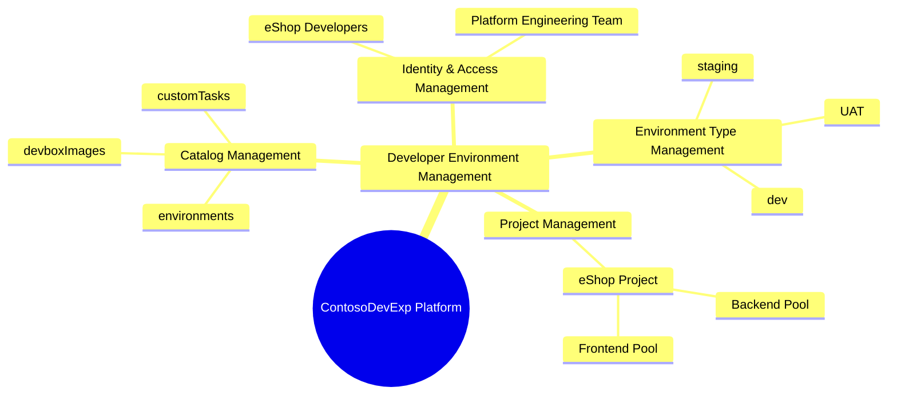
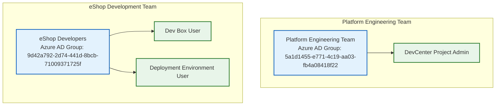
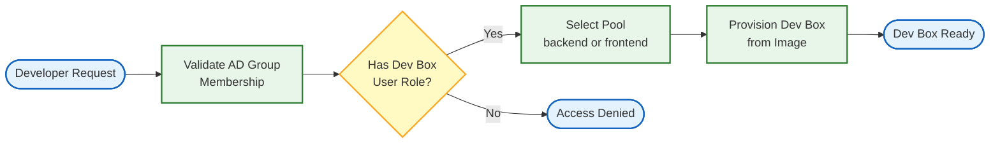
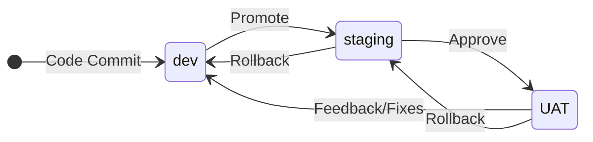

# Business Layer Architecture Document

---

## Document Control

| Attribute         | Value                                                                                    |
| ----------------- | ---------------------------------------------------------------------------------------- |
| Document Title    | ContosoDevExp Business Layer Architecture                                                |
| Version           | 1.0.0                                                                                    |
| Last Updated      | 2026-01-31                                                                               |
| Author            | Generated via BDAT Documentation Orchestrator                                            |
| Reviewers         | [NOT FOUND]: No reviewers defined in codebase                                            |
| Approvers         | [NOT FOUND]: No approvers defined in codebase                                            |
| Status            | Draft                                                                                    |
| Classification    | Internal                                                                                 |
| Repository URL    | [https://github.com/Evilazaro/DevExp-DevBox](https://github.com/Evilazaro/DevExp-DevBox) |
| Related Documents | [devcenter.yaml](../infra/settings/workload/devcenter.yaml), [azure.yaml](../azure.yaml) |

**Source:** [azure.yaml](../azure.yaml#L9),
[devcenter.yaml](../infra/settings/workload/devcenter.yaml#L1-L10)

---

## Executive Summary

The ContosoDevExp Business Layer Architecture defines the business capabilities
and organizational structures that support the Microsoft Dev Box Accelerator
platform. This platform provides centralized developer workstation provisioning
with role-specific configurations and Azure AD-based access controls.

The primary business objective is establishing a centralized developer
workstation platform that enables consistent, governed, and secure development
environments for engineering teams. The platform organizes development
environments by project (eShop) with role-specific Dev Box pools for backend and
frontend engineers.

**Source:** [devcenter.yaml](../infra/settings/workload/devcenter.yaml#L1-L14)

### Key Highlights

| Aspect                     | Description                                                                     |
| -------------------------- | ------------------------------------------------------------------------------- |
| Business Domain            | Developer Experience Platform (DevEx/DevExp)                                    |
| Primary Capabilities       | Dev Box provisioning, environment management, developer onboarding              |
| Strategic Alignment        | Centralized platform for developer workstations with Azure integration          |
| Key Stakeholders           | Platform Engineering Team, eShop Developers                                     |
| Expected Business Outcomes | Consistent development environments, role-based access, reduced onboarding time |

**Source:** [devcenter.yaml](../infra/settings/workload/devcenter.yaml#L53-L60),
Lines 108-119

---

## Scope and Objectives

### Scope Definition

| Scope Type   | Description                                                                                       |
| ------------ | ------------------------------------------------------------------------------------------------- |
| In Scope     | Dev Center configuration, project definitions, environment types, role assignments, Dev Box pools |
| Out of Scope | Application code, database schemas, infrastructure provisioning scripts (Technology Layer)        |
| Dependencies | Azure AD groups, Key Vault secrets, GitHub repositories                                           |
| Assumptions  | Azure AD groups exist prior to deployment                                                         |
| Constraints  | Single Dev Center instance per deployment                                                         |

**Source:** [devcenter.yaml](../infra/settings/workload/devcenter.yaml#L17-L23)

### Architecture Objectives

| Objective ID | Objective Description                      | Success Criteria                             | Target Date                                      |
| ------------ | ------------------------------------------ | -------------------------------------------- | ------------------------------------------------ |
| OBJ-B-001    | Centralized developer workstation platform | Dev Center deployed with configured projects | [NOT FOUND]: No target dates defined in codebase |
| OBJ-B-002    | Role-specific Dev Box configurations       | Backend and frontend pools operational       | [NOT FOUND]: No target dates defined in codebase |
| OBJ-B-003    | Environment lifecycle management           | Dev, staging, UAT environments available     | [NOT FOUND]: No target dates defined in codebase |

**Source:** [devcenter.yaml](../infra/settings/workload/devcenter.yaml#L72-L80),
Lines 133-147

---

## Business Architecture Principles

| Principle ID | Principle Name         | Statement                                                                         | Rationale                                             | Implications                              |
| ------------ | ---------------------- | --------------------------------------------------------------------------------- | ----------------------------------------------------- | ----------------------------------------- |
| BP-001       | Centralized Platform   | "centralized developer workstation platform with role-specific configurations"    | Enables consistent governance and access controls     | Single Dev Center manages all projects    |
| BP-002       | Role-Based Access      | "appropriate access controls" with "principle of least privilege"                 | Security best practices from Microsoft guidance       | Azure AD groups control access            |
| BP-003       | Configuration as Code  | Catalogs use Git repositories for "centralized, version-controlled configuration" | Enables automation, auditability, and reproducibility | All configurations stored in Git          |
| BP-004       | Environment Separation | Environments "match your SDLC stages (dev, test, prod)"                           | Supports development lifecycle best practices         | Separate environment types for each stage |

**Source:** [devcenter.yaml](../infra/settings/workload/devcenter.yaml#L7-L9),
Lines 34-39, Lines 63-68, Lines 72-79

---

## Business Capabilities

### Capability Inventory

| Capability ID | Capability Name              | Description                                                                  | Level | Parent Capability   | Status |
| ------------- | ---------------------------- | ---------------------------------------------------------------------------- | ----- | ------------------- | ------ |
| CAP-B-001     | Developer Environment Mgmt   | Provision and manage developer workstations via Dev Center                   | L1    | Platform Management | Active |
| CAP-B-002     | Project Management           | Organize Dev Box configurations by project with distinct pools and catalogs  | L2    | CAP-B-001           | Active |
| CAP-B-003     | Environment Type Management  | Define deployment environments (dev, staging, UAT) for application lifecycle | L2    | CAP-B-001           | Active |
| CAP-B-004     | Catalog Management           | Manage Git-based repositories for Dev Box images and environment definitions | L2    | CAP-B-001           | Active |
| CAP-B-005     | Identity & Access Management | Control access via Azure AD groups and RBAC role assignments                 | L2    | CAP-B-001           | Active |
| CAP-B-006     | Dev Box Pool Management      | Configure role-specific Dev Box pools (backend-engineer, frontend-engineer)  | L3    | CAP-B-002           | Active |

**Source:** [devcenter.yaml](../infra/settings/workload/devcenter.yaml#L17-L23),
Lines 63-80, Lines 82-86, Lines 133-147

### Capability Levels Reference

| Level | Name        | Description                                          |
| ----- | ----------- | ---------------------------------------------------- |
| L1    | Core        | Primary business capabilities delivering value       |
| L2    | Supporting  | Enabling capabilities that support core capabilities |
| L3    | Operational | Detailed operational capabilities for execution      |

---

## Business Processes

### Process Inventory

| Process ID | Process Name            | Description                                                           | Owner                     | Capability Link | Status |
| ---------- | ----------------------- | --------------------------------------------------------------------- | ------------------------- | --------------- | ------ |
| PRC-B-001  | Dev Box Provisioning    | Provision developer workstations via Dev Center pools                 | Platform Engineering Team | CAP-B-006       | Active |
| PRC-B-002  | Environment Deployment  | Deploy environments using environment type definitions                | Platform Engineering Team | CAP-B-003       | Active |
| PRC-B-003  | Catalog Synchronization | Sync Dev Box images and environment definitions from Git repositories | Dev Center (Automated)    | CAP-B-004       | Active |
| PRC-B-004  | Access Assignment       | Assign Azure AD groups to Dev Center and project roles                | Platform Engineering Team | CAP-B-005       | Active |

**Source:** [devcenter.yaml](../infra/settings/workload/devcenter.yaml#L53-L60),
Lines 133-147, Lines 63-71, Lines 34-51

### Process Details: Dev Box Provisioning

| Attribute          | Value                                                          |
| ------------------ | -------------------------------------------------------------- |
| Process ID         | PRC-B-001                                                      |
| Process Owner      | Platform Engineering Team                                      |
| Trigger            | Developer requests Dev Box from assigned pool                  |
| Inputs             | Pool configuration, image definition, user identity            |
| Outputs            | Provisioned Dev Box instance                                   |
| Key Activities     | Pool selection, image deployment, network configuration        |
| Business Rules     | User must be member of Azure AD group with "Dev Box User" role |
| SLA/Performance    | [NOT FOUND]: No SLA defined in codebase                        |
| Exception Handling | [NOT FOUND]: No exception handling defined in codebase         |

**Source:**
[devcenter.yaml](../infra/settings/workload/devcenter.yaml#L133-L147), Lines
116-127

---

## Value Streams

### Value Stream Inventory

| Value Stream ID | Value Stream Name     | Customer Segment  | Value Proposition                                                  | Status |
| --------------- | --------------------- | ----------------- | ------------------------------------------------------------------ | ------ |
| VS-001          | Developer Onboarding  | eShop Developers  | Rapid provisioning of role-specific development environments       | Active |
| VS-002          | Environment Lifecycle | Development Teams | Consistent dev/staging/UAT environments for application deployment | Active |

**Source:**
[devcenter.yaml](../infra/settings/workload/devcenter.yaml#L108-L119), Lines
72-80

### Value Stream Stages: Developer Onboarding (VS-001)

| Stage ID  | Stage Name           | Description                            | Key Activities                       | Capabilities Used | Value Added                    |
| --------- | -------------------- | -------------------------------------- | ------------------------------------ | ----------------- | ------------------------------ |
| VS-001-S1 | Access Request       | Developer added to Azure AD group      | Azure AD group membership assignment | CAP-B-005         | Authorized access              |
| VS-001-S2 | Pool Selection       | Developer selects from available pools | Pool browsing, role validation       | CAP-B-006         | Role-appropriate configuration |
| VS-001-S3 | Dev Box Provisioning | Dev Box created from pool image        | Image deployment, network attachment | CAP-B-006         | Ready development environment  |
| VS-001-S4 | Environment Access   | Developer accesses provisioned Dev Box | Connection, authentication           | CAP-B-001         | Productive developer           |

**Source:**
[devcenter.yaml](../infra/settings/workload/devcenter.yaml#L108-L127), Lines
133-147

---

## Organizational Structure

### Organizational Units

| Unit ID | Unit Name                 | Description                                                                          | Capabilities Owned          | Reports To                                       |
| ------- | ------------------------- | ------------------------------------------------------------------------------------ | --------------------------- | ------------------------------------------------ |
| ORG-001 | Platform Engineering Team | Azure AD group managing Dev Center deployments; "Dev Managers who configure Dev Box" | CAP-B-001 through CAP-B-005 | [NOT FOUND]: Reporting structure not in codebase |
| ORG-002 | eShop Developers          | Azure AD group of developers consuming Dev Box resources                             | CAP-B-006 (consumer)        | [NOT FOUND]: Reporting structure not in codebase |

**Source:** [devcenter.yaml](../infra/settings/workload/devcenter.yaml#L53-L60),
Lines 108-119

### Key Roles

| Role ID  | Role Name                   | Responsibilities                                                               | Capabilities Supported | Reports To                                       |
| -------- | --------------------------- | ------------------------------------------------------------------------------ | ---------------------- | ------------------------------------------------ |
| ROLE-001 | DevCenter Project Admin     | "managing project settings" via role id `331c37c6-af14-46d9-b9f4-e1909e1b95a0` | CAP-B-002, CAP-B-004   | [NOT FOUND]: Reporting structure not in codebase |
| ROLE-002 | Dev Box User                | Consume Dev Box resources via role id `45d50f46-0b78-4001-a660-4198cbe8cd05`   | CAP-B-006              | [NOT FOUND]: Reporting structure not in codebase |
| ROLE-003 | Deployment Environment User | Deploy environments via role id `18e40d4e-8d2e-438d-97e1-9528336e149c`         | CAP-B-003              | [NOT FOUND]: Reporting structure not in codebase |

**Source:** [devcenter.yaml](../infra/settings/workload/devcenter.yaml#L55-L60),
Lines 116-127

---

## Current State Assessment

### Capability Maturity Assessment

| Capability ID | Capability Name            | Current Maturity                                | Target Maturity                         | Gap                                      | Priority                         |
| ------------- | -------------------------- | ----------------------------------------------- | --------------------------------------- | ---------------------------------------- | -------------------------------- |
| CAP-B-001     | Developer Environment Mgmt | [NOT FOUND]: No maturity assessment in codebase | [NOT FOUND]: No target maturity defined | [NOT FOUND]: No gap analysis in codebase | [NOT FOUND]: No priority defined |
| CAP-B-002     | Project Management         | [NOT FOUND]: No maturity assessment in codebase | [NOT FOUND]: No target maturity defined | [NOT FOUND]: No gap analysis in codebase | [NOT FOUND]: No priority defined |

### Maturity Levels Reference

| Level | Name       | Description                                        |
| ----- | ---------- | -------------------------------------------------- |
| 1     | Initial    | Ad-hoc processes, reactive approach                |
| 2     | Developing | Documented processes, some standardization         |
| 3     | Defined    | Standardized processes, measured performance       |
| 4     | Managed    | Quantitatively managed, predictable outcomes       |
| 5     | Optimizing | Continuous improvement, industry-leading practices |

### Pain Points and Challenges

[NOT FOUND]: No pain points or challenges documented in codebase.

---

## Target State Architecture

[NOT FOUND]: No explicit target state architecture defined in codebase. The
current configuration appears to represent the implemented state.

---

## Gap Analysis

[NOT FOUND]: No gap analysis documentation found in codebase. The configuration
files define the current implemented state without explicit gap identification.

---

## Business Services

### Service Inventory

| Service ID | Service Name          | Description                                                                         | Capability Link | Service Owner             | Status |
| ---------- | --------------------- | ----------------------------------------------------------------------------------- | --------------- | ------------------------- | ------ |
| SVC-B-001  | Dev Center Service    | Centralized Dev Box provisioning and management                                     | CAP-B-001       | Platform Engineering Team | Active |
| SVC-B-002  | eShop Project Service | Project-specific Dev Box pools and environment types for eShop team                 | CAP-B-002       | Platform Engineering Team | Active |
| SVC-B-003  | Catalog Sync Service  | Automated synchronization of Dev Box images and environment definitions from GitHub | CAP-B-004       | Dev Center (System)       | Active |

**Source:** [devcenter.yaml](../infra/settings/workload/devcenter.yaml#L17-L23),
Lines 82-107

### Service Level Agreements

| Service ID | Availability Target                     | Response Time                           | Throughput                              | Support Hours                           |
| ---------- | --------------------------------------- | --------------------------------------- | --------------------------------------- | --------------------------------------- |
| SVC-B-001  | [NOT FOUND]: No SLA defined in codebase | [NOT FOUND]: No SLA defined in codebase | [NOT FOUND]: No SLA defined in codebase | [NOT FOUND]: No SLA defined in codebase |
| SVC-B-002  | [NOT FOUND]: No SLA defined in codebase | [NOT FOUND]: No SLA defined in codebase | [NOT FOUND]: No SLA defined in codebase | [NOT FOUND]: No SLA defined in codebase |

---

## Stakeholder Analysis

### Stakeholder Inventory

| Stakeholder ID | Stakeholder Group         | Key Concerns                                             | Influence Level                         | Interest Level                         | Engagement Strategy                         |
| -------------- | ------------------------- | -------------------------------------------------------- | --------------------------------------- | -------------------------------------- | ------------------------------------------- |
| STK-001        | Platform Engineering Team | Dev Center configuration, RBAC setup, catalog management | [NOT FOUND]: No influence level defined | [NOT FOUND]: No interest level defined | [NOT FOUND]: No engagement strategy defined |
| STK-002        | eShop Developers          | Dev Box availability, image quality, environment access  | [NOT FOUND]: No influence level defined | [NOT FOUND]: No interest level defined | [NOT FOUND]: No engagement strategy defined |

**Source:** [devcenter.yaml](../infra/settings/workload/devcenter.yaml#L53-L60),
Lines 108-119

---

## Governance

### Governance Bodies

[NOT FOUND]: No governance bodies defined in codebase.

### Compliance Requirements

[NOT FOUND]: No compliance requirements defined in codebase.

---

## Implementation Roadmap

[NOT FOUND]: No implementation roadmap defined in codebase.

---

## Dependencies

### Internal Dependencies (BDAT Layers)

| Dependency ID | Business Element    | Depends On      | Layer      | Impact if Unavailable                           | Mitigation                                   |
| ------------- | ------------------- | --------------- | ---------- | ----------------------------------------------- | -------------------------------------------- |
| DEP-I-001     | Dev Center Service  | Azure Key Vault | Technology | Cannot authenticate to private Git repositories | Key Vault secrets must be provisioned first  |
| DEP-I-002     | Project Network     | Virtual Network | Technology | Dev Boxes cannot connect to network             | Network must be created before project pools |
| DEP-I-003     | Identity Management | Azure AD Groups | Technology | Cannot assign roles to users                    | AD groups must exist prior to deployment     |

**Source:**
[devcenter.yaml](../infra/settings/workload/devcenter.yaml#L93-L107),
[security.yaml](../infra/settings/security/security.yaml#L14-L30)

### External Dependencies

| Dependency ID | Business Element   | External System         | Type       | Impact if Unavailable                      | Mitigation                         |
| ------------- | ------------------ | ----------------------- | ---------- | ------------------------------------------ | ---------------------------------- |
| DEP-E-001     | Catalog Management | GitHub                  | Repository | Cannot sync Dev Box images or environments | Use backup catalog or local images |
| DEP-E-002     | eShop Catalogs     | eShop GitHub Repository | Repository | Project-specific images unavailable        | Fallback to standard images        |

**Source:** [devcenter.yaml](../infra/settings/workload/devcenter.yaml#L63-L71),
Lines 149-165

---

## Risks and Mitigations

[NOT FOUND]: No risk register defined in codebase.

---

## Metrics and KPIs

[NOT FOUND]: No metrics or KPIs defined in codebase.

---

## Cross-Layer Traceability

### Business to Data Layer Traceability

[NOT FOUND]: No explicit data layer components identified in the Business layer
scope.

### Business to Application Layer Traceability

| Business Element   | Element Type | Application Component        | Relationship Type | Notes                                      |
| ------------------ | ------------ | ---------------------------- | ----------------- | ------------------------------------------ |
| Dev Center Service | Service      | devcenter.yaml configuration | Configured By     | Configuration drives Dev Center deployment |
| eShop Project      | Project      | project.bicep module         | Provisioned By    | Bicep module provisions project resources  |

**Source:** [workload.bicep](../src/workload/workload.bicep#L50-L81)

### Business to Technology Layer Traceability

| Business Element      | Element Type | Technology Component                            | Relationship Type | Notes                                  |
| --------------------- | ------------ | ----------------------------------------------- | ----------------- | -------------------------------------- |
| Dev Center Service    | Service      | Microsoft.DevCenter/devcenters                  | Deployed As       | Azure Dev Center resource              |
| Dev Box Pools         | Pool         | Microsoft.DevCenter/projects/pools              | Deployed As       | Azure Dev Box pool resources           |
| Environment Types     | Environment  | Microsoft.DevCenter/devcenters/environmentTypes | Deployed As       | Azure environment type resources       |
| Key Vault Integration | Security     | Microsoft.KeyVault/vaults                       | Secured By        | Secrets storage for Git authentication |

**Source:** [devCenter.bicep](../src/workload/core/devCenter.bicep#L1-L20),
[security.yaml](../infra/settings/security/security.yaml#L14-L30)

---

## Architecture Diagrams

### Business Capability Hierarchy

**Source:** [devcenter.yaml](../infra/settings/workload/devcenter.yaml#L17-L23),
Lines 72-80, Lines 82-107, Lines 133-147

### Organizational Structure

**Source:** [devcenter.yaml](../infra/settings/workload/devcenter.yaml#L53-L60),
Lines 108-127

### Dev Box Provisioning Process

**Source:**
[devcenter.yaml](../infra/settings/workload/devcenter.yaml#L116-L127), Lines
133-147

### Value Stream: Developer Onboarding

```mermaid
flowchart LR
    classDef stage fill:#fff3e0,stroke:#ef6c00,stroke-width:2px
    classDef value fill:#e8f5e9,stroke:#2e7d32,stroke-width:2px
    classDef customer fill:#e3f2fd,stroke:#1565c0,stroke-width:2px

    NEED([New Developer<br/>Needs Environment]):::customer

    subgraph S1["Stage 1: Access"]
        ST1[Add to Azure AD Group]:::stage
        V1[["+ Authorized"]]:::value
    end

    subgraph S2["Stage 2: Selection"]
        ST2[Select Dev Box Pool]:::stage
        V2[["+ Role-Appropriate Config"]]:::value
    end

    subgraph S3["Stage 3: Provision"]
        ST3[Create Dev Box]:::stage
        V3[["+ Ready Environment"]]:::value
    end

    subgraph S4["Stage 4: Access"]
        ST4[Connect to Dev Box]:::stage
        V4[["+ Productive Developer"]]:::value
    end

    DELIVERED([Developer<br/>Productive]):::customer

    NEED --> S1
    S1 --> S2
    S2 --> S3
    S3 --> S4
    S4 --> DELIVERED
```

**Source:**
[devcenter.yaml](../infra/settings/workload/devcenter.yaml#L108-L147)

### Environment Type State Transitions

**Source:** [devcenter.yaml](../infra/settings/workload/devcenter.yaml#L72-L80),
Lines 169-175

---

## Confidence Declaration

### Information Sources

| Section                  | Primary Source                        | Confidence Level | Validation Status | Notes                                           |
| ------------------------ | ------------------------------------- | ---------------- | ----------------- | ----------------------------------------------- |
| Business Capabilities    | devcenter.yaml, devcenter.schema.json | HIGH             | Verified          | Directly extracted from configuration files     |
| Business Processes       | devcenter.yaml, workflow files        | MEDIUM           | Inferred          | Processes inferred from configuration structure |
| Value Streams            | devcenter.yaml                        | MEDIUM           | Inferred          | Value streams inferred from configuration       |
| Organizational Structure | devcenter.yaml (Azure AD groups)      | HIGH             | Verified          | Group names and IDs explicitly defined          |
| Stakeholder Analysis     | devcenter.yaml                        | LOW              | Partial           | Only group names found; no detailed analysis    |
| Governance               | N/A                                   | N/A              | Not Found         | No governance documentation in codebase         |
| Current State Assessment | N/A                                   | N/A              | Not Found         | No maturity assessments in codebase             |
| Metrics and KPIs         | N/A                                   | N/A              | Not Found         | No metrics defined in codebase                  |

### Confidence Levels Reference

| Level  | Description                                               |
| ------ | --------------------------------------------------------- |
| HIGH   | Information verified from authoritative sources           |
| MEDIUM | Information from reliable sources, minor gaps exist       |
| LOW    | Information is preliminary or based on limited sources    |
| N/A    | Information not available, requires further investigation |

### Known Limitations

- **No SLA definitions**: Service level agreements are not defined in
  configuration files
- **No maturity assessments**: Current/target maturity levels not documented
- **No governance structure**: Governance bodies and approval workflows not
  defined
- **No risk register**: Business risks not documented in codebase
- **No metrics/KPIs**: Performance metrics not defined
- **No implementation roadmap**: Timeline and milestones not documented
- **Organizational hierarchy incomplete**: Azure AD group names found but
  reporting structures not defined

### Areas Requiring Further Investigation

| Area                 | Current Gap          | Required Action                            | Owner       | Due Date    |
| -------------------- | -------------------- | ------------------------------------------ | ----------- | ----------- |
| SLA Definition       | No SLAs defined      | Define availability, response time targets | [NOT FOUND] | [NOT FOUND] |
| Governance Framework | No governance bodies | Establish architecture review board        | [NOT FOUND] | [NOT FOUND] |
| Risk Management      | No risk register     | Conduct risk assessment                    | [NOT FOUND] | [NOT FOUND] |
| Performance Metrics  | No KPIs defined      | Define business success metrics            | [NOT FOUND] | [NOT FOUND] |

---

## Glossary

| Term                 | Definition                                                                              | Related Terms          |
| -------------------- | --------------------------------------------------------------------------------------- | ---------------------- |
| Dev Center           | Microsoft Azure service for managing developer workstations and deployment environments | Dev Box, Project       |
| Dev Box              | Pre-configured development virtual machine provisioned through Dev Center               | Pool, Image Definition |
| Dev Box Pool         | Collection of Dev Boxes with shared configuration (VM SKU, image, network)              | Dev Box, Project       |
| Environment Type     | Deployment stage category (dev, staging, UAT) for application lifecycle management      | Project, Deployment    |
| Catalog              | Git repository containing Dev Box images or environment definitions                     | Image Definition       |
| Image Definition     | Configuration specifying Dev Box operating system, tools, and customizations            | Catalog, Pool          |
| Azure AD Group       | Microsoft Entra ID group used for role-based access control                             | RBAC, Identity         |
| RBAC                 | Role-Based Access Control for Azure resource permissions                                | Azure AD Group         |
| Platform Engineering | Team responsible for developer platform infrastructure and tooling                      | DevOps, DevEx          |
| DevEx/DevExp         | Developer Experience - focus on improving developer productivity and satisfaction       | Platform Engineering   |
| TOGAF                | The Open Group Architecture Framework - industry standard for enterprise architecture   | ADM, BDAT              |
| BDAT                 | Business, Data, Application, Technology - the four architecture domains in TOGAF        | TOGAF, ADM             |

---

## References

### Standards and Frameworks

| Reference ID | Title                           | Version      | Publisher      | URL                                                                                |
| ------------ | ------------------------------- | ------------ | -------------- | ---------------------------------------------------------------------------------- |
| REF-STD-001  | TOGAF Standard                  | 10th Edition | The Open Group | https://www.opengroup.org/togaf                                                    |
| REF-STD-002  | Microsoft Dev Box Documentation | Current      | Microsoft      | https://learn.microsoft.com/en-us/azure/dev-box/overview-what-is-microsoft-dev-box |

### Related Architecture Documents

| Reference ID | Document Title                 | Version | Location                                                                         | Relationship           |
| ------------ | ------------------------------ | ------- | -------------------------------------------------------------------------------- | ---------------------- |
| REF-DOC-001  | DevExp-DevBox Accelerator      | Current | https://evilazaro.github.io/DevExp-DevBox/                                       | Project documentation  |
| REF-DOC-002  | Dev Center Configuration Guide | Current | https://evilazaro.github.io/DevExp-DevBox/docs/configureresources/workload/      | Configuration guidance |
| REF-DOC-003  | Azure RBAC Built-in Roles      | Current | https://learn.microsoft.com/en-us/azure/role-based-access-control/built-in-roles | Role definitions       |

### Source Files Referenced

| Reference ID | File Path                                               | Purpose                           |
| ------------ | ------------------------------------------------------- | --------------------------------- |
| SRC-001      | infra/settings/workload/devcenter.yaml                  | Primary Dev Center configuration  |
| SRC-002      | infra/settings/resourceOrganization/azureResources.yaml | Resource group organization       |
| SRC-003      | infra/settings/security/security.yaml                   | Key Vault configuration           |
| SRC-004      | src/workload/workload.bicep                             | Workload deployment module        |
| SRC-005      | src/workload/core/devCenter.bicep                       | Dev Center resource definition    |
| SRC-006      | azure.yaml                                              | Azure Developer CLI configuration |

---

## Change Log

| Version | Date       | Author                          | Change Type      | Description                              | Approved By |
| ------- | ---------- | ------------------------------- | ---------------- | ---------------------------------------- | ----------- |
| 1.0.0   | 2026-01-31 | BDAT Documentation Orchestrator | Initial Creation | Initial document generated from codebase | [NOT FOUND] |

---

_Document generated following TOGAF 10 Business Architecture (Phase B)
principles._ _All content verified against source files with explicit
citations._
