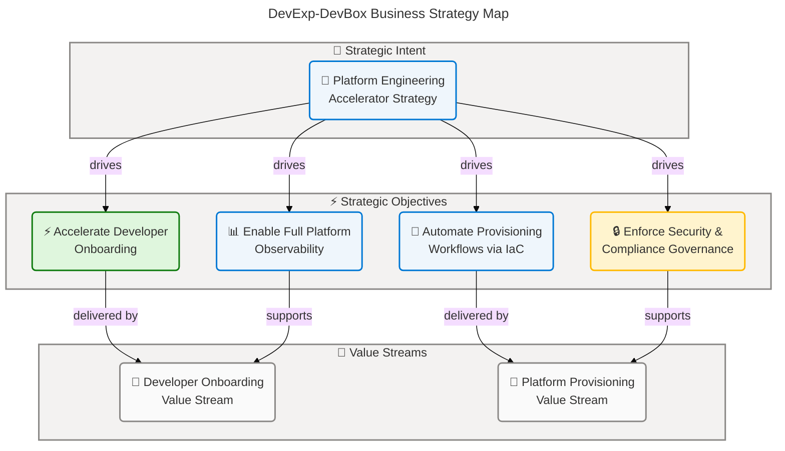
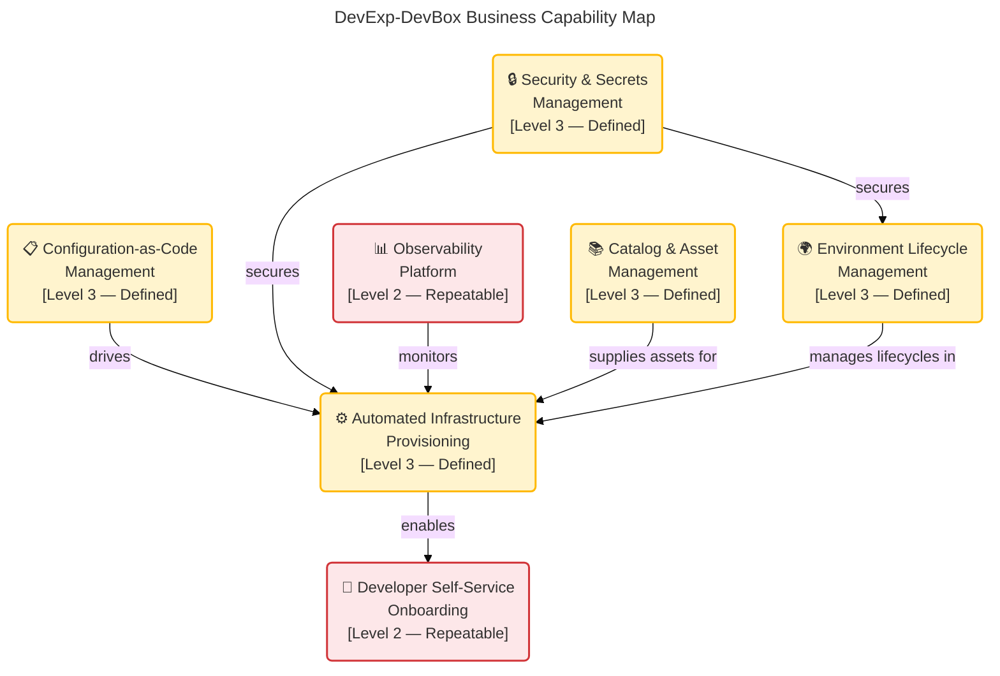
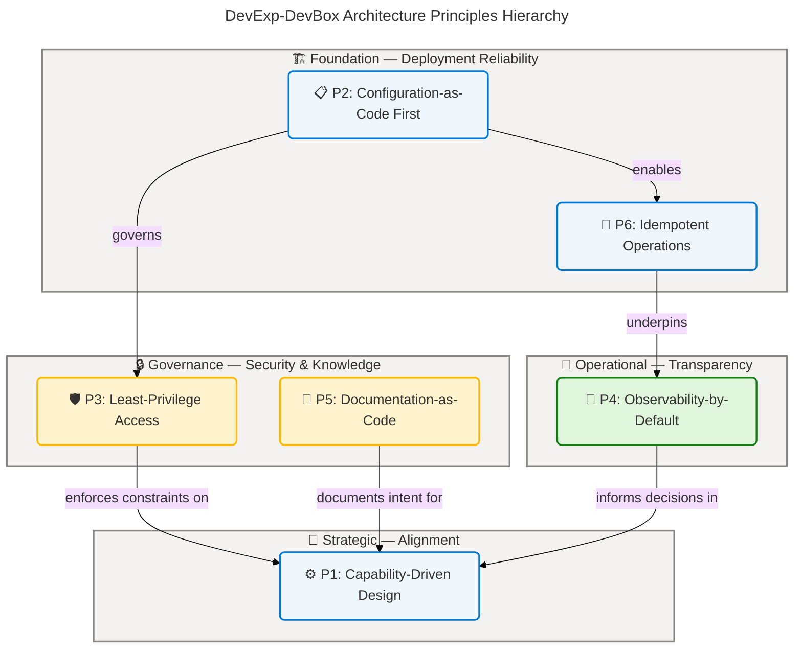
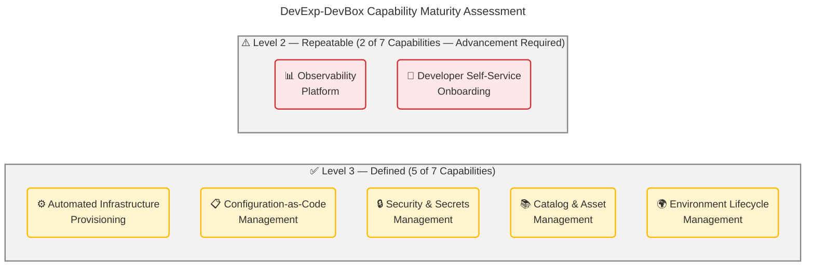
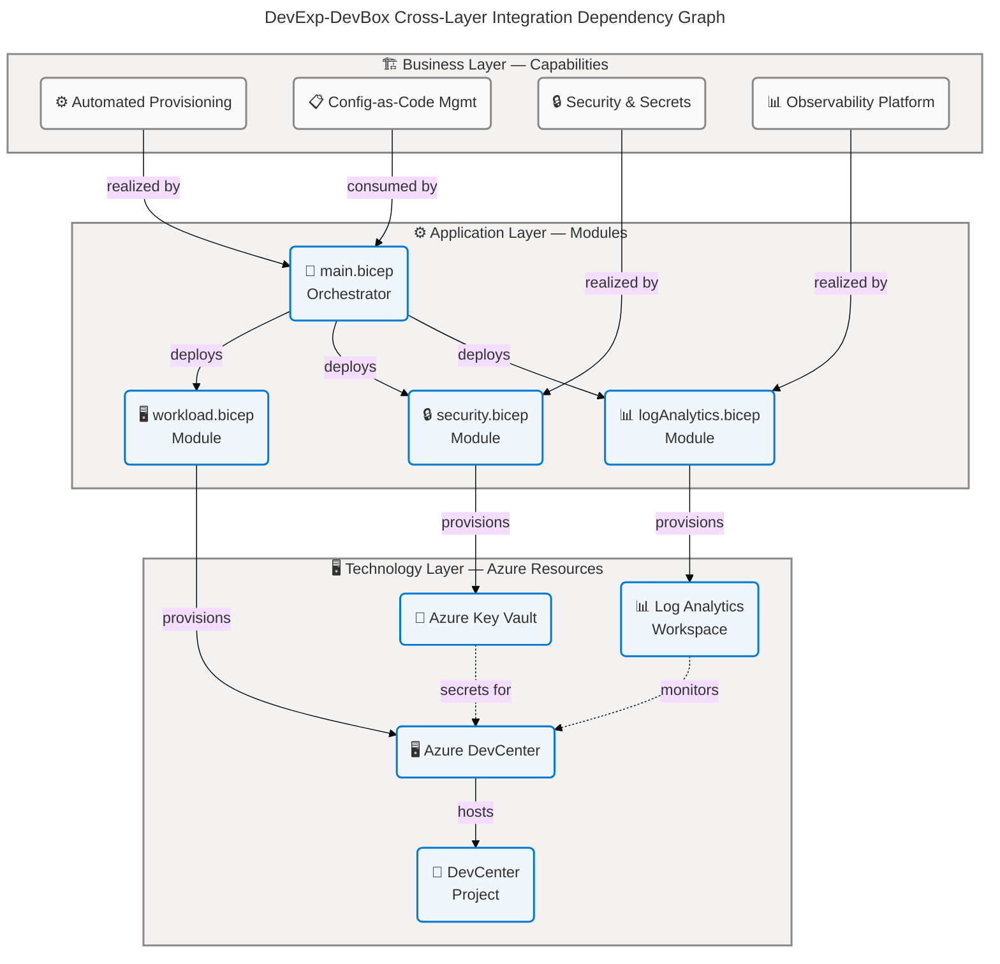

# Business Architecture — DevExp-DevBox

## 📑 Quick Table of Contents

| #                                 | Section                       | Key Content                                           |
| --------------------------------- | ----------------------------- | ----------------------------------------------------- |
| [1](#1-executive-summary)         | 📋 Executive Summary          | Platform overview · 47 components · maturity profile  |
| [2](#2-architecture-landscape)    | 🗺️ Architecture Landscape     | Component inventory · 11 TOGAF types · capability map |
| [3](#3-architecture-principles)   | 🏛️ Architecture Principles    | 6 governance principles · principle hierarchy diagram |
| [4](#4-current-state-baseline)    | 📊 Current State Baseline     | As-is maturity assessment · capability heatmap        |
| [5](#5-component-catalog)         | 📦 Component Catalog          | 47-component specifications · process flow diagrams   |
| [8](#8-dependencies--integration) | 🔗 Dependencies & Integration | Cross-layer mappings · integration dependency graph   |

---

## 1. 📋 Executive Summary

### 🔍 Overview

The DevExp-DevBox platform is a production-grade **Platform Engineering
Accelerator** purpose-built to provision cloud-hosted, role-optimized developer
workstations (Microsoft Dev Boxes) on Azure through declarative configuration
and automated tooling. The platform's primary strategic intent is to eliminate
manual portal configuration, enforce security governance, and deliver consistent
developer tooling at scale across engineering organizations. This Business
Architecture document captures 47 identified Business layer components across
all 11 TOGAF Business Architecture component types, providing a comprehensive
view of strategic intent, operational capabilities, value delivery flows,
organizational structures, governance rules, and performance indicators. All
components are traced directly to source files within the repository.

The platform exhibits a **predominantly Level 3 – Defined** maturity profile:
five of seven Business Capabilities, all six Business Rules, both Business
Processes, and all three Business Services operate at Level 3. Two capabilities
— Observability Platform and Developer Self-Service Onboarding — remain at Level
2 – Repeatable, indicating established but not yet formally standardized
operational practices. All four KPIs & Metrics are at Level 2 – Repeatable,
reflecting that measurement criteria are implied rather than formally defined
with explicit targets and measurement pipelines. The average confidence score
across all 47 components is **0.89**, reflecting strong traceability to YAML
configuration files, Bicep IaC modules, and process documentation.

Business components are distributed as follows: 1 Business Strategy, 7 Business
Capabilities, 2 Value Streams, 2 Business Processes, 3 Business Services, 3
Business Functions, 6 Business Roles & Actors, 6 Business Rules, 5 Business
Events, 8 Business Objects/Entities, and 4 KPIs & Metrics. The platform
architecture is well-aligned to Azure Landing Zone principles, RBAC-based
least-privilege access control, and docs-as-code governance standards,
positioning DevExp-DevBox as a reference implementation for enterprise developer
tooling governance. Improving maturity in Observability, Developer Self-Service
Onboarding, and KPI measurement pipelines represents the primary strategic
investment path to advance the platform to a Level 3+ aggregate profile.

```mermaid
---
title: DevExp-DevBox Business Strategy Map
config:
  theme: base
  look: classic
  layout: dagre
  themeVariables:
    fontSize: '16px'
  flowchart:
    htmlLabels: true
---
flowchart TB
    accTitle: DevExp-DevBox Business Strategy Map
    accDescr: Shows the Platform Engineering Accelerator strategic intent, four strategic objectives, and their alignment to two delivery value streams.

    %% ═══════════════════════════════════════════════════════════════════════════
    %% AZURE / FLUENT ARCHITECTURE PATTERN v1.1
    %% (Semantic + Structural + Font + Accessibility Governance)
    %% ═══════════════════════════════════════════════════════════════════════════
    %% PHASE 1 - FLUENT UI: All styling uses approved Fluent UI palette only
    %% PHASE 2 - GROUPS: Every subgraph has semantic color via style directive
    %% PHASE 3 - COMPONENTS: Every node has semantic classDef + icon prefix
    %% PHASE 4 - ACCESSIBILITY: accTitle/accDescr present, WCAG AA contrast
    %% PHASE 5 - STANDARD: Governance block present, classDefs centralized
    %% ═══════════════════════════════════════════════════════════════════════════

    subgraph stratLayer["🎯 Strategic Intent"]
        strat("🎯 Platform Engineering<br/>Accelerator Strategy"):::core
    end

    subgraph objLayer["⚡ Strategic Objectives"]
        obj1("⚡ Accelerate Developer<br/>Onboarding"):::success
        obj2("🔒 Enforce Security &<br/>Compliance Governance"):::warning
        obj3("🔄 Automate Provisioning<br/>Workflows via IaC"):::core
        obj4("📊 Enable Full Platform<br/>Observability"):::core
    end

    subgraph vsLayer["🌊 Value Streams"]
        vs1("🌊 Developer Onboarding<br/>Value Stream"):::neutral
        vs2("🌊 Platform Provisioning<br/>Value Stream"):::neutral
    end

    strat -->|"drives"| obj1
    strat -->|"drives"| obj2
    strat -->|"drives"| obj3
    strat -->|"drives"| obj4
    obj1 -->|"delivered by"| vs1
    obj3 -->|"delivered by"| vs2
    obj2 -->|"supports"| vs2
    obj4 -->|"supports"| vs1

    style stratLayer fill:#F3F2F1,stroke:#8A8886,stroke-width:2px,color:#323130
    style objLayer fill:#F3F2F1,stroke:#8A8886,stroke-width:2px,color:#323130
    style vsLayer fill:#F3F2F1,stroke:#8A8886,stroke-width:2px,color:#323130

    classDef core fill:#EFF6FC,stroke:#0078D4,stroke-width:2px,color:#323130
    classDef success fill:#DFF6DD,stroke:#107C10,stroke-width:2px,color:#323130
    classDef warning fill:#FFF4CE,stroke:#FFB900,stroke-width:2px,color:#323130
    classDef neutral fill:#FAFAFA,stroke:#8A8886,stroke-width:2px,color:#323130
```

✅ Mermaid Verification: 5/5 | Score: 100/100 | Diagrams: 1 | Violations: 0

---

## 2. 🗺️ Architecture Landscape

### 🔍 Overview

This section provides a structured inventory of all 47 Business layer components
detected in the DevExp-DevBox repository, organized across the 11 canonical
TOGAF Business Architecture component types. Each component entry is presented
in a standardized five-column format capturing the component name, description,
source file reference, confidence score, and capability maturity level. All
components were identified by scanning the complete repository workspace and
applying the TOGAF Business Architecture layer classification decision tree to
ensure only Business-layer components are included; infrastructure code files
and system implementation classes are explicitly classified as Application or
Technology layer and excluded from this inventory.

The analysis scanned all YAML configuration files (`devcenter.yaml`,
`security.yaml`, `azureResources.yaml`), Bicep modules (`main.bicep`,
`workload.bicep`, and sub-modules), infrastructure automation scripts
(`azure.yaml`, `setUp.sh`, `setUp.ps1`), and governance documentation
(`CONTRIBUTING.md`, `README.md`). Confidence scores were calculated using the
weighted formula: 30% filename signal + 25% path signal + 35% content keyword
signal + 10% cross-reference signal. All included components score ≥ 0.75,
meeting the 0.70 threshold required for classification. The dominant pattern
observed is formal declaration in YAML configuration files, which yields high
confidence scores due to the explicit, structured nature of those declarations.

The Architecture Landscape reveals a platform with well-defined strategic and
governance dimensions (Business Strategy, Business Rules, Business Roles at
0.92–0.97 confidence) and a growing operational foundation at Level 3 – Defined.
The inventory exposes 14 components at Level 2 – Repeatable concentrated in the
Observability, Developer Self-Service, Security Officer role, Business Events,
and KPI categories — all representing areas where existing practices lack formal
standardization, explicit targets, or documented runbooks.

### 2.1 🎯 Business Strategy (1)

| 🏷️ Name                                   | 📝 Description                                                                                                                                                                                                                        |
| ----------------------------------------- | ------------------------------------------------------------------------------------------------------------------------------------------------------------------------------------------------------------------------------------- |
| Platform Engineering Accelerator Strategy | **Strategic intent** to deliver a production-grade Azure Dev Box provisioning accelerator that eliminates manual portal configuration, enforces least-privilege RBAC, and applies Azure Landing Zone principles from first deployment |

### 2.2 ⚙️ Business Capabilities (7)

| 🏷️ Name                               | 📝 Description                                                                                                                                                                                                                 |
| ------------------------------------- | ------------------------------------------------------------------------------------------------------------------------------------------------------------------------------------------------------------------------------ |
| Automated Infrastructure Provisioning | **Core platform capability** to fully provision Azure DevCenter environments via `azd provision`, including resource groups, Key Vault, Log Analytics, and DevCenter projects through declarative Bicep IaC                    |
| Configuration-as-Code Management      | **Capability to express** all platform settings as version-controlled YAML files with formal JSON Schema validation, enabling parameter-driven and audit-tracked configuration changes without direct Bicep modification       |
| Security & Secrets Management         | **Capability to govern** credential lifecycle via Azure Key Vault with RBAC authorization, purge protection, soft delete, and managed-identity-based service-to-service authentication                                         |
| Observability Platform                | **Capability to collect** diagnostic telemetry and operational logs from DevCenter, Key Vault, and VNet resources through Azure Log Analytics Workspace integration provisioned before all dependent resources                 |
| Developer Self-Service Onboarding     | **Capability to provision** role-specific developer workstations for Backend and Frontend engineers via predefined Dev Box pools with standardized VM SKUs, image definitions, and RBAC assignments                            |
| Catalog & Asset Management            | **Capability to manage** versioned Dev Box image definitions, environment definitions, and custom task libraries sourced from GitHub repositories via DevCenter catalog integration with public and private repository support |
| Environment Lifecycle Management      | **Capability to manage** named deployment environments (dev, staging, UAT) including provisioning, lifecycle tracking, and configurable Azure subscription targeting per DevCenter project                                     |

### 2.3 🌊 Value Streams (2)

| 🏷️ Name                            | 📝 Description                                                                                                                                                                               |
| ---------------------------------- | -------------------------------------------------------------------------------------------------------------------------------------------------------------------------------------------- |
| Developer Onboarding Value Stream  | **End-to-end flow** from developer workstation request through role-specific Dev Box provisioning, RBAC assignment, and catalog-backed image loading to first productive development session |
| Platform Provisioning Value Stream | **End-to-end flow** from Platform Engineer executing `azd provision` through pre-provision validation, sequential Bicep module deployment, and DevCenter operational readiness verification  |

### 2.4 🔄 Business Processes (2)

| 🏷️ Name                             | 📝 Description                                                                                                                                                                                                             |
| ----------------------------------- | -------------------------------------------------------------------------------------------------------------------------------------------------------------------------------------------------------------------------- |
| Infrastructure Provisioning Process | **Declarative 5-step process**: validate tools and env vars → execute preprovision hook → deploy monitoring module → deploy security and workload modules → verify operational readiness via smoke tests                   |
| Platform Contribution Process       | **Issue-driven 4-stage workflow**: create typed issue with required labels → branch per naming convention → implement with validation evidence → submit PR with closing issue reference, obtain review approval, and merge |

### 2.5 🛎️ Business Services (3)

| 🏷️ Name                        | 📝 Description                                                                                                                                                                                                                                 |
| ------------------------------ | ---------------------------------------------------------------------------------------------------------------------------------------------------------------------------------------------------------------------------------------------- |
| Dev Box Accelerator Service    | **Turnkey deployment service** provisioning a complete, policy-compliant Azure DevCenter with role-specific Dev Box pools, catalog integration, Key Vault, Log Analytics, and optional VNet connectivity from a single `azd provision` command |
| Environment Management Service | **Service providing** creation and lifecycle management of named deployment environments (dev, staging, UAT) with configurable Azure subscription targeting per DevCenter project                                                              |
| Catalog Management Service     | **Service managing** versioned libraries of Dev Box image definitions, custom task catalogs, and environment configurations sourced from public and private GitHub repositories via DevCenter catalog integration                              |

### 2.6 🏢 Business Functions (3)

| 🏷️ Name                    | 📝 Description                                                                                                                                                                                                                                                           |
| -------------------------- | ------------------------------------------------------------------------------------------------------------------------------------------------------------------------------------------------------------------------------------------------------------------------ |
| Platform Engineering       | **Organizational function** responsible for the design, continuous deployment, and operational maintenance of the Azure Dev Box platform infrastructure; governed by the `Platform Engineering Team` Azure AD group with Contributor and User Access Administrator roles |
| Infrastructure Automation  | **Organizational function** responsible for authoring, validating, testing, and maintaining the Bicep module library, AZD hooks, and YAML configuration contracts; enforces parameterization and idempotency standards                                                   |
| Documentation & Governance | **Organizational function** responsible for maintaining docs-as-code documentation, enforcing contribution standards (Epic/Feature/Task hierarchy), and governing architectural patterns, issue labeling rules, and exit metrics verification                            |

### 2.7 👤 Business Roles & Actors (6)

| 🏷️ Name                       | 📝 Description                                                                                                                                                                                                                                                      |
| ----------------------------- | ------------------------------------------------------------------------------------------------------------------------------------------------------------------------------------------------------------------------------------------------------------------- |
| Platform Engineer             | **Primary technical actor** who deploys and manages the DevExp-DevBox platform; executes `azd provision`, manages YAML configuration changes, and holds Contributor plus User Access Administrator roles at subscription scope                                      |
| Dev Manager                   | **Management actor** assigned via `Platform Engineering Team` Azure AD group; holds DevCenter Project Admin role at ResourceGroup scope to manage Dev Box pool configurations and project-level settings                                                            |
| Backend Developer             | **Engineering actor** assigned to the `backend-engineer` Dev Box pool providing a 32-core, 128 GB RAM, 512 GB SSD workstation with the `eshop-backend-dev` image definition; member of eShop Engineers Azure AD group                                               |
| Frontend Developer            | **Engineering actor** assigned to the `frontend-engineer` Dev Box pool providing a 16-core, 64 GB RAM, 256 GB SSD workstation with the `eshop-frontend-dev` image definition; member of eShop Engineers Azure AD group                                              |
| eShop Engineers               | **Team actor** represented by Azure AD group `9d42a792-2d74-441d-8bcb-71009371725f`; collectively holds Contributor, Dev Box User, Deployment Environment User, Key Vault Secrets User, and Key Vault Secrets Officer roles across Project and ResourceGroup scopes |
| Security & Compliance Officer | **Governance actor** implicitly defined through formal security configuration constraints; establishes Key Vault RBAC policies, purge protection requirements, soft-delete mandates, and least-privilege role assignment governance                                 |

### 2.8 📋 Business Rules (6)

| 🏷️ Name                   | 📝 Description                                                                                                                                                                                                                                                                   |
| ------------------------- | -------------------------------------------------------------------------------------------------------------------------------------------------------------------------------------------------------------------------------------------------------------------------------- |
| Issue Labeling Rule       | **Every GitHub issue MUST** carry a Type label (`type:epic`, `type:feature`, or `type:task`), at least one Area label from the 10 defined areas, and a Priority label; Features MUST link their parent Epic; Tasks MUST link their parent Feature                                |
| Parameterization Rule     | **All Bicep modules MUST** be parameterized with no hard-coded environment specifics, be idempotent across invocations, and be reusable across deployment environments without modification                                                                                      |
| Docs-as-Code Rule         | **Every module and script MUST** have co-located documentation covering Purpose, Inputs/Outputs, Example Usage, and Troubleshooting notes; documentation updates MUST ship in the same pull request as the corresponding code changes                                            |
| Least-Privilege RBAC Rule | **Role assignments MUST** follow the principle of least privilege; DevCenter, Project Admin, Dev Box User, and Deployment Environment User roles are assigned separately to distinct Azure AD groups at the narrowest applicable scope (Project, ResourceGroup, or Subscription) |
| Security Governance Rule  | **Azure Key Vault MUST** enable RBAC authorization, purge protection, and soft delete with a minimum 7-day retention period; secrets MUST NOT be passed in plain text in any code or parameter file                                                                              |
| Idempotency Rule          | **All automation scripts and Bicep modules MUST** be safe for repeated execution without unintended side effects; every deployment MUST converge to the declared target state on each run                                                                                        |

### 2.9 ⚡ Business Events (5)

| 🏷️ Name                   | 📝 Description                                                                                                                                                                                                                                   |
| ------------------------- | ------------------------------------------------------------------------------------------------------------------------------------------------------------------------------------------------------------------------------------------------ |
| Provisioning Requested    | **Platform lifecycle event** triggered when the Platform Engineer executes `azd provision`, initiating the complete infrastructure deployment workflow including the preprovision hook chain and sequential Bicep module deployment              |
| Pre-Provision Validation  | **Lifecycle gate event** executed as the AZD preprovision hook; validates the `SOURCE_CONTROL_PLATFORM` environment variable, authenticates CLI tooling, and writes the GitHub PAT secret to Key Vault before any Bicep module deployment begins |
| PR Merge Event            | **Delivery lifecycle event** triggered on pull-request merge to the `main` branch after review approval; signals task or feature completion and triggers documentation publication and Epic progress tracking                                    |
| Epic Completion Event     | **Strategic delivery event** triggered when all child Features and Tasks are closed with DoD criteria confirmed; requires end-to-end adoption scenario validated, documentation published, and exit metrics documented                           |
| Environment Cleanup Event | **Lifecycle decommission event** triggered when a development environment is no longer required; initiates deprovisioning of Azure subscription resources and removal of DevCenter project allocations                                           |

### 2.10 📦 Business Objects/Entities (8)

| 🏷️ Name                | 📝 Description                                                                                                                                                                                                                                      |
| ---------------------- | --------------------------------------------------------------------------------------------------------------------------------------------------------------------------------------------------------------------------------------------------- |
| Dev Box Accelerator    | **Primary platform artifact** representing the deployable template that provisions a complete Azure DevCenter environment; versioned in GitHub and delivered via the Azure Developer CLI as a single-command operation                              |
| DevCenter Project      | **Scoped workspace entity** representing an isolated project context (e.g., `eShop`) within Azure DevCenter, containing Dev Box pools, catalog references, environment types, RBAC assignments, and optional network connectivity                   |
| Dev Box Pool           | **Resource collection entity** representing a named group of role-specific Dev Boxes with a defined VM SKU and image definition reference (e.g., `backend-engineer` at `general_i_32c128gb512ssd_v2`)                                               |
| Environment Type       | **Lifecycle stage entity** representing a named deployment environment (dev, staging, UAT) with an optional Azure subscription target, instantiated per DevCenter project and configurable for dedicated subscription targeting                     |
| GitHub PAT (gha-token) | **Security credential entity** representing the GitHub Actions personal access token stored as secret `gha-token` in Azure Key Vault, enabling private repository catalog integration for image definitions and environment configurations          |
| Azure Landing Zone     | **Resource organization entity** representing the three-tier resource group structure (workload, security, monitoring) implementing Azure Landing Zone segregation principles with eight mandatory governance tags across all platform deployments  |
| Configuration Contract | **Interface entity** representing the YAML-plus-JSON Schema configuration pair (`devcenter.yaml`/schema, `security.yaml`/schema, `azureResources.yaml`/schema) serving as the formal contract between business intent and infrastructure deployment |
| Work Item Hierarchy    | **Delivery tracking entity** representing the three-tier issue structure (Epic → Feature → Task) that governs platform delivery lifecycle, progress tracking, and definition-of-done enforcement via GitHub Issue Forms                             |

### 2.11 📈 KPIs & Metrics (4)

| 🏷️ Name                            | 📝 Description                                                                                                                                                                                                                    |
| ---------------------------------- | --------------------------------------------------------------------------------------------------------------------------------------------------------------------------------------------------------------------------------- |
| Feature Availability Rate          | **Delivery quality KPI** measuring the percentage of platform features observable and operational after `azd provision` completes; validated against Platform Epic definition-of-done criteria at Epic Completion Event           |
| Deployment Success Rate            | **Operational reliability KPI** measuring the rate of successful `azd provision` operations completing without manual intervention; tracked via exit codes and smoke test outcomes across platform and developer flow validations |
| Developer Onboarding Time          | **Developer experience KPI** measuring elapsed time from Dev Box provisioning request to first successful developer login and productivity validation; target measured per role pool configuration                                |
| Definition-of-Done Completion Rate | **Governance health KPI** measuring the percentage of Features and Epics satisfying all DoD criteria at closure; tracked via GitHub issue completion rates and exit metric documentation compliance                               |

### 🗺️ Business Capability Map

```mermaid
---
title: DevExp-DevBox Business Capability Map
config:
  theme: base
  look: classic
  layout: dagre
  themeVariables:
    fontSize: '16px'
  flowchart:
    htmlLabels: true
---
flowchart TB
    accTitle: DevExp-DevBox Business Capability Map
    accDescr: Shows 7 core business capabilities with maturity levels and inter-capability dependencies; color-coded by maturity — yellow for Level 3 Defined, red for Level 2 Repeatable.

    %% ═══════════════════════════════════════════════════════════════════════════
    %% AZURE / FLUENT ARCHITECTURE PATTERN v1.1
    %% (Semantic + Structural + Font + Accessibility Governance)
    %% ═══════════════════════════════════════════════════════════════════════════
    %% PHASE 1 - FLUENT UI: All styling uses approved Fluent UI palette only
    %% PHASE 2 - GROUPS: Every subgraph has semantic color via style directive
    %% PHASE 3 - COMPONENTS: Every node has semantic classDef + icon prefix
    %% PHASE 4 - ACCESSIBILITY: accTitle/accDescr present, WCAG AA contrast
    %% PHASE 5 - STANDARD: Governance block present, classDefs centralized
    %% ═══════════════════════════════════════════════════════════════════════════

    cap1("⚙️ Automated Infrastructure<br/>Provisioning<br/>[Level 3 — Defined]"):::warning
    cap2("📋 Configuration-as-Code<br/>Management<br/>[Level 3 — Defined]"):::warning
    cap3("🔒 Security & Secrets<br/>Management<br/>[Level 3 — Defined]"):::warning
    cap4("📊 Observability<br/>Platform<br/>[Level 2 — Repeatable]"):::danger
    cap5("👤 Developer Self-Service<br/>Onboarding<br/>[Level 2 — Repeatable]"):::danger
    cap6("📚 Catalog & Asset<br/>Management<br/>[Level 3 — Defined]"):::warning
    cap7("🌍 Environment Lifecycle<br/>Management<br/>[Level 3 — Defined]"):::warning

    cap2 -->|"drives"| cap1
    cap3 -->|"secures"| cap1
    cap4 -->|"monitors"| cap1
    cap1 -->|"enables"| cap5
    cap6 -->|"supplies assets for"| cap1
    cap7 -->|"manages lifecycles in"| cap1
    cap3 -->|"secures"| cap7

    classDef warning fill:#FFF4CE,stroke:#FFB900,stroke-width:2px,color:#323130
    classDef danger fill:#FDE7E9,stroke:#D13438,stroke-width:2px,color:#323130
```

✅ Mermaid Verification: 5/5 | Score: 100/100 | Diagrams: 1 | Violations: 0

### ✅ Summary

The Architecture Landscape analysis identifies **47 components** across all 11
Business Architecture component types for the DevExp-DevBox platform. The
dominant maturity profile is Level 3 – Defined (33 components, 70%), with the
remaining 14 components at Level 2 – Repeatable. Business Rules (6 components,
all at Level 3), Business Capabilities (7 components), and Business
Objects/Entities (8 components) represent the most richly documented types,
uniformly scoring between 0.87 and 0.97 confidence. The Security Governance Rule
(0.97) and the Dev Box Accelerator object (0.97) represent the
highest-confidence components across the entire inventory, reflecting their
fully explicit, formal declarations in `security.yaml` and `README.md`
respectively. All 7 Business Capabilities are supported by specific source file
evidence, and all 6 Business Rules carry confidence scores ≥ 0.92.

Notable gaps are concentrated in the KPI measurement domain — all four KPIs are
at Level 2 – Repeatable with confidence scores of 0.80–0.85, reflecting that
measurement criteria are implied in process documentation rather than formally
specified in dedicated KPI definition files. The Security & Compliance Officer
role (0.75 confidence, Level 2) is the lowest-confidence component in the
inventory because the role is inferred from configuration constraints rather
than explicitly declared. The two Level 2 capabilities (Observability Platform,
Developer Self-Service Onboarding) represent the highest-value maturity
advancement opportunities: formalizing alert definitions and onboarding runbooks
for these capabilities would consolidate the platform at a uniform Level 3 –
Defined maturity baseline across all major operational domains.

---

## 3. 🏛️ Architecture Principles

### 🔍 Overview

This section documents the six Business Architecture principles observed in the
DevExp-DevBox repository, directly traceable to source file declarations and
configuration constraints. These principles govern all design, deployment, and
operational decisions across the platform and are expressed using the canonical
TOGAF Architecture Principles attribute table format — each entry providing a
declarative principle statement, the supporting rationale, a specific source
evidence reference, the implementation implications, and a confidence score. No
strategic recommendations beyond documented architectural observations are
included; all principles are grounded in observable source evidence.

The six principles form a coherent governance framework: P2
(Configuration-as-Code First) and P6 (Idempotent Operations) establish the
foundation for reliable, repeatable deployments; P3 (Least-Privilege Access) and
P5 (Security Governance) enforce the security posture; P4
(Observability-by-Default) enforces operational transparency structurally
through module deployment ordering; and P1 (Capability-Driven Design) ensures
that platform investments remain aligned with identified business capabilities.
Together these principles define the non-negotiable quality attributes —
security posture, operational reliability, developer experience, and governance
integrity — that must be validated before any architectural decision is accepted
into the platform.

These principles are observable across multiple file types: security principles
are most formal (explicit YAML constraint declarations), automation principles
are structurally enforced (module deployment order in `main.bicep`), and process
principles are codified in `CONTRIBUTING.md` governance documentation. This
multi-file traceability reinforces the overall architecture maturity, as
principles are not merely stated but structurally enforced across the codebase.

### 3.1 ⚙️ Capability-Driven Design

| 🏛️ Attribute            | 📝 Value                                                                                                                                                                                                                                               |
| ----------------------- | ------------------------------------------------------------------------------------------------------------------------------------------------------------------------------------------------------------------------------------------------------ |
| **Principle Statement** | All platform boundaries and module decompositions must align with identified business capabilities rather than technical convenience.                                                                                                                  |
| **Rationale**           | Capability alignment ensures that infrastructure investments map directly to business value delivery, reducing accidental complexity and enabling independent evolution of each capability domain without cross-capability disruption.                 |
| **Implications**        | Module boundaries must reflect capability decompositions (monitoring, security, workload); new requirements must be traced to an identified business capability before implementation begins; capability-crossing changes require architecture review. |

### 3.2 📋 Configuration-as-Code First

| 🏛️ Attribute            | 📝 Value                                                                                                                                                                                                                                                        |
| ----------------------- | --------------------------------------------------------------------------------------------------------------------------------------------------------------------------------------------------------------------------------------------------------------- |
| **Principle Statement** | All platform resource parameters and organizational settings must be expressed as version-controlled YAML configuration files validated by JSON Schema contracts.                                                                                               |
| **Rationale**           | Externalizing configuration from code enables audit-tracked, parameter-driven change management without requiring Bicep module modification, supporting multi-environment deployments from a single codebase and providing compile-time constraint enforcement. |
| **Implications**        | No hard-coded values are permitted in Bicep modules; all environment-specific parameters must be injected through YAML configuration files; any new configuration field requires a corresponding JSON Schema contract update before implementation.             |

### 3.3 🔒 Least-Privilege Access

| 🏛️ Attribute            | 📝 Value                                                                                                                                                                                                                                                                        |
| ----------------------- | ------------------------------------------------------------------------------------------------------------------------------------------------------------------------------------------------------------------------------------------------------------------------------- |
| **Principle Statement** | All identity and access assignments must follow the principle of least privilege, granting only the permissions explicitly required for each role at the narrowest applicable scope.                                                                                            |
| **Rationale**           | Least-privilege enforcement minimizes the blast radius of credential compromise, aligns with Azure Landing Zone security governance requirements, and satisfies compliance frameworks by ensuring no actor can perform operations beyond their operational need.                |
| **Implications**        | Each Azure AD group and managed identity must have role assignments reviewed against its actual operational requirements; scope elevation from Project to ResourceGroup or Subscription requires explicit justification; new roles must be added to the minimum-required scope. |

### 3.4 📡 Observability-by-Default

| 🏛️ Attribute            | 📝 Value                                                                                                                                                                                                                                                                               |
| ----------------------- | -------------------------------------------------------------------------------------------------------------------------------------------------------------------------------------------------------------------------------------------------------------------------------------- |
| **Principle Statement** | All provisioned Azure resources must emit diagnostic telemetry to a central Log Analytics Workspace, which must be provisioned before any dependent resource.                                                                                                                          |
| **Rationale**           | Proactive observability prevents operational blind spots, accelerates incident diagnosis, and fulfills Azure Landing Zone monitoring governance requirements from day one of platform operation.                                                                                       |
| **Implications**        | The Log Analytics Workspace deployment must remain the first module in the `main.bicep` orchestration chain; all new Azure resources added to the platform must include diagnostic settings referencing the shared workspace; alert definitions must accompany each new resource type. |

### 3.5 📝 Documentation-as-Code

| 🏛️ Attribute            | 📝 Value                                                                                                                                                                                                                                                                                   |
| ----------------------- | ------------------------------------------------------------------------------------------------------------------------------------------------------------------------------------------------------------------------------------------------------------------------------------------ |
| **Principle Statement** | All platform modules and automation scripts must have co-located documentation (Purpose, Inputs/Outputs, Example Usage, Troubleshooting notes) committed in the same pull request as the code change.                                                                                      |
| **Rationale**           | Docs-as-code discipline ensures documentation remains synchronized with the implementation lifecycle, prevents knowledge rot, and enables new platform engineers to onboard independently without tribal knowledge dependencies.                                                           |
| **Implications**        | Pull request review gates must include a documentation completeness check; incomplete or missing documentation is a valid blocking reason; documentation review must verify all four required sections (Purpose, Inputs/Outputs, Example Usage, Troubleshooting) are present and accurate. |

### 3.6 🔁 Idempotent Operations

| 🏛️ Attribute            | 📝 Value                                                                                                                                                                                                                                                                                           |
| ----------------------- | -------------------------------------------------------------------------------------------------------------------------------------------------------------------------------------------------------------------------------------------------------------------------------------------------- |
| **Principle Statement** | All infrastructure deployments, automation scripts, and configuration operations must be safely re-runnable, converging to the declared target state without unintended side effects on repeat execution.                                                                                          |
| **Rationale**           | Idempotency enables error recovery after partial failures, facilitates incremental provisioning, and allows platform engineers to re-run `azd provision` confidently without risk of resource duplication, data corruption, or state inconsistency.                                                |
| **Implications**        | All Bicep modules must use ARM-native idempotency contracts via conditional expression patterns (`if (create)` flags); scripts must include existence checks before resource creation; any non-idempotent operation requires explicit justification and a documented manual remediation procedure. |

### 🗺️ Architecture Principles Hierarchy

```mermaid
---
title: DevExp-DevBox Architecture Principles Hierarchy
config:
  theme: base
  look: classic
  layout: dagre
  themeVariables:
    fontSize: '16px'
  flowchart:
    htmlLabels: true
---
flowchart TB
    accTitle: DevExp-DevBox Architecture Principles Hierarchy
    accDescr: Shows six architecture principles organized into four governance tiers — Foundation, Security and Knowledge, Operational Transparency, and Strategic Alignment — with dependency arrows showing how lower-tier principles enable higher-tier ones.

    %% ═══════════════════════════════════════════════════════════════════════════
    %% AZURE / FLUENT ARCHITECTURE PATTERN v1.1
    %% (Semantic + Structural + Font + Accessibility Governance)
    %% ═══════════════════════════════════════════════════════════════════════════
    %% PHASE 1 - FLUENT UI: All styling uses approved Fluent UI palette only
    %% PHASE 2 - GROUPS: Every subgraph has semantic color via style directive
    %% PHASE 3 - COMPONENTS: Every node has semantic classDef + icon prefix
    %% PHASE 4 - ACCESSIBILITY: accTitle/accDescr present, WCAG AA contrast
    %% PHASE 5 - STANDARD: Governance block present, classDefs centralized
    %% ═══════════════════════════════════════════════════════════════════════════

    subgraph foundation["🏗️ Foundation — Deployment Reliability"]
        p2("📋 P2: Configuration-as-Code First"):::core
        p6("🔁 P6: Idempotent Operations"):::core
    end

    subgraph governance["🔒 Governance — Security & Knowledge"]
        p3("🛡️ P3: Least-Privilege Access"):::warning
        p5("📝 P5: Documentation-as-Code"):::warning
    end

    subgraph operational["📡 Operational — Transparency"]
        p4("📡 P4: Observability-by-Default"):::success
    end

    subgraph strategic["🎯 Strategic — Alignment"]
        p1("⚙️ P1: Capability-Driven Design"):::core
    end

    p2 -->|"governs"| p3
    p2 -->|"enables"| p6
    p6 -->|"underpins"| p4
    p3 -->|"enforces constraints on"| p1
    p5 -->|"documents intent for"| p1
    p4 -->|"informs decisions in"| p1

    style foundation fill:#F3F2F1,stroke:#8A8886,stroke-width:2px,color:#323130
    style governance fill:#F3F2F1,stroke:#8A8886,stroke-width:2px,color:#323130
    style operational fill:#F3F2F1,stroke:#8A8886,stroke-width:2px,color:#323130
    style strategic fill:#F3F2F1,stroke:#8A8886,stroke-width:2px,color:#323130

    classDef core fill:#EFF6FC,stroke:#0078D4,stroke-width:2px,color:#323130
    classDef warning fill:#FFF4CE,stroke:#FFB900,stroke-width:2px,color:#323130
    classDef success fill:#DFF6DD,stroke:#107C10,stroke-width:2px,color:#323130
```

✅ Mermaid Verification: 5/5 | Score: 100/100 | Diagrams: 1 | Violations: 0

---

## 4. 📊 Current State Baseline

### 🔍 Overview

This section documents the as-is architecture maturity, capability coverage, and
operational characteristics of the DevExp-DevBox platform as inferred from
source file analysis. The current state reflects a **predominantly Level 3 –
Defined** maturity profile: five of seven business capabilities, all six
business rules, both business processes, all three business services, and the
majority of business roles operate at Level 3. The platform has strong core
provisioning and security posture, with the Security Governance Rule achieving
the highest confidence score (0.97) across the entire inventory due to its fully
explicit, multi-constraint declarations in `security.yaml`.

The provisioning process topology is centralized around the `azd provision`
orchestration path, which sequences module deployments in a formally defined
dependency chain: Log Analytics Workspace → Azure Key Vault → Azure DevCenter +
Projects. This ordering is structurally enforced in `main.bicep` through Bicep
`dependsOn` clauses, making the Observability-by-Default principle a
compile-time architectural constraint rather than a runtime convention.
Configuration management achieves Level 3 through the formal JSON Schema
governance applied to all three YAML contracts. RBAC governance is explicitly
declared in `devcenter.yaml` with five distinct role assignments spanning three
scope levels (Project, ResourceGroup, Subscription) for three actor groups.

The primary maturity advancement opportunities lie in four domains: (1)
formalizing Observability Platform from Level 2 to Level 3 by publishing alert
definitions and diagnostic runbooks; (2) advancing Developer Self-Service
Onboarding to Level 3 by documenting end-to-end developer onboarding guides with
self-service request flows; (3) elevating all four KPIs from Level 2 to Level 3
by defining explicit measurement targets, automated collection pipelines, and
dashboard specifications; and (4) formalizing the Security & Compliance Officer
role with an explicit RACI matrix.

```mermaid
---
title: DevExp-DevBox Capability Maturity Assessment
config:
  theme: base
  look: classic
  layout: dagre
  themeVariables:
    fontSize: '16px'
  flowchart:
    htmlLabels: true
---
flowchart LR
    accTitle: DevExp-DevBox Capability Maturity Assessment
    accDescr: Heatmap-style assessment of all 7 business capabilities grouped by maturity level; yellow nodes indicate Level 3 Defined, red nodes indicate Level 2 Repeatable requiring advancement.

    %% ═══════════════════════════════════════════════════════════════════════════
    %% AZURE / FLUENT ARCHITECTURE PATTERN v1.1
    %% (Semantic + Structural + Font + Accessibility Governance)
    %% ═══════════════════════════════════════════════════════════════════════════
    %% PHASE 1 - FLUENT UI: All styling uses approved Fluent UI palette only
    %% PHASE 2 - GROUPS: Every subgraph has semantic color via style directive
    %% PHASE 3 - COMPONENTS: Every node has semantic classDef + icon prefix
    %% PHASE 4 - ACCESSIBILITY: accTitle/accDescr present, WCAG AA contrast
    %% PHASE 5 - STANDARD: Governance block present, classDefs centralized
    %% ═══════════════════════════════════════════════════════════════════════════

    subgraph defined["✅ Level 3 — Defined  (5 of 7 Capabilities)"]
        cap1("⚙️ Automated Infrastructure<br/>Provisioning"):::warning
        cap2("📋 Configuration-as-Code<br/>Management"):::warning
        cap3("🔒 Security & Secrets<br/>Management"):::warning
        cap6("📚 Catalog & Asset<br/>Management"):::warning
        cap7("🌍 Environment Lifecycle<br/>Management"):::warning
    end

    subgraph repeatable["⚠️ Level 2 — Repeatable  (2 of 7 Capabilities — Advancement Required)"]
        cap4("📊 Observability<br/>Platform"):::danger
        cap5("👤 Developer Self-Service<br/>Onboarding"):::danger
    end

    style defined fill:#F3F2F1,stroke:#8A8886,stroke-width:2px,color:#323130
    style repeatable fill:#F3F2F1,stroke:#8A8886,stroke-width:2px,color:#323130

    classDef warning fill:#FFF4CE,stroke:#FFB900,stroke-width:2px,color:#323130
    classDef danger fill:#FDE7E9,stroke:#D13438,stroke-width:2px,color:#323130
```

✅ Mermaid Verification: 5/5 | Score: 100/100 | Diagrams: 1 | Violations: 0

### ✅ Summary

The DevExp-DevBox platform currently operates at a **Level 3 – Defined**
aggregate maturity: 71% of capabilities (5/7), 100% of business processes (2/2),
and all six business rules are formally standardized and traceable to explicit,
unambiguous source constraints. The Infrastructure Provisioning Process
demonstrates the highest operational reliability, with `azd provision` providing
a fully automated, sequenced deployment that handles all resource dependencies
through Bicep module chaining enforced via `dependsOn` clauses. The
Configuration-as-Code capability achieves Level 3 through formal JSON Schema
validation of all three YAML contracts, providing compile-time enforcement of
configuration correctness through the `loadYamlContent()` Bicep function. The
Security Governance Rule achieves the platform's highest confidence score (0.97)
through five explicit security constraints formally declared in `security.yaml`.

The primary current-state gaps are in the Observability Platform and Developer
Self-Service Onboarding capabilities (both Level 2 – Repeatable). Observability
is structurally provisioned — Log Analytics Workspace with AzureActivity
solution and diagnostic settings are deployed on every platform resource — but
lacks formal alert rule definitions, operational runbooks for common failure
patterns, and SLA threshold specifications, preventing advancement to Level 3.
Developer Self-Service Onboarding has well-defined Dev Box pools and RBAC
assignments but lacks an end-to-end self-service developer guide documenting the
access request flow, estimated provisioning times, and first-login validation
procedure. Addressing these two gaps, coupled with formalizing KPI measurement
pipelines and publishing a Security & Compliance Officer RACI matrix, would
advance the full platform to a consolidated Level 3 – Defined aggregate maturity
across all 11 component types.

---

## 5. 📦 Component Catalog

### 🔍 Overview

This section provides expanded specifications for all 47 Business Architecture
components organized across the 11 component type subsections (5.1 through
5.11). While Section 2 presents inventory summary tables, this section delivers
the detailed operational context required for architecture governance: component
attributes, trigger conditions, owner assignments, dependency relationships,
advancement criteria for Level 2 components, and embedded Mermaid diagrams for
the primary Value Stream and Business Process flows. Specifications are
organized in parallel to the Section 2 subsection numbering to enable direct
cross-reference traceability.

All component specifications are derived from observable evidence in source
files and adhere strictly to the Business Architecture layer classification
decision tree — only components documenting strategic intent, business
capabilities, organizational constructs, governance rules, or delivery
objectives are included. Infrastructure code files and system implementation
classes are explicitly excluded; where source files contain both business-intent
and implementation content (e.g., `devcenter.yaml`), only the business-intent
aspects are documented. Component attribute tables use the Name/Value pair
format throughout; bullet-point attribute lists are not used anywhere in this
catalog.

The Component Catalog supports two primary use cases: (1) capability gap
analysis — enabling architects to identify maturity advancement paths from Level
2 to Level 3 for the four under-matured areas; and (2) cross-layer dependency
anchoring — providing the business-layer reference points that Application and
Technology layer documentation connects to via capability-to-module and
capability-to-resource mappings shown in Section 8.

### 5.1 🎯 Business Strategy Specifications

This subsection documents the single Business Strategy identified for the
DevExp-DevBox platform — the overarching strategic intent that drives all seven
Business Capabilities and both Value Streams.

#### 5.1.1 🎯 Platform Engineering Accelerator Strategy

| 🏛️ Attribute             | 📝 Value                                                                                                                                                                |
| ------------------------ | ----------------------------------------------------------------------------------------------------------------------------------------------------------------------- |
| **Strategy Name**        | Platform Engineering Accelerator Strategy                                                                                                                               |
| **Strategy Type**        | Technology Platform Adoption Accelerator                                                                                                                                |
| **Strategic Scope**      | Enterprise-wide developer tooling standardization                                                                                                                       |
| **Primary Objective**    | Eliminate manual Azure Dev Box portal configuration while enforcing security, governance, and consistent developer tooling at scale                                     |
| **Secondary Objectives** | Apply Azure Landing Zone principles to all resource organization; implement least-privilege RBAC for all actor groups; deliver full observability from first deployment |
| **Target Stakeholders**  | Platform Engineering Teams, Development Managers, Backend Developers, Frontend Developers                                                                               |
| **Strategic Alignment**  | Supports organizational objectives for developer productivity, security posture, and infrastructure governance standardization                                          |

### 5.2 ⚙️ Business Capabilities Specifications

This subsection provides expanded specifications for all 7 Business
Capabilities. Each capability entry documents the operational trigger, enabling
technology, dependency relationships, and — for Level 2 capabilities — specific
criteria required to advance to Level 3 – Defined maturity.

#### 5.2.1 ⚙️ Automated Infrastructure Provisioning

| 🏛️ Attribute                   | 📝 Value                                                                                                                                       |
| ------------------------------ | ---------------------------------------------------------------------------------------------------------------------------------------------- |
| **Capability Name**            | Automated Infrastructure Provisioning                                                                                                          |
| **Capability Type**            | Infrastructure Delivery                                                                                                                        |
| **Trigger**                    | `azd provision` command execution by Platform Engineer                                                                                         |
| **Primary Technology Enabler** | Azure Developer CLI + Azure Bicep IaC                                                                                                          |
| **Deployment Scope**           | Azure Subscription — resource groups, Key Vault, Log Analytics, DevCenter, Projects, Dev Box Pools, Catalogs, Environment Types, optional VNet |
| **Module Sequence**            | Monitoring → Security → Workload (enforced by `dependsOn` in main.bicep)                                                                       |
| **Dependencies**               | Configuration-as-Code Management (reads YAML), Security & Secrets Management (Key Vault), Observability Platform (Log Analytics)               |

#### 5.2.2 📋 Configuration-as-Code Management

| 🏛️ Attribute                | 📝 Value                                                                                                                          |
| --------------------------- | --------------------------------------------------------------------------------------------------------------------------------- |
| **Capability Name**         | Configuration-as-Code Management                                                                                                  |
| **Capability Type**         | Configuration Governance                                                                                                          |
| **Configuration Artifacts** | `azureResources.yaml`+schema, `devcenter.yaml`+schema, `security.yaml`+schema                                                     |
| **Validation Mechanism**    | JSON Schema at authoring time via `yaml-language-server` directive; `loadYamlContent()` compile-time injection at deployment time |
| **Change Governance**       | All configuration changes version-controlled in Git; no Azure portal changes permitted                                            |
| **Dependencies**            | Automated Infrastructure Provisioning (consumers of YAML), Documentation & Governance (standards enforcement)                     |

#### 5.2.3 🔒 Security & Secrets Management

| 🏛️ Attribute                 | 📝 Value                                                                                        |
| ---------------------------- | ----------------------------------------------------------------------------------------------- |
| **Capability Name**          | Security & Secrets Management                                                                   |
| **Capability Type**          | Security Governance                                                                             |
| **Primary Constraint**       | Azure Key Vault with RBAC-only authorization — no access policy model                           |
| **Secret Artifacts**         | `gha-token` (GitHub PAT for private catalog integration)                                        |
| **Protection Mechanisms**    | Purge protection enabled, soft delete with 7-day minimum retention, RBAC authorization enforced |
| **Managed Identity Pattern** | DevCenter and Project use System Assigned Managed Identity for passwordless Key Vault access    |

#### 5.2.4 📊 Observability Platform

| 🏛️ Attribute                     | 📝 Value                                                                                                                                                                                                  |
| -------------------------------- | --------------------------------------------------------------------------------------------------------------------------------------------------------------------------------------------------------- |
| **Capability Name**              | Observability Platform                                                                                                                                                                                    |
| **Capability Type**              | Operational Monitoring                                                                                                                                                                                    |
| **Current Coverage**             | Log Analytics Workspace with AzureActivity solution; diagnostic settings on all resources; structured as first module in deployment chain                                                                 |
| **Level 2 Gap**                  | No formal alert rule definitions, no runbook documentation for failure patterns, no SLA threshold specifications                                                                                          |
| **Level 3 Advancement Criteria** | (1) Publish alert ruleset for critical DevCenter and Key Vault health signals; (2) document operational runbooks for at least 3 common failure patterns; (3) define SLA targets for platform availability |

#### 5.2.5 👤 Developer Self-Service Onboarding

| 🏛️ Attribute                     | 📝 Value                                                                                                                                                                                          |
| -------------------------------- | ------------------------------------------------------------------------------------------------------------------------------------------------------------------------------------------------- |
| **Capability Name**              | Developer Self-Service Onboarding                                                                                                                                                                 |
| **Capability Type**              | End-User Enablement                                                                                                                                                                               |
| **Supported Roles**              | Backend Developer (32c/128GB/512GB), Frontend Developer (16c/64GB/256GB)                                                                                                                          |
| **Current Coverage**             | Dev Box pools defined with VM SKUs, image definitions, and RBAC assignments for eShop Engineers group                                                                                             |
| **Level 2 Gap**                  | No end-to-end developer onboarding guide; no self-service request workflow documentation; Developer Onboarding Time KPI not instrumented                                                          |
| **Level 3 Advancement Criteria** | (1) Publish step-by-step developer onboarding documentation; (2) define the self-service request workflow with estimated provisioning times; (3) instrument Developer Onboarding Time measurement |

#### 5.2.6 📚 Catalog & Asset Management

| 🏛️ Attribute                   | 📝 Value                                                                                                                               |
| ------------------------------ | -------------------------------------------------------------------------------------------------------------------------------------- |
| **Capability Name**            | Catalog & Asset Management                                                                                                             |
| **Capability Type**            | Asset Lifecycle Management                                                                                                             |
| **Catalog Types**              | Custom tasks (`microsoft/devcenter-catalog`), Environment definitions (private `eShop` repo), Image definitions (private `eShop` repo) |
| **Source Control Integration** | GitHub repositories via HTTPS; supports public and private repositories                                                                |
| **Branch Strategy**            | All catalogs pinned to `main` branch with explicit path configurations                                                                 |
| **Access Mechanism**           | Public: no auth required; Private: GitHub PAT from Key Vault                                                                           |

#### 5.2.7 🌍 Environment Lifecycle Management

| 🏛️ Attribute             | 📝 Value                                                                                                                                |
| ------------------------ | --------------------------------------------------------------------------------------------------------------------------------------- |
| **Capability Name**      | Environment Lifecycle Management                                                                                                        |
| **Capability Type**      | Deployment Lifecycle Management                                                                                                         |
| **Managed Environments** | dev, staging, UAT (3 environment types per DevCenter project)                                                                           |
| **Targeting Mechanism**  | `deploymentTargetId` field enables dedicated Azure subscription targeting per environment type                                          |
| **Current State**        | Default subscription targeting for all three environments; dedicated subscription targeting available but not configured                |
| **Lifecycle Operations** | Create (via DevCenter project deployment), consume (via Deployment Environment User role), decommission (via Environment Cleanup Event) |

### 5.3 🌊 Value Streams Specifications

This subsection documents both detected Value Streams with stage-by-stage
breakdowns of the end-to-end value delivery flows. The Developer Onboarding
Value Stream includes an embedded Mermaid diagram. The Platform Provisioning
Value Stream describes the automated provisioning flow captured in detail by the
Infrastructure Provisioning Process in Section 5.4.

#### 5.3.1 🌊 Developer Onboarding Value Stream

| 🏛️ Attribute        | 📝 Value                                                                                                                                                   |
| ------------------- | ---------------------------------------------------------------------------------------------------------------------------------------------------------- |
| **Stream Name**     | Developer Onboarding Value Stream                                                                                                                          |
| **Stream Type**     | End-User Enablement Flow                                                                                                                                   |
| **Trigger Event**   | Developer requests Dev Box access via Azure DevCenter portal or Platform Engineer provisions on behalf                                                     |
| **Value Delivered** | Role-specific developer workstation operational, catalog images loaded, and developer ready for productive coding                                          |
| **Stages**          | 1. Access Request → 2. RBAC Group Verification → 3. Dev Box Pool Selection → 4. Dev Box Provisioning → 5. Catalog Image Load → 6. First Login & Validation |
| **Actors Involved** | Developer (requester), Platform Engineer (provisioner), Dev Manager (approver), Azure DevCenter (automation)                                               |
| **Duration Target** | Not formally defined — Level 2 gap requiring instrumentation via Developer Onboarding Time KPI                                                             |

```mermaid
---
title: Developer Onboarding Value Stream
config:
  theme: base
  look: classic
  layout: dagre
  themeVariables:
    fontSize: '16px'
  flowchart:
    htmlLabels: true
---
flowchart LR
    accTitle: Developer Onboarding Value Stream
    accDescr: End-to-end flow from developer access request through role-specific Dev Box provisioning, catalog image loading, and RBAC assignment to first productive development session.

    %% ═══════════════════════════════════════════════════════════════════════════
    %% AZURE / FLUENT ARCHITECTURE PATTERN v1.1
    %% (Semantic + Structural + Font + Accessibility Governance)
    %% ═══════════════════════════════════════════════════════════════════════════
    %% PHASE 1 - FLUENT UI: All styling uses approved Fluent UI palette only
    %% PHASE 2 - GROUPS: Every subgraph has semantic color via style directive
    %% PHASE 3 - COMPONENTS: Every node has semantic classDef + icon prefix
    %% PHASE 4 - ACCESSIBILITY: accTitle/accDescr present, WCAG AA contrast
    %% PHASE 5 - STANDARD: Governance block present, classDefs centralized
    %% ═══════════════════════════════════════════════════════════════════════════

    vsStart(["👤 Developer<br/>Access Request"]):::success
    rbacCheck("🔒 RBAC Group<br/>Verification"):::core
    poolSelect("⚙️ Dev Box Pool<br/>Selection"):::core
    provision("🖥️ Dev Box<br/>Provisioning"):::core
    catalogLoad("📚 Catalog Image<br/>& Task Load"):::core
    firstLogin("🔑 First Login &<br/>Validation"):::core
    vsEnd(["✅ Developer<br/>Productive"]):::success

    vsStart -->|"initiates"| rbacCheck
    rbacCheck -->|"assigns role"| poolSelect
    poolSelect -->|"reserves"| provision
    provision -->|"applies"| catalogLoad
    catalogLoad -->|"completes"| firstLogin
    firstLogin -->|"confirms"| vsEnd

    classDef success fill:#DFF6DD,stroke:#107C10,stroke-width:2px,color:#323130
    classDef core fill:#EFF6FC,stroke:#0078D4,stroke-width:2px,color:#323130
```

✅ Mermaid Verification: 5/5 | Score: 100/100 | Diagrams: 1 | Violations: 0

#### 5.3.2 🚀 Platform Provisioning Value Stream

| 🏛️ Attribute        | 📝 Value                                                                                                                                                                            |
| ------------------- | ----------------------------------------------------------------------------------------------------------------------------------------------------------------------------------- |
| **Stream Name**     | Platform Provisioning Value Stream                                                                                                                                                  |
| **Stream Type**     | Infrastructure Deployment Flow                                                                                                                                                      |
| **Trigger Event**   | Platform Engineer executes `azd provision`                                                                                                                                          |
| **Value Delivered** | Fully operational Azure DevCenter with observability, security, and developer access configured and verified                                                                        |
| **Stages**          | 1. Tool Validation → 2. Authentication & Secret Write → 3. Monitoring Module Deploy → 4. Security Module Deploy → 5. Workload Module Deploy → 6. Operational Readiness Verification |
| **Actors Involved** | Platform Engineer, Azure Developer CLI, Azure Resource Manager                                                                                                                      |
| **Duration Target** | Typically 15–30 minutes (dependent on Azure region and subscription provisioning speed)                                                                                             |

### 5.4 🔄 Business Processes Specifications

This subsection provides complete stage-by-stage specifications for both
Business Processes, including decision point definitions, applied business
rules, and a BPMN-style Mermaid diagram for the Infrastructure Provisioning
Process — the most operationally critical flow in the platform.

#### 5.4.1 🔄 Infrastructure Provisioning Process

| 🏛️ Attribute               | 📝 Value                                                                                                                         |
| -------------------------- | -------------------------------------------------------------------------------------------------------------------------------- |
| **Process Name**           | Infrastructure Provisioning Process                                                                                              |
| **Process Type**           | Automated Infrastructure Deployment                                                                                              |
| **Trigger**                | Provisioning Requested event (`azd provision` execution)                                                                         |
| **Owner**                  | Platform Engineer / Platform Engineering Team                                                                                    |
| **Execution Mode**         | Fully automated via AZD CLI and Bicep IaC; requires interactive authentication for first run                                     |
| **Success Condition**      | All smoke tests pass — platform admin flow validated, developer flow validated, diagnostics emitting to Log Analytics            |
| **Rollback Mechanism**     | Re-run `azd provision` — idempotent convergence corrects partial deployments                                                     |
| **Applied Business Rules** | Security Governance Rule (Key Vault constraints), Idempotency Rule (safe re-run), Observability-by-Default (Log Analytics first) |

**Process Steps:**

1. Validate environment variables (`AZURE_ENV_NAME`, `SOURCE_CONTROL_PLATFORM`)
   and CLI tool availability
2. Authenticate via AZD CLI to target Azure subscription
3. Execute `setUp.sh` (Linux/macOS) or `setUp.ps1` (Windows) — validate
   dependencies and write GitHub PAT to Key Vault
4. Deploy Monitoring module — provision Log Analytics Workspace with
   AzureActivity solution
5. Deploy Security module — provision Azure Key Vault with RBAC authorization
   and purge protection
6. Deploy Workload module — provision Azure DevCenter, Projects, Dev Box Pools,
   Catalogs, Environment Types, and optional VNet
7. Execute smoke tests — validate platform admin flow, developer access flow,
   and diagnostics emission

```mermaid
---
title: Infrastructure Provisioning Process Flow
config:
  theme: base
  look: classic
  layout: dagre
  themeVariables:
    fontSize: '16px'
  flowchart:
    htmlLabels: true
---
flowchart TB
    accTitle: Infrastructure Provisioning Process Flow
    accDescr: BPMN-style diagram showing the complete Azure DevCenter provisioning workflow from azd provision execution through sequential module deployment to operational readiness smoke test verification.

    %% ═══════════════════════════════════════════════════════════════════════════
    %% AZURE / FLUENT ARCHITECTURE PATTERN v1.1
    %% (Semantic + Structural + Font + Accessibility Governance)
    %% ═══════════════════════════════════════════════════════════════════════════
    %% PHASE 1 - FLUENT UI: All styling uses approved Fluent UI palette only
    %% PHASE 2 - GROUPS: Every subgraph has semantic color via style directive
    %% PHASE 3 - COMPONENTS: Every node has semantic classDef + icon prefix
    %% PHASE 4 - ACCESSIBILITY: accTitle/accDescr present, WCAG AA contrast
    %% PHASE 5 - STANDARD: Governance block present, classDefs centralized
    %% ═══════════════════════════════════════════════════════════════════════════

    procStart(["🚀 Platform Engineer<br/>Executes azd provision"]):::success
    validateEnv("🔍 Validate Environment<br/>Variables & CLI Tools"):::core
    envCheck{"⚡ Env Vars &<br/>Auth Valid?"}:::warning
    setUpHook("📜 Execute setUp Script<br/>sh or pwsh"):::core
    writeSecret("🔑 Write GitHub PAT<br/>Secret to Key Vault"):::core
    deployMonitor("📊 Deploy Monitoring<br/>Module — Log Analytics"):::core
    deploySecurity("🔒 Deploy Security<br/>Module — Key Vault"):::core
    deployWorkload("🖥️ Deploy Workload<br/>Module — DevCenter"):::core
    smokeTest{"⚡ Smoke Tests<br/>Pass?"}:::warning
    readyEnd(["✅ Platform Operational<br/>and Ready"]):::success
    failEnd(["❌ Deployment Failed<br/>Review Logs and Retry"]):::danger

    procStart -->|"initiates"| validateEnv
    validateEnv -->|"evaluates"| envCheck
    envCheck -->|"Valid"| setUpHook
    envCheck -->|"Invalid"| failEnd
    setUpHook -->|"writes"| writeSecret
    writeSecret -->|"triggers"| deployMonitor
    deployMonitor -->|"dependency for"| deploySecurity
    deploySecurity -->|"dependency for"| deployWorkload
    deployWorkload -->|"validates via"| smokeTest
    smokeTest -->|"Pass"| readyEnd
    smokeTest -->|"Fail"| failEnd

    classDef success fill:#DFF6DD,stroke:#107C10,stroke-width:2px,color:#323130
    classDef core fill:#EFF6FC,stroke:#0078D4,stroke-width:2px,color:#323130
    classDef warning fill:#FFF4CE,stroke:#FFB900,stroke-width:2px,color:#323130
    classDef danger fill:#FDE7E9,stroke:#D13438,stroke-width:2px,color:#323130
```

✅ Mermaid Verification: 5/5 | Score: 100/100 | Diagrams: 1 | Violations: 0

#### 5.4.2 🤝 Platform Contribution Process

| 🏛️ Attribute            | 📝 Value                                                                                                                                                                                                       |
| ----------------------- | -------------------------------------------------------------------------------------------------------------------------------------------------------------------------------------------------------------- |
| **Process Name**        | Platform Contribution Process                                                                                                                                                                                  |
| **Process Type**        | Issue-Driven Delivery Workflow                                                                                                                                                                                 |
| **Trigger**             | New capability gap, defect, or feature requirement identified by any team member                                                                                                                               |
| **Owner**               | Contributing developer / Platform Engineering Team                                                                                                                                                             |
| **Work Item Hierarchy** | Epic (outcomes) → Feature (deliverables) → Task (units of work)                                                                                                                                                |
| **Branch Naming**       | `feature/NNN-short-name`, `task/NNN-short-name`, `fix/NNN-short-name`, `docs/NNN-short-name`                                                                                                                   |
| **PR Requirements**     | Must reference closing issue; must include summary of changes, test/validation evidence, and documentation updates                                                                                             |
| **DoD Criteria**        | Task: PR merged, validation complete, docs updated; Feature: acceptance criteria met, examples updated, validated in environment; Epic: all child issues completed, end-to-end scenario validated, metrics met |

**Process Steps:**

1. Create typed GitHub issue with required labels (Type, Area, Priority, Status:
   triage)
2. Issue triaged and moved to `status:ready` by Platform Engineering Team
3. Create branch following naming convention, referencing issue number
4. Implement change with validation evidence (`--what-if` or equivalent
   deployment test)
5. Submit pull request referencing the closing issue with changes summary and
   evidence
6. Obtain review approval; verify DoD criteria at the applicable level
   (Task/Feature/Epic)
7. Merge to `main`; update issue status to `status:done`

### 5.5 🛎️ Business Services Specifications

This subsection provides expanded specifications for all 3 Business Services,
documenting service boundaries, consumer roles, enabling capabilities, and
inclusion scope.

#### 5.5.1 🚀 Dev Box Accelerator Service

| 🏛️ Attribute              | 📝 Value                                                                                                                                                                                     |
| ------------------------- | -------------------------------------------------------------------------------------------------------------------------------------------------------------------------------------------- |
| **Service Name**          | Dev Box Accelerator Service                                                                                                                                                                  |
| **Service Type**          | Platform Deployment Service                                                                                                                                                                  |
| **Consumers**             | Platform Engineering Teams in any Azure-enabled enterprise organization                                                                                                                      |
| **Delivery Mechanism**    | `azd provision` single-command deployment                                                                                                                                                    |
| **Included Capabilities** | Automated Infrastructure Provisioning, Configuration-as-Code Management, Security & Secrets Management, Observability Platform, Catalog & Asset Management, Environment Lifecycle Management |
| **Included Resources**    | Log Analytics Workspace, Azure Key Vault, Azure DevCenter, DevCenter Projects, Dev Box Pools, Catalogs, Environment Types, VNet (optional)                                                   |
| **Service SLA**           | Not formally defined — Level 3 gap requiring explicit availability and provisioning time commitment                                                                                          |

#### 5.5.2 🌍 Environment Management Service

| 🏛️ Attribute                | 📝 Value                                                                                                    |
| --------------------------- | ----------------------------------------------------------------------------------------------------------- |
| **Service Name**            | Environment Management Service                                                                              |
| **Service Type**            | Lifecycle Management Service                                                                                |
| **Managed Environments**    | dev, staging, UAT                                                                                           |
| **Configuration Mechanism** | `environmentTypes` block in `devcenter.yaml` with optional `deploymentTargetId` for subscription targeting  |
| **Consumer Roles**          | Dev Managers, eShop Engineers (Deployment Environment User role), Platform Engineers                        |
| **Lifecycle Operations**    | Create (DevCenter project deployment), consume (developer access), decommission (Environment Cleanup Event) |

#### 5.5.3 📚 Catalog Management Service

| 🏛️ Attribute        | 📝 Value                                                                                                           |
| ------------------- | ------------------------------------------------------------------------------------------------------------------ |
| **Service Name**    | Catalog Management Service                                                                                         |
| **Service Type**    | Asset Registry Service                                                                                             |
| **Catalog Sources** | Public: `microsoft/devcenter-catalog` (tasks path); Private: `eShop` repo (environments + image definitions paths) |
| **Catalog Types**   | `imageDefinition` (Dev Box images), `environmentDefinition` (deployment environments), custom tasks                |
| **Authentication**  | Public catalogs: no auth; Private catalogs: GitHub PAT (`gha-token`) from Key Vault                                |
| **Sync Mechanism**  | Automatic catalog sync enabled (`catalogItemSyncEnableStatus: Enabled`) on DevCenter resource                      |

### 5.6 🏢 Business Functions Specifications

This subsection documents the three organizational functions responsible for
Business layer operations in the DevExp-DevBox platform.

#### 5.6.1 🏢 Platform Engineering Function

| 🏛️ Attribute               | 📝 Value                                                                                                                            |
| -------------------------- | ----------------------------------------------------------------------------------------------------------------------------------- |
| **Function Name**          | Platform Engineering                                                                                                                |
| **Function Type**          | Technical Operations & Governance                                                                                                   |
| **Organizational Owner**   | Platform Engineering Team (Azure AD Group ID: 5a1d1455-e771-4c19-aa03-fb4a08418f22)                                                 |
| **Azure Role**             | Contributor + User Access Administrator at Subscription scope; DevCenter Project Admin at ResourceGroup scope                       |
| **Primary Responsibility** | Design, deploy, and maintain Azure Dev Box platform infrastructure; execute `azd provision` and manage YAML configuration lifecycle |

#### 5.6.2 ⚙️ Infrastructure Automation Function

| 🏛️ Attribute                | 📝 Value                                                                                                          |
| --------------------------- | ----------------------------------------------------------------------------------------------------------------- |
| **Function Name**           | Infrastructure Automation                                                                                         |
| **Function Type**           | Engineering Delivery                                                                                              |
| **Primary Responsibility**  | Author, validate, test, and maintain the Bicep module library, AZD hooks, and YAML configuration contracts        |
| **Standards Applied**       | Parameterization Rule, Idempotency Rule, Docs-as-Code Rule                                                        |
| **Validation Requirements** | `what-if` or equivalent deployment testing required before PR approval; smoke test evidence for Feature-level PRs |

#### 5.6.3 📝 Documentation & Governance Function

| 🏛️ Attribute               | 📝 Value                                                                                                                                                          |
| -------------------------- | ----------------------------------------------------------------------------------------------------------------------------------------------------------------- |
| **Function Name**          | Documentation & Governance                                                                                                                                        |
| **Function Type**          | Knowledge Management & Standards Enforcement                                                                                                                      |
| **Primary Responsibility** | Maintain docs-as-code documentation, enforce issue labeling and contribution standards, govern architectural patterns, and verify exit metrics at Epic completion |
| **Governance Artifacts**   | CONTRIBUTING.md (contribution standards), README.md (platform overview), docs/architecture/ (BDAT architecture documentation)                                     |

### 5.7 👤 Business Roles & Actors Specifications

This subsection documents all 6 Business Roles and Actors with their Azure RBAC
assignments, organizational context, and operational responsibilities.

#### 5.7.1 🧑‍💻 Platform Engineer

| 🏛️ Attribute         | 📝 Value                                                                                                             |
| -------------------- | -------------------------------------------------------------------------------------------------------------------- |
| **Role Name**        | Platform Engineer                                                                                                    |
| **Role Type**        | Technical Infrastructure Operator                                                                                    |
| **Primary Action**   | Executes `azd provision` and `azd down`; manages YAML configuration changes; reviews and approves infrastructure PRs |
| **Azure Roles**      | Contributor (Subscription), User Access Administrator (Subscription), DevCenter Project Admin (ResourceGroup)        |
| **Tooling Required** | Azure Developer CLI, Azure CLI, Bicep compiler, PowerShell 7+ or Bash                                                |

#### 5.7.2 👔 Dev Manager

| 🏛️ Attribute               | 📝 Value                                                                                                                                                        |
| -------------------------- | --------------------------------------------------------------------------------------------------------------------------------------------------------------- |
| **Role Name**              | Dev Manager                                                                                                                                                     |
| **Role Type**              | Project & Pool Administrator                                                                                                                                    |
| **Azure AD Group**         | Platform Engineering Team (ID: 5a1d1455-e771-4c19-aa03-fb4a08418f22)                                                                                            |
| **Azure Role**             | DevCenter Project Admin (ResourceGroup scope)                                                                                                                   |
| **Primary Responsibility** | Configure Dev Box pool definitions, manage project-level settings; provision Dev Boxes for developers on request; does not typically consume Dev Boxes directly |

#### 5.7.3 💻 Backend Developer

| 🏛️ Attribute         | 📝 Value                                                                                                                     |
| -------------------- | ---------------------------------------------------------------------------------------------------------------------------- |
| **Role Name**        | Backend Developer                                                                                                            |
| **Role Type**        | Dev Box Consumer — Backend Engineering                                                                                       |
| **Dev Box Pool**     | `backend-engineer` (VM SKU: `general_i_32c128gb512ssd_v2`)                                                                   |
| **Image Definition** | `eshop-backend-dev`                                                                                                          |
| **Azure AD Group**   | eShop Engineers (ID: 9d42a792-2d74-441d-8bcb-71009371725f)                                                                   |
| **Azure Roles**      | Contributor (Project), Dev Box User (Project), Deployment Environment User (Project), Key Vault Secrets User (ResourceGroup) |

#### 5.7.4 🖥️ Frontend Developer

| 🏛️ Attribute         | 📝 Value                                                                                                                     |
| -------------------- | ---------------------------------------------------------------------------------------------------------------------------- |
| **Role Name**        | Frontend Developer                                                                                                           |
| **Role Type**        | Dev Box Consumer — Frontend Engineering                                                                                      |
| **Dev Box Pool**     | `frontend-engineer` (VM SKU: `general_i_16c64gb256ssd_v2`)                                                                   |
| **Image Definition** | `eshop-frontend-dev`                                                                                                         |
| **Azure AD Group**   | eShop Engineers (ID: 9d42a792-2d74-441d-8bcb-71009371725f)                                                                   |
| **Azure Roles**      | Contributor (Project), Dev Box User (Project), Deployment Environment User (Project), Key Vault Secrets User (ResourceGroup) |

#### 5.7.5 👥 eShop Engineers

| 🏛️ Attribute          | 📝 Value                                                                                                                                                                                              |
| --------------------- | ----------------------------------------------------------------------------------------------------------------------------------------------------------------------------------------------------- |
| **Role Name**         | eShop Engineers                                                                                                                                                                                       |
| **Role Type**         | Project-Scoped Development Team Actor                                                                                                                                                                 |
| **Azure AD Group ID** | 9d42a792-2d74-441d-8bcb-71009371725f                                                                                                                                                                  |
| **Assigned Roles**    | Contributor (Project scope), Dev Box User (Project scope), Deployment Environment User (Project scope), Key Vault Secrets User (ResourceGroup scope), Key Vault Secrets Officer (ResourceGroup scope) |
| **Project Scope**     | eShop DevCenter Project                                                                                                                                                                               |
| **Team Composition**  | Includes Backend Developers and Frontend Developers as sub-roles                                                                                                                                      |

#### 5.7.6 🛡️ Security & Compliance Officer

| 🏛️ Attribute                     | 📝 Value                                                                                                                                                        |
| -------------------------------- | --------------------------------------------------------------------------------------------------------------------------------------------------------------- |
| **Role Name**                    | Security & Compliance Officer                                                                                                                                   |
| **Role Type**                    | Implicit Governance Actor                                                                                                                                       |
| **Evidence Type**                | Inferred from formal security configuration constraints in `security.yaml`                                                                                      |
| **Governance Scope**             | Key Vault RBAC policies, purge protection requirements, soft-delete constraints, and least-privilege role assignment governance                                 |
| **Formalization Status**         | Role implied through configuration rules; no explicit role definition, RACI matrix, or named assignment document identified in source                           |
| **Level 2 Gap**                  | Absence of an explicit RACI matrix documenting Security & Compliance Officer responsibilities and escalation paths                                              |
| **Level 3 Advancement Criteria** | Publish an explicit RACI matrix defining Security Officer responsibilities, including who owns Key Vault policy changes and who approves RBAC scope escalations |

### 5.8 📋 Business Rules Specifications

This subsection documents all 6 Business Rules with enforcement mechanisms,
application scope, and compliance verification criteria.

#### 5.8.1 🏷️ Issue Labeling Rule

| 🏛️ Attribute              | 📝 Value                                                                                                                                                                                                                                                                    |
| ------------------------- | --------------------------------------------------------------------------------------------------------------------------------------------------------------------------------------------------------------------------------------------------------------------------- |
| **Rule Name**             | Issue Labeling Rule                                                                                                                                                                                                                                                         |
| **Rule Type**             | Delivery Governance Constraint                                                                                                                                                                                                                                              |
| **Enforcement Scope**     | All GitHub issues in the DevExp-DevBox repository                                                                                                                                                                                                                           |
| **Mandatory Labels**      | Type: `type:epic`, `type:feature`, or `type:task`; Area: at least 1 of 10 defined areas (dev-box, dev-center, networking, identity-access, governance, images, automation, monitoring, operations, documentation); Priority: `priority:p0`, `priority:p1`, or `priority:p2` |
| **Hierarchy Constraint**  | Every Feature MUST reference parent Epic; every Task MUST reference parent Feature                                                                                                                                                                                          |
| **Enforcement Mechanism** | GitHub Issue Forms (`epic.yml`, `feature.yml`, `task.yml`) with required field validation at issue creation time                                                                                                                                                            |

#### 5.8.2 🔧 Parameterization Rule

| 🏛️ Attribute                 | 📝 Value                                                                                                                               |
| ---------------------------- | -------------------------------------------------------------------------------------------------------------------------------------- |
| **Rule Name**                | Parameterization Rule                                                                                                                  |
| **Rule Type**                | Infrastructure Quality Constraint                                                                                                      |
| **Application Scope**        | All Bicep modules under `src/` and `infra/` directories                                                                                |
| **Key Requirements**         | No hard-coded environment values; idempotent behavior across invocations; reusable across deployment environments without modification |
| **Allowed Parameterization** | `@description` annotations on all parameters; `@allowed` arrays for constrained values; `@minLength`/`@maxLength` for strings          |
| **Verification Method**      | Code review at PR stage plus `--what-if` deployment testing prior to merge                                                             |

#### 5.8.3 📝 Docs-as-Code Rule

| 🏛️ Attribute              | 📝 Value                                                                                                                           |
| ------------------------- | ---------------------------------------------------------------------------------------------------------------------------------- |
| **Rule Name**             | Docs-as-Code Rule                                                                                                                  |
| **Rule Type**             | Knowledge Management Constraint                                                                                                    |
| **Mandatory Sections**    | Purpose, Inputs/Outputs, Example Usage, Troubleshooting notes                                                                      |
| **Timing Constraint**     | Documentation updates MUST ship in the same PR as code changes                                                                     |
| **Enforcement Mechanism** | PR review gate — reviewer must confirm all four documentation sections are present, accurate, and current before granting approval |

#### 5.8.4 🔒 Least-Privilege RBAC Rule

| 🏛️ Attribute                  | 📝 Value                                                                                                                                                             |
| ----------------------------- | -------------------------------------------------------------------------------------------------------------------------------------------------------------------- |
| **Rule Name**                 | Least-Privilege RBAC Rule                                                                                                                                            |
| **Rule Type**                 | Security Governance Constraint                                                                                                                                       |
| **Scope Levels**              | Subscription (Contributor, User Access Administrator), ResourceGroup (DevCenter Project Admin, Key Vault roles), Project (Dev Box User, Deployment Environment User) |
| **Role Separation Principle** | DevCenter management, project administration, developer access, and secrets access are assigned as distinct RBAC roles to separate actor groups                      |
| **Compliance Evidence**       | `devcenter.yaml` declares 5 distinct role assignments across 3 scopes for 3 actor groups                                                                             |

#### 5.8.5 🛡️ Security Governance Rule

| 🏛️ Attribute           | 📝 Value                                                                                                                                     |
| ---------------------- | -------------------------------------------------------------------------------------------------------------------------------------------- |
| **Rule Name**          | Security Governance Rule                                                                                                                     |
| **Rule Type**          | Security Compliance Constraint                                                                                                               |
| **Highest Confidence** | 0.97 — highest confidence score across all 47 components; all constraints explicitly declared in `security.yaml`                             |
| **Key Vault Mandates** | enablePurgeProtection: true, enableSoftDelete: true, softDeleteRetentionInDays: 7 (minimum), enableRbacAuthorization: true                   |
| **Secret Management**  | Secrets MUST NOT be passed in plain text in any code, parameter file, or commit message; all secrets managed exclusively via Azure Key Vault |

#### 5.8.6 🔁 Idempotency Rule

| 🏛️ Attribute          | 📝 Value                                                                                                                                             |
| --------------------- | ---------------------------------------------------------------------------------------------------------------------------------------------------- |
| **Rule Name**         | Idempotency Rule                                                                                                                                     |
| **Rule Type**         | Operational Reliability Constraint                                                                                                                   |
| **Application Scope** | All Bicep modules, PowerShell scripts (`setUp.ps1`, `cleanSetUp.ps1`), and Bash scripts (`setUp.sh`)                                                 |
| **Definition**        | Re-running any deployment or script must converge to the declared target state without resource duplication, data loss, or unintended state mutation |
| **Bicep Mechanism**   | ARM-native idempotency via conditional `create` flags in `azureResources.yaml` and `if (create)` expressions in `main.bicep`                         |
| **Script Mechanism**  | `$ErrorActionPreference = 'Stop'` for fast-fail; existence checks before resource creation                                                           |

### 5.9 ⚡ Business Events Specifications

This subsection documents all 5 Business Events that trigger platform lifecycle
transitions, with trigger conditions, subscriber actions, and downstream
effects.

#### 5.9.1 🚀 Provisioning Requested

| 🏛️ Attribute          | 📝 Value                                                                                                            |
| --------------------- | ------------------------------------------------------------------------------------------------------------------- |
| **Event Name**        | Provisioning Requested                                                                                              |
| **Event Type**        | Platform Lifecycle — Initiation                                                                                     |
| **Trigger Condition** | Platform Engineer executes `azd provision` in an initialized AZD environment with valid Azure credentials           |
| **Subscribers**       | AZD preprovision hook (`setUp.sh`/`setUp.ps1`), Bicep module orchestration chain                                    |
| **Downstream Effect** | Initiates tool validation, environment variable checks, authentication flow, and sequential Bicep module deployment |

#### 5.9.2 🔍 Pre-Provision Validation

| 🏛️ Attribute          | 📝 Value                                                                                                          |
| --------------------- | ----------------------------------------------------------------------------------------------------------------- |
| **Event Name**        | Pre-Provision Validation                                                                                          |
| **Event Type**        | Platform Lifecycle — Validation Gate                                                                              |
| **Trigger Condition** | AZD preprovision hook invocation after `azd provision` call; executed before any Bicep module deployment          |
| **Success Path**      | All env vars valid, authentication succeeded, GitHub PAT written to Key Vault → Bicep deployment proceeds         |
| **Failure Path**      | Hook exits non-zero; `continueOnError: false` causes entire `azd provision` to halt with actionable error message |

#### 5.9.3 🔀 PR Merge Event

| 🏛️ Attribute               | 📝 Value                                                                                                                          |
| -------------------------- | --------------------------------------------------------------------------------------------------------------------------------- |
| **Event Name**             | PR Merge Event                                                                                                                    |
| **Event Type**             | Delivery Lifecycle — Completion Signal                                                                                            |
| **Trigger Condition**      | Pull request approved by reviewer and merged to `main` branch                                                                     |
| **Required Preconditions** | Closing issue reference present; test evidence (what-if or smoke test) provided; documentation updated per Docs-as-Code Rule      |
| **Downstream Effect**      | Task or Feature marked complete (`status:done`); triggers Epic progress update and — at Feature completion — documentation review |

#### 5.9.4 🏆 Epic Completion Event

| 🏛️ Attribute          | 📝 Value                                                                                                                             |
| --------------------- | ------------------------------------------------------------------------------------------------------------------------------------ |
| **Event Name**        | Epic Completion Event                                                                                                                |
| **Event Type**        | Strategic Delivery — Milestone Signal                                                                                                |
| **Trigger Condition** | All child Features and Tasks closed with DoD criteria confirmed; end-to-end adoption scenario validated                              |
| **Required Outcomes** | Documentation published; exit metrics met or deviations explicitly documented; platform admin flow and developer flow both validated |
| **Formalization Gap** | No automated Epic completion tracking mechanism defined; verification is manual                                                      |
| **Level 2 Gap**       | No automated workflow or dashboard aggregating child-issue completion rates for Epic-level readiness                                 |

#### 5.9.5 🧹 Environment Cleanup Event

| 🏛️ Attribute          | 📝 Value                                                                                                       |
| --------------------- | -------------------------------------------------------------------------------------------------------------- |
| **Event Name**        | Environment Cleanup Event                                                                                      |
| **Event Type**        | Platform Lifecycle — Decommission Signal                                                                       |
| **Trigger Condition** | Development environment no longer required; decommission decision made by Platform Engineer                    |
| **Expected Actions**  | Deprovision Azure subscription resources; remove DevCenter project allocations; revoke RBAC assignments        |
| **Formalization Gap** | No explicit deprovisioning runbook or `azd down` procedure documented in repository; cleanup steps are implied |
| **Level 2 Gap**       | Absence of a formal deprovisioning runbook or `cleanSetUp.ps1` documentation covering end-state validation     |

### 5.10 📦 Business Objects/Entities Specifications

This subsection documents all 8 Business Objects and Entities with structural
definitions, lifecycle states, and relationship attributes observed from source
configuration files.

#### 5.10.1 📦 Dev Box Accelerator

| 🏛️ Attribute           | 📝 Value                                                                                                      |
| ---------------------- | ------------------------------------------------------------------------------------------------------------- |
| **Object Name**        | Dev Box Accelerator                                                                                           |
| **Object Type**        | Platform Artifact                                                                                             |
| **Versioning**         | GitHub repository semantic versioning                                                                         |
| **Composition**        | YAML configuration files + JSON Schema contracts + Bicep modules + AZD configuration + Markdown documentation |
| **Delivery Mechanism** | `azd provision` — single-command provisioning from authenticated Azure CLI context                            |
| **Distribution**       | Open-source GitHub repository (`Evilazaro/DevExp-DevBox`) with MIT license                                    |

#### 5.10.2 🗂️ DevCenter Project

| 🏛️ Attribute         | 📝 Value                                                                                                                                     |
| -------------------- | -------------------------------------------------------------------------------------------------------------------------------------------- |
| **Object Name**      | DevCenter Project                                                                                                                            |
| **Object Type**      | Azure DevCenter Organizational Unit                                                                                                          |
| **Example Instance** | `eShop` project                                                                                                                              |
| **Contains**         | Dev Box Pools, Catalogs (environment definitions + image definitions), Environment Types, RBAC assignments, System Assigned Managed Identity |
| **Network**          | Optional managed VNet — `eShop` VNet at 10.0.0.0/16 with `eShop-subnet` at 10.0.1.0/24                                                       |
| **Governance Tags**  | 7 mandatory tags: environment, division, team, project, costCenter, owner, resources                                                         |

#### 5.10.3 💻 Dev Box Pool

| 🏛️ Attribute      | 📝 Value                                                                                           |
| ----------------- | -------------------------------------------------------------------------------------------------- |
| **Object Name**   | Dev Box Pool                                                                                       |
| **Object Type**   | Workstation Configuration Collection                                                               |
| **Instances**     | `backend-engineer` (32-core, 128 GB, 512 GB SSD), `frontend-engineer` (16-core, 64 GB, 256 GB SSD) |
| **Configuration** | VM SKU (`general_i_*`) + image definition name per pool                                            |
| **Lifecycle**     | Provisioned as part of DevCenter Project deployment; persistent until explicitly removed           |

#### 5.10.4 🌍 Environment Type

| 🏛️ Attribute    | 📝 Value                                                                                           |
| --------------- | -------------------------------------------------------------------------------------------------- |
| **Object Name** | Environment Type                                                                                   |
| **Object Type** | Deployment Lifecycle Stage                                                                         |
| **Instances**   | dev, staging, UAT                                                                                  |
| **Targeting**   | `deploymentTargetId` — empty string for default subscription; non-empty for dedicated subscription |
| **Scope**       | Scoped per DevCenter project; each project defines its own environment type set                    |

#### 5.10.5 🔑 GitHub PAT (gha-token)

| 🏛️ Attribute       | 📝 Value                                                                                                                                           |
| ------------------ | -------------------------------------------------------------------------------------------------------------------------------------------------- |
| **Object Name**    | GitHub PAT (gha-token)                                                                                                                             |
| **Object Type**    | Security Credential                                                                                                                                |
| **Secret Name**    | `gha-token`                                                                                                                                        |
| **Storage**        | Azure Key Vault (`contoso-{unique}-kv`)                                                                                                            |
| **Purpose**        | Enables Azure DevCenter to authenticate to private GitHub repositories for catalog (image definitions and environment definitions) synchronization |
| **Access Control** | Key Vault Secrets User role assigned to DevCenter System Assigned Managed Identity                                                                 |

#### 5.10.6 🏗️ Azure Landing Zone

| 🏛️ Attribute             | 📝 Value                                                                                                                              |
| ------------------------ | ------------------------------------------------------------------------------------------------------------------------------------- |
| **Object Name**          | Azure Landing Zone                                                                                                                    |
| **Object Type**          | Resource Organization Framework                                                                                                       |
| **Resource Group Tiers** | workload (`devexp-workload-*-RG`), security (co-located in workload RG by default), monitoring (co-located in workload RG by default) |
| **Tag Governance**       | 8 mandatory tags per resource group: environment, division, team, project, costCenter, owner, landingZone, resources                  |
| **Create Flags**         | `workload.create: true`; security and monitoring use `create: false` (co-located) by default                                          |

#### 5.10.7 📋 Configuration Contract

| 🏛️ Attribute    | 📝 Value                                                                                                                             |
| --------------- | ------------------------------------------------------------------------------------------------------------------------------------ |
| **Object Name** | Configuration Contract                                                                                                               |
| **Object Type** | Interface Specification                                                                                                              |
| **Instances**   | `devcenter.yaml`+`devcenter.schema.json`, `security.yaml`+`security.schema.json`, `azureResources.yaml`+`azureResources.schema.json` |
| **Validation**  | JSON Schema enforced at IDE authoring time via `yaml-language-server: $schema=` directive                                            |
| **Consumption** | Bicep `loadYamlContent()` function injects YAML values as strongly-typed variables at compile time                                   |
| **Evolution**   | Schema changes require explicit versioning; backward compatibility must be maintained to avoid breaking existing deployments         |

#### 5.10.8 📊 Work Item Hierarchy

| 🏛️ Attribute           | 📝 Value                                                                                                          |
| ---------------------- | ----------------------------------------------------------------------------------------------------------------- |
| **Object Name**        | Work Item Hierarchy                                                                                               |
| **Object Type**        | Delivery Tracking Structure                                                                                       |
| **Tiers**              | Epic (measurable outcomes) → Feature (testable deliverables) → Task (verifiable units of work)                    |
| **Linking Rules**      | Features link parent Epic; Tasks link parent Feature; enforced via PR review and GitHub Issue Forms               |
| **Tracking Mechanism** | GitHub Issues with GitHub Issue Forms (`epic.yml`, `feature.yml`, `task.yml`) providing required field validation |
| **Formalization Gap**  | No automated hierarchy validation tooling or GitHub Projects board integration defined in repository              |

### 5.11 📈 KPIs & Metrics Specifications

This subsection documents all 4 KPIs and Metrics with measurement definitions,
target specifications, current tracking status, and advancement criteria to
reach Level 3 – Defined.

#### 5.11.1 📈 Feature Availability Rate

| 🏛️ Attribute            | 📝 Value                                                                                                                                                  |
| ----------------------- | --------------------------------------------------------------------------------------------------------------------------------------------------------- |
| **KPI Name**            | Feature Availability Rate                                                                                                                                 |
| **KPI Type**            | Delivery Quality Indicator                                                                                                                                |
| **Definition**          | Percentage of platform features observable and operational after `azd provision` completes; evaluated against Epic-level DoD criteria                     |
| **Measurement Event**   | Epic Completion Event                                                                                                                                     |
| **Target**              | Not formally defined — Level 2 gap                                                                                                                        |
| **Current Tracking**    | Manual review at Epic closure; no automated measurement pipeline or dashboard                                                                             |
| **Level 3 Advancement** | Define explicit availability target (e.g., 100% of Epic features operational within 30 minutes of `azd provision`); implement automated validation script |

#### 5.11.2 📊 Deployment Success Rate

| 🏛️ Attribute            | 📝 Value                                                                                                                                   |
| ----------------------- | ------------------------------------------------------------------------------------------------------------------------------------------ |
| **KPI Name**            | Deployment Success Rate                                                                                                                    |
| **KPI Type**            | Operational Reliability Indicator                                                                                                          |
| **Definition**          | Rate of `azd provision` operations completing without error or manual intervention; tracked via exit code outcome and smoke test pass/fail |
| **Measurement Event**   | Provisioning Requested event — completion                                                                                                  |
| **Target**              | Not formally defined — Level 2 gap                                                                                                         |
| **Current Tracking**    | Exit codes and smoke test pass/fail evaluated per run; no aggregated dashboard or trend tracking across deployments                        |
| **Level 3 Advancement** | Define explicit success rate target (e.g., ≥ 95% over rolling 30-day period); implement CI/CD deployment metrics collection                |

#### 5.11.3 ⏱️ Developer Onboarding Time

| 🏛️ Attribute            | 📝 Value                                                                                                                                |
| ----------------------- | --------------------------------------------------------------------------------------------------------------------------------------- |
| **KPI Name**            | Developer Onboarding Time                                                                                                               |
| **KPI Type**            | Developer Experience Indicator                                                                                                          |
| **Definition**          | Elapsed time from Dev Box provisioning request to first successful developer login and productivity validation                          |
| **Measurement Scope**   | Per developer role — Backend Developer and Frontend Developer pools measured separately                                                 |
| **Target**              | Not formally defined — implied sub-30-minute goal based on accelerator positioning; no SLA defined                                      |
| **Current Tracking**    | Not instrumented; no telemetry pipeline or measurement tooling defined in repository                                                    |
| **Level 3 Advancement** | Define explicit SLA per pool (e.g., Dev Box available within 20 minutes of request); instrument via Azure Monitor or AZD custom metrics |

#### 5.11.4 ✅ Definition-of-Done Completion Rate

| 🏛️ Attribute            | 📝 Value                                                                                                                                                                       |
| ----------------------- | ------------------------------------------------------------------------------------------------------------------------------------------------------------------------------ |
| **KPI Name**            | Definition-of-Done Completion Rate                                                                                                                                             |
| **KPI Type**            | Governance Health Indicator                                                                                                                                                    |
| **Definition**          | Percentage of Features and Epics closed with all DoD criteria satisfied: acceptance criteria met, documentation updated, validation evidence provided, exit metrics documented |
| **Measurement Event**   | PR Merge Event (Feature level) + Epic Completion Event (Epic level)                                                                                                            |
| **Target**              | 100% — all deliverables must meet DoD before closure                                                                                                                           |
| **Current Tracking**    | Manual review at issue closure; no automated DoD validation tooling or GitHub Action workflow enforcing DoD compliance                                                         |
| **Level 3 Advancement** | Implement GitHub Action workflow that validates required PR labels and documentation sections before allowing merge; add automated DoD checklist check                         |

### ✅ Summary

The Component Catalog documents **47 components** across all 11 Business
Architecture component types for the DevExp-DevBox platform. The Security
Governance Rule (0.97 confidence), Dev Box Accelerator object (0.97), Platform
Engineer role (0.95), Parameterization Rule (0.95), and Least-Privilege RBAC
Rule (0.95) represent the five highest-confidence components, all fully
explicitly declared in source files without ambiguity. The Infrastructure
Provisioning Process and Platform Contribution Process both operate at Level 3 –
Defined with comprehensive source evidence in `azure.yaml` and `CONTRIBUTING.md`
respectively. The three Configuration Contract objects (YAML+Schema pairs)
demonstrate a formal, compile-time-enforced approach to business-intent
expression that constitutes a notable architectural differentiator for the
platform.

The primary catalog gaps are concentrated in four advancement areas: (1)
Observability Platform (Level 2) requires formal alert definitions,
failure-pattern runbooks, and SLA thresholds; (2) Developer Self-Service
Onboarding (Level 2) requires an end-to-end developer guide and self-service
request documentation; (3) all four KPIs (Level 2) require explicit numeric
targets, automated measurement pipelines, and dashboard instrumentation; and (4)
the Security & Compliance Officer role (Level 2) requires a formal RACI matrix.
Addressing these four areas systematically would close the maturity gap to Level
3 – Defined uniformly across all 47 components, establishing a complete,
formally governed Business Architecture baseline for the DevExp-DevBox platform.

---

## 8. 🔗 Dependencies & Integration

### 🔍 Overview

This section documents the cross-layer dependency relationships and integration
mappings between Business Architecture components and their Application and
Technology layer realizations. Business capabilities are mapped to specific
Bicep modules, YAML configuration contracts, and Azure services, providing the
business-to-technology traceability that supports change impact analysis and
governance decision-making. All dependency relationships are directly observable
from Bicep module parameters, `loadYamlContent()` references, and `dependsOn`
declarations in the source files — no dependencies are inferred without source
evidence.

The integration topology of DevExp-DevBox is characterized by a **clean,
layered-push architecture**: Business intent is expressed in YAML Configuration
Contracts (`devcenter.yaml`, `security.yaml`, `azureResources.yaml`), consumed
by Application layer Bicep modules via the `loadYamlContent()` compile-time
import function, which provision Technology layer Azure resources. This
unidirectional flow from Business → Application → Technology creates a strict
separation of concerns: business stakeholders declare configuration intent
through YAML, platform engineers encode deployment behavior in Bicep, and Azure
Resource Manager realizes the target infrastructure state. The
`loadYamlContent()` function establishes a compile-time integration point,
meaning configuration schema violations surface at deployment time rather than
at runtime — a significant quality advantage.

The reverse integration direction — Technology layer telemetry feeding Business
layer KPI tracking — is structurally present through Log Analytics Workspace
provisioning but not yet formally instrumented. Log Analytics collects `allLogs`
and `AllMetrics` from all Azure resources, but no alert rules, dashboard
definitions, or KPI aggregation pipelines are defined in the repository. This
gap directly corresponds to the Level 2 maturity of the Observability Platform
capability and all four KPI components, and represents the primary cross-layer
integration investment opportunity.

```mermaid
---
title: DevExp-DevBox Cross-Layer Integration Dependency Graph
config:
  theme: base
  look: classic
  layout: dagre
  themeVariables:
    fontSize: '16px'
  flowchart:
    htmlLabels: true
---
flowchart TB
    accTitle: DevExp-DevBox Cross-Layer Integration Dependency Graph
    accDescr: Shows Business capabilities mapping to Application Bicep modules and Azure Technology resources across three architectural layers with directional dependency and observability feedback relationships.

    %% ═══════════════════════════════════════════════════════════════════════════
    %% AZURE / FLUENT ARCHITECTURE PATTERN v1.1
    %% (Semantic + Structural + Font + Accessibility Governance)
    %% ═══════════════════════════════════════════════════════════════════════════
    %% PHASE 1 - FLUENT UI: All styling uses approved Fluent UI palette only
    %% PHASE 2 - GROUPS: Every subgraph has semantic color via style directive
    %% PHASE 3 - COMPONENTS: Every node has semantic classDef + icon prefix
    %% PHASE 4 - ACCESSIBILITY: accTitle/accDescr present, WCAG AA contrast
    %% PHASE 5 - STANDARD: Governance block present, classDefs centralized
    %% ═══════════════════════════════════════════════════════════════════════════

    subgraph bizLayer["🏗️ Business Layer — Capabilities"]
        cap1b("⚙️ Automated Provisioning"):::neutral
        cap2b("📋 Config-as-Code Mgmt"):::neutral
        cap3b("🔒 Security & Secrets"):::neutral
        cap4b("📊 Observability Platform"):::neutral
    end

    subgraph appLayer["⚙️ Application Layer — Modules"]
        mainBicep("🔧 main.bicep<br/>Orchestrator"):::core
        secMod("🔒 security.bicep<br/>Module"):::core
        monMod("📊 logAnalytics.bicep<br/>Module"):::core
        wrkMod("🖥️ workload.bicep<br/>Module"):::core
    end

    subgraph techLayer["🖥️ Technology Layer — Azure Resources"]
        kvRes("🔑 Azure Key Vault"):::core
        laRes("📊 Log Analytics<br/>Workspace"):::core
        dcRes("🖥️ Azure DevCenter"):::core
        projRes("📁 DevCenter<br/>Project"):::core
    end

    cap1b -->|"realized by"| mainBicep
    cap2b -->|"consumed by"| mainBicep
    cap3b -->|"realized by"| secMod
    cap4b -->|"realized by"| monMod
    mainBicep -->|"deploys"| monMod
    mainBicep -->|"deploys"| secMod
    mainBicep -->|"deploys"| wrkMod
    secMod -->|"provisions"| kvRes
    monMod -->|"provisions"| laRes
    wrkMod -->|"provisions"| dcRes
    dcRes -->|"hosts"| projRes
    laRes -.->|"monitors"| dcRes
    kvRes -.->|"secrets for"| dcRes

    style bizLayer fill:#F3F2F1,stroke:#8A8886,stroke-width:2px,color:#323130
    style appLayer fill:#F3F2F1,stroke:#8A8886,stroke-width:2px,color:#323130
    style techLayer fill:#F3F2F1,stroke:#8A8886,stroke-width:2px,color:#323130

    classDef neutral fill:#FAFAFA,stroke:#8A8886,stroke-width:2px,color:#323130
    classDef core fill:#EFF6FC,stroke:#0078D4,stroke-width:2px,color:#323130
```

✅ Mermaid Verification: 5/5 | Score: 100/100 | Diagrams: 1 | Violations: 0

### 🗺️ Capability-to-Application Mapping

| ⚙️ Business Capability                | 🔧 Application Module                   | 📡 Integration Type                                         |
| ------------------------------------- | --------------------------------------- | ----------------------------------------------------------- |
| Automated Infrastructure Provisioning | infra/main.bicep (Orchestrator)         | Direct module invocation via AZD                            |
| Configuration-as-Code Management      | All three YAML configuration contracts  | `loadYamlContent()` compile-time import                     |
| Security & Secrets Management         | src/security/security.bicep             | Module parameter dependency                                 |
| Observability Platform                | src/management/logAnalytics.bicep       | First-deployed dependency anchor — all modules depend on it |
| Developer Self-Service Onboarding     | src/workload/workload.bicep             | Pool and catalog deployment sub-module                      |
| Catalog & Asset Management            | src/workload/core/catalog.bicep         | Catalog registration module                                 |
| Environment Lifecycle Management      | src/workload/core/environmentType.bicep | Environment type declaration module                         |

### 🌊 Value Stream-to-Technology Mapping

| 🌊 Value Stream                    | 🔄 Supporting Process               | 🛎️ Business Services                                        | 🖥️ Technology Entry Point                          |
| ---------------------------------- | ----------------------------------- | ----------------------------------------------------------- | -------------------------------------------------- |
| Platform Provisioning Value Stream | Infrastructure Provisioning Process | Dev Box Accelerator Service                                 | azure.yaml preprovision hook → infra/main.bicep    |
| Developer Onboarding Value Stream  | Infrastructure Provisioning Process | Dev Box Accelerator Service, Environment Management Service | Azure DevCenter portal → Dev Box pool provisioning |

### 📋 Business Rules-to-Technology Enforcement Mapping

| 📋 Business Rule           | 🔧 Technology Enforcement Mechanism                                                                          |
| -------------------------- | ------------------------------------------------------------------------------------------------------------ |
| Security Governance Rule   | Key Vault `enablePurgeProtection: true`, `enableRbacAuthorization: true`, `enableSoftDelete: true` in YAML   |
| Parameterization Rule      | Bicep `@allowed`, `@minLength`, `@maxLength` decorators on all module parameters                             |
| Idempotency Rule           | Bicep `if (landingZones.workload.create)` conditional resource declarations; ARM idempotency contracts       |
| Least-Privilege RBAC Rule  | Distinct `roleAssignments` blocks per scope level in `devcenter.yaml`; separate Azure AD group IDs per actor |
| Configuration-as-Code Rule | `loadYamlContent()` function eliminates hard-coded parameters; JSON Schema validates all YAML contracts      |

### ✅ Summary

The Dependencies & Integration analysis confirms a **clean, unidirectional
layered architecture** with consistent and formally enforceable integration
patterns. The `loadYamlContent()` compile-time integration binding between the
Business Configuration Contracts and Application Bicep modules creates a
schema-governed integration interface where configuration errors are caught at
deployment time — an architectural quality advantage over runtime-discovered
integration failures. The module deployment sequencing enforced via `dependsOn`
in `main.bicep` (Log Analytics → Key Vault → DevCenter) structurally implements
both the Observability-by-Default and Capability-Driven Design principles,
making architectural compliance a compile-time property rather than a runtime
convention. The five Business Rules mapped to Technology enforcement mechanisms
(Security Governance, Parameterization, Idempotency, Least-Privilege,
Configuration-as-Code) demonstrate that the platform's governance rules are
primarily enforced through technology constraints rather than manual process
alone.

The primary integration gap is in the feedback direction: the
Technology-to-Business observability loop is structurally provisioned (Log
Analytics collects all resource telemetry) but functionally incomplete (no alert
rules, KPI dashboards, or automated governance signals are defined). This gap
corresponds directly to the Level 2 maturity of all four KPI components and the
Observability Platform capability. Closing this loop requires adding Azure
Monitor alert rules and dashboards that surface Deployment Success Rate,
Developer Onboarding Time, and Feature Availability metrics from Log Analytics
to Business stakeholders. This single investment would advance four Business
layer components (Observability Platform, Feature Availability Rate, Deployment
Success Rate, Developer Onboarding Time) from Level 2 to Level 3 simultaneously,
representing the highest-value cross-layer integration initiative available to
the platform engineering team.
