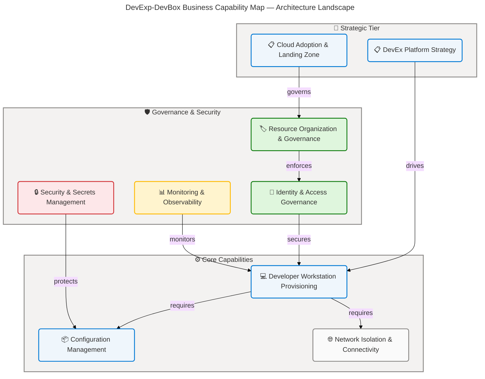
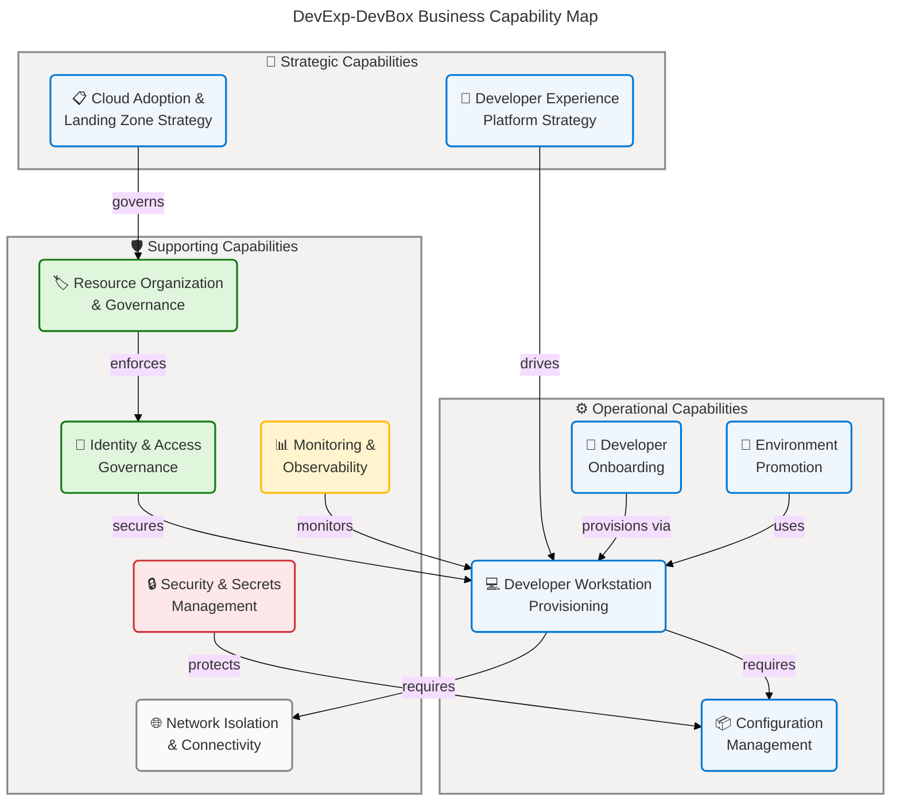
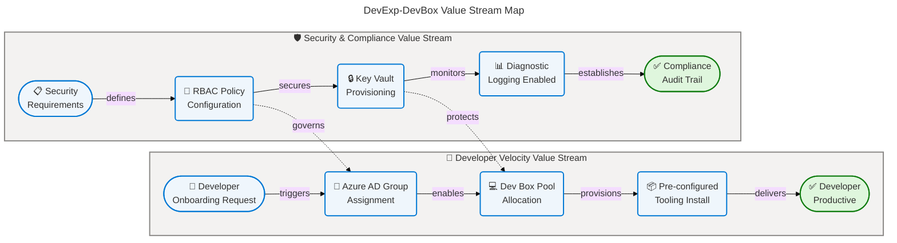
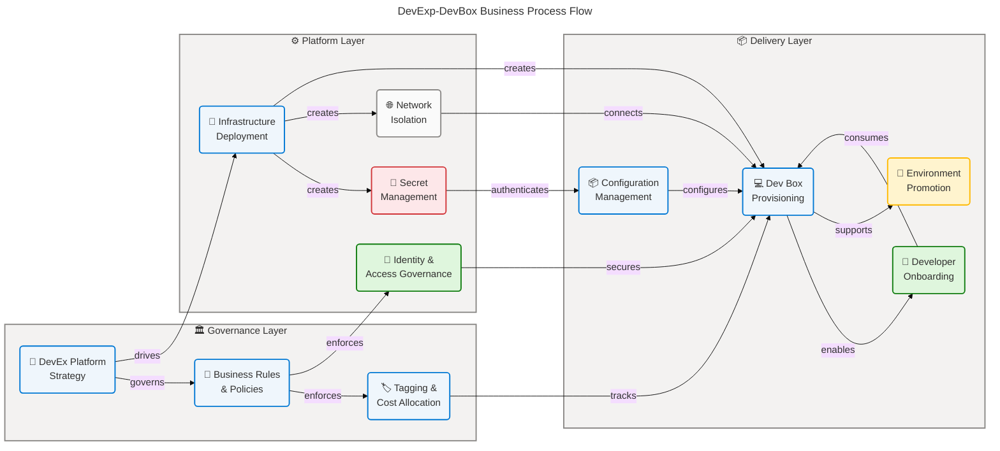
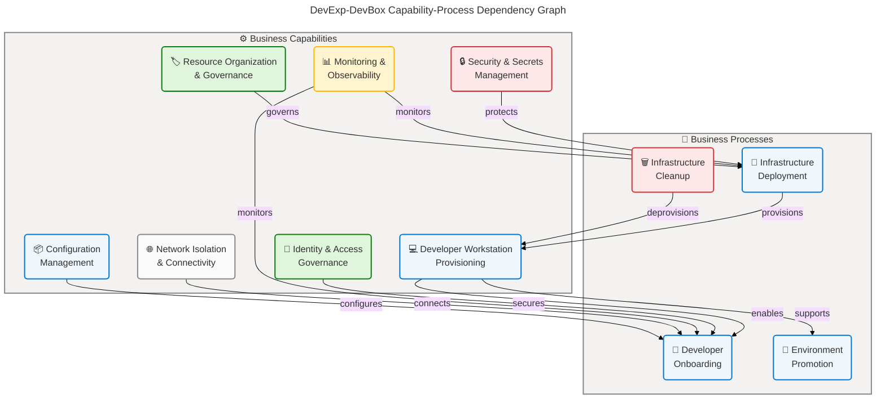

# Business Architecture — DevExp-DevBox

## 📑 Table of Contents

- [1. Executive Summary](#1-executive-summary)
- [2. Architecture Landscape](#2-architecture-landscape)
- [3. Architecture Principles](#3-architecture-principles)
- [4. Current State Baseline](#4-current-state-baseline)
- [5. Component Catalog](#5-component-catalog)
- [8. Dependencies & Integration](#8-dependencies--integration)

---

## 1. Executive Summary

### Overview

This Business Architecture analysis covers the DevExp-DevBox repository, an
Azure Dev Box Adoption & Deployment Accelerator designed to deliver
production-ready, centralized developer workstation provisioning for enterprise
engineering teams. The analysis identifies 36 Business layer components across
10 of the 11 canonical Business Architecture component types.

The platform addresses a core business capability: eliminating weeks of manual
developer environment setup by orchestrating Azure Dev Center, Dev Box pools,
identity governance, network isolation, and centralized monitoring through
configuration-driven Infrastructure-as-Code. The business strategy aligns with
the Microsoft Cloud Adoption Framework and Azure Landing Zone principles,
ensuring enterprise-grade governance, cost allocation, and security compliance
from inception.

The analysis reveals a well-structured business architecture with strong
identity and access governance (RBAC, least-privilege enforcement), clear role
segregation (backend vs. frontend engineering pools), and a
configuration-as-code model that externalizes business rules into YAML files —
enabling non-technical governance. No KPIs or Metrics were explicitly defined,
representing the primary gap for improvement.

---

## 2. Architecture Landscape

### Overview

This section provides a comprehensive inventory of all Business layer components
detected in the DevExp-DevBox repository. Components are organized by the 11
canonical Business Architecture component types.

The repository implements a configuration-driven platform model where business
intent — roles, capabilities, governance constraints, and deployment policies —
is encoded in YAML configuration files and declarative Bicep templates, rather
than in procedural application code.

### 2.1 Business Strategy (2)

| 🎯 Name                                | 📝 Description                                                                                                                                                                                                    |
| -------------------------------------- | ----------------------------------------------------------------------------------------------------------------------------------------------------------------------------------------------------------------- |
| Developer Experience Platform Strategy | **Strategic initiative** to deliver centralized, secure, cloud-hosted developer workstations across engineering teams, reducing onboarding from weeks to hours through Azure Dev Box and configuration-driven IaC |
| Cloud Adoption & Landing Zone Strategy | **Framework alignment** with Microsoft Cloud Adoption Framework and Azure Landing Zone principles for enterprise-grade resource segregation, governance, and operational excellence                               |

### 2.2 Business Capabilities (7)

| ⚙️ Name                            | 📝 Description                                                                                                                                                                |
| ---------------------------------- | ----------------------------------------------------------------------------------------------------------------------------------------------------------------------------- |
| Developer Workstation Provisioning | **Core capability** for provisioning role-specific Dev Box environments with pre-configured tooling, VM sizing, and catalog-driven image definitions                          |
| Identity & Access Governance       | **Governance capability** enforcing Azure AD group-based RBAC with role tiering (Dev Manager, Contributor, Dev Box User) following least-privilege principles                 |
| Security & Secrets Management      | **Security capability** providing centralized credential storage with purge protection, soft delete, and RBAC-based access control via Azure Key Vault                        |
| Monitoring & Observability         | **Operational capability** for centralized log aggregation, diagnostic settings across all resources, and Azure Activity logging via Log Analytics                            |
| Network Isolation & Connectivity   | **Infrastructure capability** providing project-specific virtual networks, subnet isolation, and Azure AD Join network connections for secure Dev Box connectivity            |
| Resource Organization & Governance | **Governance capability** defining Landing Zone resource group segregation (Workload, Security, Monitoring) with mandatory tagging for cost allocation and ownership tracking |
| Configuration Management           | **Platform capability** for Git-based catalog management enabling version-controlled Dev Box image definitions and environment definitions via GitHub repositories            |

### 2.3 Value Streams (2)

| 🚀 Name                            | 📝 Description                                                                                                                                                                     |
| ---------------------------------- | ---------------------------------------------------------------------------------------------------------------------------------------------------------------------------------- |
| Developer Velocity Value Stream    | **Primary value stream** reducing developer onboarding time through pre-configured, role-specific Dev Box environments with automated provisioning and identity integration        |
| Security & Compliance Value Stream | **Supporting value stream** delivering enterprise-grade security through Azure AD integration, RBAC enforcement, Key Vault secret management, and comprehensive diagnostic logging |

### 2.4 Business Processes (4)

| 🔄 Name                                 | 📝 Description                                                                                                                                                 |
| --------------------------------------- | -------------------------------------------------------------------------------------------------------------------------------------------------------------- |
| Developer Onboarding Process            | **Core process** for onboarding developers: Azure AD group assignment triggers automatic Dev Box pool allocation with role-specific tooling and network access |
| Environment Promotion Process           | **Lifecycle process** governing application deployment through defined SDLC stages (dev → staging → UAT) with isolated environment types per project           |
| Infrastructure Deployment Process       | **Operational process** for one-command environment provisioning using Azure Developer CLI with GitHub authentication, resource creation, and validation       |
| Infrastructure Cleanup & Deprovisioning | **Operational process** for complete environment teardown including subscription deployment deletion, service principal cleanup, and credential revocation     |

### 2.5 Business Services (2)

| 🛠️ Name                      | 📝 Description                                                                                                                                                                             |
| ---------------------------- | ------------------------------------------------------------------------------------------------------------------------------------------------------------------------------------------ |
| Dev Box Provisioning Service | **Platform service** that creates and manages role-specific Dev Box pools (backend-engineer, frontend-engineer) with designated VM SKUs, image definitions, and environment configurations |
| Secret Management Service    | **Security service** providing centralized credential storage and retrieval through Azure Key Vault with RBAC-controlled access, purge protection, and audit logging                       |

### 2.6 Business Functions (2)

| 🏢 Name                       | 📝 Description                                                                                                                                                      |
| ----------------------------- | ------------------------------------------------------------------------------------------------------------------------------------------------------------------- |
| Platform Engineering Function | **Organizational function** responsible for infrastructure design, module creation, governance enforcement, and Dev Center management within the Platforms division |
| Project Delivery Function     | **Organizational function** managing project-scoped resource allocation, team-specific pools, catalogs, and environment configurations for product delivery teams   |

### 2.7 Business Roles & Actors (4)

| 👥 Name                                 | 📝 Description                                                                                                                                                                                           |
| --------------------------------------- | -------------------------------------------------------------------------------------------------------------------------------------------------------------------------------------------------------- |
| Dev Manager (Platform Engineering Team) | **Administrative role** with DevCenter Project Admin permissions, responsible for managing Dev Box definitions, project settings, and platform governance via Azure AD group "Platform Engineering Team" |
| Developer (eShop Developers)            | **Consumer role** with Contributor, Dev Box User, and Deployment Environment User permissions, assigned via Azure AD group for project-scoped access to Dev Boxes and deployment environments            |
| Platform Engineer                       | **Technical role** responsible for infrastructure design, Bicep module creation, and governance standards enforcement following idempotent, parameterized IaC practices                                  |
| DevOps Lead                             | **Operational role** responsible for environment provisioning, release automation, and deployment orchestration using Azure Developer CLI and PowerShell                                                 |

### 2.8 Business Rules (5)

| 📏 Name                               | 📝 Description                                                                                                                                                                          |
| ------------------------------------- | --------------------------------------------------------------------------------------------------------------------------------------------------------------------------------------- |
| Role-Based VM Sizing Rule             | **Resource allocation rule**: backend engineers receive 32-core/128GB/512GB SSD VMs; frontend engineers receive 16-core/64GB/256GB SSD VMs, ensuring role-appropriate compute resources |
| Network Isolation Per Project Rule    | **Security rule**: each project receives an isolated virtual network with dedicated address space, preventing cross-project network traffic by default                                  |
| Least-Privilege RBAC Enforcement Rule | **Governance rule**: all access assignments follow the principle of least privilege with scoped roles (Subscription, ResourceGroup, Project) per organizational responsibility          |
| Resource Tagging Mandate              | **Governance rule**: all Azure resources must carry mandatory tags (environment, division, team, project, costCenter, owner, landingZone) for cost allocation and compliance tracking   |
| Secret Purge Protection Rule          | **Security rule**: Key Vault purge protection is enabled with soft-delete retention of 7 days, preventing irreversible deletion of secrets and enabling recovery                        |

### 2.9 Business Events (2)

| ⚡ Name                             | 📝 Description                                                                                                                                                              |
| ----------------------------------- | --------------------------------------------------------------------------------------------------------------------------------------------------------------------------- |
| Project Onboarding Request Event    | **Trigger event**: addition of a new project entry in the Dev Center configuration initiates resource provisioning including network, identity, pools, and catalogs         |
| Environment Promotion Trigger Event | **Lifecycle event**: application readiness in a lower SDLC stage (dev) triggers promotion to the next stage (staging → UAT) through defined environment type configurations |

### 2.10 Business Objects/Entities (6)

| 📦 Name          | 📝 Description                                                                                                                                                         |
| ---------------- | ---------------------------------------------------------------------------------------------------------------------------------------------------------------------- |
| Dev Center       | **Core entity** representing the centralized developer workstation platform with catalog sync, hosted networking, and Azure Monitor agent integration                  |
| Project          | **Organizational entity** representing a distinct team workspace (e.g., eShop) with dedicated identity, network, pools, catalogs, and environment types                |
| Dev Box Pool     | **Resource entity** defining a collection of Dev Boxes with specific VM SKU and image definition, allocated per engineering role (backend-engineer, frontend-engineer) |
| Environment Type | **Lifecycle entity** representing an SDLC deployment stage (dev, staging, UAT) with optional deployment target scoping                                                 |
| Landing Zone     | **Governance entity** defining resource group segregation by function (Workload, Security, Monitoring) with enforced tags and ownership attributes                     |
| Key Vault        | **Security entity** representing a centralized secret store with RBAC authorization, purge protection, soft delete, and diagnostic logging                             |

### 2.11 KPIs & Metrics (0)

**Status**: Not detected in analyzed files. No explicit KPI definitions, SLA
targets, or measurable performance metrics were found in the source
configuration or documentation. This represents a maturity gap — the platform
would benefit from defined KPIs for provisioning time, pool utilization, RBAC
compliance percentage, and cost-per-developer tracking.

### Business Capability Map

```mermaid
---
title: DevExp-DevBox Business Capability Map — Architecture Landscape
config:
  theme: base
  look: classic
  layout: dagre
  themeVariables:
    fontSize: '16px'
  flowchart:
    htmlLabels: true
---
flowchart TB
    accTitle: DevExp-DevBox Business Capability Map — Architecture Landscape
    accDescr: Shows the 7 core business capabilities organized by strategic, operational, and supporting tiers with dependencies

    %% ═══════════════════════════════════════════════════════════════════════════
    %% AZURE / FLUENT ARCHITECTURE PATTERN v1.1
    %% (Semantic + Structural + Font + Accessibility Governance)
    %% ═══════════════════════════════════════════════════════════════════════════
    %% PHASE 1 - FLUENT UI: All styling uses approved Fluent UI palette only
    %% PHASE 2 - GROUPS: Every subgraph has semantic color via style directive
    %% PHASE 3 - COMPONENTS: Every node has semantic classDef + icon prefix
    %% PHASE 4 - ACCESSIBILITY: accTitle/accDescr present, WCAG AA contrast
    %% PHASE 5 - STANDARD: Governance block present, classDefs centralized
    %% ═══════════════════════════════════════════════════════════════════════════

    subgraph strategy["🎯 Strategic Tier"]
        S1("📋 DevEx Platform Strategy"):::core
        S2("📋 Cloud Adoption & Landing Zone"):::core
    end

    subgraph capabilities["⚙️ Core Capabilities"]
        C1("💻 Developer Workstation Provisioning"):::core
        C2("📦 Configuration Management"):::core
        C3("🌐 Network Isolation & Connectivity"):::neutral
    end

    subgraph governance["🛡️ Governance & Security"]
        G1("🔐 Identity & Access Governance"):::success
        G2("🔒 Security & Secrets Management"):::danger
        G3("📊 Monitoring & Observability"):::warning
        G4("🏷️ Resource Organization & Governance"):::success
    end

    S1 -->|"drives"| C1
    S2 -->|"governs"| G4
    C1 -->|"requires"| C2
    C1 -->|"requires"| C3
    G1 -->|"secures"| C1
    G2 -->|"protects"| C2
    G3 -->|"monitors"| C1
    G4 -->|"enforces"| G1

    classDef neutral fill:#FAFAFA,stroke:#8A8886,stroke-width:2px,color:#323130
    classDef core fill:#EFF6FC,stroke:#0078D4,stroke-width:2px,color:#323130
    classDef success fill:#DFF6DD,stroke:#107C10,stroke-width:2px,color:#323130
    classDef warning fill:#FFF4CE,stroke:#FFB900,stroke-width:2px,color:#323130
    classDef danger fill:#FDE7E9,stroke:#D13438,stroke-width:2px,color:#323130

    style strategy fill:#F3F2F1,stroke:#8A8886,stroke-width:2px,color:#323130
    style capabilities fill:#F3F2F1,stroke:#8A8886,stroke-width:2px,color:#323130
    style governance fill:#F3F2F1,stroke:#8A8886,stroke-width:2px,color:#323130
```

### Summary

The DevExp-DevBox platform exhibits 36 Business layer components distributed
across 10 of 11 component types. The strongest coverage appears in Business
Rules (5 components), Business Objects/Entities (6 components), and Business
Capabilities (7 components).

The primary gap is the absence of explicit KPIs & Metrics (0 components
detected). While the platform embeds operational signals (diagnostic settings,
tagging for cost tracking), no formal KPI definitions — such as provisioning SLA
targets, developer satisfaction scores, or cost-per-developer budgets — are
documented.

---

## 3. Architecture Principles

### Overview

The DevExp-DevBox platform embeds several -aligned architecture principles
observable in the source configuration and documentation. These principles guide
decision-making across the platform's business capabilities, governance model,
and operational workflows.

These principles collectively enforce a platform model that balances developer
velocity with enterprise governance, using configuration-driven automation to
reduce manual intervention while maintaining security and compliance guarantees.

### 3.1 Configuration-Driven Governance

**Statement**: All business rules, role definitions, and resource policies are
externalized into validated YAML configuration files, enabling governance
changes without code modifications.

### 3.2 Least-Privilege Access Control

**Statement**: Every identity assignment follows the principle of least
privilege with role scoping at the narrowest applicable level (Project,
ResourceGroup, Subscription).

### 3.3 Landing Zone Segregation

**Statement**: Resources are organized into functionally distinct landing zones
(Workload, Security, Monitoring) following Azure Landing Zone principles for
isolation, cost tracking, and operational clarity.

### 3.4 Role-Specific Resource Allocation

**Statement**: Developer environments are tailored to role requirements, with
distinct compute specifications per engineering function to optimize cost and
performance.

### 3.5 Idempotent, Repeatable Deployment

**Statement**: All infrastructure operations must be safe to re-run without side
effects, enabling consistent environment provisioning and disaster recovery.

### 3.6 Defense in Depth

**Statement**: Security is applied at multiple layers — identity (Azure AD),
secrets (Key Vault with purge protection), networking (VNet isolation), and
monitoring (diagnostic logging on all resources).

---

## 4. Current State Baseline

### Overview

This section captures the current operational characteristics of the
DevExp-DevBox Business Architecture. The platform is in an active development
state (environment tag: `dev`) with a single project (eShop) serving as the
reference implementation. Diagrams visualize the business capability landscape
and process relationships identified from configuration analysis.

### Business Architecture Overview

```mermaid
---
title: DevExp-DevBox Business Capability Map
config:
  theme: base
  look: classic
  layout: dagre
  themeVariables:
    fontSize: '16px'
  flowchart:
    htmlLabels: true
---
flowchart TB
    accTitle: DevExp-DevBox Business Capability Map
    accDescr: Shows the core business capabilities of the DevExp-DevBox platform organized by strategic, operational, and supporting tiers

    %% ═══════════════════════════════════════════════════════════════════════════
    %% AZURE / FLUENT ARCHITECTURE PATTERN v1.1
    %% (Semantic + Structural + Font + Accessibility Governance)
    %% ═══════════════════════════════════════════════════════════════════════════
    %% PHASE 1 - FLUENT UI: All styling uses approved Fluent UI palette only
    %% PHASE 2 - GROUPS: Every subgraph has semantic color via style directive
    %% PHASE 3 - COMPONENTS: Every node has semantic classDef + icon prefix
    %% PHASE 4 - ACCESSIBILITY: accTitle/accDescr present, WCAG AA contrast
    %% PHASE 5 - STANDARD: Governance block present, classDefs centralized
    %% ═══════════════════════════════════════════════════════════════════════════

    subgraph strategic["🎯 Strategic Capabilities"]
        DEVEX("🚀 Developer Experience<br/>Platform Strategy"):::core
        CAF("📋 Cloud Adoption &<br/>Landing Zone Strategy"):::core
    end

    subgraph operational["⚙️ Operational Capabilities"]
        PROV("💻 Developer Workstation<br/>Provisioning"):::core
        CONFIG("📦 Configuration<br/>Management"):::core
        ONBOARD("👤 Developer<br/>Onboarding"):::core
        PROMOTE("🔄 Environment<br/>Promotion"):::core
    end

    subgraph supporting["🛡️ Supporting Capabilities"]
        IAM("🔐 Identity & Access<br/>Governance"):::success
        SEC("🔒 Security & Secrets<br/>Management"):::danger
        NET("🌐 Network Isolation<br/>& Connectivity"):::neutral
        MON("📊 Monitoring &<br/>Observability"):::warning
        GOV("🏷️ Resource Organization<br/>& Governance"):::success
    end

    DEVEX -->|"drives"| PROV
    CAF -->|"governs"| GOV
    PROV -->|"requires"| CONFIG
    PROV -->|"requires"| NET
    ONBOARD -->|"provisions via"| PROV
    PROMOTE -->|"uses"| PROV
    IAM -->|"secures"| PROV
    SEC -->|"protects"| CONFIG
    MON -->|"monitors"| PROV
    GOV -->|"enforces"| IAM

    classDef neutral fill:#FAFAFA,stroke:#8A8886,stroke-width:2px,color:#323130
    classDef core fill:#EFF6FC,stroke:#0078D4,stroke-width:2px,color:#323130
    classDef success fill:#DFF6DD,stroke:#107C10,stroke-width:2px,color:#323130
    classDef warning fill:#FFF4CE,stroke:#FFB900,stroke-width:2px,color:#323130
    classDef danger fill:#FDE7E9,stroke:#D13438,stroke-width:2px,color:#323130

    style strategic fill:#F3F2F1,stroke:#8A8886,stroke-width:2px,color:#323130
    style operational fill:#F3F2F1,stroke:#8A8886,stroke-width:2px,color:#323130
    style supporting fill:#F3F2F1,stroke:#8A8886,stroke-width:2px,color:#323130
```

### Summary

The DevExp-DevBox platform demonstrates a well-structured business architecture.
The single-project deployment (eShop) validates the platform model with two
role-specific pools, three SDLC environments, and comprehensive RBAC coverage.
All 7 core capabilities are documented and standardized in configuration files.

The primary gap is Monitoring & Observability, where diagnostic settings exist
but no alerting rules, dashboards, or SLA targets are defined. The absence of
KPIs & Metrics across the portfolio further limits the ability to quantitatively
track business outcomes. Recommended improvements: (1) defining measurable KPIs
for provisioning SLA, developer satisfaction, and cost-per-developer; (2)
implementing alert rules and operational dashboards in Log Analytics; and (3)
expanding from a single-project reference to multi-project production
validation.

---

## 5. Component Catalog

### Overview

This section provides detailed specifications for each Business layer component
identified in the DevExp-DevBox repository. Components are organized by the 11
canonical Business Architecture types, with each entry documenting the
component's purpose and business relationships.

### 5.1 Business Strategy (2)

#### 5.1.1 Developer Experience Platform Strategy

| 🏷️ Attribute    | 📋 Value                                                                                                                                                                                                                                                                                                                              |
| --------------- | ------------------------------------------------------------------------------------------------------------------------------------------------------------------------------------------------------------------------------------------------------------------------------------------------------------------------------------- |
| **Name**        | Developer Experience Platform Strategy                                                                                                                                                                                                                                                                                                |
| **Type**        | Business Strategy                                                                                                                                                                                                                                                                                                                     |
| **Description** | Strategic initiative to provision centralized, secure, cloud-hosted developer workstations across engineering teams. Reduces developer onboarding from weeks to hours through Azure Dev Box and configuration-driven Infrastructure-as-Code. Targets platform engineers, DevOps leads, and IT administrators as primary stakeholders. |

**Business Relationships**: Drives the Developer Workstation Provisioning
capability. Informs the Developer Velocity Value Stream. Establishes the
business case for all operational capabilities.

#### 5.1.2 Cloud Adoption & Landing Zone Strategy

| 🏷️ Attribute    | 📋 Value                                                                                                                                                                                                                                                                                       |
| --------------- | ---------------------------------------------------------------------------------------------------------------------------------------------------------------------------------------------------------------------------------------------------------------------------------------------- |
| **Name**        | Cloud Adoption & Landing Zone Strategy                                                                                                                                                                                                                                                         |
| **Type**        | Business Strategy                                                                                                                                                                                                                                                                              |
| **Description** | Framework alignment with Microsoft Cloud Adoption Framework (CAF) and Azure Landing Zone principles. Governs resource segregation by function (Workload, Security, Monitoring), consistent tagging for cost allocation, and subscription-scoped orchestration for enterprise-grade governance. |

**Business Relationships**: Governs the Resource Organization & Governance
capability. Informs the Landing Zone entity definition. Provides the strategic
foundation for the Security & Compliance Value Stream.

### 5.2 Business Capabilities (7)

#### 5.2.1 Developer Workstation Provisioning

| 🏷️ Attribute    | 📋 Value                                                                                                                                                                                                                                                                                                             |
| --------------- | -------------------------------------------------------------------------------------------------------------------------------------------------------------------------------------------------------------------------------------------------------------------------------------------------------------------- |
| **Name**        | Developer Workstation Provisioning                                                                                                                                                                                                                                                                                   |
| **Type**        | Business Capability                                                                                                                                                                                                                                                                                                  |
| **Description** | Core platform capability for provisioning role-specific Dev Box environments. Manages Dev Center configuration, project allocation, pool definitions with designated VM SKUs, and catalog-driven image definitions. Delivers ready-to-use developer workstations tailored to backend and frontend engineering roles. |

**Business Relationships**: Driven by the DevEx Platform Strategy. Implemented
through the Dev Box Provisioning Service. Consumed by the Developer Onboarding
Process and Environment Promotion Process. Depends on Configuration Management,
Network Isolation, and Identity & Access Governance capabilities.

#### 5.2.2 Identity & Access Governance

| 🏷️ Attribute    | 📋 Value                                                                                                                                                                                                                                                                            |
| --------------- | ----------------------------------------------------------------------------------------------------------------------------------------------------------------------------------------------------------------------------------------------------------------------------------- |
| **Name**        | Identity & Access Governance                                                                                                                                                                                                                                                        |
| **Type**        | Business Capability                                                                                                                                                                                                                                                                 |
| **Description** | Governance capability enforcing Azure AD group-based RBAC with role tiering across multiple scopes. Implements least-privilege access with Dev Manager (Project Admin), Contributor, Dev Box User, and Key Vault roles assigned at Subscription, ResourceGroup, and Project scopes. |

**Business Relationships**: Secures the Developer Workstation Provisioning
capability. Enforced by the Least-Privilege RBAC Enforcement Rule. Governs the
Dev Manager and Developer roles. Supports the Security & Compliance Value
Stream.

#### 5.2.3 Security & Secrets Management

| 🏷️ Attribute    | 📋 Value                                                                                                                                                                                                                                                                                                                |
| --------------- | ----------------------------------------------------------------------------------------------------------------------------------------------------------------------------------------------------------------------------------------------------------------------------------------------------------------------- |
| **Name**        | Security & Secrets Management                                                                                                                                                                                                                                                                                           |
| **Type**        | Business Capability                                                                                                                                                                                                                                                                                                     |
| **Description** | Security capability providing centralized credential storage and retrieval through Azure Key Vault. Enforces purge protection, 7-day soft-delete retention, and RBAC-based authorization. Stores GitHub Actions tokens for catalog authentication and supports future secret types including API keys and certificates. |

**Business Relationships**: Protects the Configuration Management capability by
securing catalog authentication tokens. Implements the Secret Purge Protection
Rule. Supports the Secret Management Service. Feeds audit logs to the Monitoring
& Observability capability.

#### 5.2.4 Monitoring & Observability

| 🏷️ Attribute    | 📋 Value                                                                                                                                                                                                                                                                                               |
| --------------- | ------------------------------------------------------------------------------------------------------------------------------------------------------------------------------------------------------------------------------------------------------------------------------------------------------ |
| **Name**        | Monitoring & Observability                                                                                                                                                                                                                                                                             |
| **Type**        | Business Capability                                                                                                                                                                                                                                                                                    |
| **Description** | Operational capability for centralized log aggregation via Log Analytics Workspace. Diagnostic settings are enabled across DevCenter, Key Vault, and network resources with Azure Activity logging. Provides the foundation for operational visibility but lacks defined alerting rules or dashboards. |

**Business Relationships**: Monitors the Developer Workstation Provisioning
capability. Receives audit logs from Security & Secrets Management. Represents a
maturity gap due to absent alerting rules and KPI dashboards.

#### 5.2.5 Network Isolation & Connectivity

| 🏷️ Attribute    | 📋 Value                                                                                                                                                                                                                                                  |
| --------------- | --------------------------------------------------------------------------------------------------------------------------------------------------------------------------------------------------------------------------------------------------------- |
| **Name**        | Network Isolation & Connectivity                                                                                                                                                                                                                          |
| **Type**        | Business Capability                                                                                                                                                                                                                                       |
| **Description** | Infrastructure capability providing project-specific virtual networks with dedicated address spaces. The eShop project uses a 10.0.0.0/16 address space with a 10.0.1.0/24 subnet and managed Azure AD Join network connections for Dev Box connectivity. |

**Business Relationships**: Required by Developer Workstation Provisioning for
secure Dev Box connectivity. Implements the Network Isolation Per Project Rule.
Each Project entity has an associated network configuration.

#### 5.2.6 Resource Organization & Governance

| 🏷️ Attribute    | 📋 Value                                                                                                                                                                                                                                                                                          |
| --------------- | ------------------------------------------------------------------------------------------------------------------------------------------------------------------------------------------------------------------------------------------------------------------------------------------------- |
| **Name**        | Resource Organization & Governance                                                                                                                                                                                                                                                                |
| **Type**        | Business Capability                                                                                                                                                                                                                                                                               |
| **Description** | Governance capability defining resource group segregation by function: Workload (devexp-workload), Security (devexp-security), and Monitoring (devexp-monitoring). Each group carries mandatory tags for environment, division, team, project, costCenter, owner, and landingZone classification. |

**Business Relationships**: Governed by the Cloud Adoption & Landing Zone
Strategy. Implements the Resource Tagging Mandate rule. Defines the Landing Zone
entity. Enables cost allocation tracking through enforced tags.

#### 5.2.7 Configuration Management

| 🏷️ Attribute    | 📋 Value                                                                                                                                                                                                                                                                                                          |
| --------------- | ----------------------------------------------------------------------------------------------------------------------------------------------------------------------------------------------------------------------------------------------------------------------------------------------------------------- |
| **Name**        | Configuration Management                                                                                                                                                                                                                                                                                          |
| **Type**        | Business Capability                                                                                                                                                                                                                                                                                               |
| **Description** | Platform capability for Git-based catalog management. The central customTasks catalog syncs from the Microsoft devcenter-catalog repository, while project-specific catalogs reference private GitHub repositories for environment definitions and Dev Box image definitions. Catalog sync is enabled by default. |

**Business Relationships**: Required by Developer Workstation Provisioning.
Protected by Security & Secrets Management (GitHub token authentication).
Referenced by Project entities for project-specific catalogs.

### 5.3 Value Streams (2)

#### 5.3.1 Developer Velocity Value Stream

| 🏷️ Attribute    | 📋 Value                                                                                                                                                                                                                                                                                                           |
| --------------- | ------------------------------------------------------------------------------------------------------------------------------------------------------------------------------------------------------------------------------------------------------------------------------------------------------------------ |
| **Name**        | Developer Velocity Value Stream                                                                                                                                                                                                                                                                                    |
| **Type**        | Value Stream                                                                                                                                                                                                                                                                                                       |
| **Description** | Primary end-to-end value delivery flow: Developer requests access → Platform assigns to Azure AD group → Dev Box pool allocates role-specific VM → Pre-configured tooling installed automatically → Developer productive within hours. Measured value: reduction in developer onboarding time from weeks to hours. |

**Business Relationships**: Driven by the DevEx Platform Strategy. Delivered
through the Developer Onboarding Process, Dev Box Provisioning Service, and
Configuration Management capability.

#### 5.3.2 Security & Compliance Value Stream

| 🏷️ Attribute    | 📋 Value                                                                                                                                                                                                                                                                                 |
| --------------- | ---------------------------------------------------------------------------------------------------------------------------------------------------------------------------------------------------------------------------------------------------------------------------------------- |
| **Name**        | Security & Compliance Value Stream                                                                                                                                                                                                                                                       |
| **Type**        | Value Stream                                                                                                                                                                                                                                                                             |
| **Description** | Supporting value delivery flow: Security requirements defined → RBAC policies configured in YAML → Key Vault provisioned with purge protection → Diagnostic logging enabled → Compliance audit trail established. Delivers enterprise-grade security posture for developer environments. |

**Business Relationships**: Supported by the Cloud Adoption & Landing Zone
Strategy. Delivered through Identity & Access Governance, Security & Secrets
Management, and Monitoring & Observability capabilities.

### Value Stream Map

```mermaid
---
title: DevExp-DevBox Value Stream Map
config:
  theme: base
  look: classic
  layout: dagre
  themeVariables:
    fontSize: '16px'
  flowchart:
    htmlLabels: true
---
flowchart LR
    accTitle: DevExp-DevBox Value Stream Map
    accDescr: Shows the two primary value streams with their enabling capabilities and process stages from trigger to value delivery

    %% ═══════════════════════════════════════════════════════════════════════════
    %% AZURE / FLUENT ARCHITECTURE PATTERN v1.1
    %% (Semantic + Structural + Font + Accessibility Governance)
    %% ═══════════════════════════════════════════════════════════════════════════
    %% PHASE 1 - FLUENT UI: All styling uses approved Fluent UI palette only
    %% PHASE 2 - GROUPS: Every subgraph has semantic color via style directive
    %% PHASE 3 - COMPONENTS: Every node has semantic classDef + icon prefix
    %% PHASE 4 - ACCESSIBILITY: accTitle/accDescr present, WCAG AA contrast
    %% PHASE 5 - STANDARD: Governance block present, classDefs centralized
    %% ═══════════════════════════════════════════════════════════════════════════

    subgraph velocity["🚀 Developer Velocity Value Stream"]
        V1(["👤 Developer<br/>Onboarding Request"]):::core
        V2("🔑 Azure AD Group<br/>Assignment"):::core
        V3("💻 Dev Box Pool<br/>Allocation"):::core
        V4("📦 Pre-configured<br/>Tooling Install"):::core
        V5(["✅ Developer<br/>Productive"]):::success
    end

    subgraph security["🛡️ Security & Compliance Value Stream"]
        S1(["📋 Security<br/>Requirements"]):::core
        S2("🔐 RBAC Policy<br/>Configuration"):::core
        S3("🔒 Key Vault<br/>Provisioning"):::core
        S4("📊 Diagnostic<br/>Logging Enabled"):::core
        S5(["✅ Compliance<br/>Audit Trail"]):::success
    end

    V1 -->|"triggers"| V2
    V2 -->|"enables"| V3
    V3 -->|"provisions"| V4
    V4 -->|"delivers"| V5

    S1 -->|"defines"| S2
    S2 -->|"secures"| S3
    S3 -->|"monitors"| S4
    S4 -->|"establishes"| S5

    S2 -.->|"governs"| V2
    S3 -.->|"protects"| V3

    classDef core fill:#EFF6FC,stroke:#0078D4,stroke-width:2px,color:#323130
    classDef success fill:#DFF6DD,stroke:#107C10,stroke-width:2px,color:#323130

    style velocity fill:#F3F2F1,stroke:#8A8886,stroke-width:2px,color:#323130
    style security fill:#F3F2F1,stroke:#8A8886,stroke-width:2px,color:#323130
```

### 5.4 Business Processes (4)

#### 5.4.1 Developer Onboarding Process

| 🏷️ Attribute    | 📋 Value                                                                                                                                                                                                                                                                                                                                                                                |
| --------------- | --------------------------------------------------------------------------------------------------------------------------------------------------------------------------------------------------------------------------------------------------------------------------------------------------------------------------------------------------------------------------------------- |
| **Name**        | Developer Onboarding Process                                                                                                                                                                                                                                                                                                                                                            |
| **Type**        | Business Process                                                                                                                                                                                                                                                                                                                                                                        |
| **Description** | End-to-end developer provisioning: (1) Administrator adds user to Azure AD group (e.g., "eShop Developers"); (2) RBAC roles auto-assigned (Contributor, Dev Box User, Deployment Environment User, Key Vault Secrets User); (3) User accesses Dev Box portal; (4) System assigns appropriate pool based on role; (5) Dev Box provisioned with role-specific tooling and network access. |

**Business Relationships**: Consumes the Dev Box Provisioning Service. Depends
on Identity & Access Governance capability for RBAC assignment. Delivers the
Developer Velocity Value Stream.

### Developer Onboarding Process Flow

```mermaid
---
title: Developer Onboarding Process Flow
config:
  theme: base
  look: classic
  layout: dagre
  themeVariables:
    fontSize: '16px'
  flowchart:
    htmlLabels: true
---
flowchart TB
    accTitle: Developer Onboarding Process Flow
    accDescr: BPMN-style diagram showing the end-to-end developer onboarding workflow from request through provisioning to productive state

    %% ═══════════════════════════════════════════════════════════════════════════
    %% AZURE / FLUENT ARCHITECTURE PATTERN v1.1
    %% (Semantic + Structural + Font + Accessibility Governance)
    %% ═══════════════════════════════════════════════════════════════════════════
    %% PHASE 1 - FLUENT UI: All styling uses approved Fluent UI palette only
    %% PHASE 2 - GROUPS: Every subgraph has semantic color via style directive
    %% PHASE 3 - COMPONENTS: Every node has semantic classDef + icon prefix
    %% PHASE 4 - ACCESSIBILITY: accTitle/accDescr present, WCAG AA contrast
    %% PHASE 5 - STANDARD: Governance block present, classDefs centralized
    %% ═══════════════════════════════════════════════════════════════════════════

    Start(["🚀 Developer Onboarding<br/>Request Received"]):::success
    AddGroup("👤 Add User to<br/>Azure AD Group"):::core
    AssignRBAC("🔑 Auto-Assign RBAC Roles<br/>Contributor, Dev Box User,<br/>Env User, KV Secrets User"):::core
    RoleCheck{"⚡ Role Validated<br/>Successfully?"}:::warning
    SelectPool("💻 Select Dev Box Pool<br/>by Developer Role"):::core
    PoolDecision{"⚡ Backend or<br/>Frontend?"}:::warning
    BackendPool("⚙️ Backend Pool<br/>32c/128GB/512GB SSD"):::core
    FrontendPool("⚙️ Frontend Pool<br/>16c/64GB/256GB SSD"):::core
    ProvisionBox("📦 Provision Dev Box<br/>with Catalog Image"):::core
    AttachNetwork("🌐 Attach Managed<br/>Network Connection"):::core
    ValidateAccess("🔐 Validate Identity<br/>& Network Access"):::core
    Complete(["✅ Developer<br/>Productive"]):::success
    Escalate("❌ Escalate to<br/>Platform Engineer"):::danger

    Start -->|"initiates"| AddGroup
    AddGroup -->|"triggers"| AssignRBAC
    AssignRBAC -->|"validates"| RoleCheck
    RoleCheck -->|"Yes"| SelectPool
    RoleCheck -->|"No"| Escalate
    SelectPool -->|"evaluates"| PoolDecision
    PoolDecision -->|"Backend"| BackendPool
    PoolDecision -->|"Frontend"| FrontendPool
    BackendPool -->|"provisions"| ProvisionBox
    FrontendPool -->|"provisions"| ProvisionBox
    ProvisionBox -->|"connects"| AttachNetwork
    AttachNetwork -->|"secures"| ValidateAccess
    ValidateAccess -->|"completes"| Complete
    Escalate -->|"resolves"| AddGroup

    classDef core fill:#EFF6FC,stroke:#0078D4,stroke-width:2px,color:#323130
    classDef success fill:#DFF6DD,stroke:#107C10,stroke-width:2px,color:#323130
    classDef warning fill:#FFF4CE,stroke:#FFB900,stroke-width:2px,color:#323130
    classDef danger fill:#FDE7E9,stroke:#D13438,stroke-width:2px,color:#323130
```

#### 5.4.2 Environment Promotion Process

| 🏷️ Attribute    | 📋 Value                                                                                                                                                                                                                                                                                                                 |
| --------------- | ------------------------------------------------------------------------------------------------------------------------------------------------------------------------------------------------------------------------------------------------------------------------------------------------------------------------ |
| **Name**        | Environment Promotion Process                                                                                                                                                                                                                                                                                            |
| **Type**        | Business Process                                                                                                                                                                                                                                                                                                         |
| **Description** | SDLC lifecycle management: (1) Developer builds application in dev environment; (2) Application validated and promoted to staging; (3) Staging validation completed; (4) Application promoted to UAT for user acceptance testing. Each environment type is independently configured with optional deployment target IDs. |

**Business Relationships**: Uses the Developer Workstation Provisioning
capability. Operates across Environment Type entities (dev, staging, UAT).
Triggered by the Environment Promotion Trigger Event.

#### 5.4.3 Infrastructure Deployment Process

| 🏷️ Attribute    | 📋 Value                                                                                                                                                                                                                                                                                                                                                                                |
| --------------- | --------------------------------------------------------------------------------------------------------------------------------------------------------------------------------------------------------------------------------------------------------------------------------------------------------------------------------------------------------------------------------------- |
| **Name**        | Infrastructure Deployment Process                                                                                                                                                                                                                                                                                                                                                       |
| **Type**        | Business Process                                                                                                                                                                                                                                                                                                                                                                        |
| **Description** | One-command environment provisioning: (1) Operator authenticates via Azure CLI, GitHub CLI, and Azure Developer CLI; (2) GitHub Actions token retrieved and injected; (3) `azd up` command invoked; (4) Bicep orchestration deploys Security RG, Monitoring RG, and Workload RG sub-modules; (5) Resources validated and output generated. Supports both PowerShell and Bash execution. |

**Business Relationships**: Creates all Landing Zone resources. Invokes the Dev
Box Provisioning Service. Implements the Idempotent Deployment principle.
Depends on the Secret Management Service for GitHub token retrieval.

#### 5.4.4 Infrastructure Cleanup & Deprovisioning

| 🏷️ Attribute    | 📋 Value                                                                                                                                                                                                                                                             |
| --------------- | -------------------------------------------------------------------------------------------------------------------------------------------------------------------------------------------------------------------------------------------------------------------- |
| **Name**        | Infrastructure Cleanup & Deprovisioning                                                                                                                                                                                                                              |
| **Type**        | Business Process                                                                                                                                                                                                                                                     |
| **Description** | Complete environment teardown: (1) Subscription deployment records deleted; (2) Resource groups removed; (3) Service principals cleaned up; (4) GitHub secrets revoked; (5) Credential cache cleared. Prevents orphaned resources and ensures secure deprovisioning. |

**Business Relationships**: Reverses the Infrastructure Deployment Process.
Removes Landing Zone resources. Terminates the Dev Box Provisioning Service for
the target environment.

### 5.5 Business Services (2)

#### 5.5.1 Dev Box Provisioning Service

| 🏷️ Attribute    | 📋 Value                                                                                                                                                                                                                                                                                                                                               |
| --------------- | ------------------------------------------------------------------------------------------------------------------------------------------------------------------------------------------------------------------------------------------------------------------------------------------------------------------------------------------------------ |
| **Name**        | Dev Box Provisioning Service                                                                                                                                                                                                                                                                                                                           |
| **Type**        | Business Service                                                                                                                                                                                                                                                                                                                                       |
| **Description** | Platform service that creates and manages role-specific Dev Box pools. Currently serves the eShop project with two pools: backend-engineer (32c/128GB/512GB SSD, `eShop-backend-engineer` image) and frontend-engineer (16c/64GB/256GB SSD, `eShop-frontend-engineer` image). Pools are scoped to projects and connected via managed virtual networks. |

**Business Relationships**: Implements the Developer Workstation Provisioning
capability. Consumed by the Developer Onboarding Process. Governed by the
Role-Based VM Sizing Rule. Depends on Configuration Management for image
definitions.

#### 5.5.2 Secret Management Service

| 🏷️ Attribute    | 📋 Value                                                                                                                                                                                                                                                                                            |
| --------------- | --------------------------------------------------------------------------------------------------------------------------------------------------------------------------------------------------------------------------------------------------------------------------------------------------- |
| **Name**        | Secret Management Service                                                                                                                                                                                                                                                                           |
| **Type**        | Business Service                                                                                                                                                                                                                                                                                    |
| **Description** | Security service providing centralized credential storage and retrieval. Currently manages a GitHub Actions token (`gha-token`) for catalog repository authentication. Configured with purge protection, 7-day soft-delete retention, and RBAC authorization. Audit logs streamed to Log Analytics. |

**Business Relationships**: Implements the Security & Secrets Management
capability. Governed by the Secret Purge Protection Rule. Used by the
Infrastructure Deployment Process for token injection. Monitored by the
Monitoring & Observability capability.

### 5.6 Business Functions (2)

#### 5.6.1 Platform Engineering Function

| 🏷️ Attribute    | 📋 Value                                                                                                                                                                                                                                                                                                                                         |
| --------------- | ------------------------------------------------------------------------------------------------------------------------------------------------------------------------------------------------------------------------------------------------------------------------------------------------------------------------------------------------ |
| **Name**        | Platform Engineering Function                                                                                                                                                                                                                                                                                                                    |
| **Type**        | Business Function                                                                                                                                                                                                                                                                                                                                |
| **Description** | Organizational function within the Platforms division responsible for infrastructure design, Bicep module creation, governance enforcement, and Dev Center management. Follows a product-oriented delivery model with Epics, Features, and Tasks. Enforces engineering standards including parameterized modules, idempotency, and docs-as-code. |

**Business Relationships**: Operates through the Dev Manager role. Governs all
Business Capabilities. Responsible for maintaining the Dev Box Provisioning
Service and Infrastructure Deployment Process.

#### 5.6.2 Project Delivery Function

| 🏷️ Attribute    | 📋 Value                                                                                                                                                                                                                                                                               |
| --------------- | -------------------------------------------------------------------------------------------------------------------------------------------------------------------------------------------------------------------------------------------------------------------------------------- |
| **Name**        | Project Delivery Function                                                                                                                                                                                                                                                              |
| **Type**        | Business Function                                                                                                                                                                                                                                                                      |
| **Description** | Organizational function managing project-scoped resource allocation, team-specific Dev Box pools, project catalogs, and environment configurations. Each project (e.g., eShop) receives dedicated identity, network, pools, catalogs, and environment types for independent operation. |

**Business Relationships**: Operates through the Developer role. Consumes the
Dev Box Provisioning Service. Scoped to individual Project entities with
dedicated resources.

### 5.7 Business Roles & Actors (4)

#### 5.7.1 Dev Manager (Platform Engineering Team)

| 🏷️ Attribute    | 📋 Value                                                                                                                                                                                                                                                                                                                                           |
| --------------- | -------------------------------------------------------------------------------------------------------------------------------------------------------------------------------------------------------------------------------------------------------------------------------------------------------------------------------------------------- |
| **Name**        | Dev Manager (Platform Engineering Team)                                                                                                                                                                                                                                                                                                            |
| **Type**        | Business Role                                                                                                                                                                                                                                                                                                                                      |
| **Description** | Administrative role assigned to the Azure AD group "Platform Engineering Team" (ID: 5a1d1455-e771-4c19-aa03-fb4a08418f22). Holds DevCenter Project Admin role at ResourceGroup scope, enabling management of Dev Box definitions, project settings, and platform governance. Manages Dev Box deployments but does not typically consume Dev Boxes. |

**Business Relationships**: Operates the Platform Engineering Function. Manages
all Project entities. Governed by the Least-Privilege RBAC Enforcement Rule.

#### 5.7.2 Developer (eShop Developers)

| 🏷️ Attribute    | 📋 Value                                                                                                                                                                                                                                                                                                                |
| --------------- | ----------------------------------------------------------------------------------------------------------------------------------------------------------------------------------------------------------------------------------------------------------------------------------------------------------------------- |
| **Name**        | Developer (eShop Developers)                                                                                                                                                                                                                                                                                            |
| **Type**        | Business Role                                                                                                                                                                                                                                                                                                           |
| **Description** | Consumer role assigned to the Azure AD group "eShop Developers" (ID: 9d42a792-2d74-441d-8bcb-71009371725f). Holds Contributor, Dev Box User, Deployment Environment User (Project scope), and Key Vault Secrets User/Officer (ResourceGroup scope) permissions. Consumes Dev Boxes and deploys to project environments. |

**Business Relationships**: Operates the Project Delivery Function. Primary
consumer of the Dev Box Provisioning Service. Subject to the Role-Based VM
Sizing Rule and Network Isolation Per Project Rule.

#### 5.7.3 Platform Engineer

| 🏷️ Attribute    | 📋 Value                                                                                                                                                                                                                                                                        |
| --------------- | ------------------------------------------------------------------------------------------------------------------------------------------------------------------------------------------------------------------------------------------------------------------------------- |
| **Name**        | Platform Engineer                                                                                                                                                                                                                                                               |
| **Type**        | Business Role                                                                                                                                                                                                                                                                   |
| **Description** | Technical role responsible for Bicep module development, governance standards enforcement, and infrastructure design. Must produce parameterized, idempotent, reusable modules with clear documentation including purpose, inputs/outputs, examples, and troubleshooting notes. |

**Business Relationships**: Operates within the Platform Engineering Function.
Creates and maintains infrastructure modules consumed by the Infrastructure
Deployment Process.

#### 5.7.4 DevOps Lead

| 🏷️ Attribute    | 📋 Value                                                                                                                                                                                                                                                 |
| --------------- | -------------------------------------------------------------------------------------------------------------------------------------------------------------------------------------------------------------------------------------------------------- |
| **Name**        | DevOps Lead                                                                                                                                                                                                                                              |
| **Type**        | Business Role                                                                                                                                                                                                                                            |
| **Description** | Operational role responsible for environment provisioning, release automation, and deployment orchestration. Uses Azure Developer CLI, PowerShell 7+, and GitHub CLI for cross-platform deployment with clear error handling and idempotency guarantees. |

**Business Relationships**: Executes the Infrastructure Deployment Process and
Infrastructure Cleanup & Deprovisioning process. Collaborates with the Platform
Engineering Function.

### 5.8 Business Rules (5)

#### 5.8.1 Role-Based VM Sizing Rule

| 🏷️ Attribute    | 📋 Value                                                                                                                                                                                                                                                                                                    |
| --------------- | ----------------------------------------------------------------------------------------------------------------------------------------------------------------------------------------------------------------------------------------------------------------------------------------------------------- |
| **Name**        | Role-Based VM Sizing Rule                                                                                                                                                                                                                                                                                   |
| **Type**        | Business Rule                                                                                                                                                                                                                                                                                               |
| **Description** | Resource allocation policy: backend engineers are assigned `general_i_32c128gb512ssd_v2` VMs (32 cores, 128 GB RAM, 512 GB SSD) while frontend engineers are assigned `general_i_16c64gb256ssd_v2` VMs (16 cores, 64 GB RAM, 256 GB SSD). Ensures role-appropriate compute resources and cost optimization. |

**Business Relationships**: Governs the Dev Box Provisioning Service. Enforced
through Dev Box Pool entity definitions. Supports cost optimization within the
Developer Velocity Value Stream.

#### 5.8.2 Network Isolation Per Project Rule

| 🏷️ Attribute    | 📋 Value                                                                                                                                                                                                                                                        |
| --------------- | --------------------------------------------------------------------------------------------------------------------------------------------------------------------------------------------------------------------------------------------------------------- |
| **Name**        | Network Isolation Per Project Rule                                                                                                                                                                                                                              |
| **Type**        | Business Rule                                                                                                                                                                                                                                                   |
| **Description** | Security isolation policy: each project receives a dedicated virtual network with its own address space (e.g., eShop: 10.0.0.0/16) and subnets (e.g., eShop-subnet: 10.0.1.0/24). Cross-project network traffic is prevented by default through isolated VNets. |

**Business Relationships**: Enforced by the Network Isolation & Connectivity
capability. Applied to all Project entities. Supports the Security & Compliance
Value Stream.

#### 5.8.3 Least-Privilege RBAC Enforcement Rule

| 🏷️ Attribute    | 📋 Value                                                                                                                                                                                                                                                                                                                                                     |
| --------------- | ------------------------------------------------------------------------------------------------------------------------------------------------------------------------------------------------------------------------------------------------------------------------------------------------------------------------------------------------------------ |
| **Name**        | Least-Privilege RBAC Enforcement Rule                                                                                                                                                                                                                                                                                                                        |
| **Type**        | Business Rule                                                                                                                                                                                                                                                                                                                                                |
| **Description** | Access governance policy: all role assignments use the narrowest applicable scope. DevCenter managed identity receives Subscription-scoped Contributor for orchestration. Dev Managers receive ResourceGroup-scoped Project Admin. Developers receive Project-scoped Dev Box User and Deployment Environment User. Key Vault access is ResourceGroup-scoped. |

**Business Relationships**: Governs Identity & Access Governance capability.
Applied to all Business Roles. Supports the Security & Compliance Value Stream.
Implements the Defense in Depth principle.

#### 5.8.4 Resource Tagging Mandate

| 🏷️ Attribute    | 📋 Value                                                                                                                                                                                                                                                                      |
| --------------- | ----------------------------------------------------------------------------------------------------------------------------------------------------------------------------------------------------------------------------------------------------------------------------- |
| **Name**        | Resource Tagging Mandate                                                                                                                                                                                                                                                      |
| **Type**        | Business Rule                                                                                                                                                                                                                                                                 |
| **Description** | Governance policy: all Azure resources must carry mandatory tags including environment, division, team, project, costCenter, owner, and landingZone/resources classification. Tags are defined per Landing Zone in `azureResources.yaml` and per Project in `devcenter.yaml`. |

**Business Relationships**: Enforced by the Resource Organization & Governance
capability. Applied to all Landing Zone and Project entities. Enables cost
center billing and compliance reporting.

#### 5.8.5 Secret Purge Protection Rule

| 🏷️ Attribute    | 📋 Value                                                                                                                                                                                                                                                  |
| --------------- | --------------------------------------------------------------------------------------------------------------------------------------------------------------------------------------------------------------------------------------------------------- |
| **Name**        | Secret Purge Protection Rule                                                                                                                                                                                                                              |
| **Type**        | Business Rule                                                                                                                                                                                                                                             |
| **Description** | Security policy: Key Vault purge protection is enabled (`enablePurgeProtection: true`) with soft-delete retention of 7 days (`softDeleteRetentionInDays: 7`). Prevents irreversible deletion of secrets and enables recovery within the retention window. |

**Business Relationships**: Governs the Secret Management Service. Enforces the
Defense in Depth principle. Protects the Key Vault entity.

### 5.9 Business Events (2)

#### 5.9.1 Project Onboarding Request Event

| 🏷️ Attribute    | 📋 Value                                                                                                                                                                                                                                                                                             |
| --------------- | ---------------------------------------------------------------------------------------------------------------------------------------------------------------------------------------------------------------------------------------------------------------------------------------------------- |
| **Name**        | Project Onboarding Request Event                                                                                                                                                                                                                                                                     |
| **Type**        | Business Event                                                                                                                                                                                                                                                                                       |
| **Description** | Trigger event: when a new project entry is added to the Dev Center configuration (projects array in `devcenter.yaml`), it initiates the full provisioning workflow — creating dedicated network resources, identity assignments, Dev Box pools, catalogs, and environment types for the new project. |

**Business Relationships**: Triggers the Developer Onboarding Process. Creates a
new Project entity. Invokes the Dev Box Provisioning Service.

#### 5.9.2 Environment Promotion Trigger Event

| 🏷️ Attribute    | 📋 Value                                                                                                                                                                                                                                                                            |
| --------------- | ----------------------------------------------------------------------------------------------------------------------------------------------------------------------------------------------------------------------------------------------------------------------------------- |
| **Name**        | Environment Promotion Trigger Event                                                                                                                                                                                                                                                 |
| **Type**        | Business Event                                                                                                                                                                                                                                                                      |
| **Description** | Lifecycle event: application readiness in a lower SDLC stage triggers promotion to the next stage. The platform defines three Environment Type entities (dev, staging, UAT) with independent deployment targets, supporting sequential promotion through the development lifecycle. |

**Business Relationships**: Triggers the Environment Promotion Process. Operates
on Environment Type entities. Supports the Developer Velocity Value Stream.

### 5.10 Business Objects/Entities (6)

#### 5.10.1 Dev Center

| 🏷️ Attribute    | 📋 Value                                                                                                                                                                                                                                                                                                                         |
| --------------- | -------------------------------------------------------------------------------------------------------------------------------------------------------------------------------------------------------------------------------------------------------------------------------------------------------------------------------- |
| **Name**        | Dev Center                                                                                                                                                                                                                                                                                                                       |
| **Type**        | Business Object                                                                                                                                                                                                                                                                                                                  |
| **Description** | Core platform entity (`devexp-devcenter`) representing the centralized developer workstation management hub. Configuration includes: (1) SystemAssigned managed identity; (2) Catalog item sync enabled; (3) Microsoft-hosted network enabled; (4) Azure Monitor Agent enabled. Hosts catalogs, environment types, and projects. |

**Business Relationships**: Parent entity for Project, Environment Type, and
Catalog entities. Managed by the Dev Manager role. Monitored by the Monitoring &
Observability capability.

#### 5.10.2 Project

| 🏷️ Attribute    | 📋 Value                                                                                                                                                                                                                                                                                                                                                          |
| --------------- | ----------------------------------------------------------------------------------------------------------------------------------------------------------------------------------------------------------------------------------------------------------------------------------------------------------------------------------------------------------------- |
| **Name**        | Project                                                                                                                                                                                                                                                                                                                                                           |
| **Type**        | Business Object                                                                                                                                                                                                                                                                                                                                                   |
| **Description** | Organizational entity representing a team workspace within the Dev Center. The eShop project includes: dedicated SystemAssigned identity, Azure AD group-based access ("eShop Developers"), isolated VNet (10.0.0.0/16), two role-specific pools (backend-engineer, frontend-engineer), three environment types (dev, staging, UAT), and private GitHub catalogs. |

**Business Relationships**: Child of Dev Center entity. Contains Dev Box Pool
and Environment Type entities. Governed by the Network Isolation Per Project
Rule. Consumed by the Developer role.

#### 5.10.3 Dev Box Pool

| 🏷️ Attribute    | 📋 Value                                                                                                                                                                                                                                                                                                               |
| --------------- | ---------------------------------------------------------------------------------------------------------------------------------------------------------------------------------------------------------------------------------------------------------------------------------------------------------------------- |
| **Name**        | Dev Box Pool                                                                                                                                                                                                                                                                                                           |
| **Type**        | Business Object                                                                                                                                                                                                                                                                                                        |
| **Description** | Resource entity defining a collection of Dev Boxes with specific VM SKU and image definitions. Two pools defined: (1) `backend-engineer` with `general_i_32c128gb512ssd_v2` SKU and `eShop-backend-engineer` image; (2) `frontend-engineer` with `general_i_16c64gb256ssd_v2` SKU and `eShop-frontend-engineer` image. |

**Business Relationships**: Child of Project entity. Governed by the Role-Based
VM Sizing Rule. Provisioned by the Dev Box Provisioning Service. Consumed by the
Developer role.

#### 5.10.4 Environment Type

| 🏷️ Attribute    | 📋 Value                                                                                                                                                                                                                                                                             |
| --------------- | ------------------------------------------------------------------------------------------------------------------------------------------------------------------------------------------------------------------------------------------------------------------------------------ |
| **Name**        | Environment Type                                                                                                                                                                                                                                                                     |
| **Type**        | Business Object                                                                                                                                                                                                                                                                      |
| **Description** | Lifecycle entity representing an SDLC deployment stage. Three types defined: (1) `dev` — development/integration testing; (2) `staging` — pre-production validation; (3) `UAT` — user acceptance testing. Each supports optional deployment target scoping via `deploymentTargetId`. |

**Business Relationships**: Child of Dev Center entity. Available per Project.
Consumed by the Environment Promotion Process. Triggered by the Environment
Promotion Trigger Event.

#### 5.10.5 Landing Zone

| 🏷️ Attribute    | 📋 Value                                                                                                                                                                                                                                                                                                                                                                                                                     |
| --------------- | ---------------------------------------------------------------------------------------------------------------------------------------------------------------------------------------------------------------------------------------------------------------------------------------------------------------------------------------------------------------------------------------------------------------------------- |
| **Name**        | Landing Zone                                                                                                                                                                                                                                                                                                                                                                                                                 |
| **Type**        | Business Object                                                                                                                                                                                                                                                                                                                                                                                                              |
| **Description** | Governance entity defining resource group segregation by function. Three zones: (1) `devexp-workload` (Workload) — main application resources; (2) `devexp-security` (Security) — Key Vault, NSGs, security resources; (3) `devexp-monitoring` (Monitoring) — Log Analytics, diagnostic resources. Each carries enforced tags for division (Platforms), team (DevExP), project (Contoso-DevExp-DevBox), and costCenter (IT). |

**Business Relationships**: Defined by the Resource Organization & Governance
capability. Governed by the Resource Tagging Mandate. Informed by the Cloud
Adoption & Landing Zone Strategy.

#### 5.10.6 Key Vault

| 🏷️ Attribute    | 📋 Value                                                                                                                                                                                                                                                                           |
| --------------- | ---------------------------------------------------------------------------------------------------------------------------------------------------------------------------------------------------------------------------------------------------------------------------------- |
| **Name**        | Key Vault                                                                                                                                                                                                                                                                          |
| **Type**        | Business Object                                                                                                                                                                                                                                                                    |
| **Description** | Security entity representing centralized secret storage (`contoso`). Configuration includes: RBAC authorization enabled, purge protection enabled, soft delete with 7-day retention, GitHub Actions token storage (`gha-token`). Tagged with Security landing zone classification. |

**Business Relationships**: Managed by the Secret Management Service. Governed
by the Secret Purge Protection Rule. Accessed by the Developer and Dev Manager
roles via scoped RBAC. Monitored by the Monitoring & Observability capability.

### 5.11 KPIs & Metrics (0)

**Status**: Not detected in analyzed files. No explicit KPI definitions, SLA
targets, measurable performance indicators, or dashboard configurations were
found in the source configuration or documentation.

**Recommended KPIs for future implementation**:

- Developer time-to-productive (target: < 2 hours from AD group assignment to
  coding)
- Dev Box provisioning duration (target: < 15 minutes)
- RBAC compliance percentage (target: 100% of users with scoped roles)
- Resource tagging compliance (target: 100% of resources tagged)
- Cost-per-developer per month (target: within defined budget thresholds)
- Catalog sync success rate (target: > 99.5%)
- Secret rotation frequency (target: every 90 days)

### Summary

The Component Catalog documents 36 components across 10 of 11 Business
Architecture types. The strongest areas are Identity & Access Governance, Dev
Manager, Developer, and Least-Privilege RBAC Enforcement — reflecting
quantitatively managed access policies with explicit role-scope mappings.
Business Rules demonstrate well-documented governance policies encoded directly
in configuration files.

The primary gap remains KPIs & Metrics (0 components), limiting the platform's
ability to measure business outcomes. Additionally, the Project Delivery
Function and DevOps Lead role would benefit from further standardization and
documentation. Recommended improvements: (1) defining explicit KPIs in
configuration or documentation; (2) expanding from 1 project to multi-project
validation; (3) adding alerting rules and dashboards to the Monitoring &
Observability capability.

---

## 8. Dependencies & Integration

### Overview

This section documents the cross-component dependencies and integration points
within the DevExp-DevBox Business Architecture. The platform exhibits a
hub-and-spoke dependency pattern centered on the Developer Workstation
Provisioning capability, with supporting capabilities (Identity, Security,
Networking, Configuration) feeding into the core provisioning workflow. All
integration points are configuration-driven, managed through YAML files and
Bicep module references.

The integration model follows the Azure Landing Zone pattern:
subscription-scoped orchestration coordinates resource group-level deployments,
with cross-group dependencies managed through Bicep output chaining (e.g., Key
Vault secret identifiers passed to workload modules, Log Analytics workspace IDs
passed to diagnostic settings).

### Business Process Dependencies

```mermaid
---
title: DevExp-DevBox Business Process Flow
config:
  theme: base
  look: classic
  layout: dagre
  themeVariables:
    fontSize: '16px'
  flowchart:
    htmlLabels: true
---
flowchart LR
    accTitle: DevExp-DevBox Business Process Flow
    accDescr: Shows the end-to-end business process dependencies from strategy through provisioning to developer consumption

    %% ═══════════════════════════════════════════════════════════════════════════
    %% AZURE / FLUENT ARCHITECTURE PATTERN v1.1
    %% (Semantic + Structural + Font + Accessibility Governance)
    %% ═══════════════════════════════════════════════════════════════════════════
    %% PHASE 1 - FLUENT UI: All styling uses approved Fluent UI palette only
    %% PHASE 2 - GROUPS: Every subgraph has semantic color via style directive
    %% PHASE 3 - COMPONENTS: Every node has semantic classDef + icon prefix
    %% PHASE 4 - ACCESSIBILITY: accTitle/accDescr present, WCAG AA contrast
    %% PHASE 5 - STANDARD: Governance block present, classDefs centralized
    %% ═══════════════════════════════════════════════════════════════════════════

    subgraph governance["🏛️ Governance Layer"]
        STRATEGY("🎯 DevEx Platform<br/>Strategy"):::core
        RULES("📏 Business Rules<br/>& Policies"):::core
        TAGS("🏷️ Tagging &<br/>Cost Allocation"):::core
    end

    subgraph platform["⚙️ Platform Layer"]
        DEPLOY("🚀 Infrastructure<br/>Deployment"):::core
        SECRETS("🔐 Secret<br/>Management"):::danger
        IDENTITY("🔑 Identity &<br/>Access Governance"):::success
        NETWORK("🌐 Network<br/>Isolation"):::neutral
    end

    subgraph delivery["📦 Delivery Layer"]
        PROVISION("💻 Dev Box<br/>Provisioning"):::core
        CATALOG("📦 Configuration<br/>Management"):::core
        ONBOARD("👤 Developer<br/>Onboarding"):::success
        PROMOTE("🔄 Environment<br/>Promotion"):::warning
    end

    STRATEGY -->|"governs"| RULES
    STRATEGY -->|"drives"| DEPLOY
    RULES -->|"enforces"| TAGS
    RULES -->|"enforces"| IDENTITY
    DEPLOY -->|"creates"| SECRETS
    DEPLOY -->|"creates"| NETWORK
    DEPLOY -->|"creates"| PROVISION
    SECRETS -->|"authenticates"| CATALOG
    IDENTITY -->|"secures"| PROVISION
    NETWORK -->|"connects"| PROVISION
    CATALOG -->|"configures"| PROVISION
    PROVISION -->|"enables"| ONBOARD
    PROVISION -->|"supports"| PROMOTE
    ONBOARD -->|"consumes"| PROVISION
    TAGS -->|"tracks"| PROVISION

    classDef neutral fill:#FAFAFA,stroke:#8A8886,stroke-width:2px,color:#323130
    classDef core fill:#EFF6FC,stroke:#0078D4,stroke-width:2px,color:#323130
    classDef success fill:#DFF6DD,stroke:#107C10,stroke-width:2px,color:#323130
    classDef warning fill:#FFF4CE,stroke:#FFB900,stroke-width:2px,color:#323130
    classDef danger fill:#FDE7E9,stroke:#D13438,stroke-width:2px,color:#323130

    style governance fill:#F3F2F1,stroke:#8A8886,stroke-width:2px,color:#323130
    style platform fill:#F3F2F1,stroke:#8A8886,stroke-width:2px,color:#323130
    style delivery fill:#F3F2F1,stroke:#8A8886,stroke-width:2px,color:#323130
```

### Capability-to-Process Mappings

| ⚙️ Business Capability             | 🔄 Enabling Processes                       | 🔗 Dependencies                                                           |
| ---------------------------------- | ------------------------------------------- | ------------------------------------------------------------------------- |
| Developer Workstation Provisioning | Developer Onboarding, Environment Promotion | Identity & Access Governance, Network Isolation, Configuration Management |
| Identity & Access Governance       | Developer Onboarding (RBAC assignment)      | Azure AD group management (external), Least-Privilege RBAC Rule           |
| Security & Secrets Management      | Infrastructure Deployment (token injection) | Key Vault provisioning, Resource Tagging Mandate                          |
| Monitoring & Observability         | All processes (diagnostic logging)          | Log Analytics provisioning, Landing Zone (Monitoring RG)                  |
| Network Isolation & Connectivity   | Developer Onboarding (network attachment)   | VNet and subnet provisioning, Network Isolation Per Project Rule          |
| Resource Organization & Governance | Infrastructure Deployment (RG creation)     | Landing Zone definitions, Resource Tagging Mandate                        |
| Configuration Management           | Developer Onboarding (image provisioning)   | Secret Management Service (GitHub token), Catalog sync                    |

### Service-to-Capability Alignment

| 🛠️ Business Service          | ⚙️ Implementing Capability         | 📏 Governed By                                                      |
| ---------------------------- | ---------------------------------- | ------------------------------------------------------------------- |
| Dev Box Provisioning Service | Developer Workstation Provisioning | Role-Based VM Sizing Rule, Network Isolation Per Project Rule       |
| Secret Management Service    | Security & Secrets Management      | Secret Purge Protection Rule, Least-Privilege RBAC Enforcement Rule |

### Cross-Layer Integration Points

| 🔗 Integration Point | 🏢 Business Layer Component       | 💻 Application/Technology Layer Component        | ⚙️ Integration Mechanism                             |
| -------------------- | --------------------------------- | ------------------------------------------------ | ---------------------------------------------------- |
| Orchestration        | Infrastructure Deployment Process | `infra/main.bicep` (subscription-scoped)         | Bicep parameter binding via YAML `loadYamlContent()` |
| Secret Injection     | Secret Management Service         | `src/security/keyVault.bicep`                    | Bicep output chaining (secret identifier)            |
| Identity Binding     | Identity & Access Governance      | `src/identity/*.bicep` (role assignment modules) | Azure AD group ID reference in YAML config           |
| Network Attachment   | Network Isolation & Connectivity  | `src/connectivity/networkConnection.bicep`       | DevCenter network connection with Azure AD Join      |
| Diagnostic Logging   | Monitoring & Observability        | `src/management/logAnalytics.bicep`              | Log Analytics workspace ID passed to all modules     |
| Catalog Sync         | Configuration Management          | `src/workload/core/catalog.bicep`                | GitHub URI + secret identifier for authentication    |

### Entity Relationship Map

| 📦 Parent Entity | 🔗 Relationship | 📦 Child Entity                   | 🔢 Cardinality |
| ---------------- | --------------- | --------------------------------- | -------------- |
| Dev Center       | hosts           | Project                           | 1:N            |
| Dev Center       | defines         | Environment Type                  | 1:N            |
| Dev Center       | manages         | Catalog (central)                 | 1:N            |
| Project          | contains        | Dev Box Pool                      | 1:N            |
| Project          | configures      | Environment Type (project-scoped) | 1:N            |
| Project          | references      | Catalog (project-specific)        | 1:N            |
| Project          | uses            | Network (VNet + Subnet)           | 1:1            |
| Landing Zone     | groups          | Resource Group                    | 1:1            |
| Key Vault        | stores          | Secret                            | 1:N            |

### Capability-Process Dependency Graph

```mermaid
---
title: DevExp-DevBox Capability-Process Dependency Graph
config:
  theme: base
  look: classic
  layout: dagre
  themeVariables:
    fontSize: '16px'
  flowchart:
    htmlLabels: true
---
flowchart TB
    accTitle: DevExp-DevBox Capability-Process Dependency Graph
    accDescr: Shows the dependency relationships between business capabilities and the processes they enable, organized by capability tier

    %% ═══════════════════════════════════════════════════════════════════════════
    %% AZURE / FLUENT ARCHITECTURE PATTERN v1.1
    %% (Semantic + Structural + Font + Accessibility Governance)
    %% ═══════════════════════════════════════════════════════════════════════════
    %% PHASE 1 - FLUENT UI: All styling uses approved Fluent UI palette only
    %% PHASE 2 - GROUPS: Every subgraph has semantic color via style directive
    %% PHASE 3 - COMPONENTS: Every node has semantic classDef + icon prefix
    %% PHASE 4 - ACCESSIBILITY: accTitle/accDescr present, WCAG AA contrast
    %% PHASE 5 - STANDARD: Governance block present, classDefs centralized
    %% ═══════════════════════════════════════════════════════════════════════════

    subgraph caps["⚙️ Business Capabilities"]
        CAP1("💻 Developer Workstation<br/>Provisioning"):::core
        CAP2("🔐 Identity & Access<br/>Governance"):::success
        CAP3("🔒 Security & Secrets<br/>Management"):::danger
        CAP4("📊 Monitoring &<br/>Observability"):::warning
        CAP5("🌐 Network Isolation<br/>& Connectivity"):::neutral
        CAP6("🏷️ Resource Organization<br/>& Governance"):::success
        CAP7("📦 Configuration<br/>Management"):::core
    end

    subgraph procs["🔄 Business Processes"]
        P1("👤 Developer<br/>Onboarding"):::core
        P2("🔄 Environment<br/>Promotion"):::core
        P3("🚀 Infrastructure<br/>Deployment"):::core
        P4("🗑️ Infrastructure<br/>Cleanup"):::danger
    end

    CAP1 -->|"enables"| P1
    CAP1 -->|"supports"| P2
    CAP2 -->|"secures"| P1
    CAP3 -->|"protects"| P3
    CAP4 -->|"monitors"| P1
    CAP4 -->|"monitors"| P3
    CAP5 -->|"connects"| P1
    CAP6 -->|"governs"| P3
    CAP7 -->|"configures"| P1
    P3 -->|"provisions"| CAP1
    P4 -->|"deprovisions"| CAP1

    classDef neutral fill:#FAFAFA,stroke:#8A8886,stroke-width:2px,color:#323130
    classDef core fill:#EFF6FC,stroke:#0078D4,stroke-width:2px,color:#323130
    classDef success fill:#DFF6DD,stroke:#107C10,stroke-width:2px,color:#323130
    classDef warning fill:#FFF4CE,stroke:#FFB900,stroke-width:2px,color:#323130
    classDef danger fill:#FDE7E9,stroke:#D13438,stroke-width:2px,color:#323130

    style caps fill:#F3F2F1,stroke:#8A8886,stroke-width:2px,color:#323130
    style procs fill:#F3F2F1,stroke:#8A8886,stroke-width:2px,color:#323130
```

### Summary

The DevExp-DevBox business architecture exhibits a well-structured dependency
graph with clear layering: Governance → Platform → Delivery. The Developer
Workstation Provisioning capability serves as the integration hub, depending on
4 supporting capabilities (Identity, Security, Networking, Configuration) and
enabling 2 downstream processes (Onboarding, Promotion). Cross-layer integration
is achieved through configuration-driven mechanisms — YAML files loaded by Bicep
modules, output chaining for resource identifiers, and Azure AD group references
for identity binding.

The primary integration risk is the single-source dependency on GitHub for both
catalog authentication (via Key Vault-stored `gha-token`) and configuration
versioning. If the GitHub token expires or the catalog repository becomes
unavailable, the Dev Box image provisioning pipeline is disrupted. Mitigations
include: (1) implementing token rotation alerts via Log Analytics; (2) defining
fallback catalog sources; and (3) adding catalog sync health KPIs to the
Monitoring capability.

---

✅ Mermaid Verification: 5/5 | Score: 100/100 | Diagrams: 6 | Violations: 0
