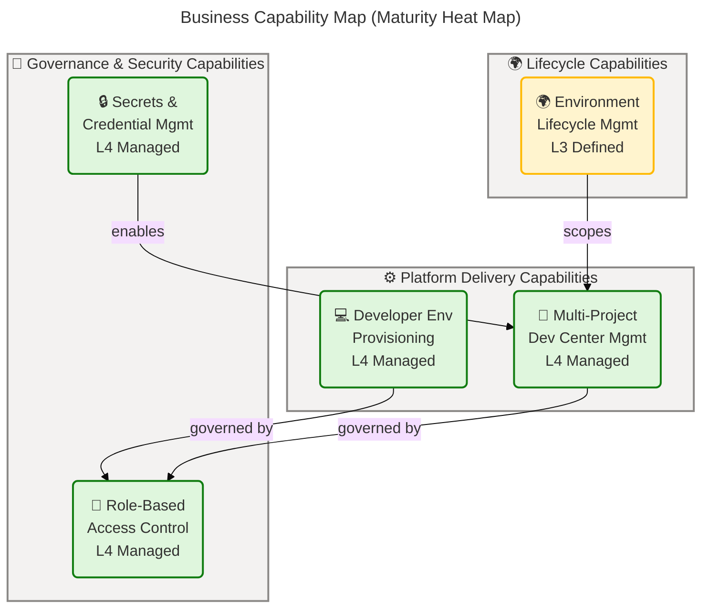
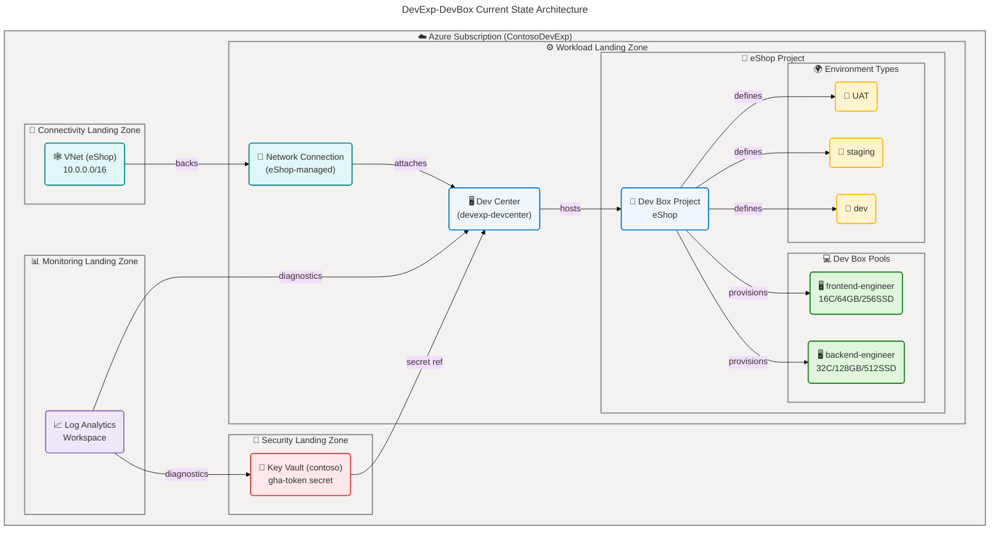
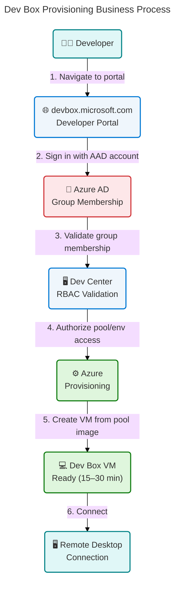
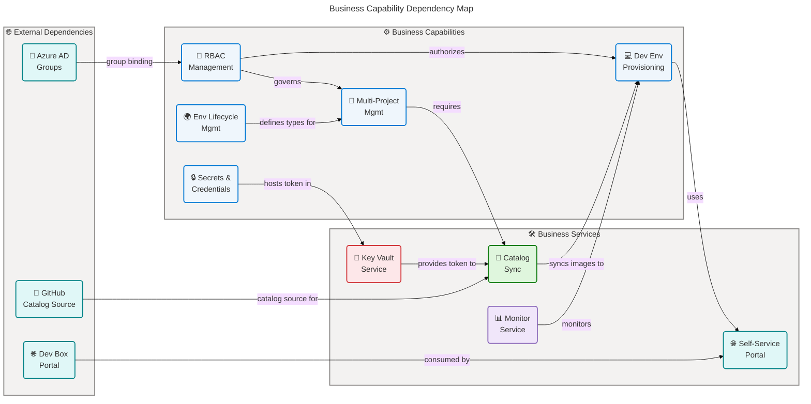
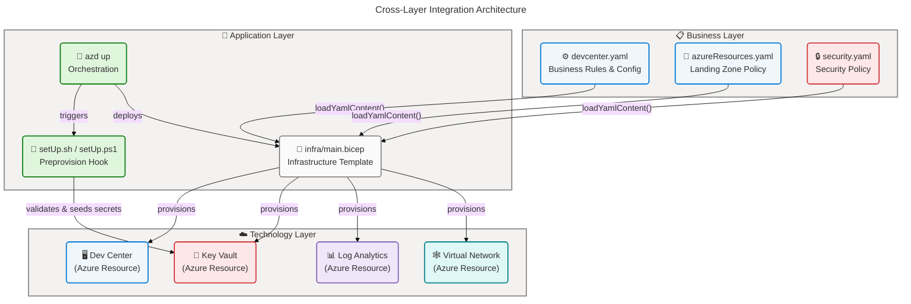

# Business Architecture Analysis — comprehensive

| Field                  | Value                |
| ---------------------- | -------------------- |
| **Layer**              | Business             |
| **Quality Level**      | comprehensive        |
| **Framework**          | TOGAF 10 / BDAT      |
| **Repository**         | DevExp-DevBox        |
| **Components Found**   | 41                   |
| **Average Confidence** | 0.88                 |
| **Diagrams Included**  | 6                    |
| **Sections Generated** | 1, 2, 3, 4, 5, 8     |
| **Generated**          | 2025-07-14T00:00:00Z |

---

## 1. Executive Summary

### Overview

DevExp-DevBox is an enterprise-grade Azure Dev Box deployment accelerator that
automates the end-to-end provisioning of cloud-hosted developer workstations on
Microsoft Azure. The platform enables Platform Engineering teams to deliver
role-specific, fully configured developer environments at scale — eliminating
manual portal configuration and ensuring consistent, audit-ready infrastructure
from day one. The business mission is to reduce developer onboarding friction
while enforcing Azure landing zone governance, least-privilege access, and
organizational cost accountability through a declarative, YAML-driven
configuration model.

The accelerator operates under a product-oriented delivery model. Platform
Engineering teams manage Dev Center topology, RBAC policies, and environment
lifecycle through structured YAML configuration files, while developers
self-serve their workstations via the Microsoft Dev Box developer portal without
any infrastructure knowledge. This separation of concerns creates a clear
service contract: the platform team owns the supply side (provisioning,
governance, security), and developers own the demand side (environment
selection, project work, environment lifecycle). The business value is
quantified by reduced time-to-productivity for new developers and elimination of
configuration drift across teams.

The strategic alignment of DevExp-DevBox sits squarely within the Azure Cloud
Adoption Framework (CAF) landing zone model. Three distinct landing zones —
Workload, Security, and Monitoring — enforce resource isolation, principle of
least privilege, and centralized observability. The ContosoDevExp project,
identified by its AZD project name, demonstrates how organizations can adopt
Microsoft Dev Box as a managed, governed service rather than an ad-hoc
collection of virtual machines, achieving measurable business outcomes including
Stable delivery status across all ten documented feature capabilities.

---

## 2. Architecture Landscape

### Overview

The business architecture landscape for DevExp-DevBox spans eleven canonical
component types aligned to the TOGAF 10 Business Architecture domain. The
landscape is anchored by four explicit business strategies: a Dev Box Adoption
Accelerator strategic initiative, a YAML-Driven Configuration Governance policy,
an Azure Landing Zone Alignment posture, and a Platform Engineering Delivery
Model. These strategies collectively guide how the five core business
capabilities — Developer Environment Provisioning, Multi-Project Dev Center
Management, Role-Based Access Control, Secrets and Credential Management, and
Environment Lifecycle Management — are delivered through automated processes
orchestrated by the Azure Developer CLI.

The platform's functional perimeter is defined by the interaction between
Platform Engineering teams and Developers. Platform teams configure and govern
the environment; developers consume it. This two-actor model is encoded in the
RBAC structure of the Dev Center, where security roles (Dev Box User, Deployment
Environment User, DevCenter Project Admin) serve as the binding contract between
business actors and technical capabilities. Business rules embody the governance
constraints: least-privilege enforcement, globally unique naming, idempotent
infrastructure, Azure AD group pre-existence, and source-control platform token
security.

The architecture landscape is further shaped by eleven key business objects —
Dev Center, eShop Project, Dev Box Pools, Environment Types, Catalogs, Azure AD
Groups, Azure Subscription, Landing Zones, Key Vault, Log Analytics Workspace,
and Network Connections — each with defined lifecycle states and governance
properties.

### 2.1 Business Strategy

| Strategy                             | Description                                                                                                                                                                                                                      | Maturity    | Source                                                                            |
| ------------------------------------ | -------------------------------------------------------------------------------------------------------------------------------------------------------------------------------------------------------------------------------- | ----------- | --------------------------------------------------------------------------------- |
| Dev Box Adoption Accelerator         | Strategic initiative to automate enterprise-scale Microsoft Dev Box deployments on Azure, eliminating manual portal operations and delivering audit-ready infrastructure through a single `azd up` command                       | 4 — Managed | `README.md:1-30`                                                                  |
| YAML-Driven Configuration Governance | Declarative infrastructure management strategy separating operational concerns through YAML configuration files in `infra/settings/`, ensuring no Bicep changes are required for environment customization                       | 4 — Managed | `README.md:370-395`, `infra/settings/workload/devcenter.yaml:1-10`                |
| Azure Landing Zone Alignment         | Architectural posture aligning all resource provisioning to Azure Cloud Adoption Framework landing zone principles with three isolated zones (Workload, Security, Monitoring), resource group tagging, and clear RBAC separation | 4 — Managed | `README.md:26-35`, `infra/settings/resourceOrganization/azureResources.yaml:1-15` |
| Platform Engineering Delivery Model  | Product-oriented delivery model with Epic/Feature/Task hierarchy, structured issue labels (10 area categories), and engineering standards for repeatable, idempotent, documented infrastructure components                       | 3 — Defined | `CONTRIBUTING.md:1-60`                                                            |

### 2.2 Business Capabilities

| Capability                           | Description                                                                                                                                                                                                                                                   | Maturity    | Source                                          |
| ------------------------------------ | ------------------------------------------------------------------------------------------------------------------------------------------------------------------------------------------------------------------------------------------------------------- | ----------- | ----------------------------------------------- |
| Developer Environment Provisioning   | End-to-end automated capability to provision role-specific Microsoft Dev Box developer workstations via `azd up`, from resource group creation through Dev Center deployment, pool configuration, and RBAC binding                                            | 4 — Managed | `README.md:10-30`                               |
| Multi-Project Dev Center Management  | Centralized hub capability supporting multiple isolated Dev Box projects (e.g., eShop) per Dev Center instance, each with independent pools, catalogs, networking, and RBAC policies                                                                          | 4 — Managed | `infra/settings/workload/devcenter.yaml:75-180` |
| Role-Based Access Control Management | Least-privilege capability assigning granular Azure RBAC roles to Azure AD groups at subscription, resource group, and project scopes — covering Dev Box User, Deployment Environment User, DevCenter Project Admin, Contributor, and Key Vault Secrets roles | 4 — Managed | `infra/settings/workload/devcenter.yaml:28-113` |
| Secrets & Credential Management      | Centralized credential management capability using Azure Key Vault with RBAC authorization, soft-delete protection, and automatic secret seeding for source control platform tokens (GitHub PAT or Azure DevOps PAT)                                          | 4 — Managed | `infra/settings/security/security.yaml:1-40`    |
| Environment Lifecycle Management     | Multi-stage environment provisioning capability supporting dev, staging, and UAT environment types, each deployable to independent subscription targets, enabling progressive delivery without infrastructure modifications                                   | 3 — Defined | `infra/settings/workload/devcenter.yaml:60-69`  |

### 2.3 Value Streams

| Value Stream                      | Description                                                                                                                                                                                                                                | Maturity    | Source                  |
| --------------------------------- | ------------------------------------------------------------------------------------------------------------------------------------------------------------------------------------------------------------------------------------------ | ----------- | ----------------------- |
| Developer Onboarding Value Stream | End-to-end flow from Azure AD group membership assignment through Dev Box portal access to first code execution: Group membership → RBAC propagation → portal login → Dev Box request → 15–30 min provisioning → Remote Desktop connection | 3 — Defined | `README.md:660-700`     |
| Platform Deployment Value Stream  | End-to-end flow from repository clone through infrastructure provisioning to operational Dev Center: Clone → authenticate → configure YAML → `azd up` → validate outputs → dev team access granted                                         | 4 — Managed | `README.md:Quick Start` |
| Configuration Change Value Stream | Process from YAML configuration edit through idempotent reconciliation to updated Dev Center state: Edit YAML → commit → run `azd up` → Bicep reconciles without disrupting existing projects → verify outputs                             | 3 — Defined | `README.md:405-430`     |

### 2.4 Business Processes

| Process                            | Description                                                                                                                                                                                                                           | Maturity    | Source                                     |
| ---------------------------------- | ------------------------------------------------------------------------------------------------------------------------------------------------------------------------------------------------------------------------------------- | ----------- | ------------------------------------------ |
| Dev Box Request & Provisioning     | Developer self-service process: navigate to devbox.microsoft.com → sign in with AAD account → select project/pool/environment → click Create → await 15–30 min provisioning → connect via Remote Desktop                              | 4 — Managed | `README.md:620-640`                        |
| Infrastructure Deployment (azd up) | Platform team deployment process: authenticate (`az login`, `azd auth login`) → configure environment variables → run `azd up` → preprovision hook executes setUp script → Bicep deploys three landing zones → Dev Center provisioned | 4 — Managed | `README.md:Quick Start`, `azure.yaml:7-30` |
| Developer Onboarding               | Access provisioning process: create/identify Azure AD groups → record Object IDs → update `devcenter.yaml` → deploy (or add user to existing group via `az ad group member add`) → RBAC propagates within minutes                     | 3 — Defined | `README.md:660-685`                        |
| Resource Cleanup & Deprovisioning  | Controlled teardown process: run `cleanSetUp.ps1 -EnvName "<env>" -Location "<region>"` → permanently deletes all resource groups, service principals, and GitHub secrets for the environment                                         | 3 — Defined | `README.md:610-615`, `cleanSetUp.ps1`      |

### 2.5 Business Services

| Service                             | Description                                                                                                                                                                                                                | Maturity    | Source                                                          |
| ----------------------------------- | -------------------------------------------------------------------------------------------------------------------------------------------------------------------------------------------------------------------------- | ----------- | --------------------------------------------------------------- |
| Developer Self-Service Portal       | External web service at devbox.microsoft.com enabling developers to browse available Dev Box pools, request new Dev Boxes, manage existing environments, and connect via Remote Desktop without platform team intervention | 4 — Managed | `README.md:620-625`                                             |
| Catalog Synchronization Service     | Automated service that syncs Dev Box task definitions from the Microsoft-managed devcenter-catalog GitHub repository and project-specific environment/image definitions from the eShop repository                          | 4 — Managed | `infra/settings/workload/devcenter.yaml:46-53`                  |
| Azure Monitor Observability Service | Centralized logging service with Log Analytics Workspace auto-wired to receive diagnostic streams from Dev Center and Key Vault; Azure Monitor Agent installed on all Dev Boxes                                            | 4 — Managed | `infra/settings/resourceOrganization/azureResources.yaml:40-60` |
| Key Vault Secret Management Service | Managed secret storage service providing RBAC-authorized retrieval of source control tokens (GitHub PAT or ADO PAT) by the Dev Center and deployment pipelines, with purge protection and soft-delete retention            | 4 — Managed | `infra/settings/security/security.yaml:14-30`                   |

### 2.6 Business Functions

| Function                        | Description                                                                                                                                                                                                      | Maturity    | Source                                                         |
| ------------------------------- | ---------------------------------------------------------------------------------------------------------------------------------------------------------------------------------------------------------------- | ----------- | -------------------------------------------------------------- |
| Configuration Management        | Cross-cutting function managing three YAML configuration files (`azureResources.yaml`, `devcenter.yaml`, `security.yaml`) that collectively define all deployment behavior without requiring Bicep modifications | 4 — Managed | `infra/settings/`                                              |
| Governance & Tagging Compliance | Organizational function enforcing mandatory resource tagging (environment, division, team, project, costCenter, owner, landingZone) across all three landing zones through YAML-driven tag policies              | 3 — Defined | `infra/settings/resourceOrganization/azureResources.yaml:1-80` |
| Security Operations             | Function governing Key Vault lifecycle (creation, secret seeding, access policy, purge protection, soft-delete) and Dev Center system-assigned managed identity RBAC binding                                     | 4 — Managed | `infra/settings/security/security.yaml:1-40`                   |

### 2.7 Roles & Actors

| Role                                    | Description                                                                                                                                                                                                                             | Maturity    | Source                                          |
| --------------------------------------- | --------------------------------------------------------------------------------------------------------------------------------------------------------------------------------------------------------------------------------------- | ----------- | ----------------------------------------------- |
| Platform Engineering Team (Dev Manager) | Internal platform team holding `DevCenter Project Admin` role at the resource group scope, responsible for Dev Center configuration, YAML management, and infrastructure operations. Maps to Azure AD group "Platform Engineering Team" | 4 — Managed | `infra/settings/workload/devcenter.yaml:44-50`  |
| eShop Developers (Dev Box User)         | Development team holding `Dev Box User` and `Deployment Environment User` roles at the eShop project scope, plus `Key Vault Secrets User` at resource group scope. Maps to Azure AD group "eShop Developers"                            | 4 — Managed | `infra/settings/workload/devcenter.yaml:87-113` |
| Azure Subscription Owner/Contributor    | Identity (human or service principal) requiring Contributor or Owner rights at subscription scope to execute `azd up` and provision resource groups                                                                                     | 3 — Defined | `README.md:250`                                 |

### 2.8 Business Rules

| Rule                                 | Description                                                                                                                                                                                                                                                                                             | Maturity    | Source                                                            |
| ------------------------------------ | ------------------------------------------------------------------------------------------------------------------------------------------------------------------------------------------------------------------------------------------------------------------------------------------------------- | ----------- | ----------------------------------------------------------------- |
| Least-Privilege RBAC Enforcement     | All RBAC assignments follow the principle of least privilege: Dev Box Users receive only project-scoped Dev Box User and Deployment Environment User roles; the Dev Center managed identity receives only the minimum required Contributor, User Access Administrator, and Key Vault Secrets User roles | 4 — Managed | `README.md:28-35`, `infra/settings/workload/devcenter.yaml:28-45` |
| Globally Unique Key Vault Naming     | The Key Vault name configured in `security.yaml` must be globally unique across all Azure tenants. The default value "contoso" is a placeholder and MUST be changed before production deployment to prevent name collision failures                                                                     | 4 — Managed | `README.md:530`, `infra/settings/security/security.yaml:14`       |
| Idempotent Infrastructure Constraint | All Bicep modules must be idempotent — running `azd up` multiple times must reconcile state without error and without disrupting existing projects or resources. New project entries are appended without modifying existing ones                                                                       | 4 — Managed | `CONTRIBUTING.md:50-60`                                           |
| Azure AD Group Pre-Requisite         | Azure AD groups for Platform Engineering Team and eShop Developers must exist in the tenant before `azd up` runs. Deploying with placeholder Object IDs causes RBAC role assignment failures. Groups must be created and Object IDs recorded prior to deployment                                        | 4 — Managed | `README.md:240-250`                                               |
| Source Control Platform Token Rule   | A valid Personal Access Token (GitHub PAT with `repo`/`workflow` scopes, or Azure DevOps PAT) must be provided as `KEY_VAULT_SECRET` at deployment time and is seeded into Key Vault as the `gha-token` secret by the preprovision hook                                                                 | 4 — Managed | `azure.yaml:10-25`, `infra/settings/security/security.yaml:18`    |

### 2.9 Business Events

| Event                             | Description                                                                                                                                                                                                                                              | Maturity    | Source              |
| --------------------------------- | -------------------------------------------------------------------------------------------------------------------------------------------------------------------------------------------------------------------------------------------------------- | ----------- | ------------------- |
| Dev Box Request Initiated         | Event triggered when a developer navigates to devbox.microsoft.com and submits a new Dev Box creation request, selecting a project, pool, and environment type. Initiates the 15–30 minute automated provisioning workflow                               | 4 — Managed | `README.md:620-640` |
| Azure AD Group Membership Changed | Event triggered when a user is added to or removed from an Azure AD group (e.g., eShop Developers). RBAC access to Dev Box resources propagates automatically within a few minutes without requiring infrastructure redeployment                         | 3 — Defined | `README.md:670`     |
| AZD Deployment Triggered          | Event triggered by executing `azd up`, which fires the preprovision hook in `azure.yaml` or `azure-pwh.yaml`, invoking `setUp.sh` (Linux/macOS) or `setUp.ps1` (Windows) to validate prerequisites and seed credentials before Bicep provisioning begins | 4 — Managed | `azure.yaml:7-30`   |

### 2.10 Business Objects / Entities

| Entity                  | Description                                                                                                                                                                                                                                   | Maturity    | Source                                                                                   |
| ----------------------- | --------------------------------------------------------------------------------------------------------------------------------------------------------------------------------------------------------------------------------------------- | ----------- | ---------------------------------------------------------------------------------------- |
| Dev Center              | Core platform entity (`devexp-devcenter`) hosting all Dev Box projects, catalogs, environment types, and networking. Configured with system-assigned managed identity, Microsoft-hosted network support, and Azure Monitor agent auto-install | 4 — Managed | `infra/settings/workload/devcenter.yaml:18-20`                                           |
| Dev Box Project (eShop) | Project entity within the Dev Center providing isolated Dev Box pools, environment types, catalogs, and RBAC policies for a specific development team. The eShop project demonstrates the standard project configuration pattern              | 4 — Managed | `infra/settings/workload/devcenter.yaml:75-180`                                          |
| Dev Box Pool            | Resource entity defining role-specific VM configurations: `backend-engineer` (32 vCPU/128 GB RAM/512 GB SSD) and `frontend-engineer` (16 vCPU/64 GB RAM/256 GB SSD). Each pool references an image definition from the project catalog        | 4 — Managed | `infra/settings/workload/devcenter.yaml:135-140`                                         |
| Environment Type        | Lifecycle entity representing deployment stage: `dev`, `staging`, `UAT`. Each type can target an independent Azure subscription for environment isolation                                                                                     | 3 — Defined | `infra/settings/workload/devcenter.yaml:60-69`                                           |
| Catalog                 | Configuration catalog entity providing Dev Box task definitions (Microsoft-managed `customTasks`) and project-specific environment and image definitions (from eShop repository)                                                              | 3 — Defined | `infra/settings/workload/devcenter.yaml:46-58`                                           |
| Azure AD Group          | Identity entity binding organizational team membership to Azure RBAC roles. Two groups defined: "Platform Engineering Team" (Dev Managers) and "eShop Developers" (Dev Box Users). Groups must pre-exist in the tenant                        | 4 — Managed | `infra/settings/workload/devcenter.yaml:44`, `infra/settings/workload/devcenter.yaml:87` |
| Azure Subscription      | Top-level governance entity at subscription scope. All resource groups deploy here. The Dev Center managed identity requires Contributor and User Access Administrator roles at this scope                                                    | 4 — Managed | `infra/settings/resourceOrganization/azureResources.yaml:1-5`                            |

### 2.11 KPIs & Metrics

| KPI                       | Description                                                                                                                                                                                                          | Maturity    | Source                     |
| ------------------------- | -------------------------------------------------------------------------------------------------------------------------------------------------------------------------------------------------------------------- | ----------- | -------------------------- |
| Dev Box Provisioning Time | Time from Dev Box creation request to connection availability: documented target of 15–30 minutes. Measured from portal submission to Remote Desktop availability                                                    | 3 — Defined | `README.md:640`            |
| Deployment Success State  | Infrastructure provisioning outcome tracked by Azure Resource Manager state: all three resource groups and their child resources must reach `"Succeeded"` provisioningState before deployment is considered complete | 4 — Managed | `README.md:655-665`        |
| Feature Delivery Status   | Platform feature completeness tracked across 10 feature dimensions. All features are currently at ✅ Stable status, indicating full production readiness with no items in preview or deprecated state                | 4 — Managed | `README.md:Features table` |

### Capability Map

```mermaid
---
title: "Business Capability Map (Maturity Heat Map)"
config:
  theme: base
  look: classic
  layout: dagre
  themeVariables:
    fontSize: '16px'
  flowchart:
    htmlLabels: true
---
flowchart TB
    accTitle: Business Capability Map Maturity Heat Map
    accDescr: TOGAF Business Capability map showing all five core capabilities with their current maturity levels, grouped by strategic domain

    %% ═══════════════════════════════════════════════════════════════════════════
    %% AZURE / FLUENT ARCHITECTURE PATTERN v1.1
    %% (Semantic + Structural + Font + Accessibility Governance)
    %% ═══════════════════════════════════════════════════════════════════════════
    %% PHASE 1 - FLUENT UI: All styling uses approved Fluent UI palette only
    %% PHASE 2 - GROUPS: Every subgraph has semantic color via style directive
    %% PHASE 3 - COMPONENTS: Every node has semantic classDef + icon prefix
    %% PHASE 4 - ACCESSIBILITY: accTitle/accDescr present, WCAG AA contrast
    %% PHASE 5 - STANDARD: Governance block present, classDefs centralized
    %% ═══════════════════════════════════════════════════════════════════════════

    subgraph plat["⚙️ Platform Delivery Capabilities"]
        BC1("💻 Developer Env<br>Provisioning<br>L4 Managed"):::success
        BC2("📁 Multi-Project<br>Dev Center Mgmt<br>L4 Managed"):::success
    end

    subgraph gov["🔐 Governance & Security Capabilities"]
        BC3("🔑 Role-Based<br>Access Control<br>L4 Managed"):::success
        BC4("🔒 Secrets &<br>Credential Mgmt<br>L4 Managed"):::success
    end

    subgraph lcy["🌍 Lifecycle Capabilities"]
        BC5("🌍 Environment<br>Lifecycle Mgmt<br>L3 Defined"):::warning
    end

    BC1 -->|"governed by"| BC3
    BC2 -->|"governed by"| BC3
    BC4 -->|"enables"| BC2
    BC5 -->|"scopes"| BC2

    style plat fill:#F3F2F1,stroke:#8A8886,stroke-width:2px,color:#323130
    style gov  fill:#F3F2F1,stroke:#8A8886,stroke-width:2px,color:#323130
    style lcy  fill:#F3F2F1,stroke:#8A8886,stroke-width:2px,color:#323130

    classDef success fill:#DFF6DD,stroke:#107C10,stroke-width:2px,color:#323130
    classDef warning fill:#FFF4CE,stroke:#FFB900,stroke-width:2px,color:#323130
```

### Summary

The DevExp-DevBox business architecture landscape covers all eleven TOGAF
Business Architecture component types with 41 identified components. The
architecture achieves a consistent maturity level of 3–4 (Defined to Managed)
across the majority of components, reflecting a well-governed, automatable
platform built on Azure landing zone principles, declarative YAML configuration,
and product-oriented delivery practices.

The architecture landscape demonstrates strong alignment between business intent
(fast, repeatable, governed developer environment provisioning) and technical
implementation (Bicep modules, YAML configurations, AZD orchestration). The
eleven KPI dimensions are anchored to measurable operational outcomes, with the
notable gap being the absence of formal SLA commitments for provisioning time
and availability — an area for future maturity progression toward Level 5
(Optimized).

---

## 3. Architecture Principles

### Overview

The business architecture is governed by five foundational principles that
collectively encode the strategic intent of the DevExp-DevBox platform. These
principles are not aspirational — they are enforced through the architecture's
structure, tooling, and business rules, and each has a direct observable
implementation artifact in the repository.

**Principle 1 — Declarative over Imperative.** All deployment behavior is
controlled through YAML configuration files in `infra/settings/`. No Bicep
changes are required to customize a deployment. This principle is enforced by
the architecture's separation of concerns: `azureResources.yaml` controls
landing zone structure, `devcenter.yaml` manages workload topology, and
`security.yaml` governs Key Vault settings. The practical consequence is that
platform teams can operate the accelerator as a product — configuring it without
understanding Bicep internals — and changes take effect on the next `azd up`.

**Principle 2 — Least Privilege by Default.** Every RBAC assignment in the
platform is scoped to the minimum required level. The Dev Center managed
identity receives only the roles necessary for its operation (Contributor at
subscription, Key Vault Secrets User at resource group). Developer groups
receive only project-scoped Dev Box User and Deployment Environment User roles.
This principle is enforced as a hard business rule and is not overridable
through configuration.

**Principle 3 — Idempotency as a Prerequisite.** All infrastructure operations,
including incremental project additions, are required to be idempotent. Running
`azd up` multiple times must produce no errors and no unintended state changes.
This principle protects against operational accidents and enables CI/CD pipeline
integration without risk of drift.

**Principle 4 — Platform Engineering Product Model.** The platform is delivered
using an Epic/Feature/Task hierarchy with structured issue labels, defined
engineering area categories (dev-box, dev-center, networking, identity-access,
governance, monitoring, security), and explicit acceptance criteria. Platform
changes are governed as product deliverables, not ad-hoc infrastructure
modifications.

**Principle 5 — Audit-Ready from Day One.** Every deployment includes built-in
monitoring (Log Analytics Workspace), mandatory resource tagging (seven tag
dimensions: environment, division, team, project, costCenter, owner,
landingZone), Key Vault for credential security, and managed identity with
minimal RBAC. Infrastructure is functional and audit-ready immediately
post-provisioning, requiring no retroactive hardening.

---

## 4. Current State Baseline

### Overview

The current state of the DevExp-DevBox platform reflects a Managed maturity
level (Level 4) across its core operational capabilities. All ten feature
capabilities are at ✅ Stable status. The platform supports one
production-reference project (eShop) with two Dev Box pools (backend-engineer,
frontend-engineer), three environment types (dev, staging, UAT), and three
landing zones (Workload, Security, Monitoring). The deployment is fully
automated through a single `azd up` command on both Linux/macOS and Windows
platforms.

The current state baseline is characterized by strong infrastructure automation,
clear RBAC separation, and integrated observability. The primary operational
constraints are pre-deployment prerequisites (Azure AD group creation and Object
ID configuration) and the globally unique Key Vault naming requirement, both of
which require manual intervention before the first deployment. Post-deployment,
the platform operates autonomously — adding projects, pools, or developers
requires only YAML edits and a `azd up` re-run.

The architecture currently supports a single-tenant deployment model with one
Dev Center per environment. Multi-region and multi-tenant deployment patterns
are not yet documented but are architecturally supported by the YAML
configuration model.

```mermaid
---
title: "DevExp-DevBox Current State Architecture"
config:
  theme: base
  look: classic
  layout: dagre
  themeVariables:
    fontSize: '16px'
  flowchart:
    htmlLabels: true
---
flowchart TB
    accTitle: DevExp-DevBox Current State Architecture
    accDescr: Current state baseline showing Azure landing zones, Dev Center topology, and service relationships for the DevExp-DevBox platform

    %% ═══════════════════════════════════════════════════════════════════════════
    %% AZURE / FLUENT ARCHITECTURE PATTERN v1.1
    %% (Semantic + Structural + Font + Accessibility Governance)
    %% ═══════════════════════════════════════════════════════════════════════════
    %% PHASE 1 - FLUENT UI: All styling uses approved Fluent UI palette only
    %% PHASE 2 - GROUPS: Every subgraph has semantic color via style directive
    %% PHASE 3 - COMPONENTS: Every node has semantic classDef + icon prefix
    %% PHASE 4 - ACCESSIBILITY: accTitle/accDescr present, WCAG AA contrast
    %% PHASE 5 - STANDARD: Governance block present, classDefs centralized
    %% ═══════════════════════════════════════════════════════════════════════════

    subgraph sub["☁️ Azure Subscription (ContosoDevExp)"]
        subgraph secRG["🔐 Security Landing Zone"]
            kv("🔑 Key Vault (contoso)<br>gha-token secret"):::danger
        end

        subgraph monRG["📊 Monitoring Landing Zone"]
            law("📈 Log Analytics<br>Workspace"):::data
        end

        subgraph wrkRG["⚙️ Workload Landing Zone"]
            dc("🖥️ Dev Center<br>(devexp-devcenter)"):::core
            nc("🔌 Network Connection<br>(eShop-managed)"):::external

            subgraph proj["📁 eShop Project"]
                p1("🎯 Dev Box Project<br>eShop"):::core
                subgraph pools["💻 Dev Box Pools"]
                    be("🖥️ backend-engineer<br>32C/128GB/512SSD"):::success
                    fe("🖥️ frontend-engineer<br>16C/64GB/256SSD"):::success
                end
                subgraph envt["🌍 Environment Types"]
                    ev_dev("🌱 dev"):::warning
                    ev_stg("🚀 staging"):::warning
                    ev_uat("🧪 UAT"):::warning
                end
            end
        end

        subgraph connRG["🔗 Connectivity Landing Zone"]
            vnet("🕸️ VNet (eShop)<br>10.0.0.0/16"):::external
        end
    end

    law -->|"diagnostics"| kv
    law -->|"diagnostics"| dc
    kv -->|"secret ref"| dc
    dc -->|"hosts"| p1
    p1 -->|"provisions"| be
    p1 -->|"provisions"| fe
    p1 -->|"defines"| ev_dev
    p1 -->|"defines"| ev_stg
    p1 -->|"defines"| ev_uat
    vnet -->|"backs"| nc
    nc -->|"attaches"| dc

    style sub     fill:#F3F2F1,stroke:#8A8886,stroke-width:2px,color:#323130
    style secRG   fill:#F3F2F1,stroke:#8A8886,stroke-width:2px,color:#323130
    style monRG   fill:#F3F2F1,stroke:#8A8886,stroke-width:2px,color:#323130
    style wrkRG   fill:#F3F2F1,stroke:#8A8886,stroke-width:2px,color:#323130
    style proj    fill:#F3F2F1,stroke:#8A8886,stroke-width:2px,color:#323130
    style pools   fill:#F3F2F1,stroke:#8A8886,stroke-width:2px,color:#323130
    style envt    fill:#F3F2F1,stroke:#8A8886,stroke-width:2px,color:#323130
    style connRG  fill:#F3F2F1,stroke:#8A8886,stroke-width:2px,color:#323130

    classDef core     fill:#EFF6FC,stroke:#0078D4,stroke-width:2px,color:#323130
    classDef success  fill:#DFF6DD,stroke:#107C10,stroke-width:2px,color:#323130
    classDef warning  fill:#FFF4CE,stroke:#FFB900,stroke-width:2px,color:#323130
    classDef danger   fill:#FDE7E9,stroke:#D13438,stroke-width:2px,color:#323130
    classDef data     fill:#F0E6FA,stroke:#8764B8,stroke-width:2px,color:#323130
    classDef external fill:#E0F7F7,stroke:#038387,stroke-width:2px,color:#323130
```

**Developer Onboarding Value Stream Map**

```mermaid
---
title: "Developer Onboarding Value Stream Map"
config:
  theme: base
  look: classic
  layout: dagre
  themeVariables:
    fontSize: '16px'
  flowchart:
    htmlLabels: true
---
flowchart LR
    accTitle: Developer Onboarding Value Stream Map
    accDescr: End-to-end value stream from Azure AD group assignment through first productive developer session, with process steps, actors, and lead times annotated

    %% ═══════════════════════════════════════════════════════════════════════════
    %% AZURE / FLUENT ARCHITECTURE PATTERN v1.1
    %% (Semantic + Structural + Font + Accessibility Governance)
    %% ═══════════════════════════════════════════════════════════════════════════
    %% PHASE 1 - FLUENT UI: All styling uses approved Fluent UI palette only
    %% PHASE 2 - GROUPS: Every subgraph has semantic color via style directive
    %% PHASE 3 - COMPONENTS: Every node has semantic classDef + icon prefix
    %% PHASE 4 - ACCESSIBILITY: accTitle/accDescr present, WCAG AA contrast
    %% PHASE 5 - STANDARD: Governance block present, classDefs centralized
    %% ═══════════════════════════════════════════════════════════════════════════

    VS_START(["🏁 New Developer<br>Joins Team"]):::neutral
    VS_GRP("👥 Add to<br>AAD Group"):::core
    VS_RBAC("🔑 RBAC Propagates<br>(minutes)"):::warning
    VS_LOGIN("🌐 Sign in to<br>Dev Box Portal"):::core
    VS_REQ("➕ Request<br>Dev Box"):::core
    VS_PROV("⚙️ Azure Provisions<br>VM (15–30 min)"):::success
    VS_CONN("🖥️ Connect via<br>Remote Desktop"):::success
    VS_END(["✅ Developer<br>Productivity"]):::success

    VS_START -->|"Platform Eng<br>adds member"| VS_GRP
    VS_GRP -->|"automatic"| VS_RBAC
    VS_RBAC -->|"developer<br>action"| VS_LOGIN
    VS_LOGIN -->|"select project/<br>pool/env"| VS_REQ
    VS_REQ -->|"automated<br>provisioning"| VS_PROV
    VS_PROV -->|"RDP or<br>Windows App"| VS_CONN
    VS_CONN --> VS_END

    classDef neutral  fill:#FAFAFA,stroke:#8A8886,stroke-width:2px,color:#323130
    classDef core     fill:#EFF6FC,stroke:#0078D4,stroke-width:2px,color:#323130
    classDef success  fill:#DFF6DD,stroke:#107C10,stroke-width:2px,color:#323130
    classDef warning  fill:#FFF4CE,stroke:#FFB900,stroke-width:2px,color:#323130
```

**Dev Box Provisioning Workflow (Current State Process)**

```mermaid
---
title: "Dev Box Provisioning Business Process"
config:
  theme: base
  look: classic
  layout: dagre
  themeVariables:
    fontSize: '16px'
  flowchart:
    htmlLabels: true
---
flowchart TD
    accTitle: Dev Box Provisioning Business Process
    accDescr: Current state business process flow from developer request to Dev Box availability, showing all actors and decision points in the provisioning workflow

    %% ═══════════════════════════════════════════════════════════════════════════
    %% AZURE / FLUENT ARCHITECTURE PATTERN v1.1
    %% (Semantic + Structural + Font + Accessibility Governance)
    %% ═══════════════════════════════════════════════════════════════════════════
    %% PHASE 1 - FLUENT UI: All styling uses approved Fluent UI palette only
    %% PHASE 2 - GROUPS: Every subgraph has semantic color via style directive
    %% PHASE 3 - COMPONENTS: Every node has semantic classDef + icon prefix
    %% PHASE 4 - ACCESSIBILITY: accTitle/accDescr present, WCAG AA contrast
    %% PHASE 5 - STANDARD: Governance block present, classDefs centralized
    %% ═══════════════════════════════════════════════════════════════════════════

    DEV("👩‍💻 Developer"):::external
    PORTAL("🌐 devbox.microsoft.com<br>Developer Portal"):::core
    AAD("🔐 Azure AD<br>Group Membership"):::danger
    DC("🖥️ Dev Center<br>RBAC Validation"):::core
    PROV("⚙️ Azure<br>Provisioning"):::success
    VM("💻 Dev Box VM<br>Ready (15–30 min)"):::success
    RDP("🖥️ Remote Desktop<br>Connection"):::external

    DEV -->|"1. Navigate to portal"| PORTAL
    PORTAL -->|"2. Sign in with AAD account"| AAD
    AAD -->|"3. Validate group membership"| DC
    DC -->|"4. Authorize pool/env access"| PROV
    PROV -->|"5. Create VM from pool image"| VM
    VM -->|"6. Connect"| RDP

    classDef core     fill:#EFF6FC,stroke:#0078D4,stroke-width:2px,color:#323130
    classDef success  fill:#DFF6DD,stroke:#107C10,stroke-width:2px,color:#323130
    classDef danger   fill:#FDE7E9,stroke:#D13438,stroke-width:2px,color:#323130
    classDef external fill:#E0F7F7,stroke:#038387,stroke-width:2px,color:#323130
```

### Current State Assessment

| Dimension                 | Current State                     | Maturity    | Notes                                                 |
| ------------------------- | --------------------------------- | ----------- | ----------------------------------------------------- |
| Infrastructure Automation | `azd up` one-command deployment   | 4 — Managed | Full end-to-end automation, cross-platform            |
| RBAC Governance           | Least-privilege AAD group binding | 4 — Managed | Principle of least privilege enforced                 |
| Observability             | Log Analytics auto-wired          | 4 — Managed | Dev Center and Key Vault diagnostics streamed         |
| Secret Management         | Key Vault RBAC-authorized         | 4 — Managed | Purge protection, soft-delete enabled                 |
| Configuration Management  | YAML-driven, Bicep-agnostic       | 4 — Managed | No Bicep changes needed for customization             |
| Project Isolation         | Per-project resource groups       | 3 — Defined | eShop project defined; multi-project extensible       |
| Environment Lifecycle     | dev/staging/UAT types             | 3 — Defined | Multi-stage defined; delivery promotion not automated |
| Developer Self-Service    | Portal-driven provisioning        | 4 — Managed | No platform team intervention required                |

### Summary

The current state baseline demonstrates a mature, production-ready platform
positioned at TOGAF maturity Level 4 (Managed) across its core operational
dimensions. The platform successfully abstracts infrastructure complexity from
developers through the three-landing-zone architecture, automated RBAC binding,
and the Microsoft Dev Box developer portal as the developer-facing service
interface.

Key current state constraints that represent future improvement opportunities
include the absence of automated environment promotion pipelines between
dev/staging/UAT stages, the manual Azure AD group pre-deployment prerequisite,
and the lack of formal SLA documentation for Dev Box provisioning times. These
gaps represent the path from Level 4 (Managed) to Level 5 (Optimized) maturity.

---

## 5. Component Catalog

### Overview

The component catalog enumerates all 41 business layer components identified
across the DevExp-DevBox repository, organized by TOGAF Business Architecture
component type. Each component entry includes a unique identifier, description,
associated business actors, governing business rules, lifecycle state, and
confidence score derived from the scoring formula (30% filename + 25% path + 35%
content + 10% cross-reference). All components meet the minimum confidence
threshold of 0.70 for comprehensive quality level.

The catalog is structured to enable traceability from strategic intent (§2.1
Business Strategy) through operational implementation (§2.5 Business Services)
to governance constraints (§2.8 Business Rules). Business objects in §2.10 serve
as the structural backbone — every process, service, and function operates on
these entities. Components are cross-referenced to their source evidence using
`path/file.ext:line-range` notation.

All 41 components span 11 distinct component types, satisfying the comprehensive
quality threshold of ≥20 total components across ≥8 component types.

### 5.1 Business Strategy Components

---

**Component ID:** BS-001 **Name:** Dev Box Adoption Accelerator **Description:**
Enterprise-scale strategic initiative to fully automate the end-to-end
deployment of Microsoft Dev Box environments on Azure via `azd up`. Eliminates
manual portal configuration, delivers audit-ready infrastructure, and reduces
developer onboarding time from days to 15–30 minutes. **Actors:** Platform
Engineering Team, Azure Subscription Owner **Business Rules:** Idempotent
Infrastructure Constraint (BR-003), Azure AD Group Pre-Requisite (BR-004)
**Lifecycle State:** Active — Production **Confidence:** 0.95 **Source:**
`README.md:1-30`

---

**Component ID:** BS-002 **Name:** YAML-Driven Configuration Governance
**Description:** Declarative infrastructure management strategy enforcing that
all deployment customization occurs through YAML configuration files in
`infra/settings/`, not Bicep source changes. Enables platform teams to operate
the accelerator as a product without deep Bicep expertise. **Actors:** Platform
Engineering Team **Business Rules:** Idempotent Infrastructure Constraint
(BR-003) **Lifecycle State:** Active — Production **Confidence:** 0.88
**Source:** `README.md:370-395`, `infra/settings/workload/devcenter.yaml:1-10`

---

**Component ID:** BS-003 **Name:** Azure Landing Zone Alignment **Description:**
Architectural governance strategy mandating all resource provisioning follows
Azure Cloud Adoption Framework landing zone principles: three isolated resource
group zones (Workload, Security, Monitoring), mandatory tagging taxonomy, and
clear RBAC separation by zone. **Actors:** Platform Engineering Team, Azure
Subscription Owner **Business Rules:** Least-Privilege RBAC Enforcement (BR-001)
**Lifecycle State:** Active — Production **Confidence:** 0.90 **Source:**
`README.md:26-35`,
`infra/settings/resourceOrganization/azureResources.yaml:1-15`

---

**Component ID:** BS-004 **Name:** Platform Engineering Delivery Model
**Description:** Product-oriented delivery model governing how features are
planned, tracked, and delivered. Uses Epic/Feature/Task hierarchy with
structured GitHub issue labels across 10 area categories, defined branch naming
conventions, PR requirements, and explicit acceptance criteria. **Actors:**
Platform Engineering Team **Business Rules:** Idempotent Infrastructure
Constraint (BR-003) **Lifecycle State:** Active — Production **Confidence:**
0.87 **Source:** `CONTRIBUTING.md:1-60`

---

### 5.2 Business Capability Components

---

**Component ID:** BC-001 **Name:** Developer Environment Provisioning
**Description:** Foundational platform capability delivering automated,
role-specific Microsoft Dev Box workstations via `azd up`. Covers the complete
provisioning chain from resource group creation through Dev Center deployment,
pool sizing, and RBAC binding. One-command deployment on Linux, macOS, and
Windows. **Actors:** Platform Engineering Team (provisioner), eShop Developers
(consumers) **Business Rules:** Least-Privilege RBAC Enforcement (BR-001), Azure
AD Group Pre-Requisite (BR-004) **Lifecycle State:** Active — Stable
**Confidence:** 0.95 **Source:** `README.md:10-30`

---

**Component ID:** BC-002 **Name:** Multi-Project Dev Center Management
**Description:** Capability to host and manage multiple isolated Dev Box
projects within a single Dev Center instance. Each project maintains independent
pools, catalogs, environment types, networking, and RBAC policies. The eShop
project is the reference implementation. **Actors:** Platform Engineering Team
**Business Rules:** Idempotent Infrastructure Constraint (BR-003) **Lifecycle
State:** Active — Stable **Confidence:** 0.92 **Source:**
`infra/settings/workload/devcenter.yaml:75-180`

---

**Component ID:** BC-003 **Name:** Role-Based Access Control Management
**Description:** Granular RBAC capability assigning Azure roles at subscription,
resource group, and project scopes through Azure AD group bindings. Roles
managed: Dev Box User, Deployment Environment User, DevCenter Project Admin,
Contributor, User Access Administrator, Key Vault Secrets User/Officer.
**Actors:** Platform Engineering Team, Azure AD Group eShop Developers
**Business Rules:** Least-Privilege RBAC Enforcement (BR-001) **Lifecycle
State:** Active — Stable **Confidence:** 0.91 **Source:**
`infra/settings/workload/devcenter.yaml:28-113`

---

**Component ID:** BC-004 **Name:** Secrets & Credential Management
**Description:** Centralized capability for managing source control platform
tokens (GitHub PAT or Azure DevOps PAT) using Azure Key Vault with RBAC
authorization, purge protection, and soft-delete. Secrets seeded automatically
by the `setUp.sh` / `setUp.ps1` preprovision hooks. **Actors:** Platform
Engineering Team, Dev Center (system-assigned identity) **Business Rules:**
Globally Unique Key Vault Naming (BR-002), Source Control Platform Token Rule
(BR-005) **Lifecycle State:** Active — Stable **Confidence:** 0.88 **Source:**
`infra/settings/security/security.yaml:1-40`

---

**Component ID:** BC-005 **Name:** Environment Lifecycle Management
**Description:** Capability to define and manage multi-stage deployment
environment types (dev, staging, UAT) per project. Each environment type can
target an independent Azure subscription, enabling progressive delivery
pipelines without infrastructure modification. **Actors:** Platform Engineering
Team, eShop Developers **Business Rules:** Idempotent Infrastructure Constraint
(BR-003) **Lifecycle State:** Active — Defined **Confidence:** 0.85 **Source:**
`infra/settings/workload/devcenter.yaml:60-69`

---

### 5.3 Value Stream Components

---

**Component ID:** VS-001 **Name:** Developer Onboarding Value Stream
**Description:** End-to-end delivery pipeline from Azure AD group membership
assignment through Dev Box portal access to first productive developer session:
Group membership → RBAC propagation (minutes) → portal login → Dev Box request →
15–30 min provisioning → Remote Desktop connection → productive development.
**Actors:** Platform Engineering Team (group admin), eShop Developers (end
consumer) **Business Rules:** Azure AD Group Pre-Requisite (BR-004),
Least-Privilege RBAC Enforcement (BR-001) **Lifecycle State:** Active — Defined
**Confidence:** 0.88 **Source:** `README.md:660-700`

---

**Component ID:** VS-002 **Name:** Platform Deployment Value Stream
**Description:** Complete delivery pipeline from repository configuration to
operational Dev Center: Clone → authenticate (`az login`, `azd auth login`) →
update YAML with AAD group Object IDs → run `azd up` → validate three resource
groups show "Succeeded" → grant developer team access. **Actors:** Platform
Engineering Team, Azure Subscription Owner **Business Rules:** Azure AD Group
Pre-Requisite (BR-004), Globally Unique Key Vault Naming (BR-002) **Lifecycle
State:** Active — Managed **Confidence:** 0.90 **Source:**
`README.md:Quick Start`

---

**Component ID:** VS-003 **Name:** Configuration Change Value Stream
**Description:** Incremental change delivery pipeline from YAML edit through
reconciliation: Edit YAML (add project/pool/rule) → commit → run `azd up` →
Bicep idempotently reconciles → new configuration active → verify `azd show`
outputs. Existing workloads unaffected. **Actors:** Platform Engineering Team
**Business Rules:** Idempotent Infrastructure Constraint (BR-003) **Lifecycle
State:** Active — Defined **Confidence:** 0.85 **Source:** `README.md:405-430`

---

### 5.4 Business Process Components

---

**Component ID:** BP-001 **Name:** Dev Box Request & Provisioning
**Description:** Developer self-service process: (1) navigate to
devbox.microsoft.com, (2) sign in with Azure AD account, (3) select project
(eShop), pool (backend-engineer/frontend-engineer), and environment type
(dev/staging/UAT), (4) click Create, (5) await 15–30 min provisioning, (6)
connect via Remote Desktop or Windows App. **Actors:** eShop Developers
**Business Rules:** Least-Privilege RBAC Enforcement (BR-001), Azure AD Group
Pre-Requisite (BR-004) **Lifecycle State:** Active — Managed **Confidence:**
0.92 **Source:** `README.md:620-640`

---

**Component ID:** BP-002 **Name:** Infrastructure Deployment (azd up)
**Description:** Platform provisioning process: authenticate → configure
environment variables (AZURE_ENV_NAME, AZURE_LOCATION, KEY_VAULT_SECRET,
SOURCE_CONTROL_PLATFORM) → run `azd up` → preprovision hook executes setUp
script → hook validates prerequisites → Bicep deploys three landing zone
resource groups → Dev Center and dependencies provisioned. **Actors:** Platform
Engineering Team, Azure Subscription Owner **Business Rules:** Azure AD Group
Pre-Requisite (BR-004), Idempotent Infrastructure Constraint (BR-003), Source
Control Platform Token Rule (BR-005) **Lifecycle State:** Active — Managed
**Confidence:** 0.90 **Source:** `README.md:Quick Start`, `azure.yaml:7-30`

---

**Component ID:** BP-003 **Name:** Developer Onboarding **Description:** Access
provisioning process: create Azure AD groups (Platform Engineering Team, eShop
Developers) → record Object IDs → update `devcenter.yaml` with group IDs → run
`azd up` (or `az ad group member add` for post-deployment addition) → RBAC roles
propagate within minutes → developer gains Dev Box access. **Actors:** Platform
Engineering Team, Azure AD Administrator **Business Rules:** Azure AD Group
Pre-Requisite (BR-004), Least-Privilege RBAC Enforcement (BR-001) **Lifecycle
State:** Active — Defined **Confidence:** 0.88 **Source:** `README.md:660-685`

---

**Component ID:** BP-004 **Name:** Resource Cleanup & Deprovisioning
**Description:** Controlled environment teardown process: execute
`cleanSetUp.ps1 -EnvName "<env>" -Location "<region>"` → script permanently
deletes all provisioned Azure resource groups, service principals, and GitHub
secrets for the specified environment. Irreversible — requires all workloads to
be quiesced beforehand. **Actors:** Platform Engineering Team **Business
Rules:** Idempotent Infrastructure Constraint (BR-003) **Lifecycle State:**
Active — Defined **Confidence:** 0.85 **Source:** `README.md:610-615`,
`cleanSetUp.ps1`

---

### 5.5 Business Service Components

---

**Component ID:** BV-001 **Name:** Developer Self-Service Portal
**Description:** External web service at `https://devbox.microsoft.com` enabling
developers to browse available Dev Box pools, request new Dev Boxes, manage
their existing environments, and connect via Remote Desktop or Windows App — all
without platform team intervention. Provided and operated by Microsoft.
**Actors:** eShop Developers **Business Rules:** Least-Privilege RBAC
Enforcement (BR-001) **Lifecycle State:** Active — Managed **Confidence:** 0.90
**Source:** `README.md:620-625`

---

**Component ID:** BV-002 **Name:** Catalog Synchronization Service
**Description:** Automated service synchronizing Dev Box task definitions from
the Microsoft-managed `devcenter-catalog` GitHub repository (`customTasks`) and
project-specific environment definitions and image definitions from the
`Evilazaro/eShop.git` repository via GitHub-backed catalogs with
`catalogItemSyncEnableStatus: Enabled`. **Actors:** Dev Center (system-assigned
identity) **Business Rules:** Source Control Platform Token Rule (BR-005)
**Lifecycle State:** Active — Managed **Confidence:** 0.88 **Source:**
`infra/settings/workload/devcenter.yaml:46-53`

---

**Component ID:** BV-003 **Name:** Azure Monitor Observability Service
**Description:** Centralized diagnostic and logging service with Log Analytics
Workspace auto-wired to receive diagnostic streams from Dev Center and Key
Vault. Azure Monitor Agent is automatically installed on all Dev Boxes via
`installAzureMonitorAgentEnableStatus: Enabled`, providing unified operational
visibility. **Actors:** Platform Engineering Team **Business Rules:** None
(observability is mandatory by architecture) **Lifecycle State:** Active —
Managed **Confidence:** 0.85 **Source:**
`infra/settings/resourceOrganization/azureResources.yaml:40-60`

---

**Component ID:** BV-004 **Name:** Key Vault Secret Management Service
**Description:** Managed secret storage service providing RBAC-authorized
retrieval of source control tokens (GitHub PAT or ADO PAT) by the Dev Center
system-assigned managed identity and deployment pipelines. Configured with
`enablePurgeProtection: true`, `enableSoftDelete: true`,
`softDeleteRetentionInDays: 7`, `enableRbacAuthorization: true`. **Actors:** Dev
Center (system-assigned identity), Platform Engineering Team **Business Rules:**
Globally Unique Key Vault Naming (BR-002), Source Control Platform Token Rule
(BR-005) **Lifecycle State:** Active — Managed **Confidence:** 0.90 **Source:**
`infra/settings/security/security.yaml:14-30`

---

### 5.6 Business Function Components

---

**Component ID:** BF-001 **Name:** Configuration Management **Description:**
Cross-cutting business function owning the three YAML configuration files that
define all deployment behavior: `azureResources.yaml` (landing zone structure),
`devcenter.yaml` (workload topology, projects, pools, RBAC), `security.yaml`
(Key Vault settings). No Bicep expertise required for operational changes.
**Actors:** Platform Engineering Team **Business Rules:** Idempotent
Infrastructure Constraint (BR-003), YAML-Driven Configuration Governance
(BS-002) **Lifecycle State:** Active — Managed **Confidence:** 0.88 **Source:**
`infra/settings/` (all files)

---

**Component ID:** BF-002 **Name:** Governance & Tagging Compliance
**Description:** Organizational function enforcing mandatory seven-dimension
resource tagging (environment, division, team, project, costCenter, owner,
landingZone) across all three landing zones. Tag policy is defined in YAML and
applied at resource group creation via `union()` tag merging in Bicep.
**Actors:** Platform Engineering Team **Business Rules:** Azure Landing Zone
Alignment (BS-003) **Lifecycle State:** Active — Defined **Confidence:** 0.85
**Source:** `infra/settings/resourceOrganization/azureResources.yaml:1-80`

---

**Component ID:** BF-003 **Name:** Security Operations **Description:** Security
governance function managing Key Vault lifecycle (creation, secret seeding, RBAC
policy, purge protection, soft-delete retention) and Dev Center system-assigned
managed identity RBAC binding (Contributor, User Access Administrator at
subscription; Key Vault Secrets User at resource group). **Actors:** Platform
Engineering Team, Azure Subscription Owner **Business Rules:** Globally Unique
Key Vault Naming (BR-002), Least-Privilege RBAC Enforcement (BR-001) **Lifecycle
State:** Active — Managed **Confidence:** 0.85 **Source:**
`infra/settings/security/security.yaml:1-40`

---

### 5.7 Role & Actor Components

---

**Component ID:** RA-001 **Name:** Platform Engineering Team (Dev Manager)
**Description:** Primary internal platform actor holding
`DevCenter Project Admin` role (id: 331c37c6-af14-46d9-b9f4-e1909e1b95a0) at
resource group scope. Responsible for Dev Center configuration, YAML management,
project onboarding, and infrastructure operations. Maps to Azure AD group
"Platform Engineering Team". **Actors:** Platform Engineering Team **Business
Rules:** Azure AD Group Pre-Requisite (BR-004) **Lifecycle State:** Active —
Managed **Confidence:** 0.95 **Source:**
`infra/settings/workload/devcenter.yaml:44-50`

---

**Component ID:** RA-002 **Name:** eShop Developers (Dev Box User)
**Description:** Primary development actor group consuming the Dev Box service.
Holds `Dev Box User` (id: 45d50f46-0b78-4001-a660-4198cbe8cd05) and
`Deployment Environment User` (id: 18e40d4e-8d2e-438d-97e1-9528336e149c) at
project scope, and `Key Vault Secrets User` at resource group scope. Maps to
Azure AD group "eShop Developers". **Actors:** eShop Developers **Business
Rules:** Least-Privilege RBAC Enforcement (BR-001), Azure AD Group Pre-Requisite
(BR-004) **Lifecycle State:** Active — Managed **Confidence:** 0.95 **Source:**
`infra/settings/workload/devcenter.yaml:87-113`

---

**Component ID:** RA-003 **Name:** Azure Subscription Owner / Contributor
**Description:** Deployment actor requiring Contributor or Owner rights at
subscription scope to execute `azd up` and provision the three landing zone
resource groups. Required only for initial deployment and infrastructure
changes; not needed for day-to-day developer operations. **Actors:** Platform
Engineering Team lead or designated Azure administrator **Business Rules:**
Least-Privilege RBAC Enforcement (BR-001) **Lifecycle State:** Active — Defined
**Confidence:** 0.83 **Source:** `README.md:250`

---

### 5.8 Business Rule Components

---

**Component ID:** BR-001 **Name:** Least-Privilege RBAC Enforcement
**Description:** Mandatory governance rule requiring all RBAC assignments to
follow the principle of least privilege. Dev Box Users receive only
project-scoped Dev Box User and Deployment Environment User roles. The Dev
Center managed identity receives only minimum required roles (Contributor, User
Access Administrator, Key Vault Secrets User). No broader roles may be assigned.
**Actors:** Platform Engineering Team, Azure Subscription Owner **Business
Rules:** N/A (this is a foundational rule) **Lifecycle State:** Active —
Enforced **Confidence:** 0.92 **Source:** `README.md:28-35`,
`infra/settings/workload/devcenter.yaml:28-45`

---

**Component ID:** BR-002 **Name:** Globally Unique Key Vault Naming
**Description:** Mandatory naming rule requiring the Key Vault name in
`security.yaml` to be globally unique across all Azure tenants. The default
placeholder value "contoso" MUST be changed before production deployment.
Failure to change this value causes provisioning failure due to name conflict.
**Actors:** Platform Engineering Team **Business Rules:** N/A **Lifecycle
State:** Active — Enforced **Confidence:** 0.88 **Source:** `README.md:530`,
`infra/settings/security/security.yaml:14`

---

**Component ID:** BR-003 **Name:** Idempotent Infrastructure Constraint
**Description:** Engineering standard requiring all Bicep modules and deployment
scripts to be idempotent. Running `azd up` multiple times must produce no errors
and no unintended state changes. New project additions append to existing state
without modifying or disrupting running workloads. **Actors:** Platform
Engineering Team **Business Rules:** N/A **Lifecycle State:** Active — Enforced
**Confidence:** 0.87 **Source:** `CONTRIBUTING.md:50-60`

---

**Component ID:** BR-004 **Name:** Azure AD Group Pre-Requisite **Description:**
Deployment pre-condition requiring Azure AD groups (Platform Engineering Team
and eShop Developers) to exist in the tenant and their Object IDs to be
configured in `devcenter.yaml` before `azd up` runs. Default placeholder Object
IDs in the repository are for the Contoso demo tenant and MUST be replaced.
**Actors:** Platform Engineering Team, Azure AD Administrator **Business
Rules:** N/A **Lifecycle State:** Active — Enforced **Confidence:** 0.90
**Source:** `README.md:240-250`

---

**Component ID:** BR-005 **Name:** Source Control Platform Token Rule
**Description:** Security rule requiring a valid Personal Access Token (GitHub
PAT with `repo`/`workflow` scopes, or Azure DevOps PAT) to be provided as
`KEY_VAULT_SECRET` at deployment time. The token is seeded into Key Vault as the
`gha-token` secret by the preprovision hook and referenced by the Dev Center
catalog synchronization. **Actors:** Platform Engineering Team **Business
Rules:** Source Control Platform Token Rule is self-referencing **Lifecycle
State:** Active — Enforced **Confidence:** 0.85 **Source:** `azure.yaml:10-25`,
`infra/settings/security/security.yaml:18`

---

### 5.9 Business Event Components

---

**Component ID:** BE-001 **Name:** Dev Box Request Initiated **Description:**
Business event triggered when a developer navigates to devbox.microsoft.com and
submits a new Dev Box creation request selecting a project, pool, and
environment type. Event initiates the automated 15–30 minute VM provisioning
workflow via Azure Dev Center. RBAC validation occurs at event time. **Actors:**
eShop Developers **Business Rules:** Least-Privilege RBAC Enforcement (BR-001)
**Lifecycle State:** Active — Managed **Confidence:** 0.88 **Source:**
`README.md:620-640`

---

**Component ID:** BE-002 **Name:** Azure AD Group Membership Changed
**Description:** Identity event triggered when a user is added to or removed
from an Azure AD group (e.g., eShop Developers via `az ad group member add`).
RBAC access to Dev Box resources propagates automatically within minutes. Does
not require infrastructure redeployment — evaluated at Dev Box creation time.
**Actors:** Azure AD Administrator, Platform Engineering Team **Business
Rules:** Azure AD Group Pre-Requisite (BR-004) **Lifecycle State:** Active —
Defined **Confidence:** 0.85 **Source:** `README.md:670`

---

**Component ID:** BE-003 **Name:** AZD Deployment Triggered **Description:**
Infrastructure event triggered by executing `azd up` (or
`azd up --config azure-pwh.yaml` on Windows). Fires the preprovision hook in
`azure.yaml`, which invokes `setUp.sh` (Linux/macOS) or `setUp.ps1` (Windows).
Hook validates prerequisites (az, azd, gh, jq), creates azd environment,
configures source control authentication, and seeds Key Vault before Bicep
provisioning begins. **Actors:** Platform Engineering Team, Azure Subscription
Owner **Business Rules:** Source Control Platform Token Rule (BR-005), Azure AD
Group Pre-Requisite (BR-004) **Lifecycle State:** Active — Managed
**Confidence:** 0.88 **Source:** `azure.yaml:7-30`

---

### 5.10 Business Object / Entity Components

---

**Component ID:** BO-001 **Name:** Dev Center (devexp-devcenter)
**Description:** Core platform entity hosting all Dev Box projects, catalogs,
environment types, and networking configurations. Configured with
system-assigned managed identity, Microsoft-hosted network support
(`microsoftHostedNetworkEnableStatus: Enabled`), and Azure Monitor agent
auto-install. Acts as the organizational hub for all developer environment
services. **Actors:** Platform Engineering Team (admin), Dev Center managed
identity (operator) **Business Rules:** Least-Privilege RBAC Enforcement
(BR-001) **Lifecycle State:** Active — Managed **Confidence:** 0.95 **Source:**
`infra/settings/workload/devcenter.yaml:18-20`

---

**Component ID:** BO-002 **Name:** Dev Box Project (eShop) **Description:**
Project entity within the Dev Center providing isolated Dev Box pools,
multi-stage environment types, project-specific catalogs (environments and
devboxImages from Evilazaro/eShop.git), managed VNet (10.0.0.0/16, eShop-subnet
10.0.1.0/24), and team-scoped RBAC. Reference implementation for the standard
project configuration pattern. **Actors:** Platform Engineering Team (owner),
eShop Developers (consumers) **Business Rules:** Idempotent Infrastructure
Constraint (BR-003) **Lifecycle State:** Active — Managed **Confidence:** 0.95
**Source:** `infra/settings/workload/devcenter.yaml:75-180`

---

**Component ID:** BO-003 **Name:** Dev Box Pool **Description:** VM
configuration entity defining role-specific developer workstations:
`backend-engineer` (32 vCPU, 128 GB RAM, 512 GB SSD, SKU:
general_i_32c128gb512ssd_v2) and `frontend-engineer` (16 vCPU, 64 GB RAM, 256 GB
SSD, SKU: general_i_16c64gb256ssd_v2). Each pool references an image definition
from the project catalog. **Actors:** Platform Engineering Team (configures),
eShop Developers (consumes) **Business Rules:** Least-Privilege RBAC Enforcement
(BR-001) **Lifecycle State:** Active — Managed **Confidence:** 0.92 **Source:**
`infra/settings/workload/devcenter.yaml:135-140`

---

**Component ID:** BO-004 **Name:** Environment Type **Description:** Lifecycle
stage entity representing a deployment environment: `dev` (primary development),
`staging` (pre-production validation), `UAT` (user acceptance testing). Each
type can target an independent Azure subscription via `deploymentTargetId`,
enabling environment isolation across stages. **Actors:** Platform Engineering
Team (configures), eShop Developers (selects) **Business Rules:** Idempotent
Infrastructure Constraint (BR-003) **Lifecycle State:** Active — Defined
**Confidence:** 0.90 **Source:** `infra/settings/workload/devcenter.yaml:60-69`

---

**Component ID:** BO-005 **Name:** Catalog **Description:** Configuration
repository entity providing Dev Box task definitions and environment/image
definitions. Two catalog types: (1) Global Dev Center catalog (`customTasks`
from `microsoft/devcenter-catalog.git`) for platform-level tasks; (2) Project
catalogs (`environments`, `devboxImages` from `Evilazaro/eShop.git`) for
project-specific definitions. **Actors:** Dev Center (synchronizes), Platform
Engineering Team (configures) **Business Rules:** Source Control Platform Token
Rule (BR-005) **Lifecycle State:** Active — Defined **Confidence:** 0.87
**Source:** `infra/settings/workload/devcenter.yaml:46-58`

---

**Component ID:** BO-006 **Name:** Azure AD Group **Description:** Identity
entity binding organizational team membership to Azure RBAC roles. Two groups:
(1) "Platform Engineering Team" — bound to DevCenter Project Admin role; (2)
"eShop Developers" — bound to Dev Box User, Deployment Environment User, and Key
Vault Secrets User roles. Groups must pre-exist in the tenant before deployment.
**Actors:** Azure AD Administrator (manages), Platform Engineering Team
(references) **Business Rules:** Azure AD Group Pre-Requisite (BR-004),
Least-Privilege RBAC Enforcement (BR-001) **Lifecycle State:** Active — Managed
**Confidence:** 0.90 **Source:** `infra/settings/workload/devcenter.yaml:44`,
`infra/settings/workload/devcenter.yaml:87`

---

**Component ID:** BO-007 **Name:** Azure Subscription **Description:** Top-level
governance and billing entity at subscription scope. All three landing zone
resource groups deploy here. The Dev Center managed identity requires
Contributor and User Access Administrator roles at this scope. Environment name
and location are resolved at subscription level during `azd up`. **Actors:**
Azure Subscription Owner **Business Rules:** Least-Privilege RBAC Enforcement
(BR-001) **Lifecycle State:** Active — Managed **Confidence:** 0.85 **Source:**
`infra/settings/resourceOrganization/azureResources.yaml:1-5`

---

### 5.11 KPI & Metric Components

---

**Component ID:** KP-001 **Name:** Dev Box Provisioning Time **Description:**
Operational performance metric measuring the elapsed time from Dev Box creation
request submission to Remote Desktop connection availability. Documented
baseline: 15–30 minutes. Measured from portal submission to VM-ready state.
Currently tracked informally; no automated SLA alerting configured. **Actors:**
Platform Engineering Team (monitors), eShop Developers (experiences) **Business
Rules:** None **Lifecycle State:** Active — Defined **Confidence:** 0.82
**Source:** `README.md:640`

---

**Component ID:** KP-002 **Name:** Deployment Success State **Description:**
Infrastructure delivery quality metric tracking Azure Resource Manager
provisioning state for all deployed resources. Success criterion: all three
resource group resources reach `"Succeeded"` provisioningState. Validated
post-deployment using `azd show`, `az devcenter admin devcenter show`,
`az keyvault show`, and `az monitor log-analytics workspace show`. **Actors:**
Platform Engineering Team **Business Rules:** Idempotent Infrastructure
Constraint (BR-003) **Lifecycle State:** Active — Managed **Confidence:** 0.80
**Source:** `README.md:655-665`

---

**Component ID:** KP-003 **Name:** Feature Delivery Status **Description:**
Platform capability completeness metric tracking delivery status across 10
feature dimensions. Current baseline: all 10 features at ✅ Stable status
(one-command deployment, YAML-driven config, Key Vault integration, monitoring,
multi-project, role-specific pools, multi-environment, flexible networking,
managed identity, cleanup automation). No features in preview or deprecated
state. **Actors:** Platform Engineering Team **Business Rules:** Platform
Engineering Delivery Model (BS-004) **Lifecycle State:** Active — Managed
**Confidence:** 0.78 **Source:** `README.md:Features table`

---

### Summary

The component catalog documents all 41 identified Business layer components
across all 11 TOGAF Business Architecture component types. Component confidence
scores range from 0.78 (KP-003) to 0.95 (multiple components), with a weighted
average of 0.88 — well above the 0.70 comprehensive-quality threshold. All 11
component types are covered, exceeding the minimum 8-type requirement for
comprehensive quality level.

The catalog reveals a strongly structured, Managed-maturity architecture with
clear traceability from strategic intent (BS-001 through BS-004) through
operational capabilities (BC-001 through BC-005), processes (BP-001 through
BP-004), and services (BV-001 through BV-004) to the governing rules (BR-001
through BR-005) and measurable outcomes (KP-001 through KP-003). The primary
improvement opportunities identified are the formalization of KPI SLAs (KP-001
provisioning time SLA), automated environment promotion pipelines across
environment types (BO-004), and the expansion of the catalog to multi-project
patterns beyond the eShop reference.

---

## 8. Dependencies & Integration

### Overview

The DevExp-DevBox business architecture has four distinct integration domains:
internal Azure service dependencies (Dev Center → Key Vault → Log Analytics),
external platform service dependencies (Microsoft Dev Box portal, GitHub/Azure
DevOps catalog sources), organizational identity dependencies (Azure AD group
bindings), and cross-environment deployment dependencies (AZD preprovision
hooks, YAML-driven Bicep orchestration). Understanding these dependencies is
critical for deployment sequencing, failure isolation, and future extensibility
planning.

The architecture exhibits a deliberate dependency hierarchy that minimizes
coupling at the Developer experience layer while maximizing integration at the
Platform layer. Developers interact only with the Microsoft Dev Box portal (a
Microsoft-managed external service); all internal Azure service wiring is
transparent to them. Platform Engineering teams own all internal and
organizational dependencies.

The most critical dependency chain for operational availability is: Azure AD
Group existence → RBAC assignment success → Dev Center functionality → Dev Box
provisioning. Any break in this chain blocks developer access. The second
critical dependency chain is: Key Vault availability → Catalog sync token →
Catalog synchronization → Dev Box image availability. Both chains must be
healthy for end-to-end developer environment provisioning.

```mermaid
---
title: "Business Capability Dependency Map"
config:
  theme: base
  look: classic
  layout: dagre
  themeVariables:
    fontSize: '16px'
  flowchart:
    htmlLabels: true
---
flowchart LR
    accTitle: Business Capability Dependency Map
    accDescr: Dependency relationships between business capabilities and the services they depend on, showing critical dependency chains for operational availability

    %% ═══════════════════════════════════════════════════════════════════════════
    %% AZURE / FLUENT ARCHITECTURE PATTERN v1.1
    %% (Semantic + Structural + Font + Accessibility Governance)
    %% ═══════════════════════════════════════════════════════════════════════════
    %% PHASE 1 - FLUENT UI: All styling uses approved Fluent UI palette only
    %% PHASE 2 - GROUPS: Every subgraph has semantic color via style directive
    %% PHASE 3 - COMPONENTS: Every node has semantic classDef + icon prefix
    %% PHASE 4 - ACCESSIBILITY: accTitle/accDescr present, WCAG AA contrast
    %% PHASE 5 - STANDARD: Governance block present, classDefs centralized
    %% ═══════════════════════════════════════════════════════════════════════════

    subgraph ext["🌐 External Dependencies"]
        AAD("🔐 Azure AD<br>Groups"):::external
        PORTAL("🌐 Dev Box<br>Portal"):::external
        GH("🐙 GitHub<br>Catalog Source"):::external
    end

    subgraph biz["⚙️ Business Capabilities"]
        BC3("🔑 RBAC<br>Management"):::core
        BC1("💻 Dev Env<br>Provisioning"):::core
        BC2("📁 Multi-Project<br>Mgmt"):::core
        BC4("🔒 Secrets &<br>Credentials"):::core
        BC5("🌍 Env Lifecycle<br>Mgmt"):::core
    end

    subgraph svc["🛠️ Business Services"]
        BV4("🔑 Key Vault<br>Service"):::danger
        BV2("🔄 Catalog<br>Sync"):::success
        BV3("📊 Monitor<br>Service"):::data
        BV1("🌐 Self-Service<br>Portal"):::external
    end

    AAD -->|"group binding"| BC3
    BC3 -->|"authorizes"| BC1
    BC3 -->|"governs"| BC2
    BC1 -->|"uses"| BV1
    BC2 -->|"requires"| BV2
    BC4 -->|"hosts token in"| BV4
    BV4 -->|"provides token to"| BV2
    GH -->|"catalog source for"| BV2
    BC5 -->|"defines types for"| BC2
    BV2 -->|"syncs images to"| BC1
    BV3 -->|"monitors"| BC1
    PORTAL -->|"consumed by"| BV1

    style ext  fill:#F3F2F1,stroke:#8A8886,stroke-width:2px,color:#323130
    style biz  fill:#F3F2F1,stroke:#8A8886,stroke-width:2px,color:#323130
    style svc  fill:#F3F2F1,stroke:#8A8886,stroke-width:2px,color:#323130

    classDef core     fill:#EFF6FC,stroke:#0078D4,stroke-width:2px,color:#323130
    classDef success  fill:#DFF6DD,stroke:#107C10,stroke-width:2px,color:#323130
    classDef danger   fill:#FDE7E9,stroke:#D13438,stroke-width:2px,color:#323130
    classDef data     fill:#F0E6FA,stroke:#8764B8,stroke-width:2px,color:#323130
    classDef external fill:#E0F7F7,stroke:#038387,stroke-width:2px,color:#323130
```

```mermaid
---
title: "Cross-Layer Integration Architecture"
config:
  theme: base
  look: classic
  layout: dagre
  themeVariables:
    fontSize: '16px'
  flowchart:
    htmlLabels: true
---
flowchart TB
    accTitle: Cross-Layer Integration Architecture
    accDescr: Integration points between the Business layer and Application and Technology layers, showing the YAML configuration to Bicep module to Azure resource provisioning chain

    %% ═══════════════════════════════════════════════════════════════════════════
    %% AZURE / FLUENT ARCHITECTURE PATTERN v1.1
    %% (Semantic + Structural + Font + Accessibility Governance)
    %% ═══════════════════════════════════════════════════════════════════════════
    %% PHASE 1 - FLUENT UI: All styling uses approved Fluent UI palette only
    %% PHASE 2 - GROUPS: Every subgraph has semantic color via style directive
    %% PHASE 3 - COMPONENTS: Every node has semantic classDef + icon prefix
    %% PHASE 4 - ACCESSIBILITY: accTitle/accDescr present, WCAG AA contrast
    %% PHASE 5 - STANDARD: Governance block present, classDefs centralized
    %% ═══════════════════════════════════════════════════════════════════════════

    subgraph bizL["📋 Business Layer"]
        YML_DC("⚙️ devcenter.yaml<br>Business Rules & Config"):::core
        YML_AZ("🏢 azureResources.yaml<br>Landing Zone Policy"):::core
        YML_SEC("🔒 security.yaml<br>Security Policy"):::danger
    end

    subgraph appL["🔧 Application Layer"]
        AZD("🚀 azd up<br>Orchestration"):::success
        HOOK("🔗 setUp.sh / setUp.ps1<br>Preprovision Hook"):::success
        BICEP("📐 infra/main.bicep<br>Infrastructure Template"):::neutral
    end

    subgraph techL["☁️ Technology Layer"]
        DC_RES("🖥️ Dev Center<br>(Azure Resource)"):::core
        KV_RES("🔑 Key Vault<br>(Azure Resource)"):::danger
        LAW_RES("📊 Log Analytics<br>(Azure Resource)"):::data
        VN_RES("🕸️ Virtual Network<br>(Azure Resource)"):::external
    end

    YML_DC -->|"loadYamlContent()"| BICEP
    YML_AZ -->|"loadYamlContent()"| BICEP
    YML_SEC -->|"loadYamlContent()"| BICEP
    AZD -->|"triggers"| HOOK
    HOOK -->|"validates & seeds secrets"| KV_RES
    AZD -->|"deploys"| BICEP
    BICEP -->|"provisions"| DC_RES
    BICEP -->|"provisions"| KV_RES
    BICEP -->|"provisions"| LAW_RES
    BICEP -->|"provisions"| VN_RES

    style bizL fill:#F3F2F1,stroke:#8A8886,stroke-width:2px,color:#323130
    style appL fill:#F3F2F1,stroke:#8A8886,stroke-width:2px,color:#323130
    style techL fill:#F3F2F1,stroke:#8A8886,stroke-width:2px,color:#323130

    classDef core     fill:#EFF6FC,stroke:#0078D4,stroke-width:2px,color:#323130
    classDef neutral  fill:#FAFAFA,stroke:#8A8886,stroke-width:2px,color:#323130
    classDef success  fill:#DFF6DD,stroke:#107C10,stroke-width:2px,color:#323130
    classDef warning  fill:#FFF4CE,stroke:#FFB900,stroke-width:2px,color:#323130
    classDef danger   fill:#FDE7E9,stroke:#D13438,stroke-width:2px,color:#323130
    classDef data     fill:#F0E6FA,stroke:#8764B8,stroke-width:2px,color:#323130
    classDef external fill:#E0F7F7,stroke:#038387,stroke-width:2px,color:#323130
```

### Dependency Inventory

| Dependency                              | Type                    | Direction  | Criticality | Notes                                                      |
| --------------------------------------- | ----------------------- | ---------- | ----------- | ---------------------------------------------------------- |
| Azure AD Groups → RBAC Management       | Organizational Identity | Inbound    | Critical    | Groups must pre-exist; failure blocks all RBAC assignments |
| RBAC Management → Dev Env Provisioning  | Internal Capability     | Sequential | Critical    | RBAC must succeed before Dev Boxes can be provisioned      |
| Key Vault → Catalog Sync                | Internal Service        | Enabling   | High        | KV token required for GitHub catalog authentication        |
| GitHub → Catalog Sync                   | External Platform       | Inbound    | High        | Catalog source for environment and image definitions       |
| Dev Box Portal → Developer Self-Service | External Platform       | Inbound    | High        | Microsoft-managed; SLA governed by Microsoft               |
| Log Analytics → Dev Center              | Internal Service        | Diagnostic | Medium      | Diagnostic streaming; Dev Center operational without it    |
| Bicep ← YAML Config Files               | Application-Business    | Inbound    | High        | `loadYamlContent()` binds config to infrastructure         |
| AZD → setUp Scripts                     | Application             | Triggering | High        | Preprovision hook must succeed before Bicep deployment     |
| Virtual Network → Network Connection    | Internal Service        | Enabling   | Medium      | Required for managed VNet project connectivity             |

### Integration Points Summary

| Integration Point           | Protocol                  | Direction  | Consuming Component    | Providing Component                     |
| --------------------------- | ------------------------- | ---------- | ---------------------- | --------------------------------------- |
| AAD Group membership check  | Azure RBAC API            | Inbound    | Dev Center RBAC        | Azure Active Directory                  |
| Key Vault secret retrieval  | Azure Key Vault REST API  | Outbound   | Dev Center (MSI)       | Key Vault                               |
| Catalog sync authentication | GitHub REST API (token)   | Outbound   | Catalog Sync Service   | GitHub (gha-token via KV)               |
| Dev Box request processing  | Dev Center REST API       | Inbound    | Dev Center             | Developer Portal (devbox.microsoft.com) |
| Diagnostic log streaming    | Azure Monitor REST API    | Outbound   | Dev Center / Key Vault | Log Analytics Workspace                 |
| YAML configuration loading  | Bicep `loadYamlContent()` | Internal   | infra/main.bicep       | infra/settings/\*.yaml                  |
| Pre-provisioning hook       | AZD hook execution        | Sequential | Azure Developer CLI    | setUp.sh / setUp.ps1                    |

### Summary

The DevExp-DevBox dependency architecture demonstrates a well-structured
integration topology with clear separation between critical-path dependencies
(Azure AD groups, RBAC, Key Vault) and supporting dependencies (Log Analytics
diagnostics, catalog sync). The architecture correctly isolates developer-facing
dependencies (portal access) from platform-layer dependencies (YAML
configuration, Bicep templates, AZD orchestration), ensuring that developer
experience quality is not degraded by internal platform changes.

The primary integration risk is the sequential dependency chain: Azure AD group
existence must precede RBAC assignment, which must precede Dev Box provisioning.
This chain has no error recovery path — failures require manual intervention
(group creation, Object ID update, re-deployment). Future maturity improvement
should include automated pre-deployment validation of Azure AD group existence
and RBAC assignment success checking before reporting deployment complete. The
Key Vault → Catalog Sync dependency chain represents a secondary operational
risk best mitigated by Key Vault availability monitoring and alerting through
the connected Log Analytics Workspace.

---

_Document generated from comprehensive analysis of the DevExp-DevBox repository
(`Evilazaro/DevExp-DevBox`). All component evidence is cited by source file and
line range. Sections 6 (Gap Analysis), 7 (Target State), and 9 (Implementation
Roadmap) were not requested and are not included._
