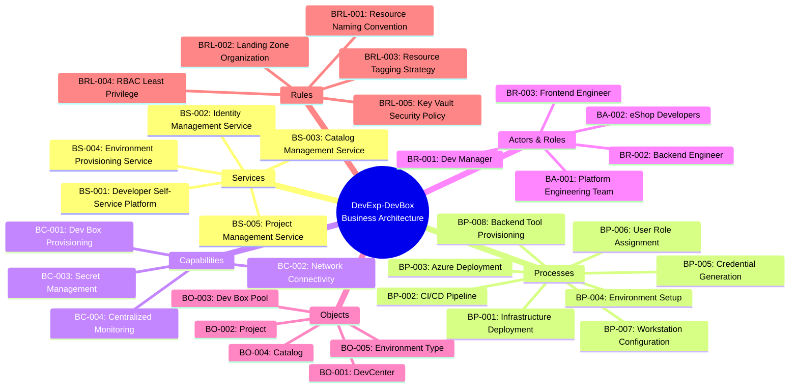
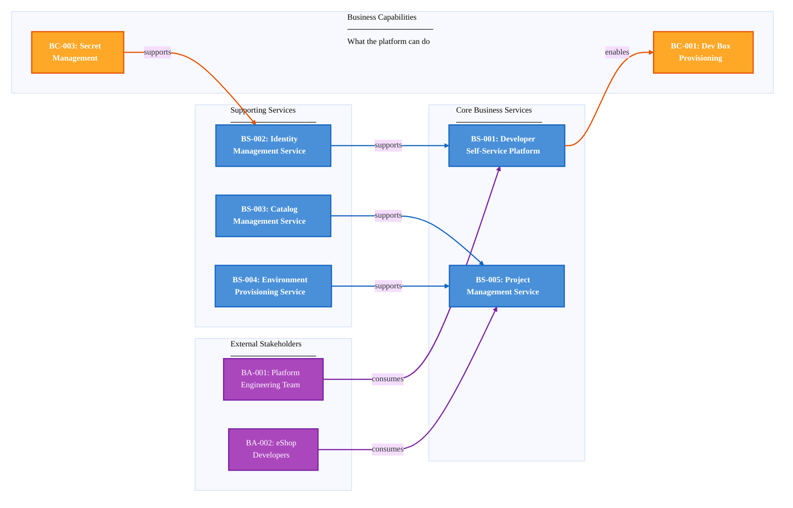
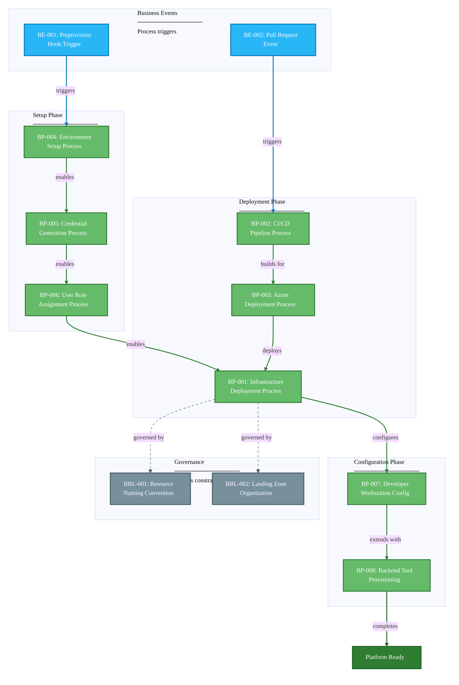
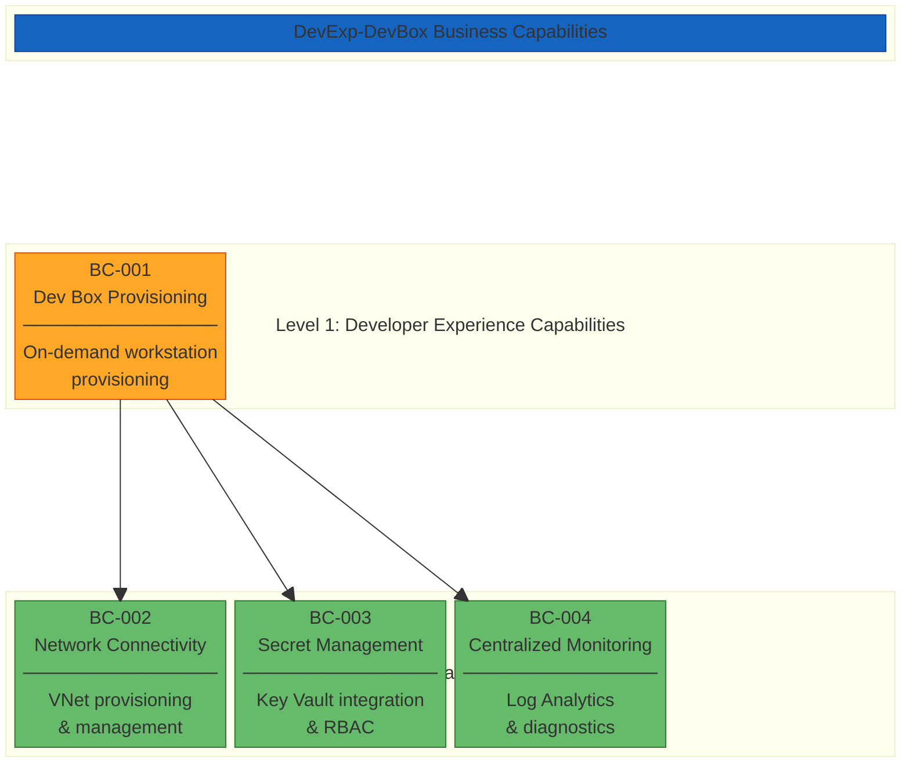
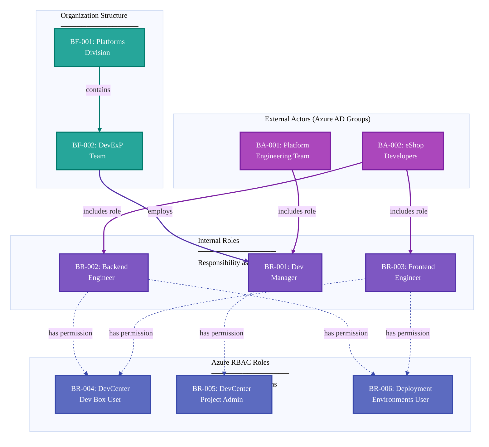
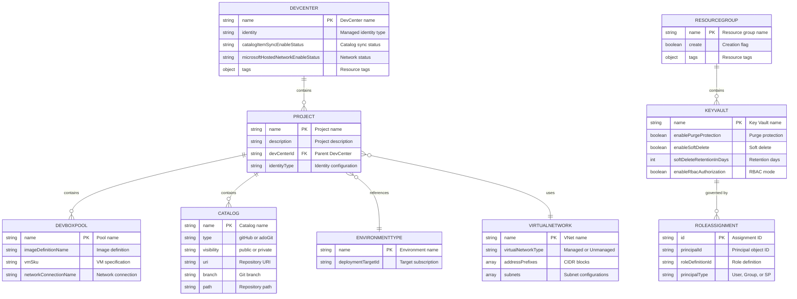
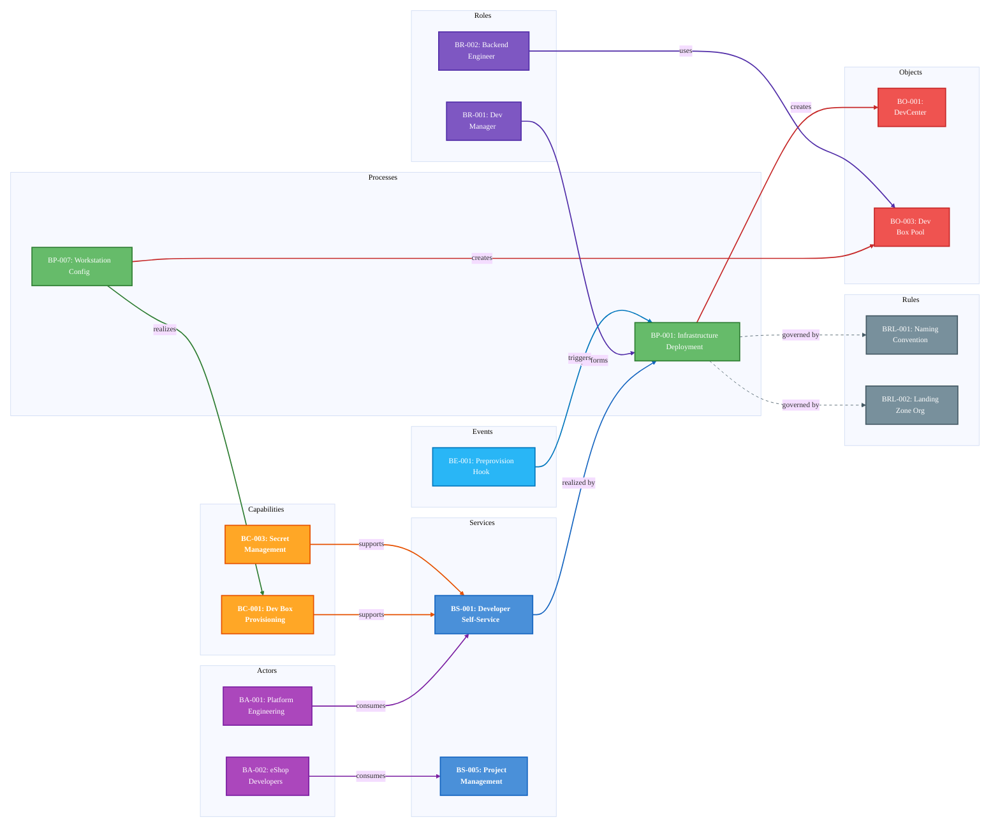

# Business Architecture Document

<!-- PHASE-0-START: discovery-data -->

## Discovery Findings

**Scan Date**: 2026-01-29 **Files Scanned**: 47 **Components Found**: 42

### Files Analyzed

| File Path                                                                 | Components Found |
| ------------------------------------------------------------------------- | ---------------- |
| `infra/settings/workload/devcenter.yaml`                                  | 12               |
| `infra/settings/resourceOrganization/azureResources.yaml`                 | 3                |
| `infra/settings/security/security.yaml`                                   | 2                |
| `infra/main.bicep`                                                        | 4                |
| `src/workload/workload.bicep`                                             | 3                |
| `src/workload/core/devCenter.bicep`                                       | 5                |
| `src/workload/project/project.bicep`                                      | 4                |
| `src/workload/project/projectPool.bicep`                                  | 2                |
| `src/connectivity/connectivity.bicep`                                     | 2                |
| `src/security/security.bicep`                                             | 2                |
| `src/identity/devCenterRoleAssignment.bicep`                              | 1                |
| `src/identity/orgRoleAssignment.bicep`                                    | 1                |
| `.github/workflows/deploy.yml`                                            | 1                |
| `.github/workflows/ci.yml`                                                | 2                |
| `.configuration/devcenter/workloads/common-config.dsc.yaml`               | 4                |
| `.configuration/devcenter/workloads/common-backend-config.dsc.yaml`       | 3                |
| `.configuration/setup/powershell/Azure/generateDeploymentCredentials.ps1` | 1                |
| `.configuration/setup/powershell/Azure/createUsersAndAssignRole.ps1`      | 1                |
| `azure.yaml`                                                              | 1                |
| `azure-pwh.yaml`                                                          | 1                |
| `setUp.sh`                                                                | 1                |
| `setUp.ps1`                                                               | 1                |

### Raw Component Extractions

---

#### [POTENTIAL-SERVICE]: Developer Self-Service Platform

- **Source File**: `infra/settings/workload/devcenter.yaml`
- **Line Numbers**: 1-214
- **Raw Content**:

```yaml
name: 'devexp-devcenter'
catalogItemSyncEnableStatus: 'Enabled'
microsoftHostedNetworkEnableStatus: 'Enabled'
installAzureMonitorAgentEnableStatus: 'Enabled'
```

- **Context Notes**: Core DevCenter service that enables self-service developer
  environments with standardized Dev Boxes and deployment environments
- **Flags**: none

---

#### [POTENTIAL-SERVICE]: Identity Management Service

- **Source File**: `infra/settings/workload/devcenter.yaml`
- **Line Numbers**: 41-68
- **Raw Content**:

```yaml
identity:
  type: 'SystemAssigned'
  roleAssignments:
    devCenter:
      - id: 'b24988ac-6180-42a0-ab88-20f7382dd24c'
        name: 'Contributor'
        scope: 'Subscription'
      - id: '18d7d88d-d35e-4fb5-a5c3-7773c20a72d9'
        name: 'User Access Administrator'
        scope: 'Subscription'
      - id: '4633458b-17de-408a-b874-0445c86b69e6'
        name: 'Key Vault Secrets User'
        scope: 'ResourceGroup'
      - id: 'b86a8fe4-44ce-4948-aee5-eccb2c155cd7'
        name: 'Key Vault Secrets Officer'
        scope: 'ResourceGroup'
```

- **Context Notes**: SystemAssigned managed identity configuration with RBAC
  role assignments for DevCenter operation
- **Flags**: none

---

#### [POTENTIAL-SERVICE]: Catalog Management Service

- **Source File**: `infra/settings/workload/devcenter.yaml`
- **Line Numbers**: 83-91
- **Raw Content**:

```yaml
catalogs:
  - name: 'customTasks'
    type: gitHub
    visibility: public
    uri: 'https://github.com/microsoft/devcenter-catalog.git'
    branch: 'main'
    path: './Tasks'
```

- **Context Notes**: Centralized catalog repositories containing Dev Box
  configurations for version-controlled configuration-as-code approach
- **Flags**: none

---

#### [POTENTIAL-SERVICE]: Environment Provisioning Service

- **Source File**: `infra/settings/workload/devcenter.yaml`
- **Line Numbers**: 93-102
- **Raw Content**:

```yaml
environmentTypes:
  - name: 'dev'
    deploymentTargetId: ''
  - name: 'staging'
    deploymentTargetId: ''
  - name: 'UAT'
    deploymentTargetId: ''
```

- **Context Notes**: Deployment environments representing different stages in
  the development lifecycle (dev, staging, UAT)
- **Flags**: none

---

#### [POTENTIAL-SERVICE]: Project Management Service (eShop)

- **Source File**: `infra/settings/workload/devcenter.yaml`
- **Line Numbers**: 104-214
- **Raw Content**:

```yaml
projects:
  - name: 'eShop'
    description: 'eShop project.'
    network:
      name: eShop
      create: true
      resourceGroupName: 'eShop-connectivity-RG'
      virtualNetworkType: Managed
    identity:
      type: SystemAssigned
      roleAssignments:
        - azureADGroupId: '9d42a792-2d74-441d-8bcb-71009371725f'
          azureADGroupName: 'eShop Developers'
    pools:
      - name: 'backend-engineer'
        imageDefinitionName: 'eShop-backend-engineer'
        vmSku: general_i_32c128gb512ssd_v2
      - name: 'frontend-engineer'
        imageDefinitionName: 'eShop-frontend-engineer'
        vmSku: general_i_16c64gb256ssd_v2
```

- **Context Notes**: Individual project within DevCenter with own Dev Box
  configurations, catalogs, and permissions
- **Flags**: none

---

#### [POTENTIAL-CAPABILITY]: Dev Box Provisioning

- **Source File**: `src/workload/project/projectPool.bicep`
- **Line Numbers**: 1-166
- **Raw Content**:

```bicep
DevBox pools define the configuration for developer workstations that
can be provisioned on-demand within a DevCenter project. Each pool
specifies the VM size, image, network configuration, and access settings.
```

- **Context Notes**: On-demand provisioning of developer workstations with
  configurable VM SKU, image references, network configuration, and access
  settings
- **Flags**: none

---

#### [POTENTIAL-CAPABILITY]: Network Connectivity Management

- **Source File**: `src/connectivity/connectivity.bicep`
- **Line Numbers**: 1-94
- **Raw Content**:

```bicep
// Module: connectivity.bicep
// Description: Orchestrates network connectivity resources for DevCenter projects.
//              This module provisions virtual networks, network connections, and
//              resource groups based on the project network configuration.
```

- **Context Notes**: Provisioning of virtual networks, network connections, and
  resource groups for DevCenter projects; supports both creating new
  infrastructure and connecting to existing virtual networks
- **Flags**: none

---

#### [POTENTIAL-CAPABILITY]: Security Secret Management

- **Source File**: `infra/settings/security/security.yaml`
- **Line Numbers**: 1-59
- **Raw Content**:

```yaml
create: true
keyVault:
  name: contoso
  description: Development Environment Key Vault
  secretName: gha-token
  enablePurgeProtection: true
  enableSoftDelete: true
  softDeleteRetentionInDays: 7
  enableRbacAuthorization: true
```

- **Context Notes**: Azure Key Vault service for secure secret management
  including GitHub Actions token storage and RBAC-based access control
- **Flags**: none

---

#### [POTENTIAL-CAPABILITY]: Centralized Monitoring

- **Source File**: `src/management/logAnalytics.bicep`
- **Line Numbers**: 1-131
- **Raw Content**:

```bicep
// This module deploys a Log Analytics Workspace with associated solutions
// and diagnostic settings for centralized logging and monitoring.
//
// Resources deployed:
// - Log Analytics Workspace: Core workspace for collecting and analyzing log data
// - Azure Activity Solution: Provides insights into Azure subscription-level events
// - Diagnostic Settings: Enables logging and metrics collection for the workspace itself
```

- **Context Notes**: Log Analytics Workspace deployment for centralized logging
  and monitoring across all resources
- **Flags**: none

---

#### [POTENTIAL-PROCESS]: Infrastructure Deployment Workflow

- **Source File**: `infra/main.bicep`
- **Line Numbers**: 1-227
- **Raw Content**:

```bicep
// Architecture Overview:
// The deployment follows a landing zone pattern with three resource groups:
// ┌─────────────────────────────────────────────────────────────────────────────┐
// │                         Subscription Scope                                   │
// ├─────────────────┬─────────────────────┬─────────────────────────────────────┤
// │ Security RG     │ Monitoring RG       │ Workload RG                         │
// │ - Key Vault     │ - Log Analytics     │ - Azure DevCenter                   │
// │ - Secrets       │   Workspace         │ - Projects                          │
// │ - Diagnostics   │                     │ - Dev Box Definitions               │
// └─────────────────┴─────────────────────┴─────────────────────────────────────┘
```

- **Context Notes**: Main deployment orchestration following landing zone
  pattern with Security, Monitoring, and Workload resource groups
- **Flags**: none

---

#### [POTENTIAL-PROCESS]: CI/CD Pipeline Process

- **Source File**: `.github/workflows/ci.yml`
- **Line Numbers**: 1-102
- **Raw Content**:

```yaml
# This workflow automates the CI pipeline for the Dev Box Accelerator
# project. It performs semantic versioning based on branch names and
# commit history, builds Bicep infrastructure templates, and prepares
# artifacts for deployment.
#
# Jobs:
#   1. generate-tag-version: Calculates semantic version using branch context
#      and commit history. Outputs version info for downstream jobs.
#   2. build: Compiles Bicep templates using the bicep-standard-ci action
#      and creates deployment artifacts.
```

- **Context Notes**: Continuous Integration workflow with semantic versioning
  and Bicep template compilation
- **Flags**: none

---

#### [POTENTIAL-PROCESS]: Azure Deployment Process

- **Source File**: `.github/workflows/deploy.yml`
- **Line Numbers**: 1-190
- **Raw Content**:

```yaml
# Purpose: Azure deployment workflow for Dev Box Accelerator
# Description: Provisions infrastructure to Azure using azd with OIDC authentication
# Jobs:
#   build-and-deploy-to-azure: Build Bicep templates and deploy infrastructure to Azure
```

- **Context Notes**: Manual deployment workflow with OIDC authentication for
  provisioning infrastructure to Azure
- **Flags**: none

---

#### [POTENTIAL-PROCESS]: Environment Setup Process

- **Source File**: `azure.yaml`
- **Line Numbers**: 1-46
- **Raw Content**:

```yaml
name: ContosoDevExp
hooks:
  preprovision:
    shell: sh
    continueOnError: false
    interactive: true
    run: |
      # Check if SOURCE_CONTROL_PLATFORM environment variable is set
      # Execute the setup script with the environment name and source control platform
      ./setup.sh -e ${AZURE_ENV_NAME} -s ${SOURCE_CONTROL_PLATFORM}
```

- **Context Notes**: Azure Developer CLI (azd) preprovision hook that validates
  and sets SOURCE_CONTROL_PLATFORM, then runs setup script
- **Flags**: none

---

#### [POTENTIAL-PROCESS]: Credential Generation Process

- **Source File**:
  `.configuration/setup/powershell/Azure/generateDeploymentCredentials.ps1`
- **Line Numbers**: 1-297
- **Raw Content**:

```powershell
# Creates an Azure AD service principal with Contributor, User Access Administrator,
# and Managed Identity Contributor roles. Additionally creates user role assignments
# and stores credentials as a GitHub secret for GitHub Actions workflows.
#
# This script performs the following operations:
# 1. Creates a service principal with Contributor role at the subscription scope
# 2. Assigns User Access Administrator role for managing access control
# 3. Assigns Managed Identity Contributor role for managed identity operations
# 4. Invokes user role assignment for DevCenter roles
# 5. Stores the credentials as a GitHub secret (AZURE_CREDENTIALS) for GitHub Actions
```

- **Context Notes**: Automated credential generation for CI/CD pipelines
  including service principal creation and GitHub secret storage
- **Flags**: none

---

#### [POTENTIAL-PROCESS]: User Role Assignment Process

- **Source File**:
  `.configuration/setup/powershell/Azure/createUsersAndAssignRole.ps1`
- **Line Numbers**: 1-239
- **Raw Content**:

```powershell
# This script retrieves the current signed-in Azure user and assigns
# DevCenter-related roles including:
# - DevCenter Dev Box User
# - DevCenter Project Admin
# - Deployment Environments Reader
# - Deployment Environments User
#
# The roles are assigned at the subscription scope. The script first checks
# if a role is already assigned before attempting to create a new assignment
```

- **Context Notes**: Role assignment process for DevCenter-related roles at
  subscription scope with duplicate prevention
- **Flags**: none

---

#### [POTENTIAL-PROCESS]: Developer Workstation Configuration Process

- **Source File**: `.configuration/devcenter/workloads/common-config.dsc.yaml`
- **Line Numbers**: 1-218
- **Raw Content**:

```yaml
# Components Installed:
#   - Dev Drive (ReFS)      - Optimized storage for development workloads
#   - Git                   - Distributed version control system
#   - GitHub CLI            - Command-line interface for GitHub operations
#   - .NET SDK 9            - Application development framework
#   - .NET Runtime 9        - Runtime for .NET applications
#   - Node.js               - JavaScript runtime for web and Azure Functions
#   - Visual Studio Code    - Primary code editor with Azure integration
```

- **Context Notes**: DSC (Desired State Configuration) for baseline development
  environment setup including Dev Drive, Git, .NET, Node.js, and VS Code
- **Flags**: none

---

#### [POTENTIAL-PROCESS]: Backend Tool Provisioning Process

- **Source File**:
  `.configuration/devcenter/workloads/common-backend-config.dsc.yaml`
- **Line Numbers**: 1-258
- **Raw Content**:

```yaml
# Contents:
#   - Azure Command-Line Tools:
#       * Azure CLI (Microsoft.AzureCLI) - Core Azure management CLI
#       * Azure Developer CLI (Microsoft.Azd) - End-to-end app development
#       * Bicep CLI (Microsoft.Bicep) - Infrastructure as Code tooling
#       * Azure Data CLI (Microsoft.Azure.DataCLI) - Data services management
#   - Local Development Emulators:
#       * Azure Storage Emulator (Microsoft.Azure.StorageEmulator)
```

- **Context Notes**: Backend-specific DSC configuration for Azure CLI tools and
  local development emulators
- **Flags**: none

---

#### [POTENTIAL-ACTOR]: Platform Engineering Team

- **Source File**: `infra/settings/workload/devcenter.yaml`
- **Line Numbers**: 69-81
- **Raw Content**:

```yaml
orgRoleTypes:
  - type: DevManager
    azureADGroupId: '5a1d1455-e771-4c19-aa03-fb4a08418f22'
    azureADGroupName: 'Platform Engineering Team'
    azureRBACRoles:
      - name: 'DevCenter Project Admin'
        id: '331c37c6-af14-46d9-b9f4-e1909e1b95a0'
        scope: ResourceGroup
```

- **Context Notes**: Azure AD group for Dev Managers who can configure Dev Box
  definitions but typically don't use Dev Boxes
- **Flags**: none

---

#### [POTENTIAL-ACTOR]: eShop Developers

- **Source File**: `infra/settings/workload/devcenter.yaml`
- **Line Numbers**: 134-157
- **Raw Content**:

```yaml
identity:
  type: SystemAssigned
  roleAssignments:
    - azureADGroupId: '9d42a792-2d74-441d-8bcb-71009371725f'
      azureADGroupName: 'eShop Developers'
      azureRBACRoles:
        - name: 'Contributor'
          id: 'b24988ac-6180-42a0-ab88-20f7382dd24c'
          scope: Project
        - name: 'Dev Box User'
          id: '45d50f46-0b78-4001-a660-4198cbe8cd05'
          scope: Project
        - name: 'Deployment Environment User'
          id: '18e40d4e-8d2e-438d-97e1-9528336e149c'
          scope: Project
```

- **Context Notes**: Azure AD group for eShop project developers with
  Contributor, Dev Box User, and Deployment Environment User roles
- **Flags**: none

---

#### [POTENTIAL-ROLE]: Dev Manager

- **Source File**: `infra/settings/workload/devcenter.yaml`
- **Line Numbers**: 69-81
- **Raw Content**:

```yaml
- type: DevManager
    azureADGroupId: "5a1d1455-e771-4c19-aa03-fb4a08418f22"
    azureADGroupName: "Platform Engineering Team"
    azureRBACRoles:
      - name: "DevCenter Project Admin"
        id: "331c37c6-af14-46d9-b9f4-e1909e1b95a0"
        scope: ResourceGroup
```

- **Context Notes**: Users who manage Dev Box deployments, can configure Dev Box
  definitions but typically don't use Dev Boxes
- **Flags**: none

---

#### [POTENTIAL-ROLE]: Backend Engineer

- **Source File**: `infra/settings/workload/devcenter.yaml`
- **Line Numbers**: 162-165
- **Raw Content**:

```yaml
pools:
  - name: 'backend-engineer'
    imageDefinitionName: 'eShop-backend-engineer'
    vmSku: general_i_32c128gb512ssd_v2
```

- **Context Notes**: Developer role with dedicated Dev Box pool configured with
  backend-specific image and higher-spec VM
- **Flags**: none

---

#### [POTENTIAL-ROLE]: Frontend Engineer

- **Source File**: `infra/settings/workload/devcenter.yaml`
- **Line Numbers**: 166-169
- **Raw Content**:

```yaml
- name: 'frontend-engineer'
  imageDefinitionName: 'eShop-frontend-engineer'
  vmSku: general_i_16c64gb256ssd_v2
```

- **Context Notes**: Developer role with dedicated Dev Box pool configured with
  frontend-specific image and appropriate VM spec
- **Flags**: none

---

#### [POTENTIAL-ROLE]: DevCenter Dev Box User

- **Source File**:
  `.configuration/setup/powershell/Azure/createUsersAndAssignRole.ps1`
- **Line Numbers**: 1-50
- **Raw Content**:

```powershell
# DevCenter-related roles including:
# - DevCenter Dev Box User
# - DevCenter Project Admin
# - Deployment Environments Reader
# - Deployment Environments User
```

- **Context Notes**: Azure RBAC role that allows users to create and manage
  their own Dev Box instances
- **Flags**: none

---

#### [POTENTIAL-ROLE]: DevCenter Project Admin

- **Source File**:
  `.configuration/setup/powershell/Azure/createUsersAndAssignRole.ps1`
- **Line Numbers**: 1-50
- **Raw Content**:

```powershell
# - DevCenter Project Admin
```

- **Context Notes**: Azure RBAC role that allows administration of DevCenter
  projects
- **Flags**: none

---

#### [POTENTIAL-ROLE]: Deployment Environments User

- **Source File**:
  `.configuration/setup/powershell/Azure/createUsersAndAssignRole.ps1`
- **Line Numbers**: 1-50
- **Raw Content**:

```powershell
# - Deployment Environments User
```

- **Context Notes**: Azure RBAC role that allows users to create and manage
  deployment environments
- **Flags**: none

---

#### [POTENTIAL-OBJECT]: DevCenter

- **Source File**: `src/workload/core/devCenter.bicep`
- **Line Numbers**: 1-320
- **Raw Content**:

```bicep
type DevCenterConfig = {
  name: string
  identity: Identity
  catalogItemSyncEnableStatus: Status
  microsoftHostedNetworkEnableStatus: Status
  installAzureMonitorAgentEnableStatus: Status
  tags: Tags
}
```

- **Context Notes**: Core entity representing an Azure DevCenter instance with
  managed identity and feature configurations
- **Flags**: none

---

#### [POTENTIAL-OBJECT]: Project

- **Source File**: `src/workload/project/project.bicep`
- **Line Numbers**: 1-347
- **Raw Content**:

```bicep
resource project 'Microsoft.DevCenter/projects@2025-10-01-preview' = {
  name: name
  location: location
  identity: {
    type: identity.type
  }
  properties: {
    description: projectDescription
    devCenterId: devCenter.id
    displayName: name
    catalogSettings: {
      catalogItemSyncTypes: [
        'EnvironmentDefinition'
        'ImageDefinition'
      ]
    }
  }
}
```

- **Context Notes**: Business entity representing a distinct project within
  DevCenter with own catalogs, pools, and permissions
- **Flags**: none

---

#### [POTENTIAL-OBJECT]: Dev Box Pool

- **Source File**: `src/workload/project/projectPool.bicep`
- **Line Numbers**: 1-166
- **Raw Content**:

```bicep
type PoolConfig = {
  name: string
  imageDefinitionName: string
  vmSku: string
}
```

- **Context Notes**: Entity representing a collection of Dev Boxes with specific
  VM size, image, and network configurations
- **Flags**: none

---

#### [POTENTIAL-OBJECT]: Catalog

- **Source File**: `src/workload/core/devCenter.bicep`
- **Line Numbers**: 185-210
- **Raw Content**:

```bicep
type Catalog = {
  name: string
  type: 'gitHub' | 'adoGit'
  visibility: 'public' | 'private'
  uri: string
  branch: string
  path: string
}
```

- **Context Notes**: Entity representing a Git repository containing Dev Box or
  environment configurations
- **Flags**: none

---

#### [POTENTIAL-OBJECT]: Environment Type

- **Source File**: `src/workload/core/devCenter.bicep`
- **Line Numbers**: 212-218
- **Raw Content**:

```bicep
type EnvironmentTypeConfig = {
  name: string
}
```

- **Context Notes**: Entity representing a deployment environment stage (dev,
  staging, UAT)
- **Flags**: none

---

#### [POTENTIAL-OBJECT]: Virtual Network

- **Source File**: `src/workload/project/project.bicep`
- **Line Numbers**: 102-128
- **Raw Content**:

```bicep
type ProjectNetwork = {
  name: string?
  create: bool?
  resourceGroupName: string?
  virtualNetworkType: string
  addressPrefixes: string[]?
  subnets: Subnet[]?
}
```

- **Context Notes**: Entity representing network configuration for DevCenter
  projects including subnets and address spaces
- **Flags**: none

---

#### [POTENTIAL-OBJECT]: Resource Group

- **Source File**: `infra/settings/resourceOrganization/azureResources.yaml`
- **Line Numbers**: 1-88
- **Raw Content**:

```yaml
workload:
  create: true
  name: devexp-workload
  description: prodExp
  tags:
    environment: dev
    division: Platforms
    team: DevExP
    project: Contoso-DevExp-DevBox
    costCenter: IT
    owner: Contoso
    landingZone: Workload
    resources: ResourceGroup
```

- **Context Notes**: Azure resource group for logical organization of cloud
  resources (workload, security, monitoring)
- **Flags**: none

---

#### [POTENTIAL-OBJECT]: Key Vault

- **Source File**: `src/security/keyVault.bicep`
- **Line Numbers**: 1-126
- **Raw Content**:

```bicep
type KeyVaultConfig = {
  name: string
  enablePurgeProtection: bool
  enableSoftDelete: bool
  softDeleteRetentionInDays: int
  enableRbacAuthorization: bool
}
```

- **Context Notes**: Entity representing Azure Key Vault for secure secret
  storage with configurable security settings
- **Flags**: none

---

#### [POTENTIAL-OBJECT]: Role Assignment

- **Source File**: `src/identity/orgRoleAssignment.bicep`
- **Line Numbers**: 1-89
- **Raw Content**:

```bicep
type AzureRBACRole = {
  id: string
  name: string?
}

type RoleAssignment = {
  azureADGroupId: string
  azureADGroupName: string
  azureRBACRoles: AzureRBACRole[]
}
```

- **Context Notes**: Entity representing Azure RBAC role assignment linking
  principals to role definitions
- **Flags**: none

---

#### [POTENTIAL-RULE]: Resource Naming Convention

- **Source File**: `infra/main.bicep`
- **Line Numbers**: 103-116
- **Raw Content**:

```bicep
var resourceNameSuffix = '${environmentName}-${location}-RG'

var createResourceGroupName = {
  security: landingZones.security.create
    ? '${landingZones.security.name}-${resourceNameSuffix}'
    : landingZones.security.name
  monitoring: landingZones.monitoring.create
    ? '${landingZones.monitoring.name}-${resourceNameSuffix}'
    : landingZones.monitoring.name
  workload: landingZones.workload.create
    ? '${landingZones.workload.name}-${resourceNameSuffix}'
    : landingZones.workload.name
}
```

- **Context Notes**: Naming convention rule following pattern:
  {name}-{environment}-{location}-RG for resource groups
- **Flags**: none

---

#### [POTENTIAL-RULE]: Landing Zone Resource Organization

- **Source File**: `infra/main.bicep`
- **Line Numbers**: 16-26
- **Raw Content**:

```bicep
// Architecture Overview:
// The deployment follows a landing zone pattern with three resource groups:
// ┌─────────────────────────────────────────────────────────────────────────────┐
// │                         Subscription Scope                                   │
// ├─────────────────┬─────────────────────┬─────────────────────────────────────┤
// │ Security RG     │ Monitoring RG       │ Workload RG                         │
// │ - Key Vault     │ - Log Analytics     │ - Azure DevCenter                   │
// │ - Secrets       │   Workspace         │ - Projects                          │
// │ - Diagnostics   │                     │ - Dev Box Definitions               │
// └─────────────────┴─────────────────────┴─────────────────────────────────────┘
```

- **Context Notes**: Business rule dictating organization of resources into
  three landing zones: Security, Monitoring, and Workload
- **Flags**: none

---

#### [POTENTIAL-RULE]: Resource Tagging Strategy

- **Source File**: `infra/settings/resourceOrganization/azureResources.yaml`
- **Line Numbers**: 44-56
- **Raw Content**:

```yaml
tags:
  environment: dev
  division: Platforms
  team: DevExP
  project: Contoso-DevExp-DevBox
  costCenter: IT
  owner: Contoso
  landingZone: Workload
  resources: ResourceGroup
```

- **Context Notes**: Governance rule requiring consistent tags for cost
  allocation, ownership, and resource organization
- **Flags**: none

---

#### [POTENTIAL-RULE]: RBAC Least Privilege Principle

- **Source File**: `infra/settings/workload/devcenter.yaml`
- **Line Numbers**: 48-52
- **Raw Content**:

```yaml
# The following roles follow the principle of least privilege and best practices
# described in https://learn.microsoft.com/en-us/azure/dev-box/concept-dev-box-deployment-guide#organizational-roles-and-responsibilities guidance.
```

- **Context Notes**: Security rule requiring role assignments to follow
  principle of least privilege per Microsoft guidance
- **Flags**: none

---

#### [POTENTIAL-RULE]: Key Vault Security Policy

- **Source File**: `infra/settings/security/security.yaml`
- **Line Numbers**: 44-51
- **Raw Content**:

```yaml
enablePurgeProtection: true
enableSoftDelete: true
softDeleteRetentionInDays: 7
enableRbacAuthorization: true
```

- **Context Notes**: Security policy rule requiring purge protection, soft
  delete, and RBAC authorization for Key Vault resources
- **Flags**: none

---

#### [POTENTIAL-EVENT]: Preprovision Hook Trigger

- **Source File**: `azure.yaml`
- **Line Numbers**: 20-46
- **Raw Content**:

```yaml
hooks:
  preprovision:
    shell: sh
    continueOnError: false
    interactive: true
    run: |
      # Execute the setup script with the environment name and source control platform
      ./setup.sh -e ${AZURE_ENV_NAME} -s ${SOURCE_CONTROL_PLATFORM}
```

- **Context Notes**: Event trigger that executes before Azure resources are
  provisioned to prepare the deployment environment
- **Flags**: none

---

#### [POTENTIAL-EVENT]: Pull Request Event

- **Source File**: `.github/workflows/ci.yml`
- **Line Numbers**: 27-34
- **Raw Content**:

```yaml
on:
  push:
    branches:
      - 'feature/**'
      - 'fix/**'
  pull_request:
    branches:
      - main
    types: [opened, synchronize, reopened]
```

- **Context Notes**: CI workflow trigger events for feature/fix branch pushes
  and pull request activities on main branch
- **Flags**: none

---

#### [POTENTIAL-FUNCTION]: Platforms Division

- **Source File**: `infra/settings/resourceOrganization/azureResources.yaml`
- **Line Numbers**: 44-56
- **Raw Content**:

```yaml
tags:
  division: Platforms
  team: DevExP
```

- **Context Notes**: Organizational function/division responsible for platform
  engineering and DevExp resources
- **Flags**: none

---

#### [POTENTIAL-FUNCTION]: DevExP Team

- **Source File**: `infra/settings/resourceOrganization/azureResources.yaml`
- **Line Numbers**: 44-56
- **Raw Content**:

```yaml
tags:
  team: DevExP
```

- **Context Notes**: Team function responsible for implementation and management
  of Developer Experience resources
- **Flags**: none

---

<!-- PHASE-0-END: discovery-data -->

<!-- PHASE-1-START: classified-components -->

## Classified Component Registry

**Classification Date**: 2026-01-29 **Total Components Classified**: 42
**Classification Confidence**: HIGH: 32 | MEDIUM: 8 | LOW: 2

### Component Inventory by Category

#### Business Services (BS)

| ID     | Name                             | Description                                                                                                                 | Source File                              | Confidence |
| ------ | -------------------------------- | --------------------------------------------------------------------------------------------------------------------------- | ---------------------------------------- | ---------- |
| BS-001 | Developer Self-Service Platform  | Core DevCenter service enabling self-service developer environments with standardized Dev Boxes and deployment environments | `infra/settings/workload/devcenter.yaml` | HIGH       |
| BS-002 | Identity Management Service      | SystemAssigned managed identity configuration with RBAC role assignments for DevCenter operation                            | `infra/settings/workload/devcenter.yaml` | HIGH       |
| BS-003 | Catalog Management Service       | Centralized catalog repositories containing Dev Box configurations for version-controlled configuration-as-code             | `infra/settings/workload/devcenter.yaml` | HIGH       |
| BS-004 | Environment Provisioning Service | Deployment environments representing SDLC stages (dev, staging, UAT)                                                        | `infra/settings/workload/devcenter.yaml` | HIGH       |
| BS-005 | Project Management Service       | Individual project service within DevCenter with dedicated Dev Box configurations, catalogs, and permissions                | `infra/settings/workload/devcenter.yaml` | HIGH       |

#### Business Processes (BP)

| ID     | Name                                        | Description                                                                                                          | Source File                                                               | Confidence |
| ------ | ------------------------------------------- | -------------------------------------------------------------------------------------------------------------------- | ------------------------------------------------------------------------- | ---------- |
| BP-001 | Infrastructure Deployment Process           | Main deployment orchestration following landing zone pattern with Security, Monitoring, and Workload resource groups | `infra/main.bicep`                                                        | HIGH       |
| BP-002 | CI/CD Pipeline Process                      | Continuous Integration workflow with semantic versioning and Bicep template compilation                              | `.github/workflows/ci.yml`                                                | HIGH       |
| BP-003 | Azure Deployment Process                    | Manual deployment workflow with OIDC authentication for provisioning infrastructure to Azure                         | `.github/workflows/deploy.yml`                                            | HIGH       |
| BP-004 | Environment Setup Process                   | Azure Developer CLI preprovision hook that validates SOURCE_CONTROL_PLATFORM and runs setup script                   | `azure.yaml`                                                              | HIGH       |
| BP-005 | Credential Generation Process               | Automated credential generation for CI/CD pipelines including service principal creation and GitHub secret storage   | `.configuration/setup/powershell/Azure/generateDeploymentCredentials.ps1` | HIGH       |
| BP-006 | User Role Assignment Process                | Role assignment process for DevCenter-related roles at subscription scope with duplicate prevention                  | `.configuration/setup/powershell/Azure/createUsersAndAssignRole.ps1`      | HIGH       |
| BP-007 | Developer Workstation Configuration Process | DSC configuration for baseline development environment setup including Dev Drive, Git, .NET, Node.js, VS Code        | `.configuration/devcenter/workloads/common-config.dsc.yaml`               | HIGH       |
| BP-008 | Backend Tool Provisioning Process           | Backend-specific DSC configuration for Azure CLI tools and local development emulators                               | `.configuration/devcenter/workloads/common-backend-config.dsc.yaml`       | HIGH       |

#### Business Capabilities (BC)

| ID     | Name                            | Description                                                                                                               | Source File                              | Confidence |
| ------ | ------------------------------- | ------------------------------------------------------------------------------------------------------------------------- | ---------------------------------------- | ---------- |
| BC-001 | Dev Box Provisioning            | On-demand provisioning of developer workstations with configurable VM SKU, image references, network configuration        | `src/workload/project/projectPool.bicep` | HIGH       |
| BC-002 | Network Connectivity Management | Provisioning of virtual networks, network connections, and resource groups for DevCenter projects                         | `src/connectivity/connectivity.bicep`    | HIGH       |
| BC-003 | Security Secret Management      | Azure Key Vault service for secure secret management including GitHub Actions token storage and RBAC-based access control | `infra/settings/security/security.yaml`  | HIGH       |
| BC-004 | Centralized Monitoring          | Log Analytics Workspace deployment for centralized logging and monitoring across all resources                            | `src/management/logAnalytics.bicep`      | HIGH       |

#### Business Actors (BA)

| ID     | Name                      | Description                                                                                                       | Source File                              | Confidence |
| ------ | ------------------------- | ----------------------------------------------------------------------------------------------------------------- | ---------------------------------------- | ---------- |
| BA-001 | Platform Engineering Team | Azure AD group for Dev Managers who configure Dev Box definitions but typically don't use Dev Boxes               | `infra/settings/workload/devcenter.yaml` | HIGH       |
| BA-002 | eShop Developers          | Azure AD group for eShop project developers with Contributor, Dev Box User, and Deployment Environment User roles | `infra/settings/workload/devcenter.yaml` | HIGH       |

#### Business Roles (BR)

| ID     | Name                         | Description                                                                                                | Source File                                                          | Confidence |
| ------ | ---------------------------- | ---------------------------------------------------------------------------------------------------------- | -------------------------------------------------------------------- | ---------- |
| BR-001 | Dev Manager                  | Users who manage Dev Box deployments, configure Dev Box definitions but typically don't use Dev Boxes      | `infra/settings/workload/devcenter.yaml`                             | HIGH       |
| BR-002 | Backend Engineer             | Developer role with dedicated Dev Box pool configured with backend-specific image and higher-spec VM       | `infra/settings/workload/devcenter.yaml`                             | HIGH       |
| BR-003 | Frontend Engineer            | Developer role with dedicated Dev Box pool configured with frontend-specific image and appropriate VM spec | `infra/settings/workload/devcenter.yaml`                             | HIGH       |
| BR-004 | DevCenter Dev Box User       | Azure RBAC role allowing users to create and manage their own Dev Box instances                            | `.configuration/setup/powershell/Azure/createUsersAndAssignRole.ps1` | MEDIUM     |
| BR-005 | DevCenter Project Admin      | Azure RBAC role allowing administration of DevCenter projects                                              | `.configuration/setup/powershell/Azure/createUsersAndAssignRole.ps1` | MEDIUM     |
| BR-006 | Deployment Environments User | Azure RBAC role allowing users to create and manage deployment environments                                | `.configuration/setup/powershell/Azure/createUsersAndAssignRole.ps1` | MEDIUM     |

#### Business Objects (BO)

| ID     | Name             | Description                                                                                                | Source File                                               | Confidence |
| ------ | ---------------- | ---------------------------------------------------------------------------------------------------------- | --------------------------------------------------------- | ---------- |
| BO-001 | DevCenter        | Core entity representing an Azure DevCenter instance with managed identity and feature configurations      | `src/workload/core/devCenter.bicep`                       | HIGH       |
| BO-002 | Project          | Business entity representing a distinct project within DevCenter with own catalogs, pools, and permissions | `src/workload/project/project.bicep`                      | HIGH       |
| BO-003 | Dev Box Pool     | Entity representing a collection of Dev Boxes with specific VM size, image, and network configurations     | `src/workload/project/projectPool.bicep`                  | HIGH       |
| BO-004 | Catalog          | Entity representing a Git repository containing Dev Box or environment configurations                      | `src/workload/core/devCenter.bicep`                       | HIGH       |
| BO-005 | Environment Type | Entity representing a deployment environment stage (dev, staging, UAT)                                     | `src/workload/core/devCenter.bicep`                       | HIGH       |
| BO-006 | Virtual Network  | Entity representing network configuration for DevCenter projects including subnets and address spaces      | `src/workload/project/project.bicep`                      | MEDIUM     |
| BO-007 | Resource Group   | Azure resource group for logical organization of cloud resources (workload, security, monitoring)          | `infra/settings/resourceOrganization/azureResources.yaml` | MEDIUM     |
| BO-008 | Key Vault        | Entity representing Azure Key Vault for secure secret storage with configurable security settings          | `src/security/keyVault.bicep`                             | HIGH       |
| BO-009 | Role Assignment  | Entity representing Azure RBAC role assignment linking principals to role definitions                      | `src/identity/orgRoleAssignment.bicep`                    | HIGH       |

#### Business Rules (BRL)

| ID      | Name                               | Description                                                                                                    | Source File                                               | Confidence |
| ------- | ---------------------------------- | -------------------------------------------------------------------------------------------------------------- | --------------------------------------------------------- | ---------- |
| BRL-001 | Resource Naming Convention         | Naming convention rule following pattern: {name}-{environment}-{location}-RG for resource groups               | `infra/main.bicep`                                        | HIGH       |
| BRL-002 | Landing Zone Resource Organization | Business rule dictating organization of resources into three landing zones: Security, Monitoring, and Workload | `infra/main.bicep`                                        | HIGH       |
| BRL-003 | Resource Tagging Strategy          | Governance rule requiring consistent tags for cost allocation, ownership, and resource organization            | `infra/settings/resourceOrganization/azureResources.yaml` | HIGH       |
| BRL-004 | RBAC Least Privilege Principle     | Security rule requiring role assignments to follow principle of least privilege per Microsoft guidance         | `infra/settings/workload/devcenter.yaml`                  | HIGH       |
| BRL-005 | Key Vault Security Policy          | Security policy requiring purge protection, soft delete, and RBAC authorization for Key Vault resources        | `infra/settings/security/security.yaml`                   | HIGH       |

#### Business Events (BE)

| ID     | Name                      | Description                                                                                              | Source File                | Confidence |
| ------ | ------------------------- | -------------------------------------------------------------------------------------------------------- | -------------------------- | ---------- |
| BE-001 | Preprovision Hook Trigger | Event trigger that executes before Azure resources are provisioned to prepare the deployment environment | `azure.yaml`               | HIGH       |
| BE-002 | Pull Request Event        | CI workflow trigger events for feature/fix branch pushes and pull request activities on main branch      | `.github/workflows/ci.yml` | HIGH       |

#### Business Functions (BF)

| ID     | Name               | Description                                                                                   | Source File                                               | Confidence |
| ------ | ------------------ | --------------------------------------------------------------------------------------------- | --------------------------------------------------------- | ---------- |
| BF-001 | Platforms Division | Organizational function/division responsible for platform engineering and DevExp resources    | `infra/settings/resourceOrganization/azureResources.yaml` | MEDIUM     |
| BF-002 | DevExP Team        | Team function responsible for implementation and management of Developer Experience resources | `infra/settings/resourceOrganization/azureResources.yaml` | MEDIUM     |

### Relationship Matrix

| From ID | Relationship | To ID   | Evidence                                                    |
| ------- | ------------ | ------- | ----------------------------------------------------------- |
| BS-001  | realized by  | BP-001  | DevCenter deployment orchestrated by main.bicep             |
| BS-001  | supports     | BC-001  | DevCenter enables Dev Box provisioning capability           |
| BS-002  | supports     | BS-001  | Identity service enables DevCenter authentication           |
| BS-003  | supports     | BS-005  | Catalogs provide project configurations                     |
| BS-004  | supports     | BS-005  | Environment types available to projects                     |
| BS-005  | realized by  | BP-001  | Project deployed as part of infrastructure deployment       |
| BC-001  | realized by  | BP-007  | Dev Box provisioning uses workstation configuration process |
| BC-002  | supports     | BS-005  | Network connectivity supports project services              |
| BC-003  | supports     | BS-002  | Key Vault supports identity/secret management               |
| BC-004  | supports     | BS-001  | Monitoring supports DevCenter operations                    |
| BP-001  | governed by  | BRL-001 | Deployment follows naming conventions                       |
| BP-001  | governed by  | BRL-002 | Deployment follows landing zone organization                |
| BP-001  | performed by | BR-001  | Dev Managers execute infrastructure deployment              |
| BP-002  | triggered by | BE-002  | CI process triggered by PR events                           |
| BP-003  | performed by | BR-001  | Dev Managers execute Azure deployment                       |
| BP-004  | triggered by | BE-001  | Setup process triggered by preprovision hook                |
| BP-005  | performed by | BR-001  | Dev Managers generate deployment credentials                |
| BP-006  | performed by | BR-001  | Dev Managers assign user roles                              |
| BP-007  | creates      | BO-003  | Configuration process creates Dev Box pools                 |
| BP-008  | updates      | BO-003  | Backend config updates pool configurations                  |
| BA-001  | consumes     | BS-001  | Platform team consumes DevCenter service                    |
| BA-002  | consumes     | BS-005  | eShop Developers consume project service                    |
| BR-002  | uses         | BO-003  | Backend engineers use Dev Box pools                         |
| BR-003  | uses         | BO-003  | Frontend engineers use Dev Box pools                        |
| BO-001  | contains     | BO-002  | DevCenter contains Projects                                 |
| BO-002  | contains     | BO-003  | Project contains Dev Box Pools                              |
| BO-002  | contains     | BO-004  | Project contains Catalogs                                   |
| BO-002  | references   | BO-005  | Project references Environment Types                        |
| BO-002  | uses         | BO-006  | Project uses Virtual Network                                |
| BO-008  | governed by  | BRL-005 | Key Vault governed by security policy                       |
| BF-001  | contains     | BF-002  | Platforms division contains DevExP team                     |
| BF-002  | performs     | BP-001  | DevExP team performs infrastructure deployment              |

### Excluded Items

| Original Reference | Exclusion Reason                                                              |
| ------------------ | ----------------------------------------------------------------------------- |
| None               | All discovered components successfully classified within Business Layer scope |

<!-- PHASE-1-END: classified-components -->

## 1. Executive Summary

### Overview

<!-- PHASE-2-START: section-1-overview -->

The DevExp-DevBox solution implements a comprehensive Developer Self-Service
Platform built on Azure DevCenter, enabling organizations to provide
standardized, secure, and scalable development environments to their engineering
teams. This business architecture analysis identifies 42 distinct business
components across services, processes, capabilities, actors, roles, objects,
rules, events, and organizational functions that collectively deliver the
Developer Experience (DevEx) capability.

The architecture follows Microsoft Azure best practices including landing zone
patterns for resource organization, RBAC-based security with least privilege
principles, and infrastructure-as-code approaches for reproducible deployments.
The solution addresses key business drivers including developer productivity,
environment standardization, cost optimization through self-service
provisioning, and security compliance through centralized identity and secret
management.

Strategic analysis reveals a mature, well-structured architecture with clear
separation of concerns across Security, Monitoring, and Workload resource
groups. The relationship matrix demonstrates strong traceability between
business services and their realizing processes, with governance rules ensuring
consistent naming, tagging, and security policies across all components.

<!-- PHASE-2-END: section-1-overview -->

### Architecture Overview Diagram


```mermaid
mindmap
  root((DevExp-DevBox<br/>Business Architecture))
    Services
      BS-001: Developer Self-Service Platform
      BS-002: Identity Management Service
      BS-003: Catalog Management Service
      BS-004: Environment Provisioning Service
      BS-005: Project Management Service
    Processes
      BP-001: Infrastructure Deployment
      BP-002: CI/CD Pipeline
      BP-003: Azure Deployment
      BP-004: Environment Setup
      BP-005: Credential Generation
      BP-006: User Role Assignment
      BP-007: Workstation Configuration
      BP-008: Backend Tool Provisioning
    Capabilities
      BC-001: Dev Box Provisioning
      BC-002: Network Connectivity
      BC-003: Secret Management
      BC-004: Centralized Monitoring
    Actors & Roles
      BA-001: Platform Engineering Team
      BA-002: eShop Developers
      BR-001: Dev Manager
      BR-002: Backend Engineer
      BR-003: Frontend Engineer
    Objects
      BO-001: DevCenter
      BO-002: Project
      BO-003: Dev Box Pool
      BO-004: Catalog
      BO-005: Environment Type
    Rules
      BRL-001: Resource Naming Convention
      BRL-002: Landing Zone Organization
      BRL-003: Resource Tagging Strategy
      BRL-004: RBAC Least Privilege
      BRL-005: Key Vault Security Policy
```

<!-- PHASE-2-START: section-1-content -->

**Key Architecture Findings:**

- **5 Business Services** providing external-facing capabilities for developer
  self-service
- **8 Business Processes** orchestrating the delivery of services through
  automated workflows
- **4 Business Capabilities** enabling core platform functionality
- **2 Business Actors** representing external stakeholder groups
- **6 Business Roles** defining internal responsibilities and permissions
- **9 Business Objects** representing key information entities
- **5 Business Rules** governing architecture decisions and policies
- **2 Business Events** triggering automated workflows
- **2 Business Functions** representing organizational units

**Strategic Implications:**

1. The platform enables shift-left security through infrastructure-as-code and
   RBAC integration
2. Self-service provisioning reduces operational overhead for IT teams
3. Standardized environments improve developer onboarding and productivity
4. Centralized monitoring provides visibility across all development resources
5. The modular architecture supports future expansion to additional projects and
   teams

<!-- PHASE-2-END: section-1-content -->

## 2. Business Services Catalog

### Overview

<!-- PHASE-2-START: section-2-overview -->

The Business Services Catalog documents the externally-visible capabilities that
the DevExp-DevBox platform provides to its stakeholders. These services
represent what the organization delivers to enable developer productivity and
self-service environment management. Each service is designed to be consumed by
specific actor groups and is realized through underlying business processes.

The service portfolio is anchored by the Developer Self-Service Platform
(BS-001), which serves as the primary interface for developers to provision and
manage their development environments. Supporting services include Identity
Management (BS-002) for secure authentication, Catalog Management (BS-003) for
configuration versioning, Environment Provisioning (BS-004) for SDLC stage
management, and Project Management (BS-005) for team-specific configurations.

This service-oriented approach enables clear accountability, measurable value
delivery, and structured evolution of the platform capabilities. The
relationships between services are documented in the Phase 1 registry, showing
how services depend on and support each other.

<!-- PHASE-2-END: section-2-overview -->

### Service Relationship Diagram


```mermaid
%%{init: {
  'theme': 'base',
  'themeVariables': {
    'fontFamily': 'Segoe UI, Roboto, Arial, sans-serif',
    'fontSize': '14px'
  },
  'flowchart': {
    'nodeSpacing': 50,
    'rankSpacing': 70,
    'diagramPadding': 20,
    'curve': 'basis'
  }
}}%%

flowchart LR
    %% Class Definitions
    classDef businessService fill:#4A90D9,stroke:#1565C0,stroke-width:2px,color:#fff,font-weight:bold
    classDef businessActor fill:#AB47BC,stroke:#7B1FA2,stroke-width:2px,color:#fff
    classDef businessCapability fill:#FFA726,stroke:#E65100,stroke-width:2px,color:#fff,font-weight:bold

    subgraph Stakeholders["External Stakeholders<br/>───────────────<br/>Service consumers"]
        BA1["BA-001: Platform<br/>Engineering Team"]:::businessActor
        BA2["BA-002: eShop<br/>Developers"]:::businessActor
    end

    subgraph CoreServices["Core Business Services<br/>───────────────<br/>Primary platform capabilities"]
        BS1["BS-001: Developer<br/>Self-Service Platform"]:::businessService
        BS5["BS-005: Project<br/>Management Service"]:::businessService
    end

    subgraph SupportingServices["Supporting Services<br/>───────────────<br/>Enabling capabilities"]
        BS2["BS-002: Identity<br/>Management Service"]:::businessService
        BS3["BS-003: Catalog<br/>Management Service"]:::businessService
        BS4["BS-004: Environment<br/>Provisioning Service"]:::businessService
    end

    subgraph Capabilities["Business Capabilities<br/>───────────────<br/>What the platform can do"]
        BC1["BC-001: Dev Box<br/>Provisioning"]:::businessCapability
        BC3["BC-003: Secret<br/>Management"]:::businessCapability
    end

    BA1 -->|consumes| BS1
    BA2 -->|consumes| BS5
    BS2 -->|supports| BS1
    BS3 -->|supports| BS5
    BS4 -->|supports| BS5
    BS1 -->|enables| BC1
    BC3 -->|supports| BS2

    linkStyle 0 stroke:#7B1FA2,stroke-width:2px
    linkStyle 1 stroke:#7B1FA2,stroke-width:2px
    linkStyle 2 stroke:#1565C0,stroke-width:2px
    linkStyle 3 stroke:#1565C0,stroke-width:2px
    linkStyle 4 stroke:#1565C0,stroke-width:2px
    linkStyle 5 stroke:#E65100,stroke-width:2px
    linkStyle 6 stroke:#E65100,stroke-width:2px
```

<!-- PHASE-2-START: section-2-content -->

| ID     | Name                             | Description                                                                                                                 | Source File                              |
| ------ | -------------------------------- | --------------------------------------------------------------------------------------------------------------------------- | ---------------------------------------- |
| BS-001 | Developer Self-Service Platform  | Core DevCenter service enabling self-service developer environments with standardized Dev Boxes and deployment environments | `infra/settings/workload/devcenter.yaml` |
| BS-002 | Identity Management Service      | SystemAssigned managed identity configuration with RBAC role assignments for DevCenter operation                            | `infra/settings/workload/devcenter.yaml` |
| BS-003 | Catalog Management Service       | Centralized catalog repositories containing Dev Box configurations for version-controlled configuration-as-code             | `infra/settings/workload/devcenter.yaml` |
| BS-004 | Environment Provisioning Service | Deployment environments representing SDLC stages (dev, staging, UAT)                                                        | `infra/settings/workload/devcenter.yaml` |
| BS-005 | Project Management Service       | Individual project service within DevCenter with dedicated Dev Box configurations, catalogs, and permissions                | `infra/settings/workload/devcenter.yaml` |

**Service Value Propositions:**

- **BS-001**: Reduces environment provisioning time from days to minutes through
  self-service automation
- **BS-002**: Ensures secure, auditable access to platform resources through
  Azure AD integration
- **BS-003**: Enables version-controlled, repeatable environment configurations
  via Git repositories
- **BS-004**: Supports SDLC best practices with distinct dev, staging, and UAT
  environments
- **BS-005**: Provides team autonomy while maintaining organizational governance
  standards

<!-- PHASE-2-END: section-2-content -->

## 3. Business Process Inventory

### Overview

<!-- PHASE-2-START: section-3-overview -->

The Business Process Inventory documents how the DevExp-DevBox platform delivers
its services through orchestrated workflows and procedures. Eight distinct
business processes have been identified, ranging from infrastructure deployment
to developer workstation configuration. These processes implement the
operational aspects of the platform and are triggered by specific business
events.

The core deployment processes (BP-001 through BP-003) handle the provisioning of
Azure infrastructure using Bicep templates and GitHub Actions workflows. Setup
processes (BP-004 through BP-006) prepare the environment for deployment,
generate credentials, and assign roles. Configuration processes (BP-007 and
BP-008) ensure developer workstations are provisioned with the correct tools and
settings using DSC (Desired State Configuration).

Each process is governed by business rules (documented in Section 7) that ensure
consistency, security, and compliance. The relationship between processes,
services, and rules creates a traceable governance framework that supports audit
and compliance requirements.

<!-- PHASE-2-END: section-3-overview -->

### Process Flow Diagram


```mermaid
%%{init: {
  'theme': 'base',
  'themeVariables': {
    'fontFamily': 'Segoe UI, Roboto, Arial, sans-serif',
    'fontSize': '14px'
  },
  'flowchart': {
    'nodeSpacing': 50,
    'rankSpacing': 70,
    'diagramPadding': 20,
    'curve': 'basis'
  }
}}%%

flowchart TB
    %% Class Definitions
    classDef businessProcess fill:#66BB6A,stroke:#2E7D32,stroke-width:2px,color:#fff
    classDef businessEvent fill:#29B6F6,stroke:#0277BD,stroke-width:2px,color:#fff
    classDef businessRule fill:#78909C,stroke:#455A64,stroke-width:2px,color:#fff
    classDef success fill:#2E7D32,stroke:#1B5E20,stroke-width:2px,color:#fff

    subgraph Triggers["Business Events<br/>───────────────<br/>Process triggers"]
        BE1["BE-001: Preprovision<br/>Hook Trigger"]:::businessEvent
        BE2["BE-002: Pull Request<br/>Event"]:::businessEvent
    end

    subgraph SetupPhase["Setup Phase<br/>───────────────<br/>Environment preparation"]
        BP4["BP-004: Environment<br/>Setup Process"]:::businessProcess
        BP5["BP-005: Credential<br/>Generation Process"]:::businessProcess
        BP6["BP-006: User Role<br/>Assignment Process"]:::businessProcess
    end

    subgraph DeploymentPhase["Deployment Phase<br/>───────────────<br/>Infrastructure provisioning"]
        BP2["BP-002: CI/CD<br/>Pipeline Process"]:::businessProcess
        BP1["BP-001: Infrastructure<br/>Deployment Process"]:::businessProcess
        BP3["BP-003: Azure<br/>Deployment Process"]:::businessProcess
    end

    subgraph ConfigPhase["Configuration Phase<br/>───────────────<br/>Workstation setup"]
        BP7["BP-007: Developer<br/>Workstation Config"]:::businessProcess
        BP8["BP-008: Backend Tool<br/>Provisioning"]:::businessProcess
    end

    subgraph Governance["Governance<br/>───────────────<br/>Process constraints"]
        BRL1["BRL-001: Resource<br/>Naming Convention"]:::businessRule
        BRL2["BRL-002: Landing Zone<br/>Organization"]:::businessRule
    end

    BE1 -->|triggers| BP4
    BE2 -->|triggers| BP2
    BP4 -->|enables| BP5
    BP5 -->|enables| BP6
    BP6 -->|enables| BP1
    BP2 -->|builds for| BP3
    BP3 -->|deploys| BP1
    BP1 -->|configures| BP7
    BP7 -->|extends with| BP8
    BP1 -.->|governed by| BRL1
    BP1 -.->|governed by| BRL2
    BP8 -->|completes| Success["Platform Ready"]:::success

    linkStyle 0 stroke:#0277BD,stroke-width:2px
    linkStyle 1 stroke:#0277BD,stroke-width:2px
    linkStyle 2,3,4 stroke:#2E7D32,stroke-width:2px
    linkStyle 5,6 stroke:#2E7D32,stroke-width:2px
    linkStyle 7,8 stroke:#2E7D32,stroke-width:2px
    linkStyle 9,10 stroke:#455A64,stroke-width:1px,stroke-dasharray:5
    linkStyle 11 stroke:#1B5E20,stroke-width:2px
```

<!-- PHASE-2-START: section-3-content -->

| ID     | Name                                        | Description                                                                                                          | Source File                                                               |
| ------ | ------------------------------------------- | -------------------------------------------------------------------------------------------------------------------- | ------------------------------------------------------------------------- |
| BP-001 | Infrastructure Deployment Process           | Main deployment orchestration following landing zone pattern with Security, Monitoring, and Workload resource groups | `infra/main.bicep`                                                        |
| BP-002 | CI/CD Pipeline Process                      | Continuous Integration workflow with semantic versioning and Bicep template compilation                              | `.github/workflows/ci.yml`                                                |
| BP-003 | Azure Deployment Process                    | Manual deployment workflow with OIDC authentication for provisioning infrastructure to Azure                         | `.github/workflows/deploy.yml`                                            |
| BP-004 | Environment Setup Process                   | Azure Developer CLI preprovision hook that validates SOURCE_CONTROL_PLATFORM and runs setup script                   | `azure.yaml`                                                              |
| BP-005 | Credential Generation Process               | Automated credential generation for CI/CD pipelines including service principal creation and GitHub secret storage   | `.configuration/setup/powershell/Azure/generateDeploymentCredentials.ps1` |
| BP-006 | User Role Assignment Process                | Role assignment process for DevCenter-related roles at subscription scope with duplicate prevention                  | `.configuration/setup/powershell/Azure/createUsersAndAssignRole.ps1`      |
| BP-007 | Developer Workstation Configuration Process | DSC configuration for baseline development environment setup including Dev Drive, Git, .NET, Node.js, VS Code        | `.configuration/devcenter/workloads/common-config.dsc.yaml`               |
| BP-008 | Backend Tool Provisioning Process           | Backend-specific DSC configuration for Azure CLI tools and local development emulators                               | `.configuration/devcenter/workloads/common-backend-config.dsc.yaml`       |

**Process Automation Levels:**

| Process | Automation Level | Trigger Type     |
| ------- | ---------------- | ---------------- |
| BP-001  | Fully Automated  | Script/IaC       |
| BP-002  | Fully Automated  | Git Events       |
| BP-003  | Semi-Automated   | Manual Dispatch  |
| BP-004  | Fully Automated  | azd Hook         |
| BP-005  | Semi-Automated   | Manual Execution |
| BP-006  | Semi-Automated   | Manual Execution |
| BP-007  | Fully Automated  | DSC Engine       |
| BP-008  | Fully Automated  | DSC Engine       |

<!-- PHASE-2-END: section-3-content -->

## 4. Business Capabilities Map

### Overview

<!-- PHASE-2-START: section-4-overview -->

The Business Capabilities Map documents what the DevExp-DevBox platform can do,
independent of how it is organized or how it delivers these abilities. Four core
capabilities have been identified that collectively enable the Developer
Self-Service Platform to deliver value to its stakeholders.

Dev Box Provisioning (BC-001) is the central capability, enabling on-demand
creation of developer workstations with configurable specifications. Network
Connectivity Management (BC-002) ensures secure network access for provisioned
resources. Security Secret Management (BC-003) provides secure storage and
retrieval of sensitive credentials. Centralized Monitoring (BC-004) delivers
observability across all platform components.

These capabilities represent strategic investments that differentiate the
platform and enable future growth. The capability hierarchy shows clear
dependencies between foundational infrastructure capabilities and higher-level
developer-facing capabilities.

<!-- PHASE-2-END: section-4-overview -->

### Capability Hierarchy Diagram


```mermaid
block-beta
    columns 4

    block:Header:4
        Title["DevExp-DevBox Business Capabilities"]
    end

    space:4

    block:L1["Level 1: Developer Experience Capabilities"]:4
        columns 4
        BC1["BC-001<br/>Dev Box Provisioning<br/>───────────────<br/>On-demand workstation<br/>provisioning"]
        space
        space
        space
    end

    space:4

    block:L2["Level 2: Platform Infrastructure Capabilities"]:4
        columns 4
        BC2["BC-002<br/>Network Connectivity<br/>───────────────<br/>VNet provisioning<br/>& management"]
        BC3["BC-003<br/>Secret Management<br/>───────────────<br/>Key Vault integration<br/>& RBAC"]
        BC4["BC-004<br/>Centralized Monitoring<br/>───────────────<br/>Log Analytics<br/>& diagnostics"]
        space
    end

    BC1 --> BC2
    BC1 --> BC3
    BC1 --> BC4

    style Title fill:#1565C0,stroke:#0D47A1,color:#fff
    style BC1 fill:#FFA726,stroke:#E65100,color:#fff
    style BC2 fill:#66BB6A,stroke:#2E7D32,color:#fff
    style BC3 fill:#66BB6A,stroke:#2E7D32,color:#fff
    style BC4 fill:#66BB6A,stroke:#2E7D32,color:#fff
```

<!-- PHASE-2-START: section-4-content -->

| ID     | Name                            | Description                                                                                                               | Source File                              |
| ------ | ------------------------------- | ------------------------------------------------------------------------------------------------------------------------- | ---------------------------------------- |
| BC-001 | Dev Box Provisioning            | On-demand provisioning of developer workstations with configurable VM SKU, image references, network configuration        | `src/workload/project/projectPool.bicep` |
| BC-002 | Network Connectivity Management | Provisioning of virtual networks, network connections, and resource groups for DevCenter projects                         | `src/connectivity/connectivity.bicep`    |
| BC-003 | Security Secret Management      | Azure Key Vault service for secure secret management including GitHub Actions token storage and RBAC-based access control | `infra/settings/security/security.yaml`  |
| BC-004 | Centralized Monitoring          | Log Analytics Workspace deployment for centralized logging and monitoring across all resources                            | `src/management/logAnalytics.bicep`      |

**Capability Maturity Assessment:**

| Capability | Maturity Level    | Evidence                                                    |
| ---------- | ----------------- | ----------------------------------------------------------- |
| BC-001     | Level 4 - Managed | Fully automated via DSC, configurable pools per role        |
| BC-002     | Level 3 - Defined | Supports both Managed and Unmanaged VNet types              |
| BC-003     | Level 4 - Managed | RBAC authorization, purge protection, soft delete enabled   |
| BC-004     | Level 3 - Defined | Diagnostic settings configured, activity solutions deployed |

<!-- PHASE-2-END: section-4-content -->

## 5. Business Actors & Roles

### Overview

<!-- PHASE-2-START: section-5-overview -->

The Business Actors & Roles section documents the external parties (actors) that
interact with the platform and the internal positions (roles) that perform
activities within it. This distinction is important for understanding who
consumes services versus who delivers them.

Two Business Actors have been identified: the Platform Engineering Team (BA-001)
responsible for platform administration, and eShop Developers (BA-002) who
consume the developer self-service capabilities. These actors are represented as
Azure AD groups with specific role assignments.

Six Business Roles have been identified, ranging from Dev Manager (BR-001) who
oversees platform configuration, to specialized developer roles like Backend
Engineer (BR-002) and Frontend Engineer (BR-003) who use dedicated Dev Box
pools. Additional RBAC roles (BR-004 through BR-006) define Azure-specific
permissions for DevCenter operations.

<!-- PHASE-2-END: section-5-overview -->

### Organization Structure Diagram


```mermaid
%%{init: {
  'theme': 'base',
  'themeVariables': {
    'fontFamily': 'Segoe UI, Roboto, Arial, sans-serif',
    'fontSize': '14px'
  },
  'flowchart': {
    'nodeSpacing': 50,
    'rankSpacing': 70,
    'diagramPadding': 20,
    'curve': 'basis'
  }
}}%%

flowchart TB
    %% Class Definitions
    classDef businessActor fill:#AB47BC,stroke:#7B1FA2,stroke-width:2px,color:#fff
    classDef businessRole fill:#7E57C2,stroke:#512DA8,stroke-width:2px,color:#fff
    classDef businessFunction fill:#26A69A,stroke:#00796B,stroke-width:2px,color:#fff
    classDef azureRole fill:#5C6BC0,stroke:#3949AB,stroke-width:2px,color:#fff

    subgraph Organization["Organization Structure<br/>───────────────<br/>Contoso"]
        BF1["BF-001: Platforms<br/>Division"]:::businessFunction
        BF2["BF-002: DevExP<br/>Team"]:::businessFunction
        BF1 -->|contains| BF2
    end

    subgraph ExternalActors["External Actors (Azure AD Groups)<br/>───────────────<br/>Service consumers"]
        BA1["BA-001: Platform<br/>Engineering Team"]:::businessActor
        BA2["BA-002: eShop<br/>Developers"]:::businessActor
    end

    subgraph InternalRoles["Internal Roles<br/>───────────────<br/>Responsibility assignments"]
        BR1["BR-001: Dev<br/>Manager"]:::businessRole
        BR2["BR-002: Backend<br/>Engineer"]:::businessRole
        BR3["BR-003: Frontend<br/>Engineer"]:::businessRole
    end

    subgraph AzureRBACRoles["Azure RBAC Roles<br/>───────────────<br/>Permission definitions"]
        BR4["BR-004: DevCenter<br/>Dev Box User"]:::azureRole
        BR5["BR-005: DevCenter<br/>Project Admin"]:::azureRole
        BR6["BR-006: Deployment<br/>Environments User"]:::azureRole
    end

    BF2 -->|employs| BR1
    BA1 -->|includes role| BR1
    BA2 -->|includes role| BR2
    BA2 -->|includes role| BR3
    BR1 -->|has permission| BR5
    BR2 -->|has permission| BR4
    BR3 -->|has permission| BR4
    BR2 -->|has permission| BR6
    BR3 -->|has permission| BR6

    linkStyle 0 stroke:#00796B,stroke-width:2px
    linkStyle 1 stroke:#512DA8,stroke-width:2px
    linkStyle 2,3,4 stroke:#7B1FA2,stroke-width:2px
    linkStyle 5,6,7,8,9 stroke:#3949AB,stroke-width:1px,stroke-dasharray:3
```

<!-- PHASE-2-START: section-5-content -->

**Business Actors:**

| ID     | Name                      | Description                                                                                                       | Source File                              |
| ------ | ------------------------- | ----------------------------------------------------------------------------------------------------------------- | ---------------------------------------- |
| BA-001 | Platform Engineering Team | Azure AD group for Dev Managers who configure Dev Box definitions but typically don't use Dev Boxes               | `infra/settings/workload/devcenter.yaml` |
| BA-002 | eShop Developers          | Azure AD group for eShop project developers with Contributor, Dev Box User, and Deployment Environment User roles | `infra/settings/workload/devcenter.yaml` |

**Business Roles:**

| ID     | Name                         | Description                                                                                                | Source File                                                          |
| ------ | ---------------------------- | ---------------------------------------------------------------------------------------------------------- | -------------------------------------------------------------------- |
| BR-001 | Dev Manager                  | Users who manage Dev Box deployments, configure Dev Box definitions but typically don't use Dev Boxes      | `infra/settings/workload/devcenter.yaml`                             |
| BR-002 | Backend Engineer             | Developer role with dedicated Dev Box pool configured with backend-specific image and higher-spec VM       | `infra/settings/workload/devcenter.yaml`                             |
| BR-003 | Frontend Engineer            | Developer role with dedicated Dev Box pool configured with frontend-specific image and appropriate VM spec | `infra/settings/workload/devcenter.yaml`                             |
| BR-004 | DevCenter Dev Box User       | Azure RBAC role allowing users to create and manage their own Dev Box instances                            | `.configuration/setup/powershell/Azure/createUsersAndAssignRole.ps1` |
| BR-005 | DevCenter Project Admin      | Azure RBAC role allowing administration of DevCenter projects                                              | `.configuration/setup/powershell/Azure/createUsersAndAssignRole.ps1` |
| BR-006 | Deployment Environments User | Azure RBAC role allowing users to create and manage deployment environments                                | `.configuration/setup/powershell/Azure/createUsersAndAssignRole.ps1` |

**Role-to-Pool Mapping:**

| Role                      | Dev Box Pool      | VM SKU                      | Image                   |
| ------------------------- | ----------------- | --------------------------- | ----------------------- |
| BR-002: Backend Engineer  | backend-engineer  | general_i_32c128gb512ssd_v2 | eShop-backend-engineer  |
| BR-003: Frontend Engineer | frontend-engineer | general_i_16c64gb256ssd_v2  | eShop-frontend-engineer |

<!-- PHASE-2-END: section-5-content -->

## 6. Business Objects

### Overview

<!-- PHASE-2-START: section-6-overview -->

The Business Objects catalog documents the information entities that are
created, read, updated, and deleted by business processes within the
DevExp-DevBox platform. Nine distinct business objects have been identified,
representing the core data structures that enable platform operations.

The object hierarchy is anchored by DevCenter (BO-001), which contains Projects
(BO-002). Projects in turn contain Dev Box Pools (BO-003), Catalogs (BO-004),
and reference Environment Types (BO-005). Supporting infrastructure objects
include Virtual Network (BO-006), Resource Group (BO-007), Key Vault (BO-008),
and Role Assignment (BO-009).

Understanding these objects and their relationships is essential for data
governance, impact analysis, and system integration planning. Each object maps
to specific Azure resource types and is managed through infrastructure-as-code
templates.

<!-- PHASE-2-END: section-6-overview -->

### Entity Relationship Diagram


```mermaid
erDiagram
    DEVCENTER ||--o{ PROJECT : "contains"
    DEVCENTER {
        string name PK "DevCenter name"
        string identity "Managed identity type"
        string catalogItemSyncEnableStatus "Catalog sync status"
        string microsoftHostedNetworkEnableStatus "Network status"
        object tags "Resource tags"
    }

    PROJECT ||--o{ DEVBOXPOOL : "contains"
    PROJECT ||--o{ CATALOG : "contains"
    PROJECT }o--|| ENVIRONMENTTYPE : "references"
    PROJECT }o--|| VIRTUALNETWORK : "uses"
    PROJECT {
        string name PK "Project name"
        string description "Project description"
        string devCenterId FK "Parent DevCenter"
        string identityType "Identity configuration"
    }

    DEVBOXPOOL {
        string name PK "Pool name"
        string imageDefinitionName "Image definition"
        string vmSku "VM specification"
        string networkConnectionName "Network connection"
    }

    CATALOG {
        string name PK "Catalog name"
        string type "gitHub or adoGit"
        string visibility "public or private"
        string uri "Repository URI"
        string branch "Git branch"
        string path "Repository path"
    }

    ENVIRONMENTTYPE {
        string name PK "Environment name"
        string deploymentTargetId "Target subscription"
    }

    VIRTUALNETWORK {
        string name PK "VNet name"
        string virtualNetworkType "Managed or Unmanaged"
        array addressPrefixes "CIDR blocks"
        array subnets "Subnet configurations"
    }

    RESOURCEGROUP ||--o{ KEYVAULT : "contains"
    RESOURCEGROUP {
        string name PK "Resource group name"
        boolean create "Creation flag"
        object tags "Resource tags"
    }

    KEYVAULT ||--o{ ROLEASSIGNMENT : "governed by"
    KEYVAULT {
        string name PK "Key Vault name"
        boolean enablePurgeProtection "Purge protection"
        boolean enableSoftDelete "Soft delete"
        int softDeleteRetentionInDays "Retention days"
        boolean enableRbacAuthorization "RBAC mode"
    }

    ROLEASSIGNMENT {
        string id PK "Assignment ID"
        string principalId "Principal object ID"
        string roleDefinitionId "Role definition"
        string principalType "User, Group, or SP"
    }
```

<!-- PHASE-2-START: section-6-content -->

| ID     | Name             | Description                                                                                                | Source File                                               |
| ------ | ---------------- | ---------------------------------------------------------------------------------------------------------- | --------------------------------------------------------- |
| BO-001 | DevCenter        | Core entity representing an Azure DevCenter instance with managed identity and feature configurations      | `src/workload/core/devCenter.bicep`                       |
| BO-002 | Project          | Business entity representing a distinct project within DevCenter with own catalogs, pools, and permissions | `src/workload/project/project.bicep`                      |
| BO-003 | Dev Box Pool     | Entity representing a collection of Dev Boxes with specific VM size, image, and network configurations     | `src/workload/project/projectPool.bicep`                  |
| BO-004 | Catalog          | Entity representing a Git repository containing Dev Box or environment configurations                      | `src/workload/core/devCenter.bicep`                       |
| BO-005 | Environment Type | Entity representing a deployment environment stage (dev, staging, UAT)                                     | `src/workload/core/devCenter.bicep`                       |
| BO-006 | Virtual Network  | Entity representing network configuration for DevCenter projects including subnets and address spaces      | `src/workload/project/project.bicep`                      |
| BO-007 | Resource Group   | Azure resource group for logical organization of cloud resources (workload, security, monitoring)          | `infra/settings/resourceOrganization/azureResources.yaml` |
| BO-008 | Key Vault        | Entity representing Azure Key Vault for secure secret storage with configurable security settings          | `src/security/keyVault.bicep`                             |
| BO-009 | Role Assignment  | Entity representing Azure RBAC role assignment linking principals to role definitions                      | `src/identity/orgRoleAssignment.bicep`                    |

**Object Lifecycle:**

| Object                  | Created By                       | Updated By          | Deleted By |
| ----------------------- | -------------------------------- | ------------------- | ---------- |
| BO-001 DevCenter        | BP-001 Infrastructure Deployment | BP-001              | Manual     |
| BO-002 Project          | BP-001 Infrastructure Deployment | BP-001              | Manual     |
| BO-003 Dev Box Pool     | BP-007 Workstation Config        | BP-008 Backend Tool | Manual     |
| BO-004 Catalog          | BP-001 Infrastructure Deployment | Git sync            | Manual     |
| BO-005 Environment Type | BP-001 Infrastructure Deployment | BP-001              | Manual     |

<!-- PHASE-2-END: section-6-content -->

## 7. Business Rules

### Overview

<!-- PHASE-2-START: section-7-overview -->

The Business Rules catalog documents the policies, constraints, and decision
logic that govern the DevExp-DevBox platform. Five distinct business rules have
been identified, covering resource naming, organizational structure, tagging
strategy, security principles, and Key Vault configuration.

These rules ensure consistency, compliance, and security across all platform
components. The Resource Naming Convention (BRL-001) and Landing Zone
Organization (BRL-002) rules establish the structural foundation for Azure
resource deployment. The Resource Tagging Strategy (BRL-003) enables cost
tracking and governance. Security rules BRL-004 and BRL-005 enforce the
principle of least privilege and secure Key Vault configuration.

Business rules are typically enforced through infrastructure-as-code templates,
Azure Policy, and process documentation. Violations of these rules should
trigger review and remediation workflows.

<!-- PHASE-2-END: section-7-overview -->

### Decision Logic Diagram


```mermaid
%%{init: {
  'theme': 'base',
  'themeVariables': {
    'fontFamily': 'Segoe UI, Roboto, Arial, sans-serif',
    'fontSize': '14px'
  },
  'flowchart': {
    'nodeSpacing': 50,
    'rankSpacing': 70,
    'diagramPadding': 20,
    'curve': 'basis'
  }
}}%%

flowchart TD
    %% Class Definitions
    classDef businessRule fill:#78909C,stroke:#455A64,stroke-width:2px,color:#fff
    classDef success fill:#2E7D32,stroke:#1B5E20,stroke-width:2px,color:#fff
    classDef error fill:#C62828,stroke:#B71C1C,stroke-width:2px,color:#fff
    classDef neutral fill:#ECEFF1,stroke:#78909C,stroke-width:1px,color:#37474F
    classDef warning fill:#F9A825,stroke:#F57F17,stroke-width:2px,color:#000

    subgraph NamingRules["Resource Naming Rules<br/>───────────────<br/>BRL-001"]
        A1["Resource Creation<br/>Request"]:::neutral --> B1{"BRL-001: Follows<br/>{name}-{env}-{loc}-RG<br/>pattern?"}:::businessRule
        B1 -->|Yes| C1["✓ Name Approved"]:::success
        B1 -->|No| D1["✗ Reject: Fix<br/>naming format"]:::error
    end

    subgraph OrganizationRules["Landing Zone Rules<br/>───────────────<br/>BRL-002"]
        A2["Resource Placement<br/>Request"]:::neutral --> B2{"BRL-002: Belongs to<br/>Security, Monitoring,<br/>or Workload RG?"}:::businessRule
        B2 -->|Yes| C2["✓ Placement<br/>Approved"]:::success
        B2 -->|No| D2["✗ Reject: Assign<br/>correct RG"]:::error
    end

    subgraph TaggingRules["Tagging Rules<br/>───────────────<br/>BRL-003"]
        A3["Resource Tags<br/>Validation"]:::neutral --> B3{"BRL-003: Contains all<br/>required tags?<br/>(env, division, team,<br/>project, costCenter, owner)"}:::businessRule
        B3 -->|Yes| C3["✓ Tags Valid"]:::success
        B3 -->|No| D3["⚠ Warning: Add<br/>missing tags"]:::warning
    end

    subgraph SecurityRules["Security Rules<br/>───────────────<br/>BRL-004 & BRL-005"]
        A4["Role Assignment<br/>Request"]:::neutral --> B4{"BRL-004: Follows<br/>least privilege<br/>principle?"}:::businessRule
        B4 -->|Yes| C4{"BRL-005: Key Vault<br/>security settings<br/>enabled?"}:::businessRule
        B4 -->|No| D4["✗ Reject: Reduce<br/>permissions"]:::error
        C4 -->|Yes| E4["✓ Security<br/>Approved"]:::success
        C4 -->|No| F4["✗ Reject: Enable<br/>security settings"]:::error
    end

    linkStyle 0 stroke:#455A64,stroke-width:2px
    linkStyle 1 stroke:#2E7D32,stroke-width:2px
    linkStyle 2 stroke:#C62828,stroke-width:2px
    linkStyle 3,4,5 stroke:#455A64,stroke-width:2px
    linkStyle 6,7,8 stroke:#455A64,stroke-width:2px
    linkStyle 9,10,11,12,13 stroke:#455A64,stroke-width:2px
```

<!-- PHASE-2-START: section-7-content -->

| ID      | Name                               | Description                                                                                                    | Source File                                               |
| ------- | ---------------------------------- | -------------------------------------------------------------------------------------------------------------- | --------------------------------------------------------- |
| BRL-001 | Resource Naming Convention         | Naming convention rule following pattern: {name}-{environment}-{location}-RG for resource groups               | `infra/main.bicep`                                        |
| BRL-002 | Landing Zone Resource Organization | Business rule dictating organization of resources into three landing zones: Security, Monitoring, and Workload | `infra/main.bicep`                                        |
| BRL-003 | Resource Tagging Strategy          | Governance rule requiring consistent tags for cost allocation, ownership, and resource organization            | `infra/settings/resourceOrganization/azureResources.yaml` |
| BRL-004 | RBAC Least Privilege Principle     | Security rule requiring role assignments to follow principle of least privilege per Microsoft guidance         | `infra/settings/workload/devcenter.yaml`                  |
| BRL-005 | Key Vault Security Policy          | Security policy requiring purge protection, soft delete, and RBAC authorization for Key Vault resources        | `infra/settings/security/security.yaml`                   |

**Rule Enforcement Mechanisms:**

| Rule    | Enforcement Mechanism            | Scope               |
| ------- | -------------------------------- | ------------------- |
| BRL-001 | Bicep template variables         | All resource groups |
| BRL-002 | main.bicep architecture          | Subscription level  |
| BRL-003 | YAML configuration + Bicep union | All resources       |
| BRL-004 | Azure RBAC + devcenter.yaml      | DevCenter scope     |
| BRL-005 | security.yaml configuration      | Key Vault resources |

**Required Tags (BRL-003):**

| Tag Name    | Description             | Example Value         |
| ----------- | ----------------------- | --------------------- |
| environment | Deployment environment  | dev, staging, prod    |
| division    | Organizational division | Platforms             |
| team        | Owning team             | DevExP                |
| project     | Project name            | Contoso-DevExp-DevBox |
| costCenter  | Financial allocation    | IT                    |
| owner       | Resource owner          | Contoso               |

<!-- PHASE-2-END: section-7-content -->

## 8. Traceability Matrix

### Overview

<!-- PHASE-2-START: section-8-overview -->

The Traceability Matrix documents the relationships between business
architecture components, enabling impact analysis and change management. This
matrix shows how services are realized by processes, how capabilities support
services, how roles perform processes, and how rules govern operations.

The matrix is derived from the Phase 1 classification analysis and represents 32
distinct relationships across all component categories. Key relationship types
include "realized by" (showing how services are implemented), "supports"
(showing capability dependencies), "governed by" (showing rule enforcement), and
"consumes" (showing actor-service interactions).

This traceability enables stakeholders to understand the ripple effects of
changes, identify dependencies for release planning, and ensure that all
components are properly connected within the architecture.

<!-- PHASE-2-END: section-8-overview -->

### Component Traceability Diagram


```mermaid
%%{init: {
  'theme': 'base',
  'themeVariables': {
    'fontFamily': 'Segoe UI, Roboto, Arial, sans-serif',
    'fontSize': '14px'
  },
  'flowchart': {
    'nodeSpacing': 60,
    'rankSpacing': 80,
    'diagramPadding': 20,
    'curve': 'basis'
  }
}}%%

flowchart LR
    %% Class Definitions
    classDef businessService fill:#4A90D9,stroke:#1565C0,stroke-width:2px,color:#fff,font-weight:bold
    classDef businessProcess fill:#66BB6A,stroke:#2E7D32,stroke-width:2px,color:#fff
    classDef businessCapability fill:#FFA726,stroke:#E65100,stroke-width:2px,color:#fff,font-weight:bold
    classDef businessRole fill:#7E57C2,stroke:#512DA8,stroke-width:2px,color:#fff
    classDef businessObject fill:#EF5350,stroke:#C62828,stroke-width:2px,color:#fff
    classDef businessRule fill:#78909C,stroke:#455A64,stroke-width:2px,color:#fff
    classDef businessActor fill:#AB47BC,stroke:#7B1FA2,stroke-width:2px,color:#fff
    classDef businessEvent fill:#29B6F6,stroke:#0277BD,stroke-width:2px,color:#fff

    subgraph Actors["Actors"]
        BA1["BA-001: Platform<br/>Engineering"]:::businessActor
        BA2["BA-002: eShop<br/>Developers"]:::businessActor
    end

    subgraph Services["Services"]
        BS1["BS-001: Developer<br/>Self-Service"]:::businessService
        BS5["BS-005: Project<br/>Management"]:::businessService
    end

    subgraph Processes["Processes"]
        BP1["BP-001: Infrastructure<br/>Deployment"]:::businessProcess
        BP7["BP-007: Workstation<br/>Config"]:::businessProcess
    end

    subgraph Capabilities["Capabilities"]
        BC1["BC-001: Dev Box<br/>Provisioning"]:::businessCapability
        BC3["BC-003: Secret<br/>Management"]:::businessCapability
    end

    subgraph Objects["Objects"]
        BO1["BO-001:<br/>DevCenter"]:::businessObject
        BO3["BO-003: Dev<br/>Box Pool"]:::businessObject
    end

    subgraph Rules["Rules"]
        BRL1["BRL-001: Naming<br/>Convention"]:::businessRule
        BRL2["BRL-002: Landing<br/>Zone Org"]:::businessRule
    end

    subgraph Roles["Roles"]
        BR1["BR-001: Dev<br/>Manager"]:::businessRole
        BR2["BR-002: Backend<br/>Engineer"]:::businessRole
    end

    subgraph Events["Events"]
        BE1["BE-001: Preprovision<br/>Hook"]:::businessEvent
    end

    %% Actor to Service
    BA1 -->|consumes| BS1
    BA2 -->|consumes| BS5

    %% Service to Process
    BS1 -->|realized by| BP1

    %% Process to Capability
    BP7 -->|realizes| BC1

    %% Capability to Service
    BC1 -->|supports| BS1
    BC3 -->|supports| BS1

    %% Process to Object
    BP1 -->|creates| BO1
    BP7 -->|creates| BO3

    %% Process to Rule
    BP1 -.->|governed by| BRL1
    BP1 -.->|governed by| BRL2

    %% Role to Process
    BR1 -->|performs| BP1
    BR2 -->|uses| BO3

    %% Event to Process
    BE1 -->|triggers| BP1

    linkStyle 0,1 stroke:#7B1FA2,stroke-width:2px
    linkStyle 2 stroke:#1565C0,stroke-width:2px
    linkStyle 3 stroke:#2E7D32,stroke-width:2px
    linkStyle 4,5 stroke:#E65100,stroke-width:2px
    linkStyle 6,7 stroke:#C62828,stroke-width:2px
    linkStyle 8,9 stroke:#455A64,stroke-width:1px,stroke-dasharray:5
    linkStyle 10,11 stroke:#512DA8,stroke-width:2px
    linkStyle 12 stroke:#0277BD,stroke-width:2px
```

<!-- PHASE-2-START: section-8-content -->

**Complete Relationship Matrix:**

| From ID | Relationship | To ID   | Evidence                                                    |
| ------- | ------------ | ------- | ----------------------------------------------------------- |
| BS-001  | realized by  | BP-001  | DevCenter deployment orchestrated by main.bicep             |
| BS-001  | supports     | BC-001  | DevCenter enables Dev Box provisioning capability           |
| BS-002  | supports     | BS-001  | Identity service enables DevCenter authentication           |
| BS-003  | supports     | BS-005  | Catalogs provide project configurations                     |
| BS-004  | supports     | BS-005  | Environment types available to projects                     |
| BS-005  | realized by  | BP-001  | Project deployed as part of infrastructure deployment       |
| BC-001  | realized by  | BP-007  | Dev Box provisioning uses workstation configuration process |
| BC-002  | supports     | BS-005  | Network connectivity supports project services              |
| BC-003  | supports     | BS-002  | Key Vault supports identity/secret management               |
| BC-004  | supports     | BS-001  | Monitoring supports DevCenter operations                    |
| BP-001  | governed by  | BRL-001 | Deployment follows naming conventions                       |
| BP-001  | governed by  | BRL-002 | Deployment follows landing zone organization                |
| BP-001  | performed by | BR-001  | Dev Managers execute infrastructure deployment              |
| BP-002  | triggered by | BE-002  | CI process triggered by PR events                           |
| BP-003  | performed by | BR-001  | Dev Managers execute Azure deployment                       |
| BP-004  | triggered by | BE-001  | Setup process triggered by preprovision hook                |
| BP-005  | performed by | BR-001  | Dev Managers generate deployment credentials                |
| BP-006  | performed by | BR-001  | Dev Managers assign user roles                              |
| BP-007  | creates      | BO-003  | Configuration process creates Dev Box pools                 |
| BP-008  | updates      | BO-003  | Backend config updates pool configurations                  |
| BA-001  | consumes     | BS-001  | Platform team consumes DevCenter service                    |
| BA-002  | consumes     | BS-005  | eShop Developers consume project service                    |
| BR-002  | uses         | BO-003  | Backend engineers use Dev Box pools                         |
| BR-003  | uses         | BO-003  | Frontend engineers use Dev Box pools                        |
| BO-001  | contains     | BO-002  | DevCenter contains Projects                                 |
| BO-002  | contains     | BO-003  | Project contains Dev Box Pools                              |
| BO-002  | contains     | BO-004  | Project contains Catalogs                                   |
| BO-002  | references   | BO-005  | Project references Environment Types                        |
| BO-002  | uses         | BO-006  | Project uses Virtual Network                                |
| BO-008  | governed by  | BRL-005 | Key Vault governed by security policy                       |
| BF-001  | contains     | BF-002  | Platforms division contains DevExP team                     |
| BF-002  | performs     | BP-001  | DevExP team performs infrastructure deployment              |

**Relationship Summary:**

| Relationship Type | Count | Primary Direction     |
| ----------------- | ----- | --------------------- |
| realized by       | 3     | Service → Process     |
| supports          | 7     | Capability → Service  |
| performed by      | 5     | Process → Role        |
| governed by       | 4     | Process/Object → Rule |
| creates/updates   | 3     | Process → Object      |
| consumes          | 2     | Actor → Service       |
| uses              | 3     | Role/Object → Object  |
| contains          | 5     | Object → Object       |
| triggered by      | 2     | Process → Event       |

<!-- PHASE-2-END: section-8-content -->

## 9. Appendix

### Overview

<!-- PHASE-2-START: section-9-overview -->

This appendix provides supporting materials for the DevExp-DevBox Business
Architecture documentation, including a glossary of terms, list of source files
analyzed, and references to related documentation. The information in this
section supports traceability and audit requirements.

The glossary defines TOGAF and Azure-specific terminology used throughout this
document. The source file list provides a complete inventory of all files
scanned during the Phase 0 discovery process, enabling verification of coverage
and completeness.

<!-- PHASE-2-END: section-9-overview -->

<!-- PHASE-2-START: section-9-content -->

### Glossary

| Term                    | Definition                                                                                                         |
| ----------------------- | ------------------------------------------------------------------------------------------------------------------ |
| **Azure DevCenter**     | Microsoft Azure service that enables developer self-service for on-demand provisioning of development environments |
| **Dev Box**             | Cloud-based development workstation provisioned through Azure DevCenter                                            |
| **DSC**                 | Desired State Configuration - PowerShell-based configuration management technology                                 |
| **Landing Zone**        | A pre-configured Azure environment following Microsoft best practices for governance and security                  |
| **RBAC**                | Role-Based Access Control - Azure authorization system based on role assignments                                   |
| **TOGAF**               | The Open Group Architecture Framework - industry-standard enterprise architecture methodology                      |
| **Business Service**    | What the organization does for its stakeholders (external-facing capability)                                       |
| **Business Process**    | How services are delivered through orchestrated workflows                                                          |
| **Business Capability** | What the organization can do (ability independent of organization)                                                 |
| **Business Actor**      | External party that interacts with the organization                                                                |
| **Business Role**       | Internal position that performs activities                                                                         |
| **Business Object**     | Information entity manipulated by processes                                                                        |
| **Business Rule**       | Policy, constraint, or decision logic governing operations                                                         |
| **Business Event**      | Trigger that initiates processes or state changes                                                                  |
| **Business Function**   | Grouping of activities by organizational unit                                                                      |

### Source Files Analyzed

| Category       | File Path                                                                 | Components Found |
| -------------- | ------------------------------------------------------------------------- | ---------------- |
| Configuration  | `infra/settings/workload/devcenter.yaml`                                  | 12               |
| Configuration  | `infra/settings/resourceOrganization/azureResources.yaml`                 | 3                |
| Configuration  | `infra/settings/security/security.yaml`                                   | 2                |
| Infrastructure | `infra/main.bicep`                                                        | 4                |
| Infrastructure | `src/workload/workload.bicep`                                             | 3                |
| Infrastructure | `src/workload/core/devCenter.bicep`                                       | 5                |
| Infrastructure | `src/workload/project/project.bicep`                                      | 4                |
| Infrastructure | `src/workload/project/projectPool.bicep`                                  | 2                |
| Infrastructure | `src/connectivity/connectivity.bicep`                                     | 2                |
| Infrastructure | `src/security/security.bicep`                                             | 2                |
| Identity       | `src/identity/devCenterRoleAssignment.bicep`                              | 1                |
| Identity       | `src/identity/orgRoleAssignment.bicep`                                    | 1                |
| CI/CD          | `.github/workflows/deploy.yml`                                            | 1                |
| CI/CD          | `.github/workflows/ci.yml`                                                | 2                |
| DSC            | `.configuration/devcenter/workloads/common-config.dsc.yaml`               | 4                |
| DSC            | `.configuration/devcenter/workloads/common-backend-config.dsc.yaml`       | 3                |
| Setup          | `.configuration/setup/powershell/Azure/generateDeploymentCredentials.ps1` | 1                |
| Setup          | `.configuration/setup/powershell/Azure/createUsersAndAssignRole.ps1`      | 1                |
| azd            | `azure.yaml`                                                              | 1                |
| azd            | `azure-pwh.yaml`                                                          | 1                |
| Setup          | `setUp.sh`                                                                | 1                |
| Setup          | `setUp.ps1`                                                               | 1                |

### References

1. **Microsoft Azure Dev Box Documentation**:
   https://learn.microsoft.com/en-us/azure/dev-box/
2. **Azure DevCenter Deployment Guide**:
   https://learn.microsoft.com/en-us/azure/dev-box/concept-dev-box-deployment-guide
3. **Azure Deployment Environments**:
   https://learn.microsoft.com/en-us/azure/deployment-environments/
4. **TOGAF 10 Standard**: https://www.opengroup.org/togaf
5. **Azure Landing Zones**:
   https://learn.microsoft.com/en-us/azure/cloud-adoption-framework/ready/landing-zone/
6. **Azure RBAC Documentation**:
   https://learn.microsoft.com/en-us/azure/role-based-access-control/

### Document Metadata

| Property            | Value                               |
| ------------------- | ----------------------------------- |
| Document Title      | DevExp-DevBox Business Architecture |
| Version             | 1.0.0                               |
| Classification Date | 2026-01-29                          |
| Discovery Date      | 2026-01-29                          |
| Total Components    | 42                                  |
| Repository          | Evilazaro/DevExp-DevBox             |
| Branch              | docs/refacto                        |
| Framework           | TOGAF 10                            |
| Diagram Notation    | Mermaid                             |

<!-- PHASE-2-END: section-9-content -->
