# Business Architecture Document

## DevExp-DevBox — Azure Developer Experience Platform

---

## Document Control

| Attribute          | Value                                                                     |
| ------------------ | ------------------------------------------------------------------------- |
| **Document Title** | Business Architecture — DevExp-DevBox Azure Developer Experience Platform |
| **Version**        | 1.0                                                                       |
| **Date**           | January 29, 2026                                                          |
| **Author**         | GitHub Copilot (AI-Generated)                                             |
| **Framework**      | TOGAF 10 — Business Architecture Domain                                   |
| **Status**         | Draft                                                                     |
| **Repository**     | Evilazaro/DevExp-DevBox                                                   |
| **Branch**         | docs/refacto                                                              |

---

## Executive Summary

The DevExp-DevBox project is an **Azure-based Developer Experience Platform**
that provides self-service infrastructure for provisioning cloud-based
development environments using **Azure DevCenter**, **Dev Box**, and **Azure
Deployment Environments**. The platform follows a **landing zone architecture
pattern** with three resource groups organizing security, monitoring, and
workload resources.

### Key Business Capabilities

- **Developer Self-Service Platform** enabling on-demand Dev Box provisioning
- **Infrastructure as Code (IaC)** using Bicep for declarative Azure deployments
- **Centralized Monitoring** through Log Analytics Workspace
- **Security Management** via Azure Key Vault with RBAC authorization
- **CI/CD Pipeline Automation** using GitHub Actions with OIDC authentication

### Target Audience

- **Platform Engineering Team**: Manages DevCenter configurations and Dev Box
  definitions
- **Development Teams** (e.g., eShop Developers): Consume Dev Boxes and
  Deployment Environments
- **DevOps Engineers**: Maintain CI/CD pipelines and infrastructure

### Business Value

The platform reduces developer onboarding time by providing pre-configured,
standardized development environments that can be provisioned on-demand. It
enforces consistent tooling across teams through Desired State Configuration
(DSC) and enables self-service capabilities while maintaining governance through
RBAC.

---

## Table of Contents

1. [Business Capability Model](#1-business-capability-model)
2. [Business Services Catalog](#2-business-services-catalog)
3. [Business Processes](#3-business-processes)
4. [Business Actors & Roles](#4-business-actors--roles)
5. [Business Events](#5-business-events)
6. [Business Rules](#6-business-rules)
7. [Domain Entities](#7-domain-entities)
8. [Value Streams](#8-value-streams)
9. [Organization Mapping](#9-organization-mapping)
10. [Architecture Overview](#10-architecture-overview)
11. [Integration Points](#11-integration-points)
12. [Governance & Compliance](#12-governance--compliance)

**Appendices**

- [Appendix A: Glossary of Business Terms](#appendix-a-glossary-of-business-terms)
- [Appendix B: TOGAF Compliance Matrix](#appendix-b-togaf-compliance-matrix)
- [Appendix C: Diagram Verification Report](#appendix-c-diagram-verification-report)
- [Appendix D: Enterprise Style Reference](#appendix-d-enterprise-style-reference)
- [Appendix E: Source File Index](#appendix-e-source-file-index)

---

## 1. Business Capability Model

### 1.1 Overview

The DevExp-DevBox platform provides ten core business capabilities organized
into four capability domains: **Platform Management**, **Security & Identity**,
**Operations & Monitoring**, and **Developer Experience**. These capabilities
enable self-service developer environments while maintaining enterprise
governance standards.

### 1.2 Capability Hierarchy

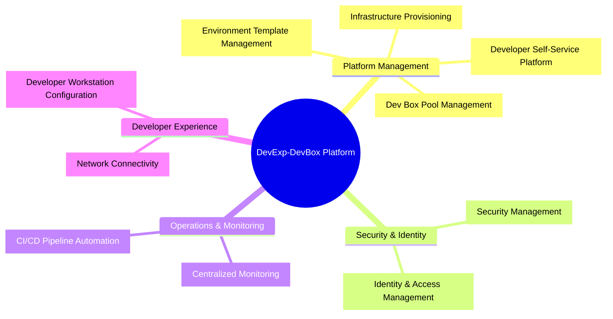
```mermaid
mindmap
  root((DevExp-DevBox Platform))
    Platform Management
      BC-001[Developer Self-Service Platform]
      BC-002[Infrastructure Provisioning]
      BC-005[Dev Box Pool Management]
      BC-006[Environment Template Management]
    Security & Identity
      BC-003[Security Management]
      BC-008[Identity & Access Management]
    Operations & Monitoring
      BC-004[Centralized Monitoring]
      BC-010[CI/CD Pipeline Automation]
    Developer Experience
      BC-007[Network Connectivity]
      BC-009[Developer Workstation Configuration]
```

### 1.3 Capability Inventory

| ID     | Capability Name                     | Description                                                                                                           | Source File                                                                                                                                     |
| ------ | ----------------------------------- | --------------------------------------------------------------------------------------------------------------------- | ----------------------------------------------------------------------------------------------------------------------------------------------- |
| BC-001 | Developer Self-Service Platform     | Orchestrates deployment of developer self-service infrastructure enabling cloud-based development environments        | [src/workload/workload.bicep](../../../src/workload/workload.bicep)                                                                             |
| BC-002 | Infrastructure Provisioning         | Provisions complete development environment with security, monitoring, and DevCenter workload resources               | [infra/main.bicep](../../../infra/main.bicep)                                                                                                   |
| BC-003 | Security Management                 | Manages Key Vault for secret management with diagnostic settings forwarding logs to Log Analytics                     | [infra/main.bicep](../../../infra/main.bicep)                                                                                                   |
| BC-004 | Centralized Monitoring              | Provides Log Analytics Workspace for centralized monitoring and log aggregation across all resources                  | [infra/main.bicep](../../../infra/main.bicep)                                                                                                   |
| BC-005 | Dev Box Pool Management             | Defines configuration for developer workstations that can be provisioned on-demand within DevCenter projects          | [src/workload/project/projectPool.bicep](../../../src/workload/project/projectPool.bicep)                                                       |
| BC-006 | Environment Template Management     | Manages catalogs for Dev Box image definitions and environment templates                                              | [infra/settings/workload/devcenter.yaml](../../../infra/settings/workload/devcenter.yaml)                                                       |
| BC-007 | Network Connectivity                | Orchestrates network connectivity resources for DevCenter projects including virtual networks and network connections | [src/connectivity/connectivity.bicep](../../../src/connectivity/connectivity.bicep)                                                             |
| BC-008 | Identity & Access Management        | Manages role-based access control (RBAC) assignments for DevCenter and projects                                       | [infra/settings/workload/devcenter.yaml](../../../infra/settings/workload/devcenter.yaml)                                                       |
| BC-009 | Developer Workstation Configuration | Defines common development tools and emulators required for Azure-based development via DSC                           | [.configuration/devcenter/workloads/common-backend-config.dsc.yaml](../../../.configuration/devcenter/workloads/common-backend-config.dsc.yaml) |
| BC-010 | CI/CD Pipeline Automation           | Automates CI pipeline for building, testing, and deploying infrastructure                                             | [.github/workflows/ci.yml](../../../.github/workflows/ci.yml)                                                                                   |

---

## 2. Business Services Catalog

### 2.1 Overview

The platform leverages ten Azure services to deliver its business capabilities.
These services are categorized as **External** (Azure platform services) that
are consumed by the platform to provide self-service developer environments. The
services are deployed through Infrastructure as Code using Bicep modules.

### 2.2 Service Architecture

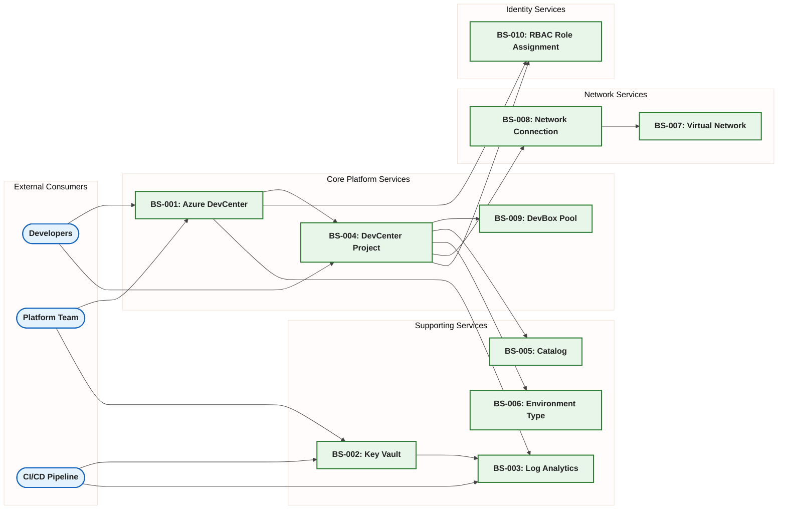
```mermaid
%%{init: {
  'theme': 'base',
  'themeVariables': {
    'primaryColor': '#E3F2FD',
    'primaryTextColor': '#212121',
    'primaryBorderColor': '#1565C0',
    'secondaryColor': '#E8F5E9',
    'secondaryTextColor': '#212121',
    'secondaryBorderColor': '#2E7D32',
    'lineColor': '#424242',
    'textColor': '#212121'
  }
}}%%

flowchart LR
    subgraph Consumers["External Consumers"]
        DEV([Developers]):::actor
        PLAT([Platform Team]):::actor
        CICD([CI/CD Pipeline]):::actor
    end

    subgraph CoreServices["Core Platform Services"]
        DC[BS-001: Azure DevCenter]:::service
        PROJ[BS-004: DevCenter Project]:::service
        POOL[BS-009: DevBox Pool]:::service
    end

    subgraph SupportServices["Supporting Services"]
        KV[BS-002: Key Vault]:::service
        LA[BS-003: Log Analytics]:::service
        CAT[BS-005: Catalog]:::service
        ENV[BS-006: Environment Type]:::service
    end

    subgraph NetworkServices["Network Services"]
        VNET[BS-007: Virtual Network]:::service
        NETC[BS-008: Network Connection]:::service
    end

    subgraph IdentityServices["Identity Services"]
        RBAC[BS-010: RBAC Role Assignment]:::service
    end

    DEV --> DC
    DEV --> PROJ
    PLAT --> DC
    PLAT --> KV
    CICD --> KV
    CICD --> LA

    DC --> PROJ
    PROJ --> POOL
    PROJ --> CAT
    PROJ --> ENV
    PROJ --> NETC
    NETC --> VNET
    DC --> RBAC
    PROJ --> RBAC
    DC --> LA
    KV --> LA

    classDef actor fill:#E3F2FD,stroke:#1565C0,stroke-width:2px,color:#212121,font-weight:bold
    classDef service fill:#E8F5E9,stroke:#2E7D32,stroke-width:2px,color:#212121,font-weight:bold
```

### 2.3 Service Inventory

| ID     | Service Name               | Type     | Description                                                                                  | Source File                                                                                       |
| ------ | -------------------------- | -------- | -------------------------------------------------------------------------------------------- | ------------------------------------------------------------------------------------------------- |
| BS-001 | Azure DevCenter            | External | Microsoft DevCenter instance with associated resources for managing developer environments   | [src/workload/core/devCenter.bicep](../../../src/workload/core/devCenter.bicep)                   |
| BS-002 | Azure Key Vault            | External | Azure Key Vault for secure secret management with soft delete, purge protection, and RBAC    | [src/security/keyVault.bicep](../../../src/security/keyVault.bicep)                               |
| BS-003 | Log Analytics Workspace    | External | Centralized logging and monitoring workspace with Azure Activity solution                    | [src/management/logAnalytics.bicep](../../../src/management/logAnalytics.bicep)                   |
| BS-004 | DevCenter Project          | External | DevCenter project infrastructure for Azure Dev Box and Azure Deployment Environments         | [src/workload/project/project.bicep](../../../src/workload/project/project.bicep)                 |
| BS-005 | DevCenter Catalog          | External | Catalog resource that syncs environment definitions from GitHub or Azure DevOps repositories | [src/workload/core/catalog.bicep](../../../src/workload/core/catalog.bicep)                       |
| BS-006 | DevCenter Environment Type | External | Environment type definitions (dev, staging, UAT) for project deployments                     | [src/workload/core/environmentType.bicep](../../../src/workload/core/environmentType.bicep)       |
| BS-007 | Virtual Network            | External | Azure Virtual Network for Dev Box connectivity with configurable address spaces and subnets  | [src/connectivity/vnet.bicep](../../../src/connectivity/vnet.bicep)                               |
| BS-008 | Network Connection         | External | Network connection enabling DevCenter to provision Dev Boxes with Azure AD Join              | [src/connectivity/networkConnection.bicep](../../../src/connectivity/networkConnection.bicep)     |
| BS-009 | DevBox Pool                | External | DevBox pool configuration defining VM sizes, images, and network settings                    | [src/workload/project/projectPool.bicep](../../../src/workload/project/projectPool.bicep)         |
| BS-010 | Azure RBAC Role Assignment | External | Role assignment service for subscription and resource group scope identity management        | [src/identity/devCenterRoleAssignment.bicep](../../../src/identity/devCenterRoleAssignment.bicep) |

---

## 3. Business Processes

### 3.1 Overview

The platform implements ten business processes spanning infrastructure
provisioning, environment management, and CI/CD automation. These processes are
triggered by various events including Azure Developer CLI hooks, GitHub Actions
triggers, and manual script execution.

### 3.2 Process Flow Diagram

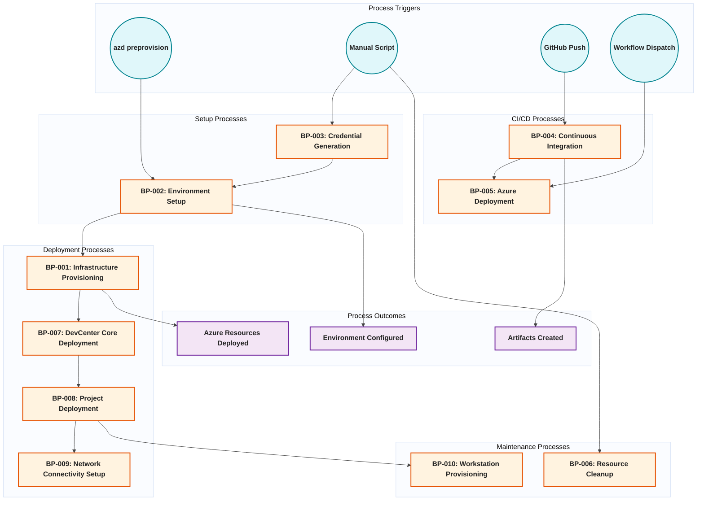
```mermaid
%%{init: {
  'theme': 'base',
  'themeVariables': {
    'primaryColor': '#FFF3E0',
    'primaryTextColor': '#212121',
    'primaryBorderColor': '#E65100',
    'lineColor': '#424242'
  }
}}%%

flowchart TD
    subgraph Triggers["Process Triggers"]
        T1((azd preprovision)):::event
        T2((Manual Script)):::event
        T3((GitHub Push)):::event
        T4((Workflow Dispatch)):::event
    end

    subgraph SetupProcesses["Setup Processes"]
        BP002[BP-002: Environment Setup]:::process
        BP003[BP-003: Credential Generation]:::process
    end

    subgraph DeploymentProcesses["Deployment Processes"]
        BP001[BP-001: Infrastructure Provisioning]:::process
        BP007[BP-007: DevCenter Core Deployment]:::process
        BP008[BP-008: Project Deployment]:::process
        BP009[BP-009: Network Connectivity Setup]:::process
    end

    subgraph CICDProcesses["CI/CD Processes"]
        BP004[BP-004: Continuous Integration]:::process
        BP005[BP-005: Azure Deployment]:::process
    end

    subgraph MaintenanceProcesses["Maintenance Processes"]
        BP006[BP-006: Resource Cleanup]:::process
        BP010[BP-010: Workstation Provisioning]:::process
    end

    subgraph Outcomes["Process Outcomes"]
        O1[Azure Resources Deployed]:::capability
        O2[Environment Configured]:::capability
        O3[Artifacts Created]:::capability
    end

    T1 --> BP002
    T2 --> BP003
    T2 --> BP006
    T3 --> BP004
    T4 --> BP005

    BP002 --> BP001
    BP003 --> BP002
    BP004 --> BP005
    BP001 --> BP007
    BP007 --> BP008
    BP008 --> BP009
    BP008 --> BP010

    BP001 --> O1
    BP002 --> O2
    BP004 --> O3

    classDef event fill:#E0F7FA,stroke:#00838F,stroke-width:2px,color:#212121,font-weight:bold
    classDef process fill:#FFF3E0,stroke:#E65100,stroke-width:2px,color:#212121,font-weight:bold
    classDef capability fill:#F3E5F5,stroke:#6A1B9A,stroke-width:2px,color:#212121,font-weight:bold
```

### 3.3 Process Sequence — Infrastructure Provisioning

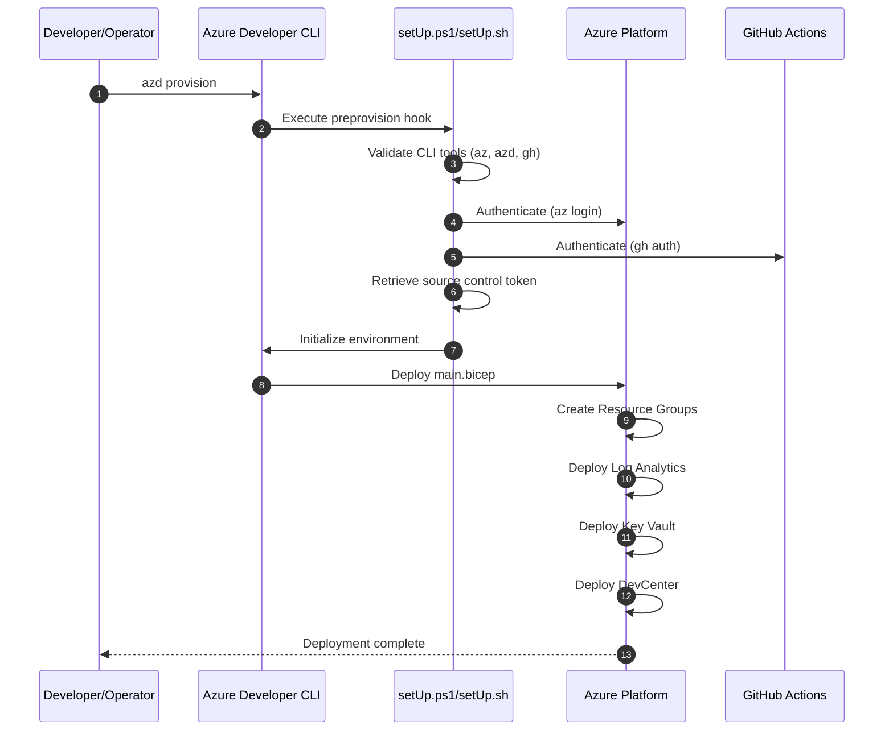
```mermaid
sequenceDiagram
    autonumber
    participant User as Developer/Operator
    participant AZD as Azure Developer CLI
    participant Setup as setUp.ps1/setUp.sh
    participant Azure as Azure Platform
    participant GH as GitHub Actions

    User->>AZD: azd provision
    AZD->>Setup: Execute preprovision hook
    Setup->>Setup: Validate CLI tools (az, azd, gh)
    Setup->>Azure: Authenticate (az login)
    Setup->>GH: Authenticate (gh auth)
    Setup->>Setup: Retrieve source control token
    Setup->>AZD: Initialize environment
    AZD->>Azure: Deploy main.bicep
    Azure->>Azure: Create Resource Groups
    Azure->>Azure: Deploy Log Analytics
    Azure->>Azure: Deploy Key Vault
    Azure->>Azure: Deploy DevCenter
    Azure-->>User: Deployment complete
```

### 3.4 Process Inventory

| ID     | Process Name                       | Trigger                                           | Outcome                                                                   | Source File                                                                                                                                                 |
| ------ | ---------------------------------- | ------------------------------------------------- | ------------------------------------------------------------------------- | ----------------------------------------------------------------------------------------------------------------------------------------------------------- |
| BP-001 | Infrastructure Provisioning        | Azure Developer CLI preprovision hook             | Complete development environment deployed to Azure                        | [azure.yaml](../../../azure.yaml), [infra/main.bicep](../../../infra/main.bicep)                                                                            |
| BP-002 | Environment Setup                  | Manual script execution or azd preprovision       | azd environment initialized with source control credentials               | [setUp.ps1](../../../setUp.ps1), [setUp.sh](../../../setUp.sh)                                                                                              |
| BP-003 | Deployment Credential Generation   | Manual script execution                           | Service principal with RBAC roles created, GitHub secret stored           | [.configuration/setup/powershell/Azure/generateDeploymentCredentials.ps1](../../../.configuration/setup/powershell/Azure/generateDeploymentCredentials.ps1) |
| BP-004 | Continuous Integration             | Push to feature/** or fix/** branches, PR to main | Bicep templates built, version generated, artifacts created               | [.github/workflows/ci.yml](../../../.github/workflows/ci.yml)                                                                                               |
| BP-005 | Azure Deployment                   | Manual workflow_dispatch trigger                  | Infrastructure provisioned to Azure using azd                             | [.github/workflows/deploy.yml](../../../.github/workflows/deploy.yml)                                                                                       |
| BP-006 | Resource Cleanup                   | Manual script execution                           | Users, credentials, GitHub secrets, resource groups deleted               | [cleanSetUp.ps1](../../../cleanSetUp.ps1)                                                                                                                   |
| BP-007 | DevCenter Core Deployment          | Workload module invocation                        | DevCenter with catalogs, environment types, and role assignments deployed | [src/workload/core/devCenter.bicep](../../../src/workload/core/devCenter.bicep)                                                                             |
| BP-008 | Project Deployment                 | Workload module loop                              | Project with pools, networks, catalogs, and environment types deployed    | [src/workload/project/project.bicep](../../../src/workload/project/project.bicep)                                                                           |
| BP-009 | Network Connectivity Setup         | Project deployment                                | Virtual network and network connection created and attached to DevCenter  | [src/connectivity/connectivity.bicep](../../../src/connectivity/connectivity.bicep)                                                                         |
| BP-010 | Developer Workstation Provisioning | DSC configuration application                     | Development tools installed via WinGet DSC                                | [.configuration/devcenter/workloads/common-config.dsc.yaml](../../../.configuration/devcenter/workloads/common-config.dsc.yaml)                             |

---

## 4. Business Actors & Roles

### 4.1 Overview

The platform defines ten actors and roles spanning Azure AD Groups, Azure RBAC
Roles, and Identity Types. These actors interact with the platform through
well-defined RBAC assignments that follow the principle of least privilege as
recommended in the Azure Dev Box deployment guide.

### 4.2 Actor Hierarchy

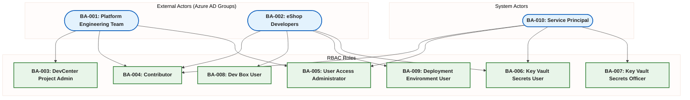
```mermaid
%%{init: {
  'theme': 'base',
  'themeVariables': {
    'primaryColor': '#E3F2FD',
    'primaryTextColor': '#212121',
    'primaryBorderColor': '#1565C0',
    'lineColor': '#424242'
  }
}}%%

flowchart TB
    subgraph ExternalActors["External Actors (Azure AD Groups)"]
        BA001([BA-001: Platform Engineering Team]):::actor
        BA002([BA-002: eShop Developers]):::actor
    end

    subgraph RBACRoles["RBAC Roles"]
        BA003[BA-003: DevCenter Project Admin]:::service
        BA004[BA-004: Contributor]:::service
        BA005[BA-005: User Access Administrator]:::service
        BA006[BA-006: Key Vault Secrets User]:::service
        BA007[BA-007: Key Vault Secrets Officer]:::service
        BA008[BA-008: Dev Box User]:::service
        BA009[BA-009: Deployment Environment User]:::service
    end

    subgraph SystemActors["System Actors"]
        BA010([BA-010: Service Principal]):::actor
    end

    BA001 --> BA003
    BA001 --> BA004
    BA001 --> BA005
    BA002 --> BA004
    BA002 --> BA008
    BA002 --> BA009
    BA002 --> BA006
    BA010 --> BA004
    BA010 --> BA005
    BA010 --> BA006
    BA010 --> BA007

    classDef actor fill:#E3F2FD,stroke:#1565C0,stroke-width:2px,color:#212121,font-weight:bold
    classDef service fill:#E8F5E9,stroke:#2E7D32,stroke-width:2px,color:#212121,font-weight:bold
```

### 4.3 Actor Inventory

| ID     | Actor/Role Name             | Type           | Responsibilities                                                         | Source File                                                                                                                                                 |
| ------ | --------------------------- | -------------- | ------------------------------------------------------------------------ | ----------------------------------------------------------------------------------------------------------------------------------------------------------- |
| BA-001 | Platform Engineering Team   | Azure AD Group | Manages Dev Box deployments and configures Dev Box definitions           | [infra/settings/workload/devcenter.yaml](../../../infra/settings/workload/devcenter.yaml)                                                                   |
| BA-002 | eShop Developers            | Azure AD Group | Consumes Dev Boxes and Deployment Environments with project-level access | [infra/settings/workload/devcenter.yaml](../../../infra/settings/workload/devcenter.yaml)                                                                   |
| BA-003 | DevCenter Project Admin     | RBAC Role      | Manages DevCenter project settings                                       | [infra/settings/workload/devcenter.yaml](../../../infra/settings/workload/devcenter.yaml)                                                                   |
| BA-004 | Contributor                 | RBAC Role      | Azure Contributor role for DevCenter and resource management             | [infra/settings/workload/devcenter.yaml](../../../infra/settings/workload/devcenter.yaml)                                                                   |
| BA-005 | User Access Administrator   | RBAC Role      | Manages access control and RBAC assignments                              | [infra/settings/workload/devcenter.yaml](../../../infra/settings/workload/devcenter.yaml)                                                                   |
| BA-006 | Key Vault Secrets User      | RBAC Role      | Read access to Key Vault secrets at ResourceGroup scope                  | [infra/settings/workload/devcenter.yaml](../../../infra/settings/workload/devcenter.yaml)                                                                   |
| BA-007 | Key Vault Secrets Officer   | RBAC Role      | Manage Key Vault secrets at ResourceGroup scope                          | [infra/settings/workload/devcenter.yaml](../../../infra/settings/workload/devcenter.yaml)                                                                   |
| BA-008 | Dev Box User                | RBAC Role      | Creates and manages Dev Boxes within projects                            | [infra/settings/workload/devcenter.yaml](../../../infra/settings/workload/devcenter.yaml)                                                                   |
| BA-009 | Deployment Environment User | RBAC Role      | Creates deployment environments                                          | [infra/settings/workload/devcenter.yaml](../../../infra/settings/workload/devcenter.yaml)                                                                   |
| BA-010 | Service Principal           | Identity Type  | Automated deployments with Contributor role at subscription scope        | [.configuration/setup/powershell/Azure/generateDeploymentCredentials.ps1](../../../.configuration/setup/powershell/Azure/generateDeploymentCredentials.ps1) |

---

## 5. Business Events

### 5.1 Overview

The platform responds to five key business events that trigger various
processes. These events originate from GitHub (repository pushes, pull
requests), Azure Developer CLI (lifecycle hooks), and manual operator actions.
Events follow an event-driven architecture pattern connecting producers to
consumers through GitHub Actions workflows.

### 5.2 Event Flow Diagram

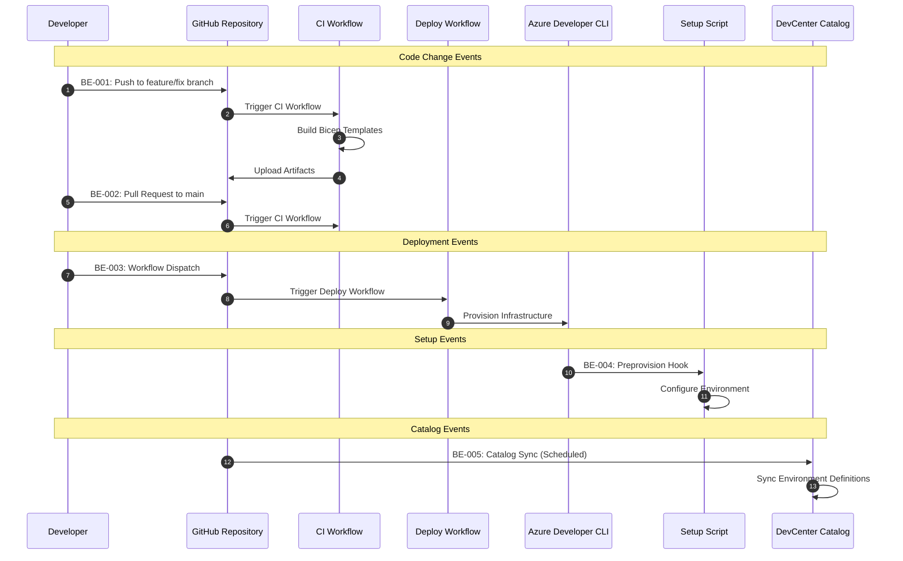
```mermaid
sequenceDiagram
    autonumber
    participant Dev as Developer
    participant GH as GitHub Repository
    participant CI as CI Workflow
    participant Deploy as Deploy Workflow
    participant AZD as Azure Developer CLI
    participant Setup as Setup Script
    participant DC as DevCenter Catalog

    Note over Dev,DC: Code Change Events
    Dev->>GH: BE-001: Push to feature/fix branch
    GH->>CI: Trigger CI Workflow
    CI->>CI: Build Bicep Templates
    CI->>GH: Upload Artifacts

    Dev->>GH: BE-002: Pull Request to main
    GH->>CI: Trigger CI Workflow

    Note over Dev,DC: Deployment Events
    Dev->>GH: BE-003: Workflow Dispatch
    GH->>Deploy: Trigger Deploy Workflow
    Deploy->>AZD: Provision Infrastructure

    Note over Dev,DC: Setup Events
    AZD->>Setup: BE-004: Preprovision Hook
    Setup->>Setup: Configure Environment

    Note over Dev,DC: Catalog Events
    GH->>DC: BE-005: Catalog Sync (Scheduled)
    DC->>DC: Sync Environment Definitions
```

### 5.3 Event Inventory

| ID     | Event Name                 | Producer                       | Consumer(s)       | Source File                                                                 |
| ------ | -------------------------- | ------------------------------ | ----------------- | --------------------------------------------------------------------------- |
| BE-001 | Push to feature/fix branch | GitHub Repository              | CI Workflow       | [.github/workflows/ci.yml](../../../.github/workflows/ci.yml)               |
| BE-002 | Pull Request to main       | GitHub Repository              | CI Workflow       | [.github/workflows/ci.yml](../../../.github/workflows/ci.yml)               |
| BE-003 | Workflow Dispatch          | GitHub Actions UI              | Deploy Workflow   | [.github/workflows/deploy.yml](../../../.github/workflows/deploy.yml)       |
| BE-004 | Preprovision Hook          | Azure Developer CLI            | Setup Script      | [azure.yaml](../../../azure.yaml)                                           |
| BE-005 | Catalog Sync               | GitHub/Azure DevOps Repository | DevCenter Catalog | [src/workload/core/catalog.bicep](../../../src/workload/core/catalog.bicep) |

---

## 6. Business Rules

### 6.1 Overview

The platform enforces ten business rules through parameter validation,
configuration constraints, and deployment policies. These rules ensure
consistent resource naming, security configurations, and operational governance.
Rules are enforced at various points including Bicep parameter validation, YAML
configuration, and workflow execution.

### 6.2 Rule Decision Diagram

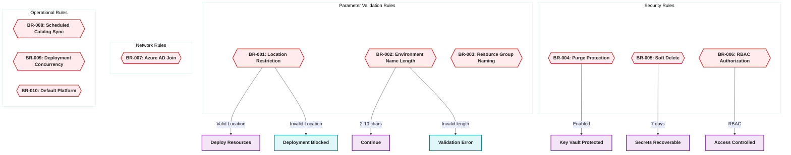
```mermaid
%%{init: {
  'theme': 'base',
  'themeVariables': {
    'primaryColor': '#FFEBEE',
    'primaryTextColor': '#212121',
    'primaryBorderColor': '#C62828',
    'lineColor': '#424242'
  }
}}%%

flowchart TD
    subgraph ParameterRules["Parameter Validation Rules"]
        BR001{{BR-001: Location Restriction}}:::rule
        BR002{{BR-002: Environment Name Length}}:::rule
        BR003{{BR-003: Resource Group Naming}}:::rule
    end

    subgraph SecurityRules["Security Rules"]
        BR004{{BR-004: Purge Protection}}:::rule
        BR005{{BR-005: Soft Delete}}:::rule
        BR006{{BR-006: RBAC Authorization}}:::rule
    end

    subgraph NetworkRules["Network Rules"]
        BR007{{BR-007: Azure AD Join}}:::rule
    end

    subgraph OperationalRules["Operational Rules"]
        BR008{{BR-008: Scheduled Catalog Sync}}:::rule
        BR009{{BR-009: Deployment Concurrency}}:::rule
        BR010{{BR-010: Default Platform}}:::rule
    end

    BR001 --> |Valid Location| PASS1[Deploy Resources]:::capability
    BR001 --> |Invalid Location| FAIL1[Deployment Blocked]:::event

    BR002 --> |2-10 chars| PASS2[Continue]:::capability
    BR002 --> |Invalid length| FAIL2[Validation Error]:::event

    BR004 --> |Enabled| SECURE[Key Vault Protected]:::capability
    BR005 --> |7 days| RECOVER[Secrets Recoverable]:::capability
    BR006 --> |RBAC| IAM[Access Controlled]:::capability

    classDef rule fill:#FFEBEE,stroke:#C62828,stroke-width:2px,color:#212121,font-weight:bold
    classDef capability fill:#F3E5F5,stroke:#6A1B9A,stroke-width:2px,color:#212121,font-weight:bold
    classDef event fill:#E0F7FA,stroke:#00838F,stroke-width:2px,color:#212121,font-weight:bold
```

### 6.3 Rule Inventory

| ID     | Rule Name                        | Enforcement Point                  | Enforcement Logic                                                    | Source File                                                                                   |
| ------ | -------------------------------- | ---------------------------------- | -------------------------------------------------------------------- | --------------------------------------------------------------------------------------------- |
| BR-001 | Location Restriction             | Parameter validation in main.bicep | @allowed annotation restricts to 16 approved Azure regions           | [infra/main.bicep](../../../infra/main.bicep)                                                 |
| BR-002 | Environment Name Length          | Parameter validation in main.bicep | @minLength(2) @maxLength(10) constraint on environmentName parameter | [infra/main.bicep](../../../infra/main.bicep)                                                 |
| BR-003 | Resource Group Naming Convention | Variable calculation in main.bicep | Pattern: "{name}-{environment}-{location}-RG"                        | [infra/main.bicep](../../../infra/main.bicep)                                                 |
| BR-004 | Key Vault Purge Protection       | Configuration in security.yaml     | enablePurgeProtection: true                                          | [infra/settings/security/security.yaml](../../../infra/settings/security/security.yaml)       |
| BR-005 | Key Vault Soft Delete            | Configuration in security.yaml     | enableSoftDelete: true, softDeleteRetentionInDays: 7                 | [infra/settings/security/security.yaml](../../../infra/settings/security/security.yaml)       |
| BR-006 | RBAC Authorization               | Configuration in security.yaml     | enableRbacAuthorization: true for Key Vault                          | [infra/settings/security/security.yaml](../../../infra/settings/security/security.yaml)       |
| BR-007 | Domain Join Type                 | Network connection properties      | domainJoinType: 'AzureADJoin'                                        | [src/connectivity/networkConnection.bicep](../../../src/connectivity/networkConnection.bicep) |
| BR-008 | Catalog Sync Type                | Catalog resource properties        | syncType: 'Scheduled'                                                | [src/workload/core/catalog.bicep](../../../src/workload/core/catalog.bicep)                   |
| BR-009 | Deployment Concurrency           | GitHub Actions workflow            | Concurrency group limits single deployment per environment           | [.github/workflows/deploy.yml](../../../.github/workflows/deploy.yml)                         |
| BR-010 | Source Control Platform Default  | Setup script logic                 | Default to 'github' if SOURCE_CONTROL_PLATFORM not set               | [azure.yaml](../../../azure.yaml)                                                             |

---

## 7. Domain Entities

### 7.1 Overview

The platform's domain model consists of ten core entities representing Azure
resources and their configurations. The central entity is **DevCenter**, which
owns multiple **Projects**, **Catalogs**, and **Environment Types**. Projects
contain **Pools** and **Networks** for Dev Box provisioning. Security is managed
through **KeyVault** entities, and resources are organized into
**ResourceGroups**.

### 7.2 Entity Relationship Diagram

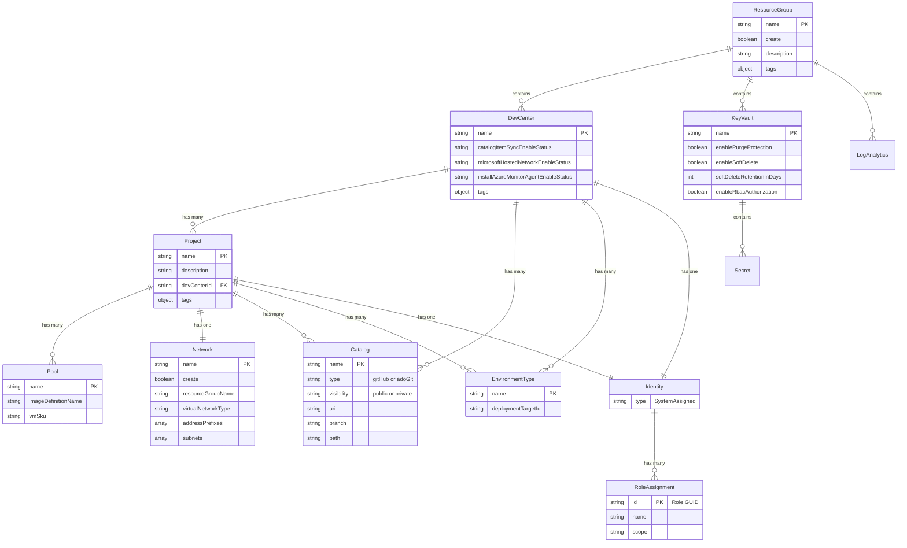
```mermaid
erDiagram
    DevCenter ||--o{ Project : "has many"
    DevCenter ||--o{ Catalog : "has many"
    DevCenter ||--o{ EnvironmentType : "has many"
    DevCenter ||--|| Identity : "has one"

    Project ||--o{ Pool : "has many"
    Project ||--|| Network : "has one"
    Project ||--o{ Catalog : "has many"
    Project ||--o{ EnvironmentType : "has many"
    Project ||--|| Identity : "has one"

    Identity ||--o{ RoleAssignment : "has many"

    KeyVault ||--o{ Secret : "contains"

    ResourceGroup ||--o{ DevCenter : "contains"
    ResourceGroup ||--o{ KeyVault : "contains"
    ResourceGroup ||--o{ LogAnalytics : "contains"

    DevCenter {
        string name PK
        string catalogItemSyncEnableStatus
        string microsoftHostedNetworkEnableStatus
        string installAzureMonitorAgentEnableStatus
        object tags
    }

    Project {
        string name PK
        string description
        string devCenterId FK
        object tags
    }

    Catalog {
        string name PK
        string type "gitHub or adoGit"
        string visibility "public or private"
        string uri
        string branch
        string path
    }

    EnvironmentType {
        string name PK
        string deploymentTargetId
    }

    Pool {
        string name PK
        string imageDefinitionName
        string vmSku
    }

    Network {
        string name PK
        boolean create
        string resourceGroupName
        string virtualNetworkType
        array addressPrefixes
        array subnets
    }

    Identity {
        string type "SystemAssigned"
    }

    RoleAssignment {
        string id PK "Role GUID"
        string name
        string scope
    }

    KeyVault {
        string name PK
        boolean enablePurgeProtection
        boolean enableSoftDelete
        int softDeleteRetentionInDays
        boolean enableRbacAuthorization
    }

    ResourceGroup {
        string name PK
        boolean create
        string description
        object tags
    }
```

### 7.3 Entity Inventory

| ID     | Entity Name     | Key Attributes                                                                                                                   | Relationships                                                      | Source File                                                                                                                 |
| ------ | --------------- | -------------------------------------------------------------------------------------------------------------------------------- | ------------------------------------------------------------------ | --------------------------------------------------------------------------------------------------------------------------- |
| BO-001 | DevCenter       | name, identity, catalogItemSyncEnableStatus, microsoftHostedNetworkEnableStatus, installAzureMonitorAgentEnableStatus, tags      | Has many: Catalogs, EnvironmentTypes, Projects                     | [infra/settings/workload/devcenter.yaml](../../../infra/settings/workload/devcenter.yaml)                                   |
| BO-002 | Project         | name, description, identity, network, pools, catalogs, environmentTypes, tags                                                    | Belongs to: DevCenter; Has many: Pools, Catalogs, EnvironmentTypes | [infra/settings/workload/devcenter.yaml](../../../infra/settings/workload/devcenter.yaml)                                   |
| BO-003 | Catalog         | name, type, visibility, uri, branch, path                                                                                        | Belongs to: DevCenter or Project                                   | [src/workload/core/catalog.bicep](../../../src/workload/core/catalog.bicep)                                                 |
| BO-004 | EnvironmentType | name, deploymentTargetId                                                                                                         | Belongs to: DevCenter or Project                                   | [src/workload/core/environmentType.bicep](../../../src/workload/core/environmentType.bicep)                                 |
| BO-005 | Pool            | name, imageDefinitionName, vmSku                                                                                                 | Belongs to: Project                                                | [infra/settings/workload/devcenter.yaml](../../../infra/settings/workload/devcenter.yaml)                                   |
| BO-006 | Network         | name, create, resourceGroupName, virtualNetworkType, addressPrefixes, subnets, tags                                              | Belongs to: Project                                                | [infra/settings/workload/devcenter.yaml](../../../infra/settings/workload/devcenter.yaml)                                   |
| BO-007 | KeyVault        | name, description, secretName, enablePurgeProtection, enableSoftDelete, softDeleteRetentionInDays, enableRbacAuthorization, tags | Contains: Secrets                                                  | [infra/settings/security/security.yaml](../../../infra/settings/security/security.yaml)                                     |
| BO-008 | ResourceGroup   | name, create, description, tags                                                                                                  | Contains: DevCenter, KeyVault, LogAnalytics                        | [infra/settings/resourceOrganization/azureResources.yaml](../../../infra/settings/resourceOrganization/azureResources.yaml) |
| BO-009 | Identity        | type, roleAssignments                                                                                                            | Belongs to: DevCenter, Project                                     | [infra/settings/workload/devcenter.yaml](../../../infra/settings/workload/devcenter.yaml)                                   |
| BO-010 | RoleAssignment  | id, name, scope                                                                                                                  | Belongs to: Identity                                               | [infra/settings/workload/devcenter.yaml](../../../infra/settings/workload/devcenter.yaml)                                   |

---

## 8. Value Streams

### 8.1 Overview

Three value streams have been identified in the platform, representing
end-to-end flows that deliver business value. The **Developer Onboarding** value
stream enables new team members to quickly get productive. The **Infrastructure
Deployment** value stream automates environment provisioning. The **Environment
Lifecycle** value stream manages application progression through SDLC stages.

### 8.2 Value Stream Diagram

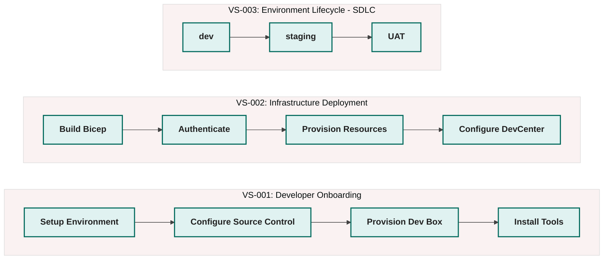
```mermaid
%%{init: {
  'theme': 'base',
  'themeVariables': {
    'primaryColor': '#E0F2F1',
    'primaryTextColor': '#212121',
    'primaryBorderColor': '#00695C',
    'lineColor': '#424242'
  }
}}%%

flowchart LR
    subgraph VS001["VS-001: Developer Onboarding"]
        direction LR
        S1_1[Setup Environment]:::valuestream
        S1_2[Configure Source Control]:::valuestream
        S1_3[Provision Dev Box]:::valuestream
        S1_4[Install Tools]:::valuestream
        S1_1 --> S1_2 --> S1_3 --> S1_4
    end

    subgraph VS002["VS-002: Infrastructure Deployment"]
        direction LR
        S2_1[Build Bicep]:::valuestream
        S2_2[Authenticate]:::valuestream
        S2_3[Provision Resources]:::valuestream
        S2_4[Configure DevCenter]:::valuestream
        S2_1 --> S2_2 --> S2_3 --> S2_4
    end

    subgraph VS003["VS-003: Environment Lifecycle - SDLC"]
        direction LR
        S3_1[dev]:::valuestream
        S3_2[staging]:::valuestream
        S3_3[UAT]:::valuestream
        S3_1 --> S3_2 --> S3_3
    end

    classDef valuestream fill:#E0F2F1,stroke:#00695C,stroke-width:2px,color:#212121,font-weight:bold
```

### 8.3 Value Stream Inventory

| ID     | Value Stream Name            | Stages                                                                           | Business Value                                                     | Source File                                                                                                                                                                                         |
| ------ | ---------------------------- | -------------------------------------------------------------------------------- | ------------------------------------------------------------------ | --------------------------------------------------------------------------------------------------------------------------------------------------------------------------------------------------- |
| VS-001 | Developer Onboarding         | Setup Environment → Configure Source Control → Provision Dev Box → Install Tools | Reduces developer onboarding time with pre-configured environments | [setUp.ps1](../../../setUp.ps1), [azure.yaml](../../../azure.yaml), [.configuration/devcenter/workloads/common-config.dsc.yaml](../../../.configuration/devcenter/workloads/common-config.dsc.yaml) |
| VS-002 | Infrastructure Deployment    | Build Bicep → Authenticate → Provision Resources → Configure DevCenter           | Automates consistent infrastructure deployment                     | [.github/workflows/ci.yml](../../../.github/workflows/ci.yml), [.github/workflows/deploy.yml](../../../.github/workflows/deploy.yml), [infra/main.bicep](../../../infra/main.bicep)                 |
| VS-003 | Environment Lifecycle (SDLC) | dev → staging → UAT                                                              | Provides structured progression for application deployments        | [infra/settings/workload/devcenter.yaml](../../../infra/settings/workload/devcenter.yaml)                                                                                                           |

---

## 9. Organization Mapping

### 9.1 Overview

Three organizational units have been identified from resource tagging evidence
in the codebase. The **DevExP Team** is responsible for implementing and
maintaining the platform. The **Platforms Division** provides oversight across
all capabilities. **Contoso** represents the resource owner for governance
purposes.

### 9.2 Organization-Capability Map

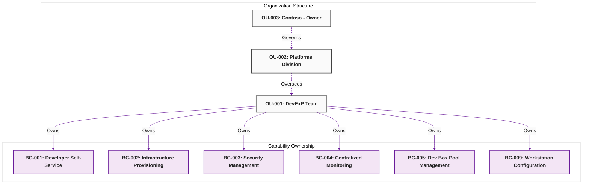
```mermaid
%%{init: {
  'theme': 'base',
  'themeVariables': {
    'primaryColor': '#FAFAFA',
    'primaryTextColor': '#212121',
    'primaryBorderColor': '#424242',
    'lineColor': '#6A1B9A'
  }
}}%%

flowchart TB
    subgraph OrgStructure["Organization Structure"]
        OU003[OU-003: Contoso - Owner]:::orgunit
        OU002[OU-002: Platforms Division]:::orgunit
        OU001[OU-001: DevExP Team]:::orgunit
    end

    subgraph Capabilities["Capability Ownership"]
        BC001[BC-001: Developer Self-Service]:::capability
        BC002[BC-002: Infrastructure Provisioning]:::capability
        BC003[BC-003: Security Management]:::capability
        BC004[BC-004: Centralized Monitoring]:::capability
        BC005[BC-005: Dev Box Pool Management]:::capability
        BC009[BC-009: Workstation Configuration]:::capability
    end

    OU003 -.->|"Governs"| OU002
    OU002 -.->|"Oversees"| OU001
    OU001 -->|"Owns"| BC001
    OU001 -->|"Owns"| BC002
    OU001 -->|"Owns"| BC003
    OU001 -->|"Owns"| BC004
    OU001 -->|"Owns"| BC005
    OU001 -->|"Owns"| BC009

    classDef orgunit fill:#FAFAFA,stroke:#424242,stroke-width:2px,color:#212121,font-weight:bold
    classDef capability fill:#F3E5F5,stroke:#6A1B9A,stroke-width:2px,color:#212121,font-weight:bold

    linkStyle 0,1 stroke:#6A1B9A,stroke-width:2px,stroke-dasharray:3 3
```

### 9.3 Organization Inventory

| ID     | Org Unit Name      | Owned Capabilities                             | Evidence                  | Source File                                                                                                                 |
| ------ | ------------------ | ---------------------------------------------- | ------------------------- | --------------------------------------------------------------------------------------------------------------------------- |
| OU-001 | DevExP Team        | BC-001, BC-002, BC-003, BC-004, BC-005, BC-009 | "team: DevExP" tag        | [infra/settings/resourceOrganization/azureResources.yaml](../../../infra/settings/resourceOrganization/azureResources.yaml) |
| OU-002 | Platforms Division | All Capabilities (Oversight)                   | "division: Platforms" tag | [infra/settings/resourceOrganization/azureResources.yaml](../../../infra/settings/resourceOrganization/azureResources.yaml) |
| OU-003 | Contoso (Owner)    | Resource Governance                            | "owner: Contoso" tag      | All configuration files                                                                                                     |

---

## 10. Architecture Overview

### 10.1 Overview

The platform follows a **layered architecture pattern** with clear separation
between Actors, Services, Capabilities, and Entities. The landing zone pattern
organizes Azure resources into three resource groups: Security (Key Vault),
Monitoring (Log Analytics), and Workload (DevCenter). This separation enables
independent lifecycle management and access control.

### 10.2 Layered Architecture Diagram

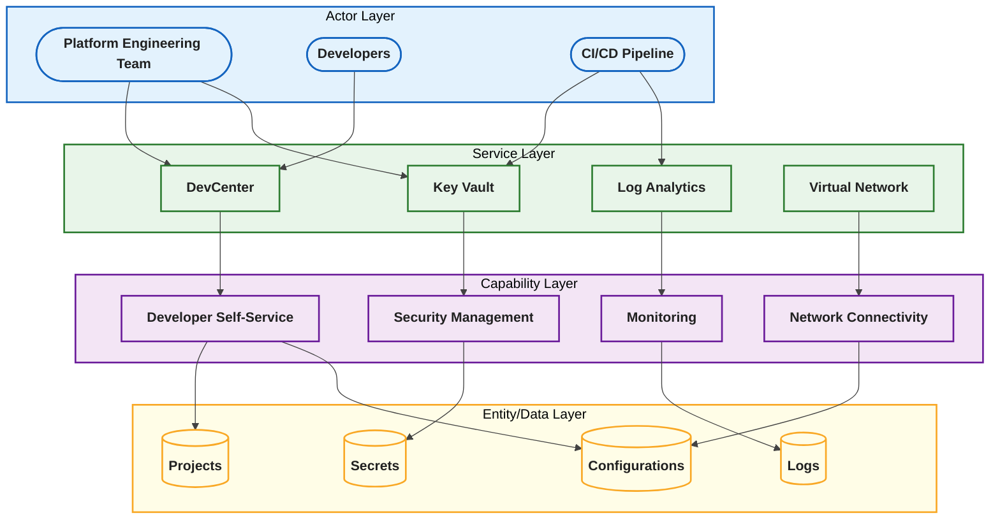
```mermaid
%%{init: {
  'theme': 'base',
  'themeVariables': {
    'primaryColor': '#E3F2FD',
    'primaryTextColor': '#212121',
    'lineColor': '#424242'
  }
}}%%

flowchart TB
    subgraph ActorLayer["Actor Layer"]
        style ActorLayer fill:#E3F2FD,stroke:#1565C0,stroke-width:2px
        A1([Platform Engineering Team]):::actor
        A2([Developers]):::actor
        A3([CI/CD Pipeline]):::actor
    end

    subgraph ServiceLayer["Service Layer"]
        style ServiceLayer fill:#E8F5E9,stroke:#2E7D32,stroke-width:2px
        S1[DevCenter]:::service
        S2[Key Vault]:::service
        S3[Log Analytics]:::service
        S4[Virtual Network]:::service
    end

    subgraph CapabilityLayer["Capability Layer"]
        style CapabilityLayer fill:#F3E5F5,stroke:#6A1B9A,stroke-width:2px
        C1[Developer Self-Service]:::capability
        C2[Security Management]:::capability
        C3[Monitoring]:::capability
        C4[Network Connectivity]:::capability
    end

    subgraph EntityLayer["Entity/Data Layer"]
        style EntityLayer fill:#FFFDE7,stroke:#F9A825,stroke-width:2px
        E1[(Projects)]:::entity
        E2[(Secrets)]:::entity
        E3[(Logs)]:::entity
        E4[(Configurations)]:::entity
    end

    A1 --> S1
    A1 --> S2
    A2 --> S1
    A3 --> S2
    A3 --> S3

    S1 --> C1
    S2 --> C2
    S3 --> C3
    S4 --> C4

    C1 --> E1
    C1 --> E4
    C2 --> E2
    C3 --> E3
    C4 --> E4

    classDef actor fill:#E3F2FD,stroke:#1565C0,stroke-width:2px,color:#212121,font-weight:bold
    classDef service fill:#E8F5E9,stroke:#2E7D32,stroke-width:2px,color:#212121,font-weight:bold
    classDef capability fill:#F3E5F5,stroke:#6A1B9A,stroke-width:2px,color:#212121,font-weight:bold
    classDef entity fill:#FFFDE7,stroke:#F9A825,stroke-width:2px,color:#212121,font-weight:bold
```

### 10.3 Landing Zone Resource Organization

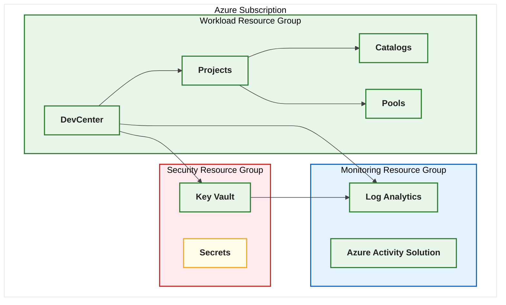
```mermaid
%%{init: {
  'theme': 'base',
  'themeVariables': {
    'primaryColor': '#FAFAFA',
    'lineColor': '#424242'
  }
}}%%

flowchart TB
    subgraph Subscription["Azure Subscription"]
        subgraph SecurityRG["Security Resource Group"]
            style SecurityRG fill:#FFEBEE,stroke:#C62828,stroke-width:2px
            KV[Key Vault]:::service
            SEC[Secrets]:::entity
        end

        subgraph MonitoringRG["Monitoring Resource Group"]
            style MonitoringRG fill:#E3F2FD,stroke:#1565C0,stroke-width:2px
            LA[Log Analytics]:::service
            SOL[Azure Activity Solution]:::service
        end

        subgraph WorkloadRG["Workload Resource Group"]
            style WorkloadRG fill:#E8F5E9,stroke:#2E7D32,stroke-width:2px
            DC[DevCenter]:::service
            PROJ[Projects]:::service
            CAT[Catalogs]:::service
            POOL[Pools]:::service
        end
    end

    KV --> LA
    DC --> LA
    DC --> KV
    DC --> PROJ
    PROJ --> CAT
    PROJ --> POOL

    classDef service fill:#E8F5E9,stroke:#2E7D32,stroke-width:2px,color:#212121,font-weight:bold
    classDef entity fill:#FFFDE7,stroke:#F9A825,stroke-width:2px,color:#212121,font-weight:bold
```

---

## 11. Integration Points

### 11.1 External Integrations

| Integration         | Direction     | Protocol  | Purpose                                             | Source File                                                                 |
| ------------------- | ------------- | --------- | --------------------------------------------------- | --------------------------------------------------------------------------- |
| GitHub Repository   | Inbound       | HTTPS/Git | Catalog synchronization for environment definitions | [src/workload/core/catalog.bicep](../../../src/workload/core/catalog.bicep) |
| Azure DevOps        | Inbound       | HTTPS/Git | Alternative source control for catalogs             | [src/workload/core/catalog.bicep](../../../src/workload/core/catalog.bicep) |
| GitHub Actions      | Outbound      | OIDC      | CI/CD pipeline authentication                       | [.github/workflows/deploy.yml](../../../.github/workflows/deploy.yml)       |
| Azure CLI           | Bidirectional | REST API  | Resource management and deployment                  | [setUp.ps1](../../../setUp.ps1)                                             |
| Azure Developer CLI | Bidirectional | REST API  | Environment provisioning orchestration              | [azure.yaml](../../../azure.yaml)                                           |

### 11.2 Internal Module Dependencies

```
monitoring → (deployed first)
    └── security → (depends on monitoring for diagnostic logs)
        └── workload → (depends on security for secrets, monitoring for logs)
            └── projects → (deployed per project in loop)
                └── pools, catalogs, networks → (project sub-resources)
```

---

## 12. Governance & Compliance

### 12.1 Resource Tagging Strategy

All resources follow a consistent tagging scheme for governance, cost
management, and operational tracking:

| Tag Key     | Purpose                           | Example Value            |
| ----------- | --------------------------------- | ------------------------ |
| environment | Deployment environment identifier | dev, staging, prod       |
| division    | Organizational division           | Platforms                |
| team        | Responsible team                  | DevExP                   |
| project     | Project name for cost allocation  | Contoso-DevExp-DevBox    |
| costCenter  | Financial tracking                | IT                       |
| owner       | Resource ownership                | Contoso                  |
| landingZone | Azure landing zone classification | Workload, Security       |
| resources   | Resource type identifier          | ResourceGroup, DevCenter |

### 12.2 Security Controls

| Control             | Implementation                  | Business Rule           |
| ------------------- | ------------------------------- | ----------------------- |
| Purge Protection    | Key Vault configuration         | BR-004                  |
| Soft Delete         | 7-day retention                 | BR-005                  |
| RBAC Authorization  | Azure RBAC for Key Vault access | BR-006                  |
| Azure AD Join       | Network connection domain join  | BR-007                  |
| OIDC Authentication | GitHub Actions to Azure         | Workflow implementation |

### 12.3 Compliance Gaps

| Gap   | Description                 | Impact                                    |
| ----- | --------------------------- | ----------------------------------------- |
| G-004 | No SLA/SLO definitions      | Cannot document availability requirements |
| G-005 | No cost model documentation | Limited financial governance visibility   |
| G-008 | No DR/BC documentation      | Cannot document resilience requirements   |

---

## Appendix A: Glossary of Business Terms

| Term                   | Definition                                                                                                                        | Source File                                                                                                                     |
| ---------------------- | --------------------------------------------------------------------------------------------------------------------------------- | ------------------------------------------------------------------------------------------------------------------------------- |
| **DevCenter**          | Azure service that provides management and orchestration for developer environments including Dev Box and Deployment Environments | [src/workload/core/devCenter.bicep](../../../src/workload/core/devCenter.bicep)                                                 |
| **Dev Box**            | Cloud-based developer workstation provisioned on-demand with pre-configured development tools                                     | [src/workload/project/projectPool.bicep](../../../src/workload/project/projectPool.bicep)                                       |
| **Catalog**            | Repository of environment definitions or image definitions that DevCenter syncs from GitHub or Azure DevOps                       | [src/workload/core/catalog.bicep](../../../src/workload/core/catalog.bicep)                                                     |
| **Environment Type**   | Deployment environment category (dev, staging, UAT) that defines where applications can be deployed                               | [src/workload/core/environmentType.bicep](../../../src/workload/core/environmentType.bicep)                                     |
| **Pool**               | Collection of Dev Boxes with specific VM configurations and image definitions                                                     | [src/workload/project/projectPool.bicep](../../../src/workload/project/projectPool.bicep)                                       |
| **Network Connection** | Link between DevCenter and a virtual network subnet enabling Dev Box provisioning with Azure AD Join                              | [src/connectivity/networkConnection.bicep](../../../src/connectivity/networkConnection.bicep)                                   |
| **DSC**                | Desired State Configuration - PowerShell-based configuration management for declaring desired machine state                       | [.configuration/devcenter/workloads/common-config.dsc.yaml](../../../.configuration/devcenter/workloads/common-config.dsc.yaml) |
| **WinGet**             | Windows Package Manager used to install and manage software packages                                                              | [.configuration/devcenter/workloads/common-config.dsc.yaml](../../../.configuration/devcenter/workloads/common-config.dsc.yaml) |
| **azd**                | Azure Developer CLI - tool for streamlined cloud application development with templates and provisioning                          | [azure.yaml](../../../azure.yaml)                                                                                               |
| **Bicep**              | Domain-specific language for deploying Azure resources declaratively                                                              | [infra/main.bicep](../../../infra/main.bicep)                                                                                   |
| **Landing Zone**       | Azure architectural pattern for organizing resources into functional groups (security, monitoring, workload)                      | [infra/main.bicep](../../../infra/main.bicep)                                                                                   |
| **RBAC**               | Role-Based Access Control - Azure authorization system for managing resource access                                               | [src/identity/devCenterRoleAssignment.bicep](../../../src/identity/devCenterRoleAssignment.bicep)                               |
| **Managed Identity**   | Azure AD identity automatically managed by Azure for authenticating between services                                              | [infra/settings/workload/devcenter.yaml](../../../infra/settings/workload/devcenter.yaml)                                       |
| **OIDC**               | OpenID Connect - authentication protocol used for GitHub Actions to Azure authentication                                          | [.github/workflows/deploy.yml](../../../.github/workflows/deploy.yml)                                                           |
| **Dev Drive**          | Windows 11 optimized storage using ReFS format for improved development workload performance                                      | [.configuration/devcenter/workloads/common-config.dsc.yaml](../../../.configuration/devcenter/workloads/common-config.dsc.yaml) |

---

## Appendix B: TOGAF Compliance Matrix

| TOGAF Business Architecture Element   | Document Section | Coverage Status         |
| ------------------------------------- | ---------------- | ----------------------- |
| Business Capability Model             | Section 1        | ✅ Complete             |
| Business Service Catalog              | Section 2        | ✅ Complete             |
| Business Process Model                | Section 3        | ✅ Complete             |
| Business Actor/Role Model             | Section 4        | ✅ Complete             |
| Business Event Model                  | Section 5        | ✅ Complete             |
| Business Rule Model                   | Section 6        | ✅ Complete             |
| Business Information Model (Entities) | Section 7        | ✅ Complete             |
| Value Stream Map                      | Section 8        | ✅ Complete             |
| Organization Map                      | Section 9        | ✅ Complete             |
| Architecture Overview                 | Section 10       | ✅ Complete             |
| Integration Architecture              | Section 11       | ✅ Complete             |
| Governance Model                      | Section 12       | ⚠️ Partial (Gaps noted) |

---

## Appendix C: Diagram Verification Report

_Placeholder for Phase 3: Documentation Validation_

| Diagram              | Section | Syntax Valid | Styling Applied | Node Count | Status  |
| -------------------- | ------- | ------------ | --------------- | ---------- | ------- |
| Capability Hierarchy | 1.2     | Pending      | Pending         | Pending    | Pending |
| Service Architecture | 2.2     | Pending      | Pending         | Pending    | Pending |
| Process Flow         | 3.2     | Pending      | Pending         | Pending    | Pending |
| Process Sequence     | 3.3     | Pending      | Pending         | Pending    | Pending |
| Actor Hierarchy      | 4.2     | Pending      | Pending         | Pending    | Pending |
| Event Flow           | 5.2     | Pending      | Pending         | Pending    | Pending |
| Rule Decision        | 6.2     | Pending      | Pending         | Pending    | Pending |
| Entity Relationship  | 7.2     | Pending      | Pending         | Pending    | Pending |
| Value Stream         | 8.2     | Pending      | Pending         | Pending    | Pending |
| Organization Map     | 9.2     | Pending      | Pending         | Pending    | Pending |
| Layered Architecture | 10.2    | Pending      | Pending         | Pending    | Pending |
| Landing Zone         | 10.3    | Pending      | Pending         | Pending    | Pending |

---

## Appendix D: Enterprise Style Reference

### D.1 Color Palette

| Element Type | Fill Color             | Border Color     | Text Color |
| ------------ | ---------------------- | ---------------- | ---------- |
| Actor        | #E3F2FD (Light Blue)   | #1565C0 (Blue)   | #212121    |
| Service      | #E8F5E9 (Light Green)  | #2E7D32 (Green)  | #212121    |
| Capability   | #F3E5F5 (Light Purple) | #6A1B9A (Purple) | #212121    |
| Process      | #FFF3E0 (Light Orange) | #E65100 (Orange) | #212121    |
| Event        | #E0F7FA (Light Cyan)   | #00838F (Cyan)   | #212121    |
| Rule         | #FFEBEE (Light Red)    | #C62828 (Red)    | #212121    |
| Entity       | #FFFDE7 (Light Yellow) | #F9A825 (Yellow) | #212121    |
| Organization | #FAFAFA (Light Gray)   | #424242 (Gray)   | #212121    |
| Value Stream | #E0F2F1 (Light Teal)   | #00695C (Teal)   | #212121    |

### D.2 Node Shape Standards

| Element Type      | Shape        | Mermaid Syntax |
| ----------------- | ------------ | -------------- |
| Actor/Stakeholder | Stadium/Pill | `([text])`     |
| Service           | Rectangle    | `[text]`       |
| Capability        | Rectangle    | `[text]`       |
| Process           | Rectangle    | `[text]`       |
| Event             | Circle       | `((text))`     |
| Rule/Decision     | Hexagon      | `{{text}}`     |
| Entity            | Cylinder     | `[(text)]`     |

---

## Appendix E: Source File Index

| File Path                                                                                                                                                             | Elements Documented                                                                           |
| --------------------------------------------------------------------------------------------------------------------------------------------------------------------- | --------------------------------------------------------------------------------------------- |
| [infra/main.bicep](../../../infra/main.bicep)                                                                                                                         | BC-002, BC-003, BC-004, BR-001, BR-002, BR-003                                                |
| [infra/settings/workload/devcenter.yaml](../../../infra/settings/workload/devcenter.yaml)                                                                             | BC-006, BC-008, BA-001 through BA-009, BO-001, BO-002, BO-005, BO-006, BO-009, BO-010, VS-003 |
| [infra/settings/security/security.yaml](../../../infra/settings/security/security.yaml)                                                                               | BO-007, BR-004, BR-005, BR-006                                                                |
| [infra/settings/resourceOrganization/azureResources.yaml](../../../infra/settings/resourceOrganization/azureResources.yaml)                                           | BO-008, OU-001, OU-002, OU-003                                                                |
| [src/workload/workload.bicep](../../../src/workload/workload.bicep)                                                                                                   | BC-001, BS-001                                                                                |
| [src/workload/core/devCenter.bicep](../../../src/workload/core/devCenter.bicep)                                                                                       | BS-001, BP-007                                                                                |
| [src/workload/core/catalog.bicep](../../../src/workload/core/catalog.bicep)                                                                                           | BS-005, BO-003, BR-008, BE-005                                                                |
| [src/workload/core/environmentType.bicep](../../../src/workload/core/environmentType.bicep)                                                                           | BS-006, BO-004                                                                                |
| [src/workload/project/project.bicep](../../../src/workload/project/project.bicep)                                                                                     | BS-004, BP-008                                                                                |
| [src/workload/project/projectPool.bicep](../../../src/workload/project/projectPool.bicep)                                                                             | BC-005, BS-009, BO-005                                                                        |
| [src/security/security.bicep](../../../src/security/security.bicep)                                                                                                   | BC-003                                                                                        |
| [src/security/keyVault.bicep](../../../src/security/keyVault.bicep)                                                                                                   | BS-002                                                                                        |
| [src/management/logAnalytics.bicep](../../../src/management/logAnalytics.bicep)                                                                                       | BS-003                                                                                        |
| [src/connectivity/connectivity.bicep](../../../src/connectivity/connectivity.bicep)                                                                                   | BC-007, BP-009                                                                                |
| [src/connectivity/vnet.bicep](../../../src/connectivity/vnet.bicep)                                                                                                   | BS-007                                                                                        |
| [src/connectivity/networkConnection.bicep](../../../src/connectivity/networkConnection.bicep)                                                                         | BS-008, BR-007                                                                                |
| [src/identity/devCenterRoleAssignment.bicep](../../../src/identity/devCenterRoleAssignment.bicep)                                                                     | BS-010                                                                                        |
| [src/identity/projectIdentityRoleAssignment.bicep](../../../src/identity/projectIdentityRoleAssignment.bicep)                                                         | BC-008                                                                                        |
| [src/identity/orgRoleAssignment.bicep](../../../src/identity/orgRoleAssignment.bicep)                                                                                 | BC-008                                                                                        |
| [.github/workflows/ci.yml](../../../.github/workflows/ci.yml)                                                                                                         | BC-010, BP-004, BE-001, BE-002                                                                |
| [.github/workflows/deploy.yml](../../../.github/workflows/deploy.yml)                                                                                                 | BP-005, BE-003, BR-009                                                                        |
| [azure.yaml](../../../azure.yaml)                                                                                                                                     | BP-001, BE-004, BR-010                                                                        |
| [setUp.ps1](../../../setUp.ps1)                                                                                                                                       | BP-002, VS-001                                                                                |
| [setUp.sh](../../../setUp.sh)                                                                                                                                         | BP-002                                                                                        |
| [cleanSetUp.ps1](../../../cleanSetUp.ps1)                                                                                                                             | BP-006                                                                                        |
| [.configuration/setup/powershell/Azure/generateDeploymentCredentials.ps1](../../../.configuration/setup/powershell/Azure/generateDeploymentCredentials.ps1)           | BP-003, BA-010                                                                                |
| [.configuration/devcenter/workloads/common-config.dsc.yaml](../../../.configuration/devcenter/workloads/common-config.dsc.yaml)                                       | BC-009, BP-010, VS-001                                                                        |
| [.configuration/devcenter/workloads/common-backend-config.dsc.yaml](../../../.configuration/devcenter/workloads/common-backend-config.dsc.yaml)                       | BC-009                                                                                        |
| [.configuration/devcenter/workloads/common-frontend-usertasks-config.dsc.yaml](../../../.configuration/devcenter/workloads/common-frontend-usertasks-config.dsc.yaml) | BC-009                                                                                        |

---

_End of Business Architecture Document_

**Document Status**: ☑ Complete — Ready for Phase 3 Validation

**Next Phase**: Proceed to `./prompts/documentation-validation.md` for Phase 3:
Documentation Validation
