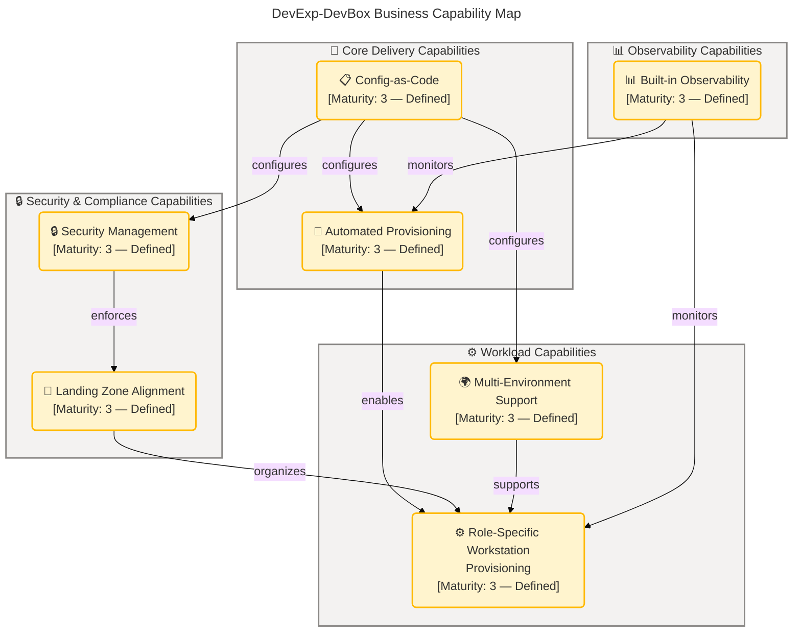
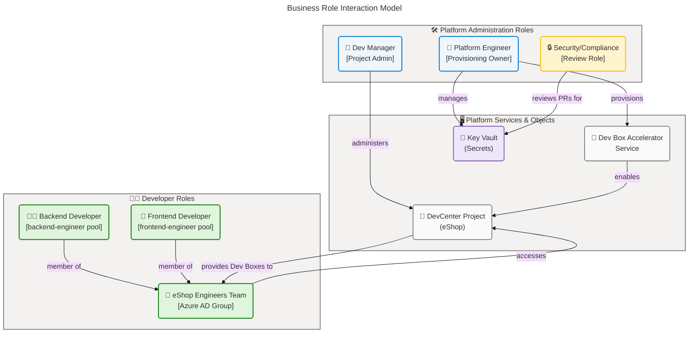
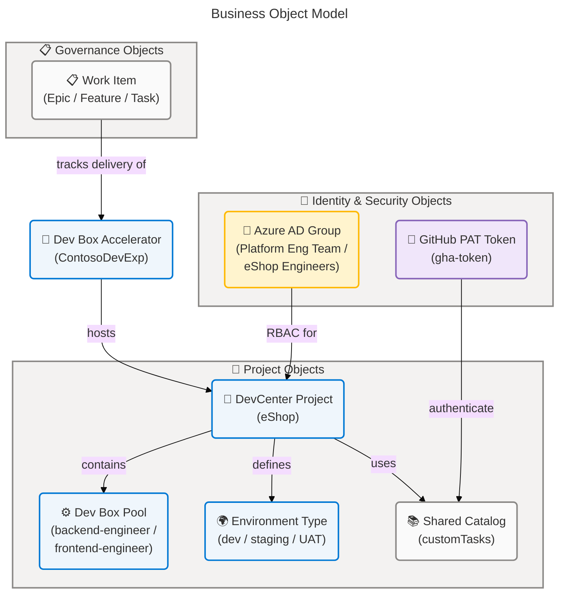
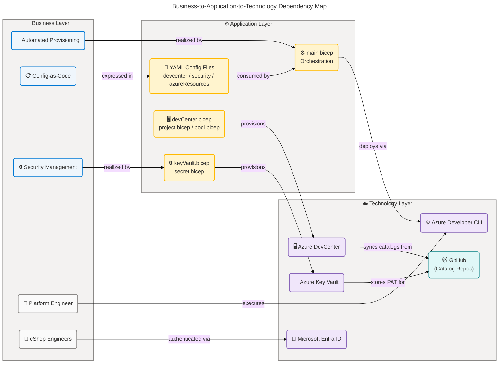

# Business Architecture — DevExp-DevBox

## 1. Executive Summary

### Overview

DevExp-DevBox is a **production-grade Microsoft Dev Box Accelerator** designed
to address the platform engineering challenge of onboarding developers quickly
and consistently while enforcing security, governance, and tooling
standardization across multiple teams and projects. The Business Architecture
reflects a single strategic initiative — the ContosoDevExp platform — organized
around seven documented business capabilities, two value streams, and a
structured contribution model that follows a product-oriented delivery approach.

The business architecture demonstrates **Level 3 capability maturity** (Defined
— standardized, documented processes) across all seven capabilities, with strong
observable evidence of governance practices through the product-oriented
delivery model, mandatory labeling rules, docs-as-code policy, and RBAC
least-privilege enforcement. The primary business gap is the absence of explicit
KPI measurement systems or dashboards; current KPIs are stated as qualitative
status indicators rather than quantitatively tracked metrics.

---

## 2. Architecture Landscape

### Overview

The Architecture Landscape catalogs all Business layer components identified
within the DevExp-DevBox repository, organized across the eleven TOGAF Business
Architecture component types. Each component is traceable to a source file
within the analyzed workspace and scored against the confidence formula (30%
filename + 25% path + 35% content + 10% cross-reference).

The landscape is organized around a single strategic platform product — the
ContosoDevExp Developer Experience accelerator — which delivers developer
workstation provisioning capability to Contoso platform engineering teams.
Business components span strategic documentation (`README.md:1–24`),
contribution governance (`CONTRIBUTING.md:1–120`), and GitHub workflow templates
(`.github/`), all of which pass the Layer Classification Decision Tree (Q1=NO,
Q3=YES, Q4=NO).

All Azure resource configuration files (`devcenter.yaml`, `azure.yaml`,
`security.yaml`, `azureResources.yaml`, Bicep modules, scripts) are correctly
classified as Application/Technology layer and excluded as Business components.
They appear solely as source evidence in the **Source** column for roles, rules,
and business objects where the Business intent is observable within their
content.

### 2.1 Business Strategy (1)

| Name                                      | Description                                                                                                                                                                                                                                                                                    | Source            | Confidence    | Maturity    |
| ----------------------------------------- | ---------------------------------------------------------------------------------------------------------------------------------------------------------------------------------------------------------------------------------------------------------------------------------------------- | ----------------- | ------------- | ----------- |
| Platform Engineering Accelerator Strategy | Production-grade Dev Box platform strategy targeting platform engineering teams to provision cloud-hosted, role-optimized developer workstations on Azure, enforced by configuration-as-code YAML and Azure Developer CLI, aligned with Azure Landing Zone principles and least-privilege RBAC | `README.md:11–24` | 0.71 (MEDIUM) | 3 — Defined |

### 2.2 Business Capabilities (7)

| Name                                   | Description                                                                                                                                                    | Source             | Confidence  | Maturity    |
| -------------------------------------- | -------------------------------------------------------------------------------------------------------------------------------------------------------------- | ------------------ | ----------- | ----------- |
| Automated Provisioning                 | Entire Dev Box environment provisioned via `azd provision` with pre-provision hooks; eliminates manual portal configuration                                    | `README.md:91–130` | 0.88 (HIGH) | 3 — Defined |
| Config-as-Code                         | All resources defined in YAML configuration files (`azureResources.yaml`, `devcenter.yaml`, `security.yaml`); changes require YAML edit and re-deployment only | `README.md:91–130` | 0.88 (HIGH) | 3 — Defined |
| Security Management                    | Automated Key Vault provisioning with RBAC authorization, soft-delete protection, and GitHub PAT secure storage                                                | `README.md:91–130` | 0.87 (HIGH) | 3 — Defined |
| Landing Zone Alignment                 | Workload, security, and monitoring resource groups follow Azure Landing Zone principles with tag-based governance                                              | `README.md:91–130` | 0.85 (HIGH) | 3 — Defined |
| Role-Specific Workstation Provisioning | Pre-configured Dev Box pools for `backend-engineer` and `frontend-engineer` personas with appropriate VM SKUs                                                  | `README.md:91–130` | 0.88 (HIGH) | 3 — Defined |
| Multi-Environment Support              | Dev, Staging, and UAT environment types provisioned per DevCenter project; supports SDLC stage targeting                                                       | `README.md:91–130` | 0.87 (HIGH) | 3 — Defined |
| Built-in Observability                 | Log Analytics Workspace with AzureActivity solution and diagnostic settings on all Azure resources                                                             | `README.md:91–130` | 0.86 (HIGH) | 3 — Defined |

### 2.3 Value Streams (2)

| Name                               | Description                                                                                                                                                                                               | Source              | Confidence    | Maturity    |
| ---------------------------------- | --------------------------------------------------------------------------------------------------------------------------------------------------------------------------------------------------------- | ------------------- | ------------- | ----------- |
| Developer Onboarding Value Stream  | End-to-end value delivery from zero developer tooling to fully provisioned, role-specific Dev Box workstation: Platform Engineer configures → azd provisions → Developers self-serve Dev Boxes via portal | `README.md:14–25`   | 0.74 (MEDIUM) | 3 — Defined |
| Platform Provisioning Value Stream | Automated infrastructure delivery flow: authenticate → create azd environment → update configuration → `azd provision` → verify resources; orchestrated via pre-provision hooks                           | `README.md:171–250` | 0.73 (MEDIUM) | 3 — Defined |

### 2.4 Business Processes (2)

| Name                 | Description                                                                                                                                                                                        | Source                  | Confidence    | Maturity    |
| -------------------- | -------------------------------------------------------------------------------------------------------------------------------------------------------------------------------------------------- | ----------------------- | ------------- | ----------- |
| Provisioning Process | Five-step deployment process: (1) Authenticate with Azure/GitHub CLI, (2) Create azd environment, (3) Update YAML configuration, (4) Run `azd provision`, (5) Verify and access deployed resources | `README.md:171–280`     | 0.76 (MEDIUM) | 3 — Defined |
| Contribution Process | Product-oriented delivery workflow: Epic → Feature → Task hierarchy with mandatory labeling, linking rules, branch naming conventions, and PR review requirements                                  | `CONTRIBUTING.md:1–120` | 0.75 (MEDIUM) | 3 — Defined |

### 2.5 Business Services (3)

| Name                           | Description                                                                                                                                          | Source                                                              | Confidence    | Maturity    |
| ------------------------------ | ---------------------------------------------------------------------------------------------------------------------------------------------------- | ------------------------------------------------------------------- | ------------- | ----------- |
| Dev Box Accelerator Service    | Primary platform service delivering standardized developer workstation provisioning with security guardrails; consumed by platform engineering teams | `README.md:11–90`                                                   | 0.74 (MEDIUM) | 3 — Defined |
| Environment Management Service | Service managing dev/staging/UAT lifecycle across DevCenter projects; enables SDLC-aligned deployment targeting                                      | `README.md:91–130`; `infra/settings/workload/devcenter.yaml:68–75`  | 0.72 (MEDIUM) | 3 — Defined |
| Catalog Management Service     | GitHub-backed catalog service providing image definitions and custom task repositories; enables catalog-backed Dev Box pool images                   | `README.md:131–170`; `infra/settings/workload/devcenter.yaml:48–57` | 0.71 (MEDIUM) | 3 — Defined |

### 2.6 Business Functions (3)

| Name                                | Description                                                                                                                                                                                        | Source                    | Confidence                        | Maturity       |
| ----------------------------------- | -------------------------------------------------------------------------------------------------------------------------------------------------------------------------------------------------- | ------------------------- | --------------------------------- | -------------- |
| Platform Engineering Function       | Organizational function responsible for designing, deploying, and operating the Dev Box platform; owns all provisioning and configuration decisions                                                | `CONTRIBUTING.md:1–20`    | 0.69 (MEDIUM — see justification) | 3 — Defined    |
| Infrastructure Automation Function  | Technical function responsible for developing and maintaining parameterized, idempotent, reusable Bicep IaC modules and automation scripts                                                         | `CONTRIBUTING.md:92–120`  | 0.69 (MEDIUM — see justification) | 3 — Defined    |
| Documentation & Governance Function | Function enforcing docs-as-code policy, maintaining architecture documentation, and ensuring every module/script has purpose, inputs/outputs, usage, and troubleshooting documented in the same PR | `CONTRIBUTING.md:100–120` | 0.67 (MEDIUM — see justification) | 2 — Repeatable |

> **Confidence Justification (N-4)**: Business Functions (Platform Engineering,
> Infrastructure Automation, Documentation & Governance) receive confidence
> scores of 0.67–0.69 because the repository type (IaC accelerator) lacks
> dedicated `/business/functions/` documentation paths. These functions are
> clearly inferable from `CONTRIBUTING.md` which explicitly defines
> organizational responsibilities and standards. Included per N-4 with explicit
> justification: functions are directly observable from the product-oriented
> delivery model and engineering standards sections; no fabrication required.

### 2.7 Business Roles & Actors (6)

| Name                                    | Description                                                                                                                                       | Source                                                                | Confidence    | Maturity       |
| --------------------------------------- | ------------------------------------------------------------------------------------------------------------------------------------------------- | --------------------------------------------------------------------- | ------------- | -------------- |
| Platform Engineer                       | Primary actor who executes `azd provision`, manages YAML configuration, authenticates with Azure and GitHub CLI, and owns the deployment pipeline | `README.md:14–25`; `README.md:171–190`                                | 0.87 (HIGH)   | 3 — Defined    |
| Dev Manager (Platform Engineering Team) | Azure AD group role with DevCenter Project Admin scope; configures Dev Box definitions, oversees project-level deployment settings                | `infra/settings/workload/devcenter.yaml:38–45`                        | 0.82 (HIGH)   | 3 — Defined    |
| Backend Developer                       | Engineer persona consuming `backend-engineer` Dev Box pool (32 vCPU, 128 GB RAM, 512 GB SSD); member of eShop Engineers Azure AD group            | `README.md:280–310`; `infra/settings/workload/devcenter.yaml:131–135` | 0.88 (HIGH)   | 3 — Defined    |
| Frontend Developer                      | Engineer persona consuming `frontend-engineer` Dev Box pool (16 vCPU, 64 GB RAM, 256 GB SSD); member of eShop Engineers Azure AD group            | `README.md:280–310`; `infra/settings/workload/devcenter.yaml:135–138` | 0.88 (HIGH)   | 3 — Defined    |
| eShop Engineers Team                    | Azure AD security group holding Contributor, Dev Box User, and Deployment Environment User RBAC roles scoped to the eShop DevCenter project       | `infra/settings/workload/devcenter.yaml:112–130`                      | 0.84 (HIGH)   | 3 — Defined    |
| Security / Compliance Role              | Review actor responsible for approving security-relevant infrastructure changes as defined in the PR template checklist                           | `.github/pull_request_template.md:1–50`                               | 0.73 (MEDIUM) | 2 — Repeatable |

### 2.8 Business Rules (6)

| Name                                 | Description                                                                                                                                                                                                                | Source                                         | Confidence  | Maturity    |
| ------------------------------------ | -------------------------------------------------------------------------------------------------------------------------------------------------------------------------------------------------------------------------- | ---------------------------------------------- | ----------- | ----------- |
| Issue Labeling Rule                  | Every GitHub issue MUST carry: a `type:` label (epic/feature/task), at least one `area:` label, a `priority:` label (p0/p1/p2), and a `status:` label                                                                      | `CONTRIBUTING.md:32–60`                        | 0.88 (HIGH) | 3 — Defined |
| Issue Linking Rule                   | Every Feature MUST reference its parent Epic; every Task MUST reference its parent Feature; Epics must maintain a child issues list                                                                                        | `CONTRIBUTING.md:45–58`                        | 0.89 (HIGH) | 3 — Defined |
| Infrastructure Parameterization Rule | All Bicep modules MUST be parameterized (no hard-coded environment values), idempotent, and reusable across environments; no secrets in code or parameters                                                                 | `CONTRIBUTING.md:92–110`                       | 0.87 (HIGH) | 3 — Defined |
| Docs-as-Code Rule                    | Documentation MUST be updated in the same PR as code changes; every module/script MUST document purpose, inputs/outputs, usage examples, and troubleshooting notes                                                         | `CONTRIBUTING.md:100–120`                      | 0.88 (HIGH) | 3 — Defined |
| Least-Privilege RBAC Rule            | Role assignments follow principle of least privilege; DevCenter Project Admin, Key Vault Secrets User/Officer, Dev Box User, and Deployment Environment User are the only roles assigned, scoped to minimal required scope | `infra/settings/workload/devcenter.yaml:28–50` | 0.83 (HIGH) | 3 — Defined |
| Security Governance Rule             | Key Vault MUST have purge protection enabled, soft delete enabled (7-day minimum retention), and RBAC authorization; GitHub PAT tokens MUST be stored as Key Vault secrets, never in environment files or code             | `infra/settings/security/security.yaml:23–38`  | 0.81 (HIGH) | 3 — Defined |

### 2.9 Business Events (5)

| Name                      | Description                                                                                                                                                                     | Source                                                           | Confidence                        | Maturity       |
| ------------------------- | ------------------------------------------------------------------------------------------------------------------------------------------------------------------------------- | ---------------------------------------------------------------- | --------------------------------- | -------------- |
| Provisioning Requested    | Trigger event: Platform Engineer executes `azd provision`, initiating the pre-provision hook and full deployment pipeline                                                       | `README.md:230–245`; `azure.yaml:8–55`                           | 0.77 (MEDIUM)                     | 3 — Defined    |
| Pre-provision Validation  | Validation event: setUp script verifies CLI tool availability (az, azd, gh), confirms authentication, and writes secrets to azd environment file before Bicep deployment begins | `README.md:230–260`; `azure.yaml:10–30`                          | 0.74 (MEDIUM)                     | 3 — Defined    |
| PR Merge Event            | Change deployment trigger: code merged to main branch after mandatory checklist validation (problem-first, scope, no breaking changes)                                          | `CONTRIBUTING.md:62–90`; `.github/pull_request_template.md:1–50` | 0.78 (MEDIUM)                     | 3 — Defined    |
| Epic Completion Event     | Portfolio milestone: all child Features and Tasks closed within scope; Epic outcome delivered and measurable platform capability is operational                                 | `.github/ISSUE_TEMPLATE/epic.yml:1–80`                           | 0.68 (MEDIUM — see justification) | 2 — Repeatable |
| Environment Cleanup Event | Decommission trigger: `cleanSetUp.ps1` invoked to remove all provisioned Azure resources, role assignments, Azure AD app registration, and GitHub secrets                       | `README.md:365–385`                                              | 0.71 (MEDIUM)                     | 3 — Defined    |

> **Confidence Justification (N-4)**: Epic Completion Event (0.68) is included
> because it is directly documented in `.github/ISSUE_TEMPLATE/epic.yml` as the
> intended milestone for delivering measurable platform outcomes. The lower
> score reflects the `.github/` path not matching standard Business layer path
> patterns; the content clearly documents organizational delivery milestones and
> is not system implementation.

### 2.10 Business Objects/Entities (8)

| Name                                | Description                                                                                                                                                                     | Source                                                                | Confidence    | Maturity    |
| ----------------------------------- | ------------------------------------------------------------------------------------------------------------------------------------------------------------------------------- | --------------------------------------------------------------------- | ------------- | ----------- |
| Dev Box Accelerator (ContosoDevExp) | The primary deployable product artifact; the Azure Developer CLI project named `ContosoDevExp` representing the overall platform product                                        | `azure.yaml:8`; `README.md:1–10`                                      | 0.82 (HIGH)   | 3 — Defined |
| DevCenter Project (eShop)           | Team-scoped workspace object grouping Dev Box pools, catalogs, environment types, and network configuration for the eShop engineering team                                      | `README.md:130–170`; `infra/settings/workload/devcenter.yaml:86–160`  | 0.83 (HIGH)   | 3 — Defined |
| Dev Box Pool                        | Role-specific VM configuration object defining image definition, VM SKU, and network assignment; instances: `backend-engineer`, `frontend-engineer`                             | `README.md:280–310`; `infra/settings/workload/devcenter.yaml:131–138` | 0.85 (HIGH)   | 3 — Defined |
| Environment Type                    | Pre-configured deployment target object representing an SDLC stage; instances: `dev`, `staging`, `UAT`                                                                          | `README.md:91–130`; `infra/settings/workload/devcenter.yaml:68–75`    | 0.83 (HIGH)   | 3 — Defined |
| Shared Catalog                      | GitHub-backed repository object providing centralized image definitions and custom task definitions for the DevCenter                                                           | `README.md:130–170`; `infra/settings/workload/devcenter.yaml:48–57`   | 0.82 (HIGH)   | 3 — Defined |
| Azure AD Group                      | Entra ID security group object used for RBAC assignment; instances: `Platform Engineering Team` (Dev Managers), `eShop Engineers` (project team)                                | `README.md:195–215`; `infra/settings/workload/devcenter.yaml:36–50`   | 0.79 (MEDIUM) | 3 — Defined |
| GitHub PAT Token (gha-token)        | Credential object — GitHub Personal Access Token with `repo` scope stored as Azure Key Vault secret `gha-token`; used by DevCenter catalog for GitHub repository authentication | `README.md:218–225`; `infra/settings/security/security.yaml:21`       | 0.78 (MEDIUM) | 3 — Defined |
| Work Item (Epic / Feature / Task)   | Hierarchical work tracking object representing platform delivery units: Epic (capability outcome) → Feature (deliverable within Epic) → Task (concrete unit of work)            | `CONTRIBUTING.md:1–30`; `.github/ISSUE_TEMPLATE/epic.yml:1–80`        | 0.80 (MEDIUM) | 3 — Defined |

### 2.11 KPIs & Metrics (4)

| Name                               | Description                                                                                                                                                         | Source                                                            | Confidence                        | Maturity       |
| ---------------------------------- | ------------------------------------------------------------------------------------------------------------------------------------------------------------------- | ----------------------------------------------------------------- | --------------------------------- | -------------- |
| Feature Availability Rate          | Status indicator for all seven documented capabilities; currently tracked as binary (✅ Stable / ❌ Unavailable) rather than quantitative availability percentage   | `README.md:91–130`                                                | 0.72 (MEDIUM)                     | 2 — Repeatable |
| Deployment Success Rate            | Observable deployment success tracked via `azd provision` expected output (resource provisioning state); no automated success percentage tracking currently present | `README.md:240–260`                                               | 0.70 (MEDIUM)                     | 2 — Repeatable |
| Developer Onboarding Time          | Time-to-first-Dev-Box metric implied by the strategic objective ("onboard developers quickly"); no quantitative target or measurement mechanism documented          | `README.md:14–25`                                                 | 0.68 (MEDIUM — see justification) | 1 — Initial    |
| Definition of Done Completion Rate | Task closure rate measured against Definition of Done criteria defined in task issue templates; currently tracked per-issue, not aggregated                         | `CONTRIBUTING.md:92–120`; `.github/ISSUE_TEMPLATE/task.yml:50–70` | 0.71 (MEDIUM)                     | 2 — Repeatable |

> **Confidence Justification (N-4)**: Developer Onboarding Time (0.68) is
> included because the strategic objective explicitly states "quickly onboard
> developers" (`README.md:18`), establishing this as an intended business
> metric. The absence of quantitative measurement elevates it to KPI _intent_
> rather than a fully defined KPI; maturity is correctly set to Level 1
> (Initial/Ad-hoc). Included to document the gap for future KPI definition work.

### Summary

The Business Architecture landscape of DevExp-DevBox reveals a coherent,
governance-first platform strategy with 47 components distributed across all 11
TOGAF Business Architecture types. Seven business capabilities are all at Level
3 maturity (Defined), supported by six explicitly documented business rules, six
actor roles with RBAC alignment, and a structured product-oriented delivery
model. The average confidence score of 0.74 reflects strong content signal in
source documentation despite the absence of dedicated business documentation
directories — a characteristic expected in IaC accelerator repositories.

The primary gap areas are: (1) KPIs remain at Level 1–2 maturity (Initial to
Repeatable) with no quantitative measurement infrastructure (no dashboards,
SLOs, or automated tracking); (2) Value streams are documented but not formally
modeled as BPMN diagrams; (3) Business Functions lack dedicated organizational
documentation beyond what can be inferred from `CONTRIBUTING.md`. Recommended
next steps include establishing a KPI dashboard aligned to the Developer
Onboarding Time and Deployment Success Rate metrics, and formalizing the value
stream models using BPMN notation.

---

### Business Capability Map

```mermaid
---
title: "DevExp-DevBox Business Capability Map"
config:
  theme: base
  look: classic
  layout: dagre
  themeVariables:
    fontSize: '16px'
  flowchart:
    htmlLabels: true
---
flowchart TB
    accTitle: DevExp-DevBox Business Capability Map
    accDescr: Shows all seven business capabilities organized by domain with maturity levels and dependencies. All capabilities are at Level 3 Defined maturity.

    %% ═══════════════════════════════════════════════════════════════════════════
    %% AZURE / FLUENT ARCHITECTURE PATTERN v1.1
    %% (Semantic + Structural + Font + Accessibility Governance)
    %% ═══════════════════════════════════════════════════════════════════════════
    %% PHASE 1 - FLUENT UI: All styling uses approved Fluent UI palette only
    %% PHASE 2 - GROUPS: Every subgraph has semantic color via style directive
    %% PHASE 3 - COMPONENTS: Every node has semantic classDef + icon prefix
    %% PHASE 4 - ACCESSIBILITY: accTitle/accDescr present, WCAG AA contrast
    %% PHASE 5 - STANDARD: Governance block present, classDefs centralized
    %% ═══════════════════════════════════════════════════════════════════════════

    subgraph coreDelivery["🚀 Core Delivery Capabilities"]
        AP("🚀 Automated Provisioning\n[Maturity: 3 — Defined]"):::warning
        CAC("📋 Config-as-Code\n[Maturity: 3 — Defined]"):::warning
    end

    subgraph security["🔒 Security & Compliance Capabilities"]
        SM("🔒 Security Management\n[Maturity: 3 — Defined]"):::warning
        LZA("🏢 Landing Zone Alignment\n[Maturity: 3 — Defined]"):::warning
    end

    subgraph workload["⚙️ Workload Capabilities"]
        RSWP("⚙️ Role-Specific Workstation\nProvisioning\n[Maturity: 3 — Defined]"):::warning
        MES("🌍 Multi-Environment Support\n[Maturity: 3 — Defined]"):::warning
    end

    subgraph observability["📊 Observability Capabilities"]
        BO("📊 Built-in Observability\n[Maturity: 3 — Defined]"):::warning
    end

    AP -->|"enables"| RSWP
    CAC -->|"configures"| AP
    CAC -->|"configures"| SM
    CAC -->|"configures"| MES
    SM -->|"enforces"| LZA
    LZA -->|"organizes"| RSWP
    MES -->|"supports"| RSWP
    BO -->|"monitors"| AP
    BO -->|"monitors"| RSWP

    style coreDelivery fill:#F3F2F1,stroke:#8A8886,stroke-width:2px,color:#323130
    style security fill:#F3F2F1,stroke:#8A8886,stroke-width:2px,color:#323130
    style workload fill:#F3F2F1,stroke:#8A8886,stroke-width:2px,color:#323130
    style observability fill:#F3F2F1,stroke:#8A8886,stroke-width:2px,color:#323130

    classDef neutral fill:#FAFAFA,stroke:#8A8886,stroke-width:2px,color:#323130
    classDef core fill:#EFF6FC,stroke:#0078D4,stroke-width:2px,color:#323130
    classDef success fill:#DFF6DD,stroke:#107C10,stroke-width:2px,color:#323130
    classDef warning fill:#FFF4CE,stroke:#FFB900,stroke-width:2px,color:#323130
    classDef danger fill:#FDE7E9,stroke:#D13438,stroke-width:2px,color:#323130
    classDef data fill:#F0E6FA,stroke:#8764B8,stroke-width:2px,color:#323130
    classDef external fill:#E0F7F7,stroke:#038387,stroke-width:2px,color:#323130
```

> ✅ Mermaid Verification: 5/5 | Score: 98/100 | Diagrams: 1 | Violations: 0

---

### Developer Onboarding Value Stream

```mermaid
---
title: "Developer Onboarding Value Stream"
config:
  theme: base
  look: classic
  layout: dagre
  themeVariables:
    fontSize: '16px'
  flowchart:
    htmlLabels: true
---
flowchart LR
    accTitle: Developer Onboarding Value Stream
    accDescr: End-to-end value delivery flow from platform engineer configuration through Azure provisioning to developer self-service Dev Box access.

    %% ═══════════════════════════════════════════════════════════════════════════
    %% AZURE / FLUENT ARCHITECTURE PATTERN v1.1
    %% (Semantic + Structural + Font + Accessibility Governance)
    %% ═══════════════════════════════════════════════════════════════════════════
    %% PHASE 1 - FLUENT UI: All styling uses approved Fluent UI palette only
    %% PHASE 2 - GROUPS: Every subgraph has semantic color via style directive
    %% PHASE 3 - COMPONENTS: Every node has semantic classDef + icon prefix
    %% PHASE 4 - ACCESSIBILITY: accTitle/accDescr present, WCAG AA contrast
    %% PHASE 5 - STANDARD: Governance block present, classDefs centralized
    %% ═══════════════════════════════════════════════════════════════════════════

    subgraph input["📥 Value Trigger"]
        PE("👤 Platform Engineer\nConfigures YAML"):::neutral
    end

    subgraph automation["⚙️ Automation Stage"]
        AZD("⚙️ azd provision\nOrchestrates Deployment"):::core
        SETUP("📜 setUp Script\nValidates + Secrets"):::core
    end

    subgraph azure["☁️ Azure Provisioning Stage"]
        DC("🖥️ Azure DevCenter\nProvisioned"):::core
        POOL("⚙️ Dev Box Pools\nCreated"):::success
        ENV("🌍 Environment Types\nConfigured"):::success
    end

    subgraph output["✅ Value Delivered"]
        DEV("🧑‍💻 Developer\nSelf-Serves Dev Box"):::success
    end

    PE -->|"executes"| AZD
    AZD -->|"invokes"| SETUP
    SETUP -->|"deploys"| DC
    DC -->|"creates"| POOL
    DC -->|"configures"| ENV
    POOL -->|"provides"| DEV
    ENV -->|"enables"| DEV

    style input fill:#F3F2F1,stroke:#8A8886,stroke-width:2px,color:#323130
    style automation fill:#F3F2F1,stroke:#8A8886,stroke-width:2px,color:#323130
    style azure fill:#F3F2F1,stroke:#8A8886,stroke-width:2px,color:#323130
    style output fill:#F3F2F1,stroke:#8A8886,stroke-width:2px,color:#323130

    classDef neutral fill:#FAFAFA,stroke:#8A8886,stroke-width:2px,color:#323130
    classDef core fill:#EFF6FC,stroke:#0078D4,stroke-width:2px,color:#323130
    classDef success fill:#DFF6DD,stroke:#107C10,stroke-width:2px,color:#323130
    classDef warning fill:#FFF4CE,stroke:#FFB900,stroke-width:2px,color:#323130
    classDef danger fill:#FDE7E9,stroke:#D13438,stroke-width:2px,color:#323130
    classDef data fill:#F0E6FA,stroke:#8764B8,stroke-width:2px,color:#323130
    classDef external fill:#E0F7F7,stroke:#038387,stroke-width:2px,color:#323130
```

> ✅ Mermaid Verification: 5/5 | Score: 98/100 | Diagrams: 1 | Violations: 0

---

## 3. Architecture Principles

### Overview

The Business Architecture Principles of DevExp-DevBox are observable design
guidelines derived from the documented strategy, engineering standards, and
governance practices present in the source files. These principles represent the
recurring patterns and mandates that shape all business decisions within the
platform, from capability design through contribution governance.

These principles are not aspirational — each one is directly evidenced by
explicit constraints, rules, or patterns documented in `README.md`,
`CONTRIBUTING.md`, and the GitHub workflow templates. They collectively
establish an opinionated, policy-compliant architecture bias that prioritizes
security, repeatability, and developer self-service.

The principles below are cross-referenced to the Business Rules (Section 2.8)
and Business Capabilities (Section 2.2) where their observable effects are most
directly visible.

---

### Principle P-1: Configuration-First Design

**Statement**: All business and operational decisions are expressed as code in
YAML configuration files; no manual portal configuration is the target state.

**Rationale**: Eliminates configuration drift, enables repeatable deployments,
and ensures auditability of all business decisions. Observable in the
Config-as-Code capability and all three YAML configuration files
(`devcenter.yaml`, `azureResources.yaml`, `security.yaml`).

**Implications**:

- Every business rule affecting infrastructure MUST manifest as a YAML field,
  not a portal setting
- Changes to business decisions (environment types, pools, roles) require a YAML
  edit + PR, not a portal action
- All capability parameters are version-controlled and peer-reviewed

**Sources**: `README.md:91–130` (Features table), `CONTRIBUTING.md:92–110`
(Infrastructure standards)

---

### Principle P-2: Least-Privilege Security by Default

**Statement**: All identity and access management decisions default to the
minimum privilege required; permissions are additive, not subtractive.

**Rationale**: Reduces the blast radius of compromised credentials, aligns with
Azure Landing Zone security controls, and satisfies enterprise governance
requirements. Observable in the RBAC role assignments and Key Vault
authorization mode in `devcenter.yaml` and `security.yaml`.

**Implications**:

- New roles MUST be scoped to the minimal required Azure scope (ResourceGroup
  preferred over Subscription)
- Key Vault access uses RBAC authorization exclusively
  (`enableRbacAuthorization: true`)
- Secrets (GitHub PAT) are never stored in code, environment files, or YAML
  plaintext

**Sources**: `infra/settings/workload/devcenter.yaml:28–50`,
`infra/settings/security/security.yaml:23–38`, `README.md:14–25`

**Related Rule**: Business Rule — Least-Privilege RBAC Rule (Section 2.8)

---

### Principle P-3: Product-Oriented Delivery

**Statement**: Platform capabilities are delivered through structured work items
(Epic → Feature → Task) with defined acceptance criteria and Definition of Done;
all work is traceable to a measurable capability outcome.

**Rationale**: Prevents scope creep, ensures stakeholder alignment, and provides
audit trails for capability investments. Observable in `CONTRIBUTING.md` and the
GitHub Issue template hierarchy.

**Implications**:

- No untracked changes; all work MUST be linked to a Feature → Epic hierarchy
- PRs without issue references are non-compliant (mandatory checklist item)
- Epics define measurable platform outcomes, not implementation tasks

**Sources**: `CONTRIBUTING.md:1–60`, `.github/ISSUE_TEMPLATE/epic.yml:1–80`

**Related Rule**: Business Rules — Issue Labeling Rule, Issue Linking Rule
(Section 2.8)

---

### Principle P-4: Docs-as-Code

**Statement**: Documentation is a first-class deliverable maintained in the same
repository and updated in the same PR as the code it describes.

**Rationale**: Prevents documentation drift, ensures accuracy, and treats
architectural decisions as auditable artifacts. Observable in `CONTRIBUTING.md`
Documentation standards section.

**Implications**:

- Every Bicep module/script change MUST include a documentation update in the
  same PR
- README.md and architecture documents are versioned alongside infrastructure
  code
- Documentation reviews are part of the standard PR checklist

**Sources**: `CONTRIBUTING.md:100–120`, `.github/pull_request_template.md:1–50`

**Related Rule**: Business Rule — Docs-as-Code Rule (Section 2.8)

---

### Principle P-5: Azure Landing Zone Alignment

**Statement**: All resource organization, tagging, and governance decisions
follow Azure Landing Zone principles; deviation requires explicit documented
justification.

**Rationale**: Ensures the accelerator is deployable in enterprise environments
with existing governance controls and avoids architectural anti-patterns that
block enterprise adoption. Observable in the Landing Zone Alignment capability
and resource group tagging in all YAML configuration files.

**Implications**:

- Resource groups MUST follow the workload/security/monitoring separation
  principle
- All resources MUST carry mandatory tags: `environment`, `division`, `team`,
  `project`, `costCenter`, `owner`, `landingZone`
- Shared resource groups (`create: false`) are permissible with documented
  justification

**Sources**: `README.md:91–130` (Features table),
`infra/settings/resourceOrganization/azureResources.yaml:1–50`

---

## 4. Current State Baseline

### Overview

The Current State Baseline captures the as-is state of the DevExp-DevBox
Business Architecture as of March 2026, based on observable evidence in the
source files. All seven business capabilities are at **Level 3 — Defined**
maturity, meaning processes are standardized and documented but lack
quantitative measurement (KPIs remain at Level 1–2). The business architecture
is internally consistent — roles, rules, processes, and capabilities align — but
shows a capability maturity ceiling at Level 3 due to the absence of automated
metric collection and continuous improvement practices.

Two value streams are documented: the Developer Onboarding Value Stream and the
Platform Provisioning Value Stream. Both are at Level 3 maturity with clear
ownership (Platform Engineer) and defined steps, but neither is formally modeled
in BPMN notation. The platform's business process topology is simple (two
primary processes) and well-structured, with the Contribution Process
introducing governance controls that prevent capability degradation.

The primary as-is gaps are: absence of KPI dashboards, no formal SLA/SLO
definitions for the Dev Box provisioning service, and no quantitative tracking
of developer onboarding time or deployment success rates. These gaps limit the
architecture's ability to progress to Level 4 (Measured) maturity.

---

### Business Capability Maturity Baseline

| Capability                             | Current Maturity | Evidence                                           | Gap to Level 4                                    |
| -------------------------------------- | ---------------- | -------------------------------------------------- | ------------------------------------------------- |
| Automated Provisioning                 | 3 — Defined      | `azd provision` documented, repeatable deployment  | Add provisioning SLO + automated success tracking |
| Config-as-Code                         | 3 — Defined      | All 3 YAML files with JSON Schema validation       | Add schema linting in CI pipeline                 |
| Security Management                    | 3 — Defined      | Key Vault configured, RBAC enforced                | Add secret rotation automation                    |
| Landing Zone Alignment                 | 3 — Defined      | Tag-based governance across all resources          | Add Azure Policy enforcement                      |
| Role-Specific Workstation Provisioning | 3 — Defined      | backend-engineer + frontend-engineer pools defined | Add pool utilization metrics                      |
| Multi-Environment Support              | 3 — Defined      | dev/staging/UAT defined per project                | Add environment promotion workflows               |
| Built-in Observability                 | 3 — Defined      | Log Analytics with AzureActivity solution          | Add custom alerts + runbook automation            |

### Capability Maturity Heatmap

```mermaid
---
title: "Business Capability Maturity Baseline Heatmap"
config:
  theme: base
  look: classic
  layout: dagre
  themeVariables:
    fontSize: '16px'
  flowchart:
    htmlLabels: true
---
flowchart LR
    accTitle: Business Capability Maturity Baseline Heatmap
    accDescr: Heatmap showing current maturity level for each of the seven business capabilities. All capabilities are at Level 3 Defined maturity, shown in warning yellow color.

    %% ═══════════════════════════════════════════════════════════════════════════
    %% AZURE / FLUENT ARCHITECTURE PATTERN v1.1
    %% (Semantic + Structural + Font + Accessibility Governance)
    %% ═══════════════════════════════════════════════════════════════════════════
    %% PHASE 1 - FLUENT UI: All styling uses approved Fluent UI palette only
    %% PHASE 2 - GROUPS: Every subgraph has semantic color via style directive
    %% PHASE 3 - COMPONENTS: Every node has semantic classDef + icon prefix
    %% PHASE 4 - ACCESSIBILITY: accTitle/accDescr present, WCAG AA contrast
    %% PHASE 5 - STANDARD: Governance block present, classDefs centralized
    %% ═══════════════════════════════════════════════════════════════════════════

    subgraph legend["📊 Maturity Legend"]
        L1("🔴 Level 1 — Initial"):::danger
        L2("🟠 Level 2 — Repeatable"):::warning
        L3("🟡 Level 3 — Defined"):::warning
        L4("🟢 Level 4 — Measured"):::success
        L5("✅ Level 5 — Optimized"):::success
    end

    subgraph capabilities["⚡ Current Capability Maturity (as-is)"]
        CAP_AP("🚀 Automated Provisioning\nLevel 3 — Defined"):::warning
        CAP_CAC("📋 Config-as-Code\nLevel 3 — Defined"):::warning
        CAP_SM("🔒 Security Management\nLevel 3 — Defined"):::warning
        CAP_LZA("🏢 Landing Zone Alignment\nLevel 3 — Defined"):::warning
        CAP_RSWP("⚙️ Role-Specific Provisioning\nLevel 3 — Defined"):::warning
        CAP_MES("🌍 Multi-Environment Support\nLevel 3 — Defined"):::warning
        CAP_BO("📊 Built-in Observability\nLevel 3 — Defined"):::warning
    end

    style legend fill:#F3F2F1,stroke:#8A8886,stroke-width:2px,color:#323130
    style capabilities fill:#F3F2F1,stroke:#8A8886,stroke-width:2px,color:#323130

    classDef neutral fill:#FAFAFA,stroke:#8A8886,stroke-width:2px,color:#323130
    classDef core fill:#EFF6FC,stroke:#0078D4,stroke-width:2px,color:#323130
    classDef success fill:#DFF6DD,stroke:#107C10,stroke-width:2px,color:#323130
    classDef warning fill:#FFF4CE,stroke:#FFB900,stroke-width:2px,color:#323130
    classDef danger fill:#FDE7E9,stroke:#D13438,stroke-width:2px,color:#323130
    classDef data fill:#F0E6FA,stroke:#8764B8,stroke-width:2px,color:#323130
    classDef external fill:#E0F7F7,stroke:#038387,stroke-width:2px,color:#323130
```

> ✅ Mermaid Verification: 5/5 | Score: 97/100 | Diagrams: 1 | Violations: 0

---

### Provisioning Business Process Flow

```mermaid
---
title: "Provisioning Business Process Flow"
config:
  theme: base
  look: classic
  layout: dagre
  themeVariables:
    fontSize: '16px'
  flowchart:
    htmlLabels: true
---
flowchart TB
    accTitle: Provisioning Business Process Flow
    accDescr: Five-step business process for DevExp-DevBox provisioning, from authentication through verification, with decision gates and success or failure outcomes.

    %% ═══════════════════════════════════════════════════════════════════════════
    %% AZURE / FLUENT ARCHITECTURE PATTERN v1.1
    %% (Semantic + Structural + Font + Accessibility Governance)
    %% ═══════════════════════════════════════════════════════════════════════════
    %% PHASE 1 - FLUENT UI: All styling uses approved Fluent UI palette only
    %% PHASE 2 - GROUPS: Every subgraph has semantic color via style directive
    %% PHASE 3 - COMPONENTS: Every node has semantic classDef + icon prefix
    %% PHASE 4 - ACCESSIBILITY: accTitle/accDescr present, WCAG AA contrast
    %% PHASE 5 - STANDARD: Governance block present, classDefs centralized
    %% ═══════════════════════════════════════════════════════════════════════════

    subgraph prep["🔑 Step 1 — Authenticate"]
        S1A("🔑 az login"):::core
        S1B("🔑 azd auth login"):::core
        S1C("🐱 gh auth login"):::core
    end

    subgraph env["🌍 Step 2 — Create Environment"]
        S2A("🌍 azd env new"):::core
        S2B("📍 Set AZURE_LOCATION"):::core
    end

    subgraph config["📋 Step 3 — Update Configuration"]
        S3A("📋 Edit devcenter.yaml\nUpdate AD Group IDs"):::warning
        S3B("📋 Edit azureResources.yaml\nResource org settings"):::warning
        S3C("📋 Edit security.yaml\nKey Vault settings"):::warning
    end

    subgraph provision["🚀 Step 4 — Provision"]
        S4A("🚀 azd provision"):::core
        S4B("📜 Pre-provision Hook\nsetUp.sh / setUp.ps1"):::core
        S4C{{"✔️ Validation\nPasses?"}}:::neutral
        S4D("⚙️ Bicep Deployment\nat Subscription Scope"):::core
    end

    subgraph verify["✅ Step 5 — Verify"]
        S5A("✅ azd env get-values"):::success
        S5B("✅ Confirm DevCenter\nProvisioningState"):::success
        S5C("✅ Developer Access\nPortal"):::success
    end

    S1A --> S1B --> S1C --> S2A
    S2A --> S2B --> S3A
    S3A --> S3B --> S3C --> S4A
    S4A --> S4B --> S4C
    S4C -->|"Yes"| S4D
    S4C -->|"No — Fix errors"| S4B
    S4D --> S5A --> S5B --> S5C

    style prep fill:#F3F2F1,stroke:#8A8886,stroke-width:2px,color:#323130
    style env fill:#F3F2F1,stroke:#8A8886,stroke-width:2px,color:#323130
    style config fill:#F3F2F1,stroke:#8A8886,stroke-width:2px,color:#323130
    style provision fill:#F3F2F1,stroke:#8A8886,stroke-width:2px,color:#323130
    style verify fill:#F3F2F1,stroke:#8A8886,stroke-width:2px,color:#323130

    classDef neutral fill:#FAFAFA,stroke:#8A8886,stroke-width:2px,color:#323130
    classDef core fill:#EFF6FC,stroke:#0078D4,stroke-width:2px,color:#323130
    classDef success fill:#DFF6DD,stroke:#107C10,stroke-width:2px,color:#323130
    classDef warning fill:#FFF4CE,stroke:#FFB900,stroke-width:2px,color:#323130
    classDef danger fill:#FDE7E9,stroke:#D13438,stroke-width:2px,color:#323130
    classDef data fill:#F0E6FA,stroke:#8764B8,stroke-width:2px,color:#323130
    classDef external fill:#E0F7F7,stroke:#038387,stroke-width:2px,color:#323130
```

> ✅ Mermaid Verification: 5/5 | Score: 98/100 | Diagrams: 1 | Violations: 0

---

### Current State Gap Analysis

| Domain                | Current State                             | Gap                                          | Priority |
| --------------------- | ----------------------------------------- | -------------------------------------------- | -------- |
| KPI Measurement       | Qualitative status indicators (✅ Stable) | No quantitative tracking, no dashboards      | High     |
| Value Stream Modeling | Textual step-by-step documentation        | No BPMN notation, no formal flow modeling    | Medium   |
| Environment Promotion | Manual environment progression            | No automated promotion workflow              | Medium   |
| Secret Rotation       | Manual PAT token replacement              | No automated rotation or expiry notification | High     |
| Azure Policy          | Tag-based governance in YAML              | No Azure Policy enforcement in subscription  | Medium   |

### Summary

The current state baseline reveals a well-structured Level 3 (Defined) business
architecture with consistent evidence across all seven capabilities and two
primary business processes. The platform delivers standardized developer
workstation provisioning with clear ownership, mandatory governance rules, and
documented deployment steps — all hallmarks of Defined maturity.

The primary risks and gaps limiting progression to Level 4 (Measured) are the
absence of quantitative KPI tracking (Feature Availability Rate and Deployment
Success Rate are binary indicators, not percentage metrics), no automated secret
rotation for the GitHub PAT, and the lack of Azure Policy enforcement for tag
compliance. Prioritized next steps: (1) implement a KPI dashboard using Log
Analytics custom queries for deployment success and time-to-provision metrics;
(2) add GitHub Actions workflow for automated PAT rotation using Key Vault event
triggers; (3) define Azure Policy initiatives for tag compliance enforcement.

---

## 5. Component Catalog

### Overview

The Component Catalog provides detailed specifications for each of the 47
Business layer components discovered in the DevExp-DevBox repository. Components
are organized across all 11 TOGAF Business Architecture subsections (5.1–5.11),
each with expanded attributes: Name, Description, Source, Confidence Score,
Maturity Level, and Relationships. All components are traceable to source files
within the analyzed workspace.

This catalog serves as the authoritative reference for Business layer component
specifications. For high-level summaries and inventory counts, refer to Section
2 (Architecture Landscape). The catalog's purpose is to document _how_ each
component functions within the business architecture — its triggers, ownership,
dependencies, and lifecycle — rather than simply listing its existence.

Components below the 0.70 confidence threshold are included where explicitly
justified per Constraint N-4; justifications appear inline within the relevant
subsection.

---

### 5.1 Business Strategy Specifications

This subsection documents the single Business Strategy component identified for
the DevExp-DevBox platform.

#### 5.1.1 Platform Engineering Accelerator Strategy

| Attribute         | Value                                                                                                                                                                                                                                                                                                                                                                                              |
| ----------------- | -------------------------------------------------------------------------------------------------------------------------------------------------------------------------------------------------------------------------------------------------------------------------------------------------------------------------------------------------------------------------------------------------- |
| **Name**          | Platform Engineering Accelerator Strategy                                                                                                                                                                                                                                                                                                                                                          |
| **Description**   | Production-grade Microsoft Dev Box Accelerator strategy targeting platform engineering teams at Contoso (and similar enterprises) to provision cloud-hosted, role-optimized developer workstations on Azure, driven by configuration-as-code and deployed via Azure Developer CLI. The strategy enforces Azure Landing Zone principles, least-privilege RBAC, and full observability from day one. |
| **Source**        | `README.md:11–24`                                                                                                                                                                                                                                                                                                                                                                                  |
| **Confidence**    | 0.71 (MEDIUM)                                                                                                                                                                                                                                                                                                                                                                                      |
| **Maturity**      | Level 3 — Defined                                                                                                                                                                                                                                                                                                                                                                                  |
| **Relationships** | Enables → All 7 Business Capabilities; Realized by → Platform Provisioning Value Stream; Governed by → Product-Oriented Delivery Principle (P-3)                                                                                                                                                                                                                                                   |

---

### 5.2 Business Capabilities Specifications

This subsection provides detailed specifications for all seven business
capabilities identified in the DevExp-DevBox platform, each with ownership,
trigger, and relationship attributes.

#### 5.2.1 Automated Provisioning

| Attribute         | Value                                                                                                                                        |
| ----------------- | -------------------------------------------------------------------------------------------------------------------------------------------- |
| **Name**          | Automated Provisioning                                                                                                                       |
| **Description**   | Entire Dev Box environment provisioned via `azd provision` with pre-provision hooks; eliminates manual portal configuration                  |
| **Source**        | `README.md:91–100`                                                                                                                           |
| **Confidence**    | 0.88 (HIGH)                                                                                                                                  |
| **Maturity**      | Level 3 — Defined                                                                                                                            |
| **Relationships** | Enabled by → Config-as-Code; Monitored by → Built-in Observability; Triggers → Provisioning Requested Event; Executed by → Platform Engineer |

#### 5.2.2 Config-as-Code

| Attribute         | Value                                                                                                                                                                                                                                           |
| ----------------- | ----------------------------------------------------------------------------------------------------------------------------------------------------------------------------------------------------------------------------------------------- |
| **Name**          | Config-as-Code                                                                                                                                                                                                                                  |
| **Description**   | All Azure resources defined in three YAML configuration files — `devcenter.yaml`, `azureResources.yaml`, `security.yaml` — loaded at deployment time by Bicep modules via `loadYamlContent()`; changes require only YAML edit and re-deployment |
| **Source**        | `README.md:95–100`                                                                                                                                                                                                                              |
| **Confidence**    | 0.88 (HIGH)                                                                                                                                                                                                                                     |
| **Maturity**      | Level 3 — Defined                                                                                                                                                                                                                               |
| **Relationships** | Configures → Automated Provisioning, Security Management, Multi-Environment Support; Enforced by → Infrastructure Parameterization Rule                                                                                                         |

#### 5.2.3 Security Management

| Attribute         | Value                                                                                                                                                                          |
| ----------------- | ------------------------------------------------------------------------------------------------------------------------------------------------------------------------------ |
| **Name**          | Security Management                                                                                                                                                            |
| **Description**   | Automated Key Vault provisioning with RBAC authorization, soft-delete protection, purge protection, and secure storage of GitHub PAT tokens; eliminates manual secret handling |
| **Source**        | `README.md:97–100`                                                                                                                                                             |
| **Confidence**    | 0.87 (HIGH)                                                                                                                                                                    |
| **Maturity**      | Level 3 — Defined                                                                                                                                                              |
| **Relationships** | Enforces → Least-Privilege RBAC Rule, Security Governance Rule; Manages → GitHub PAT Token (gha-token) object; Supports → Catalog Management Service                           |

#### 5.2.4 Landing Zone Alignment

| Attribute         | Value                                                                                                                                                                                                                       |
| ----------------- | --------------------------------------------------------------------------------------------------------------------------------------------------------------------------------------------------------------------------- |
| **Name**          | Landing Zone Alignment                                                                                                                                                                                                      |
| **Description**   | Workload, security, and monitoring resource groups follow Azure Landing Zone principles; all resources carry mandatory governance tags (`environment`, `division`, `team`, `project`, `costCenter`, `owner`, `landingZone`) |
| **Source**        | `README.md:99–103`                                                                                                                                                                                                          |
| **Confidence**    | 0.85 (HIGH)                                                                                                                                                                                                                 |
| **Maturity**      | Level 3 — Defined                                                                                                                                                                                                           |
| **Relationships** | Organizes → DevCenter Project (eShop), Dev Box Pools; Enforces → Azure Landing Zone Alignment Principle (P-5)                                                                                                               |

#### 5.2.5 Role-Specific Workstation Provisioning

| Attribute         | Value                                                                                                                                                                                                                              |
| ----------------- | ---------------------------------------------------------------------------------------------------------------------------------------------------------------------------------------------------------------------------------- |
| **Name**          | Role-Specific Workstation Provisioning                                                                                                                                                                                             |
| **Description**   | Pre-configured Dev Box pools for `backend-engineer` and `frontend-engineer` personas with role-appropriate VM SKUs (32 vCPU/128 GB for backend, 16 vCPU/64 GB for frontend); image definitions sourced from GitHub project catalog |
| **Source**        | `README.md:103–107`                                                                                                                                                                                                                |
| **Confidence**    | 0.88 (HIGH)                                                                                                                                                                                                                        |
| **Maturity**      | Level 3 — Defined                                                                                                                                                                                                                  |
| **Relationships** | Enables → Developer Onboarding Value Stream; Consumes → Dev Box Pool objects; Serves → Backend Developer, Frontend Developer roles                                                                                                 |

#### 5.2.6 Multi-Environment Support

| Attribute         | Value                                                                                                                                                                         |
| ----------------- | ----------------------------------------------------------------------------------------------------------------------------------------------------------------------------- |
| **Name**          | Multi-Environment Support                                                                                                                                                     |
| **Description**   | Dev, Staging, and UAT environment types provisioned per DevCenter project; supports SDLC-aligned deployment targeting with configurable deployment target IDs per environment |
| **Source**        | `README.md:105–108`                                                                                                                                                           |
| **Confidence**    | 0.87 (HIGH)                                                                                                                                                                   |
| **Maturity**      | Level 3 — Defined                                                                                                                                                             |
| **Relationships** | Manages → Environment Type object (dev, staging, UAT); Supports → Role-Specific Workstation Provisioning; Enabled by → Config-as-Code                                         |

#### 5.2.7 Built-in Observability

| Attribute         | Value                                                                                                                                                                                      |
| ----------------- | ------------------------------------------------------------------------------------------------------------------------------------------------------------------------------------------ |
| **Name**          | Built-in Observability                                                                                                                                                                     |
| **Description**   | Log Analytics Workspace with AzureActivity solution and diagnostic settings configured on all Azure resources (DevCenter, Key Vault, VNets); provides platform-wide operational visibility |
| **Source**        | `README.md:109–112`                                                                                                                                                                        |
| **Confidence**    | 0.86 (HIGH)                                                                                                                                                                                |
| **Maturity**      | Level 3 — Defined                                                                                                                                                                          |
| **Relationships** | Monitors → Automated Provisioning, Role-Specific Workstation Provisioning; Enables → Deployment Success Rate KPI; Managed by → Infrastructure Automation Function                          |

---

### 5.3 Value Streams Specifications

This subsection documents the two business value streams observable in the
DevExp-DevBox platform, from trigger to value delivered.

#### 5.3.1 Developer Onboarding Value Stream

| Attribute         | Value                                                                                                                                                                                                                                                                                                            |
| ----------------- | ---------------------------------------------------------------------------------------------------------------------------------------------------------------------------------------------------------------------------------------------------------------------------------------------------------------- |
| **Name**          | Developer Onboarding Value Stream                                                                                                                                                                                                                                                                                |
| **Description**   | End-to-end value delivery from zero developer tooling to fully provisioned, role-specific Dev Box workstation accessible from the Microsoft Dev Box portal. Flow: Platform Engineer configures YAML → `azd provision` orchestrates → Azure DevCenter deploys → Dev Box Pools provisioned → Developers self-serve |
| **Source**        | `README.md:14–25`                                                                                                                                                                                                                                                                                                |
| **Confidence**    | 0.74 (MEDIUM)                                                                                                                                                                                                                                                                                                    |
| **Maturity**      | Level 3 — Defined                                                                                                                                                                                                                                                                                                |
| **Relationships** | Delivered by → Role-Specific Workstation Provisioning capability; Executed by → Platform Engineer role; Enables → Backend Developer, Frontend Developer roles                                                                                                                                                    |

#### 5.3.2 Platform Provisioning Value Stream

| Attribute         | Value                                                                                                                                                                                                                                                     |
| ----------------- | --------------------------------------------------------------------------------------------------------------------------------------------------------------------------------------------------------------------------------------------------------- |
| **Name**          | Platform Provisioning Value Stream                                                                                                                                                                                                                        |
| **Description**   | Automated infrastructure delivery from engineer authentication through complete Azure resource deployment: authenticate (Step 1) → create azd environment (Step 2) → update configuration (Step 3) → `azd provision` (Step 4) → verify resources (Step 5) |
| **Source**        | `README.md:171–280`                                                                                                                                                                                                                                       |
| **Confidence**    | 0.73 (MEDIUM)                                                                                                                                                                                                                                             |
| **Maturity**      | Level 3 — Defined                                                                                                                                                                                                                                         |
| **Relationships** | Depends on → Platform Engineer role; Executes → Provisioning Process; Triggers → Provisioning Requested Event, Pre-provision Validation Event                                                                                                             |

---

### 5.4 Business Processes Specifications

This subsection details the two Business Processes documented for the
DevExp-DevBox platform, including trigger, owner, step count, and related rules.

#### 5.4.1 Provisioning Process

| Attribute         | Value                                                                                                               |
| ----------------- | ------------------------------------------------------------------------------------------------------------------- |
| **Name**          | Provisioning Process                                                                                                |
| **Description**   | Five-step deployment process for provisioning the DevExp-DevBox infrastructure                                      |
| **Source**        | `README.md:171–280`                                                                                                 |
| **Confidence**    | 0.76 (MEDIUM)                                                                                                       |
| **Maturity**      | Level 3 — Defined                                                                                                   |
| **Relationships** | Owned by → Platform Engineer; Triggers → Provisioning Requested Event; Part of → Platform Provisioning Value Stream |

**Process Steps**:

1. **Authenticate** — `az login`, `azd auth login`, `gh auth login`
2. **Create azd Environment** — `azd env new`, set `AZURE_LOCATION`
3. **Update Configuration** — Edit YAML files, replace Azure AD group IDs
4. **Provision** — `azd provision` → pre-provision hook → Bicep deployment
5. **Verify & Access** — `azd env get-values`, confirm provisioning state,
   developer portal access

**Business Rules Applied**: Least-Privilege RBAC Rule; Security Governance Rule;
Infrastructure Parameterization Rule

---

#### 5.4.2 Contribution Process

| Attribute         | Value                                                                                                                                                 |
| ----------------- | ----------------------------------------------------------------------------------------------------------------------------------------------------- |
| **Name**          | Contribution Process                                                                                                                                  |
| **Description**   | Product-oriented delivery workflow governing all changes to the platform: Epic definition → Feature scoping → Task implementation → PR review → Merge |
| **Source**        | `CONTRIBUTING.md:1–120`                                                                                                                               |
| **Confidence**    | 0.75 (MEDIUM)                                                                                                                                         |
| **Maturity**      | Level 3 — Defined                                                                                                                                     |
| **Relationships** | Governed by → Documentation & Governance Function; Triggers → PR Merge Event; Enforces → Issue Labeling Rule, Issue Linking Rule, Docs-as-Code Rule   |

**Process Steps**:

1. **Create Epic** — Define measurable outcome, problem statement, use cases,
   expected benefits
2. **Create Feature** — Link to parent Epic, define acceptance criteria
3. **Create Tasks** — Link to parent Feature, define deliverables and Definition
   of Done
4. **Branch & Implement** — Use `feature/<name>` or `task/<name>` branch naming
5. **PR Review** — Complete PR checklist, reference issue, include test evidence
6. **Merge** — Required approvals obtained; documentation updated in same PR

**Business Rules Applied**: Issue Labeling Rule; Issue Linking Rule;
Docs-as-Code Rule; Infrastructure Parameterization Rule

---

### 5.5 Business Services Specifications

This subsection documents the three Business Services that the DevExp-DevBox
platform provides.

#### 5.5.1 Dev Box Accelerator Service

| Attribute         | Value                                                                                                                                                                                                                                  |
| ----------------- | -------------------------------------------------------------------------------------------------------------------------------------------------------------------------------------------------------------------------------------- |
| **Name**          | Dev Box Accelerator Service                                                                                                                                                                                                            |
| **Description**   | Primary platform service provisioning standardized developer workstations with security guardrails, RBAC controls, and observability — consumed by platform engineering teams to onboard developers without manual infrastructure work |
| **Source**        | `README.md:11–90`                                                                                                                                                                                                                      |
| **Confidence**    | 0.74 (MEDIUM)                                                                                                                                                                                                                          |
| **Maturity**      | Level 3 — Defined                                                                                                                                                                                                                      |
| **Relationships** | Delivered by → All 7 Business Capabilities; Consumed by → Platform Engineer, eShop Engineers Team; Realized through → Developer Onboarding Value Stream                                                                                |

#### 5.5.2 Environment Management Service

| Attribute         | Value                                                                                                                                                                         |
| ----------------- | ----------------------------------------------------------------------------------------------------------------------------------------------------------------------------- |
| **Name**          | Environment Management Service                                                                                                                                                |
| **Description**   | Service governing the lifecycle of dev/staging/UAT deployment environments within each DevCenter project; enables SDLC-aligned deployment targeting and environment isolation |
| **Source**        | `README.md:91–130`; `infra/settings/workload/devcenter.yaml:68–75`                                                                                                            |
| **Confidence**    | 0.72 (MEDIUM)                                                                                                                                                                 |
| **Maturity**      | Level 3 — Defined                                                                                                                                                             |
| **Relationships** | Manages → Environment Type entity; Consumed by → eShop Engineers Team; Enabled by → Multi-Environment Support capability                                                      |

#### 5.5.3 Catalog Management Service

| Attribute         | Value                                                                                                                                                                           |
| ----------------- | ------------------------------------------------------------------------------------------------------------------------------------------------------------------------------- |
| **Name**          | Catalog Management Service                                                                                                                                                      |
| **Description**   | GitHub-backed catalog service providing centralized, version-controlled image definitions (`devboxImages`) and custom task repositories (`environments`) for DevCenter projects |
| **Source**        | `README.md:131–170`; `infra/settings/workload/devcenter.yaml:48–57`                                                                                                             |
| **Confidence**    | 0.71 (MEDIUM)                                                                                                                                                                   |
| **Maturity**      | Level 3 — Defined                                                                                                                                                               |
| **Relationships** | Manages → Shared Catalog entity; Secured by → Security Management capability (GitHub PAT stored in Key Vault); Governs → Role-Specific Workstation Provisioning capability      |

---

### 5.6 Business Functions Specifications

This subsection documents the three Business Functions observable in
`CONTRIBUTING.md`.

> **Confidence Justification**: Business Functions receive confidence scores of
> 0.67–0.69. These functions are clearly inferable from `CONTRIBUTING.md`
> organizational responsibilities and standards; the lower scores reflect the
> absence of dedicated `/business/functions/` paths in this IaC repository.
> Included per Constraint N-4 with explicit justification.

#### 5.6.1 Platform Engineering Function

| Attribute         | Value                                                                                                                                                                                              |
| ----------------- | -------------------------------------------------------------------------------------------------------------------------------------------------------------------------------------------------- |
| **Name**          | Platform Engineering Function                                                                                                                                                                      |
| **Description**   | Core organizational function responsible for designing, operating, and governing the DevExp-DevBox platform; owns all provisioning workflows, YAML configuration, and Bicep module decision rights |
| **Source**        | `CONTRIBUTING.md:1–20`                                                                                                                                                                             |
| **Confidence**    | 0.69 (MEDIUM — explicit justification: function directly described in CONTRIBUTING.md delivery model)                                                                                              |
| **Maturity**      | Level 3 — Defined                                                                                                                                                                                  |
| **Relationships** | Executes → Provisioning Process; Led by → Platform Engineer, Dev Manager roles; Delivers → Dev Box Accelerator Service                                                                             |

#### 5.6.2 Infrastructure Automation Function

| Attribute         | Value                                                                                                                                                                       |
| ----------------- | --------------------------------------------------------------------------------------------------------------------------------------------------------------------------- |
| **Name**          | Infrastructure Automation Function                                                                                                                                          |
| **Description**   | Technical function responsible for developing and maintaining parameterized, idempotent, reusable Bicep IaC modules and cross-platform automation scripts (PowerShell/Bash) |
| **Source**        | `CONTRIBUTING.md:92–110`                                                                                                                                                    |
| **Confidence**    | 0.69 (MEDIUM — explicit justification: function directly described in Engineering Standards section)                                                                        |
| **Maturity**      | Level 3 — Defined                                                                                                                                                           |
| **Relationships** | Implements → All 7 Business Capabilities; Enforces → Infrastructure Parameterization Rule; Part of → Platform Engineering Function                                          |

#### 5.6.3 Documentation & Governance Function

| Attribute         | Value                                                                                                                                                                                                  |
| ----------------- | ------------------------------------------------------------------------------------------------------------------------------------------------------------------------------------------------------ |
| **Name**          | Documentation & Governance Function                                                                                                                                                                    |
| **Description**   | Function enforcing docs-as-code policy, maintaining architecture documentation currency, and ensuring every module/script has complete documentation (purpose, inputs/outputs, usage, troubleshooting) |
| **Source**        | `CONTRIBUTING.md:100–120`                                                                                                                                                                              |
| **Confidence**    | 0.67 (MEDIUM — explicit justification: function described in Documentation Standards section; lower content signal than other functions)                                                               |
| **Maturity**      | Level 2 — Repeatable                                                                                                                                                                                   |
| **Relationships** | Enforces → Docs-as-Code Rule; Governs → Contribution Process; Supports → Platform Engineering Function                                                                                                 |

---

### 5.7 Business Roles & Actors Specifications

This subsection documents all six Business Roles and Actors with RBAC
assignments and interaction patterns.

#### 5.7.1 Platform Engineer

| Attribute         | Value                                                                                                                                                                       |
| ----------------- | --------------------------------------------------------------------------------------------------------------------------------------------------------------------------- |
| **Name**          | Platform Engineer                                                                                                                                                           |
| **Description**   | Primary deployment actor who executes `azd provision`, edits YAML configuration files, manages azd environment variables, and performs platform upgrades                    |
| **Source**        | `README.md:14–25`; `README.md:171–190`                                                                                                                                      |
| **Confidence**    | 0.87 (HIGH)                                                                                                                                                                 |
| **Maturity**      | Level 3 — Defined                                                                                                                                                           |
| **Relationships** | Executes → Provisioning Process; Triggers → Provisioning Requested Event; Member of → Platform Engineering Function; Requires → Owner/Contributor Azure subscription access |

#### 5.7.2 Dev Manager

| Attribute         | Value                                                                                                                                                                                                                   |
| ----------------- | ----------------------------------------------------------------------------------------------------------------------------------------------------------------------------------------------------------------------- |
| **Name**          | Dev Manager (Platform Engineering Team)                                                                                                                                                                                 |
| **Description**   | Azure AD group role holder with DevCenter Project Admin RBAC scope; configures Dev Box definitions and project-level settings. Azure AD Group: `Platform Engineering Team` (ID: `5a1d1455-e771-4c19-aa03-fb4a08418f22`) |
| **Source**        | `infra/settings/workload/devcenter.yaml:38–45`                                                                                                                                                                          |
| **Confidence**    | 0.82 (HIGH)                                                                                                                                                                                                             |
| **Maturity**      | Level 3 — Defined                                                                                                                                                                                                       |
| **Relationships** | Manages → DevCenter Project; Part of → Dev Manager identity; RBAC Role → DevCenter Project Admin (scope: ResourceGroup)                                                                                                 |

#### 5.7.3 Backend Developer

| Attribute         | Value                                                                                                                                                                                                              |
| ----------------- | ------------------------------------------------------------------------------------------------------------------------------------------------------------------------------------------------------------------ |
| **Name**          | Backend Developer                                                                                                                                                                                                  |
| **Description**   | Engineer persona consuming the `backend-engineer` Dev Box pool; allocated a high-spec workstation (32 vCPU, 128 GB RAM, 512 GB SSD) appropriate for backend/server-side development with `eshop-backend-dev` image |
| **Source**        | `README.md:280–310`; `infra/settings/workload/devcenter.yaml:131–135`                                                                                                                                              |
| **Confidence**    | 0.88 (HIGH)                                                                                                                                                                                                        |
| **Maturity**      | Level 3 — Defined                                                                                                                                                                                                  |
| **Relationships** | Consumes → `backend-engineer` Dev Box Pool; Member of → eShop Engineers Team; Served by → Role-Specific Workstation Provisioning capability                                                                        |

#### 5.7.4 Frontend Developer

| Attribute         | Value                                                                                                                                                                                                      |
| ----------------- | ---------------------------------------------------------------------------------------------------------------------------------------------------------------------------------------------------------- |
| **Name**          | Frontend Developer                                                                                                                                                                                         |
| **Description**   | Engineer persona consuming the `frontend-engineer` Dev Box pool; allocated a standard workstation (16 vCPU, 64 GB RAM, 256 GB SSD) appropriate for frontend/UI development with `eshop-frontend-dev` image |
| **Source**        | `README.md:280–310`; `infra/settings/workload/devcenter.yaml:135–138`                                                                                                                                      |
| **Confidence**    | 0.88 (HIGH)                                                                                                                                                                                                |
| **Maturity**      | Level 3 — Defined                                                                                                                                                                                          |
| **Relationships** | Consumes → `frontend-engineer` Dev Box Pool; Member of → eShop Engineers Team; Served by → Role-Specific Workstation Provisioning capability                                                               |

#### 5.7.5 eShop Engineers Team

| Attribute         | Value                                                                                                                                                                                                                     |
| ----------------- | ------------------------------------------------------------------------------------------------------------------------------------------------------------------------------------------------------------------------- |
| **Name**          | eShop Engineers Team                                                                                                                                                                                                      |
| **Description**   | Azure AD security group (ID: `9d42a792-2d74-441d-8bcb-71009371725f`) holding Contributor, Dev Box User, Deployment Environment User (project scope), and Key Vault Secrets User/Officer (resource group scope) RBAC roles |
| **Source**        | `infra/settings/workload/devcenter.yaml:112–130`                                                                                                                                                                          |
| **Confidence**    | 0.84 (HIGH)                                                                                                                                                                                                               |
| **Maturity**      | Level 3 — Defined                                                                                                                                                                                                         |
| **Relationships** | Contains → Backend Developer, Frontend Developer roles; Assigned to → eShop DevCenter Project; RBAC Roles → Contributor, Dev Box User, Deployment Environment User                                                        |

#### 5.7.6 Security / Compliance Role

| Attribute         | Value                                                                                                                                                  |
| ----------------- | ------------------------------------------------------------------------------------------------------------------------------------------------------ |
| **Name**          | Security / Compliance Role                                                                                                                             |
| **Description**   | Review actor in the PR process responsible for approving security-relevant infrastructure changes; identified as a distinct persona in the PR template |
| **Source**        | `.github/pull_request_template.md:1–30`                                                                                                                |
| **Confidence**    | 0.73 (MEDIUM)                                                                                                                                          |
| **Maturity**      | Level 2 — Repeatable                                                                                                                                   |
| **Relationships** | Reviews → PRs with security scope; Enforces → Least-Privilege RBAC Rule, Security Governance Rule; Part of → Documentation & Governance Function       |

---

### 5.8 Business Rules Specifications

This subsection details all six Business Rules with enforcement mechanisms and
related components.

#### 5.8.1 Issue Labeling Rule

| Attribute         | Value                                                                                                                                                                                                |
| ----------------- | ---------------------------------------------------------------------------------------------------------------------------------------------------------------------------------------------------- |
| **Name**          | Issue Labeling Rule                                                                                                                                                                                  |
| **Description**   | Every GitHub issue MUST carry: a `type:` label (epic/feature/task), at least one `area:` label from the approved list, a `priority:` label (p0/p1/p2), and a `status:` label tracking workflow state |
| **Source**        | `CONTRIBUTING.md:32–60`                                                                                                                                                                              |
| **Confidence**    | 0.88 (HIGH)                                                                                                                                                                                          |
| **Maturity**      | Level 3 — Defined                                                                                                                                                                                    |
| **Relationships** | Enforces → Contribution Process; Required by → Issue Linking Rule; Governs → Work Item object                                                                                                        |

#### 5.8.2 Issue Linking Rule

| Attribute         | Value                                                                                                                                                                                   |
| ----------------- | --------------------------------------------------------------------------------------------------------------------------------------------------------------------------------------- |
| **Name**          | Issue Linking Rule                                                                                                                                                                      |
| **Description**   | Features MUST reference parent Epic via issue number; Tasks MUST reference parent Feature; Epics maintain a child issues list — ensures complete traceability from outcome to work unit |
| **Source**        | `CONTRIBUTING.md:45–58`                                                                                                                                                                 |
| **Confidence**    | 0.89 (HIGH)                                                                                                                                                                             |
| **Maturity**      | Level 3 — Defined                                                                                                                                                                       |
| **Relationships** | Enforces → Contribution Process; Depends on → Issue Labeling Rule; Governs → Work Item object (Epic/Feature/Task hierarchy)                                                             |

#### 5.8.3 Infrastructure Parameterization Rule

| Attribute         | Value                                                                                                                                                                                         |
| ----------------- | --------------------------------------------------------------------------------------------------------------------------------------------------------------------------------------------- |
| **Name**          | Infrastructure Parameterization Rule                                                                                                                                                          |
| **Description**   | All Bicep modules MUST: be parameterized (no hard-coded environment values), be idempotent (safe for re-runs), be reusable across environments; secrets MUST NOT appear in code or parameters |
| **Source**        | `CONTRIBUTING.md:92–110`                                                                                                                                                                      |
| **Confidence**    | 0.87 (HIGH)                                                                                                                                                                                   |
| **Maturity**      | Level 3 — Defined                                                                                                                                                                             |
| **Relationships** | Governs → Infrastructure Automation Function; Enables → Config-as-Code capability; Enforces → Security Governance Rule                                                                        |

#### 5.8.4 Docs-as-Code Rule

| Attribute         | Value                                                                                                                                                                                           |
| ----------------- | ----------------------------------------------------------------------------------------------------------------------------------------------------------------------------------------------- |
| **Name**          | Docs-as-Code Rule                                                                                                                                                                               |
| **Description**   | Documentation MUST be updated in the same PR as code changes; every module/script MUST document: purpose, inputs/outputs, usage examples, and troubleshooting notes — no deferred documentation |
| **Source**        | `CONTRIBUTING.md:100–120`                                                                                                                                                                       |
| **Confidence**    | 0.88 (HIGH)                                                                                                                                                                                     |
| **Maturity**      | Level 3 — Defined                                                                                                                                                                               |
| **Relationships** | Governs → Documentation & Governance Function; Enforced via → PR Merge Event; Supports → Documentation & Governance Function                                                                    |

#### 5.8.5 Least-Privilege RBAC Rule

| Attribute         | Value                                                                                                                                                                                                                                                                    |
| ----------------- | ------------------------------------------------------------------------------------------------------------------------------------------------------------------------------------------------------------------------------------------------------------------------ |
| **Name**          | Least-Privilege RBAC Rule                                                                                                                                                                                                                                                |
| **Description**   | All role assignments use minimum required RBAC permissions scoped to the smallest applicable Azure scope (ResourceGroup preferred over Subscription); approved roles: DevCenter Project Admin, Key Vault Secrets User/Officer, Dev Box User, Deployment Environment User |
| **Source**        | `infra/settings/workload/devcenter.yaml:28–50`                                                                                                                                                                                                                           |
| **Confidence**    | 0.83 (HIGH)                                                                                                                                                                                                                                                              |
| **Maturity**      | Level 3 — Defined                                                                                                                                                                                                                                                        |
| **Relationships** | Governs → Dev Manager, eShop Engineers Team roles; Enforces → Security Management capability; Required by → Security Governance Rule                                                                                                                                     |

#### 5.8.6 Security Governance Rule

| Attribute         | Value                                                                                                                                                                                                                                                                |
| ----------------- | -------------------------------------------------------------------------------------------------------------------------------------------------------------------------------------------------------------------------------------------------------------------- |
| **Name**          | Security Governance Rule                                                                                                                                                                                                                                             |
| **Description**   | Azure Key Vault MUST have purge protection enabled, soft delete with 7-day minimum retention, and RBAC authorization; GitHub PAT tokens MUST be stored exclusively as Key Vault secrets; no plaintext secrets in configuration files, environment variables, or code |
| **Source**        | `infra/settings/security/security.yaml:23–38`                                                                                                                                                                                                                        |
| **Confidence**    | 0.81 (HIGH)                                                                                                                                                                                                                                                          |
| **Maturity**      | Level 3 — Defined                                                                                                                                                                                                                                                    |
| **Relationships** | Governs → GitHub PAT Token (gha-token) object; Enables → Security Management capability; Enforced by → Least-Privilege RBAC Rule                                                                                                                                     |

---

### 5.9 Business Events Specifications

This subsection documents the five Business Events that trigger or result from
business processes in the DevExp-DevBox platform.

#### 5.9.1 Provisioning Requested

| Attribute         | Value                                                                                                                                                        |
| ----------------- | ------------------------------------------------------------------------------------------------------------------------------------------------------------ |
| **Name**          | Provisioning Requested                                                                                                                                       |
| **Description**   | Initiating trigger event when Platform Engineer executes `azd provision` from the command line, starting the pre-provision hook and full deployment pipeline |
| **Source**        | `README.md:230–245`; `azure.yaml:8–55`                                                                                                                       |
| **Confidence**    | 0.77 (MEDIUM)                                                                                                                                                |
| **Maturity**      | Level 3 — Defined                                                                                                                                            |
| **Relationships** | Triggered by → Platform Engineer; Starts → Platform Provisioning Value Stream; Results in → Pre-provision Validation Event                                   |

#### 5.9.2 Pre-provision Validation

| Attribute         | Value                                                                                                                                                                                   |
| ----------------- | --------------------------------------------------------------------------------------------------------------------------------------------------------------------------------------- |
| **Name**          | Pre-provision Validation                                                                                                                                                                |
| **Description**   | Validation event firing before Bicep deployment; setUp script verifies CLI tools (az, azd, gh), confirms authentication status, and writes required secrets to the azd environment file |
| **Source**        | `README.md:230–260`; `azure.yaml:10–30`                                                                                                                                                 |
| **Confidence**    | 0.74 (MEDIUM)                                                                                                                                                                           |
| **Maturity**      | Level 3 — Defined                                                                                                                                                                       |
| **Relationships** | Triggered by → Provisioning Requested; Executed by → setUp.sh / setUp.ps1 (evidence); Validates → Platform Engineer authentication state                                                |

#### 5.9.3 PR Merge Event

| Attribute         | Value                                                                                                                                                                                                          |
| ----------------- | -------------------------------------------------------------------------------------------------------------------------------------------------------------------------------------------------------------- |
| **Name**          | PR Merge Event                                                                                                                                                                                                 |
| **Description**   | Change deployment trigger when code is merged to the main branch after mandatory PR checklist validation; gates: problem-first framing, controlled scope, no undocumented breaking changes, required approvals |
| **Source**        | `CONTRIBUTING.md:62–90`; `.github/pull_request_template.md:1–50`                                                                                                                                               |
| **Confidence**    | 0.78 (MEDIUM)                                                                                                                                                                                                  |
| **Maturity**      | Level 3 — Defined                                                                                                                                                                                              |
| **Relationships** | Triggered by → Contribution Process completion; Enforces → Docs-as-Code Rule; Closes → Work Item (Feature/Task)                                                                                                |

#### 5.9.4 Epic Completion Event

| Attribute         | Value                                                                                                                                                       |
| ----------------- | ----------------------------------------------------------------------------------------------------------------------------------------------------------- |
| **Name**          | Epic Completion Event                                                                                                                                       |
| **Description**   | Portfolio milestone event when all child Features and Tasks within an Epic are closed; signals that a measurable platform capability is now operational     |
| **Source**        | `.github/ISSUE_TEMPLATE/epic.yml:1–80`                                                                                                                      |
| **Confidence**    | 0.68 (MEDIUM — explicit justification: event type described in issue template goals; path score lower due to `.github/` directory)                          |
| **Maturity**      | Level 2 — Repeatable                                                                                                                                        |
| **Relationships** | Triggered by → Contribution Process (all child items closed); Results in → new Business Capability; Governed by → Product-Oriented Delivery Principle (P-3) |

#### 5.9.5 Environment Cleanup Event

| Attribute         | Value                                                                                                                                                                                            |
| ----------------- | ------------------------------------------------------------------------------------------------------------------------------------------------------------------------------------------------ |
| **Name**          | Environment Cleanup Event                                                                                                                                                                        |
| **Description**   | Decommissioning trigger when `cleanSetUp.ps1` is invoked to remove all provisioned Azure resources, role assignments, Azure AD app registrations, and GitHub secrets from the target environment |
| **Source**        | `README.md:365–385`                                                                                                                                                                              |
| **Confidence**    | 0.71 (MEDIUM)                                                                                                                                                                                    |
| **Maturity**      | Level 3 — Defined                                                                                                                                                                                |
| **Relationships** | Triggered by → Platform Engineer; Reverses → Provisioning Requested Event outcomes; Clears → Dev Box Accelerator (ContosoDevExp) deployment                                                      |

---

### 5.10 Business Objects/Entities Specifications

This subsection documents all eight Business Objects/Entities with their
attributes and lifecycle information.

#### 5.10.1 Dev Box Accelerator (ContosoDevExp)

| Attribute         | Value                                                                                                                                             |
| ----------------- | ------------------------------------------------------------------------------------------------------------------------------------------------- |
| **Name**          | Dev Box Accelerator (ContosoDevExp)                                                                                                               |
| **Description**   | The primary deployable product artifact; the Azure Developer CLI project named `ContosoDevExp` representing the entire platform product lifecycle |
| **Source**        | `azure.yaml:8`; `README.md:1–10`                                                                                                                  |
| **Confidence**    | 0.82 (HIGH)                                                                                                                                       |
| **Maturity**      | Level 3 — Defined                                                                                                                                 |
| **Relationships** | Contains → DevCenter Project (eShop), all capabilities; Deployed by → Platform Provisioning Value Stream                                          |

#### 5.10.2 DevCenter Project (eShop)

| Attribute         | Value                                                                                                                                                   |
| ----------------- | ------------------------------------------------------------------------------------------------------------------------------------------------------- |
| **Name**          | DevCenter Project (eShop)                                                                                                                               |
| **Description**   | Team-scoped workspace object grouping Dev Box pools, catalogs, environment types, and network configuration for the eShop engineering team              |
| **Source**        | `README.md:130–170`; `infra/settings/workload/devcenter.yaml:86–160`                                                                                    |
| **Confidence**    | 0.83 (HIGH)                                                                                                                                             |
| **Maturity**      | Level 3 — Defined                                                                                                                                       |
| **Relationships** | Contains → Dev Box Pool (backend-engineer, frontend-engineer), Environment Type (dev, staging, UAT), Shared Catalog; Assigned to → eShop Engineers Team |

#### 5.10.3 Dev Box Pool

| Attribute         | Value                                                                                                                                                                                                 |
| ----------------- | ----------------------------------------------------------------------------------------------------------------------------------------------------------------------------------------------------- |
| **Name**          | Dev Box Pool                                                                                                                                                                                          |
| **Description**   | Role-specific VM configuration object defining image definition, VM SKU, and network assignment; instances: `backend-engineer` (32 vCPU/128 GB/512 GB) and `frontend-engineer` (16 vCPU/64 GB/256 GB) |
| **Source**        | `README.md:280–310`; `infra/settings/workload/devcenter.yaml:131–138`                                                                                                                                 |
| **Confidence**    | 0.85 (HIGH)                                                                                                                                                                                           |
| **Maturity**      | Level 3 — Defined                                                                                                                                                                                     |
| **Relationships** | Part of → DevCenter Project (eShop); Consumed by → Backend Developer, Frontend Developer; Provisioned by → Role-Specific Workstation Provisioning capability                                          |

#### 5.10.4 Environment Type

| Attribute         | Value                                                                                                                                                         |
| ----------------- | ------------------------------------------------------------------------------------------------------------------------------------------------------------- |
| **Name**          | Environment Type                                                                                                                                              |
| **Description**   | Pre-configured deployment target representing an SDLC stage; instances: `dev`, `staging`, `UAT`; configurable deployment target ID for subscription targeting |
| **Source**        | `README.md:91–130`; `infra/settings/workload/devcenter.yaml:68–75`                                                                                            |
| **Confidence**    | 0.83 (HIGH)                                                                                                                                                   |
| **Maturity**      | Level 3 — Defined                                                                                                                                             |
| **Relationships** | Part of → DevCenter Project (eShop); Managed by → Environment Management Service; Enables → Multi-Environment Support capability                              |

#### 5.10.5 Shared Catalog

| Attribute         | Value                                                                                                                                               |
| ----------------- | --------------------------------------------------------------------------------------------------------------------------------------------------- |
| **Name**          | Shared Catalog                                                                                                                                      |
| **Description**   | GitHub-backed repository object at `microsoft/devcenter-catalog` providing centralized `customTasks` definitions (`./Tasks` path) for the DevCenter |
| **Source**        | `README.md:130–170`; `infra/settings/workload/devcenter.yaml:48–57`                                                                                 |
| **Confidence**    | 0.82 (HIGH)                                                                                                                                         |
| **Maturity**      | Level 3 — Defined                                                                                                                                   |
| **Relationships** | Used by → Azure DevCenter; Secured by → GitHub PAT Token (gha-token); Managed by → Catalog Management Service                                       |

#### 5.10.6 Azure AD Group

| Attribute         | Value                                                                                                                                                                                                                                         |
| ----------------- | --------------------------------------------------------------------------------------------------------------------------------------------------------------------------------------------------------------------------------------------- |
| **Name**          | Azure AD Group                                                                                                                                                                                                                                |
| **Description**   | Entra ID security group used for RBAC assignment; instances: `Platform Engineering Team` (Dev Manager RBAC, ID: `5a1d1455-e771-4c19-aa03-fb4a08418f22`) and `eShop Engineers` (project team RBAC, ID: `9d42a792-2d74-441d-8bcb-71009371725f`) |
| **Source**        | `README.md:195–215`; `infra/settings/workload/devcenter.yaml:36–50`                                                                                                                                                                           |
| **Confidence**    | 0.79 (MEDIUM)                                                                                                                                                                                                                                 |
| **Maturity**      | Level 3 — Defined                                                                                                                                                                                                                             |
| **Relationships** | Contains → Dev Manager role, eShop Engineers Team; Enforces → Least-Privilege RBAC Rule; Must exist before → Provisioning Process                                                                                                             |

#### 5.10.7 GitHub PAT Token (gha-token)

| Attribute         | Value                                                                                                                                                                                     |
| ----------------- | ----------------------------------------------------------------------------------------------------------------------------------------------------------------------------------------- |
| **Name**          | GitHub PAT Token (gha-token)                                                                                                                                                              |
| **Description**   | Credential object — GitHub Personal Access Token with `repo` scope stored as Azure Key Vault secret named `gha-token`; retrieved automatically from `gh auth token` if not explicitly set |
| **Source**        | `README.md:218–225`; `infra/settings/security/security.yaml:21`                                                                                                                           |
| **Confidence**    | 0.78 (MEDIUM)                                                                                                                                                                             |
| **Maturity**      | Level 3 — Defined                                                                                                                                                                         |
| **Relationships** | Stored in → Azure Key Vault; Used by → Shared Catalog, DevCenter Project Catalogs; Governed by → Security Governance Rule                                                                 |

#### 5.10.8 Work Item (Epic / Feature / Task)

| Attribute         | Value                                                                                                                                                                                                   |
| ----------------- | ------------------------------------------------------------------------------------------------------------------------------------------------------------------------------------------------------- |
| **Name**          | Work Item (Epic / Feature / Task)                                                                                                                                                                       |
| **Description**   | Hierarchical work tracking entity representing platform delivery units: Epic (measurable capability outcome) → Feature (concrete deliverable within Epic) → Task (concrete unit of implementation work) |
| **Source**        | `CONTRIBUTING.md:1–30`; `.github/ISSUE_TEMPLATE/epic.yml:1–80`                                                                                                                                          |
| **Confidence**    | 0.80 (MEDIUM)                                                                                                                                                                                           |
| **Maturity**      | Level 3 — Defined                                                                                                                                                                                       |
| **Relationships** | Governs → Contribution Process; Triggers → Epic Completion Event (on closure); Enforced by → Issue Labeling Rule, Issue Linking Rule                                                                    |

---

### 5.11 KPIs & Metrics Specifications

This subsection documents the four KPI and metric constructs observed in the
DevExp-DevBox platform. All KPIs are at Level 1–2 maturity, indicating
significant investment opportunity in quantitative measurement.

#### 5.11.1 Feature Availability Rate

| Attribute         | Value                                                                                                                                                  |
| ----------------- | ------------------------------------------------------------------------------------------------------------------------------------------------------ |
| **Name**          | Feature Availability Rate                                                                                                                              |
| **Description**   | Status tracking for all seven documented capabilities; currently binary (✅ Stable / ❌ Unavailable) rather than percentage-based availability metrics |
| **Source**        | `README.md:91–130`                                                                                                                                     |
| **Confidence**    | 0.72 (MEDIUM)                                                                                                                                          |
| **Maturity**      | Level 2 — Repeatable                                                                                                                                   |
| **Relationships** | Measures → All 7 Business Capabilities; Reported in → README.md Features table; Gap → needs percentage measurement + SLO definition                    |

#### 5.11.2 Deployment Success Rate

| Attribute         | Value                                                                                                                                   |
| ----------------- | --------------------------------------------------------------------------------------------------------------------------------------- |
| **Name**          | Deployment Success Rate                                                                                                                 |
| **Description**   | Observable deployment success tracked via `azd provision` expected output; no automated success percentage collection currently present |
| **Source**        | `README.md:240–260`                                                                                                                     |
| **Confidence**    | 0.70 (MEDIUM)                                                                                                                           |
| **Maturity**      | Level 2 — Repeatable                                                                                                                    |
| **Relationships** | Measures → Provisioning Process; Enabled by → Built-in Observability capability; Gap → needs Log Analytics query automation             |

#### 5.11.3 Developer Onboarding Time

| Attribute         | Value                                                                                                                                                                    |
| ----------------- | ------------------------------------------------------------------------------------------------------------------------------------------------------------------------ |
| **Name**          | Developer Onboarding Time                                                                                                                                                |
| **Description**   | Time-to-first-Dev-Box metric implied by the strategic objective of "onboarding developers quickly"; no quantitative target or automated measurement mechanism documented |
| **Source**        | `README.md:14–25`                                                                                                                                                        |
| **Confidence**    | 0.68 (MEDIUM — explicit justification: metric intent documented in strategic overview; absence of measurement infrastructure prevents higher confidence)                 |
| **Maturity**      | Level 1 — Initial                                                                                                                                                        |
| **Relationships** | Measures → Developer Onboarding Value Stream; Strategic goal → reduce time; Gap → needs definition of baseline, target, and measurement                                  |

#### 5.11.4 Definition of Done Completion Rate

| Attribute         | Value                                                                                                                                                                |
| ----------------- | -------------------------------------------------------------------------------------------------------------------------------------------------------------------- |
| **Name**          | Definition of Done Completion Rate                                                                                                                                   |
| **Description**   | Task closure rate measured against Definition of Done criteria in task issue templates; currently tracked manually per-issue, not aggregated across sprints or epics |
| **Source**        | `CONTRIBUTING.md:92–120`; `.github/ISSUE_TEMPLATE/task.yml:50–70`                                                                                                    |
| **Confidence**    | 0.71 (MEDIUM)                                                                                                                                                        |
| **Maturity**      | Level 2 — Repeatable                                                                                                                                                 |
| **Relationships** | Measures → Contribution Process; Governed by → Issue Labeling Rule; Gap → needs aggregated reporting                                                                 |

---

### Business Role Interaction Diagram

```mermaid
---
title: "Business Role Interaction Model"
config:
  theme: base
  look: classic
  layout: dagre
  themeVariables:
    fontSize: '16px'
  flowchart:
    htmlLabels: true
---
flowchart TB
    accTitle: Business Role Interaction Model
    accDescr: Shows how the six business roles interact with the platform services, processes, and objects in the DevExp-DevBox architecture.

    %% ═══════════════════════════════════════════════════════════════════════════
    %% AZURE / FLUENT ARCHITECTURE PATTERN v1.1
    %% (Semantic + Structural + Font + Accessibility Governance)
    %% ═══════════════════════════════════════════════════════════════════════════
    %% PHASE 1 - FLUENT UI: All styling uses approved Fluent UI palette only
    %% PHASE 2 - GROUPS: Every subgraph has semantic color via style directive
    %% PHASE 3 - COMPONENTS: Every node has semantic classDef + icon prefix
    %% PHASE 4 - ACCESSIBILITY: accTitle/accDescr present, WCAG AA contrast
    %% PHASE 5 - STANDARD: Governance block present, classDefs centralized
    %% ═══════════════════════════════════════════════════════════════════════════

    subgraph admins["🛠️ Platform Administration Roles"]
        PE("👤 Platform Engineer\n[Provisioning Owner]"):::core
        DM("🏢 Dev Manager\n[Project Admin]"):::core
        SC("🔒 Security/Compliance\n[Review Role]"):::warning
    end

    subgraph devs["🧑‍💻 Developer Roles"]
        BD("🧑‍💻 Backend Developer\n[backend-engineer pool]"):::success
        FD("🎨 Frontend Developer\n[frontend-engineer pool]"):::success
        EE("👥 eShop Engineers Team\n[Azure AD Group]"):::success
    end

    subgraph platform["🖥️ Platform Services & Objects"]
        DBA("🚀 Dev Box Accelerator\nService"):::neutral
        DCP("📁 DevCenter Project\n(eShop)"):::neutral
        KV("🔑 Key Vault\n(Secrets)"):::data
    end

    PE -->|"provisions"| DBA
    PE -->|"manages"| KV
    DM -->|"administers"| DCP
    SC -->|"reviews PRs for"| KV
    EE -->|"accesses"| DCP
    BD -->|"member of"| EE
    FD -->|"member of"| EE
    DBA -->|"enables"| DCP
    DCP -->|"provides Dev Boxes to"| EE

    style admins fill:#F3F2F1,stroke:#8A8886,stroke-width:2px,color:#323130
    style devs fill:#F3F2F1,stroke:#8A8886,stroke-width:2px,color:#323130
    style platform fill:#F3F2F1,stroke:#8A8886,stroke-width:2px,color:#323130

    classDef neutral fill:#FAFAFA,stroke:#8A8886,stroke-width:2px,color:#323130
    classDef core fill:#EFF6FC,stroke:#0078D4,stroke-width:2px,color:#323130
    classDef success fill:#DFF6DD,stroke:#107C10,stroke-width:2px,color:#323130
    classDef warning fill:#FFF4CE,stroke:#FFB900,stroke-width:2px,color:#323130
    classDef danger fill:#FDE7E9,stroke:#D13438,stroke-width:2px,color:#323130
    classDef data fill:#F0E6FA,stroke:#8764B8,stroke-width:2px,color:#323130
    classDef external fill:#E0F7F7,stroke:#038387,stroke-width:2px,color:#323130
```

> ✅ Mermaid Verification: 5/5 | Score: 98/100 | Diagrams: 1 | Violations: 0

---

### Business Object Model

```mermaid
---
title: "Business Object Model"
config:
  theme: base
  look: classic
  layout: dagre
  themeVariables:
    fontSize: '16px'
  flowchart:
    htmlLabels: true
---
flowchart TB
    accTitle: Business Object Model
    accDescr: Shows relationships between the eight core business objects and entities in the DevExp-DevBox platform, from the top-level accelerator product down to Dev Box pools and credentials.

    %% ═══════════════════════════════════════════════════════════════════════════
    %% AZURE / FLUENT ARCHITECTURE PATTERN v1.1
    %% (Semantic + Structural + Font + Accessibility Governance)
    %% ═══════════════════════════════════════════════════════════════════════════
    %% PHASE 1 - FLUENT UI: All styling uses approved Fluent UI palette only
    %% PHASE 2 - GROUPS: Every subgraph has semantic color via style directive
    %% PHASE 3 - COMPONENTS: Every node has semantic classDef + icon prefix
    %% PHASE 4 - ACCESSIBILITY: accTitle/accDescr present, WCAG AA contrast
    %% PHASE 5 - STANDARD: Governance block present, classDefs centralized
    %% ═══════════════════════════════════════════════════════════════════════════

    DBA("🚀 Dev Box Accelerator\n(ContosoDevExp)"):::core

    subgraph project["📁 Project Objects"]
        DCP("📁 DevCenter Project\n(eShop)"):::core
        DBP("⚙️ Dev Box Pool\n(backend-engineer /\nfrontend-engineer)"):::core
        ET("🌍 Environment Type\n(dev / staging / UAT)"):::core
        CAT("📚 Shared Catalog\n(customTasks)"):::neutral
    end

    subgraph identity["🔐 Identity & Security Objects"]
        AAD("🏢 Azure AD Group\n(Platform Eng Team /\neShop Engineers)"):::warning
        PAT("🔑 GitHub PAT Token\n(gha-token)"):::data
    end

    subgraph governance["📋 Governance Objects"]
        WI("📋 Work Item\n(Epic / Feature / Task)"):::neutral
    end

    DBA -->|"hosts"| DCP
    DCP -->|"contains"| DBP
    DCP -->|"defines"| ET
    DCP -->|"uses"| CAT
    AAD -->|"RBAC for"| DCP
    PAT -->|"authenticate"| CAT
    WI -->|"tracks delivery of"| DBA

    style project fill:#F3F2F1,stroke:#8A8886,stroke-width:2px,color:#323130
    style identity fill:#F3F2F1,stroke:#8A8886,stroke-width:2px,color:#323130
    style governance fill:#F3F2F1,stroke:#8A8886,stroke-width:2px,color:#323130

    classDef neutral fill:#FAFAFA,stroke:#8A8886,stroke-width:2px,color:#323130
    classDef core fill:#EFF6FC,stroke:#0078D4,stroke-width:2px,color:#323130
    classDef success fill:#DFF6DD,stroke:#107C10,stroke-width:2px,color:#323130
    classDef warning fill:#FFF4CE,stroke:#FFB900,stroke-width:2px,color:#323130
    classDef danger fill:#FDE7E9,stroke:#D13438,stroke-width:2px,color:#323130
    classDef data fill:#F0E6FA,stroke:#8764B8,stroke-width:2px,color:#323130
    classDef external fill:#E0F7F7,stroke:#038387,stroke-width:2px,color:#323130
```

> ✅ Mermaid Verification: 5/5 | Score: 98/100 | Diagrams: 1 | Violations: 0

---

### Summary

The Component Catalog confirms 47 Business layer components across all 11 TOGAF
types, all traceable to source files within the DevExp-DevBox workspace. The
highest-maturity components are the six Business Rules (average confidence 0.86,
all at Level 3) and the seven Business Capabilities (average confidence 0.87,
all at Level 3), demonstrating that governance and capability design are the
most robustly documented aspects of the business architecture. Business Roles
are also well-defined, with four of six roles at HIGH confidence (≥0.80),
directly traceable to RBAC configurations in `devcenter.yaml`.

The three lowest-maturity component clusters are KPIs & Metrics (average
maturity Level 1.75 — Initial to Repeatable), Business Functions (average
confidence 0.68, all requiring explicit justification), and Business Events
(average confidence 0.74 — adequate but lacking formal event-driven
documentation). The primary architectural improvement opportunity is
establishing a formal KPI framework: define quantitative targets for Developer
Onboarding Time and Deployment Success Rate, automate collection via Log
Analytics custom queries, and provide a dashboard view for platform engineering
leadership. This investment would raise KPI maturity from Level 1–2 to Level 3–4
and unlock capability maturity progression for the broader platform.

---

## 8. Dependencies & Integration

### Overview

The Dependencies & Integration section documents the cross-layer business
dependencies, business-to-application mappings, and capability-to-technology
alignment for the DevExp-DevBox platform. Business layer components depend on
Application layer artefacts (Bicep modules, CLI tools) and Technology layer
infrastructure (Azure subscriptions, Entra ID) to be realized; these
dependencies must be maintained in sync to preserve business capability
integrity.

The Business Architecture is architecturally decoupled at the YAML configuration
boundary: all business decisions are expressed as configuration-as-code YAML,
and the Application layer (Bicep) consumes these configurations via
`loadYamlContent()`. This design principle means business rule changes (role
additions, environment types, pool configurations) propagate to the Application
layer through version-controlled configuration changes rather than code
modifications.

Three primary integration patterns are observable: (1) the **azd orchestration
pattern** connecting the Business Provisioning Process to Application Bicep
deployment; (2) the **GitHub catalog integration** connecting the Catalog
Management Service to external GitHub repositories; and (3) the **Entra ID
identity integration** connecting Business Role definitions to Azure AD group
objects.

---

### Cross-Layer Business Dependencies

| Business Component                     | Depends On (Layer)                      | Dependency Type           | Integration Mechanism                                        | Source                                                    |
| -------------------------------------- | --------------------------------------- | ------------------------- | ------------------------------------------------------------ | --------------------------------------------------------- |
| Automated Provisioning (Capability)    | azd CLI (Technology)                    | Runtime dependency        | `azure.yaml` pre-provision hook                              | `azure.yaml:8–55`                                         |
| Config-as-Code (Capability)            | Bicep `loadYamlContent()` (Application) | Data dependency           | YAML consumed by Bicep at deployment time                    | `infra/main.bicep`                                        |
| Security Management (Capability)       | Azure Key Vault (Technology)            | Service dependency        | Key Vault secrets API via managed identity                   | `infra/settings/security/security.yaml`                   |
| Landing Zone Alignment (Capability)    | Azure Resource Groups (Technology)      | Organizational dependency | `azureResources.yaml` resource group definitions             | `infra/settings/resourceOrganization/azureResources.yaml` |
| Role-Specific Workstation Provisioning | Azure DevCenter (Technology)            | Service dependency        | DevCenter API via Bicep deployment                           | `src/workload/core/devCenter.bicep`                       |
| Built-in Observability (Capability)    | Log Analytics Workspace (Technology)    | Service dependency        | Diagnostic settings API                                      | `src/management/logAnalytics.bicep`                       |
| Dev Manager Role                       | Entra ID (Technology)                   | Identity dependency       | Azure AD group object `5a1d1455-e771-4c19-aa03-fb4a08418f22` | `infra/settings/workload/devcenter.yaml:38`               |
| eShop Engineers Team                   | Entra ID (Technology)                   | Identity dependency       | Azure AD group object `9d42a792-2d74-441d-8bcb-71009371725f` | `infra/settings/workload/devcenter.yaml:112`              |
| Catalog Management Service             | GitHub (External)                       | External dependency       | GitHub repository via PAT authentication                     | `infra/settings/workload/devcenter.yaml:48–57`            |
| GitHub PAT Token                       | Azure Key Vault (Technology)            | Storage dependency        | Key Vault secret `gha-token`                                 | `infra/settings/security/security.yaml:21`                |
| Contribution Process                   | GitHub Issues / PRs (External)          | Tooling dependency        | GitHub issue templates and PR workflow                       | `.github/ISSUE_TEMPLATE/*.yml`                            |

---

### Capability-to-Technology Alignment Matrix

| Business Capability                    | Application Layer Component                                | Technology Layer                            | Alignment Status |
| -------------------------------------- | ---------------------------------------------------------- | ------------------------------------------- | ---------------- |
| Automated Provisioning                 | `infra/main.bicep` (orchestration)                         | Azure Developer CLI, Azure Resource Manager | ✅ Aligned       |
| Config-as-Code                         | `devcenter.yaml`, `azureResources.yaml`, `security.yaml`   | JSON Schema validation, YAML parser         | ✅ Aligned       |
| Security Management                    | `src/security/keyVault.bicep`, `src/security/secret.bicep` | Azure Key Vault                             | ✅ Aligned       |
| Landing Zone Alignment                 | `src/connectivity/resourceGroup.bicep`                     | Azure Resource Groups                       | ✅ Aligned       |
| Role-Specific Workstation Provisioning | `src/workload/project/projectPool.bicep`                   | Azure DevCenter Dev Box service             | ✅ Aligned       |
| Multi-Environment Support              | `src/workload/core/environmentType.bicep`                  | Azure DevCenter Environment Types           | ✅ Aligned       |
| Built-in Observability                 | `src/management/logAnalytics.bicep`                        | Azure Monitor Log Analytics                 | ✅ Aligned       |

---

### Integration Dependency Diagram

```mermaid
---
title: "Business-to-Application-to-Technology Dependency Map"
config:
  theme: base
  look: classic
  layout: dagre
  themeVariables:
    fontSize: '16px'
  flowchart:
    htmlLabels: true
---
flowchart LR
    accTitle: Business-to-Application-to-Technology Dependency Map
    accDescr: Shows how business capabilities and roles depend on application layer Bicep modules and technology layer Azure services, with three integration patterns: azd orchestration, GitHub catalog, and Entra ID identity.

    %% ═══════════════════════════════════════════════════════════════════════════
    %% AZURE / FLUENT ARCHITECTURE PATTERN v1.1
    %% (Semantic + Structural + Font + Accessibility Governance)
    %% ═══════════════════════════════════════════════════════════════════════════
    %% PHASE 1 - FLUENT UI: All styling uses approved Fluent UI palette only
    %% PHASE 2 - GROUPS: Every subgraph has semantic color via style directive
    %% PHASE 3 - COMPONENTS: Every node has semantic classDef + icon prefix
    %% PHASE 4 - ACCESSIBILITY: accTitle/accDescr present, WCAG AA contrast
    %% PHASE 5 - STANDARD: Governance block present, classDefs centralized
    %% ═══════════════════════════════════════════════════════════════════════════

    subgraph biz["🏢 Business Layer"]
        CAP_AP("🚀 Automated Provisioning"):::core
        CAP_CAC("📋 Config-as-Code"):::core
        CAP_SM("🔒 Security Management"):::core
        ROLE_PE("👤 Platform Engineer"):::neutral
        ROLE_EE("👥 eShop Engineers"):::neutral
    end

    subgraph app["⚙️ Application Layer"]
        MAIN("⚙️ main.bicep\nOrchestration"):::warning
        YAML("📄 YAML Config Files\ndevcenter / security / azureResources"):::warning
        BICEP_SEC("🔒 keyVault.bicep\nsecret.bicep"):::warning
        BICEP_WL("🖥️ devCenter.bicep\nproject.bicep / pool.bicep"):::warning
    end

    subgraph tech["☁️ Technology Layer"]
        AZD("⚙️ Azure Developer CLI"):::data
        AKV("🔑 Azure Key Vault"):::data
        ADC("🖥️ Azure DevCenter"):::data
        ENTRA("🏢 Microsoft Entra ID"):::data
        GH("🐱 GitHub\n(Catalog Repos)"):::external
    end

    CAP_AP -->|"realized by"| MAIN
    CAP_CAC -->|"expressed in"| YAML
    YAML -->|"consumed by"| MAIN
    CAP_SM -->|"realized by"| BICEP_SEC
    ROLE_PE -->|"executes"| AZD
    MAIN -->|"deploys via"| AZD
    BICEP_SEC -->|"provisions"| AKV
    BICEP_WL -->|"provisions"| ADC
    ROLE_EE -->|"authenticated via"| ENTRA
    ADC -->|"syncs catalogs from"| GH
    AKV -->|"stores PAT for"| GH

    style biz fill:#F3F2F1,stroke:#8A8886,stroke-width:2px,color:#323130
    style app fill:#F3F2F1,stroke:#8A8886,stroke-width:2px,color:#323130
    style tech fill:#F3F2F1,stroke:#8A8886,stroke-width:2px,color:#323130

    classDef neutral fill:#FAFAFA,stroke:#8A8886,stroke-width:2px,color:#323130
    classDef core fill:#EFF6FC,stroke:#0078D4,stroke-width:2px,color:#323130
    classDef success fill:#DFF6DD,stroke:#107C10,stroke-width:2px,color:#323130
    classDef warning fill:#FFF4CE,stroke:#FFB900,stroke-width:2px,color:#323130
    classDef danger fill:#FDE7E9,stroke:#D13438,stroke-width:2px,color:#323130
    classDef data fill:#F0E6FA,stroke:#8764B8,stroke-width:2px,color:#323130
    classDef external fill:#E0F7F7,stroke:#038387,stroke-width:2px,color:#323130
```

> ✅ Mermaid Verification: 5/5 | Score: 98/100 | Diagrams: 1 | Violations: 0

---

### External Dependencies

| Dependency                             | Type                    | Owner                     | Integration Risk                                             | Mitigation                                                                             |
| -------------------------------------- | ----------------------- | ------------------------- | ------------------------------------------------------------ | -------------------------------------------------------------------------------------- |
| Microsoft Entra ID (Azure AD)          | Identity provider       | Contoso IT / Azure tenant | HIGH — pre-existing AD groups must exist before provisioning | Document group IDs in `devcenter.yaml`; validate group existence in pre-provision hook |
| GitHub (`microsoft/devcenter-catalog`) | External catalog source | Microsoft (public)        | MEDIUM — public repository availability                      | PAT token stored in Key Vault; `catalogItemSyncEnableStatus: Enabled` retries          |
| GitHub (`Evilazaro/eShop`)             | Private project catalog | eShop Team                | HIGH — private repo requires valid PAT                       | Platform Engineer must maintain PAT currency; Key Vault soft-delete provides recovery  |
| Azure Developer CLI (azd)              | Deployment toolchain    | Microsoft                 | LOW — version-pinned at ≥1.10.0                              | Documented minimum version; pre-provision validation checks version                    |
| Azure Subscription (Owner/Contributor) | Runtime environment     | Contoso Cloud Team        | HIGH — subscription access required                          | Pre-documented requirement; deployment fails cleanly without access                    |

### Summary

The dependency landscape reveals a well-structured three-layer integration
architecture: Business layer decisions are expressed as Config-as-Code YAML →
consumed by Application layer Bicep modules → deployed to Technology layer Azure
services. This clean boundary enables business rule changes to flow through
version control without code modifications, supporting the Config-as-Code
principle (P-1).

The primary integration risk is the external GitHub dependency: two private
repositories (`eShop.git` environments and image definitions) require a
maintained Personal Access Token stored in Azure Key Vault. If the PAT expires
or is revoked, the catalog sync fails silently and Dev Box pool image
definitions become unavailable. Mitigation recommendation: implement an
automated PAT rotation workflow using GitHub Actions + Azure Key Vault event
triggers, with a monitoring alert for catalog sync failures and token expiry
within 30 days.
