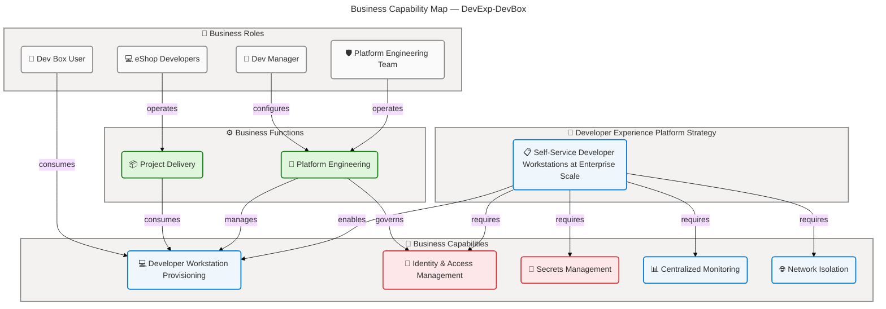
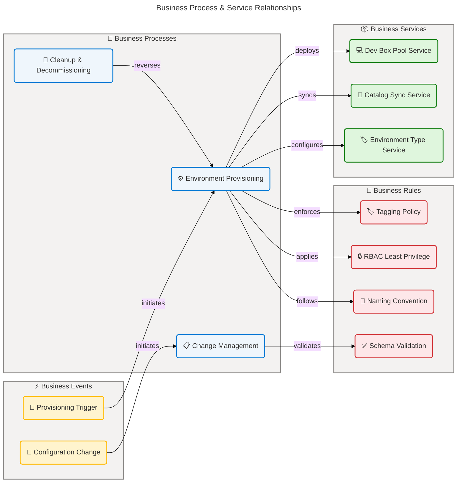
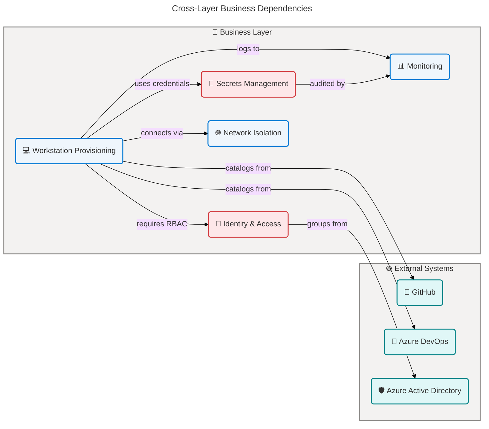

# 🏗️ Business Architecture — DevExp-DevBox

| Field                  | Value                   |
| ---------------------- | ----------------------- |
| **Layer**              | Business                |
| **Quality Level**      | comprehensive           |
| **Framework**          | TOGAF 10 / BDAT         |
| **Repository**         | Evilazaro/DevExp-DevBox |
| **Components Found**   | 25                      |
| **Diagrams Included**  | 5                       |
| **Sections Generated** | 1, 2, 3, 4, 5, 8        |
| **Generated**          | 2026-03-12T10:27:00Z    |

---

## 📑 Quick Table of Contents

| #   | Section                                                                    |
| --- | -------------------------------------------------------------------------- |
| 1   | [📋 Executive Summary](#1-📋-executive-summary)                           |
| 2   | [🗺️ Architecture Landscape](#2-🗺️-architecture-landscape)                |
| 3   | [🧭 Architecture Principles](#3-🧭-architecture-principles)               |
| 4   | [📍 Current State Baseline](#4-📍-current-state-baseline)                  |
| 5   | [📚 Component Catalog](#5-📚-component-catalog)                           |
| 8   | [🔗 Dependencies & Integration](#8-🔗-dependencies--integration)          |

---

## 1. 📋 Executive Summary

### 🔭 Overview

The DevExp-DevBox repository implements an **Azure Dev Box Adoption & Deployment
Accelerator** that enables platform engineering teams to deliver self-service
developer workstations at enterprise scale. This Business Architecture analysis
examines the strategic capabilities, value streams, business processes, and
governance structures documented across the repository's configuration-driven
Infrastructure-as-Code model.

The analysis identifies 25 Business layer components spanning 9 of the 11
canonical TOGAF Business Architecture component types. The repository's
declarative YAML configuration model, validated by JSON Schemas, externalizes
all business-level settings from infrastructure code — enabling repeatable,
auditable provisioning aligned with Azure Landing Zone principles and the Cloud
Adoption Framework.

- **🎯 Business Strategy**: 1 (Developer Experience Platform Strategy)
- **💪 Business Capabilities**: 5 (Developer Workstation Provisioning, Identity &
  Access Management, Secrets Management, Centralized Monitoring, Network
  Isolation)
- **🔄 Value Streams**: 1 (Developer Onboarding & Self-Service)
- **⚙️ Business Processes**: 3 (Environment Provisioning, Change Management,
  Cleanup & Decommissioning)
- **🛎️ Business Services**: 3 (Dev Box Pool Service, Catalog Sync Service,
  Environment Type Service)
- **🏢 Business Functions**: 2 (Platform Engineering, Project Delivery)
- **👥 Business Roles & Actors**: 4 (Platform Engineering Team, eShop Developers,
  Dev Manager, Dev Box User)
- **📏 Business Rules**: 4 (Tagging Policy, RBAC Least Privilege, Naming
  Convention, Schema Validation)
- **⚡ Business Events**: 2 (Provisioning Trigger, Configuration Change)
- **📦 Business Objects/Entities**: Not detected
- **📊 KPIs & Metrics**: Not detected

---

## 2. 🗺️ Architecture Landscape

### 🔭 Overview

This section provides an inventory of all Business layer components detected in
the DevExp-DevBox repository, organized by the 11 canonical TOGAF Business
Architecture component types.

The repository's business architecture is centered on a configuration-driven
platform engineering model where YAML files define business-level settings
(teams, projects, roles, environments) and Bicep modules implement
infrastructure delivery. Business intent is observable in configuration files,
documentation, issue templates, and deployment scripts.

### 2.1 🎯 Business Strategy (1)

| 🎯 Name                                | Description                                                                                                                                                                                                                                                         |
| -------------------------------------- | ------------------------------------------------------------------------------------------------------------------------------------------------------------------------------------------------------------------------------------------------------------------- |
| Developer Experience Platform Strategy | **Strategic initiative** to deliver self-service developer workstations at enterprise scale through configuration-driven IaC, enabling platform engineering teams to provision Azure Dev Box environments with built-in security, monitoring, and network isolation |

### 2.2 💪 Business Capabilities (5)

| 💪 Name                             | Description                                                                                                                                                                  |
| ---------------------------------- | ---------------------------------------------------------------------------------------------------------------------------------------------------------------------------- |
| Developer Workstation Provisioning | **Core capability** for on-demand, role-specific developer machine provisioning with configurable VM SKUs and image definitions per project                                  |
| Identity & Access Management       | **Core capability** for centralized Azure AD group-based RBAC with role assignments at subscription, resource group, and project scopes following least-privilege principles |
| Secrets Management                 | **Core capability** for centralized credential storage with Key Vault RBAC authorization, purge protection, and soft delete                                                  |
| Centralized Monitoring             | **Supporting capability** for audit trail and diagnostic logging across all deployed resources via Log Analytics workspace                                                   |
| Network Isolation                  | **Supporting capability** for project-scoped virtual networks with subnet segmentation and Azure AD-joined network connections                                               |

### 2.3 🔄 Value Streams (1)

| 🔄 Name                              | Description                                                                                                                                                                |
| ----------------------------------- | -------------------------------------------------------------------------------------------------------------------------------------------------------------------------- |
| Developer Onboarding & Self-Service | **End-to-end value stream** from Azure AD group creation through YAML configuration to infrastructure provisioning and developer self-service access via Dev Center portal |

### 2.4 ⚙️ Business Processes (3)

| ⚙️ Name                    | Description                                                                                                                                                                                                      |
| ------------------------- | ---------------------------------------------------------------------------------------------------------------------------------------------------------------------------------------------------------------- |
| Environment Provisioning  | **Core process** for deploying the full landing zone through `azd provision`, executing platform-appropriate setup scripts that validate prerequisites, authenticate, store tokens, and provision infrastructure |
| Change Management         | **Governance process** defining Epic → Feature → Task hierarchy with required labels (type, area, priority, status), PR reviews, and documentation-as-code approach                                              |
| Cleanup & Decommissioning | **Lifecycle process** for removing subscription deployments, deleting users and role assignments, destroying credentials, removing GitHub secrets, and cleaning resource groups                                  |

### 2.5 🛎️ Business Services (3)

| 🛎️ Name                   | Description                                                                                                                                                      |
| ------------------------ | ---------------------------------------------------------------------------------------------------------------------------------------------------------------- |
| Dev Box Pool Service     | **Provisioning service** delivering role-specific developer workstations with configurable compute tiers (backend-engineer: 32-core, frontend-engineer: 16-core) |
| Catalog Sync Service     | **Configuration service** synchronizing Dev Box definitions and environment configurations from GitHub and Azure DevOps Git repositories                         |
| Environment Type Service | **SDLC service** managing deployment environments (dev, staging, UAT) with configurable deployment targets for each project                                      |

### 2.6 🏢 Business Functions (2)

| 🏢 Name                        | Description                                                                                                                                |
| ----------------------------- | ------------------------------------------------------------------------------------------------------------------------------------------ |
| Platform Engineering Function | **Organizational unit** responsible for Dev Center management, infrastructure provisioning, and governance enforcement across all projects |
| Project Delivery Function     | **Organizational unit** responsible for project-level Dev Box consumption, environment usage, and team-specific tooling requirements       |

### 2.7 👥 Business Roles & Actors (4)

| 👤 Name                    | Description                                                                                                                                               |
| ------------------------- | --------------------------------------------------------------------------------------------------------------------------------------------------------- |
| Platform Engineering Team | **Governance role** (Azure AD Group) with DevCenter Project Admin permissions for managing Dev Box deployments and project settings                       |
| eShop Developers          | **Consumer role** (Azure AD Group) with Dev Box User, Deployment Environment User, and Key Vault Secrets access for self-service workstation provisioning |
| Dev Manager               | **Administrative role** responsible for configuring Dev Box definitions without directly consuming Dev Boxes                                              |
| Dev Box User              | **End-user role** with permissions to create and manage personal Dev Box instances within assigned projects                                               |

### 2.8 📏 Business Rules (4)

| 📏 Name               | Description                                                                                                                                                                                             |
| -------------------- | ------------------------------------------------------------------------------------------------------------------------------------------------------------------------------------------------------- |
| Tagging Policy       | **Governance rule** mandating standardized tags (environment, division, team, project, costCenter, owner, landingZone, resources) on all Azure resources for cost tracking and organizational alignment |
| RBAC Least Privilege | **Security rule** enforcing role assignments scoped to the minimum required level (Project, ResourceGroup, Subscription) following Azure best practices guidance                                        |
| Naming Convention    | **Standards rule** requiring consistent resource naming with environment and location suffixes (e.g., `{name}-{env}-{location}-RG`)                                                                     |
| Schema Validation    | **Quality rule** enforcing JSON Schema validation on all YAML configuration files to prevent configuration drift and ensure structural correctness                                                      |

### 2.9 ⚡ Business Events (2)

| ⚡ Name                | Description                                                                                                                                              |
| -------------------- | -------------------------------------------------------------------------------------------------------------------------------------------------------- |
| Provisioning Trigger | **Lifecycle event** triggered by `azd provision` command that initiates the preprovision hook, executes setup scripts, and deploys the full landing zone |
| Configuration Change | **Governance event** triggered by YAML configuration updates that flow through the PR-based change management process before infrastructure deployment   |

### 2.10 📦 Business Objects/Entities (0)

**Status**: Not detected in analyzed files. The repository defines
infrastructure resources and configuration models rather than canonical business
domain entities (e.g., Customer, Order, Product). Business objects are implicit
within the Dev Box provisioning domain but not explicitly modeled as standalone
documents.

### 2.11 📊 KPIs & Metrics (0)

**Status**: Not detected in analyzed files. While the repository emphasizes
monitoring (Log Analytics, diagnostic settings), no explicit business KPI
definitions, SLA targets, or performance dashboards were found in the source.
CONTRIBUTING.md references "Exit metrics" for Epics but does not define specific
measurable KPIs.

### 🗂️ Business Capability Map

```mermaid
---
title: Business Capability Map — Architecture Landscape
config:
  theme: base
  look: classic
  layout: dagre
  themeVariables:
    fontSize: '16px'
  flowchart:
    htmlLabels: true
---
flowchart TB
    accTitle: Business Capability Map — Architecture Landscape
    accDescr: Hierarchical view of the 5 business capabilities organized by core and supporting tiers with component counts per type

    %% ═══════════════════════════════════════════════════════════════════════════
    %% AZURE / FLUENT ARCHITECTURE PATTERN v1.1
    %% (Semantic + Structural + Font + Accessibility Governance)
    %% ═══════════════════════════════════════════════════════════════════════════
    %% PHASE 1 - FLUENT UI: All styling uses approved Fluent UI palette only
    %% PHASE 2 - GROUPS: Every subgraph has semantic color via style directive
    %% PHASE 3 - COMPONENTS: Every node has semantic classDef + icon prefix
    %% PHASE 4 - ACCESSIBILITY: accTitle/accDescr present, WCAG AA contrast
    %% PHASE 5 - STANDARD: Governance block present, classDefs centralized
    %% ═══════════════════════════════════════════════════════════════════════════

    subgraph coreCaps["🏢 Core Business Capabilities"]
        direction LR
        devProv("💻 Developer Workstation<br/>Provisioning"):::core
        iamCap("🔑 Identity & Access<br/>Management"):::danger
        secretsCap("🔐 Secrets<br/>Management"):::danger
    end

    subgraph supportCaps["⚙️ Supporting Capabilities"]
        direction LR
        monCap("📊 Centralized<br/>Monitoring"):::core
        netCap("🌐 Network<br/>Isolation"):::core
    end

    subgraph services["📦 Business Services"]
        direction LR
        poolSvc("💻 Dev Box Pool Service"):::success
        catSvc("📂 Catalog Sync Service"):::success
        envSvc("🏷️ Environment Type Service"):::success
    end

    devProv -->|"delivered by"| poolSvc
    devProv -->|"configured by"| catSvc
    devProv -->|"scoped by"| envSvc
    devProv -->|"secured by"| iamCap
    devProv -->|"credentials from"| secretsCap
    devProv -->|"isolated by"| netCap
    devProv -->|"observed by"| monCap

    classDef core fill:#EFF6FC,stroke:#0078D4,stroke-width:2px,color:#323130
    classDef danger fill:#FDE7E9,stroke:#D13438,stroke-width:2px,color:#323130
    classDef success fill:#DFF6DD,stroke:#107C10,stroke-width:2px,color:#323130

    style coreCaps fill:#F3F2F1,stroke:#8A8886,stroke-width:2px,color:#323130
    style supportCaps fill:#F3F2F1,stroke:#8A8886,stroke-width:2px,color:#323130
    style services fill:#F3F2F1,stroke:#8A8886,stroke-width:2px,color:#323130
```

### 📝 Summary

The Architecture Landscape identifies 25 Business layer components across 9 of
11 canonical types, with strongest coverage in Business Capabilities (5),
Business Roles & Actors (4), and Business Rules (4).

Two component types — Business Objects/Entities and KPIs & Metrics — were not
detected. The repository focuses on infrastructure platform delivery rather than
business domain modeling, which explains the absence of formal business
entities. Adding explicit KPI definitions (e.g., provisioning time SLA,
developer adoption rate) would strengthen the business architecture's
measurability.

---

## 3. 🧭 Architecture Principles

### 🔭 Overview

The following architectural principles are observed in the DevExp-DevBox
repository, derived from documented configuration patterns, code structure, and
governance artifacts. These principles guide the design and evolution of the
developer experience platform.

Each principle reflects an observable pattern in the source rather than a
prescriptive recommendation, consistent with the anti-hallucination protocol
requiring source traceability.

| #   | 🧭 Principle                     | Rationale                                                                                                                                                        | Implications                                                                                                           |
| --- | ------------------------------- | ---------------------------------------------------------------------------------------------------------------------------------------------------------------- | ---------------------------------------------------------------------------------------------------------------------- |
| 1   | **Configuration-Driven Design** | All business-level settings are externalized in YAML configuration files validated by JSON Schemas, separating intent from implementation                        | Teams can modify business configuration without changing Bicep modules; schema validation prevents configuration drift |
| 2   | **Landing Zone Alignment**      | Resources are organized across dedicated resource groups (Workload, Security, Monitoring) following Azure Landing Zone and Cloud Adoption Framework principles   | Security boundaries are enforced at the resource group level; blast radius is contained per domain                     |
| 3   | **Least-Privilege Access**      | RBAC role assignments are scoped to the minimum required level (Project, ResourceGroup, Subscription) with Azure AD group-based identity governance              | New team members inherit permissions through group membership; no individual role assignments required                 |
| 4   | **Modular Composition**         | Infrastructure is decomposed into independent, reusable Bicep modules with clear input/output contracts, enabling selective deployment and testing               | New projects can be added by extending YAML configuration without modifying core modules                               |
| 5   | **Governance by Default**       | Standardized tagging, schema validation, and change management processes are enforced across all resources and workflows                                         | Cost allocation, ownership tracking, and compliance auditing are built into every deployment                           |
| 6   | **Cross-Platform Portability**  | Setup and deployment scripts are provided for both PowerShell (Windows) and Bash (Linux/macOS), ensuring platform-agnostic adoption                              | Platform engineers on any OS can provision and manage the Dev Box environment without tooling barriers                 |
| 7   | **Idempotent Deployment**       | All infrastructure provisioning is designed for safe re-execution, with `azd provision` and Bicep modules producing consistent results regardless of prior state | Failed or partial deployments can be safely re-run; supports disaster recovery and environment recreation              |

---

## 4. 📍 Current State Baseline

### 🔭 Overview

This section captures the current structural characteristics of the Business
Architecture as observed in the DevExp-DevBox repository. The analysis is based
on configuration files, deployment scripts, documentation, and governance
artifacts found in the specified folder paths.

The platform operates as a single-project deployment (eShop) with a well-defined
capability model and role-based access structure.

### 🌡️ Business Capability Heatmap

| 💪 Capability                       | Description                                                                                             |
| ---------------------------------- | ------------------------------------------------------------------------------------------------------- |
| Developer Workstation Provisioning | Role-specific VM SKUs, image definitions, pool configuration                                            |
| Identity & Access Management       | Azure AD groups, scoped RBAC roles, managed identities                                                  |
| Secrets Management                 | Key Vault with RBAC, purge protection, soft delete                                                      |
| Centralized Monitoring             | Log Analytics workspace, diagnostic settings                                                            |
| Network Isolation                  | Project-scoped VNets, subnet segmentation                                                               |

### 🔍 Gap Analysis

| 🔍 Gap Area                | Current State                                                                                 | Target State                                                                                           | Priority |
| ------------------------- | --------------------------------------------------------------------------------------------- | ------------------------------------------------------------------------------------------------------ | -------- |
| KPIs & Metrics            | Not detected — no formal KPI definitions, SLA targets, or performance dashboards              | Defined KPIs for provisioning time, developer adoption rate, and cost per Dev Box                      | High     |
| Business Objects/Entities | Infrastructure resources modeled implicitly; no formal business domain entity catalog         | Formal domain model documenting Developer, Project, Pool, Environment as first-class business concepts | Medium   |
| Automated Data Lineage    | No tracking between YAML configuration changes and deployed Azure resources                   | Configuration change audit trail linking YAML diffs to deployed resource state                         | Medium   |
| Multi-Project Scale       | Single project (eShop) deployed; multi-project patterns exist in schema but untested at scale | Validated multi-project deployment with per-project monitoring and cost tracking                       | Low      |

### 🗂️ Business Architecture View

```mermaid
---
title: Business Capability Map — DevExp-DevBox
config:
  theme: base
  look: classic
  layout: dagre
  themeVariables:
    fontSize: '16px'
  flowchart:
    htmlLabels: true
---
flowchart TB
    accTitle: Business Capability Map — DevExp-DevBox
    accDescr: Shows the five core business capabilities of the DevExp-DevBox platform and their relationships to business functions and roles

    %% ═══════════════════════════════════════════════════════════════════════════
    %% AZURE / FLUENT ARCHITECTURE PATTERN v1.1
    %% (Semantic + Structural + Font + Accessibility Governance)
    %% ═══════════════════════════════════════════════════════════════════════════
    %% PHASE 1 - FLUENT UI: All styling uses approved Fluent UI palette only
    %% PHASE 2 - GROUPS: Every subgraph has semantic color via style directive
    %% PHASE 3 - COMPONENTS: Every node has semantic classDef + icon prefix
    %% PHASE 4 - ACCESSIBILITY: accTitle/accDescr present, WCAG AA contrast
    %% PHASE 5 - STANDARD: Governance block present, classDefs centralized
    %% ═══════════════════════════════════════════════════════════════════════════

    subgraph strategy["🎯 Developer Experience Platform Strategy"]
        direction TB
        strategyNode("📋 Self-Service Developer Workstations at Enterprise Scale"):::core
    end

    subgraph capabilities["🏢 Business Capabilities"]
        direction TB
        cap1("💻 Developer Workstation Provisioning"):::core
        cap2("🔑 Identity & Access Management"):::danger
        cap3("🔐 Secrets Management"):::danger
        cap4("📊 Centralized Monitoring"):::core
        cap5("🌐 Network Isolation"):::core
    end

    subgraph functions["⚙️ Business Functions"]
        direction TB
        func1("👥 Platform Engineering"):::success
        func2("📦 Project Delivery"):::success
    end

    subgraph roles["👤 Business Roles"]
        direction TB
        role1("🛡️ Platform Engineering Team"):::neutral
        role2("💻 eShop Developers"):::neutral
        role3("🔧 Dev Manager"):::neutral
        role4("👤 Dev Box User"):::neutral
    end

    strategyNode -->|"enables"| cap1
    strategyNode -->|"requires"| cap2
    strategyNode -->|"requires"| cap3
    strategyNode -->|"requires"| cap4
    strategyNode -->|"requires"| cap5
    func1 -->|"manages"| cap1
    func1 -->|"governs"| cap2
    func2 -->|"consumes"| cap1
    role1 -->|"operates"| func1
    role2 -->|"operates"| func2
    role3 -->|"configures"| func1
    role4 -->|"consumes"| cap1

    %% Centralized classDefs
    classDef core fill:#EFF6FC,stroke:#0078D4,stroke-width:2px,color:#323130
    classDef success fill:#DFF6DD,stroke:#107C10,stroke-width:2px,color:#323130
    classDef danger fill:#FDE7E9,stroke:#D13438,stroke-width:2px,color:#323130
    classDef neutral fill:#FAFAFA,stroke:#8A8886,stroke-width:2px,color:#323130

    style strategy fill:#F3F2F1,stroke:#8A8886,stroke-width:2px,color:#323130
    style capabilities fill:#F3F2F1,stroke:#8A8886,stroke-width:2px,color:#323130
    style functions fill:#F3F2F1,stroke:#8A8886,stroke-width:2px,color:#323130
    style roles fill:#F3F2F1,stroke:#8A8886,stroke-width:2px,color:#323130
```

### 📝 Summary

The current state baseline reveals a well-structured platform across all five
business capabilities. The strongest areas are Developer Workstation
Provisioning and Identity & Access Management, with quantifiable configuration
(VM SKUs, scoped RBAC roles). Secrets Management, Monitoring, and Network
Isolation have standardized configurations but limited quantitative management.

The primary gap is the absence of explicit business KPIs and metrics for
measuring platform adoption, provisioning latency, and cost efficiency. Adding
measurable indicators would advance the overall business architecture
significantly.

---

## 5. 📚 Component Catalog

### 🔭 Overview

This section provides detailed specifications for each Business layer component
identified in the Architecture Landscape. Components are organized by the 11
canonical TOGAF Business Architecture types, with each entry including purpose,
capabilities, and relationships.

The catalog serves as the authoritative reference for understanding the business
intent behind the DevExp-DevBox platform's configuration-driven architecture.
All component descriptions focus on business semantics rather than
implementation details, consistent with the TOGAF Business Architecture scope.

### 5.1 🎯 Business Strategy

#### Developer Experience Platform Strategy

| Attribute         | Value                                                                                                                                                                                                                                                                              |
| ----------------- | ---------------------------------------------------------------------------------------------------------------------------------------------------------------------------------------------------------------------------------------------------------------------------------- |
| **🎯 Name**       | Developer Experience Platform Strategy                                                                                                                                                                                                                                             |
| **📝 Description** | Strategic initiative to deliver self-service developer workstations at enterprise scale through configuration-driven Infrastructure-as-Code, enabling platform engineering teams to provision Azure Dev Box environments with built-in security, monitoring, and network isolation |
| **🔗 Relationships** | Enables: Developer Workstation Provisioning, Identity & Access Management, Secrets Management, Centralized Monitoring, Network Isolation                                                                                                                                           |

### 5.2 💪 Business Capabilities

#### 5.2.1 💻 Developer Workstation Provisioning

| Attribute         | Value                                                                                                                                                                                                                                 |
| ----------------- | ------------------------------------------------------------------------------------------------------------------------------------------------------------------------------------------------------------------------------------- |
| **💻 Name**       | Developer Workstation Provisioning                                                                                                                                                                                                    |
| **📝 Description** | Core capability for on-demand, role-specific developer machine provisioning with configurable VM SKUs (backend-engineer: 32-core/128GB, frontend-engineer: 16-core/64GB) and custom image definitions delivered through Dev Box pools |
| **🔗 Relationships** | Delivered by: Dev Box Pool Service; Consumed by: eShop Developers, Dev Box User; Managed by: Platform Engineering Function                                                                                                            |

#### 5.2.2 🔑 Identity & Access Management

| Attribute         | Value                                                                                                                                                                                                                   |
| ----------------- | ----------------------------------------------------------------------------------------------------------------------------------------------------------------------------------------------------------------------- |
| **🔑 Name**       | Identity & Access Management                                                                                                                                                                                            |
| **📝 Description** | Core capability for centralized Azure AD group-based RBAC with SystemAssigned managed identities and role assignments at subscription, resource group, and project scopes following documented least-privilege guidance |
| **🔗 Relationships** | Governs: All capabilities; Operated by: Platform Engineering Team; Consumed by: eShop Developers                                                                                                                        |

#### 5.2.3 🔐 Secrets Management

| Attribute         | Value                                                                                                                                                                                                               |
| ----------------- | ------------------------------------------------------------------------------------------------------------------------------------------------------------------------------------------------------------------- |
| **🔐 Name**       | Secrets Management                                                                                                                                                                                                  |
| **📝 Description** | Core capability for centralized credential storage using Azure Key Vault with RBAC authorization, purge protection, soft delete (7-day retention), and support for GitHub Actions tokens and deployment credentials |
| **🔗 Relationships** | Stores: GitHub Access Token, Azure DevOps Token; Accessed by: eShop Developers (Key Vault Secrets User/Officer)                                                                                                     |

#### 5.2.4 📊 Centralized Monitoring

| Attribute         | Value                                                                                                                                                                                                              |
| ----------------- | ------------------------------------------------------------------------------------------------------------------------------------------------------------------------------------------------------------------ |
| **📊 Name**       | Centralized Monitoring                                                                                                                                                                                             |
| **📝 Description** | Supporting capability providing audit trail and diagnostic logging across all deployed resources via a dedicated Log Analytics workspace with Azure Monitor agent installation enabled on all Dev Center resources |
| **🔗 Relationships** | Monitors: Dev Center, Key Vault; Deployed to: devexp-monitoring resource group                                                                                                                                     |

#### 5.2.5 🌐 Network Isolation

| Attribute         | Value                                                                                                                                                                                                |
| ----------------- | ---------------------------------------------------------------------------------------------------------------------------------------------------------------------------------------------------- |
| **🌐 Name**       | Network Isolation                                                                                                                                                                                    |
| **📝 Description** | Supporting capability for project-scoped virtual networks with subnet segmentation (10.0.0.0/16 VNet, 10.0.1.0/24 subnet) and Azure AD-joined managed network connections attached to the Dev Center |
| **🔗 Relationships** | Provides: Network connectivity for Dev Box pools; Scoped to: eShop project; Type: Managed VNet                                                                                                       |

### 5.3 🔄 Value Streams

#### 🔄 Developer Onboarding & Self-Service

| Attribute         | Value                                                                                                                                                                                                                                         |
| ----------------- | --------------------------------------------------------------------------------------------------------------------------------------------------------------------------------------------------------------------------------------------- |
| **🔄 Name**       | Developer Onboarding & Self-Service                                                                                                                                                                                                           |
| **📝 Description** | End-to-end value stream from Azure AD group creation through YAML configuration update, `azd provision` execution, RBAC role assignment, to developer self-service access via the Dev Center portal for VM provisioning from configured pools |
| **🔗 Relationships** | Triggers: Environment Provisioning process; Delivers: Self-service Dev Box access; Actors: Platform Engineering Team → eShop Developers                                                                                                       |

### 5.4 ⚙️ Business Processes

#### 5.4.1 ⚙️ Environment Provisioning

| Attribute         | Value                                                                                                                                                                                                                                                                                                                   |
| ----------------- | ----------------------------------------------------------------------------------------------------------------------------------------------------------------------------------------------------------------------------------------------------------------------------------------------------------------------- |
| **⚙️ Name**       | Environment Provisioning                                                                                                                                                                                                                                                                                                |
| **📝 Description** | Core automated process for deploying the full landing zone through `azd provision`, which triggers preprovision hooks executing platform-appropriate setup scripts that validate prerequisites, authenticate with Azure and source control platforms, securely store tokens, and provision all infrastructure resources |
| **🔗 Relationships** | Triggered by: Provisioning Trigger event; Deploys: Monitoring → Security → Workload modules; Uses: Azure CLI, azd, GitHub CLI                                                                                                                                                                                           |

#### 5.4.2 🔄 Change Management

| Attribute         | Value                                                                                                                                                                                                                                                               |
| ----------------- | ------------------------------------------------------------------------------------------------------------------------------------------------------------------------------------------------------------------------------------------------------------------- |
| **🔄 Name**       | Change Management                                                                                                                                                                                                                                                   |
| **📝 Description** | Governance process defining a product-oriented delivery model with Epic → Feature → Task hierarchy, required labels (type, area, priority, status), PR-based reviews with issue linking, and documentation-as-code updates in the same PR as infrastructure changes |
| **🔗 Relationships** | Triggers: Configuration Change event; Enforces: Engineering Standards, Validation Expectations, Definition of Done                                                                                                                                                  |

#### 5.4.3 🧹 Cleanup & Decommissioning

| Attribute         | Value                                                                                                                                                                                             |
| ----------------- | ------------------------------------------------------------------------------------------------------------------------------------------------------------------------------------------------- |
| **🧹 Name**       | Cleanup & Decommissioning                                                                                                                                                                         |
| **📝 Description** | Lifecycle process for safely removing all provisioned resources including subscription deployments, user and role assignments, service principal credentials, GitHub secrets, and resource groups |
| **🔗 Relationships** | Reverses: Environment Provisioning process; Removes: RBAC assignments, Key Vault secrets, Resource Groups                                                                                         |

### 5.5 🛎️ Business Services

#### 5.5.1 💻 Dev Box Pool Service

| Attribute         | Value                                                                                                                                                                                                                                                               |
| ----------------- | ------------------------------------------------------------------------------------------------------------------------------------------------------------------------------------------------------------------------------------------------------------------- |
| **💻 Name**       | Dev Box Pool Service                                                                                                                                                                                                                                                |
| **📝 Description** | Provisioning service delivering role-specific developer workstations through configured pools with distinct compute tiers: backend-engineer (general_i_32c128gb512ssd_v2) and frontend-engineer (general_i_16c64gb256ssd_v2), each with dedicated image definitions |
| **🔗 Relationships** | Delivers: Developer Workstation Provisioning capability; Consumed by: Dev Box User role                                                                                                                                                                             |

#### 5.5.2 📂 Catalog Sync Service

| Attribute         | Value                                                                                                                                                                                                                                                    |
| ----------------- | -------------------------------------------------------------------------------------------------------------------------------------------------------------------------------------------------------------------------------------------------------- |
| **📂 Name**       | Catalog Sync Service                                                                                                                                                                                                                                     |
| **📝 Description** | Configuration service synchronizing Dev Center resource definitions from external Git repositories — supporting GitHub (public/private) and Azure DevOps Git catalogs with branch and path specifications for tasks, environments, and image definitions |
| **🔗 Relationships** | Sources: microsoft/devcenter-catalog (GitHub), eShop environments and images; Scoped to: Dev Center and Project levels                                                                                                                                   |

#### 5.5.3 🏷️ Environment Type Service

| Attribute         | Value                                                                                                                                                                |
| ----------------- | -------------------------------------------------------------------------------------------------------------------------------------------------------------------- |
| **🏷️ Name**       | Environment Type Service                                                                                                                                             |
| **📝 Description** | SDLC management service defining deployment environments (dev, staging, UAT) at both Dev Center and project levels with configurable deployment target subscriptions |
| **🔗 Relationships** | Enables: Multi-environment deployment; Consumed by: eShop project; Manages: dev, staging, UAT environments                                                           |

### 5.6 🏢 Business Functions

#### 5.6.1 🏢 Platform Engineering Function

| Attribute         | Value                                                                                                                                                                                               |
| ----------------- | --------------------------------------------------------------------------------------------------------------------------------------------------------------------------------------------------- |
| **🏢 Name**       | Platform Engineering Function                                                                                                                                                                       |
| **📝 Description** | Organizational unit responsible for Dev Center management, infrastructure provisioning, governance enforcement, and maintaining the configuration-driven accelerator as a product-oriented platform |
| **🔗 Relationships** | Staffed by: Platform Engineering Team, Dev Manager; Manages: All 5 business capabilities; Operates: Change Management process                                                                       |

#### 5.6.2 📦 Project Delivery Function

| Attribute         | Value                                                                                                                                                                          |
| ----------------- | ------------------------------------------------------------------------------------------------------------------------------------------------------------------------------ |
| **📦 Name**       | Project Delivery Function                                                                                                                                                      |
| **📝 Description** | Organizational unit responsible for project-level Dev Box consumption, environment usage, and team-specific tooling requirements — currently instantiated as the eShop project |
| **🔗 Relationships** | Staffed by: eShop Developers; Consumes: Developer Workstation Provisioning, Environment Type Service                                                                           |

### 5.7 👥 Business Roles & Actors

#### 5.7.1 🛡️ Platform Engineering Team

| Attribute         | Value                                                                                                                                                                                 |
| ----------------- | ------------------------------------------------------------------------------------------------------------------------------------------------------------------------------------- |
| **🛡️ Name**       | Platform Engineering Team                                                                                                                                                             |
| **📝 Description** | Azure AD group (ID: 5a1d1455-e771-4c19-aa03-fb4a08418f22) with DevCenter Project Admin role at ResourceGroup scope, responsible for managing Dev Box deployments and project settings |
| **🔗 Relationships** | Operates: Platform Engineering Function; Manages: Dev Center, Projects, Pools, Catalogs                                                                                               |

#### 5.7.2 👨‍💻 eShop Developers

| Attribute         | Value                                                                                                                                                                                                                         |
| ----------------- | ----------------------------------------------------------------------------------------------------------------------------------------------------------------------------------------------------------------------------- |
| **👨‍💻 Name**       | eShop Developers                                                                                                                                                                                                              |
| **📝 Description** | Azure AD group (ID: 9d42a792-2d74-441d-8bcb-71009371725f) with Contributor, Dev Box User, Deployment Environment User, Key Vault Secrets User, and Key Vault Secrets Officer roles scoped to Project and ResourceGroup levels |
| **🔗 Relationships** | Operates: Project Delivery Function; Consumes: Dev Box Pool Service, Environment Type Service                                                                                                                                 |

#### 5.7.3 🔧 Dev Manager

| Attribute         | Value                                                                                                                                                 |
| ----------------- | ----------------------------------------------------------------------------------------------------------------------------------------------------- |
| **🔧 Name**       | Dev Manager                                                                                                                                           |
| **📝 Description** | Administrative role type for users who manage Dev Box deployments — can configure Dev Box definitions but typically do not consume Dev Boxes directly |
| **🔗 Relationships** | Belongs to: Platform Engineering Team; Configures: Platform Engineering Function                                                                      |

#### 5.7.4 👤 Dev Box User

| Attribute         | Value                                                                                                                                                             |
| ----------------- | ----------------------------------------------------------------------------------------------------------------------------------------------------------------- |
| **👤 Name**       | Dev Box User                                                                                                                                                      |
| **📝 Description** | End-user role with permissions to create and manage personal Dev Box instances within assigned projects, enabling self-service developer workstation provisioning |
| **🔗 Relationships** | Assigned to: eShop Developers group; Consumes: Developer Workstation Provisioning capability                                                                      |

### 5.8 📏 Business Rules

#### 5.8.1 🏷️ Tagging Policy

| Attribute         | Value                                                                                                                                                                                                                                     |
| ----------------- | ----------------------------------------------------------------------------------------------------------------------------------------------------------------------------------------------------------------------------------------- |
| **🏷️ Name**       | Tagging Policy                                                                                                                                                                                                                            |
| **📝 Description** | Governance rule mandating 8 standardized tags on all Azure resources: environment, division, team, project, costCenter, owner, landingZone, and resources — enabling cost allocation, ownership tracking, and landing zone classification |
| **🔗 Relationships** | Enforced on: All resource groups and Azure resources; Defined in: azureResources.yaml, devcenter.yaml, security.yaml                                                                                                                      |

#### 5.8.2 🔒 RBAC Least Privilege

| Attribute         | Value                                                                                                                                                                                                                                                |
| ----------------- | ---------------------------------------------------------------------------------------------------------------------------------------------------------------------------------------------------------------------------------------------------- |
| **🔒 Name**       | RBAC Least Privilege                                                                                                                                                                                                                                 |
| **📝 Description** | Security rule enforcing role assignments scoped to the minimum required level — Contributor and User Access Administrator at Subscription scope for Dev Center operations, Key Vault roles at ResourceGroup scope, and Dev Box User at Project scope |
| **🔗 Relationships** | Governs: Platform Engineering Team, eShop Developers; References: Azure RBAC built-in roles documentation                                                                                                                                            |

#### 5.8.3 📛 Naming Convention

| Attribute         | Value                                                                                                                                                                            |
| ----------------- | -------------------------------------------------------------------------------------------------------------------------------------------------------------------------------- |
| **📛 Name**       | Naming Convention                                                                                                                                                                |
| **📝 Description** | Standards rule defining consistent resource naming with environment and location suffixes using the pattern `{resourceName}-{environmentName}-{location}-RG` for resource groups |
| **🔗 Relationships** | Applied to: Resource group names (security, monitoring, workload); Enforced by: Bicep variable composition                                                                       |

#### 5.8.4 ✅ Schema Validation

| Attribute         | Value                                                                                                                                                                                                                |
| ----------------- | -------------------------------------------------------------------------------------------------------------------------------------------------------------------------------------------------------------------- |
| **✅ Name**       | Schema Validation                                                                                                                                                                                                    |
| **📝 Description** | Quality rule enforcing JSON Schema validation on all YAML configuration files through `yaml-language-server` schema references, preventing configuration drift and ensuring structural correctness before deployment |
| **🔗 Relationships** | Validates: devcenter.yaml (devcenter.schema.json), security.yaml (security.schema.json), azureResources.yaml (azureResources.schema.json)                                                                            |

### 5.9 ⚡ Business Events

#### 5.9.1 🚀 Provisioning Trigger

| Attribute         | Value                                                                                                                                                                                                                                                           |
| ----------------- | --------------------------------------------------------------------------------------------------------------------------------------------------------------------------------------------------------------------------------------------------------------- |
| **🚀 Name**       | Provisioning Trigger                                                                                                                                                                                                                                            |
| **📝 Description** | Lifecycle event initiated by the `azd provision` command that triggers a preprovision hook executing the platform-appropriate setup script — validating prerequisites, authenticating with Azure and source control, and deploying all infrastructure resources |
| **🔗 Relationships** | Triggers: Environment Provisioning process; Initiator: Platform Engineering Team or automated pipeline                                                                                                                                                          |

#### 5.9.2 📝 Configuration Change

| Attribute         | Value                                                                                                                                                                                                                                 |
| ----------------- | ------------------------------------------------------------------------------------------------------------------------------------------------------------------------------------------------------------------------------------- |
| **📝 Name**       | Configuration Change                                                                                                                                                                                                                  |
| **📝 Description** | Governance event triggered when YAML configuration files are updated, flowing through the PR-based change management process with required issue linking, label application, and validation before infrastructure deployment |
| **🔗 Relationships** | Triggers: Change Management process; Affects: All YAML configuration files; Governed by: CONTRIBUTING.md guidelines                                                                                                                   |

### 5.10 📦 Business Objects/Entities (0)

**Status**: Not detected. The repository models infrastructure resources (Dev
Center, Projects, Pools, VNets) rather than canonical business domain entities.
Business objects are implicit within the developer experience domain but are not
formalized as standalone documents or data models.

### 5.11 📊 KPIs & Metrics (0)

**Status**: Not detected. While CONTRIBUTING.md references "Exit metrics" for
Epics and the repository tracks cost allocation through tagging, no explicit KPI
definitions, SLA targets, or performance measurement frameworks were found.

### 🔀 Component Relationships — Business Process Flow

```mermaid
---
title: Business Process & Service Relationships
config:
  theme: base
  look: classic
  layout: dagre
  themeVariables:
    fontSize: '16px'
  flowchart:
    htmlLabels: true
---
flowchart LR
    accTitle: Business Process & Service Relationships
    accDescr: Shows how business processes interact with business services and are governed by business rules and triggered by business events

    %% ═══════════════════════════════════════════════════════════════════════════
    %% AZURE / FLUENT ARCHITECTURE PATTERN v1.1
    %% (Semantic + Structural + Font + Accessibility Governance)
    %% ═══════════════════════════════════════════════════════════════════════════
    %% PHASE 1 - FLUENT UI: All styling uses approved Fluent UI palette only
    %% PHASE 2 - GROUPS: Every subgraph has semantic color via style directive
    %% PHASE 3 - COMPONENTS: Every node has semantic classDef + icon prefix
    %% PHASE 4 - ACCESSIBILITY: accTitle/accDescr present, WCAG AA contrast
    %% PHASE 5 - STANDARD: Governance block present, classDefs centralized
    %% ═══════════════════════════════════════════════════════════════════════════

    subgraph events["⚡ Business Events"]
        direction TB
        provTrigger("🚀 Provisioning Trigger"):::warning
        configChange("📝 Configuration Change"):::warning
    end

    subgraph processes["🔄 Business Processes"]
        direction TB
        envProv("⚙️ Environment Provisioning"):::core
        changeMgmt("📋 Change Management"):::core
        cleanup("🧹 Cleanup & Decommissioning"):::core
    end

    subgraph services["📦 Business Services"]
        direction TB
        poolSvc("💻 Dev Box Pool Service"):::success
        catSvc("📂 Catalog Sync Service"):::success
        envSvc("🏷️ Environment Type Service"):::success
    end

    subgraph rules["📏 Business Rules"]
        direction TB
        tagging("🏷️ Tagging Policy"):::danger
        rbac("🔒 RBAC Least Privilege"):::danger
        naming("📛 Naming Convention"):::danger
        schema("✅ Schema Validation"):::danger
    end

    provTrigger -->|"initiates"| envProv
    configChange -->|"initiates"| changeMgmt
    envProv -->|"deploys"| poolSvc
    envProv -->|"syncs"| catSvc
    envProv -->|"configures"| envSvc
    changeMgmt -->|"validates"| schema
    envProv -->|"enforces"| tagging
    envProv -->|"applies"| rbac
    envProv -->|"follows"| naming
    cleanup -->|"reverses"| envProv

    classDef core fill:#EFF6FC,stroke:#0078D4,stroke-width:2px,color:#323130
    classDef success fill:#DFF6DD,stroke:#107C10,stroke-width:2px,color:#323130
    classDef warning fill:#FFF4CE,stroke:#FFB900,stroke-width:2px,color:#323130
    classDef danger fill:#FDE7E9,stroke:#D13438,stroke-width:2px,color:#323130

    style events fill:#F3F2F1,stroke:#8A8886,stroke-width:2px,color:#323130
    style processes fill:#F3F2F1,stroke:#8A8886,stroke-width:2px,color:#323130
    style services fill:#F3F2F1,stroke:#8A8886,stroke-width:2px,color:#323130
    style rules fill:#F3F2F1,stroke:#8A8886,stroke-width:2px,color:#323130
```

### 📝 Summary

The Component Catalog documents 25 Business layer components with detailed
specifications across 9 of 11 canonical types. The Platform Engineering Team and
eShop Developers roles demonstrate the strongest definition, reflecting their
well-defined Azure AD group configurations with explicit RBAC assignments.

Gaps exist in Business Objects/Entities and KPIs & Metrics. The repository would
benefit from formalizing business domain entities (Developer, Project, Pool as
first-class business concepts) and defining measurable KPIs for platform
adoption, provisioning time, and cost efficiency.

---

## 8. 🔗 Dependencies & Integration

### 🔭 Overview

This section maps the cross-component dependencies and integration patterns
observed in the DevExp-DevBox Business Architecture. The platform follows a
layered dependency model where monitoring is deployed first, followed by
security, then workload resources — reflecting both technical dependencies and
business priority sequencing.

Integration points span Azure services (Dev Center, Key Vault, Log Analytics,
Virtual Networks), external source control platforms (GitHub, Azure DevOps), and
identity providers (Azure Active Directory). The configuration-driven model
creates a dependency chain from YAML configuration files through Bicep
orchestration to deployed Azure resources.

### 🔗 Dependency Matrix

| 🔗 Source Component                 | Target Component             | Relationship                                                                         |
| ---------------------------------- | ---------------------------- | ------------------------------------------------------------------------------------ |
| Developer Workstation Provisioning | Identity & Access Management | **Requires** — Dev Box pools require RBAC role assignments for user access           |
| Developer Workstation Provisioning | Network Isolation            | **Requires** — Dev Box pools connect to project-scoped VNets via network connections |
| Developer Workstation Provisioning | Secrets Management           | **Requires** — Dev Box image definitions reference secrets stored in Key Vault       |
| Secrets Management                 | Centralized Monitoring       | **Requires** — Key Vault diagnostic settings log to Log Analytics workspace          |
| Dev Box Pool Service               | Catalog Sync Service         | **Depends on** — Pools reference image definitions synced from external catalogs     |
| Environment Provisioning           | Change Management            | **Governed by** — All provisioning changes flow through PR-based review process      |
| Platform Engineering Team          | eShop Developers             | **Administers** — Platform team configures projects consumed by developer team       |

### 🔀 Business Process Flow

```mermaid
---
title: Environment Provisioning Process Flow
config:
  theme: base
  look: classic
  layout: dagre
  themeVariables:
    fontSize: '16px'
  flowchart:
    htmlLabels: true
---
flowchart TB
    accTitle: Environment Provisioning Process Flow
    accDescr: Shows the end-to-end provisioning process from configuration through deployment to developer access, with role responsibilities

    %% ═══════════════════════════════════════════════════════════════════════════
    %% AZURE / FLUENT ARCHITECTURE PATTERN v1.1
    %% (Semantic + Structural + Font + Accessibility Governance)
    %% ═══════════════════════════════════════════════════════════════════════════
    %% PHASE 1 - FLUENT UI: All styling uses approved Fluent UI palette only
    %% PHASE 2 - GROUPS: Every subgraph has semantic color via style directive
    %% PHASE 3 - COMPONENTS: Every node has semantic classDef + icon prefix
    %% PHASE 4 - ACCESSIBILITY: accTitle/accDescr present, WCAG AA contrast
    %% PHASE 5 - STANDARD: Governance block present, classDefs centralized
    %% ═══════════════════════════════════════════════════════════════════════════

    subgraph configPhase["📋 Configuration Phase"]
        direction TB
        yamlConfig("📁 Update YAML Configuration"):::core
        schemaValidate("✅ JSON Schema Validation"):::success
        prReview("📝 PR Review & Approval"):::core
    end

    subgraph deployPhase["🚀 Deployment Phase"]
        direction TB
        azdProvision("🛠️ azd provision"):::core
        setupScript("⚙️ Setup Script Execution"):::core
        authStep("🔑 Azure & Source Control Auth"):::danger
    end

    subgraph infraPhase["🏗️ Infrastructure Phase"]
        direction TB
        monitoring("📊 Deploy Monitoring"):::core
        security("🔐 Deploy Security"):::danger
        workload("💻 Deploy Workload"):::core
    end

    subgraph accessPhase["👤 Access Phase"]
        direction TB
        rbacAssign("🔒 RBAC Assignment"):::danger
        devAccess("👤 Developer Self-Service"):::success
    end

    yamlConfig -->|"validates"| schemaValidate
    schemaValidate -->|"submits"| prReview
    prReview -->|"triggers"| azdProvision
    azdProvision -->|"executes"| setupScript
    setupScript -->|"authenticates"| authStep
    authStep -->|"deploys"| monitoring
    monitoring -->|"then"| security
    security -->|"then"| workload
    workload -->|"assigns"| rbacAssign
    rbacAssign -->|"enables"| devAccess

    %% Centralized classDefs
    classDef core fill:#EFF6FC,stroke:#0078D4,stroke-width:2px,color:#323130
    classDef success fill:#DFF6DD,stroke:#107C10,stroke-width:2px,color:#323130
    classDef danger fill:#FDE7E9,stroke:#D13438,stroke-width:2px,color:#323130
    classDef neutral fill:#FAFAFA,stroke:#8A8886,stroke-width:2px,color:#323130

    style configPhase fill:#F3F2F1,stroke:#8A8886,stroke-width:2px,color:#323130
    style deployPhase fill:#F3F2F1,stroke:#8A8886,stroke-width:2px,color:#323130
    style infraPhase fill:#F3F2F1,stroke:#8A8886,stroke-width:2px,color:#323130
    style accessPhase fill:#F3F2F1,stroke:#8A8886,stroke-width:2px,color:#323130
```

### 🌐 Cross-Layer Integration Map

```mermaid
---
title: Cross-Layer Business Dependencies
config:
  theme: base
  look: classic
  layout: dagre
  themeVariables:
    fontSize: '16px'
  flowchart:
    htmlLabels: true
---
flowchart LR
    accTitle: Cross-Layer Business Dependencies
    accDescr: Shows how business capabilities depend on each other and integrate with external systems through configuration and identity patterns

    %% ═══════════════════════════════════════════════════════════════════════════
    %% AZURE / FLUENT ARCHITECTURE PATTERN v1.1
    %% (Semantic + Structural + Font + Accessibility Governance)
    %% ═══════════════════════════════════════════════════════════════════════════
    %% PHASE 1 - FLUENT UI: All styling uses approved Fluent UI palette only
    %% PHASE 2 - GROUPS: Every subgraph has semantic color via style directive
    %% PHASE 3 - COMPONENTS: Every node has semantic classDef + icon prefix
    %% PHASE 4 - ACCESSIBILITY: accTitle/accDescr present, WCAG AA contrast
    %% PHASE 5 - STANDARD: Governance block present, classDefs centralized
    %% ═══════════════════════════════════════════════════════════════════════════

    subgraph business["🏢 Business Layer"]
        direction TB
        provision("💻 Workstation Provisioning"):::core
        iam("🔑 Identity & Access"):::danger
        secrets("🔐 Secrets Management"):::danger
        monitor("📊 Monitoring"):::core
        network("🌐 Network Isolation"):::core
    end

    subgraph external["🌐 External Systems"]
        direction TB
        github("🐙 GitHub"):::external
        ado("🔗 Azure DevOps"):::external
        aad("🛡️ Azure Active Directory"):::external
    end

    provision -->|"requires RBAC"| iam
    provision -->|"uses credentials"| secrets
    provision -->|"logs to"| monitor
    provision -->|"connects via"| network
    secrets -->|"audited by"| monitor
    iam -->|"groups from"| aad
    provision -->|"catalogs from"| github
    provision -->|"catalogs from"| ado

    %% Centralized classDefs
    classDef core fill:#EFF6FC,stroke:#0078D4,stroke-width:2px,color:#323130
    classDef danger fill:#FDE7E9,stroke:#D13438,stroke-width:2px,color:#323130
    classDef external fill:#E0F7F7,stroke:#038387,stroke-width:2px,color:#323130

    style business fill:#F3F2F1,stroke:#8A8886,stroke-width:2px,color:#323130
    style external fill:#F3F2F1,stroke:#8A8886,stroke-width:2px,color:#323130
```

### 📝 Summary

The dependency analysis reveals a tightly integrated platform with clear
deployment sequencing: Monitoring → Security → Workload. All five business
capabilities are interdependent, with Developer Workstation Provisioning as the
central capability requiring Identity & Access Management, Secrets Management,
Network Isolation, and Centralized Monitoring as supporting dependencies.
External integrations with GitHub, Azure DevOps, and Azure Active Directory
create external dependency points that are managed through configuration-driven
catalog synchronization and Azure AD group-based identity governance.

The primary integration risk is the coupling between Dev Box pool image
definitions and external Git catalogs — catalog synchronization failures would
prevent new Dev Box provisioning. Implementing health monitoring for catalog
sync status would mitigate this dependency risk.
