# Business Architecture — DevExp-DevBox

**Generated**: 2026-02-26T15:27:00Z  
**Quality Level**: comprehensive  
**Components Found**: 50  
**Average Confidence**: 0.87  
**Target Layer**: Business  
**Repository**: Evilazaro/DevExp-DevBox

---

## 1. Executive Summary

### Overview

The DevExp-DevBox repository implements a **production-ready Infrastructure as
Code accelerator** for deploying Microsoft Dev Box environments on Azure. This
Business Architecture analysis examines the strategic, organizational, and
operational components that define _what the business does_ — expressed through
YAML-driven configuration, modular Bicep templates, automated provisioning
workflows, and enterprise governance documentation.

The analysis identifies **50 Business layer components** across all 11 TOGAF
Business Architecture component types, spanning 30 source files. The repository
demonstrates a mature platform engineering capability model with five
infrastructure domains (Workload, Security, Identity, Connectivity, Management),
a product-oriented delivery model (Epics → Features → Tasks), and
configuration-as-code governance aligned with the Azure Cloud Adoption Framework
and Azure Landing Zone principles.

Strategic alignment is strong — the accelerator reduces manual Dev Box
provisioning from days to under 45 minutes, enforces organizational standards
for RBAC, tagging, and resource segregation, and provides cross-platform
automation (PowerShell 7+ and Bash). The business architecture maturity is
assessed at **Level 3–4 (Defined–Measured)**, with documented processes,
schema-validated configurations, and measurable exit criteria for delivery.

### Key Findings

| Metric                  | Value                        |
| ----------------------- | ---------------------------- |
| Total Components        | 50                           |
| Component Types Covered | 11 / 11                      |
| Average Confidence      | 0.87                         |
| Files Analyzed          | 30                           |
| Business Maturity       | Level 3–4 (Defined–Measured) |

| Component Type            | Count | Avg. Confidence |
| ------------------------- | ----- | --------------- |
| Business Strategy         | 5     | 0.91            |
| Business Capabilities     | 6     | 0.89            |
| Value Streams             | 4     | 0.85            |
| Business Processes        | 5     | 0.88            |
| Business Services         | 5     | 0.87            |
| Business Functions        | 5     | 0.90            |
| Business Roles & Actors   | 5     | 0.86            |
| Business Rules            | 5     | 0.84            |
| Business Events           | 4     | 0.82            |
| Business Objects/Entities | 3     | 0.88            |
| KPIs & Metrics            | 3     | 0.83            |

---

## 2. Architecture Landscape

### Overview

The Architecture Landscape organizes DevExp-DevBox business components across
three strategic domains aligned with Azure Landing Zone principles: **Workload
Domain** (Dev Center provisioning, project management, developer self-service),
**Security Domain** (secrets management, RBAC enforcement, compliance policies),
and **Management Domain** (centralized monitoring, observability, cost
attribution).

Each domain maintains clear separation of concerns through dedicated resource
groups, modular Bicep templates, and YAML configuration files validated by JSON
Schema. The business architecture is expressed implicitly through
configuration-as-code patterns rather than traditional business process
documents — strategy is documented in README.md and CONTRIBUTING.md,
capabilities are defined by feature modules, and business rules are codified as
schema constraints and parameter validations.

The following subsections catalog all 11 Business component types discovered
through source file analysis, with confidence scores, maturity levels, and
source traceability for each component.

### 2.1 Business Strategy (5)

| Name                            | Description                                                                                                              | Source                 | Confidence | Maturity     |
| ------------------------------- | ------------------------------------------------------------------------------------------------------------------------ | ---------------------- | ---------- | ------------ |
| Dev Box Acceleration Vision     | **Production-ready IaC accelerator** for deploying Microsoft Dev Box environments, eliminating manual provisioning       | `README.md:9-12`       | 0.95       | 4 - Measured |
| Deployment Time Reduction Goal  | **Strategic goal** to reduce Dev Box provisioning from days to under 45 minutes while enforcing organizational standards | `README.md:22-27`      | 0.93       | 4 - Measured |
| Azure Landing Zone Alignment    | **Architectural strategy** following Azure Landing Zone principles for resource segregation, RBAC, and cost attribution  | `README.md:40-48`      | 0.92       | 4 - Measured |
| Product-Oriented Delivery Model | **Delivery strategy** using Epics→Features→Tasks hierarchy where Epics deliver **measurable outcomes** (capabilities)    | `CONTRIBUTING.md:8-13` | 0.88       | 3 - Defined  |
| ContosoDevExp Product Identity  | **Brand/product identity** establishing named product "ContosoDevExp" across deployment platforms                        | `azure.yaml:7`         | 0.85       | 3 - Defined  |

### 2.2 Business Capabilities (6)

| Name                      | Description                                                                                                               | Source          | Confidence | Maturity     |
| ------------------------- | ------------------------------------------------------------------------------------------------------------------------- | --------------- | ---------- | ------------ |
| Dev Center Provisioning   | **Core capability** deploying Azure Dev Center with catalog sync, hosted networking, and monitoring agent                 | `README.md:379` | 0.92       | 4 - Measured |
| Multi-Project Support     | **Organizational capability** creating isolated projects with team-specific pools, catalogs, and environment types        | `README.md:380` | 0.90       | 4 - Measured |
| Key Vault Security        | **Security capability** provisioning Azure Key Vault with purge protection, soft delete, and RBAC authorization           | `README.md:384` | 0.88       | 4 - Measured |
| RBAC Management           | **Identity capability** assigning least-privilege roles via managed identities following principle of least privilege     | `README.md:385` | 0.88       | 4 - Measured |
| YAML-Driven Configuration | **Platform capability** externalizing all settings to validated YAML files with JSON Schema enforcement                   | `README.md:388` | 0.90       | 4 - Measured |
| Cross-Platform Automation | **Automation capability** providing PowerShell and Bash setup scripts with authentication validation and token management | `README.md:389` | 0.87       | 3 - Defined  |

### 2.3 Value Streams (4)

| Name                            | Description                                                                                                   | Source              | Confidence | Maturity     |
| ------------------------------- | ------------------------------------------------------------------------------------------------------------- | ------------------- | ---------- | ------------ |
| Platform Engineer Onboarding    | **End-to-end flow** from repository clone to fully provisioned Dev Box environment in under 45 minutes        | `README.md:152-165` | 0.88       | 3 - Defined  |
| Automated Provisioning Pipeline | **5-step deployment flow**: validate CLI → verify auth → retrieve token → init azd → provision infrastructure | `README.md:210-240` | 0.90       | 4 - Measured |
| Configuration Change Lifecycle  | **Change management flow** from YAML modification to redeployment producing updated topology                  | `README.md:280-300` | 0.82       | 3 - Defined  |
| Infrastructure Teardown         | **Cleanup lifecycle** using cleanSetUp.ps1 to remove deployments, credentials, secrets, and resource groups   | `README.md:300-310` | 0.80       | 3 - Defined  |

### 2.4 Business Processes (5)

| Name                            | Description                                                                                                 | Source                   | Confidence | Maturity     |
| ------------------------------- | ----------------------------------------------------------------------------------------------------------- | ------------------------ | ---------- | ------------ |
| Environment Setup (Windows)     | **Sequential orchestration** of validation, authentication, initialization, and provisioning via PowerShell | `setUp.ps1:633-755`      | 0.92       | 4 - Measured |
| Environment Setup (Linux/macOS) | **Cross-platform process** mirroring Windows setup for Bash-based environments                              | `setUp.sh:600-688`       | 0.90       | 4 - Measured |
| Infrastructure Cleanup          | **5-phase teardown process**: deployments → users/roles → credentials → GitHub secrets → resource groups    | `cleanSetUp.ps1:220-300` | 0.88       | 3 - Defined  |
| Contribution Workflow           | **Branch-based process**: branch creation → PR submission → review → validation → merge                     | `CONTRIBUTING.md:34-52`  | 0.85       | 3 - Defined  |
| Issue Lifecycle Management      | **4-stage state machine**: `status:triage` → `status:ready` → `status:in-progress` → `status:done`          | `CONTRIBUTING.md:15-32`  | 0.83       | 3 - Defined  |

### 2.5 Business Services (5)

| Name                        | Description                                                                                         | Source                                           | Confidence | Maturity     |
| --------------------------- | --------------------------------------------------------------------------------------------------- | ------------------------------------------------ | ---------- | ------------ |
| Dev Center Platform Service | **Central platform service** hosting all projects, pools, catalogs, and environment types           | `infra/settings/workload/devcenter.yaml:12-16`   | 0.92       | 4 - Measured |
| Secrets Management Service  | **Centralized credential storage** via Azure Key Vault with purge protection, soft delete, and RBAC | `infra/settings/security/security.yaml:15-30`    | 0.90       | 4 - Measured |
| Centralized Logging Service | **Telemetry aggregation** via Log Analytics workspace with AzureActivity solution                   | `src/management/logAnalytics.bicep:38-50`        | 0.85       | 3 - Defined  |
| Role-Specific Dev Box Pools | **Differentiated workstation tiers** for backend (32-core) vs. frontend (16-core) engineers         | `infra/settings/workload/devcenter.yaml:131-140` | 0.85       | 3 - Defined  |
| Pre-Built Task Catalog      | **Shared service catalog** providing reusable Dev Box customization tasks from Microsoft            | `infra/settings/workload/devcenter.yaml:68-74`   | 0.83       | 3 - Defined  |

### 2.6 Business Functions (5)

| Name                       | Description                                                                                              | Source                                           | Confidence | Maturity     |
| -------------------------- | -------------------------------------------------------------------------------------------------------- | ------------------------------------------------ | ---------- | ------------ |
| Workload Function          | **Core platform delivery** — Dev Center provisioning, project management, catalog and pool orchestration | `src/workload/workload.bicep:1-6`                | 0.93       | 4 - Measured |
| Security Function          | **Security policy enforcement** — Key Vault provisioning, secret management, purge protection            | `src/security/security.bicep:1-18`               | 0.92       | 4 - Measured |
| Identity & Access Function | **RBAC provisioning** at subscription, resource group, project, and org levels via 6 Bicep modules       | `src/identity/devCenterRoleAssignment.bicep:1-*` | 0.90       | 4 - Measured |
| Connectivity Function      | **Network provisioning** — VNet management, subnet allocation, DevCenter network attachments             | `src/connectivity/connectivity.bicep:1-15`       | 0.88       | 3 - Defined  |
| Management Function        | **Observability and monitoring** — Log Analytics workspace, diagnostic settings, activity logging        | `src/management/logAnalytics.bicep:1-5`          | 0.87       | 3 - Defined  |

### 2.7 Business Roles & Actors (5)

| Name                      | Description                                                                                                                | Source                                           | Confidence | Maturity     |
| ------------------------- | -------------------------------------------------------------------------------------------------------------------------- | ------------------------------------------------ | ---------- | ------------ |
| Platform Engineer         | **Primary actor** who executes setup, configures topology, and manages Dev Box deployments end-to-end                      | `README.md:64`                                   | 0.90       | 4 - Measured |
| Dev Manager               | **Organizational role** assigned to Platform Engineering Team for managing Dev Box deployments via DevCenter Project Admin | `infra/settings/workload/devcenter.yaml:42-57`   | 0.88       | 3 - Defined  |
| eShop Developer           | **End-user role** consuming Dev Boxes with Contributor, Dev Box User, and Deployment Environment User permissions          | `infra/settings/workload/devcenter.yaml:101-106` | 0.87       | 3 - Defined  |
| DevCenter System Identity | **Machine identity** with 4 RBAC role assignments (Contributor, User Access Admin, Key Vault Secrets User/Officer)         | `infra/settings/workload/devcenter.yaml:33-40`   | 0.85       | 4 - Measured |
| CI/CD Service Principal   | **Automation identity** — GitHub Actions enterprise app for continuous deployment (ContosoDevEx)                           | `cleanSetUp.ps1:23-25`                           | 0.80       | 3 - Defined  |

### 2.8 Business Rules (5)

| Name                             | Description                                                                                                             | Source                                                                 | Confidence | Maturity     |
| -------------------------------- | ----------------------------------------------------------------------------------------------------------------------- | ---------------------------------------------------------------------- | ---------- | ------------ |
| Region Restriction Policy        | **Deployment rule** restricting provisioning to 16 approved Azure regions via Bicep `@allowed` constraint               | `infra/main.bicep:4-20`                                                | 0.90       | 4 - Measured |
| Resource Naming Standard         | **Naming rule** requiring resource group names to match `^[a-zA-Z0-9._-]+$` pattern with max 90 characters              | `infra/settings/resourceOrganization/azureResources.schema.json:29-38` | 0.88       | 4 - Measured |
| Key Vault Security Policy        | **Security rule** mandating purge protection, soft delete, and RBAC authorization on all Key Vault instances            | `infra/settings/security/security.yaml:23-26`                          | 0.87       | 4 - Measured |
| IaC Module Engineering Standards | **Engineering rule** requiring all Bicep modules to be parameterized, idempotent, and reusable with no embedded secrets | `CONTRIBUTING.md:54-62`                                                | 0.82       | 3 - Defined  |
| Issue Governance Rule            | **Process rule** mandating Type, Area, Priority, and Status labels on every issue with parent-child traceability        | `CONTRIBUTING.md:20-28`                                                | 0.78       | 3 - Defined  |

### 2.9 Business Events (4)

| Name                     | Description                                                                                                 | Source                                      | Confidence | Maturity     |
| ------------------------ | ----------------------------------------------------------------------------------------------------------- | ------------------------------------------- | ---------- | ------------ |
| Pre-Provisioning Trigger | **Lifecycle hook** fired before `azd provision` begins, executing setup scripts for prerequisite validation | `azure.yaml:9`                              | 0.88       | 4 - Measured |
| Catalog Sync Event       | **Scheduled synchronization** of catalog items from Git repositories to keep Dev Box configurations current | `infra/settings/workload/devcenter.yaml:14` | 0.83       | 3 - Defined  |
| Issue State Transition   | **Workflow event** — 4 state-change events in the issue lifecycle (triage → ready → in-progress → done)     | `CONTRIBUTING.md:15-18`                     | 0.78       | 3 - Defined  |
| Diagnostic Log Emission  | **Continuous event** — metric and log forwarding from Dev Center and Key Vault to Log Analytics             | `src/workload/core/devCenter.bicep:190-210` | 0.77       | 3 - Defined  |

### 2.10 Business Objects/Entities (3)

| Name             | Description                                                                                                              | Source                                         | Confidence | Maturity     |
| ---------------- | ------------------------------------------------------------------------------------------------------------------------ | ---------------------------------------------- | ---------- | ------------ |
| Dev Center       | **Central platform entity** hosting all projects, pools, catalogs, and environment types — the primary domain aggregate  | `infra/settings/workload/devcenter.yaml:12`    | 0.95       | 4 - Measured |
| Project          | **Organizational unit** within Dev Center representing a team/workstream (e.g., eShop) with own network, identity, pools | `infra/settings/workload/devcenter.yaml:86-88` | 0.92       | 4 - Measured |
| Environment Type | **SDLC stage definition** representing lifecycle environments (dev, staging, UAT) with deployment targets                | `infra/settings/workload/devcenter.yaml:76-83` | 0.88       | 3 - Defined  |

### 2.11 KPIs & Metrics (3)

| Name                   | Description                                                                                                      | Source                   | Confidence | Maturity     |
| ---------------------- | ---------------------------------------------------------------------------------------------------------------- | ------------------------ | ---------- | ------------ |
| Deployment Time Target | **Performance KPI**: reduce end-to-end provisioning from days to **under 45 minutes** (>90% reduction)           | `README.md:22-25`        | 0.90       | 4 - Measured |
| Epic Exit Metrics      | **Delivery KPI**: measurable criteria required for Epic completion — "exit metrics met or deviations documented" | `CONTRIBUTING.md:96-100` | 0.80       | 3 - Defined  |
| Smoke Test Readiness   | **Validation KPI**: 4 categories — platform admin flow, developer flow, networking/DNS, diagnostics emitting     | `CONTRIBUTING.md:80-84`  | 0.78       | 3 - Defined  |

### Business Capability Map

```mermaid
---
title: DevExp-DevBox Business Capability Map
config:
  theme: base
  look: classic
  layout: dagre
  themeVariables:
    fontSize: '16px'
  flowchart:
    htmlLabels: true
---
flowchart TB
    accTitle: DevExp-DevBox Business Capability Map
    accDescr: Shows 6 core business capabilities with maturity levels and dependencies across the Dev Box accelerator platform

    %% ═══════════════════════════════════════════════════════════════════════════
    %% AZURE / FLUENT ARCHITECTURE PATTERN v1.1
    %% (Semantic + Structural + Font + Accessibility Governance)
    %% ═══════════════════════════════════════════════════════════════════════════
    %% PHASE 1 - STRUCTURAL: Direction explicit, flat topology, nesting ≤ 3
    %% PHASE 2 - SEMANTIC: Colors justified, max 5 semantic classes, neutral-first
    %% PHASE 3 - FONT: Dark text on light backgrounds, contrast ≥ 4.5:1
    %% PHASE 4 - ACCESSIBILITY: accTitle/accDescr present, icons on all nodes
    %% PHASE 5 - STANDARD: Governance block present, classDefs centralized
    %% ═══════════════════════════════════════════════════════════════════════════

    cap1["📊 Dev Center Provisioning<br/>Maturity: 4 - Measured"]:::success
    cap2["📊 Multi-Project Support<br/>Maturity: 4 - Measured"]:::success
    cap3["📊 Key Vault Security<br/>Maturity: 4 - Measured"]:::success
    cap4["📊 RBAC Management<br/>Maturity: 4 - Measured"]:::success
    cap5["📊 YAML-Driven Configuration<br/>Maturity: 4 - Measured"]:::success
    cap6["📊 Cross-Platform Automation<br/>Maturity: 3 - Defined"]:::warning

    cap1 --> cap2
    cap1 --> cap3
    cap3 --> cap4
    cap5 --> cap1
    cap5 --> cap2
    cap6 --> cap1

    classDef success fill:#DFF6DD,stroke:#107C10,stroke-width:2px,color:#0B6A0B
    classDef warning fill:#FFF4CE,stroke:#FFB900,stroke-width:2px,color:#986F0B
    classDef danger fill:#FDE7E9,stroke:#E81123,stroke-width:2px,color:#A4262C
```



### Summary

The Architecture Landscape identifies **50 components** across all 11 TOGAF
Business Architecture component types. The repository demonstrates a mature,
governance-first platform engineering approach with clear separation between
workload, security, and management domains. Business Strategy and Capabilities
show the highest maturity (Level 4), while Events and KPIs represent areas where
additional formalization could elevate governance maturity. The use of JSON
Schema validation, YAML configuration, and modular Bicep templates constitutes a
well-structured configuration-as-code pattern uncommon in many IaC repositories.

---

## 3. Architecture Principles

### Overview

The DevExp-DevBox Business Architecture is governed by a set of design
principles derived from the Azure Cloud Adoption Framework, Azure Landing Zone
guidance, and the Microsoft Dev Box Deployment Guide. These principles are
explicitly documented in the repository's README.md and CONTRIBUTING.md and are
enforced through schema constraints, parameter validation, and modular template
design.

The principles prioritize **separation of concerns**, **least-privilege
access**, **configuration externalization**, and **idempotent operations** —
establishing a governance foundation that supports enterprise-scale Dev Box
deployments across multiple teams and projects.

### Principle 1: Separation of Concerns by Function

- **Statement**: Infrastructure resources MUST be segregated into distinct
  resource groups by function (Security, Monitoring, Workload)
- **Rationale**: Enables independent lifecycle management, granular RBAC, and
  clear cost attribution
- **Source**: `README.md:40-48`, `infra/main.bicep:60-90`
- **Implications**: Each resource group has its own tags, RBAC scope, and
  deployment module

### Principle 2: Configuration-as-Code

- **Statement**: All deployment settings MUST be externalized to validated YAML
  configuration files, not hard-coded in infrastructure templates
- **Rationale**: Enables repeatable deployments across environments (dev,
  staging, UAT) without modifying Bicep modules
- **Source**: `README.md:28-35`, `infra/settings/workload/devcenter.yaml:1-*`
- **Implications**: Changes to topology require YAML edits, not code changes;
  JSON Schema enforces validation at design time

### Principle 3: Least-Privilege Access

- **Statement**: RBAC roles MUST follow the principle of least privilege,
  assigning minimum permissions required for each role
- **Rationale**: Reduces blast radius of compromised identities and aligns with
  Microsoft's organizational roles guidance
- **Source**: `infra/settings/workload/devcenter.yaml:33-57`,
  `README.md:420-430`
- **Implications**: Dev Managers get Project Admin scope; Developers get Dev Box
  User and Environment User; System identities get scoped Key Vault access

### Principle 4: Idempotent and Parameterized Operations

- **Statement**: All Bicep modules and automation scripts MUST be idempotent,
  parameterized, and reusable across environments
- **Rationale**: Supports safe re-runs, zero-downtime updates, and consistent
  deployments across SDLC stages
- **Source**: `CONTRIBUTING.md:54-68`
- **Implications**: Scripts are designed for safe re-execution; modules accept
  parameters rather than hard-coded values

### Principle 5: Schema-Validated Governance

- **Statement**: Every YAML configuration file MUST be validated against a
  corresponding JSON Schema before deployment
- **Rationale**: Catches configuration errors at design time rather than
  deployment time, reducing provisioning failures
- **Source**: `infra/settings/workload/devcenter.schema.json:1-*`,
  `infra/settings/security/security.schema.json:1-*`
- **Implications**: Schema files define naming patterns, enumerations, and
  constraints that enforce organizational standards

---

## 4. Current State Baseline

### Overview

The current state of the DevExp-DevBox Business Architecture reflects a **Level
3–4 maturity (Defined–Measured)** platform engineering organization. Core
capabilities (Dev Center Provisioning, Multi-Project Support, RBAC Management)
are fully documented, schema-validated, and supported by automated provisioning
workflows. The repository demonstrates production readiness with cross-platform
automation, comprehensive cleanup processes, and structured contribution
workflows.

The architecture follows Azure Landing Zone principles with three resource
groups (Security, Monitoring, Workload), five infrastructure domains, and a
hierarchical role model (Platform Engineer → Dev Manager → Developer).
Configuration is externalized to YAML files validated by JSON Schema, enabling
environment-specific deployments without modifying infrastructure templates.

Key strengths include codified best practices from Microsoft's Dev Box
Deployment Guide, measurable deployment time targets (under 45 minutes), and a
product-oriented delivery model with explicit exit criteria. The primary gaps
are the absence of formal KPI dashboards, limited automated testing beyond smoke
tests, and no explicit business continuity or disaster recovery planning.

### Maturity Assessment

| Capability                | Current Maturity | Target Maturity | Gap                                  |
| ------------------------- | ---------------- | --------------- | ------------------------------------ |
| Dev Center Provisioning   | 4 - Measured     | 5 - Optimized   | Automated regression testing         |
| Multi-Project Support     | 4 - Measured     | 5 - Optimized   | Multi-tenant governance              |
| Key Vault Security        | 4 - Measured     | 4 - Measured    | At target                            |
| RBAC Management           | 4 - Measured     | 5 - Optimized   | Automated access reviews             |
| YAML-Driven Configuration | 4 - Measured     | 5 - Optimized   | Drift detection                      |
| Cross-Platform Automation | 3 - Defined      | 4 - Measured    | Automated testing, CI/CD integration |

### Architecture Baseline Diagram

```mermaid
---
title: DevExp-DevBox Current State Architecture
config:
  theme: base
  look: classic
  layout: dagre
  themeVariables:
    fontSize: '16px'
  flowchart:
    htmlLabels: true
---
flowchart TB
    accTitle: DevExp-DevBox Current State Business Architecture
    accDescr: Shows the five infrastructure domains, three resource groups, and key business actors in the current state architecture

    %% ═══════════════════════════════════════════════════════════════════════════
    %% AZURE / FLUENT ARCHITECTURE PATTERN v1.1
    %% ═══════════════════════════════════════════════════════════════════════════

    subgraph Strategy ["🎯 Strategy Layer"]
        S1["📋 Dev Box Acceleration<br/>Vision"]:::core
        S2["⏱️ 45-Min Deployment<br/>Target"]:::core
        S3["🏢 Azure Landing Zone<br/>Alignment"]:::core
    end
    style Strategy fill:#E8DFEC,stroke:#8764B8,stroke-width:2px,color:#4A2D73

    subgraph Domains ["⚙️ Five Infrastructure Domains"]
        D1["🖥️ Workload"]:::core
        D2["🔐 Security"]:::warning
        D3["🔑 Identity"]:::warning
        D4["🔗 Connectivity"]:::neutral
        D5["📈 Management"]:::neutral
    end
    style Domains fill:#DEECF9,stroke:#0078D4,stroke-width:2px,color:#004578

    subgraph Actors ["👥 Business Actors"]
        A1["👤 Platform Engineer"]:::external
        A2["👤 Dev Manager"]:::external
        A3["👤 Developer"]:::external
    end
    style Actors fill:#F3F2F1,stroke:#605E5C,stroke-width:2px,color:#323130

    S1 --> D1
    S2 --> D1
    S3 --> D2
    S3 --> D3
    A1 --> D1
    A1 --> D2
    A2 --> D1
    A3 --> D1
    D1 --> D4
    D2 --> D5

    classDef core fill:#DEECF9,stroke:#0078D4,stroke-width:2px,color:#004578
    classDef warning fill:#FFF4CE,stroke:#FFB900,stroke-width:2px,color:#986F0B
    classDef neutral fill:#F3F2F1,stroke:#605E5C,stroke-width:2px,color:#323130
    classDef external fill:#DFF6DD,stroke:#107C10,stroke-width:2px,color:#0B6A0B
```



### Summary

The current state baseline confirms DevExp-DevBox operates at **Level 3–4
maturity** with strong fundamentals in configuration-as-code, RBAC governance,
and cross-platform automation. The primary gaps — automated testing, KPI
dashboards, and drift detection — represent opportunities to advance to Level 5
(Optimized). The architecture's modular design and schema-validated
configuration provide a solid foundation for continuous improvement.

---

## 5. Component Catalog

### Overview

The Component Catalog provides detailed specifications for each of the 50
identified Business Architecture components, organized by the 11 TOGAF component
types. This section expands on the summary tables in Section 2 with additional
context on relationships, dependencies, maturity evidence, and implementation
patterns. Where no additional detail is available beyond the inventory, this is
stated explicitly.

Each specification includes source traceability, confidence scoring rationale,
and maturity-level evidence derived directly from source file analysis.

### 5.1 Business Strategy Specifications

This subsection documents the strategic direction and goals identified from
repository documentation. Five strategy components were found with an average
confidence of 0.91, reflecting explicit documentation in README.md and
CONTRIBUTING.md.

#### 5.1.1 Dev Box Acceleration Vision

| Attribute       | Value                                                                                 |
| --------------- | ------------------------------------------------------------------------------------- |
| **Name**        | Dev Box Acceleration Vision                                                           |
| **Type**        | Strategic Vision                                                                      |
| **Description** | Production-ready IaC accelerator eliminating manual, error-prone Dev Box provisioning |
| **Owner**       | Platform Engineering Team (Contoso)                                                   |
| **Maturity**    | 4 - Measured                                                                          |
| **Source**      | `README.md:9-12`                                                                      |
| **Confidence**  | 0.95                                                                                  |

**Strategic Context**: The vision directly addresses the pain point of manual
Azure portal configuration, positioning the accelerator as the standard approach
for enterprise Dev Box deployment.

#### 5.1.2 Deployment Time Reduction Goal

| Attribute       | Value                                                                                    |
| --------------- | ---------------------------------------------------------------------------------------- |
| **Name**        | Deployment Time Reduction Goal                                                           |
| **Type**        | Measurable Objective                                                                     |
| **Description** | Reduce provisioning from days of manual configuration to under 45 minutes via automation |
| **Baseline**    | Days (manual Azure portal)                                                               |
| **Target**      | < 45 minutes (automated)                                                                 |
| **Maturity**    | 4 - Measured                                                                             |
| **Source**      | `README.md:22-27`                                                                        |
| **Confidence**  | 0.93                                                                                     |

#### 5.1.3 Azure Landing Zone Alignment

| Attribute       | Value                                                                                     |
| --------------- | ----------------------------------------------------------------------------------------- |
| **Name**        | Azure Landing Zone Alignment                                                              |
| **Type**        | Architectural Strategy                                                                    |
| **Description** | Follow Azure Landing Zone principles for resource segregation, RBAC, and cost attribution |
| **Framework**   | Azure Cloud Adoption Framework                                                            |
| **Maturity**    | 4 - Measured                                                                              |
| **Source**      | `README.md:40-48`                                                                         |
| **Confidence**  | 0.92                                                                                      |

#### 5.1.4 Product-Oriented Delivery Model

| Attribute       | Value                                                                                                       |
| --------------- | ----------------------------------------------------------------------------------------------------------- |
| **Name**        | Product-Oriented Delivery Model                                                                             |
| **Type**        | Delivery Strategy                                                                                           |
| **Description** | Epics deliver measurable outcomes; Features deliver testable deliverables; Tasks are small verifiable units |
| **Maturity**    | 3 - Defined                                                                                                 |
| **Source**      | `CONTRIBUTING.md:8-13`                                                                                      |
| **Confidence**  | 0.88                                                                                                        |

#### 5.1.5 ContosoDevExp Product Identity

| Attribute       | Value                                                                      |
| --------------- | -------------------------------------------------------------------------- |
| **Name**        | ContosoDevExp Product Identity                                             |
| **Type**        | Brand/Product Identity                                                     |
| **Description** | Named product establishing consistent identity across deployment platforms |
| **Maturity**    | 3 - Defined                                                                |
| **Source**      | `azure.yaml:7`                                                             |
| **Confidence**  | 0.85                                                                       |

### 5.2 Business Capabilities Specifications

This subsection documents the 6 core business capabilities of the DevExp-DevBox
platform. Capabilities are defined explicitly in the README.md features table
and implemented through modular Bicep modules. Average confidence is 0.89.

See Section 2.2 for summary. The capability map diagram in Section 2 illustrates
relationships and maturity levels. Each capability maps to one or more Bicep
modules in `src/` and configuration files in `infra/settings/`.

**Capability-to-Module Mapping**:

| Capability                | Primary Module                       | Configuration                                               |
| ------------------------- | ------------------------------------ | ----------------------------------------------------------- |
| Dev Center Provisioning   | `src/workload/core/devCenter.bicep`  | `infra/settings/workload/devcenter.yaml`                    |
| Multi-Project Support     | `src/workload/project/project.bicep` | `infra/settings/workload/devcenter.yaml` (projects section) |
| Key Vault Security        | `src/security/keyVault.bicep`        | `infra/settings/security/security.yaml`                     |
| RBAC Management           | `src/identity/*.bicep` (6 modules)   | `infra/settings/workload/devcenter.yaml` (roleAssignments)  |
| YAML-Driven Configuration | `infra/main.bicep` (loadYamlContent) | `infra/settings/**/*.yaml`                                  |
| Cross-Platform Automation | `setUp.ps1`, `setUp.sh`              | `azure.yaml`, `azure-pwh.yaml`                              |

### 5.3 Value Streams Specifications

This subsection documents the 4 end-to-end value delivery flows identified in
the repository. Value streams span from customer trigger to value delivery, with
measurable outcomes defined in README.md.

#### 5.3.1 Platform Engineer Onboarding

| Attribute           | Value                                                                       |
| ------------------- | --------------------------------------------------------------------------- |
| **Trigger**         | Platform engineer clones repository                                         |
| **Steps**           | Clone → Configure YAML → Run setUp script → azd provision → Deploy topology |
| **Outcome**         | Fully provisioned Dev Box environment                                       |
| **Duration Target** | < 45 minutes                                                                |
| **Source**          | `README.md:152-165`                                                         |
| **Confidence**      | 0.88                                                                        |

#### 5.3.2 Automated Provisioning Pipeline

| Attribute      | Value                                                                        |
| -------------- | ---------------------------------------------------------------------------- |
| **Trigger**    | `azd provision` command or CI/CD trigger                                     |
| **Steps**      | Validate CLI → Verify auth → Retrieve token → Init azd → Provision resources |
| **Outcome**    | All Azure resources deployed according to YAML configuration                 |
| **Source**     | `README.md:210-240`                                                          |
| **Confidence** | 0.90                                                                         |

### 5.4 Business Processes Specifications

This subsection documents the 5 operational workflows with detailed process
steps, actors, and decision points. Average confidence is 0.88.

#### 5.4.1 Environment Setup Process

| Attribute        | Value                               |
| ---------------- | ----------------------------------- |
| **Process Name** | Environment Setup                   |
| **Process Type** | End-to-End Provisioning             |
| **Trigger**      | User executes setUp.ps1 or setUp.sh |
| **Owner**        | Platform Engineer                   |
| **Maturity**     | 4 - Measured                        |
| **Source**       | `setUp.ps1:633-755`                 |
| **Confidence**   | 0.92                                |

**Process Steps:**

1. Parse and validate arguments → 2. Check tool availability (Azure CLI, azd,
   GitHub CLI) → 3. Validate Azure authentication → 4. Retrieve and mask access
   token → 5. Initialize azd environment → 6. Execute `azd provision`

**Business Rules Applied:**

- Source control platform must be `github`, `adogit`, or empty
  (`setUp.ps1:46-48`)
- All CLI prerequisites must be installed before provisioning begins
- Authentication must be validated before token retrieval

### 5.5 Business Services Specifications

This subsection documents the 5 business services offered by the platform.
Average confidence is 0.87.

See Section 2.5 for summary. Services are implemented through Bicep modules and
configured via YAML. The Dev Center Platform Service is the primary aggregate,
hosting all other services.

**Service Dependency Chain**: Dev Center Platform Service → (Secrets Management,
Centralized Logging) → Role-Specific Pools → Pre-Built Task Catalog

### 5.6 Business Functions Specifications

This subsection documents the 5 organizational functions responsible for
Business layer operations.

See Section 2.6 for summary. Functions align with the five infrastructure
domains documented in `README.md:40-50`. Each function has dedicated Bicep
modules in `src/` and resource groups in `infra/main.bicep`.

### 5.7 Business Roles & Actors Specifications

This subsection documents the 5 business roles and actors with their RBAC
assignments and responsibilities.

#### 5.7.1 Role-Permission Matrix

| Role                      | RBAC Roles                                                                             | Scope           | Source                                           |
| ------------------------- | -------------------------------------------------------------------------------------- | --------------- | ------------------------------------------------ |
| Platform Engineer         | Contributor, User Access Administrator, Key Vault Secrets Officer                      | Subscription    | `README.md:420-430`                              |
| Dev Manager               | DevCenter Project Admin                                                                | Resource Group  | `infra/settings/workload/devcenter.yaml:52-57`   |
| eShop Developer           | Contributor, Dev Box User, Deployment Environment User, Key Vault Secrets User/Officer | Project         | `infra/settings/workload/devcenter.yaml:101-115` |
| DevCenter System Identity | Contributor, User Access Admin, Key Vault Secrets User/Officer                         | Subscription/RG | `infra/settings/workload/devcenter.yaml:33-50`   |
| CI/CD Service Principal   | (GitHub Actions automation)                                                            | Subscription    | `cleanSetUp.ps1:23-25`                           |

### 5.8 Business Rules Specifications

This subsection documents the 5 business rules with their enforcement mechanisms
and validation patterns. Average confidence is 0.84.

#### 5.8.1 Region Restriction Policy

| Attribute            | Value                                                                                                                                                                                                    |
| -------------------- | -------------------------------------------------------------------------------------------------------------------------------------------------------------------------------------------------------- |
| **Rule Name**        | Region Restriction Policy                                                                                                                                                                                |
| **Rule Type**        | Deployment Constraint                                                                                                                                                                                    |
| **Enforcement**      | Bicep `@allowed` parameter decorator                                                                                                                                                                     |
| **Approved Regions** | 16 (eastus, eastus2, westus, westus2, westus3, centralus, northeurope, westeurope, southeastasia, australiaeast, japaneast, uksouth, canadacentral, swedencentral, switzerlandnorth, germanywestcentral) |
| **Source**           | `infra/main.bicep:4-20`                                                                                                                                                                                  |
| **Confidence**       | 0.90                                                                                                                                                                                                     |

#### 5.8.2 Resource Naming Standard

| Attribute       | Value                                                                  |
| --------------- | ---------------------------------------------------------------------- |
| **Rule Name**   | Resource Naming Standard                                               |
| **Rule Type**   | Naming Convention                                                      |
| **Pattern**     | `^[a-zA-Z0-9._-]+$`                                                    |
| **Max Length**  | 90 characters                                                          |
| **Enforcement** | JSON Schema validation                                                 |
| **Source**      | `infra/settings/resourceOrganization/azureResources.schema.json:29-38` |
| **Confidence**  | 0.88                                                                   |

### 5.9 Business Events Specifications

This subsection documents the 4 business events that trigger process execution
within the Business layer.

See Section 2.9 for summary. Events are implemented through Azure Developer CLI
lifecycle hooks, Git repository sync schedules, and GitHub issue state machines.

### 5.10 Business Objects/Entities Specifications

This subsection documents the 3 primary business objects/entities with their
schemas and relationships. Average confidence is 0.88.

#### 5.10.1 Domain Model

The core domain model follows a hierarchical aggregate pattern:

```
Dev Center (root aggregate)
├── Catalog (shared component)
├── Environment Type (lifecycle stage)
└── Project (organizational unit)
    ├── Network (VNet + Subnets)
    ├── Identity (Managed Identity + RBAC)
    ├── Pool (Dev Box collection)
    └── Project Catalog (team-specific)
```

**Entity Relationships**:

- Dev Center 1:N Projects
- Dev Center 1:N Catalogs
- Dev Center 1:N Environment Types
- Project 1:1 Network
- Project 1:N Pools
- Project 1:N Project Catalogs

**Schema Source**: `infra/settings/workload/devcenter.schema.json:383-410`

### 5.11 KPIs & Metrics Specifications

This subsection documents the 3 KPIs and metrics identified in the repository.
Average confidence is 0.83.

See Section 2.11 for summary. The repository defines explicit performance
targets (deployment time) and validation criteria (smoke tests) but lacks formal
KPI dashboards or continuous measurement infrastructure.

**Measurement Gap**: While operational metrics are forwarded to Log Analytics
(AllMetrics enabled on Dev Center, Key Vault, VNet), no business-level KPI
aggregation or alerting is configured.

### Summary

The Component Catalog documents **50 components** across all 11 Business
component types. Dev Center Provisioning, RBAC Management, and Key Vault
Security demonstrate the highest maturity (Level 4 - Measured), with
schema-validated configurations, automated provisioning, and explicit role
assignments. Cross-Platform Automation and KPIs/Metrics present the primary
opportunities for enhancement — automated testing, CI/CD integration, and formal
KPI dashboards would elevate these capabilities from Level 3 to Level 4-5.

---

## 6. Architecture Decisions

### Overview

Out of scope for this analysis. This section was excluded per the configured
`output_sections: [1, 2, 3, 4, 5, 8]`. To include Architecture Decisions,
re-run the analysis with Section 6 added to `output_sections`.

---

## 7. Architecture Standards

### Overview

Architecture standards for the DevExp-DevBox repository are derived from source
code patterns, schema constraints, and engineering guidelines documented in
CONTRIBUTING.md. These standards govern naming conventions, module design,
configuration structure, and automation practices.

The standards reflect a mature engineering culture with explicit rules for
idempotency, parameterization, and secret management. Enforcement mechanisms
range from JSON Schema validation (design-time) to Bicep parameter decorators
(deployment-time) to documented PR review expectations.

### Naming Conventions

| Element             | Convention                           | Example                                 | Source                                                |
| ------------------- | ------------------------------------ | --------------------------------------- | ----------------------------------------------------- |
| Resource Group Name | `{domain}-{env}-{region}-RG` pattern | `devexp-workload-dev-eastus-RG`         | `infra/main.bicep:42-44`                              |
| Key Vault Name      | Alphanumeric + hyphens, 3-24 chars   | `contoso`                               | `infra/settings/security/security.schema.json:82-100` |
| Environment Name    | 2-10 chars, lowercase                | `dev`, `staging`, `UAT`                 | `infra/main.bicep:29-30`                              |
| Dev Center Name     | Lowercase with hyphens               | `devexp-devcenter`                      | `infra/settings/workload/devcenter.yaml:12`           |
| Pool Name           | Role-descriptive kebab-case          | `backend-engineer`, `frontend-engineer` | `infra/settings/workload/devcenter.yaml:131-138`      |
| Branch Name         | `{type}/{issue}-{short-name}`        | `feature/123-dev-center-baseline`       | `CONTRIBUTING.md:34-44`                               |

### Module Design Standards

| Standard            | Description                                           | Enforcement                  | Source                  |
| ------------------- | ----------------------------------------------------- | ---------------------------- | ----------------------- |
| Parameterized       | No hard-coded environment specifics in Bicep modules  | PR review                    | `CONTRIBUTING.md:55-56` |
| Idempotent          | All operations safe for re-execution                  | PR review                    | `CONTRIBUTING.md:57`    |
| Reusable            | Modules work across environments without modification | JSON Schema validation       | `CONTRIBUTING.md:58`    |
| No Embedded Secrets | Credentials never in code or parameters               | PR review, Key Vault pattern | `CONTRIBUTING.md:60`    |

### Configuration Standards

| Standard                | Description                                     | Enforcement                 | Source                                                          |
| ----------------------- | ----------------------------------------------- | --------------------------- | --------------------------------------------------------------- |
| YAML + JSON Schema      | Every YAML file has a corresponding JSON Schema | `$schema` directive in YAML | `infra/settings/workload/devcenter.yaml:1`                      |
| Consistent Tagging      | All resource groups maintain 7 standard tags    | Schema validation           | `infra/settings/resourceOrganization/azureResources.yaml:21-28` |
| Environment Enumeration | Only `dev`, `test`, `staging`, `prod` allowed   | JSON Schema `enum`          | `infra/settings/security/security.schema.json:57-60`            |

---

## 8. Dependencies & Integration

### Overview

This section documents cross-component relationships, data flows, and
integration patterns across the DevExp-DevBox Business Architecture.
Dependencies span the five infrastructure domains (Workload, Security, Identity,
Connectivity, Management) and flow through the centralized Bicep orchestrator in
`infra/main.bicep`.

The integration architecture follows a hub-and-spoke model where
`infra/main.bicep` acts as the orchestrator, loading YAML configuration and
delegating to domain-specific modules. Cross-domain dependencies are managed
through Bicep module outputs and resource references, with Key Vault serving as
the shared secrets store across domains.

### Dependency Matrix

| Source                | Target                     | Relationship          | Pattern             | Source Reference                                 |
| --------------------- | -------------------------- | --------------------- | ------------------- | ------------------------------------------------ |
| Workload (Dev Center) | Security (Key Vault)       | Secrets read/write    | Key Vault reference | `infra/main.bicep:100-110`                       |
| Workload (Dev Center) | Management (Log Analytics) | Diagnostic forwarding | Resource reference  | `src/workload/core/devCenter.bicep:190-210`      |
| Workload (Project)    | Connectivity (VNet)        | Network attachment    | Module output       | `src/connectivity/connectivity.bicep:14-15`      |
| Identity (RBAC)       | Workload (Dev Center)      | Role assignment       | Bicep module        | `src/identity/devCenterRoleAssignment.bicep:1-*` |
| Identity (RBAC)       | Security (Key Vault)       | Key Vault access      | Bicep module        | `src/identity/keyVaultAccess.bicep:1-*`          |
| Setup Scripts         | Azure CLI                  | Authentication        | CLI invocation      | `setUp.ps1:226-280`                              |
| Setup Scripts         | azd CLI                    | Provisioning          | CLI invocation      | `setUp.ps1:450-530`                              |
| azure.yaml (hooks)    | setUp scripts              | Pre-provisioning      | Hook execution      | `azure.yaml:10-30`                               |

### Integration Architecture Diagram


### Summary

The dependency architecture demonstrates clear domain boundaries with
well-defined integration points. The orchestrator pattern (`infra/main.bicep`)
provides centralized control flow while domain modules maintain autonomy. Key
integration risks include the tight coupling between Workload and Security
domains (Key Vault dependency) and the reliance on CLI tools for authentication
flow. The YAML configuration layer acts as the primary integration point,
enabling environment-specific customization without cross-domain code changes.

---

## 9. Governance & Management

### Overview

Governance for the DevExp-DevBox platform is enforced through a combination of
schema validation, RBAC role assignments, tagging policies, and documented
contribution workflows. The governance model follows a hierarchical structure:
organizational standards are defined in CONTRIBUTING.md, technical standards are
enforced via JSON Schema and Bicep parameter validation, and operational
governance is managed through issue lifecycle management and PR review
processes.

Capability ownership is distributed across functional domains, with the Platform
Engineering Team serving as the primary accountable party for Dev Center
operations. The product-oriented delivery model (Epics → Features → Tasks)
provides structured change control with explicit traceability requirements and
exit criteria.

### Capability Ownership

| Capability                 | Owner                     | Responsibility                                            | Source                                         |
| -------------------------- | ------------------------- | --------------------------------------------------------- | ---------------------------------------------- |
| Dev Center Provisioning    | Platform Engineering Team | End-to-end Dev Center deployment and configuration        | `infra/settings/workload/devcenter.yaml:49`    |
| Security Management        | Platform Engineering Team | Key Vault provisioning, secret rotation, access policies  | `infra/settings/security/security.yaml:1-*`    |
| Identity & Access          | Platform Engineering Team | RBAC role assignments, managed identity lifecycle         | `infra/settings/workload/devcenter.yaml:33-57` |
| Network Connectivity       | Platform Engineering Team | VNet provisioning, subnet allocation, network connections | `src/connectivity/connectivity.bicep:1-*`      |
| Monitoring & Observability | Platform Engineering Team | Log Analytics deployment, diagnostic settings             | `src/management/logAnalytics.bicep:1-*`        |

### RACI Matrix

| Activity                    | Platform Engineer | Dev Manager | Developer | CI/CD Identity |
| --------------------------- | ----------------- | ----------- | --------- | -------------- |
| Infrastructure Provisioning | **R, A**          | C           | I         | R              |
| YAML Configuration Changes  | **R, A**          | C           | I         | -              |
| RBAC Role Assignment        | **R, A**          | C           | I         | -              |
| Dev Box Pool Management     | R                 | **A**       | C         | -              |
| Dev Box Consumption         | I                 | I           | **R, A**  | -              |
| PR Review & Merge           | **R, A**          | C           | R         | -              |
| Issue Triage                | **R, A**          | C           | R         | -              |
| Infrastructure Cleanup      | **R, A**          | I           | I         | R              |

### Change Control Process

1. **Issue Creation**: All changes tracked via GitHub Issues with mandatory
   Type, Area, Priority, Status labels (`CONTRIBUTING.md:20-24`)
2. **Branch Creation**: Feature/task/fix branches with issue number (e.g.,
   `feature/123-dev-center-baseline`) (`CONTRIBUTING.md:34-44`)
3. **PR Submission**: Must reference closing issue, include summary, test
   evidence, and doc updates (`CONTRIBUTING.md:46-52`)
4. **Validation**: `what-if` deployment validation, sandbox testing, smoke test
   documentation (`CONTRIBUTING.md:74-84`)
5. **Merge**: After review approval and validation evidence

### Governance Enforcement Mechanisms

| Mechanism                  | Type            | Scope                              | Source                                          |
| -------------------------- | --------------- | ---------------------------------- | ----------------------------------------------- |
| JSON Schema Validation     | Design-time     | All YAML configuration files       | `infra/settings/**/*.schema.json`               |
| Bicep Parameter Decorators | Deployment-time | Region, naming, length constraints | `infra/main.bicep:4-30`                         |
| Mandatory Issue Labels     | Process         | All GitHub Issues                  | `CONTRIBUTING.md:20-24`                         |
| Parent-Child Linking       | Process         | Features→Epics, Tasks→Features     | `CONTRIBUTING.md:26-28`                         |
| RBAC Scoping               | Runtime         | All Azure resource access          | `infra/settings/workload/devcenter.yaml:33-115` |

---

> **Note**: Sections 6 (Architecture Decisions), 7 (Architecture Standards), and
> 9 (Governance & Management) were included in full per comprehensive quality
> level. No sections were omitted.

---

## Process Flow — Environment Setup

```mermaid
---
title: DevExp-DevBox Environment Setup Process
config:
  theme: base
  look: classic
  layout: dagre
  themeVariables:
    fontSize: '16px'
  flowchart:
    htmlLabels: true
---
flowchart TB
    accTitle: DevExp-DevBox Environment Setup Process Flow
    accDescr: BPMN-style diagram showing the environment setup workflow from argument validation to infrastructure provisioning

    %% ═══════════════════════════════════════════════════════════════════════════
    %% AZURE / FLUENT ARCHITECTURE PATTERN v1.1
    %% ═══════════════════════════════════════════════════════════════════════════

    Start(["🚀 User Runs setUp Script"]):::success
    ParseArgs["📋 Parse & Validate<br/>Arguments"]:::core
    CheckTools{"⚡ CLI Tools<br/>Installed?"}:::warning
    ValidateAuth["🔑 Validate Azure<br/>Authentication"]:::core
    AuthOK{"⚡ Authentication<br/>Valid?"}:::warning
    GetToken["🔒 Retrieve &<br/>Mask Token"]:::core
    InitAzd["⚙️ Initialize azd<br/>Environment"]:::core
    Provision["🖥️ Execute azd<br/>provision"]:::core
    End(["✅ Environment Ready"]):::success
    Fail["❌ Halt with<br/>Actionable Error"]:::danger

    Start --> ParseArgs
    ParseArgs --> CheckTools
    CheckTools -->|"Yes"| ValidateAuth
    CheckTools -->|"No"| Fail
    ValidateAuth --> AuthOK
    AuthOK -->|"Yes"| GetToken
    AuthOK -->|"No"| Fail
    GetToken --> InitAzd
    InitAzd --> Provision
    Provision --> End

    classDef core fill:#DEECF9,stroke:#0078D4,stroke-width:2px,color:#004578
    classDef warning fill:#FFF4CE,stroke:#FFB900,stroke-width:2px,color:#986F0B
    classDef success fill:#DFF6DD,stroke:#107C10,stroke-width:2px,color:#0B6A0B
    classDef danger fill:#FDE7E9,stroke:#E81123,stroke-width:2px,color:#A4262C
```



---

_Document generated by BDAT Architecture Document Generator — Business Layer
Specialist v3.0.0_
