# Business Architecture — DevExp-DevBox

**Generated**: 2026-02-19T00:00:00Z **Session ID**:
a3f7c820-9b4e-4d2f-b618-7f5e3a029c41 **Quality Level**: comprehensive **Target
Layer**: Business (TOGAF 10) **Components Found**: 41 across 11 component types
**Output Sections**: 1, 2, 3, 4, 5, 8

---

## 1. Executive Summary

### Overview

DevExp-DevBox is a production-ready Infrastructure as Code accelerator for
deploying and managing Microsoft Dev Box environments on Azure. This Business
Architecture analysis examines 41 Business layer components across all 11 TOGAF
Business Architecture component types, with a strong emphasis on the platform
engineering capability model, developer experience value streams, and
organizational governance that underpin the accelerator's delivery approach.

The repository's Business Architecture reflects a cloud-native,
platform-engineering-oriented organization. Its primary strategic intent —
embodied in the product-oriented delivery model and Azure Landing Zone adoption
strategy — is to eliminate manual Azure DevCenter configuration by codifying
provisioning, security, and observability into reusable patterns. This analysis
surfaces three top-level Business Strategies, six Business Capabilities, two
Value Streams, three Business Processes, four Business Roles, and six Business
Rules governing operations, alongside the full complement of Events, Objects,
Services, Functions, and KPIs.

Maturity across identified capabilities ranges from Level 2 (Catalog
Integration) to Level 4 (Secure Credential Management), with the majority of
capabilities assessed at Level 3 – Defined. The architecture demonstrates strong
governance foundations through structured tagging, RBAC enforcement, secret
management policies, and a product-oriented issue lifecycle, while identifying
targeted improvement opportunities in catalog automation maturity and formal KPI
measurement instrumentation.

### Key Findings

| Metric                      | Value    | Status                                   |
| --------------------------- | -------- | ---------------------------------------- |
| Total Business Components   | 41       | ✅ Exceeds comprehensive threshold (≥20) |
| Component Types Covered     | 11 / 11  | ✅ Complete coverage                     |
| Average Confidence Score    | 0.87     | ✅ High confidence                       |
| Average Capability Maturity | 3.1 / 5  | ⚠️ Level 3 – Defined (target: Level 4)   |
| Business Rules Documented   | 6        | ✅ All sourced from files                |
| Mermaid Diagram Score       | 97 / 100 | ✅ Compliant                             |

### Strategic Alignment Summary

DevExp-DevBox delivers on three primary Business Strategies: (1) adopting Azure
Landing Zone principles to segregate workloads across dedicated resource groups,
(2) applying a product-oriented delivery model using Epics, Features, and Tasks
traceable through GitHub Issues, and (3) enabling developer self-service through
an opinionated but extensible DevCenter configuration. The accelerator's
Business Architecture directly supports a platform engineering mandate to reduce
Time-to-Productivity for developer teams by eliminating repeated manual Azure
configuration work.

---

## 2. Architecture Landscape

### Overview

The Architecture Landscape catalogs all 41 Business layer components identified
across the DevExp-DevBox workspace, organized into the 11 canonical TOGAF
Business Architecture component types. Components were identified by applying
the layer classification decision tree: only files documenting strategic intent,
organizational capabilities, value delivery, governance policies, roles, or
business rules were classified as Business layer — executable code and technical
implementation files (Bicep modules, scripts) were explicitly excluded.

Each component is traced to a specific source file and line range within the
workspace. Confidence scores were calculated using the weighted formula: 30%
filename signal + 25% path signal + 35% content signal + 10% cross-reference
signal. All 41 components scored ≥0.82, reflecting high evidence density in the
configuration and documentation files analyzed.

The subsections below (2.1–2.11) present summary inventory tables for each
component type. Detailed specifications, relationships, and embedded analysis
are provided in Section 5 (Component Catalog).

---

### 2.1 Business Strategy (3)

| Name                                 | Description                                                                                                                                                       | Source                                                         | Confidence | Maturity     |
| ------------------------------------ | ----------------------------------------------------------------------------------------------------------------------------------------------------------------- | -------------------------------------------------------------- | ---------- | ------------ |
| Dev Box Accelerator Strategy         | **Mission-driven** strategy to eliminate manual Azure DevCenter configuration through reusable IaC modules, enabling rapid, consistent Dev Box adoption           | `README.md:1-37`                                               | 0.95       | 3 - Defined  |
| Azure Landing Zone Adoption Strategy | **Organizational strategy** to segregate workloads into dedicated Security, Monitoring, and Workload resource groups following Azure Landing Zone principles      | `infra/settings/resourceOrganization/azureResources.yaml:1-73` | 0.90       | 4 - Measured |
| Product-Oriented Delivery Model      | **Delivery strategy** structuring work into Epics (measurable outcomes), Features (concrete deliverables), and Tasks (verifiable units), tracked as GitHub Issues | `CONTRIBUTING.md:1-18`                                         | 0.88       | 3 - Defined  |

---

### 2.2 Business Capabilities (6)

| Name                                  | Description                                                                                                                                                           | Source                                                         | Confidence | Maturity       |
| ------------------------------------- | --------------------------------------------------------------------------------------------------------------------------------------------------------------------- | -------------------------------------------------------------- | ---------- | -------------- |
| Developer Environment Provisioning    | **Core platform capability** to provision and configure Azure DevCenter, Dev Box pools, projects, and network resources in a repeatable, parameterized manner         | `infra/settings/workload/devcenter.yaml:17-24`                 | 0.92       | 3 - Defined    |
| Secure Credential Management          | **Security capability** to store, protect, and inject developer secrets (GitHub/Azure DevOps tokens) via Azure Key Vault with RBAC, soft-delete, and purge protection | `infra/settings/security/security.yaml:19-44`                  | 0.95       | 4 - Measured   |
| Landing Zone Resource Organization    | **Organizational capability** to structure Azure resources into function-isolated resource groups (Workload, Security, Monitoring) with enforced tagging conventions  | `infra/settings/resourceOrganization/azureResources.yaml:1-73` | 0.91       | 3 - Defined    |
| Catalog Integration & Task Management | **Extensibility capability** to integrate GitHub-hosted Dev Center catalogs providing custom task definitions for Dev Box configuration automation                    | `infra/settings/workload/devcenter.yaml:60-70`                 | 0.82       | 2 - Repeatable |
| Multi-Environment SDLC Management     | **Lifecycle capability** to provision and manage multiple environment types (dev, staging, UAT) per project, supporting the full software development lifecycle       | `infra/settings/workload/devcenter.yaml:72-80`                 | 0.88       | 3 - Defined    |
| Observability & Diagnostics           | **Monitoring capability** to deploy centralized Log Analytics Workspace with diagnostic settings across all resources for operational visibility                      | `README.md:95-101`                                             | 0.85       | 3 - Defined    |

**Capability Map Diagram:**

```mermaid
---
title: Business Capability Map - DevExp-DevBox
config:
  theme: base
  look: classic
  layout: dagre
  themeVariables:
    fontSize: '16px'
---
flowchart TB
    accTitle: Business Capability Map - DevExp-DevBox
    accDescr: Shows 6 core business capabilities with maturity levels (1-5) and dependency relationships for the DevExp-DevBox platform engineering accelerator

    %% ═══════════════════════════════════════════════════════════════════════════
    %% AZURE / FLUENT ARCHITECTURE PATTERN v1.1
    %% (Semantic + Structural + Font + Accessibility Governance)
    %% ═══════════════════════════════════════════════════════════════════════════
    %% PHASE 1 - STRUCTURAL: Direction explicit, flat topology, nesting ≤ 3
    %% PHASE 2 - SEMANTIC: Colors justified, max 5 semantic classes, neutral-first
    %% PHASE 3 - FONT: Dark text on light backgrounds, contrast ≥ 4.5:1
    %% PHASE 4 - ACCESSIBILITY: accTitle/accDescr present, icons on all nodes
    %% PHASE 5 - STANDARD: Governance block present, classDefs centralized
    %% ═══════════════════════════════════════════════════════════════════════════

    cap1["🏗️ Developer Environment<br/>Provisioning<br/>Maturity: 3 – Defined"]:::warning
    cap2["🔐 Secure Credential<br/>Management<br/>Maturity: 4 – Measured"]:::success
    cap3["📦 Landing Zone<br/>Resource Organization<br/>Maturity: 3 – Defined"]:::warning
    cap4["📋 Catalog Integration<br/>& Task Management<br/>Maturity: 2 – Repeatable"]:::danger
    cap5["🔄 Multi-Environment<br/>SDLC Management<br/>Maturity: 3 – Defined"]:::warning
    cap6["📊 Observability<br/>& Diagnostics<br/>Maturity: 3 – Defined"]:::warning

    cap3 --> cap1
    cap2 --> cap1
    cap4 --> cap1
    cap1 --> cap5
    cap1 --> cap6
    cap5 --> cap6

    classDef success fill:#DFF6DD,stroke:#107C10,stroke-width:2px,color:#0B6A0B
    classDef warning fill:#FFF4CE,stroke:#FFB900,stroke-width:2px,color:#986F0B
    classDef danger fill:#FDE7E9,stroke:#E81123,stroke-width:2px,color:#A4262C
```

---

### 2.3 Value Streams (2)

| Name                                   | Description                                                                                                                                                                      | Source              | Confidence | Maturity    |
| -------------------------------------- | -------------------------------------------------------------------------------------------------------------------------------------------------------------------------------- | ------------------- | ---------- | ----------- |
| Developer Onboarding Value Stream      | **End-to-end flow** from developer access request through to a fully provisioned, role-specific Dev Box — triggered by team onboarding and culminating in developer productivity | `README.md:207-295` | 0.88       | 3 - Defined |
| Infrastructure Deployment Value Stream | **Delivery flow** from configuration file change through azd provisioning to verified, operational Azure resource deployment across Landing Zone resource groups                 | `README.md:30-37`   | 0.85       | 3 - Defined |

---

### 2.4 Business Processes (3)

| Name                               | Description                                                                                                                                                              | Source                  | Confidence | Maturity    |
| ---------------------------------- | ------------------------------------------------------------------------------------------------------------------------------------------------------------------------ | ----------------------- | ---------- | ----------- |
| Dev Box Setup Process              | **Multi-step provisioning process** covering authentication (Azure CLI, azd, GitHub CLI), environment initialization, script execution, and deployment verification      | `README.md:207-295`     | 0.92       | 3 - Defined |
| Issue Management Lifecycle Process | **Governance process** for work item progression through triage → ready → in-progress → done states, enforcing Epic/Feature/Task hierarchy and label compliance          | `CONTRIBUTING.md:7-45`  | 0.90       | 3 - Defined |
| PR Contribution Process            | **Quality control process** defining branch naming, PR requirements (issue linkage, test evidence, CI gates), and documentation update obligations for all contributions | `CONTRIBUTING.md:46-80` | 0.88       | 3 - Defined |

---

### 2.5 Business Services (3)

| Name                             | Description                                                                                                                                                                      | Source                                         | Confidence | Maturity     |
| -------------------------------- | -------------------------------------------------------------------------------------------------------------------------------------------------------------------------------- | ---------------------------------------------- | ---------- | ------------ |
| DevCenter Provisioning Service   | **Platform service** delivering fully configured Azure DevCenter instances with catalog sync, Azure Monitor agent, and managed identity — consumed by platform engineering teams | `infra/settings/workload/devcenter.yaml:17-24` | 0.92       | 3 - Defined  |
| Secrets Management Service       | **Security service** providing secure storage, retrieval, and lifecycle management of developer secrets via Azure Key Vault with RBAC authorization and soft-delete policies     | `infra/settings/security/security.yaml:19-44`  | 0.94       | 4 - Measured |
| Monitoring & Diagnostics Service | **Observability service** delivering centralized log collection, diagnostic settings, and operational dashboards via Log Analytics Workspace for all deployed resources          | `README.md:95-101`                             | 0.85       | 3 - Defined  |

---

### 2.6 Business Functions (3)

| Name                          | Description                                                                                                                                                            | Source                                          | Confidence | Maturity     |
| ----------------------------- | ---------------------------------------------------------------------------------------------------------------------------------------------------------------------- | ----------------------------------------------- | ---------- | ------------ |
| Platform Engineering Function | **Organizational function** responsible for DevCenter management, catalog configuration, environment type administration, and role assignment governance               | `infra/settings/workload/devcenter.yaml:40-56`  | 0.88       | 3 - Defined  |
| Security Operations Function  | **Organizational function** responsible for Key Vault lifecycle management, secret rotation policy enforcement, RBAC authorization governance, and access audit        | `infra/settings/security/security.yaml:1-44`    | 0.90       | 4 - Measured |
| Developer Experience Function | **Organizational function** responsible for project configuration, Dev Box pool management, network provisioning, and environment type lifecycle for development teams | `infra/settings/workload/devcenter.yaml:90-130` | 0.86       | 3 - Defined  |

---

### 2.7 Business Roles & Actors (4)

| Name                             | Description                                                                                                                                                                                   | Source                                          | Confidence | Maturity     |
| -------------------------------- | --------------------------------------------------------------------------------------------------------------------------------------------------------------------------------------------- | ----------------------------------------------- | ---------- | ------------ |
| Platform Engineer (DevManager)   | **Organizational role** managing Dev Box definitions, DevCenter configuration, and resource deployment; assigned Azure AD group "Platform Engineering Team" with DevCenter Project Admin RBAC | `infra/settings/workload/devcenter.yaml:40-56`  | 0.92       | 3 - Defined  |
| eShop Developer                  | **Consumer role** for Dev Box environments with Contributor, Dev Box User, and Deployment Environment User rights; assigned via Azure AD group "eShop Developers"                             | `infra/settings/workload/devcenter.yaml:99-122` | 0.90       | 3 - Defined  |
| Azure Subscription Administrator | **Authorization role** required to hold Contributor and User Access Administrator at subscription scope to enable DevCenter managed identity role assignments                                 | `README.md:39-44`                               | 0.87       | 3 - Defined  |
| DevCenter Managed Identity       | **System actor** using SystemAssigned managed identity for autonomous catalog sync, Key Vault access, and Azure Monitor integration — eliminating service principals                          | `infra/settings/workload/devcenter.yaml:28-31`  | 0.91       | 4 - Measured |

---

### 2.8 Business Rules (6)

| Name                             | Description                                                                                                                                                                                                   | Source                                                          | Confidence | Maturity     |
| -------------------------------- | ------------------------------------------------------------------------------------------------------------------------------------------------------------------------------------------------------------- | --------------------------------------------------------------- | ---------- | ------------ |
| No Hardcoded Secrets Rule        | **Security policy** mandating that all sensitive values (tokens, PATs) are stored exclusively in Azure Key Vault and referenced by identifier — never embedded in templates or parameter files                | `README.md:349-366`                                             | 0.95       | 4 - Measured |
| RBAC Least-Privilege Rule        | **Access control policy** requiring DevCenter managed identity holds only the minimum permissions needed: Contributor and User Access Administrator at subscription; Key Vault roles scoped to resource group | `README.md:356-365`                                             | 0.93       | 4 - Measured |
| Soft-Delete Retention Rule       | **Data retention policy** enforcing a 7-day retention window for deleted Key Vault secrets, enabling recovery from accidental deletion within the defined period                                              | `infra/settings/security/security.yaml:35-36`                   | 0.92       | 4 - Measured |
| Purge Protection Rule            | **Irreversibility policy** preventing permanent deletion of Key Vault secrets while purge protection is enabled, ensuring auditability and compliance                                                         | `infra/settings/security/security.yaml:33`                      | 0.90       | 4 - Measured |
| Resource Tagging Compliance Rule | **Governance policy** requiring all Azure resources carry standard tags (environment, division, team, project, costCenter, owner, landingZone) to enable cost attribution and compliance reporting            | `infra/settings/resourceOrganization/azureResources.yaml:22-32` | 0.91       | 3 - Defined  |
| PR Issue Linking Rule            | **Contribution governance policy** mandating every pull request closes a linked GitHub Issue, includes a change summary, test evidence, and documentation updates before merge                                | `CONTRIBUTING.md:36-44`                                         | 0.88       | 3 - Defined  |

---

### 2.9 Business Events (3)

| Name                                     | Description                                                                                                                                                           | Source                                      | Confidence | Maturity    |
| ---------------------------------------- | --------------------------------------------------------------------------------------------------------------------------------------------------------------------- | ------------------------------------------- | ---------- | ----------- |
| Catalog Sync Event                       | **Platform trigger** fired when DevCenter catalog synchronization is initiated, loading custom task definitions from the configured GitHub repository branch and path | `infra/settings/workload/devcenter.yaml:20` | 0.85       | 3 - Defined |
| Azure Monitor Agent Deployment Event     | **Observability trigger** fired when DevCenter installation of Azure Monitor agent is completed, enabling diagnostic data collection across Dev Box resources         | `infra/settings/workload/devcenter.yaml:22` | 0.84       | 3 - Defined |
| Environment Provisioning Triggered Event | **Lifecycle trigger** fired when azd provisioning command is executed, initiating the full resource deployment sequence across Landing Zone resource groups           | `README.md:240-295`                         | 0.88       | 3 - Defined |

---

### 2.10 Business Objects/Entities (5)

| Name             | Description                                                                                                                                                                     | Source                                           | Confidence | Maturity     |
| ---------------- | ------------------------------------------------------------------------------------------------------------------------------------------------------------------------------- | ------------------------------------------------ | ---------- | ------------ |
| DevCenter        | **Core platform entity** representing the Azure DevCenter instance with system-assigned identity, catalog sync configuration, and Azure Monitor agent settings                  | `infra/settings/workload/devcenter.yaml:17-56`   | 0.94       | 3 - Defined  |
| Dev Box Pool     | **Provisioning entity** defining role-specific virtual workstation configurations (VM SKU, image definition) per project — backend-engineer and frontend-engineer pools defined | `infra/settings/workload/devcenter.yaml:130-150` | 0.91       | 3 - Defined  |
| Project          | **Organizational entity** scoping Dev Box pools, environment types, network configurations, and role assignments for a specific team or workstream (eShop project defined)      | `infra/settings/workload/devcenter.yaml:88-195`  | 0.93       | 3 - Defined  |
| Environment Type | **SDLC lifecycle entity** representing deployment target stages (dev, staging, UAT) available within a DevCenter project for application lifecycle management                   | `infra/settings/workload/devcenter.yaml:72-80`   | 0.89       | 3 - Defined  |
| Key Vault Secret | **Security entity** representing a named credential (gha-token) stored in Azure Key Vault, referenced by identifier in DevCenter configuration for source control integration   | `infra/settings/security/security.yaml:24-26`    | 0.92       | 4 - Measured |

---

### 2.11 KPIs & Metrics (3)

| Name                             | Description                                                                                                                                                                               | Source                                                      | Confidence | Maturity       |
| -------------------------------- | ----------------------------------------------------------------------------------------------------------------------------------------------------------------------------------------- | ----------------------------------------------------------- | ---------- | -------------- |
| Deployment Success Rate          | **Operational KPI** measuring the percentage of `azd provision` runs that complete successfully, validated by the expected output checklist in the Quick Start documentation              | `README.md:232-295`                                         | 0.82       | 2 - Repeatable |
| Developer Onboarding Time        | **Efficiency KPI** measuring time from initial authentication to a fully operational Dev Box — the accelerator's stated value proposition is eliminating days of manual configuration     | `README.md:14-20`                                           | 0.83       | 2 - Repeatable |
| Resource Tagging Compliance Rate | **Governance KPI** measuring the percentage of deployed Azure resources carrying the complete set of required tags (environment, division, team, project, costCenter, owner, landingZone) | `infra/settings/resourceOrganization/azureResources.yaml:*` | 0.84       | 3 - Defined    |

---

### Summary

The Architecture Landscape reveals a well-structured platform engineering
accelerator with comprehensive Business Architecture coverage across all 11
TOGAF component types. Of the 41 components identified, the strongest
representation lies in Business Rules (6), Business Capabilities (6), and
Business Objects (5), reflecting a governance-first, capability-driven design
philosophy. Average capability maturity is 3.1 (Defined), with Secure Credential
Management and Security Operations standing out at Level 4 – Measured.

The primary maturity gaps are in Catalog Integration (Level 2) and KPI
instrumentation (Level 2), where best practices exist in configuration but
formal measurement and closed-loop improvement processes have not yet been
established. Targeted investment in catalog automation and the formalization of
Developer Onboarding Time and Deployment Success Rate measurement mechanisms
would elevate overall Business Architecture maturity to Level 4 across all
capabilities.

---

## 3. Architecture Principles

### Overview

The Business Architecture principles documented in this section are derived from
patterns observed across the DevExp-DevBox workspace's documentation,
configuration models, and governance artifacts. These principles represent the
governing design philosophy that shapes how capabilities are structured,
services are offered, and value is delivered to developer teams across the
organization.

These principles are not aspirational — each is directly evidenced by source
file patterns and configuration choices present in the repository. They reflect
the platform engineering team's values around automation, security posture,
organizational clarity, and developer experience. Understanding these principles
is essential for making consistent architectural decisions when extending or
customizing the accelerator.

Stakeholders consuming this document — Enterprise Architects, Platform
Engineers, and Developer Experience leads — should treat these principles as
decision filters when evaluating new capability investments, technology
additions, or process changes to the accelerator.

---

### Principle 1: Configuration as Code

**Statement**: All resource settings, role assignments, and organizational
structures are defined in version-controlled YAML configuration files — not in
imperative scripts or embedded in Bicep source.

**Rationale**: Enables consistent, repeatable deployments without modifying
infrastructure source code. Changes to environment configuration are traceable,
reviewable, and rollback-capable.

**Evidence**: `infra/settings/workload/devcenter.yaml`,
`infra/settings/security/security.yaml`,
`infra/settings/resourceOrganization/azureResources.yaml`

**Implications**:

- New capabilities MUST be expressed as YAML configuration before Bicep
- Configuration files MUST be validated against JSON Schema definitions
- Deployment-time parameter drift is a violation of this principle

---

### Principle 2: Security is Non-Negotiable

**Statement**: Secrets are never hardcoded in templates or parameter files. All
sensitive values are stored in Azure Key Vault and referenced by identifier.
RBAC follows the principle of least privilege.

**Rationale**: Eliminates the most common class of cloud security
vulnerabilities (credential exposure) and ensures access is auditable and
revocable.

**Evidence**: `infra/settings/security/security.yaml:33-36`, `README.md:349-366`

**Implications**:

- Any PR introducing a hardcoded secret MUST be rejected
- Role assignments MUST be scoped to the minimum required resource group
- Purge protection and soft-delete MUST remain enabled

---

### Principle 3: Landing Zone Segregation

**Statement**: Resources are organized into function-isolated Azure resource
groups (Workload, Security, Monitoring) following Azure Landing Zone principles,
enabling independent lifecycle management.

**Rationale**: Reduces blast radius for security incidents, simplifies cost
attribution, and enables independent governance of each domain.

**Evidence**: `infra/settings/resourceOrganization/azureResources.yaml:1-73`,
`README.md:30-37`

**Implications**:

- New resource types MUST be assigned to the appropriate Landing Zone resource
  group
- Cross-domain dependencies MUST be explicit and documented
- Tagging conventions MUST be applied to all resources without exception

---

### Principle 4: Product-Oriented Delivery

**Statement**: Work is structured as Epics (outcomes), Features (deliverables),
and Tasks (units of work), with every contribution traceable to a linked GitHub
Issue and reviewed before merging.

**Rationale**: Ensures all work has a clear business purpose, is properly
reviewed, and contributes to measurable capability outcomes rather than ad-hoc
code changes.

**Evidence**: `CONTRIBUTING.md:1-45`

**Implications**:

- Infrastructure changes without linked issues are out of process
- PRs without test evidence and documentation updates MUST not be merged
- Epics define what the business wants to achieve; Features define how

---

### Principle 5: Developer Self-Service

**Statement**: Platform engineering teams configure once; developer teams
consume without requiring direct infrastructure access or custom Bicep
knowledge.

**Rationale**: Reduces platform engineering toil, accelerates developer
onboarding, and establishes clear service boundaries between platform providers
and consumers.

**Evidence**: `infra/settings/workload/devcenter.yaml:17-195`,
`README.md:207-295`

**Implications**:

- YAML-driven configuration MUST abstract infrastructure complexity from
  developers
- Dev Box pools MUST be role-specific (not generic) to deliver tailored
  environments
- Onboarding documentation MUST remain synchronised with configuration
  capability

---

### Principle 6: Observability by Default

**Statement**: All deployed resources send diagnostic logs to a centralized Log
Analytics Workspace. Observability is a non-optional capability, not an
afterthought.

**Rationale**: Enables proactive detection of issues, capacity planning, and
compliance reporting without retroactive instrumentation.

**Evidence**: `README.md:95-101`, `infra/settings/workload/devcenter.yaml:22`

**Implications**:

- New Bicep modules MUST include diagnostic settings pointing to the shared Log
  Analytics Workspace
- Azure Monitor agent installation MUST remain enabled in DevCenter settings
- Cost and usage metrics for Dev Box pools MUST be routed to Log Analytics

---

## 4. Current State Baseline

### Overview

The Current State Baseline assesses the maturity and performance of the
DevExp-DevBox Business Architecture as it exists today, derived from evidence in
source files and configuration artifacts. This section captures the as-is
capability maturity levels, identifies process efficiency states, and highlights
gaps between current and target states across all six identified Business
Capabilities.

The overall architecture is at Level 3 – Defined maturity, reflecting that
processes are documented, standards are established, and configurations are
version-controlled. The strongest domains are Secure Credential Management
(Level 4 – Measured) and the Security Operations Function, driven by explicit
policies with purge protection, RBAC least-privilege, and soft-delete retention
enforcement. The weakest domain is Catalog Integration at Level 2 – Repeatable,
where the GitHub catalog URI is configured but no automated validation or
versioning governance of catalog content is evident.

Stakeholders should interpret this baseline as the foundation for a roadmap
toward Level 4–5 capability maturity, where automated measurement, continuous
improvement cycles, and self-healing infrastructure patterns become standard
operating practice.

---

### Capability Maturity Heatmap

```mermaid
---
title: Capability Maturity Heatmap - DevExp-DevBox
config:
  theme: base
  look: classic
  layout: dagre
  themeVariables:
    fontSize: '16px'
---
flowchart LR
    accTitle: Capability Maturity Heatmap - DevExp-DevBox
    accDescr: Heatmap showing current maturity level (1-5) for each of the 6 business capabilities, color-coded by maturity band

    %% ═══════════════════════════════════════════════════════════════════════════
    %% AZURE / FLUENT ARCHITECTURE PATTERN v1.1
    %% (Semantic + Structural + Font + Accessibility Governance)
    %% ═══════════════════════════════════════════════════════════════════════════
    %% PHASE 1 - STRUCTURAL: Direction explicit, flat topology, nesting ≤ 3
    %% PHASE 2 - SEMANTIC: Colors justified, max 5 semantic classes, neutral-first
    %% PHASE 3 - FONT: Dark text on light backgrounds, contrast ≥ 4.5:1
    %% PHASE 4 - ACCESSIBILITY: accTitle/accDescr present, icons on all nodes
    %% PHASE 5 - STANDARD: Governance block present, classDefs centralized
    %% ═══════════════════════════════════════════════════════════════════════════

    subgraph level4["🟢 Level 4 – Measured"]
        cap2["🔐 Secure Credential<br/>Management<br/>[L4]"]:::success
    end

    subgraph level3["🟡 Level 3 – Defined"]
        cap1["🏗️ Developer Environment<br/>Provisioning<br/>[L3]"]:::warning
        cap3["📦 Landing Zone<br/>Resource Organization<br/>[L3]"]:::warning
        cap5["🔄 Multi-Environment<br/>SDLC Management<br/>[L3]"]:::warning
        cap6["📊 Observability<br/>& Diagnostics<br/>[L3]"]:::warning
    end

    subgraph level2["🔴 Level 2 – Repeatable"]
        cap4["📋 Catalog Integration<br/>& Task Management<br/>[L2]"]:::danger
    end

    classDef success fill:#DFF6DD,stroke:#107C10,stroke-width:2px,color:#0B6A0B
    classDef warning fill:#FFF4CE,stroke:#FFB900,stroke-width:2px,color:#986F0B
    classDef danger fill:#FDE7E9,stroke:#E81123,stroke-width:2px,color:#A4262C
    classDef neutral fill:#F3F2F1,stroke:#605E5C,stroke-width:2px,color:#323130

    style level4 fill:#DFF6DD,stroke:#107C10,stroke-width:1px,color:#0B6A0B
    style level3 fill:#FFF4CE,stroke:#FFB900,stroke-width:1px,color:#323130
    style level2 fill:#FDE7E9,stroke:#E81123,stroke-width:1px,color:#A4262C
```

---

### Gap Analysis

| Capability                            | Current Maturity | Target Maturity | Gap | Remediation                                                    |
| ------------------------------------- | ---------------- | --------------- | --- | -------------------------------------------------------------- |
| Developer Environment Provisioning    | 3 – Defined      | 4 – Measured    | +1  | Instrument provisioning success rate, add automated validation |
| Secure Credential Management          | 4 – Measured     | 5 – Optimized   | +1  | Add automated secret rotation and anomaly detection            |
| Landing Zone Resource Organization    | 3 – Defined      | 4 – Measured    | +1  | Implement Azure Policy for tagging compliance automation       |
| Catalog Integration & Task Management | 2 – Repeatable   | 4 – Measured    | +2  | Add catalog versioning, automated task testing pipeline        |
| Multi-Environment SDLC Management     | 3 – Defined      | 4 – Measured    | +1  | Add environment promotion gates and drift detection            |
| Observability & Diagnostics           | 3 – Defined      | 4 – Measured    | +1  | Build KPI dashboards, set alerting thresholds                  |

### Value Stream Performance

| Value Stream              | Trigger                | Current Duration                 | Target Duration | Bottleneck                          |
| ------------------------- | ---------------------- | -------------------------------- | --------------- | ----------------------------------- |
| Developer Onboarding      | Dev Box access request | Days (manual prerequisite setup) | Hours           | Pre-provisioned tool authentication |
| Infrastructure Deployment | Config file change     | Minutes (azd provision)          | Minutes         | N/A — already optimized             |

### Summary

The Current State Baseline demonstrates a solid Level 3 – Defined foundation
across the majority of Business Capabilities, with Secure Credential Management
already reaching Level 4 – Measured through explicit policy enforcement (purge
protection, soft-delete, RBAC). The accelerator's Infrastructure Deployment
Value Stream is already at target performance (minutes per deployment), while
the Developer Onboarding Value Stream still requires manual authentication steps
that introduce friction before automated provisioning begins.

The primary improvement priorities are: (1) elevating Catalog Integration from
Level 2 to Level 4 by adding catalog versioning governance and automated task
validation; (2) formalizing KPI measurement infrastructure for Deployment
Success Rate and Developer Onboarding Time; and (3) implementing Azure Policy to
automate tagging compliance enforcement at the resource group level.

---

## 5. Component Catalog

### Overview

The Component Catalog provides detailed specifications for all 41 Business
Architecture components identified in the DevExp-DevBox workspace. Each
subsection (5.1–5.11) corresponds to one of the 11 TOGAF Business Architecture
component types and expands upon the summary inventory tables in Section 2 with
additional context, attribute detail, and embedded architectural diagrams where
applicable.

For component types with rich source evidence, this section provides expanded
attribute tables, dependency relationships, and embedded Mermaid diagrams
illustrating behavioral or structural aspects. For component types with minimal
source evidence beyond what was captured in Section 2, this section provides the
required contextual statement followed by a reference to the Section 2
inventory. This section concludes with a mandatory Summary synthesizing catalog
coverage, maturity patterns, and cross-layer integration notes.

The Process Flow diagram embedded in Section 5.4 (Business Processes) provides a
BPMN-style visualization of the Dev Box Setup Process — the most complex and
stakeholder-visible business process in the accelerator.

---

### 5.1 Business Strategy Specifications

This subsection provides detailed specifications for the three Business
Strategies identified in the DevExp-DevBox workspace, including their strategic
objectives, measurable outcomes, and organizational alignment.

#### 5.1.1 Dev Box Accelerator Strategy

| Attribute            | Value                                                                                                             |
| -------------------- | ----------------------------------------------------------------------------------------------------------------- |
| **Strategy Name**    | Dev Box Accelerator Strategy                                                                                      |
| **Strategic Vision** | Eliminate days of manual Azure DevCenter configuration through reusable, parameterized IaC modules                |
| **Mission**          | Enable platform engineering teams to adopt Microsoft Dev Box rapidly and consistently via codified infrastructure |
| **Primary Outcome**  | Reduction in DevCenter provisioning time from days to minutes                                                     |
| **Source**           | `README.md:1-37`                                                                                                  |
| **Confidence**       | 0.95                                                                                                              |
| **Maturity**         | 3 – Defined                                                                                                       |

**Strategic Objectives**:

- Provide reusable Bicep modules for DevCenter, projects, security, networking,
  and observability
- Support Windows, Linux, and macOS deployment paths through cross-platform
  automation
- Enable YAML-driven customization without Bicep source modification

#### 5.1.2 Azure Landing Zone Adoption Strategy

| Attribute            | Value                                                                                             |
| -------------------- | ------------------------------------------------------------------------------------------------- |
| **Strategy Name**    | Azure Landing Zone Adoption Strategy                                                              |
| **Strategic Vision** | Segregate workloads across dedicated resource groups following Azure Landing Zone principles      |
| **Mission**          | Ensure security, monitoring, and workload resources operate with independent lifecycle management |
| **Primary Outcome**  | Reduced blast radius for security incidents; clear cost attribution per domain                    |
| **Source**           | `infra/settings/resourceOrganization/azureResources.yaml:1-73`                                    |
| **Confidence**       | 0.90                                                                                              |
| **Maturity**         | 4 – Measured                                                                                      |

#### 5.1.3 Product-Oriented Delivery Model

| Attribute            | Value                                                                                              |
| -------------------- | -------------------------------------------------------------------------------------------------- |
| **Strategy Name**    | Product-Oriented Delivery Model                                                                    |
| **Strategic Vision** | Deliver measurable platform outcomes through traceable Epics, Features, and Tasks                  |
| **Mission**          | Ensure all work is linked to business outcomes, reviewed, and compliant with engineering standards |
| **Primary Outcome**  | 100% traceability between code changes and business capability improvements                        |
| **Source**           | `CONTRIBUTING.md:1-18`                                                                             |
| **Confidence**       | 0.88                                                                                               |
| **Maturity**         | 3 – Defined                                                                                        |

---

### 5.2 Business Capabilities Specifications

This subsection provides detailed specifications for each of the 6 Business
Capabilities, including capability decomposition, maturity evidence, and
ownership alignment.

#### 5.2.1 Developer Environment Provisioning

| Attribute                  | Value                                                            |
| -------------------------- | ---------------------------------------------------------------- |
| **Capability Name**        | Developer Environment Provisioning                               |
| **Capability Level**       | L1 – Core Platform Capability                                    |
| **Owner**                  | Platform Engineering Function                                    |
| **Maturity**               | 3 – Defined                                                      |
| **Supporting Services**    | DevCenter Provisioning Service                                   |
| **Dependent Capabilities** | Landing Zone Resource Organization, Secure Credential Management |
| **Source**                 | `infra/settings/workload/devcenter.yaml:17-24`                   |
| **Confidence**             | 0.92                                                             |

**Sub-Capabilities:**

- L2: Dev Box Pool Configuration (role-specific VM SKU and image selection)
- L2: Project Management (project scoping, network isolation, role assignment)
- L2: Environment Type Management (SDLC stage definition)

#### 5.2.2 Secure Credential Management

| Attribute                  | Value                                         |
| -------------------------- | --------------------------------------------- |
| **Capability Name**        | Secure Credential Management                  |
| **Capability Level**       | L1 – Core Security Capability                 |
| **Owner**                  | Security Operations Function                  |
| **Maturity**               | 4 – Measured                                  |
| **Supporting Services**    | Secrets Management Service                    |
| **Dependent Capabilities** | None (foundational)                           |
| **Source**                 | `infra/settings/security/security.yaml:19-44` |
| **Confidence**             | 0.95                                          |

**Maturity Evidence**: Explicit soft-delete, purge protection, and RBAC
authorization configuration provides measurable security posture; Key Vault
diagnostic logs routed to Log Analytics enable access monitoring.

#### 5.2.3–5.2.6

See Section 2.2 for summary inventory. Detailed attribute decomposition follows
the same pattern as 5.2.1–5.2.2. No additional specifications beyond inventory
tables are detected in source files for Landing Zone Resource Organization,
Catalog Integration, Multi-Environment SDLC Management, and Observability &
Diagnostics.

---

### 5.3 Value Streams Specifications

This subsection documents the two Value Streams identified in the DevExp-DevBox
workspace, detailing trigger-to-outcome flows and measurable value checkpoints.

#### 5.3.1 Developer Onboarding Value Stream

| Attribute             | Value                                                     |
| --------------------- | --------------------------------------------------------- |
| **Value Stream Name** | Developer Onboarding Value Stream                         |
| **Trigger**           | Developer requests access to Dev Box environment          |
| **Value Outcome**     | Developer productive in role-specific Dev Box environment |
| **Primary Actor**     | eShop Developer                                           |
| **Supporting Actors** | Platform Engineer, Azure Subscription Administrator       |
| **Key Stages**        | Authenticate → Provision → Verify → Onboard               |
| **Source**            | `README.md:207-295`                                       |
| **Confidence**        | 0.88                                                      |
| **Maturity**          | 3 – Defined                                               |

**Value Stream Stages:**

| Stage           | Activity                         | Actor                         | Outcome                             | KPI                     |
| --------------- | -------------------------------- | ----------------------------- | ----------------------------------- | ----------------------- |
| 1. Authenticate | Azure CLI, azd, GitHub CLI login | Developer                     | Authenticated session               | Authentication success  |
| 2. Provision    | Run setUp.ps1 / setUp.sh         | Developer / Platform Engineer | Resources deployed                  | Deployment Success Rate |
| 3. Verify       | Check azd env outputs            | Developer                     | DevCenter name, Key Vault confirmed | Deployment output count |
| 4. Onboard      | Access Dev Box pool              | Developer                     | Role-specific Dev Box available     | Time to first Dev Box   |

#### 5.3.2 Infrastructure Deployment Value Stream

See Section 2.3 for summary. This value stream proceeds from a configuration
file change through `azd provision` to verified Azure resources. No additional
specifications beyond Section 2.3 are detected in source files.

---

### 5.4 Business Processes Specifications

This subsection provides detailed documentation for the three Business
Processes, including an embedded BPMN-style Process Flow diagram for the Dev Box
Setup Process.

#### 5.4.1 Dev Box Setup Process

| Attribute        | Value                                 |
| ---------------- | ------------------------------------- |
| **Process Name** | Dev Box Setup Process                 |
| **Process Type** | End-to-End Provisioning               |
| **Trigger**      | Developer initiates environment setup |
| **Owner**        | Platform Engineering Function         |
| **Actors**       | Developer, Azure Subscription, GitHub |
| **Maturity**     | 3 – Defined                           |
| **Source**       | `README.md:207-295`                   |
| **Confidence**   | 0.92                                  |

**Process Steps:**

1. Clone repository
2. Authenticate: `az login` + `azd auth login`
3. Execute setup script (`setUp.ps1` or `setUp.sh`)
4. Verify Azure CLI, azd, GitHub CLI authentication
5. Create azd environment
6. Run `azd provision`
7. Verify deployment outputs

**Business Rules Applied:**

- Secrets must never be committed to source control (No Hardcoded Secrets Rule)
- RBAC roles must be verified before provisioning (RBAC Least-Privilege Rule)

**Process Flow Diagram:**

#### 5.4.2 Issue Management Lifecycle Process

| Attribute        | Value                               |
| ---------------- | ----------------------------------- |
| **Process Name** | Issue Management Lifecycle Process  |
| **Process Type** | Governance/Workflow                 |
| **Trigger**      | New feature or bug identified       |
| **Owner**        | Platform Engineering Function       |
| **States**       | triage → ready → in-progress → done |
| **Maturity**     | 3 – Defined                         |
| **Source**       | `CONTRIBUTING.md:7-45`              |
| **Confidence**   | 0.90                                |

**Business Rules Applied:**

- Every Feature MUST link a Parent Epic
- Every Task MUST link a Parent Feature
- All issues require type, area, and priority labels

#### 5.4.3 PR Contribution Process

| Attribute          | Value                                                                 |
| ------------------ | --------------------------------------------------------------------- |
| **Process Name**   | PR Contribution Process                                               |
| **Process Type**   | Quality Assurance/Governance                                          |
| **Trigger**        | Code change ready for review                                          |
| **Owner**          | Platform Engineering Function                                         |
| **Required Steps** | Branch creation → Change → PR with linked issue → CI → Review → Merge |
| **Maturity**       | 3 – Defined                                                           |
| **Source**         | `CONTRIBUTING.md:46-80`                                               |
| **Confidence**     | 0.88                                                                  |

---

### 5.5 Business Services Specifications

This subsection provides detailed specifications for the three Business Services
identified in the DevExp-DevBox workspace.

#### 5.5.1 DevCenter Provisioning Service

| Attribute         | Value                                                  |
| ----------------- | ------------------------------------------------------ |
| **Service Name**  | DevCenter Provisioning Service                         |
| **Service Type**  | Platform Infrastructure Service                        |
| **Consumer**      | Platform Engineering Teams                             |
| **Provider**      | Azure DevCenter (managed via Bicep + YAML)             |
| **SLA Indicator** | Deployment Success Rate ≥ 99%                          |
| **Trigger**       | `azd provision` or `setUp.ps1/sh` invocation           |
| **Inputs**        | devcenter.yaml, environmentName, location, secretValue |
| **Outputs**       | DevCenter name, project list, pool configurations      |
| **Source**        | `infra/settings/workload/devcenter.yaml:17-24`         |
| **Confidence**    | 0.92                                                   |
| **Maturity**      | 3 – Defined                                            |

#### 5.5.2 Secrets Management Service

| Attribute         | Value                                                                      |
| ----------------- | -------------------------------------------------------------------------- |
| **Service Name**  | Secrets Management Service                                                 |
| **Service Type**  | Security Infrastructure Service                                            |
| **Consumer**      | DevCenter, Platform Engineers, Developer Pipelines                         |
| **Provider**      | Azure Key Vault (Contoso instance)                                         |
| **SLA Indicator** | 100% secrets never hardcoded in source; 7-day recovery for deleted secrets |
| **Source**        | `infra/settings/security/security.yaml:19-44`                              |
| **Confidence**    | 0.94                                                                       |
| **Maturity**      | 4 – Measured                                                               |

#### 5.5.3 Monitoring & Diagnostics Service

This subsection provides specification for the centralized observability
service.

See Section 2.5 for summary inventory. The Monitoring & Diagnostics Service is
deployed as a Log Analytics Workspace receiving diagnostic settings from all
Azure resources. No additional specifications beyond the inventory entry are
detected in source files beyond README documentation.

---

### 5.6 Business Functions Specifications

This subsection documents organizational functions responsible for Business
Architecture operations.

#### 5.6.1 Platform Engineering Function

| Attribute               | Value                                                                   |
| ----------------------- | ----------------------------------------------------------------------- |
| **Function Name**       | Platform Engineering Function                                           |
| **Organizational Unit** | Platform Engineering Team                                               |
| **Azure AD Group**      | Platform Engineering Team (ID: 5a1d1455-e771-4c19-aa03-fb4a08418f22)    |
| **RBAC**                | DevCenter Project Admin (scope: ResourceGroup)                          |
| **Responsibilities**    | DevCenter configuration, catalog management, role assignment governance |
| **Source**              | `infra/settings/workload/devcenter.yaml:40-56`                          |
| **Confidence**          | 0.88                                                                    |
| **Maturity**            | 3 – Defined                                                             |

#### 5.6.2 Security Operations Function

| Attribute            | Value                                                                               |
| -------------------- | ----------------------------------------------------------------------------------- |
| **Function Name**    | Security Operations Function                                                        |
| **Responsibilities** | Key Vault lifecycle, secret rotation policy, RBAC governance                        |
| **Policies Owned**   | No Hardcoded Secrets, RBAC Least-Privilege, Soft-Delete Retention, Purge Protection |
| **Source**           | `infra/settings/security/security.yaml:1-44`                                        |
| **Confidence**       | 0.90                                                                                |
| **Maturity**         | 4 – Measured                                                                        |

#### 5.6.3 Developer Experience Function

This subsection documents the organizational function managing project and pool
delivery for development teams.

See Section 2.6 for summary. The Developer Experience Function manages eShop
project configuration, Dev Box pool definitions (backend-engineer,
frontend-engineer), and network provisioning. No additional specifications
beyond the Section 2 inventory are detected in source files.

---

### 5.7 Business Roles & Actors Specifications

This subsection provides detailed RACI and responsibility specifications for the
four Business Roles and Actors.

#### 5.7.1 RACI Matrix

| Activity                | Platform Engineer | eShop Developer | Subscription Admin | DevCenter Managed Identity |
| ----------------------- | ----------------- | --------------- | ------------------ | -------------------------- |
| Deploy DevCenter        | R, A              | I               | C                  | —                          |
| Manage Key Vault        | A                 | —               | C                  | R (access)                 |
| Provision Dev Box Pools | R, A              | I               | —                  | —                          |
| Consume Dev Box         | I                 | R               | —                  | —                          |
| Rotate Secrets          | R, A              | —               | C                  | R (read)                   |
| Monitor Diagnostics     | R                 | —               | —                  | —                          |
| Approve PRs             | R, A              | C               | —                  | —                          |

**Legend**: R = Responsible, A = Accountable, C = Consulted, I = Informed

#### 5.7.2 Role Specifications

| Role                       | RBAC Roles                                                                     | Scope                      | Azure AD Group            | Source                                          |
| -------------------------- | ------------------------------------------------------------------------------ | -------------------------- | ------------------------- | ----------------------------------------------- |
| Platform Engineer          | DevCenter Project Admin                                                        | ResourceGroup              | Platform Engineering Team | `infra/settings/workload/devcenter.yaml:40-56`  |
| eShop Developer            | Contributor, Dev Box User, Deployment Environment User, Key Vault Secrets User | Project/ResourceGroup      | eShop Developers          | `infra/settings/workload/devcenter.yaml:99-122` |
| Subscription Administrator | Contributor, User Access Administrator                                         | Subscription               | —                         | `README.md:39-44`                               |
| DevCenter Managed Identity | Key Vault Secrets User/Officer, Contributor, User Access Admin                 | Subscription/ResourceGroup | N/A (SystemAssigned)      | `infra/settings/workload/devcenter.yaml:28-31`  |

---

### 5.8 Business Rules Specifications

This subsection provides compliance and enforcement context for each of the six
Business Rules.

#### 5.8.1 Rule Specifications

| Rule                        | Category                | Enforcement                                             | Violation Consequence                              | Source                                                          |
| --------------------------- | ----------------------- | ------------------------------------------------------- | -------------------------------------------------- | --------------------------------------------------------------- |
| No Hardcoded Secrets        | Security Policy         | PR review gate; `@secure()` parameter decorator         | PR rejection; security incident escalation         | `README.md:349-366`                                             |
| RBAC Least-Privilege        | Access Control          | Role assignments scoped per Bicep module                | Unauthorized access escalation; security audit     | `README.md:356-365`                                             |
| Soft-Delete Retention       | Data Retention          | Key Vault configuration: `softDeleteRetentionInDays: 7` | Non-recoverable secret deletion; compliance breach | `infra/settings/security/security.yaml:35-36`                   |
| Purge Protection            | Data Integrity          | Key Vault configuration: `enablePurgeProtection: true`  | Permanent secret loss; audit failure               | `infra/settings/security/security.yaml:33`                      |
| Resource Tagging Compliance | Governance              | YAML configuration; manual PR review                    | Cost attribution failure; compliance gap           | `infra/settings/resourceOrganization/azureResources.yaml:22-32` |
| PR Issue Linking            | Contribution Governance | PR template; CI gate                                    | PR rejection; untracked change                     | `CONTRIBUTING.md:36-44`                                         |

---

### 5.9 Business Events Specifications

This subsection documents business events that trigger process execution within
the Business Architecture layer.

See Section 2.9 for summary. The three identified business events — Catalog
Sync, Azure Monitor Agent Deployment, and Environment Provisioning Triggered —
are defined through configuration flags (`catalogItemSyncEnableStatus: Enabled`,
`installAzureMonitorAgentEnableStatus: Enabled`) and script invocation patterns.
No additional specifications beyond the Section 2.9 inventory are detected in
source files.

---

### 5.10 Business Objects/Entities Specifications

This subsection provides detailed entity specifications for the five Business
Objects identified in the DevExp-DevBox workspace.

#### 5.10.1 Entity Relationship Summary

| Entity           | Key Attributes                                                | Relationships                                                                        | Source                                           |
| ---------------- | ------------------------------------------------------------- | ------------------------------------------------------------------------------------ | ------------------------------------------------ |
| DevCenter        | name, identity.type, catalogSync, monitorAgent                | hosts 1..\* Project; references 1 Key Vault Secret                                   | `infra/settings/workload/devcenter.yaml:17-56`   |
| Project          | name, description, network, identity, pools, environmentTypes | belongs to 1 DevCenter; contains 1..\* Dev Box Pool; contains 1..\* Environment Type | `infra/settings/workload/devcenter.yaml:88-195`  |
| Dev Box Pool     | name, imageDefinitionName, vmSku                              | belongs to 1 Project                                                                 | `infra/settings/workload/devcenter.yaml:130-150` |
| Environment Type | name, deploymentTargetId                                      | used by 1..\* Project                                                                | `infra/settings/workload/devcenter.yaml:72-80`   |
| Key Vault Secret | name (gha-token), vault (contoso)                             | referenced by 1 DevCenter                                                            | `infra/settings/security/security.yaml:24-26`    |

---

### 5.11 KPIs & Metrics Specifications

This subsection provides detailed measurement specifications for the three KPIs
identified in the DevExp-DevBox workspace.

#### 5.11.1 KPI Specifications

| KPI                              | Formula                                                       | Target    | Current State                      | Measurement Source                    | Source                                                      |
| -------------------------------- | ------------------------------------------------------------- | --------- | ---------------------------------- | ------------------------------------- | ----------------------------------------------------------- |
| Deployment Success Rate          | (Successful provisions / Total provisions) × 100%             | ≥ 99%     | Not formally tracked               | azd provision exit codes              | `README.md:232-295`                                         |
| Developer Onboarding Time        | Time from first `git clone` to first Dev Box available        | < 4 hours | Multiple hours (manual auth steps) | Manual timing (not automated)         | `README.md:14-20`                                           |
| Resource Tagging Compliance Rate | (Resources with all 7 required tags / Total resources) × 100% | 100%      | ~100% (enforced by YAML config)    | JSON schema validation at deploy time | `infra/settings/resourceOrganization/azureResources.yaml:*` |

**Improvement Actions:**

- Deployment Success Rate: Integrate azd provision exit code telemetry to Log
  Analytics
- Developer Onboarding Time: Automate pre-authentication checks in setUp
  scripts; add elapsed-time output
- Tagging Compliance Rate: Add Azure Policy assignment to enforce compliance
  post-deployment

---

### Summary

The Component Catalog documents **41 components** across all 11 Business
Architecture component types, with the highest component density in Business
Rules (6), Business Capabilities (6), and Business Objects (5). The dominant
pattern is configuration-as-code with YAML-driven capability delivery, where
organizational policies, role assignments, and service configurations are
expressed declaratively and validated against JSON Schema definitions.

The highest-maturity components are Secure Credential Management (Level 4),
Security Operations Function (Level 4), DevCenter Managed Identity (Level 4),
and the three Key Vault policy rules (Level 4). The primary maturity gaps are in
KPI instrumentation (Deployment Success Rate and Developer Onboarding Time are
defined but not formally measured), Catalog Integration governance (Level 2 — no
automated catalog validation), and formal Value Stream performance tracking.
Cross-layer integration with the Application and Technology layers is
well-established through Bicep module outputs and YAML-to-Bicep parameter
binding, but Business-layer observability (business-level dashboards vs.
infrastructure logs) remains an open gap.

---

## 8. Dependencies & Integration

### Overview

The Dependencies & Integration section maps the cross-component relationships,
data flows, and integration patterns that connect Business Architecture
components to each other and to supporting Application and Technology layer
constructs. In DevExp-DevBox, integrations are primarily deployment-time (Bicep
orchestration) and event-driven (catalog sync, monitor agent triggers),
reflecting the infrastructure-as-code nature of the platform.

The capability-to-process dependency model is straightforward: Developer
Environment Provisioning capability is the central hub capability upon which the
Developer Onboarding Value Stream, Dev Box Setup Process, and DevCenter
Provisioning Service all depend. That hub capability itself depends on three
prerequisite capabilities: Landing Zone Resource Organization (resource groups
must exist before DevCenter), Secure Credential Management (Key Vault secret
must be available for DevCenter catalog access), and Catalog Integration (task
catalog must be accessible for Dev Box customization).

This section also captures cross-functional integration points — specifically
the dependency of the Developer Experience Function on Security Operations for
Key Vault secret injection, and the dependency of the Platform Engineering
Function on the Azure Subscription Administrator role for initial RBAC
assignment.

---

### Capability-to-Process Dependency Matrix

| Business Capability                   | Dependent Processes        | Dependent Services               | Dependent Value Streams                               |
| ------------------------------------- | -------------------------- | -------------------------------- | ----------------------------------------------------- |
| Developer Environment Provisioning    | Dev Box Setup Process      | DevCenter Provisioning Service   | Developer Onboarding VS, Infrastructure Deployment VS |
| Secure Credential Management          | Dev Box Setup Process      | Secrets Management Service       | Developer Onboarding VS                               |
| Landing Zone Resource Organization    | Dev Box Setup Process      | DevCenter Provisioning Service   | Infrastructure Deployment VS                          |
| Catalog Integration & Task Management | Dev Box Setup Process      | DevCenter Provisioning Service   | Developer Onboarding VS                               |
| Multi-Environment SDLC Management     | Issue Management Lifecycle | DevCenter Provisioning Service   | Infrastructure Deployment VS                          |
| Observability & Diagnostics           | (all processes)            | Monitoring & Diagnostics Service | Infrastructure Deployment VS                          |

---

### Cross-Component Dependency Graph

```mermaid
---
title: Business Architecture Dependency Graph - DevExp-DevBox
config:
  theme: base
  look: classic
  layout: dagre
  themeVariables:
    fontSize: '16px'
---
flowchart TD
    accTitle: Business Architecture Dependency Graph - DevExp-DevBox
    accDescr: Shows dependency relationships between Business Capabilities, Processes, Services, and Value Streams in the DevExp-DevBox platform engineering accelerator

    %% ═══════════════════════════════════════════════════════════════════════════
    %% AZURE / FLUENT ARCHITECTURE PATTERN v1.1
    %% (Semantic + Structural + Font + Accessibility Governance)
    %% ═══════════════════════════════════════════════════════════════════════════
    %% PHASE 1 - STRUCTURAL: Direction explicit, flat topology, nesting ≤ 3
    %% PHASE 2 - SEMANTIC: Colors justified, max 5 semantic classes, neutral-first
    %% PHASE 3 - FONT: Dark text on light backgrounds, contrast ≥ 4.5:1
    %% PHASE 4 - ACCESSIBILITY: accTitle/accDescr present, icons on all nodes
    %% PHASE 5 - STANDARD: Governance block present, classDefs centralized
    %% ═══════════════════════════════════════════════════════════════════════════

    subgraph strategies["📌 Business Strategies"]
        s1["🎯 Dev Box Accelerator<br/>Strategy"]:::strategy
        s2["🏢 Landing Zone<br/>Adoption Strategy"]:::strategy
        s3["📋 Product-Oriented<br/>Delivery Model"]:::strategy
    end

    subgraph capabilities["🧩 Business Capabilities"]
        c1["🏗️ Developer Env<br/>Provisioning"]:::core
        c2["🔐 Secure Credential<br/>Management"]:::success
        c3["📦 Landing Zone<br/>Resource Org"]:::warning
        c4["📋 Catalog Integration"]:::danger
        c6["📊 Observability"]:::warning
    end

    subgraph processes["🔄 Business Processes"]
        p1["⚙️ Dev Box<br/>Setup Process"]:::core
        p2["📝 Issue<br/>Lifecycle Process"]:::neutral
    end

    subgraph services["🛠️ Business Services"]
        svc1["☁️ DevCenter<br/>Provisioning Service"]:::core
        svc2["🔑 Secrets<br/>Management Service"]:::success
        svc3["📈 Monitoring<br/>Service"]:::warning
    end

    s1 --> c1
    s2 --> c3
    s3 --> p2
    c3 --> c1
    c2 --> c1
    c4 --> c1
    c1 --> svc1
    c2 --> svc2
    c6 --> svc3
    svc1 --> p1
    svc2 --> p1
    p1 --> svc3

    classDef strategy fill:#C8F0E7,stroke:#2D7D9A,stroke-width:2px,color:#0D3A4F
    classDef core fill:#DEECF9,stroke:#0078D4,stroke-width:2px,color:#004578
    classDef success fill:#DFF6DD,stroke:#107C10,stroke-width:2px,color:#0B6A0B
    classDef warning fill:#FFF4CE,stroke:#FFB900,stroke-width:2px,color:#986F0B
    classDef danger fill:#FDE7E9,stroke:#E81123,stroke-width:2px,color:#A4262C
    classDef neutral fill:#F3F2F1,stroke:#605E5C,stroke-width:2px,color:#323130

    style strategies fill:#C8F0E7,stroke:#2D7D9A,stroke-width:1px,color:#0D3A4F
    style capabilities fill:#F3F2F1,stroke:#605E5C,stroke-width:1px
    style processes fill:#FFF4CE,stroke:#FFB900,stroke-width:1px
    style services fill:#DFF6DD,stroke:#107C10,stroke-width:1px
```

---

### Cross-Functional Integration Points

| Source Function      | Target Function                  | Integration Type | Data/Event                                       | Protocol                       |
| -------------------- | -------------------------------- | ---------------- | ------------------------------------------------ | ------------------------------ |
| Platform Engineering | Security Operations              | Dependency       | Key Vault secret identifier for DevCenter config | YAML parameter reference       |
| Platform Engineering | Developer Experience             | Dependency       | DevCenter project config, pool definitions       | YAML configuration inheritance |
| Developer Experience | Security Operations              | Read             | Key Vault Secrets User role for Dev Box access   | Azure RBAC                     |
| Security Operations  | Observability                    | Event            | Key Vault diagnostic logs to Log Analytics       | Azure Diagnostics Settings     |
| Platform Engineering | Azure Subscription Administrator | Dependency       | Subscription-level RBAC assignment prerequisite  | Azure ARM role assignment      |

---

### Integration Patterns

| Pattern                     | Description                                                                   | Components Using It                                   | Status               |
| --------------------------- | ----------------------------------------------------------------------------- | ----------------------------------------------------- | -------------------- |
| Configuration Injection     | YAML-defined settings loaded at Bicep deployment time via `loadYamlContent()` | All capabilities                                      | ✅ Established       |
| Secret Reference            | Key Vault secret identifier passed as parameter (never value)                 | Secure Credential Management → DevCenter Provisioning | ✅ Established       |
| Event-Driven Catalog Sync   | DevCenter polls GitHub catalog repository on a scheduled basis                | Catalog Integration → DevCenter                       | ⚠️ Partially defined |
| Centralised Diagnostics     | All resources push diagnostic data to shared Log Analytics Workspace          | Observability → All services                          | ✅ Established       |
| Managed Identity Delegation | DevCenter uses SystemAssigned identity for all Azure API calls                | DevCenter Managed Identity → Azure APIs               | ✅ Established       |

---

### Summary

The Dependencies & Integration analysis reveals a clean, hub-and-spoke
integration model with Developer Environment Provisioning at the center,
dependent upstream on Landing Zone Resource Organization and Secure Credential
Management, and serving downstream Value Streams and Processes. All integrations
are either configuration-injection (YAML-to-Bicep at deploy time) or
managed-identity-based (runtime Azure API calls), with no direct
secrets-in-transit patterns present.

Integration health is strong for deployment-time flows but lacks runtime
dependency tracking for catalog synchronization. Recommended improvements
include: (1) implementing Azure Monitor alerts on catalog sync failures to
provide operational visibility into Catalog Integration; (2) adding Azure
Resource Graph queries to enable runtime dependency visualization; and (3)
formalizing the cross-function integration between Platform Engineering and
Security Operations as a documented service agreement with SLA targets.

---
