# Business Layer Architecture Diagrams

<!-- METADATA
Title: Business Layer Architecture Mermaid Diagrams
Version: 1.0.0
Type: Architecture Diagram Document
BDAT Layer: Business
Generated By: BDAT Architecture Documentation Generator v2.1
Generated: 2026-01-30
Compliance: TOGAF 10
Status: Published
Project: ContosoDevExp (Microsoft Dev Box Accelerator)
Dependencies: Mermaid v10.x
-->

---

## Overview

**Purpose**: Provide standardized Mermaid diagrams for visualizing the Business
layer architecture.

This document contains architecture diagrams for the ContosoDevExp Microsoft Dev
Box Accelerator Business layer. Each diagram follows TOGAF 10 Business
Architecture patterns and Mermaid best practices.

**Source:** Diagrams generated from codebase analysis of:

- [devcenter.yaml](../../../infra/settings/workload/devcenter.yaml)
- [azureResources.yaml](../../../infra/settings/resourceOrganization/azureResources.yaml)
- [security.yaml](../../../infra/settings/security/security.yaml)
- [CI/CD Workflows](../../../.github/workflows/)

---

## Business Capability Map

**Diagram Type**: `flowchart TB`

**TOGAF Alignment**: Business Capability Model

**Purpose**: Visualize the hierarchical structure of business capabilities
within the ContosoDevExp platform.

**Source:**
[azureResources.yaml](../../../infra/settings/resourceOrganization/azureResources.yaml):L1-L59,
[devcenter.yaml](../../../infra/settings/workload/devcenter.yaml):L1-L195

```mermaid
flowchart TB
    classDef l1Cap fill:#1565c0,stroke:#0d47a1,stroke-width:3px,color:#ffffff
    classDef l2Cap fill:#42a5f5,stroke:#1976d2,stroke-width:2px,color:#ffffff
    classDef l3Cap fill:#90caf9,stroke:#42a5f5,stroke-width:1px,color:#1565c0
    classDef external fill:#f3e5f5,stroke:#7b1fa2,stroke-dasharray: 5 5,color:#6a1b9a

    subgraph Enterprise["ContosoDevExp Business Capabilities"]
        direction TB

        subgraph L1A["Developer Experience Platform"]
            direction LR

            subgraph Workload["Workload Management"]
                direction TB
                DevBoxPools["Dev Box Pool Management"]:::l3Cap
                EnvTypes["Environment Types"]:::l3Cap
                CatalogMgmt["Catalog Management"]:::l3Cap
            end

            subgraph Security["Security Management"]
                direction TB
                KeyVault["Key Vault"]:::l3Cap
                RBAC["RBAC Policies"]:::l3Cap
            end

            subgraph Monitoring["Monitoring & Observability"]
                direction TB
                LogAnalytics["Log Analytics"]:::l3Cap
                Diagnostics["Diagnostics"]:::l3Cap
            end

            subgraph Connectivity["Connectivity"]
                direction TB
                VNet["Virtual Network"]:::l3Cap
                Subnet["Subnet Management"]:::l3Cap
            end
        end
    end

    GitHubActions[GitHub Actions]:::external
    AzureDevOps[Azure DevOps]:::external

    GitHubActions -.->|"triggers"| Workload
    AzureDevOps -.->|"integrates"| Workload

    L1A:::l1Cap
    Workload:::l2Cap
    Security:::l2Cap
    Monitoring:::l2Cap
    Connectivity:::l2Cap
```

---

## Resource Group Organization

**Diagram Type**: `flowchart LR`

**TOGAF Alignment**: Architecture Building Block

**Purpose**: Visualize the Azure resource group structure following Azure
Landing Zone principles.

**Source:**
[azureResources.yaml](../../../infra/settings/resourceOrganization/azureResources.yaml):L15-L59,
[main.bicep](../../../infra/main.bicep):L40-L53

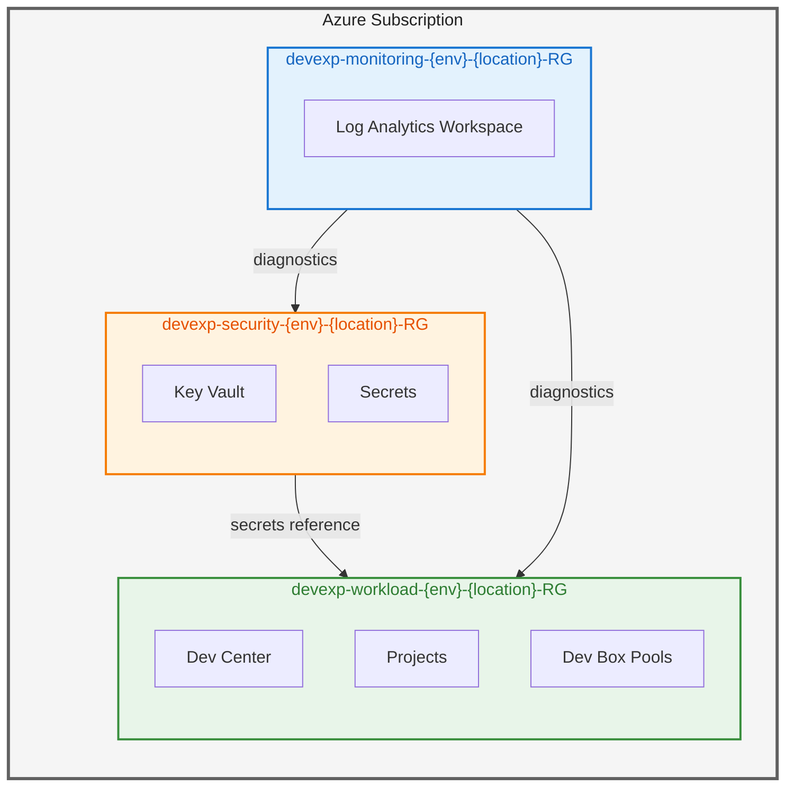

---

## Business Service Catalog

**Diagram Type**: `flowchart LR`

**TOGAF Alignment**: Business Service Portfolio

**Purpose**: Visualize the core and supporting business services provided by the
platform.

**Source:**
[devcenter.yaml](../../../infra/settings/workload/devcenter.yaml):L141-L155,
[security.yaml](../../../infra/settings/security/security.yaml):L16-L28

```mermaid
flowchart LR
    classDef coreService fill:#e8f5e9,stroke:#388e3c,stroke-width:2px,color:#2e7d32
    classDef supportService fill:#e3f2fd,stroke:#1976d2,stroke-width:2px,color:#1565c0
    classDef managementService fill:#fff3e0,stroke:#f57c00,stroke-width:2px,color:#e65100
    classDef external fill:#f3e5f5,stroke:#7b1fa2,stroke-dasharray: 5 5,color:#6a1b9a

    subgraph Core["Core Business Services"]
        direction TB
        DevBoxProv["Dev Box Provisioning<br/>(SVC-001)"]:::coreService
        EnvDeploy["Environment Deployment<br/>(SVC-002)"]:::coreService
    end

    subgraph Support["Supporting Services"]
        direction TB
        SecretsMgmt["Secrets Management<br/>(SVC-003)"]:::supportService
        InfraMonitor["Infrastructure Monitoring<br/>(SVC-004)"]:::supportService
        NetConnect["Network Connectivity<br/>(SVC-005)"]:::supportService
    end

    subgraph Management["Management Services"]
        direction TB
        CICDPipeline["CI/CD Pipeline"]:::managementService
        ReleaseManage["Release Management"]:::managementService
    end

    eShopDevs[eShop Developers]:::external
    PlatformTeam[Platform Engineering]:::external

    eShopDevs -->|"consumes"| Core
    PlatformTeam -->|"manages"| Management
    Core -->|"depends on"| Support
    Management -->|"governs"| Core
    Management -->|"governs"| Support
```

---

## Organization Structure

**Diagram Type**: `flowchart TB`

**TOGAF Alignment**: Organization Model

**Purpose**: Visualize the organizational structure and team relationships.

**Source:**
[devcenter.yaml](../../../infra/settings/workload/devcenter.yaml):L52-L62,
L116-L117

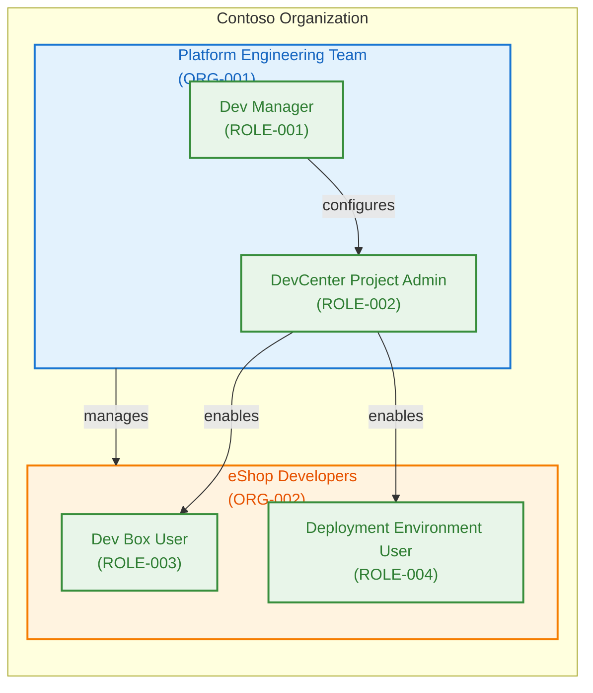

---

## CI/CD Process Flow

**Diagram Type**: `flowchart TB`

**TOGAF Alignment**: Business Process Model

**Purpose**: Visualize the continuous integration and deployment workflow.

**Source:** [ci.yml](../../../.github/workflows/ci.yml):L1-L82,
[deploy.yml](../../../.github/workflows/deploy.yml):L1-L100

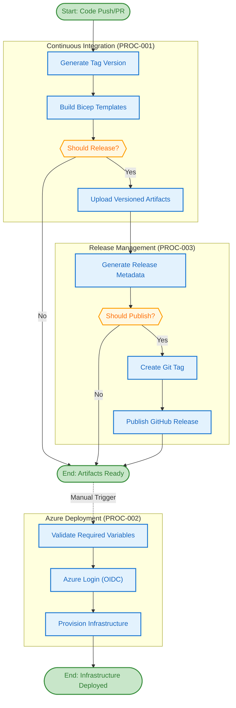

---

## Release Strategy Flow

**Diagram Type**: `flowchart LR`

**TOGAF Alignment**: Business Process Model

**Purpose**: Visualize the branch-based release strategy.

**Source:** [release.yml](../../../.github/workflows/release.yml):L1-L100,
[generate-release/action.yml](../../../.github/actions/ci/generate-release/action.yml):L75-L100

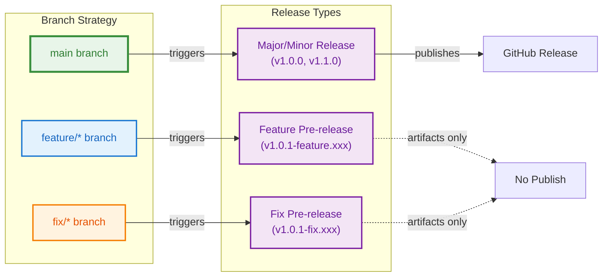

---

## Developer Onboarding Value Stream

**Diagram Type**: `flowchart LR`

**TOGAF Alignment**: Value Stream Map

**Purpose**: Visualize the end-to-end developer onboarding flow.

**Source:**
[devcenter.yaml](../../../infra/settings/workload/devcenter.yaml):L85-L178,
[createUsersAndAssignRole.ps1](../../../.configuration/setup/powershell/Azure/createUsersAndAssignRole.ps1):L1-L50

```mermaid
flowchart LR
    classDef stage fill:#e3f2fd,stroke:#1976d2,stroke-width:2px,color:#1565c0
    classDef trigger fill:#c8e6c9,stroke:#388e3c,stroke-width:2px,color:#2e7d32
    classDef outcome fill:#f3e5f5,stroke:#7b1fa2,stroke-width:2px,color:#6a1b9a
    classDef time fill:#fff8e1,stroke:#ffa000,stroke-width:1px,color:#ff6f00

    Trigger([New Developer Joins]):::trigger

    subgraph ValueStream["Developer Onboarding Value Stream"]
        direction LR

        Stage1["1. Project<br/>Assignment"]:::stage
        Time1["Immediate"]:::time

        Stage2["2. RBAC Role<br/>Assignment"]:::stage
        Time2["< 5 min"]:::time

        Stage3["3. Dev Box<br/>Provisioning"]:::stage
        Time3["< 30 min"]:::time

        Stage4["4. Environment<br/>Access"]:::stage
        Time4["Immediate"]:::time

        Stage5["5. Development<br/>Ready"]:::stage
        Time5["< 1 hour total"]:::time
    end

    Outcome([Fully Configured Environment]):::outcome

    Trigger --> Stage1
    Stage1 --> Time1
    Time1 --> Stage2
    Stage2 --> Time2
    Time2 --> Stage3
    Stage3 --> Time3
    Time3 --> Stage4
    Stage4 --> Time4
    Time4 --> Stage5
    Stage5 --> Time5
    Time5 --> Outcome
```

---

## RBAC Role Assignment Model

**Diagram Type**: `flowchart TB`

**TOGAF Alignment**: Security Architecture

**Purpose**: Visualize the RBAC role assignments across organizational units.

**Source:**
[devcenter.yaml](../../../infra/settings/workload/devcenter.yaml):L33-L50,
L118-L134

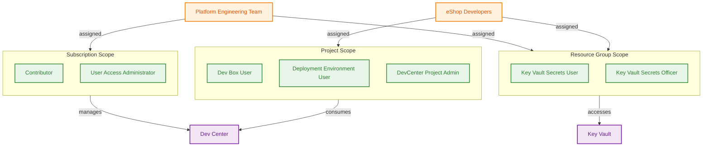

---

## Environment Types Architecture

**Diagram Type**: `flowchart LR`

**TOGAF Alignment**: Deployment Model

**Purpose**: Visualize the deployment environment structure.

**Source:**
[devcenter.yaml](../../../infra/settings/workload/devcenter.yaml):L73-L79,
L149-L155

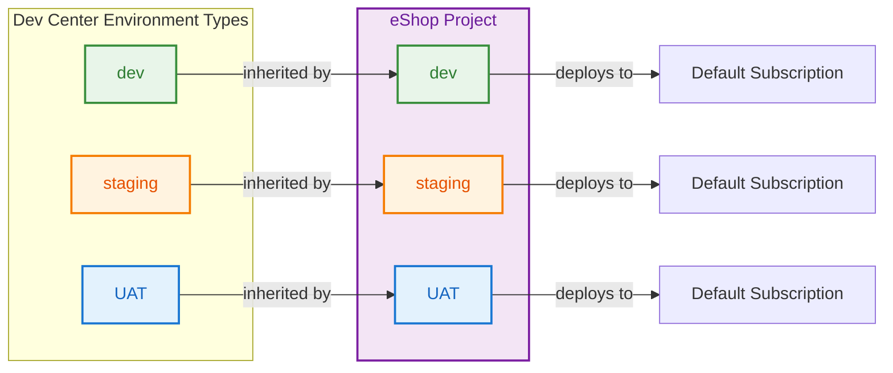

---

## Dev Box Pool Configuration

**Diagram Type**: `flowchart TB`

**TOGAF Alignment**: Resource Configuration

**Purpose**: Visualize the Dev Box pool structure for different developer roles.

**Source:**
[devcenter.yaml](../../../infra/settings/workload/devcenter.yaml):L141-L145

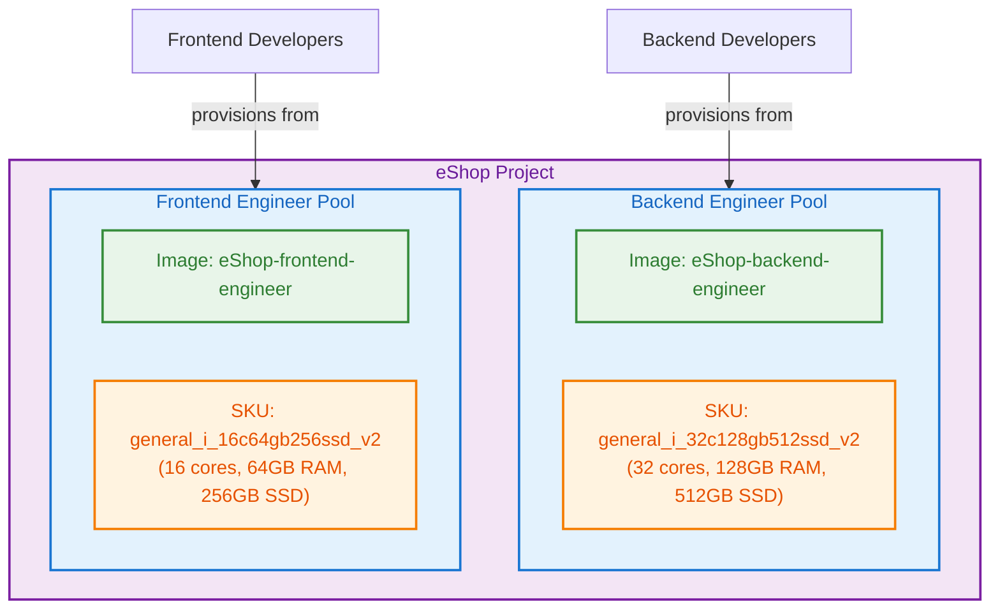

---

## Catalog Architecture

**Diagram Type**: `flowchart LR`

**TOGAF Alignment**: Configuration Management

**Purpose**: Visualize the catalog structure for Dev Center and projects.

**Source:**
[devcenter.yaml](../../../infra/settings/workload/devcenter.yaml):L64-L70,
L157-L172

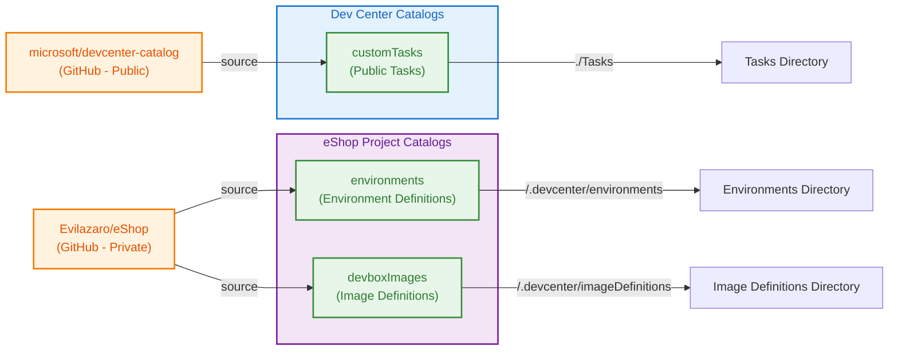

---

## Cross-Functional Process Flow

**Diagram Type**: `flowchart LR`

**TOGAF Alignment**: Cross-Functional Process

**Purpose**: Visualize handoffs between roles in the infrastructure deployment
process.

**Source:** [deploy.yml](../../../.github/workflows/deploy.yml):L1-L100,
[setUp.ps1](../../../setUp.ps1):L1-L60

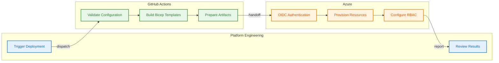

---

## Integration Architecture Overview

**Diagram Type**: `flowchart TB`

**TOGAF Alignment**: Integration Architecture

**Purpose**: Visualize how the Business layer integrates with other BDAT layers.

**Source:** [main.bicep](../../../infra/main.bicep):L1-L153

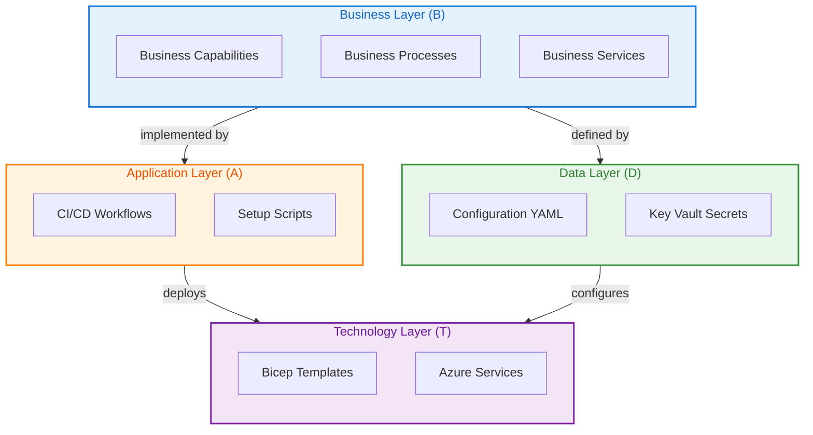

---

## Appendix: Diagram Index

| Diagram Name                      | Type         | Purpose                            | Source Files                             |
| --------------------------------- | ------------ | ---------------------------------- | ---------------------------------------- |
| Business Capability Map           | flowchart TB | Capability hierarchy visualization | azureResources.yaml, devcenter.yaml      |
| Resource Group Organization       | flowchart LR | Azure resource structure           | azureResources.yaml, main.bicep          |
| Business Service Catalog          | flowchart LR | Service portfolio                  | devcenter.yaml, security.yaml            |
| Organization Structure            | flowchart TB | Team relationships                 | devcenter.yaml                           |
| CI/CD Process Flow                | flowchart TB | Pipeline visualization             | ci.yml, deploy.yml                       |
| Release Strategy Flow             | flowchart LR | Branch strategy                    | release.yml, generate-release/action.yml |
| Developer Onboarding Value Stream | flowchart LR | Value delivery flow                | devcenter.yaml                           |
| RBAC Role Assignment Model        | flowchart TB | Security model                     | devcenter.yaml                           |
| Environment Types Architecture    | flowchart LR | Deployment environments            | devcenter.yaml                           |
| Dev Box Pool Configuration        | flowchart TB | Pool structure                     | devcenter.yaml                           |
| Catalog Architecture              | flowchart LR | Catalog sources                    | devcenter.yaml                           |
| Cross-Functional Process Flow     | flowchart LR | Role handoffs                      | deploy.yml, setUp.ps1                    |
| Integration Architecture Overview | flowchart TB | BDAT layer integration             | main.bicep                               |

---

_Diagrams generated by BDAT Architecture Documentation Generator v2.1_
_Compliance: TOGAF 10 Business Architecture_ _Mermaid Version: 10.x Compatible_
