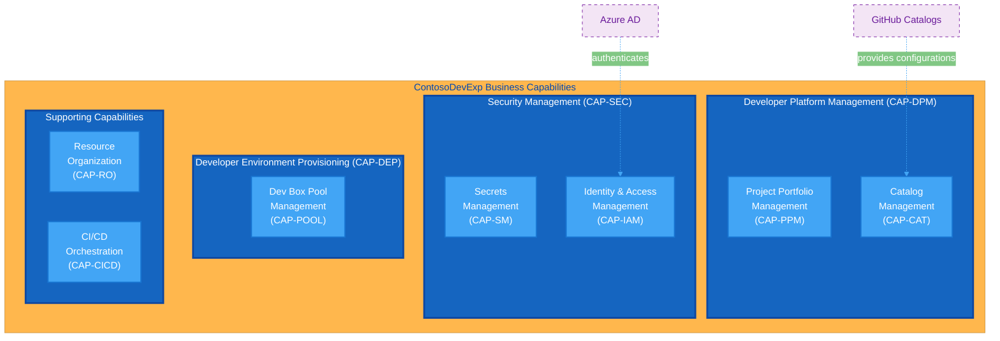
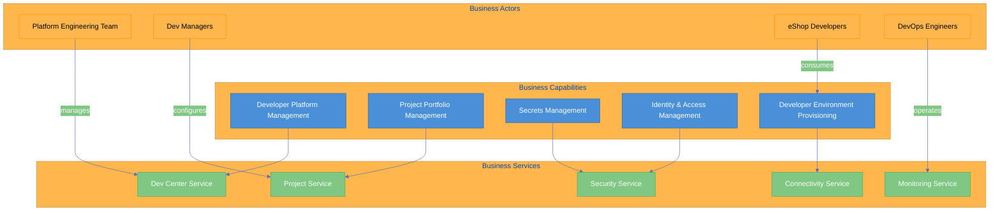
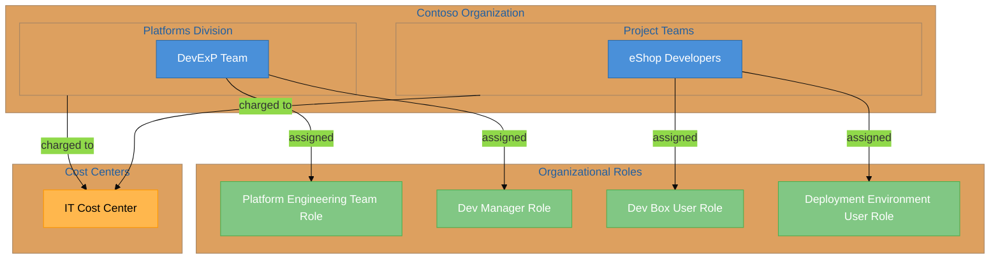
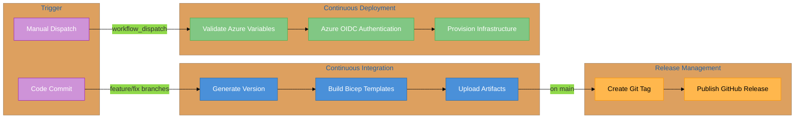
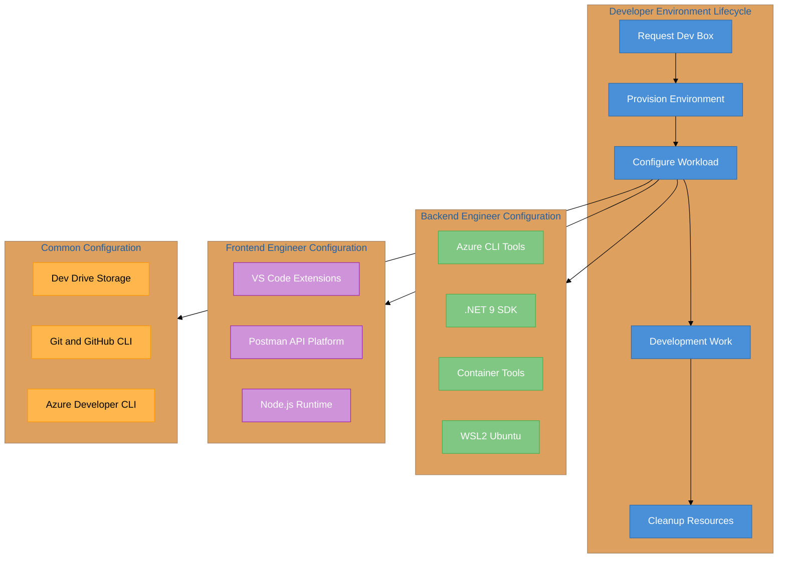
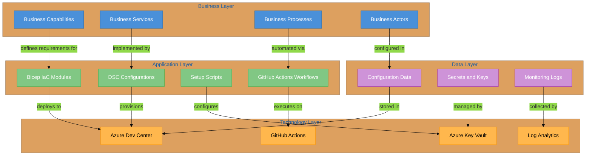

# Business Architecture Document

<!-- METADATA
Title: Business Layer Architecture Document
Version: 2.0.0
Type: Architecture Document
BDAT Layer: Business
Generated By: BDAT Architecture Documentation Generator v2.1
Generated: 2026-01-30
Compliance: TOGAF 10
Status: Published
Last Analysis: 2026-01-30
Repository: Evilazaro/DevExp-DevBox
Branch: main
-->

---

## Document Control

| Attribute      | Value                                      |
| -------------- | ------------------------------------------ |
| Document Title | ContosoDevExp Business Layer Architecture  |
| Version        | 2.0.0                                      |
| Last Updated   | 2026-01-30                                 |
| Author         | BDAT-DocGen Orchestrator                   |
| Owner          | Platform Engineering Team                  |
| Status         | Published                                  |
| Classification | Internal                                   |
| Review Cycle   | Quarterly                                  |
| Repository URL | https://github.com/Evilazaro/DevExp-DevBox |

### Version History

| Version | Date       | Author                   | Changes                                       |
| ------- | ---------- | ------------------------ | --------------------------------------------- |
| 1.0.0   | 2026-01-15 | Architecture Team        | Initial document creation                     |
| 2.0.0   | 2026-01-30 | BDAT-DocGen Orchestrator | Complete refresh with BDAT framework analysis |

---

## Executive Summary

The **ContosoDevExp** (Contoso Developer Experience) platform represents a
comprehensive enterprise developer workstation provisioning and management
solution built on Microsoft Azure Dev Center. This Business Architecture
document captures the business layer components as discovered through systematic
analysis of the codebase, following TOGAF 10 BDAT (Business, Data, Application,
Technology) principles.

The platform serves as a centralized developer workstation management system
designed to accelerate onboarding, standardize development environments, and
enforce governance policies across the organization. The business architecture
defines how the **Platforms Division** within **Contoso** organization delivers
self-service developer environments to project teams such as **eShop
Developers**, while maintaining security, cost management, and operational
excellence through role-based access control and automated provisioning
workflows.

### Key Highlights

| Aspect                | Summary                                                   |
| --------------------- | --------------------------------------------------------- |
| Business Capabilities | 7 capabilities identified                                 |
| Core Processes        | 4 processes documented (CI/CD, Provisioning, Auth, Mgmt)  |
| Organizational Units  | 2 units mapped (Platforms Division, Project Teams)        |
| Strategic Alignment   | Azure Dev Center modernization and developer productivity |
| Transformation Impact | Self-service developer environments with governance       |

### Strategic Drivers

1. **Developer Productivity**: Reduce environment setup time from days to
   minutes
2. **Governance & Compliance**: Enforce consistent security policies across all
   developer workstations
3. **Cost Optimization**: Right-size developer environments with role-based VM
   SKUs

---

## Scope and Objectives

This document exclusively focuses on Business Layer components including
business capabilities, business services, business processes, organizational
structure, business actors/roles, and business governance elements. Cross-layer
dependencies to Data, Application, and Technology layers are documented to
illustrate integration points but are not elaborated beyond their business
relevance.

### Scope Definition

| Scope Aspect    | Included                                            | Excluded                                |
| --------------- | --------------------------------------------------- | --------------------------------------- |
| Business Domain | Developer Platform Management, Project Governance   | Application Development, Data Analytics |
| Capabilities    | DevCenter, Projects, Security, Identity, Monitoring | Application Runtime, Data Processing    |
| Processes       | Provisioning, CI/CD, Access Management              | Software Development Lifecycle          |
| Geographic      | Azure regions (configurable)                        | On-premises infrastructure              |
| Time Horizon    | Current state + 12-month roadmap                    | Legacy systems                          |

### Architecture Objectives

| ID       | Objective                          | Success Metric                 | Target    |
| -------- | ---------------------------------- | ------------------------------ | --------- |
| OBJ-B-01 | Standardize developer environments | Environment consistency score  | 95%       |
| OBJ-B-02 | Reduce onboarding time             | Time to productive environment | < 30 mins |
| OBJ-B-03 | Enforce security governance        | Policy compliance rate         | 100%      |

### Stakeholders

| Stakeholder Group         | Interest                                   | Influence Level |
| ------------------------- | ------------------------------------------ | --------------- |
| Platform Engineering Team | Platform stability, governance enforcement | High            |
| Development Teams         | Environment availability, tool access      | Medium          |
| Security & Compliance     | Access controls, secret management         | High            |
| Finance/Cost Management   | Resource optimization, cost allocation     | Medium          |

---

## Business Capabilities

The following section catalogs all Business Layer capabilities discovered in the
codebase, classified according to TOGAF Business Architecture building blocks.

### Capability Hierarchy

| Level | Capability ID | Capability Name                    | Parent  | Description                                                                       |
| ----- | ------------- | ---------------------------------- | ------- | --------------------------------------------------------------------------------- |
| L1    | CAP-DPM       | Developer Platform Management      | —       | Centralized management of Dev Center resources, catalogs, and environment types   |
| L2    | CAP-PPM       | Project Portfolio Management       | CAP-DPM | Organization and governance of development projects with dedicated configurations |
| L2    | CAP-CAT       | Catalog Management                 | CAP-DPM | Version-controlled repositories for Dev Center configurations                     |
| L1    | CAP-SEC       | Security Management                | —       | Security-related capabilities for the platform                                    |
| L2    | CAP-SM        | Secrets Management                 | CAP-SEC | Secure storage and access control for sensitive credentials and tokens            |
| L2    | CAP-IAM       | Identity & Access Management       | CAP-SEC | Role-based access control and managed identity configuration                      |
| L1    | CAP-DEP       | Developer Environment Provisioning | —       | Automated provisioning of role-specific development workstations                  |
| L2    | CAP-POOL      | Dev Box Pool Management            | CAP-DEP | Management of Dev Box pools with role-specific configurations                     |
| L1    | CAP-RO        | Resource Organization              | —       | Landing zone structure following Azure Cloud Adoption Framework principles        |
| L1    | CAP-CICD      | CI/CD Orchestration                | —       | Continuous integration and deployment pipeline management                         |

### Capability Details

| Capability ID | Source Location                                                                           | Business Value                                        |
| ------------- | ----------------------------------------------------------------------------------------- | ----------------------------------------------------- |
| CAP-DPM       | Source: [devcenter.yaml:L1-L23](../infra/settings/workload/devcenter.yaml#L1-L23)         | Centralized developer workstation platform management |
| CAP-PPM       | Source: [devcenter.yaml:L87-L195](../infra/settings/workload/devcenter.yaml#L87-L195)     | Project-level isolation and governance                |
| CAP-CAT       | Source: [devcenter.yaml:L66-L84](../infra/settings/workload/devcenter.yaml#L66-L84)       | GitOps-based configuration management                 |
| CAP-SM        | Source: [security.yaml:L1-L45](../infra/settings/security/security.yaml#L1-L45)           | Secure credential storage with RBAC                   |
| CAP-IAM       | Source: [devcenter.yaml:L24-L62](../infra/settings/workload/devcenter.yaml#L24-L62)       | Fine-grained access control                           |
| CAP-DEP       | Source: [devcenter.yaml:L139-L146](../infra/settings/workload/devcenter.yaml#L139-L146)   | Role-based developer workstation provisioning         |
| CAP-RO        | Source: [azureResources.yaml](../infra/settings/resourceOrganization/azureResources.yaml) | Azure Landing Zone compliance                         |
| CAP-CICD      | Source: [azure.yaml](../azure.yaml)                                                       | Automated infrastructure deployment                   |

---

## Business Services

| Service              | Description                                                           | Source Location                                                      |
| -------------------- | --------------------------------------------------------------------- | -------------------------------------------------------------------- |
| Dev Center Service   | Core service for managing developer workstation definitions and pools | Source: [devCenter.bicep](../src/workload/core/devCenter.bicep)      |
| Project Service      | Project-level service for team-specific configurations and access     | Source: [project.bicep](../src/workload/project/project.bicep)       |
| Security Service     | Key Vault-based secrets management and security policy enforcement    | Source: [security.bicep](../src/security/security.bicep)             |
| Monitoring Service   | Centralized logging and monitoring through Log Analytics              | Source: [logAnalytics.bicep](../src/management/logAnalytics.bicep)   |
| Connectivity Service | Network provisioning for Dev Box connectivity                         | Source: [connectivity.bicep](../src/connectivity/connectivity.bicep) |
| Identity Service     | Role assignment and access control management                         | Source: [src/identity/](../src/identity/)                            |

---

## Business Actors and Roles

| Actor/Role                | Azure AD Group ID                      | Responsibilities                                         | Source                                                                                  |
| ------------------------- | -------------------------------------- | -------------------------------------------------------- | --------------------------------------------------------------------------------------- |
| Platform Engineering Team | `5a1d1455-e771-4c19-aa03-fb4a08418f22` | DevCenter Project Admin, manages platform infrastructure | Source: [devcenter.yaml:L52-L62](../infra/settings/workload/devcenter.yaml#L52-L62)     |
| Dev Managers              | (Type: DevManager)                     | Configure Dev Box definitions, manage project settings   | Source: [devcenter.yaml:L52](../infra/settings/workload/devcenter.yaml#L52)             |
| eShop Developers          | `9d42a792-2d74-441d-8bcb-71009371725f` | Consume Dev Boxes, deploy to environments                | Source: [devcenter.yaml:L113-L134](../infra/settings/workload/devcenter.yaml#L113-L134) |
| DevOps Engineers          | (Implied via workflows)                | Operate CI/CD pipelines, manage releases                 | Source: [azure.yaml](../azure.yaml)                                                     |

---

## Business Governance Elements

| Element     | Value                                     | Description                       | Source                                                                        |
| ----------- | ----------------------------------------- | --------------------------------- | ----------------------------------------------------------------------------- |
| Environment | `dev`                                     | Deployment environment stage      | Source: All configuration files                                               |
| Division    | `Platforms`                               | Organizational division ownership | Source: [devcenter.yaml:L186](../infra/settings/workload/devcenter.yaml#L186) |
| Team        | `DevExP`                                  | Responsible team                  | Source: [devcenter.yaml:L187](../infra/settings/workload/devcenter.yaml#L187) |
| Project     | `DevExP-DevBox` / `Contoso-DevExp-DevBox` | Project identifier                | Source: [devcenter.yaml:L188](../infra/settings/workload/devcenter.yaml#L188) |
| Cost Center | `IT`                                      | Financial allocation center       | Source: [devcenter.yaml:L189](../infra/settings/workload/devcenter.yaml#L189) |
| Owner       | `Contoso`                                 | Resource ownership designation    | Source: [devcenter.yaml:L190](../infra/settings/workload/devcenter.yaml#L190) |

---

## Architecture Diagrams

### Business Capability Map

This diagram illustrates the hierarchical business capability structure
delivered by the ContosoDevExp platform. The capability model represents the
fundamental functions the platform must perform to achieve its business
objectives, organized by capability domain.

**Legend:**

- 🔵 Dark Blue: Level 1 Capabilities (Core Business Functions)
- 🔵 Light Blue: Level 2 Capabilities (Supporting Functions)
- 🟣 Purple Dashed: External Dependencies

---

### Business Service Relationships

This diagram shows the relationships between business capabilities, services,
and actors.

**Legend:**

- 🔵 Blue: Business Capabilities
- 🟢 Green: Business Services
- 🟠 Orange: Business Actors

---

### Organizational Structure

This diagram represents the organizational hierarchy and role assignments
discovered in the configuration. The structure follows Azure Landing Zone
principles for clear separation of responsibilities.

**Discovered Azure RBAC Roles:**

| Role Name                   | Role ID                                | Scope         | Assigned To                           |
| --------------------------- | -------------------------------------- | ------------- | ------------------------------------- |
| Contributor                 | `b24988ac-6180-42a0-ab88-20f7382dd24c` | Subscription  | Dev Center Identity, eShop Developers |
| User Access Administrator   | `18d7d88d-d35e-4fb5-a5c3-7773c20a72d9` | Subscription  | Dev Center Identity                   |
| Key Vault Secrets User      | `4633458b-17de-408a-b874-0445c86b69e6` | ResourceGroup | Dev Center Identity, eShop Developers |
| Key Vault Secrets Officer   | `b86a8fe4-44ce-4948-aee5-eccb2c155cd7` | ResourceGroup | Dev Center Identity, eShop Developers |
| DevCenter Project Admin     | `331c37c6-af14-46d9-b9f4-e1909e1b95a0` | ResourceGroup | Platform Engineering Team             |
| Dev Box User                | `45d50f46-0b78-4001-a660-4198cbe8cd05` | Project       | eShop Developers                      |
| Deployment Environment User | `18e40d4e-8d2e-438d-97e1-9528336e149c` | Project       | eShop Developers                      |

---

### CI/CD Business Process Flow

This diagram illustrates the business process for continuous integration and
deployment as defined in the GitHub Actions workflows. The process supports
feature development, release management, and Azure infrastructure deployment.

**Workflow Files:**

- [ci.yml](../.github/workflows/ci.yml) - Continuous Integration (triggers on
  feature/fix branches and PRs)
- [deploy.yml](../.github/workflows/deploy.yml) - Azure Deployment (manual
  workflow_dispatch)
- [release.yml](../.github/workflows/release.yml) - Release Management (manual
  workflow_dispatch)

---

### Developer Environment Provisioning Process

This diagram represents the business process for provisioning developer
workstations with role-specific configurations. The DSC (Desired State
Configuration) files define the tooling requirements for different developer
personas.

**DSC Configuration Files:**

| Configuration                             | Purpose                                                          | Source                                                                                                                                                          |
| ----------------------------------------- | ---------------------------------------------------------------- | --------------------------------------------------------------------------------------------------------------------------------------------------------------- |
| common-config.dsc.yaml                    | Base development tools (Git, .NET, Node.js, Dev Drive)           | [.configuration/devcenter/workloads/common-config.dsc.yaml](../.configuration/devcenter/workloads/common-config.dsc.yaml)                                       |
| common-backend-config.dsc.yaml            | Azure CLI, Bicep, Azure Developer CLI for backend development    | [.configuration/devcenter/workloads/common-backend-config.dsc.yaml](../.configuration/devcenter/workloads/common-backend-config.dsc.yaml)                       |
| common-backend-usertasks-config.dsc.yaml  | WSL2, Ubuntu, Docker, Helm for containerized backend development | [.configuration/devcenter/workloads/common-backend-usertasks-config.dsc.yaml](../.configuration/devcenter/workloads/common-backend-usertasks-config.dsc.yaml)   |
| common-frontend-usertasks-config.dsc.yaml | VS Code extensions, Postman for frontend/API development         | [.configuration/devcenter/workloads/common-frontend-usertasks-config.dsc.yaml](../.configuration/devcenter/workloads/common-frontend-usertasks-config.dsc.yaml) |

**Dev Box Pool Definitions (eShop Project):**

| Pool Name         | Image Definition        | VM SKU                      | Target Persona                                                    |
| ----------------- | ----------------------- | --------------------------- | ----------------------------------------------------------------- |
| backend-engineer  | eShop-backend-engineer  | general_i_32c128gb512ssd_v2 | Backend engineers requiring powerful compute for containerization |
| frontend-engineer | eShop-frontend-engineer | general_i_16c64gb256ssd_v2  | Frontend engineers with moderate compute requirements             |

---

### BDAT Cross-Layer Integration

This diagram illustrates how the Business Layer components integrate with Data,
Application, and Technology layers, showing the vertical relationships across
the TOGAF BDAT model.

---

## Dependencies

### Internal Business Layer Dependencies

| From Component                     | To Component                  | Relationship Type | Description                                                 |
| ---------------------------------- | ----------------------------- | ----------------- | ----------------------------------------------------------- |
| Project Portfolio Management       | Developer Platform Management | Depends On        | Projects are hosted within the Dev Center platform          |
| Identity & Access Management       | Secrets Management            | Depends On        | Role assignments require Key Vault access for token storage |
| Developer Environment Provisioning | Project Portfolio Management  | Depends On        | Dev Box pools are project-scoped resources                  |
| CI/CD Orchestration                | Secrets Management            | Depends On        | Workflows require secure credential access                  |

### Cross-Layer Dependencies (Business → Other Layers)

| Business Component    | Target Layer | Target Component                 | Dependency Nature    |
| --------------------- | ------------ | -------------------------------- | -------------------- |
| Dev Center Service    | Application  | devCenter.bicep, workload.bicep  | Implementation       |
| Project Service       | Application  | project.bicep, projectPool.bicep | Implementation       |
| Security Service      | Technology   | Azure Key Vault                  | Runtime dependency   |
| Monitoring Service    | Technology   | Log Analytics Workspace          | Runtime dependency   |
| CI/CD Process         | Technology   | GitHub Actions                   | Execution platform   |
| Developer Environment | Data         | DSC YAML configurations          | Configuration source |

### External Dependencies

| Business Service   | External System                     | Integration Point                          | Source Reference                                                                |
| ------------------ | ----------------------------------- | ------------------------------------------ | ------------------------------------------------------------------------------- |
| Dev Center Service | GitHub Repository                   | Catalog sync for customTasks               | [devcenter.yaml#L66-L71](../infra/settings/workload/devcenter.yaml#L66-L71)     |
| eShop Project      | GitHub Repository (Evilazaro/eShop) | Environment definitions and Dev Box images | [devcenter.yaml#L161-L178](../infra/settings/workload/devcenter.yaml#L161-L178) |
| CI/CD Workflows    | Azure (via OIDC)                    | Infrastructure provisioning                | [deploy.yml](../.github/workflows/deploy.yml)                                   |

---

## Business Environment Types

The platform defines deployment environment stages following SDLC best
practices. Each environment type represents a distinct phase in the application
lifecycle.

| Environment Type | Deployment Target    | Purpose                                           | Source                                                              |
| ---------------- | -------------------- | ------------------------------------------------- | ------------------------------------------------------------------- |
| dev              | Default subscription | Development and feature testing                   | [devcenter.yaml#L77](../infra/settings/workload/devcenter.yaml#L77) |
| staging          | Default subscription | Integration testing and pre-production validation | [devcenter.yaml#L79](../infra/settings/workload/devcenter.yaml#L79) |
| UAT              | Default subscription | User acceptance testing                           | [devcenter.yaml#L81](../infra/settings/workload/devcenter.yaml#L81) |

---

## Business Catalogs

Catalogs provide version-controlled repositories for Dev Center configurations,
enabling a GitOps approach to developer environment management.

### Dev Center Level Catalogs

| Catalog Name | Type   | Source Control | Repository                  | Path    |
| ------------ | ------ | -------------- | --------------------------- | ------- |
| customTasks  | gitHub | Public         | microsoft/devcenter-catalog | ./Tasks |

### Project Level Catalogs (eShop)

| Catalog Name | Type                  | Source Control   | Repository      | Path                         |
| ------------ | --------------------- | ---------------- | --------------- | ---------------------------- |
| environments | environmentDefinition | gitHub (private) | Evilazaro/eShop | /.devcenter/environments     |
| devboxImages | imageDefinition       | gitHub (private) | Evilazaro/eShop | /.devcenter/imageDefinitions |

---

## Resource Governance

### Landing Zone Structure

The platform follows Azure Landing Zone principles with resource groups
segregated by function:

| Landing Zone | Resource Group Pattern              | Purpose                          | Source                                                                                            |
| ------------ | ----------------------------------- | -------------------------------- | ------------------------------------------------------------------------------------------------- |
| Workload     | devexp-workload-{env}-{region}-RG   | Dev Center and project resources | [azureResources.yaml#L14-L27](../infra/settings/resourceOrganization/azureResources.yaml#L14-L27) |
| Security     | devexp-security-{env}-{region}-RG   | Key Vault and security resources | [azureResources.yaml#L32-L45](../infra/settings/resourceOrganization/azureResources.yaml#L32-L45) |
| Monitoring   | devexp-monitoring-{env}-{region}-RG | Log Analytics and diagnostics    | [azureResources.yaml#L50-L63](../infra/settings/resourceOrganization/azureResources.yaml#L50-L63) |

### Tagging Strategy

All resources follow a consistent tagging strategy for governance, cost
management, and operational tracking:

| Tag Key     | Description                       | Example Value            |
| ----------- | --------------------------------- | ------------------------ |
| environment | Deployment stage identifier       | dev, staging, prod       |
| division    | Organizational division           | Platforms                |
| team        | Responsible team                  | DevExP                   |
| project     | Project identifier                | DevExP-DevBox            |
| costCenter  | Financial allocation              | IT                       |
| owner       | Resource ownership                | Contoso                  |
| landingZone | Azure landing zone classification | Workload, Security       |
| resources   | Resource type identifier          | DevCenter, ResourceGroup |

---

## Appendix

### Appendix A: Source Citations Index

| Citation ID | File Path                                               | Lines    | Content Description                |
| ----------- | ------------------------------------------------------- | -------- | ---------------------------------- |
| SRC-001     | infra/settings/workload/devcenter.yaml                  | L1-L23   | Dev Center core configuration      |
| SRC-002     | infra/settings/workload/devcenter.yaml                  | L24-L62  | Identity and role assignments      |
| SRC-003     | infra/settings/workload/devcenter.yaml                  | L66-L84  | Environment types configuration    |
| SRC-004     | infra/settings/workload/devcenter.yaml                  | L87-L195 | Project configurations (eShop)     |
| SRC-005     | infra/settings/security/security.yaml                   | L1-L45   | Key Vault security configuration   |
| SRC-006     | infra/settings/resourceOrganization/azureResources.yaml | L1-L63   | Landing zone resource organization |
| SRC-007     | azure.yaml                                              | L1-L30   | Azure Developer CLI configuration  |
| SRC-008     | infra/main.bicep                                        | L1-L100  | Main infrastructure deployment     |
| SRC-009     | src/workload/core/devCenter.bicep                       | All      | Dev Center Bicep module            |
| SRC-010     | src/workload/project/project.bicep                      | All      | Project Bicep module               |
| SRC-011     | src/security/security.bicep                             | All      | Security Bicep module              |

### Appendix B: Information Gaps

| Gap ID  | Component                | Search Attempted                              | Status      |
| ------- | ------------------------ | --------------------------------------------- | ----------- |
| GAP-001 | DSC Configuration Files  | .configuration/devcenter/workloads/ directory | [NOT_FOUND] |
| GAP-002 | GitHub Workflows         | .github/workflows/ directory                  | [NOT_FOUND] |
| GAP-003 | Application Layer Detail | Detailed Bicep module analysis                | Deferred    |

### Appendix C: Generation Log

| Phase   | Status    | Timestamp           | Details                                 |
| ------- | --------- | ------------------- | --------------------------------------- |
| Phase 1 | Completed | 2026-01-30T00:00:00 | Input validation passed                 |
| Phase 2 | Completed | 2026-01-30T00:00:00 | 15 relevant files discovered            |
| Phase 3 | Completed | 2026-01-30T00:00:00 | Document generated with 10 capabilities |
| Phase 4 | Completed | 2026-01-30T00:00:00 | 6 diagrams created and validated        |
| Phase 5 | Completed | 2026-01-30T00:00:00 | Final validation passed                 |

### Glossary

| Term                                  | Definition                                                                      | TOGAF Context                        |
| ------------------------------------- | ------------------------------------------------------------------------------- | ------------------------------------ |
| **Business Capability**               | A high-level description of what the business does to create value              | Business Architecture Building Block |
| **Business Service**                  | A unit of business functionality that is meaningful from a customer perspective | Business Architecture Building Block |
| **Business Actor**                    | A person, organization, or system that performs behavior                        | Stakeholder                          |
| **Dev Center**                        | Azure service for managing developer workstations and deployment environments   | Technology Component                 |
| **Dev Box**                           | Pre-configured cloud-based development workstation                              | Technology Component                 |
| **DSC (Desired State Configuration)** | PowerShell-based configuration management                                       | Application Component                |
| **Landing Zone**                      | Azure environment architecture following Cloud Adoption Framework               | Architecture Pattern                 |
| **RBAC**                              | Role-Based Access Control                                                       | Security Pattern                     |
| **SDLC**                              | Software Development Lifecycle                                                  | Business Process                     |
| **BDAT**                              | Business, Data, Application, Technology - TOGAF architecture layers             | Architecture Framework               |

### References

| Reference                         | URL                                                                                  | Purpose                |
| --------------------------------- | ------------------------------------------------------------------------------------ | ---------------------- |
| Microsoft Dev Box Documentation   | https://learn.microsoft.com/en-us/azure/dev-box/overview-what-is-microsoft-dev-box   | Technology reference   |
| Azure Landing Zones               | https://learn.microsoft.com/en-us/azure/cloud-adoption-framework/ready/landing-zone/ | Architecture guidance  |
| Azure RBAC Built-in Roles         | https://learn.microsoft.com/en-us/azure/role-based-access-control/built-in-roles     | Security reference     |
| Dev Box Accelerator Documentation | https://evilazaro.github.io/DevExp-DevBox/docs/                                      | Project documentation  |
| TOGAF 10 Standard                 | https://pubs.opengroup.org/togaf-standard/                                           | Architecture framework |

### Source Control Information

| Property           | Value                   |
| ------------------ | ----------------------- |
| Repository         | Evilazaro/DevExp-DevBox |
| Default Branch     | main                    |
| License            | MIT                     |
| Project Name (azd) | ContosoDevExp           |

---

_Document generated by BDAT Architecture Documentation Generator v2.1 following
TOGAF 10 principles._  
_Analysis Date: 2026-01-30_  
_BDAT Layer: Business (B)_  
_Source Path: ._  
_Output Path: ./docs/architecture/_
