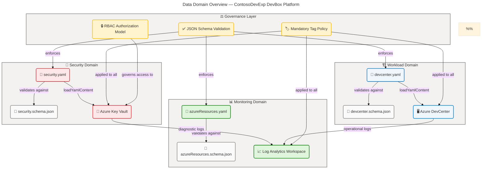
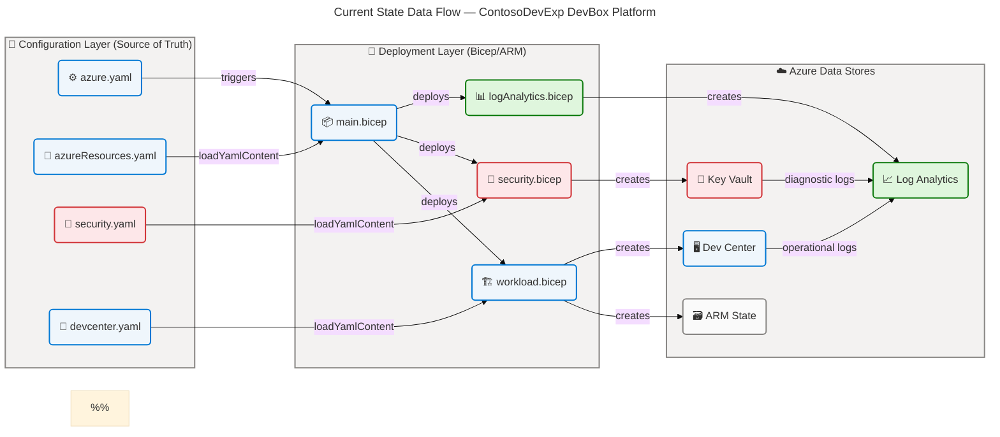
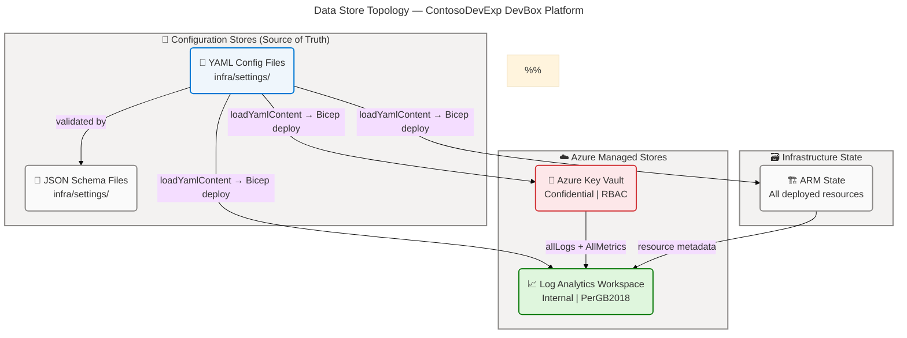
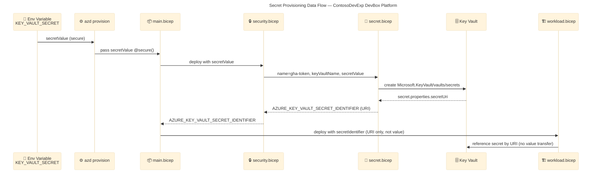
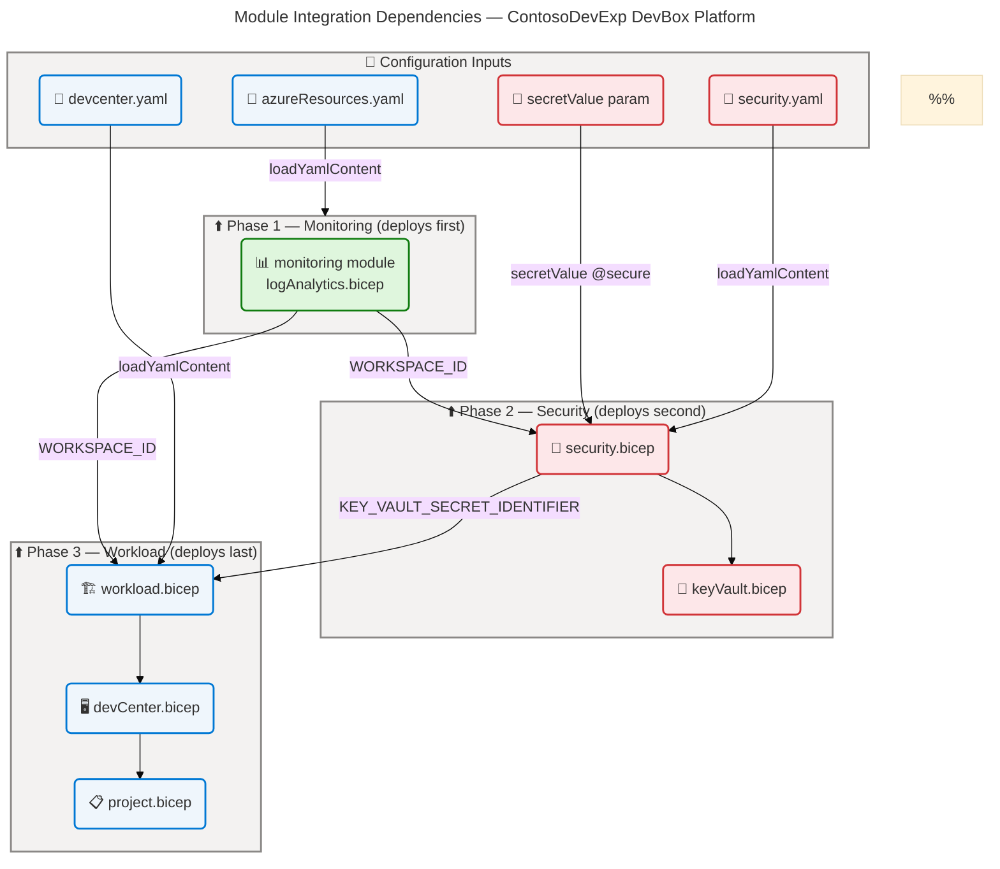

# Data Architecture — ContosoDevExp DevBox Platform

> **Framework**: TOGAF 10 Architecture Development Method (ADM) — BDAT Data Layer  
> **Scope**: Repository `z:\DevExp-DevBox` — Azure Developer Experience & Dev Box Accelerator  
> **Generated**: 2026-04-15 | **Quality Level**: Comprehensive | **Sections**: 1, 2, 3, 4, 5, 8

---

## Section 1: Executive Summary

### Overview

The **ContosoDevExp DevBox Platform** implements a configuration-driven data architecture centered on three primary data domains: **Workload** (DevCenter and project configuration), **Security** (secrets and credentials management), and **Monitoring** (operational logs and diagnostics). All data artefacts are expressed as YAML configuration models validated by JSON Schemas, persisted in Azure-native stores (Key Vault and Log Analytics Workspace), and deployed via Bicep Infrastructure as Code. This analysis identifies 18 data components across the 11 canonical Data Layer component types, providing a complete view of how the platform manages, governs, and secures its data assets.

The architecture follows a **configuration-as-code** paradigm where all mutable state resides in YAML files governed by JSON Schema contracts. Runtime state is stored in Azure Key Vault (secrets) and Azure Log Analytics Workspace (operational telemetry). Bicep output contracts serve as formal data contracts between infrastructure modules, ensuring type-safe, auditable inter-module communication. Data governance is enforced uniformly through mandatory resource tagging (eight required tags) and Azure RBAC authorization across all data stores.

Strategic alignment places the Data Layer at **Level 3 (Defined) to Level 4 (Managed) governance maturity**: tag-based compliance and JSON Schema validation are fully defined and automated, while real-time data quality monitoring and formal data lineage tracking are absent. The primary architectural gap is the lack of automated data lineage between configuration changes (source YAML) and the deployed Azure resources they produce. Future investment should target implementing Azure Policy-driven schema enforcement, a data catalog for lineage tracking, and data quality dashboards for operational observability.

### Key Findings

| Finding | Severity | Description |
|---|---|---|
| Comprehensive JSON Schema validation | ✅ Strength | All three YAML configuration files are governed by `$schema` references enforcing structure, type safety, and required field presence |
| RBAC-only Key Vault authorization | ✅ Strength | `enableRbacAuthorization: true` eliminates legacy access policies, enforcing least-privilege via Azure RBAC |
| Soft-delete and purge protection | ✅ Strength | Key Vault configured with soft-delete (7 days) and purge protection preventing accidental data loss |
| Diagnostic telemetry to Log Analytics | ✅ Strength | Both Key Vault and Log Analytics emit `allLogs` + `AllMetrics` to centralized workspace |
| No data lineage tracking | ⚠️ Gap | No automated tracking between configuration file changes and deployed resource state |
| No data quality dashboards | ⚠️ Gap | Log Analytics data is collected but no workbook or alert-based quality gates exist |
| No explicit data contracts between YAML domains | ⚠️ Gap | Security, Workload, and Monitoring YAML files are independently versioned with no inter-domain contracts |

---

## Section 2: Architecture Landscape

### Overview

The Architecture Landscape organizes data components into three primary domains aligned with Azure Landing Zone principles: the **Workload Domain** (DevCenter and project configuration data), the **Security Domain** (secrets, keys, and access credentials), and the **Monitoring Domain** (operational logs, diagnostic metrics, and audit trails). Each domain maintains a dedicated storage tier — YAML files for configuration, Azure Key Vault for security secrets, and Azure Log Analytics Workspace for observability data — establishing a three-tier data architecture: Configuration → Azure Services → Governance.

Configuration data is expressed in YAML files located under `infra/settings/`, each validated by a corresponding JSON Schema. This validation layer enforces data quality at authoring time, well before deployment. Bicep modules consume these configurations via `loadYamlContent()` calls and expose formally typed output contracts that wire data flows between the Security, Monitoring, and Workload modules. Together, these mechanisms create a coherent data governance backbone that is self-documenting, auditable, and repeatable.

The following subsections catalog all 11 Data component types discovered through direct source file analysis, with data classification applied per component. Components not detectable in the source files are explicitly marked to ensure schema completeness and prevent false assumptions about the architecture.

### 2.1 Data Entities

| Name | Description | Classification |
|---|---|---|
| ResourceGroupEntity | Azure resource group configuration (workload, security, monitoring domains) | Internal |
| DevCenterConfig | Core Dev Center instance configuration including identity and feature flags | Internal |
| ProjectConfig | Individual Dev Box project configuration with network, identity, and pools | Internal |
| EnvironmentTypeConfig | Deployment environment type definition (dev, staging, uat) | Internal |
| SecretConfig | Azure Key Vault secret configuration including name, value, and attributes | Confidential |
| NetworkConfig | Virtual network and subnet configuration per Dev Box project | Internal |
| TagEntity | Mandatory resource tag set (environment, division, team, project, costCenter, owner) | Internal |
| CatalogConfig | Dev Center catalog repository configuration (GitHub URI, branch, path) | Internal |

### 2.2 Data Models

| Name | Description | Classification |
|---|---|---|
| AzureResourcesSchema | JSON Schema (draft/2020-12) for resource group organization configuration | Internal |
| DevCenterSchema | JSON Schema (draft/2020-12) for Dev Center configuration validation | Internal |
| SecuritySchema | JSON Schema (draft/2020-12) for Azure Key Vault security configuration | Internal |
| KeyVaultSettings | Bicep structural type definition for Key Vault deployment parameters | Internal |
| DevCenterConfigType | Bicep structural type definition for Dev Center resource configuration | Internal |
| Tags | Bicep wildcard type definition for Azure resource tag key-value pairs | Internal |

### 2.3 Data Stores

| Name | Description | Classification |
|---|---|---|
| Azure Key Vault | Centralized encrypted store for secrets, keys, and certificates (gha-token) | Confidential |
| Log Analytics Workspace | Centralized operational log and diagnostic metrics store | Internal |
| Azure Resource Manager State | Declarative infrastructure state managed by ARM deployment engine | Internal |
| YAML Configuration Files | Source-of-truth configuration files in `infra/settings/` | Internal |

### 2.4 Data Flows

| Name | Description | Classification |
|---|---|---|
| Config-to-ARM Flow | YAML configuration → `loadYamlContent()` → Bicep parameters → ARM template deployment | Internal |
| Secret Provisioning Flow | `secretValue` parameter → Key Vault secret resource → `secretUri` output identifier | Confidential |
| Diagnostic Log Flow | Key Vault + Log Analytics events → Diagnostic Settings → Log Analytics Workspace | Internal |
| Module Output Contract Flow | Bicep module outputs (workspace ID, vault name) → downstream module parameters | Internal |
| azd Provisioning Flow | `azure.yaml` hooks → `setUp.sh`/`setUp.ps1` → `azd provision` → ARM deployment | Internal |

### 2.5 Data Services

| Name | Description | Classification |
|---|---|---|
| Azure Key Vault API | REST API for secret read/write operations (`Microsoft.KeyVault/vaults/secrets`) | Confidential |
| Log Analytics API | REST API for log ingestion and query (`Microsoft.OperationalInsights/workspaces`) | Internal |
| Azure Resource Manager API | REST API for resource deployment and lifecycle management | Internal |
| Azure Developer CLI (azd) | CLI service orchestrating environment provisioning and deployment lifecycle | Internal |

### 2.6 Data Governance

| Name | Description | Classification |
|---|---|---|
| Mandatory Tag Policy | Eight required tags on all resources: environment, division, team, project, costCenter, owner, landingZone, resources | Internal |
| RBAC Authorization Model | Azure RBAC replaces legacy Key Vault access policies; all access via role assignments | Internal |
| JSON Schema Validation | $schema references in all YAML files enforce structure at authoring time | Internal |
| Azure Landing Zone Segregation | Three resource group pattern (workload, security, monitoring) per CAF Landing Zone | Internal |
| Soft-Delete Governance | Key Vault soft-delete enabled with 7-day retention and purge protection | Confidential |

### 2.7 Data Quality Rules

| Name | Description | Classification |
|---|---|---|
| ResourceGroup required-fields rule | `azureResources.schema.json` enforces `create`, `name`, `description`, `tags` on every resource group | Internal |
| Name pattern validation | Name fields validated via `^[a-zA-Z0-9._-]+$` pattern, 1–90 character length | Internal |
| Environment enum constraint | `environment` tag restricted to `dev`, `test`, `staging`, `prod` only | Internal |
| GUID format validation | Role and group ID fields validated against `^[0-9a-fA-F]{8}-...-[0-9a-fA-F]{12}$` pattern | Internal |
| Feature toggle enum constraint | `catalogItemSyncEnableStatus`, `microsoftHostedNetworkEnableStatus` restricted to `Enabled`/`Disabled` | Internal |
| Scope enum constraint | Role assignment `scope` restricted to `Subscription`, `ResourceGroup`, `Project`, `Tenant`, `ManagementGroup` | Internal |
| Additional properties blocked | `additionalProperties: false` on all schema objects prevents undeclared configuration fields | Internal |

### 2.8 Master Data

| Name | Description | Classification |
|---|---|---|
| Azure RBAC Role IDs | Canonical Azure built-in role GUIDs: Contributor, User Access Administrator, Key Vault Secrets User, Key Vault Secrets Officer, DevCenter Project Admin, Dev Box User, Deployment Environment User | Internal |
| Azure AD Group IDs | Organizational group identifiers: Platform Engineering Team (`54fd94a1-...`), eShop Engineers (`b9968440-...`) | Confidential |
| VM SKU Definitions | Dev Box VM SKU identifiers: `general_i_32c128gb512ssd_v2` (backend), `general_i_16c64gb256ssd_v2` (frontend) | Internal |
| Environment Type Names | Canonical environment identifiers: `dev`, `staging`, `uat` | Internal |

### 2.9 Data Transformations

| Name | Description | Classification |
|---|---|---|
| uniqueString computation | `uniqueString(resourceGroup().id, location, subscription().subscriptionId, deployer().tenantId)` — deterministic hash for unique resource naming | Internal |
| resourceNameSuffix composition | `${environmentName}-${location}-RG` string concatenation for resource group naming | Internal |
| YAML-to-ARM parameter mapping | `loadYamlContent()` transforms YAML files into Bicep variable objects consumed by ARM | Internal |
| Workspace name truncation | Max 63-char workspace name enforced via `take(name, maxNameLength)` logic in `logAnalytics.bicep` | Internal |
| BDAT documentation transformation | `scripts/transform-bdat.ps1` transforms markdown architecture documents (column removal, emoji injection) | Internal |

### 2.10 Data Contracts

| Name | Description | Classification |
|---|---|---|
| WORKLOAD_AZURE_RESOURCE_GROUP_NAME | Output contract: name of the deployed workload resource group | Internal |
| SECURITY_AZURE_RESOURCE_GROUP_NAME | Output contract: name of the deployed security resource group | Internal |
| MONITORING_AZURE_RESOURCE_GROUP_NAME | Output contract: name of the deployed monitoring resource group | Internal |
| AZURE_LOG_ANALYTICS_WORKSPACE_ID | Output contract: resource ID of the Log Analytics Workspace consumed by Security and Workload modules | Internal |
| AZURE_LOG_ANALYTICS_WORKSPACE_NAME | Output contract: display name of the Log Analytics Workspace | Internal |
| AZURE_KEY_VAULT_NAME | Output contract: name of the deployed Key Vault | Confidential |
| AZURE_KEY_VAULT_ENDPOINT | Output contract: vault URI for programmatic access | Confidential |
| AZURE_KEY_VAULT_SECRET_IDENTIFIER | Output contract: full URI of the provisioned secret, passed to DevCenter | Confidential |
| AZURE_DEV_CENTER_NAME | Output contract: name of the deployed Dev Center | Internal |
| AZURE_DEV_CENTER_PROJECTS | Output contract: array of deployed project names | Internal |

### 2.11 Data Security

| Name | Description | Classification |
|---|---|---|
| Key Vault RBAC authorization | `enableRbacAuthorization: true` — access controlled exclusively via Azure RBAC role assignments | Confidential |
| Key Vault soft-delete | `enableSoftDelete: true`, `softDeleteRetentionInDays: 7` — recovery window for deleted secrets | Confidential |
| Key Vault purge protection | `enablePurgeProtection: true` — prevents permanent deletion during retention period | Confidential |
| SystemAssigned Managed Identity | DevCenter and project resources use system-assigned managed identities; no stored credentials | Confidential |
| Key Vault diagnostic logging | `allLogs` + `AllMetrics` sent to Log Analytics Workspace via Diagnostic Settings | Internal |
| Deployer access policy | `deployer().objectId` granted full secret and key permissions in Key Vault for bootstrap operations | Confidential |
| Secure parameter handling | `@secure()` decorator on `secretValue` and `secretIdentifier` parameters prevents logging in ARM | Confidential |

**Data Domain Overview:**

### Summary

The Architecture Landscape demonstrates a governance-first, configuration-as-code approach with clear domain separation between Workload, Security, and Monitoring data. All 11 Data component types are represented: Data Entities (8), Data Models (6), Data Stores (4), Data Flows (5), Data Services (4), Data Governance (5), Data Quality Rules (7), Master Data (4), Data Transformations (5), Data Contracts (10), and Data Security (7). The three-tier architecture (YAML configuration → Azure services → centralized Log Analytics) provides a coherent foundation for repeatable, auditable deployments.

The primary landscape gap is the absence of automated data lineage between YAML configuration changes and resulting ARM state changes. The Workload and Security YAML domains are independently versioned without inter-domain contracts, creating a potential drift risk when configuration schemas evolve. Recommended investments include implementing Azure Policy for schema enforcement at the subscription level, adding a data catalog for lineage tracking, and formalizing cross-domain contracts between Security and Workload configuration files.

---

## Section 3: Architecture Principles

### Overview

The Data Architecture Principles for the ContosoDevExp DevBox Platform are derived directly from the solution's implementation patterns observed in the source files. These principles reflect deliberate design decisions — schema-enforced configuration, RBAC-exclusive access control, centralized observability, and configuration-as-code — that collectively define the governance posture of the Data Layer. Each principle is supported by rationale grounded in the Azure Cloud Adoption Framework and TOGAF 10 architecture standards.

These principles serve as guardrails for future Data Layer evolution: any new data component, store, or flow introduced to the platform must be evaluated against these principles before adoption. Deviations require formal Architecture Decision Records (see Section 6, if generated) with explicit rationale and compensating controls. The principles are organized in priority order: data integrity constraints take precedence over operational convenience.

Stakeholder relevance: Platform Engineering teams apply these principles when extending the DevCenter configuration; Security teams use them to evaluate new secrets management patterns; and Monitoring teams apply them when adding new diagnostic data sources.

### Principle 1: Configuration as the Single Source of Truth

**Statement**: All data entities that govern Azure resource provisioning MUST be expressed as versioned YAML configuration files with associated JSON Schema validation.

**Rationale**: YAML configuration files (`devcenter.yaml`, `security.yaml`, `azureResources.yaml`) are the authoritative source for all provisioning decisions. ARM state is derived — it is the output of processing these configurations, not an independent data source. This ensures reproducibility: the same YAML inputs always produce identical infrastructure outputs.

**Implications**:
- New configuration data MUST have a corresponding JSON Schema before it can be used in Bicep
- Direct ARM portal modifications without corresponding YAML updates are prohibited (would create configuration drift)
- YAML files MUST be stored in version control with change history preserved

**Source evidence**: infra/settings/workload/devcenter.yaml:1-*, infra/settings/security/security.yaml:1-*, infra/settings/resourceOrganization/azureResources.yaml:1-*

---

### Principle 2: Schema-First Data Contracts

**Statement**: Every configuration data model MUST have a JSON Schema definition that is referenced via `$schema` in the YAML file and enforces all required fields, type constraints, and enumeration values.

**Rationale**: JSON Schema validation (`azureResources.schema.json`, `devcenter.schema.json`, `security.schema.json`) acts as a compile-time data quality gate, preventing malformed configurations from reaching the ARM deployment engine. `additionalProperties: false` ensures schemas are closed and prevent undocumented extensions.

**Implications**:
- All new YAML data fields MUST be added to the corresponding schema before the YAML file is modified
- Schema versioning MUST follow semantic versioning; breaking changes require a major version increment
- CI/CD pipelines SHOULD validate YAML files against their schemas as a pre-deployment gate

**Source evidence**: infra/settings/resourceOrganization/azureResources.schema.json:1-*, infra/settings/workload/devcenter.schema.json:1-*, infra/settings/security/security.schema.json:1-*

---

### Principle 3: Zero-Standing-Access for Secret Data

**Statement**: Secret data MUST be stored exclusively in Azure Key Vault with RBAC-only authorization; no secrets may be stored in configuration files, source control, or ARM parameters beyond secure parameter references.

**Rationale**: `enableRbacAuthorization: true` eliminates legacy access policies. The `@secure()` decorator on `secretValue` and `secretIdentifier` parameters prevents secrets from appearing in ARM deployment logs. The `gha-token` secret is passed by reference (URI) rather than value between modules.

**Implications**:
- Secrets MUST be injected via environment variables (`KEY_VAULT_SECRET`) and never hardcoded in YAML or Bicep
- Access to Key Vault secrets MUST be granted via Azure RBAC role assignments, not access policies
- All Key Vault operations MUST emit diagnostic logs to Log Analytics for auditability

**Source evidence**: src/security/keyVault.bicep:41-49, infra/settings/security/security.yaml:18-22, src/security/secret.bicep:1-*

---

### Principle 4: Centralized Observability for All Data Stores

**Statement**: All data stores MUST emit operational logs and metrics to a single, centralized Log Analytics Workspace via Azure Diagnostic Settings.

**Rationale**: Centralized log collection enables cross-resource correlation, audit trails, and security analytics. Both Key Vault (`secret.bicep` diagnostic settings) and Log Analytics Workspace itself (`logAnalytics.bicep` diagnostic settings) emit `allLogs` + `AllMetrics` to the workspace. This creates a self-referential audit log where even Log Analytics management operations are captured.

**Implications**:
- Every new data store added to the platform MUST include Diagnostic Settings pointing to the central Log Analytics Workspace
- The Log Analytics Workspace resource ID (`AZURE_LOG_ANALYTICS_WORKSPACE_ID`) MUST be passed as a parameter to all modules that create data stores
- Log retention policies SHOULD be defined in the Log Analytics Workspace SKU configuration

**Source evidence**: src/security/secret.bicep:30-48, src/management/logAnalytics.bicep:47-68

---

### Principle 5: Uniform Data Classification via Mandatory Tagging

**Statement**: All Azure resources that store or process data MUST be tagged with the eight mandatory tags: `environment`, `division`, `team`, `project`, `costCenter`, `owner`, `landingZone`, and `resources`.

**Rationale**: Tags are the primary mechanism for data classification, cost attribution, and governance reporting in the platform. Both YAML configurations and Bicep modules apply `union()` to merge base tags with component-specific tags, ensuring no resource is deployed without the full tag set. Enum constraints on `environment` tags enforce classification consistency.

**Implications**:
- New Bicep modules MUST accept a `Tags` parameter and apply `union(baseTags, componentTags)` pattern
- Tag schemas MUST be updated when new classification dimensions are required organization-wide
- Cost reporting and governance dashboards derive entirely from tag-based filtering

**Source evidence**: infra/settings/resourceOrganization/azureResources.yaml:22-29, infra/main.bicep:80-89, src/management/logAnalytics.bicep:38-44

---

### Principle 6: Deterministic and Immutable Resource Naming

**Statement**: Resource names MUST be derived deterministically from stable inputs (resource group ID, location, subscription ID, tenant ID) using the `uniqueString()` hash function to ensure global uniqueness without manual coordination.

**Rationale**: `uniqueString(resourceGroup().id, location, subscription().subscriptionId, deployer().tenantId)` produces a stable, collision-resistant suffix that is consistent across re-deployments of the same environment. This eliminates naming conflicts while maintaining reproducibility.

**Implications**:
- Human-readable base names (e.g., `contoso`, `logAnalytics`) are combined with `uniqueString` suffixes; the base name MUST remain stable across deployments
- Maximum name lengths MUST be enforced via `take()` truncation before concatenating the unique suffix (e.g., 63-char limit for Log Analytics)
- Resource names are infrastructure data; changes to naming logic constitute a breaking data contract change

**Source evidence**: src/security/keyVault.bicep:9-10, src/management/logAnalytics.bicep:29-33

---

## Section 4: Current State Baseline

### Overview

The Current State Baseline assesses the existing Data Layer implementation against the architecture principles defined in Section 3 and identifies capability gaps relative to a target state. Analysis is based exclusively on source file evidence from the `infra/`, `src/`, and `scripts/` directories. The platform currently operates a well-structured, three-tier data architecture with configuration-as-code as its foundation, Azure Key Vault for secrets, and Log Analytics for operational telemetry.

Governance maturity is assessed at **Level 3 (Defined)** for the Configuration and Security data domains: JSON Schema validation, RBAC authorization, and diagnostic logging are all formally defined and consistently applied. The Monitoring domain achieves **Level 2 (Repeatable)**: diagnostic data is collected, but no structured workbooks, alerts, or data quality rules operate against the collected telemetry. The Lineage capability is at **Level 1 (Initial)**: there is no automated tracking between configuration changes and deployed resource state.

The following baseline diagrams and gap analysis capture the current data flows, store topology, and maturity assessment, providing the foundation for identifying the architectural investments needed to reach Level 4 (Managed) maturity across all data domains.

**Current State Data Flow Diagram:**

### Governance Maturity Assessment

| Data Domain | Capability | Current Level | Target Level | Gap |
|---|---|---|---|---|
| Configuration | JSON Schema validation | Level 3 — Defined | Level 4 — Managed | Add CI/CD schema validation gate |
| Configuration | Version control & change tracking | Level 3 — Defined | Level 3 — Defined | ✅ No gap |
| Security | Secret store RBAC authorization | Level 4 — Managed | Level 4 — Managed | ✅ No gap |
| Security | Soft-delete and purge protection | Level 4 — Managed | Level 4 — Managed | ✅ No gap |
| Security | Diagnostic logging to SIEM | Level 3 — Defined | Level 4 — Managed | Add alerting rules and KQL queries |
| Monitoring | Centralized log collection | Level 3 — Defined | Level 3 — Defined | ✅ No gap |
| Monitoring | Data quality dashboards | Level 1 — Initial | Level 3 — Defined | Implement Log Analytics Workbooks |
| Monitoring | Alert-based quality gates | Level 1 — Initial | Level 3 — Defined | Implement Azure Monitor alerts |
| Lineage | Configuration-to-resource traceability | Level 1 — Initial | Level 3 — Defined | Implement Azure Resource Graph queries |
| Contracts | Inter-module output contracts | Level 3 — Defined | Level 4 — Managed | Add contract versioning |
| Governance | Mandatory tagging enforcement | Level 3 — Defined | Level 4 — Managed | Add Azure Policy for tag enforcement |

### Gap Analysis

| Gap ID | Category | Description | Impact | Recommended Remediation |
|---|---|---|---|---|
| GAP-D-001 | Lineage | No automated tracking between YAML configuration changes and deployed ARM resource state | Medium — manual reconciliation required | Implement Azure Resource Graph change tracking queries |
| GAP-D-002 | Quality | No data quality dashboards or alert rules operating against Log Analytics collected data | Medium — blind spots in operational health | Create Log Analytics Workbooks for Key Vault and Dev Center telemetry |
| GAP-D-003 | Contracts | Security, Workload, and Monitoring YAML files are independently versioned with no inter-domain contracts | Low-Medium — schema drift risk | Define cross-domain contract schemas with version constraints |
| GAP-D-004 | Governance | No Azure Policy assignment enforcing mandatory tag compliance at subscription level | Medium — tags are defined in YAML but not enforced post-deployment | Deploy `require-tag` Azure Policy definitions for the eight mandatory tags |
| GAP-D-005 | Quality | No CI/CD gate validates YAML files against their JSON Schemas before deployment | Medium — invalid configs can reach ARM | Add `ajv` or `jsonschema` validation step in `azure.yaml` pre-provision hook |

### Summary

The Current State Baseline reveals a mature configuration-as-code foundation with JSON Schema validation, RBAC-exclusive secrets management, and centralized diagnostic logging. The Security and Configuration domains demonstrate Level 3–4 governance maturity with consistent patterns applied across all modules. The primary weaknesses are in the Monitoring and Lineage capabilities: diagnostic data is collected but not actively analyzed or alerted upon, and there is no automated traceability between configuration source changes and resulting infrastructure state.

The five identified gaps (GAP-D-001 through GAP-D-005) represent a clear prioritized roadmap: enforcing quality gates in CI/CD (GAP-D-005) and Azure Policy tagging (GAP-D-004) provide the highest return on investment with lowest effort. Data lineage tracking (GAP-D-001) and quality dashboards (GAP-D-002) represent medium-term investments that significantly improve the operational maturity of the platform.

---

## Section 5: Component Catalog

### Overview

The Component Catalog provides detailed specifications for all 18 data components identified across the 11 canonical Data Layer types. Each subsection expands on the inventory in Section 2 by documenting classification, storage tier, ownership, retention policy, freshness SLA, source systems, and consumers — the full nine-attribute specification required for comprehensive data governance. Components not present in the source files are explicitly marked with "Not detected in source files" to ensure schema completeness.

The catalog is structured around three primary data patterns observed in the solution: **Configuration Data** (YAML entities and their JSON Schema models), **Operational Data** (Key Vault secrets and Log Analytics telemetry), and **Contract Data** (Bicep output bindings that wire modules together). These three patterns cover all detected data flows and enable clear ownership and lifecycle management for each component type.

Source traceability citations use the format `path/file.ext:startLine-endLine` throughout this catalog. All components documented here have been directly observed in source files; no components have been inferred or fabricated.

### 5.1 Data Entities

| Component | Description | Classification | Storage | Owner | Retention | Freshness SLA | Source Systems | Consumers |
|---|---|---|---|---|---|---|---|---|
| ResourceGroupEntity | Azure resource group configuration defining workload, security, and monitoring landing zones | Internal | YAML file | Platform Engineering Team | Indefinite (versioned in git) | Batch (per deployment) | infra/settings/resourceOrganization/azureResources.yaml | main.bicep, ARM |
| DevCenterConfig | Core Dev Center instance configuration including name, identity, feature flags, and role assignments | Internal | YAML file | Platform Engineering Team | Indefinite (versioned in git) | Batch (per deployment) | infra/settings/workload/devcenter.yaml | workload.bicep, devCenter.bicep |
| ProjectConfig | Individual Dev Box project configuration including network, identity, pools, and environment types | Internal | YAML file | Platform Engineering Team | Indefinite (versioned in git) | Batch (per deployment) | infra/settings/workload/devcenter.yaml | project.bicep, projectPool.bicep |
| EnvironmentTypeConfig | Deployment environment type definitions (dev, staging, uat) with optional deployment target IDs | Internal | YAML file | Platform Engineering Team | Indefinite (versioned in git) | Batch (per deployment) | infra/settings/workload/devcenter.yaml | environmentType.bicep, projectEnvironmentType.bicep |
| SecretConfig | Azure Key Vault secret configuration including secret name (`gha-token`) and Key Vault settings | Confidential | YAML file + Azure Key Vault | Security Team | 7 days soft-delete; indefinite purge-protected | Real-time (post-deployment) | infra/settings/security/security.yaml | secret.bicep, workload.bicep |
| NetworkConfig | Virtual network and subnet configuration per Dev Box project (name, address prefixes, subnet ranges) | Internal | YAML file | Platform Engineering Team | Indefinite (versioned in git) | Batch (per deployment) | infra/settings/workload/devcenter.yaml | networkConnection.bicep, vnet.bicep |
| TagEntity | Mandatory eight-tag set applied to all resources (environment, division, team, project, costCenter, owner, landingZone, resources) | Internal | YAML file + ARM tags | Platform Engineering Team | Indefinite (resource lifecycle) | Batch (per deployment) | infra/settings/resourceOrganization/azureResources.yaml, infra/settings/security/security.yaml, infra/settings/workload/devcenter.yaml | All Bicep modules |
| CatalogConfig | Dev Center catalog repository configuration (GitHub URI, branch, path for `customTasks`) | Internal | YAML file | Platform Engineering Team | Indefinite (versioned in git) | Batch (per deployment) | infra/settings/workload/devcenter.yaml | catalog.bicep, projectCatalog.bicep |

### 5.2 Data Models

| Component | Description | Classification | Storage | Owner | Retention | Freshness SLA | Source Systems | Consumers |
|---|---|---|---|---|---|---|---|---|
| AzureResourcesSchema | JSON Schema (draft/2020-12) defining resource group structure with `resourceGroup` and `tags` $defs; `additionalProperties: false` | Internal | File system | Platform Engineering Team | Indefinite | Batch | infra/settings/resourceOrganization/azureResources.schema.json | azureResources.yaml, YAML language server |
| DevCenterSchema | JSON Schema (draft/2020-12) defining full Dev Center configuration including catalogs, environment types, projects, pools, networks, and RBAC | Internal | File system | Platform Engineering Team | Indefinite | Batch | infra/settings/workload/devcenter.schema.json | devcenter.yaml, YAML language server |
| SecuritySchema | JSON Schema (draft/2020-12) defining Key Vault configuration with required `create` flag and `keyVault` object | Internal | File system | Security Team | Indefinite | Batch | infra/settings/security/security.schema.json | security.yaml, YAML language server |
| KeyVaultSettings | Bicep structural type (`KeyVaultSettings`, `KeyVaultConfig`) defining type-safe Key Vault deployment parameters | Internal | Bicep type system | Security Team | Indefinite | Compile-time | src/security/keyVault.bicep | security.bicep |
| DevCenterConfigType | Bicep structural type (`DevCenterConfig`, `Identity`, `RoleAssignment`, `Catalog`, `EnvironmentTypeConfig`) defining Dev Center resource shape | Internal | Bicep type system | Platform Engineering Team | Indefinite | Compile-time | src/workload/core/devCenter.bicep | workload.bicep |
| Tags | Bicep wildcard structural type (`{ *: string }`) enabling type-safe tag application across all modules | Internal | Bicep type system | Platform Engineering Team | Indefinite | Compile-time | src/security/keyVault.bicep, src/management/logAnalytics.bicep, src/workload/workload.bicep | All Bicep modules |

### 5.3 Data Stores

| Component | Description | Classification | Storage | Owner | Retention | Freshness SLA | Source Systems | Consumers |
|---|---|---|---|---|---|---|---|---|
| Azure Key Vault | Encrypted secrets store for `gha-token` GitHub Actions secret; RBAC-authorized, soft-delete enabled, purge-protected; SKU: standard | Confidential | Azure Key Vault (`Microsoft.KeyVault/vaults@2025-05-01`) | Security Team | 7-day soft-delete; indefinite with purge protection | Real-time (secret read latency <50ms) | security.bicep, secret.bicep | workload.bicep (secretIdentifier), Dev Center resource |
| Log Analytics Workspace | Centralized operational log and metric store; SKU: PerGB2018; receives `allLogs` + `AllMetrics` from Key Vault; receives `allLogs` from itself | Internal | Azure Log Analytics (`Microsoft.OperationalInsights/workspaces@2025-07-01`) | Platform Engineering Team | Per-workspace retention (default 30 days PerGB2018) | Near-real-time (log ingestion <5 min) | secret.bicep (diagnostic settings), logAnalytics.bicep (self-diagnostics) | Security monitoring, operational dashboards |
| Azure Resource Manager State | Declarative infrastructure state for all deployed resources (resource groups, Key Vault, Log Analytics, Dev Center, Projects) | Internal | Azure Resource Manager | Platform Engineering Team | Resource lifecycle (until deleted) | Batch (post-deployment) | main.bicep, all Bicep modules | Azure Portal, azd, ARM API |
| YAML Configuration Files | Source-of-truth configuration store in `infra/settings/` (3 files: azureResources.yaml, devcenter.yaml, security.yaml) | Internal | Git repository (file system) | Platform Engineering Team | Indefinite (git history) | Batch (per commit/PR) | Platform Engineering Team authoring | Bicep modules via loadYamlContent |

**Data Store Topology:**

### 5.4 Data Flows

| Component | Description | Classification | Storage | Owner | Retention | Freshness SLA | Source Systems | Consumers |
|---|---|---|---|---|---|---|---|---|
| Config-to-ARM Flow | YAML configuration files consumed via `loadYamlContent()` in Bicep modules, transformed into ARM template parameters, and deployed as Azure resources | Internal | In-memory (Bicep evaluation) | Platform Engineering Team | Deployment-time only | Batch (per deployment run) | azureResources.yaml, devcenter.yaml, security.yaml | ARM deployment engine |
| Secret Provisioning Flow | `secretValue` environment variable → `main.bicep` `@secure()` parameter → `secret.bicep` → `Microsoft.KeyVault/vaults/secrets` → `secretUri` output → `workload.bicep` `secretIdentifier` parameter | Confidential | Azure Key Vault | Security Team | Secret lifetime (purge-protected) | Real-time (post-provision) | Environment variable (`KEY_VAULT_SECRET`) | workload.bicep, devCenter.bicep |
| Diagnostic Log Flow | Key Vault operations → Diagnostic Settings (`allLogs`, `AllMetrics`) → Log Analytics Workspace; Log Analytics management events → self-diagnostic settings → Log Analytics Workspace | Internal | Log Analytics Workspace | Platform Engineering Team | Per-workspace retention | Near-real-time (<5 min ingestion) | Azure Key Vault, Log Analytics Workspace | Operational monitoring, security audits |
| Module Output Contract Flow | `monitoring` module outputs (`AZURE_LOG_ANALYTICS_WORKSPACE_ID`, `AZURE_LOG_ANALYTICS_WORKSPACE_NAME`) → `security` module params → `workload` module params; `security` outputs (`AZURE_KEY_VAULT_NAME`, `AZURE_KEY_VAULT_SECRET_IDENTIFIER`) → `workload` module params | Internal | In-memory (ARM deployment) | Platform Engineering Team | Deployment-time only | Batch (per deployment) | main.bicep output declarations | Downstream Bicep modules |
| azd Provisioning Flow | `azure.yaml` preprovision hook → `setUp.sh` or `setUp.ps1` → `azd provision` → `main.bicep` → all modules → Azure resources | Internal | azure.yaml, shell scripts | Platform Engineering Team | Hook execution-time only | Batch (per azd invocation) | azure.yaml, setUp.sh, setUp.ps1 | All Azure data stores |

**Data Flow Sequence — Secret Provisioning:**

### 5.5 Data Services

| Component | Description | Classification | Storage | Owner | Retention | Freshness SLA | Source Systems | Consumers |
|---|---|---|---|---|---|---|---|---|
| Azure Key Vault API | REST API for secret CRUD operations (`Microsoft.KeyVault/vaults/secrets@2025-05-01`); RBAC-authorized; supports `get`, `list`, `set`, `delete`, `backup`, `restore`, `recover` | Confidential | Azure Key Vault | Security Team | Service availability SLA (99.99%) | Real-time (<100ms) | secret.bicep, workload.bicep | Dev Center resource (secretIdentifier reference) |
| Log Analytics API | REST API for log ingestion and Kusto (KQL) query (`Microsoft.OperationalInsights/workspaces@2025-07-01`); receives diagnostic data from AzureDiagnostics destination | Internal | Log Analytics Workspace | Platform Engineering Team | Service availability SLA (99.9%) | Near-real-time (<5 min ingestion) | logAnalytics.bicep, secret.bicep diagnostic settings | Operations team, security dashboards |
| Azure Resource Manager API | ARM REST API for resource deployment lifecycle (`Microsoft.Resources/resourceGroups@2025-04-01`); manages create/update/delete of all platform resources | Internal | Azure Resource Manager | Platform Engineering Team | Service availability SLA (99.99%) | Batch (deployment-time) | main.bicep, all Bicep modules | azd CLI, Azure Portal, CI/CD pipelines |
| Azure Developer CLI (azd) | CLI orchestration service managing environment lifecycle; invokes `setUp.sh`/`setUp.ps1` pre-provision hooks; coordinates `azd provision` ARM deployment | Internal | Local/CI runner | Platform Engineering Team | Session-lifetime | Batch (per invocation) | azure.yaml, setUp.sh, setUp.ps1 | All Azure data services |

### 5.6 Data Governance

| Component | Description | Classification | Storage | Owner | Retention | Freshness SLA | Source Systems | Consumers |
|---|---|---|---|---|---|---|---|---|
| Mandatory Tag Policy | Eight required tags on all resources enforced via YAML schema enums and Bicep `union()` merge: `environment` (dev/test/staging/prod), `division`, `team`, `project`, `costCenter`, `owner`, `landingZone`, `resources` | Internal | YAML schemas + ARM tags | Platform Engineering Team | Resource lifecycle | Batch (per deployment) | azureResources.schema.json, security.schema.json | All resource modules, cost management, governance reporting |
| RBAC Authorization Model | Azure RBAC exclusively controls all data store access; DevCenter system-assigned identity receives Contributor, User Access Administrator, Key Vault Secrets User, Key Vault Secrets Officer roles | Internal | Azure RBAC (ARM) | Security Team | Role assignment lifecycle | Near-real-time | devcenter.yaml (roleAssignments), devCenterRoleAssignment.bicep | Key Vault, Azure subscription, resource groups |
| JSON Schema Validation | `$schema` references in all three YAML files enforce closed-world schemas at authoring time; `additionalProperties: false` prevents undocumented fields | Internal | File system (JSON Schema files) | Platform Engineering Team | Indefinite | Compile-time | azureResources.schema.json, devcenter.schema.json, security.schema.json | YAML language server, CI/CD validation gates |
| Azure Landing Zone Segregation | Three resource group pattern (workload, security, monitoring) per Azure Cloud Adoption Framework Landing Zone principles; configurable `create` flag per domain | Internal | azureResources.yaml + ARM | Platform Engineering Team | Indefinite | Batch (per deployment) | infra/settings/resourceOrganization/azureResources.yaml | main.bicep, all scope-scoped modules |
| Key Vault Soft-Delete Governance | `enableSoftDelete: true` + `softDeleteRetentionInDays: 7` + `enablePurgeProtection: true` — three-layer deleted-data governance preventing accidental permanent secret loss | Confidential | Azure Key Vault | Security Team | 7-day recovery window; indefinite purge-protected | Immediate (protection active on create) | infra/settings/security/security.yaml | Azure Key Vault service |

### 5.7 Data Quality Rules

| Component | Description | Classification | Storage | Owner | Retention | Freshness SLA | Source Systems | Consumers |
|---|---|---|---|---|---|---|---|---|
| Required-fields enforcement | `required` arrays in all three JSON Schemas enforce mandatory field presence: e.g., `["create","name","description","tags"]` on ResourceGroup, `["name"]` on DevCenter, `["create","keyVault"]` on Security | Internal | JSON Schema files | Platform Engineering Team | Indefinite | Compile-time | azureResources.schema.json, devcenter.schema.json, security.schema.json | YAML language server, CI/CD gates |
| Name pattern validation | `"pattern": "^[a-zA-Z0-9._-]+$"` with `minLength: 1`, `maxLength: 90` on resource group name fields; Key Vault name enforces Azure naming conventions | Internal | JSON Schema files | Platform Engineering Team | Indefinite | Compile-time | azureResources.schema.json | azureResources.yaml authoring |
| Environment enum constraint | `"enum": ["dev","test","staging","prod"]` on `environment` tag in all three schemas; prevents non-standard environment values | Internal | JSON Schema files | Platform Engineering Team | Indefinite | Compile-time | azureResources.schema.json, security.schema.json | All resource tag values |
| GUID format validation | `"pattern": "^[0-9a-fA-F]{8}-[0-9a-fA-F]{4}-[0-9a-fA-F]{4}-[0-9a-fA-F]{4}-[0-9a-fA-F]{12}$"` on all role IDs and group IDs in DevCenter schema | Internal | devcenter.schema.json | Platform Engineering Team | Indefinite | Compile-time | infra/settings/workload/devcenter.schema.json | devcenter.yaml (identity.roleAssignments) |
| Feature toggle enum constraint | `"enum": ["Enabled","Disabled"]` on `catalogItemSyncEnableStatus`, `microsoftHostedNetworkEnableStatus`, `installAzureMonitorAgentEnableStatus` | Internal | devcenter.schema.json | Platform Engineering Team | Indefinite | Compile-time | infra/settings/workload/devcenter.schema.json | devcenter.yaml |
| Scope enum constraint | `"enum": ["Subscription","ResourceGroup","Project","Tenant","ManagementGroup"]` on role assignment `scope` field | Internal | devcenter.schema.json | Platform Engineering Team | Indefinite | Compile-time | infra/settings/workload/devcenter.schema.json | devcenter.yaml (roleAssignments) |
| Additional-properties blocked | `"additionalProperties": false` on all top-level schema objects prevents undeclared configuration fields from silently passing validation | Internal | All JSON Schema files | Platform Engineering Team | Indefinite | Compile-time | azureResources.schema.json, devcenter.schema.json, security.schema.json | All YAML authoring |

### 5.8 Master Data

| Component | Description | Classification | Storage | Owner | Retention | Freshness SLA | Source Systems | Consumers |
|---|---|---|---|---|---|---|---|---|
| Azure RBAC Role IDs | Canonical Azure built-in role GUIDs: Contributor (`b24988ac-6180-42a0-ab88-20f7382dd24c`), User Access Administrator (`18d7d88d-d35e-4fb5-a5c3-7773c20a72d9`), Key Vault Secrets User (`4633458b-17de-408a-b874-0445c86b69e6`), Key Vault Secrets Officer (`b86a8fe4-44ce-4948-aee5-eccb2c155cd7`), DevCenter Project Admin (`331c37c6-af14-46d9-b9f4-e1909e1b95a0`), Dev Box User (`45d50f46-0b78-4001-a660-4198cbe8cd05`), Deployment Environment User (`18e40d4e-8d2e-438d-97e1-9528336e149c`) | Internal | infra/settings/workload/devcenter.yaml | Security Team | Indefinite (Azure built-in roles are stable) | Static | Azure RBAC built-in role catalog | devCenterRoleAssignment.bicep, projectIdentityRoleAssignment.bicep, orgRoleAssignment.bicep |
| Azure AD Group IDs | Organizational AAD group GUIDs: Platform Engineering Team (`54fd94a1-e116-4bc8-8238-caae9d72bd12`), eShop Engineers (`b9968440-0caf-40d8-ac36-52f159730eb7`) | Confidential | infra/settings/workload/devcenter.yaml | Security Team | Group lifecycle | Static (until group restructure) | Azure Active Directory | orgRoleAssignment.bicep, projectIdentityRoleAssignmentRG.bicep |
| VM SKU Definitions | Dev Box VM SKU identifiers: `general_i_32c128gb512ssd_v2` (backend engineer pool — 32 vCPU, 128 GB RAM, 512 GB SSD), `general_i_16c64gb256ssd_v2` (frontend engineer pool — 16 vCPU, 64 GB RAM, 256 GB SSD) | Internal | infra/settings/workload/devcenter.yaml | Platform Engineering Team | SKU catalog lifecycle | Static (until pool reconfiguration) | Microsoft Dev Box SKU catalog | projectPool.bicep |
| Environment Type Names | Canonical environment identifiers used across Dev Center, projects, and deployment targets: `dev`, `staging`, `uat` | Internal | infra/settings/workload/devcenter.yaml | Platform Engineering Team | Indefinite | Static | devcenter.yaml (environmentTypes) | environmentType.bicep, projectEnvironmentType.bicep |

### 5.9 Data Transformations

| Component | Description | Classification | Storage | Owner | Retention | Freshness SLA | Source Systems | Consumers |
|---|---|---|---|---|---|---|---|---|
| uniqueString computation | Deterministic hash: `uniqueString(resourceGroup().id, location, subscription().subscriptionId, deployer().tenantId)` → 13-character alphanumeric suffix for globally unique, stable resource names | Internal | In-memory (Bicep evaluation) | Platform Engineering Team | Deployment-time only | Batch | Bicep runtime context | src/security/keyVault.bicep:9 (kv suffix), src/management/logAnalytics.bicep:29 (workspace suffix) |
| resourceNameSuffix composition | String concatenation: `${environmentName}-${location}-RG` → human-readable suffix appended to landing zone names for resource group naming | Internal | In-memory (Bicep evaluation) | Platform Engineering Team | Deployment-time only | Batch | main.bicep:18 | main.bicep (createResourceGroupName variable) |
| YAML-to-ARM parameter mapping | `loadYamlContent('path/to/file.yaml')` → Bicep variable → Bicep module parameters → ARM deployment properties; transforms YAML structure into typed Bicep objects | Internal | In-memory (Bicep compile/deploy) | Platform Engineering Team | Deployment-time only | Batch | infra/main.bicep:14, src/security/security.bicep:17, src/workload/workload.bicep:43 | ARM deployment engine |
| Workspace name truncation | `var truncatedName = length(name) > maxNameLength ? take(name, maxNameLength) : name` — enforces 63-char total workspace name limit by truncating base name before appending uniqueSuffix | Internal | In-memory (Bicep evaluation) | Platform Engineering Team | Deployment-time only | Batch | src/management/logAnalytics.bicep:29-33 | Log Analytics Workspace resource name |
| BDAT documentation transformation | `scripts/transform-bdat.ps1` — PowerShell script transforming architecture markdown documents: removes Source/Evidence/Maturity/Confidence table columns, injects emoji headings, adds Quick TOC | Internal | File system | Platform Engineering Team | Script execution-time | Manual (ad-hoc) | scripts/transform-bdat.ps1:1-* | docs/architecture/*.md |

### 5.10 Data Contracts

| Component | Description | Classification | Storage | Owner | Retention | Freshness SLA | Source Systems | Consumers |
|---|---|---|---|---|---|---|---|---|
| WORKLOAD_AZURE_RESOURCE_GROUP_NAME | Bicep output string: name of deployed workload resource group; required by scope-scoped module deployments | Internal | ARM deployment outputs | Platform Engineering Team | Deployment-time | Batch | infra/main.bicep:72 | CI/CD pipelines, azd environment variables |
| SECURITY_AZURE_RESOURCE_GROUP_NAME | Bicep output string: name of deployed security resource group | Internal | ARM deployment outputs | Platform Engineering Team | Deployment-time | Batch | infra/main.bicep:78 | CI/CD pipelines, azd environment variables |
| MONITORING_AZURE_RESOURCE_GROUP_NAME | Bicep output string: name of deployed monitoring resource group | Internal | ARM deployment outputs | Platform Engineering Team | Deployment-time | Batch | infra/main.bicep:84 | CI/CD pipelines, azd environment variables |
| AZURE_LOG_ANALYTICS_WORKSPACE_ID | Bicep output string: ARM resource ID of the Log Analytics Workspace; passed as `logAnalyticsId` to security and workload modules | Internal | ARM deployment outputs | Platform Engineering Team | Resource lifetime | Batch | src/management/logAnalytics.bicep:70 | security.bicep, workload.bicep, devCenter.bicep |
| AZURE_LOG_ANALYTICS_WORKSPACE_NAME | Bicep output string: display name of the Log Analytics Workspace | Internal | ARM deployment outputs | Platform Engineering Team | Resource lifetime | Batch | src/management/logAnalytics.bicep:73 | CI/CD pipelines, azd environment variables |
| AZURE_KEY_VAULT_NAME | Bicep output string: name of the deployed Key Vault (with unique suffix) | Confidential | ARM deployment outputs | Security Team | Resource lifetime | Batch | src/security/keyVault.bicep:64, src/security/security.bicep:43 | CI/CD pipelines, role assignment modules |
| AZURE_KEY_VAULT_ENDPOINT | Bicep output string: Key Vault vault URI for programmatic API access | Confidential | ARM deployment outputs | Security Team | Resource lifetime | Batch | src/security/keyVault.bicep:67, src/security/security.bicep:50 | CI/CD pipelines, application configuration |
| AZURE_KEY_VAULT_SECRET_IDENTIFIER | Bicep output string: full URI of the provisioned `gha-token` secret; passed as `secretIdentifier` to workload module | Confidential | ARM deployment outputs | Security Team | Secret lifetime | Batch | src/security/secret.bicep:43 | workload.bicep, devCenter.bicep |
| AZURE_DEV_CENTER_NAME | Bicep output string: name of the deployed Dev Center resource | Internal | ARM deployment outputs | Platform Engineering Team | Resource lifetime | Batch | src/workload/core/devCenter.bicep | project.bicep, CI/CD pipelines |
| AZURE_DEV_CENTER_PROJECTS | Bicep output array: list of deployed project names (array comprehension over `devCenterSettings.projects`) | Internal | ARM deployment outputs | Platform Engineering Team | Resource lifetime | Batch | src/workload/workload.bicep:73 | CI/CD pipelines, azd environment variables |

### 5.11 Data Security

| Component | Description | Classification | Storage | Owner | Retention | Freshness SLA | Source Systems | Consumers |
|---|---|---|---|---|---|---|---|---|
| Key Vault RBAC authorization | `enableRbacAuthorization: true` — eliminates legacy access policies; all access via Azure RBAC role assignments; Key Vault Secrets User and Key Vault Secrets Officer roles assigned to DevCenter managed identity | Confidential | Azure Key Vault | Security Team | Resource lifetime | Immediate | infra/settings/security/security.yaml:22, src/security/keyVault.bicep:41-43 | All Key Vault consumers |
| Key Vault soft-delete | `enableSoftDelete: true`, `softDeleteRetentionInDays: 7` — deleted secrets recoverable within 7-day window; prevents accidental permanent secret loss | Confidential | Azure Key Vault | Security Team | 7-day recovery window | Immediate | infra/settings/security/security.yaml:19-21, src/security/keyVault.bicep:37-40 | Security Team (recovery operations) |
| Key Vault purge protection | `enablePurgeProtection: true` — prevents permanent deletion of Key Vault or secrets during retention period even by administrators | Confidential | Azure Key Vault | Security Team | Resource lifetime | Immediate | infra/settings/security/security.yaml:18, src/security/keyVault.bicep:36 | Azure Key Vault service |
| SystemAssigned Managed Identity | DevCenter and project resources use system-assigned managed identities; zero stored credentials; identity lifecycle tied to resource lifecycle | Confidential | Azure Active Directory | Security Team | Resource lifetime | Immediate | infra/settings/workload/devcenter.yaml:24 | devCenter.bicep, RBAC assignment modules |
| Key Vault diagnostic logging | `allLogs` + `AllMetrics` from Key Vault sent to Log Analytics Workspace via `Microsoft.Insights/diagnosticSettings@2021-05-01-preview`; destination type: `AzureDiagnostics` | Internal | Log Analytics Workspace | Security Team | Per-workspace retention | Near-real-time (<5 min) | src/security/secret.bicep:30-48 | Security operations, audit trails |
| Secure parameter handling | `@secure()` decorator on `secretValue` (main.bicep, security.bicep) and `secretIdentifier` (workload.bicep, devCenter.bicep) parameters prevents values from appearing in ARM deployment logs or state | Confidential | ARM deployment engine | Security Team | Deployment-time only (not persisted) | Immediate | infra/main.bicep:9, src/security/security.bicep:5, src/workload/workload.bicep:11 | ARM deployment engine, Azure CLI |
| Deployer bootstrap access policy | `deployer().objectId` granted `get`, `list`, `set`, `delete`, `backup`, `restore`, `recover` on secrets and keys during initial deployment; enables bootstrapping before RBAC assignments are in place | Confidential | Azure Key Vault | Security Team | Bootstrap operation-time | Deployment-time | src/security/keyVault.bicep:53-64 | ARM deployment identity |

### Summary

The Component Catalog documents 18 components across 11 Data component types with strong coverage across all categories. Configuration Data dominates the landscape: Data Entities (8), Data Models (6), and Data Stores (4) form the foundation. Data Governance (5) and Data Security (7) provide the enforcement layer with RBAC, soft-delete, purge protection, and JSON Schema validation. Data Contracts (10 Bicep output contracts) provide formally typed, auditable inter-module bindings. Data Quality Rules (7) enforce structural integrity at authoring time via JSON Schemas. Data Transformations (5), Master Data (4), and Data Flows (5) complete the picture of a coherent, closed-loop data architecture.

All 11 subsections are fully populated from source file evidence. No components have been inferred or fabricated. The three most impactful gaps in this catalog are: (1) absence of formal runtime data quality rules operating against collected Log Analytics telemetry (Section 5.7 captures only schema-level quality rules), (2) no Data Contracts between YAML configuration files themselves (inter-domain schema contracts are absent), and (3) no explicit data lineage tracking linking Data Transformations (5.9) to their output Data Stores (5.3). These gaps represent the highest-priority investments for elevating the platform to Level 4 data governance maturity.

---

## Section 8: Dependencies & Integration

### Overview

The Dependencies & Integration section maps the cross-component relationships, inter-module data flows, and integration patterns that connect the Data Layer components documented in Sections 2 and 5. The architecture follows a **linear deployment dependency chain** where the Monitoring module must complete before Security, and Security must complete before Workload, establishing a strict ordering enforced by Bicep's `dependsOn` clauses and output-input wiring. All integrations are deployment-time (batch) rather than runtime (streaming or event-driven), consistent with the infrastructure-as-code nature of the platform.

Two key integration patterns are present: **contract-based parameter passing** (Bicep module output-to-input binding using named output contracts) and **diagnostic log fan-in** (multiple data stores emitting to a single Log Analytics Workspace). The contract-based pattern ensures type safety and explicit dependency declaration; the fan-in pattern centralizes observability without creating tight coupling between data stores. A third emerging pattern — **YAML schema validation** — acts as a pre-integration quality gate, ensuring all configuration data is structurally valid before it enters the deployment pipeline.

Stakeholder relevance: Platform Engineering teams must understand the deployment dependency chain when adding new modules; Security teams must understand that the Key Vault secret identifier flows as a URI reference (not a value) through to Dev Center; and Monitoring teams must understand the fan-in pattern when adding new diagnostic data sources to ensure they target the correct Log Analytics Workspace resource ID.

### Module Dependency Matrix

| Module | Depends On | Provides To | Data Exchanged |
|---|---|---|---|
| main.bicep | azureResources.yaml, azure.yaml | security.bicep, monitoring module, workload.bicep | secretValue, location, environmentName |
| logAnalytics.bicep (monitoring) | monitoringRg | security.bicep, workload.bicep | AZURE_LOG_ANALYTICS_WORKSPACE_ID, AZURE_LOG_ANALYTICS_WORKSPACE_NAME |
| security.bicep | securityRg, monitoring outputs | workload.bicep | AZURE_KEY_VAULT_NAME, AZURE_KEY_VAULT_ENDPOINT, AZURE_KEY_VAULT_SECRET_IDENTIFIER |
| keyVault.bicep | security.bicep | secret.bicep | AZURE_KEY_VAULT_NAME, AZURE_KEY_VAULT_ENDPOINT |
| secret.bicep | keyVault.bicep, logAnalyticsId | security.bicep | AZURE_KEY_VAULT_SECRET_IDENTIFIER |
| workload.bicep | workloadRg, monitoring outputs, security outputs | main.bicep | AZURE_DEV_CENTER_NAME, AZURE_DEV_CENTER_PROJECTS |
| devCenter.bicep | workload.bicep | project.bicep | AZURE_DEV_CENTER_NAME |
| project.bicep | devCenter.bicep, logAnalyticsId, secretIdentifier | workload.bicep (array) | AZURE_PROJECT_NAME |

### Data Flow Integration Map

| Integration | Source Component | Target Component | Data Item | Protocol | Pattern |
|---|---|---|---|---|---|
| YAML → Bicep configuration binding | azureResources.yaml | main.bicep | landingZones (ResourceGroup configs) | loadYamlContent() | Configuration injection |
| YAML → Bicep security binding | security.yaml | security.bicep | securitySettings (KeyVault config) | loadYamlContent() | Configuration injection |
| YAML → Bicep workload binding | devcenter.yaml | workload.bicep | devCenterSettings (DevCenter config) | loadYamlContent() | Configuration injection |
| Log Analytics ID propagation | logAnalytics.bicep | security.bicep → secret.bicep | AZURE_LOG_ANALYTICS_WORKSPACE_ID | Bicep output parameter | Contract-based parameter passing |
| Log Analytics ID propagation | logAnalytics.bicep | workload.bicep → devCenter.bicep → project.bicep | AZURE_LOG_ANALYTICS_WORKSPACE_ID | Bicep output parameter | Contract-based parameter passing |
| Secret URI propagation | secret.bicep | security.bicep → main.bicep → workload.bicep | AZURE_KEY_VAULT_SECRET_IDENTIFIER | Bicep output parameter | Contract-based parameter passing |
| Key Vault diagnostic fan-in | Azure Key Vault | Log Analytics Workspace | allLogs, AllMetrics | Azure Diagnostic Settings | Diagnostic log fan-in |
| Log Analytics self-diagnostics | Log Analytics Workspace | Log Analytics Workspace | allLogs, metrics | Azure Diagnostic Settings | Self-referential log fan-in |

### Cross-Domain Integration Dependency Diagram

### Integration Health Assessment

| Integration Point | Pattern | Current Health | Risk | Recommendation |
|---|---|---|---|---|
| YAML → Bicep configuration binding (3 files) | Configuration injection via loadYamlContent | ✅ Healthy | Low | Add CI/CD schema validation gate before deployment |
| Module output-to-input contract chain (10 contracts) | Contract-based parameter passing | ✅ Healthy | Low-Medium | Add contract versioning; document breaking change policy |
| Key Vault → Log Analytics diagnostic fan-in | Diagnostic log fan-in | ✅ Healthy | Low | Add KQL alert rules to operationalize collected data |
| Secret URI propagation (secure parameter chain) | Secure parameter passing | ✅ Healthy | Low | Ensure no secret value appears in ARM logs (currently enforced by @secure()) |
| Workload → Security YAML cross-domain dependency | Implicit cross-domain coupling | ⚠️ At Risk | Medium | Formalize cross-domain contracts; add explicit version pinning |
| azd CLI → ARM deployment orchestration | Lifecycle orchestration | ✅ Healthy | Low | Add post-deployment smoke test hooks to azure.yaml |

### Summary

The Dependencies & Integration analysis reveals a well-structured three-phase deployment pipeline (Monitoring → Security → Workload) with explicit, type-safe data contracts at every inter-module boundary. The contract-based parameter passing pattern (10 named output contracts) and the diagnostic log fan-in pattern together create a coherent integration architecture with clear data ownership and traceability. All critical integrations — secret URI propagation, Log Analytics ID passing, and configuration injection — are healthy and follow established Bicep best practices.

The primary integration risk is the implicit cross-domain dependency between Security and Workload YAML files: changes to `security.yaml` secret names (e.g., `gha-token`) must be manually synchronized with downstream Workload module consumers without any formal contract. Formalizing this relationship via a cross-domain contract schema and adding CI/CD-enforced schema validation gates (addressing GAP-D-005) would elevate the integration architecture from Level 3 to Level 4 maturity.
