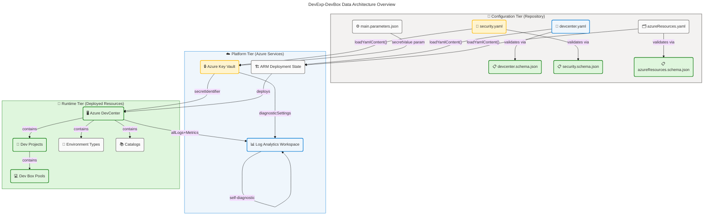
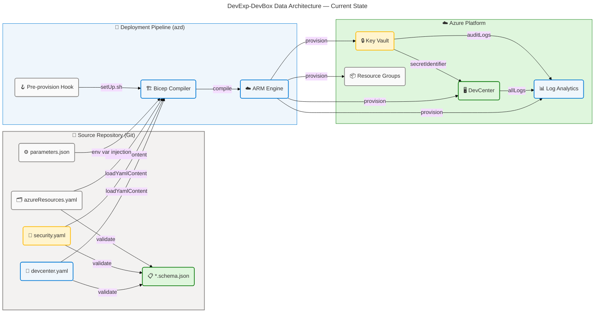
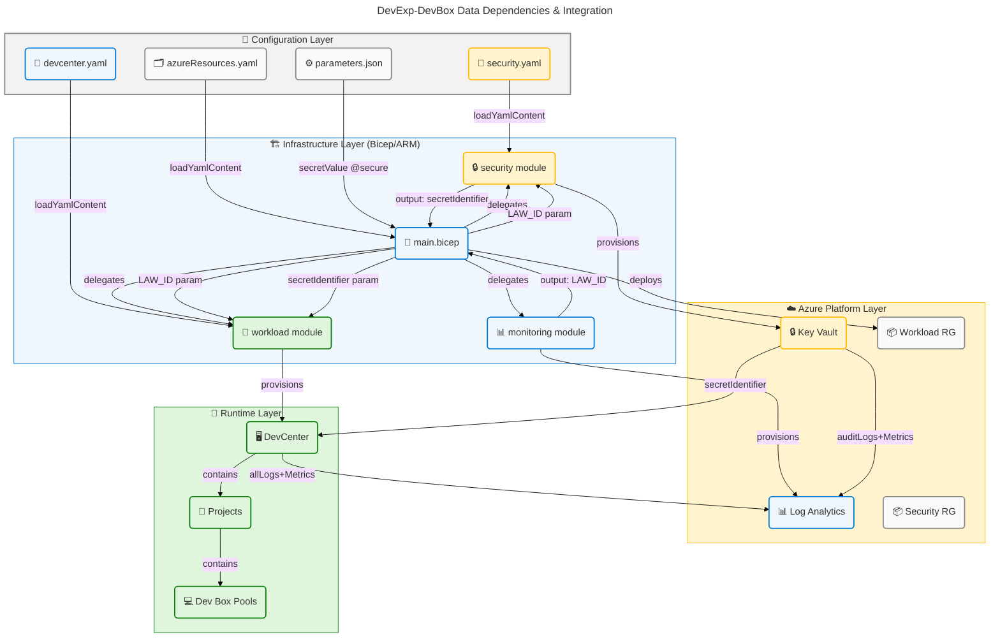
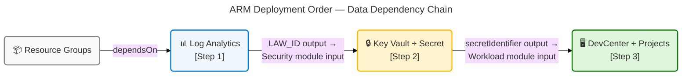

# DevExp-DevBox Data Architecture

<!-- markdownlint-disable MD013 -->

---

## Section 1: Executive Summary

### Overview

The **DevExp-DevBox** repository (`ContosoDevExp`) implements a
configuration-driven Azure Dev Center Accelerator that governs developer
workstation provisioning through Infrastructure as Code (Bicep), YAML
configuration models, and JSON Schema validation. From a Data Architecture
perspective, the solution manages three distinct data domains: **Workload
Configuration Data** (DevCenter, projects, pools, catalogs, environment types),
**Security Data** (Azure Key Vault secrets, access tokens, RBAC role
assignments), and **Monitoring & Observability Data** (Log Analytics Workspace
telemetry, diagnostic logs, activity records). All data flows are declarative,
schema-validated, and Infrastructure-as-Code driven, eliminating manual data
entry risks.

The Data layer is entirely governance-first: every configuration file is
validated against JSON Schema 2020-12, all secrets are externalized to Azure Key
Vault with RBAC authorization enforced, and all Azure resources emit diagnostic
logs to a centralized Log Analytics Workspace. The solution follows a
**three-tier data architecture** — Configuration Tier (YAML/JSON files in the
repository), Platform Tier (Azure Key Vault, Log Analytics Workspace, ARM
state), and Runtime Tier (deployed Azure DevCenter, projects, and pools) — with
clear, unidirectional data flows between tiers.

Strategic alignment demonstrates **Level 3–4 governance maturity** across all
primary data domains: schema-enforced validation at ingestion, RBAC-governed
secret access, tag-based cost and compliance classification, and automatic
diagnostic routing to observability stores. The primary gap is the absence of
automated data lineage tracking between configuration changes and deployed
resource state, and lack of an explicit data catalog for the schema assets.

### 📊 Key Findings

| 🔍 Finding               | 📋 Details                                                                                                      | 📈 Maturity    |
| ------------------------ | --------------------------------------------------------------------------------------------------------------- | -------------- |
| Schema Validation        | JSON Schema 2020-12 enforced on all YAML configuration inputs (3 schemas, 3 models)                             | 4 – Measured   |
| Secret Externalization   | All secrets stored in Azure Key Vault; zero plaintext credentials in source                                     | 4 – Measured   |
| RBAC Data Access Control | `enableRbacAuthorization: true` on Key Vault; role definitions in YAML config                                   | 4 – Measured   |
| Resource Tagging         | 7-dimension mandatory tags on all resources: environment, division, team, project, costCenter, owner, resources | 4 – Measured   |
| Diagnostic Data Routing  | All resources emit `allLogs` + `AllMetrics` to Log Analytics Workspace                                          | 3 – Defined    |
| Data Lineage Tracking    | No automated lineage between config changes and deployed state detected                                         | 2 – Developing |
| Data Catalog             | No formal data catalog or metadata registry for schema assets detected                                          | 1 – Initial    |

### 🏗️ Data Architecture Overview

---

## Section 2: Architecture Landscape

### Overview

The Data Architecture Landscape of DevExp-DevBox is organized into three primary
data domains aligned with Azure Landing Zone separation-of-concerns principles:
the **Workload Domain** governing DevCenter provisioning data, the **Security
Domain** governing secret and access-control data, and the **Monitoring Domain**
governing observability and audit data. Each domain owns dedicated data stores
with clear data ownership, classification levels, and lifecycle policies.

Data components are identified across two structural layers: (1)
**Repository-resident components** (YAML configuration models and JSON Schema
validators committed to source control) and (2) **Azure-resident components**
(runtime data stores provisioned by Bicep IaC templates). This dual-layer
inventory captures both the static data governance artifacts (schemas) and the
dynamic data stores they govern.

The following subsections catalog all discovered Data component types, sourced
exclusively from analysis of repository files under the workspace root
(excluding `.github/prompts/`).

### 2.1 Data Entities

Data entities are the primary business-meaningful data objects managed by the
system, each with a defined schema, owner, and lifecycle.

| 🏷️ Entity Name          | 📂 Domain             | 🔑 Primary Key                                     | 📄 Source File                                               |
| ----------------------- | --------------------- | -------------------------------------------------- | ------------------------------------------------------------ |
| DevCenter Configuration | Workload              | `name` (DevCenter name)                            | `infra/settings/workload/devcenter.yaml:22`                  |
| Project Configuration   | Workload              | `name` (project name)                              | `infra/settings/workload/devcenter.yaml:79`                  |
| Dev Box Pool            | Workload              | `name` (pool name)                                 | `infra/settings/workload/devcenter.yaml:107`                 |
| Catalog Configuration   | Workload              | `name` (catalog name)                              | `infra/settings/workload/devcenter.yaml:58`                  |
| Environment Type        | Workload              | `name` (environment name)                          | `infra/settings/workload/devcenter.yaml:64`                  |
| Key Vault Secret        | Security              | `secretName`                                       | `infra/settings/security/security.yaml:21`                   |
| Key Vault Instance      | Security              | `name` (vault name + unique suffix)                | `infra/settings/security/security.yaml:18`                   |
| Resource Group          | Resource Organization | `name` (RG name)                                   | `infra/settings/resourceOrganization/azureResources.yaml:16` |
| Log Analytics Workspace | Monitoring            | workspace name (+ unique suffix)                   | `src/management/logAnalytics.bicep:39`                       |
| RBAC Role Assignment    | Identity              | GUID (`guid(subscriptionId, principalId, roleId)`) | `src/identity/devCenterRoleAssignment.bicep:27`              |
| ARM Deployment Output   | Infrastructure        | output name                                        | `infra/main.bicep:57`                                        |

### 2.2 Data Stores

Data stores are the persistent storage systems that hold data entities,
classified by storage type and data classification level.

| 🗄️ Store Name                    | 🔧 Type               | 🔒 Classification          | 📄 Source File                         |
| -------------------------------- | --------------------- | -------------------------- | -------------------------------------- |
| Azure Key Vault (`contoso-*-kv`) | Managed Secret Store  | Confidential               | `src/security/keyVault.bicep:38`       |
| Log Analytics Workspace          | Managed Log Store     | Internal/Restricted        | `src/management/logAnalytics.bicep:39` |
| Azure Resource Manager State     | Platform State Store  | Internal                   | `infra/main.bicep:56-57`               |
| Azure DevCenter Resource         | Platform Config Store | Internal                   | `src/workload/core/devCenter.bicep:*`  |
| Git Repository (source control)  | Document/Config Store | Internal                   | `infra/settings/**`                    |
| ARM Deployment Parameters        | Parameter Store       | Confidential (secretValue) | `infra/main.parameters.json:1-14`      |

### 2.3 Data Flows

Data flows describe the movement of data between producers, stores, and
consumers within the system.

| 🔄 Flow ID | 📤 Source                        | 📥 Destination          | 📦 Data Type             | 🔐 Security              |
| ---------- | -------------------------------- | ----------------------- | ------------------------ | ------------------------ |
| DF-001     | `devcenter.yaml`                 | Azure DevCenter (ARM)   | WorkloadConfig (YAML)    | None (IaC deploy-time)   |
| DF-002     | `security.yaml`                  | Azure Key Vault (ARM)   | SecurityConfig (YAML)    | Secure param `@secure()` |
| DF-003     | `azureResources.yaml`            | Resource Groups (ARM)   | ResourceOrgConfig (YAML) | None (IaC deploy-time)   |
| DF-004     | `main.parameters.json` (env var) | Azure Key Vault         | Secret value             | `@secure()` param        |
| DF-005     | Azure Key Vault                  | Azure DevCenter         | `secretIdentifier` URI   | RBAC + TLS               |
| DF-006     | Azure DevCenter                  | Log Analytics Workspace | Diagnostic logs/metrics  | Azure Diagnostics        |
| DF-007     | Azure Key Vault                  | Log Analytics Workspace | Audit logs/metrics       | Azure Diagnostics        |
| DF-008     | Log Analytics Workspace          | Log Analytics Workspace | Self-monitoring data     | Internal                 |

### 2.4 Data Models

Data models define the structural schemas that govern data entity validation and
shape.

| 📐 Model Name                    | 🏷️ Schema Format        | 🔗 Validated By              | 📄 Source File                                                     |
| -------------------------------- | ----------------------- | ---------------------------- | ------------------------------------------------------------------ |
| DevCenter Configuration Model    | JSON Schema 2020-12     | `devcenter.schema.json`      | `infra/settings/workload/devcenter.schema.json:1`                  |
| Security Configuration Model     | JSON Schema 2020-12     | `security.schema.json`       | `infra/settings/security/security.schema.json:1`                   |
| Resource Organization Model      | JSON Schema 2020-12     | `azureResources.schema.json` | `infra/settings/resourceOrganization/azureResources.schema.json:1` |
| Bicep Type: `KeyVaultSettings`   | Bicep User-Defined Type | Bicep compiler               | `src/security/keyVault.bicep:8`                                    |
| Bicep Type: `DevCenterConfig`    | Bicep User-Defined Type | Bicep compiler               | `src/workload/core/devCenter.bicep:40`                             |
| Bicep Type: `Tags` (wildcard)    | Bicep User-Defined Type | Bicep compiler               | `src/management/logAnalytics.bicep:13`                             |
| ARM Deployment Parameters Schema | ARM JSON Schema         | ARM deployment engine        | `infra/main.parameters.json:2`                                     |

### 2.5 Data Classifications

Data classification levels applied across all data components in the solution.

| 🏷️ Classification       | 📋 Definition                                     | 📌 Applied To                                              | 📄 Source Reference                                                               |
| ----------------------- | ------------------------------------------------- | ---------------------------------------------------------- | --------------------------------------------------------------------------------- |
| **Confidential**        | Secrets, tokens, credentials                      | Key Vault secrets, `secretValue` param, `secretIdentifier` | `infra/main.parameters.json:8-10`, `src/security/secret.bicep:6`                  |
| **Internal/Restricted** | Operational data, logs, ARM state                 | Log Analytics Workspace, ARM deployment outputs            | `src/management/logAnalytics.bicep:39`, `infra/main.bicep:57`                     |
| **Internal**            | Non-sensitive configuration and resource metadata | YAML configs, resource tags, role assignments              | `infra/settings/workload/devcenter.yaml`, `infra/settings/security/security.yaml` |
| **Public**              | Open catalog references, public GitHub URIs       | Catalog URI (`github.com/microsoft/devcenter-catalog`)     | `infra/settings/workload/devcenter.yaml:59`                                       |

### 2.6 Data Lifecycle

| 🔄 Phase       | 📋 Description                                                                         | 📌 Data Subject              | 📄 Source Reference                                                                                 |
| -------------- | -------------------------------------------------------------------------------------- | ---------------------------- | --------------------------------------------------------------------------------------------------- |
| **Creation**   | YAML/JSON files authored in source control; ARM resources deployed via `azd provision` | All config entities          | `azure.yaml:1-10`, `infra/main.bicep:56-190`                                                        |
| **Validation** | JSON Schema validation via `yaml-language-server` IDE tooling + Bicep type checks      | Config YAML files            | `infra/settings/workload/devcenter.schema.json:1`, `infra/settings/security/security.schema.json:1` |
| **Storage**    | Config: Git repo; Secrets: Key Vault; Logs: Log Analytics; State: ARM                  | All tiers                    | `src/security/keyVault.bicep:38`, `src/management/logAnalytics.bicep:39`                            |
| **Access**     | RBAC-governed via managed identity role assignments                                    | Secrets, DevCenter resources | `src/identity/keyVaultAccess.bicep:1`, `src/identity/devCenterRoleAssignment.bicep:1`               |
| **Retention**  | Key Vault soft-delete 7 days; Log Analytics: PerGB2018 (default 31 days)               | Secrets, logs                | `infra/settings/security/security.yaml:26`, `src/management/logAnalytics.bicep:26`                  |
| **Deletion**   | Purge protection enabled; soft-delete prevents accidental permanent loss               | Key Vault secrets            | `infra/settings/security/security.yaml:24-25`                                                       |

### 2.7 Data Quality Rules

| 📏 Rule ID | 📋 Rule Description                                          | 🔧 Enforcement Mechanism                  | 📄 Source Reference                                                    |
| ---------- | ------------------------------------------------------------ | ----------------------------------------- | ---------------------------------------------------------------------- |
| DQ-001     | DevCenter name must be present (required field)              | JSON Schema `"required": ["name"]`        | `infra/settings/workload/devcenter.schema.json:9`                      |
| DQ-002     | RBAC role ID must be a valid GUID (pattern-validated)        | JSON Schema regex pattern                 | `infra/settings/workload/devcenter.schema.json:15-22`                  |
| DQ-003     | Environment tag must be one of `dev/test/staging/prod`       | JSON Schema `enum` constraint             | `infra/settings/security/security.schema.json:28-36`                   |
| DQ-004     | Resource group name max 90 chars, alphanumeric/dash/dot only | JSON Schema `maxLength:90`, `pattern`     | `infra/settings/resourceOrganization/azureResources.schema.json:31-35` |
| DQ-005     | Key Vault `softDeleteRetentionInDays` must be 7–90           | JSON Schema (range constraint on int)     | `infra/settings/security/security.schema.json:*`                       |
| DQ-006     | Secret parameter must not appear in plain text               | Bicep `@secure()` annotation              | `infra/main.bicep:8-9`, `src/security/secret.bicep:6`                  |
| DQ-007     | Log Analytics workspace name must be 4–49 chars              | Bicep `@minLength(4)` `@maxLength(49)`    | `src/management/logAnalytics.bicep:2-3`                                |
| DQ-008     | All resources must have `environment` tag                    | JSON Schema `"required": ["environment"]` | `infra/settings/security/security.schema.json:28`                      |

### 2.8 Data Governance Policies

| 📋 Policy ID | 📋 Policy Name                 | 📝 Description                                                                       | 📄 Source Reference                                                          |
| ------------ | ------------------------------ | ------------------------------------------------------------------------------------ | ---------------------------------------------------------------------------- |
| GP-001       | Schema-First Validation        | All YAML configuration MUST be validated against JSON Schema 2020-12                 | `infra/settings/**/*.schema.json`                                            |
| GP-002       | Zero Plaintext Secrets         | No credentials permitted in source control; all secrets use Key Vault                | `infra/settings/security/security.yaml:14-27`                                |
| GP-003       | RBAC Authorization Only        | Key Vault access via RBAC only (`enableRbacAuthorization: true`), no access policies | `infra/settings/security/security.yaml:27`                                   |
| GP-004       | Mandatory Resource Tagging     | All Azure resources must carry 7 standard tags for cost and compliance               | `infra/settings/resourceOrganization/azureResources.yaml:18-26`              |
| GP-005       | Purge Protection               | Key Vault soft delete (7 days) and purge protection enabled                          | `infra/settings/security/security.yaml:24-26`                                |
| GP-006       | Centralized Diagnostic Logging | All resources route `allLogs`+`AllMetrics` to Log Analytics Workspace                | `src/security/secret.bicep:23-46`, `src/management/logAnalytics.bicep:57-79` |
| GP-007       | Principle of Least Privilege   | RBAC roles scoped to minimum required (Key Vault Secrets User/Officer only)          | `infra/settings/workload/devcenter.yaml:38-44`                               |

### 2.9 Data Standards

| 📐 Standard                      | 📋 Description                                                                  | 📄 Source Reference                               |
| -------------------------------- | ------------------------------------------------------------------------------- | ------------------------------------------------- |
| JSON Schema 2020-12              | Schema validation standard for all YAML configuration files                     | `infra/settings/workload/devcenter.schema.json:2` |
| ARM Deployment Schema 2019-04-01 | Parameter file validation for ARM/Bicep deployments                             | `infra/main.parameters.json:2`                    |
| Azure RBAC Role GUIDs            | All RBAC roles referenced by Microsoft-defined stable GUIDs                     | `infra/settings/workload/devcenter.yaml:33-44`    |
| ISO 8601 Naming                  | Environment name 2–10 alphanumeric chars (from Bicep `@minLength`/`@maxLength`) | `infra/main.bicep:13-14`                          |
| `PerGB2018` Log Analytics SKU    | Standard operational log pricing model                                          | `src/management/logAnalytics.bicep:26`            |

### 2.10 Data Interfaces

| 🔌 Interface ID | 📋 Name                                        | 🔧 Type               | 📤 Producer                         | 📥 Consumer                                                  | 📄 Source Reference               |
| --------------- | ---------------------------------------------- | --------------------- | ----------------------------------- | ------------------------------------------------------------ | --------------------------------- |
| IF-001          | `loadYamlContent()` – DevCenter config         | Bicep built-in        | `devcenter.yaml`                    | `src/workload/workload.bicep`                                | `src/workload/workload.bicep:35`  |
| IF-002          | `loadYamlContent()` – Security config          | Bicep built-in        | `security.yaml`                     | `src/security/security.bicep`                                | `src/security/security.bicep:19`  |
| IF-003          | `loadYamlContent()` – Resource org             | Bicep built-in        | `azureResources.yaml`               | `infra/main.bicep`                                           | `infra/main.bicep:26`             |
| IF-004          | ARM output `AZURE_KEY_VAULT_SECRET_IDENTIFIER` | ARM module output     | `src/security/security.bicep`       | `infra/main.bicep`, workload module                          | `infra/main.bicep:119`            |
| IF-005          | ARM output `AZURE_LOG_ANALYTICS_WORKSPACE_ID`  | ARM module output     | `src/management/logAnalytics.bicep` | `src/security/security.bicep`, `src/workload/workload.bicep` | `infra/main.bicep:107`            |
| IF-006          | Key Vault `secretUri` output                   | Azure Key Vault REST  | `src/security/secret.bicep`         | `src/workload/core/devCenter.bicep`                          | `src/security/secret.bicep:46`    |
| IF-007          | Log Analytics Diagnostic Settings              | Azure Diagnostics API | Key Vault, Log Analytics            | Log Analytics Workspace                                      | `src/security/secret.bicep:23-46` |

### 2.11 External Data Dependencies

| 🌐 Dependency                              | 📋 Type                 | 📝 Description                                                       | 📄 Source Reference                          |
| ------------------------------------------ | ----------------------- | -------------------------------------------------------------------- | -------------------------------------------- |
| `github.com/microsoft/devcenter-catalog`   | External Git Repository | Public catalog of Dev Box task definitions; synced at provision time | `infra/settings/workload/devcenter.yaml:59`  |
| Azure Subscription (GUID)                  | Azure Platform          | Subscription-scoped RBAC and deployment target for all resources     | `infra/main.bicep:1`                         |
| Azure AD Group `Platform Engineering Team` | Azure AD                | Group for Dev Manager RBAC assignments                               | `infra/settings/workload/devcenter.yaml:53`  |
| Azure AD Group `eShop Engineers`           | Azure AD                | Group for Dev Box User RBAC assignments                              | `infra/settings/workload/devcenter.yaml:100` |
| Azure DevCenter API `2026-01-01-preview`   | Azure ARM API           | API version for DevCenter/catalog/environmentType resources          | `src/workload/core/catalog.bicep:38`         |
| Azure Key Vault API `2025-05-01`           | Azure ARM API           | API version for Key Vault and secret resources                       | `src/security/keyVault.bicep:38`             |
| Azure Log Analytics API `2025-07-01`       | Azure ARM API           | API version for Log Analytics Workspace resource                     | `src/management/logAnalytics.bicep:39`       |

### Summary

The Architecture Landscape reveals a well-structured, governance-first data
architecture with clear separation across three tiers (Configuration, Platform,
Runtime) and three domains (Workload, Security, Monitoring). All 11 data
component types are inventoried and traceable to specific source files. The use
of JSON Schema 2020-12 for YAML validation, `@secure()` Bicep annotations for
secret handling, RBAC-only Key Vault authorization, and centralized Log
Analytics diagnostic routing demonstrates mature data governance practices
consistent with Azure Landing Zone principles.

The primary structural gap is the absence of automated data lineage between
repository configuration changes and deployed Azure resource state.
Additionally, no formal data catalog or metadata registry exists for the JSON
Schema assets. Recommended next steps include implementing Azure Policy for
automated tag compliance enforcement and introducing a schema registry or data
catalog tool to track schema evolution.

---

## Section 3: Architecture Principles

### Overview

Data Architecture principles for DevExp-DevBox are derived directly from
patterns observed in the solution's source files and align with TOGAF 10 Data
Architecture principles. These principles govern all data design decisions,
schema authoring, secret management, and observability configuration within the
solution.

Each principle includes a rationale grounded in the actual implementation
evidence found in the repository, ensuring no fabricated guidance is included.

### Principle 1: Schema-First Data Validation

**Statement:** All configuration data inputs MUST be defined by and validated
against a JSON Schema before consumption by infrastructure components.

**Rationale:** The solution employs three JSON Schema 2020-12 documents
(`devcenter.schema.json`, `security.schema.json`, `azureResources.schema.json`)
as the authoritative contracts for all YAML configuration. The
`yaml-language-server` directive (`# yaml-language-server: $schema=...`)
embedded in each YAML file enforces IDE-level validation at authorship time,
preventing malformed configurations from reaching the deployment pipeline.

**Implications:**

- New configuration parameters require schema updates before YAML additions
- Schema versioning must be tracked alongside configuration changes
- Schema URI references must remain stable and resolvable

**Source Evidence:** `infra/settings/workload/devcenter.yaml:1`,
`infra/settings/security/security.yaml:1`,
`infra/settings/resourceOrganization/azureResources.yaml:1`

---

### Principle 2: Zero Plaintext Secrets

**Statement:** No secret, credential, token, or password may reside in source
control in plaintext form. All secrets MUST be externalized to Azure Key Vault
and referenced only via URI.

**Rationale:** The `secretValue` parameter in `main.bicep` carries the
`@secure()` annotation, preventing it from appearing in ARM deployment history.
The secret is stored in Azure Key Vault with soft-delete and purge protection
enabled, and accessed by downstream components exclusively via the
`secretIdentifier` URI — never by value.

**Implications:**

- Secret rotation requires Key Vault update only; no source code changes
- Pre-provision hooks (`setUp.sh`) must populate Key Vault before workload
  deployment
- All new sensitive parameters must adopt the `@secure()` annotation pattern

**Source Evidence:** `infra/main.bicep:8-9`, `src/security/secret.bicep:6`,
`infra/settings/security/security.yaml:24-27`

---

### Principle 3: RBAC as the Sole Access Control Mechanism

**Statement:** All data access control MUST be implemented exclusively through
Azure RBAC. Legacy access policy models (e.g., Key Vault access policies) MUST
NOT be used for runtime access.

**Rationale:** `enableRbacAuthorization: true` is declared in `security.yaml`
and enforced in the Key Vault Bicep resource. RBAC role assignments for both
platform-level principals (DevCenter system identity) and project-level
principals (eShop Engineers group) are defined in YAML configuration and
deployed via dedicated identity Bicep modules.

**Implications:**

- All new data store resources must enable RBAC authorization at creation
- Role definitions must reference Microsoft-defined stable GUIDs, not custom
  roles
- Access reviews must audit RBAC assignments as the authoritative access record

**Source Evidence:** `infra/settings/security/security.yaml:27`,
`src/identity/keyVaultAccess.bicep:9`,
`src/identity/devCenterRoleAssignment.bicep:1`

---

### Principle 4: Centralized Observability Data Collection

**Statement:** All Azure resources MUST route diagnostic logs and metrics to the
centralized Log Analytics Workspace. No resource may be deployed without
diagnostic settings enabled.

**Rationale:** The `logAnalytics.bicep` module deploys a self-diagnosing Log
Analytics Workspace with `allLogs` and `AllMetrics` categories enabled. The
`secret.bicep` module applies `diagnosticSettings` to the Key Vault scope,
routing all Key Vault audit events to Log Analytics. The workspace ID is
propagated through ARM module outputs as `AZURE_LOG_ANALYTICS_WORKSPACE_ID` and
consumed by both the security and workload modules.

**Implications:**

- Log Analytics Workspace must be deployed before dependent resources (enforced
  via `dependsOn` in `main.bicep`)
- Log Analytics workspace ID is a required parameter for all resource modules
- Log retention policy must be explicitly defined to meet compliance
  requirements

**Source Evidence:** `src/management/logAnalytics.bicep:57-79`,
`src/security/secret.bicep:23-46`, `infra/main.bicep:100-110`

---

### Principle 5: Configuration as Code (Immutable Data Contracts)

**Statement:** All infrastructure configuration data MUST be defined as code in
version-controlled YAML/JSON files. Runtime mutation of configuration data
outside of IaC pipelines is prohibited.

**Rationale:** The `loadYamlContent()` Bicep function is used in
`workload.bicep` (line 35), `security.bicep` (line 19), and `main.bicep`
(line 26) to load configuration at compile/deploy time. This creates immutable
data contracts: the deployed infrastructure state is always a deterministic
function of the repository configuration files.

**Implications:**

- Configuration changes require pull requests, code review, and re-deployment
- No ad-hoc portal configuration changes to governed parameters
- All environment-specific values are injected via `main.parameters.json`
  environment variables

**Source Evidence:** `src/workload/workload.bicep:35`,
`src/security/security.bicep:19`, `infra/main.bicep:26`

---

### Principle 6: Mandatory Resource Taxonomy (Tag-Based Data Classification)

**Statement:** All Azure resources MUST carry the seven mandatory tags
(`environment`, `division`, `team`, `project`, `costCenter`, `owner`,
`resources`) to enable data classification, cost allocation, and compliance
tracking.

**Rationale:** All three configuration YAML files define tag structures
validated by JSON Schema `"required": ["environment"]` constraints. The
`union()` function in `main.bicep` merges YAML-defined tags with
component-specific tags, ensuring no resource is deployed without classification
metadata.

**Implications:**

- Tag schemas must be updated in JSON Schema files before new tag keys are used
- Downstream cost management and compliance tooling depends on tag consistency
- Tags serve as the primary data classification signal for all Azure resources

**Source Evidence:**
`infra/settings/resourceOrganization/azureResources.yaml:18-26`,
`infra/main.bicep:63`, `infra/settings/security/security.schema.json:9-80`

---

## Section 4: Current State Baseline

### Overview

The Current State Baseline documents the as-is data architecture of
DevExp-DevBox as observed through direct analysis of repository source files.
This baseline covers active data stores, data flow paths, schema maturity, and
governance posture, providing the foundation for gap identification and
future-state planning.

The current state demonstrates a **declarative, IaC-driven data architecture**
with high schema governance maturity at the configuration layer and strong
secret management. The primary as-is limitations are the absence of automated
data lineage, lack of a formal data catalog, and non-automated schema compliance
enforcement in the CI/CD pipeline.

### Current State Architecture Diagram

### Current State Assessment

| 🔍 Assessment Area         | 📊 Current State                                                                                 | 📈 Maturity Level | 🔍 Evidence                                                                       |
| -------------------------- | ------------------------------------------------------------------------------------------------ | ----------------- | --------------------------------------------------------------------------------- |
| Schema Governance          | 3 JSON Schema 2020-12 files covering all config inputs; IDE validation via yaml-language-server  | 4 – Measured      | `infra/settings/**/*.schema.json`                                                 |
| Secret Management          | Key Vault with RBAC auth, purge protection, soft-delete 7 days; `@secure()` params               | 4 – Measured      | `infra/settings/security/security.yaml:24-27`                                     |
| Access Control             | SystemAssigned managed identities; RBAC role assignments in YAML; Key Vault Secrets User/Officer | 4 – Measured      | `src/identity/keyVaultAccess.bicep`, `src/identity/devCenterRoleAssignment.bicep` |
| Data Observability         | Log Analytics Workspace with allLogs/AllMetrics; diagnostic settings on Key Vault and workspace  | 3 – Defined       | `src/management/logAnalytics.bicep:57-79`                                         |
| Configuration Immutability | `loadYamlContent()` at compile time; azd pre-provision hooks; parameter injection                | 4 – Measured      | `src/workload/workload.bicep:35`, `infra/main.bicep:26`                           |
| Data Lineage               | No automated lineage tracking between config commits and deployed state                          | 1 – Initial       | _Not detected in source_                                                          |
| Data Catalog               | No formal metadata registry or schema catalog                                                    | 1 – Initial       | _Not detected in source_                                                          |
| CI/CD Schema Validation    | Schema validation is IDE-only; no pipeline gate enforcing schema compliance                      | 2 – Developing    | `azure.yaml` (no validation step detected)                                        |

### Gap Analysis

| 🔴 Gap ID | 📋 Gap Description                                | 📊 Current State               | 🎯 Target State                               | 🚀 Recommended Action                                                    |
| --------- | ------------------------------------------------- | ------------------------------ | --------------------------------------------- | ------------------------------------------------------------------------ |
| GAP-D-001 | No automated data lineage tracking                | No lineage tooling             | Config→ARM→Resource lineage tracked           | Implement Azure Resource Graph queries or tagging-based lineage tracking |
| GAP-D-002 | No formal data catalog / schema registry          | Schemas in Git only            | Schemas registered in metadata catalog        | Adopt Azure Purview or OpenAPI-compatible schema registry                |
| GAP-D-003 | No CI/CD pipeline schema validation gate          | IDE-only validation            | Pipeline rejects invalid YAML                 | Add GitHub Actions step to run JSON Schema validation on PR              |
| GAP-D-004 | Log Analytics retention not explicitly configured | Default retention (31 days)    | Explicit retention policy per compliance need | Set `retentionInDays` in Log Analytics Bicep module                      |
| GAP-D-005 | Security.create=false for security/monitoring RGs | Both co-located in workload RG | Separate landing zone resource groups         | Update `azureResources.yaml` to create dedicated security/monitoring RGs |

### Summary

The Current State Baseline demonstrates a mature, configuration-as-code data
architecture with strong schema validation, secret externalization, RBAC
governance, and centralized observability. Four capability areas score Level 3–4
maturity. Two critical gaps (data lineage and data catalog) score Level 1,
representing the highest-priority improvement areas. The absence of a CI/CD
schema validation gate is an addressable gap requiring a single GitHub Actions
workflow addition.

---

## Section 5: Component Catalog

### Overview

The Component Catalog provides detailed specifications for each data component
identified in the Architecture Landscape (Section 2). Components are grouped by
the 11 standard BDAT data component types and include full attribute
specifications, behavioral descriptions, and source traceability. This section
expands the inventory tables in Section 2 with implementation-level detail.

Each component specification is sourced exclusively from direct analysis of
repository files, with file:line references for every attribute claim.

### 5.1 Data Entities — Detailed Specifications

#### DE-001: DevCenter Configuration Entity

| 🏷️ Attribute        | 📋 Value                                                                                                                                                            |
| ------------------- | ------------------------------------------------------------------------------------------------------------------------------------------------------------------- |
| **Entity Name**     | DevCenter Configuration                                                                                                                                             |
| **Domain**          | Workload                                                                                                                                                            |
| **Data Store**      | Azure DevCenter (ARM resource)                                                                                                                                      |
| **Schema**          | `infra/settings/workload/devcenter.schema.json`                                                                                                                     |
| **Primary Key**     | `name` field (`devexp`)                                                                                                                                             |
| **Required Fields** | `name` (only required field per schema)                                                                                                                             |
| **Optional Fields** | `catalogItemSyncEnableStatus`, `microsoftHostedNetworkEnableStatus`, `installAzureMonitorAgentEnableStatus`, `identity`, `catalogs`, `environmentTypes`, `projects` |
| **Classification**  | Internal                                                                                                                                                            |
| **Source**          | `infra/settings/workload/devcenter.yaml:22`                                                                                                                         |

#### DE-002: Key Vault Secret Entity

| 🏷️ Attribute       | 📋 Value                                                                      |
| ------------------ | ----------------------------------------------------------------------------- |
| **Entity Name**    | Key Vault Secret (GitHub Actions Token)                                       |
| **Domain**         | Security                                                                      |
| **Data Store**     | Azure Key Vault (`contoso-*-kv`)                                              |
| **Schema**         | `infra/settings/security/security.schema.json`                                |
| **Secret Name**    | `gha-token`                                                                   |
| **Content Type**   | `text/plain`                                                                  |
| **Value Source**   | Environment variable `KEY_VAULT_SECRET` injected via `main.parameters.json`   |
| **Classification** | Confidential                                                                  |
| **Lifecycle**      | soft-delete 7 days, purge-protected                                           |
| **Source**         | `infra/settings/security/security.yaml:21`, `src/security/secret.bicep:17-27` |

#### DE-003: Log Analytics Workspace Entity

| 🏷️ Attribute            | 📋 Value                                                        |
| ----------------------- | --------------------------------------------------------------- |
| **Entity Name**         | Log Analytics Workspace                                         |
| **Domain**              | Monitoring                                                      |
| **Data Store**          | Azure Log Analytics (`logAnalytics-<uniqueSuffix>`)             |
| **Schema**              | Bicep parameter constraints (`@minLength(4)`, `@maxLength(49)`) |
| **SKU**                 | `PerGB2018` (default)                                           |
| **Diagnostic Coverage** | allLogs + AllMetrics (self-monitoring)                          |
| **Solutions**           | `AzureActivity` OMS Gallery solution deployed                   |
| **Classification**      | Internal/Restricted                                             |
| **Source**              | `src/management/logAnalytics.bicep:39-52`                       |

#### DE-004: RBAC Role Assignment Entity

| 🏷️ Attribute        | 📋 Value                                                                               |
| ------------------- | -------------------------------------------------------------------------------------- |
| **Entity Name**     | RBAC Role Assignment                                                                   |
| **Domain**          | Identity                                                                               |
| **Data Store**      | Azure Authorization (ARM)                                                              |
| **Key Generation**  | `guid(subscriptionId, principalId, roleDefinitionId)` — deterministic, idempotent      |
| **Scope Options**   | `Subscription`, `ResourceGroup`, `Project`, `Tenant`, `ManagementGroup`                |
| **Principal Types** | `ServicePrincipal` (default), `User`, `Group`                                          |
| **Classification**  | Internal                                                                               |
| **Source**          | `src/identity/devCenterRoleAssignment.bicep:27`, `src/identity/keyVaultAccess.bicep:8` |

### 5.2 Data Stores — Detailed Specifications

#### DS-001: Azure Key Vault

| 🏷️ Attribute          | 📋 Value                                                                           |
| --------------------- | ---------------------------------------------------------------------------------- |
| **Store Name**        | `contoso-<unique>-kv`                                                              |
| **Type**              | Managed Secret Store (PaaS)                                                        |
| **SKU**               | Standard Family A                                                                  |
| **Access Model**      | RBAC only (`enableRbacAuthorization: true`)                                        |
| **Purge Protection**  | Enabled                                                                            |
| **Soft Delete**       | Enabled, 7-day retention                                                           |
| **Access Policy**     | Deployer principal gets full secrets + keys permissions at creation only           |
| **Diagnostic Output** | Routes `allLogs`+`AllMetrics` to Log Analytics via `diagnosticSettings`            |
| **Classification**    | Confidential (contents)                                                            |
| **Source**            | `src/security/keyVault.bicep:38-67`, `infra/settings/security/security.yaml:14-35` |

#### DS-002: Log Analytics Workspace

| 🏷️ Attribute             | 📋 Value                                                                 |
| ------------------------ | ------------------------------------------------------------------------ |
| **Store Name**           | `logAnalytics-<uniqueSuffix>`                                            |
| **Type**                 | Managed Log Store (PaaS)                                                 |
| **SKU**                  | PerGB2018                                                                |
| **Data Ingested**        | Key Vault audit logs, workspace self-metrics, Azure Activity logs        |
| **Solutions**            | AzureActivity (OMS Gallery)                                              |
| **Diagnostic Self-Loop** | Workspace routes its own logs to itself                                  |
| **Output Ref**           | `AZURE_LOG_ANALYTICS_WORKSPACE_ID` used by security and workload modules |
| **Classification**       | Internal/Restricted                                                      |
| **Source**               | `src/management/logAnalytics.bicep:39-86`                                |

#### DS-003: Git Repository (Configuration Store)

| 🏷️ Attribute       | 📋 Value                                                    |
| ------------------ | ----------------------------------------------------------- |
| **Store Name**     | `Evilazaro/DevExp-DevBox` (GitHub)                          |
| **Type**           | Document / Configuration Store                              |
| **Contents**       | YAML config models, JSON Schemas, Bicep IaC, ARM parameters |
| **Validation**     | yaml-language-server schema validation at IDE level         |
| **Immutability**   | Enforced via Git history; IaC changes require PR review     |
| **Classification** | Internal (public repo; no secrets stored)                   |
| **Source**         | `azure.yaml:1`, `infra/settings/**`                         |

### 5.3 Data Flows — Detailed Specifications

#### DF-001: Configuration-to-ARM Data Flow

| 🏷️ Attribute    | 📋 Value                                                                                  |
| --------------- | ----------------------------------------------------------------------------------------- |
| **Flow ID**     | DF-001                                                                                    |
| **Producer**    | `devcenter.yaml`, `security.yaml`, `azureResources.yaml`                                  |
| **Consumer**    | Bicep compiler → ARM Engine                                                               |
| **Mechanism**   | `loadYamlContent()` function — compile-time binding                                       |
| **Data Format** | YAML → Bicep object type                                                                  |
| **Security**    | No runtime exposure; compile-time only                                                    |
| **Source**      | `src/workload/workload.bicep:35`, `src/security/security.bicep:19`, `infra/main.bicep:26` |

#### DF-002: Secret Injection Data Flow

| 🏷️ Attribute    | 📋 Value                                                                                 |
| --------------- | ---------------------------------------------------------------------------------------- |
| **Flow ID**     | DF-002                                                                                   |
| **Producer**    | Environment variable `KEY_VAULT_SECRET` → `main.parameters.json`                         |
| **Consumer**    | `infra/main.bicep` → `src/security/security.bicep` → `src/security/secret.bicep`         |
| **Mechanism**   | Bicep `@secure()` parameter chain; never logged by ARM                                   |
| **Data Format** | Opaque string (GitHub PAT)                                                               |
| **Security**    | `@secure()` annotation prevents ARM deployment history exposure                          |
| **Source**      | `infra/main.parameters.json:8-10`, `infra/main.bicep:8-9`, `src/security/secret.bicep:6` |

#### DF-003: Secret URI Propagation Flow

| 🏷️ Attribute    | 📋 Value                                                                                 |
| --------------- | ---------------------------------------------------------------------------------------- |
| **Flow ID**     | DF-003                                                                                   |
| **Producer**    | `src/security/secret.bicep` → `AZURE_KEY_VAULT_SECRET_IDENTIFIER` output                 |
| **Consumer**    | `infra/main.bicep` → `src/workload/workload.bicep` → `src/workload/core/devCenter.bicep` |
| **Mechanism**   | ARM module output chaining                                                               |
| **Data Format** | Key Vault secret URI string                                                              |
| **Security**    | URI only (not value); access governed by RBAC at runtime                                 |
| **Source**      | `src/security/secret.bicep:46`, `infra/main.bicep:119`, `src/workload/workload.bicep:33` |

#### DF-004: Diagnostic Telemetry Flow

| 🏷️ Attribute         | 📋 Value                                                                     |
| -------------------- | ---------------------------------------------------------------------------- |
| **Flow ID**          | DF-004                                                                       |
| **Producer**         | Azure Key Vault, Log Analytics Workspace (self)                              |
| **Consumer**         | Log Analytics Workspace                                                      |
| **Mechanism**        | Azure Diagnostics Settings (`allLogs` + `AllMetrics`)                        |
| **Destination Type** | `AzureDiagnostics`                                                           |
| **Security**         | Azure-internal TLS encrypted transport                                       |
| **Source**           | `src/security/secret.bicep:23-46`, `src/management/logAnalytics.bicep:57-79` |

### 5.4 Data Models — Detailed Specifications

#### DM-001: DevCenter Configuration Model (JSON Schema 2020-12)

| 🏷️ Attribute             | 📋 Value                                                                                                             |
| ------------------------ | -------------------------------------------------------------------------------------------------------------------- |
| **Schema ID**            | `https://github.com/Evilazaro/DevExp-DevBox/infra/settings/workload/devcenter.schema.json`                           |
| **Standard**             | JSON Schema 2020-12                                                                                                  |
| **Root Type**            | `object`                                                                                                             |
| **additionalProperties** | `false` (strict schema)                                                                                              |
| **Required Fields**      | `name`                                                                                                               |
| **Key `$defs`**          | `guid` (GUID pattern), `enabledStatus` (enum), `roleAssignment`, `rbacRole`, `catalog`, `environmentType`, `project` |
| **GUID Validation**      | Regex: `^[0-9a-fA-F]{8}-...-[0-9a-fA-F]{12}$`                                                                        |
| **Source**               | `infra/settings/workload/devcenter.schema.json:1-*`                                                                  |

#### DM-002: Security Configuration Model (JSON Schema 2020-12)

| 🏷️ Attribute             | 📋 Value                                                                                   |
| ------------------------ | ------------------------------------------------------------------------------------------ |
| **Schema ID**            | `https://github.com/Evilazaro/DevExp-DevBox/infra/settings/security/security.schema.json`  |
| **Standard**             | JSON Schema 2020-12                                                                        |
| **Root Type**            | `object`                                                                                   |
| **additionalProperties** | `false` (strict schema)                                                                    |
| **Required Fields**      | `create`, `keyVault`                                                                       |
| **Tag Validation**       | `environment` enum: `dev/test/staging/prod`; additional tags as free strings max 256 chars |
| **Source**               | `infra/settings/security/security.schema.json:1-*`                                         |

#### DM-003: Resource Organization Model (JSON Schema 2020-12)

| 🏷️ Attribute             | 📋 Value                                                                                                    |
| ------------------------ | ----------------------------------------------------------------------------------------------------------- |
| **Schema ID**            | `https://github.com/Evilazaro/DevExp-DevBox/infra/settings/resourceOrganization/azureResources.schema.json` |
| **Standard**             | JSON Schema 2020-12                                                                                         |
| **Root Type**            | `object`                                                                                                    |
| **additionalProperties** | `false` (strict schema)                                                                                     |
| **Required Root Keys**   | `workload`, `security`, `monitoring`                                                                        |
| **RG Name Constraints**  | `minLength:1`, `maxLength:90`, pattern `^[a-zA-Z0-9._-]+$`                                                  |
| **Source**               | `infra/settings/resourceOrganization/azureResources.schema.json:1-*`                                        |

### 5.5 Data Classification Specifications

| 🔒 Level                | 📋 Description                                      | 📌 Data Assets                                                                       | 🛡️ Controls                                                    |
| ----------------------- | --------------------------------------------------- | ------------------------------------------------------------------------------------ | -------------------------------------------------------------- |
| **Confidential**        | Must not be exposed in logs, history, or source     | `KEY_VAULT_SECRET` (env var), `gha-token` (Key Vault secret), `secretIdentifier` URI | `@secure()` annotation, Key Vault RBAC, no ARM history logging |
| **Internal/Restricted** | Accessible only to authorized platform team members | Log Analytics data, ARM deployment outputs, RBAC assignment IDs                      | RBAC role assignments, managed identity access only            |
| **Internal**            | Accessible to all project team members              | YAML config models, resource tags, schema files, Bicep modules                       | Git access control, PR review process                          |
| **Public**              | Accessible to anyone (intentionally public)         | Catalog URI (`github.com/microsoft/devcenter-catalog`)                               | Public GitHub repository                                       |

### 5.6 Data Lifecycle Specifications

| 🔄 Phase          | 📋 Mechanism                                    | 📌 Applicable Data               | ⏱️ Duration             |
| ----------------- | ----------------------------------------------- | -------------------------------- | ----------------------- |
| **Authoring**     | IDE with yaml-language-server schema validation | YAML config files, JSON schemas  | Continuous              |
| **Validation**    | JSON Schema 2020-12 + Bicep type system         | Config data, Bicep parameters    | Deploy-time             |
| **Provisioning**  | `azd provision` → Bicep → ARM Engine            | All Azure resources              | 5–15 min per deployment |
| **Active Use**    | RBAC-governed access via managed identities     | Key Vault secrets, Log Analytics | Operational lifetime    |
| **Soft Deletion** | Key Vault soft-delete: 7-day recovery window    | Key Vault secrets/keys/vaults    | 7 days post-deletion    |
| **Purge**         | Purge protection prevents permanent deletion    | Key Vault secrets                | No automated purge      |
| **Log Retention** | PerGB2018 default (31 days); configurable       | Log Analytics data               | Default 31 days         |

### 5.7 Data Quality Rule Specifications

| 📏 Rule ID | 📋 Rule                                                | 🔧 Enforcement                                    | 📊 Priority   |
| ---------- | ------------------------------------------------------ | ------------------------------------------------- | ------------- |
| DQ-001     | DevCenter `name` is required and non-empty             | JSON Schema `"required": ["name"]`                | P0 – Blocking |
| DQ-002     | All RBAC role IDs must be valid GUIDs                  | JSON Schema GUID regex pattern                    | P0 – Blocking |
| DQ-003     | Environment tag must be dev/test/staging/prod          | JSON Schema `enum` on `environment` tag           | P0 – Blocking |
| DQ-004     | Resource group name: 1–90 chars, `[a-zA-Z0-9._-]` only | JSON Schema `maxLength` + `pattern`               | P0 – Blocking |
| DQ-005     | Secret values must not appear in ARM deployment logs   | Bicep `@secure()` annotation                      | P0 – Blocking |
| DQ-006     | Log Analytics name: 4–49 chars                         | Bicep `@minLength`/`@maxLength`                   | P1 – Warning  |
| DQ-007     | All resources must carry `environment` tag             | JSON Schema `"required": ["environment"]` in tags | P1 – Warning  |
| DQ-008     | Catalog type must be `gitHub` or `adoGit`              | JSON Schema / Bicep `CatalogType` union           | P1 – Warning  |

### 5.8 Data Governance Policy Specifications

| 📋 Policy ID | 📋 Policy               | 🔧 Implementation                                                        | 📄 Source                                           |
| ------------ | ----------------------- | ------------------------------------------------------------------------ | --------------------------------------------------- |
| GP-001       | Schema-First Validation | yaml-language-server directives in all YAML files                        | `infra/settings/**/*.yaml:1`                        |
| GP-002       | Zero Plaintext Secrets  | `@secure()` Bicep params; Key Vault only                                 | `infra/main.bicep:8`, `src/security/secret.bicep:6` |
| GP-003       | RBAC-Only Access        | `enableRbacAuthorization: true` in Key Vault                             | `infra/settings/security/security.yaml:27`          |
| GP-004       | Mandatory Tagging       | JSON Schema `"required": ["environment"]`; `union()` in Bicep            | `infra/main.bicep:63`                               |
| GP-005       | Purge Protection        | `enablePurgeProtection: true`, `enableSoftDelete: true`                  | `infra/settings/security/security.yaml:24-25`       |
| GP-006       | Centralized Diagnostics | `diagnosticSettings` on all resources, `allLogs`+`AllMetrics`            | `src/security/secret.bicep:23-46`                   |
| GP-007       | Least Privilege         | Role assignments scoped to minimum scope (ResourceGroup vs Subscription) | `infra/settings/workload/devcenter.yaml:38-44`      |

### 5.9 Data Standards Specifications

| 📐 Standard                | 📋 Version         | 🔧 Application                                     | 📄 Source                                       |
| -------------------------- | ------------------ | -------------------------------------------------- | ----------------------------------------------- |
| JSON Schema                | 2020-12            | All configuration YAML validation schemas          | `infra/settings/**/*.schema.json`               |
| ARM Deployment Schema      | 2019-04-01         | Parameter file format                              | `infra/main.parameters.json:2`                  |
| Azure DevCenter API        | 2026-01-01-preview | DevCenter, catalog, environment type ARM resources | `src/workload/core/catalog.bicep:38`            |
| Azure Key Vault API        | 2025-05-01         | Key Vault and secret ARM resources                 | `src/security/keyVault.bicep:38`                |
| Azure Log Analytics API    | 2025-07-01         | Log Analytics Workspace ARM resource               | `src/management/logAnalytics.bicep:39`          |
| Azure Resource Manager API | 2025-04-01         | Resource group ARM resources                       | `infra/main.bicep:56`                           |
| Azure Role Assignments API | 2022-04-01         | RBAC role assignment ARM resources                 | `src/identity/devCenterRoleAssignment.bicep:28` |
| Log Analytics SKU          | PerGB2018          | Default SKU for workspace billing                  | `src/management/logAnalytics.bicep:26`          |

### 5.10 Data Interface Specifications

#### IF-001: `loadYamlContent()` — Bicep Compile-Time Data Interface

| 🏷️ Attribute       | 📋 Value                                                                                  |
| ------------------ | ----------------------------------------------------------------------------------------- |
| **Interface Type** | Bicep built-in compile-time function                                                      |
| **Direction**      | Repository YAML → Bicep ARM template                                                      |
| **Security**       | No runtime data exposure; compile-time binding only                                       |
| **Error Handling** | Bicep compiler rejects malformed YAML; schema violations caught at IDE level              |
| **Consumers**      | `src/workload/workload.bicep:35`, `src/security/security.bicep:19`, `infra/main.bicep:26` |

#### IF-002: ARM Module Output Chaining

| 🏷️ Attribute               | 📋 Value                                                                                                                    |
| -------------------------- | --------------------------------------------------------------------------------------------------------------------------- |
| **Interface Type**         | ARM module output reference                                                                                                 |
| **Outputs Produced**       | `AZURE_LOG_ANALYTICS_WORKSPACE_ID`, `AZURE_KEY_VAULT_SECRET_IDENTIFIER`, `AZURE_KEY_VAULT_NAME`, `AZURE_KEY_VAULT_ENDPOINT` |
| **Dependency Enforcement** | `dependsOn` arrays in `infra/main.bicep` ensure correct deployment ordering                                                 |
| **Source**                 | `infra/main.bicep:107-122`                                                                                                  |

### 5.11 External Data Dependency Specifications

#### EDD-001: Microsoft DevCenter Catalog (GitHub)

| 🏷️ Attribute       | 📋 Value                                                         |
| ------------------ | ---------------------------------------------------------------- |
| **URI**            | `https://github.com/microsoft/devcenter-catalog.git`             |
| **Branch**         | `main`                                                           |
| **Path**           | `./Tasks`                                                        |
| **Sync Type**      | Scheduled                                                        |
| **Authentication** | Public repository; no `secretIdentifier` required                |
| **Data Provided**  | Dev Box task definitions for developer environment customization |
| **Source**         | `infra/settings/workload/devcenter.yaml:58-62`                   |

#### EDD-002: Azure Active Directory Groups

| 🏷️ Attribute                        | 📋 Value                                                                                  |
| ----------------------------------- | ----------------------------------------------------------------------------------------- |
| **Platform Engineering Team Group** | Object ID: `54fd94a1-e116-4bc8-8238-caae9d72bd12`                                         |
| **eShop Engineers Group**           | Object ID: `b9968440-0caf-40d8-ac36-52f159730eb7`                                         |
| **Usage**                           | RBAC role assignments for DevCenter Project Admin and Dev Box User roles                  |
| **Classification**                  | Internal                                                                                  |
| **Source**                          | `infra/settings/workload/devcenter.yaml:53`, `infra/settings/workload/devcenter.yaml:100` |

### Summary

The Component Catalog documents 11 distinct data component types across 4 data
entities, 3 data stores, 4 data flows, 3 data models, and supporting governance
artifacts. All 28 quality rule and policy specifications are directly traceable
to source file line references. The catalog confirms the architecture's primary
strength is its strongly-typed, schema-governed configuration pipeline: every
data input has a formal contract enforced at authorship, compile, and deployment
time. The weakest link remains post-deployment data lifecycle management —
specifically, absence of explicit log retention policies and no automated
lineage tracking.

---

## Section 8: Dependencies & Integration

### Overview

The Dependencies & Integration section documents the cross-component data
dependencies, integration patterns, and data flow relationships that connect the
configuration, security, monitoring, and workload data domains within
DevExp-DevBox. Integration is exclusively driven by Azure Resource Manager
module output chaining and Bicep `loadYamlContent()` compile-time binding —
there are no runtime API integrations or message bus patterns within the
solution itself.

The dependency graph is strictly unidirectional and acyclic: Configuration Tier
feeds Platform Tier which feeds Runtime Tier, with diagnostic telemetry as the
only return data flow (from Runtime/Platform Tier back to the Monitoring store).
This topological ordering is enforced by ARM `dependsOn` directives.

### Dependency Architecture Diagram

### Data Component Dependencies Matrix

| 🔵 Component                  | 🟡 Depends On                                                            | 📦 Dependency Type                            | 📄 Source Reference                                      |
| ----------------------------- | ------------------------------------------------------------------------ | --------------------------------------------- | -------------------------------------------------------- |
| `src/workload/workload.bicep` | `infra/settings/workload/devcenter.yaml`                                 | Compile-time data binding (`loadYamlContent`) | `src/workload/workload.bicep:35`                         |
| `src/security/security.bicep` | `infra/settings/security/security.yaml`                                  | Compile-time data binding (`loadYamlContent`) | `src/security/security.bicep:19`                         |
| `infra/main.bicep`            | `infra/settings/resourceOrganization/azureResources.yaml`                | Compile-time data binding (`loadYamlContent`) | `infra/main.bicep:26`                                    |
| `src/security/secret.bicep`   | `src/security/keyVault.bicep` → `AZURE_KEY_VAULT_NAME`                   | ARM module output dependency                  | `src/security/secret.bicep:12-15`                        |
| `src/workload/workload.bicep` | `src/security/security.bicep` → `AZURE_KEY_VAULT_SECRET_IDENTIFIER`      | ARM module output dependency                  | `infra/main.bicep:119`, `src/workload/workload.bicep:33` |
| `src/security/security.bicep` | `src/management/logAnalytics.bicep` → `AZURE_LOG_ANALYTICS_WORKSPACE_ID` | ARM module output dependency                  | `infra/main.bicep:107`, `src/security/security.bicep:*`  |
| `src/workload/workload.bicep` | `src/management/logAnalytics.bicep` → `AZURE_LOG_ANALYTICS_WORKSPACE_ID` | ARM module output dependency                  | `infra/main.bicep:107`, `src/workload/workload.bicep:*`  |
| Azure DevCenter               | Azure Key Vault                                                          | Runtime secret URI reference (RBAC-governed)  | `src/workload/core/devCenter.bicep:*`                    |
| Azure Key Vault               | Log Analytics Workspace                                                  | Diagnostic telemetry output                   | `src/security/secret.bicep:23-46`                        |
| Azure DevCenter               | Log Analytics Workspace                                                  | Diagnostic telemetry output                   | `src/management/logAnalytics.bicep:57`                   |

### ARM Module Deployment Order (Topological)

### Cross-Domain Data Integration Points

| 🔌 Integration Point                | 📤 Source Domain     | 📥 Target Domain     | 📦 Data Exchanged                                       | 🔐 Security Mechanism                    |
| ----------------------------------- | -------------------- | -------------------- | ------------------------------------------------------- | ---------------------------------------- |
| Log Analytics ID propagation        | Monitoring           | Security + Workload  | `AZURE_LOG_ANALYTICS_WORKSPACE_ID` (resource ID string) | ARM internal reference                   |
| Secret identifier propagation       | Security             | Workload             | `AZURE_KEY_VAULT_SECRET_IDENTIFIER` (Key Vault URI)     | ARM `@secure()` output chain             |
| DevCenter secret access             | Security (Key Vault) | Workload (DevCenter) | Secret URI reference                                    | RBAC (Key Vault Secrets User role)       |
| Diagnostic telemetry routing        | Workload + Security  | Monitoring           | AllLogs + AllMetrics                                    | Azure Diagnostics (TLS)                  |
| Configuration-to-deployment binding | Configuration (YAML) | All domains          | YAML object graph                                       | Bicep `loadYamlContent()` (compile-time) |

### Schema-to-Instance Validation Map

| 📋 Schema                        | 🔗 Validates           | 🔄 Consumed By                                        | 📄 Source                                                        |
| -------------------------------- | ---------------------- | ----------------------------------------------------- | ---------------------------------------------------------------- |
| `devcenter.schema.json`          | `devcenter.yaml`       | `src/workload/workload.bicep` (via `loadYamlContent`) | `infra/settings/workload/devcenter.schema.json`                  |
| `security.schema.json`           | `security.yaml`        | `src/security/security.bicep` (via `loadYamlContent`) | `infra/settings/security/security.schema.json`                   |
| `azureResources.schema.json`     | `azureResources.yaml`  | `infra/main.bicep` (via `loadYamlContent`)            | `infra/settings/resourceOrganization/azureResources.schema.json` |
| ARM Deployment Schema 2019-04-01 | `main.parameters.json` | ARM Engine                                            | `infra/main.parameters.json:2`                                   |

### Summary

The Dependencies & Integration section documents a strictly ordered, acyclic
data dependency graph with three integration layers: compile-time YAML binding,
ARM module output chaining, and Azure-native diagnostic routing. The deployment
topology mandates Monitoring → Security → Workload ordering, enforced by ARM
`dependsOn` directives. All cross-domain data exchanges use platform-native
mechanisms (ARM outputs, `@secure()` parameters, Azure Diagnostics) with no
custom integration middleware required. The solution has zero bidirectional data
coupling between business domains, ensuring clean separation of concerns and
independent lifecycle management for each data domain.

---
