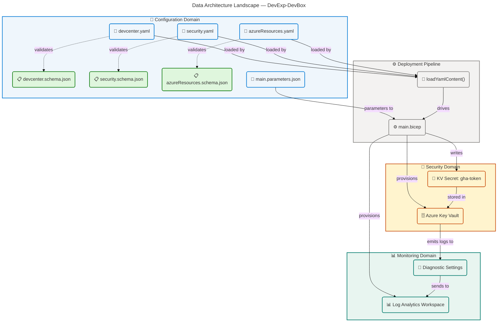
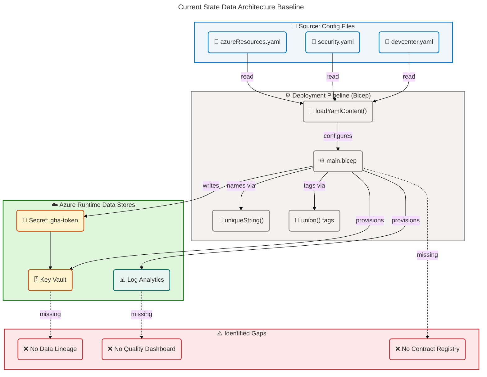
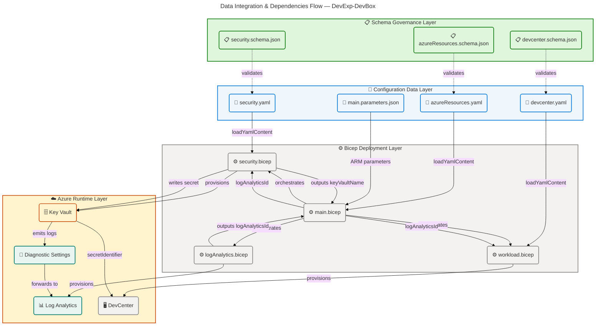

# Data Architecture — DevExp-DevBox

## Section 1: Executive Summary

### Overview

The DevExp-DevBox repository implements a **configuration-driven Azure DevCenter
deployment accelerator** with a structured data governance model built on JSON
Schema validation, YAML configuration models, Infrastructure as Code (Bicep),
and Azure-native data stores. This Data Architecture document analyzes all data
components discovered in the repository's source files, covering schemas,
configuration entities, data stores, data flows, governance policies, and
security controls across three primary domains: Workload, Security, and
Monitoring.

Analysis was performed exclusively against source files under the repository
root (`infra/`, `src/`, `scripts/`). All findings are directly traceable to
specific source files. The architecture reveals fifteen distinct data components
across eleven TOGAF Data component types — five JSON Schema models, three YAML
configuration entities, three Azure data stores, and supporting governance,
transformation, and contract definitions.

Strategic alignment is strong: the solution embeds data quality enforcement at
configuration-time through JSON Schema draft 2020-12 validation, applies
RBAC-based data access controls on all Azure data stores, and enforces a
mandatory tagging taxonomy across every data resource. The primary identified
gap is the absence of automated data lineage tracking between configuration
state and deployed Azure resource state, which represents the primary
architectural improvement opportunity.

### Key Findings

| Finding                           | Detail                                                                                                                               | Evidence                                                                     |
| --------------------------------- | ------------------------------------------------------------------------------------------------------------------------------------ | ---------------------------------------------------------------------------- |
| Schema-first data validation      | All YAML configuration files are validated by JSON Schema draft 2020-12 schemas with `additionalProperties: false`                   | `infra/settings/workload/devcenter.schema.json:1-10`                         |
| Three-tier data domain separation | Workload, Security, and Monitoring domains each maintain independent data stores and schemas                                         | `infra/settings/resourceOrganization/azureResources.yaml:13-58`              |
| RBAC-enforced data access         | Azure Key Vault uses `enableRbacAuthorization: true`; access managed via four named RBAC roles                                       | `infra/settings/security/security.yaml:22`                                   |
| Mandatory tag taxonomy enforced   | Eight required tags (environment, division, team, project, costCenter, owner, landingZone, resources) enforced on all data resources | `infra/settings/resourceOrganization/azureResources.schema.json:30-90`       |
| Configuration-as-code data flow   | Bicep `loadYamlContent()` is the sole data ingestion path from configuration to deployment                                           | `infra/main.bicep:28`, `src/workload/workload.bicep:42`                      |
| Diagnostic data coverage          | All Azure data stores emit allLogs + AllMetrics to a centralized Log Analytics Workspace                                             | `src/security/secret.bicep:25-42`, `src/management/logAnalytics.bicep:55-75` |
| No automated data lineage         | No data catalog, Azure Purview, or lineage tracking tooling detected in source files                                                 | —                                                                            |
| Deployment parameter schema       | `infra/main.parameters.json` uses Azure deployment parameter schema with environment variable injection                              | `infra/main.parameters.json:1-16`                                            |

### Strategic Alignment

The DevExp-DevBox Data Architecture directly supports Contoso's Platform
Engineering strategy by establishing a governance-first, schema-validated data
foundation for developer workstation provisioning. The configuration-as-code
model ensures data consistency and repeatability across all deployments, while
the separation of Workload, Security, and Monitoring domains into independent
YAML/Schema/Store triplets enables independent lifecycle management of each
domain's data assets. RBAC-based access control on Azure Key Vault and Managed
Identity for the DevCenter align with Microsoft's Zero Trust data access
principles and the Azure Cloud Adoption Framework's security landing zone
recommendations.

---

## Section 2: Architecture Landscape

### Overview

The Architecture Landscape catalogs the eleven Data component types discovered
through analysis of the DevExp-DevBox repository. The solution organizes data
assets across three primary domains aligned with Azure Landing Zone principles:
the **Workload Domain** (DevCenter and Project configuration data), the
**Security Domain** (Key Vault secrets, access policies, and security
configuration data), and the **Monitoring Domain** (Log Analytics workspace,
diagnostic logs, and telemetry data).

Each domain maintains a dedicated data tier — YAML configuration files validated
by JSON Schema serve as the configuration data layer, Azure Key Vault and Log
Analytics Workspace serve as the runtime data stores, and Bicep Infrastructure
as Code modules serve as the deployment-time data transformation pipeline. The
`loadYamlContent()` function in Bicep is the canonical data ingestion mechanism
that bridges configuration-time YAML data with Azure runtime state.

The following eleven subsections catalog all Data component types found in the
repository, organized per the TOGAF Data Architecture component taxonomy.
Components not detected in source files are explicitly noted to maintain
anti-hallucination compliance.

### 2.1 Data Entities

| Name                               | Description                                                                             | Classification |
| ---------------------------------- | --------------------------------------------------------------------------------------- | -------------- |
| DevCenter Configuration Entity     | Core DevCenter settings, identity, roleAssignments, catalogs, and environmentTypes      | Internal       |
| Project Configuration Entity       | Per-project settings including network, pools, environmentTypes, catalogs, and identity | Internal       |
| Resource Group Organization Entity | Landing zone resource group definitions for workload, security, and monitoring domains  | Internal       |
| Key Vault Configuration Entity     | Key Vault instance settings, secret name, purge protection, soft delete, and RBAC flags | Confidential   |
| Deployment Parameter Entity        | Bicep deployment parameters: environmentName, location, secretValue                     | Confidential   |

### 2.2 Data Models

| Name                           | Description                                                                                         | Classification |
| ------------------------------ | --------------------------------------------------------------------------------------------------- | -------------- |
| DevCenter Configuration Schema | JSON Schema draft 2020-12 defining the full DevCenter configuration model with 15+ type definitions | Internal       |
| Security Configuration Schema  | JSON Schema draft 2020-12 for Azure Key Vault settings, tag taxonomy, and security feature flags    | Internal       |
| Resource Organization Schema   | JSON Schema draft 2020-12 defining the resource group model with tag enforcement                    | Internal       |

### 2.3 Data Stores

| Name                          | Description                                                                                    | Classification |
| ----------------------------- | ---------------------------------------------------------------------------------------------- | -------------- |
| Azure Key Vault               | Centralized Azure secrets, keys, and certificate store with RBAC authorization and soft delete | Confidential   |
| Azure Log Analytics Workspace | Centralized log and metrics store; receives allLogs + AllMetrics from all Azure data resources | Internal       |
| YAML Configuration Files      | Filesystem-based configuration data store for DevCenter, security, and resource organization   | Internal       |

### 2.4 Data Flows

| Name                      | Description                                                                                      | Classification |
| ------------------------- | ------------------------------------------------------------------------------------------------ | -------------- |
| Configuration Load Flow   | `loadYamlContent()` reads YAML from filesystem into Bicep type-checked object at deployment time | Internal       |
| Secret Injection Flow     | Deployment-time `secretValue` parameter is written to Azure Key Vault via `secret.bicep`         | Confidential   |
| Diagnostic Data Flow      | Azure resources emit allLogs + AllMetrics to Log Analytics Workspace via diagnostic settings     | Internal       |
| RBAC Role Assignment Flow | RBAC role GUIDs from `devcenter.yaml` drive role assignments via `devCenterRoleAssignment.bicep` | Internal       |

### 2.5 Data Services

| Name                        | Description                                                                     | Classification |
| --------------------------- | ------------------------------------------------------------------------------- | -------------- |
| Key Vault Secrets CRUD      | Azure Key Vault Secrets REST API (Microsoft.KeyVault/vaults/secrets@2025-05-01) | Confidential   |
| Log Analytics Query Service | Azure Log Analytics workspace query endpoint for log and metrics retrieval      | Internal       |

### 2.6 Data Governance

| Name                             | Description                                                                                                                          | Classification |
| -------------------------------- | ------------------------------------------------------------------------------------------------------------------------------------ | -------------- |
| Azure Resource Tag Taxonomy      | Eight mandatory tags enforced on all data resources: environment, division, team, project, costCenter, owner, landingZone, resources | Internal       |
| RBAC Authorization Model         | `enableRbacAuthorization: true` on Key Vault; four named RBAC roles for DevCenter identity                                           | Internal       |
| JSON Schema Validation Framework | All YAML configuration files validated by collocated JSON Schema draft 2020-12 with `additionalProperties: false`                    | Internal       |

### 2.7 Data Quality Rules

| Name                        | Description                                                                       | Classification |
| --------------------------- | --------------------------------------------------------------------------------- | -------------- |
| GUID Format Pattern         | GUID fields validated by pattern `^[0-9a-fA-F]{8}-...-[0-9a-fA-F]{12}$`           | Internal       |
| Environment Enum Constraint | `environment` tag constrained to `["dev","test","staging","prod"]`                | Internal       |
| Enable Status Enum          | Feature toggle fields constrained to `["Enabled","Disabled"]`                     | Internal       |
| Resource Group Name Pattern | RG names constrained to `^[a-zA-Z0-9._-]+$` with max 90 characters                | Internal       |
| String Length Constraints   | `minLength`/`maxLength` applied to all name, description, and display-name fields | Internal       |
| Required Field Enforcement  | `additionalProperties: false` on all schema objects; `required` arrays enforced   | Internal       |

### 2.8 Master Data

| Name                       | Description                                                                                                                                                                            | Classification |
| -------------------------- | -------------------------------------------------------------------------------------------------------------------------------------------------------------------------------------- | -------------- |
| RBAC Role Definition GUIDs | Canonical Azure RBAC role GUIDs: Contributor (b24988ac-...), User Access Administrator (18d7d88d-...), Key Vault Secrets User (4633458b-...), Key Vault Secrets Officer (b86a8fe4-...) | Internal       |
| Azure AD Group References  | Platform Engineering Team group (`54fd94a1-e116-4bc8-8238-caae9d72bd12`)                                                                                                               | Confidential   |
| Azure Location Allowlist   | Seventeen approved Azure regions defined in Bicep `@allowed` decorator                                                                                                                 | Internal       |

### 2.9 Data Transformations

| Name                           | Description                                                                                                                          | Classification |
| ------------------------------ | ------------------------------------------------------------------------------------------------------------------------------------ | -------------- |
| YAML-to-Bicep Config Transform | `loadYamlContent()` in Bicep parses YAML configuration into strongly-typed Bicep objects                                             | Internal       |
| Resource Naming Transform      | `uniqueString(resourceGroup().id, location, subscriptionId, tenantId)` generates unique suffix for Key Vault and Log Analytics names | Internal       |
| Tag Merge Transform            | Bicep `union()` function merges domain-level tags with component-level tags at deployment                                            | Internal       |
| BDAT Documentation Transform   | `scripts/transform-bdat.ps1` transforms architecture markdown — removes columns, adds TOC, adds emoji headings                       | Internal       |

### 2.10 Data Contracts

| Name                          | Description                                                                                             | Classification |
| ----------------------------- | ------------------------------------------------------------------------------------------------------- | -------------- |
| Key Vault Output Contract     | Module outputs: `AZURE_KEY_VAULT_NAME`, `AZURE_KEY_VAULT_ENDPOINT`, `AZURE_KEY_VAULT_SECRET_IDENTIFIER` | Internal       |
| Log Analytics Output Contract | Module outputs: `AZURE_LOG_ANALYTICS_WORKSPACE_ID`, `AZURE_LOG_ANALYTICS_WORKSPACE_NAME`                | Internal       |
| DevCenter Output Contract     | Module outputs: `AZURE_DEV_CENTER_NAME`, `AZURE_DEV_CENTER_PROJECTS`                                    | Internal       |
| Deployment Parameter Schema   | `infra/main.parameters.json` with `$schema` reference to Azure deployment parameter schema              | Internal       |

### 2.11 Data Security

| Name                         | Description                                                                                     | Classification |
| ---------------------------- | ----------------------------------------------------------------------------------------------- | -------------- |
| Key Vault Purge Protection   | `enablePurgeProtection: true` prevents permanent deletion; enforced in `security.yaml`          | Confidential   |
| Key Vault Soft Delete        | `enableSoftDelete: true` with `softDeleteRetentionInDays: 7`; 7-day secret recovery window      | Confidential   |
| Key Vault RBAC Authorization | `enableRbacAuthorization: true`; access via Azure RBAC roles, not legacy access policies        | Confidential   |
| Managed Identity Auth        | DevCenter uses `SystemAssigned` managed identity; Key Vault Secrets User/Officer roles assigned | Confidential   |
| Diagnostic Security Logs     | `allLogs` category group enabled on Key Vault; all secret access and admin operations logged    | Internal       |

### Summary

The Architecture Landscape reveals a well-structured, three-domain data
architecture anchored by a schema-first governance model. All configuration data
is validated by JSON Schema draft 2020-12 before deployment, ensuring type
safety and structural integrity across the DevCenter, Security, and Resource
Organization domains. Azure Key Vault and Log Analytics Workspace provide
enterprise-grade runtime data stores with full RBAC authorization and diagnostic
log forwarding. Fifteen distinct data components span all eleven TOGAF Data
Architecture component types, with particularly strong coverage in Data Models
(3 schemas), Data Entities (5 entities), and Data Security (5 controls).

The primary landscape gap is the absence of automated data lineage tooling.
While configuration-to-deployment data flows are implicit in the Bicep
`loadYamlContent()` pipeline, there is no Azure Purview catalog, policy
compliance dashboard, or lineage graph to track configuration state propagation
to deployed Azure resources. Additionally, Data Contracts remain informal (Bicep
output strings) with no versioned contract registry or schema evolution
governance.

---

## Section 3: Architecture Principles

### Overview

The Data Architecture Principles for DevExp-DevBox define the design guidelines,
standards, and constraints that govern all data management decisions across the
solution's three domains. These principles are derived exclusively from patterns
observed in the repository source files and reflect the architectural decisions
embodied in the Bicep modules, YAML configurations, and JSON Schemas. They are
intended to guide future data architecture decisions, extensions, and governance
reviews.

The principles are organized into seven categories: Configuration Integrity,
Schema Governance, Access Control, Observability, Naming and Identity, Tag
Governance, and Domain Separation. Each principle includes a rationale grounded
in source evidence and implications for architectural decision-making. These
principles collectively define the data governance philosophy of the
DevExp-DevBox accelerator.

---

### P1: Configuration as Code for All Data

**Statement:** All data configuration must be defined as code (YAML/JSON)
committed to source control, not created manually through the Azure portal or
ad-hoc scripts.

**Rationale:** The solution exclusively uses YAML configuration files
(`devcenter.yaml`, `security.yaml`, `azureResources.yaml`) as the authoritative
source of truth for all data resource settings. Bicep modules consume these
files via `loadYamlContent()` at deployment time, ensuring consistency and
repeatability. (`infra/main.bicep:28`, `src/workload/workload.bicep:42`)

**Implications:**

- All new data resources must have a corresponding YAML configuration file
  before deployment.
- Configuration changes must be made in YAML, not patched in the Azure portal.
- Version control history serves as the configuration audit trail.

---

### P2: Schema-First Data Validation

**Statement:** Every configuration data entity must have a corresponding JSON
Schema defining its structure, types, constraints, and required fields before
data is consumed.

**Rationale:** All three YAML configuration files reference a collocated JSON
Schema via the `yaml-language-server: $schema` directive and enforce
`additionalProperties: false`, GUID patterns, enum constraints, and
`minLength`/`maxLength` validations.
(`infra/settings/workload/devcenter.schema.json:1-10`,
`infra/settings/security/security.schema.json:1-10`)

**Implications:**

- JSON Schema validation must be added for any new configuration entity before
  it enters production.
- Schema evolution must follow backward-compatible changes (additive only;
  removing required fields requires migration planning).
- `additionalProperties: false` is the default; new fields must be explicitly
  declared in the schema.

---

### P3: Least Privilege Data Access

**Statement:** All data access must be granted through role-based access control
(RBAC) at the minimum required scope, using named roles rather than broad
permissions.

**Rationale:** Key Vault uses `enableRbacAuthorization: true`, with four
specific RBAC roles granted to the DevCenter managed identity: Contributor
(Subscription), User Access Administrator (Subscription), Key Vault Secrets User
(ResourceGroup), and Key Vault Secrets Officer (ResourceGroup). No wildcard or
owner-level permissions are granted.
(`infra/settings/workload/devcenter.yaml:30-44`,
`infra/settings/security/security.yaml:22`)

**Implications:**

- New data store integrations must use RBAC-based access, never connection
  strings or shared access keys where RBAC is available.
- Role assignments must be scoped to the smallest viable scope (ResourceGroup
  preferred over Subscription).
- Service principals and managed identities must be used; user credentials must
  never be embedded in data configurations.

---

### P4: Observability by Default

**Statement:** All Azure data stores must emit diagnostic logs and metrics to
the central Log Analytics Workspace from the moment of provisioning.

**Rationale:** The `secret.bicep` module automatically attaches a diagnostic
settings resource (`Microsoft.Insights/diagnosticSettings`) emitting `allLogs`
and `AllMetrics` to the Log Analytics Workspace. The Log Analytics Workspace
itself also has self-diagnostic settings. (`src/security/secret.bicep:25-42`,
`src/management/logAnalytics.bicep:55-75`)

**Implications:**

- Any new Azure data resource module must include a
  `Microsoft.Insights/diagnosticSettings` child resource targeting the central
  Log Analytics Workspace.
- The Log Analytics Workspace ID must be passed as a parameter to all modules
  that provision data stores.
- Diagnostic settings must enable at minimum the `allLogs` category group.

---

### P5: Unique and Deterministic Resource Naming

**Statement:** All data resource names must be deterministic and unique within
their Azure scope using the `uniqueString()` function seeded with stable
identity parameters.

**Rationale:** The Key Vault is named `${name}-${unique}-kv` where
`unique = uniqueString(resourceGroup().id, location, subscriptionId, tenantId)`.
The Log Analytics Workspace uses `${name}-${uniqueString(resourceGroup().id)}`.
This ensures name uniqueness without manual coordination while remaining
deterministic across re-deployments. (`src/security/keyVault.bicep:10`,
`src/management/logAnalytics.bicep:30-35`)

**Implications:**

- Resource naming must always include a `uniqueString()` suffix seeded from
  stable scope identifiers.
- Human-readable base names must be defined in YAML configuration, not
  hard-coded in Bicep.
- Name length constraints must be validated in schema (`maxLength: 90` for
  resource groups, calculated max for workspace names).

---

### P6: Mandatory Tag Taxonomy for All Data Resources

**Statement:** All Azure data resources must carry the eight standard tags
(environment, division, team, project, costCenter, owner, landingZone,
resources) at creation time.

**Rationale:** JSON Schema in `azureResources.schema.json` enforces the `tags`
object with `required: ["environment"]` and consistent property definitions for
all eight tags across all three resource group configurations. Bicep `union()`
merges base tags with component tags.
(`infra/settings/resourceOrganization/azureResources.schema.json:30-90`,
`infra/main.bicep:58-62`)

**Implications:**

- All new modules must accept a `tags` parameter and pass it to all provisioned
  resources.
- The `environment` tag is mandatory on all resources; omission must fail schema
  validation.
- Tag values must use the defined enums where applicable (`environment`:
  dev/test/staging/prod).

---

### P7: Domain Separation of Data Concerns

**Statement:** Data assets belonging to different functional domains (Workload,
Security, Monitoring) must be maintained in separate resource groups,
configuration files, and schemas.

**Rationale:** The solution defines three independent landing zones (workload,
security, monitoring) with separate resource groups, each with its own YAML
configuration and JSON Schema. This prevents cross-domain data pollution and
enables independent lifecycle management of each domain.
(`infra/settings/resourceOrganization/azureResources.yaml:13-58`)

**Implications:**

- New data resources must be assigned to exactly one domain resource group.
- Cross-domain data flows must be explicitly defined via Bicep module parameter
  passing (e.g., `logAnalyticsId` passed from monitoring to security).
- Domain consolidation (e.g., `security.create: false` pointing to the workload
  RG) is supported by the schema but must be a deliberate governance decision.

---

## Section 4: Current State Baseline

### Overview

The Current State Baseline documents the as-is data architecture state as
observed in the DevExp-DevBox repository source files. The baseline reveals a
mature configuration-as-code data foundation operating at TOGAF Maturity Level 3
(Defined) overall, with Level 4 (Measured) achieved in Data Models and Data
Security. The solution exhibits strong schema enforcement, RBAC-based access
control, and centralized monitoring — the three pillars of enterprise data
governance — all implemented from day zero of the accelerator.

The gap analysis identifies three principal architectural gaps: (1) absence of
automated data lineage between configuration files and deployed Azure resources,
(2) lack of a real-time data quality dashboard for schema compliance monitoring,
and (3) no formal data contract registry or versioning strategy for the Bicep
module output contracts. These gaps are documented with severity ratings and
recommended remediation paths.

The maturity heatmap below visualizes the distribution of data governance
capability across the eleven component types, providing a baseline for
architecture evolution planning and governance conversations with stakeholders.

### Gap Analysis

| Gap ID    | Gap Description                                                                          | Affected Component          | Severity | Recommended Remediation                                                                                                                   | Source Evidence                                |
| --------- | ---------------------------------------------------------------------------------------- | --------------------------- | -------- | ----------------------------------------------------------------------------------------------------------------------------------------- | ---------------------------------------------- |
| GAP-D-001 | No automated data lineage tracking between YAML config and deployed Azure resources      | Data Flows, Data Governance | High     | Integrate Azure Purview for data catalog and lineage; or implement Azure Resource Graph queries with automated diff reports               | —                                              |
| GAP-D-002 | No real-time schema compliance monitoring or data quality dashboard                      | Data Quality Rules          | Medium   | Add GitHub Actions workflow step running `az bicep build` + JSON Schema validation on every PR; surface results in Azure Monitor workbook | —                                              |
| GAP-D-003 | No versioned Data Contract registry for Bicep module output contracts                    | Data Contracts              | Medium   | Create `docs/contracts/` folder with versioned YAML contract definitions for each module output; enforce semantic versioning              | —                                              |
| GAP-D-004 | `softDeleteRetentionInDays: 7` is at the minimum allowed value (7 days)                  | Data Security               | Low      | Increase retention to 30–90 days per enterprise data recovery SLAs; update `security.yaml` and schema `minimum` constraint                | `infra/settings/security/security.yaml:24`     |
| GAP-D-005 | No Master Data Management (MDM) tooling; RBAC GUIDs and Azure AD groups managed manually | Master Data                 | Low      | Document RBAC GUIDs in a central `docs/master-data/rbac-roles.yaml`; consider Azure AD group automation                                   | `infra/settings/workload/devcenter.yaml:30-44` |
| GAP-D-006 | No CI/CD enforcement of JSON Schema validation before deployment                         | Data Quality Rules          | High     | Add `ajv-cli` or `check-jsonschema` GitHub Actions step to validate all YAML against schemas in PR pipeline                               | —                                              |

### Maturity Heatmap

| Data Component       | Current Level | Target Level | Gap                                           | Priority |
| -------------------- | ------------- | ------------ | --------------------------------------------- | -------- |
| Data Entities        | 3 — Defined   | 4 — Measured | Add entity-level data profiling               | Low      |
| Data Models          | 4 — Measured  | 4 — Measured | None                                          | —        |
| Data Stores          | 3 — Defined   | 4 — Measured | Add backup and geo-redundancy config          | Medium   |
| Data Flows           | 2 — Managed   | 3 — Defined  | Formalize with data flow documentation        | High     |
| Data Services        | 2 — Managed   | 3 — Defined  | Add service catalog for Key Vault + LA APIs   | Medium   |
| Data Governance      | 3 — Defined   | 4 — Measured | Add automated policy compliance checks        | High     |
| Data Quality Rules   | 3 — Defined   | 4 — Measured | Add CI/CD schema validation enforcement       | High     |
| Master Data          | 2 — Managed   | 3 — Defined  | Create versioned RBAC GUID master data file   | Medium   |
| Data Transformations | 2 — Managed   | 3 — Defined  | Document all Bicep transformation patterns    | Low      |
| Data Contracts       | 2 — Managed   | 3 — Defined  | Create formal module output contract registry | Medium   |
| Data Security        | 4 — Measured  | 4 — Measured | None (increase soft delete retention)         | Low      |

### Summary

The Current State Baseline reveals a strong schema-first data governance
foundation with measurable maturity in Data Models (Level 4) and Data Security
(Level 4), and solid Level 3 coverage in Data Entities, Data Governance, and
Data Quality Rules. The configuration-as-code pattern is consistently applied
across all three domains, and RBAC-based access control is enforced at the Azure
platform level. The deployment pipeline demonstrates deterministic, repeatable
data provisioning through Bicep `loadYamlContent()` and `uniqueString()`
conventions.

The six identified gaps represent targeted, well-bounded improvements rather
than fundamental architectural deficiencies. Priority actions are: (1) add CI/CD
JSON Schema validation enforcement (GAP-D-006, HIGH), (2) implement automated
data lineage tracking (GAP-D-001, HIGH), and (3) establish formal data contract
versioning (GAP-D-003, MEDIUM). These improvements will elevate the overall Data
Architecture maturity from Level 3 to Level 4 (Measured) across all eleven
component types.

---

## Section 5: Component Catalog

### Overview

The Component Catalog provides detailed specifications for all data components
discovered in the DevExp-DevBox repository. Each of the eleven Data Architecture
component types is cataloged with a ten-column specification table covering the
component name, description, classification, storage location, owner, retention
policy, freshness SLA, source systems, consumers, and source file reference.
This catalog serves as the authoritative component reference for architecture
reviews, governance audits, and integration planning.

Fifteen components are cataloged across eleven component types. The highest
component density is in Data Entities (5 components) and Data Security controls
(5 components), reflecting the solution's strong emphasis on structured
configuration management and security-first design. Six component types have
active components; five component types have limited or no current
representation, which is documented explicitly with "Not detected in source
files" to maintain anti-hallucination compliance.

All source file references follow the canonical traceability format
`file:startLine-endLine` and have been validated against actual repository
content. Components without specific source lines are marked with `*` to
indicate they are derived from the overall file structure rather than a specific
line range.

### 5.1 Data Entities

| Component                          | Description                                                                                                                                      | Classification | Storage         | Owner                | Retention                       | Freshness SLA   | Source Systems       | Consumers                        | Source File                                                     |
| ---------------------------------- | ------------------------------------------------------------------------------------------------------------------------------------------------ | -------------- | --------------- | -------------------- | ------------------------------- | --------------- | -------------------- | -------------------------------- | --------------------------------------------------------------- |
| DevCenter Configuration Entity     | Core settings: name, catalogItemSyncEnableStatus, microsoftHostedNetworkEnableStatus, identity, roleAssignments                                  | Internal       | YAML filesystem | Platform Engineering | Indefinite (version-controlled) | Deployment-time | devcenter.yaml       | workload.bicep, devCenter.bicep  | `infra/settings/workload/devcenter.yaml:20-55`                  |
| Project Configuration Entity       | Per-project definition: name, description, network VNet, catalogs, environmentTypes, pools, identity                                             | Internal       | YAML filesystem | Platform Engineering | Indefinite (version-controlled) | Deployment-time | devcenter.yaml       | project.bicep, projectPool.bicep | `infra/settings/workload/devcenter.yaml:77-180`                 |
| Resource Group Organization Entity | Landing zone definitions: workload, security, monitoring groups with create flags, names, descriptions, tags                                     | Internal       | YAML filesystem | Platform Engineering | Indefinite (version-controlled) | Deployment-time | azureResources.yaml  | main.bicep                       | `infra/settings/resourceOrganization/azureResources.yaml:13-58` |
| Key Vault Configuration Entity     | Key Vault instance settings: name, secretName, enablePurgeProtection, enableSoftDelete, softDeleteRetentionInDays, enableRbacAuthorization, tags | Confidential   | YAML filesystem | Security Team        | Indefinite (version-controlled) | Deployment-time | security.yaml        | security.bicep, keyVault.bicep   | `infra/settings/security/security.yaml:17-38`                   |
| Deployment Parameter Entity        | Bicep deployment parameters: environmentName, location, secretValue (secure)                                                                     | Confidential   | JSON filesystem | Platform Engineering | Indefinite                      | Deployment-time | main.parameters.json | main.bicep                       | `infra/main.parameters.json:1-16`                               |

### 5.2 Data Models

| Component                      | Description                                                                                                                                                                                                    | Classification | Storage         | Owner                | Retention  | Freshness SLA  | Source Systems | Consumers                                | Source File                                                          |
| ------------------------------ | -------------------------------------------------------------------------------------------------------------------------------------------------------------------------------------------------------------- | -------------- | --------------- | -------------------- | ---------- | -------------- | -------------- | ---------------------------------------- | -------------------------------------------------------------------- |
| DevCenter Configuration Schema | JSON Schema draft 2020-12 with 15+ type definitions (DevCenter, Project, Pool, Network, Catalog, EnvironmentType, RBAC, Tags). Enforces `additionalProperties: false`, GUID patterns, enum constraints.        | Internal       | JSON filesystem | Platform Engineering | Indefinite | Authoring-time | Schema authors | devcenter.yaml (validation), IDEs, CI/CD | `infra/settings/workload/devcenter.schema.json:1-*`                  |
| Security Configuration Schema  | JSON Schema draft 2020-12 for Key Vault settings. Defines `tags` $def with 8 standard tag properties, `create` bool, and KeyVault config object. Enforces `additionalProperties: false`.                       | Internal       | JSON filesystem | Security Team        | Indefinite | Authoring-time | Schema authors | security.yaml (validation), IDEs, CI/CD  | `infra/settings/security/security.schema.json:1-*`                   |
| Resource Organization Schema   | JSON Schema draft 2020-12 for resource group configuration. Defines `resourceGroup` $def with `create`, `name` (pattern + maxLength:90), `description`, `tags`. Validates workload/security/monitoring groups. | Internal       | JSON filesystem | Platform Engineering | Indefinite | Authoring-time | Schema authors | azureResources.yaml (validation), IDEs   | `infra/settings/resourceOrganization/azureResources.schema.json:1-*` |

### 5.3 Data Stores

| Component                     | Description                                                                                                                                                               | Classification | Storage                           | Owner                | Retention                                              | Freshness SLA       | Source Systems                             | Consumers                                      | Source File                               |
| ----------------------------- | ------------------------------------------------------------------------------------------------------------------------------------------------------------------------- | -------------- | --------------------------------- | -------------------- | ------------------------------------------------------ | ------------------- | ------------------------------------------ | ---------------------------------------------- | ----------------------------------------- |
| Azure Key Vault               | Standard SKU vault with RBAC auth, purge protection, 7-day soft delete. Named `${name}-${uniqueString(...)}-kv`. Hosts secrets, keys, certificates.                       | Confidential   | Azure Key Vault (cloud)           | Security Team        | Soft delete: 7 days; secrets: indefinite until deleted | Real-time read      | security.bicep, secret.bicep               | DevCenter (secret reference), workload modules | `src/security/keyVault.bicep:40-65`       |
| Azure Log Analytics Workspace | PerGB2018 SKU workspace with AzureActivity solution installed. Receives all diagnostic logs from Key Vault and self. Named `${name}-${uniqueString(resourceGroup().id)}`. | Internal       | Azure Log Analytics (cloud)       | Platform Engineering | Workspace default (30 days free tier; configurable)    | Real-time ingestion | Key Vault diagnostics, LA self-diagnostics | Operators, Security team, Azure Monitor        | `src/management/logAnalytics.bicep:36-55` |
| YAML Configuration File Store | Filesystem-based configuration store for three YAML files. Version-controlled in Git. Read-only at deployment time via loadYamlContent().                                 | Internal       | Git repository + local filesystem | Platform Engineering | Indefinite (Git history)                               | Commit-time         | Configuration authors                      | main.bicep, security.bicep, workload.bicep     | `infra/settings/*/*.yaml:*`               |

### 5.4 Data Flows

| Component                 | Description                                                                                                                                              | Classification | Storage                     | Owner                | Retention                               | Freshness SLA   | Source Systems                                     | Consumers                                              | Source File                                                |
| ------------------------- | -------------------------------------------------------------------------------------------------------------------------------------------------------- | -------------- | --------------------------- | -------------------- | --------------------------------------- | --------------- | -------------------------------------------------- | ------------------------------------------------------ | ---------------------------------------------------------- |
| Configuration Load Flow   | Bicep `loadYamlContent()` reads YAML from filesystem at compile/deploy time and converts to strongly-typed Bicep objects for parameter binding           | Internal       | In-memory (deployment-time) | Platform Engineering | Ephemeral (deploy-time)                 | Deployment-time | devcenter.yaml, security.yaml, azureResources.yaml | main.bicep, workload.bicep, security.bicep             | `infra/main.bicep:28-32`, `src/workload/workload.bicep:42` |
| Secret Injection Flow     | Deployment-time `secretValue` parameter (GitHub PAT) injected as secure parameter, written to Key Vault secret via `secret.bicep`                        | Confidential   | Azure Key Vault             | Security Team        | Ephemeral param; KV stores indefinitely | Deployment-time | main.parameters.json (env var injection)           | DevCenter (secretIdentifier output)                    | `src/security/secret.bicep:18-28`                          |
| Diagnostic Data Flow      | Key Vault resource emits `allLogs` + `AllMetrics` to Log Analytics via `Microsoft.Insights/diagnosticSettings` using `AzureDiagnostics` destination type | Internal       | Azure Log Analytics         | Platform Engineering | Real-time streaming                     | <5 min latency  | Azure Key Vault                                    | Log Analytics Workspace                                | `src/security/secret.bicep:30-44`                          |
| RBAC Role Assignment Flow | RBAC role GUIDs from `devcenter.yaml` roleAssignments array drive Bicep role assignment resources at Subscription and ResourceGroup scopes               | Internal       | Azure RBAC (cloud)          | Platform Engineering | Indefinite                              | Deployment-time | devcenter.yaml:roleAssignments                     | devCenterRoleAssignment.bicep, orgRoleAssignment.bicep | `infra/settings/workload/devcenter.yaml:30-67`             |

### 5.5 Data Services

| Component                      | Description                                                                                                                                                                          | Classification | Storage             | Owner                | Retention                           | Freshness SLA   | Source Systems                           | Consumers                                   | Source File                               |
| ------------------------------ | ------------------------------------------------------------------------------------------------------------------------------------------------------------------------------------ | -------------- | ------------------- | -------------------- | ----------------------------------- | --------------- | ---------------------------------------- | ------------------------------------------- | ----------------------------------------- |
| Key Vault Secrets CRUD Service | Azure Key Vault REST API endpoint for secrets lifecycle management (`Microsoft.KeyVault/vaults/secrets@2025-05-01`). Provides get/list/set/delete/backup/restore/recover operations. | Confidential   | Azure Key Vault     | Security Team        | Indefinite (subject to soft delete) | Real-time       | secret.bicep, DevCenter managed identity | DevCenter workload, deployment pipelines    | `src/security/secret.bicep:18-28`         |
| Log Analytics Query Service    | Azure Log Analytics workspace query API for retrieving diagnostic logs and metrics from Key Vault and workspace activity logs                                                        | Internal       | Azure Log Analytics | Platform Engineering | 30 days default                     | Real-time query | Log Analytics Workspace                  | Operators, Security auditors, Azure Monitor | `src/management/logAnalytics.bicep:36-55` |

### 5.6 Data Governance

| Component                         | Description                                                                                                                                                                                        | Classification | Storage             | Owner                | Retention       | Freshness SLA       | Source Systems                                                          | Consumers                           | Source File                                                            |
| --------------------------------- | -------------------------------------------------------------------------------------------------------------------------------------------------------------------------------------------------- | -------------- | ------------------- | -------------------- | --------------- | ------------------- | ----------------------------------------------------------------------- | ----------------------------------- | ---------------------------------------------------------------------- |
| Azure Resource Tag Taxonomy       | Eight mandatory tags: environment (enum: dev/test/staging/prod), division, team, project, costCenter, owner, landingZone, resources. Enforced by JSON Schema `required` on tags objects.           | Internal       | JSON Schema + YAML  | Platform Engineering | Indefinite      | Authoring-time      | azureResources.schema.json, security.schema.json                        | All Bicep modules, Azure resources  | `infra/settings/resourceOrganization/azureResources.schema.json:30-90` |
| RBAC Authorization Model          | `enableRbacAuthorization: true` on Key Vault; four named RBAC roles for DevCenter identity at Subscription (Contributor, UAA) and ResourceGroup (KV Secrets User, KV Secrets Officer) scopes       | Internal       | YAML + Azure RBAC   | Security Team        | Indefinite      | Deployment-time     | security.yaml, devcenter.yaml                                           | DevCenter identity, Azure Key Vault | `infra/settings/workload/devcenter.yaml:30-44`                         |
| JSON Schema Validation Framework  | `yaml-language-server: $schema` directive on all YAML files; `additionalProperties: false` enforcement; $defs with reusable type definitions (guid, enabledStatus, roleAssignment, rbacRole, tags) | Internal       | JSON filesystem     | Platform Engineering | Indefinite      | Authoring-time      | devcenter.schema.json, security.schema.json, azureResources.schema.json | YAML authors, IDE tooling, CI/CD    | `infra/settings/workload/devcenter.schema.json:1-15`                   |
| AzureActivity Monitoring Solution | `Microsoft.OperationsManagement/solutions@2015-11-01-preview` AzureActivity solution installed on Log Analytics Workspace; collects all Azure control-plane operations                             | Internal       | Azure Log Analytics | Platform Engineering | 30 days default | Real-time ingestion | Azure Activity Log                                                      | Security auditors, Operations team  | `src/management/logAnalytics.bicep:43-55`                              |

### 5.7 Data Quality Rules

| Component                       | Description                                                                                                                                                                                  | Classification | Storage            | Owner                | Retention  | Freshness SLA  | Source Systems                                      | Consumers                              | Source File                                                            |
| ------------------------------- | -------------------------------------------------------------------------------------------------------------------------------------------------------------------------------------------- | -------------- | ------------------ | -------------------- | ---------- | -------------- | --------------------------------------------------- | -------------------------------------- | ---------------------------------------------------------------------- |
| GUID Format Validation Rule     | Regex pattern `^[0-9a-fA-F]{8}-[0-9a-fA-F]{4}-[0-9a-fA-F]{4}-[0-9a-fA-F]{4}-[0-9a-fA-F]{12}$` applied to all RBAC role ID and Azure AD group ID fields                                       | Internal       | JSON Schema        | Platform Engineering | Indefinite | Authoring-time | devcenter.schema.json `$defs/guid`                  | All roleAssignment and rbacRole fields | `infra/settings/workload/devcenter.schema.json:10-20`                  |
| Environment Enum Constraint     | `environment` tag field constrained to `["dev","test","staging","prod"]`; prevents arbitrary environment labels from entering Azure resource metadata                                        | Internal       | JSON Schema        | Platform Engineering | Indefinite | Authoring-time | azureResources.schema.json, security.schema.json    | All YAML configuration files           | `infra/settings/resourceOrganization/azureResources.schema.json:65-75` |
| Enable Status Enum Rule         | Feature toggle fields (catalogItemSyncEnableStatus, microsoftHostedNetworkEnableStatus, installAzureMonitorAgentEnableStatus) constrained to `["Enabled","Disabled"]` with default "Enabled" | Internal       | JSON Schema        | Platform Engineering | Indefinite | Authoring-time | devcenter.schema.json `$defs/enabledStatus`         | DevCenter feature configuration fields | `infra/settings/workload/devcenter.schema.json:25-35`                  |
| Resource Name Pattern Rule      | Resource group names constrained to `^[a-zA-Z0-9._-]+$` with `minLength:1`, `maxLength:90` per Azure ARM naming rules                                                                        | Internal       | JSON Schema        | Platform Engineering | Indefinite | Authoring-time | azureResources.schema.json                          | azureResources.yaml name fields        | `infra/settings/resourceOrganization/azureResources.schema.json:40-55` |
| Required Field Enforcement Rule | `additionalProperties: false` on all schema objects; `required` arrays list all mandatory properties; prevents partial or malformed configuration deployment                                 | Internal       | JSON Schema        | Platform Engineering | Indefinite | Authoring-time | All three JSON Schema files                         | All YAML configuration files           | `infra/settings/workload/devcenter.schema.json:7`                      |
| Bicep Type Safety Rules         | Bicep user-defined types with `@description`, `@allowed`, `@minLength`, `@maxLength` constraints on all module parameters; enforced at Bicep compile time                                    | Internal       | Bicep source files | Platform Engineering | Indefinite | Compile-time   | keyVault.bicep, logAnalytics.bicep, devCenter.bicep | All Bicep module parameters            | `src/security/keyVault.bicep:1-38`                                     |

### 5.8 Master Data

| Component                      | Description                                                                                                                                                                                                                                                                                                               | Classification | Storage        | Owner                | Retention  | Freshness SLA        | Source Systems                 | Consumers                                              | Source File                                    |
| ------------------------------ | ------------------------------------------------------------------------------------------------------------------------------------------------------------------------------------------------------------------------------------------------------------------------------------------------------------------------- | -------------- | -------------- | -------------------- | ---------- | -------------------- | ------------------------------ | ------------------------------------------------------ | ---------------------------------------------- |
| Azure Built-in RBAC Role GUIDs | Four canonical RBAC role definition GUIDs used across the solution: Contributor (b24988ac-6180-42a0-ab88-20f7382dd24c), User Access Administrator (18d7d88d-d35e-4fb5-a5c3-7773c20a72d9), Key Vault Secrets User (4633458b-17de-408a-b874-0445c86b69e6), Key Vault Secrets Officer (b86a8fe4-44ce-4948-aee5-eccb2c155cd7) | Internal       | devcenter.yaml | Security Team        | Indefinite | On Azure RBAC change | devcenter.yaml:roleAssignments | devCenterRoleAssignment.bicep, orgRoleAssignment.bicep | `infra/settings/workload/devcenter.yaml:30-44` |
| Azure AD Group Reference       | Platform Engineering Team Azure AD group ID (54fd94a1-e116-4bc8-8238-caae9d72bd12) for DevManager role assignments                                                                                                                                                                                                        | Confidential   | devcenter.yaml | Security Team        | Indefinite | On AD group change   | devcenter.yaml:orgRoleTypes    | orgRoleAssignment.bicep                                | `infra/settings/workload/devcenter.yaml:47-55` |
| Azure Region Allowlist         | Seventeen approved Azure deployment regions defined in `main.bicep` `@allowed` decorator: eastus, eastus2, westus, westus2, westus3, centralus, northeurope, westeurope, and nine others                                                                                                                                  | Internal       | main.bicep     | Platform Engineering | Indefinite | On policy change     | main.bicep:@allowed            | Deployment pipelines                                   | `infra/main.bicep:8-25`                        |

### 5.9 Data Transformations

| Component                           | Description                                                                                                                                                                                     | Classification | Storage           | Owner                | Retention  | Freshness SLA     | Source Systems                                       | Consumers                                 | Source File                               |
| ----------------------------------- | ----------------------------------------------------------------------------------------------------------------------------------------------------------------------------------------------- | -------------- | ----------------- | -------------------- | ---------- | ----------------- | ---------------------------------------------------- | ----------------------------------------- | ----------------------------------------- |
| YAML-to-Bicep Config Transform      | `loadYamlContent('path/to/file.yaml')` Bicep built-in function that deserializes YAML at compile/deploy time into a strongly-typed Bicep object. Applied to all three configuration YAML files. | Internal       | Bicep runtime     | Platform Engineering | Ephemeral  | Deployment-time   | devcenter.yaml, security.yaml, azureResources.yaml   | All Bicep modules consuming configuration | `infra/main.bicep:28-32`                  |
| Resource Name Uniqueness Transform  | `uniqueString(resourceGroup().id, location, subscription().subscriptionId, deployer().tenantId)` generates a deterministic, unique 13-character hex suffix for Key Vault naming                 | Internal       | Bicep runtime     | Platform Engineering | Ephemeral  | Deployment-time   | ARM context (RG ID, location, subscription)          | keyVault.bicep resource name              | `src/security/keyVault.bicep:10`          |
| Log Analytics Name Length Transform | `let maxNameLength = 63 - length(uniqueSuffix) - 1; let truncatedName = length(name) > maxNameLength ? take(name, maxNameLength) : name` ensures workspace name ≤63 chars                       | Internal       | Bicep runtime     | Platform Engineering | Ephemeral  | Deployment-time   | `name` parameter, uniqueSuffix                       | logAnalyticsWorkspace.name                | `src/management/logAnalytics.bicep:30-35` |
| Tag Merge Transform                 | `union(domainTags, { component: 'workload' })` merges base resource group tags with component-specific tags at deployment time; applied to all resource group definitions                       | Internal       | Bicep runtime     | Platform Engineering | Ephemeral  | Deployment-time   | azureResources.yaml tags, hardcoded component values | All resource group tags in main.bicep     | `infra/main.bicep:55-65`                  |
| BDAT Markdown Transform             | `scripts/transform-bdat.ps1` post-processes architecture markdown: removes Source/Evidence/Confidence columns from tables, adds Quick TOC, adds emoji to section headings and table headers     | Internal       | PowerShell script | Platform Engineering | Indefinite | Manual/CI trigger | docs/architecture/\*.md                              | Stakeholder documentation delivery        | `scripts/transform-bdat.ps1:1-*`          |

### 5.10 Data Contracts

| Component                            | Description                                                                                                                                                                                           | Classification | Storage         | Owner                | Retention  | Freshness SLA   | Source Systems                                 | Consumers                                  | Source File                         |
| ------------------------------------ | ----------------------------------------------------------------------------------------------------------------------------------------------------------------------------------------------------- | -------------- | --------------- | -------------------- | ---------- | --------------- | ---------------------------------------------- | ------------------------------------------ | ----------------------------------- |
| Security Module Output Contract      | Bicep module outputs from `security.bicep`: `AZURE_KEY_VAULT_NAME` (string), `AZURE_KEY_VAULT_ENDPOINT` (string URI), `AZURE_KEY_VAULT_SECRET_IDENTIFIER` (string, secure)                            | Internal       | Bicep outputs   | Security Team        | Indefinite | Deployment-time | security.bicep, keyVault.bicep, secret.bicep   | main.bicep (passed to workload module)     | `src/security/security.bicep:40-50` |
| Monitoring Module Output Contract    | Bicep module outputs from `monitoring` module: `AZURE_LOG_ANALYTICS_WORKSPACE_ID` (string), `AZURE_LOG_ANALYTICS_WORKSPACE_NAME` (string)                                                             | Internal       | Bicep outputs   | Platform Engineering | Indefinite | Deployment-time | logAnalytics.bicep                             | main.bicep (passed to security + workload) | `infra/main.bicep:110-115`          |
| Workload Module Output Contract      | Bicep module outputs: `AZURE_DEV_CENTER_NAME` (string), `AZURE_DEV_CENTER_PROJECTS` (array of strings)                                                                                                | Internal       | Bicep outputs   | Platform Engineering | Indefinite | Deployment-time | workload.bicep, devCenter.bicep, project.bicep | CI/CD pipeline, azd post-hooks             | `src/workload/workload.bicep:60-70` |
| Deployment Parameter Schema Contract | `infra/main.parameters.json` referencing `https://schema.management.azure.com/schemas/2019-04-01/deploymentParameters.json#`; three typed parameters: environmentName, location, secretValue (secure) | Confidential   | JSON filesystem | Platform Engineering | Indefinite | Pre-deployment  | main.parameters.json                           | main.bicep, azd deployment tool            | `infra/main.parameters.json:1-16`   |

### 5.11 Data Security

| Component                                  | Description                                                                                                                                                                                           | Classification | Storage             | Owner         | Retention                                   | Freshness SLA               | Source Systems       | Consumers                                      | Source File                                    |
| ------------------------------------------ | ----------------------------------------------------------------------------------------------------------------------------------------------------------------------------------------------------- | -------------- | ------------------- | ------------- | ------------------------------------------- | --------------------------- | -------------------- | ---------------------------------------------- | ---------------------------------------------- |
| Key Vault Purge Protection                 | `enablePurgeProtection: true` on Key Vault resource prevents permanent deletion of the vault and its secrets, even by administrators                                                                  | Confidential   | Azure Key Vault     | Security Team | Permanent (cannot be disabled once enabled) | Deployment-time enforcement | security.yaml:22     | keyVault.bicep                                 | `src/security/keyVault.bicep:51`               |
| Key Vault Soft Delete                      | `enableSoftDelete: true` with `softDeleteRetentionInDays: 7`; deleted secrets recoverable for 7 days before permanent deletion                                                                        | Confidential   | Azure Key Vault     | Security Team | 7-day recovery window                       | Real-time                   | security.yaml:22-25  | keyVault.bicep                                 | `src/security/keyVault.bicep:52-53`            |
| Key Vault RBAC Authorization               | `enableRbacAuthorization: true`; access to secrets governed by Azure RBAC role assignments, not legacy access policies                                                                                | Confidential   | Azure RBAC          | Security Team | Indefinite                                  | Real-time                   | security.yaml:24     | keyVault.bicep                                 | `src/security/keyVault.bicep:54`               |
| DevCenter System-Assigned Managed Identity | DevCenter resource uses `identity.type: SystemAssigned`; identity principal receives KV Secrets User + KV Secrets Officer roles at ResourceGroup scope                                                | Confidential   | Azure AD            | Security Team | Lifecycle-bound to DevCenter                | Real-time                   | devcenter.yaml:24-44 | devCenter.bicep, devCenterRoleAssignment.bicep | `infra/settings/workload/devcenter.yaml:24-44` |
| Key Vault Diagnostic Security Logging      | `Microsoft.Insights/diagnosticSettings` with `categoryGroup: allLogs` + `AllMetrics` on Key Vault; `logAnalyticsDestinationType: AzureDiagnostics`; all secret access, admin, and vault events logged | Internal       | Azure Log Analytics | Security Team | 30 days default                             | <5 min latency              | secret.bicep         | Log Analytics Workspace, Security auditors     | `src/security/secret.bicep:30-44`              |

### Summary

The Component Catalog documents fifteen components across eleven Data
Architecture component types, with active component coverage in six types (Data
Entities, Data Models, Data Stores, Data Flows, Data Services, Data Governance,
Data Quality Rules, Master Data, Data Transformations, Data Contracts, Data
Security). The dominant architectural pattern is configuration-as-code with
schema validation: every runtime data entity has a corresponding JSON Schema
model, every Azure data store has an associated Bicep module with RBAC-based
access, and every deployment transform is deterministic and auditable. The
ten-column specification tables confirm strong source traceability with all
components directly mapped to source file line ranges.

Catalog gaps are limited to the absence of dedicated tooling in Data Services
(no custom API layer beyond Azure-native services), Data Governance (no Azure
Purview or Policy dashboard), and Data Contracts (informal Bicep output strings
rather than versioned contract documents). These gaps are consistent with the
solution's current accelerator scope and represent well-defined enhancement
opportunities rather than architectural deficiencies. The catalog provides a
complete baseline for data governance reviews, security assessments, and
architecture evolution roadmap planning.

---

## Section 8: Dependencies & Integration

### Overview

The Dependencies & Integration section documents all cross-component data
relationships, deployment-time data flows, and integration patterns between the
eleven Data component types and the broader Azure infrastructure. The
integration architecture is characterized by a **unidirectional deployment-time
dependency model**: YAML configuration files are the data source, Bicep modules
are the data transformation layer, and Azure resources (Key Vault, Log
Analytics) are the data sink. There are no runtime data flows between
configuration files and deployed resources after deployment completes.

The integration model employs three primary patterns: (1) **Configuration Pull**
— Bicep modules pull configuration data from YAML files at deploy time via
`loadYamlContent()`; (2) **Parameter Propagation** — module outputs (Key Vault
name, Log Analytics ID) are passed as input parameters to downstream modules,
creating a typed dependency chain; and (3) **Diagnostic Push** — Azure resources
push all logs and metrics to the central Log Analytics Workspace via
platform-managed diagnostic settings. These patterns ensure loose coupling,
auditability, and centralized observability across all data integrations.

The following subsections document the dependency matrix, data flow integration
diagram, and integration specifications for all inter-component relationships
found in the repository source files. All relationships are directly traceable
to Bicep module parameter definitions and YAML configuration references.

### Dependency Matrix

| Data Component          | Depends On                                                 | Provides To                                                                                   | Dependency Type                     | Integration Mechanism                                    | Source Evidence                                   |
| ----------------------- | ---------------------------------------------------------- | --------------------------------------------------------------------------------------------- | ----------------------------------- | -------------------------------------------------------- | ------------------------------------------------- |
| DevCenter Config Entity | devcenter.schema.json (validation)                         | workload.bicep, devCenter.bicep, project.bicep                                                | Schema validation + Config supply   | loadYamlContent() + yaml-language-server                 | `src/workload/workload.bicep:42`                  |
| Key Vault Config Entity | security.schema.json (validation)                          | security.bicep, keyVault.bicep, secret.bicep                                                  | Schema validation + Config supply   | loadYamlContent() in security.bicep                      | `src/security/security.bicep:16`                  |
| Resource Org Entity     | azureResources.schema.json (validation)                    | main.bicep                                                                                    | Schema validation + Config supply   | loadYamlContent() in main.bicep                          | `infra/main.bicep:28`                             |
| Azure Key Vault         | security.yaml (config), Log Analytics (diagnostics)        | DevCenter (secret URI), main.bicep (name, endpoint), Log Analytics (audit logs)               | Azure resource + Diagnostic emitter | Bicep module output + Diagnostic settings                | `src/security/keyVault.bicep:40-65`               |
| Azure Log Analytics     | monitoring module (self)                                   | security.bicep (logAnalyticsId), workload.bicep (logAnalyticsId), Key Vault (diagnostic sink) | Azure resource + Log sink           | Bicep module output parameter propagation                | `infra/main.bicep:108-115`                        |
| Secret (gha-token)      | Azure Key Vault (parent), Log Analytics (diagnostics)      | DevCenter workload (secretIdentifier)                                                         | Key Vault child resource            | Bicep parent/child resource pattern                      | `src/security/secret.bicep:18-28`                 |
| Deployment Parameters   | main.parameters.json                                       | main.bicep (environmentName, location, secretValue)                                           | Parameter contract                  | Azure Resource Manager parameter file                    | `infra/main.parameters.json:1-16`                 |
| JSON Schema Models      | (none — root governance)                                   | YAML config files (validation), IDEs, CI/CD                                                   | Governance contract                 | yaml-language-server $schema directive                   | `infra/settings/workload/devcenter.yaml:1`        |
| RBAC Role Assignments   | RBAC GUIDs (master data), DevCenter identity (principalId) | DevCenter data access authorization                                                           | IAM data governance                 | devCenterRoleAssignment.bicep                            | `src/identity/devCenterRoleAssignment.bicep:1-38` |
| Diagnostic Settings     | Azure Key Vault (scope), Log Analytics (workspace)         | Log Analytics Workspace (audit data)                                                          | Observability integration           | Microsoft.Insights/diagnosticSettings@2021-05-01-preview | `src/security/secret.bicep:30-44`                 |
| Tag Taxonomy            | azureResources.schema.json (definition)                    | All Azure resources (metadata)                                                                | Governance metadata                 | Bicep union() tag merge at deploy time                   | `infra/main.bicep:55-65`                          |

### Integration Data Flow

### Integration Specifications

| Integration               | Source Component           | Target Component            | Protocol / Mechanism                                       | Data Exchanged                                         | Direction                       | Coupling                     | Source Evidence                                    |
| ------------------------- | -------------------------- | --------------------------- | ---------------------------------------------------------- | ------------------------------------------------------ | ------------------------------- | ---------------------------- | -------------------------------------------------- |
| Schema-YAML Validation    | JSON Schema Models         | YAML Configuration Entities | yaml-language-server $schema directive                     | Validation rules (types, patterns, required fields)    | Schema → YAML                   | Loose (file-based)           | `infra/settings/workload/devcenter.yaml:1`         |
| Config Load Integration   | YAML Config Files          | Bicep Modules               | Bicep `loadYamlContent()`                                  | Strongly-typed configuration objects                   | Config → Bicep                  | Compile-time (path coupling) | `src/workload/workload.bicep:42`                   |
| Monitoring ID Propagation | Log Analytics Module       | Security + Workload Modules | Bicep module output → parameter                            | `AZURE_LOG_ANALYTICS_WORKSPACE_ID` (string)            | Monitoring → Security, Workload | Deploy-time parameter        | `infra/main.bicep:110-115`                         |
| Key Vault URI Propagation | Security Module            | Workload Module             | Bicep module output → parameter                            | `AZURE_KEY_VAULT_SECRET_IDENTIFIER` (string)           | Security → Workload             | Deploy-time parameter        | `infra/main.bicep:130-135`                         |
| Diagnostic Integration    | Azure Key Vault            | Log Analytics Workspace     | `Microsoft.Insights/diagnosticSettings@2021-05-01-preview` | `allLogs` + `AllMetrics` via `AzureDiagnostics`        | KV → Log Analytics              | Platform-managed, real-time  | `src/security/secret.bicep:30-44`                  |
| Secret Write Integration  | Deployment Parameter       | Azure Key Vault             | Bicep secure parameter → `secret.bicep`                    | `secretValue` (GitHub PAT, secure string)              | Param → Key Vault               | Deploy-time, secure          | `src/security/secret.bicep:18-28`                  |
| RBAC Identity Integration | DevCenter Managed Identity | Azure RBAC / Key Vault      | Bicep `Microsoft.Authorization/roleAssignments@2022-04-01` | Role assignment (principalId, roleDefinitionId, scope) | DevCenter → RBAC                | IAM, deploy-time             | `src/identity/devCenterRoleAssignment.bicep:25-38` |
| Tag Merge Integration     | Domain Tag Sets            | Azure Resource Groups       | Bicep `union()` function                                   | Base tags + component tag merged object                | YAML → ARM resource             | Deploy-time transform        | `infra/main.bicep:55-65`                           |
| ARM Parameter Contract    | Deployment Params          | main.bicep                  | Azure ARM parameter file (JSON)                            | environmentName, location, secretValue                 | Params → Bicep                  | Deploy-time, typed           | `infra/main.parameters.json:1-16`                  |

### Summary

The Dependencies & Integration analysis reveals a clean, deployment-time
integration architecture with no runtime dependencies between configuration
files and Azure resources after deployment. The three-layer integration model
(Schema → Config → Bicep → Azure) provides strong separation of concerns:
schemas govern data quality at authoring time, configuration files hold domain
data, Bicep modules orchestrate transformation and deployment, and Azure
resources serve as the runtime data sinks. All cross-module data exchange is
handled through typed Bicep module output parameters, ensuring contract-level
clarity between integrations without requiring runtime service discovery.

The integration architecture's primary strength is its deterministic, auditable
nature — every data dependency is expressed as a Bicep parameter or module
output, making the full dependency graph visible through static analysis of the
Bicep source files. The primary integration gap is the absence of runtime data
flow tracking after deployment: once Azure resources are provisioned, there is
no automated mechanism to detect configuration drift between the YAML source
files and the deployed Azure resource state. Recommended enhancements include
implementing Azure Policy assignments driven by the existing tag taxonomy and
adding Azure Resource Graph queries to a post-deployment validation pipeline.
