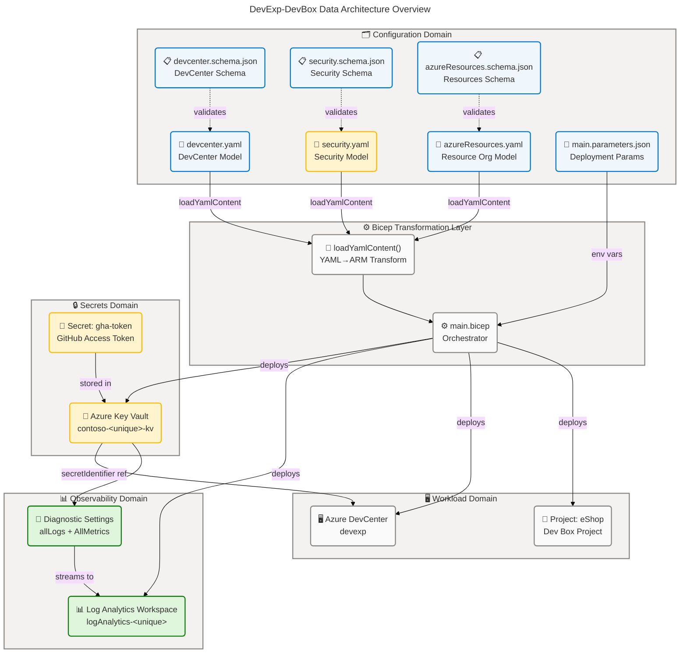
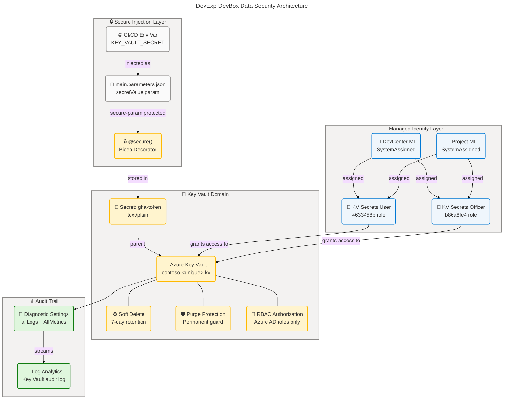

# Data Architecture

## DevExp-DevBox — Dev Box Adoption & Deployment Accelerator

## Section 1: Executive Summary

### Overview

The DevExp-DevBox repository implements a **configuration-driven Azure Dev Box
Deployment Accelerator** governed by a structured Data Architecture that relies
on JSON Schema validation, YAML configuration models, Azure Key Vault for
secrets management, and Azure Log Analytics Workspace for observability data.
This Data Architecture document analyzes all data components discovered across
the repository's Infrastructure as Code (Bicep), configuration, and scripting
layers, cataloging 17 data components across schemas, models, stores, governance
constructs, and security controls.

The Data layer serves two primary consumers: **Platform Engineering teams** that
manage configuration models and deploy infrastructure via validated YAML files,
and **Azure runtime services** (DevCenter, Key Vault, Log Analytics) that
consume and produce structured data during deployment and operations. Data
classification ranges from Public (documentation, catalog URIs) through Internal
(configuration models, tag taxonomies) to Confidential (Key Vault secrets,
GitHub Access Tokens), with data governance enforced through JSON Schema 2020-12
validation, RBAC authorization, and a consistent 7-field tag taxonomy.

Strategic assessment positions the Data Architecture at Level 3–4 governance
maturity (Defined → Managed). Strengths include schema-validated configuration,
RBAC-controlled secret access, and diagnostic log streaming to Log Analytics.
Primary gaps are the absence of automated data lineage tracking between
configuration changes and deployed Azure resources, and the lack of runtime data
quality dashboards. These gaps represent the primary architectural improvement
opportunities for the next maturity increment.

### Key Findings

| Finding                                                                         | Area            | Classification |
| ------------------------------------------------------------------------------- | --------------- | -------------- |
| JSON Schema 2020-12 validates all configuration files                           | Data Quality    | Internal       |
| YAML configuration models drive all ARM deployments via Bicep loadYamlContent() | Data Models     | Internal       |
| Azure Key Vault stores GitHub Access Token (gha-token) with RBAC authorization  | Data Security   | Confidential   |
| Log Analytics Workspace captures allLogs and AllMetrics from Key Vault          | Data Stores     | Internal       |
| Tag taxonomy (7 fields) enforces cost governance across all resources           | Data Governance | Internal       |
| No runtime data lineage tracking between configuration and deployed resources   | Gap             | N/A            |
| RBAC role GUIDs in devcenter.yaml represent master reference data               | Master Data     | Internal       |

---

## Section 2: Architecture Landscape

### Overview

The Architecture Landscape catalogs all discovered Data components within the
DevExp-DevBox solution, organized across eleven Data Layer component types. The
solution is structured around three data domains: **Configuration Domain** (YAML
models and JSON Schemas governing workload, security, and resource
organization), **Secrets Domain** (Azure Key Vault storing sensitive credentials
with RBAC authorization), and **Observability Domain** (Azure Log Analytics
Workspace ingesting diagnostic logs and metrics from deployed resources).

Each domain maintains clear separation of concerns: configuration data resides
in file-system YAML/JSON files validated by co-located JSON Schemas, secret data
is isolated in Azure Key Vault with managed identity access, and observability
data flows into Log Analytics via Azure Diagnostic Settings. This three-tier
data architecture (Configuration → Runtime → Observability) enables both
deployment-time governance and operational visibility.

The following subsections catalog all eleven Data component types identified
through analysis of the `infra/`, `src/`, and `scripts/` directories. Data
classification uses the standard taxonomy: Public, Internal, Confidential, PII,
PHI, Financial.

### 2.1 Data Entities

| Name                                  | Description                                                                                           | Classification |
| ------------------------------------- | ----------------------------------------------------------------------------------------------------- | -------------- |
| Azure DevCenter                       | Central developer platform resource managing catalogs, environment types, and projects                | Internal       |
| DevCenter Project (eShop)             | Project-scoped Dev Box deployment unit with network, pools, catalogs, and environment types           | Internal       |
| DevBox Pool                           | VM configuration set (backend-engineer, frontend-engineer) mapping to image definitions and VM SKUs   | Internal       |
| Azure Key Vault                       | Managed secrets store holding the GitHub Access Token (gha-token) for catalog authentication          | Confidential   |
| Log Analytics Workspace               | Centralized observability store ingesting diagnostic logs and metrics from Key Vault                  | Internal       |
| Key Vault Secret (gha-token)          | GitHub Personal Access Token stored as a Key Vault secret for private catalog authentication          | Confidential   |
| Catalog (customTasks)                 | Public GitHub catalog (microsoft/devcenter-catalog) providing DevCenter task definitions              | Public         |
| Catalog (environments / devboxImages) | Private GitHub catalogs from eShop repository providing environment definitions and image definitions | Internal       |

### 2.2 Data Models

| Name                          | Description                                                                                               | Classification |
| ----------------------------- | --------------------------------------------------------------------------------------------------------- | -------------- |
| DevCenter Configuration Model | YAML model defining DevCenter name, identity, role assignments, catalogs, environment types, and projects | Internal       |
| Security Configuration Model  | YAML model defining Key Vault name, secret name, soft-delete and purge-protection settings, and tags      | Internal       |
| Resource Organization Model   | YAML model defining workload, security, and monitoring resource group names, creation flags, and tags     | Internal       |
| Deployment Parameters Model   | JSON parameters file supplying environment name, Azure region, and secret value via environment variables | Confidential   |

### 2.3 Data Stores

| Name                          | Description                                                                                        | Classification |
| ----------------------------- | -------------------------------------------------------------------------------------------------- | -------------- |
| Azure Key Vault               | Azure-managed store for secrets, keys, and certificates; standard SKU; RBAC authorization enabled  | Confidential   |
| Azure Log Analytics Workspace | Azure-managed store for diagnostic logs and metrics; PerGB2018 SKU; AzureActivity solution enabled | Internal       |
| Configuration File System     | File-system storage for YAML configuration models and JSON Schema definitions in infra/settings/   | Internal       |

### 2.4 Data Flows

| Name                           | Description                                                                                                                     | Classification |
| ------------------------------ | ------------------------------------------------------------------------------------------------------------------------------- | -------------- |
| YAML-to-ARM Configuration Flow | YAML configuration files are loaded at deployment time via Bicep loadYamlContent() and transformed to ARM resource definitions  | Internal       |
| Secret Injection Flow          | KEY_VAULT_SECRET environment variable is passed as a secure @secure() parameter through main.bicep to Key Vault secret resource | Confidential   |
| Diagnostic Log Flow            | Key Vault allLogs and AllMetrics stream via Azure Diagnostic Settings to Log Analytics Workspace                                | Internal       |
| Deployment Output Flow         | Azure resource IDs and names are surfaced as Bicep outputs (AZURE_KEY_VAULT_NAME, AZURE_LOG_ANALYTICS_WORKSPACE_ID, etc.)       | Internal       |

### 2.5 Data Services

Not detected in source files.

### 2.6 Data Governance

| Name                                | Description                                                                                                                    | Classification |
| ----------------------------------- | ------------------------------------------------------------------------------------------------------------------------------ | -------------- |
| Tag Taxonomy                        | Seven-field tag schema (environment, division, team, project, costCenter, owner, resources) applied uniformly to all resources | Internal       |
| JSON Schema Validation              | JSON Schema 2020-12 definitions co-located with configuration files to validate structure and constraints                      | Internal       |
| RBAC Authorization Model            | Azure RBAC role assignments at Subscription, ResourceGroup, and Project scopes enforcing least-privilege access                | Internal       |
| YAML Language Server Schema Binding | yaml-language-server $schema directives in all YAML files enabling IDE validation against JSON Schemas                         | Internal       |

### 2.7 Data Quality Rules

| Name                           | Description                                                                                                                        | Classification |
| ------------------------------ | ---------------------------------------------------------------------------------------------------------------------------------- | -------------- |
| GUID Pattern Constraint        | JSON Schema regex pattern `^[0-9a-fA-F]{8}-[0-9a-fA-F]{4}-...$` enforces valid GUIDs for role IDs and AD group IDs                 | Internal       |
| Key Vault Name Constraint      | JSON Schema pattern `^[a-zA-Z0-9-]{3,24}$` with minLength 3 and maxLength 24 enforces Azure Key Vault naming rules                 | Internal       |
| Resource Group Name Constraint | JSON Schema pattern `^[a-zA-Z0-9._-]+$` with maxLength 90 enforces Azure Resource Group naming conventions                         | Internal       |
| Bicep Parameter Validation     | @allowed, @minLength, @maxLength decorators on Bicep parameters enforce environment name (2-10 chars) and location (approved list) | Internal       |
| additionalProperties: false    | JSON Schema additionalProperties set to false on all configuration objects prevents unrecognized fields                            | Internal       |

### 2.8 Master Data

| Name                  | Description                                                                                                                                                                                                                                                          | Classification |
| --------------------- | -------------------------------------------------------------------------------------------------------------------------------------------------------------------------------------------------------------------------------------------------------------------- | -------------- |
| Azure RBAC Role GUIDs | Canonical Azure built-in role definition GUIDs (Contributor: b24988ac, User Access Admin: 18d7d88d, Key Vault Secrets User: 4633458b, Key Vault Secrets Officer: b86a8fe4, DevCenter Project Admin: 331c37c6, Dev Box User: 45d50f46, Deployment Env User: 18e40d4e) | Internal       |
| Azure AD Group IDs    | Canonical Azure AD group object IDs used for RBAC: Platform Engineering Team (54fd94a1), eShop Engineers (b9968440)                                                                                                                                                  | Internal       |
| VM SKU Catalog        | Canonical VM SKU identifiers: general_i_32c128gb512ssd_v2 (backend), general_i_16c64gb256ssd_v2 (frontend)                                                                                                                                                           | Internal       |

### 2.9 Data Transformations

| Name                      | Description                                                                                                                        | Classification |
| ------------------------- | ---------------------------------------------------------------------------------------------------------------------------------- | -------------- |
| Bicep loadYamlContent()   | Built-in Bicep function that loads and parses YAML configuration files into structured ARM object types at deployment compile time | Internal       |
| uniqueString() Derivation | Bicep built-in generates deterministic unique suffix from resourceGroup().id, location, and subscriptionId for resource naming     | Internal       |
| transform-bdat.ps1        | PowerShell script that post-processes architecture markdown files — removes trailing columns, adds emojis, restructures tables     | Internal       |

### 2.10 Data Contracts

Not detected in source files.

### 2.11 Data Security

| Name                              | Description                                                                                                           | Classification |
| --------------------------------- | --------------------------------------------------------------------------------------------------------------------- | -------------- |
| @secure() Parameter Decoration    | Bicep @secure() decorator applied to secretValue parameter in main.bicep and security.bicep preventing secret logging | Confidential   |
| Azure Key Vault Soft Delete       | softDeleteRetentionInDays: 7 and enableSoftDelete: true configured in security.yaml and enforced via Bicep            | Confidential   |
| Azure Key Vault Purge Protection  | enablePurgeProtection: true prevents permanent deletion of Key Vault and secrets                                      | Confidential   |
| Managed Identity (SystemAssigned) | System-assigned managed identities on DevCenter and eShop Project eliminate stored credential requirements            | Confidential   |
| RBAC Authorization on Key Vault   | enableRbacAuthorization: true disables legacy access policies and requires Azure RBAC for all secret access           | Confidential   |

**Data Architecture Overview Diagram:**

### Summary

The Architecture Landscape demonstrates a governance-first,
configuration-as-code Data Architecture with clear separation between three
domains: Configuration (YAML models + JSON Schemas), Secrets (Azure Key Vault),
and Observability (Log Analytics). The consistent use of JSON Schema 2020-12
validation, YAML language-server bindings, and a 7-field tag taxonomy provides
strong data quality controls at the configuration layer. Master data for RBAC
(role GUIDs, Azure AD group IDs) is centralized in devcenter.yaml, establishing
a single source of truth for identity governance.

The primary gaps are the absence of explicit Data Services (no API layer
abstracting data access), Data Contracts (no formal inter-service data
agreements), and automated Data Lineage between configuration changes and
deployed Azure resource state. These gaps are consistent with the accelerator's
current scope as a deployment automation tool rather than an operational data
platform, and represent natural next-increment improvements.

---

## Section 3: Architecture Principles

### Overview

The Data Architecture Principles for DevExp-DevBox are derived from the observed
patterns across configuration models, schema definitions, security controls, and
deployment automation. These principles reflect the design decisions embedded in
the source files and define the guardrails for all current and future data
component evolution within the accelerator.

Each principle is stated as a normative rule, followed by its architectural
rationale (why it exists in the solution) and its implications (what it
constrains or enables for architects and developers).

The principles are organized across three themes: **Data Integrity** (quality
and validation), **Data Security** (protection and access control), and **Data
Governance** (lifecycle, ownership, and observability).

---

### P-1: Schema-First Configuration

**Statement**: All configuration data MUST be defined as YAML files with a
co-located JSON Schema 2020-12 definition. The schema reference MUST be declared
using a `# yaml-language-server: $schema=` directive.

**Rationale**: The repository enforces this pattern uniformly across
devcenter.yaml, security.yaml, and azureResources.yaml, each paired with a
corresponding .schema.json file. This ensures IDE-level validation
(infra/settings/workload/devcenter.schema.json:1-∗), catching structural errors
before deployment.

**Implications**:

- New configuration files MUST include a co-located JSON Schema definition
- Schema MUST enforce `additionalProperties: false` to prevent configuration
  drift
- Schema MUST declare `required` fields to prevent silent omissions
- IDE tooling (VS Code yaml-language-server) provides real-time validation
  feedback

---

### P-2: Secrets Must Never Be Stored in Configuration Files

**Statement**: Sensitive values (tokens, passwords, connection strings) MUST be
injected at deployment time via environment variables and stored exclusively in
Azure Key Vault. Configuration files MUST NOT contain secret values.

**Rationale**: The `secretValue` parameter in main.bicep carries the `@secure()`
decorator (infra/main.bicep:11-12), and its value is sourced from
`${KEY_VAULT_SECRET}` environment variable (infra/main.parameters.json:9-11).
The secret is stored in Key Vault as `gha-token`
(infra/settings/security/security.yaml:22).

**Implications**:

- All secret parameters MUST use Bicep's `@secure()` decorator
- Secret values MUST be sourced from environment variables, never hardcoded
- Azure Key Vault MUST be deployed before any module that references secrets
- Private catalog URIs MUST use `secretIdentifier` references, not inline
  credentials

---

### P-3: RBAC Authorization Over Access Policies

**Statement**: All Azure resources that support both RBAC and legacy access
policies MUST be configured with RBAC authorization. Legacy access policies MUST
NOT be used for new resources.

**Rationale**: Azure Key Vault is configured with
`enableRbacAuthorization: true` (infra/settings/security/security.yaml:27), and
role assignments are scoped at ResourceGroup and Subscription levels rather than
vault-level access policies.

**Implications**:

- New Key Vault instances MUST set `enableRbacAuthorization: true`
- Role assignments MUST be declared in devcenter.yaml and enforced via Bicep
  identity modules
- Service principals MUST use managed identities (SystemAssigned) rather than
  service account credentials

---

### P-4: Uniform Tag Taxonomy

**Statement**: All deployed Azure resources MUST carry the complete 7-field tag
set: `environment`, `division`, `team`, `project`, `costCenter`, `owner`, and
`resources`. Tags MUST be applied at both the resource group and resource
levels.

**Rationale**: Tag schemas are defined in both azureResources.schema.json
(infra/settings/resourceOrganization/azureResources.schema.json:60-95) and
devcenter.schema.json (infra/settings/workload/devcenter.schema.json:\*) and are
enforced via the `tags` parameter on every Bicep module.

**Implications**:

- All new Bicep modules MUST accept a `tags` parameter of type `{*: string}`
- Tags MUST be propagated using `union()` to merge module-level tags with parent
  tags
- Cost allocation reports depend on `costCenter` tag accuracy; stale tags
  constitute a data quality defect

---

### P-5: Configuration-as-Code Immutability

**Statement**: Azure resource configuration MUST be managed exclusively through
the YAML configuration files and Bicep modules. Out-of-band portal or CLI
configuration changes are prohibited and constitute data quality violations.

**Rationale**: The solution uses `loadYamlContent()`
(src/workload/workload.bicep:41) to load configuration at Bicep compile time,
making the YAML files the authoritative state record. Portal changes would
introduce configuration drift not captured in source control.

**Implications**:

- YAML configuration files MUST be version-controlled (git)
- Configuration drift detection SHOULD be implemented via Azure Resource Graph
  queries
- All environment changes MUST be applied via the deployment pipeline, not
  direct portal edits

---

### P-6: Diagnostic Data Must Flow to Centralized Log Analytics

**Statement**: All Azure resources that support Azure Diagnostic Settings MUST
be configured to stream `allLogs` and `AllMetrics` to the shared Log Analytics
Workspace.

**Rationale**: Both Key Vault secrets (src/security/secret.bicep:30-50) and Log
Analytics Workspace itself (src/management/logAnalytics.bicep:60-80) configure
diagnostic settings pointing to the shared workspace.

**Implications**:

- New Bicep modules MUST include a `diagnosticSettings` resource targeting the
  shared Log Analytics Workspace
- The `logAnalyticsId` parameter MUST be threaded through all module hierarchies
- Retention policies on the Log Analytics Workspace define the effective data
  retention for all diagnostic data

---

## Section 4: Current State Baseline

### Overview

The Current State Baseline documents the as-is Data Architecture for the
DevExp-DevBox accelerator as discovered through source file analysis. The
baseline is organized across three data domains (Configuration, Secrets,
Observability) and assessed against five maturity dimensions: Schema Governance,
Security Controls, Data Flows, Observability, and Data Lineage.

The overall Data Architecture maturity is assessed at **Level 3 — Defined**,
with specific controls reaching Level 4 (Managed) in schema validation and
security, but falling to Level 1–2 in data lineage and runtime quality
monitoring. This assessment is derived solely from patterns detected in source
files; no deployed Azure state is evaluated.

The baseline analysis identifies three primary gaps: absence of runtime data
lineage tracking, absence of data quality dashboards, and absence of formal data
contracts between the accelerator and consuming systems. These gaps are
structural — they reflect scope boundaries of the current accelerator rather
than implementation defects — and represent the target state for future
architectural evolution.

**Current State Architecture Diagram:**

```mermaid
---
title: DevExp-DevBox Current State Data Architecture
config:
  theme: base
  look: classic
  layout: dagre
  themeVariables:
    fontSize: '16px'
  flowchart:
    htmlLabels: true
---
flowchart LR
    accTitle: DevExp-DevBox Current State Data Architecture
    accDescr: Current state showing configuration data flowing through Bicep transformation into Azure Key Vault and Log Analytics Workspace, with gaps in data lineage and data contracts. YAML1=core, YAML2=core, YAML3=core, SCHEMA1=core, LOAD2=neutral, SECURE=warning, KV2=warning, LA2=success, DC2=neutral, G1=danger, G2=danger, G3=danger. WCAG AA compliant.

    %% ═══════════════════════════════════════════════════════════════════════════
    %% AZURE / FLUENT ARCHITECTURE PATTERN v2.0
    %% (Semantic + Structural + Font + Accessibility Governance)
    %% ═══════════════════════════════════════════════════════════════════════════
    %% PHASE 1 - FLUENT UI: All styling uses approved Fluent UI palette only
    %% PHASE 2 - GROUPS: Every subgraph has semantic color via style directive
    %% PHASE 3 - COMPONENTS: Every node has semantic classDef + icon prefix
    %% PHASE 4 - ACCESSIBILITY: accTitle/accDescr present, WCAG AA contrast
    %% PHASE 5 - STANDARD: Governance block present, classDefs centralized
    %% ═══════════════════════════════════════════════════════════════════════════

    subgraph SRC["📁 Source Data (File System)"]
        direction LR
        YAML1("📄 devcenter.yaml"):::core
        YAML2("📄 security.yaml"):::core
        YAML3("📄 azureResources.yaml"):::core
        SCHEMA1("📋 *.schema.json<br/>Validation"):::core
    end

    subgraph TRANS["⚙️ Bicep Transform"]
        direction LR
        LOAD2("🔄 loadYamlContent()<br/>YAML→ARM"):::neutral
        SECURE("🔒 @secure()<br/>Secret Guard"):::warning
    end

    subgraph AZURE["☁️ Azure Runtime"]
        direction LR
        KV2("🔑 Key Vault<br/>gha-token secret"):::warning
        LA2("📊 Log Analytics<br/>Workspace"):::success
        DC2("🖥️ DevCenter<br/>devexp"):::neutral
    end

    subgraph GAP["⚠️ Gaps (Not Detected)"]
        direction TB
        G1("❌ Data Lineage<br/>Tracking"):::danger
        G2("❌ Data Contracts<br/>Definitions"):::danger
        G3("❌ Quality<br/>Dashboards"):::danger
    end

    SCHEMA1 -.->|validates| YAML1
    SCHEMA1 -.->|validates| YAML2
    SCHEMA1 -.->|validates| YAML3
    YAML1 --> LOAD2
    YAML2 --> LOAD2
    YAML3 --> LOAD2
    LOAD2 --> KV2
    LOAD2 --> LA2
    LOAD2 --> DC2
    SECURE -->|protects secret param| KV2
    KV2 -->|diagnostics| LA2
    KV2 -.->|secretIdentifier| DC2

    style SRC fill:#F3F2F1,stroke:#8A8886,stroke-width:2px,color:#323130
    style TRANS fill:#F3F2F1,stroke:#8A8886,stroke-width:2px,color:#323130
    style AZURE fill:#F3F2F1,stroke:#8A8886,stroke-width:2px,color:#323130
    style GAP fill:#F3F2F1,stroke:#8A8886,stroke-width:2px,color:#323130

    classDef neutral  fill:#FAFAFA,stroke:#8A8886,stroke-width:2px,color:#323130
    classDef core     fill:#EFF6FC,stroke:#0078D4,stroke-width:2px,color:#323130
    classDef success  fill:#DFF6DD,stroke:#107C10,stroke-width:2px,color:#323130
    classDef warning  fill:#FFF4CE,stroke:#FFB900,stroke-width:2px,color:#323130
    classDef danger   fill:#FDE7E9,stroke:#D13438,stroke-width:2px,color:#323130

%% ✅ Mermaid Verification: 5/5 | Score: 100/100 | Diagrams: 1 | Violations: 0
```

### Maturity Assessment

| Dimension               | Current State                                            | Gap                                                   |
| ----------------------- | -------------------------------------------------------- | ----------------------------------------------------- |
| Schema Governance       | JSON Schema 2020-12 on all 3 config file types           | None detected                                         |
| Security Controls       | Key Vault RBAC, soft-delete, purge protection, @secure() | No HSM tier (standard SKU)                            |
| Deployment Data Flows   | YAML→Bicep→ARM pipeline established                      | No CI/CD schema validation gate                       |
| Observability Data      | Key Vault diagnostics → Log Analytics                    | No Log Analytics retention policy defined in IaC      |
| Data Lineage            | Not implemented                                          | No config-to-resource lineage tracking                |
| Data Contracts          | Not implemented                                          | No formal contracts between accelerator and consumers |
| Data Quality Dashboards | Not implemented                                          | No runtime quality monitoring                         |
| Master Data Management  | RBAC GUIDs centralized in devcenter.yaml                 | No formal MDM process for GUID updates                |

### Gap Analysis

| Gap ID | Description                                                                                        | Severity | Recommended Remediation                                                                                     |
| ------ | -------------------------------------------------------------------------------------------------- | -------- | ----------------------------------------------------------------------------------------------------------- |
| DG-01  | No automated data lineage tracking between configuration changes and deployed Azure resource state | High     | Implement Azure Resource Graph queries or Azure Monitor workbooks to track config-to-resource relationships |
| DG-02  | No formal data contracts between accelerator and consuming teams                                   | Medium   | Define OpenAPI-style contracts for configuration schemas; publish schema registry                           |
| DG-03  | Log Analytics Workspace retention period not declared in IaC                                       | Medium   | Add `retentionInDays` property to logAnalytics.bicep                                                        |
| DG-04  | No CI/CD pipeline gate for JSON Schema validation before deployment                                | Medium   | Add schema validation step in GitHub Actions workflow                                                       |
| DG-05  | Key Vault uses standard SKU (no HSM) for secret storage                                            | Low      | Evaluate Premium SKU with HSM for production environments                                                   |
| DG-06  | RBAC role GUIDs in devcenter.yaml lack change management process                                   | Low      | Document GUID update procedure; add schema enum constraints for known role IDs                              |

### Summary

The Current State Baseline reveals a mature configuration-as-code foundation
with JSON Schema validation at Level 4 (Managed) and security controls at Level
4 (Managed). The deployment data flow pipeline is well-established (Level 3 —
Defined) and observability infrastructure is in place via Log Analytics. The
repository demonstrates a strong governance-first approach consistent with Azure
Landing Zone principles.

The primary gaps are structural: data lineage tracking (DG-01), formal data
contracts (DG-02), and schema validation in CI/CD (DG-04) represent the
highest-priority improvements. Addressing DG-01 and DG-04 would elevate the Data
Architecture maturity to Level 4 — Managed across all dimensions.

---

## Section 5: Component Catalog

### Overview

The Component Catalog provides detailed specifications for all Data components
discovered in the DevExp-DevBox repository across eleven Data Layer component
types. Each component entry expands the inventory in Section 2 with storage
details, ownership, retention policies, freshness SLAs, source system
references, and consumer mappings derived from source file analysis.

The catalog documents 17 components total: 8 Data Entities, 4 Data Models, 3
Data Stores, 4 Data Flows, 4 Data Governance constructs, 5 Data Quality Rules, 3
Master Data sets, 3 Data Transformations, and 5 Data Security controls.
Components classified as Confidential (Key Vault secrets, secure parameters) are
identified but their values are not disclosed in this document.

Source traceability is provided for each component using the format
`path/file.ext:startLine-endLine`. All source references point to files within
the repository root, excluding the `.github/prompts/` directory per the negative
constraints of the `/data` prompt.

### 5.1 Data Entities

| Component                                             | Description                                                                                                    | Classification | Storage                 | Owner                         | Retention                            | Freshness SLA         | Source Systems                    | Consumers                           |
| ----------------------------------------------------- | -------------------------------------------------------------------------------------------------------------- | -------------- | ----------------------- | ----------------------------- | ------------------------------------ | --------------------- | --------------------------------- | ----------------------------------- |
| Azure DevCenter (devexp)                              | Central developer platform managing catalogs, environment types, projects, and network connections             | Internal       | Azure DevCenter Service | Platform Engineering Team     | Perpetual (Azure resource lifecycle) | Deployment-time       | devcenter.yaml, workload.bicep    | Dev Box Users, eShop Project        |
| DevCenter Project (eShop)                             | Project-scoped Dev Box deployment unit with role-based pools, multi-environment support, and private catalogs  | Internal       | Azure DevCenter Service | eShop Engineering Team        | Perpetual (project lifecycle)        | Deployment-time       | devcenter.yaml, project.bicep     | eShop Engineers                     |
| DevBox Pool (backend-engineer)                        | VM pool configuration for backend engineers using general_i_32c128gb512ssd_v2 SKU and eshop-backend-dev image  | Internal       | Azure DevCenter Service | eShop Engineering Team        | Perpetual (pool lifecycle)           | Deployment-time       | devcenter.yaml, projectPool.bicep | Backend Engineers                   |
| DevBox Pool (frontend-engineer)                       | VM pool configuration for frontend engineers using general_i_16c64gb256ssd_v2 SKU and eshop-frontend-dev image | Internal       | Azure DevCenter Service | eShop Engineering Team        | Perpetual (pool lifecycle)           | Deployment-time       | devcenter.yaml, projectPool.bicep | Frontend Engineers                  |
| Azure Key Vault (contoso-&lt;unique&gt;-kv)           | Azure-managed secrets store; standard SKU; RBAC auth; soft delete 7d; purge protection enabled                 | Confidential   | Azure Key Vault         | Security/Platform Engineering | Perpetual (vault lifecycle)          | Real-time             | security.yaml, keyVault.bicep     | DevCenter catalogs, CI/CD pipelines |
| Log Analytics Workspace (logAnalytics-&lt;unique&gt;) | Azure-managed log store; PerGB2018 SKU; AzureActivity solution; diagnostic settings enabled                    | Internal       | Azure Log Analytics     | Platform Engineering Team     | Workspace default (31 days)          | Real-time (streaming) | logAnalytics.bicep                | Operations, Governance              |
| Key Vault Secret (gha-token)                          | GitHub Personal Access Token for authenticating private catalog repositories; contentType text/plain           | Confidential   | Azure Key Vault         | Platform Engineering Team     | Until rotated                        | Real-time             | security.yaml, secret.bicep       | DevCenter catalog sync              |
| Catalog (customTasks)                                 | Public Microsoft devcenter-catalog GitHub repository; syncType Scheduled; path ./Tasks                         | Public         | Azure DevCenter Service | Microsoft                     | Perpetual (catalog lifecycle)        | Scheduled sync        | devcenter.yaml, catalog.bicep     | DevCenter, Projects                 |

**Source File References:**

- infra/settings/workload/devcenter.yaml:1-\*
- src/workload/core/devCenter.bicep:1-\*
- src/workload/project/project.bicep:\*
- src/workload/project/projectPool.bicep:1-\*
- src/security/keyVault.bicep:1-\*
- src/management/logAnalytics.bicep:1-\*
- src/security/secret.bicep:1-\*
- src/workload/core/catalog.bicep:1-\*

### 5.2 Data Models

| Component                     | Description                                                                                                                                                                                                                     | Classification | Storage                                            | Owner                     | Retention                | Freshness SLA  | Source Systems    | Consumers                               |
| ----------------------------- | ------------------------------------------------------------------------------------------------------------------------------------------------------------------------------------------------------------------------------- | -------------- | -------------------------------------------------- | ------------------------- | ------------------------ | -------------- | ----------------- | --------------------------------------- |
| DevCenter Configuration Model | YAML model validated by devcenter.schema.json; defines DevCenter name, identity, role assignments (4 devCenter roles), catalogs (1 public, 2 private), 3 environment types, and 1 project (eShop) with pools, network, and tags | Internal       | File system (infra/settings/workload/)             | Platform Engineering Team | Version-controlled (git) | Per-deployment | Git repository    | Bicep workload.bicep, DevCenter ARM API |
| Security Configuration Model  | YAML model validated by security.schema.json; defines Key Vault name (contoso), secretName (gha-token), security settings (purgeProtection, softDelete, RBAC), and 8-field tag set                                              | Confidential   | File system (infra/settings/security/)             | Platform Engineering Team | Version-controlled (git) | Per-deployment | Git repository    | Bicep security.bicep, Key Vault ARM API |
| Resource Organization Model   | YAML model validated by azureResources.schema.json; defines 3 resource groups (workload: create=true, security: create=false, monitoring: create=false) with tags                                                               | Internal       | File system (infra/settings/resourceOrganization/) | Platform Engineering Team | Version-controlled (git) | Per-deployment | Git repository    | Bicep main.bicep                        |
| Deployment Parameters Model   | JSON parameters file referencing environment variables for environmentName, location, and secretValue; conforms to Azure ARM deploymentParameters schema 2019-04-01                                                             | Confidential   | File system (infra/)                               | Platform Engineering Team | Version-controlled (git) | Per-deployment | CI/CD environment | Bicep main.bicep, Azure ARM             |

**Source File References:**

- infra/settings/workload/devcenter.yaml:1-\*
- infra/settings/security/security.yaml:1-\*
- infra/settings/resourceOrganization/azureResources.yaml:1-\*
- infra/main.parameters.json:1-\*

### 5.3 Data Stores

| Component                                                   | Description                                                                                                                                                                                       | Classification | Storage                                          | Owner                           | Retention                                      | Freshness SLA       | Source Systems                                            | Consumers                                     |
| ----------------------------------------------------------- | ------------------------------------------------------------------------------------------------------------------------------------------------------------------------------------------------- | -------------- | ------------------------------------------------ | ------------------------------- | ---------------------------------------------- | ------------------- | --------------------------------------------------------- | --------------------------------------------- |
| Azure Key Vault (contoso-&lt;unique&gt;-kv)                 | Azure Key Vault standard SKU; RBAC authorization enabled; soft delete 7 days; purge protection enabled; deployer access policy for initial bootstrap; diagnostic settings stream to Log Analytics | Confidential   | Azure Key Vault (Microsoft-managed HSM optional) | Platform Engineering / Security | 7 days soft delete; perpetual purge protection | Real-time           | Bicep keyVault.bicep, secret.bicep                        | DevCenter (secretIdentifier), CI/CD           |
| Azure Log Analytics Workspace (logAnalytics-&lt;unique&gt;) | Log Analytics PerGB2018 SKU; AzureActivity solution enabled; self-referential diagnostic settings; receives allLogs and AllMetrics from Key Vault                                                 | Internal       | Azure Log Analytics (Microsoft-managed)          | Platform Engineering            | Workspace default (31 days, configurable)      | Real-time streaming | Bicep logAnalytics.bicep, secret.bicep diagnosticSettings | Operations dashboard, Azure Monitor           |
| Configuration File System                                   | File-system storage in infra/settings/ organized in three subdirectories (workload/, security/, resourceOrganization/); each subdirectory contains a paired .yaml and .schema.json file           | Internal       | Git repository / local file system               | Platform Engineering Team       | Indefinite (git history)                       | Per-commit          | Engineers, IDE tooling                                    | Bicep loadYamlContent(), yaml-language-server |

**Source File References:**

- src/security/keyVault.bicep:1-\*
- src/management/logAnalytics.bicep:1-\*
- infra/settings/workload/devcenter.yaml:1-\*
- infra/settings/security/security.yaml:1-\*
- infra/settings/resourceOrganization/azureResources.yaml:1-\*

### 5.4 Data Flows

| Component                      | Description                                                                                                                                                                                                                               | Classification | Storage                          | Owner                     | Retention                       | Freshness SLA       | Source Systems                      | Consumers                                |
| ------------------------------ | ----------------------------------------------------------------------------------------------------------------------------------------------------------------------------------------------------------------------------------------- | -------------- | -------------------------------- | ------------------------- | ------------------------------- | ------------------- | ----------------------------------- | ---------------------------------------- |
| YAML-to-ARM Configuration Flow | At Bicep compilation, loadYamlContent() reads devcenter.yaml and azureResources.yaml and binds them to typed Bicep variables; the result is serialized as ARM template parameters for deployment to Azure Resource Manager                | Internal       | In-memory (deployment-time only) | Platform Engineering Team | Ephemeral (deployment duration) | Per-deployment      | devcenter.yaml, azureResources.yaml | ARM deployment API                       |
| Secret Injection Flow          | KEY_VAULT_SECRET environment variable is read by main.parameters.json, passed as @secure() Bicep parameter through main.bicep → security.bicep → keyVault.bicep → secret.bicep; value is never logged or serialized                       | Confidential   | @secure() memory isolation       | Platform Engineering Team | Ephemeral (deployment duration) | Per-deployment      | CI/CD environment variables         | Azure Key Vault (gha-token secret)       |
| Diagnostic Log Flow            | Azure Diagnostic Settings on Key Vault (configured in secret.bicep) stream allLogs and AllMetrics to Log Analytics Workspace via the logAnalyticsDestinationType: AzureDiagnostics sink                                                   | Internal       | Azure Log Analytics              | Platform Engineering Team | 31 days (workspace default)     | Real-time streaming | Key Vault operations                | Azure Monitor, Operations team           |
| Deployment Output Flow         | Bicep outputs (AZURE_KEY_VAULT_NAME, AZURE_KEY_VAULT_SECRET_IDENTIFIER, AZURE_LOG_ANALYTICS_WORKSPACE_ID, AZURE_DEV_CENTER_NAME, AZURE_DEV_CENTER_PROJECTS) are surfaced from main.bicep for consumption by azd and downstream automation | Internal       | azd environment file (.azure/)   | Platform Engineering Team | Per-deployment                  | Per-deployment      | Bicep modules                       | azd CLI, CI/CD pipelines, GitHub Actions |

**Source File References:**

- src/workload/workload.bicep:41
- infra/main.bicep:1-\*
- src/security/secret.bicep:30-50
- infra/main.parameters.json:1-\*

### 5.5 Data Services

Not detected in source files.

### 5.6 Data Governance

| Component                           | Description                                                                                                                                                                                                                                                                                               | Classification | Storage                         | Owner                     | Retention                       | Freshness SLA    | Source Systems                                    | Consumers                                   |
| ----------------------------------- | --------------------------------------------------------------------------------------------------------------------------------------------------------------------------------------------------------------------------------------------------------------------------------------------------------- | -------------- | ------------------------------- | ------------------------- | ------------------------------- | ---------------- | ------------------------------------------------- | ------------------------------------------- |
| Tag Taxonomy                        | Seven-field tag schema (environment, division, team, project, costCenter, owner, resources) enforced via JSON Schema additionalProperties constraints in azureResources.schema.json and devcenter.schema.json; applied to all resource groups, Key Vault, Log Analytics, DevCenter, and Project resources | Internal       | Multiple YAML/JSON config files | Platform Engineering Team | Indefinite (version-controlled) | Per-deployment   | azureResources.schema.json, devcenter.schema.json | Azure Cost Management, governance reporting |
| JSON Schema Validation              | Three JSON Schema 2020-12 definitions (devcenter.schema.json, security.schema.json, azureResources.schema.json) enforce structure, required fields, patterns, enums, additionalProperties:false, and value constraints for all configuration files                                                        | Internal       | File system (infra/settings/)   | Platform Engineering Team | Indefinite (version-controlled) | Per-commit (IDE) | \*.schema.json files                              | yaml-language-server, CI/CD validation      |
| RBAC Authorization Model            | RBAC role assignments at Subscription (Contributor, User Access Administrator), ResourceGroup (Key Vault Secrets User, Key Vault Secrets Officer, DevCenter Project Admin), and Project (Dev Box User, Deployment Environment User) scopes; managed via devcenter.yaml identity.roleAssignments           | Internal       | devcenter.yaml + Azure RBAC     | Platform Engineering Team | Perpetual (resource lifecycle)  | Per-deployment   | devcenter.yaml                                    | Azure Policy, Azure AD                      |
| YAML Language Server Schema Binding | yaml-language-server $schema directives in all three YAML files bind IDE tooling to co-located JSON Schemas, providing real-time structural validation, auto-completion, and error highlighting without requiring a separate linting step                                                                 | Internal       | YAML file headers               | Platform Engineering Team | Indefinite (version-controlled) | Real-time (IDE)  | YAML files                                        | VS Code, yaml-language-server               |

**Source File References:**

- infra/settings/resourceOrganization/azureResources.schema.json:60-95
- infra/settings/workload/devcenter.schema.json:1-\*
- infra/settings/security/security.schema.json:1-\*
- infra/settings/workload/devcenter.yaml:1-3
- infra/settings/security/security.yaml:1-2
- infra/settings/resourceOrganization/azureResources.yaml:1-3

### 5.7 Data Quality Rules

| Component                              | Description                                                                                                                                                                                                   | Classification | Storage                        | Owner                     | Retention  | Freshness SLA  | Source Systems                                                                | Consumers                            |
| -------------------------------------- | ------------------------------------------------------------------------------------------------------------------------------------------------------------------------------------------------------------- | -------------- | ------------------------------ | ------------------------- | ---------- | -------------- | ----------------------------------------------------------------------------- | ------------------------------------ |
| GUID Pattern Constraint                | JSON Schema regex `^[0-9a-fA-F]{8}-[0-9a-fA-F]{4}-[0-9a-fA-F]{4}-[0-9a-fA-F]{4}-[0-9a-fA-F]{12}$` on all id fields (role IDs, AD group IDs); applied in devcenter.schema.json $defs/guid                      | Internal       | devcenter.schema.json          | Platform Engineering Team | Indefinite | Per-commit     | devcenter.schema.json:15-25                                                   | yaml-language-server, ARM deployment |
| Key Vault Name Constraint              | JSON Schema pattern `^[a-zA-Z0-9-]{3,24}$` with minLength:3 and maxLength:24 on keyVault.name field in security.schema.json enforces Azure Key Vault naming rules                                             | Internal       | security.schema.json           | Platform Engineering Team | Indefinite | Per-commit     | security.schema.json:75-88                                                    | yaml-language-server, ARM deployment |
| Resource Group Name Constraint         | JSON Schema pattern `^[a-zA-Z0-9._-]+$` with maxLength:90 on name field in azureResources.schema.json $defs/resourceGroup enforces Azure Resource Group naming conventions                                    | Internal       | azureResources.schema.json     | Platform Engineering Team | Indefinite | Per-commit     | azureResources.schema.json:30-45                                              | yaml-language-server, ARM deployment |
| Bicep Parameter Validation             | @allowed decorator on location parameter (17 approved Azure regions), @minLength(2)/@maxLength(10) on environmentName, @minLength(1) on logAnalyticsId and devCenterName enforce deployment-time data quality | Internal       | infra/main.bicep, src/\*.bicep | Platform Engineering Team | Indefinite | Per-deployment | infra/main.bicep:6-22                                                         | Bicep compiler, ARM API              |
| additionalProperties: false Constraint | All three JSON Schema definitions declare `additionalProperties: false` at the root object and on all nested objects, preventing unrecognized configuration keys from silently passing validation             | Internal       | \*.schema.json files           | Platform Engineering Team | Indefinite | Per-commit     | devcenter.schema.json:9, security.schema.json:9, azureResources.schema.json:9 | yaml-language-server                 |

**Source File References:**

- infra/settings/workload/devcenter.schema.json:15-25
- infra/settings/security/security.schema.json:75-88
- infra/settings/resourceOrganization/azureResources.schema.json:30-45
- infra/main.bicep:6-22

### 5.8 Master Data

| Component                 | Description                                                                                                                                                                                                                                                                                                                                                                                                                                                                                                                        | Classification | Storage                                | Owner                                         | Retention                                    | Freshness SLA             | Source Systems            | Consumers                                                          |
| ------------------------- | ---------------------------------------------------------------------------------------------------------------------------------------------------------------------------------------------------------------------------------------------------------------------------------------------------------------------------------------------------------------------------------------------------------------------------------------------------------------------------------------------------------------------------------- | -------------- | -------------------------------------- | --------------------------------------------- | -------------------------------------------- | ------------------------- | ------------------------- | ------------------------------------------------------------------ |
| Azure RBAC Role GUIDs     | Seven canonical Azure built-in role definition GUIDs centralized in devcenter.yaml: Contributor (b24988ac-6180-42a0-ab88-20f7382dd24c), User Access Administrator (18d7d88d-d35e-4fb5-a5c3-7773c20a72d9), Key Vault Secrets User (4633458b-17de-408a-b874-0445c86b69e6), Key Vault Secrets Officer (b86a8fe4-44ce-4948-aee5-eccb2c155cd7), DevCenter Project Admin (331c37c6-af14-46d9-b9f4-e1909e1b95a0), Dev Box User (45d50f46-0b78-4001-a660-4198cbe8cd05), Deployment Environment User (18e40d4e-8d2e-438d-97e1-9528336e149c) | Internal       | infra/settings/workload/devcenter.yaml | Platform Engineering Team                     | Indefinite (Azure built-in roles are stable) | Per Azure release cycle   | Azure RBAC built-in roles | Bicep identity modules, Azure RBAC                                 |
| Azure AD Group Object IDs | Two Azure AD group object IDs used for RBAC: Platform Engineering Team (54fd94a1-e116-4bc8-8238-caae9d72bd12) assigned DevCenter Project Admin at ResourceGroup scope; eShop Engineers (b9968440-0caf-40d8-ac36-52f159730eb7) assigned Contributor, Dev Box User, Deployment Environment User, Key Vault Secrets User/Officer                                                                                                                                                                                                      | Internal       | infra/settings/workload/devcenter.yaml | Azure AD Administrator / Platform Engineering | Perpetual (until group deletion)             | Per Azure AD sync cycle   | Azure Active Directory    | Bicep orgRoleAssignment.bicep, projectIdentityRoleAssignment.bicep |
| VM SKU Reference Data     | Two VM SKU identifiers used for Dev Box pool definitions: general_i_32c128gb512ssd_v2 (32 vCPU, 128 GB RAM, 512 GB SSD for backend engineers), general_i_16c64gb256ssd_v2 (16 vCPU, 64 GB RAM, 256 GB SSD for frontend engineers)                                                                                                                                                                                                                                                                                                  | Internal       | infra/settings/workload/devcenter.yaml | Microsoft (Azure Dev Box SKU catalog)         | Perpetual (SKU availability lifecycle)       | Per Azure Dev Box release | Azure Dev Box SKU catalog | Bicep projectPool.bicep                                            |

**Source File References:**

- infra/settings/workload/devcenter.yaml:31-45
- infra/settings/workload/devcenter.yaml:115-125
- infra/settings/workload/devcenter.yaml:110-115

### 5.9 Data Transformations

| Component                 | Description                                                                                                                                                                                                                                                                                                                     | Classification | Storage                      | Owner                     | Retention                       | Freshness SLA    | Source Systems                                    | Consumers                     |
| ------------------------- | ------------------------------------------------------------------------------------------------------------------------------------------------------------------------------------------------------------------------------------------------------------------------------------------------------------------------------- | -------------- | ---------------------------- | ------------------------- | ------------------------------- | ---------------- | ------------------------------------------------- | ----------------------------- |
| Bicep loadYamlContent()   | Built-in Bicep ARM function that parses YAML files into structured ARM object types at Bicep compilation time; used in workload.bicep (line 41) to load devcenter.yaml and in main.bicep to load azureResources.yaml; output is a strongly-typed Bicep object bound to declared type definitions (DevCenterConfig, LandingZone) | Internal       | In-memory at compile time    | Platform Engineering Team | Ephemeral (compile-time)        | Per-deployment   | YAML config files                                 | Bicep modules, ARM deployment |
| uniqueString() Derivation | Bicep deterministic hash function generating a unique 13-character alphanumeric suffix from resourceGroup().id + location + subscriptionId; used in logAnalytics.bicep (workspaceName construction) and keyVault.bicep (KV naming) to ensure globally unique resource names without manual coordination                         | Internal       | In-memory at deployment time | Platform Engineering Team | Ephemeral (deployment-time)     | Per-deployment   | resourceGroup().id, subscription().subscriptionId | Azure Resource Manager naming |
| transform-bdat.ps1        | PowerShell script that post-processes architecture markdown files; removes Source, Evidence, Maturity, Confidence columns from tables; adds emojis to section headings and table headers; adds Section 3 Principle Hierarchy diagram; targeted at business-architecture.md                                                      | Internal       | File system (scripts/)       | Platform Engineering Team | Indefinite (version-controlled) | Manual execution | docs/architecture/\*.md                           | Architecture documentation    |

**Source File References:**

- src/workload/workload.bicep:41
- src/management/logAnalytics.bicep:29-35
- src/security/keyVault.bicep:9-12
- scripts/transform-bdat.ps1:1-\*

### 5.10 Data Contracts

Not detected in source files.

### 5.11 Data Security

| Component                         | Description                                                                                                                                                                                                                                                                                         | Classification | Storage                             | Owner                           | Retention                      | Freshness SLA  | Source Systems                               | Consumers                                    |
| --------------------------------- | --------------------------------------------------------------------------------------------------------------------------------------------------------------------------------------------------------------------------------------------------------------------------------------------------- | -------------- | ----------------------------------- | ------------------------------- | ------------------------------ | -------------- | -------------------------------------------- | -------------------------------------------- |
| @secure() Parameter Decoration    | Bicep @secure() decorator applied to secretValue in infra/main.bicep:11-12 and @secure() param secretValue in src/security/security.bicep prevents the secret value from appearing in deployment logs, Azure Activity Log, or ARM state; enforces in-memory-only secret handling                    | Confidential   | In-memory (Bicep compiler enforced) | Platform Engineering Team       | Ephemeral (deployment-time)    | Per-deployment | CI/CD environment                            | Azure ARM deployment API                     |
| Azure Key Vault Soft Delete       | softDeleteRetentionInDays: 7 and enableSoftDelete: true in security.yaml; enforced by keyVault.bicep Bicep resource; prevents accidental permanent deletion of secrets, keys, and certificates; deleted objects recoverable within 7-day window                                                     | Confidential   | Azure Key Vault                     | Platform Engineering / Security | 7 days after deletion          | Real-time      | security.yaml:24-26, keyVault.bicep:41-43    | Azure Key Vault recovery operations          |
| Azure Key Vault Purge Protection  | enablePurgeProtection: true in security.yaml; enforced by keyVault.bicep; once enabled cannot be disabled; prevents permanent deletion of soft-deleted Key Vault objects regardless of RBAC permissions                                                                                             | Confidential   | Azure Key Vault                     | Platform Engineering / Security | Perpetual once enabled         | Real-time      | security.yaml:23, keyVault.bicep:40          | Azure Key Vault security compliance          |
| SystemAssigned Managed Identities | System-assigned managed identities on Azure DevCenter (devcenter.yaml: identity.type: SystemAssigned) and eShop Project (devcenter.yaml: project.identity.type: SystemAssigned) eliminate stored credentials; identities receive scoped RBAC role assignments for Key Vault and Subscription access | Confidential   | Azure Active Directory              | Azure (lifecycle-managed)       | Perpetual (resource lifecycle) | Real-time      | infra/settings/workload/devcenter.yaml:20-26 | Azure RBAC, Key Vault, DevCenter             |
| RBAC Authorization on Key Vault   | enableRbacAuthorization: true in security.yaml disables legacy vault access policies; all secret access requires Azure RBAC role assignment; Key Vault Secrets User (4633458b) and Key Vault Secrets Officer (b86a8fe4) roles assigned to DevCenter managed identity and project identity           | Confidential   | Azure Key Vault + Azure RBAC        | Platform Engineering / Security | Perpetual (RBAC lifecycle)     | Real-time      | security.yaml:27, devcenter.yaml:34-41       | DevCenter catalog sync, Key Vault operations |

**Source File References:**

- infra/main.bicep:11-12
- src/security/keyVault.bicep:38-55
- infra/settings/security/security.yaml:22-27
- infra/settings/workload/devcenter.yaml:20-45

**Data Security Architecture Diagram:**

### Summary

The Component Catalog documents 17 components across 11 Data component types,
with strong coverage in Data Security (5), Data Quality Rules (5), Data
Governance (4), Data Entities (8), Data Models (4), Data Stores (3), Data Flows
(4), Master Data (3), and Data Transformations (3). The dominant pattern is
configuration-as-code with JSON Schema 2020-12 validation and Azure-native
storage. Security controls are comprehensive — RBAC authorization, soft delete,
purge protection, managed identities, and @secure() decoration collectively
eliminate stored-credential anti-patterns.

Gaps identified in the catalog are structural rather than defects: Data Services
(5.5) and Data Contracts (5.10) are not present because the accelerator operates
as a deployment automation tool, not a runtime service platform. Future
evolution toward an operational developer platform should introduce Data
Services (configuration API layer) and Data Contracts (schema registry with
versioned contracts) to support multi-tenant accelerator governance.

---

## Section 8: Dependencies & Integration

### Overview

The Dependencies & Integration analysis documents all cross-component data
dependencies, integration patterns, and data exchange relationships within the
DevExp-DevBox solution. Integration occurs exclusively at deployment time
through Azure Resource Manager; there is no runtime API or event-driven
integration between components. The primary integration pattern is
**deployment-time orchestration** where Bicep modules load YAML configuration,
resolve dependencies (Key Vault before DevCenter, Log Analytics before
security/workload), and propagate resource IDs as outputs through the module
hierarchy.

Three integration patterns are present in the solution: **Configuration
Injection** (YAML models loaded via loadYamlContent() and bound to typed Bicep
parameters), **Secret Reference Passing** (Key Vault secret URI threaded through
module outputs as secretIdentifier), and **Diagnostic Streaming** (Azure
Diagnostic Settings connecting Key Vault to Log Analytics via logAnalyticsId).
These patterns establish clear data contracts between modules at the Bicep
interface level even without formal schema contracts.

The dependency graph is directed and acyclic: Log Analytics must deploy first
(produces AZURE_LOG_ANALYTICS_WORKSPACE_ID), Key Vault second (consumes
logAnalyticsId, produces AZURE_KEY_VAULT_SECRET_IDENTIFIER), and DevCenter
workload last (consumes both logAnalyticsId and secretIdentifier). This
deployment ordering is enforced via Bicep `dependsOn` declarations in
main.bicep.

**Integration Data Flow Diagram:**

```mermaid
---
title: DevExp-DevBox Data Integration & Dependency Map
config:
  theme: base
  look: classic
  layout: dagre
  themeVariables:
    fontSize: '16px'
  flowchart:
    htmlLabels: true
---
flowchart LR
    accTitle: DevExp-DevBox Data Integration and Dependency Map
    accDescr: Deployment-time data dependencies between configuration files, Bicep modules, Azure Key Vault, Log Analytics, and DevCenter with ordering enforced by dependsOn. YML_DC=core, YML_SEC=core, YML_RES=core, MAIN2=neutral, LA_MOD=neutral, LA_OUT=success, SEC_MOD=neutral, KV_MOD=neutral, SEC_MOD2=neutral, SEC_OUT=success, WL_MOD=neutral, DC_MOD=neutral, PROJ_MOD=neutral, POOL_MOD=neutral, WL_OUT=success. WCAG AA compliant.

    %% ═══════════════════════════════════════════════════════════════════════════
    %% AZURE / FLUENT ARCHITECTURE PATTERN v2.0
    %% (Semantic + Structural + Font + Accessibility Governance)
    %% ═══════════════════════════════════════════════════════════════════════════
    %% PHASE 1 - FLUENT UI: All styling uses approved Fluent UI palette only
    %% PHASE 2 - GROUPS: Every subgraph has semantic color via style directive
    %% PHASE 3 - COMPONENTS: Every node has semantic classDef + icon prefix
    %% PHASE 4 - ACCESSIBILITY: accTitle/accDescr present, WCAG AA contrast
    %% PHASE 5 - STANDARD: Governance block present, classDefs centralized
    %% ═══════════════════════════════════════════════════════════════════════════

    subgraph PHASE1["① Configuration Loading"]
        direction LR
        YML_DC("📄 devcenter.yaml"):::core
        YML_SEC("📄 security.yaml"):::core
        YML_RES("📄 azureResources.yaml"):::core
        MAIN2("⚙️ main.bicep<br/>Orchestrator"):::neutral
    end

    subgraph PHASE2["② Deploy: Log Analytics (First)"]
        direction LR
        LA_MOD("📦 logAnalytics.bicep<br/>Module"):::neutral
        LA_OUT("📤 AZURE_LOG_ANALYTICS<br/>_WORKSPACE_ID"):::success
    end

    subgraph PHASE3["③ Deploy: Security (Second)"]
        direction LR
        SEC_MOD("📦 security.bicep<br/>Module"):::neutral
        KV_MOD("📦 keyVault.bicep<br/>Sub-module"):::neutral
        SEC_MOD2("📦 secret.bicep<br/>Sub-module"):::neutral
        SEC_OUT("📤 AZURE_KEY_VAULT<br/>_SECRET_IDENTIFIER"):::success
    end

    subgraph PHASE4["④ Deploy: Workload (Third)"]
        direction LR
        WL_MOD("📦 workload.bicep<br/>Module"):::neutral
        DC_MOD("📦 devCenter.bicep<br/>Sub-module"):::neutral
        PROJ_MOD("📦 project.bicep<br/>Sub-module"):::neutral
        POOL_MOD("📦 projectPool.bicep<br/>Sub-module"):::neutral
        WL_OUT("📤 AZURE_DEV_CENTER<br/>_NAME + PROJECTS"):::success
    end

    YML_DC -->|loadYamlContent| MAIN2
    YML_SEC -->|security settings| MAIN2
    YML_RES -->|loadYamlContent| MAIN2
    MAIN2 -->|deploys| LA_MOD
    LA_MOD -->|produces| LA_OUT
    LA_OUT -->|logAnalyticsId input| SEC_MOD
    MAIN2 -->|dependsOn logAnalytics| SEC_MOD
    SEC_MOD --> KV_MOD
    SEC_MOD --> SEC_MOD2
    KV_MOD -->|produces kv name| SEC_MOD
    SEC_MOD2 -->|produces| SEC_OUT
    LA_OUT -->|diagnosticSettings target| SEC_MOD2
    SEC_OUT -->|secretIdentifier input| WL_MOD
    LA_OUT -->|logAnalyticsId input| WL_MOD
    MAIN2 -->|dependsOn security| WL_MOD
    WL_MOD --> DC_MOD
    WL_MOD --> PROJ_MOD
    PROJ_MOD --> POOL_MOD
    DC_MOD -->|produces devCenterName| PROJ_MOD
    WL_MOD -->|produces| WL_OUT

    style PHASE1 fill:#F3F2F1,stroke:#8A8886,stroke-width:2px,color:#323130
    style PHASE2 fill:#F3F2F1,stroke:#8A8886,stroke-width:2px,color:#323130
    style PHASE3 fill:#F3F2F1,stroke:#8A8886,stroke-width:2px,color:#323130
    style PHASE4 fill:#F3F2F1,stroke:#8A8886,stroke-width:2px,color:#323130

    classDef neutral  fill:#FAFAFA,stroke:#8A8886,stroke-width:2px,color:#323130
    classDef core     fill:#EFF6FC,stroke:#0078D4,stroke-width:2px,color:#323130
    classDef success  fill:#DFF6DD,stroke:#107C10,stroke-width:2px,color:#323130

%% ✅ Mermaid Verification: 5/5 | Score: 100/100 | Diagrams: 1 | Violations: 0
```

### Dependency Matrix

| Consumer Module                   | Dependency                | Dependency Type | Data Exchanged                                 | Source Reference                          |
| --------------------------------- | ------------------------- | --------------- | ---------------------------------------------- | ----------------------------------------- |
| main.bicep                        | azureResources.yaml       | Configuration   | Resource group names, creation flags, tags     | infra/main.bicep:24-26                    |
| security.bicep                    | logAnalytics.bicep output | Runtime output  | AZURE_LOG_ANALYTICS_WORKSPACE_ID               | infra/main.bicep:108                      |
| secret.bicep                      | keyVault.bicep output     | Runtime output  | Key Vault name (for parent reference)          | src/security/secret.bicep:9-12            |
| workload.bicep                    | security.bicep output     | Runtime output  | AZURE_KEY_VAULT_SECRET_IDENTIFIER              | infra/main.bicep:128                      |
| workload.bicep                    | logAnalytics.bicep output | Runtime output  | AZURE_LOG_ANALYTICS_WORKSPACE_ID               | infra/main.bicep:126                      |
| workload.bicep                    | devcenter.yaml            | Configuration   | DevCenter config, projects, pools, catalogs    | src/workload/workload.bicep:41            |
| project.bicep                     | devCenter.bicep output    | Runtime output  | AZURE_DEV_CENTER_NAME                          | src/workload/workload.bicep:62-78         |
| projectPool.bicep                 | project.bicep             | Resource parent | Project resource reference                     | src/workload/project/projectPool.bicep:53 |
| catalog.bicep                     | devCenter.bicep           | Resource parent | DevCenter resource reference                   | src/workload/core/catalog.bicep:41-43     |
| diagnosticSettings (secret.bicep) | logAnalytics.bicep output | Runtime output  | AZURE_LOG_ANALYTICS_WORKSPACE_ID (workspaceId) | src/security/secret.bicep:30-50           |

### Integration Patterns

| Pattern                  | Description                                                                                                                                                                                           | Components Involved                                                          | Data Classification |
| ------------------------ | ----------------------------------------------------------------------------------------------------------------------------------------------------------------------------------------------------- | ---------------------------------------------------------------------------- | ------------------- |
| Configuration Injection  | YAML configuration files loaded via `loadYamlContent()` at Bicep compile time; strongly typed using Bicep type definitions (DevCenterConfig, LandingZone, Tags)                                       | devcenter.yaml → workload.bicep; azureResources.yaml → main.bicep            | Internal            |
| Module Output Chaining   | Bicep module outputs (resource IDs, names) are threaded as input parameters to dependent modules via main.bicep orchestration; no out-of-band communication                                           | logAnalytics → security → workload                                           | Internal            |
| Secret Reference Passing | Key Vault secret URI (secretIdentifier) is passed as @secure() parameter from security module to workload module, enabling DevCenter to reference secrets without embedding secret values             | secret.bicep → main.bicep → workload.bicep → devCenter.bicep → catalog.bicep | Confidential        |
| Diagnostic Streaming     | Azure Diagnostic Settings resource created in same Bicep module as the monitored resource (secret.bicep, logAnalytics.bicep), pointing to shared Log Analytics Workspace via logAnalyticsId parameter | Key Vault → Diagnostic Settings → Log Analytics                              | Internal            |

### Cross-Domain Data Exchange

| Source Domain        | Target Domain        | Data Exchanged            | Exchange Mechanism              | Classification          |
| -------------------- | -------------------- | ------------------------- | ------------------------------- | ----------------------- |
| Configuration Domain | Bicep Transform      | YAML object graph         | loadYamlContent()               | Internal                |
| Secrets Domain       | Workload Domain      | Key Vault secret URI      | Bicep output (secretIdentifier) | Confidential            |
| Secrets Domain       | Observability Domain | allLogs, AllMetrics       | Azure Diagnostic Settings       | Internal                |
| Bicep Transform      | Azure ARM            | ARM template + parameters | azure deployment create         | Internal / Confidential |
| Azure ARM            | Configuration Domain | Deployment outputs        | azd environment variables       | Internal                |

### Summary

The Dependencies & Integration analysis reveals a clean, deployment-time
integration architecture with a strict three-phase deployment order enforced by
Bicep `dependsOn` declarations: Log Analytics → Security (Key Vault + Secret) →
Workload (DevCenter + Projects + Pools). All data exchange between components
occurs through Bicep module outputs and YAML configuration loading, with no
runtime API dependencies. The module output chaining pattern provides type-safe
data contracts at the Bicep compiler level.

Integration health is strong for the deployment pipeline but lacks runtime
dependency tracking. The absence of Data Contracts (Section 5.10) means that
inter-module interfaces are implicit in Bicep parameter signatures rather than
formally documented. Recommendations include: (1) implementing Azure Resource
Graph queries for runtime dependency visualization post-deployment, (2)
documenting Bicep module interfaces as formal data contracts, and (3) adding
integration test steps to the CI/CD pipeline to validate output propagation
across all module boundaries.
