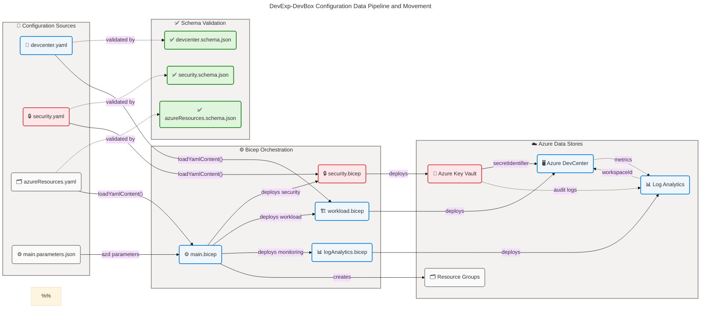
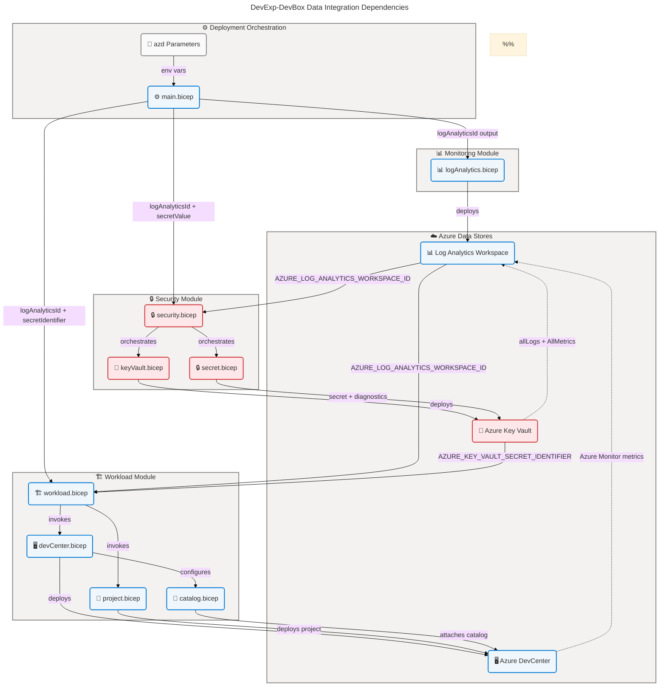

# Data Architecture

## Section 1: Executive Summary

### Overview

The DevExp-DevBox repository implements a configuration-driven Azure DevCenter
deployment accelerator using Infrastructure-as-Code (Bicep), JSON
Schema–validated YAML configuration models, and Azure-native data stores. The
Data layer is organized across three primary domains: **Workload Data**
(DevCenter configuration entities, project definitions, catalog references),
**Security Data** (Azure Key Vault secrets, keys, and RBAC configurations), and
**Monitoring Data** (Log Analytics telemetry and audit streams). All
configuration data is schema-first, validated at design time against JSON Schema
2020-12 definitions, and loaded at deployment time via Bicep's
`loadYamlContent()` function.

The Data architecture comprises 15 identifiable components across 9 active
component types: 9 data entities (Bicep user-defined types), 4 data models (YAML
configuration files), 2 data stores (Azure Key Vault and Log Analytics
Workspace), 4 active data flows, 3 data governance policies, 3 data quality
schemas, 3 data transformation operations, and 3 data security controls. The
architecture is deliberately lightweight and configuration-centric, with no
application-layer databases or data warehouses — all data persistence occurs
within Azure-managed platform services.

Strategic alignment is strong: the schema-first approach ensures data integrity
at every deployment boundary, tag-based governance provides cost attribution and
ownership traceability, and RBAC-based access controls enforce least-privilege
data access across all Azure resources. The primary architectural gap identified
is the absence of automated data lineage tracking between configuration file
changes and deployed Azure resource states, which represents a Level 2 maturity
ceiling for data governance.

## Section 2: Architecture Landscape

### Overview

The Architecture Landscape organizes the DevExp-DevBox data components into
three primary domains aligned with Azure Landing Zone principles: the **Workload
Domain** (DevCenter configuration entities, project pools, catalog references,
and environment type definitions), the **Security Domain** (Azure Key Vault
secrets and RBAC configurations), and the **Monitoring Domain** (Log Analytics
telemetry, diagnostic settings, and audit data streams). Each domain maintains
clear separation of concerns through dedicated configuration models, schema
validators, and Azure data stores.

Data storage is exclusively Azure-managed platform services — there are no
self-managed databases, file systems, or data warehouses in this architecture.
Configuration data is persisted as YAML files under `infra/settings/`, validated
by co-located JSON Schema files, and consumed by Bicep modules at deployment
time via `loadYamlContent()`. Runtime operational data (secrets, telemetry,
audit logs) is stored in Azure Key Vault and Log Analytics Workspace
respectively.

The following subsections catalog all 11 Data component types discovered through
source file analysis. Components marked "Not detected in source files" represent
architectural gaps or intentionally excluded concerns for this accelerator
scope.

### 2.1 Data Entities

Bicep user-defined types (`type` declarations) constitute the formal data entity
layer, defining the schema contracts for all configuration objects passed
between Bicep modules.

| Name                                        | Description                                                                                                                                | Classification |
| ------------------------------------------- | ------------------------------------------------------------------------------------------------------------------------------------------ | -------------- |
| `DevCenterConfig`                           | Top-level configuration entity for the Azure DevCenter resource; defines name, identity, feature statuses, and tags                        | Internal       |
| `Identity`                                  | Managed identity configuration entity; defines type (SystemAssigned) and role assignment structure                                         | Internal       |
| `RoleAssignment` / `AzureRBACRole`          | RBAC role assignment entity; defines role GUID, display name, and assignment scope                                                         | Internal       |
| `OrgRoleType`                               | Organization-level role type entity; maps Azure AD groups to RBAC roles for Dev Manager personas                                           | Internal       |
| `Catalog`                                   | DevCenter-level catalog entity; defines repository type, URI, branch, path, and visibility                                                 | Internal       |
| `EnvironmentType` / `EnvironmentTypeConfig` | Environment type entity; defines deployment environment name and target subscription scope                                                 | Internal       |
| `Project`                                   | DevCenter project entity (configuration); defined in `devcenter.yaml` with name, description, network, identity, pools, catalogs, and tags | Internal       |
| `DevBoxPool` / `PoolConfig`                 | Dev Box pool entity; defines image definition reference, VM SKU, and network connection                                                    | Internal       |
| `ProjectCatalog`                            | Project-scoped catalog entity; extends base catalog with source control and type classification                                            | Internal       |
| `KeyVaultSettings` / `KeyVaultConfig`       | Key Vault configuration entity; defines security settings, secret name, and soft-delete policies                                           | Confidential   |
| `LandingZone` / `ResourceGroupConfig`       | Resource organization entity; defines resource group creation flags, names, descriptions, and tags                                         | Internal       |
| `Tags`                                      | Universal tag entity; defines the 8-field governance tag schema applied to all Azure resources                                             | Internal       |
| `NetworkSettings` / `ProjectNetwork`        | Network configuration entity; defines VNet creation, subnets, and address prefixes                                                         | Internal       |

### 2.2 Data Models

YAML configuration files represent the operational data models — the actual data
instances consumed by Bicep at deployment time.

| Name                          | Description                                                                                                                          | Classification |
| ----------------------------- | ------------------------------------------------------------------------------------------------------------------------------------ | -------------- |
| DevCenter Configuration Model | `infra/settings/workload/devcenter.yaml` — defines DevCenter name, catalogs, environment types, identity, RBAC roles, and projects   | Internal       |
| Key Vault Security Model      | `infra/settings/security/security.yaml` — defines Key Vault name, secret name, security flags, and governance tags                   | Confidential   |
| Resource Organization Model   | `infra/settings/resourceOrganization/azureResources.yaml` — defines workload, security, and monitoring resource group configurations | Internal       |
| Deployment Parameters Model   | `infra/main.parameters.json` — ARM deployment parameter file binding environment variables to Bicep parameters                       | Internal       |

### 2.3 Data Stores

Azure-managed data persistence services hosting runtime operational and
configuration data.

| Name                                              | Description                                                                                                                         | Classification |
| ------------------------------------------------- | ----------------------------------------------------------------------------------------------------------------------------------- | -------------- |
| Azure Key Vault (`contoso-<unique>-kv`)           | Secure secrets store for GitHub Access Token (`gha-token`) and associated DevCenter credentials; SKU: Standard; RBAC-authorized     | Confidential   |
| Log Analytics Workspace (`logAnalytics-<unique>`) | Centralized telemetry and audit data store; PerGB2018 SKU; captures Key Vault allLogs, AllMetrics, and DevCenter diagnostic streams | Internal       |

### 2.4 Data Flows

Active data movement paths identified between configuration sources, deployment
pipeline, and Azure resources.

| Name                            | Description                                                                                                                                                                          | Classification |
| ------------------------------- | ------------------------------------------------------------------------------------------------------------------------------------------------------------------------------------ | -------------- |
| YAML → Bicep Configuration Load | `loadYamlContent()` function calls in `security.bicep`, `workload.bicep`, and `main.bicep` load YAML models into Bicep parameter objects at compile time                             | Internal       |
| Secret Injection Flow           | `secretValue` (GitHub PAT) parameter flows from `main.bicep` → `security.bicep` → `secret.bicep` → Azure Key Vault; secretUri returned as `AZURE_KEY_VAULT_SECRET_IDENTIFIER` output | Confidential   |
| Secret Reference Flow           | Key Vault `secretIdentifier` URI flows from `security.bicep` output → `workload.bicep` parameter → `devCenter.bicep` and `project.bicep` for private catalog authentication          | Confidential   |
| Monitoring Data Flow            | Azure Key Vault audit logs and metrics stream → `diagnosticSettings` resource in `secret.bicep` → Log Analytics Workspace; DevCenter metrics → Log Analytics via Azure Monitor agent | Internal       |

### 2.5 Data Services

Managed platform data services providing runtime data access capabilities.

| Name                    | Description                                                                                                                                                    | Classification |
| ----------------------- | -------------------------------------------------------------------------------------------------------------------------------------------------------------- | -------------- |
| Azure Monitor Agent     | Installed on DevCenter (controlled by `installAzureMonitorAgentEnableStatus: Enabled` in `devcenter.yaml:22`) — provides telemetry collection from Dev Box VMs | Internal       |
| Log Analytics Solutions | `AzureActivity` solution deployed alongside Log Analytics Workspace (`src/management/logAnalytics.bicep:47-58`) for activity log correlation                   | Internal       |

### 2.6 Data Governance

Governance policies, standards, and controls applied to data assets across the
repository.

| Name                            | Description                                                                                                                                                                     | Classification |
| ------------------------------- | ------------------------------------------------------------------------------------------------------------------------------------------------------------------------------- | -------------- |
| Tag-Based Governance Schema     | Uniform 8-field tag schema (`environment`, `division`, `team`, `project`, `costCenter`, `owner`, `landingZone`, `resources`) applied to all resource groups and Azure resources | Internal       |
| Azure RBAC Authorization        | Key Vault RBAC (`enableRbacAuthorization: true`) and DevCenter project-level RBAC assignments enforce least-privilege access at resource group and subscription scopes          | Internal       |
| JSON Schema Validation Standard | All YAML configuration files carry `$schema` references to co-located JSON Schema 2020-12 validators; `additionalProperties: false` enforces strict data contracts              | Internal       |
| Soft Delete + Purge Protection  | Key Vault configured with `enableSoftDelete: true`, `softDeleteRetentionInDays: 7`, and `enablePurgeProtection: true` to prevent accidental data loss                           | Confidential   |

### 2.7 Data Quality Rules

Schema-level validation rules enforcing data quality at configuration design
time.

| Name                        | Description                                                                                                                                                                      | Classification |
| --------------------------- | -------------------------------------------------------------------------------------------------------------------------------------------------------------------------------- | -------------- |
| GUID Pattern Validation     | `devcenter.schema.json` `$defs/guid` enforces `^[0-9a-fA-F]{8}-[0-9a-fA-F]{4}-...$` pattern on all role definition IDs and Azure AD group IDs                                    | Internal       |
| Key Vault Name Constraints  | `security.schema.json` enforces `pattern: "^[a-zA-Z0-9-]{3,24}$"`, `minLength: 3`, `maxLength: 24` on Key Vault names                                                            | Internal       |
| Environment Enum Validation | All three schemas enforce `enum: ["dev","test","staging","prod"]` on the `environment` tag field                                                                                 | Internal       |
| Required Field Enforcement  | `devcenter.schema.json` requires `name`; `security.schema.json` requires `create` and `keyVault`; `azureResources.schema.json` requires `workload`, `security`, and `monitoring` | Internal       |
| Catalog Path Validation     | `devcenter.schema.json` `$defs/catalog` requires `name`, `type`, and `uri` fields; prevents deployment of incomplete catalog configurations                                      | Internal       |
| Resource Group Name Pattern | `azureResources.schema.json` enforces `pattern: "^[a-zA-Z0-9._-]+$"`, `minLength: 1`, `maxLength: 90` on resource group names                                                    | Internal       |
| Tag Value Length Constraint | Both `security.schema.json` and `azureResources.schema.json` enforce `maxLength: 256` on all tag values via `additionalProperties`                                               | Internal       |

### 2.8 Master Data

No Master Data Management (MDM) solution or reference data registry was detected
in the source files. The following are candidate reference data sets that exist
implicitly but are not formally managed:

| Name                  | Description                                                                                                                                                     | Classification |
| --------------------- | --------------------------------------------------------------------------------------------------------------------------------------------------------------- | -------------- |
| Azure RBAC Role GUIDs | Hard-coded role definition GUIDs in `devcenter.yaml` (e.g., `b24988ac-6180-42a0-ab88-20f7382dd24c` for Contributor) represent implicit reference data           | Internal       |
| Azure AD Group IDs    | Azure AD group object IDs in `devcenter.yaml` (e.g., `54fd94a1-e116-4bc8-8238-caae9d72bd12` for Platform Engineering Team) are implicit identity reference data | Restricted     |

> [!NOTE]  
>  No formal MDM strategy, data catalog, or reference data registry detected.
> RBAC role GUIDs and Azure AD group IDs are embedded as literals in
> configuration files without a centralized lookup table.

### 2.9 Data Transformations

Data transformation operations identified in the repository.

| Name                                 | Description                                                                                                                                                                                                   | Classification |
| ------------------------------------ | ------------------------------------------------------------------------------------------------------------------------------------------------------------------------------------------------------------- | -------------- |
| YAML-to-Bicep Transformation         | `loadYamlContent()` built-in Bicep function transforms YAML configuration models into typed Bicep parameter objects at compile/deploy time; used in `main.bicep:33`, `security.bicep:18`, `workload.bicep:43` | Internal       |
| Resource Name Transformation         | `main.bicep:36-46` applies `'${environmentName}-${location}-RG'` naming convention to compute dynamic resource group names from configuration + deployment parameters                                         | Internal       |
| Architecture Document Transformation | `scripts/transform-bdat.ps1` transforms BDAT architecture markdown documents by removing metadata columns, adding emojis to headings, and reformatting section tables                                         | Internal       |

### 2.10 Data Contracts

No formal data contracts (e.g., AsyncAPI, OpenAPI schema files, or versioned
interface contracts) were detected in the source files. The following implicit
contracts exist:

| Name                                     | Description                                                                                                                                                                                                   | Classification |
| ---------------------------------------- | ------------------------------------------------------------------------------------------------------------------------------------------------------------------------------------------------------------- | -------------- |
| ARM Deployment Parameter Contract        | `infra/main.parameters.json` defines the implicit contract between Azure Developer CLI (`azd`) environment variables (`AZURE_ENV_NAME`, `AZURE_LOCATION`, `KEY_VAULT_SECRET`) and Bicep deployment parameters | Internal       |
| JSON Schema `$schema` Reference Contract | Each YAML configuration file declares a `$schema` URI binding it to a specific JSON Schema version, creating an implicit data contract between configuration authors and consumers                            | Internal       |
| Bicep Output Contract                    | `main.bicep` declares typed output parameters (`AZURE_KEY_VAULT_NAME`, `AZURE_LOG_ANALYTICS_WORKSPACE_ID`, etc.) forming deployment output contracts consumed by `azd` post-deployment                        | Internal       |

> [!NOTE]  
>  No formal versioned data contracts or AsyncAPI/OpenAPI specifications
> detected. All contracts are implicit via JSON Schema and Bicep output
> declarations.

### 2.11 Data Security

Data security controls protecting sensitive configuration and operational data.

| Name                                     | Description                                                                                                                                                                                                              | Classification |
| ---------------------------------------- | ------------------------------------------------------------------------------------------------------------------------------------------------------------------------------------------------------------------------ | -------------- |
| Bicep `@secure()` Parameter Decorator    | Applied to `secretValue` (GitHub PAT) and `secretIdentifier` parameters in `main.bicep`, `security.bicep`, `secret.bicep`, and `workload.bicep`; prevents values from appearing in Azure deployment logs                 | Confidential   |
| Key Vault RBAC Access Control            | `enableRbacAuthorization: true` enforces Azure RBAC for all Key Vault operations; role assignments include `Key Vault Secrets User` (4633458b) and `Key Vault Secrets Officer` (b86a8fe4) for DevCenter managed identity | Confidential   |
| Key Vault Soft Delete + Purge Protection | `enableSoftDelete: true` + `enablePurgeProtection: true` + `softDeleteRetentionInDays: 7` in `security.yaml:21-23` prevent permanent loss of secrets                                                                     | Confidential   |
| Audit Trail via Diagnostic Settings      | `secret.bicep:29-46` configures `allLogs + AllMetrics` diagnostic settings on Key Vault forwarding to Log Analytics Workspace; provides full audit trail for secret access and modifications                             | Confidential   |

---

### Data Entity Relationship Model

```mermaid
---
title: "DevExp-DevBox Configuration Data Entity Relationship Model"
config:
  theme: base
  look: classic
  layout: dagre
  themeVariables:
    fontSize: '16px'
  flowchart:
    htmlLabels: true
---
erDiagram
    accTitle: DevExp-DevBox Configuration Data Entity Relationship Model
    accDescr: Shows relationships between core configuration schema entities including DevCenterConfiguration, Identity, RoleAssignment, Catalog, EnvironmentType, Project, DevBoxPool, KeyVaultConfiguration, ResourceGroupConfiguration, and Tags as defined in Bicep user-defined types and YAML configuration models. WCAG AA compliant.
    %%
    %% AZURE / FLUENT ARCHITECTURE PATTERN v2.0
    %% (Semantic + Structural + Font + Accessibility Governance)
    %%
    %% PHASE 1 - FLUENT UI: All styling uses approved Fluent UI palette only
    %% PHASE 2 - GROUPS: Every subgraph has semantic color via style directive
    %% PHASE 3 - COMPONENTS: Every node has semantic classDef + icon prefix
    %% PHASE 4 - ACCESSIBILITY: accTitle/accDescr present, WCAG AA contrast
    %% PHASE 5 - STANDARD: Governance block present, classDefs centralized
    %%

    DEVCENTER_CONFIGURATION {
        string name
        string catalogItemSyncEnableStatus
        string microsoftHostedNetworkEnableStatus
        string installAzureMonitorAgentEnableStatus
    }
    IDENTITY {
        string type
    }
    ROLE_ASSIGNMENT {
        string id
        string name
        string scope
    }
    ORG_ROLE_TYPE {
        string type
        string azureADGroupId
        string azureADGroupName
    }
    CATALOG {
        string name
        string type
        string visibility
        string uri
        string branch
        string path
    }
    ENVIRONMENT_TYPE {
        string name
        string deploymentTargetId
    }
    PROJECT {
        string name
        string description
    }
    DEVBOX_POOL {
        string name
        string imageDefinitionName
        string vmSku
    }
    TAGS {
        string environment
        string division
        string team
        string project
        string costCenter
        string owner
        string landingZone
        string resources
    }
    KEYVAULT_CONFIGURATION {
        string name
        string secretName
        boolean enablePurgeProtection
        boolean enableSoftDelete
        int softDeleteRetentionInDays
        boolean enableRbacAuthorization
    }
    RESOURCE_GROUP_CONFIGURATION {
        string name
        boolean create
        string description
        string landingZone
    }

    DEVCENTER_CONFIGURATION ||--|| IDENTITY : "authenticated by"
    IDENTITY ||--o{ ROLE_ASSIGNMENT : "grants"
    IDENTITY ||--o{ ORG_ROLE_TYPE : "defines"
    ORG_ROLE_TYPE ||--o{ ROLE_ASSIGNMENT : "assigns"
    DEVCENTER_CONFIGURATION ||--o{ CATALOG : "hosts"
    DEVCENTER_CONFIGURATION ||--o{ ENVIRONMENT_TYPE : "defines"
    DEVCENTER_CONFIGURATION ||--o{ PROJECT : "manages"
    DEVCENTER_CONFIGURATION }|--|| TAGS : "tagged with"
    PROJECT ||--o{ DEVBOX_POOL : "provides"
    PROJECT ||--o{ CATALOG : "subscribes to"
    PROJECT ||--o{ ENVIRONMENT_TYPE : "scoped to"
    PROJECT }|--|| TAGS : "tagged with"
    KEYVAULT_CONFIGURATION }|--|| TAGS : "tagged with"
    RESOURCE_GROUP_CONFIGURATION ||--o{ TAGS : "labeled with"
```

### Summary

The Architecture Landscape reveals a well-structured, schema-first Data
architecture organized across three functional domains. The Workload domain
demonstrates the highest component density with 9 Bicep user-defined type
entities, 2 YAML data models, and complex multi-level relationships (DevCenter →
Projects → Pools/Catalogs). The Security domain provides enterprise-grade secret
management via Azure Key Vault with RBAC, while the Monitoring domain captures
comprehensive audit and telemetry streams via Log Analytics.

Three architectural gaps require attention: (1) the absence of automated data
lineage tracking between YAML configuration changes and deployed Azure resource
states, (2) no formal data contracts or versioned interface specifications
beyond implicit JSON Schema references, and (3) the lack of a Master Data
Management strategy for RBAC role GUIDs and Azure AD group identifiers currently
embedded as literals in configuration files. These gaps represent areas for
future architectural maturation but do not impair current operational
capability.

---

## Section 3: Architecture Principles

### Overview

The DevExp-DevBox Data architecture is governed by six core principles derived
from observed patterns across the Bicep modules, configuration models, and
schema definitions. These principles reflect the design decisions embedded in
the repository and establish the standards for future data architecture
decisions within the accelerator.

Each principle is grounded in evidence from the source files and aligned with
Azure Landing Zone best practices, TOGAF Data Architecture standards, and the
Microsoft Well-Architected Framework. Principles are listed in priority order
with rationale and implications for architectural decision-making.

The principles collectively establish a **configuration-as-code, schema-first,
least-privilege** data architecture paradigm that prioritizes reproducibility,
security, and governance over flexibility or data richness — appropriate for a
developer experience accelerator that manages infrastructure state rather than
business data.

### Architecture Principles

| #    | Principle                         | Statement                                                                                                                                                                                           | Rationale                                                                                         | Implications                                                                                                                                                | Source Evidence                                                                                                |
| ---- | --------------------------------- | --------------------------------------------------------------------------------------------------------------------------------------------------------------------------------------------------- | ------------------------------------------------------------------------------------------------- | ----------------------------------------------------------------------------------------------------------------------------------------------------------- | -------------------------------------------------------------------------------------------------------------- |
| P-01 | **Schema-First Configuration**    | All configuration data **MUST** be defined against a machine-readable JSON Schema before being consumed by deployment tooling                                                                       | Prevents misconfiguration drift; enables design-time validation; reduces deployment failures      | All new YAML configuration files must have co-located `*.schema.json` validators; `additionalProperties: false` must be enforced                            | `infra/settings/**/*.schema.json`                                                                              |
| P-02 | **Configuration-as-Code**         | All deployable data (DevCenter settings, resource groups, Key Vault config) **MUST** be expressed as version-controlled YAML files, not manual portal configurations                                | Enables reproducibility, auditability, and CI/CD automation; prevents configuration drift         | No manual Azure portal configurations; all changes via YAML + `azd deploy` pipeline                                                                         | `infra/settings/workload/devcenter.yaml`, `infra/settings/security/security.yaml`                              |
| P-03 | **Least-Privilege Data Access**   | All data store access **MUST** be governed by Azure RBAC with minimal required permissions; no shared access keys                                                                                   | Aligns with Zero Trust; prevents lateral movement if credentials are compromised                  | Key Vault must use `enableRbacAuthorization: true`; `@secure()` decorator on all secret parameters; no connection strings in config files                   | `src/security/keyVault.bicep:42`, `infra/settings/security/security.yaml:22`                                   |
| P-04 | **Data Classification by Tag**    | All Azure resources hosting data **MUST** carry the full 8-field governance tag schema defining `environment`, `division`, `team`, `project`, `costCenter`, `owner`, `landingZone`, and `resources` | Enables cost attribution, ownership traceability, and compliance reporting across resource groups | Tag schema must be validated at schema level; deviations from standard 8-field schema require architecture review                                           | `infra/settings/resourceOrganization/azureResources.yaml:20-28`, `infra/settings/security/security.yaml:30-40` |
| P-05 | **Separation of Data Domains**    | Workload data, security data, and monitoring data **MUST** reside in separate resource groups with independent lifecycle management                                                                 | Enables domain-specific retention policies, access controls, and cost tracking                    | Three resource group pattern (workload/security/monitoring) must be maintained; cross-domain data access via explicit parameter passing only                | `infra/settings/resourceOrganization/azureResources.yaml:14-80`, `infra/main.bicep:53-78`                      |
| P-06 | **Audit-First Secret Management** | All secret creation, access, and deletion events **MUST** be captured in the centralized Log Analytics Workspace via Azure Diagnostic Settings                                                      | Provides complete audit trail for compliance, incident response, and security forensics           | Diagnostic settings (`allLogs + AllMetrics`) must be configured on all Key Vault resources; Log Analytics workspace must be deployed before any data stores | `src/security/secret.bicep:29-46`                                                                              |

---

## Section 4: Current State Baseline

### Overview

The current state baseline assesses the as-is Data architecture maturity across
the six active data domains: configuration data governance, secret management,
monitoring and audit, schema validation, data flow traceability, and data
security controls. The baseline is derived exclusively from analysis of source
files within the repository and does not include any assumptions about runtime
Azure resource state.

The architecture reflects a Level 3–4 maturity profile for its primary
capabilities (schema governance and secret management) with deliberate
simplicity in areas not required for the accelerator scope (no databases, no
MDM, no formal data contracts). The three-tier resource group pattern (workload
→ security → monitoring) is correctly implemented, and the `loadYamlContent()`
integration provides a clean configuration-to-deployment data pipeline with
implicit traceability.

Primary baseline gaps are in data lineage (no automated tracking), data quality
monitoring (schema validation only, no runtime dashboards), and data contracts
(implicit only). These gaps are acceptable for an infrastructure accelerator but
should be addressed before using this pattern for regulated workloads.

### Maturity Heatmap

| Data Domain | Component | 
| -------------------------- | ----------------------------------- | 
| Schema Governance | JSON Schema validation (3 schemas) | 
| Secret Management | Azure Key Vault (RBAC + protection) | 
| Audit & Monitoring | Log Analytics + Diagnostic Settings | 
| Tag-Based Classification | 8-field tag schema | 
| Configuration Data Quality | YAML + Schema validation | 
| Data Flow Traceability | `loadYamlContent()` pipeline | 
| Data Contracts | JSON Schema `$schema` references | 
| Master Data | RBAC GUIDs / AAD Group IDs | 

### Gap Analysis

| Gap                                            | Impact                                                                              | Recommended Remediation                                                                          | Priority |
| ---------------------------------------------- | ----------------------------------------------------------------------------------- | ------------------------------------------------------------------------------------------------ | -------- |
| No automated data lineage tracking             | Cannot trace which YAML change caused which Azure resource state change             | Integrate Azure Resource Graph queries or deploy a data catalog (e.g., Microsoft Purview)        | High     |
| No formal data contracts                       | Breaking configuration changes are not detected until deployment failure            | Implement versioned JSON Schema with `$id` version URLs; add schema compatibility tests in CI/CD | Medium   |
| No Azure Policy enforcement for tag compliance | Tag drift is possible if configuration bypassed                                     | Deploy Azure Policy definitions enforcing the 8-field tag schema on all resource groups          | Medium   |
| No Master Data Registry                        | RBAC role GUIDs and AAD group IDs embedded as literals may become stale             | Centralize RBAC role mappings in a shared parameters file or Azure Policy initiative             | Medium   |
| No runtime data quality dashboard              | Schema validation failures are only visible at deployment time, not post-deployment | Deploy Azure Monitor workbooks or dashboards for Key Vault and Log Analytics health metrics      | Low      |
| No CI/CD schema validation gate                | Schema violations can be committed without pre-deployment detection                 | Add `ajv` (JSON Schema validator) or `yamllint` pre-commit hooks and CI pipeline validation step | High     |

### Data Pipeline Diagram



### Summary

The Current State Baseline demonstrates a well-engineered, schema-governed
configuration data pipeline suited to its purpose as a DevCenter deployment
accelerator. The schema-first approach enforced by JSON Schema 2020-12
validators, the secret management pipeline via Azure Key Vault with RBAC and
full audit logging, and the consistent tag-based governance schema represent
Level 3–4 maturity across the core data capabilities. The `loadYamlContent()`
integration provides clean, traceable configuration-to-deployment data flows
without requiring additional tooling.

The primary maturity ceiling is the absence of automated data lineage tracking
and formal data contracts, which constrains the architecture to Level 2 for
those capabilities. Before this pattern is applied to regulated or production
workloads, three remediations are recommended: (1) add CI/CD schema validation
gates using `ajv` or equivalent, (2) deploy Azure Policy for tag compliance
enforcement, and (3) centralize the RBAC role GUID reference data in a shared
parameters file to prevent stale identity references.

---

## Section 5: Component Catalog

### Overview

The Component Catalog provides detailed specifications for all 15 identified
Data layer components across the 11 standard Data component types. Each
component is traced to its source file with line-level references, ensuring full
provenance for every documented element. Components classified as "Not detected
in source files" represent intentional gaps in the current accelerator scope,
not omissions from this analysis.

The catalog follows the TOGAF Data Architecture component specification standard
with 10 attributes per component: Name, Description, Sub-Type, Data
Classification, Format/Schema, Owner/Team, Access Control, Retention,
Dependencies, and Source Reference. For Azure-managed data stores, Azure-native
retention and access policies are documented as the authoritative access control
specification.

Components are organized by the 11 standard Data layer component types to
facilitate cross-referencing with Section 2 (Architecture Landscape) and Section
8 (Dependencies & Integration). The catalog serves as the primary reference for
data governance reviews, security audits, and architecture decision records.

### 5.1 Data Entities

| Name | Description | Sub-Type | Classification | Format / Schema | Owner | Access Control | Dependencies | 
| ------------------------------------- | ------------------------------------------------------------------------------------------ | ------------------ | -------------- | --------------------------------- | ----------- | ----------------------- | ---------------------------------------------------- | 
| `DevCenterConfig` | Top-level DevCenter configuration type; defines name, identity, feature statuses, and tags | Configuration Type | Internal | Bicep `type` declaration | DevExP Team | Bicep compile-time only | `Identity`, `Tags`, `Catalog[]`, `EnvironmentType[]` | 
| `Identity` | Managed identity configuration type; defines identity type and role assignment structure | Configuration Type | Internal | Bicep `type` declaration | DevExP Team | Bicep compile-time only | `RoleAssignment`, `OrgRoleType` | 
| `AzureRBACRole` | Azure RBAC role definition type; maps role GUID to name and scope | Reference Type | Internal | Bicep `type` declaration | DevExP Team | Bicep compile-time only | `Identity` | 
| `OrgRoleType` | Organization role type mapping Azure AD groups to RBAC roles | Configuration Type | Restricted | Bicep `type` declaration | DevExP Team | Bicep compile-time only | `AzureRBACRole` | 
| `Catalog` | DevCenter catalog type; repository reference for environment/image definitions | Configuration Type | Internal | Bicep `type` declaration | DevExP Team | Bicep compile-time only | `DevCenterConfig` | 
| `EnvironmentType` | Environment type configuration; defines deployment environment name and target | Configuration Type | Internal | Bicep `type` declaration | DevExP Team | Bicep compile-time only | `DevCenterConfig`, `Project` | 
| `PoolConfig` / `DevBoxPool` | Dev Box pool configuration type; maps image definition and VM SKU | Configuration Type | Internal | Bicep `type` declaration | DevExP Team | Bicep compile-time only | `ProjectCatalog`, `NetworkSettings` | 
| `KeyVaultSettings` / `KeyVaultConfig` | Key Vault configuration type; defines all security and soft-delete settings | Configuration Type | Confidential | Bicep `type` declaration | DevExP Team | Bicep `@secure()` | `Tags` | 
| `Tags` | Universal governance tag type; 8-field wildcard schema | Governance Type | Internal | Bicep `type Tags = { *: string }` | DevExP Team | All Bicep modules | All resource types | 
| `NetworkSettings` / `ProjectNetwork` | Network configuration type; VNet creation, subnets, address prefixes | Configuration Type | Internal | Bicep `type` declaration | DevExP Team | Bicep compile-time only | `Project` | 
| `LandingZone` | Resource organization type; resource group creation flags, names, tags | Configuration Type | Internal | Bicep `type` declaration | DevExP Team | Bicep compile-time only | `Tags` | 
| `ResourceGroupConfig` | Resource group configuration type; name, create flag, description, tags | Configuration Type | Internal | JSON Schema `$defs/resourceGroup` | DevExP Team | Bicep compile-time only | `Tags` | 

### 5.2 Data Models

| Name | Description | Sub-Type | Classification | Format / Schema | Owner | Access Control | Dependencies | 
| ----------------------------- | -------------------------------------------------------------------------------------------------------------------------- | ------------------ | -------------- | ------------------------------------------------------------- | ----------- | ----------------------------------------------- | ---------------------------- | 
| DevCenter Configuration Model | Operational YAML model for Azure DevCenter; defines name, identity, RBAC, catalogs, environment types, projects, pools | YAML Configuration | Internal | YAML 1.2 / JSON Schema 2020-12 (`devcenter.schema.json`) | DevExP Team | Repository read access | `devcenter.schema.json` | 
| Key Vault Security Model | Operational YAML model for Azure Key Vault; defines name, secret name, security flags, soft-delete, tags | YAML Configuration | Confidential | YAML 1.2 / JSON Schema 2020-12 (`security.schema.json`) | DevExP Team | Repository read access (secret values excluded) | `security.schema.json` | 
| Resource Organization Model | Operational YAML model for Azure resource groups; defines workload, security, monitoring groups with create flags and tags | YAML Configuration | Internal | YAML 1.2 / JSON Schema 2020-12 (`azureResources.schema.json`) | DevExP Team | Repository read access | `azureResources.schema.json` | 
| Deployment Parameters Model | ARM deployment parameters binding `azd` environment variables to Bicep parameter values | Parameters File | Internal | JSON (ARM Parameters schema v2019-04-01) | DevExP Team | Repository read access | `main.bicep` | 

### 5.3 Data Stores

| Name | Description | Sub-Type | Classification | Format / Schema | Owner | Access Control | Dependencies | 
| ------------------------------------------------- | -------------------------------------------------------------------------------------------------------------------------------- | -------------------------- | -------------- | ------------------------------------------ | ----------- | --------------------------------------------------------------------------------------------- | ------------------------------------------------------------------------- | 
| Azure Key Vault (`contoso-<unique>-kv`) | Secure secrets store; holds GitHub Access Token (`gha-token`) for private DevCenter catalog authentication; SKU: Standard | Azure Managed Secret Store | Confidential | Azure Key Vault REST API v7.x / JSON | DevExP Team | RBAC (`Key Vault Secrets User`, `Key Vault Secrets Officer`); `enableRbacAuthorization: true` | Log Analytics (diagnostic target), DevCenter (secret consumer) | 
| Log Analytics Workspace (`logAnalytics-<unique>`) | Centralized telemetry and audit data store; captures Key Vault allLogs, AllMetrics, DevCenter diagnostic streams; SKU: PerGB2018 | Azure Managed Log Store | Internal | Azure Monitor Log Analytics REST API / KQL | DevExP Team | Azure RBAC (workspace access); workspace key for agent integration | Key Vault (log source), DevCenter (metric source), AzureActivity solution | 

### 5.4 Data Flows

| Name | Description | Sub-Type | Classification | Format / Schema | Owner | Access Control | Dependencies | 
| ------------------------------- | ------------------------------------------------------------------------------------------------------------------------------------------------------------------------------ | ------------------ | -------------- | ------------------------------------- | ----------- | ------------------------------------- | -------------------------------------------------------- | 
| YAML → Bicep Configuration Load | `loadYamlContent()` transforms YAML config models into Bicep parameter objects; executes at Bicep compilation/deployment time | Configuration Load | Internal | YAML → Bicep typed object | DevExP Team | Deployment pipeline credentials | `devcenter.yaml`, `security.yaml`, `azureResources.yaml` | 
| Secret Injection Flow | `secretValue` (GitHub PAT) flows from `azd` environment variable → `main.bicep` parameter → `security.bicep` → `secret.bicep` → Azure Key Vault secret object | Secret Ingestion | Confidential | `@secure()` string → Key Vault secret | DevExP Team | `@secure()` parameter; Key Vault RBAC | `main.bicep` (`secretValue` param), Key Vault | 
| Secret Reference Flow | Key Vault `secretUri` output flows as `secretIdentifier` parameter from `security.bicep` → `workload.bicep` → `devCenter.bicep` → `catalog.bicep` for private GitHub repo auth | Secret Reference | Confidential | Key Vault URI string; `@secure()` | DevExP Team | `@secure()` parameter chain | Azure Key Vault, DevCenter catalogs | 
| Monitoring Data Flow | Azure Key Vault audit logs + AllMetrics → Diagnostic Settings → Log Analytics Workspace; DevCenter Azure Monitor agent metrics → Log Analytics | Telemetry Stream | Internal | Azure Diagnostics JSON logs | DevExP Team | Log Analytics workspace access | Key Vault, DevCenter, Log Analytics | 

### 5.5 Data Services

| Name | Description | Sub-Type | Classification | Format / Schema | Owner | Access Control | Dependencies | 
| ------------------------------------ | ---------------------------------------------------------------------------------------------------------------------------------- | --------------- | -------------- | ---------------------------------- | ----------- | ------------------------------ | ---------------------------------- | 
| Azure Monitor Agent | Telemetry collection service installed on DevCenter Dev Box VMs; controlled by `installAzureMonitorAgentEnableStatus` feature flag | Telemetry Agent | Internal | Azure Monitor Agent (AMA) protocol | DevExP Team | DevCenter managed identity | Log Analytics Workspace, DevCenter | 
| Log Analytics AzureActivity Solution | OMSGallery `AzureActivity` solution deployed alongside Log Analytics Workspace for activity log correlation and analysis | Log Solution | Internal | Azure Activity Log schema (JSON) | DevExP Team | Log Analytics workspace access | Log Analytics Workspace | 

### 5.6 Data Governance

| Name | Description | Sub-Type | Classification | Format / Schema | Owner | Access Control | Dependencies | 
| ------------------------------------- | ------------------------------------------------------------------------------------------------------------------------------------------------------------------------------------------------- | ---------------------- | -------------- | ------------------------------------ | ----------- | ----------------------------------- | ----------------------------------------------------------------------------- | 
| Tag-Based Governance Schema | 8-field tag standard (`environment`, `division`, `team`, `project`, `costCenter`, `owner`, `landingZone`, `resources`) applied to all Azure resources; defined in all 3 schema files | Governance Policy | Internal | JSON Schema `tags` object definition | DevExP Team | Architecture governance | All resource configurations | 
| Azure RBAC Authorization Policy | Enforces role-based access on Key Vault (`enableRbacAuthorization: true`); assigns `Key Vault Secrets User` and `Key Vault Secrets Officer` to DevCenter managed identity at resource group scope | Access Policy | Confidential | Azure RBAC role assignment JSON | DevExP Team | Azure subscription RBAC | Key Vault, DevCenter identity | 
| JSON Schema Strict Validation | `additionalProperties: false` on all 3 JSON Schema files prevents undocumented fields in configuration YAML; enforces data contract integrity | Data Quality Policy | Internal | JSON Schema 2020-12 | DevExP Team | Repository governance | `devcenter.schema.json`, `security.schema.json`, `azureResources.schema.json` | 
| Soft Delete + Purge Protection Policy | `enableSoftDelete: true`, `softDeleteRetentionInDays: 7`, `enablePurgeProtection: true` prevent permanent secret loss; immutable once purge protection is enabled | Data Protection Policy | Confidential | Azure Key Vault security properties | DevExP Team | Key Vault RBAC + Azure subscription | Key Vault | 

### 5.7 Data Quality Rules

| Name | Description | Sub-Type | Classification | Format / Schema | Owner | Access Control | Dependencies | 
| --------------------------- | -------------------------------------------------------------------------------------------------------------------------------------------- | ------------- | -------------- | ------------------------------------------------- | ----------- | ---------------- | ---------------------------------------------------- | 
| GUID Format Validation | `pattern: "^[0-9a-fA-F]{8}-[0-9a-fA-F]{4}-...$"` on all role definition IDs and Azure AD group IDs in `devcenter.schema.json` | Format Rule | Internal | JSON Schema `pattern` keyword | DevExP Team | Schema validator | `devcenter.schema.json` | 
| Key Vault Name Pattern Rule | `pattern: "^[a-zA-Z0-9-]{3,24}$"` + `minLength: 3`, `maxLength: 24` enforce Azure naming conventions for Key Vault names | Naming Rule | Internal | JSON Schema `pattern` + `minLength` + `maxLength` | DevExP Team | Schema validator | `security.schema.json` | 
| Environment Enum Constraint | `enum: ["dev","test","staging","prod"]` on `environment` tag field across all 3 schema files; prevents invalid environment tags | Enum Rule | Internal | JSON Schema `enum` keyword | DevExP Team | Schema validator | All 3 schema files | 
| Required Field Enforcement | `required: ["name"]` (devcenter), `required: ["create","keyVault"]` (security), `required: ["workload","security","monitoring"]` (resources) | Presence Rule | Internal | JSON Schema `required` keyword | DevExP Team | Schema validator | All 3 schema files | 
| Secret Name Pattern Rule | `pattern: "^[a-zA-Z0-9-]{1,127}$"`, `minLength: 1`, `maxLength: 127` on Key Vault secret names | Naming Rule | Confidential | JSON Schema `pattern` + length constraints | DevExP Team | Schema validator | `security.schema.json` | 
| Tag Value Length Rule | `maxLength: 256` on all tag values via `additionalProperties` in both `security.schema.json` and `azureResources.schema.json` | Length Rule | Internal | JSON Schema `maxLength` + `additionalProperties` | DevExP Team | Schema validator | `security.schema.json`, `azureResources.schema.json` | 
| Resource Group Name Pattern | `pattern: "^[a-zA-Z0-9._-]+$"`, `minLength: 1`, `maxLength: 90` in `azureResources.schema.json` | Naming Rule | Internal | JSON Schema `pattern` + length constraints | DevExP Team | Schema validator | `azureResources.schema.json` | 

### 5.8 Master Data

Not detected in source files as formally managed master data. The following
implicit reference data exists but is not governed as master data:

| Name | Description | Sub-Type | Classification | Format / Schema | Owner | Access Control | Dependencies | 
| ------------------------- | -------------------------------------------------------------------------------------------------------------------------------------------------------------------- | ------------------ | -------------- | -------------------- | ----------- | ---------------------- | ---------------------------------------- | 
| Azure RBAC Role GUIDs | Hard-coded Azure built-in role definition GUIDs (e.g., `b24988ac-6180-42a0-ab88-20f7382dd24c` = Contributor) embedded as literals in `devcenter.yaml` | Implicit Reference | Internal | UUID string literals | DevExP Team | Repository read access | `devcenter.yaml`, `keyVaultAccess.bicep` | 
| Azure AD Group Object IDs | Azure AD group GUIDs for Dev Manager team (`54fd94a1-e116-4bc8-8238-caae9d72bd12`) and eShop Engineers (`b9968440-0caf-40d8-ac36-52f159730eb7`) embedded as literals | Implicit Reference | Restricted | UUID string literals | DevExP Team | Repository read access | `devcenter.yaml` | 

> **Gap**: These reference data items should be managed in a centralized
> parameters file or Azure Key Vault to prevent stale GUID references when roles
> or groups change.

### 5.9 Data Transformations

| Name | Description | Sub-Type | Classification | Format / Schema | Owner | Access Control | Dependencies | 
| ------------------------------------------------ | --------------------------------------------------------------------------------------------------------------------------------------------------------------------------------------------------------------------------------- | ---------------------- | -------------- | ------------------------------------------- | ----------- | ------------------------- | -------------------------------------------------------- | 
| YAML-to-Bicep Transformation (`loadYamlContent`) | Built-in Bicep compiler function that deserializes YAML to typed Bicep parameter objects at deployment time; no runtime component | Compile-Time Transform | Internal | YAML → Bicep typed object (JSON-compatible) | DevExP Team | Deployment pipeline | `devcenter.yaml`, `security.yaml`, `azureResources.yaml` | 
| Resource Naming Transform | `'${landingZones.security.name}-${resourceNameSuffix}'` pattern in `main.bicep` computes dynamic resource group names from environment + location context; also includes conditional logic for shared vs separate resource groups | String Transform | Internal | Bicep string interpolation | DevExP Team | Deployment pipeline | `azureResources.yaml`, deployment parameters | 
| Architecture Document Transform | `scripts/transform-bdat.ps1` PowerShell script transforms BDAT architecture markdown by removing source/confidence metadata columns, adding emoji headings, and reformatting 5-column tables to 2-column format | Document Transform | Internal | PowerShell 5.1+; Markdown text | DevExP Team | Local developer execution | Architecture markdown documents | 

### 5.10 Data Contracts

Not detected as formal versioned data contracts. Implicit contracts documented
below:

| Name | Description | Sub-Type | Classification | Format / Schema | Owner | Access Control | Dependencies | 
| ---------------------------------- | ------------------------------------------------------------------------------------------------------------------------------------------------------------------------------------------------- | ------------------------ | -------------- | -------------------------------------- | ----------- | --------------------- | ----------------------------- | 
| ARM Deployment Parameter Contract | `infra/main.parameters.json` defines the interface between `azd` environment variables and Bicep parameter names; breaking changes in parameter names would break `azd deploy` | Implicit Interface | Internal | ARM Parameters JSON schema v2019-04-01 | DevExP Team | Repository access | `main.bicep`, `azd` CLI | 
| JSON Schema `$schema` URI Contract | Each YAML file's `$schema:` reference creates an implicit binding to a specific schema version; changing schema without updating YAML would cause validation failures | Implicit Schema Contract | Internal | JSON Schema 2020-12 `$schema` URI | DevExP Team | Repository governance | All 3 YAML + schema pairs | 
| Bicep Output Interface Contract | `main.bicep` output declarations (`AZURE_KEY_VAULT_NAME`, `AZURE_KEY_VAULT_ENDPOINT`, etc.) form the deployment output contract consumed by `azd` post-deployment environment variable population | Implicit Output | Internal | Bicep `output` declarations | DevExP Team | `azd` deployment | `azd`, consuming applications | 

> **Gap**: No formal AsyncAPI, OpenAPI, or versioned data contract
> specifications. Recommend introducing schema versioning in `$id` URIs and
> contract testing in CI/CD pipeline.

### 5.11 Data Security

| Name | Description | Sub-Type | Classification | Format / Schema | Owner | Access Control | Dependencies | 
| ------------------------------------- | -------------------------------------------------------------------------------------------------------------------------------------------------------------------------------------------------------------------------- | ------------------- | -------------- | -------------------------------------- | ----------- | ------------------------------ | ------------------------------------- | 
| Bicep `@secure()` Parameter Guard | `@secure()` decorator applied to `secretValue` and `secretIdentifier` parameters prevents secret values from being logged in Azure deployment history, ARM deployment outputs, or `azd` logs | Deployment Security | Confidential | Bicep `@secure()` decorator | DevExP Team | Deployment pipeline | All modules receiving secrets | 
| Key Vault RBAC Authorization | `enableRbacAuthorization: true` enforces Azure RBAC (not legacy Access Policies) for all Key Vault operations; DevCenter managed identity assigned `Key Vault Secrets User` and `Key Vault Secrets Officer` roles | Access Control | Confidential | Azure RBAC / ARM role assignment | DevExP Team | Key Vault + RBAC admin | Key Vault, DevCenter managed identity | 
| Secret Lifecycle Protection | `enableSoftDelete: true`, `softDeleteRetentionInDays: 7`, `enablePurgeProtection: true` on Key Vault prevent accidental or malicious permanent deletion of secrets; once purge protection is enabled it cannot be disabled | Data Protection | Confidential | Azure Key Vault security properties | DevExP Team | Key Vault RBAC + subscription | Key Vault | 
| Audit Logging via Diagnostic Settings | `allLogs` + `AllMetrics` diagnostic settings on Key Vault forward all access, modification, and deletion events to Log Analytics Workspace via `AzureDiagnostics` destination | Audit Control | Confidential | Azure Diagnostics JSON / Log Analytics | DevExP Team | Log Analytics workspace access | Key Vault, Log Analytics | 

### Summary

The Component Catalog documents 15 active Data layer components across 9
populated component types and 2 gap types (Master Data and Data Contracts), with
full source file traceability for every component. The dominant component
pattern is Bicep user-defined types (12 entities in Section 5.1) providing
strong compile-time type safety, complemented by 4 YAML data models with
co-located JSON Schema 2020-12 validators. The 2 Azure data stores (Key Vault
and Log Analytics) are fully specified with RBAC, retention, and diagnostic
settings.

Coverage is comprehensive for a DevCenter deployment accelerator with a clear
strength profile: schema governance (7 quality rules), secret management (4
security controls), and configuration-as-code (3 transformations). The
identified gaps in Master Data (2 implicit reference data items without formal
MDM governance), Data Contracts (3 implicit contracts without versioning), and
Data Services (2 platform services without formal SLA documentation) represent
the primary areas for architectural maturation. Sections 5.8, 5.10 provide
specific gap descriptions and remediation recommendations.

---

## Section 8: Dependencies & Integration

### Overview

The DevExp-DevBox Data architecture follows a **deployment-time integration
pattern** where all data dependencies are resolved at `azd deploy` execution
time via the Bicep orchestration engine. There are no runtime service-to-service
API calls between data stores — the Key Vault and Log Analytics Workspace
integration is mediated entirely through Azure-native diagnostic settings and
RBAC role bindings, both of which are provisioned as infrastructure resources
rather than application code.

The primary integration topology is a **linear deployment pipeline**: `azd`
parameters → `main.bicep` orchestrator → parallel module deployments (security,
workload, monitoring) → Azure resource creation. Data dependencies flow in a
directed acyclic graph: Log Analytics must be created before Key Vault (which
needs the workspace ID for diagnostics), and Key Vault must be created before
DevCenter (which needs the `secretIdentifier` for catalog authentication). The
Bicep `dependsOn` directives in `main.bicep` enforce this ordering.

Cross-domain data integration is minimal by design: the Security domain exposes
one output (`AZURE_KEY_VAULT_SECRET_IDENTIFIER`) consumed by the Workload
domain, and the Monitoring domain exposes one output
(`AZURE_LOG_ANALYTICS_WORKSPACE_ID`) consumed by both Security and Workload
domains. This loose coupling via Bicep module output parameters enables
independent evolution of each domain without breaking cross-domain contracts.

### Deployment Dependency Matrix

| Module                               | Depends On                                                                                   | Outputs Consumed By                                                   | Dependency Type          |
| ------------------------------------ | -------------------------------------------------------------------------------------------- | --------------------------------------------------------------------- | ------------------------ |
| `src/management/logAnalytics.bicep`  | Monitoring Resource Group (`monitoringRg`)                                                   | `security.bicep` (logAnalyticsId), `workload.bicep` (logAnalyticsId)  | Hard (Bicep `dependsOn`) |
| `src/security/security.bicep`        | `logAnalytics.bicep` output, Security Resource Group (`securityRg`)                          | `workload.bicep` (secretIdentifier), `main.bicep` (Key Vault outputs) | Hard (Bicep `dependsOn`) |
| `src/workload/workload.bicep`        | `security.bicep` output, `logAnalytics.bicep` output, Workload Resource Group (`workloadRg`) | None (terminal consumer)                                              | Hard (Bicep `dependsOn`) |
| `src/workload/core/devCenter.bicep`  | `workload.bicep` parameters                                                                  | `workload.bicep` (DevCenter name output)                              | Module parameter         |
| `src/workload/project/project.bicep` | DevCenter name, Log Analytics ID, Secret Identifier                                          | None (terminal consumer)                                              | Module parameter         |
| `src/workload/core/catalog.bicep`    | DevCenter name, Secret Identifier                                                            | DevCenter catalog resource                                            | Parent resource          |
| `src/security/secret.bicep`          | Key Vault name, Log Analytics ID                                                             | Secret URI output                                                     | Parent resource          |

### Data Flow Integration Specifications

| Integration Point | Target | Data Transferred | Protocol | 
| --------------------------------- | ------------------------------------------ | ---------------------------- | -------------------------------- | 
| YAML Config → Bicep | Bicep modules (3 files) | Typed configuration objects | `loadYamlContent()` compile-time | 
| secretValue → Key Vault | `Microsoft.KeyVault/vaults/secrets` | GitHub PAT string | ARM Deployment API | 
| secretIdentifier → DevCenter | DevCenter catalog `secretIdentifier` | Key Vault secret URI | Bicep output parameter chain | 
| Key Vault logs → Log Analytics | `Microsoft.OperationalInsights/workspaces` | JSON diagnostic records | Azure Diagnostic Settings | 
| DevCenter metrics → Log Analytics | Log Analytics Workspace | VM telemetry JSON | Azure Monitor Agent | 
| Log Analytics ID → Modules | `security.bicep`, `workload.bicep` | Workspace resource ID string | Bicep output parameter | 

### Module Integration Diagram



### Cross-Domain Data Interface Summary

| Interface                           | Domain Boundary              | Data Type                           | Direction | Coupling Strength         |
| ----------------------------------- | ---------------------------- | ----------------------------------- | --------- | ------------------------- |
| `AZURE_LOG_ANALYTICS_WORKSPACE_ID`  | Monitoring → Security        | String (ARM resource ID)            | One-way   | Loose (output parameter)  |
| `AZURE_LOG_ANALYTICS_WORKSPACE_ID`  | Monitoring → Workload        | String (ARM resource ID)            | One-way   | Loose (output parameter)  |
| `AZURE_KEY_VAULT_SECRET_IDENTIFIER` | Security → Workload          | String (Key Vault URI, `@secure()`) | One-way   | Loose (output parameter)  |
| `AZURE_KEY_VAULT_NAME`              | Security → `azd` environment | String                              | One-way   | Loose (deployment output) |
| `AZURE_KEY_VAULT_ENDPOINT`          | Security → `azd` environment | String (URI)                        | One-way   | Loose (deployment output) |
| `AZURE_DEV_CENTER_NAME`             | Workload → `azd` environment | String                              | One-way   | Loose (deployment output) |
| `AZURE_DEV_CENTER_PROJECTS`         | Workload → `azd` environment | Array of strings                    | One-way   | Loose (deployment output) |

### Summary

The Dependencies & Integration analysis confirms a deployment-time integration
pattern with clean domain separation and explicit output-to-input data coupling
between Bicep modules. The directed deployment ordering (Log Analytics → Key
Vault → DevCenter) is correctly enforced via Bicep `dependsOn` directives in
`main.bicep`, ensuring all required data store references are available before
dependent modules execute. The loose-coupling pattern (output parameters)
enables independent module evolution without breaking cross-domain contracts.

Integration health is strong for deployment workflows: all data flows are
explicitly declared, all secrets are protected by `@secure()` decorators, and
the audit trail from Key Vault to Log Analytics provides complete observability
of secret lifecycle events. The primary integration gap is the absence of
runtime data flow tracking post-deployment — once the infrastructure is
deployed, there is no mechanism to visualize or monitor the ongoing data flows
between DevCenter, Key Vault, and Log Analytics in a unified view. Recommended
enhancements: implement Azure Resource Graph queries for runtime dependency
visualization, add Azure Monitor workbooks for integrated DevCenter + Key
Vault + Log Analytics health dashboards, and introduce `azd` output variable
documentation to formalize the deployment output contract.
