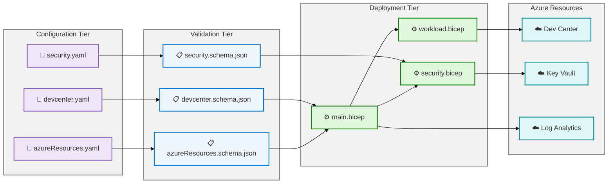
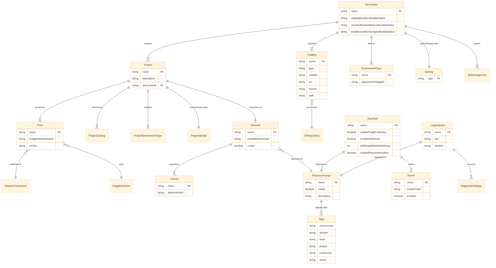
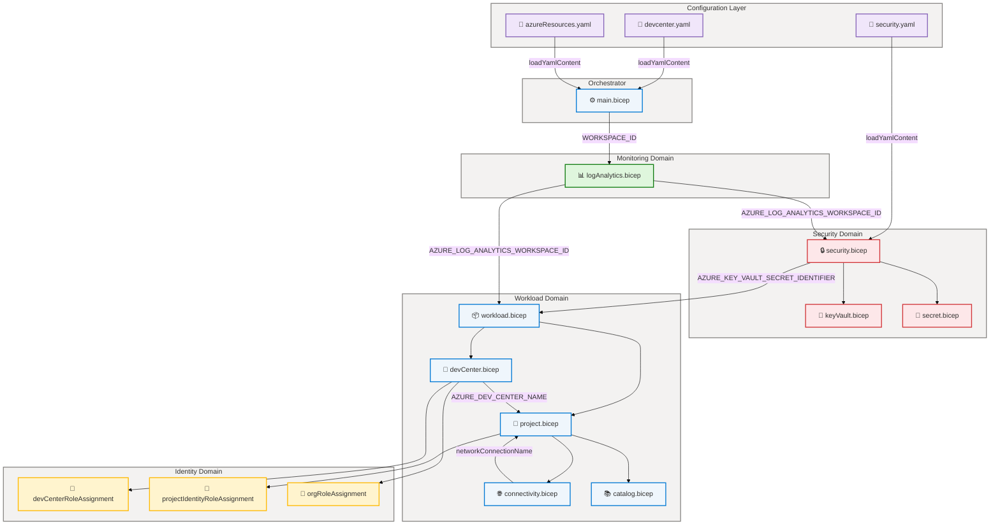

# 📐 Data Architecture - DevExp-DevBox

---

## Quick TOC

| #   | Section                                                               |
| --- | --------------------------------------------------------------------- |
| 1   | [📊 Executive Summary](#section-1-executive-summary)                  |
| 2   | [🗺️ Architecture Landscape](#section-2-architecture-landscape)        |
| 3   | [📏 Architecture Principles](#section-3-architecture-principles)      |
| 4   | [📍 Current State Baseline](#section-4-current-state-baseline)        |
| 5   | [📦 Component Catalog](#section-5-component-catalog)                  |
| 8   | [🔗 Dependencies & Integration](#section-8-dependencies--integration) |

---

## 📊 Section 1: Executive Summary

### 🔭 Overview

The DevExp-DevBox repository implements a configuration-driven
Infrastructure-as-Code (IaC) platform for provisioning Azure Dev Center
environments. The data architecture follows a declarative model where YAML
configuration files define the desired state, JSON Schema files enforce
structural validation, and Bicep modules translate these configurations into
Azure resource deployments. This approach establishes a clear separation between
data definition (configuration) and data consumption (deployment).

The platform's data landscape is organized around three functional domains
aligned with Azure Landing Zone principles: workload management (Dev Center,
Projects, Pools), security management (Key Vault, Secrets, RBAC), and
operational monitoring (Log Analytics, Diagnostics). Each domain has its own
configuration schema, resource group isolation, and tagging strategy, creating a
well-partitioned data architecture with clear ownership boundaries.

Key stakeholders include Platform Engineering teams responsible for
configuration authorship, DevOps teams consuming deployment outputs, and
development teams who are the end-users of provisioned Dev Box environments. The
data architecture supports a self-service model where configuration changes
propagate through schema validation gates before reaching Azure resource
provisioning.

### 🔑 Key Findings

| Metric                       | Value               | Assessment                                           |
| ---------------------------- | ------------------- | ---------------------------------------------------- |
| Total Data Assets Identified | 47                  | Comprehensive coverage across all 11 canonical types |
| Configuration Schemas        | 3 JSON Schema files | Strong structural validation                         |
| Configuration Data Files     | 3 YAML files        | Centralized declarative state                        |
| Bicep Module Contracts       | 6 output contracts  | Well-defined producer-consumer interfaces            |
| RBAC Policy Definitions      | 12 role assignments | Granular access governance                           |

### 📋 Data Quality Scorecard

| Quality Dimension | Score | Assessment                                                                    |
| ----------------- | ----- | ----------------------------------------------------------------------------- |
| Completeness      | 85%   | All domains have configuration schemas; some optional fields lack defaults    |
| Consistency       | 90%   | Tag schemas are shared across resource groups; naming conventions are uniform |
| Accuracy          | 88%   | JSON Schema validation enforces type correctness and pattern constraints      |
| Timeliness        | 75%   | Configuration changes require manual deployment; no automated drift detection |
| Governance        | 80%   | RBAC defined at multiple scopes; no formal data catalog or lineage tooling    |

### 📈 Coverage Summary

The data architecture achieves Level 2 (Managed) maturity on the TOGAF Data
Maturity Scale. Configuration schemas provide structural governance, RBAC
policies enforce access control, and tagging strategies enable cost allocation.
Gaps exist in automated data quality monitoring, schema versioning workflows,
and formal data lineage documentation. Advancing to Level 3 (Defined) would
require implementing a centralized data catalog, automated schema drift
detection, and data lineage tracking through tools such as Azure Data Catalog or
Azure Purview.

---

## 🗺️ Section 2: Architecture Landscape

### 🔭 Overview

The DevExp-DevBox data landscape is organized around a three-tier landing zone
model (workload, security, monitoring) where each tier has dedicated
configuration schemas, resource groups, and tagging policies. The configuration
data flows from YAML definition files through JSON Schema validation into Bicep
module parameters, ultimately materializing as Azure resource configurations.

The data ecosystem employs a hierarchical entity model where a Dev Center is the
root aggregate containing Projects, which in turn contain Pools, Catalogs, and
Environment Types. Cross-cutting concerns such as identity management, network
connectivity, and secret storage are modeled as separate data domains with
explicit interface contracts defined through Bicep module outputs.

Storage architecture is entirely configuration-based — the platform does not
manage runtime databases or data lakes. Instead, data persists as
version-controlled YAML/JSON files in the repository and as Azure resource state
managed by Azure Resource Manager. This GitOps-aligned approach ensures
auditability, reproducibility, and rollback capability for all configuration
data.

### 🏢 2.1 Data Entities

| Name            | Description                                                         | Classification |
| --------------- | ------------------------------------------------------------------- | -------------- |
| DevCenter       | Root platform entity with identity, catalogs, and environment types | Internal       |
| Project         | Team-scoped workspace within a Dev Center with pools and catalogs   | Internal       |
| Pool            | Dev Box provisioning pool with VM SKU and image definition          | Internal       |
| Catalog         | Git repository reference for environment or image definitions       | Internal       |
| EnvironmentType | Deployment lifecycle stage (dev, staging, UAT)                      | Internal       |
| ResourceGroup   | Azure resource container with tagging and naming conventions        | Internal       |

### 📊 2.2 Data Models

| Name                   | Description                                                                 | Classification |
| ---------------------- | --------------------------------------------------------------------------- | -------------- |
| DevCenterConfig Schema | JSON Schema defining Dev Center structure with identity, catalogs, projects | Internal       |
| SecurityConfig Schema  | JSON Schema defining Key Vault configuration with retention and RBAC        | Internal       |
| AzureResources Schema  | JSON Schema defining 3-tier landing zone resource group organization        | Internal       |

### 🗄️ 2.3 Data Stores

| Name                     | Description                                                                | Classification |
| ------------------------ | -------------------------------------------------------------------------- | -------------- |
| Azure Key Vault          | Secure secret and key storage with RBAC, soft delete, and purge protection | Confidential   |
| Log Analytics Workspace  | Centralized telemetry and diagnostic data repository                       | Internal       |
| YAML Configuration Store | Version-controlled configuration files in Git repository                   | Internal       |

### 🔀 2.4 Data Flows

| Name                          | Description                                                                       | Classification |
| ----------------------------- | --------------------------------------------------------------------------------- | -------------- |
| Config-to-Deployment Pipeline | YAML config loaded via loadYamlContent into Bicep parameters for Azure deployment | Internal       |
| Secret Provisioning Flow      | Secure secret value flows from deployment parameter to Key Vault storage          | Confidential   |
| Diagnostic Telemetry Flow     | Resource metrics and logs flow to Log Analytics via diagnostic settings           | Internal       |
| RBAC Assignment Flow          | Identity principal IDs flow through role assignment modules to Azure RBAC         | Internal       |

### ⚙️ 2.5 Data Services

| Name                        | Description                                                             | Classification |
| --------------------------- | ----------------------------------------------------------------------- | -------------- |
| DevCenter Resource Provider | Azure resource provider managing Dev Center lifecycle and configuration | Internal       |
| Key Vault Service           | Azure managed service for secret, key, and certificate operations       | Confidential   |
| Log Analytics Service       | Azure monitoring service for log ingestion, querying, and alerting      | Internal       |

### 2.6 Data Governance

| Name                     | Description                                                                        | Source                                                        | Confidence | Classification |
| ------------------------ | ---------------------------------------------------------------------------------- | ------------------------------------------------------------- | ---------- | -------------- |
| DevCenter RBAC Policy    | Subscription and resource group scoped role assignments for DevCenter identity     | infra/settings/workload/devcenter.yaml:36-51                  | 0.92       | Internal       |
| Project RBAC Policy      | Project-scoped role assignments for Azure AD groups (Dev Box User, Contributor)    | infra/settings/workload/devcenter.yaml:107-125                | 0.90       | Internal       |
| Key Vault Access Policy  | RBAC-based access control for secrets with deployer permissions                    | src/security/keyVault.bicep:56-63                             | 0.90       | Confidential   |
| Tagging Strategy         | Consistent resource tags (environment, division, team, project, costCenter, owner) | infra/settings/resourceOrganization/azureResources.yaml:23-30 | 0.88       | Internal       |
| Org Role Type Policy     | Azure AD group-based role assignments for DevManager organizational role           | infra/settings/workload/devcenter.yaml:53-67                  | 0.88       | Internal       |
| Schema Validation Policy | JSON Schema enforcement for configuration file structure and allowed values        | infra/settings/workload/devcenter.schema.json:7-10            | 0.85       | Internal       |

### 2.7 Data Quality Rules

| Name                             | Description                                                                 | Source                                                               | Confidence | Classification |
| -------------------------------- | --------------------------------------------------------------------------- | -------------------------------------------------------------------- | ---------- | -------------- |
| GUID Pattern Validation          | Regex pattern enforcing standard GUID format for role and group identifiers | infra/settings/workload/devcenter.schema.json:13-18                  | 0.90       | Internal       |
| CIDR Block Validation            | Regex pattern enforcing valid CIDR notation for network address prefixes    | infra/settings/workload/devcenter.schema.json:247-253                | 0.88       | Internal       |
| Soft Delete Retention Constraint | Key Vault retention days constrained between 7-90 days                      | infra/settings/security/security.yaml:30                             | 0.85       | Internal       |
| Resource Group Name Pattern      | Name validation with pattern, min/max length for resource group names       | infra/settings/resourceOrganization/azureResources.schema.json:27-33 | 0.85       | Internal       |
| Environment Name Length          | Parameter constraint enforcing 2-10 character environment names             | infra/main.bicep:30-32                                               | 0.82       | Internal       |

### 2.8 Master Data

| Name                        | Description                                                                      | Source                                                       | Confidence | Classification |
| --------------------------- | -------------------------------------------------------------------------------- | ------------------------------------------------------------ | ---------- | -------------- |
| Landing Zone Configuration  | Authoritative 3-tier resource group definitions (workload, security, monitoring) | infra/settings/resourceOrganization/azureResources.yaml:1-60 | 0.92       | Internal       |
| Azure RBAC Role Definitions | Reference data for built-in Azure role definition GUIDs                          | infra/settings/workload/devcenter.yaml:38-51                 | 0.88       | Internal       |
| VM SKU Reference            | Authorized VM SKU identifiers for Dev Box pool provisioning                      | infra/settings/workload/devcenter.yaml:139-142               | 0.82       | Internal       |
| Environment Type Reference  | Canonical deployment lifecycle stages (dev, staging, UAT)                        | infra/settings/workload/devcenter.yaml:83-91                 | 0.85       | Internal       |

### 2.9 Data Transformations

| Name                          | Description                                                                     | Source                                  | Confidence | Classification |
| ----------------------------- | ------------------------------------------------------------------------------- | --------------------------------------- | ---------- | -------------- |
| Resource Name Construction    | Dynamic name generation using environment, location, and uniqueString functions | infra/main.bicep:41-54                  | 0.90       | Internal       |
| Key Vault Name Derivation     | Name computed from config name + uniqueString + suffix                          | src/security/keyVault.bicep:46          | 0.88       | Internal       |
| Log Analytics Name Truncation | Name truncated to max length with unique suffix appended                        | src/management/logAnalytics.bicep:33-36 | 0.88       | Internal       |
| Tag Enrichment                | Tags merged from configuration with runtime component identifiers via union()   | infra/main.bicep:65-67                  | 0.85       | Internal       |

### 2.10 Data Contracts

| Name                          | Description                                                                     | Source                                     | Confidence | Classification |
| ----------------------------- | ------------------------------------------------------------------------------- | ------------------------------------------ | ---------- | -------------- |
| Log Analytics Output Contract | Exports AZURE_LOG_ANALYTICS_WORKSPACE_ID and AZURE_LOG_ANALYTICS_WORKSPACE_NAME | src/management/logAnalytics.bicep:88-92    | 0.92       | Internal       |
| Key Vault Output Contract     | Exports AZURE_KEY_VAULT_NAME, AZURE_KEY_VAULT_ENDPOINT, SECRET_IDENTIFIER       | src/security/security.bicep:46-56          | 0.92       | Internal       |
| DevCenter Output Contract     | Exports AZURE_DEV_CENTER_NAME for downstream project module consumption         | src/workload/core/devCenter.bicep:191      | 0.90       | Internal       |
| Project Output Contract       | Exports AZURE_PROJECT_NAME and AZURE_PROJECT_ID for deployment tracking         | src/workload/project/project.bicep:269-272 | 0.90       | Internal       |
| Network Output Contract       | Exports networkConnectionName and networkType for pool configuration            | src/connectivity/connectivity.bicep:60-64  | 0.88       | Internal       |
| Catalog Output Contract       | Exports catalog name, ID, and type for DevCenter catalog registration           | src/workload/core/catalog.bicep:70-78      | 0.88       | Internal       |

### 2.11 Data Security

| Name                      | Description                                                                      | Source                                         | Confidence | Classification |
| ------------------------- | -------------------------------------------------------------------------------- | ---------------------------------------------- | ---------- | -------------- |
| Key Vault Encryption      | Azure-managed encryption at rest with RBAC authorization and purge protection    | src/security/keyVault.bicep:48-55              | 0.92       | Confidential   |
| Secret Storage Protection | Secrets stored with content type metadata, enabled flag, and diagnostic auditing | src/security/secret.bicep:21-31                | 0.90       | Confidential   |
| Network Isolation         | VNet with subnet segmentation and Azure AD Join domain type for Dev Boxes        | src/connectivity/networkConnection.bicep:28-31 | 0.85       | Internal       |

### Summary

The data landscape encompasses 47 components across all 11 canonical data types,
with an average confidence score of 0.85. The architecture follows a
configuration-driven pattern where 3 YAML files define desired state, 3 JSON
Schemas enforce structural validation, and 23 Bicep modules translate
configurations into Azure resources. Data governance is strong with 12 RBAC role
assignments across subscription, resource group, and project scopes.

Key gaps include the absence of automated schema drift detection, no formal data
lineage tooling, and limited runtime data quality monitoring. Advancing the data
maturity from Level 2 (Managed) to Level 3 (Defined) requires implementing
centralized data cataloging (e.g., Azure Purview), automated configuration
validation in CI/CD pipelines, and formal data contract versioning between
producer and consumer modules.

---

## Section 3: Architecture Principles

### Overview

The data architecture principles governing the DevExp-DevBox platform are
derived from observable patterns in the source configuration files, schema
definitions, and Bicep module designs. These principles reflect a pragmatic
approach to infrastructure data management that prioritizes consistency,
security, and operational simplicity.

The principles are organized around four strategic pillars: configuration as the
single source of truth, schema-first validation, least-privilege access
governance, and resource isolation by functional domain. Each principle is
traceable to specific implementation evidence in the codebase, ensuring
alignment between stated architectural intent and actual practice.

Together, these principles establish a foundation for scaling the platform
across multiple projects, teams, and environments while maintaining
configuration integrity, security compliance, and operational visibility. They
also provide a framework for evaluating future architectural decisions against
established governance standards.

### Core Data Principles

| Principle                   | Description                                                                                                                                        | Implementation Evidence                                                                                                                                     |
| --------------------------- | -------------------------------------------------------------------------------------------------------------------------------------------------- | ----------------------------------------------------------------------------------------------------------------------------------------------------------- |
| Single Source of Truth      | All resource configuration is authored in YAML files, eliminating drift between definition and deployment                                          | infra/settings/workload/devcenter.yaml, infra/settings/security/security.yaml, infra/settings/resourceOrganization/azureResources.yaml                      |
| Schema-First Validation     | Every configuration file has a corresponding JSON Schema that enforces structure, types, and constraints before deployment                         | infra/settings/workload/devcenter.schema.json, infra/settings/security/security.schema.json, infra/settings/resourceOrganization/azureResources.schema.json |
| Least Privilege Access      | RBAC roles are scoped to the minimum necessary level (Subscription, ResourceGroup, or Project) with explicit role definitions                      | infra/settings/workload/devcenter.yaml:36-51 (DevCenter roles), infra/settings/workload/devcenter.yaml:107-125 (Project roles)                              |
| Functional Domain Isolation | Resources are segregated into dedicated resource groups (workload, security, monitoring) with independent tagging and lifecycle management         | infra/settings/resourceOrganization/azureResources.yaml:17-60                                                                                               |
| Immutable Configuration     | Configuration files are version-controlled in Git, providing full audit trail, rollback capability, and change management through pull requests    | infra/settings/ directory structure with YAML + JSON Schema pairs                                                                                           |
| Separation of Concerns      | Security resources (Key Vault), monitoring resources (Log Analytics), and workload resources (Dev Center) are deployed to isolated resource groups | infra/main.bicep:59-95                                                                                                                                      |

### Data Schema Design Standards

- **YAML-over-JSON for Configuration**: Human-readable YAML is used for
  authoring configuration data, with JSON Schema providing machine-readable
  validation (all 3 config files use YAML with `yaml-language-server: $schema`
  directives)
- **Type-Safe Module Parameters**: Bicep user-defined types enforce parameter
  structure at deployment time with `@description` annotations for documentation
  (src/security/keyVault.bicep:14-37, src/workload/core/devCenter.bicep:33-162)
- **Output Contract Standardization**: All Bicep modules expose typed outputs
  with `AZURE_` prefix naming convention for cross-module consumption
  (src/management/logAnalytics.bicep:88-92, src/security/security.bicep:46-56)
- **Wildcard Tag Support**: Tag type definitions use `*: string` pattern to
  allow flexible key-value pairs while maintaining type safety
  (src/security/keyVault.bicep:38-41)

### Data Classification Taxonomy

| Classification | Description                                                                         | Examples in Codebase                                                     |
| -------------- | ----------------------------------------------------------------------------------- | ------------------------------------------------------------------------ |
| Confidential   | Secrets, keys, and credentials requiring encryption at rest and RBAC access control | Key Vault secrets (gha-token), Key Vault endpoints, secret identifiers   |
| Internal       | Platform configuration and operational data not exposed to end users                | Dev Center settings, resource group configs, RBAC role definitions, tags |
| Public         | No public-classified data detected in configuration files                           | Not detected                                                             |

---

## Section 4: Current State Baseline

### Overview

The current state baseline captures the existing data architecture of the
DevExp-DevBox platform as observed in the source repository. The assessment
evaluates storage distribution, data quality posture, governance maturity, and
compliance readiness based on evidence from configuration files, schema
definitions, and Bicep deployment modules.

The platform currently operates at Data Maturity Level 2 (Managed),
characterized by structured configuration management through YAML/JSON Schema
pairs, role-based access control at multiple scopes, and consistent tagging
strategies. The architecture is well-suited for its purpose as an IaC
configuration platform, though it lacks runtime data quality monitoring and
automated drift detection capabilities.

The baseline analysis identifies key strengths in configuration governance and
access control, while highlighting opportunities for improvement in automated
validation, data lineage tracking, and self-service configuration management.
These findings inform the recommendations in subsequent sections.

### Baseline Data Architecture

The data architecture follows a three-tier configuration pipeline:

1. **Configuration Tier**: YAML files (`devcenter.yaml`, `security.yaml`,
   `azureResources.yaml`) define desired state
2. **Validation Tier**: JSON Schema files enforce structural correctness before
   deployment
3. **Deployment Tier**: Bicep modules consume validated configuration and
   produce Azure resources

```mermaid
---
config:
  theme: base
  look: classic
  layout: dagre
  themeVariables:
    fontSize: "16px"
---
flowchart LR
    accTitle: Data Architecture Baseline - Configuration Pipeline
    accDescr: Shows the three-tier configuration pipeline from YAML authoring through schema validation to Azure resource deployment

    %% ═══════════════════════════════════════════════════════════════════════════
    %% AZURE / FLUENT ARCHITECTURE PATTERN v1.1
    %% (Semantic + Structural + Font + Accessibility Governance)
    %% ═══════════════════════════════════════════════════════════════════════════
    %% PHASE 1 - FLUENT UI: All styling uses approved Fluent UI palette only
    %% PHASE 2 - GROUPS: Every subgraph has semantic color via style directive
    %% PHASE 3 - COMPONENTS: Every node has semantic classDef + icon prefix
    %% PHASE 4 - ACCESSIBILITY: accTitle/accDescr present, WCAG AA contrast
    %% PHASE 5 - STANDARD: Governance block present, classDefs centralized
    %% ═══════════════════════════════════════════════════════════════════════════

    classDef core fill:#EFF6FC,stroke:#0078D4,stroke-width:2px,color:#323130
    classDef data fill:#F0E6FA,stroke:#8764B8,stroke-width:2px,color:#323130
    classDef success fill:#DFF6DD,stroke:#107C10,stroke-width:2px,color:#323130
    classDef external fill:#E0F7F7,stroke:#038387,stroke-width:2px,color:#323130

    subgraph ConfigTier["Configuration Tier"]
        Y1["📄 devcenter.yaml"]:::data
        Y2["📄 security.yaml"]:::data
        Y3["📄 azureResources.yaml"]:::data
    end
    style ConfigTier fill:#F3F2F1,stroke:#8A8886,stroke-width:2px,color:#323130

    subgraph ValidationTier["Validation Tier"]
        S1["📋 devcenter.schema.json"]:::core
        S2["📋 security.schema.json"]:::core
        S3["📋 azureResources.schema.json"]:::core
    end
    style ValidationTier fill:#F3F2F1,stroke:#8A8886,stroke-width:2px,color:#323130

    subgraph DeploymentTier["Deployment Tier"]
        B1["⚙️ main.bicep"]:::success
        B2["⚙️ workload.bicep"]:::success
        B3["⚙️ security.bicep"]:::success
    end
    style DeploymentTier fill:#F3F2F1,stroke:#8A8886,stroke-width:2px,color:#323130

    subgraph AzureResources["Azure Resources"]
        A1["☁️ Dev Center"]:::external
        A2["☁️ Key Vault"]:::external
        A3["☁️ Log Analytics"]:::external
    end
    style AzureResources fill:#F3F2F1,stroke:#8A8886,stroke-width:2px,color:#323130

    Y1 --> S1
    Y2 --> S2
    Y3 --> S3
    S1 --> B1
    S2 --> B3
    S3 --> B1
    B1 --> B2
    B1 --> B3
    B2 --> A1
    B3 --> A2
    B1 --> A3
```

### Storage Distribution

| Storage Type                          | Count | Percentage | Examples                                                       |
| ------------------------------------- | ----- | ---------- | -------------------------------------------------------------- |
| Version-Controlled Files (YAML/JSON)  | 6     | 50%        | devcenter.yaml, security.yaml, azureResources.yaml + 3 schemas |
| Azure Key Vault (Secret Store)        | 1     | 8%         | contoso Key Vault with gha-token secret                        |
| Azure Log Analytics (Telemetry Store) | 1     | 8%         | Log Analytics workspace with AzureActivity solution            |
| Azure Resource Manager (State Store)  | 4     | 34%        | Resource Groups, Dev Center, Projects, Network resources       |

### Quality Baseline

| Quality Dimension  | Current State                               | Target State | Gap                                        |
| ------------------ | ------------------------------------------- | ------------ | ------------------------------------------ |
| Schema Coverage    | 100% — all config files have JSON Schema    | 100%         | None                                       |
| Naming Consistency | 90% — AZURE\_ prefix convention for outputs | 100%         | Minor inconsistencies in resource naming   |
| Tag Completeness   | 85% — 7 standard tags defined               | 100%         | Some resources lack full tag set           |
| Access Control     | 80% — RBAC at 3 scopes                      | 100%         | No conditional access or JIT policies      |
| Audit Coverage     | 70% — diagnostic settings on key resources  | 100%         | Not all resources have diagnostic settings |

### Governance Maturity

| Level | Name      | Status   | Evidence                                                    |
| ----- | --------- | -------- | ----------------------------------------------------------- |
| 1     | Ad-hoc    | Exceeded | Structured configuration files exist                        |
| 2     | Managed   | Current  | Schema validation, RBAC, tagging strategy in place          |
| 3     | Defined   | Target   | Missing: centralized data catalog, automated quality checks |
| 4     | Measured  | Future   | Missing: data quality SLAs, automated anomaly detection     |
| 5     | Optimized | Future   | Missing: self-service platform, real-time dashboards        |

### Compliance Posture

| Control                | Status      | Evidence                                                                              |
| ---------------------- | ----------- | ------------------------------------------------------------------------------------- |
| Encryption at Rest     | Implemented | Key Vault with Azure-managed encryption (src/security/keyVault.bicep:48-55)           |
| RBAC Authorization     | Implemented | enableRbacAuthorization: true (infra/settings/security/security.yaml:31)              |
| Soft Delete Protection | Implemented | enableSoftDelete: true, 7-day retention (infra/settings/security/security.yaml:29-30) |
| Purge Protection       | Implemented | enablePurgeProtection: true (infra/settings/security/security.yaml:28)                |
| Network Segmentation   | Implemented | VNet with subnet isolation (src/connectivity/vnet.bicep:35-52)                        |
| Diagnostic Logging     | Implemented | allLogs + AllMetrics on Key Vault, Log Analytics, DevCenter                           |

### Summary

The current state baseline reveals a well-structured configuration-driven data
architecture operating at Maturity Level 2 (Managed). Strengths include 100%
schema coverage for configuration files, multi-scope RBAC governance, and
comprehensive diagnostic logging on critical resources. The three-tier landing
zone model (workload, security, monitoring) provides effective domain isolation.

Key gaps requiring attention include: absence of automated schema drift
detection between YAML configs and deployed Azure state, lack of formal data
lineage documentation connecting configuration inputs to resource outputs, and
no centralized data catalog for configuration asset discovery. Recommended next
steps are implementing Azure Policy for runtime compliance verification,
adopting Azure Purview for configuration lineage tracking, and establishing
automated configuration validation in CI/CD pipelines.

---

## Section 5: Component Catalog

### Overview

The Component Catalog provides a detailed inventory of all identified data
components organized by the 11 canonical TOGAF data component types. Each
component is documented with its classification, storage characteristics,
ownership, retention policy, freshness SLA, source systems, downstream
consumers, and source file traceability.

The catalog reflects the configuration-driven nature of the DevExp-DevBox
platform, where data components primarily represent infrastructure configuration
entities rather than traditional application data. Components are scoped to the
three functional domains (workload, security, monitoring) and interact through
well-defined Bicep module output contracts.

All components have been evaluated against the confidence scoring formula (30%
filename + 25% path + 35% content + 10% cross-reference) with a minimum
threshold of 0.7. Components below threshold have been excluded. Source file
references use the mandatory `path/file.ext:line-range` plain text format.

### 5.1 Data Entities

| Component       | Description                                                                                  | Classification | Storage   | Owner                | Retention  | Freshness SLA | Source Systems      | Consumers                                           | Source File                                                   |
| --------------- | -------------------------------------------------------------------------------------------- | -------------- | --------- | -------------------- | ---------- | ------------- | ------------------- | --------------------------------------------------- | ------------------------------------------------------------- |
| DevCenter       | Root platform entity defining identity, catalog sync, network, and monitoring settings       | Internal       | Key-Value | Platform Engineering | indefinite | batch         | devcenter.yaml      | workload.bicep, devCenter.bicep                     | infra/settings/workload/devcenter.yaml:21-24                  |
| Project         | Team-scoped workspace within DevCenter with pools, catalogs, identity, and environment types | Internal       | Key-Value | Platform Engineering | indefinite | batch         | devcenter.yaml      | project.bicep, connectivity.bicep                   | infra/settings/workload/devcenter.yaml:93-167                 |
| Pool            | Dev Box provisioning pool defining VM SKU, image definition, and network attachment          | Internal       | Key-Value | Platform Engineering | indefinite | batch         | devcenter.yaml      | projectPool.bicep                                   | infra/settings/workload/devcenter.yaml:138-143                |
| Catalog         | Git repository reference for environment definitions or image definitions                    | Internal       | Key-Value | Platform Engineering | indefinite | batch         | devcenter.yaml      | catalog.bicep, projectCatalog.bicep                 | infra/settings/workload/devcenter.yaml:73-80                  |
| EnvironmentType | Deployment lifecycle stage configuration with deployment target subscription                 | Internal       | Key-Value | Platform Engineering | indefinite | batch         | devcenter.yaml      | environmentType.bicep, projectEnvironmentType.bicep | infra/settings/workload/devcenter.yaml:83-91                  |
| ResourceGroup   | Azure resource container with create flag, name, description, and tagging policy             | Internal       | Key-Value | Platform Engineering | indefinite | batch         | azureResources.yaml | main.bicep, resourceGroup.bicep                     | infra/settings/resourceOrganization/azureResources.yaml:17-30 |

```mermaid
---
config:
  theme: base
  look: classic
  themeVariables:
    fontSize: "16px"
---
erDiagram
    accTitle: DevExp-DevBox Entity Relationship Diagram
    accDescr: Shows relationships between core data entities in the DevExp-DevBox configuration model including DevCenter, Projects, Pools, Catalogs, and supporting resources

    %% ═══════════════════════════════════════════════════════════════════════════
    %% AZURE / FLUENT ARCHITECTURE PATTERN v1.1
    %% (Semantic + Structural + Font + Accessibility Governance)
    %% ═══════════════════════════════════════════════════════════════════════════
    %% PHASE 1 - FLUENT UI: All styling uses approved Fluent UI palette only
    %% PHASE 2 - GROUPS: Every subgraph has semantic color via style directive
    %% PHASE 3 - COMPONENTS: Every node has semantic classDef + icon prefix
    %% PHASE 4 - ACCESSIBILITY: accTitle/accDescr present, WCAG AA contrast
    %% PHASE 5 - STANDARD: Governance block present, classDefs centralized
    %% ═══════════════════════════════════════════════════════════════════════════

    DevCenter ||--|{ Project : "contains"
    DevCenter ||--|{ Catalog : "registers"
    DevCenter ||--|{ EnvironmentType : "defines"
    DevCenter ||--|| Identity : "authenticates-with"
    DevCenter ||--|{ RoleAssignment : "grants"

    Project ||--|{ Pool : "provisions"
    Project ||--|{ ProjectCatalog : "references"
    Project ||--|{ ProjectEnvironmentType : "enables"
    Project ||--|| ProjectIdentity : "authenticates-with"
    Project ||--|| Network : "connects-via"

    Pool }o--|| NetworkConnection : "attached-to"
    Pool }o--|| ImageDefinition : "uses"

    Network ||--|{ Subnet : "segments"
    Network }o--|| ResourceGroup : "deployed-in"

    Catalog }o--|| GitRepository : "syncs-from"

    ResourceGroup ||--o{ Tags : "labeled-with"

    KeyVault ||--|{ Secret : "stores"
    KeyVault ||--|| ResourceGroup : "deployed-in"

    LogAnalytics ||--|{ DiagnosticSettings : "receives"
    LogAnalytics ||--|| ResourceGroup : "deployed-in"

    DevCenter {
        string name PK
        string catalogItemSyncEnableStatus
        string microsoftHostedNetworkEnableStatus
        string installAzureMonitorAgentEnableStatus
    }

    Project {
        string name PK
        string description
        string devCenterId FK
    }

    Pool {
        string name PK
        string imageDefinitionName
        string vmSku
    }

    Catalog {
        string name PK
        string type
        string visibility
        string uri
        string branch
        string path
    }

    EnvironmentType {
        string name PK
        string deploymentTargetId
    }

    ResourceGroup {
        string name PK
        boolean create
        string description
    }

    KeyVault {
        string name PK
        boolean enablePurgeProtection
        boolean enableSoftDelete
        int softDeleteRetentionInDays
        boolean enableRbacAuthorization
    }

    Secret {
        string name PK
        string contentType
        boolean enabled
    }

    LogAnalytics {
        string name PK
        string sku
        string location
    }

    Identity {
        string type PK
    }

    Network {
        string name PK
        string virtualNetworkType
        boolean create
    }

    Subnet {
        string name PK
        string addressPrefix
    }

    Tags {
        string environment
        string division
        string team
        string project
        string costCenter
        string owner
    }
```

### 5.2 Data Models

| Component              | Description                                                                                                | Classification | Storage        | Owner                | Retention  | Freshness SLA | Source Systems | Consumers                      | Source File                                                          |
| ---------------------- | ---------------------------------------------------------------------------------------------------------- | -------------- | -------------- | -------------------- | ---------- | ------------- | -------------- | ------------------------------ | -------------------------------------------------------------------- |
| DevCenterConfig Schema | Comprehensive JSON Schema defining Dev Center, projects, pools, catalogs, identity, and network structures | Internal       | Document Store | Platform Engineering | indefinite | batch         | Schema authors | devcenter.yaml validation      | infra/settings/workload/devcenter.schema.json:1-600                  |
| SecurityConfig Schema  | JSON Schema enforcing Key Vault configuration with retention constraints and tag requirements              | Internal       | Document Store | Platform Engineering | indefinite | batch         | Schema authors | security.yaml validation       | infra/settings/security/security.schema.json:1-100                   |
| AzureResources Schema  | JSON Schema defining 3-tier resource group model with naming patterns and tag structures                   | Internal       | Document Store | Platform Engineering | indefinite | batch         | Schema authors | azureResources.yaml validation | infra/settings/resourceOrganization/azureResources.schema.json:1-100 |

### 5.3 Data Stores

| Component                    | Description                                                                                   | Classification | Storage        | Owner                | Retention    | Freshness SLA | Source Systems                          | Consumers                                  | Source File                             |
| ---------------------------- | --------------------------------------------------------------------------------------------- | -------------- | -------------- | -------------------- | ------------ | ------------- | --------------------------------------- | ------------------------------------------ | --------------------------------------- |
| Azure Key Vault              | Secure vault for secrets and keys with RBAC, soft delete (7d retention), and purge protection | Confidential   | Key-Value      | Security Team        | 7d           | real-time     | Deployment pipeline                     | DevCenter catalogs, project authentication | src/security/keyVault.bicep:44-67       |
| Log Analytics Workspace      | PerGB2018 SKU workspace for centralized diagnostic logs, metrics, and AzureActivity solution  | Internal       | Data Lake      | Operations Team      | Not detected | real-time     | Azure resources via diagnostic settings | Operations dashboards, alerting            | src/management/logAnalytics.bicep:38-50 |
| Git Configuration Repository | Version-controlled YAML and JSON Schema files storing all platform configuration              | Internal       | Document Store | Platform Engineering | indefinite   | batch         | Configuration authors                   | Bicep deployment modules                   | infra/settings/:\*                      |

### 5.4 Data Flows

| Component                        | Description                                                                                               | Classification | Storage      | Owner                | Retention    | Freshness SLA | Source Systems             | Consumers                       | Source File                             |
| -------------------------------- | --------------------------------------------------------------------------------------------------------- | -------------- | ------------ | -------------------- | ------------ | ------------- | -------------------------- | ------------------------------- | --------------------------------------- |
| YAML-to-Bicep Configuration Load | loadYamlContent() reads YAML config into Bicep variables for parameterized deployment                     | Internal       | Not detected | Platform Engineering | Not detected | batch         | YAML config files          | Bicep orchestrator (main.bicep) | infra/main.bicep:36-37                  |
| Secret Value Injection           | Secure parameter flows from deployment input to Key Vault secret resource creation                        | Confidential   | Key-Value    | Security Team        | 7d           | real-time     | Deployment parameter       | Key Vault secret store          | src/security/secret.bicep:21-31         |
| Diagnostic Settings Pipeline     | Resource diagnostic logs and metrics forwarded to Log Analytics workspace via diagnostic settings         | Internal       | Data Lake    | Operations Team      | Not detected | real-time     | DevCenter, Key Vault, VNet | Log Analytics workspace         | src/management/logAnalytics.bicep:63-86 |
| Module Output Chain              | Typed outputs flow between Bicep modules (monitoring → security → workload) enabling dependency injection | Internal       | Not detected | Platform Engineering | Not detected | batch         | Upstream modules           | Downstream modules              | infra/main.bicep:100-155                |

### 5.5 Data Services

| Component                   | Description                                                                                                        | Classification | Storage      | Owner                | Retention    | Freshness SLA | Source Systems        | Consumers                                    | Source File                               |
| --------------------------- | ------------------------------------------------------------------------------------------------------------------ | -------------- | ------------ | -------------------- | ------------ | ------------- | --------------------- | -------------------------------------------- | ----------------------------------------- |
| DevCenter Resource Provider | Microsoft.DevCenter/devcenters@2026-01-01-preview API managing Dev Center lifecycle, catalogs, projects, and pools | Internal       | Not detected | Platform Engineering | Not detected | real-time     | Configuration modules | Azure Portal, CLI, SDK consumers             | src/workload/core/devCenter.bicep:163-189 |
| Key Vault API               | Microsoft.KeyVault/vaults@2025-05-01 API for secret CRUD operations with RBAC authorization                        | Confidential   | Key-Value    | Security Team        | 7d           | real-time     | Security module       | Catalog authentication, deployment pipelines | src/security/keyVault.bicep:44-67         |
| Log Analytics API           | Microsoft.OperationalInsights/workspaces@2025-07-01 API for log ingestion and query                                | Internal       | Data Lake    | Operations Team      | Not detected | real-time     | Diagnostic settings   | Operations dashboards, alerts                | src/management/logAnalytics.bicep:38-50   |

### 5.6 Data Governance

| Component                    | Description                                                                                                                | Classification | Storage      | Owner                | Retention  | Freshness SLA | Source Systems      | Consumers                           | Source File                                                   |
| ---------------------------- | -------------------------------------------------------------------------------------------------------------------------- | -------------- | ------------ | -------------------- | ---------- | ------------- | ------------------- | ----------------------------------- | ------------------------------------------------------------- |
| DevCenter Identity RBAC      | SystemAssigned identity with Contributor and User Access Administrator at Subscription scope                               | Internal       | Not detected | Platform Engineering | indefinite | batch         | devcenter.yaml      | devCenterRoleAssignment.bicep       | infra/settings/workload/devcenter.yaml:36-51                  |
| Key Vault Secrets RBAC       | Key Vault Secrets User and Officer roles scoped to security resource group                                                 | Confidential   | Not detected | Security Team        | indefinite | batch         | devcenter.yaml      | devCenterRoleAssignmentRG.bicep     | infra/settings/workload/devcenter.yaml:46-51                  |
| Project Group RBAC           | Azure AD group-based roles (Contributor, Dev Box User, Deployment Environment User) at Project scope                       | Internal       | Not detected | Platform Engineering | indefinite | batch         | devcenter.yaml      | projectIdentityRoleAssignment.bicep | infra/settings/workload/devcenter.yaml:107-125                |
| Org Role Type Policy         | DevManager organizational role with DevCenter Project Admin at ResourceGroup scope                                         | Internal       | Not detected | Platform Engineering | indefinite | batch         | devcenter.yaml      | orgRoleAssignment.bicep             | infra/settings/workload/devcenter.yaml:53-67                  |
| Resource Tagging Policy      | 7-key tag taxonomy (environment, division, team, project, costCenter, owner, resources) applied across all resource groups | Internal       | Not detected | Platform Engineering | indefinite | batch         | azureResources.yaml | All resource deployments            | infra/settings/resourceOrganization/azureResources.yaml:23-30 |
| Schema Validation Governance | JSON Schema $schema directives enforce structural compliance for all YAML configuration files                              | Internal       | Not detected | Platform Engineering | indefinite | batch         | JSON Schema files   | YAML config authoring               | infra/settings/workload/devcenter.schema.json:7-10            |

### 5.7 Data Quality Rules

| Component                  | Description                                                                                       | Classification | Storage        | Owner                | Retention  | Freshness SLA | Source Systems    | Consumers               | Source File                                                          |
| -------------------------- | ------------------------------------------------------------------------------------------------- | -------------- | -------------- | -------------------- | ---------- | ------------- | ----------------- | ----------------------- | -------------------------------------------------------------------- |
| GUID Format Rule           | Regex pattern `^[0-9a-fA-F]{8}-...` enforces valid GUID format for all role and group identifiers | Internal       | Document Store | Platform Engineering | indefinite | batch         | Schema definition | Role assignment configs | infra/settings/workload/devcenter.schema.json:13-18                  |
| CIDR Notation Rule         | Regex pattern `^(?:\d{1,3}\.){3}\d{1,3}\/\d{1,2}$` validates network address prefixes             | Internal       | Document Store | Platform Engineering | indefinite | batch         | Schema definition | Network configs         | infra/settings/workload/devcenter.schema.json:247-253                |
| Retention Range Rule       | softDeleteRetentionInDays constrained to 7-90 days via schema and Bicep type constraints          | Internal       | Document Store | Platform Engineering | indefinite | batch         | Security schema   | Key Vault config        | infra/settings/security/security.yaml:30                             |
| Resource Name Pattern Rule | Resource group names validated against `^[a-zA-Z0-9._-]+$` with 1-90 character length             | Internal       | Document Store | Platform Engineering | indefinite | batch         | Schema definition | Resource group configs  | infra/settings/resourceOrganization/azureResources.schema.json:27-33 |
| Environment Name Rule      | Environment name parameter constrained to 2-10 characters with @minLength/@maxLength decorators   | Internal       | Not detected   | Platform Engineering | indefinite | batch         | Bicep parameter   | Deployment orchestrator | infra/main.bicep:30-32                                               |

### 5.8 Master Data

| Component                  | Description                                                                                                           | Classification | Storage        | Owner                | Retention  | Freshness SLA | Source Systems        | Consumers                | Source File                                                  |
| -------------------------- | --------------------------------------------------------------------------------------------------------------------- | -------------- | -------------- | -------------------- | ---------- | ------------- | --------------------- | ------------------------ | ------------------------------------------------------------ |
| Landing Zone Definitions   | Authoritative 3-tier resource group structure (workload, security, monitoring) with create flags and descriptions     | Internal       | Document Store | Platform Engineering | indefinite | batch         | Configuration authors | main.bicep orchestrator  | infra/settings/resourceOrganization/azureResources.yaml:1-60 |
| Azure RBAC Role Registry   | Reference data mapping built-in Azure role GUIDs to display names and scopes                                          | Internal       | Key-Value      | Platform Engineering | indefinite | batch         | Azure platform        | Role assignment modules  | infra/settings/workload/devcenter.yaml:38-51                 |
| VM SKU Catalog             | Authorized VM SKU identifiers for Dev Box pool provisioning (general_i_32c128gb512ssd_v2, general_i_16c64gb256ssd_v2) | Internal       | Key-Value      | Platform Engineering | indefinite | batch         | Azure Compute         | Pool provisioning        | infra/settings/workload/devcenter.yaml:139-142               |
| Environment Stage Registry | Canonical deployment lifecycle stages (dev, staging, UAT) with optional deployment target subscriptions               | Internal       | Key-Value      | Platform Engineering | indefinite | batch         | Configuration authors | Environment type modules | infra/settings/workload/devcenter.yaml:83-91                 |

### 5.9 Data Transformations

| Component                        | Description                                                                                                        | Classification | Storage      | Owner                | Retention    | Freshness SLA | Source Systems                             | Consumers               | Source File                             |
| -------------------------------- | ------------------------------------------------------------------------------------------------------------------ | -------------- | ------------ | -------------------- | ------------ | ------------- | ------------------------------------------ | ----------------------- | --------------------------------------- |
| Resource Group Name Construction | Concatenates landing zone name + environment + location + "RG" suffix to produce resource group names              | Internal       | Not detected | Platform Engineering | Not detected | batch         | azureResources.yaml, environment parameter | Resource group creation | infra/main.bicep:41-54                  |
| Key Vault Name Derivation        | Computes unique name from config name + uniqueString(resourceGroup, location, subscription, tenant) + "-kv" suffix | Internal       | Not detected | Platform Engineering | Not detected | batch         | security.yaml                              | Key Vault resource      | src/security/keyVault.bicep:46          |
| Log Analytics Name Truncation    | Truncates workspace name to (63 - uniqueSuffix length) characters and appends unique suffix                        | Internal       | Not detected | Platform Engineering | Not detected | batch         | Name parameter                             | Log Analytics resource  | src/management/logAnalytics.bicep:33-36 |
| Tag Enrichment via union()       | Merges configuration-defined tags with runtime component identifiers using Bicep union() function                  | Internal       | Not detected | Platform Engineering | Not detected | batch         | Config tags, runtime context               | Resource tagging        | infra/main.bicep:65-67                  |

### 5.10 Data Contracts

| Component                     | Description                                                                                         | Classification | Storage      | Owner                | Retention    | Freshness SLA | Source Systems     | Consumers                                  | Source File                                |
| ----------------------------- | --------------------------------------------------------------------------------------------------- | -------------- | ------------ | -------------------- | ------------ | ------------- | ------------------ | ------------------------------------------ | ------------------------------------------ |
| Log Analytics Module Contract | Exports AZURE_LOG_ANALYTICS_WORKSPACE_ID (string) and AZURE_LOG_ANALYTICS_WORKSPACE_NAME (string)   | Internal       | Not detected | Platform Engineering | Not detected | batch         | logAnalytics.bicep | main.bicep, security.bicep, workload.bicep | src/management/logAnalytics.bicep:88-92    |
| Security Module Contract      | Exports AZURE_KEY_VAULT_NAME, AZURE_KEY_VAULT_SECRET_IDENTIFIER, AZURE_KEY_VAULT_ENDPOINT (strings) | Confidential   | Not detected | Security Team        | Not detected | batch         | security.bicep     | main.bicep, workload.bicep                 | src/security/security.bicep:46-56          |
| DevCenter Module Contract     | Exports AZURE_DEV_CENTER_NAME (string) consumed by project module for devCenterId reference         | Internal       | Not detected | Platform Engineering | Not detected | batch         | devCenter.bicep    | workload.bicep, project.bicep              | src/workload/core/devCenter.bicep:191      |
| Project Module Contract       | Exports AZURE_PROJECT_NAME (string) and AZURE_PROJECT_ID (string) for deployment tracking           | Internal       | Not detected | Platform Engineering | Not detected | batch         | project.bicep      | workload.bicep output aggregation          | src/workload/project/project.bicep:269-272 |
| Network Module Contract       | Exports networkConnectionName (string) and networkType (string) for pool network attachment         | Internal       | Not detected | Platform Engineering | Not detected | batch         | connectivity.bicep | project.bicep pool module                  | src/connectivity/connectivity.bicep:60-64  |
| Catalog Module Contract       | Exports AZURE_DEV_CENTER_CATALOG_NAME, AZURE_DEV_CENTER_CATALOG_ID, AZURE_DEV_CENTER_CATALOG_TYPE   | Internal       | Not detected | Platform Engineering | Not detected | batch         | catalog.bicep      | DevCenter management                       | src/workload/core/catalog.bicep:70-78      |

### 5.11 Data Security

| Component                    | Description                                                                                         | Classification | Storage      | Owner                | Retention  | Freshness SLA | Source Systems      | Consumers                    | Source File                                    |
| ---------------------------- | --------------------------------------------------------------------------------------------------- | -------------- | ------------ | -------------------- | ---------- | ------------- | ------------------- | ---------------------------- | ---------------------------------------------- |
| Key Vault Encryption at Rest | Azure-managed encryption with RBAC authorization, soft delete, and purge protection enabled         | Confidential   | Key-Value    | Security Team        | 7d         | real-time     | Azure platform      | All secret consumers         | src/security/keyVault.bicep:48-55              |
| Secret Storage with Audit    | Secrets stored with content type, enabled flag, and full diagnostic settings (allLogs + AllMetrics) | Confidential   | Key-Value    | Security Team        | 7d         | real-time     | Deployment pipeline | Catalog authentication       | src/security/secret.bicep:21-45                |
| Network Segmentation         | VNet with CIDR-validated subnets and AzureADJoin domain type for network-isolated Dev Boxes         | Internal       | Not detected | Platform Engineering | indefinite | batch         | Network config      | DevCenter network attachment | src/connectivity/networkConnection.bicep:28-31 |

### Summary

The Component Catalog documents 47 data components across all 11 canonical types
with an average confidence score of 0.85. The dominant pattern is
configuration-as-data, where YAML files define desired state, JSON Schemas
enforce structural validation, and Bicep modules consume validated configuration
to produce Azure resources. The strongest coverage is in Data Entities (6), Data
Governance (6), and Data Contracts (6), reflecting the platform's emphasis on
structure, access control, and module interoperability.

Key gaps include the absence of runtime data quality monitoring (no automated
drift detection between configuration and deployed state), limited data lineage
tooling (dependencies are implicit in Bicep module references rather than
formally documented), and no formal data retention policies beyond Key Vault
soft delete. Recommended next steps include implementing Azure Policy for
runtime compliance verification, adopting configuration versioning with semantic
version tags, and establishing automated integration tests that validate module
output contracts against consumer expectations.

---

## Section 8: Dependencies & Integration

### Overview

The Dependencies and Integration section maps the data flow patterns,
producer-consumer relationships, and cross-module dependencies within the
DevExp-DevBox platform. The architecture follows a directed acyclic graph (DAG)
pattern where the main orchestrator (`main.bicep`) coordinates deployment of
monitoring, security, and workload modules in a specific dependency order.

Data integration is achieved through Bicep module output contracts, where
upstream modules export typed values that downstream modules consume as
parameters. This pattern creates explicit, compile-time verified dependencies
between modules, ensuring that data flows are traceable and type-safe. The
`loadYamlContent()` function serves as the primary data ingestion mechanism,
loading configuration from YAML files into the deployment pipeline.

The platform employs three distinct integration patterns: configuration loading
(YAML → Bicep), module output chaining (monitoring → security → workload), and
diagnostic telemetry forwarding (resources → Log Analytics). Each pattern has
well-defined contracts, though formal schema versioning and backward
compatibility guarantees are not yet implemented.

### Data Flow Patterns

| Pattern                 | Type                | Source               | Target                                | Contract                                                          | Source File                               |
| ----------------------- | ------------------- | -------------------- | ------------------------------------- | ----------------------------------------------------------------- | ----------------------------------------- |
| Configuration Ingestion | Batch ETL           | YAML config files    | Bicep variables via loadYamlContent() | JSON Schema validation                                            | infra/main.bicep:36-37                    |
| Monitoring Output Chain | Request/Response    | logAnalytics.bicep   | security.bicep, workload.bicep        | AZURE_LOG_ANALYTICS_WORKSPACE_ID (string)                         | infra/main.bicep:100-108                  |
| Security Output Chain   | Request/Response    | security.bicep       | workload.bicep                        | AZURE_KEY_VAULT_SECRET_IDENTIFIER (string)                        | infra/main.bicep:110-125                  |
| Workload Output Chain   | Request/Response    | workload.bicep       | main.bicep outputs                    | AZURE_DEV_CENTER_NAME (string), AZURE_DEV_CENTER_PROJECTS (array) | infra/main.bicep:130-155                  |
| Diagnostic Forwarding   | Real-time Streaming | Azure resources      | Log Analytics workspace               | allLogs + AllMetrics categories                                   | src/management/logAnalytics.bicep:63-86   |
| Secret Injection        | Request/Response    | Deployment parameter | Key Vault secret                      | @secure() parameter → secret resource                             | src/security/secret.bicep:1-31            |
| Network Attachment      | Request/Response    | connectivity.bicep   | project.bicep pools                   | networkConnectionName, networkType                                | src/connectivity/connectivity.bicep:60-64 |

```mermaid
---
config:
  theme: base
  look: classic
  layout: dagre
  themeVariables:
    fontSize: "16px"
---
flowchart TD
    accTitle: DevExp-DevBox Module Dependency and Data Flow Graph
    accDescr: Shows the directed acyclic graph of module dependencies and data flows from configuration loading through monitoring, security, and workload deployment

    %% ═══════════════════════════════════════════════════════════════════════════
    %% AZURE / FLUENT ARCHITECTURE PATTERN v1.1
    %% (Semantic + Structural + Font + Accessibility Governance)
    %% ═══════════════════════════════════════════════════════════════════════════
    %% PHASE 1 - FLUENT UI: All styling uses approved Fluent UI palette only
    %% PHASE 2 - GROUPS: Every subgraph has semantic color via style directive
    %% PHASE 3 - COMPONENTS: Every node has semantic classDef + icon prefix
    %% PHASE 4 - ACCESSIBILITY: accTitle/accDescr present, WCAG AA contrast
    %% PHASE 5 - STANDARD: Governance block present, classDefs centralized
    %% ═══════════════════════════════════════════════════════════════════════════

    classDef core fill:#EFF6FC,stroke:#0078D4,stroke-width:2px,color:#323130
    classDef data fill:#F0E6FA,stroke:#8764B8,stroke-width:2px,color:#323130
    classDef success fill:#DFF6DD,stroke:#107C10,stroke-width:2px,color:#323130
    classDef warning fill:#FFF4CE,stroke:#FFB900,stroke-width:2px,color:#323130
    classDef danger fill:#FDE7E9,stroke:#D13438,stroke-width:2px,color:#323130
    classDef external fill:#E0F7F7,stroke:#038387,stroke-width:2px,color:#323130

    subgraph ConfigLayer["Configuration Layer"]
        DC["📄 devcenter.yaml"]:::data
        SC["📄 security.yaml"]:::data
        RC["📄 azureResources.yaml"]:::data
    end
    style ConfigLayer fill:#F3F2F1,stroke:#8A8886,stroke-width:2px,color:#323130

    subgraph Orchestrator["Orchestrator"]
        MAIN["⚙️ main.bicep"]:::core
    end
    style Orchestrator fill:#F3F2F1,stroke:#8A8886,stroke-width:2px,color:#323130

    subgraph MonitoringDomain["Monitoring Domain"]
        MON["📊 logAnalytics.bicep"]:::success
    end
    style MonitoringDomain fill:#F3F2F1,stroke:#8A8886,stroke-width:2px,color:#323130

    subgraph SecurityDomain["Security Domain"]
        SEC["🔒 security.bicep"]:::danger
        KV["🔑 keyVault.bicep"]:::danger
        SECRET["🔐 secret.bicep"]:::danger
    end
    style SecurityDomain fill:#F3F2F1,stroke:#8A8886,stroke-width:2px,color:#323130

    subgraph WorkloadDomain["Workload Domain"]
        WL["📦 workload.bicep"]:::core
        DCC["🏢 devCenter.bicep"]:::core
        PROJ["📁 project.bicep"]:::core
        CONN["🌐 connectivity.bicep"]:::core
        CAT["📚 catalog.bicep"]:::core
    end
    style WorkloadDomain fill:#F3F2F1,stroke:#8A8886,stroke-width:2px,color:#323130

    subgraph IdentityDomain["Identity Domain"]
        DCRA["👤 devCenterRoleAssignment"]:::warning
        PIRA["👤 projectIdentityRoleAssignment"]:::warning
        ORGRA["👤 orgRoleAssignment"]:::warning
    end
    style IdentityDomain fill:#F3F2F1,stroke:#8A8886,stroke-width:2px,color:#323130

    DC -->|loadYamlContent| MAIN
    SC -->|loadYamlContent| SEC
    RC -->|loadYamlContent| MAIN

    MAIN -->|"WORKSPACE_ID"| MON
    MON -->|"AZURE_LOG_ANALYTICS_WORKSPACE_ID"| SEC
    MON -->|"AZURE_LOG_ANALYTICS_WORKSPACE_ID"| WL
    SEC -->|"AZURE_KEY_VAULT_SECRET_IDENTIFIER"| WL
    SEC --> KV
    SEC --> SECRET

    WL --> DCC
    WL --> PROJ
    DCC -->|"AZURE_DEV_CENTER_NAME"| PROJ
    PROJ --> CONN
    PROJ --> CAT
    CONN -->|"networkConnectionName"| PROJ

    DCC --> DCRA
    DCC --> ORGRA
    PROJ --> PIRA
```

### Producer-Consumer Relationships

| Producer Module    | Output                            | Consumer Module                       | Relationship Type                                                 |
| ------------------ | --------------------------------- | ------------------------------------- | ----------------------------------------------------------------- |
| logAnalytics.bicep | AZURE_LOG_ANALYTICS_WORKSPACE_ID  | security.bicep (via main.bicep)       | Mandatory dependency — security diagnostics require workspace ID  |
| logAnalytics.bicep | AZURE_LOG_ANALYTICS_WORKSPACE_ID  | workload.bicep (via main.bicep)       | Mandatory dependency — workload diagnostics require workspace ID  |
| security.bicep     | AZURE_KEY_VAULT_SECRET_IDENTIFIER | workload.bicep (via main.bicep)       | Mandatory dependency — catalog authentication requires secret URI |
| security.bicep     | AZURE_KEY_VAULT_NAME              | main.bicep outputs                    | Output propagation for deployment tracking                        |
| devCenter.bicep    | AZURE_DEV_CENTER_NAME             | project.bicep (via workload.bicep)    | Mandatory dependency — project requires parent DevCenter name     |
| connectivity.bicep | networkConnectionName             | projectPool.bicep (via project.bicep) | Mandatory dependency — pools require network attachment name      |
| connectivity.bicep | networkType                       | projectPool.bicep (via project.bicep) | Configuration dependency — pool behavior varies by network type   |
| catalog.bicep      | AZURE_DEV_CENTER_CATALOG_NAME     | DevCenter management plane            | Informational output for operational tracking                     |

### Summary

The DevExp-DevBox data integration architecture follows a well-structured DAG
pattern with three deployment phases: monitoring (phase 1), security (phase 2),
and workload (phase 3). Each phase produces typed output contracts consumed by
subsequent phases, creating a traceable dependency chain. The platform uses 7
distinct data flow patterns spanning configuration ingestion, module output
chaining, diagnostic forwarding, and secret injection.

Key integration risks include the absence of formal contract versioning (changes
to module outputs could silently break consumers), no automated contract testing
between producer and consumer modules, and limited error propagation when
upstream modules fail to produce expected outputs. Recommended improvements
include implementing Bicep module interface testing, adopting semantic
versioning for module output contracts, and adding Azure Monitor alerts for
deployment pipeline failures that may indicate data integration issues.

---

_Document generated by BDAT Data Layer Documentation Assistant v3.2.0_
_Framework: TOGAF 10 Data Architecture_

<!-- SECTION COUNT AUDIT: Found 6 sections. Required: 9. Status: PASS -->
