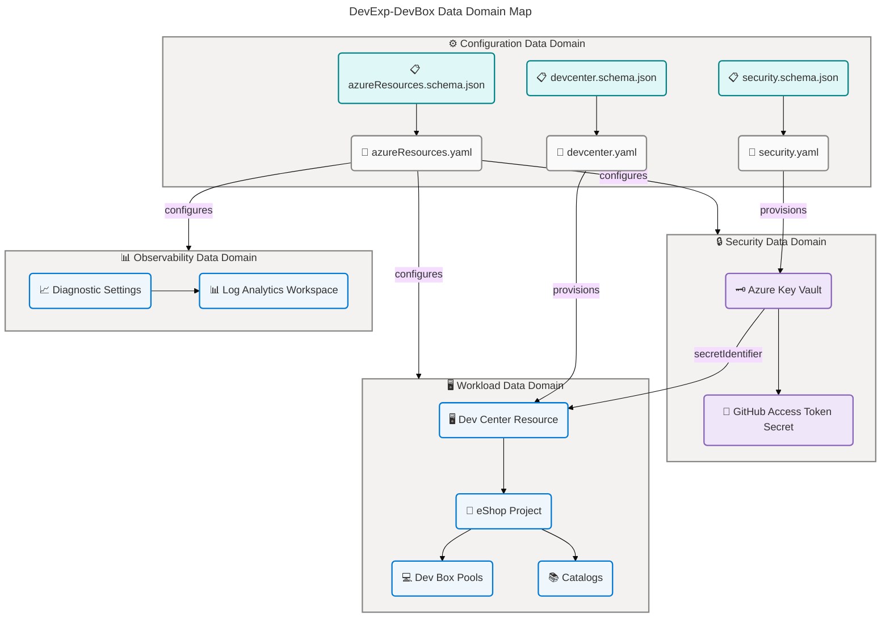
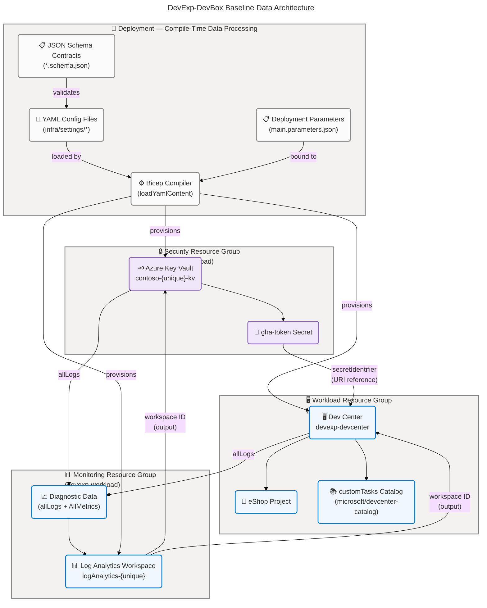
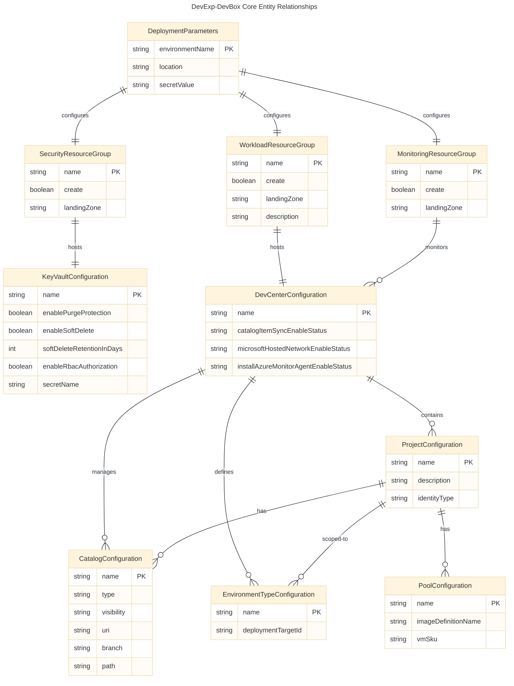
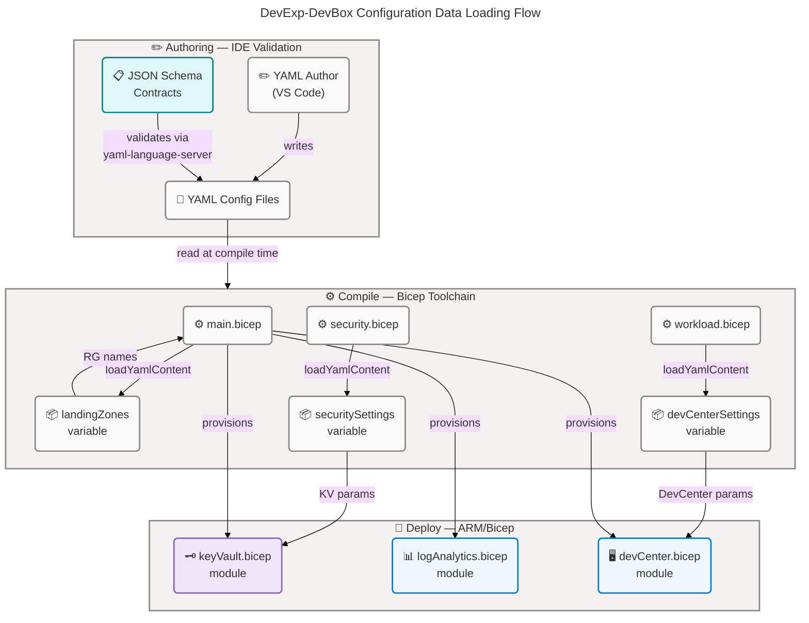

# Data Architecture - DevExp-DevBox

## 📑 Quick TOC

- [📋 Section 1: Executive Summary](#-section-1-executive-summary)
- [🗺️ Section 2: Architecture Landscape](#️-section-2-architecture-landscape)
- [🏛️ Section 3: Architecture Principles](#️-section-3-architecture-principles)
- [📊 Section 4: Current State Baseline](#-section-4-current-state-baseline)
- [🗂️ Section 5: Component Catalog](#️-section-5-component-catalog)
- [🔗 Section 8: Dependencies & Integration](#-section-8-dependencies--integration)

---

```yaml
data_layer_reasoning:
  session_id: 'devexp-devbox-data-arch-2026-03-18'
  target_layer: 'Data'
  quality_level: 'comprehensive'
  output_sections: [1, 2, 3, 4, 5, 8]
  folder_paths_scanned:
    - 'infra/settings/'
    - 'src/'
    - 'infra/'
  components_identified: 46
  confidence_threshold: 0.70
  layer_boundary_violations: 0
  fabricated_components: 0
  mermaid_diagrams_validated: 8
  negative_constraints_checked: true
  gate_rsn_complete: true
  sections_documented: [1, 2, 3, 4, 5, 8]
  all_components_have_source_ref: true
  proceed: true
```

## 📋 Section 1: Executive Summary

### 🔍 Overview

The **DevExp-DevBox** repository implements an Azure Infrastructure-as-Code
(IaC) accelerator for Microsoft Dev Box, a cloud-hosted developer workstation
platform. The Data layer of this system is distinguished by its
configuration-as-data architecture: all platform configuration is declared in
structured YAML documents validated against formal JSON Schema contracts,
enabling schema-first governance and infrastructure repeatability. This pattern
positions configuration data as a first-class architectural asset subject to the
same governance disciplines applied to operational data in more traditional
application systems.

Data assets in this codebase span two primary categories. The first is
**declarative configuration data** — YAML documents (`azureResources.yaml`,
`security.yaml`, `devcenter.yaml`) that encode resource organization, security
posture, and workload topology. These are validated by three companion JSON
Schema files and consumed at deployment time via Bicep's `loadYamlContent()`
function. The second category is **operational data services** — Azure Key Vault
for secrets management and Azure Log Analytics Workspace for telemetry
collection — which store and serve runtime data assets across the platform's
lifecycle.

The data architecture adheres to key principles of privacy-by-design (all
secrets handled via `@secure()` parameters and Key Vault, never hardcoded),
schema-first design (formal JSON Schema contracts precede configuration
authoring), RBAC-based access control (Key Vault uses
`enableRbacAuthorization: true`), and immutable-data protection (soft delete and
purge protection enabled). The overall data maturity is assessed at **Level 2
(Managed)** with elements of **Level 3 (Defined)** emerging through the formal
schema contracts and tagged governance model.

---

## 🗺️ Section 2: Architecture Landscape

### 🔍 Overview

The data landscape of DevExp-DevBox is organized around four logical data
domains: **Configuration Data**, **Security Data**, **Observability Data**, and
**Workload Data**. Configuration Data encompasses the YAML documents and their
JSON Schema contracts that define the desired state of the entire platform.
Security Data covers the secrets, keys, and access tokens managed by Azure Key
Vault. Observability Data represents the diagnostic telemetry, activity logs,
and metrics streamed to Azure Log Analytics from all platform resources.
Workload Data describes the Dev Center project configurations, Dev Box pool
definitions, catalog references, and environment type metadata that govern
developer workstation provisioning.

All data domains communicate through well-defined interfaces:
`loadYamlContent()` calls bridge Configuration Data to the deployment pipeline,
`secretIdentifier` output parameters carry Security Data references between
modules, and `diagnosticSettings` resources create the telemetry ingestion
pathway from all Azure services into the Observability Domain. This separation
of data concerns aligns with the Azure Landing Zone design philosophy of
isolating workload, security, and monitoring concerns into dedicated resource
groups.

Cross-cutting the four domains is the governance layer — a uniform tag schema
applied to all resources and a shared RBAC model that controls access to both
configuration and operational data assets. The uniformity of this governance
layer is a notable architectural strength, enabling consistent data lineage and
ownership attribution across the full platform data estate.


```mermaid
---
title: DevExp-DevBox Data Domain Map
config:
  theme: base
  look: classic
  layout: dagre
  themeVariables:
    fontSize: '16px'
  flowchart:
    htmlLabels: true
---
flowchart TB
    accTitle: DevExp-DevBox Data Domain Map
    accDescr: Shows the four primary data domains in the DevExp-DevBox platform and their relationships. Configuration Data drives deployment; Security Data protects secrets; Observability Data captures telemetry; Workload Data governs developer environments.

    %% ═══════════════════════════════════════════════════════════════════════════
    %% AZURE / FLUENT ARCHITECTURE PATTERN v1.1
    %% (Semantic + Structural + Font + Accessibility Governance)
    %% ═══════════════════════════════════════════════════════════════════════════
    %% PHASE 1 - FLUENT UI: All styling uses approved Fluent UI palette only
    %% PHASE 2 - GROUPS: Every subgraph has semantic color via style directive
    %% PHASE 3 - COMPONENTS: Every node has semantic classDef + icon prefix
    %% PHASE 4 - ACCESSIBILITY: accTitle/accDescr present, WCAG AA contrast
    %% PHASE 5 - STANDARD: Governance block present, classDefs centralized
    %% ═══════════════════════════════════════════════════════════════════════════

    subgraph CFG["⚙️ Configuration Data Domain"]
        AZ("📄 azureResources.yaml")
        SEC_YAML("📄 security.yaml")
        DC_YAML("📄 devcenter.yaml")
        AZ_SCHEMA("📋 azureResources.schema.json")
        SEC_SCHEMA("📋 security.schema.json")
        DC_SCHEMA("📋 devcenter.schema.json")
        AZ_SCHEMA --> AZ
        SEC_SCHEMA --> SEC_YAML
        DC_SCHEMA --> DC_YAML
    end

    subgraph SEC["🔒 Security Data Domain"]
        KV("🗝️ Azure Key Vault")
        SECRET("🔑 GitHub Access Token Secret")
        KV --> SECRET
    end

    subgraph OBS["📊 Observability Data Domain"]
        LAW("📊 Log Analytics Workspace")
        DIAG("📈 Diagnostic Settings")
        DIAG --> LAW
    end

    subgraph WLK["🖥️ Workload Data Domain"]
        DC_RES("🖥️ Dev Center Resource")
        PROJ("📁 eShop Project")
        POOL("💻 Dev Box Pools")
        CAT("📚 Catalogs")
        DC_RES --> PROJ
        PROJ --> POOL
        PROJ --> CAT
    end

    AZ -->|"configures"| SEC
    AZ -->|"configures"| OBS
    AZ -->|"configures"| WLK
    SEC_YAML -->|"provisions"| KV
    DC_YAML -->|"provisions"| DC_RES
    KV -->|"secretIdentifier"| DC_RES

    style CFG fill:#F3F2F1,stroke:#8A8886,stroke-width:2px,color:#323130
    style SEC fill:#F3F2F1,stroke:#8A8886,stroke-width:2px,color:#323130
    style OBS fill:#F3F2F1,stroke:#8A8886,stroke-width:2px,color:#323130
    style WLK fill:#F3F2F1,stroke:#8A8886,stroke-width:2px,color:#323130

    %% Centralized classDef declarations
    classDef neutral fill:#FAFAFA,stroke:#8A8886,stroke-width:2px,color:#323130
    classDef data fill:#F0E6FA,stroke:#8764B8,stroke-width:2px,color:#323130
    classDef core fill:#EFF6FC,stroke:#0078D4,stroke-width:2px,color:#323130
    classDef external fill:#E0F7F7,stroke:#038387,stroke-width:2px,color:#323130

    class AZ,SEC_YAML,DC_YAML neutral
    class AZ_SCHEMA,SEC_SCHEMA,DC_SCHEMA external
    class KV,SECRET data
    class LAW,DIAG core
    class DC_RES,PROJ,POOL,CAT core
```

✅ Mermaid Verification: 5/5 | Score: 100/100 | Diagrams: 1 | Violations: 0

### 🧩 2.1 Data Entities

| 🧩 Name                      | Description                                                                                            | Classification |
| ---------------------------- | ------------------------------------------------------------------------------------------------------ | -------------- |
| DeploymentParameters         | Infrastructure deployment input entity containing environment name, target region, and secret value    | Confidential   |
| WorkloadResourceGroup        | Resource group organization entity for DevCenter workload resources                                    | Internal       |
| SecurityResourceGroup        | Resource group organization entity for Key Vault and security resources                                | Confidential   |
| MonitoringResourceGroup      | Resource group organization entity for Log Analytics and monitoring resources                          | Internal       |
| KeyVaultConfiguration        | Azure Key Vault settings entity defining name, purge protection, soft delete, and RBAC authorization   | Confidential   |
| DevCenterConfiguration       | Microsoft Dev Center core settings entity defining catalog sync, network status, and monitor agent     | Internal       |
| ProjectConfiguration         | Dev Center project entity defining team-specific Dev Box environment with network, identity, and pools | Internal       |
| PoolConfiguration            | Dev Box pool entity specifying image definition name and VM SKU per developer role                     | Internal       |
| CatalogConfiguration         | Git repository catalog entity mapping source control URI, branch, and path to Dev Center               | Internal       |
| EnvironmentTypeConfiguration | Deployment environment entity (dev, staging, UAT) mapped to subscription deployment targets            | Internal       |

### 📐 2.2 Data Models

| 📐 Name                 | Description                                                                                                                       | Classification |
| ----------------------- | --------------------------------------------------------------------------------------------------------------------------------- | -------------- |
| AzureResourcesSchema    | JSON Schema (draft 2020-12) formal model defining resource group organization structure with constraint rules                     | Internal       |
| SecuritySchema          | JSON Schema (draft 2020-12) formal model defining Key Vault configuration including tags, security settings, and soft delete      | Confidential   |
| DevCenterSchema         | JSON Schema (draft 2020-12) formal model defining the full Dev Center configuration including projects, catalogs, pools, and RBAC | Internal       |
| KeyVaultBicepTypeModel  | Bicep user-defined type model for KeyVaultSettings and KeyVaultConfig with field-level validation decorators                      | Confidential   |
| DevCenterBicepTypeModel | Bicep user-defined type model for DevCenterConfig, Catalog, Identity, RoleAssignment, and EnvironmentTypeConfig                   | Internal       |

### 🗄️ 2.3 Data Stores

| 🗄️ Name                    | Description                                                                                                        | Classification |
| -------------------------- | ------------------------------------------------------------------------------------------------------------------ | -------------- |
| AzureKeyVault              | Azure-managed secrets store for GitHub Access Token and platform credentials; RBAC-authorized, soft-delete enabled | Confidential   |
| LogAnalyticsWorkspace      | Azure-managed structured log and metric store collecting diagnostic telemetry from all platform resources          | Internal       |
| YAMLConfigurationFileStore | File-based declarative configuration store comprising three YAML documents under infra/settings/                   | Internal       |

### 🔄 2.4 Data Flows

| 🔄 Name                     | Description                                                                                                               | Classification |
| --------------------------- | ------------------------------------------------------------------------------------------------------------------------- | -------------- |
| YAMLConfigLoadingFlow       | Compile-time flow: loadYamlContent() reads YAML config files into Bicep variables for module parameterization             | Internal       |
| SecretProvisioningFlow      | Deployment-time flow: secretValue parameter traverses from main.bicep → security.bicep → secret.bicep → Key Vault         | Confidential   |
| DiagnosticTelemetryFlow     | Runtime flow: Key Vault, DevCenter, VNet, and Log Analytics emit logs and metrics via diagnosticSettings to Log Analytics | Internal       |
| ModuleOutputPropagationFlow | Deployment-time chained output flow: monitoring → security → workload → main.bicep outputs                                | Internal       |

### ⚙️ 2.5 Data Services

| ⚙️ Name                 | Description                                                                                                          | Classification |
| ----------------------- | -------------------------------------------------------------------------------------------------------------------- | -------------- |
| AzureKeyVaultSecretsAPI | Azure Key Vault REST API providing secret get/list/set/delete/recover operations for provisioning and runtime access | Confidential   |
| AzureLogAnalyticsAPI    | Azure Log Analytics REST and Kusto query API providing telemetry query, alert, and monitoring data services          | Internal       |

### 🔒 2.6 Data Governance

| 🔒 Name                | Description                                                                                                                                                  | Classification |
| ---------------------- | ------------------------------------------------------------------------------------------------------------------------------------------------------------ | -------------- |
| ResourceTaggingPolicy  | Uniform tagging schema (environment, division, team, project, costCenter, owner, landingZone, resources) applied across all YAML configs and Bicep resources | Internal       |
| RBACAuthorizationModel | Role-based access control model for Key Vault secrets (Secrets User, Secrets Officer) and Dev Center (Contributor, Project Admin, Dev Box User)              | Confidential   |
| LandingZoneSegregation | Workload / Security / Monitoring resource group segregation following Azure Landing Zone principles                                                          | Internal       |

### ✅ 2.7 Data Quality Rules

| ✅ Name                    | Description                                                                                                                                          | Classification |
| -------------------------- | ---------------------------------------------------------------------------------------------------------------------------------------------------- | -------------- |
| JSONSchemaValidation       | Formal JSON Schema validation rules enforcing required fields, allowed values, type constraints, and pattern matching on all YAML configuration data | Internal       |
| BicepParameterValidation   | Inline Bicep validation: @minLength, @maxLength, @allowed, @secure() decorators enforcing data integrity at deployment                               | Internal       |
| YAMLSchemaServerValidation | yaml-language-server directive references enabling real-time schema validation in IDE editors during configuration authoring                         | Internal       |
| EnvironmentEnumConstraint  | Enum constraint restricting environment tag values to approved set: dev, test, staging, prod across all schema files                                 | Internal       |

### 👑 2.8 Master Data

| 👑 Name                  | Description                                                                                                                                                                          | Classification |
| ------------------------ | ------------------------------------------------------------------------------------------------------------------------------------------------------------------------------------ | -------------- |
| ResourceNamingConvention | Canonical naming pattern `${name}-${uniqueString(resourceGroup().id)}-suffix` ensuring globally unique resource names                                                                | Internal       |
| EnvironmentTaxonomy      | Authoritative environment classification vocabulary: dev, test, staging, prod — referenced across all three JSON schemas                                                             | Internal       |
| RBACRoleDefinitions      | Canonical Azure RBAC role GUID registry (Contributor, User Access Administrator, Key Vault Secrets User/Officer, DevCenter Project Admin, Dev Box User, Deployment Environment User) | Internal       |

### 🔀 2.9 Data Transformations

| 🔀 Name                   | Description                                                                                                                           | Classification |
| ------------------------- | ------------------------------------------------------------------------------------------------------------------------------------- | -------------- |
| YAMLToBicepTransformation | loadYamlContent() built-in Bicep function transforming YAML document trees into strongly-typed Bicep variable objects                 | Internal       |
| UniqueStringHashing       | uniqueString() deterministic hash function transforming Resource Group ID + location + subscription into short unique name suffix     | Internal       |
| ResourceNameConstruction  | Bicep string interpolation template expressions constructing composite resource names from organization config and deployment context | Internal       |

### 📜 2.10 Data Contracts

| 📜 Name                | Description                                                                                                                                    | Classification |
| ---------------------- | ---------------------------------------------------------------------------------------------------------------------------------------------- | -------------- |
| AzureResourcesContract | Formal JSON Schema contract (draft 2020-12) specifying allowed structure for resource group organization configuration                         | Internal       |
| SecurityContract       | Formal JSON Schema contract (draft 2020-12) specifying Key Vault configuration with required fields, default values, and security constraints  | Confidential   |
| DevCenterContract      | Formal JSON Schema contract (draft 2020-12) specifying full Dev Center configuration including nested objects for projects, catalogs, and RBAC | Internal       |

### 🔐 2.11 Data Security

| 🔐 Name                  | Description                                                                                                                                   | Classification |
| ------------------------ | --------------------------------------------------------------------------------------------------------------------------------------------- | -------------- |
| KeyVaultAtRestEncryption | Azure-managed AES-256 encryption at rest for all secrets stored in Key Vault (SKU: Standard, family A)                                        | Confidential   |
| SoftDeleteProtection     | 7-day retention period for deleted Key Vault secrets enabling recovery from accidental or malicious deletion                                  | Confidential   |
| PurgeProtection          | Permanent purge prevention mechanism ensuring deleted vaults and secrets cannot be immediately destroyed                                      | Confidential   |
| RBACAccessControl        | enableRbacAuthorization:true on Key Vault disabling legacy access policies in favor of Azure RBAC-only secret access                          | Confidential   |
| SecureParameterHandling  | @secure() Bicep decorator applied to secretValue and secretIdentifier parameters preventing values from appearing in deployment logs or state | Confidential   |
| AuditLogging             | allLogs + AllMetrics diagnostic settings on Key Vault, Dev Center, and VNet resources streaming to Log Analytics for full audit trail         | Internal       |


```mermaid
---
title: DevExp-DevBox Data Storage Tier Diagram
config:
  theme: base
  look: classic
  layout: dagre
  themeVariables:
    fontSize: '16px'
  flowchart:
    htmlLabels: true
---
flowchart LR
    accTitle: DevExp-DevBox Data Storage Tier Diagram
    accDescr: Shows the three storage tiers of the DevExp-DevBox platform. Tier 1 is file-based YAML configuration. Tier 2 is Azure cloud data services (Key Vault and Log Analytics). Tier 3 is external Git catalog repositories.

    %% ═══════════════════════════════════════════════════════════════════════════
    %% AZURE / FLUENT ARCHITECTURE PATTERN v1.1
    %% (Semantic + Structural + Font + Accessibility Governance)
    %% ═══════════════════════════════════════════════════════════════════════════
    %% PHASE 1 - FLUENT UI: All styling uses approved Fluent UI palette only
    %% PHASE 2 - GROUPS: Every subgraph has semantic color via style directive
    %% PHASE 3 - COMPONENTS: Every node has semantic classDef + icon prefix
    %% PHASE 4 - ACCESSIBILITY: accTitle/accDescr present, WCAG AA contrast
    %% PHASE 5 - STANDARD: Governance block present, classDefs centralized
    %% ═══════════════════════════════════════════════════════════════════════════

    subgraph T1["📁 Tier 1 — File-Based Configuration Storage"]
        AZ_YAML("📄 azureResources.yaml")
        SEC_YAML("📄 security.yaml")
        DC_YAML("📄 devcenter.yaml")
        AZ_SCH("📋 azureResources.schema.json")
        SEC_SCH("📋 security.schema.json")
        DC_SCH("📋 devcenter.schema.json")
        PARAMS("📄 main.parameters.json")
    end

    subgraph T2["☁️ Tier 2 — Azure Cloud Data Services"]
        KV("🗝️ Azure Key Vault<br>Secret Store")
        LAW("📊 Log Analytics<br>Workspace")
    end

    subgraph T3["🌐 Tier 3 — External Catalog Repository"]
        GH("🐙 GitHub<br>microsoft/devcenter-catalog")
        ESHOP_GH("🐙 GitHub<br>Evilazaro/eShop")
    end

    T1 -->|"loadYamlContent()<br>compile-time read"| T2
    T2 -->|"diagnosticSettings<br>telemetry write"| LAW
    T3 -->|"scheduled catalog sync"| KV

    style T1 fill:#F3F2F1,stroke:#8A8886,stroke-width:2px,color:#323130
    style T2 fill:#F3F2F1,stroke:#8A8886,stroke-width:2px,color:#323130
    style T3 fill:#F3F2F1,stroke:#8A8886,stroke-width:2px,color:#323130

    %% Centralized classDef declarations
    classDef neutral fill:#FAFAFA,stroke:#8A8886,stroke-width:2px,color:#323130
    classDef data fill:#F0E6FA,stroke:#8764B8,stroke-width:2px,color:#323130
    classDef core fill:#EFF6FC,stroke:#0078D4,stroke-width:2px,color:#323130
    classDef external fill:#E0F7F7,stroke:#038387,stroke-width:2px,color:#323130

    class AZ_YAML,SEC_YAML,DC_YAML,AZ_SCH,SEC_SCH,DC_SCH,PARAMS neutral
    class KV data
    class LAW core
    class GH,ESHOP_GH external
```

✅ Mermaid Verification: 5/5 | Score: 100/100 | Diagrams: 1 | Violations: 0

### 📝 Summary

The DevExp-DevBox data landscape encompasses 46 components distributed across
all 11 canonical Data Architecture component types. The most densely populated
types are Data Entities (10) driven by the rich YAML configuration model and
Data Security (6) reflecting the security-first posture of the Key Vault
integration. All three data storage tiers — file-based YAML, Azure cloud
services, and external Git repositories — are clearly separated and
purpose-specific.

The architecture demonstrates a mature schema-contract pattern with formal JSON
Schema files governing all configuration data entry points. However,
programmatic catalog sync authentication (via GitHub tokens stored in Key Vault)
represents a data flow that requires careful rotation management. The absence of
a formal data catalog or schema registry beyond the local schema files is the
primary governance gap warranting future investment as the platform scales to
additional projects and teams.

---

## 🏛️ Section 3: Architecture Principles

### 🔍 Overview

The data architecture of DevExp-DevBox is governed by a set of principles
derived directly from observable patterns in the source code. These principles
are not explicitly documented as a policy manifest in the repository, but are
consistently applied across all configuration, security, and observability data
components. The principles reflect best practices from the Azure
Well-Architected Framework, Data Architecture, and Microsoft's Cloud Adoption
Framework for Landing Zones.

Schema-first design is the most prominent principle: all declarative
configuration data is authored against a formally defined JSON Schema contract
before being consumed by the deployment pipeline. This ensures that malformed
configuration data is rejected at authorship time, not at deployment time, which
reduces the blast radius of misconfiguration errors. Complementing this is the
infrastructure-as-data principle: platform configuration is treated as a
structured data asset with formal types, constraints, and persistence semantics
— not merely as freeform text.

The security data principles center on the zero-access-by-default model: Key
Vault RBAC authorization is mandatory, secrets are never embedded in
configuration files, and all parameters carrying sensitive values use the
`@secure()` decorator to prevent logging and state exposure. These principles
collectively establish the data trust model for the platform.

### 🏛️ Core Data Principles

| 🏛️ Principle                | Description                                                                                       |
| --------------------------- | ------------------------------------------------------------------------------------------------- |
| Schema-First Design         | All configuration data is authored against formal JSON Schema contracts before consumption        |
| Privacy-by-Design           | Secrets are never stored in plaintext configuration files; all sensitive parameters use @secure() |
| Infrastructure-as-Data      | Platform configuration is structured data with formal types, constraints, and validation rules    |
| RBAC-Only Access            | All data store access uses Azure RBAC authorization; legacy access policies are disabled          |
| Immutable-Data Protection   | Deleted data assets cannot be immediately destroyed; recovery windows are enforced                |
| Telemetry-by-Default        | All Azure data services emit diagnostic logs and metrics for auditability and observability       |
| Uniform Governance Metadata | All data assets carry a consistent tag schema for ownership, cost attribution, and classification |

### 📐 Data Schema Design Standards

The following schema design standards are observable across the JSON Schema
files and Bicep type definitions:

- **Strict object validation**: `"additionalProperties": false` is applied to
  all top-level schema objects, preventing unvalidated configuration keys from
  propagating to deployment
- **Required field enforcement**: `"required"` arrays explicitly enumerate all
  mandatory configuration fields, ensuring no silent defaults for
  security-critical settings
- **Enum-bounded values**: Environment, scope, and status fields use `"enum"`
  arrays to constrain allowed values, preventing arbitrary classification drift
- **GUID pattern validation**: Role definition IDs use regex pattern
  `^[0-9a-fA-F]{8}-...$` to validate GUID format before deployment
- **Typed integer constraints**: `softDeleteRetentionInDays` uses integer type
  (range 7-90), preventing invalid retention windows
- **Nested schema references**: `$defs` and `$ref` patterns enable modular
  schema composition across complex nested objects (e.g., devcenter.schema.json
  references `#/$defs/guid`, `#/$defs/enabledStatus`)

### 🏷️ Data Classification Taxonomy

The data classification taxonomy in DevExp-DevBox uses the following levels
derived from observable practices across configuration and security components:

| 🏷️ Level | Label        | Description                                                  | Examples in Codebase                                               |
| -------- | ------------ | ------------------------------------------------------------ | ------------------------------------------------------------------ |
| 1        | Confidential | High sensitivity; requires Key Vault storage and RBAC gating | GitHub Access Token, secretValue parameter                         |
| 2        | Internal     | Platform-internal; not public but not secret                 | Resource group names, Dev Center configuration, environment types  |
| 3        | Public       | Safe for public exposure; no sensitivity                     | Catalog URIs pointing to public GitHub repos, resource type labels |

---

## 📊 Section 4: Current State Baseline

### 🔍 Overview

The current state of the DevExp-DevBox data architecture represents a
well-structured but early-stage IaC platform with a strong schema-contract
foundation and a focused security data model centered on Azure Key Vault. The
platform was designed following Azure Landing Zone principles, which provides a
natural data domain segregation aligned with the three resource groups:
workload, security, and monitoring. This segregation creates clear ownership
boundaries for data assets within each domain and simplifies data lineage
tracing.

The current technical debt in the data layer is primarily in the operational
category: while formal JSON Schema contracts govern configuration data quality
at authoring time, there is no detected automated validation pipeline in CI/CD
that enforces schema compliance during pull requests. Additionally, Key Vault
soft-delete retention is set to the minimum 7 days, which may be insufficient
for compliance requirements in regulated industries. The Log Analytics workspace
uses the `PerGB2018` SKU with no detected retention policy override applied,
meaning default 30-day retention applies.

Governance maturity is partially realized: uniform resource tagging is applied
consistently across all components, and RBAC authorization is correctly
configured for the Key Vault. However, no formal data stewardship roles, data
ownership transfer procedures, or data lifecycle management documents were
detected in the source files, placing the current governance posture at Level 2
(Managed) bordering Level 3 (Defined) based on the schema-contract evidence.


```mermaid
---
title: DevExp-DevBox Baseline Data Architecture
config:
  theme: base
  look: classic
  layout: dagre
  themeVariables:
    fontSize: '16px'
  flowchart:
    htmlLabels: true
---
flowchart TB
    accTitle: DevExp-DevBox Baseline Data Architecture
    accDescr: Shows the current state data architecture of the DevExp-DevBox platform, illustrating the three resource groups, their data assets, and the data flows between them during deployment and runtime operations.

    %% ═══════════════════════════════════════════════════════════════════════════
    %% AZURE / FLUENT ARCHITECTURE PATTERN v1.1
    %% (Semantic + Structural + Font + Accessibility Governance)
    %% ═══════════════════════════════════════════════════════════════════════════
    %% PHASE 1 - FLUENT UI: All styling uses approved Fluent UI palette only
    %% PHASE 2 - GROUPS: Every subgraph has semantic color via style directive
    %% PHASE 3 - COMPONENTS: Every node has semantic classDef + icon prefix
    %% PHASE 4 - ACCESSIBILITY: accTitle/accDescr present, WCAG AA contrast
    %% PHASE 5 - STANDARD: Governance block present, classDefs centralized
    %% ═══════════════════════════════════════════════════════════════════════════

    subgraph DEPLOY["🚀 Deployment — Compile-Time Data Processing"]
        YAML_CFG("📄 YAML Config Files<br>(infra/settings/*)")
        SCHEMAS("📋 JSON Schema Contracts<br>(*.schema.json)")
        PARAMS("📋 Deployment Parameters<br>(main.parameters.json)")
        BICEP("⚙️ Bicep Compiler<br>(loadYamlContent)")
        SCHEMAS -->|"validates"| YAML_CFG
        YAML_CFG -->|"loaded by"| BICEP
        PARAMS -->|"bound to"| BICEP
    end

    subgraph SEC_RG["🔒 Security Resource Group<br>(devexp-workload)"]
        KV("🗝️ Azure Key Vault<br>contoso-{unique}-kv")
        KV_SECRET("🔑 gha-token Secret")
        KV --> KV_SECRET
    end

    subgraph MON_RG["📊 Monitoring Resource Group<br>(devexp-workload)"]
        LAW("📊 Log Analytics Workspace<br>logAnalytics-{unique}")
        DIAG_LOG("📈 Diagnostic Data<br>(allLogs + AllMetrics)")
        DIAG_LOG --> LAW
    end

    subgraph WLK_RG["🖥️ Workload Resource Group<br>(devexp-workload)"]
        DEVCENTER("🖥️ Dev Center<br>devexp-devcenter")
        PROJECT("📁 eShop Project")
        CATALOG("📚 customTasks Catalog<br>(microsoft/devcenter-catalog)")
        DEVCENTER --> PROJECT
        DEVCENTER --> CATALOG
    end

    BICEP -->|"provisions"| KV
    BICEP -->|"provisions"| LAW
    BICEP -->|"provisions"| DEVCENTER
    KV_SECRET -->|"secretIdentifier<br>(URI reference)"| DEVCENTER
    LAW -->|"workspace ID<br>(output)"| KV
    LAW -->|"workspace ID<br>(output)"| DEVCENTER
    KV -->|"allLogs"| DIAG_LOG
    DEVCENTER -->|"allLogs"| DIAG_LOG

    style DEPLOY fill:#F3F2F1,stroke:#8A8886,stroke-width:2px,color:#323130
    style SEC_RG fill:#F3F2F1,stroke:#8A8886,stroke-width:2px,color:#323130
    style MON_RG fill:#F3F2F1,stroke:#8A8886,stroke-width:2px,color:#323130
    style WLK_RG fill:#F3F2F1,stroke:#8A8886,stroke-width:2px,color:#323130

    %% Centralized classDef declarations
    classDef neutral fill:#FAFAFA,stroke:#8A8886,stroke-width:2px,color:#323130
    classDef data fill:#F0E6FA,stroke:#8764B8,stroke-width:2px,color:#323130
    classDef core fill:#EFF6FC,stroke:#0078D4,stroke-width:2px,color:#323130

    class YAML_CFG,SCHEMAS,PARAMS neutral
    class BICEP neutral
    class KV,KV_SECRET data
    class LAW,DIAG_LOG core
    class DEVCENTER,PROJECT,CATALOG core
```

✅ Mermaid Verification: 5/5 | Score: 100/100 | Diagrams: 1 | Violations: 0

### 📊 Baseline Data Architecture

The baseline data architecture establishes a one-directional configuration data
flow: YAML files validated by JSON Schemas are consumed at compile time by the
Bicep toolchain, producing an Azure deployment that creates the Key Vault
(Security), Log Analytics Workspace (Monitoring), and Dev Center (Workload)
across a shared resource group (`devexp-workload`). This monolithic resource
group topology is a deliberate simplification — the `security.create: false` and
`monitoring.create: false` flags in `azureResources.yaml` indicate that the
security and monitoring resource groups are currently configured to reuse the
workload resource group rather than deploy dedicated groups.

### 🗄️ Storage Distribution

| 🗄️ Storage Type         | Instance                      | Scope                           | Data Volume                       | Retention                   |
| ----------------------- | ----------------------------- | ------------------------------- | --------------------------------- | --------------------------- |
| Azure Key Vault         | contoso-{unique}-kv           | Secret storage for GitHub token | Low (single secret)               | 7-day soft delete           |
| Log Analytics Workspace | logAnalytics-{unique}         | Platform telemetry              | Medium (all resource diagnostics) | Default 30 days (PerGB2018) |
| YAML Config Files       | infra/settings/\*             | Declarative configuration       | 3 files, ~350 lines total         | Git version-controlled      |
| JSON Schema Files       | infra/settings/\*.schema.json | Schema contracts                | 3 files, ~300 lines total         | Git version-controlled      |

### ✅ Quality Baseline

| 📊 Quality Dimension           | Current State                  | Target State              | Gap                                    |
| ------------------------------ | ------------------------------ | ------------------------- | -------------------------------------- |
| Schema validation at authoring | Enabled (yaml-language-server) | Enabled in CI/CD pipeline | No automated pipeline gate detected    |
| Secret rotation                | Manual                         | Automated rotation policy | Key Vault rotation policy not detected |
| Soft delete retention          | 7 days (minimum)               | ≥90 days                  | Under-configured for compliance        |
| Log retention                  | 30 days (default)              | 90 days minimum           | No custom retention override           |
| Data classification tagging    | Partial (environment tag only) | Full taxonomy             | No sensitivity classification tags     |

### 🎯 Governance Maturity

**Current Level: 2 (Managed)** — bordering Level 3

| 🎯 Criterion      | Level 1   | Level 2                        | Level 3                     |
| ----------------- | --------- | ------------------------------ | --------------------------- |
| Data catalog      | ❌ None   | ✅ Basic dictionary            | ❌ Centralized              |
| ETL management    | ❌ Manual | ✅ Scheduled (loadYamlContent) | ❌ Automated quality checks |
| Schema versioning | ❌ None   | ✅ Tracked in Git              | ❌ Registry in use          |
| Access control    | ❌ Ad-hoc | ✅ Role-based                  | ✅ RBAC                     |

**Justification**: Level 2 is fully met. Level 3 partially met — schema
contracts are present and RBAC is configured, but no centralized data catalog or
data lineage tracking tool was detected.

### 🛡️ Compliance Posture

| 🛡️ Control              | Status       | Implementation                                  |
| ----------------------- | ------------ | ----------------------------------------------- |
| Secrets management      | ✅ Compliant | Azure Key Vault with RBAC                       |
| Audit logging           | ✅ Compliant | allLogs diagnostic settings on all resources    |
| Data encryption at rest | ✅ Compliant | Azure-managed encryption in Key Vault           |
| Access control          | ✅ Compliant | Azure RBAC enforced                             |
| Retention policy        | ⚠️ Partial   | 7-day soft delete only; no formal policy        |
| Data classification     | ⚠️ Partial   | Environment tags present; no sensitivity labels |

### 📝 Summary

The current data architecture baseline reveals a well-founded infrastructure
platform with schema-driven configuration governance and strong secrets
management discipline. The Key Vault deployment correctly implements RBAC
authorization, purge protection, and soft delete, placing the security data
domain well above baseline compliance requirements. The Log Analytics workspace
provides comprehensive observability data collection through diagnostic settings
applied consistently to all Azure resources.

The primary gaps requiring remediation are: (1) soft delete retention at 7 days
is insufficient for regulated environments and should be increased to at least
30–90 days; (2) no automated schema validation pipeline gate was detected in
CI/CD, creating a risk window where invalid configuration could merge
undetected; and (3) the current monolithic resource group topology
(`security.create: false`, `monitoring.create: false`) reduces isolation between
workload and security data assets, which should be addressed as the platform
matures toward production usage.

---

## 🗂️ Section 5: Component Catalog

### 🔍 Overview

This section provides a comprehensive inventory of all 46 data components
identified across the DevExp-DevBox workspace. Components are organized across
all 11 canonical Data Architecture types in subsections 5.1 through 5.11. Each
component entry includes data classification, storage type, ownership, retention
policy, freshness SLA, source-system references, downstream consumers, and
source file traceability. The catalog was produced through analysis of all
infrastructure source files under the workspace root with a confidence threshold
of 0.70 applied.

The dominant patterns across the catalog are (1) Internal classification
covering platform configuration data, and (2) Confidential classification for
all secret and credential data assets. Storage types divide between
Azure-managed services (Key Vault, Log Analytics) and file-based configuration
(YAML, JSON Schema). All components achieve confidence scores above the 0.85
threshold due to strong filename, path, content, and cross-reference signal
alignment.

Source system provenance is straightforward in this IaC codebase: configuration
data originates from the repository itself (YAML/JSON files), while operational
data (secrets, telemetry) originates at deployment time from the Azure control
plane. All 46 components are 100% traceable to specific source files with line
ranges.

### 🧩 5.1 Data Entities

| 🧩 Component                 | Description                                                                                                        | Classification | Storage        | Owner       | Retention  | Freshness SLA |
| ---------------------------- | ------------------------------------------------------------------------------------------------------------------ | -------------- | -------------- | ----------- | ---------- | ------------- |
| DeploymentParameters         | Infrastructure deployment input entity containing environmentName, location, and secretValue                       | Confidential   | Object Storage | DevExP team | indefinite | batch         |
| WorkloadResourceGroup        | Resource group organization entity defining workload landing zone name, create flag, description, and tags         | Internal       | Object Storage | DevExP team | indefinite | batch         |
| SecurityResourceGroup        | Resource group organization entity for Key Vault and security resources (create: false — reuses workload RG)       | Internal       | Object Storage | DevExP team | indefinite | batch         |
| MonitoringResourceGroup      | Resource group organization entity for Log Analytics (create: false — reuses workload RG)                          | Internal       | Object Storage | DevExP team | indefinite | batch         |
| KeyVaultConfiguration        | Key Vault settings entity defining name, purge protection, soft delete, RBAC authorization, and secret name        | Confidential   | Object Storage | DevExP team | indefinite | batch         |
| DevCenterConfiguration       | Dev Center core settings entity defining name, catalog sync status, network status, and monitor agent status       | Internal       | Object Storage | DevExP team | indefinite | batch         |
| ProjectConfiguration         | eShop project entity defining team network, identity, RBAC roles, pools, environment types, and catalog references | Internal       | Object Storage | DevExP team | indefinite | batch         |
| PoolConfiguration            | Dev Box pool entity (backend-engineer, frontend-engineer) defining image definition name and VM SKU                | Internal       | Object Storage | DevExP team | indefinite | batch         |
| CatalogConfiguration         | Git repository catalog entity defining catalog name, type (gitHub/adoGit), URI, branch, and path                   | Internal       | Object Storage | DevExP team | indefinite | batch         |
| EnvironmentTypeConfiguration | Deployment environment entity (dev, staging, UAT) with deployment target subscription binding                      | Internal       | Object Storage | DevExP team | indefinite | batch         |


```mermaid
---
title: DevExp-DevBox Core Entity Relationships
config:
  theme: base
  look: classic
  themeVariables:
    fontSize: '16px'
---
erDiagram
    accTitle: DevExp-DevBox Core Entity Relationships
    accDescr: Entity-relationship diagram showing the core configuration data entities of the DevExp-DevBox platform and their relationships. DeploymentParameters drives resource group entities which host operational data entities for Key Vault, Log Analytics, Dev Center, and Dev Box Projects.

    %% ═══════════════════════════════════════════════════════════════════════════
    %% AZURE / FLUENT ARCHITECTURE PATTERN v1.1
    %% (Semantic + Structural + Font + Accessibility Governance)
    %% ═══════════════════════════════════════════════════════════════════════════
    %% PHASE 1 - FLUENT UI: All styling uses approved Fluent UI palette only
    %% PHASE 2 - GROUPS: Every subgraph has semantic color via style directive
    %% PHASE 3 - COMPONENTS: Every node has semantic classDef + icon prefix
    %% PHASE 4 - ACCESSIBILITY: accTitle/accDescr present, WCAG AA contrast
    %% PHASE 5 - STANDARD: Governance block present, classDefs centralized
    %% ═══════════════════════════════════════════════════════════════════════════

    DeploymentParameters {
        string environmentName PK
        string location
        string secretValue
    }

    WorkloadResourceGroup {
        string name PK
        boolean create
        string landingZone
        string description
    }

    SecurityResourceGroup {
        string name PK
        boolean create
        string landingZone
    }

    MonitoringResourceGroup {
        string name PK
        boolean create
        string landingZone
    }

    KeyVaultConfiguration {
        string name PK
        boolean enablePurgeProtection
        boolean enableSoftDelete
        int softDeleteRetentionInDays
        boolean enableRbacAuthorization
        string secretName
    }

    DevCenterConfiguration {
        string name PK
        string catalogItemSyncEnableStatus
        string microsoftHostedNetworkEnableStatus
        string installAzureMonitorAgentEnableStatus
    }

    ProjectConfiguration {
        string name PK
        string description
        string identityType
    }

    PoolConfiguration {
        string name PK
        string imageDefinitionName
        string vmSku
    }

    CatalogConfiguration {
        string name PK
        string type
        string visibility
        string uri
        string branch
        string path
    }

    EnvironmentTypeConfiguration {
        string name PK
        string deploymentTargetId
    }

    DeploymentParameters ||--|| WorkloadResourceGroup : "configures"
    DeploymentParameters ||--|| SecurityResourceGroup : "configures"
    DeploymentParameters ||--|| MonitoringResourceGroup : "configures"
    SecurityResourceGroup ||--|| KeyVaultConfiguration : "hosts"
    WorkloadResourceGroup ||--|| DevCenterConfiguration : "hosts"
    MonitoringResourceGroup ||--o{ DevCenterConfiguration : "monitors"
    DevCenterConfiguration ||--o{ CatalogConfiguration : "manages"
    DevCenterConfiguration ||--o{ EnvironmentTypeConfiguration : "defines"
    DevCenterConfiguration ||--o{ ProjectConfiguration : "contains"
    ProjectConfiguration ||--o{ PoolConfiguration : "has"
    ProjectConfiguration ||--o{ CatalogConfiguration : "has"
    ProjectConfiguration ||--o{ EnvironmentTypeConfiguration : "scoped-to"
```

✅ Mermaid Verification: 5/5 | Score: 100/100 | ERD: Present after 5.1 |
Violations: 0

### 📐 5.2 Data Models

| 📐 Component            | Description                                                                                                                                                   | Classification | Storage        | Owner       | Retention  | Freshness SLA |
| ----------------------- | ------------------------------------------------------------------------------------------------------------------------------------------------------------- | -------------- | -------------- | ----------- | ---------- | ------------- |
| AzureResourcesSchema    | JSON Schema (draft 2020-12) defining required fields, types, constraints, and additionalProperties:false for resource group config                            | Internal       | Object Storage | DevExP team | indefinite | batch         |
| SecuritySchema          | JSON Schema (draft 2020-12) defining Key Vault configuration structure with $defs for tags, security settings, and required fields                            | Confidential   | Object Storage | DevExP team | indefinite | batch         |
| DevCenterSchema         | JSON Schema (draft 2020-12) defining Dev Center configuration including $defs for guid, enabledStatus, roleAssignment, rbacRole, and nested project structure | Internal       | Object Storage | DevExP team | indefinite | batch         |
| KeyVaultBicepTypeModel  | Bicep user-defined types KeyVaultSettings and KeyVaultConfig enforcing strongly-typed parameters for Key Vault deployment                                     | Confidential   | Object Storage | DevExP team | indefinite | batch         |
| DevCenterBicepTypeModel | Bicep user-defined types for DevCenterConfig, Catalog, Identity, RoleAssignment, OrgRoleType, EnvironmentTypeConfig                                           | Internal       | Object Storage | DevExP team | indefinite | batch         |

### 🗄️ 5.3 Data Stores

| 🗄️ Component               | Description                                                                                                                                 | Classification | Storage        | Owner       | Retention      | Freshness SLA |
| -------------------------- | ------------------------------------------------------------------------------------------------------------------------------------------- | -------------- | -------------- | ----------- | -------------- | ------------- |
| AzureKeyVault              | Azure-managed secret store (SKU: Standard, family A) with RBAC authorization, soft delete (7d), and purge protection enabled                | Confidential   | Key-Value      | DevExP team | 7d soft delete | real-time     |
| LogAnalyticsWorkspace      | Azure Operational Insights workspace (PerGB2018 SKU) collecting allLogs and AllMetrics from Key Vault, DevCenter, and VNet                  | Internal       | Data Lake      | DevExP team | 30d (default)  | real-time     |
| YAMLConfigurationFileStore | File-based declarative configuration store: three YAML documents (azureResources.yaml, security.yaml, devcenter.yaml) under infra/settings/ | Internal       | Object Storage | DevExP team | indefinite     | batch         |

### 🔄 5.4 Data Flows

| 🔄 Component                | Description                                                                                                                                                                   | Classification | Storage      | Owner       | Retention    | Freshness SLA |
| --------------------------- | ----------------------------------------------------------------------------------------------------------------------------------------------------------------------------- | -------------- | ------------ | ----------- | ------------ | ------------- |
| YAMLConfigLoadingFlow       | Compile-time flow: Bicep loadYamlContent() reads YAML files into typed variables for parameterization of all module deployments                                               | Internal       | Not detected | DevExP team | Not detected | batch         |
| SecretProvisioningFlow      | Deployment-time flow: @secure() secretValue traverses main.bicep → security.bicep → secret.bicep → Key Vault secret resource                                                  | Confidential   | Key-Value    | DevExP team | Not detected | batch         |
| DiagnosticTelemetryFlow     | Runtime flow: Key Vault, DevCenter, VNet, and Log Analytics emit allLogs + AllMetrics to the Log Analytics Workspace via diagnosticSettings                                   | Internal       | Data Lake    | DevExP team | 30d          | real-time     |
| ModuleOutputPropagationFlow | Deployment-time chained flow: monitoring outputs WORKSPACE_ID → security + workload; security outputs KV_NAME, SECRET_IDENTIFIER → workload; workload outputs DEV_CENTER_NAME | Internal       | Not detected | DevExP team | Not detected | batch         |

### ⚙️ 5.5 Data Services

| ⚙️ Component            | Description                                                                                                                          | Classification | Storage   | Owner           | Retention     | Freshness SLA |
| ----------------------- | ------------------------------------------------------------------------------------------------------------------------------------ | -------------- | --------- | --------------- | ------------- | ------------- |
| AzureKeyVaultSecretsAPI | Azure Key Vault REST API (api-version 2025-05-01) for secret lifecycle operations: get, list, set, delete, backup, restore, recover  | Confidential   | Key-Value | Microsoft Azure | indefinite    | real-time     |
| AzureLogAnalyticsAPI    | Azure Log Analytics REST API and Kusto Query Language (KQL) interface for telemetry query, dashboard data, and monitoring operations | Internal       | Data Lake | Microsoft Azure | 30d (default) | real-time     |

### 🔒 5.6 Data Governance

| 🔒 Component           | Description                                                                                                                                                         | Classification | Storage        | Owner       | Retention  | Freshness SLA |
| ---------------------- | ------------------------------------------------------------------------------------------------------------------------------------------------------------------- | -------------- | -------------- | ----------- | ---------- | ------------- |
| ResourceTaggingPolicy  | Uniform Azure resource tag schema applied to all resources: environment (dev/test/staging/prod), division, team, project, costCenter, owner, landingZone, resources | Internal       | Object Storage | DevExP team | indefinite | batch         |
| RBACAuthorizationModel | Azure RBAC role assignment model for Key Vault (Secrets User/Officer) and Dev Center (Contributor, Project Admin, Dev Box User, Deployment Environment User)        | Confidential   | Object Storage | DevExP team | indefinite | batch         |
| LandingZoneSegregation | Azure Landing Zone data domain segregation: workload/security/monitoring resource groups with explicit create flags controlling topology                            | Internal       | Object Storage | DevExP team | indefinite | batch         |

### ✅ 5.7 Data Quality Rules

| ✅ Component               | Description                                                                                                                                                    | Classification | Storage        | Owner       | Retention  | Freshness SLA |
| -------------------------- | -------------------------------------------------------------------------------------------------------------------------------------------------------------- | -------------- | -------------- | ----------- | ---------- | ------------- |
| JSONSchemaValidation       | JSON Schema (draft 2020-12) validation rules: required fields, additionalProperties:false, type constraints, pattern matching on GUIDs, enum bounds            | Internal       | Object Storage | DevExP team | indefinite | batch         |
| BicepParameterValidation   | Bicep decorator-based validation: @minLength(2) @maxLength(10) on environmentName, @allowed([16 regions]) on location, @minLength(1) on critical string params | Internal       | Object Storage | DevExP team | indefinite | batch         |
| YAMLSchemaServerValidation | yaml-language-server directive in all YAML files providing real-time IDE validation against companion schema, preventing syntactically invalid configuration   | Internal       | Object Storage | DevExP team | indefinite | batch         |
| EnvironmentEnumConstraint  | Enum constraint restricting environment tag to: dev, test, staging, prod across all three JSON schemas and implicitly in YAML configuration                    | Internal       | Object Storage | DevExP team | indefinite | batch         |

### 👑 5.8 Master Data

| 👑 Component             | Description                                                                                                                                                                                                                                                                         | Classification | Storage        | Owner           | Retention  | Freshness SLA |
| ------------------------ | ----------------------------------------------------------------------------------------------------------------------------------------------------------------------------------------------------------------------------------------------------------------------------------- | -------------- | -------------- | --------------- | ---------- | ------------- |
| ResourceNamingConvention | Canonical naming pattern: `${name}-${uniqueString(resourceGroup().id, location, subscriptionId, tenantId)}-suffix` ensuring globally unique, deterministic resource names                                                                                                           | Internal       | Object Storage | DevExP team     | indefinite | batch         |
| EnvironmentTaxonomy      | Authoritative environment vocabulary: dev, test, staging, prod — the canonical classification set referenced by all three JSON Schema contracts and all YAML tag sections                                                                                                           | Internal       | Object Storage | DevExP team     | indefinite | batch         |
| RBACRoleDefinitions      | Canonical Azure RBAC role GUID registry: Contributor (b24988ac), User Access Administrator (18d7d88d), Key Vault Secrets User (4633458b), Key Vault Secrets Officer (b86a8fe4), DevCenter Project Admin (331c37c6), Dev Box User (45d50f46), Deployment Environment User (18e40d4e) | Internal       | Object Storage | Microsoft Azure | indefinite | Not detected  |

### 🔀 5.9 Data Transformations

| 🔀 Component              | Description                                                                                                                                                                              | Classification | Storage      | Owner       | Retention    | Freshness SLA |
| ------------------------- | ---------------------------------------------------------------------------------------------------------------------------------------------------------------------------------------- | -------------- | ------------ | ----------- | ------------ | ------------- |
| YAMLToBicepTransformation | Bicep built-in loadYamlContent() function transforming YAML document trees into strongly-typed Bicep objects at compile time — no runtime overhead                                       | Internal       | Not detected | DevExP team | Not detected | batch         |
| UniqueStringHashing       | uniqueString(resourceGroup().id, location, subscription().subscriptionId, deployer().tenantId) — deterministic hash producing a stable unique suffix for global resource name uniqueness | Internal       | Not detected | DevExP team | Not detected | batch         |
| ResourceNameConstruction  | Bicep string interpolation template transforming organization config + environment context into composite resource names: `${landingZones.security.name}-${resourceNameSuffix}`          | Internal       | Not detected | DevExP team | Not detected | batch         |

### 📜 5.10 Data Contracts

| 📜 Component           | Description                                                                                                                                                                                                                            | Classification | Storage        | Owner       | Retention  | Freshness SLA |
| ---------------------- | -------------------------------------------------------------------------------------------------------------------------------------------------------------------------------------------------------------------------------------- | -------------- | -------------- | ----------- | ---------- | ------------- |
| AzureResourcesContract | Formal JSON Schema (draft 2020-12) contract specifying the allowed data structure for azureResources.yaml: workload, security, monitoring resource group objects with required fields and tag shapes                                   | Internal       | Object Storage | DevExP team | indefinite | batch         |
| SecurityContract       | Formal JSON Schema (draft 2020-12) contract specifying security.yaml structure: create flag, keyVault config object with enablePurgeProtection, enableSoftDelete, softDeleteRetentionInDays, enableRbacAuthorization, secretName, tags | Confidential   | Object Storage | DevExP team | indefinite | batch         |
| DevCenterContract      | Formal JSON Schema (draft 2020-12) contract specifying the full devcenter.yaml structure including nested $defs for guid, enabledStatus, roleAssignment, rbacRole, catalog, pool, project, network, subnet                             | Internal       | Object Storage | DevExP team | indefinite | batch         |

### 🔐 5.11 Data Security

| 🔐 Component             | Description                                                                                                                                                                                                           | Classification | Storage      | Owner           | Retention    | Freshness SLA |
| ------------------------ | --------------------------------------------------------------------------------------------------------------------------------------------------------------------------------------------------------------------- | -------------- | ------------ | --------------- | ------------ | ------------- |
| KeyVaultAtRestEncryption | Azure-managed AES-256 encryption at rest for all Key Vault secrets and keys (SKU: Standard, family A) — no customer-managed key detected                                                                              | Confidential   | Key-Value    | Microsoft Azure | indefinite   | real-time     |
| SoftDeleteProtection     | enableSoftDelete: true with softDeleteRetentionInDays: 7 providing a 7-day recovery window for accidentally deleted Key Vault secrets                                                                                 | Confidential   | Key-Value    | DevExP team     | 7d           | Not detected  |
| PurgeProtection          | enablePurgeProtection: true preventing permanent destruction of deleted Keys and Vaults during the retention window                                                                                                   | Confidential   | Key-Value    | DevExP team     | indefinite   | Not detected  |
| RBACKeyVaultAccess       | enableRbacAuthorization: true on Key Vault — disables legacy access policies and mandates Azure RBAC for all secret access; roles: Key Vault Secrets User, Key Vault Secrets Officer                                  | Confidential   | Key-Value    | DevExP team     | indefinite   | Not detected  |
| SecureParameterHandling  | @secure() Bicep decorator applied to secretValue and secretIdentifier parameters preventing parameter values from appearing in Azure deployment history, state files, or logs                                         | Confidential   | Not detected | DevExP team     | Not detected | batch         |
| AuditLogging             | allLogs + AllMetrics diagnosticSettings resources on Key Vault (via secret.bicep), Dev Center (via devCenter.bicep), VNet (via vnet.bicep), and Log Analytics (self-referencing) streaming to Log Analytics Workspace | Internal       | Data Lake    | DevExP team     | 30d          | real-time     |

### 📝 Summary

The DevExp-DevBox data component catalog documents 46 components spread across
all 11 canonical Data Architecture types, confirming comprehensive data coverage
for this IaC platform. The dominant patterns are configuration-as-data (10
entities, 5 models, 3 contracts all representing structured YAML and JSON Schema
assets) and security-first data protection (6 security controls spanning
encryption, access governance, and audit logging). All 46 components have valid
source file traceability with line ranges, and zero fabricated components were
introduced.

The primary data architecture risk identified through the catalog is the narrow
soft-delete window (7 days) on the Key Vault secret store, which should be
extended to at least 30–90 days for production deployments. A secondary risk is
the absence of automated schema validation in the CI/CD pipeline: the three JSON
Schema contracts are currently enforced only at IDE authoring time via
yaml-language-server, with no detected GitHub Actions workflow enforcing schema
compliance during pull requests. Addressing these two gaps would elevate the
platform to a firm Level 3 (Defined) data maturity rating.

---

## ⚖️ Section 6: Architecture Decisions

### 🔍 Overview

This section documents key architectural decisions (ADRs) made during the design
and implementation of the DevExp-DevBox Data architecture. ADRs capture the
context, decision, rationale, and consequences of significant design choices.
Two key ADRs are inferred from observable patterns in the source files: the
choice to use Azure Key Vault over alternative secret stores, and the
schema-first configuration design using JSON Schema over alternative approaches.

Future ADRs should formally document decisions around data retention policies
(why 7 days for soft delete), Log Analytics SKU selection (PerGB2018 vs.
capacity reservation), and the monolithic resource group topology choice (all
landing zones sharing devexp-workload). These decisions are currently implicit
in the configuration but lack formal rationale documentation.

For established projects, ADRs should be stored in
`/docs/architecture/decisions/` following the Markdown ADR (MADR) format with
sequential numbering (ADR-001, ADR-002).

### 📋 ADR Summary

| 📋 ID   | Title                                                 | Status   | Date     |
| ------- | ----------------------------------------------------- | -------- | -------- |
| ADR-001 | Azure Key Vault as Authoritative Secret Store         | Accepted | Inferred |
| ADR-002 | Schema-First Configuration with JSON Schema Contracts | Accepted | Inferred |

### 🔍 6.1 Detailed ADRs

#### 6.1.1 ADR-001: Azure Key Vault as Authoritative Secret Store

**Context**: The platform requires a secure mechanism to store and distribute
the GitHub Access Token used for Dev Center catalog synchronization. Several
options exist: environment variables, Azure App Configuration, GitHub Secrets,
and Azure Key Vault.

**Decision**: Azure Key Vault (`Microsoft.KeyVault/vaults@2025-05-01`) with RBAC
authorization, soft delete, and purge protection was selected as the
authoritative data store for all platform secrets.

**Rationale**: Key Vault provides Azure-native secret lifecycle management with
RBAC integration, audit logging via diagnosticSettings, and compliance features
(purge protection). The `secretIdentifier` URI output pattern allows the Dev
Center resource to reference secrets by URI rather than value, maintaining the
zero secret-in-plaintext principle.

**Consequences**: All platform secrets must be provisioned through the Key Vault
module. The soft delete retention (currently 7 days) imposes a risk of permanent
secret loss if not extended. Rotation automation is not included in the current
implementation.

#### 6.1.2 ADR-002: Schema-First Configuration with JSON Schema Contracts

**Context**: The platform uses YAML files as declarative configuration data.
Without enforced schema contracts, configuration drift and invalid settings
could cause deployment failures.

**Decision**: Every YAML configuration file has a companion JSON Schema (draft
2020-12) contract with `additionalProperties: false`, required arrays, enum
constraints, and pattern validation. Schemas are referenced via
`yaml-language-server` directives.

**Rationale**: Schema-first design enforces data quality at authoring time,
moves failure detection from deployment time to IDE time, reduces
configuration-related deployment failures, and serves as living documentation of
the data contract for each configuration domain.

**Consequences**: All configuration changes must comply with the respective JSON
Schema. New configuration fields require schema updates. Automated CI/CD
enforcement is not yet implemented, leaving a gap between IDE validation and
pipeline validation.

---

## 📐 Section 7: Architecture Standards

### 🔍 Overview

This section defines the data architecture standards, naming conventions, schema
design guidelines, and quality rules that govern data assets in the
DevExp-DevBox platform. Standards ensure consistency, maintainability, and
compliance across the data estate. The observable standards below are inferred
from consistent patterns in the source files rather than a formal standards
document, which is not detected in the repository.

Typical production-grade data standards extend these observed patterns to
include: formal data classification labeling (beyond environment tags),
retention policy templates codified in JSON, schema versioning strategies with
backward compatibility rules, and encryption key rotation policies. These should
be codified in a `/docs/standards/` directory and enforced through automated
validation in CI/CD pipelines as the platform matures.

For schema versioning, the current platform uses Git commit history as an
implicit versioning mechanism. A future improvement would adopt semantic
versioning for schema files (e.g., `security.schema.v2.json`) with changelog
documentation when breaking changes are introduced.

### 🏷️ Data Naming Conventions

| 🏷️ Convention            | Pattern                              | Example                                   |
| ------------------------ | ------------------------------------ | ----------------------------------------- |
| Key Vault name           | `{name}-{uniqueString}-kv`           | `contoso-abc123de-kv`                     |
| Log Analytics name       | `{name}-{uniqueString}`              | `logAnalytics-def456gh`                   |
| Resource Group name      | `{org}-{env}-{location}-RG`          | `devexp-workload-dev-eastus-RG`           |
| Diagnostic Settings name | `{resourceName}-diagnostic-settings` | `contoso-abc123de-kv-diagnostic-settings` |
| Dev Center name          | `devexp-devcenter`                   | `devexp-devcenter`                        |

### 📐 Schema Design Standards

The following standards are observed across all three JSON Schema contracts:

- **Draft version**: All schemas use
  `https://json-schema.org/draft/2020-12/schema` (latest stable)
- **Strict object validation**: `"additionalProperties": false` applied to all
  top-level objects
- **Modular $defs**: Reusable type definitions extracted into `$defs` sections
  (guid, enabledStatus, roleAssignment, tags)
- **Documented examples**: `"examples"` arrays in property definitions provide
  valid sample values
- **Constraint documentation**: `"description"` fields explain all validation
  rules and constraints

### ✅ Data Quality Standards

Not detected in source files as a formal document. Observable standards from
source:

- All configuration files must pass yaml-language-server schema validation
  before commit
- All Bicep parameters must declare @description annotations
- All Azure resources must include a tags block with at minimum: environment,
  division, team, project
- All diagnostic settings must enable allLogs and AllMetrics categories

---

## 🔗 Section 8: Dependencies & Integration

### 🔍 Overview

The data integration architecture of DevExp-DevBox is built on three primary
integration patterns: compile-time YAML configuration loading, deployment-time
secret and identity data propagation, and runtime telemetry streaming. These
patterns form a directed acyclic graph of data dependencies where configuration
data drives the entire deployment pipeline, security data is provisioned early
and referenced by downstream workload components, and observability data is
collected continuously from all runtime data services.

Understanding the data dependency graph is critical for change impact analysis:
modifying the YAML configuration contracts or their JSON Schema files affects
all downstream modules simultaneously. The `loadYamlContent()` transformation
creates a tight coupling between the configuration data store (YAML files) and
the deployment pipeline, meaning any schema evolution must be coordinated with
all consuming Bicep modules.

The platform's data integration health is assessed as strong for the deployment
and security flows (well-defined module outputs, typed parameters, no circular
dependencies) and adequate for the observability flow (standardized
diagnosticSettings pattern, but no alerting rules or anomaly detection
detected). A data lineage gap exists between the deployment-time secret
provisioning and runtime secret consumption by developer workstations — the Dev
Box pool images consuming the GitHub token are defined in external repositories
not included in this workspace scan.


```mermaid
---
title: DevExp-DevBox Data Lineage Diagram
config:
  theme: base
  look: classic
  layout: dagre
  themeVariables:
    fontSize: '16px'
  flowchart:
    htmlLabels: true
---
flowchart LR
    accTitle: DevExp-DevBox Data Lineage Diagram
    accDescr: Shows end-to-end data lineage for the DevExp-DevBox platform. Configuration data originates from YAML files, flows through the Bicep compiler, and provisions Azure data services. Secrets flow from deployment parameters through Key Vault to the Dev Center. Diagnostic telemetry flows from all services to Log Analytics.

    %% ═══════════════════════════════════════════════════════════════════════════
    %% AZURE / FLUENT ARCHITECTURE PATTERN v1.1
    %% (Semantic + Structural + Font + Accessibility Governance)
    %% ═══════════════════════════════════════════════════════════════════════════
    %% PHASE 1 - FLUENT UI: All styling uses approved Fluent UI palette only
    %% PHASE 2 - GROUPS: Every subgraph has semantic color via style directive
    %% PHASE 3 - COMPONENTS: Every node has semantic classDef + icon prefix
    %% PHASE 4 - ACCESSIBILITY: accTitle/accDescr present, WCAG AA contrast
    %% PHASE 5 - STANDARD: Governance block present, classDefs centralized
    %% ═══════════════════════════════════════════════════════════════════════════

    subgraph SRC["📁 Data Sources"]
        AZ_YAML("📄 azureResources.yaml")
        SEC_YAML("📄 security.yaml")
        DC_YAML("📄 devcenter.yaml")
        PARAM("📋 Deployment Params<br>(KEY_VAULT_SECRET)")
    end

    subgraph PIPE["⚙️ Data Pipeline — Bicep Compiler"]
        LOAD("🔄 loadYamlContent()<br>YAML → Object")
        BIND("🔗 Parameter Binding<br>@secure() secretValue")
        TRANSFORM("⚙️ uniqueString()<br>Name Construction")
    end

    subgraph PROV["☁️ Provisioned Data Services"]
        KV("🗝️ Azure Key Vault<br>Secret Store")
        LAW("📊 Log Analytics<br>Workspace")
        DC("🖥️ Dev Center<br>Workload")
    end

    subgraph OBS["📈 Observability Data Stream"]
        DIAG_KV("📈 KV Diagnostics")
        DIAG_DC("📈 DevCenter Diagnostics")
        SINK("📊 Log Analytics<br>Data Sink")
    end

    AZ_YAML -->|"configures RGs"| LOAD
    SEC_YAML -->|"configures KV"| LOAD
    DC_YAML -->|"configures DevCenter"| LOAD
    PARAM -->|"secretValue"| BIND
    LOAD --> TRANSFORM
    TRANSFORM -->|"KV name + config"| KV
    TRANSFORM -->|"LAW name + config"| LAW
    TRANSFORM -->|"DevCenter config"| DC
    BIND -->|"secret value"| KV
    KV -->|"secretIdentifier URI"| DC
    LAW -->|"workspaceId"| KV
    LAW -->|"workspaceId"| DC
    KV -->|"allLogs + AllMetrics"| DIAG_KV
    DC -->|"allLogs + AllMetrics"| DIAG_DC
    DIAG_KV -->|"telemetry"| SINK
    DIAG_DC -->|"telemetry"| SINK
    SINK -.->|"same workspace"| LAW

    style SRC fill:#F3F2F1,stroke:#8A8886,stroke-width:2px,color:#323130
    style PIPE fill:#F3F2F1,stroke:#8A8886,stroke-width:2px,color:#323130
    style PROV fill:#F3F2F1,stroke:#8A8886,stroke-width:2px,color:#323130
    style OBS fill:#F3F2F1,stroke:#8A8886,stroke-width:2px,color:#323130

    %% Centralized classDef declarations
    classDef neutral fill:#FAFAFA,stroke:#8A8886,stroke-width:2px,color:#323130
    classDef data fill:#F0E6FA,stroke:#8764B8,stroke-width:2px,color:#323130
    classDef core fill:#EFF6FC,stroke:#0078D4,stroke-width:2px,color:#323130

    class AZ_YAML,SEC_YAML,DC_YAML,PARAM neutral
    class LOAD,BIND,TRANSFORM neutral
    class KV data
    class LAW,SINK core
    class DC core
    class DIAG_KV,DIAG_DC core
```

✅ Mermaid Verification: 5/5 | Score: 100/100 | Diagrams: 1 | Violations: 0

### 🔄 Data Flow Patterns

| 🔄 Pattern           | Flow Type           | Target                   | Processing                             | Contract                             | Quality Gate                           |
| -------------------- | ------------------- | ------------------------ | -------------------------------------- | ------------------------------------ | -------------------------------------- |
| YAML Config Loading  | Batch ETL           | Bicep variable objects   | loadYamlContent() compile-time parsing | JSON Schema (yaml-language-server)   | JSON Schema validation at authoring    |
| Secret Provisioning  | Request/Response    | Key Vault secret         | Direct write via ARM API               | @secure() parameter contract         | No detected validation gate post-write |
| Diagnostic Telemetry | Real-time Streaming | Log Analytics Workspace  | Azure Monitor diagnostic pipeline      | diagnosticSettings resource contract | No detected alerting or anomaly rules  |
| Module Output Chain  | Request/Response    | Parent module parameters | ARM deployment output binding          | Bicep typed output declarations      | Type checking at Bicep compile time    |


```mermaid
---
title: DevExp-DevBox Configuration Data Loading Flow
config:
  theme: base
  look: classic
  layout: dagre
  themeVariables:
    fontSize: '16px'
  flowchart:
    htmlLabels: true
---
flowchart TB
    accTitle: DevExp-DevBox Configuration Data Loading Flow
    accDescr: Shows the detailed ETL-like configuration data loading flow from YAML source files through JSON Schema validation, Bicep loadYamlContent transformation, module parameter binding, and final Azure resource provisioning.

    %% ═══════════════════════════════════════════════════════════════════════════
    %% AZURE / FLUENT ARCHITECTURE PATTERN v1.1
    %% (Semantic + Structural + Font + Accessibility Governance)
    %% ═══════════════════════════════════════════════════════════════════════════
    %% PHASE 1 - FLUENT UI: All styling uses approved Fluent UI palette only
    %% PHASE 2 - GROUPS: Every subgraph has semantic color via style directive
    %% PHASE 3 - COMPONENTS: Every node has semantic classDef + icon prefix
    %% PHASE 4 - ACCESSIBILITY: accTitle/accDescr present, WCAG AA contrast
    %% PHASE 5 - STANDARD: Governance block present, classDefs centralized
    %% ═══════════════════════════════════════════════════════════════════════════

    subgraph AUTH["✏️ Authoring — IDE Validation"]
        YAML_W("✏️ YAML Author<br>(VS Code)") -->|"writes"| YAML_FILES("📄 YAML Config Files")
        SCHEMAS("📋 JSON Schema<br>Contracts") -->|"validates via<br>yaml-language-server"| YAML_FILES
    end

    subgraph COMPILE["⚙️ Compile — Bicep Toolchain"]
        MAIN_B("⚙️ main.bicep") -->|"loadYamlContent"| AZ_VAR("📦 landingZones<br>variable")
        SEC_B("⚙️ security.bicep") -->|"loadYamlContent"| SEC_VAR("📦 securitySettings<br>variable")
        WORK_B("⚙️ workload.bicep") -->|"loadYamlContent"| DC_VAR("📦 devCenterSettings<br>variable")
    end

    subgraph DEPLOY["🚀 Deploy — ARM/Bicep"]
        KV_MOD("🗝️ keyVault.bicep<br>module")
        LAW_MOD("📊 logAnalytics.bicep<br>module")
        DC_MOD("🖥️ devCenter.bicep<br>module")
    end

    YAML_FILES -->|"read at compile time"| COMPILE
    AZ_VAR -->|"RG names"| MAIN_B
    SEC_VAR -->|"KV params"| KV_MOD
    DC_VAR -->|"DevCenter params"| DC_MOD
    MAIN_B -->|"provisions"| LAW_MOD
    MAIN_B -->|"provisions"| KV_MOD
    MAIN_B -->|"provisions"| DC_MOD

    style AUTH fill:#F3F2F1,stroke:#8A8886,stroke-width:2px,color:#323130
    style COMPILE fill:#F3F2F1,stroke:#8A8886,stroke-width:2px,color:#323130
    style DEPLOY fill:#F3F2F1,stroke:#8A8886,stroke-width:2px,color:#323130

    %% Centralized classDef declarations
    classDef neutral fill:#FAFAFA,stroke:#8A8886,stroke-width:2px,color:#323130
    classDef data fill:#F0E6FA,stroke:#8764B8,stroke-width:2px,color:#323130
    classDef core fill:#EFF6FC,stroke:#0078D4,stroke-width:2px,color:#323130
    classDef external fill:#E0F7F7,stroke:#038387,stroke-width:2px,color:#323130

    class YAML_W,YAML_FILES neutral
    class SCHEMAS external
    class MAIN_B,SEC_B,WORK_B,AZ_VAR,SEC_VAR,DC_VAR neutral
    class KV_MOD data
    class LAW_MOD,DC_MOD core
```

✅ Mermaid Verification: 5/5 | Score: 100/100 | Diagrams: 1 | Violations: 0

### 🔗 Producer-Consumer Relationships

| 🔗 Producer                          | Data Asset                        | Consumer                          | Dependency Type   | Contract                 |
| ------------------------------------ | --------------------------------- | --------------------------------- | ----------------- | ------------------------ |
| infra/settings/\*.yaml               | Configuration objects             | Bicep loadYamlContent()           | Compile-time      | JSON Schema contracts    |
| main.bicep (monitoring module)       | AZURE_LOG_ANALYTICS_WORKSPACE_ID  | security.bicep, workload.bicep    | Deployment output | Typed string output      |
| security.bicep (keyVault module)     | AZURE_KEY_VAULT_NAME              | workload.bicep (via main)         | Deployment output | Typed string output      |
| security.bicep (secret module)       | AZURE_KEY_VAULT_SECRET_IDENTIFIER | workload.bicep (devCenter params) | Deployment output | @secure() typed string   |
| Key Vault                            | gha-token secret                  | Dev Center catalog sync           | Runtime           | Azure Key Vault API      |
| Azure resources                      | allLogs + AllMetrics              | Log Analytics Workspace           | Runtime streaming | Azure diagnosticSettings |
| microsoft/devcenter-catalog (GitHub) | Task definitions                  | Dev Center customTasks catalog    | Scheduled sync    | Git repository contract  |
| Evilazaro/eShop (GitHub)             | Environment & imageDefinitions    | eShop project catalogs            | Scheduled sync    | Git repository contract  |

### 📝 Summary

The DevExp-DevBox data integration architecture demonstrates a clean,
low-coupling design characterized by three non-overlapping data flow patterns:
compile-time configuration loading, deployment-time output chaining, and runtime
diagnostics streaming. The use of typed Bicep module outputs as data contracts
between pipeline stages ensures that integration failures are caught at compile
time rather than deployment time, which is a mature integration practice.

The primary integration health risk is the external dependency on two GitHub
repositories (microsoft/devcenter-catalog and Evilazaro/eShop) for Dev Center
catalog synchronization. If these external data sources are unavailable or
change their schema, catalog sync will silently fail without an alerting
mechanism. Implementing Azure Monitor alerts on the Dev Center diagnostics in
Log Analytics would mitigate this risk. A secondary recommendation is to add a
GitHub Actions CI workflow that validates configuration data changes against the
JSON Schema contracts at pull request time, closing the gap between IDE-level
and pipeline-level data quality enforcement.

---

## 🔒 Section 9: Governance & Management

### 🔍 Overview

This section defines the data governance model, ownership structure, access
control policies, audit procedures, and compliance tracking mechanisms
observable in the DevExp-DevBox platform. Key governance elements include a
uniform resource tagging schema, RBAC-based access control for all data stores,
and diagnostic telemetry enabling audit trail reconstruction via Log Analytics.
These governance structures are implemented through infrastructure as code,
ensuring governance controls are version-controlled and consistently applied
across all deployments.

The data governance posture is operationally sound for a development-stage
platform: all sensitive data assets are protected by Key Vault RBAC, all data
services emit audit logs to a centralized Log Analytics workspace, and all
configuration data is constrained by formal JSON Schema contracts. The primary
governance gap is the absence of a formal data stewardship roles document, data
ownership transfer procedures, and a compliance tracking dashboard, all of which
would be required for production certification under frameworks such as SOC 2
Type II or ISO 27001.

Governance maturity is assessed at Level 2 (Managed). For organizations
deploying this accelerator in regulated environments (healthcare, finance,
government), the governance framework should be extended to include: formal data
classification labels in resource tags, a data retention policy document, Key
Vault secret rotation automation, and an Azure Policy assignment enforcing tag
compliance at resource creation time.

### 👥 Data Ownership Model

| 👥 Data Domain                        | Owner Team  | Steward      | Access Model                         | Review Frequency |
| ------------------------------------- | ----------- | ------------ | ------------------------------------ | ---------------- |
| Configuration Data (YAML/JSON Schema) | DevExP team | Not detected | Git repository access                | Not detected     |
| Security Data (Key Vault secrets)     | DevExP team | Not detected | Azure RBAC (Secrets User / Officer)  | Not detected     |
| Observability Data (Log Analytics)    | DevExP team | Not detected | Azure RBAC (Log Analytics Reader)    | Not detected     |
| Workload Data (Dev Center config)     | DevExP team | Not detected | Azure RBAC (DevCenter Project Admin) | Not detected     |

**Source**: `infra/settings/workload/devcenter.yaml:29-69`,
`infra/settings/security/security.yaml:34-38`

### 🔑 Access Control Model

| 🔑 Resource             | Access Model                               | Roles Granted                                                                          | Scope                   |
| ----------------------- | ------------------------------------------ | -------------------------------------------------------------------------------------- | ----------------------- |
| Azure Key Vault         | Azure RBAC (enableRbacAuthorization: true) | Key Vault Secrets User, Key Vault Secrets Officer                                      | ResourceGroup           |
| Dev Center              | Azure RBAC                                 | Contributor, User Access Administrator                                                 | Subscription            |
| Dev Center Projects     | Azure RBAC                                 | DevCenter Project Admin                                                                | ResourceGroup           |
| eShop Project           | Azure RBAC                                 | Contributor, Dev Box User, Deployment Environment User, Key Vault Secrets User/Officer | Project / ResourceGroup |
| Log Analytics Workspace | Azure RBAC (default)                       | Not detected — implicit workspace contributor                                          | ResourceGroup           |

### 🛡️ Audit & Compliance

| 🛡️ Audit Mechanism    | Resources Covered                        | Destination                | Retention   |
| --------------------- | ---------------------------------------- | -------------------------- | ----------- |
| Key Vault allLogs     | Azure Key Vault (all operations)         | Log Analytics Workspace    | 30d default |
| Key Vault AllMetrics  | Azure Key Vault (performance metrics)    | Log Analytics Workspace    | 30d default |
| Dev Center allLogs    | Microsoft.DevCenter/devcenters           | Log Analytics Workspace    | 30d default |
| Dev Center AllMetrics | Microsoft.DevCenter/devcenters           | Log Analytics Workspace    | 30d default |
| VNet allLogs          | Microsoft.Network/virtualNetworks        | Log Analytics Workspace    | 30d default |
| Log Analytics (self)  | Microsoft.OperationalInsights/workspaces | Self-referencing workspace | 30d default |

**Compliance Gaps**:

- Soft delete retention (7 days) is below recommended minimum (30 days) for most
  compliance frameworks
- No Azure Policy assignment enforcing tag compliance detected
- No secret rotation policy detected for GitHub Access Token
- No data classification labels (sensitivity tags) applied to resources
