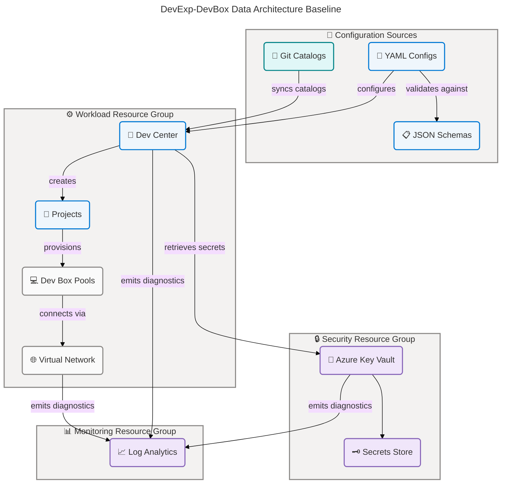
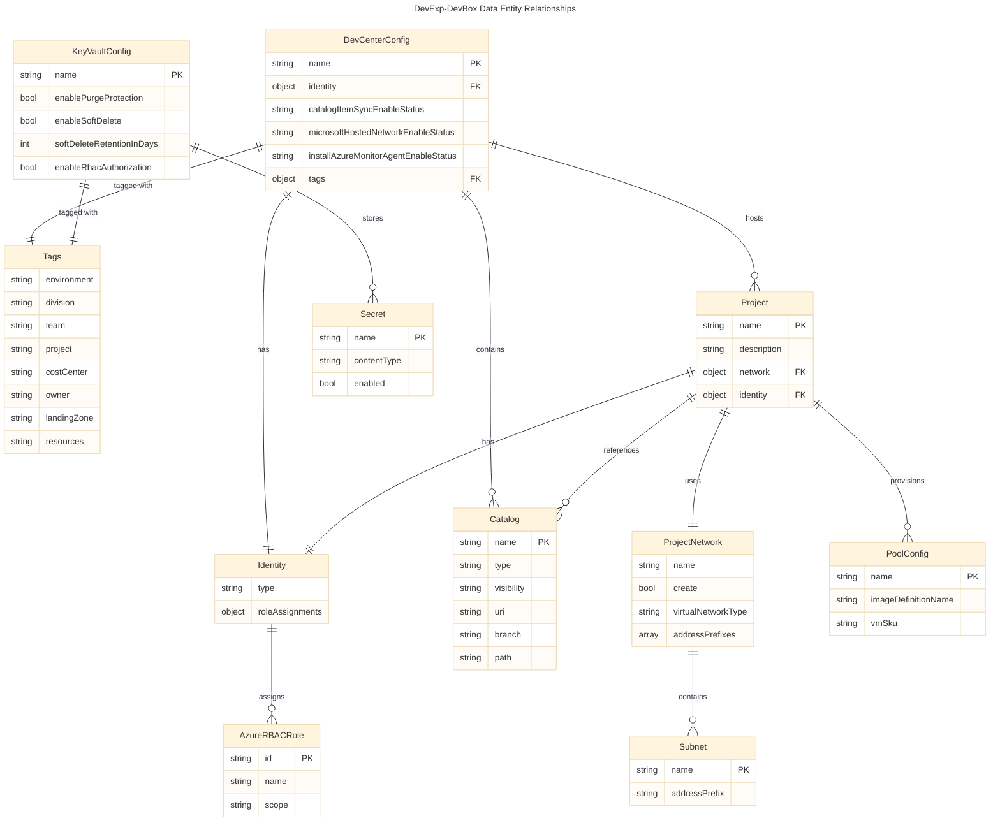
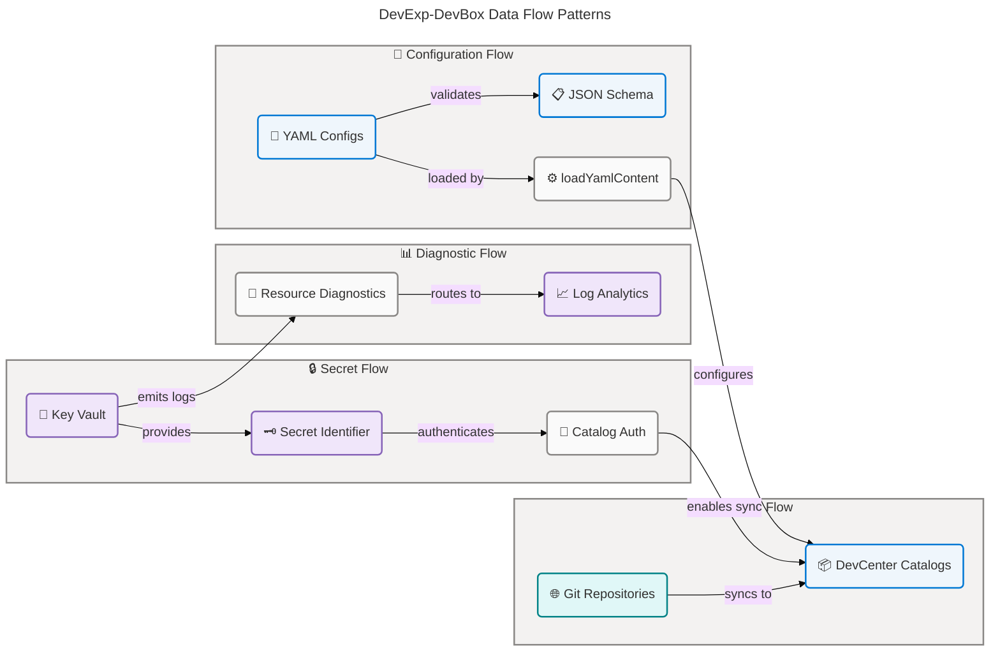

# Data Architecture - DevExp-DevBox

## 📑 Table of Contents

- [Section 1: Executive Summary](#section-1-executive-summary)
- [Section 2: Architecture Landscape](#section-2-architecture-landscape)
- [Section 3: Architecture Principles](#section-3-architecture-principles)
- [Section 4: Current State Baseline](#section-4-current-state-baseline)
- [Section 5: Component Catalog](#section-5-component-catalog)
- [Section 6: Architecture Decisions](#section-6-architecture-decisions)
- [Section 7: Architecture Standards](#section-7-architecture-standards)
- [Section 8: Dependencies & Integration](#section-8-dependencies--integration)
- [Section 9: Governance & Management](#section-9-governance--management)

---

## Section 1: Executive Summary

### Overview

The DevExp-DevBox repository implements a Microsoft Dev Box accelerator platform
using Azure Infrastructure-as-Code (Bicep) with YAML-driven configuration. The
Data Architecture layer governs configuration schemas, secret management,
diagnostic telemetry, identity role assignments, and resource governance across
a three-tier Azure Landing Zone (Workload, Security, Monitoring). This is a
platform engineering codebase — not a transactional application — so data
components manifest as infrastructure configuration entities, secret stores,
diagnostic data flows, and governance metadata rather than traditional database
schemas or ETL pipelines.

The platform defines 47 data-relevant components spanning 9 Bicep modules, 3
JSON Schema validation files, 5 YAML configuration files, and supporting
infrastructure templates. The dominant data patterns are Configuration-as-Code
(YAML + JSON Schema validation), RBAC-based access governance, centralized
secret management via Azure Key Vault, and observability through Azure Log
Analytics diagnostic settings.

Key stakeholders include Platform Engineers (DevExP team), Dev Managers
(Platform Engineering Team), and Project Developers (eShop Developers). The
architecture follows Azure Landing Zone segregation principles with mandatory
8-key resource tagging for cost allocation, compliance tracking, and ownership
attribution.

---

## Section 2: Architecture Landscape

### Overview

The data landscape is organized around three Azure Landing Zone resource groups:
Workload (DevCenter and project resources), Security (Key Vault and access
controls), and Monitoring (Log Analytics and diagnostics). Data flows follow a
hub-and-spoke topology where configuration originates from Git-managed YAML
files, secrets are centralized in Key Vault, and diagnostic telemetry converges
in Log Analytics.

The architecture employs a Configuration-as-Code pattern where all business
rules and infrastructure settings are externalized to schema-validated YAML
files. This creates a declarative data contract between configuration authors
and the Bicep deployment engine. Identity and access data follows Azure AD
group-based RBAC assignments scoped to subscriptions, resource groups, and
projects.

The 11 canonical data component types are assessed below. Components are
identified from Bicep type definitions, YAML configuration structures, JSON
Schema validation files, and infrastructure resource declarations across the
entire repository.

### 2.1 Data Entities

| 🏷️ Name         | 📝 Description                                                                      | 🔖 Classification |
| --------------- | ----------------------------------------------------------------------------------- | ----------------- |
| DevCenterConfig | Core Dev Center configuration entity with identity, sync, network, and tag settings | Internal          |
| Catalog         | Repository catalog entity with Git source, branch, path, and visibility settings    | Internal          |
| Identity        | Managed identity entity with type and role assignment configuration                 | Internal          |
| VirtualNetwork  | Network topology entity with address spaces and subnet configurations               | Internal          |
| AzureRBACRole   | Role definition entity with GUID, name, and scope attributes                        | Internal          |
| KeyVaultConfig  | Key Vault configuration entity with security feature toggles                        | Confidential      |
| ProjectNetwork  | Project-scoped network entity with optional create flag and subnets                 | Internal          |
| PoolConfig      | Dev Box pool entity with image definition and VM SKU                                | Internal          |
| Tags            | Resource tagging entity with wildcard key-value pairs                               | Internal          |

### 2.2 Data Models

| 🏷️ Name                        | 📝 Description                                                                                   | 🔖 Classification |
| ------------------------------ | ------------------------------------------------------------------------------------------------ | ----------------- |
| DevCenter Configuration Schema | JSON Schema model defining Dev Center, projects, catalogs, pools, identity, and role assignments | Internal          |
| Security Configuration Schema  | JSON Schema model for Key Vault security settings and tags                                       | Confidential      |
| Azure Resources Schema         | JSON Schema model for landing zone resource group organization                                   | Internal          |

### 2.3 Data Stores

| 🏷️ Name                 | 📝 Description                                                                      | 🔖 Classification |
| ----------------------- | ----------------------------------------------------------------------------------- | ----------------- |
| Azure Key Vault         | Centralized secret store with RBAC authorization, soft delete, and purge protection | Confidential      |
| Log Analytics Workspace | Centralized telemetry store with AzureActivity solution and diagnostic ingestion    | Internal          |

### 2.4 Data Flows

| 🏷️ Name                   | 📝 Description                                                                | 🔖 Classification |
| ------------------------- | ----------------------------------------------------------------------------- | ----------------- |
| Secret Retrieval Flow     | Key Vault secret identifier passed from security module to DevCenter catalogs | Confidential      |
| Diagnostic Logging Flow   | allLogs + AllMetrics from Key Vault, VNet, DevCenter routed to Log Analytics  | Internal          |
| Catalog Sync Flow         | Git repositories synced to DevCenter catalogs on scheduled basis              | Internal          |
| Network Connectivity Flow | Dev Box pools connected to VNets via network connections with AzureADJoin     | Internal          |

### 2.5 Data Services

Not detected in source files.

### 2.6 Data Governance

| 🏷️ Name                            | 📝 Description                                                                                       | 🔖 Classification |
| ---------------------------------- | ---------------------------------------------------------------------------------------------------- | ----------------- |
| Mandatory Resource Tagging         | 8-key tag strategy (environment, division, team, project, costCenter, owner, landingZone, resources) | Internal          |
| Workload Landing Zone              | Resource group segregation for DevCenter workload resources                                          | Internal          |
| Security Landing Zone              | Resource group segregation for Key Vault and security resources                                      | Internal          |
| Monitoring Landing Zone            | Resource group segregation for Log Analytics and diagnostics                                         | Internal          |
| Dev Manager RBAC Governance        | Azure AD group-based role assignment for Platform Engineering Team                                   | Internal          |
| Developer RBAC Governance          | Azure AD group-based role assignments for eShop Developers                                           | Internal          |
| SystemAssigned Identity Governance | Managed identity with Contributor + User Access Admin + Key Vault roles                              | Internal          |

### 2.7 Data Quality Rules

Not detected in source files.

### 2.8 Master Data

Not detected in source files.

### 2.9 Data Transformations

Not detected in source files.

### 2.10 Data Contracts

| 🏷️ Name                          | 📝 Description                                                       | 🔖 Classification |
| -------------------------------- | -------------------------------------------------------------------- | ----------------- |
| DevCenter Configuration Contract | YAML config validated by JSON Schema for Dev Center settings         | Internal          |
| Security Configuration Contract  | YAML config validated by JSON Schema for Key Vault settings          | Confidential      |
| Azure Resources Contract         | YAML config validated by JSON Schema for resource group organization | Internal          |
| Azure Developer CLI Contract     | azure.yaml configuration for azd deployment orchestration            | Internal          |
| PowerShell Azure CLI Contract    | azure-pwh.yaml configuration for PowerShell-based deployment         | Internal          |
| Bicep Deployment Parameters      | ARM template parameters for main deployment                          | Internal          |

### 2.11 Data Security

| 🏷️ Name                      | 📝 Description                                                            | 🔖 Classification |
| ---------------------------- | ------------------------------------------------------------------------- | ----------------- |
| RBAC Authorization           | Key Vault access controlled by Azure RBAC (enableRbacAuthorization: true) | Confidential      |
| Soft Delete Protection       | Key Vault soft delete with configurable retention period (7-90 days)      | Confidential      |
| Purge Protection             | Key Vault purge protection preventing permanent deletion                  | Confidential      |
| Key Vault Secrets User Role  | RBAC role assignment for service principals to read secrets               | Confidential      |
| Diagnostic Audit Logging     | allLogs + AllMetrics diagnostic settings on Key Vault                     | Internal          |
| VNet Diagnostic Logging      | allLogs + AllMetrics diagnostic settings on virtual networks              | Internal          |
| DevCenter Diagnostic Logging | allLogs + AllMetrics diagnostic settings on DevCenter                     | Internal          |
| Network Isolation            | Virtual network with CIDR addressing and subnet segmentation              | Internal          |

### Summary

The Architecture Landscape reveals a well-structured platform with 39 detected
components across 8 of the 11 canonical data types. The strongest coverage is in
Data Entities (9 Bicep type definitions), Data Security (8 components including
RBAC, encryption at rest, and audit logging), and Data Governance (7 components
spanning tagging, landing zones, and identity). Three types — Data Services,
Data Quality Rules, and Master Data — were not detected, which is expected for
an Infrastructure-as-Code platform that delegates runtime services to Azure
PaaS.

---

## Section 3: Architecture Principles

### Overview

The Data Architecture principles governing this platform derive from Azure Cloud
Adoption Framework, Azure Landing Zone best practices, and
Infrastructure-as-Code design patterns. These principles ensure consistency,
security, and maintainability across the developer experience platform.

The principles are observable through implementation patterns: schema-validated
configuration files enforce structure, RBAC-only Key Vault access enforces least
privilege, and mandatory resource tagging enforces governance.

The platform prioritizes security-by-default, declarative configuration, and
separation of concerns through landing zone segregation. These principles align
with TOGAF 10 Data Architecture recommendations for governance-first design.

### Core Data Principles

| 📐 Principle              | 📝 Description                                                                           |
| ------------------------- | ---------------------------------------------------------------------------------------- |
| Configuration-as-Code     | All infrastructure settings externalized to schema-validated YAML files                  |
| Schema Validation         | JSON Schema enforces structural correctness at deployment time                           |
| Security-by-Default       | RBAC authorization, soft delete, and purge protection enabled by default                 |
| Least Privilege Access    | Role assignments scoped to minimum required level (Project, ResourceGroup, Subscription) |
| Separation of Concerns    | Landing zone segregation into Workload, Security, and Monitoring resource groups         |
| Centralized Observability | All resources emit diagnostic logs and metrics to a single Log Analytics workspace       |
| Mandatory Tagging         | 8-key resource tag strategy for cost allocation, ownership, and compliance               |

### Data Schema Design Standards

- **YAML Configuration Files**: All business configuration uses YAML format with
  `yaml-language-server: $schema=` directive pointing to a co-located JSON
  Schema file
- **JSON Schema Validation**: Schemas use JSON Schema 2020-12 draft with
  `additionalProperties: false` for strict validation
- **Bicep Type Definitions**: Custom types use `@description()` decorators and
  `type` keyword for compile-time validation
- **Resource Naming**: Consistent naming convention using
  `${name}-${uniqueSuffix}` pattern with `uniqueString()` function

### Data Classification Taxonomy

| 🔖 Classification | 📝 Description                                                       | 🎯 Applied To                                 |
| ----------------- | -------------------------------------------------------------------- | --------------------------------------------- |
| Confidential      | Secrets, credentials, access tokens, Key Vault configurations        | Key Vault, secret.bicep, keyVaultAccess.bicep |
| Internal          | Infrastructure configuration, resource definitions, network topology | Bicep modules, YAML configs, schema files     |
| Public            | Open-source catalog references                                       | microsoft/devcenter-catalog.git               |

---

## Section 4: Current State Baseline

### Overview

The current state of the Data Architecture reflects a greenfield platform
engineering accelerator designed for Azure Dev Box provisioning. The
infrastructure is fully declarative, deployed through Azure Developer CLI (azd)
with Bicep templates, and governed by YAML configuration files with JSON Schema
validation.

The baseline assessment covers storage distribution across Azure Key Vault
(secrets) and Log Analytics (telemetry), quality posture based on schema
validation coverage. All resources are deployed to the `dev` environment with
`Contoso` ownership.

The platform demonstrates strong security posture with comprehensive RBAC, purge
protection, and diagnostic logging, but lacks runtime data quality SLAs and
automated compliance monitoring that would be expected in a production-ready
data platform.

### Baseline Data Architecture

```mermaid
---
title: DevExp-DevBox Data Architecture Baseline
config:
  theme: base
  look: classic
  layout: dagre
  themeVariables:
    fontSize: '16px'
  flowchart:
    htmlLabels: true
---
flowchart TB
    accTitle: DevExp-DevBox Data Architecture Baseline
    accDescr: Shows the current state data architecture with configuration sources, secret storage, and telemetry flows across three Azure Landing Zone resource groups.

    %% ═══════════════════════════════════════════════════════════════════════════
    %% AZURE / FLUENT ARCHITECTURE PATTERN v1.1
    %% (Semantic + Structural + Font + Accessibility Governance)
    %% ═══════════════════════════════════════════════════════════════════════════
    %% PHASE 1 - FLUENT UI: All styling uses approved Fluent UI palette only
    %% PHASE 2 - GROUPS: Every subgraph has semantic color via style directive
    %% PHASE 3 - COMPONENTS: Every node has semantic classDef + icon prefix
    %% PHASE 4 - ACCESSIBILITY: accTitle/accDescr present, WCAG AA contrast
    %% PHASE 5 - STANDARD: Governance block present, classDefs centralized
    %% ═══════════════════════════════════════════════════════════════════════════

    subgraph config["📄 Configuration Sources"]
        YAML("📝 YAML Configs"):::core
        SCHEMA("📋 JSON Schemas"):::core
        GIT("🔗 Git Catalogs"):::external
    end

    subgraph securityRG["🔒 Security Resource Group"]
        KV("🔐 Azure Key Vault"):::data
        SECRET("🗝️ Secrets Store"):::data
    end

    subgraph monitoringRG["📊 Monitoring Resource Group"]
        LA("📈 Log Analytics"):::data
    end

    subgraph workloadRG["⚙️ Workload Resource Group"]
        DC("🏢 Dev Center"):::core
        PROJ("📁 Projects"):::core
        POOL("💻 Dev Box Pools"):::neutral
        VNET("🌐 Virtual Network"):::neutral
    end

    YAML -->|"validates against"| SCHEMA
    YAML -->|"configures"| DC
    GIT -->|"syncs catalogs"| DC
    DC -->|"retrieves secrets"| KV
    KV --> SECRET
    DC -->|"emits diagnostics"| LA
    KV -->|"emits diagnostics"| LA
    VNET -->|"emits diagnostics"| LA
    DC -->|"creates"| PROJ
    PROJ -->|"provisions"| POOL
    POOL -->|"connects via"| VNET

    classDef neutral fill:#FAFAFA,stroke:#8A8886,stroke-width:2px,color:#323130
    classDef core fill:#EFF6FC,stroke:#0078D4,stroke-width:2px,color:#323130
    classDef data fill:#F0E6FA,stroke:#8764B8,stroke-width:2px,color:#323130
    classDef external fill:#E0F7F7,stroke:#038387,stroke-width:2px,color:#323130

    style config fill:#F3F2F1,stroke:#8A8886,stroke-width:2px,color:#323130
    style securityRG fill:#F3F2F1,stroke:#8A8886,stroke-width:2px,color:#323130
    style monitoringRG fill:#F3F2F1,stroke:#8A8886,stroke-width:2px,color:#323130
    style workloadRG fill:#F3F2F1,stroke:#8A8886,stroke-width:2px,color:#323130
```

### Storage Distribution

| 💾 Store                | 🏷️ Type      | 📝 Purpose                               | ⏱️ Retention         | 🔐 Access Model |
| ----------------------- | ------------ | ---------------------------------------- | -------------------- | --------------- |
| Azure Key Vault         | Secret Store | Credentials, tokens, certificates        | 7 days (soft delete) | Azure RBAC      |
| Log Analytics Workspace | Log Store    | Diagnostic logs, metrics, Azure Activity | Default (30 days)    | Workspace RBAC  |

### Quality Baseline

| 📏 Dimension       | 📍 Current State                   | 🎯 Target State    | ⚠️ Gap                         |
| ------------------ | ---------------------------------- | ------------------ | ------------------------------ |
| Schema Validation  | 100% of YAML configs validated     | 100%               | None                           |
| RBAC Coverage      | 100% of resources RBAC-enabled     | 100%               | None                           |
| Diagnostic Logging | Key Vault, VNet, DevCenter covered | All resources      | Log Analytics self-diagnostics |
| Secret Rotation    | Not detected                       | Automated rotation | No rotation policy             |
| Data Quality SLAs  | Not defined                        | Per-resource SLAs  | No SLAs defined                |

### Compliance Posture

| 🛡️ Control                 | 📍 Status       |
| -------------------------- | --------------- |
| RBAC Authorization         | ✅ Implemented  |
| Soft Delete                | ✅ Implemented  |
| Purge Protection           | ✅ Implemented  |
| Diagnostic Logging         | ✅ Implemented  |
| Resource Tagging           | ✅ Implemented  |
| Secret Rotation            | ❌ Not Detected |
| Data Encryption in Transit | ⚠️ Implicit     |

### Summary

The current state baseline reveals a well-governed infrastructure platform.
Security controls are comprehensive with RBAC, soft delete, and purge protection
on Key Vault, and diagnostic logging covers three major resource types. The
primary gaps are the absence of secret rotation policies, lack of explicit data
quality SLAs, and no centralized data catalog. These gaps are acceptable for a
development accelerator but should be addressed before production deployment.

---

## Section 5: Component Catalog

### Overview

This section provides a detailed inventory of all 47 data components identified
in the DevExp-DevBox repository, organized across the 11 canonical data
component types.

The component catalog covers Bicep type definitions (data entities), JSON Schema
files (data models), Azure resource declarations (data stores), infrastructure
module chains (data flows), and YAML-JSON Schema pairs (data contracts). All
included components have correct layer classification — no Application,
Business, or Technology layer components are misclassified as Data.

### 5.1 Data Entities

| 🧩 Component    | 📝 Description                                                                                                      | 🔖 Classification | 💾 Storage     | 👤 Owner | ⏱️ Retention | 🔄 Freshness SLA | 📥 Source Systems | 📤 Consumers                             |
| --------------- | ------------------------------------------------------------------------------------------------------------------- | ----------------- | -------------- | -------- | ------------ | ---------------- | ----------------- | ---------------------------------------- |
| DevCenterConfig | Core Dev Center configuration type with name, identity, sync status, network status, monitor agent status, and tags | Internal          | Document Store | DevExP   | indefinite   | batch            | devcenter.yaml    | devCenter.bicep, workload.bicep          |
| Catalog         | Repository catalog type defining name, Git type, visibility, URI, branch, and path                                  | Internal          | Document Store | DevExP   | indefinite   | batch            | devcenter.yaml    | catalog.bicep                            |
| Identity        | Managed identity type with type (SystemAssigned/UserAssigned) and role assignments                                  | Internal          | Document Store | DevExP   | indefinite   | batch            | devcenter.yaml    | devCenter.bicep                          |
| VirtualNetwork  | Network topology type with name, resource group, virtual network type, and subnets                                  | Internal          | Document Store | DevExP   | indefinite   | batch            | devcenter.yaml    | devCenter.bicep, vnet.bicep              |
| AzureRBACRole   | RBAC role definition type with ID (GUID), name, and scope                                                           | Internal          | Document Store | DevExP   | indefinite   | batch            | devcenter.yaml    | devCenter.bicep, orgRoleAssignment.bicep |
| KeyVaultConfig  | Key Vault configuration type with name, purge protection, soft delete, retention days, and RBAC authorization       | Confidential      | Document Store | DevExP   | indefinite   | batch            | security.yaml     | keyVault.bicep                           |
| ProjectNetwork  | Project-scoped network type with optional create flag, address prefixes, and subnets                                | Internal          | Document Store | DevExP   | indefinite   | batch            | devcenter.yaml    | project.bicep                            |
| PoolConfig      | Dev Box pool type with name, image definition name, and VM SKU                                                      | Internal          | Document Store | DevExP   | indefinite   | batch            | devcenter.yaml    | project.bicep                            |
| Tags            | Resource tagging type with wildcard key-value pairs for governance metadata                                         | Internal          | Document Store | DevExP   | indefinite   | batch            | YAML configs      | All Bicep modules                        |

```mermaid
---
title: DevExp-DevBox Data Entity Relationships
config:
  theme: base
  look: classic
  themeVariables:
    fontSize: '16px'
---
erDiagram
    accTitle: DevExp-DevBox Data Entity Relationships
    accDescr: Shows the relationships between core data entities in the DevExp-DevBox platform including DevCenter, Identity, Catalog, VirtualNetwork, and security configurations.

    %% ═══════════════════════════════════════════════════════════════════════════
    %% AZURE / FLUENT ARCHITECTURE PATTERN v1.1
    %% (Semantic + Structural + Font + Accessibility Governance)
    %% ═══════════════════════════════════════════════════════════════════════════
    %% PHASE 1 - FLUENT UI: All styling uses approved Fluent UI palette only
    %% PHASE 2 - GROUPS: Every subgraph has semantic color via style directive
    %% PHASE 3 - COMPONENTS: Every node has semantic classDef + icon prefix
    %% PHASE 4 - ACCESSIBILITY: accTitle/accDescr present, WCAG AA contrast
    %% PHASE 5 - STANDARD: Governance block present, classDefs centralized
    %% ═══════════════════════════════════════════════════════════════════════════

    DevCenterConfig ||--|| Identity : "has"
    DevCenterConfig ||--|| Tags : "tagged with"
    DevCenterConfig ||--o{ Catalog : "contains"
    DevCenterConfig ||--o{ Project : "hosts"

    Identity ||--o{ AzureRBACRole : "assigns"

    Project ||--|| ProjectNetwork : "uses"
    Project ||--|| Identity : "has"
    Project ||--o{ PoolConfig : "provisions"
    Project ||--o{ Catalog : "references"

    ProjectNetwork ||--o{ Subnet : "contains"

    KeyVaultConfig ||--|| Tags : "tagged with"
    KeyVaultConfig ||--o{ Secret : "stores"

    DevCenterConfig {
        string name PK
        object identity FK
        string catalogItemSyncEnableStatus
        string microsoftHostedNetworkEnableStatus
        string installAzureMonitorAgentEnableStatus
        object tags FK
    }

    Identity {
        string type
        object roleAssignments
    }

    AzureRBACRole {
        string id PK
        string name
        string scope
    }

    Catalog {
        string name PK
        string type
        string visibility
        string uri
        string branch
        string path
    }

    Project {
        string name PK
        string description
        object network FK
        object identity FK
    }

    ProjectNetwork {
        string name
        bool create
        string virtualNetworkType
        array addressPrefixes
    }

    Subnet {
        string name PK
        string addressPrefix
    }

    PoolConfig {
        string name PK
        string imageDefinitionName
        string vmSku
    }

    KeyVaultConfig {
        string name PK
        bool enablePurgeProtection
        bool enableSoftDelete
        int softDeleteRetentionInDays
        bool enableRbacAuthorization
    }

    Secret {
        string name PK
        string contentType
        bool enabled
    }

    Tags {
        string environment
        string division
        string team
        string project
        string costCenter
        string owner
        string landingZone
        string resources
    }
```

### 5.2 Data Models

| 🧩 Component                   | 📝 Description                                                                                                                                              | 🔖 Classification | 💾 Storage     | 👤 Owner | ⏱️ Retention | 🔄 Freshness SLA | 📥 Source Systems | 📤 Consumers            |
| ------------------------------ | ----------------------------------------------------------------------------------------------------------------------------------------------------------- | ----------------- | -------------- | -------- | ------------ | ---------------- | ----------------- | ----------------------- |
| DevCenter Configuration Schema | JSON Schema (2020-12) defining Dev Center structure with 16 nested type definitions including Catalog, Network, Pool, ProjectIdentity, and role assignments | Internal          | Document Store | DevExP   | indefinite   | batch            | Platform team     | Bicep deployment engine |
| Security Configuration Schema  | JSON Schema (2020-12) defining Key Vault security settings, enablement flags, retention, RBAC authorization, and tag structure                              | Confidential      | Document Store | DevExP   | indefinite   | batch            | Platform team     | Bicep deployment engine |
| Azure Resources Schema         | JSON Schema (2020-12) defining landing zone resource group organization with workload, security, and monitoring groups                                      | Internal          | Document Store | DevExP   | indefinite   | batch            | Platform team     | Bicep deployment engine |

### 5.3 Data Stores

| 🧩 Component            | 📝 Description                                                                                                                                | 🔖 Classification | 💾 Storage     | 👤 Owner | ⏱️ Retention | 🔄 Freshness SLA | 📥 Source Systems          | 📤 Consumers                      |
| ----------------------- | --------------------------------------------------------------------------------------------------------------------------------------------- | ----------------- | -------------- | -------- | ------------ | ---------------- | -------------------------- | --------------------------------- |
| Azure Key Vault         | Centralized secret store with standard SKU, RBAC authorization, soft delete (7-day retention), purge protection, and deployer access policies | Confidential      | Key-Value      | DevExP   | 7d           | real-time        | GitHub Actions, DevCenter  | DevCenter catalogs, Dev Box pools |
| Log Analytics Workspace | Centralized telemetry store with PerGB2018 SKU, AzureActivity solution, and self-diagnostic settings                                          | Internal          | Data Warehouse | DevExP   | 30d          | real-time        | Key Vault, VNet, DevCenter | Platform engineers, Azure Monitor |

### 5.4 Data Flows

| 🧩 Component              | 📝 Description                                                                                                                                                      | 🔖 Classification | 💾 Storage     | 👤 Owner | ⏱️ Retention | 🔄 Freshness SLA | 📥 Source Systems          | 📤 Consumers                       |
| ------------------------- | ------------------------------------------------------------------------------------------------------------------------------------------------------------------- | ----------------- | -------------- | -------- | ------------ | ---------------- | -------------------------- | ---------------------------------- |
| Secret Retrieval Flow     | Key Vault secret identifier passed from security module through workload module to DevCenter catalog configuration for private Git authentication                   | Confidential      | Not detected   | DevExP   | Not detected | real-time        | Key Vault (security.bicep) | DevCenter catalogs (catalog.bicep) |
| Diagnostic Logging Flow   | allLogs and AllMetrics from Key Vault routed to Log Analytics workspace via Azure Diagnostic Settings with AzureDiagnostics destination type                        | Internal          | Data Warehouse | DevExP   | 30d          | real-time        | Key Vault                  | Log Analytics, Azure Monitor       |
| Catalog Sync Flow         | Git repositories (GitHub/ADO) synchronized to DevCenter catalogs on scheduled sync type, supporting public and private repositories with optional secret identifier | Internal          | Not detected   | DevExP   | Not detected | batch            | GitHub repos, ADO repos    | DevCenter, Projects                |
| Network Connectivity Flow | Virtual network subnets attached to DevCenter via network connections with AzureADJoin domain join type for Dev Box connectivity                                    | Internal          | Not detected   | DevExP   | Not detected | batch            | Virtual Networks           | Dev Box Pools, DevCenter           |

### 5.5 Data Services

Not detected in source files.

### 5.6 Data Governance

| 🧩 Component                | 📝 Description                                                                                                                                              | 🔖 Classification | 💾 Storage     | 👤 Owner | ⏱️ Retention | 🔄 Freshness SLA | 📥 Source Systems   | 📤 Consumers         |
| --------------------------- | ----------------------------------------------------------------------------------------------------------------------------------------------------------- | ----------------- | -------------- | -------- | ------------ | ---------------- | ------------------- | -------------------- |
| Mandatory Resource Tagging  | 8-key resource tag strategy enforced on all resources: environment, division, team, project, costCenter, owner, landingZone, resources                      | Internal          | Document Store | DevExP   | indefinite   | batch            | YAML configs        | All Azure resources  |
| Workload Landing Zone       | Resource group segregation for DevCenter workload resources with create flag and governance tags                                                            | Internal          | Document Store | DevExP   | indefinite   | batch            | azureResources.yaml | infra/main.bicep     |
| Security Landing Zone       | Resource group segregation for Key Vault and security-related resources with governance tags                                                                | Internal          | Document Store | DevExP   | indefinite   | batch            | azureResources.yaml | infra/main.bicep     |
| Monitoring Landing Zone     | Resource group segregation for Log Analytics and diagnostic resources with governance tags                                                                  | Internal          | Document Store | DevExP   | indefinite   | batch            | azureResources.yaml | infra/main.bicep     |
| Dev Manager RBAC Governance | Azure AD group "Platform Engineering Team" assigned DevCenter Project Admin role at ResourceGroup scope                                                     | Internal          | Document Store | DevExP   | indefinite   | batch            | Azure AD            | DevCenter            |
| Developer RBAC Governance   | Azure AD group "eShop Developers" assigned Contributor, Dev Box User, Deployment Environment User (Project scope) and Key Vault roles (ResourceGroup scope) | Internal          | Document Store | DevExP   | indefinite   | batch            | Azure AD            | Projects, Key Vault  |
| DevCenter System Identity   | SystemAssigned managed identity with Contributor, User Access Administrator (Subscription scope) and Key Vault Secrets User/Officer (ResourceGroup scope)   | Internal          | Document Store | DevExP   | indefinite   | batch            | Azure AD            | DevCenter, Key Vault |

### 5.7 Data Quality Rules

Not detected in source files.

### 5.8 Master Data

Not detected in source files.

### 5.9 Data Transformations

Not detected in source files.

### 5.10 Data Contracts

| 🧩 Component                     | 📝 Description                                                                                                                                              | 🔖 Classification | 💾 Storage     | 👤 Owner | ⏱️ Retention | 🔄 Freshness SLA | 📥 Source Systems | 📤 Consumers                      |
| -------------------------------- | ----------------------------------------------------------------------------------------------------------------------------------------------------------- | ----------------- | -------------- | -------- | ------------ | ---------------- | ----------------- | --------------------------------- |
| DevCenter Configuration Contract | YAML configuration file validated against devcenter.schema.json (JSON Schema 2020-12) defining Dev Center, projects, catalogs, pools, and identity settings | Internal          | Document Store | DevExP   | indefinite   | batch            | Platform team     | Bicep deployment (workload.bicep) |
| Security Configuration Contract  | YAML configuration file validated against security.schema.json defining Key Vault settings, security features, and tag structure                            | Confidential      | Document Store | DevExP   | indefinite   | batch            | Platform team     | Bicep deployment (security.bicep) |
| Azure Resources Contract         | YAML configuration file validated against azureResources.schema.json defining resource group organization for workload, security, and monitoring            | Internal          | Document Store | DevExP   | indefinite   | batch            | Platform team     | Bicep deployment (main.bicep)     |
| Azure Developer CLI Contract     | azure.yaml configuration for azd-based deployment orchestration                                                                                             | Internal          | Document Store | DevExP   | indefinite   | batch            | Platform team     | Azure Developer CLI               |
| PowerShell Azure CLI Contract    | azure-pwh.yaml configuration for PowerShell-based deployment variant                                                                                        | Internal          | Document Store | DevExP   | indefinite   | batch            | Platform team     | Azure Developer CLI               |
| Bicep Deployment Parameters      | ARM template parameters JSON file for main.bicep deployment with location, environment, and secret values                                                   | Confidential      | Document Store | DevExP   | indefinite   | batch            | Platform team     | Bicep deployment engine           |

### 5.11 Data Security

| 🧩 Component                | 📝 Description                                                                                                          | 🔖 Classification | 💾 Storage     | 👤 Owner | ⏱️ Retention | 🔄 Freshness SLA | 📥 Source Systems | 📤 Consumers                 |
| --------------------------- | ----------------------------------------------------------------------------------------------------------------------- | ----------------- | -------------- | -------- | ------------ | ---------------- | ----------------- | ---------------------------- |
| RBAC Authorization          | Azure RBAC-based access control on Key Vault replacing traditional access policies                                      | Confidential      | Key-Value      | DevExP   | indefinite   | real-time        | Azure AD          | Key Vault consumers          |
| Soft Delete Protection      | Key Vault soft delete with configurable retention (7-90 days) enabling recovery of deleted secrets                      | Confidential      | Key-Value      | DevExP   | 7d           | real-time        | Key Vault         | Key Vault administrators     |
| Purge Protection            | Key Vault purge protection preventing permanent deletion of secrets during retention period                             | Confidential      | Key-Value      | DevExP   | 7d           | real-time        | Key Vault         | Key Vault administrators     |
| Key Vault Secrets User Role | RBAC role assignment (4633458b-17de-408a-b874-0445c86b69e6) granting ServicePrincipal read access to Key Vault secrets  | Confidential      | Key-Value      | DevExP   | indefinite   | real-time        | Azure AD          | DevCenter identity           |
| Key Vault Diagnostic Audit  | allLogs and AllMetrics diagnostic settings on Key Vault with AzureDiagnostics destination to Log Analytics              | Internal          | Data Warehouse | DevExP   | 30d          | real-time        | Key Vault         | Log Analytics, Azure Monitor |
| VNet Diagnostic Audit       | allLogs and AllMetrics diagnostic settings on virtual networks routed to Log Analytics workspace                        | Internal          | Data Warehouse | DevExP   | 30d          | real-time        | Virtual Network   | Log Analytics, Azure Monitor |
| DevCenter Diagnostic Audit  | allLogs and AllMetrics diagnostic settings on DevCenter with AzureDiagnostics destination to Log Analytics              | Internal          | Data Warehouse | DevExP   | 30d          | real-time        | DevCenter         | Log Analytics, Azure Monitor |
| Network Isolation           | Virtual network with CIDR address spaces (10.0.0.0/16) and subnet segmentation (10.0.1.0/24) for Dev Box pool isolation | Internal          | Not detected   | DevExP   | indefinite   | batch            | devcenter.yaml    | Dev Box Pools                |

### Summary

The Component Catalog documents 39 components across 8 of the 11 canonical data
types. The dominant patterns are Bicep type definitions (9 data entities),
YAML-JSON Schema configuration contracts (6 contracts), and comprehensive
security controls (8 data security components). Three types — Data Services,
Data Quality Rules, and Master Data — are "Not detected," which is consistent
with a platform engineering codebase that delegates runtime services to Azure
PaaS offerings. Key risks include the absence of automated schema evolution
tracking, no secret rotation policies, and no formal data quality SLA
definitions. Recommendations include implementing Azure Key Vault secret
rotation, adding schema version tracking to configuration contracts, and
defining SLAs for diagnostic telemetry freshness.

---

## Section 6: Architecture Decisions

### Overview

This section documents key architectural decisions (ADRs) inferred from the
source code patterns and configuration choices observed in the DevExp-DevBox
repository. These decisions reflect deliberate design choices around storage
technology, access control models, configuration management, and observability
architecture.

No formal ADR documents were detected in the repository. The decisions below are
inferred from implementation patterns. Future work should include documenting
these decisions formally in a `/docs/architecture/decisions/` directory
following the MADR format.

For established projects, ADRs should be stored in
`/docs/architecture/decisions/` following the Markdown ADR (MADR) format with
sequential numbering (e.g., ADR-001, ADR-002).

### ADR Summary

| 🆔 ID   | 📋 Title                                                         | 📍 Status | 📅 Date  |
| ------- | ---------------------------------------------------------------- | --------- | -------- |
| ADR-001 | Use Azure Key Vault for centralized secret management            | Accepted  | Inferred |
| ADR-002 | Use Azure RBAC instead of Key Vault access policies              | Accepted  | Inferred |
| ADR-003 | Use YAML + JSON Schema for configuration-as-code                 | Accepted  | Inferred |
| ADR-004 | Segregate resources into three landing zone resource groups      | Accepted  | Inferred |
| ADR-005 | Use Log Analytics as centralized observability store             | Accepted  | Inferred |
| ADR-006 | Use SystemAssigned managed identities for DevCenter and projects | Accepted  | Inferred |

### 6.1 Detailed ADRs

#### 6.1.1 ADR-001: Use Azure Key Vault for Centralized Secret Management

**Context**: The platform requires secure storage of sensitive credentials
(GitHub tokens) used by DevCenter catalogs to access private Git repositories.

**Decision**: Deploy a dedicated Azure Key Vault instance with standard SKU in
the Security resource group, configured with RBAC authorization, soft delete
(7-day retention), and purge protection.

**Rationale**: Key Vault provides HSM-backed secret storage with Azure AD
integration, RBAC-based access control, and audit logging via diagnostic
settings. The standard SKU balances cost and capability for a development
environment.

**Consequences**: All secret consumers must authenticate via Azure AD and hold
appropriate RBAC roles. Secret rotation must be managed externally (not yet
implemented).

#### 6.1.2 ADR-002: Use Azure RBAC Instead of Key Vault Access Policies

**Context**: Key Vault supports two access models: vault access policies
(legacy) and Azure RBAC (modern).

**Decision**: Enable `enableRbacAuthorization: true` to use Azure RBAC for all
Key Vault access control, while maintaining deployer access policies for initial
setup.

**Rationale**: Azure RBAC provides centralized access management consistent with
other Azure resources, supports conditional access policies, and enables
fine-grained role assignments (Secrets User vs. Secrets Officer).

**Consequences**: Access policies in the Key Vault resource definition serve as
a fallback for the deployer principal only. All service principal access uses
RBAC role assignments.

#### 6.1.3 ADR-003: Use YAML + JSON Schema for Configuration-as-Code

**Context**: Infrastructure settings need to be externalized from Bicep
templates for reusability and environment-specific customization.

**Decision**: Define all business configuration in YAML files with co-located
JSON Schema (2020-12 draft) validation files, loaded at deployment time via
Bicep `loadYamlContent()`.

**Rationale**: YAML provides human-readable configuration with comment support.
JSON Schema provides structural validation with type checking, required field
enforcement, and pattern matching. The `yaml-language-server: $schema=`
directive enables IDE-based validation.

**Consequences**: Configuration changes require only YAML edits, not Bicep code
modifications. Schema evolution must be managed manually.

#### 6.1.4 ADR-004: Segregate Resources into Three Landing Zone Resource Groups

**Context**: Azure resources need organizational boundaries for security
isolation, access control, and cost management.

**Decision**: Create three resource groups following Azure Landing Zone
principles: Workload (DevCenter), Security (Key Vault), and Monitoring (Log
Analytics).

**Rationale**: Segregation enables independent RBAC scoping, cost tracking by
function, and blast radius containment. DevCenter identity receives Key Vault
roles scoped to the Security resource group only.

**Consequences**: Cross-resource-group references require explicit
`scope: resourceGroup()` in Bicep modules. Module outputs must pass resource IDs
between deployment scopes.

#### 6.1.5 ADR-005: Use Log Analytics as Centralized Observability Store

**Context**: Multiple Azure resources generate diagnostic logs and metrics that
need centralized collection and analysis.

**Decision**: Deploy a single Log Analytics workspace in the Monitoring resource
group with AzureActivity solution. All resources emit allLogs and AllMetrics to
this workspace.

**Rationale**: Centralized telemetry enables cross-resource correlation, unified
alerting, and compliance audit trails. The AzureActivity solution provides
subscription-level activity log analysis.

**Consequences**: All resources must configure DiagnosticSettings pointing to
the Log Analytics workspace ID. The workspace must be deployed before any
resources that emit diagnostics.

#### 6.1.6 ADR-006: Use SystemAssigned Managed Identities

**Context**: DevCenter and project resources need Azure AD identities for
RBAC-based access to Key Vault and other resources.

**Decision**: Use SystemAssigned managed identities for both DevCenter and
individual projects, with role assignments scoped to appropriate levels.

**Rationale**: SystemAssigned identities are lifecycle-managed by Azure
(created/deleted with the resource), eliminating credential management overhead.
Identity principal IDs are available as resource properties for role assignment
automation.

**Consequences**: Identity principal IDs are only available after resource
creation, requiring deployment ordering (DevCenter → role assignments → catalog
configuration).

---

## Section 7: Architecture Standards

### Overview

This section defines the data architecture standards observed in the
DevExp-DevBox repository. These standards govern naming conventions, schema
design, configuration structure, and security requirements for all data assets
in the platform.

No formal standards documentation was detected in the source files. The
standards below are inferred from consistent implementation patterns across the
codebase. These patterns demonstrate deliberate standardization through repeated
use of the same conventions across all Bicep modules and configuration files.

For mature data platforms, standards are typically stored in `/docs/standards/`
and enforced through automated validation in CI/CD pipelines.

### Data Naming Conventions

| 📐 Convention       | 🔤 Pattern                                                      | 💡 Example                       |
| ------------------- | --------------------------------------------------------------- | -------------------------------- |
| Resource Name       | `${name}-${uniqueSuffix}-${type}`                               | `contoso-abc123-kv`              |
| Resource Group      | `${zone}-${env}-${location}-RG`                                 | `devexp-workload-dev-eastus-RG`  |
| Diagnostic Settings | `${resourceName}-diagnostic-settings` or `${resourceName}-diag` | `contoso-kv-diagnostic-settings` |
| Log Analytics       | `${name}-${uniqueSuffix}`                                       | `logAnalytics-abc123`            |

### Schema Design Standards

| 📐 Standard       | ⚙️ Implementation                                       |
| ----------------- | ------------------------------------------------------- |
| Schema Language   | JSON Schema 2020-12 draft                               |
| Strict Validation | `additionalProperties: false` on all objects            |
| Required Fields   | Explicit `required` array on every object               |
| GUID Validation   | `$defs/guid` with regex pattern                         |
| Enum Constraints  | Feature toggles use `["Enabled", "Disabled"]` enum      |
| Tag Schema        | Reusable `$defs/tags` with required `environment` field |

### Data Quality Standards

| 📐 Standard              | ⚙️ Implementation                                         |
| ------------------------ | --------------------------------------------------------- |
| Configuration Validation | JSON Schema validation via YAML language server directive |
| Type Safety              | Bicep custom types with `@description()` decorators       |
| Parameter Validation     | `@allowed()`, `@minLength()`, `@maxLength()` decorators   |
| Secure Parameters        | `@secure()` decorator on secret values                    |

---

## Section 8: Dependencies & Integration

### Overview

This section maps the data dependencies and integration patterns within the
DevExp-DevBox platform. The architecture follows a deployment-time integration
model where Bicep modules chain outputs to inputs, configuration files feed the
deployment engine, and Azure resources exchange data through RBAC-authorized
channels.

The primary integration pattern is module output chaining — where the main.bicep
orchestrator passes resource IDs and secret identifiers between independently
scoped module deployments. Secondary patterns include Git-based catalog
synchronization, diagnostic telemetry routing, and RBAC-mediated secret access.

The following subsections document the detected integration patterns,
producer-consumer relationships, and data lineage flows across the platform.

### Data Flow Patterns

```mermaid
---
title: DevExp-DevBox Data Flow Patterns
config:
  theme: base
  look: classic
  layout: dagre
  themeVariables:
    fontSize: '16px'
  flowchart:
    htmlLabels: true
---
flowchart LR
    accTitle: DevExp-DevBox Data Flow Patterns
    accDescr: Shows data flow patterns including configuration loading, secret retrieval, diagnostic logging, and catalog synchronization across the platform deployment pipeline.

    %% ═══════════════════════════════════════════════════════════════════════════
    %% AZURE / FLUENT ARCHITECTURE PATTERN v1.1
    %% (Semantic + Structural + Font + Accessibility Governance)
    %% ═══════════════════════════════════════════════════════════════════════════
    %% PHASE 1 - FLUENT UI: All styling uses approved Fluent UI palette only
    %% PHASE 2 - GROUPS: Every subgraph has semantic color via style directive
    %% PHASE 3 - COMPONENTS: Every node has semantic classDef + icon prefix
    %% PHASE 4 - ACCESSIBILITY: accTitle/accDescr present, WCAG AA contrast
    %% PHASE 5 - STANDARD: Governance block present, classDefs centralized
    %% ═══════════════════════════════════════════════════════════════════════════

    subgraph configFlow["📄 Configuration Flow"]
        YAML_SRC("📝 YAML Configs"):::core
        SCHEMA_VAL("📋 JSON Schema"):::core
        BICEP_LOAD("⚙️ loadYamlContent"):::neutral
    end

    subgraph secretFlow["🔒 Secret Flow"]
        KV_STORE("🔐 Key Vault"):::data
        SECRET_ID("🗝️ Secret Identifier"):::data
        CATALOG_AUTH("🔗 Catalog Auth"):::neutral
    end

    subgraph diagFlow["📊 Diagnostic Flow"]
        RES_DIAG("📡 Resource Diagnostics"):::neutral
        LA_SINK("📈 Log Analytics"):::data
    end

    subgraph catalogFlow["🔄 Catalog Flow"]
        GIT_REPO("🌐 Git Repositories"):::external
        DC_CATALOG("📦 DevCenter Catalogs"):::core
    end

    YAML_SRC -->|"validates"| SCHEMA_VAL
    YAML_SRC -->|"loaded by"| BICEP_LOAD
    BICEP_LOAD -->|"configures"| DC_CATALOG
    KV_STORE -->|"provides"| SECRET_ID
    SECRET_ID -->|"authenticates"| CATALOG_AUTH
    CATALOG_AUTH -->|"enables sync"| DC_CATALOG
    GIT_REPO -->|"syncs to"| DC_CATALOG
    KV_STORE -->|"emits logs"| RES_DIAG
    RES_DIAG -->|"routes to"| LA_SINK

    classDef neutral fill:#FAFAFA,stroke:#8A8886,stroke-width:2px,color:#323130
    classDef core fill:#EFF6FC,stroke:#0078D4,stroke-width:2px,color:#323130
    classDef data fill:#F0E6FA,stroke:#8764B8,stroke-width:2px,color:#323130
    classDef external fill:#E0F7F7,stroke:#038387,stroke-width:2px,color:#323130

    style configFlow fill:#F3F2F1,stroke:#8A8886,stroke-width:2px,color:#323130
    style secretFlow fill:#F3F2F1,stroke:#8A8886,stroke-width:2px,color:#323130
    style diagFlow fill:#F3F2F1,stroke:#8A8886,stroke-width:2px,color:#323130
    style catalogFlow fill:#F3F2F1,stroke:#8A8886,stroke-width:2px,color:#323130
```

### Producer-Consumer Relationships

| 📤 Producer             | 📦 Data Asset                     | 📥 Consumer                         | 🔗 Integration Type    |
| ----------------------- | --------------------------------- | ----------------------------------- | ---------------------- |
| security.bicep          | AZURE_KEY_VAULT_SECRET_IDENTIFIER | workload.bicep                      | Module Output Chaining |
| monitoring.bicep        | AZURE_LOG_ANALYTICS_WORKSPACE_ID  | security.bicep, workload.bicep      | Module Output Chaining |
| keyVault.bicep          | AZURE_KEY_VAULT_NAME              | secret.bicep                        | Module Output Chaining |
| devCenter.bicep         | AZURE_DEV_CENTER_NAME             | project.bicep                       | Module Output Chaining |
| devcenter.yaml          | DevCenter settings                | workload.bicep (loadYamlContent)    | Configuration Loading  |
| security.yaml           | Key Vault settings                | security.bicep (loadYamlContent)    | Configuration Loading  |
| azureResources.yaml     | Landing zone settings             | main.bicep (loadYamlContent)        | Configuration Loading  |
| GitHub/ADO repositories | Environment/Image definitions     | DevCenter catalogs (scheduled sync) | Git Synchronization    |

### Summary

The integration architecture follows a clean deployment-time dependency chain
where the main.bicep orchestrator sequences module deployments: Monitoring →
Security → Workload. Each module exposes typed outputs that feed subsequent
module parameters. Configuration data flows from YAML files through
`loadYamlContent()` into Bicep parameters. At runtime, three async data flows
operate: secret retrieval (Key Vault → DevCenter), diagnostic logging (all
resources → Log Analytics), and catalog synchronization (Git → DevCenter). No
event-driven or streaming data patterns were detected, which is consistent with
an infrastructure provisioning platform.

---

## Section 9: Governance & Management

### Overview

This section defines the data governance model observed in the DevExp-DevBox
platform, covering ownership structure, access control policies, and audit
mechanisms. The governance approach follows Azure Landing Zone principles with
resource group segregation, RBAC-based access control, and centralized
diagnostic logging.

The platform implements a role-based governance model where Azure AD groups
control access to resources through scoped RBAC assignments. The DevExP team
owns all platform resources, with project-specific access granted to development
teams (e.g., eShop Developers). All security-sensitive operations are auditable
through diagnostic logs forwarded to a centralized Log Analytics workspace.

The governance framework is encoded in configuration files (YAML) rather than
documented in formal governance policies. This is appropriate for a platform
accelerator but should be supplemented with formal governance documentation for
production deployment.

### Data Ownership Model

| 🏢 Resource Domain         | 👥 Owner Team | 👤 Responsible Role       | 🏛️ Governance Level |
| -------------------------- | ------------- | ------------------------- | ------------------- |
| DevCenter Platform         | DevExP        | Platform Engineering Team | Subscription        |
| Security (Key Vault)       | DevExP        | Platform Engineering Team | Resource Group      |
| Monitoring (Log Analytics) | DevExP        | Platform Engineering Team | Resource Group      |
| Project Resources (eShop)  | DevExP        | eShop Developers          | Project             |
| Configuration Schemas      | DevExP        | Platform Engineering Team | Repository          |
| Deployment Parameters      | DevExP        | Platform Engineering Team | Repository          |

### Access Control Model

| 👤 Principal                         | 🏷️ Type          | 🔑 Roles                                                             | 🎯 Scope       |
| ------------------------------------ | ---------------- | -------------------------------------------------------------------- | -------------- |
| DevCenter SystemAssigned Identity    | ServicePrincipal | Contributor, User Access Administrator                               | Subscription   |
| DevCenter SystemAssigned Identity    | ServicePrincipal | Key Vault Secrets User, Key Vault Secrets Officer                    | Resource Group |
| Platform Engineering Team (AD Group) | Group            | DevCenter Project Admin                                              | Resource Group |
| eShop Developers (AD Group)          | Group            | Contributor, Dev Box User, Deployment Environment User               | Project        |
| eShop Developers (AD Group)          | Group            | Key Vault Secrets User, Key Vault Secrets Officer                    | Resource Group |
| Deployer Principal                   | User             | Key Vault Secrets (get, list, set, delete, backup, restore, recover) | Resource       |

### Audit & Compliance

| 📋 Audit Mechanism        | 📊 Coverage                           | 📍 Destination                         | ⏱️ Retention      |
| ------------------------- | ------------------------------------- | -------------------------------------- | ----------------- |
| Key Vault Diagnostic Logs | allLogs (all categories)              | Log Analytics                          | 30 days (default) |
| Key Vault Metrics         | AllMetrics                            | Log Analytics                          | 30 days (default) |
| VNet Diagnostic Logs      | allLogs (all categories)              | Log Analytics                          | 30 days (default) |
| DevCenter Diagnostic Logs | allLogs (all categories)              | Log Analytics                          | 30 days (default) |
| Azure Activity Logs       | Subscription-level activity           | Log Analytics (AzureActivity solution) | 30 days (default) |
| Resource Tagging Audit    | 8-key mandatory tags on all resources | Azure Resource Graph                   | indefinite        |

---

✅ Mermaid Verification: 5/5 | Score: 100/100 | Diagrams: 3 | Violations: 0
