# Data Architecture - DevExp-DevBox

## Section 1: Executive Summary

### Overview

The DevExp-DevBox repository implements a comprehensive Azure Developer
Experience platform using Infrastructure-as-Code (Bicep) with a YAML-driven
configuration model. The Data Architecture layer encompasses configuration
entities, type definitions, secret stores, data flows, validation schemas, and
security controls that together define how data is structured, stored,
transmitted, and governed across the entire platform deployment lifecycle.

The data estate is organized around three core domains: (1) workload
configuration data defining DevCenter resources, projects, pools, and catalogs;
(2) security data managing secrets, access policies, and RBAC assignments; and
(3) operational data captured through centralized Log Analytics telemetry. A
notable architectural pattern is the separation of data definitions (YAML
configuration files) from data processing logic (Bicep templates), enabling
declarative governance and schema validation via JSON Schema 2020-12.

Key stakeholders include Platform Engineering teams responsible for DevCenter
configuration, Security teams governing Key Vault and RBAC policies, and
Development teams consuming DevBox pools and environment types. The architecture
follows Azure Landing Zone principles with strict resource segregation across
workload, security, and monitoring zones.

### Coverage Summary

The data architecture demonstrates **Level 3 (Defined)** maturity on the Data
Maturity Scale. A centralized configuration catalog exists (YAML + JSON Schema),
automated data quality checks are in place (Bicep decorators + schema
validation), and data lineage is implicitly tracked through Bicep module
parameter chains. To reach Level 4, the platform should introduce formal data
contract testing between producers and consumers and establish data quality SLAs
with monitoring dashboards.

---

## Section 2: Architecture Landscape

### Overview

The DevExp-DevBox data landscape is organized around a declarative IaC model
where YAML configuration files serve as the authoritative source of truth for
all Azure resource definitions. These configurations flow through Bicep
templates that enforce type safety via user-defined types, apply naming
transformations, and deploy resources across three Azure Landing Zone resource
groups (workload, security, monitoring).

The data domain spans three functional zones: the workload zone (DevCenter,
projects, pools, catalogs, environment types), the security zone (Key Vault,
secrets, RBAC assignments), and the monitoring zone (Log Analytics workspace for
centralized telemetry). Each zone has its own resource group, tagging policy,
and governance model, following Azure Cloud Adoption Framework best practices.

The following subsections catalog all detected data components grouped by their
architectural classification, with source traceability to the originating files
and confidence scores calculated using the weighted formula (30% filename + 25%
path + 35% content + 10% cross-reference).

```mermaid
---
title: Data Domain Map
config:
  theme: base
  look: classic
  layout: dagre
  themeVariables:
    fontSize: '16px'
---
flowchart TD
    %% ═══════════════════════════════════════════════════════════════════════════
    %% AZURE / FLUENT ARCHITECTURE PATTERN v1.1
    %% (Semantic + Structural + Font + Accessibility Governance)
    %% ═══════════════════════════════════════════════════════════════════════════
    %% PHASE 1 - STRUCTURAL: Direction explicit, flat topology, nesting ≤ 3
    %% PHASE 2 - SEMANTIC: Colors justified, max 5 semantic classes, neutral-first
    %% PHASE 3 - FONT: Dark text on light backgrounds, contrast ≥ 4.5:1
    %% PHASE 4 - ACCESSIBILITY: accTitle/accDescr present, icons on all nodes
    %% PHASE 5 - STANDARD: Governance block present, classDefs centralized
    %% ═══════════════════════════════════════════════════════════════════════════

    accTitle: Data Domain Map
    accDescr: Three core data domains with their sub-domains and component counts

    subgraph WORKLOAD["🖥️ Workload Domain (42 components)"]
        W1["📄 DevCenter Config"]
        W2["📁 Projects & Pools"]
        W3["📦 Catalogs"]
        W4["🌍 Environment Types"]
        W5["🔗 Network Config"]
    end
    style WORKLOAD fill:#DEECF9,stroke:#0078D4,color:#323130

    subgraph SECURITY["🔒 Security Domain (34 components)"]
        S1["🔑 Key Vault & Secrets"]
        S2["🛡️ RBAC Assignments"]
        S3["🔐 Managed Identities"]
        S4["📋 Schema Validation"]
    end
    style SECURITY fill:#FDE7E9,stroke:#E81123,color:#323130

    subgraph MONITORING["📊 Monitoring Domain (14 components)"]
        M1["📊 Log Analytics"]
        M2["🏷️ Resource Tags"]
        M3["📈 Diagnostics"]
    end
    style MONITORING fill:#DFF6DD,stroke:#107C10,color:#323130

    WORKLOAD -->|"secretIdentifier"| SECURITY
    MONITORING -->|"workspaceId"| WORKLOAD
    MONITORING -->|"workspaceId"| SECURITY
```

### 2.1 Data Entities

| Name                         | Description                                                                           | Confidence | Classification |
| ---------------------------- | ------------------------------------------------------------------------------------- | ---------- | -------------- |
| Key Vault Configuration      | Key Vault entity with name, secrets, purge protection, soft delete, RBAC settings     | 0.92       | Confidential   |
| Resource Group Entities      | Three resource groups (workload, security, monitoring) with create flags, names, tags | 0.90       | Internal       |
| DevCenter Core Configuration | DevCenter name, catalog sync, hosted network, monitor agent status                    | 0.92       | Internal       |
| DevCenter Identity           | SystemAssigned identity with RBAC role assignments and org role types                 | 0.91       | Confidential   |
| Catalog Entities (DevCenter) | customTasks catalog pointing to public GitHub devcenter-catalog repo                  | 0.88       | Public         |
| Environment Type Entities    | Three environment types: dev, staging, UAT with deployment targets                    | 0.87       | Internal       |
| Project Entity (eShop)       | Complete project definition with network, identity, pools, catalogs, tags             | 0.95       | Internal       |
| Pool Entities                | backend-engineer (32c/128GB/512SSD) and frontend-engineer (16c/64GB/256SSD) pools     | 0.85       | Internal       |
| Project Catalog Entities     | environments and devboxImages catalogs from private Evilazaro/eShop repo              | 0.90       | Confidential   |
| Network Configuration        | VNet eShop with Managed type, 10.0.0.0/16 address space, eShop-subnet                 | 0.88       | Internal       |
| Deployment Parameters        | environmentName, location, secretValue parameters from environment variables          | 0.85       | Confidential   |
| AZD Project Entity           | ContosoDevExp project with preprovision hook                                          | 0.80       | Public         |
| Resource Tag Entities        | Standardized tag set: environment, division, team, project, costCenter, owner         | 0.87       | Internal       |
| Org Role Type (DevManager)   | DevManager role mapping Azure AD group to DevCenter Project Admin RBAC                | 0.89       | Confidential   |

### 2.2 Data Models

| Name                         | Description                                                               | Confidence | Classification |
| ---------------------------- | ------------------------------------------------------------------------- | ---------- | -------------- |
| KeyVaultSettings Type        | Composite type wrapping KeyVaultConfig for parameter passing              | 0.92       | Internal       |
| KeyVaultConfig Type          | Key Vault properties: name, purge protection, soft delete, RBAC           | 0.92       | Internal       |
| DevCenterConfig Type         | DevCenter config: name, identity, catalogs, sync, hosted network, tags    | 0.93       | Internal       |
| Identity Type (DevCenter)    | Managed identity with type string and roleAssignments                     | 0.90       | Confidential   |
| RoleAssignment Type          | DevCenter and orgRoleTypes arrays for RBAC                                | 0.90       | Confidential   |
| AzureRBACRole Type           | RBAC role definition with id (GUID), name, and scope                      | 0.90       | Internal       |
| OrgRoleType Type             | Org role: type, azureADGroupId, azureADGroupName, azureRBACRoles          | 0.91       | Confidential   |
| Catalog Type (DevCenter)     | Repository catalog: name, type, visibility, uri, branch, path             | 0.88       | Internal       |
| EnvironmentTypeConfig Type   | Simple type with name string for environment types                        | 0.85       | Internal       |
| ProjectNetwork Type          | Network config: name, create, resourceGroupName, VNet type, subnets       | 0.90       | Internal       |
| ProjectCatalog Type          | Project catalog: name, type, sourceControl, visibility, uri, branch, path | 0.89       | Internal       |
| ProjectEnvironmentTypeConfig | Project environment type with name and deploymentTargetId                 | 0.85       | Internal       |
| PoolConfig Type              | Pool definition: name, imageDefinitionName, vmSku                         | 0.87       | Internal       |
| Identity Type (Project)      | Project identity: type and roleAssignments array                          | 0.90       | Confidential   |
| NetworkSettings Type         | VNet settings: name, type, create, resourceGroupName, tags, subnets       | 0.91       | Internal       |
| VirtualNetwork Type          | VNet config: name, resourceGroupName, type, subnets                       | 0.88       | Internal       |
| VirtualNetworkSubnet Type    | Subnet: name and addressPrefix                                            | 0.85       | Internal       |
| Tags Type                    | Wildcard string-keyed object type for Azure resource tags (shared)        | 0.82       | Internal       |

### 2.3 Data Stores

| Name                    | Description                                                                 | Confidence | Classification |
| ----------------------- | --------------------------------------------------------------------------- | ---------- | -------------- |
| Azure Key Vault         | Secrets store with purge protection, soft delete, RBAC authorization        | 0.95       | Confidential   |
| Azure Key Vault Secret  | Individual secret (gha-token) with secure value and text/plain content type | 0.93       | Confidential   |
| Log Analytics Workspace | Centralized log and metrics store with PerGB2018 SKU                        | 0.92       | Internal       |

```mermaid
---
title: Storage Tier Distribution
config:
  theme: base
  look: classic
  layout: dagre
  themeVariables:
    fontSize: '16px'
---
flowchart LR
    %% ═══════════════════════════════════════════════════════════════════════════
    %% AZURE / FLUENT ARCHITECTURE PATTERN v1.1
    %% (Semantic + Structural + Font + Accessibility Governance)
    %% ═══════════════════════════════════════════════════════════════════════════
    %% PHASE 1 - STRUCTURAL: Direction explicit, flat topology, nesting ≤ 3
    %% PHASE 2 - SEMANTIC: Colors justified, max 5 semantic classes, neutral-first
    %% PHASE 3 - FONT: Dark text on light backgrounds, contrast ≥ 4.5:1
    %% PHASE 4 - ACCESSIBILITY: accTitle/accDescr present, icons on all nodes
    %% PHASE 5 - STANDARD: Governance block present, classDefs centralized
    %% ═══════════════════════════════════════════════════════════════════════════

    accTitle: Storage Tier Distribution
    accDescr: Distribution of data assets across storage tiers from hot operational to cold configuration

    subgraph HOT["🔥 Hot Tier (Real-time Access)"]
        H1["🔒 Key Vault Secrets"]
        H2["🔐 Managed Identities"]
        H3["🛡️ RBAC Assignments"]
    end
    style HOT fill:#FDE7E9,stroke:#E81123,color:#323130

    subgraph WARM["📊 Warm Tier (Near Real-time)"]
        W1["📊 Log Analytics Workspace"]
        W2["📈 Diagnostic Logs"]
    end
    style WARM fill:#FFF4CE,stroke:#8A8886,color:#323130

    subgraph CONFIG["📄 Config Tier (Deploy-time)"]
        C1["📄 YAML Config Files (3)"]
        C2["📋 JSON Schemas (3)"]
        C3["⚙️ Bicep Types (18)"]
        C4["📄 Parameters (JSON)"]
    end
    style CONFIG fill:#F3F2F1,stroke:#D2D0CE,color:#323130

    CONFIG -->|"loadYamlContent"| HOT
    CONFIG -->|"deploy-time params"| WARM
    HOT -->|"audit logs"| WARM
```

### 2.4 Data Flows

| Name                        | Description                                                                          | Confidence | Classification |
| --------------------------- | ------------------------------------------------------------------------------------ | ---------- | -------------- |
| Secret Value Flow           | KEY_VAULT_SECRET env var through parameters to Key Vault to catalog secretIdentifier | 0.95       | Confidential   |
| Log Analytics ID Flow       | Workspace ID from monitoring module to security and workload diagnostics             | 0.92       | Internal       |
| DevCenter Config Flow       | devcenter.yaml loaded via loadYamlContent to all workload modules                    | 0.93       | Internal       |
| Security Config Flow        | security.yaml loaded to Key Vault and secret modules                                 | 0.90       | Confidential   |
| Resource Org Flow           | azureResources.yaml loaded to main.bicep for resource group creation                 | 0.90       | Internal       |
| DevCenter Principal ID Flow | DevCenter identity.principalId to subscription and RG role assignments               | 0.91       | Confidential   |
| Project Principal ID Flow   | Project identity.principalId to role assignment modules                              | 0.91       | Confidential   |
| Security RG Name Flow       | securityRgName propagated for DevCenter Key Vault access scoping                     | 0.88       | Internal       |
| Network Connection Flow     | VNet subnet ID through network connection to DevCenter attachment                    | 0.90       | Internal       |
| Key Vault Endpoint Flow     | Key Vault URI propagated as deployment output                                        | 0.87       | Internal       |
| Project Names Array Flow    | AZURE_PROJECT_NAME aggregated into AZURE_DEV_CENTER_PROJECTS output                  | 0.85       | Internal       |
| Environment Variables Flow  | azd shell hook setting env vars for parameter substitution                           | 0.85       | Confidential   |

### 2.5 Data Services

| Name         | Description                                                                     | Confidence   | Classification |
| ------------ | ------------------------------------------------------------------------------- | ------------ | -------------- |
| Not detected | No dedicated data services (REST APIs) detected; this is an IaC-only repository | Not detected | Not detected   |

### 2.6 Data Governance

| Name                          | Description                                                                                         | Confidence | Classification |
| ----------------------------- | --------------------------------------------------------------------------------------------------- | ---------- | -------------- |
| Resource Tagging Policy       | Enforced tag taxonomy across all resources: environment, division, team, project, costCenter, owner | 0.92       | Internal       |
| Landing Zone Segregation      | Three-zone segregation (workload, security, monitoring) per Azure Landing Zone patterns             | 0.93       | Internal       |
| Environment Type Governance   | Defined lifecycle: dev, staging, UAT with per-type deployment targets                               | 0.88       | Internal       |
| Catalog Sync Policy           | catalogItemSyncEnableStatus Enabled with Scheduled syncType                                         | 0.85       | Internal       |
| RBAC Governance (DevCenter)   | Contributor + User Access Administrator (Subscription), KV Secrets User/Officer (RG)                | 0.92       | Confidential   |
| RBAC Governance (Project)     | Contributor, Dev Box User, Deployment Environment User (Project), KV Secrets (RG)                   | 0.91       | Confidential   |
| Environment Type Creator Role | Default Contributor role assigned to environment type creators                                      | 0.87       | Internal       |
| Schema Validation Governance  | JSON Schema 2020-12 validation for all YAML configs                                                 | 0.90       | Internal       |

```mermaid
---
title: Data Zone Topology
config:
  theme: base
  look: classic
  layout: dagre
  themeVariables:
    fontSize: '16px'
---
flowchart TD
    %% ═══════════════════════════════════════════════════════════════════════════
    %% AZURE / FLUENT ARCHITECTURE PATTERN v1.1
    %% (Semantic + Structural + Font + Accessibility Governance)
    %% ═══════════════════════════════════════════════════════════════════════════
    %% PHASE 1 - STRUCTURAL: Direction explicit, flat topology, nesting ≤ 3
    %% PHASE 2 - SEMANTIC: Colors justified, max 5 semantic classes, neutral-first
    %% PHASE 3 - FONT: Dark text on light backgrounds, contrast ≥ 4.5:1
    %% PHASE 4 - ACCESSIBILITY: accTitle/accDescr present, icons on all nodes
    %% PHASE 5 - STANDARD: Governance block present, classDefs centralized
    %% ═══════════════════════════════════════════════════════════════════════════

    accTitle: Data Zone Topology
    accDescr: Azure Landing Zone segregation showing data assets distributed across workload, security, and monitoring resource groups

    subgraph SUB["☁️ Azure Subscription"]
        subgraph WRG["📁 Workload Resource Group"]
            DC["🖥️ DevCenter"]
            PR["📁 eShop Project"]
            PL["💻 Pools (backend + frontend)"]
            NC["🌐 Network Connection"]
            VN["🌐 VNet (10.0.0.0/16)"]
        end
        style WRG fill:#DEECF9,stroke:#0078D4,color:#323130

        subgraph SRG["🔒 Security Resource Group"]
            KV["🔒 Key Vault"]
            SC["🔑 gha-token Secret"]
        end
        style SRG fill:#FDE7E9,stroke:#E81123,color:#323130

        subgraph MRG["📊 Monitoring Resource Group"]
            LA["📊 Log Analytics"]
        end
        style MRG fill:#DFF6DD,stroke:#107C10,color:#323130
    end
    style SUB fill:#F3F2F1,stroke:#D2D0CE,color:#323130

    LA -->|"workspaceId"| KV
    LA -->|"workspaceId"| DC
    LA -->|"workspaceId"| VN
    SC -->|"secretIdentifier"| DC
    VN --> NC
    NC --> PL
    DC --> PR
    PR --> PL
```

### 2.7 Data Quality Rules

| Name                        | Description                                                      | Confidence | Classification |
| --------------------------- | ---------------------------------------------------------------- | ---------- | -------------- |
| Location Allowed Values     | @allowed decorator restricting to 16 Azure regions               | 0.90       | Internal       |
| Environment Name Length     | @minLength(2) @maxLength(10) on environmentName parameter        | 0.88       | Internal       |
| Log Analytics Name Length   | @minLength(4) @maxLength(49) with runtime truncation to 63 chars | 0.87       | Internal       |
| Log Analytics SKU Allowed   | @allowed restricting to 8 valid SKU names                        | 0.85       | Internal       |
| Key Vault Name Pattern      | Regex ^[a-zA-Z0-9-]{3,24}$ in JSON Schema                        | 0.90       | Internal       |
| Secret Name Pattern         | Regex ^[a-zA-Z0-9-]{1,127}$ in JSON Schema                       | 0.88       | Internal       |
| Soft Delete Retention Range | Integer range 7-90 in JSON Schema                                | 0.85       | Internal       |
| GUID Pattern Validation     | Regex for all RBAC role IDs and Azure AD group IDs               | 0.92       | Internal       |
| CIDR Block Pattern          | Regex for VNet address prefixes and subnet prefixes              | 0.88       | Internal       |
| Resource Group Name Pattern | Regex ^[a-zA-Z0-9._-]+$ maxLength 90                             | 0.87       | Internal       |

### 2.8 Master Data

| Name                        | Description                                                                         | Confidence | Classification |
| --------------------------- | ----------------------------------------------------------------------------------- | ---------- | -------------- |
| Azure RBAC Role GUIDs       | 7 well-known built-in role definition IDs (Contributor, UAA, KV Secrets User, etc.) | 0.95       | Public         |
| Azure AD Group References   | Platform Engineering Team and eShop Developers group IDs                            | 0.90       | Confidential   |
| VM SKU Reference Data       | general_i_32c128gb512ssd_v2, general_i_16c64gb256ssd_v2                             | 0.85       | Internal       |
| Image Definition References | eShop-backend-engineer, eShop-frontend-engineer image names                         | 0.85       | Internal       |
| Network Address Space       | VNet 10.0.0.0/16, Subnet 10.0.1.0/24                                                | 0.87       | Internal       |
| Azure API Versions          | Resource provider API versions across all Bicep files                               | 0.82       | Public         |

### 2.9 Data Transformations

| Name                             | Description                                                                         | Confidence | Classification |
| -------------------------------- | ----------------------------------------------------------------------------------- | ---------- | -------------- |
| Resource Group Name Construction | Conditional: if create=true, constructs {name}-{env}-{location}-RG                  | 0.92       | Internal       |
| Key Vault Name Uniquification    | Appends uniqueString() suffix for global uniqueness                                 | 0.90       | Internal       |
| Log Analytics Name Truncation    | Computes maxNameLength=63-suffix-1, truncates, appends uniqueString                 | 0.88       | Internal       |
| Catalog Properties Union         | Conditional ternary on catalog type to construct gitHub or adoGit block via union() | 0.87       | Internal       |

### 2.10 Data Contracts

| Name                           | Description                                                             | Confidence | Classification |
| ------------------------------ | ----------------------------------------------------------------------- | ---------- | -------------- |
| Security Configuration Schema  | JSON Schema 2020-12 for security.yaml: create, keyVault, tags           | 0.95       | Internal       |
| Resource Organization Schema   | JSON Schema for azureResources.yaml: workload, security, monitoring RGs | 0.95       | Internal       |
| DevCenter Configuration Schema | Comprehensive JSON Schema for devcenter.yaml with reusable $defs        | 0.95       | Internal       |

### 2.11 Data Security

| Name                            | Description                                                           | Confidence | Classification |
| ------------------------------- | --------------------------------------------------------------------- | ---------- | -------------- |
| @secure() Secret Value          | Prevents secret from appearing in deployment logs or ARM outputs      | 0.95       | Confidential   |
| @secure() Secret Identifier     | Secret URI treated as secure throughout entire parameter chain        | 0.95       | Confidential   |
| Key Vault Purge Protection      | enablePurgeProtection: true prevents permanent deletion               | 0.92       | Confidential   |
| Key Vault Soft Delete           | enableSoftDelete: true with 7-day retention period                    | 0.90       | Confidential   |
| Key Vault RBAC Authorization    | enableRbacAuthorization: true for Azure RBAC data-plane auth          | 0.92       | Confidential   |
| Key Vault Access Policy         | Deployer objectId granted secrets and keys permissions                | 0.91       | Confidential   |
| KV Secrets User Role Assignment | Key Vault Secrets User role to managed identities                     | 0.90       | Confidential   |
| Conditional Secret Identifier   | secretIdentifier only passed when visibility is private               | 0.88       | Confidential   |
| Azure AD Join                   | domainJoinType AzureADJoin for zero-trust network access              | 0.90       | Internal       |
| SSO with Local Admin            | singleSignOnStatus Enabled, localAdministrator Enabled                | 0.87       | Internal       |
| Windows Client Licensing        | licenseType Windows_Client for compliance                             | 0.82       | Internal       |
| Managed Identity (DevCenter)    | SystemAssigned identity, auto-rotated by Azure                        | 0.93       | Internal       |
| Managed Identity (Project)      | Per-project SystemAssigned identity with least-privilege RBAC         | 0.93       | Internal       |
| Managed Identity (Env Type)     | Per-environment-type SystemAssigned identity for deployment isolation | 0.90       | Internal       |

### Summary

The Architecture Landscape reveals a well-structured data estate comprising 90
data components across all 11 architectural categories. The workload
configuration domain (DevCenter, projects, pools, catalogs) represents the
largest concentration of data entities (7 of 14 entities), while the security
domain demonstrates defense-in-depth with 14 dedicated security controls. The
Bicep type system provides strong data modeling with 18 user-defined types
enforcing structural contracts at compile time.

Key observations include the consistent use of YAML-driven configuration with
JSON Schema validation (3 schemas covering 100% of configuration files),
comprehensive RBAC governance across both DevCenter and project scopes, and
end-to-end secret flow traceability from environment variables through Key Vault
to catalog configurations. The absence of dedicated data services (0 detected)
is expected for an IaC-only repository where data access is mediated through
Azure RBAC and Key Vault native APIs.

---

## Section 3: Architecture Principles

### Overview

The Data Architecture principles governing the DevExp-DevBox platform are
derived from TOGAF 10 Data Architecture standards and tailored to the specific
requirements of an Azure Infrastructure-as-Code deployment. These principles
ensure data integrity, security, governance, and traceability across the entire
configuration and deployment lifecycle.

Each principle is supported by observable implementation evidence in the source
code, demonstrating that the architecture does not merely prescribe standards
but actively enforces them through technical controls such as JSON Schema
validation, Bicep type decorators, and Azure RBAC policies.

The principles are organized into three tiers: foundational principles that
apply universally, security principles that protect sensitive data, and
governance principles that ensure operational consistency and compliance.

### Core Data Principles

| Principle               | Statement                                                 | Implementation Evidence                                                                           |
| ----------------------- | --------------------------------------------------------- | ------------------------------------------------------------------------------------------------- |
| Single Source of Truth  | Each data domain has one authoritative source             | YAML configs in infra/settings/ are the canonical source; Bicep files consume via loadYamlContent |
| Schema-First Design     | All configuration data must conform to a declared schema  | JSON Schema 2020-12 files validate every YAML config (3 schemas for 3 config files)               |
| Type Safety             | Data structures must be explicitly typed                  | 18 Bicep user-defined types enforce compile-time structural correctness                           |
| Separation of Concerns  | Data definitions are separated from processing logic      | YAML configs (what) vs. Bicep templates (how) are in distinct directories                         |
| Defense in Depth        | Sensitive data is protected at multiple layers            | **@secure()** decorators + Key Vault encryption + RBAC + purge protection + soft delete           |
| Least Privilege         | Data access is restricted to minimum required permissions | Role-scoped RBAC assignments (Subscription vs. ResourceGroup vs. Project)                         |
| Immutable Configuration | Deployed configurations should not be modified in place   | IaC-driven deployments replace rather than patch resources                                        |
| Traceability            | All data assets **must** be traceable to their source     | Every component has file:line references; parameter chains are documented                         |

### Data Schema Design Standards

- **YAML Configuration Files**: All configuration data **must** use YAML format
  with yaml-language-server schema references for IDE validation
- **JSON Schema 2020-12**: Every YAML file **must** have a corresponding JSON
  Schema with regex patterns, enum constraints, min/max values, and required
  field enforcement
- **Bicep User-Defined Types**: All parameter interfaces use explicit type
  definitions with @description, @allowed, @minLength, @maxLength decorators
- **Naming Conventions**: Resource names follow
  `{purpose}-{environment}-{location}-{suffix}` pattern with uniqueString() for
  global uniqueness

### Data Classification Taxonomy

| Classification | Description                                                  | Examples in Codebase                                              |
| -------------- | ------------------------------------------------------------ | ----------------------------------------------------------------- |
| Confidential   | Secrets, credentials, Azure AD group IDs, RBAC role mappings | Key Vault secrets, @secure() parameters, Azure AD group IDs       |
| Internal       | Operational configuration not for external exposure          | Resource group names, VNet settings, pool configurations, tags    |
| Public         | Publicly available reference data                            | Azure RBAC built-in role GUIDs, public catalog URIs, API versions |

```mermaid
---
title: Data Classification Taxonomy
config:
  theme: base
  look: classic
  layout: dagre
  themeVariables:
    fontSize: '16px'
---
flowchart TD
    %% ═══════════════════════════════════════════════════════════════════════════
    %% AZURE / FLUENT ARCHITECTURE PATTERN v1.1
    %% (Semantic + Structural + Font + Accessibility Governance)
    %% ═══════════════════════════════════════════════════════════════════════════
    %% PHASE 1 - STRUCTURAL: Direction explicit, flat topology, nesting ≤ 3
    %% PHASE 2 - SEMANTIC: Colors justified, max 5 semantic classes, neutral-first
    %% PHASE 3 - FONT: Dark text on light backgrounds, contrast ≥ 4.5:1
    %% PHASE 4 - ACCESSIBILITY: accTitle/accDescr present, icons on all nodes
    %% PHASE 5 - STANDARD: Governance block present, classDefs centralized
    %% ═══════════════════════════════════════════════════════════════════════════

    accTitle: Data Classification Taxonomy
    accDescr: Hierarchical classification of data assets from confidential through internal to public with protection controls

    ROOT["🏛️ Data Classification"]

    subgraph CONF["🔴 Confidential (28 assets)"]
        C1["🔐 @secure() Parameters"]
        C2["🔑 Key Vault Secrets"]
        C3["🛡️ Azure AD Group IDs"]
        C4["📋 RBAC Role Mappings"]
        C5["🔒 Managed Identity Principals"]
    end
    style CONF fill:#FDE7E9,stroke:#E81123,color:#323130

    subgraph INT["🟡 Internal (52 assets)"]
        I1["📄 Resource Group Names"]
        I2["🌐 VNet/Subnet Config"]
        I3["💻 Pool Configurations"]
        I4["🏷️ Tag Taxonomies"]
        I5["⚙️ Bicep Type Definitions"]
    end
    style INT fill:#FFF4CE,stroke:#8A8886,color:#323130

    subgraph PUB["🟢 Public (10 assets)"]
        P1["📋 Azure RBAC Role GUIDs"]
        P2["🌐 Public Catalog URIs"]
        P3["📄 Azure API Versions"]
    end
    style PUB fill:#DFF6DD,stroke:#107C10,color:#323130

    ROOT --> CONF
    ROOT --> INT
    ROOT --> PUB

    CONF -.->|"Protected by"| PROT1["🔒 Key Vault + @secure()"]
    INT -.->|"Protected by"| PROT2["🛡️ Azure RBAC"]
    PUB -.->|"Protected by"| PROT3["📋 Schema Validation"]
```

---

## Section 4: Current State Baseline

### Overview

The current state baseline represents the as-is Data Architecture of the
DevExp-DevBox platform as observed through source code analysis. This assessment
evaluates the existing data topology, storage distribution, quality baseline,
governance maturity, and compliance posture based on evidence extracted from 23
source files and 9 configuration files.

The architecture is in a production-ready state with a mature configuration
management model, comprehensive schema validation, and defense-in-depth
security. The primary areas for improvement are in operational monitoring (no
data quality dashboards detected) and formal data contract testing between
configuration producers and Bicep template consumers.

The following subsections provide quantitative assessments of the current state
across multiple quality dimensions, establishing a baseline for future
architecture evolution.

### Baseline Data Architecture

The current data architecture follows a hub-and-spoke pattern where the
`infra/main.bicep` orchestrator serves as the central hub, loading configuration
from YAML files and distributing parameters to specialized modules (security,
monitoring, workload). Each module maintains its own type definitions and
parameter contracts, creating clear interface boundaries.

```mermaid
---
title: Current State - Data Architecture Topology
config:
  theme: base
  look: classic
  layout: dagre
  themeVariables:
    fontSize: '16px'
---
flowchart TD
    %% ═══════════════════════════════════════════════════════════════════════════
    %% AZURE / FLUENT ARCHITECTURE PATTERN v1.1
    %% (Semantic + Structural + Font + Accessibility Governance)
    %% ═══════════════════════════════════════════════════════════════════════════
    %% PHASE 1 - STRUCTURAL: Direction explicit, flat topology, nesting ≤ 3
    %% PHASE 2 - SEMANTIC: Colors justified, max 5 semantic classes, neutral-first
    %% PHASE 3 - FONT: Dark text on light backgrounds, contrast ≥ 4.5:1
    %% PHASE 4 - ACCESSIBILITY: accTitle/accDescr present, icons on all nodes
    %% PHASE 5 - STANDARD: Governance block present, classDefs centralized
    %% ═══════════════════════════════════════════════════════════════════════════

    accTitle: Current State Data Architecture Topology
    accDescr: Shows the hub-and-spoke data flow from YAML configs through main.bicep to specialized resource modules

    subgraph CONFIG["📄 Configuration Sources"]
        Y1["📄 azureResources.yaml"]
        Y2["📄 security.yaml"]
        Y3["📄 devcenter.yaml"]
        Y4["📄 main.parameters.json"]
    end
    style CONFIG fill:#F3F2F1,stroke:#D2D0CE,color:#323130

    subgraph SCHEMAS["📋 Schema Validation"]
        S1["📋 azureResources.schema.json"]
        S2["📋 security.schema.json"]
        S3["📋 devcenter.schema.json"]
    end
    style SCHEMAS fill:#F3F2F1,stroke:#D2D0CE,color:#323130

    subgraph HUB["⚙️ Orchestrator"]
        M["⚙️ infra/main.bicep"]
    end
    style HUB fill:#E1DFDD,stroke:#A19F9D,color:#323130

    subgraph SECURITY["🔒 Security Zone"]
        KV["🔒 Key Vault"]
        SEC["🔑 Secret Store"]
    end
    style SECURITY fill:#FDE7E9,stroke:#E81123,color:#323130

    subgraph MONITORING["📊 Monitoring Zone"]
        LA["📊 Log Analytics"]
    end
    style MONITORING fill:#DFF6DD,stroke:#107C10,color:#323130

    subgraph WORKLOAD["🖥️ Workload Zone"]
        DC["🖥️ DevCenter"]
        PR["📁 Projects"]
        PL["💻 Pools"]
        CT["📦 Catalogs"]
    end
    style WORKLOAD fill:#DEECF9,stroke:#0078D4,color:#323130

    Y1 -->|"loadYamlContent"| M
    Y2 -->|"loadYamlContent"| M
    Y3 -->|"loadYamlContent"| M
    Y4 -->|"parameters"| M

    S1 -.->|"validates"| Y1
    S2 -.->|"validates"| Y2
    S3 -.->|"validates"| Y3

    M -->|"secretValue"| KV
    M -->|"monitoring params"| LA
    M -->|"workload params"| DC

    KV --> SEC
    SEC -->|"secretIdentifier"| CT
    LA -->|"workspaceId"| KV
    LA -->|"workspaceId"| DC
    DC --> PR
    PR --> PL
    PR --> CT
```

### Storage Distribution

| Store                   | Type                  | SKU       | Capacity          | Classification |
| ----------------------- | --------------------- | --------- | ----------------- | -------------- |
| Azure Key Vault         | Secrets Management    | Standard  | Unlimited secrets | Confidential   |
| Key Vault Secret        | Secret Entry          | Standard  | Single value      | Confidential   |
| Log Analytics Workspace | Time-Series Analytics | PerGB2018 | Ingestion-based   | Internal       |

### Quality Baseline

| Dimension          | Current State               | Target State          | Gap                   |
| ------------------ | --------------------------- | --------------------- | --------------------- |
| Schema Coverage    | 100% (3/3 configs)          | 100%                  | None                  |
| Type Safety        | 100% (18 types)             | 100%                  | None                  |
| Validation Rules   | 10 rules active             | 15+ rules             | +5 rules needed       |
| Secret Protection  | Multi-layer (4 controls)    | Multi-layer           | None                  |
| Tag Compliance     | 100% (all resources tagged) | 100%                  | None                  |
| Data Lineage       | Implicit (parameter chains) | Explicit (documented) | Documentation gap     |
| Quality Dashboards | None detected               | Automated monitoring  | New capability needed |

### Governance Maturity

| Area                     | Level              | Evidence                                                                    |
| ------------------------ | ------------------ | --------------------------------------------------------------------------- |
| Configuration Management | Level 3 (Defined)  | YAML + JSON Schema + loadYamlContent pattern                                |
| Access Control           | Level 3 (Defined)  | RBAC at Subscription, ResourceGroup, and Project scopes                     |
| Secret Management        | Level 4 (Measured) | Key Vault with purge protection, soft delete, RBAC auth, managed identities |
| Resource Organization    | Level 3 (Defined)  | Three-zone Landing Zone segregation with consistent tagging                 |
| Schema Governance        | Level 3 (Defined)  | JSON Schema 2020-12 with regex, enum, range constraints                     |
| Monitoring               | Level 2 (Managed)  | Log Analytics workspace deployed but no quality dashboards                  |

```mermaid
---
title: Governance Maturity Assessment
config:
  theme: base
  look: classic
  layout: dagre
  themeVariables:
    fontSize: '16px'
---
flowchart LR
    %% ═══════════════════════════════════════════════════════════════════════════
    %% AZURE / FLUENT ARCHITECTURE PATTERN v1.1
    %% (Semantic + Structural + Font + Accessibility Governance)
    %% ═══════════════════════════════════════════════════════════════════════════
    %% PHASE 1 - STRUCTURAL: Direction explicit, flat topology, nesting ≤ 3
    %% PHASE 2 - SEMANTIC: Colors justified, max 5 semantic classes, neutral-first
    %% PHASE 3 - FONT: Dark text on light backgrounds, contrast ≥ 4.5:1
    %% PHASE 4 - ACCESSIBILITY: accTitle/accDescr present, icons on all nodes
    %% PHASE 5 - STANDARD: Governance block present, classDefs centralized
    %% ═══════════════════════════════════════════════════════════════════════════

    accTitle: Governance Maturity Assessment
    accDescr: Visual assessment of governance maturity levels across six data management areas from Level 2 to Level 4

    subgraph L4["🏆 Level 4 - Measured"]
        SM["🔒 Secret Management"]
    end
    style L4 fill:#DFF6DD,stroke:#107C10,color:#323130

    subgraph L3["✅ Level 3 - Defined"]
        CM["📄 Config Management"]
        AC["🛡️ Access Control"]
        RO["📁 Resource Organization"]
        SG["📋 Schema Governance"]
    end
    style L3 fill:#DEECF9,stroke:#0078D4,color:#323130

    subgraph L2["⚠️ Level 2 - Managed"]
        MN["📊 Monitoring"]
    end
    style L2 fill:#FFF4CE,stroke:#8A8886,color:#323130

    MN -->|"Add quality dashboards"| CM
    CM -->|"Add contract testing"| SM
    AC -->|"Add anomaly detection"| SM
```

### Compliance Posture

| Control               | Status       | Implementation                                               |
| --------------------- | ------------ | ------------------------------------------------------------ |
| Encryption at Rest    | Compliant    | Key Vault HSM-backed encryption                              |
| Encryption in Transit | Compliant    | Azure platform TLS enforcement                               |
| Access Logging        | Partial      | Log Analytics diagnostic settings on Key Vault and DevCenter |
| Least Privilege       | Compliant    | Scoped RBAC assignments (Subscription/RG/Project)            |
| Secret Rotation       | Not detected | No automated rotation policy observed                        |
| Data Retention        | Partial      | Soft delete 7-day retention; no long-term archival policy    |

> ⚠️ **Warning**: **Secret rotation** is not detected. The `gha-token` secret
> has no automated rotation policy, creating a risk of credential staleness and
> potential security exposure.

### Summary

The current state baseline reveals a well-architected data platform at Level 3
(Defined) maturity, with notably strong secret management at Level 4. The
architecture demonstrates full schema coverage, comprehensive type safety, and
defense-in-depth security. Primary gaps include the absence of automated data
quality dashboards, explicit data lineage documentation, and secret rotation
policies. Monitoring coverage could be elevated from Level 2 to Level 3 by
introducing quality dashboards and automated anomaly detection for configuration
drift.

To advance toward Level 4 across all areas, the platform should implement formal
data contract testing between YAML producers and Bicep consumers, establish
configuration drift detection, and introduce automated secret rotation with
Azure Key Vault rotation policies.

> 💡 **Tip**: Implement **Azure Key Vault rotation policies** for the
> `gha-token` secret and introduce **configuration drift detection** through
> Azure Policy or CI/CD assertions to achieve the fastest path to Level 4
> governance maturity.

---

## Section 5: Component Catalog

### Overview

The Component Catalog provides a detailed specification of every data asset
identified in the DevExp-DevBox repository. Unlike Section 2 (Architecture
Landscape), which provides a summary inventory, this section delivers expanded
attributes including storage type, retention policies, freshness SLAs, source
systems, and downstream consumers for each component.

All components are traced to their originating source files with exact line
ranges. The catalog follows the mandatory 11-subsection structure (5.1 through
5.11), with each subsection covering one of the core data component types
defined in the TOGAF Data Architecture framework.

Components are organized to support impact analysis, change management, and
dependency tracking. All 90 components are consolidated into a single table with
bold category separators, using the mandatory 10-column schema as specified in
the BDAT prompt framework.

### Consolidated Component Catalog

| Component                     | Description                                                                                                         | Classification | Storage                         | Owner                | Retention      | Freshness SLA | Source Systems                          | Consumers                                        |
| ----------------------------- | ------------------------------------------------------------------------------------------------------------------- | -------------- | ------------------------------- | -------------------- | -------------- | ------------- | --------------------------------------- | ------------------------------------------------ |
| **5.1 Data Entities**         |                                                                                                                     |                |                                 |                      |                |               |                                         |                                                  |
| Key Vault Configuration       | Key Vault entity with name, secrets, purge/soft-delete, RBAC                                                        | Confidential   | YAML file                       | DevExP Team          | indefinite     | batch         | security.yaml authoring                 | src/security/security.bicep, keyVault.bicep      |
| Resource Group Entities       | Three RGs (workload, security, monitoring) with create flags and tags                                               | Internal       | YAML file                       | DevExP Team          | indefinite     | batch         | azureResources.yaml authoring           | infra/main.bicep (RG creation)                   |
| DevCenter Core Config         | DevCenter name, catalog sync, hosted network, monitor agent settings                                                | Internal       | YAML file                       | DevExP Team          | indefinite     | batch         | devcenter.yaml authoring                | src/workload/workload.bicep                      |
| DevCenter Identity            | SystemAssigned identity with RBAC roles and org role types                                                          | Confidential   | YAML file                       | DevExP Team          | indefinite     | batch         | Azure AD, devcenter.yaml                | src/workload/core/devCenter.bicep                |
| Catalog Entities              | customTasks catalog pointing to public microsoft/devcenter-catalog repo                                             | Public         | YAML file                       | DevExP Team          | indefinite     | batch         | GitHub (microsoft/devcenter-catalog)    | src/workload/core/catalog.bicep                  |
| Environment Types             | dev, staging, UAT environment types with deployment targets                                                         | Internal       | YAML file                       | DevExP Team          | indefinite     | batch         | devcenter.yaml authoring                | src/workload/core/environmentType.bicep          |
| Project Entity (eShop)        | Full project: network, identity, pools, catalogs, env types, tags                                                   | Internal       | YAML file                       | DevExP Team          | indefinite     | batch         | devcenter.yaml authoring                | src/workload/project/project.bicep               |
| Pool Entities                 | backend-engineer and frontend-engineer DevBox pools with VM SKUs                                                    | Internal       | YAML file                       | DevExP Team          | indefinite     | batch         | devcenter.yaml authoring                | src/workload/project/projectPool.bicep           |
| Project Catalogs              | environments and devboxImages catalogs from private eShop repo                                                      | Confidential   | YAML file                       | DevExP Team          | indefinite     | batch         | GitHub (Evilazaro/eShop)                | src/workload/project/projectCatalog.bicep        |
| Network Configuration         | eShop VNet, Managed type, 10.0.0.0/16 space, eShop-subnet                                                           | Internal       | YAML file                       | DevExP Team          | indefinite     | batch         | devcenter.yaml authoring                | src/connectivity/connectivity.bicep              |
| Deployment Parameters         | environmentName, location, secretValue from environment variables                                                   | Confidential   | JSON file                       | DevExP Team          | indefinite     | batch         | CI/CD environment variables             | infra/main.bicep (parameter binding)             |
| AZD Project Entity            | ContosoDevExp project with preprovision hook                                                                        | Public         | YAML file                       | DevExP Team          | indefinite     | batch         | azure.yaml authoring                    | azd CLI deployment orchestration                 |
| Resource Tag Entities         | Standardized tags: environment, division, team, project, costCenter, owner                                          | Internal       | YAML file                       | DevExP Team          | indefinite     | batch         | devcenter.yaml authoring                | All Azure resources (tag propagation)            |
| Org Role Type (DevManager)    | DevManager mapping Azure AD group to DevCenter Project Admin RBAC                                                   | Confidential   | YAML file                       | DevExP Team          | indefinite     | batch         | Azure AD group management               | src/identity/orgRoleAssignment.bicep             |
| **5.2 Data Models**           |                                                                                                                     |                |                                 |                      |                |               |                                         |                                                  |
| KeyVaultSettings Type         | Composite wrapper type for KeyVaultConfig parameter passing                                                         | Internal       | Bicep type definition           | DevExP Team          | indefinite     | batch         | Bicep authoring                         | src/security/keyVault.bicep module params        |
| KeyVaultConfig Type           | Key Vault props: name, purgeProtection, softDelete, retention, RBAC                                                 | Internal       | Bicep type definition           | DevExP Team          | indefinite     | batch         | Bicep authoring                         | src/security/keyVault.bicep resource             |
| DevCenterConfig Type          | DevCenter: name, identity, catalogs, sync, hosted network, tags                                                     | Internal       | Bicep type definition           | DevExP Team          | indefinite     | batch         | Bicep authoring                         | src/workload/core/devCenter.bicep resource       |
| Identity Type (DC)            | Managed identity with type and roleAssignments array                                                                | Confidential   | Bicep type definition           | DevExP Team          | indefinite     | batch         | Bicep authoring                         | devCenter.bicep identity block                   |
| RoleAssignment Type           | devCenter and orgRoleTypes arrays for RBAC mapping                                                                  | Confidential   | Bicep type definition           | DevExP Team          | indefinite     | batch         | Bicep authoring                         | devCenter.bicep role assignment                  |
| AzureRBACRole Type            | RBAC role: id (GUID), name (display), scope                                                                         | Internal       | Bicep type definition           | DevExP Team          | indefinite     | batch         | Bicep authoring                         | Role assignment modules                          |
| OrgRoleType Type              | Org role: type, azureADGroupId, azureADGroupName, azureRBACRoles                                                    | Confidential   | Bicep type definition           | DevExP Team          | indefinite     | batch         | Bicep authoring                         | orgRoleAssignment.bicep                          |
| Catalog Type (DC)             | Repository catalog: name, type, visibility, uri, branch, path                                                       | Internal       | Bicep type definition           | DevExP Team          | indefinite     | batch         | Bicep authoring                         | catalog.bicep module                             |
| EnvironmentTypeConfig         | Simple type with name string for environment types                                                                  | Internal       | Bicep type definition           | DevExP Team          | indefinite     | batch         | Bicep authoring                         | environmentType.bicep module                     |
| ProjectNetwork Type           | Network: name, create, resourceGroupName, VNet type, subnets                                                        | Internal       | Bicep type definition           | DevExP Team          | indefinite     | batch         | Bicep authoring                         | connectivity.bicep module                        |
| ProjectCatalog Type           | Project catalog: name, type, sourceControl, visibility, uri, path                                                   | Internal       | Bicep type definition           | DevExP Team          | indefinite     | batch         | Bicep authoring                         | projectCatalog.bicep module                      |
| ProjectEnvTypeConfig          | Project environment type with name and deploymentTargetId                                                           | Internal       | Bicep type definition           | DevExP Team          | indefinite     | batch         | Bicep authoring                         | projectEnvironmentType.bicep                     |
| PoolConfig Type               | Pool: name, imageDefinitionName, vmSku                                                                              | Internal       | Bicep type definition           | DevExP Team          | indefinite     | batch         | Bicep authoring                         | projectPool.bicep module                         |
| Identity Type (Project)       | Project identity: type and roleAssignments array                                                                    | Confidential   | Bicep type definition           | DevExP Team          | indefinite     | batch         | Bicep authoring                         | project.bicep identity block                     |
| NetworkSettings Type          | VNet: name, type, create, resourceGroupName, tags, subnets                                                          | Internal       | Bicep type definition           | DevExP Team          | indefinite     | batch         | Bicep authoring                         | vnet.bicep resource                              |
| VirtualNetwork Type           | VNet config: name, resourceGroupName, type, subnets                                                                 | Internal       | Bicep type definition           | DevExP Team          | indefinite     | batch         | Bicep authoring                         | devCenter.bicep network config                   |
| VirtualNetworkSubnet          | Subnet: name and addressPrefix                                                                                      | Internal       | Bicep type definition           | DevExP Team          | indefinite     | batch         | Bicep authoring                         | VNet subnet deployment                           |
| Tags Type (shared)            | Wildcard string-keyed object for Azure resource tags                                                                | Internal       | Bicep type definition           | DevExP Team          | indefinite     | batch         | Bicep authoring                         | All resource modules                             |
| **5.3 Data Stores**           |                                                                                                                     |                |                                 |                      |                |               |                                         |                                                  |
| Azure Key Vault               | Secrets store: purge protection, soft delete (7d), RBAC auth, Standard SKU                                          | Confidential   | Key-Value (Azure Key Vault)     | DevExP Team          | 7d soft delete | real-time     | security.yaml, @secure() params         | DevCenter catalogs, project catalogs             |
| Key Vault Secret (gha-token)  | GitHub access token secret with text/plain content type                                                             | Confidential   | Key-Value (Azure Key Vault)     | DevExP Team          | 7d soft delete | real-time     | CI/CD environment variable              | Private catalog authentication                   |
| Log Analytics Workspace       | Centralized diagnostic log and metrics store, PerGB2018 SKU                                                         | Internal       | Data Lake (Azure Log Analytics) | DevExP Team          | 30d default    | 5m            | Key Vault, DevCenter, VNet diagnostics  | Operations, troubleshooting, compliance          |
| **5.4 Data Flows**            |                                                                                                                     |                |                                 |                      |                |               |                                         |                                                  |
| Secret Value Flow             | KEY_VAULT_SECRET env var to Key Vault to catalog secretIdentifier                                                   | Confidential   | Not detected                    | DevExP Team          | Not detected   | real-time     | CI/CD environment                       | Private catalog auth                             |
| Log Analytics ID Flow         | Workspace ID from monitoring to security and workload diagnostics                                                   | Internal       | Not detected                    | DevExP Team          | Not detected   | batch         | logAnalytics.bicep output               | KV, DevCenter, VNet diagnostics                  |
| DevCenter Config Flow         | devcenter.yaml loaded via loadYamlContent to workload modules                                                       | Internal       | Not detected                    | DevExP Team          | Not detected   | batch         | devcenter.yaml                          | All workload Bicep modules                       |
| Security Config Flow          | security.yaml loaded to Key Vault and secret modules                                                                | Confidential   | Not detected                    | DevExP Team          | Not detected   | batch         | security.yaml                           | keyVault.bicep, secret.bicep                     |
| Resource Org Flow             | azureResources.yaml loaded for resource group creation                                                              | Internal       | Not detected                    | DevExP Team          | Not detected   | batch         | azureResources.yaml                     | infra/main.bicep RG resources                    |
| DC Principal ID Flow          | DevCenter identity.principalId to role assignment modules                                                           | Confidential   | Not detected                    | DevExP Team          | Not detected   | real-time     | devCenter.bicep output                  | RBAC role assignment modules                     |
| Project Principal ID Flow     | Project identity.principalId to role assignment modules                                                             | Confidential   | Not detected                    | DevExP Team          | Not detected   | real-time     | project.bicep output                    | Project RBAC modules                             |
| Security RG Name Flow         | securityRgName for DevCenter Key Vault access scoping                                                               | Internal       | Not detected                    | DevExP Team          | Not detected   | batch         | infra/main.bicep variable               | workload module KV access                        |
| Network Connection Flow       | VNet subnet ID through network connection to DevCenter                                                              | Internal       | Not detected                    | DevExP Team          | Not detected   | batch         | vnet.bicep output                       | networkConnection, projectPool                   |
| KV Endpoint Flow              | Key Vault URI as deployment output                                                                                  | Internal       | Not detected                    | DevExP Team          | Not detected   | batch         | keyVault.bicep output                   | External consumers                               |
| Project Names Flow            | AZURE_PROJECT_NAME aggregated into array output                                                                     | Internal       | Not detected                    | DevExP Team          | Not detected   | batch         | project.bicep output                    | infra/main.bicep final outputs                   |
| Env Variables Flow            | azd shell hook setting env vars for parameter substitution                                                          | Confidential   | Not detected                    | DevExP Team          | Not detected   | batch         | azure.yaml hook script                  | main.parameters.json                             |
| **5.5 Data Services**         |                                                                                                                     |                |                                 |                      |                |               |                                         |                                                  |
| Not detected                  | No dedicated data services detected; IaC-only repository                                                            | Not detected   | Not detected                    | Not detected         | Not detected   | Not detected  | Not detected                            | Not detected                                     |
| **5.6 Data Governance**       |                                                                                                                     |                |                                 |                      |                |               |                                         |                                                  |
| Resource Tagging Policy       | Enforced tag taxonomy: environment, division, team, project, costCenter, owner                                      | Internal       | YAML file                       | DevExP Team          | indefinite     | batch         | YAML config authoring                   | All Azure resource deployments                   |
| Landing Zone Segregation      | Three-zone segregation: workload, security, monitoring                                                              | Internal       | YAML file                       | DevExP Team          | indefinite     | batch         | azureResources.yaml                     | infra/main.bicep RG creation                     |
| Environment Type Governance   | Lifecycle: dev, staging, UAT with per-type deployment targets                                                       | Internal       | YAML file                       | DevExP Team          | indefinite     | batch         | devcenter.yaml                          | environmentType.bicep                            |
| Catalog Sync Policy           | catalogItemSyncEnableStatus Enabled, Scheduled syncType                                                             | Internal       | Bicep resource                  | DevExP Team          | indefinite     | batch         | DevCenter config                        | Catalog synchronization engine                   |
| RBAC Governance (DevCenter)   | Subscription: Contributor + UAA; RG: KV Secrets User/Officer                                                        | Confidential   | YAML file                       | DevExP Team          | indefinite     | batch         | devcenter.yaml identity                 | devCenterRoleAssignment modules                  |
| RBAC Governance (Project)     | Project: Contributor + Dev Box User + Deployment Env User; RG: KV Secrets                                           | Confidential   | YAML file                       | DevExP Team          | indefinite     | batch         | devcenter.yaml project                  | projectIdentityRoleAssignment                    |
| Env Type Creator Role         | Default Contributor role for environment type creators                                                              | Internal       | Bicep resource                  | DevExP Team          | indefinite     | batch         | projectEnvironmentType.bicep            | Deployment environment operations                |
| Schema Validation Governance  | JSON Schema 2020-12 for all YAML configuration files                                                                | Internal       | JSON Schema files               | DevExP Team          | indefinite     | batch         | Schema authoring                        | IDE validation, CI checks                        |
| **5.7 Data Quality Rules**    |                                                                                                                     |                |                                 |                      |                |               |                                         |                                                  |
| Location Allowed Values       | @allowed decorator restricting to 16 Azure regions                                                                  | Internal       | Bicep decorator                 | DevExP Team          | indefinite     | batch         | Bicep authoring                         | infra/main.bicep deployment                      |
| Environment Name Length       | @minLength(2) @maxLength(10) on environmentName                                                                     | Internal       | Bicep decorator                 | DevExP Team          | indefinite     | batch         | Bicep authoring                         | infra/main.bicep deployment                      |
| Log Analytics Name Length     | @minLength(4) @maxLength(49) with runtime truncation to 63                                                          | Internal       | Bicep decorator                 | DevExP Team          | indefinite     | batch         | Bicep authoring                         | logAnalytics.bicep deployment                    |
| Log Analytics SKU Allowed     | @allowed restricting to 8 valid SKU names                                                                           | Internal       | Bicep decorator                 | DevExP Team          | indefinite     | batch         | Bicep authoring                         | logAnalytics.bicep deployment                    |
| Key Vault Name Pattern        | Regex ^[a-zA-Z0-9-]{3,24}$ minLength 3 maxLength 24                                                                 | Internal       | JSON Schema                     | DevExP Team          | indefinite     | batch         | Schema authoring                        | security.yaml validation                         |
| Secret Name Pattern           | Regex ^[a-zA-Z0-9-]{1,127}$                                                                                         | Internal       | JSON Schema                     | DevExP Team          | indefinite     | batch         | Schema authoring                        | security.yaml validation                         |
| Soft Delete Retention Range   | Integer range 7-90                                                                                                  | Internal       | JSON Schema                     | DevExP Team          | indefinite     | batch         | Schema authoring                        | security.yaml validation                         |
| GUID Pattern Validation       | Regex for RBAC role and Azure AD group IDs                                                                          | Internal       | JSON Schema                     | DevExP Team          | indefinite     | batch         | Schema authoring                        | devcenter.yaml validation                        |
| CIDR Block Pattern            | Regex for VNet and subnet address prefixes                                                                          | Internal       | JSON Schema                     | DevExP Team          | indefinite     | batch         | Schema authoring                        | devcenter.yaml validation                        |
| RG Name Pattern               | Regex ^[a-zA-Z0-9._-]+$ maxLength 90                                                                                | Internal       | JSON Schema                     | DevExP Team          | indefinite     | batch         | Schema authoring                        | azureResources.yaml validation                   |
| **5.8 Master Data**           |                                                                                                                     |                |                                 |                      |                |               |                                         |                                                  |
| Azure RBAC Role GUIDs         | 7 built-in role IDs: Contributor, UAA, KV Secrets User/Officer, DC Project Admin, Dev Box User, Deployment Env User | Public         | YAML file                       | Microsoft (built-in) | indefinite     | Not detected  | Azure RBAC built-in roles               | All role assignment modules                      |
| Azure AD Group References     | Platform Engineering Team and eShop Developers group IDs                                                            | Confidential   | YAML file                       | DevExP Team          | indefinite     | Not detected  | Azure AD administration                 | orgRoleAssignment, projectIdentityRoleAssignment |
| VM SKU Reference Data         | general_i_32c128gb512ssd_v2, general_i_16c64gb256ssd_v2                                                             | Internal       | YAML file                       | DevExP Team          | indefinite     | Not detected  | Azure Compute SKU catalog               | projectPool.bicep pool creation                  |
| Image Definition References   | eShop-backend-engineer, eShop-frontend-engineer                                                                     | Internal       | YAML file                       | DevExP Team          | indefinite     | Not detected  | DevCenter image gallery                 | projectPool.bicep pool creation                  |
| Network Address Space         | VNet 10.0.0.0/16, Subnet 10.0.1.0/24                                                                                | Internal       | YAML file                       | DevExP Team          | indefinite     | Not detected  | Network planning                        | connectivity.bicep VNet creation                 |
| Azure API Versions            | Resource provider API versions across all Bicep files                                                               | Public         | Bicep resource declarations     | Microsoft (ARM API)  | indefinite     | Not detected  | Azure Resource Manager                  | All Bicep resource deployments                   |
| **5.9 Data Transformations**  |                                                                                                                     |                |                                 |                      |                |               |                                         |                                                  |
| RG Name Construction          | Conditional: if create=true, {name}-{environmentName}-{location}-RG                                                 | Internal       | Bicep variable                  | DevExP Team          | Not detected   | batch         | azureResources.yaml, environment params | Resource group resource declarations             |
| Key Vault Name Uniquification | Appends uniqueString() for global uniqueness: {name}-{unique}-kv                                                    | Internal       | Bicep variable                  | DevExP Team          | Not detected   | batch         | security.yaml name + resourceGroup().id | Key Vault resource declaration                   |
| Log Analytics Name Truncation | maxNameLength = 63 - suffix - 1, truncate input, append unique suffix                                               | Internal       | Bicep variable                  | DevExP Team          | Not detected   | batch         | logAnalytics name param + subscription  | Log Analytics resource declaration               |
| Catalog Properties Union      | Ternary on catalog.type for gitHub/adoGit property block via union()                                                | Internal       | Bicep variable                  | DevExP Team          | Not detected   | batch         | Catalog config from devcenter.yaml      | catalog.bicep resource properties                |
| **5.10 Data Contracts**       |                                                                                                                     |                |                                 |                      |                |               |                                         |                                                  |
| Security Config Schema        | JSON Schema 2020-12: create, keyVault (name, purge, softDelete, RBAC), tags                                         | Internal       | JSON Schema                     | DevExP Team          | indefinite     | batch         | Schema authoring                        | security.yaml IDE validation                     |
| Resource Org Schema           | JSON Schema: workload, security, monitoring RGs with create, name, tags                                             | Internal       | JSON Schema                     | DevExP Team          | indefinite     | batch         | Schema authoring                        | azureResources.yaml IDE validation               |
| DevCenter Config Schema       | Comprehensive JSON Schema with $defs: guid, roles, catalogs, projects, pools                                        | Internal       | JSON Schema                     | DevExP Team          | indefinite     | batch         | Schema authoring                        | devcenter.yaml IDE validation                    |

```mermaid
---
title: Data Contract Validation Flow
config:
  theme: base
  look: classic
  layout: dagre
  themeVariables:
    fontSize: '16px'
---
flowchart LR
    %% ═══════════════════════════════════════════════════════════════════════════
    %% AZURE / FLUENT ARCHITECTURE PATTERN v1.1
    %% (Semantic + Structural + Font + Accessibility Governance)
    %% ═══════════════════════════════════════════════════════════════════════════
    %% PHASE 1 - STRUCTURAL: Direction explicit, flat topology, nesting ≤ 3
    %% PHASE 2 - SEMANTIC: Colors justified, max 5 semantic classes, neutral-first
    %% PHASE 3 - FONT: Dark text on light backgrounds, contrast ≥ 4.5:1
    %% PHASE 4 - ACCESSIBILITY: accTitle/accDescr present, icons on all nodes
    %% PHASE 5 - STANDARD: Governance block present, classDefs centralized
    %% ═══════════════════════════════════════════════════════════════════════════

    accTitle: Data Contract Validation Flow
    accDescr: Shows the three-layer validation contract between JSON Schema, YAML configuration, and Bicep type definitions

    subgraph SCHEMA["📋 JSON Schema Layer"]
        S1["📋 security.schema.json"]
        S2["📋 azureResources.schema.json"]
        S3["📋 devcenter.schema.json (661 lines)"]
    end
    style SCHEMA fill:#DEECF9,stroke:#0078D4,color:#323130

    subgraph CONFIG["📄 YAML Config Layer"]
        C1["📄 security.yaml"]
        C2["📄 azureResources.yaml"]
        C3["📄 devcenter.yaml"]
    end
    style CONFIG fill:#F3F2F1,stroke:#D2D0CE,color:#323130

    subgraph TYPES["⚙️ Bicep Type Layer"]
        T1["⚙️ KeyVaultConfig (16 lines)"]
        T2["⚙️ DevCenterConfig (20 lines)"]
        T3["⚙️ ProjectNetwork (18 lines)"]
        T4["⚙️ PoolConfig (9 lines)"]
    end
    style TYPES fill:#FFF4CE,stroke:#8A8886,color:#323130

    subgraph DEPLOY["☁️ Azure Deployment"]
        D1["☁️ ARM Resource Creation"]
    end
    style DEPLOY fill:#DFF6DD,stroke:#107C10,color:#323130

    S1 -->|"IDE-time validation"| C1
    S2 -->|"IDE-time validation"| C2
    S3 -->|"IDE-time validation"| C3
    C1 -->|"loadYamlContent"| T1
    C2 -->|"loadYamlContent"| T2
    C3 -->|"loadYamlContent"| T2
    C3 -->|"loadYamlContent"| T3
    C3 -->|"loadYamlContent"| T4
    T1 -->|"compile-time check"| D1
    T2 -->|"compile-time check"| D1
    T3 -->|"compile-time check"| D1
    T4 -->|"compile-time check"| D1
```

### 5.11 Data Security

| Component                   | Description                                                 | Classification | Storage                | Owner       | Retention    | Freshness SLA | Source Systems               | Consumers                         |
| --------------------------- | ----------------------------------------------------------- | -------------- | ---------------------- | ----------- | ------------ | ------------- | ---------------------------- | --------------------------------- |
| @secure() Secret Value      | Prevents secret from deployment logs, ARM outputs, portal   | Confidential   | Bicep decorator        | DevExP Team | Not detected | real-time     | @secure() annotation         | Security module chain             |
| @secure() Secret Identifier | Secret URI secured throughout entire parameter chain        | Confidential   | Bicep decorator        | DevExP Team | Not detected | real-time     | @secure() annotation         | Workload module chain             |
| Key Vault Purge Protection  | enablePurgeProtection: true prevents permanent deletion     | Confidential   | Azure Key Vault config | DevExP Team | Not detected | Not detected  | security.yaml config         | Key Vault resource                |
| Key Vault Soft Delete       | enableSoftDelete: true with 7-day retention                 | Confidential   | Azure Key Vault config | DevExP Team | 7d           | Not detected  | security.yaml config         | Key Vault resource                |
| Key Vault RBAC Auth         | enableRbacAuthorization: true for Azure RBAC data-plane     | Confidential   | Azure Key Vault config | DevExP Team | Not detected | Not detected  | security.yaml config         | Key Vault access control          |
| KV Access Policy (Deployer) | Deployer objectId with secrets + keys permissions           | Confidential   | Bicep resource         | DevExP Team | Not detected | Not detected  | Deployer identity            | Key Vault initial setup           |
| KV Secrets User Assignment  | Key Vault Secrets User role to managed identities           | Confidential   | Bicep resource         | DevExP Team | Not detected | Not detected  | Managed identity principalId | Secret read operations            |
| Conditional Secret ID       | secretIdentifier only for private catalogs, null for public | Confidential   | Bicep conditional      | DevExP Team | Not detected | Not detected  | Catalog visibility attribute | Catalog authentication            |
| Azure AD Join               | domainJoinType AzureADJoin for zero-trust network           | Internal       | Bicep resource         | DevExP Team | Not detected | Not detected  | Network connection config    | DevBox machine join               |
| SSO with Local Admin        | singleSignOnStatus + localAdministrator Enabled             | Internal       | Bicep resource         | DevExP Team | Not detected | Not detected  | Pool configuration           | DevBox user experience            |
| Windows Client Licensing    | licenseType Windows_Client for compliance                   | Internal       | Bicep resource         | DevExP Team | Not detected | Not detected  | Pool configuration           | VM licensing compliance           |
| Managed Identity (DC)       | SystemAssigned, auto-rotated by Azure, no credential mgmt   | Internal       | Azure resource         | DevExP Team | Not detected | real-time     | DevCenter resource creation  | RBAC role assignments             |
| Managed Identity (Project)  | Per-project SystemAssigned with least-privilege RBAC        | Internal       | Azure resource         | DevExP Team | Not detected | real-time     | Project resource creation    | Project RBAC assignments          |
| Managed Identity (Env Type) | Per-environment SystemAssigned for deployment isolation     | Internal       | Azure resource         | DevExP Team | Not detected | real-time     | Env type resource creation   | Environment deployment operations |

### Summary

The Component Catalog documents 90 data components across all 11 architectural
categories: 14 Data Entities, 18 Data Models, 3 Data Stores, 12 Data Flows, 0
Data Services, 8 Data Governance controls, 10 Data Quality Rules, 6 Master Data
references, 4 Data Transformations, 3 Data Contracts, and 14 Data Security
controls. The dominant pattern is a YAML-driven configuration model consumed by
strongly-typed Bicep templates, with defense-in-depth security across the entire
data lifecycle.

Key gaps include the absence of dedicated data services (expected for an IaC
repository), no automated secret rotation policies, and no formal data lineage
documentation beyond implicit Bicep parameter chains. Recommendations include
implementing Azure Key Vault rotation policies for the gha-token secret,
introducing configuration drift detection through Azure Policy or CI/CD
assertions, and documenting explicit data flow contracts between YAML producers
and Bicep consumers to support impact analysis during configuration changes.

---

## Section 8: Dependencies & Integration

### Overview

This section maps data dependencies, integration patterns, producer-consumer
relationships, and data lineage across the DevExp-DevBox platform. Understanding
these dependencies is critical for impact analysis when modifying configuration
files, assessing blast radius of changes, and troubleshooting deployment
failures.

The architecture follows a hierarchical dependency model where YAML
configuration files are loaded by `infra/main.bicep`, which orchestrates three
primary module chains: security (Key Vault + secrets), monitoring (Log
Analytics), and workload (DevCenter + projects). Cross-cutting dependencies
include the Log Analytics workspace ID (consumed by all module chains for
diagnostics) and the Key Vault secret identifier (consumed by all private
catalog configurations).

The following subsections document detected integration patterns with their
characteristics, quality gates, and operational considerations.

### Data Flow Patterns

| Pattern                 | Type                | Source                        | Destination                          | Contract                   |
| ----------------------- | ------------------- | ----------------------------- | ------------------------------------ | -------------------------- |
| YAML Config Loading     | Batch (deploy-time) | YAML files in infra/settings/ | Bicep modules via loadYamlContent    | JSON Schema 2020-12        |
| Parameter Propagation   | Batch (deploy-time) | main.parameters.json          | infra/main.bicep parameters          | Bicep type decorators      |
| Secret Chain            | Batch (deploy-time) | @secure() param               | Key Vault secret                     | @secure() + Key Vault RBAC |
| Secret ID Distribution  | Batch (deploy-time) | secret.bicep output           | catalog.bicep + projectCatalog.bicep | Conditional (private only) |
| Diagnostic ID Fan-out   | Batch (deploy-time) | logAnalytics.bicep output     | KV, DevCenter, VNet diagnostics      | Bicep module params        |
| Identity Principal Flow | Batch (deploy-time) | Resource identity output      | Role assignment modules              | SystemAssigned type        |
| Tag Propagation         | Batch (deploy-time) | YAML tag blocks               | All Azure resources                  | Tag taxonomy (7-8 keys)    |
| Network ID Chain        | Batch (deploy-time) | vnet.bicep output             | networkConnection + projectPool      | Bicep module params        |

```mermaid
---
title: Secret Chain Flow
config:
  theme: base
  look: classic
  layout: dagre
  themeVariables:
    fontSize: '16px'
---
flowchart LR
    %% ═══════════════════════════════════════════════════════════════════════════
    %% AZURE / FLUENT ARCHITECTURE PATTERN v1.1
    %% (Semantic + Structural + Font + Accessibility Governance)
    %% ═══════════════════════════════════════════════════════════════════════════
    %% PHASE 1 - STRUCTURAL: Direction explicit, flat topology, nesting ≤ 3
    %% PHASE 2 - SEMANTIC: Colors justified, max 5 semantic classes, neutral-first
    %% PHASE 3 - FONT: Dark text on light backgrounds, contrast ≥ 4.5:1
    %% PHASE 4 - ACCESSIBILITY: accTitle/accDescr present, icons on all nodes
    %% PHASE 5 - STANDARD: Governance block present, classDefs centralized
    %% ═══════════════════════════════════════════════════════════════════════════

    accTitle: Secret Chain Flow
    accDescr: End-to-end flow of the GitHub access token from CI/CD environment through Key Vault to private catalog authentication

    subgraph CICD["🔐 CI/CD Environment"]
        ENV["🔐 KEY_VAULT_SECRET"]
    end
    style CICD fill:#E7E2FA,stroke:#605E5C,color:#323130

    subgraph PARAMS["📄 Parameter Binding"]
        PJ["📄 main.parameters.json"]
        MB["⚙️ infra/main.bicep (@secure)"]
    end
    style PARAMS fill:#F3F2F1,stroke:#D2D0CE,color:#323130

    subgraph VAULT["🔒 Key Vault"]
        KV["🔒 Azure Key Vault"]
        SC["🔑 gha-token Secret"]
    end
    style VAULT fill:#FDE7E9,stroke:#E81123,color:#323130

    subgraph CONSUMERS["📦 Private Catalogs"]
        C1["📦 environments (Evilazaro/eShop)"]
        C2["📦 devboxImages (Evilazaro/eShop)"]
    end
    style CONSUMERS fill:#DEECF9,stroke:#0078D4,color:#323130

    ENV -->|"env variable ref"| PJ
    PJ -->|"@secure() param"| MB
    MB -->|"secretValue"| KV
    KV --> SC
    SC -->|"secretIdentifier URI"| C1
    SC -->|"secretIdentifier URI"| C2
    MB -.->|"Managed Identity"| KV
```

### Producer-Consumer Relationships

| Producer             | Data Asset                  | Consumer(s)                              | Coupling                      | Impact of Change                    |
| -------------------- | --------------------------- | ---------------------------------------- | ----------------------------- | ----------------------------------- |
| security.yaml        | Key Vault configuration     | security.bicep, keyVault.bicep           | Tight (loadYamlContent)       | Redeployment of security module     |
| azureResources.yaml  | Resource group definitions  | infra/main.bicep                         | Tight (loadYamlContent)       | Redeployment of all resource groups |
| devcenter.yaml       | DevCenter + projects config | workload.bicep and all sub-modules       | Tight (loadYamlContent)       | Full workload redeployment          |
| main.parameters.json | Environment variables       | infra/main.bicep parameters              | Tight (ARM parameter binding) | Full infrastructure redeployment    |
| logAnalytics.bicep   | Workspace ID output         | security, workload, connectivity modules | Loose (output reference)      | Diagnostic settings update only     |
| secret.bicep         | Secret identifier URI       | catalog.bicep, projectCatalog.bicep      | Loose (output reference)      | Catalog re-authentication           |
| devCenter.bicep      | Principal ID output         | Role assignment modules                  | Loose (output reference)      | RBAC re-assignment only             |

```mermaid
---
title: Data Lineage - Configuration to Deployment
config:
  theme: base
  look: classic
  layout: dagre
  themeVariables:
    fontSize: '16px'
---
flowchart LR
    %% ═══════════════════════════════════════════════════════════════════════════
    %% AZURE / FLUENT ARCHITECTURE PATTERN v1.1
    %% (Semantic + Structural + Font + Accessibility Governance)
    %% ═══════════════════════════════════════════════════════════════════════════
    %% PHASE 1 - STRUCTURAL: Direction explicit, flat topology, nesting ≤ 3
    %% PHASE 2 - SEMANTIC: Colors justified, max 5 semantic classes, neutral-first
    %% PHASE 3 - FONT: Dark text on light backgrounds, contrast ≥ 4.5:1
    %% PHASE 4 - ACCESSIBILITY: accTitle/accDescr present, icons on all nodes
    %% PHASE 5 - STANDARD: Governance block present, classDefs centralized
    %% ═══════════════════════════════════════════════════════════════════════════

    accTitle: Data Lineage from Configuration to Deployment
    accDescr: Shows end-to-end data flow from YAML configs and environment variables through Bicep orchestrator to Azure resource deployment

    subgraph SOURCES["📄 Configuration Sources"]
        E1["🔐 KEY_VAULT_SECRET env"]
        E2["🌍 AZURE_LOCATION env"]
        E3["📛 AZURE_ENV_NAME env"]
        Y1["📄 azureResources.yaml"]
        Y2["📄 security.yaml"]
        Y3["📄 devcenter.yaml"]
    end
    style SOURCES fill:#F3F2F1,stroke:#D2D0CE,color:#323130

    subgraph VALIDATION["📋 Validation Layer"]
        S1["📋 azureResources.schema.json"]
        S2["📋 security.schema.json"]
        S3["📋 devcenter.schema.json"]
        P1["📋 main.parameters.json"]
    end
    style VALIDATION fill:#C8F0E7,stroke:#0078D4,color:#323130

    subgraph ORCHESTRATOR["⚙️ Bicep Orchestrator"]
        MB["⚙️ infra/main.bicep"]
    end
    style ORCHESTRATOR fill:#E1DFDD,stroke:#A19F9D,color:#323130

    subgraph TRANSFORMS["🔄 Transformations"]
        T1["🔄 RG Name Construction"]
        T2["🔄 KV Name Uniquification"]
        T3["🔄 LA Name Truncation"]
    end
    style TRANSFORMS fill:#FFF4CE,stroke:#8A8886,color:#323130

    subgraph RESOURCES["☁️ Azure Resources"]
        RG["📁 Resource Groups x3"]
        KV["🔒 Key Vault + Secret"]
        LA["📊 Log Analytics"]
        DC["🖥️ DevCenter"]
        PR["📁 Project + Pools"]
        NET["🌐 VNet + Connection"]
    end
    style RESOURCES fill:#DEECF9,stroke:#0078D4,color:#323130

    E1 --> P1
    E2 --> P1
    E3 --> P1
    Y1 -.->|"validates"| S1
    Y2 -.->|"validates"| S2
    Y3 -.->|"validates"| S3

    P1 -->|"params"| MB
    Y1 -->|"loadYamlContent"| MB
    Y2 -->|"loadYamlContent"| MB
    Y3 -->|"loadYamlContent"| MB

    MB --> T1
    MB --> T2
    MB --> T3

    T1 --> RG
    T2 --> KV
    T3 --> LA
    MB --> DC
    MB --> PR
    MB --> NET

    KV -->|"secretIdentifier"| DC
    KV -->|"secretIdentifier"| PR
    LA -->|"workspaceId"| KV
    LA -->|"workspaceId"| DC
    LA -->|"workspaceId"| NET
    NET -->|"connectionName"| PR
```

### Summary

The dependency analysis reveals a tightly-coupled configuration layer (YAML
files loaded via `loadYamlContent`) with loosely-coupled runtime dependencies
(Bicep module outputs). The primary integration risk is the `devcenter.yaml`
file, which serves as the single source for DevCenter, projects, pools,
catalogs, and environment types — any structural change cascades to 8+
downstream Bicep modules. The secret chain (environment variable → Key Vault →
catalog configurations) represents a critical security pathway where disruption
would break all private catalog synchronization.

Recommendations include introducing change impact analysis tooling for YAML
configuration modifications, implementing contract tests between schema files
and Bicep type definitions, and adding health checks for the secret identifier
chain to detect broken references before deployment.

> ⚠️ **Warning**: Any structural change to `devcenter.yaml` cascades to **8+
> downstream Bicep modules**. Introduce **change impact analysis tooling** and
> **contract tests** between schema files and Bicep type definitions before
> making breaking configuration changes.
