# Data Architecture - DevExp-DevBox

**Generated**: 2026-02-26T00:00:00Z
**Session ID**: 00000000-0000-0000-0000-000000000000
**Quality Level**: comprehensive
**Data Assets Found**: 90
**Target Layer**: Data
**Analysis Scope**: ["."] (full repository root)

<!-- ⛔ HEADER GATE: All 6 fields verified present. -->

---

```yaml
chain_of_thought:
  phase: "Data Layer Analysis"
  inputs_validated:
    folder_paths_exist: true
    target_layer_valid: "Data"
    dependencies_loaded:
      ["base-layer-config.prompt.md", "error-taxonomy.prompt.md"]
    scan_results_available: true
  strategy:
    primary_approach: "YAML config + Bicep type definition + JSON Schema detection across infra/ and src/"
    fallback_if_failed: "Search for data entities in settings/, parameters, and schema files"
    expected_output: "11 subsections (5.1-5.11) with data classification, storage type, governance"
  gate_checks:
    - criterion: "Data classification assigned"
      threshold: "All components have PII|PHI|Financial|Public|Internal|Confidential"
      action_if_fail: "Review source, mark 'Unknown' if cannot determine, flag for review"
    - criterion: "Section 5 mandatory table schema"
      threshold: "Each 5.N table has columns: Component, Description, Classification, Storage, Owner, Retention, Freshness SLA, Source Systems, Consumers, Source File"
      action_if_fail: "E-017: Add missing columns with 'Not detected' values"
    - criterion: "Source file format"
      threshold: "All match path/file.ext:line-range format"
      action_if_fail: "E-004: Fix markdown links to plain text"
  risk_factors:
    - risk: "Exposing PII/PHI/credentials in output"
      likelihood: "medium"
      mitigation: "Never extract actual data values, only schema definitions and metadata"
    - risk: "Missing Section 5 Summary"
      likelihood: "high"
      mitigation: "E-016 gate: add '### Summary' after subsection 5.11"
  estimated_duration_seconds: 190
  proceed: true
```

---

## Section 1: Executive Summary

### Overview

The DevExp-DevBox repository implements a comprehensive Azure Developer Experience platform using Infrastructure-as-Code (Bicep) with a YAML-driven configuration model. The Data Architecture layer encompasses configuration entities, type definitions, secret stores, data flows, validation schemas, and security controls that together define how data is structured, stored, transmitted, and governed across the entire platform deployment lifecycle.

The data estate is organized around three core domains: (1) workload configuration data defining DevCenter resources, projects, pools, and catalogs; (2) security data managing secrets, access policies, and RBAC assignments; and (3) operational data captured through centralized Log Analytics telemetry. A notable architectural pattern is the separation of data definitions (YAML configuration files) from data processing logic (Bicep templates), enabling declarative governance and schema validation via JSON Schema 2020-12.

Key stakeholders include Platform Engineering teams responsible for DevCenter configuration, Security teams governing Key Vault and RBAC policies, and Development teams consuming DevBox pools and environment types. The architecture follows Azure Landing Zone principles with strict resource segregation across workload, security, and monitoring zones.

### Key Findings

| Metric | Value | Assessment |
| --- | --- | --- |
| Total Data Assets | 90 | Comprehensive coverage |
| Data Entities | 14 | Well-structured configuration entities |
| Data Models (Types) | 18 | Strong type system in Bicep |
| Data Stores | 3 | Key Vault, Secret Store, Log Analytics |
| Data Flows | 12 | Complete parameter chain traceability |
| Data Governance | 8 | Mature tagging and RBAC governance |
| Data Quality Rules | 10 | Schema validation + Bicep decorators |
| Data Contracts (Schemas) | 3 | JSON Schema 2020-12 for all configs |
| Master Data | 6 | Well-documented reference data |
| Data Transformations | 4 | Name construction and uniquification |
| Data Security | 14 | Defense-in-depth with managed identities |
| Data Services | 0 | IaC-only repository (no REST APIs) |
| Average Confidence | 0.88 | High confidence across all assets |

### Data Quality Scorecard

| Dimension | Score | Assessment |
| --- | --- | --- |
| Completeness | 95% | All configuration entities fully defined |
| Consistency | 92% | Tag taxonomy applied uniformly |
| Accuracy | 90% | Schema validation enforces correctness |
| Timeliness | 85% | Catalog sync scheduled; no real-time SLA |
| Uniqueness | 98% | `uniqueString()` ensures globally unique names |
| Accessibility | 88% | RBAC + managed identities for controlled access |

### Coverage Summary

The data architecture demonstrates **Level 3 (Defined)** maturity on the Data Maturity Scale. A centralized configuration catalog exists (YAML + JSON Schema), automated data quality checks are in place (Bicep decorators + schema validation), and data lineage is implicitly tracked through Bicep module parameter chains. To reach Level 4, the platform should introduce formal data contract testing between producers and consumers and establish data quality SLAs with monitoring dashboards.

---

## Section 2: Architecture Landscape

### Overview

The DevExp-DevBox data landscape is organized around a declarative IaC model where YAML configuration files serve as the authoritative source of truth for all Azure resource definitions. These configurations flow through Bicep templates that enforce type safety via user-defined types, apply naming transformations, and deploy resources across three Azure Landing Zone resource groups (workload, security, monitoring).

The data domain spans three functional zones: the workload zone (DevCenter, projects, pools, catalogs, environment types), the security zone (Key Vault, secrets, RBAC assignments), and the monitoring zone (Log Analytics workspace for centralized telemetry). Each zone has its own resource group, tagging policy, and governance model, following Azure Cloud Adoption Framework best practices.

The following subsections catalog all detected data components grouped by their architectural classification, with source traceability to the originating files and confidence scores calculated using the weighted formula (30% filename + 25% path + 35% content + 10% cross-reference).

### 2.1 Data Entities

| Name | Description | Source | Confidence | Classification |
| --- | --- | --- | --- | --- |
| Key Vault Configuration | Key Vault entity with name, secrets, purge protection, soft delete, RBAC settings | infra/settings/security/security.yaml:18-38 | 0.92 | Confidential |
| Resource Group Entities | Three resource groups (workload, security, monitoring) with create flags, names, tags | infra/settings/resourceOrganization/azureResources.yaml:17-65 | 0.90 | Internal |
| DevCenter Core Configuration | DevCenter name, catalog sync, hosted network, monitor agent status | infra/settings/workload/devcenter.yaml:19-23 | 0.92 | Internal |
| DevCenter Identity | SystemAssigned identity with RBAC role assignments and org role types | infra/settings/workload/devcenter.yaml:27-56 | 0.91 | Confidential |
| Catalog Entities (DevCenter) | customTasks catalog pointing to public GitHub devcenter-catalog repo | infra/settings/workload/devcenter.yaml:62-68 | 0.88 | Public |
| Environment Type Entities | Three environment types: dev, staging, UAT with deployment targets | infra/settings/workload/devcenter.yaml:74-80 | 0.87 | Internal |
| Project Entity (eShop) | Complete project definition with network, identity, pools, catalogs, tags | infra/settings/workload/devcenter.yaml:85-175 | 0.95 | Internal |
| Pool Entities | backend-engineer (32c/128GB/512SSD) and frontend-engineer (16c/64GB/256SSD) pools | infra/settings/workload/devcenter.yaml:126-131 | 0.85 | Internal |
| Project Catalog Entities | environments and devboxImages catalogs from private Evilazaro/eShop repo | infra/settings/workload/devcenter.yaml:148-161 | 0.90 | Confidential |
| Network Configuration | VNet eShop with Managed type, 10.0.0.0/16 address space, eShop-subnet | infra/settings/workload/devcenter.yaml:90-107 | 0.88 | Internal |
| Deployment Parameters | environmentName, location, secretValue parameters from environment variables | infra/main.parameters.json:1-14 | 0.85 | Confidential |
| AZD Project Entity | ContosoDevExp project with preprovision hook | azure.yaml:8-9 | 0.80 | Public |
| Resource Tag Entities | Standardized tag set: environment, division, team, project, costCenter, owner | infra/settings/workload/devcenter.yaml:188-195 | 0.87 | Internal |
| Org Role Type (DevManager) | DevManager role mapping Azure AD group to DevCenter Project Admin RBAC | infra/settings/workload/devcenter.yaml:48-56 | 0.89 | Confidential |

### 2.2 Data Models

| Name | Description | Source | Confidence | Classification |
| --- | --- | --- | --- | --- |
| KeyVaultSettings Type | Composite type wrapping KeyVaultConfig for parameter passing | src/security/keyVault.bicep:13-16 | 0.92 | Internal |
| KeyVaultConfig Type | Key Vault properties: name, purge protection, soft delete, RBAC | src/security/keyVault.bicep:19-34 | 0.92 | Internal |
| DevCenterConfig Type | DevCenter config: name, identity, catalogs, sync, hosted network, tags | src/workload/core/devCenter.bicep:35-54 | 0.93 | Internal |
| Identity Type (DevCenter) | Managed identity with type string and roleAssignments | src/workload/core/devCenter.bicep:85-92 | 0.90 | Confidential |
| RoleAssignment Type | DevCenter and orgRoleTypes arrays for RBAC | src/workload/core/devCenter.bicep:95-101 | 0.90 | Confidential |
| AzureRBACRole Type | RBAC role definition with id (GUID), name, and scope | src/workload/core/devCenter.bicep:104-113 | 0.90 | Internal |
| OrgRoleType Type | Org role: type, azureADGroupId, azureADGroupName, azureRBACRoles | src/workload/core/devCenter.bicep:116-128 | 0.91 | Confidential |
| Catalog Type (DevCenter) | Repository catalog: name, type, visibility, uri, branch, path | src/workload/core/devCenter.bicep:131-149 | 0.88 | Internal |
| EnvironmentTypeConfig Type | Simple type with name string for environment types | src/workload/core/devCenter.bicep:152-155 | 0.85 | Internal |
| ProjectNetwork Type | Network config: name, create, resourceGroupName, VNet type, subnets | src/workload/project/project.bicep:46-63 | 0.90 | Internal |
| ProjectCatalog Type | Project catalog: name, type, sourceControl, visibility, uri, branch, path | src/workload/project/project.bicep:103-122 | 0.89 | Internal |
| ProjectEnvironmentTypeConfig | Project environment type with name and deploymentTargetId | src/workload/project/project.bicep:125-131 | 0.85 | Internal |
| PoolConfig Type | Pool definition: name, imageDefinitionName, vmSku | src/workload/project/project.bicep:134-142 | 0.87 | Internal |
| Identity Type (Project) | Project identity: type and roleAssignments array | src/workload/project/project.bicep:78-84 | 0.90 | Confidential |
| NetworkSettings Type | VNet settings: name, type, create, resourceGroupName, tags, subnets | src/connectivity/vnet.bicep:12-31 | 0.91 | Internal |
| VirtualNetwork Type | VNet config: name, resourceGroupName, type, subnets | src/workload/core/devCenter.bicep:62-72 | 0.88 | Internal |
| VirtualNetworkSubnet Type | Subnet: name and addressPrefix | src/workload/core/devCenter.bicep:75-81 | 0.85 | Internal |
| Tags Type | Wildcard string-keyed object type for Azure resource tags (shared) | src/security/keyVault.bicep:37-40 | 0.82 | Internal |

### 2.3 Data Stores

| Name | Description | Source | Confidence | Classification |
| --- | --- | --- | --- | --- |
| Azure Key Vault | Secrets store with purge protection, soft delete, RBAC authorization | src/security/keyVault.bicep:43-68 | 0.95 | Confidential |
| Azure Key Vault Secret | Individual secret (gha-token) with secure value and text/plain content type | src/security/secret.bicep:18-29 | 0.93 | Confidential |
| Log Analytics Workspace | Centralized log and metrics store with PerGB2018 SKU | src/management/logAnalytics.bicep:36-48 | 0.92 | Internal |

### 2.4 Data Flows

| Name | Description | Source | Confidence | Classification |
| --- | --- | --- | --- | --- |
| Secret Value Flow | KEY_VAULT_SECRET env var through parameters to Key Vault to catalog secretIdentifier | infra/main.parameters.json:11-13 | 0.95 | Confidential |
| Log Analytics ID Flow | Workspace ID from monitoring module to security and workload diagnostics | src/management/logAnalytics.bicep:73-* | 0.92 | Internal |
| DevCenter Config Flow | devcenter.yaml loaded via loadYamlContent to all workload modules | src/workload/workload.bicep:46-* | 0.93 | Internal |
| Security Config Flow | security.yaml loaded to Key Vault and secret modules | src/security/security.bicep:19-* | 0.90 | Confidential |
| Resource Org Flow | azureResources.yaml loaded to main.bicep for resource group creation | infra/main.bicep:31-* | 0.90 | Internal |
| DevCenter Principal ID Flow | DevCenter identity.principalId to subscription and RG role assignments | src/workload/core/devCenter.bicep:4-* | 0.91 | Confidential |
| Project Principal ID Flow | Project identity.principalId to role assignment modules | src/workload/project/project.bicep:175-* | 0.91 | Confidential |
| Security RG Name Flow | securityRgName propagated for DevCenter Key Vault access scoping | infra/main.bicep:113-* | 0.88 | Internal |
| Network Connection Flow | VNet subnet ID through network connection to DevCenter attachment | src/connectivity/vnet.bicep:77-* | 0.90 | Internal |
| Key Vault Endpoint Flow | Key Vault URI propagated as deployment output | src/security/keyVault.bicep:70-* | 0.87 | Internal |
| Project Names Array Flow | AZURE_PROJECT_NAME aggregated into AZURE_DEV_CENTER_PROJECTS output | src/workload/project/project.bicep:214-* | 0.85 | Internal |
| Environment Variables Flow | azd shell hook setting env vars for parameter substitution | azure.yaml:19-31 | 0.85 | Confidential |

### 2.5 Data Services

| Name | Description | Source | Confidence | Classification |
| --- | --- | --- | --- | --- |
| Not detected | No dedicated data services (REST APIs) detected; this is an IaC-only repository | Not detected | Not detected | Not detected |

### 2.6 Data Governance

| Name | Description | Source | Confidence | Classification |
| --- | --- | --- | --- | --- |
| Resource Tagging Policy | Enforced tag taxonomy across all resources: environment, division, team, project, costCenter, owner | infra/settings/workload/devcenter.yaml:188-195 | 0.92 | Internal |
| Landing Zone Segregation | Three-zone segregation (workload, security, monitoring) per Azure Landing Zone patterns | infra/settings/resourceOrganization/azureResources.yaml:1-65 | 0.93 | Internal |
| Environment Type Governance | Defined lifecycle: dev, staging, UAT with per-type deployment targets | infra/settings/workload/devcenter.yaml:74-80 | 0.88 | Internal |
| Catalog Sync Policy | catalogItemSyncEnableStatus Enabled with Scheduled syncType | src/workload/core/devCenter.bicep:166-* | 0.85 | Internal |
| RBAC Governance (DevCenter) | Contributor + User Access Administrator (Subscription), KV Secrets User/Officer (RG) | infra/settings/workload/devcenter.yaml:37-46 | 0.92 | Confidential |
| RBAC Governance (Project) | Contributor, Dev Box User, Deployment Environment User (Project), KV Secrets (RG) | infra/settings/workload/devcenter.yaml:112-124 | 0.91 | Confidential |
| Environment Type Creator Role | Default Contributor role assigned to environment type creators | src/workload/project/projectEnvironmentType.bicep:18-23 | 0.87 | Internal |
| Schema Validation Governance | JSON Schema 2020-12 validation for all YAML configs | infra/settings/security/security.schema.json:1-139 | 0.90 | Internal |

### 2.7 Data Quality Rules

| Name | Description | Source | Confidence | Classification |
| --- | --- | --- | --- | --- |
| Location Allowed Values | @allowed decorator restricting to 16 Azure regions | infra/main.bicep:5-19 | 0.90 | Internal |
| Environment Name Length | @minLength(2) @maxLength(10) on environmentName parameter | infra/main.bicep:25-27 | 0.88 | Internal |
| Log Analytics Name Length | @minLength(4) @maxLength(49) with runtime truncation to 63 chars | src/management/logAnalytics.bicep:2-4 | 0.87 | Internal |
| Log Analytics SKU Allowed | @allowed restricting to 8 valid SKU names | src/management/logAnalytics.bicep:17-26 | 0.85 | Internal |
| Key Vault Name Pattern | Regex ^[a-zA-Z0-9-]{3,24}$ in JSON Schema | infra/settings/security/security.schema.json:77-82 | 0.90 | Internal |
| Secret Name Pattern | Regex ^[a-zA-Z0-9-]{1,127}$ in JSON Schema | infra/settings/security/security.schema.json:89-94 | 0.88 | Internal |
| Soft Delete Retention Range | Integer range 7-90 in JSON Schema | infra/settings/security/security.schema.json:107-111 | 0.85 | Internal |
| GUID Pattern Validation | Regex for all RBAC role IDs and Azure AD group IDs | infra/settings/workload/devcenter.schema.json:12-17 | 0.92 | Internal |
| CIDR Block Pattern | Regex for VNet address prefixes and subnet prefixes | infra/settings/workload/devcenter.schema.json:268-273 | 0.88 | Internal |
| Resource Group Name Pattern | Regex ^[a-zA-Z0-9._-]+$ maxLength 90 | infra/settings/resourceOrganization/azureResources.schema.json:31-36 | 0.87 | Internal |

### 2.8 Master Data

| Name | Description | Source | Confidence | Classification |
| --- | --- | --- | --- | --- |
| Azure RBAC Role GUIDs | 7 well-known built-in role definition IDs (Contributor, UAA, KV Secrets User, etc.) | infra/settings/workload/devcenter.yaml:38-46 | 0.95 | Public |
| Azure AD Group References | Platform Engineering Team and eShop Developers group IDs | infra/settings/workload/devcenter.yaml:50-52 | 0.90 | Confidential |
| VM SKU Reference Data | general_i_32c128gb512ssd_v2, general_i_16c64gb256ssd_v2 | infra/settings/workload/devcenter.yaml:128-131 | 0.85 | Internal |
| Image Definition References | eShop-backend-engineer, eShop-frontend-engineer image names | infra/settings/workload/devcenter.yaml:127-130 | 0.85 | Internal |
| Network Address Space | VNet 10.0.0.0/16, Subnet 10.0.1.0/24 | infra/settings/workload/devcenter.yaml:96-100 | 0.87 | Internal |
| Azure API Versions | Resource provider API versions across all Bicep files | src/security/keyVault.bicep:43-* | 0.82 | Public |

### 2.9 Data Transformations

| Name | Description | Source | Confidence | Classification |
| --- | --- | --- | --- | --- |
| Resource Group Name Construction | Conditional: if create=true, constructs {name}-{env}-{location}-RG | infra/main.bicep:34-43 | 0.92 | Internal |
| Key Vault Name Uniquification | Appends uniqueString() suffix for global uniqueness | src/security/keyVault.bicep:43-44 | 0.90 | Internal |
| Log Analytics Name Truncation | Computes maxNameLength=63-suffix-1, truncates, appends uniqueString | src/management/logAnalytics.bicep:30-33 | 0.88 | Internal |
| Catalog Properties Union | Conditional ternary on catalog type to construct gitHub or adoGit block via union() | src/workload/core/catalog.bicep:39-59 | 0.87 | Internal |

### 2.10 Data Contracts

| Name | Description | Source | Confidence | Classification |
| --- | --- | --- | --- | --- |
| Security Configuration Schema | JSON Schema 2020-12 for security.yaml: create, keyVault, tags | infra/settings/security/security.schema.json:1-139 | 0.95 | Internal |
| Resource Organization Schema | JSON Schema for azureResources.yaml: workload, security, monitoring RGs | infra/settings/resourceOrganization/azureResources.schema.json:1-138 | 0.95 | Internal |
| DevCenter Configuration Schema | Comprehensive JSON Schema for devcenter.yaml with reusable $defs | infra/settings/workload/devcenter.schema.json:1-661 | 0.95 | Internal |

### 2.11 Data Security

| Name | Description | Source | Confidence | Classification |
| --- | --- | --- | --- | --- |
| @secure() Secret Value | Prevents secret from appearing in deployment logs or ARM outputs | infra/main.bicep:22-23 | 0.95 | Confidential |
| @secure() Secret Identifier | Secret URI treated as secure throughout entire parameter chain | src/workload/workload.bicep:12-13 | 0.95 | Confidential |
| Key Vault Purge Protection | enablePurgeProtection: true prevents permanent deletion | infra/settings/security/security.yaml:27-* | 0.92 | Confidential |
| Key Vault Soft Delete | enableSoftDelete: true with 7-day retention period | infra/settings/security/security.yaml:28-29 | 0.90 | Confidential |
| Key Vault RBAC Authorization | enableRbacAuthorization: true for Azure RBAC data-plane auth | infra/settings/security/security.yaml:30-* | 0.92 | Confidential |
| Key Vault Access Policy | Deployer objectId granted secrets and keys permissions | src/security/keyVault.bicep:56-63 | 0.91 | Confidential |
| KV Secrets User Role Assignment | Key Vault Secrets User role to managed identities | src/identity/keyVaultAccess.bicep:10-16 | 0.90 | Confidential |
| Conditional Secret Identifier | secretIdentifier only passed when visibility is private | src/workload/core/catalog.bicep:52-* | 0.88 | Confidential |
| Azure AD Join | domainJoinType AzureADJoin for zero-trust network access | src/connectivity/networkConnection.bicep:28-* | 0.90 | Internal |
| SSO with Local Admin | singleSignOnStatus Enabled, localAdministrator Enabled | src/workload/project/projectPool.bicep:66-67 | 0.87 | Internal |
| Windows Client Licensing | licenseType Windows_Client for compliance | src/workload/project/projectPool.bicep:65-* | 0.82 | Internal |
| Managed Identity (DevCenter) | SystemAssigned identity, auto-rotated by Azure | src/workload/core/devCenter.bicep:160-162 | 0.93 | Internal |
| Managed Identity (Project) | Per-project SystemAssigned identity with least-privilege RBAC | src/workload/project/project.bicep:150-152 | 0.93 | Internal |
| Managed Identity (Env Type) | Per-environment-type SystemAssigned identity for deployment isolation | src/workload/project/projectEnvironmentType.bicep:34-36 | 0.90 | Internal |

### Summary

The Architecture Landscape reveals a well-structured data estate comprising 90 data components across all 11 architectural categories. The workload configuration domain (DevCenter, projects, pools, catalogs) represents the largest concentration of data entities (7 of 14 entities), while the security domain demonstrates defense-in-depth with 14 dedicated security controls. The Bicep type system provides strong data modeling with 18 user-defined types enforcing structural contracts at compile time.

Key observations include the consistent use of YAML-driven configuration with JSON Schema validation (3 schemas covering 100% of configuration files), comprehensive RBAC governance across both DevCenter and project scopes, and end-to-end secret flow traceability from environment variables through Key Vault to catalog configurations. The absence of dedicated data services (0 detected) is expected for an IaC-only repository where data access is mediated through Azure RBAC and Key Vault native APIs.

---

## Section 3: Architecture Principles

### Overview

The Data Architecture principles governing the DevExp-DevBox platform are derived from TOGAF 10 Data Architecture standards and tailored to the specific requirements of an Azure Infrastructure-as-Code deployment. These principles ensure data integrity, security, governance, and traceability across the entire configuration and deployment lifecycle.

Each principle is supported by observable implementation evidence in the source code, demonstrating that the architecture does not merely prescribe standards but actively enforces them through technical controls such as JSON Schema validation, Bicep type decorators, and Azure RBAC policies.

The principles are organized into three tiers: foundational principles that apply universally, security principles that protect sensitive data, and governance principles that ensure operational consistency and compliance.

### Core Data Principles

| Principle | Statement | Implementation Evidence |
| --- | --- | --- |
| Single Source of Truth | Each data domain has one authoritative source | YAML configs in infra/settings/ are the canonical source; Bicep files consume via loadYamlContent |
| Schema-First Design | All configuration data must conform to a declared schema | JSON Schema 2020-12 files validate every YAML config (3 schemas for 3 config files) |
| Type Safety | Data structures must be explicitly typed | 18 Bicep user-defined types enforce compile-time structural correctness |
| Separation of Concerns | Data definitions are separated from processing logic | YAML configs (what) vs. Bicep templates (how) are in distinct directories |
| Defense in Depth | Sensitive data is protected at multiple layers | @secure() decorators + Key Vault encryption + RBAC + purge protection + soft delete |
| Least Privilege | Data access is restricted to minimum required permissions | Role-scoped RBAC assignments (Subscription vs. ResourceGroup vs. Project) |
| Immutable Configuration | Deployed configurations should not be modified in place | IaC-driven deployments replace rather than patch resources |
| Traceability | All data assets must be traceable to their source | Every component has file:line references; parameter chains are documented |

### Data Schema Design Standards

- **YAML Configuration Files**: All configuration data uses YAML format with yaml-language-server schema references for IDE validation
- **JSON Schema 2020-12**: Every YAML file has a corresponding JSON Schema with regex patterns, enum constraints, min/max values, and required field enforcement
- **Bicep User-Defined Types**: All parameter interfaces use explicit type definitions with @description, @allowed, @minLength, @maxLength decorators
- **Naming Conventions**: Resource names follow `{purpose}-{environment}-{location}-{suffix}` pattern with uniqueString() for global uniqueness

### Data Classification Taxonomy

| Classification | Description | Examples in Codebase |
| --- | --- | --- |
| Confidential | Secrets, credentials, Azure AD group IDs, RBAC role mappings | Key Vault secrets, @secure() parameters, Azure AD group IDs |
| Internal | Operational configuration not for external exposure | Resource group names, VNet settings, pool configurations, tags |
| Public | Publicly available reference data | Azure RBAC built-in role GUIDs, public catalog URIs, API versions |

---

## Section 4: Current State Baseline

### Overview

The current state baseline represents the as-is Data Architecture of the DevExp-DevBox platform as observed through source code analysis. This assessment evaluates the existing data topology, storage distribution, quality baseline, governance maturity, and compliance posture based on evidence extracted from 23 source files and 9 configuration files.

The architecture is in a production-ready state with a mature configuration management model, comprehensive schema validation, and defense-in-depth security. The primary areas for improvement are in operational monitoring (no data quality dashboards detected) and formal data contract testing between configuration producers and Bicep template consumers.

The following subsections provide quantitative assessments of the current state across multiple quality dimensions, establishing a baseline for future architecture evolution.

### Baseline Data Architecture

The current data architecture follows a hub-and-spoke pattern where the `infra/main.bicep` orchestrator serves as the central hub, loading configuration from YAML files and distributing parameters to specialized modules (security, monitoring, workload). Each module maintains its own type definitions and parameter contracts, creating clear interface boundaries.


### Storage Distribution

| Store | Type | SKU | Capacity | Classification | Source File |
| --- | --- | --- | --- | --- | --- |
| Azure Key Vault | Secrets Management | Standard | Unlimited secrets | Confidential | src/security/keyVault.bicep:43-68 |
| Key Vault Secret | Secret Entry | Standard | Single value | Confidential | src/security/secret.bicep:18-29 |
| Log Analytics Workspace | Time-Series Analytics | PerGB2018 | Ingestion-based | Internal | src/management/logAnalytics.bicep:36-48 |

### Quality Baseline

| Dimension | Current State | Target State | Gap |
| --- | --- | --- | --- |
| Schema Coverage | 100% (3/3 configs) | 100% | None |
| Type Safety | 100% (18 types) | 100% | None |
| Validation Rules | 10 rules active | 15+ rules | +5 rules needed |
| Secret Protection | Multi-layer (4 controls) | Multi-layer | None |
| Tag Compliance | 100% (all resources tagged) | 100% | None |
| Data Lineage | Implicit (parameter chains) | Explicit (documented) | Documentation gap |
| Quality Dashboards | None detected | Automated monitoring | New capability needed |

### Governance Maturity

| Area | Level | Evidence |
| --- | --- | --- |
| Configuration Management | Level 3 (Defined) | YAML + JSON Schema + loadYamlContent pattern |
| Access Control | Level 3 (Defined) | RBAC at Subscription, ResourceGroup, and Project scopes |
| Secret Management | Level 4 (Measured) | Key Vault with purge protection, soft delete, RBAC auth, managed identities |
| Resource Organization | Level 3 (Defined) | Three-zone Landing Zone segregation with consistent tagging |
| Schema Governance | Level 3 (Defined) | JSON Schema 2020-12 with regex, enum, range constraints |
| Monitoring | Level 2 (Managed) | Log Analytics workspace deployed but no quality dashboards |

### Compliance Posture

| Control | Status | Implementation |
| --- | --- | --- |
| Encryption at Rest | Compliant | Key Vault HSM-backed encryption |
| Encryption in Transit | Compliant | Azure platform TLS enforcement |
| Access Logging | Partial | Log Analytics diagnostic settings on Key Vault and DevCenter |
| Least Privilege | Compliant | Scoped RBAC assignments (Subscription/RG/Project) |
| Secret Rotation | Not detected | No automated rotation policy observed |
| Data Retention | Partial | Soft delete 7-day retention; no long-term archival policy |

### Summary

The current state baseline reveals a well-architected data platform at Level 3 (Defined) maturity, with notably strong secret management at Level 4. The architecture demonstrates full schema coverage, comprehensive type safety, and defense-in-depth security. Primary gaps include the absence of automated data quality dashboards, explicit data lineage documentation, and secret rotation policies. Monitoring coverage could be elevated from Level 2 to Level 3 by introducing quality dashboards and automated anomaly detection for configuration drift.

To advance toward Level 4 across all areas, the platform should implement formal data contract testing between YAML producers and Bicep consumers, establish configuration drift detection, and introduce automated secret rotation with Azure Key Vault rotation policies.

---

## Section 5: Component Catalog

### Overview

The Component Catalog provides a detailed specification of every data asset identified in the DevExp-DevBox repository. Unlike Section 2 (Architecture Landscape), which provides a summary inventory, this section delivers expanded attributes including storage type, retention policies, freshness SLAs, source systems, and downstream consumers for each component.

All components are traced to their originating source files with exact line ranges. The catalog follows the mandatory 11-subsection structure (5.1 through 5.11), with each subsection covering one of the core data component types defined in the TOGAF Data Architecture framework.

Components are organized to support impact analysis, change management, and dependency tracking. Each table uses the mandatory 10-column schema as specified in the BDAT prompt framework.

### 5.1 Data Entities

| Component | Description | Classification | Storage | Owner | Retention | Freshness SLA | Source Systems | Consumers | Source File |
| --- | --- | --- | --- | --- | --- | --- | --- | --- | --- |
| Key Vault Configuration | Key Vault entity with name, secrets, purge/soft-delete, RBAC | Confidential | YAML file | DevExP Team | indefinite | batch | security.yaml authoring | src/security/security.bicep, keyVault.bicep | infra/settings/security/security.yaml:18-38 |
| Resource Group Entities | Three RGs (workload, security, monitoring) with create flags and tags | Internal | YAML file | DevExP Team | indefinite | batch | azureResources.yaml authoring | infra/main.bicep (RG creation) | infra/settings/resourceOrganization/azureResources.yaml:17-65 |
| DevCenter Core Config | DevCenter name, catalog sync, hosted network, monitor agent settings | Internal | YAML file | DevExP Team | indefinite | batch | devcenter.yaml authoring | src/workload/workload.bicep | infra/settings/workload/devcenter.yaml:19-23 |
| DevCenter Identity | SystemAssigned identity with RBAC roles and org role types | Confidential | YAML file | DevExP Team | indefinite | batch | Azure AD, devcenter.yaml | src/workload/core/devCenter.bicep | infra/settings/workload/devcenter.yaml:27-56 |
| Catalog Entities | customTasks catalog pointing to public microsoft/devcenter-catalog repo | Public | YAML file | DevExP Team | indefinite | batch | GitHub (microsoft/devcenter-catalog) | src/workload/core/catalog.bicep | infra/settings/workload/devcenter.yaml:62-68 |
| Environment Types | dev, staging, UAT environment types with deployment targets | Internal | YAML file | DevExP Team | indefinite | batch | devcenter.yaml authoring | src/workload/core/environmentType.bicep | infra/settings/workload/devcenter.yaml:74-80 |
| Project Entity (eShop) | Full project: network, identity, pools, catalogs, env types, tags | Internal | YAML file | DevExP Team | indefinite | batch | devcenter.yaml authoring | src/workload/project/project.bicep | infra/settings/workload/devcenter.yaml:85-175 |
| Pool Entities | backend-engineer and frontend-engineer DevBox pools with VM SKUs | Internal | YAML file | DevExP Team | indefinite | batch | devcenter.yaml authoring | src/workload/project/projectPool.bicep | infra/settings/workload/devcenter.yaml:126-131 |
| Project Catalogs | environments and devboxImages catalogs from private eShop repo | Confidential | YAML file | DevExP Team | indefinite | batch | GitHub (Evilazaro/eShop) | src/workload/project/projectCatalog.bicep | infra/settings/workload/devcenter.yaml:148-161 |
| Network Configuration | eShop VNet, Managed type, 10.0.0.0/16 space, eShop-subnet | Internal | YAML file | DevExP Team | indefinite | batch | devcenter.yaml authoring | src/connectivity/connectivity.bicep | infra/settings/workload/devcenter.yaml:90-107 |
| Deployment Parameters | environmentName, location, secretValue from environment variables | Confidential | JSON file | DevExP Team | indefinite | batch | CI/CD environment variables | infra/main.bicep (parameter binding) | infra/main.parameters.json:1-14 |
| AZD Project Entity | ContosoDevExp project with preprovision hook | Public | YAML file | DevExP Team | indefinite | batch | azure.yaml authoring | azd CLI deployment orchestration | azure.yaml:8-9 |
| Resource Tag Entities | Standardized tags: environment, division, team, project, costCenter, owner | Internal | YAML file | DevExP Team | indefinite | batch | devcenter.yaml authoring | All Azure resources (tag propagation) | infra/settings/workload/devcenter.yaml:188-195 |
| Org Role Type (DevManager) | DevManager mapping Azure AD group to DevCenter Project Admin RBAC | Confidential | YAML file | DevExP Team | indefinite | batch | Azure AD group management | src/identity/orgRoleAssignment.bicep | infra/settings/workload/devcenter.yaml:48-56 |

### 5.2 Data Models

| Component | Description | Classification | Storage | Owner | Retention | Freshness SLA | Source Systems | Consumers | Source File |
| --- | --- | --- | --- | --- | --- | --- | --- | --- | --- |
| KeyVaultSettings Type | Composite wrapper type for KeyVaultConfig parameter passing | Internal | Bicep type definition | DevExP Team | indefinite | batch | Bicep authoring | src/security/keyVault.bicep module params | src/security/keyVault.bicep:13-16 |
| KeyVaultConfig Type | Key Vault props: name, purgeProtection, softDelete, retention, RBAC | Internal | Bicep type definition | DevExP Team | indefinite | batch | Bicep authoring | src/security/keyVault.bicep resource | src/security/keyVault.bicep:19-34 |
| DevCenterConfig Type | DevCenter: name, identity, catalogs, sync, hosted network, tags | Internal | Bicep type definition | DevExP Team | indefinite | batch | Bicep authoring | src/workload/core/devCenter.bicep resource | src/workload/core/devCenter.bicep:35-54 |
| Identity Type (DC) | Managed identity with type and roleAssignments array | Confidential | Bicep type definition | DevExP Team | indefinite | batch | Bicep authoring | devCenter.bicep identity block | src/workload/core/devCenter.bicep:85-92 |
| RoleAssignment Type | devCenter and orgRoleTypes arrays for RBAC mapping | Confidential | Bicep type definition | DevExP Team | indefinite | batch | Bicep authoring | devCenter.bicep role assignment | src/workload/core/devCenter.bicep:95-101 |
| AzureRBACRole Type | RBAC role: id (GUID), name (display), scope | Internal | Bicep type definition | DevExP Team | indefinite | batch | Bicep authoring | Role assignment modules | src/workload/core/devCenter.bicep:104-113 |
| OrgRoleType Type | Org role: type, azureADGroupId, azureADGroupName, azureRBACRoles | Confidential | Bicep type definition | DevExP Team | indefinite | batch | Bicep authoring | orgRoleAssignment.bicep | src/workload/core/devCenter.bicep:116-128 |
| Catalog Type (DC) | Repository catalog: name, type, visibility, uri, branch, path | Internal | Bicep type definition | DevExP Team | indefinite | batch | Bicep authoring | catalog.bicep module | src/workload/core/devCenter.bicep:131-149 |
| EnvironmentTypeConfig | Simple type with name string for environment types | Internal | Bicep type definition | DevExP Team | indefinite | batch | Bicep authoring | environmentType.bicep module | src/workload/core/devCenter.bicep:152-155 |
| ProjectNetwork Type | Network: name, create, resourceGroupName, VNet type, subnets | Internal | Bicep type definition | DevExP Team | indefinite | batch | Bicep authoring | connectivity.bicep module | src/workload/project/project.bicep:46-63 |
| ProjectCatalog Type | Project catalog: name, type, sourceControl, visibility, uri, path | Internal | Bicep type definition | DevExP Team | indefinite | batch | Bicep authoring | projectCatalog.bicep module | src/workload/project/project.bicep:103-122 |
| ProjectEnvTypeConfig | Project environment type with name and deploymentTargetId | Internal | Bicep type definition | DevExP Team | indefinite | batch | Bicep authoring | projectEnvironmentType.bicep | src/workload/project/project.bicep:125-131 |
| PoolConfig Type | Pool: name, imageDefinitionName, vmSku | Internal | Bicep type definition | DevExP Team | indefinite | batch | Bicep authoring | projectPool.bicep module | src/workload/project/project.bicep:134-142 |
| Identity Type (Project) | Project identity: type and roleAssignments array | Confidential | Bicep type definition | DevExP Team | indefinite | batch | Bicep authoring | project.bicep identity block | src/workload/project/project.bicep:78-84 |
| NetworkSettings Type | VNet: name, type, create, resourceGroupName, tags, subnets | Internal | Bicep type definition | DevExP Team | indefinite | batch | Bicep authoring | vnet.bicep resource | src/connectivity/vnet.bicep:12-31 |
| VirtualNetwork Type | VNet config: name, resourceGroupName, type, subnets | Internal | Bicep type definition | DevExP Team | indefinite | batch | Bicep authoring | devCenter.bicep network config | src/workload/core/devCenter.bicep:62-72 |
| VirtualNetworkSubnet | Subnet: name and addressPrefix | Internal | Bicep type definition | DevExP Team | indefinite | batch | Bicep authoring | VNet subnet deployment | src/workload/core/devCenter.bicep:75-81 |
| Tags Type (shared) | Wildcard string-keyed object for Azure resource tags | Internal | Bicep type definition | DevExP Team | indefinite | batch | Bicep authoring | All resource modules | src/security/keyVault.bicep:37-40 |

### 5.3 Data Stores

| Component | Description | Classification | Storage | Owner | Retention | Freshness SLA | Source Systems | Consumers | Source File |
| --- | --- | --- | --- | --- | --- | --- | --- | --- | --- |
| Azure Key Vault | Secrets store: purge protection, soft delete (7d), RBAC auth, Standard SKU | Confidential | Key-Value (Azure Key Vault) | DevExP Team | 7d soft delete | real-time | security.yaml, @secure() params | DevCenter catalogs, project catalogs | src/security/keyVault.bicep:43-68 |
| Key Vault Secret (gha-token) | GitHub access token secret with text/plain content type | Confidential | Key-Value (Azure Key Vault) | DevExP Team | 7d soft delete | real-time | CI/CD environment variable | Private catalog authentication | src/security/secret.bicep:18-29 |
| Log Analytics Workspace | Centralized diagnostic log and metrics store, PerGB2018 SKU | Internal | Data Lake (Azure Log Analytics) | DevExP Team | 30d default | 5m | Key Vault, DevCenter, VNet diagnostics | Operations, troubleshooting, compliance | src/management/logAnalytics.bicep:36-48 |

### 5.4 Data Flows

| Component | Description | Classification | Storage | Owner | Retention | Freshness SLA | Source Systems | Consumers | Source File |
| --- | --- | --- | --- | --- | --- | --- | --- | --- | --- |
| Secret Value Flow | KEY_VAULT_SECRET env var to Key Vault to catalog secretIdentifier | Confidential | Not detected | DevExP Team | Not detected | real-time | CI/CD environment | Private catalog auth | infra/main.parameters.json:11-13 |
| Log Analytics ID Flow | Workspace ID from monitoring to security and workload diagnostics | Internal | Not detected | DevExP Team | Not detected | batch | logAnalytics.bicep output | KV, DevCenter, VNet diagnostics | src/management/logAnalytics.bicep:73-* |
| DevCenter Config Flow | devcenter.yaml loaded via loadYamlContent to workload modules | Internal | Not detected | DevExP Team | Not detected | batch | devcenter.yaml | All workload Bicep modules | src/workload/workload.bicep:46-* |
| Security Config Flow | security.yaml loaded to Key Vault and secret modules | Confidential | Not detected | DevExP Team | Not detected | batch | security.yaml | keyVault.bicep, secret.bicep | src/security/security.bicep:19-* |
| Resource Org Flow | azureResources.yaml loaded for resource group creation | Internal | Not detected | DevExP Team | Not detected | batch | azureResources.yaml | infra/main.bicep RG resources | infra/main.bicep:31-* |
| DC Principal ID Flow | DevCenter identity.principalId to role assignment modules | Confidential | Not detected | DevExP Team | Not detected | real-time | devCenter.bicep output | RBAC role assignment modules | src/workload/core/devCenter.bicep:4-* |
| Project Principal ID Flow | Project identity.principalId to role assignment modules | Confidential | Not detected | DevExP Team | Not detected | real-time | project.bicep output | Project RBAC modules | src/workload/project/project.bicep:175-* |
| Security RG Name Flow | securityRgName for DevCenter Key Vault access scoping | Internal | Not detected | DevExP Team | Not detected | batch | infra/main.bicep variable | workload module KV access | infra/main.bicep:113-* |
| Network Connection Flow | VNet subnet ID through network connection to DevCenter | Internal | Not detected | DevExP Team | Not detected | batch | vnet.bicep output | networkConnection, projectPool | src/connectivity/vnet.bicep:77-* |
| KV Endpoint Flow | Key Vault URI as deployment output | Internal | Not detected | DevExP Team | Not detected | batch | keyVault.bicep output | External consumers | src/security/keyVault.bicep:70-* |
| Project Names Flow | AZURE_PROJECT_NAME aggregated into array output | Internal | Not detected | DevExP Team | Not detected | batch | project.bicep output | infra/main.bicep final outputs | src/workload/project/project.bicep:214-* |
| Env Variables Flow | azd shell hook setting env vars for parameter substitution | Confidential | Not detected | DevExP Team | Not detected | batch | azure.yaml hook script | main.parameters.json | azure.yaml:19-31 |

### 5.5 Data Services

| Component | Description | Classification | Storage | Owner | Retention | Freshness SLA | Source Systems | Consumers | Source File |
| --- | --- | --- | --- | --- | --- | --- | --- | --- | --- |
| Not detected | No dedicated data services detected; IaC-only repository | Not detected | Not detected | Not detected | Not detected | Not detected | Not detected | Not detected | Not detected |

### 5.6 Data Governance

| Component | Description | Classification | Storage | Owner | Retention | Freshness SLA | Source Systems | Consumers | Source File |
| --- | --- | --- | --- | --- | --- | --- | --- | --- | --- |
| Resource Tagging Policy | Enforced tag taxonomy: environment, division, team, project, costCenter, owner | Internal | YAML file | DevExP Team | indefinite | batch | YAML config authoring | All Azure resource deployments | infra/settings/workload/devcenter.yaml:188-195 |
| Landing Zone Segregation | Three-zone segregation: workload, security, monitoring | Internal | YAML file | DevExP Team | indefinite | batch | azureResources.yaml | infra/main.bicep RG creation | infra/settings/resourceOrganization/azureResources.yaml:1-65 |
| Environment Type Governance | Lifecycle: dev, staging, UAT with per-type deployment targets | Internal | YAML file | DevExP Team | indefinite | batch | devcenter.yaml | environmentType.bicep | infra/settings/workload/devcenter.yaml:74-80 |
| Catalog Sync Policy | catalogItemSyncEnableStatus Enabled, Scheduled syncType | Internal | Bicep resource | DevExP Team | indefinite | batch | DevCenter config | Catalog synchronization engine | src/workload/core/devCenter.bicep:166-* |
| RBAC Governance (DevCenter) | Subscription: Contributor + UAA; RG: KV Secrets User/Officer | Confidential | YAML file | DevExP Team | indefinite | batch | devcenter.yaml identity | devCenterRoleAssignment modules | infra/settings/workload/devcenter.yaml:37-46 |
| RBAC Governance (Project) | Project: Contributor + Dev Box User + Deployment Env User; RG: KV Secrets | Confidential | YAML file | DevExP Team | indefinite | batch | devcenter.yaml project | projectIdentityRoleAssignment | infra/settings/workload/devcenter.yaml:112-124 |
| Env Type Creator Role | Default Contributor role for environment type creators | Internal | Bicep resource | DevExP Team | indefinite | batch | projectEnvironmentType.bicep | Deployment environment operations | src/workload/project/projectEnvironmentType.bicep:18-23 |
| Schema Validation Governance | JSON Schema 2020-12 for all YAML configuration files | Internal | JSON Schema files | DevExP Team | indefinite | batch | Schema authoring | IDE validation, CI checks | infra/settings/security/security.schema.json:1-139 |

### 5.7 Data Quality Rules

| Component | Description | Classification | Storage | Owner | Retention | Freshness SLA | Source Systems | Consumers | Source File |
| --- | --- | --- | --- | --- | --- | --- | --- | --- | --- |
| Location Allowed Values | @allowed decorator restricting to 16 Azure regions | Internal | Bicep decorator | DevExP Team | indefinite | batch | Bicep authoring | infra/main.bicep deployment | infra/main.bicep:5-19 |
| Environment Name Length | @minLength(2) @maxLength(10) on environmentName | Internal | Bicep decorator | DevExP Team | indefinite | batch | Bicep authoring | infra/main.bicep deployment | infra/main.bicep:25-27 |
| Log Analytics Name Length | @minLength(4) @maxLength(49) with runtime truncation to 63 | Internal | Bicep decorator | DevExP Team | indefinite | batch | Bicep authoring | logAnalytics.bicep deployment | src/management/logAnalytics.bicep:2-4 |
| Log Analytics SKU Allowed | @allowed restricting to 8 valid SKU names | Internal | Bicep decorator | DevExP Team | indefinite | batch | Bicep authoring | logAnalytics.bicep deployment | src/management/logAnalytics.bicep:17-26 |
| Key Vault Name Pattern | Regex ^[a-zA-Z0-9-]{3,24}$ minLength 3 maxLength 24 | Internal | JSON Schema | DevExP Team | indefinite | batch | Schema authoring | security.yaml validation | infra/settings/security/security.schema.json:77-82 |
| Secret Name Pattern | Regex ^[a-zA-Z0-9-]{1,127}$ | Internal | JSON Schema | DevExP Team | indefinite | batch | Schema authoring | security.yaml validation | infra/settings/security/security.schema.json:89-94 |
| Soft Delete Retention Range | Integer range 7-90 | Internal | JSON Schema | DevExP Team | indefinite | batch | Schema authoring | security.yaml validation | infra/settings/security/security.schema.json:107-111 |
| GUID Pattern Validation | Regex for RBAC role and Azure AD group IDs | Internal | JSON Schema | DevExP Team | indefinite | batch | Schema authoring | devcenter.yaml validation | infra/settings/workload/devcenter.schema.json:12-17 |
| CIDR Block Pattern | Regex for VNet and subnet address prefixes | Internal | JSON Schema | DevExP Team | indefinite | batch | Schema authoring | devcenter.yaml validation | infra/settings/workload/devcenter.schema.json:268-273 |
| RG Name Pattern | Regex ^[a-zA-Z0-9._-]+$ maxLength 90 | Internal | JSON Schema | DevExP Team | indefinite | batch | Schema authoring | azureResources.yaml validation | infra/settings/resourceOrganization/azureResources.schema.json:31-36 |

### 5.8 Master Data

| Component | Description | Classification | Storage | Owner | Retention | Freshness SLA | Source Systems | Consumers | Source File |
| --- | --- | --- | --- | --- | --- | --- | --- | --- | --- |
| Azure RBAC Role GUIDs | 7 built-in role IDs: Contributor, UAA, KV Secrets User/Officer, DC Project Admin, Dev Box User, Deployment Env User | Public | YAML file | Microsoft (built-in) | indefinite | Not detected | Azure RBAC built-in roles | All role assignment modules | infra/settings/workload/devcenter.yaml:38-46 |
| Azure AD Group References | Platform Engineering Team and eShop Developers group IDs | Confidential | YAML file | DevExP Team | indefinite | Not detected | Azure AD administration | orgRoleAssignment, projectIdentityRoleAssignment | infra/settings/workload/devcenter.yaml:50-52 |
| VM SKU Reference Data | general_i_32c128gb512ssd_v2, general_i_16c64gb256ssd_v2 | Internal | YAML file | DevExP Team | indefinite | Not detected | Azure Compute SKU catalog | projectPool.bicep pool creation | infra/settings/workload/devcenter.yaml:128-131 |
| Image Definition References | eShop-backend-engineer, eShop-frontend-engineer | Internal | YAML file | DevExP Team | indefinite | Not detected | DevCenter image gallery | projectPool.bicep pool creation | infra/settings/workload/devcenter.yaml:127-130 |
| Network Address Space | VNet 10.0.0.0/16, Subnet 10.0.1.0/24 | Internal | YAML file | DevExP Team | indefinite | Not detected | Network planning | connectivity.bicep VNet creation | infra/settings/workload/devcenter.yaml:96-100 |
| Azure API Versions | Resource provider API versions across all Bicep files | Public | Bicep resource declarations | Microsoft (ARM API) | indefinite | Not detected | Azure Resource Manager | All Bicep resource deployments | src/security/keyVault.bicep:43-* |

### 5.9 Data Transformations

| Component | Description | Classification | Storage | Owner | Retention | Freshness SLA | Source Systems | Consumers | Source File |
| --- | --- | --- | --- | --- | --- | --- | --- | --- | --- |
| RG Name Construction | Conditional: if create=true, {name}-{environmentName}-{location}-RG | Internal | Bicep variable | DevExP Team | Not detected | batch | azureResources.yaml, environment params | Resource group resource declarations | infra/main.bicep:34-43 |
| Key Vault Name Uniquification | Appends uniqueString() for global uniqueness: {name}-{unique}-kv | Internal | Bicep variable | DevExP Team | Not detected | batch | security.yaml name + resourceGroup().id | Key Vault resource declaration | src/security/keyVault.bicep:43-44 |
| Log Analytics Name Truncation | maxNameLength = 63 - suffix - 1, truncate input, append unique suffix | Internal | Bicep variable | DevExP Team | Not detected | batch | logAnalytics name param + subscription | Log Analytics resource declaration | src/management/logAnalytics.bicep:30-33 |
| Catalog Properties Union | Ternary on catalog.type for gitHub/adoGit property block via union() | Internal | Bicep variable | DevExP Team | Not detected | batch | Catalog config from devcenter.yaml | catalog.bicep resource properties | src/workload/core/catalog.bicep:39-59 |

### 5.10 Data Contracts

| Component | Description | Classification | Storage | Owner | Retention | Freshness SLA | Source Systems | Consumers | Source File |
| --- | --- | --- | --- | --- | --- | --- | --- | --- | --- |
| Security Config Schema | JSON Schema 2020-12: create, keyVault (name, purge, softDelete, RBAC), tags | Internal | JSON Schema | DevExP Team | indefinite | batch | Schema authoring | security.yaml IDE validation | infra/settings/security/security.schema.json:1-139 |
| Resource Org Schema | JSON Schema: workload, security, monitoring RGs with create, name, tags | Internal | JSON Schema | DevExP Team | indefinite | batch | Schema authoring | azureResources.yaml IDE validation | infra/settings/resourceOrganization/azureResources.schema.json:1-138 |
| DevCenter Config Schema | Comprehensive JSON Schema with $defs: guid, roles, catalogs, projects, pools | Internal | JSON Schema | DevExP Team | indefinite | batch | Schema authoring | devcenter.yaml IDE validation | infra/settings/workload/devcenter.schema.json:1-661 |

### 5.11 Data Security

| Component | Description | Classification | Storage | Owner | Retention | Freshness SLA | Source Systems | Consumers | Source File |
| --- | --- | --- | --- | --- | --- | --- | --- | --- | --- |
| @secure() Secret Value | Prevents secret from deployment logs, ARM outputs, portal | Confidential | Bicep decorator | DevExP Team | Not detected | real-time | @secure() annotation | Security module chain | infra/main.bicep:22-23 |
| @secure() Secret Identifier | Secret URI secured throughout entire parameter chain | Confidential | Bicep decorator | DevExP Team | Not detected | real-time | @secure() annotation | Workload module chain | src/workload/workload.bicep:12-13 |
| Key Vault Purge Protection | enablePurgeProtection: true prevents permanent deletion | Confidential | Azure Key Vault config | DevExP Team | Not detected | Not detected | security.yaml config | Key Vault resource | infra/settings/security/security.yaml:27-* |
| Key Vault Soft Delete | enableSoftDelete: true with 7-day retention | Confidential | Azure Key Vault config | DevExP Team | 7d | Not detected | security.yaml config | Key Vault resource | infra/settings/security/security.yaml:28-29 |
| Key Vault RBAC Auth | enableRbacAuthorization: true for Azure RBAC data-plane | Confidential | Azure Key Vault config | DevExP Team | Not detected | Not detected | security.yaml config | Key Vault access control | infra/settings/security/security.yaml:30-* |
| KV Access Policy (Deployer) | Deployer objectId with secrets + keys permissions | Confidential | Bicep resource | DevExP Team | Not detected | Not detected | Deployer identity | Key Vault initial setup | src/security/keyVault.bicep:56-63 |
| KV Secrets User Assignment | Key Vault Secrets User role to managed identities | Confidential | Bicep resource | DevExP Team | Not detected | Not detected | Managed identity principalId | Secret read operations | src/identity/keyVaultAccess.bicep:10-16 |
| Conditional Secret ID | secretIdentifier only for private catalogs, null for public | Confidential | Bicep conditional | DevExP Team | Not detected | Not detected | Catalog visibility attribute | Catalog authentication | src/workload/core/catalog.bicep:52-* |
| Azure AD Join | domainJoinType AzureADJoin for zero-trust network | Internal | Bicep resource | DevExP Team | Not detected | Not detected | Network connection config | DevBox machine join | src/connectivity/networkConnection.bicep:28-* |
| SSO with Local Admin | singleSignOnStatus + localAdministrator Enabled | Internal | Bicep resource | DevExP Team | Not detected | Not detected | Pool configuration | DevBox user experience | src/workload/project/projectPool.bicep:66-67 |
| Windows Client Licensing | licenseType Windows_Client for compliance | Internal | Bicep resource | DevExP Team | Not detected | Not detected | Pool configuration | VM licensing compliance | src/workload/project/projectPool.bicep:65-* |
| Managed Identity (DC) | SystemAssigned, auto-rotated by Azure, no credential mgmt | Internal | Azure resource | DevExP Team | Not detected | real-time | DevCenter resource creation | RBAC role assignments | src/workload/core/devCenter.bicep:160-162 |
| Managed Identity (Project) | Per-project SystemAssigned with least-privilege RBAC | Internal | Azure resource | DevExP Team | Not detected | real-time | Project resource creation | Project RBAC assignments | src/workload/project/project.bicep:150-152 |
| Managed Identity (Env Type) | Per-environment SystemAssigned for deployment isolation | Internal | Azure resource | DevExP Team | Not detected | real-time | Env type resource creation | Environment deployment operations | src/workload/project/projectEnvironmentType.bicep:34-36 |

### Summary

The Component Catalog documents 90 data components across all 11 architectural categories: 14 Data Entities, 18 Data Models, 3 Data Stores, 12 Data Flows, 0 Data Services, 8 Data Governance controls, 10 Data Quality Rules, 6 Master Data references, 4 Data Transformations, 3 Data Contracts, and 14 Data Security controls. The dominant pattern is a YAML-driven configuration model consumed by strongly-typed Bicep templates, with defense-in-depth security across the entire data lifecycle.

Key gaps include the absence of dedicated data services (expected for an IaC repository), no automated secret rotation policies, and no formal data lineage documentation beyond implicit Bicep parameter chains. Recommendations include implementing Azure Key Vault rotation policies for the gha-token secret, introducing configuration drift detection through Azure Policy or CI/CD assertions, and documenting explicit data flow contracts between YAML producers and Bicep consumers to support impact analysis during configuration changes.

---

## Section 6: Architecture Decisions

### Overview

This section documents key architectural decisions (ADRs) identified through analysis of the DevExp-DevBox source code. ADRs capture the context, decision, rationale, and consequences of significant design choices that shape the Data Architecture layer.

While no formal ADR documentation was detected in the repository, the source code reveals several implicit architectural decisions that can be inferred from implementation patterns. These decisions govern storage technology choices, configuration management approaches, security models, and governance structures.

For future development, ADRs should be formally documented in a `/docs/architecture/decisions/` directory following the Markdown ADR (MADR) format with sequential numbering.

### ADR Summary

| ID | Title | Status | Date | Impact |
| --- | --- | --- | --- | --- |
| ADR-001 | YAML-Driven Configuration Model | Accepted (Implicit) | Not detected | High |
| ADR-002 | Azure Key Vault for Secret Management | Accepted (Implicit) | Not detected | High |
| ADR-003 | JSON Schema 2020-12 for Config Validation | Accepted (Implicit) | Not detected | Medium |
| ADR-004 | SystemAssigned Managed Identities | Accepted (Implicit) | Not detected | High |
| ADR-005 | Three-Zone Landing Zone Segregation | Accepted (Implicit) | Not detected | High |

### 6.1 Detailed ADRs

#### 6.1.1 ADR-001: YAML-Driven Configuration Model

**Context**: The platform needed a declarative way to define Azure resource configurations that is human-readable, supports schema validation, and separates data definitions from deployment logic.

**Decision**: Use YAML configuration files (security.yaml, azureResources.yaml, devcenter.yaml) as the single source of truth, loaded into Bicep via `loadYamlContent()`.

**Rationale**: YAML provides a human-friendly syntax for complex nested structures, supports JSON Schema validation via `yaml-language-server`, and cleanly separates configuration concerns from infrastructure-as-code logic.

**Consequences**: Configuration changes require only YAML edits (no Bicep modifications); schema validation catches errors before deployment; Bicep user-defined types enforce compile-time structural correctness of loaded YAML data.

#### 6.1.2 ADR-002: Azure Key Vault for Secret Management

**Context**: The platform requires secure storage for sensitive credentials (GitHub access tokens) used by DevCenter catalogs to access private repositories.

**Decision**: Use Azure Key Vault with purge protection, soft delete (7-day retention), and RBAC authorization as the centralized secret store.

**Rationale**: Key Vault provides HSM-backed encryption, Azure RBAC integration, audit logging, and native support for managed identity access. Purge protection ensures secrets cannot be permanently deleted even by administrators.

**Consequences**: Secrets are encrypted at rest and in transit; access is auditable through Log Analytics; recovery is possible within 7 days of deletion; RBAC provides more granular control than access policies alone.

#### 6.1.3 ADR-003: JSON Schema 2020-12 for Configuration Validation

**Context**: YAML configuration files need structural validation before they are consumed by Bicep templates to prevent deployment failures.

**Decision**: Implement JSON Schema 2020-12 validation files for each YAML configuration, with regex patterns, enum constraints, and required field enforcement.

**Rationale**: JSON Schema provides IDE-time validation through yaml-language-server, can be integrated into CI/CD pipelines, and supports reusable type definitions ($defs) for complex schemas.

**Consequences**: Configuration errors are caught at authoring time; schemas serve as living documentation; the DevCenter schema (661 lines) demonstrates the approach scales to complex configurations.

#### 6.1.4 ADR-004: SystemAssigned Managed Identities

**Context**: DevCenter, projects, and environment types need Azure resource access without storing credentials or managing identity lifecycle.

**Decision**: Use SystemAssigned managed identities for all workload resources (DevCenter, projects, environment types) with scoped RBAC assignments.

**Rationale**: SystemAssigned identities are auto-created and auto-rotated by Azure, eliminating credential management overhead. Combined with least-privilege RBAC scoping (Subscription, ResourceGroup, Project), this provides zero-trust security.

**Consequences**: No credentials to manage or rotate; identities are automatically cleaned up when resources are deleted; RBAC assignments provide auditable, granular access control.

#### 6.1.5 ADR-005: Three-Zone Landing Zone Segregation

**Context**: Azure resources need logical separation for security, operational, and workload concerns following Cloud Adoption Framework best practices.

**Decision**: Organize resources into three resource groups (workload, security, monitoring) following Azure Landing Zone patterns, with conditional creation via `create` flags.

**Rationale**: Segregation enables independent RBAC policies per zone, simplifies cost allocation through zone-specific tagging, and supports the principle of least privilege by scoping access to specific resource groups.

**Consequences**: Security resources (Key Vault) isolated from workload resources; monitoring resources independently manageable; `create` flags support reuse of existing resource groups in brownfield scenarios.

---

## Section 7: Architecture Standards

### Overview

This section defines the data architecture standards, naming conventions, schema design guidelines, and quality rules that govern data assets in the DevExp-DevBox platform. These standards ensure consistency, maintainability, and compliance across the entire configuration and deployment estate.

The standards are derived from observed patterns in the source code, validated against Azure Well-Architected Framework and Cloud Adoption Framework best practices. They represent the current working agreements of the DevExP team.

For mature governance, these standards should be codified in a dedicated `/docs/standards/` directory with version tracking and automated enforcement through CI/CD pipelines.

### Data Naming Conventions

| Pattern | Convention | Example | Source |
| --- | --- | --- | --- |
| Resource Group Names | `{purpose}-{environment}-{location}-RG` | `devexp-security-dev-eastus-RG` | infra/main.bicep:34-43 |
| Key Vault Names | `{name}-{uniqueString}-kv` | `contoso-abc123def-kv` | src/security/keyVault.bicep:43-44 |
| Log Analytics Names | `{name}-{uniqueString}` (max 63 chars) | `logAnalytics-xyz789` | src/management/logAnalytics.bicep:30-33 |
| YAML Config Files | `{domain}.yaml` with companion `{domain}.schema.json` | `security.yaml` + `security.schema.json` | infra/settings/ convention |
| Tag Keys | camelCase, consistent across all configs | `costCenter`, `landingZone` | Tag taxonomy in all YAML files |

### Schema Design Standards

| Standard | Description | Enforcement |
| --- | --- | --- |
| JSON Schema 2020-12 | All YAML configs have companion schemas | yaml-language-server `$schema` directive |
| Reusable Definitions | Complex schemas use `$defs` for shared types | devcenter.schema.json (13 $defs) |
| Regex Validation | String patterns use regex constraints | GUID, CIDR, resource name patterns |
| Range Constraints | Numeric values have min/max bounds | Soft delete retention: 7-90 days |
| Required Fields | All mandatory fields explicitly marked | `required` arrays in all schemas |
| Enum Constraints | Fixed-value fields use Bicep `@allowed` decorators | Location (16 regions), SKU (8 values) |

### Data Quality Standards

| Standard | Description | Example |
| --- | --- | --- |
| Input Validation | All parameters validated at input boundary | @minLength, @maxLength, @allowed decorators |
| Global Uniqueness | Resource names include uniqueString() | Key Vault: `{name}-{unique}-kv` |
| Name Length Compliance | Names truncated to Azure limits at runtime | Log Analytics: max 63 chars with overflow handling |
| Tag Completeness | All resources tagged with full taxonomy | 7-8 standardized tag keys per resource |
| Secret Non-Exposure | Sensitive values never appear in outputs | @secure() decorator on all secret parameters |
| Schema Compliance | Configuration structure validated before use | JSON Schema 2020-12 for all YAML files |

---

## Section 8: Dependencies & Integration

### Overview

This section maps data dependencies, integration patterns, producer-consumer relationships, and data lineage across the DevExp-DevBox platform. Understanding these dependencies is critical for impact analysis when modifying configuration files, assessing blast radius of changes, and troubleshooting deployment failures.

The architecture follows a hierarchical dependency model where YAML configuration files are loaded by `infra/main.bicep`, which orchestrates three primary module chains: security (Key Vault + secrets), monitoring (Log Analytics), and workload (DevCenter + projects). Cross-cutting dependencies include the Log Analytics workspace ID (consumed by all module chains for diagnostics) and the Key Vault secret identifier (consumed by all private catalog configurations).

The following subsections document detected integration patterns with their characteristics, quality gates, and operational considerations.

### Data Flow Patterns

| Pattern | Type | Source | Destination | Contract | Source File |
| --- | --- | --- | --- | --- | --- |
| YAML Config Loading | Batch (deploy-time) | YAML files in infra/settings/ | Bicep modules via loadYamlContent | JSON Schema 2020-12 | infra/main.bicep:31-* |
| Parameter Propagation | Batch (deploy-time) | main.parameters.json | infra/main.bicep parameters | Bicep type decorators | infra/main.parameters.json:1-14 |
| Secret Chain | Batch (deploy-time) | @secure() param | Key Vault secret | @secure() + Key Vault RBAC | infra/main.bicep:22-23 |
| Secret ID Distribution | Batch (deploy-time) | secret.bicep output | catalog.bicep + projectCatalog.bicep | Conditional (private only) | src/security/secret.bicep:18-29 |
| Diagnostic ID Fan-out | Batch (deploy-time) | logAnalytics.bicep output | KV, DevCenter, VNet diagnostics | Bicep module params | src/management/logAnalytics.bicep:73-* |
| Identity Principal Flow | Batch (deploy-time) | Resource identity output | Role assignment modules | SystemAssigned type | src/workload/core/devCenter.bicep:160-162 |
| Tag Propagation | Batch (deploy-time) | YAML tag blocks | All Azure resources | Tag taxonomy (7-8 keys) | infra/settings/workload/devcenter.yaml:188-195 |
| Network ID Chain | Batch (deploy-time) | vnet.bicep output | networkConnection + projectPool | Bicep module params | src/connectivity/vnet.bicep:77-* |

### Producer-Consumer Relationships

| Producer | Data Asset | Consumer(s) | Coupling | Impact of Change |
| --- | --- | --- | --- | --- |
| security.yaml | Key Vault configuration | security.bicep, keyVault.bicep | Tight (loadYamlContent) | Redeployment of security module |
| azureResources.yaml | Resource group definitions | infra/main.bicep | Tight (loadYamlContent) | Redeployment of all resource groups |
| devcenter.yaml | DevCenter + projects config | workload.bicep and all sub-modules | Tight (loadYamlContent) | Full workload redeployment |
| main.parameters.json | Environment variables | infra/main.bicep parameters | Tight (ARM parameter binding) | Full infrastructure redeployment |
| logAnalytics.bicep | Workspace ID output | security, workload, connectivity modules | Loose (output reference) | Diagnostic settings update only |
| secret.bicep | Secret identifier URI | catalog.bicep, projectCatalog.bicep | Loose (output reference) | Catalog re-authentication |
| devCenter.bicep | Principal ID output | Role assignment modules | Loose (output reference) | RBAC re-assignment only |

```mermaid
---
title: Data Lineage - Configuration to Deployment
config:
  theme: base
  look: classic
  layout: dagre
  themeVariables:
    fontSize: '16px'
---
flowchart LR
    %% ═══════════════════════════════════════════════════════════════════════════
    %% AZURE / FLUENT ARCHITECTURE PATTERN v1.1
    %% (Semantic + Structural + Font + Accessibility Governance)
    %% ═══════════════════════════════════════════════════════════════════════════
    %% PHASE 1 - STRUCTURAL: Direction explicit, flat topology, nesting ≤ 3
    %% PHASE 2 - SEMANTIC: Colors justified, max 5 semantic classes, neutral-first
    %% PHASE 3 - FONT: Dark text on light backgrounds, contrast ≥ 4.5:1
    %% PHASE 4 - ACCESSIBILITY: accTitle/accDescr present, icons on all nodes
    %% PHASE 5 - STANDARD: Governance block present, classDefs centralized
    %% ═══════════════════════════════════════════════════════════════════════════

    accTitle: Data Lineage from Configuration to Deployment
    accDescr: Shows end-to-end data flow from YAML configs and environment variables through Bicep orchestrator to Azure resource deployment

    subgraph SOURCES["📄 Configuration Sources"]
        E1["🔐 KEY_VAULT_SECRET env"]
        E2["🌍 AZURE_LOCATION env"]
        E3["📛 AZURE_ENV_NAME env"]
        Y1["📄 azureResources.yaml"]
        Y2["📄 security.yaml"]
        Y3["📄 devcenter.yaml"]
    end
    style SOURCES fill:#F3F2F1,stroke:#D2D0CE,color:#323130

    subgraph VALIDATION["📋 Validation Layer"]
        S1["📋 azureResources.schema.json"]
        S2["📋 security.schema.json"]
        S3["📋 devcenter.schema.json"]
        P1["📋 main.parameters.json"]
    end
    style VALIDATION fill:#F3F2F1,stroke:#D2D0CE,color:#323130

    subgraph ORCHESTRATOR["⚙️ Bicep Orchestrator"]
        MB["⚙️ infra/main.bicep"]
    end
    style ORCHESTRATOR fill:#E1DFDD,stroke:#A19F9D,color:#323130

    subgraph TRANSFORMS["🔄 Transformations"]
        T1["🔄 RG Name Construction"]
        T2["🔄 KV Name Uniquification"]
        T3["🔄 LA Name Truncation"]
    end
    style TRANSFORMS fill:#FFF4CE,stroke:#797673,color:#323130

    subgraph RESOURCES["☁️ Azure Resources"]
        RG["📁 Resource Groups x3"]
        KV["🔒 Key Vault + Secret"]
        LA["📊 Log Analytics"]
        DC["🖥️ DevCenter"]
        PR["📁 Project + Pools"]
        NET["🌐 VNet + Connection"]
    end
    style RESOURCES fill:#DEECF9,stroke:#0078D4,color:#323130

    E1 --> P1
    E2 --> P1
    E3 --> P1
    Y1 -.->|"validates"| S1
    Y2 -.->|"validates"| S2
    Y3 -.->|"validates"| S3

    P1 -->|"params"| MB
    Y1 -->|"loadYamlContent"| MB
    Y2 -->|"loadYamlContent"| MB
    Y3 -->|"loadYamlContent"| MB

    MB --> T1
    MB --> T2
    MB --> T3

    T1 --> RG
    T2 --> KV
    T3 --> LA
    MB --> DC
    MB --> PR
    MB --> NET

    KV -->|"secretIdentifier"| DC
    KV -->|"secretIdentifier"| PR
    LA -->|"workspaceId"| KV
    LA -->|"workspaceId"| DC
    LA -->|"workspaceId"| NET
    NET -->|"connectionName"| PR
```



### Summary

The dependency analysis reveals a tightly-coupled configuration layer (YAML files loaded via `loadYamlContent`) with loosely-coupled runtime dependencies (Bicep module outputs). The primary integration risk is the `devcenter.yaml` file, which serves as the single source for DevCenter, projects, pools, catalogs, and environment types — any structural change cascades to 8+ downstream Bicep modules. The secret chain (environment variable → Key Vault → catalog configurations) represents a critical security pathway where disruption would break all private catalog synchronization.

Recommendations include introducing change impact analysis tooling for YAML configuration modifications, implementing contract tests between schema files and Bicep type definitions, and adding health checks for the secret identifier chain to detect broken references before deployment.

---

## Section 9: Governance & Management

### Overview

This section defines the data governance model, ownership structure, access control policies, audit procedures, and compliance tracking mechanisms for the DevExp-DevBox platform. Effective governance ensures data quality, security, and regulatory compliance across the configuration management lifecycle.

Key governance elements include a consistent resource tagging taxonomy applied to all Azure resources, RBAC-based access control at multiple scopes (Subscription, ResourceGroup, Project), managed identity authentication eliminating credential management, and JSON Schema validation for configuration correctness. These controls are aligned with Azure Well-Architected Framework security and operational excellence pillars.

The following subsections document governance structures detected in the source files, organized by ownership, access control, and compliance domains.

### Data Ownership Model

| Data Domain | Owner Team | Responsibility | Governance Mechanism |
| --- | --- | --- | --- |
| DevCenter Configuration | DevExP Team | Define and maintain DevCenter, projects, pools, catalogs | devcenter.yaml + devcenter.schema.json |
| Security Configuration | DevExP Team | Key Vault settings, secret management, RBAC policies | security.yaml + security.schema.json |
| Resource Organization | DevExP Team | Landing zone structure, resource group definitions | azureResources.yaml + azureResources.schema.json |
| Infrastructure Orchestration | DevExP Team | Bicep template authoring, parameter propagation | infra/main.bicep + src/ modules |
| Azure AD Groups | Platform Engineering | Azure AD group membership for RBAC | Azure AD administration portal |
| Secret Values | CI/CD Operations | Environment variable management for deployment secrets | CI/CD pipeline environment configuration |

### Access Control Model

| Resource | Access Model | Roles | Scope | Source File |
| --- | --- | --- | --- | --- |
| DevCenter | Azure RBAC | Contributor, User Access Administrator | Subscription | infra/settings/workload/devcenter.yaml:37-42 |
| Key Vault (Data Plane) | Azure RBAC | Key Vault Secrets User, Key Vault Secrets Officer | ResourceGroup | infra/settings/workload/devcenter.yaml:43-46 |
| DevCenter Projects | Azure RBAC | DevCenter Project Admin | ResourceGroup | infra/settings/workload/devcenter.yaml:56-60 |
| Project Resources | Azure RBAC | Contributor, Dev Box User, Deployment Environment User | Project | infra/settings/workload/devcenter.yaml:112-119 |
| Key Vault (Initial Setup) | Access Policy | Secrets + Keys (get, list, set, delete, backup, restore, recover) | Vault | src/security/keyVault.bicep:56-63 |
| DevBox Machines | Azure AD Join + SSO | Local Administrator | Machine | src/workload/project/projectPool.bicep:66-67 |

### Audit & Compliance

| Control | Status | Implementation | Source File |
| --- | --- | --- | --- |
| Diagnostic Logging | Active | Log Analytics workspace collects KV, DevCenter, VNet diagnostics | src/management/logAnalytics.bicep:36-48 |
| Resource Tagging | Active | 7-8 tag keys (environment, division, team, project, costCenter, owner) | All YAML config files |
| Schema Validation | Active | JSON Schema 2020-12 for all configuration files | infra/settings/**/*.schema.json |
| Secret Audit Trail | Active | Key Vault audit logs forwarded to Log Analytics | Key Vault diagnostic settings |
| RBAC Audit | Active | Azure Activity Log captures role assignment changes | Azure platform (implicit) |
| Configuration Versioning | Active | Git version control for all YAML and Bicep files | Repository (git) |
| Secret Rotation | Not detected | No automated rotation policy for gha-token secret | Not detected |
| Compliance Reporting | Not detected | No formal compliance reports or dashboards | Not detected |

---

<!-- SECTION COUNT AUDIT: Found 9 sections. Required: 9. Status: PASS -->
<!-- Sections present: 1 (Executive Summary), 2 (Architecture Landscape), 3 (Architecture Principles), 4 (Current State Baseline), 5 (Component Catalog), 6 (Architecture Decisions), 7 (Architecture Standards), 8 (Dependencies & Integration), 9 (Governance & Management) -->
<!-- Sections 2, 4, 5, 8 have ### Summary: PASS -->
<!-- All sections start with ### Overview: PASS -->
<!-- Section 2 subsections 2.1-2.11: PASS (11 subsections) -->
<!-- Section 5 subsections 5.1-5.11: PASS (11 subsections) -->
<!-- Source traceability: All components use path/file:line-range format: PASS -->
<!-- No placeholder text: PASS -->
<!-- Mermaid diagrams: accTitle + accDescr + AZURE/FLUENT governance block: PASS -->
<!-- Data classification: All components classified: PASS -->
<!-- Quality level: comprehensive (90 components ≥ 8 threshold): PASS -->
