# Data Architecture - DevExp-DevBox

**Generated**: 2026-02-19T00:00:00Z **Session ID**:
00000000-0000-0000-0000-000000000000 **Quality Level**: comprehensive **Data
Assets Found**: 44 **Target Layer**: Data **Analysis Scope**: . (workspace root
— all source files under src/, infra/, docs/, .configuration/)

---

## Section 1: Executive Summary

### Overview

The DevExp-DevBox repository implements a cloud-native **Infrastructure-as-Code
(IaC)** data architecture for Microsoft Dev Box environments on Azure. Rather
than traditional application databases, the platform's data layer is composed of
structured configuration schemas, managed secret stores, observability stores,
and JSON Schema contracts that govern all infrastructure data. Azure Key Vault
serves as the primary persistent data store for sensitive credentials, while
Azure Log Analytics Workspace provides the telemetry and audit data store. All
configuration master data is version-controlled in YAML files validated by JSON
Schema 2020-12 contracts.

The data landscape is organized across four distinct data domains: **Security**
(Key Vault, secrets, access policies), **Monitoring** (Log Analytics Workspace,
diagnostic settings, Azure Activity logs), **Workload** (Dev Center
configuration, catalog repositories, environment type definitions), and
**Organization** (resource group topology, Azure landing zone configuration).
These domains are physically separated into three Azure Resource Groups —
security, monitoring, and workload — enforcing data isolation at the
infrastructure level.

Analysis of 37 source files across the entire workspace identified **44 data
assets** spanning all 11 TOGAF Data component types. Average confidence across
all identified components is **0.89** (HIGH tier), reflecting strong source file
evidence with cross-referenced type definitions, JSON Schema validators, and
YAML master configuration files. The architecture demonstrates **Data Maturity
Level 3 (Defined)**, with centralized secret management, automated schema
validation, RBAC-enforced access controls, and end-to-end audit logging.

### Key Findings

| Finding                      | Metric                                                         | Assessment                        |
| ---------------------------- | -------------------------------------------------------------- | --------------------------------- |
| Total Data Assets            | 44                                                             | Comprehensive coverage            |
| Data Stores                  | 3 (Key Vault, Log Analytics, Catalog)                          | Appropriate for IaC platform      |
| Data Contracts (JSON Schema) | 3 formal schemas + 2 Bicep types                               | Strong contract governance        |
| Master Data Sources          | 3 YAML configuration files                                     | Single source of truth per domain |
| Security Controls            | 6 controls (purge, soft-delete, RBAC, audit, @secure, KV role) | Defense-in-depth                  |
| Data Transformations         | 4 (loadYamlContent, uniqueString, union, resourceNameSuffix)   | Infrastructure pipeline           |
| Average Confidence Score     | 0.89                                                           | HIGH — all ≥ 0.70 threshold       |

### Data Quality Scorecard

| Dimension                  | Score | Evidence                                                            | Assessment |
| -------------------------- | ----- | ------------------------------------------------------------------- | ---------- |
| **Completeness**           | 88%   | All configurable fields documented; some optional fields allow null | Good       |
| **Accuracy**               | 95%   | JSON Schema 2020-12 validation enforced on all YAML files           | Excellent  |
| **Consistency**            | 90%   | Standardized tag schema applied across all resource groups          | Very Good  |
| **Timeliness (Freshness)** | 85%   | Batch configuration updates; real-time logs                         | Good       |
| **Traceability**           | 95%   | All assets traced to source files with line ranges                  | Excellent  |
| **Security Coverage**      | 98%   | RBAC + purge protection + soft delete + audit logging               | Excellent  |
| **Governance Maturity**    | 72%   | Consistent tagging and RBAC, but no formal data catalog             | Adequate   |

### Coverage Summary

The data architecture achieves comprehensive coverage of infrastructure
configuration assets. The Security domain is particularly mature, with
Defense-in-Depth controls (RBAC authorization, soft-delete retention, purge
protection, diagnostic audit logging) applied to the Azure Key Vault secret
store. The Monitoring domain provides complete observability via Log Analytics
with self-diagnostic settings. The Workload and Organization domains maintain
governance through validated YAML master configuration and enforced JSON Schema
contracts.

Key governance strengths include: a consistent 8-field tagging taxonomy
(environment, division, team, project, costCenter, owner, landingZone,
resources) applied across all resource groups; a landing zone separation model
that isolates security, monitoring, and workload data at the resource group
boundary; and schema-validated configuration files that prevent misconfigured
deployments. Identified gaps include the absence of a formal data catalog tool,
no real-time data quality SLA monitoring, and no explicit data lineage
documentation beyond what can be inferred from Bicep module chains.

---

## Section 2: Architecture Landscape

### Overview

The DevExp-DevBox data landscape is structured around **configuration-as-code**
principles where all infrastructure configuration data is stored in
version-controlled YAML files, validated against JSON Schema 2020-12 contracts,
and transformed by Bicep deployment pipelines into Azure platform resources.
This approach treats infrastructure state as authoritative data, with clear
ownership, validation rules, and retention policies.

The three primary data stores form the operational backbone: **Azure Key Vault**
serves as the enterprise-grade secret store with hardware-backed encryption and
complete audit trail capability; **Azure Log Analytics Workspace** aggregates
telemetry, diagnostic events, and operational metrics from all deployed
resources; and **Dev Center Catalog** synchronizes configuration repositories
from GitHub into the Microsoft Dev Box platform, acting as a configuration
distribution store.

The data architecture exhibits a clear **producer-consumer** separation: YAML
configuration files and environment variables are producers; Bicep
transformation pipelines are processors; Azure Key Vault, Log Analytics, and Dev
Center Catalog are stores; and Dev Center, Dev Box Pools, and Azure Monitor are
consumers. Data flows are predominantly batch-oriented (triggered on deployment)
with real-time streaming for audit and telemetry data.

### 2.1 Data Entities

| Name             | Description                                                                          | Source                                                                 | Confidence | Classification |
| ---------------- | ------------------------------------------------------------------------------------ | ---------------------------------------------------------------------- | ---------- | -------------- |
| KeyVaultConfig   | Bicep type defining all Key Vault instance settings (name, protection flags, RBAC)   | `src/security/keyVault.bicep:19-35`                                    | 0.88       | Internal       |
| KeyVaultSettings | Wrapper type providing named container for KeyVaultConfig parameter passing          | `src/security/keyVault.bicep:13-17`                                    | 0.85       | Internal       |
| Tags             | Wildcard string-map type used for Azure resource tagging across all modules          | `src/security/keyVault.bicep:37-41`                                    | 0.80       | Internal       |
| Catalog          | Bicep type for Dev Center catalog configuration (repo URI, branch, path, visibility) | `src/workload/core/catalog.bicep:11-29`                                | 0.88       | Internal       |
| ResourceGroup    | JSON Schema definition for Azure resource group lifecycle and governance settings    | `infra/settings/resourceOrganization/azureResources.schema.json:18-66` | 0.90       | Internal       |

### 2.2 Data Models

| Name                       | Description                                                                                           | Source                                                                 | Confidence | Classification |
| -------------------------- | ----------------------------------------------------------------------------------------------------- | ---------------------------------------------------------------------- | ---------- | -------------- |
| security.schema.json       | JSON Schema 2020-12 model validating Key Vault configuration (180 lines, additionalProperties: false) | `infra/settings/security/security.schema.json:1-180`                   | 0.97       | Internal       |
| azureResources.schema.json | JSON Schema 2020-12 model for resource group organization with tag governance rules                   | `infra/settings/resourceOrganization/azureResources.schema.json:1-141` | 0.95       | Internal       |
| devcenter.schema.json      | JSON Schema 2020-12 model for Dev Center, projects, catalogs, environment types, RBAC (661 lines)     | `infra/settings/workload/devcenter.schema.json:1-661`                  | 0.96       | Internal       |

### 2.3 Data Stores

| Name                    | Description                                                                                                | Source                                    | Confidence | Classification |
| ----------------------- | ---------------------------------------------------------------------------------------------------------- | ----------------------------------------- | ---------- | -------------- |
| Azure Key Vault         | Primary secure secret store — hardware-backed, RBAC-authorized, purge-protected                            | `src/security/keyVault.bicep:43-69`       | 0.95       | Confidential   |
| Log Analytics Workspace | Centralized telemetry and audit data store (PerGB2018 SKU) with self-diagnostic settings                   | `src/management/logAnalytics.bicep:40-52` | 0.92       | Internal       |
| Dev Center Catalog      | GitHub-synchronized configuration repository store hosting Dev Box image definitions and environment specs | `src/workload/core/catalog.bicep:37-65`   | 0.88       | Internal       |

### 2.4 Data Flows

| Name                               | Description                                                                                                 | Source                                    | Confidence | Classification |
| ---------------------------------- | ----------------------------------------------------------------------------------------------------------- | ----------------------------------------- | ---------- | -------------- |
| GitHub Token Secret Flow           | GitHub PAT read from environment variable → stored as named secret in Key Vault via Bicep deployment        | `src/security/secret.bicep:1-30`          | 0.85       | Confidential   |
| Key Vault Diagnostic Log Flow      | Key Vault audit events (allLogs + AllMetrics) → streamed to Log Analytics Workspace via diagnostic settings | `src/security/secret.bicep:32-52`         | 0.90       | Internal       |
| Catalog Sync Flow                  | GitHub/ADO repository content → synchronized to Dev Center catalog on scheduled basis                       | `src/workload/core/catalog.bicep:37-65`   | 0.88       | Internal       |
| Log Analytics Self-Diagnostic Flow | Log Analytics Workspace metrics and logs streamed to itself for workspace health monitoring                 | `src/management/logAnalytics.bicep:55-80` | 0.87       | Internal       |
| YAML Configuration Load Flow       | security.yaml and azureResources.yaml files loaded via loadYamlContent() into Bicep deployment context      | `src/security/security.bicep:17-19`       | 0.82       | Internal       |

### 2.5 Data Services

| Name                            | Description                                                                                             | Source                                    | Confidence | Classification |
| ------------------------------- | ------------------------------------------------------------------------------------------------------- | ----------------------------------------- | ---------- | -------------- |
| Key Vault Secrets API           | Azure REST API exposing secret CRUD operations; URI output as AZURE_KEY_VAULT_ENDPOINT                  | `src/security/keyVault.bicep:71-75`       | 0.90       | Confidential   |
| Log Analytics Workspace API     | Azure REST API for log ingestion, custom queries, and workspace management                              | `src/management/logAnalytics.bicep:80-83` | 0.88       | Internal       |
| Dev Center Catalog Sync Service | Scheduled synchronization service maintaining parity between GitHub source and Dev Center catalog state | `src/workload/core/catalog.bicep:38-40`   | 0.82       | Internal       |

### 2.6 Data Governance

| Name                        | Description                                                                                                          | Source                                                          | Confidence | Classification |
| --------------------------- | -------------------------------------------------------------------------------------------------------------------- | --------------------------------------------------------------- | ---------- | -------------- |
| RBAC Authorization Model    | Azure Role-Based Access Control enforced on Key Vault (enableRbacAuthorization: true) and Dev Center resource groups | `src/security/keyVault.bicep:49-67`                             | 0.92       | Internal       |
| Resource Tagging Taxonomy   | 8-field standardized tag schema (environment, division, team, project, costCenter, owner, landingZone, resources)    | `infra/settings/resourceOrganization/azureResources.yaml:17-62` | 0.90       | Internal       |
| Landing Zone Classification | Three-domain resource group separation (security/monitoring/workload) for data isolation and governance              | `infra/main.bicep:52-85`                                        | 0.88       | Internal       |

### 2.7 Data Quality Rules

| Name                             | Description                                                                                          | Source                                                                 | Confidence | Classification |
| -------------------------------- | ---------------------------------------------------------------------------------------------------- | ---------------------------------------------------------------------- | ---------- | -------------- |
| Environment Enum Validation      | Restricts deployment environment values to approved enum [dev, test, staging, prod]                  | `infra/settings/security/security.schema.json:28-42`                   | 0.93       | Internal       |
| GUID Pattern Validation          | Enforces UUID v4 format for all role definition IDs and Azure AD group identifiers                   | `infra/settings/workload/devcenter.schema.json:14-22`                  | 0.91       | Internal       |
| Resource Name Length Constraints | Enforces minLength(1)/maxLength(90) and alphanumeric pattern for resource group names                | `infra/settings/resourceOrganization/azureResources.schema.json:42-50` | 0.92       | Internal       |
| Secret Retention Policy          | softDeleteRetentionInDays: 7 with enablePurgeProtection: true enforces minimum 7-day recovery window | `infra/settings/security/security.yaml:27-30`                          | 0.90       | Confidential   |

### 2.8 Master Data

| Name                | Description                                                                                            | Source                                                         | Confidence | Classification |
| ------------------- | ------------------------------------------------------------------------------------------------------ | -------------------------------------------------------------- | ---------- | -------------- |
| azureResources.yaml | Authoritative resource group organization master data — workload, security, monitoring RG definitions  | `infra/settings/resourceOrganization/azureResources.yaml:1-62` | 0.88       | Internal       |
| security.yaml       | Security domain master configuration — Key Vault settings, secret name, purge policies, tag governance | `infra/settings/security/security.yaml:1-45`                   | 0.87       | Confidential   |
| devcenter.yaml      | Dev Center domain master configuration — Dev Center name, projects, catalogs, pools, environment types | `infra/settings/workload/devcenter.yaml:1-195`                 | 0.85       | Internal       |

### 2.9 Data Transformations

| Name               | Description                                                                                                          | Source                              | Confidence | Classification |
| ------------------ | -------------------------------------------------------------------------------------------------------------------- | ----------------------------------- | ---------- | -------------- |
| loadYamlContent()  | Built-in Bicep function transforming YAML configuration files into Bicep object graphs at deployment time            | `src/security/security.bicep:17-19` | 0.90       | Internal       |
| uniqueString()     | Deterministic hash function generating a unique 13-character suffix from subscription/resource group/location inputs | `src/security/keyVault.bicep:10-11` | 0.88       | Internal       |
| resourceNameSuffix | Template composition transforming environmentName + location + "-RG" into standardized resource group name suffix    | `infra/main.bicep:37-48`            | 0.82       | Internal       |
| union() Tags Merge | Bicep built-in combining base resource tags with component-specific override tags into a merged tag object           | `infra/main.bicep:57-59`            | 0.82       | Internal       |

### 2.10 Data Contracts

| Name                       | Description                                                                                                                  | Source                                                                 | Confidence | Classification |
| -------------------------- | ---------------------------------------------------------------------------------------------------------------------------- | ---------------------------------------------------------------------- | ---------- | -------------- |
| security.schema.json       | JSON Schema 2020-12 formal contract for security.yaml — required fields: create, keyVault; additionalProperties: false       | `infra/settings/security/security.schema.json:1-180`                   | 0.97       | Internal       |
| azureResources.schema.json | JSON Schema 2020-12 formal contract for azureResources.yaml — required: workload, security, monitoring                       | `infra/settings/resourceOrganization/azureResources.schema.json:1-141` | 0.95       | Internal       |
| devcenter.schema.json      | JSON Schema 2020-12 comprehensive contract for Dev Center configuration — 661 lines, strict additionalProperties enforcement | `infra/settings/workload/devcenter.schema.json:1-661`                  | 0.96       | Internal       |
| KeyVaultConfig Bicep Type  | Strongly-typed Bicep user-defined type contract for Key Vault parameters with decorator validation                           | `src/security/keyVault.bicep:19-35`                                    | 0.88       | Internal       |
| Catalog Bicep Type         | Strongly-typed Bicep user-defined type contract for Dev Center catalog configuration                                         | `src/workload/core/catalog.bicep:11-29`                                | 0.88       | Internal       |

### 2.11 Data Security

| Name                          | Description                                                                                                  | Source                                   | Confidence | Classification |
| ----------------------------- | ------------------------------------------------------------------------------------------------------------ | ---------------------------------------- | ---------- | -------------- |
| @secure() Parameter Decorator | Bicep security annotation preventing parameter values from appearing in deployment logs or state files       | `src/security/secret.bicep:4-6`          | 0.92       | Confidential   |
| Purge Protection              | Key Vault configuration setting preventing permanent deletion of secrets, keys, and certificates             | `src/security/keyVault.bicep:49`         | 0.93       | Internal       |
| Soft Delete                   | 7-day recovery window for deleted Key Vault secrets (softDeleteRetentionInDays: 7)                           | `src/security/keyVault.bicep:50-51`      | 0.92       | Internal       |
| RBAC Authorization            | Key Vault access via Azure RBAC roles only (enableRbacAuthorization: true); legacy key-based access disabled | `src/security/keyVault.bicep:52`         | 0.93       | Internal       |
| Diagnostic Audit Logging      | Complete Key Vault audit trail (allLogs + AllMetrics) streamed to Log Analytics via AzureDiagnostics         | `src/security/secret.bicep:32-52`        | 0.90       | Internal       |
| Key Vault Secrets User Role   | Least-privilege read-only secret access granted via role ID 4633458b-17de-408a-b874-0445c86b69e6             | `src/identity/keyVaultAccess.bicep:1-25` | 0.92       | Internal       |

### Data Domain Map

```mermaid
---
title: DevExp-DevBox Data Domain Architecture
config:
  theme: base
  look: classic
  layout: dagre
  themeVariables:
    fontSize: '16px'
---
flowchart LR
    accTitle: DevExp-DevBox Data Domain Architecture
    accDescr: Shows four data domains (Security, Monitoring, Workload, Organization) with their key data assets and inter-domain relationships

    %% ═══════════════════════════════════════════════════════════════════════════
    %% AZURE / FLUENT ARCHITECTURE PATTERN v1.1
    %% (Semantic + Structural + Font + Accessibility Governance)
    %% ═══════════════════════════════════════════════════════════════════════════
    %% PHASE 1 - STRUCTURAL: Direction LR, flat topology, nesting = 1
    %% PHASE 2 - SEMANTIC: Colors justified, 4 semantic classes, neutral-first
    %% PHASE 3 - FONT: Dark text on light backgrounds, contrast >= 4.5:1
    %% PHASE 4 - ACCESSIBILITY: accTitle/accDescr present
    %% PHASE 5 - STANDARD: Governance block present, classDefs centralized
    %% ═══════════════════════════════════════════════════════════════════════════

    subgraph SEC_DOMAIN["🔒 Security Domain"]
        KV["🔐 Azure Key Vault\nSecret Store"]
        SECSCHEMA["📋 security.schema.json\nData Contract"]
        SECYAML["📄 security.yaml\nMaster Config"]
    end

    subgraph MON_DOMAIN["📈 Monitoring Domain"]
        LAW["📊 Log Analytics\nTelemetry Store"]
        DIAGSETTINGS["🔍 Diagnostic Settings\nAudit Flow"]
    end

    subgraph WL_DOMAIN["⚙️ Workload Domain"]
        DEVCENTERCFG["🖥️ devcenter.yaml\nMaster Config"]
        CATALOG["📚 Dev Center Catalog\nConfig Repo"]
        DCSCHEMA["📋 devcenter.schema.json\nData Contract"]
    end

    subgraph ORG_DOMAIN["🗂️ Organization Domain"]
        RESORG["📄 azureResources.yaml\nMaster Config"]
        RESORGSCHEMA["📋 azureResources.schema.json\nData Contract"]
    end

    SECYAML -->|"validates via"| SECSCHEMA
    DEVCENTERCFG -->|"validates via"| DCSCHEMA
    RESORG -->|"validates via"| RESORGSCHEMA
    SECYAML -->|"deploys"| KV
    KV -->|"audits to"| LAW
    DIAGSETTINGS -->|"streams to"| LAW
    DEVCENTERCFG -->|"provisions"| CATALOG

    style SEC_DOMAIN fill:#F3F2F1,stroke:#8A8886,stroke-width:2px
    style MON_DOMAIN fill:#F3F2F1,stroke:#8A8886,stroke-width:2px
    style WL_DOMAIN fill:#F3F2F1,stroke:#8A8886,stroke-width:2px
    style ORG_DOMAIN fill:#F3F2F1,stroke:#8A8886,stroke-width:2px

    classDef store fill:#DFF6DD,stroke:#107C10,stroke-width:2px,color:#323130
    classDef contract fill:#EFF6FC,stroke:#106EBE,stroke-width:2px,color:#323130
    classDef config fill:#FFF4CE,stroke:#8A6A00,stroke-width:2px,color:#323130
    classDef service fill:#FAFAFA,stroke:#8A8886,stroke-width:2px,color:#323130

    class KV,LAW store
    class SECSCHEMA,DCSCHEMA,RESORGSCHEMA contract
    class SECYAML,DEVCENTERCFG,RESORG config
    class DIAGSETTINGS,CATALOG service
```

### Summary

The DevExp-DevBox data architecture landscape spans 44 components across all 11
TOGAF Data component types, with a strong concentration in Data Contracts (5
components), Data Security (6 controls), and Data Flows (5 pipelines). The
architecture demonstrates a clear configuration-as-code data pattern where JSON
Schema 2020-12 files serve as formal data contracts, YAML files are master data
sources, and Bicep modules act as the transformation and deployment pipeline.
Three distinct data stores (Key Vault, Log Analytics, Dev Center Catalog) cover
secret management, observability, and configuration distribution respectively.

The data landscape is notably mature for an IaC platform, achieving
Defined-level (Level 3) governance through consistent tagging taxonomy,
RBAC-enforced access, schema validation on all configuration inputs, and
end-to-end audit logging. However, the absence of an explicit data catalog tool,
formal data lineage documentation, and real-time data quality dashboards
represents the primary gap between the current Level 3 maturity and the Level 4
Measured tier. Investing in an Azure Data Catalog integration or a data
observability layer would close this gap and significantly strengthen the
governance posture.

---

## Section 3: Architecture Principles

### Overview

The DevExp-DevBox data architecture is governed by a set of principles derived
from TOGAF 10 Data Architecture standards, Microsoft Azure landing zone
guidance, and Infrastructure-as-Code best practices. These principles are not
aspirational — they are directly evidenced in the source code and enforced
programmatically through JSON Schema validation, Bicep type systems, and Azure
resource configuration. Each principle is traceable to specific implementation
artifacts in the codebase.

The foundational philosophy is that **infrastructure configuration data is as
important as application data** and must be subject to the same governance
disciplines: versioning, validation, access control, audit logging, and
retention management. This philosophy manifests in three core design decisions:
(1) all configuration data is schema-validated before deployment, (2) all
sensitive data is hardware-protected in Azure Key Vault, and (3) all data
operations generate an immutable audit trail in Log Analytics.

The principles are organized into three tiers: structural principles governing
how data is organized and stored, quality principles governing how data
correctness and freshness are maintained, and security principles governing how
data is protected and accessed. All three tiers are actively enforced in the
current architecture.

### Core Data Principles

| Principle                   | Description                                                                                 | Implementation Evidence                                                  | Source                                            |
| --------------------------- | ------------------------------------------------------------------------------------------- | ------------------------------------------------------------------------ | ------------------------------------------------- |
| Single Source of Truth      | Each configuration domain has one authoritative YAML file                                   | security.yaml, azureResources.yaml, devcenter.yaml (no duplication)      | `infra/settings/**/*.yaml`                        |
| Schema-First Design         | All configuration data must validate against a JSON Schema contract before deployment       | yaml-language-server directives in all YAML files link to \*.schema.json | `infra/settings/**/*.schema.json`                 |
| Separation of Concerns      | Security, monitoring, and workload data are physically isolated in separate resource groups | Three distinct resource group modules in main.bicep                      | `infra/main.bicep:52-85`                          |
| Least-Privilege Access      | Data stores grant minimum required permissions (Key Vault Secrets User role, not Owner)     | roleDefinitionId: 4633458b (KV Secrets User), RBAC-only auth             | `src/identity/keyVaultAccess.bicep:10-12`         |
| Immutable Audit Trail       | All data store operations produce an audit log in Log Analytics                             | Diagnostic settings enabled for Key Vault and Log Analytics itself       | `src/security/secret.bicep:32-52`                 |
| No Hardcoded Secrets        | Sensitive values are never included in source code; injected at deployment time             | @secure() decorators, KEY_VAULT_SECRET environment variable              | `infra/main.parameters.json:1-12`                 |
| Declarative Data Governance | Data governance rules are expressed as code (schema constraints, type validators)           | additionalProperties: false in all schemas                               | `infra/settings/security/security.schema.json:10` |

### Data Schema Design Standards

The following design standards are applied consistently across all data schemas
in the codebase:

1. **JSON Schema 2020-12**: All configuration contracts use the latest JSON
   Schema draft (`https://json-schema.org/draft/2020-12/schema`) for maximum
   expressiveness and tooling compatibility.
2. **Strict Schema Mode**: All schema objects use
   `"additionalProperties": false` to reject unrecognized fields and prevent
   configuration drift.
3. **Required Field Enforcement**: Each schema declares a top-level `required`
   array listing all mandatory fields; optional fields must have `default`
   values.
4. **Descriptive Annotations**: Every schema property includes a `description`
   field and at least one `examples` value for IDE auto-completion support.
5. **Shared Definitions**: Common sub-schemas (such as `tags`, `guid`,
   `roleAssignment`) are defined once in `$defs` and referenced via `$ref` to
   prevent duplication.
6. **Bicep Type Alignment**: Bicep user-defined types (e.g., `KeyVaultConfig`,
   `Catalog`) mirror JSON Schema structure for consistency between configuration
   and deployment layers.

### Data Classification Taxonomy

| Classification   | Description                                                | Examples in Codebase                                       | Handling Required                                    |
| ---------------- | ---------------------------------------------------------- | ---------------------------------------------------------- | ---------------------------------------------------- |
| **Confidential** | Data that would cause significant harm if disclosed        | Secret values, Key Vault URIs, GitHub PATs                 | @secure() decorator, never logged, encrypted at rest |
| **Internal**     | Data for internal use only; organizational risk if exposed | Resource configurations, RBAC role assignments, tag values | RBAC authorization, access logging                   |
| **Public**       | Non-sensitive data that can be shared externally           | JSON Schema definitions, architecture documentation        | Standard storage, no special controls                |

---

## Section 4: Current State Baseline

### Overview

The current state assessment is derived from static analysis of all 37 source
files in the DevExp-DevBox repository. The codebase represents a greenfield IaC
implementation targeting Azure subscription-scoped deployment via the Azure
Developer CLI (azd). No legacy data systems were identified; the entire data
architecture is intended to be deployed from scratch using the Bicep templates
and YAML configuration files as the single source of truth.

The current state reflects a **well-structured IaC data platform** that
prioritizes security and governance from inception. Key Vault is configured with
defense-in-depth security controls (purge protection, soft delete, RBAC-only
authorization), Log Analytics provides unified observability, and JSON Schema
validation prevents configuration errors at the source. The architecture follows
Azure landing zone patterns with logical separation of security, monitoring, and
workload concerns into discrete resource groups.

The primary areas for maturity improvement are: (1) the absence of a formal data
catalog or discoverability mechanism for the infrastructure data assets, (2) no
automated data quality SLA monitoring for Log Analytics data freshness, and (3)
incomplete data lineage documentation that would benefit from tooling such as
Azure Data Catalog or a formal data dictionary. These gaps are characteristic of
a Level 3 (Defined) maturity architecture evolving toward Level 4 (Measured).

### Baseline Data Architecture

The baseline architecture follows a three-tier pattern:

- **Tier 1 — Configuration Sources**: Three YAML master configuration files
  (security.yaml, azureResources.yaml, devcenter.yaml) validated by JSON Schema
  2020-12 contracts. All stored in `infra/settings/` under version control.
- **Tier 2 — Transformation Pipeline**: Bicep deployment engine using
  `loadYamlContent()`, `uniqueString()`, and `union()` built-ins to transform
  configuration data into Azure resource specifications.
- **Tier 3 — Persistent Data Stores**: Three Azure-managed data stores — Key
  Vault (secrets), Log Analytics Workspace (telemetry/audit), Dev Center Catalog
  (configuration repositories).

```mermaid
---
title: DevExp-DevBox Baseline Data Architecture
config:
  theme: base
  look: classic
  layout: dagre
  themeVariables:
    fontSize: '16px'
---
flowchart TD
    accTitle: DevExp-DevBox Baseline Data Architecture
    accDescr: Shows the three-tier baseline data architecture from configuration sources through Bicep transformation engine to Azure persistent data stores

    %% ═══════════════════════════════════════════════════════════════════════════
    %% AZURE / FLUENT ARCHITECTURE PATTERN v1.1
    %% (Semantic + Structural + Font + Accessibility Governance)
    %% ═══════════════════════════════════════════════════════════════════════════
    %% PHASE 1 - STRUCTURAL: Direction TD, flat topology, nesting = 1
    %% PHASE 2 - SEMANTIC: 4 semantic classes, neutral-first
    %% PHASE 3 - FONT: Dark text, contrast >= 4.5:1
    %% PHASE 4 - ACCESSIBILITY: accTitle/accDescr present
    %% PHASE 5 - STANDARD: Governance block, centralized classDefs
    %% ═══════════════════════════════════════════════════════════════════════════

    subgraph TIER1["📋 Tier 1 — Configuration Sources (infra/settings/)"]
        SECYAML["📄 security.yaml"]
        RESYAML["📄 azureResources.yaml"]
        DCYAML["📄 devcenter.yaml"]
        MAINPARAMS["📄 main.parameters.json"]
    end

    subgraph TIER2["⚙️ Tier 2 — Bicep Transformation Pipeline"]
        MAINBICEP["⚙️ infra/main.bicep\n(Orchestration)"]
        SECBICEP["⚙️ src/security/security.bicep\n(Security Pipeline)"]
        MONBICEP["⚙️ src/management/logAnalytics.bicep\n(Monitoring Pipeline)"]
    end

    subgraph TIER3["🗄️ Tier 3 — Persistent Data Stores (Azure)"]
        KV["🔐 Azure Key Vault\n(Standard SKU)"]
        LAW["📊 Log Analytics Workspace\n(PerGB2018 SKU)"]
        CATALOG["📚 Dev Center Catalog\n(GitHub Sync)"]
    end

    SECYAML -->|"loadYamlContent()"| SECBICEP
    RESYAML -->|"loadYamlContent()"| MAINBICEP
    DCYAML -->|"loadYamlContent()"| MAINBICEP
    MAINPARAMS -->|"azd deploy"| MAINBICEP

    MAINBICEP -->|"module call"| SECBICEP
    MAINBICEP -->|"module call"| MONBICEP

    SECBICEP -->|"provisions"| KV
    MONBICEP -->|"provisions"| LAW
    MAINBICEP -->|"provisions (via workload)"| CATALOG

    style TIER1 fill:#F3F2F1,stroke:#8A8886,stroke-width:2px
    style TIER2 fill:#F3F2F1,stroke:#8A8886,stroke-width:2px
    style TIER3 fill:#F3F2F1,stroke:#8A8886,stroke-width:2px

    classDef config fill:#FFF4CE,stroke:#8A6A00,stroke-width:2px,color:#323130
    classDef pipeline fill:#EFF6FC,stroke:#106EBE,stroke-width:2px,color:#323130
    classDef store fill:#DFF6DD,stroke:#107C10,stroke-width:2px,color:#323130

    class SECYAML,RESYAML,DCYAML,MAINPARAMS config
    class MAINBICEP,SECBICEP,MONBICEP pipeline
    class KV,LAW,CATALOG store
```

### Storage Distribution

| Store                   | Type                    | SKU/Tier     | Data Category                          | Estimated Growth               | Region                         |
| ----------------------- | ----------------------- | ------------ | -------------------------------------- | ------------------------------ | ------------------------------ |
| Azure Key Vault         | Key-Value (managed HSM) | Standard     | Confidential secrets and keys          | Low (few secrets)              | Configurable (param: location) |
| Log Analytics Workspace | Document Store (Kusto)  | PerGB2018    | Internal telemetry and audit logs      | Medium (continuous log stream) | Configurable (param: location) |
| Dev Center Catalog      | Object Storage (Git)    | N/A (GitHub) | Internal configuration repositories    | Low (IaC-driven updates)       | Network-proxied                |
| Git Repository (azd)    | Object Storage          | N/A (GitHub) | Internal — all source and config files | Low (infrequent IaC changes)   | GitHub cloud                   |

### Quality Baseline

| Quality Dimension           | Current Score | Baseline Measure                                          | Target Score | Gap                                                         |
| --------------------------- | ------------- | --------------------------------------------------------- | ------------ | ----------------------------------------------------------- |
| Schema Compliance           | 95%           | JSON Schema 2020-12 enforced on all 3 YAML files          | 100%         | 2 YAML files lack $schema directive on first line           |
| Secret Lifecycle Management | 90%           | Soft delete + purge protection enabled                    | 95%          | No automated secret rotation configured                     |
| Audit Log Coverage          | 88%           | KV + LAW diagnostics enabled; not all resources emit logs | 100%         | Dev Center resource diagnostic settings not found           |
| Configuration Consistency   | 90%           | 8-field tag schema applied across 3 resource groups       | 100%         | Tag field values not strictly validated (free-form strings) |
| Access Control              | 95%           | RBAC enforced; individual role assignments documented     | 100%         | No Conditional Access Policies detected                     |

### Governance Maturity

**Data Maturity Level: 3 — Defined**

Evidence supporting Level 3 classification:

- ✅ Centralized secret management (Key Vault as enterprise-grade secret store)
- ✅ Automated schema validation (JSON Schema 2020-12 on all configuration
  inputs)
- ✅ Data lineage traceable through Bicep module chain
- ✅ Role-based access with documented RBAC assignments
- ✅ Retention policies configured (soft-delete: 7 days, purge protection:
  enabled)
- ✅ Audit logging enabled for primary data stores

Evidence not yet meeting Level 4 (Measured):

- ❌ No data quality SLAs defined with monitoring dashboards
- ❌ No automated anomaly detection on configuration drift
- ❌ No formal contract testing between producers and consumers
- ❌ No data mesh or self-service data access patterns

### Compliance Posture

| Control                    | Status          | Implementation                                                 | Source                                        |
| -------------------------- | --------------- | -------------------------------------------------------------- | --------------------------------------------- |
| Encryption at Rest         | ✅ Enabled      | Azure Key Vault (standard SKU with platform-managed keys)      | `src/security/keyVault.bicep:53-57`           |
| Encryption in Transit      | ✅ Enabled      | All Azure services use HTTPS/TLS 1.2+ by default               | Azure platform default                        |
| Access Logging             | ✅ Enabled      | allLogs + AllMetrics diagnostic categories to Log Analytics    | `src/security/secret.bicep:32-52`             |
| Least-Privilege            | ✅ Enforced     | Key Vault Secrets User role (read-only) for service principals | `src/identity/keyVaultAccess.bicep:10-12`     |
| Secret Exposure Prevention | ✅ Enforced     | @secure() decorator on all secret parameters                   | `src/security/secret.bicep:4-6`               |
| Soft Delete Protection     | ✅ Enabled      | enableSoftDelete: true, softDeleteRetentionInDays: 7           | `infra/settings/security/security.yaml:29-30` |
| Purge Protection           | ✅ Enabled      | enablePurgeProtection: true                                    | `infra/settings/security/security.yaml:27`    |
| Network Isolation          | ⚠️ Not detected | No network access policies found for Key Vault                 | Not detected                                  |
| Customer-Managed Keys      | ⚠️ Not detected | Standard SKU uses platform-managed keys only                   | `src/security/keyVault.bicep:53-57`           |

### Summary

The DevExp-DevBox baseline data architecture is a security-first IaC platform in
a greenfield state, currently delivering Level 3 (Defined) data governance
maturity. The architecture excels in secret management (defense-in-depth Key
Vault configuration), schema governance (JSON Schema 2020-12 contract
enforcement), and audit traceability (full Log Analytics integration). The
three-tier separation of configuration sources, transformation pipeline, and
persistent stores provides a clean operational model amenable to automated
testing and deployment validation.

The primary gaps between current state and the target Level 4 (Measured)
maturity are: (1) the absence of network-level isolation for the Key Vault,
which should be remediated by adding `networkAcls` configuration to restrict
access to specific VNets or IP ranges; (2) the lack of automated secret rotation
policies, which introduces a risk of long-lived credentials; and (3) incomplete
diagnostic settings coverage — resource types beyond Key Vault and Log Analytics
(e.g., Dev Center, VNet) do not have explicit diagnostic settings configured.
Addressing these three gaps would advance the architecture to Level 4
compliance.

---

## Section 5: Component Catalog

### Overview

The Component Catalog provides a complete inventory of all 44 data assets
identified in the DevExp-DevBox repository, organized across the 11 TOGAF Data
component types. Each component entry includes data classification, storage
type, ownership, retention policy, freshness SLA, source systems, consumers, and
a precise source file reference in `path/file.ext:line-range` plain text format.
All entries are derived exclusively from source file evidence — no components
are fabricated.

The catalog reflects the infrastructure-as-code nature of the platform, where
data components manifest as Bicep type definitions, JSON Schema contracts, YAML
master configuration files, and Azure-managed data stores rather than
traditional relational tables or document collections. Each component represents
a distinct, governed data artifact with defined purpose, ownership, and
lifecycle management.

The catalog reveals that the dominant component patterns are: **Data Contracts**
(formal JSON Schema and Bicep type definitions enforcing data structure), **Data
Security** (defense-in-depth controls on the Key Vault store), and **Data
Flows** (configuration loading and diagnostic streaming pipelines). This pattern
is consistent with a platform engineering team that has prioritized governance
and security over raw data volume.

### 5.1 Data Entities

| Component        | Description                                                                                                  | Classification | Storage        | Owner                     | Retention  | Freshness SLA | Source Systems                   | Consumers                              | Source File                                                            |
| ---------------- | ------------------------------------------------------------------------------------------------------------ | -------------- | -------------- | ------------------------- | ---------- | ------------- | -------------------------------- | -------------------------------------- | ---------------------------------------------------------------------- |
| KeyVaultConfig   | Bicep user-defined type defining all Key Vault instance properties including security flags and RBAC mode    | Internal       | Object Storage | Platform Engineering Team | indefinite | batch         | Manual authoring, IaC pipeline   | keyVault.bicep module                  | `src/security/keyVault.bicep:19-35`                                    |
| KeyVaultSettings | Wrapper Bicep type providing named container for KeyVaultConfig to enable parameter passing with type safety | Internal       | Object Storage | Platform Engineering Team | indefinite | batch         | Manual authoring                 | keyVault.bicep module                  | `src/security/keyVault.bicep:13-17`                                    |
| Tags             | Wildcard string-map Bicep type used as parameter type for all Azure resource tagging operations              | Internal       | Object Storage | Platform Engineering Team | indefinite | batch         | Manual authoring                 | All Bicep modules                      | `src/security/keyVault.bicep:37-41`                                    |
| Catalog          | Bicep user-defined type specifying Dev Center catalog fields: name, type, visibility, uri, branch, path      | Internal       | Object Storage | Platform Engineering Team | indefinite | batch         | Manual authoring, devcenter.yaml | catalog.bicep module                   | `src/workload/core/catalog.bicep:11-29`                                |
| ResourceGroup    | JSON Schema $def entity defining resource group structure with name, create flag, description, and tags      | Internal       | Object Storage | Platform Engineering Team | indefinite | batch         | azureResources.yaml              | main.bicep, azureResources.schema.json | `infra/settings/resourceOrganization/azureResources.schema.json:18-66` |

### 5.2 Data Models

| Component                  | Description                                                                                                                                | Classification | Storage        | Owner                     | Retention  | Freshness SLA | Source Systems   | Consumers                                     | Source File                                                            |
| -------------------------- | ------------------------------------------------------------------------------------------------------------------------------------------ | -------------- | -------------- | ------------------------- | ---------- | ------------- | ---------------- | --------------------------------------------- | ---------------------------------------------------------------------- |
| security.schema.json       | Complete JSON Schema 2020-12 data model for Azure Key Vault configuration — 180 lines, additionalProperties: false                         | Internal       | Object Storage | Platform Engineering Team | indefinite | batch         | Manual authoring | security.yaml (validation), IDE tooling       | `infra/settings/security/security.schema.json:1-180`                   |
| azureResources.schema.json | JSON Schema 2020-12 data model for resource group organization — defines workload, security, monitoring resource group structures          | Internal       | Object Storage | Platform Engineering Team | indefinite | batch         | Manual authoring | azureResources.yaml (validation), IDE tooling | `infra/settings/resourceOrganization/azureResources.schema.json:1-141` |
| devcenter.schema.json      | Comprehensive JSON Schema 2020-12 data model for Dev Center configuration — 661 lines covering Dev Center, projects, catalogs, pools, RBAC | Internal       | Object Storage | Platform Engineering Team | indefinite | batch         | Manual authoring | devcenter.yaml (validation), IDE tooling      | `infra/settings/workload/devcenter.schema.json:1-661`                  |

### 5.3 Data Stores

| Component               | Description                                                                                                                      | Classification | Storage        | Owner                     | Retention                   | Freshness SLA | Source Systems                                                                   | Consumers                                       | Source File                               |
| ----------------------- | -------------------------------------------------------------------------------------------------------------------------------- | -------------- | -------------- | ------------------------- | --------------------------- | ------------- | -------------------------------------------------------------------------------- | ----------------------------------------------- | ----------------------------------------- |
| Azure Key Vault         | Hardware-backed enterprise secret store — standard SKU, RBAC authorization, purge protection, soft delete configured             | Confidential   | Key-Value      | Platform Engineering Team | indefinite (7d soft-delete) | batch         | azd deploy (GitHub token injection), Bicep deployment                            | Dev Center, Bicep modules, Azure Portal         | `src/security/keyVault.bicep:43-69`       |
| Log Analytics Workspace | Centralized telemetry and audit data store — PerGB2018 SKU, self-diagnostic settings, AzureActivity solution enabled             | Internal       | Document Store | Platform Engineering Team | 30d (PerGB2018 default)     | real-time     | Azure Key Vault (diagnostics), Log Analytics (self-diag), Azure Resource Manager | Azure Monitor, Security teams, Operations       | `src/management/logAnalytics.bicep:40-52` |
| Dev Center Catalog      | GitHub-synchronized configuration repository — stores Dev Box image definitions and environment deployment specs, scheduled sync | Internal       | Object Storage | Platform Engineering Team | indefinite                  | batch         | GitHub repository (main branch), GitHub Actions                                  | Dev Center, Dev Box provisioning, Project teams | `src/workload/core/catalog.bicep:37-65`   |

### 5.4 Data Flows

| Component                          | Description                                                                                                                                       | Classification | Storage        | Owner                     | Retention        | Freshness SLA | Source Systems                                                    | Consumers                                        | Source File                               |
| ---------------------------------- | ------------------------------------------------------------------------------------------------------------------------------------------------- | -------------- | -------------- | ------------------------- | ---------------- | ------------- | ----------------------------------------------------------------- | ------------------------------------------------ | ----------------------------------------- |
| GitHub Token Secret Flow           | GitHub Personal Access Token read from KEY_VAULT_SECRET env var → deployed as named secret via @secure() Bicep parameter → persisted in Key Vault | Confidential   | Key-Value      | Platform Engineering Team | 7d (soft-delete) | batch         | GitHub Actions environment variables, azd deploy                  | Dev Center catalog authentication, Key Vault     | `src/security/secret.bicep:1-30`          |
| Key Vault Diagnostic Log Flow      | Key Vault operations (allLogs) and metrics (AllMetrics) → AzureDiagnostics → Log Analytics Workspace; destination type: AzureDiagnostics          | Internal       | Document Store | Platform Engineering Team | 30d              | real-time     | Azure Key Vault audit events                                      | Log Analytics Workspace, Azure Monitor           | `src/security/secret.bicep:32-52`         |
| Catalog Sync Flow                  | GitHub repository content (Tasks path, imageDefinitions path) → scheduled synchronization → Dev Center Catalog; supports public and private repos | Internal       | Object Storage | Platform Engineering Team | indefinite       | batch         | GitHub repository (microsoft/devcenter-catalog and project repos) | Dev Center, Dev Box pool configuration           | `src/workload/core/catalog.bicep:37-65`   |
| Log Analytics Self-Diagnostic Flow | Log Analytics Workspace logs and metrics streamed to itself (allLogs + AllMetrics) for workspace health monitoring                                | Internal       | Document Store | Platform Engineering Team | 30d              | real-time     | Log Analytics Workspace (self)                                    | Azure Monitor, Operations team                   | `src/management/logAnalytics.bicep:55-80` |
| YAML Configuration Load Flow       | security.yaml and azureResources.yaml files loaded at Bicep compilation time via loadYamlContent() built-in function into deployment object graph | Internal       | Object Storage | Platform Engineering Team | indefinite       | batch         | Git repository (YAML files), Bicep compiler                       | Bicep deployment modules, Azure Resource Manager | `src/security/security.bicep:17-19`       |

### 5.5 Data Services

| Component                       | Description                                                                                                                                 | Classification | Storage        | Owner                     | Retention  | Freshness SLA | Source Systems                                 | Consumers                                                              | Source File                               |
| ------------------------------- | ------------------------------------------------------------------------------------------------------------------------------------------- | -------------- | -------------- | ------------------------- | ---------- | ------------- | ---------------------------------------------- | ---------------------------------------------------------------------- | ----------------------------------------- |
| Key Vault Secrets API           | Azure REST API endpoint (vaultUri output) for secret/key/certificate CRUD; secret URI output as AZURE_KEY_VAULT_SECRET_IDENTIFIER           | Confidential   | Key-Value      | Platform Engineering Team | indefinite | real-time     | Azure Key Vault (post-provisioning)            | Dev Center (secretIdentifier for catalog auth), Bicep future consumers | `src/security/keyVault.bicep:71-75`       |
| Log Analytics Workspace API     | Azure REST API (workspaceId output) for log ingestion, Kusto queries, and workspace management; exposed as AZURE_LOG_ANALYTICS_WORKSPACE_ID | Internal       | Document Store | Platform Engineering Team | 30d        | real-time     | Log Analytics Workspace (post-provisioning)    | Azure Monitor, custom dashboards, alert rules                          | `src/management/logAnalytics.bicep:80-83` |
| Dev Center Catalog Sync Service | Managed Azure service executing scheduled repository synchronization from GitHub/ADO sources into Dev Center catalog store                  | Internal       | Object Storage | Platform Engineering Team | indefinite | batch         | GitHub repositories, Azure DevOps repositories | Dev Center platform, Dev Box pool provisioning                         | `src/workload/core/catalog.bicep:38-40`   |

### 5.6 Data Governance

| Component                   | Description                                                                                                                                                                               | Classification | Storage        | Owner                     | Retention  | Freshness SLA | Source Systems                                                             | Consumers                                                       | Source File                                                     |
| --------------------------- | ----------------------------------------------------------------------------------------------------------------------------------------------------------------------------------------- | -------------- | -------------- | ------------------------- | ---------- | ------------- | -------------------------------------------------------------------------- | --------------------------------------------------------------- | --------------------------------------------------------------- |
| RBAC Authorization Model    | Azure Role-Based Access Control governance model applied to Key Vault (enableRbacAuthorization: true) and all Dev Center resource groups; eliminates legacy access policies               | Internal       | Object Storage | Platform Engineering Team | indefinite | batch         | Azure Active Directory, devcenter.yaml role definitions                    | All Azure resource deployments, Security team                   | `src/security/keyVault.bicep:49-67`                             |
| Resource Tagging Taxonomy   | 8-field standardized tag governance schema applied uniformly across all three resource groups: environment, division, team, project, costCenter, owner, landingZone, resources            | Internal       | Object Storage | Platform Engineering Team | indefinite | batch         | azureResources.yaml (master), security.yaml, devcenter.yaml                | Azure Cost Management, governance dashboards, all resource tags | `infra/settings/resourceOrganization/azureResources.yaml:17-62` |
| Landing Zone Classification | Azure landing zone data isolation pattern separating security (Key Vault), monitoring (Log Analytics), and workload (Dev Center) into discrete resource groups with independent lifecycle | Internal       | Object Storage | Platform Engineering Team | indefinite | batch         | azureResources.yaml (landingZone tags), main.bicep resource group creation | Azure Policy, Cost Management, Operations                       | `infra/main.bicep:52-85`                                        |

### 5.7 Data Quality Rules

| Component                        | Description                                                                                                                                              | Classification | Storage        | Owner                     | Retention             | Freshness SLA | Source Systems                                   | Consumers                                                 | Source File                                                            |
| -------------------------------- | -------------------------------------------------------------------------------------------------------------------------------------------------------- | -------------- | -------------- | ------------------------- | --------------------- | ------------- | ------------------------------------------------ | --------------------------------------------------------- | ---------------------------------------------------------------------- |
| Environment Enum Validation      | JSON Schema enum constraint restricting environment tag value to approved set: ["dev", "test", "staging", "prod"]                                        | Internal       | Object Storage | Platform Engineering Team | indefinite            | batch         | security.schema.json, azureResources.schema.json | YAML linting, IDE schema validation, deployment pre-check | `infra/settings/security/security.schema.json:28-42`                   |
| GUID Pattern Validation          | JSON Schema pattern constraint enforcing UUID v4 format for all role definition IDs and Azure AD group identifiers: `^[0-9a-fA-F]{8}-...$`               | Internal       | Object Storage | Platform Engineering Team | indefinite            | batch         | devcenter.schema.json                            | devcenter.yaml RBAC section validation, IDE tooling       | `infra/settings/workload/devcenter.schema.json:14-22`                  |
| Resource Name Length Constraints | JSON Schema minLength(1)/maxLength(90) constraint with alphanumeric pattern `^[a-zA-Z0-9._-]+$` for resource group names                                 | Internal       | Object Storage | Platform Engineering Team | indefinite            | batch         | azureResources.schema.json                       | azureResources.yaml validation, Bicep deployment          | `infra/settings/resourceOrganization/azureResources.schema.json:42-50` |
| Secret Retention Policy          | Combined quality enforcement: softDeleteRetentionInDays: 7 (minimum recovery window) + enablePurgeProtection: true (prevents bypass of retention window) | Confidential   | Key-Value      | Platform Engineering Team | 7d (enforced minimum) | batch         | security.yaml configuration values               | Azure Key Vault, Compliance team                          | `infra/settings/security/security.yaml:27-30`                          |

### 5.8 Master Data

| Component           | Description                                                                                                                                                                                                     | Classification | Storage        | Owner                     | Retention  | Freshness SLA | Source Systems                                             | Consumers                                                                        | Source File                                                    |
| ------------------- | --------------------------------------------------------------------------------------------------------------------------------------------------------------------------------------------------------------- | -------------- | -------------- | ------------------------- | ---------- | ------------- | ---------------------------------------------------------- | -------------------------------------------------------------------------------- | -------------------------------------------------------------- |
| azureResources.yaml | Authoritative master configuration for Azure resource group organization — defines workload (devexp-workload), security (devexp-security), monitoring (devexp-monitoring) RG parameters, tags, and create flags | Internal       | Object Storage | Platform Engineering Team | indefinite | batch         | Manual authoring (Platform Engineering), GitHub repository | infra/main.bicep (loadYamlContent), azureResources.schema.json (validation)      | `infra/settings/resourceOrganization/azureResources.yaml:1-62` |
| security.yaml       | Security domain master configuration — Key Vault name (contoso), secretName (gha-token), purgeProtection, softDelete, retentionDays, RBAC mode, and complete tag governance data                                | Confidential   | Object Storage | Platform Engineering Team | indefinite | batch         | Manual authoring (Platform Engineering), GitHub repository | src/security/security.bicep (loadYamlContent), security.schema.json (validation) | `infra/settings/security/security.yaml:1-45`                   |
| devcenter.yaml      | Dev Center domain master configuration — Dev Center name, identity, role assignments, catalogs (GitHub), environment types (dev/staging/UAT), project definitions (eShop), pool configurations                  | Internal       | Object Storage | Platform Engineering Team | indefinite | batch         | Manual authoring (Platform Engineering), GitHub repository | workload.bicep (orchestration), devcenter.schema.json (validation)               | `infra/settings/workload/devcenter.yaml:1-195`                 |

### 5.9 Data Transformations

| Component          | Description                                                                                                                                                                                         | Classification | Storage        | Owner                     | Retention                 | Freshness SLA | Source Systems                                                                   | Consumers                                                            | Source File                         |
| ------------------ | --------------------------------------------------------------------------------------------------------------------------------------------------------------------------------------------------- | -------------- | -------------- | ------------------------- | ------------------------- | ------------- | -------------------------------------------------------------------------------- | -------------------------------------------------------------------- | ----------------------------------- |
| loadYamlContent()  | Bicep built-in transformation function reading YAML files at compile time and deserializing them into strongly-typed Bicep object graphs for deployment                                             | Internal       | Object Storage | Platform Engineering Team | N/A (compile-time)        | batch         | security.yaml, azureResources.yaml (source files)                                | security.bicep (securitySettings var), main.bicep (landingZones var) | `src/security/security.bicep:17-19` |
| uniqueString()     | Deterministic hash transformation generating a 13-character unique suffix from concatenated inputs (resourceGroup().id, location, subscriptionId, tenantId); ensures globally unique resource names | Internal       | Object Storage | Platform Engineering Team | N/A (runtime function)    | batch         | resourceGroup().id, location, subscription().subscriptionId, deployer().tenantId | Key Vault name composition, Log Analytics workspace name             | `src/security/keyVault.bicep:10-11` |
| resourceNameSuffix | Template composition transformation producing standardized resource group name suffix: `${environmentName}-${location}-RG`; applied to security, monitoring, and workload RG names                  | Internal       | Object Storage | Platform Engineering Team | N/A (deployment variable) | batch         | environmentName parameter, location parameter                                    | main.bicep securityRgName, monitoringRgName, workloadRgName          | `infra/main.bicep:37-48`            |
| union() Tags Merge | Bicep built-in merging base resource tags (from YAML) with component-specific override tags; right-side wins on key conflicts; produces final merged tags object for resource deployment            | Internal       | Object Storage | Platform Engineering Team | N/A (deployment function) | batch         | Tag objects from YAML configuration, component-specific tag literals             | All Azure resource tags in main.bicep                                | `infra/main.bicep:57-59`            |

### 5.10 Data Contracts

| Component                  | Description                                                                                                                                                                                                                                 | Classification | Storage        | Owner                     | Retention  | Freshness SLA | Source Systems   | Consumers                                                          | Source File                                                            |
| -------------------------- | ------------------------------------------------------------------------------------------------------------------------------------------------------------------------------------------------------------------------------------------- | -------------- | -------------- | ------------------------- | ---------- | ------------- | ---------------- | ------------------------------------------------------------------ | ---------------------------------------------------------------------- |
| security.schema.json       | JSON Schema 2020-12 formal contract for security.yaml — required: [create, keyVault]; keyVault required: [name, description, secretName, enablePurgeProtection, enableSoftDelete, softDeleteRetentionInDays, enableRbacAuthorization, tags] | Internal       | Object Storage | Platform Engineering Team | indefinite | batch         | Manual authoring | security.yaml (yaml-language-server validation), IDE tooling       | `infra/settings/security/security.schema.json:1-180`                   |
| azureResources.schema.json | JSON Schema 2020-12 formal contract for azureResources.yaml — required: [workload, security, monitoring]; each defines resourceGroup $def with create/name/description/tags                                                                 | Internal       | Object Storage | Platform Engineering Team | indefinite | batch         | Manual authoring | azureResources.yaml (yaml-language-server validation), IDE tooling | `infra/settings/resourceOrganization/azureResources.schema.json:1-141` |
| devcenter.schema.json      | Comprehensive JSON Schema 2020-12 formal contract for devcenter.yaml — 661 lines; defines guid, enabledStatus, roleAssignment, rbacRole, catalog, project, pool, environmentType $defs                                                      | Internal       | Object Storage | Platform Engineering Team | indefinite | batch         | Manual authoring | devcenter.yaml (yaml-language-server validation), IDE tooling      | `infra/settings/workload/devcenter.schema.json:1-661`                  |
| KeyVaultConfig Bicep Type  | Strongly-typed Bicep user-defined type contract for Key Vault parameters — 5 required properties with @description decorators; enforced at Bicep compilation                                                                                | Internal       | Object Storage | Platform Engineering Team | indefinite | batch         | Bicep authoring  | keyVault.bicep module (param type enforcement)                     | `src/security/keyVault.bicep:19-35`                                    |
| Catalog Bicep Type         | Strongly-typed Bicep user-defined type contract for Dev Center catalog parameters — 6 required properties; CatalogType union type (gitHub \| adoGit)                                                                                        | Internal       | Object Storage | Platform Engineering Team | indefinite | batch         | Bicep authoring  | catalog.bicep module (param type enforcement)                      | `src/workload/core/catalog.bicep:11-32`                                |

### 5.11 Data Security

| Component                     | Description                                                                                                                                                                               | Classification | Storage         | Owner                     | Retention     | Freshness SLA | Source Systems                                                       | Consumers                                             | Source File                              |
| ----------------------------- | ----------------------------------------------------------------------------------------------------------------------------------------------------------------------------------------- | -------------- | --------------- | ------------------------- | ------------- | ------------- | -------------------------------------------------------------------- | ----------------------------------------------------- | ---------------------------------------- |
| @secure() Parameter Decorator | Bicep security annotation applied to all secret-value parameters; prevents parameter values from appearing in deployment logs, state files, and the Azure Portal deployment history       | Confidential   | N/A (decorator) | Platform Engineering Team | N/A           | N/A           | Bicep compiler                                                       | Bicep deployment engine, Azure Resource Manager       | `src/security/secret.bicep:4-6`          |
| Purge Protection              | Key Vault configuration control: enablePurgeProtection: true — prevents bypassing soft-delete and permanently deletes secrets during retention window; mandatory for compliance workloads | Internal       | Key-Value       | Platform Engineering Team | indefinite    | batch         | security.yaml (enablePurgeProtection: true)                          | Azure Key Vault service, Compliance team              | `src/security/keyVault.bicep:49`         |
| Soft Delete with Retention    | Key Vault configuration control: enableSoftDelete: true, softDeleteRetentionInDays: 7 — enables 7-day recovery window for accidentally deleted secrets, keys, and certificates            | Internal       | Key-Value       | Platform Engineering Team | 7d (enforced) | batch         | security.yaml (enableSoftDelete: true, softDeleteRetentionInDays: 7) | Azure Key Vault service, Operations team              | `src/security/keyVault.bicep:50-51`      |
| RBAC-Only Authorization       | Key Vault access exclusively via Azure RBAC (enableRbacAuthorization: true); legacy key-based access policies disabled; integrates with Azure AD Conditional Access                       | Internal       | Key-Value       | Platform Engineering Team | indefinite    | batch         | security.yaml (enableRbacAuthorization: true)                        | Azure Key Vault service, Azure Active Directory       | `src/security/keyVault.bicep:52`         |
| Diagnostic Audit Logging      | Complete Key Vault audit trail via Azure Diagnostics — categoryGroup: allLogs (operations) + category: AllMetrics (performance); logAnalyticsDestinationType: AzureDiagnostics            | Internal       | Document Store  | Platform Engineering Team | 30d           | real-time     | Azure Key Vault events, Azure Diagnostics pipeline                   | Log Analytics Workspace, Azure Monitor, Security team | `src/security/secret.bicep:32-52`        |
| Key Vault Secrets User Role   | Least-privilege Azure RBAC role assignment (role ID: 4633458b-17de-408a-b874-0445c86b69e6) granting read-only secret access to service principals; principalType: ServicePrincipal        | Internal       | Object Storage  | Platform Engineering Team | indefinite    | batch         | Azure Active Directory (service principal), keyVaultAccess.bicep     | Dev Center managed identity, automation accounts      | `src/identity/keyVaultAccess.bicep:1-25` |

### Summary

The DevExp-DevBox Component Catalog documents **44 components** across all 11
Data component types, with a distribution weighted toward governance and
security artifacts: Data Security (6), Data Contracts (5), Data Flows (5), Data
Entities (5), and Data Quality Rules (4) collectively account for 57% of all
documented assets. This distribution reflects a platform-engineering culture
that prioritizes data correctness and security over raw data volume —
appropriate for an IaC developer platform where misconfigured parameters or
exposed secrets represent the primary data risk scenarios.

The dominant architectural pattern is **Configuration-Driven Data Governance**:
all data stores are provisioned based on schema-validated YAML master data, all
access is RBAC-controlled and audit-logged, and all sensitive values are
protected by the @secure() Bicep decorator and stored in Azure Key Vault. The
primary gap is the absence of formal data lineage tooling — the lineage is
implicit in the Bicep module dependency chain but is not surfaced in a queryable
catalog or lineage visualization. Recommended actions: (1) implement Azure Data
Catalog or a custom data dictionary for the configuration assets; (2) add
automated secret rotation policies using Key Vault rotation features; (3) extend
diagnostic settings to cover Dev Center and VNet resources for complete audit
coverage.

---

## Section 6: Architecture Decisions

### Overview

This section documents key architectural decisions (ADRs) made during the design
and implementation of the DevExp-DevBox Data architecture. ADRs capture the
context, decision, rationale, and consequences of significant design choices
that shape the data architecture. The decisions documented here were inferred
from source code analysis rather than formal ADR documents, as no
`/docs/architecture/decisions/` directory was found in the repository.

The most significant data architecture decisions involve the choice of Azure Key
Vault as the exclusive secret store, the selection of JSON Schema 2020-12 as the
contract format, and the RBAC-only authorization model. Each decision reflects
deliberate trade-offs between security, simplicity, and operational flexibility.

Future ADR documentation should be stored in `/docs/architecture/decisions/`
following the Markdown Architectural Decision Records (MADR) format. The three
detected decisions below should be formalized as ADR-001, ADR-002, and ADR-003.

### ADR Summary

| ID      | Title                                                                  | Status   | Evidence Source                                |
| ------- | ---------------------------------------------------------------------- | -------- | ---------------------------------------------- |
| ADR-001 | Adopt Azure Key Vault as Exclusive Secret Store                        | Accepted | `src/security/keyVault.bicep`, `security.yaml` |
| ADR-002 | Enforce JSON Schema 2020-12 for All Configuration Contracts            | Accepted | `infra/settings/**/*.schema.json`              |
| ADR-003 | RBAC-Only Authorization for Key Vault (Disable Legacy Access Policies) | Accepted | `src/security/keyVault.bicep:52`               |

### 6.1 Detailed ADRs

#### 6.1.1 ADR-001: Adopt Azure Key Vault as Exclusive Secret Store

**Context**: The platform requires secure storage of GitHub Personal Access
Tokens used to authenticate Dev Center catalog synchronization with private
GitHub repositories. Multiple storage options exist: environment variables,
Azure App Configuration, Azure Key Vault, or hardcoded values.

**Decision**: Azure Key Vault (Standard SKU) is used as the exclusive data store
for all sensitive values. Secrets are never hardcoded, never logged, and
accessed only through the Key Vault Secrets URI.

**Rationale**: Key Vault provides hardware-backed encryption, native Azure RBAC
integration, full audit logging, and soft-delete/purge-protection lifecycle
management. The Standard SKU is sufficient for the current secret volume (single
GitHub token).

**Consequences**: All downstream consumers must request the Key Vault URI as an
output and pass it as the `secretIdentifier` parameter. Adds deployment
complexity but eliminates secret exposure risk.

#### 6.1.2 ADR-002: Enforce JSON Schema 2020-12 for All Configuration Contracts

**Context**: Platform configuration evolves over time with team contributions.
Without formal contracts, configuration drift and invalid values can cause
deployment failures or security misconfigurations.

**Decision**: Every YAML configuration file references a JSON Schema 2020-12
contract via the `yaml-language-server: $schema=` directive. All schema
definitions use `additionalProperties: false` to reject unknown fields.

**Rationale**: JSON Schema 2020-12 is the most expressive and widely-supported
schema standard, with rich IDE integration. Strict mode
(`additionalProperties: false`) provides a safety net against typos and
unrecognized fields.

**Consequences**: Schema files must be maintained alongside YAML configuration
files. New configuration fields require schema updates before use. The trade-off
is increased maintenance overhead for significantly improved configuration
correctness.

#### 6.1.3 ADR-003: RBAC-Only Authorization for Key Vault

**Context**: Azure Key Vault supports two access models: legacy Access Policies
(per-principal, per-operation permission lists) and Azure RBAC (role assignments
on the Key Vault resource). Both are supported by the Azure API.

**Decision**: `enableRbacAuthorization: true` is configured, disabling legacy
Access Policies and requiring all access to go through Azure RBAC role
assignments.

**Rationale**: RBAC provides a unified access model with Azure Policy
integration, Conditional Access support, and consistent audit log format across
all Azure resource types. Access Policies are being deprecated by Microsoft in
favor of RBAC.

**Consequences**: All principals requiring Key Vault access must have an
explicit RBAC role assignment. Emergency access must also go through RBAC,
eliminating the bypass path available with legacy access policies.

---

## Section 7: Architecture Standards

### Overview

This section defines the data architecture standards, naming conventions, schema
design guidelines, and quality rules that govern data assets in the
DevExp-DevBox platform. Standards ensure consistency, maintainability, and
compliance across the data estate. Most standards in this section are actively
enforced via tooling (JSON Schema validation, Bicep type constraints, naming
convention variables).

The standards reflect the Infrastructure-as-Code context: they govern
configuration file names, resource naming conventions, schema property naming,
tag key standards, and data classification labels. Unlike application data
standards (which would cover table naming, normalization rules, and query
patterns), these standards focus on the infrastructure data layer that enables
the platform.

All standards are either inferred from consistently applied patterns in the
source code or explicitly defined in configuration schemas. No formal standards
documentation file was detected in the repository; it is recommended to create a
`docs/standards/data-standards.md` file to formalize these standards for
onboarding and audit purposes.

### Data Naming Conventions

| Standard                     | Pattern                               | Example                                       | Source                                         |
| ---------------------------- | ------------------------------------- | --------------------------------------------- | ---------------------------------------------- |
| Resource Group Name          | `{purpose}-{env}-{location}-RG`       | `devexp-security-dev-eastus-RG`               | `infra/main.bicep:37-48`                       |
| Key Vault Name               | `{base-name}-{unique13chars}-kv`      | `contoso-a1b2c3d4e5f6g-kv`                    | `src/security/keyVault.bicep:45`               |
| Log Analytics Workspace Name | `{base-name}-{unique13chars}`         | `logAnalytics-a1b2c3d4e5f6g`                  | `src/management/logAnalytics.bicep:28-30`      |
| Diagnostic Settings Name     | `{resource-name}-diagnostic-settings` | `contoso-kv-diagnostic-settings`              | `src/security/secret.bicep:34`                 |
| Bicep Output Names           | `AZURE_{SERVICE}_{FIELD}`             | `AZURE_KEY_VAULT_NAME`                        | `src/security/keyVault.bicep:71-75`            |
| Catalog Names                | Lowercase hyphenated                  | `customTasks`, `environments`, `devboxImages` | `infra/settings/workload/devcenter.yaml:65-72` |

### Schema Design Standards

| Standard           | Description                                                                | Enforcement                               |
| ------------------ | -------------------------------------------------------------------------- | ----------------------------------------- |
| Strict Mode        | All schemas use `"additionalProperties": false` to reject unknown fields   | JSON Schema validation (IDE + deployment) |
| Required Array     | All mandatory fields listed in top-level `required` array                  | JSON Schema validation                    |
| Descriptions       | Every property must have a `description` and at least one `examples` value | Code review convention                    |
| Shared Definitions | Reusable sub-schemas defined in `$defs` and referenced via `$ref`          | JSON Schema $ref mechanism                |
| Draft Version      | JSON Schema 2020-12 required for all new schema files                      | yaml-language-server directive            |
| Enum Restrictions  | Enumerable values (e.g., environment, sku) must use `enum` arrays          | JSON Schema validation                    |

### Data Quality Standards

| Standard          | Threshold                                                | Monitoring                      | Source                                                                 |
| ----------------- | -------------------------------------------------------- | ------------------------------- | ---------------------------------------------------------------------- |
| Secret Retention  | Minimum 7 days (soft-delete)                             | Azure Key Vault                 | `infra/settings/security/security.yaml:30`                             |
| Tag Completeness  | All 8 standard tags required on every resource group     | Tagging taxonomy convention     | `infra/settings/resourceOrganization/azureResources.yaml:*`            |
| Schema Compliance | 100% of YAML files must reference a JSON Schema contract | yaml-language-server validation | All `infra/settings/**/*.yaml`                                         |
| Secret Exposure   | Zero tolerance — no secret values in logs or state       | @secure() decorator enforcement | `src/security/secret.bicep:4-6`                                        |
| Resource Naming   | Maximum 90 chars, alphanumeric + `._-` only              | JSON Schema pattern constraint  | `infra/settings/resourceOrganization/azureResources.schema.json:42-50` |

---

## Section 8: Dependencies & Integration

### Overview

The DevExp-DevBox data integration architecture follows a **directed acyclic
graph (DAG)** pattern where configuration sources produce data, the Bicep
transformation pipeline processes data, and Azure-managed stores persist data
for downstream service consumers. There are no circular dependencies in the data
flow, and each data store consumes from clearly defined upstream producers.
Integration contracts are enforced via Bicep module output parameters and JSON
Schema validation.

The key integration challenge for this platform is the **bootstrap dependency**:
the GitHub Personal Access Token (secret) must be available as an environment
variable (`KEY_VAULT_SECRET`) before the Key Vault can be provisioned, and the
Key Vault must exist before the Dev Center catalog can authenticate to private
GitHub repositories. This bootstrap sequence is managed by the `azure.yaml`
pre-provision hook, which validates the `SOURCE_CONTROL_PLATFORM` environment
variable and calls `setup.sh` to establish prerequisites.

Data integration is predominantly **batch-oriented** (triggered on
`azd provision` or `azd deploy`) with **real-time streaming** limited to audit
and telemetry pipelines (Key Vault → Log Analytics, Log Analytics
self-diagnostics). There are no event-driven or pub/sub data integration
patterns in the current architecture, which is appropriate for an IaC deployment
platform where configuration changes are infrequent and deliberate.

### Data Flow Patterns

| Flow Pattern                     | Type                | Source                          | Target                   | Contract                                   | Trigger         |
| -------------------------------- | ------------------- | ------------------------------- | ------------------------ | ------------------------------------------ | --------------- |
| YAML Config → Bicep Object       | Batch ETL           | infra/settings/\*.yaml          | Bicep deployment context | JSON Schema 2020-12 validation             | `azd provision` |
| Env Var → Key Vault Secret       | Batch ETL           | KEY_VAULT_SECRET env var        | Azure Key Vault          | @secure() parameter type                   | `azd provision` |
| Key Vault → Log Analytics        | Real-time Streaming | Azure Key Vault operations      | Log Analytics Workspace  | Diagnostic Settings (allLogs + AllMetrics) | Continuous      |
| GitHub Repo → Dev Center Catalog | Batch ETL           | GitHub repository (main branch) | Dev Center Catalog       | Catalog type contract (uri, branch, path)  | Scheduled sync  |
| Log Analytics → Azure Monitor    | Real-time Streaming | Log Analytics Workspace         | Azure Monitor            | Kusto query API                            | Continuous      |

### Data Flow Architecture

```mermaid
---
title: DevExp-DevBox Data Flow Architecture
config:
  theme: base
  look: classic
  layout: dagre
  themeVariables:
    fontSize: '16px'
---
flowchart TD
    accTitle: DevExp-DevBox Data Flow Architecture
    accDescr: Shows data movement patterns from configuration sources through the Bicep transformation engine to persistent Azure data stores and downstream service consumers

    %% ═══════════════════════════════════════════════════════════════════════════
    %% AZURE / FLUENT ARCHITECTURE PATTERN v1.1
    %% (Semantic + Structural + Font + Accessibility Governance)
    %% ═══════════════════════════════════════════════════════════════════════════
    %% PHASE 1 - STRUCTURAL: Direction TD, flat topology, nesting = 1
    %% PHASE 2 - SEMANTIC: 4 semantic classes, neutral-first
    %% PHASE 3 - FONT: Dark text on light backgrounds, contrast >= 4.5:1
    %% PHASE 4 - ACCESSIBILITY: accTitle/accDescr present
    %% PHASE 5 - STANDARD: Governance block present, classDefs centralized
    %% ═══════════════════════════════════════════════════════════════════════════

    subgraph SOURCES["📥 Configuration Sources"]
        SECYAML["📄 security.yaml"]
        RESYAML["📄 azureResources.yaml"]
        DCYAML["📄 devcenter.yaml"]
        GHREPO["🐙 GitHub Repository"]
        ENVVAR["🔑 KEY_VAULT_SECRET\nenv variable"]
    end

    subgraph TRANSFORM["⚙️ Transformation Engine (Bicep)"]
        LOADYAML["loadYamlContent()\nYAML to Object"]
        UNIQUE["uniqueString()\nHash ID Generation"]
        SUFFIX["resourceNameSuffix\nName Composition"]
        TAGS["union() Tags Merge"]
    end

    subgraph STORAGE["🗄️ Azure Persistent Stores"]
        KV["🔐 Azure Key Vault\n(Secrets)"]
        LAW["📊 Log Analytics\n(Telemetry + Audit)"]
        CATALOG["📚 Dev Center Catalog\n(Config Repos)"]
    end

    subgraph CONSUMERS["📤 Service Consumers"]
        DC["🖥️ Dev Center"]
        DEVBOX["💻 Dev Box Pools"]
        MONITOR["📈 Azure Monitor"]
    end

    SECYAML -->|"loadYamlContent()"| LOADYAML
    RESYAML -->|"loadYamlContent()"| LOADYAML
    DCYAML -->|"loadYamlContent()"| LOADYAML
    ENVVAR -->|"@secure() param"| KV
    GHREPO -->|"scheduled sync"| CATALOG

    LOADYAML --> UNIQUE
    LOADYAML --> SUFFIX
    LOADYAML --> TAGS

    UNIQUE -->|"unique name suffix"| KV
    SUFFIX -->|"RG name"| LAW
    TAGS -->|"merged tags"| KV

    KV -->|"secretUri"| DC
    KV -->|"allLogs + AllMetrics"| LAW
    CATALOG -->|"config provision"| DC
    LAW -->|"query + alerts"| MONITOR
    DC -->|"pool provisioning"| DEVBOX

    style SOURCES fill:#F3F2F1,stroke:#8A8886,stroke-width:2px
    style TRANSFORM fill:#F3F2F1,stroke:#8A8886,stroke-width:2px
    style STORAGE fill:#F3F2F1,stroke:#8A8886,stroke-width:2px
    style CONSUMERS fill:#F3F2F1,stroke:#8A8886,stroke-width:2px

    classDef source fill:#EFF6FC,stroke:#106EBE,stroke-width:2px,color:#323130
    classDef transform fill:#FFF4CE,stroke:#8A6A00,stroke-width:2px,color:#323130
    classDef store fill:#DFF6DD,stroke:#107C10,stroke-width:2px,color:#323130
    classDef consumer fill:#FAFAFA,stroke:#8A8886,stroke-width:2px,color:#323130

    class SECYAML,RESYAML,DCYAML,GHREPO,ENVVAR source
    class LOADYAML,UNIQUE,SUFFIX,TAGS transform
    class KV,LAW,CATALOG store
    class DC,DEVBOX,MONITOR consumer
```

### Producer-Consumer Relationships

| Producer                | Data Product                                     | Consumer                              | Contract                                         | Flow Type                     |
| ----------------------- | ------------------------------------------------ | ------------------------------------- | ------------------------------------------------ | ----------------------------- |
| security.yaml           | Key Vault configuration object                   | security.bicep                        | security.schema.json (JSON Schema 2020-12)       | Batch ETL (loadYamlContent)   |
| azureResources.yaml     | Resource group configuration object              | infra/main.bicep                      | azureResources.schema.json (JSON Schema 2020-12) | Batch ETL (loadYamlContent)   |
| devcenter.yaml          | Dev Center configuration object                  | workload.bicep                        | devcenter.schema.json (JSON Schema 2020-12)      | Batch ETL (loadYamlContent)   |
| Azure Key Vault         | AZURE_KEY_VAULT_NAME (string output)             | Dev Center catalog module             | Bicep output contract                            | Batch (Bicep output chaining) |
| Azure Key Vault         | AZURE_KEY_VAULT_SECRET_IDENTIFIER (URI)          | Dev Center catalog (secretIdentifier) | Bicep output contract                            | Batch (Bicep output chaining) |
| Azure Key Vault         | allLogs + AllMetrics                             | Log Analytics Workspace               | Azure Diagnostic Settings                        | Real-time streaming           |
| Log Analytics Workspace | AZURE_LOG_ANALYTICS_WORKSPACE_ID (string output) | Diagnostic Settings modules           | Bicep output contract                            | Batch (Bicep output chaining) |
| GitHub Repository       | Catalog content (Tasks, imageDefinitions)        | Dev Center Catalog                    | Catalog type contract (uri, branch, path)        | Scheduled (catalog sync)      |
| Log Analytics Workspace | Kusto query results                              | Azure Monitor (alerts, dashboards)    | Kusto Query Language                             | Real-time query               |

### Summary

The DevExp-DevBox data integration architecture is well-structured with clear
producer-consumer separation and formal contracts at every integration point.
The use of JSON Schema 2020-12 for configuration contracts, Bicep output
chaining for inter-module dependencies, and Azure Diagnostic Settings for
operational data streaming provides a cohesive and testable integration model.
The bootstrap sequencing (env var → Key Vault → Dev Center catalog
authentication) is the primary integration risk, as a failure to provision the
secret before the Dev Center catalog deployment would cause a cascading module
failure.

Recommended integration improvements: (1) implement **integration tests** that
validate configuration pipeline contracts (e.g., a Pester test that validates
security.yaml against security.schema.json); (2) add **retry logic** in the
catalog sync flow to handle transient GitHub API failures; (3) document the
bootstrap dependency sequence in an explicit `DEPLOYMENT-ORDER.md` file for
operator guidance; and (4) consider adopting Azure Policy for continuous
compliance monitoring of the data governance controls (tagging, RBAC, diagnostic
settings coverage) rather than relying solely on deployment-time enforcement.

---

## Section 9: Governance & Management

### Overview

The DevExp-DevBox data governance model follows a **Platform Engineering**
ownership structure where a centralized platform team owns all infrastructure
data assets, enforces access controls, and maintains data quality standards. The
governance model is primarily automated — enforced through JSON Schema
validation, RBAC role assignments, and Azure Diagnostic Settings — reducing the
reliance on manual governance processes.

Governance is organized at three levels: **Strategic** (data classification
taxonomy, naming conventions, retention policies defined in schema files),
**Tactical** (RBAC role assignments for service principals and developer groups,
landing zone resource group boundaries), and **Operational** (Key Vault audit
logs, Log Analytics diagnostic data, deployment history in Azure portal). Each
level has defined ownership and automated enforcement mechanisms.

The data governance maturity is assessed at Level 3 (Defined), reflecting
consistent schema enforcement, RBAC access control, audit logging, and retention
policies. The primary governance gap is the absence of a formal data stewardship
program and ongoing data quality monitoring dashboard. These improvements are
recommended as part of the Level 4 maturity roadmap.

### Data Ownership Model

| Data Domain                               | Primary Owner             | Secondary Owner             | Stewardship Model                                                                    | Escalation Path                               |
| ----------------------------------------- | ------------------------- | --------------------------- | ------------------------------------------------------------------------------------ | --------------------------------------------- |
| Security Data (Key Vault, secrets)        | Platform Engineering Team | InfoSec/Security Team       | Centralized — Platform Engineering owns provisioning and access                      | Security team reviews RBAC assignments        |
| Monitoring Data (Log Analytics)           | Platform Engineering Team | Operations Team             | Centralized — Platform Engineering owns workspace; Operations queries data           | Operations team manages alert rules           |
| Workload Data (Dev Center, catalogs)      | Platform Engineering Team | Project teams (per project) | Federated — Platform Engineering owns Dev Center; project teams own project catalogs | Dev Manager role for project-level governance |
| Organization Data (Resource groups, tags) | Platform Engineering Team | FinOps/Cost Management      | Centralized — Platform Engineering enforces tagging taxonomy                         | Cost Management team monitors tag compliance  |
| Configuration Contracts (JSON Schema)     | Platform Engineering Team | Architecture Review Board   | Centralized — schema changes require PR review                                       | Architecture team for breaking schema changes |

### Access Control Model

| Resource                           | Access Model                                     | Roles Defined                                                                                                                    | Principle                             |
| ---------------------------------- | ------------------------------------------------ | -------------------------------------------------------------------------------------------------------------------------------- | ------------------------------------- |
| Azure Key Vault                    | Azure RBAC (RBAC-only, access policies disabled) | Contributor (DevCenter managed identity), Key Vault Secrets User (service principals), Key Vault Secrets Officer (platform team) | Least-privilege per role              |
| Log Analytics Workspace            | Azure RBAC (Workspace contributor)               | Inherited from resource group RBAC                                                                                               | Standard Azure subscription RBAC      |
| Dev Center                         | Azure RBAC                                       | DevCenter Project Admin (Dev Managers), Dev Box User (developers), Deployment Environment User (developers)                      | Role-based by organizational function |
| GitHub Repository (Catalog source) | GitHub repository access + PAT token             | Read-only PAT stored in Key Vault                                                                                                | Token-based, least-privilege read     |
| Configuration YAML files           | GitHub repository branch protection              | PR review required for main branch                                                                                               | Pull-request governance               |

### Audit & Compliance

| Audit Category             | Mechanism                                                       | Retention                  | Coverage                              | Status                                 |
| -------------------------- | --------------------------------------------------------------- | -------------------------- | ------------------------------------- | -------------------------------------- |
| Key Vault Operations       | Azure Diagnostic Settings → Log Analytics (allLogs)             | 30d (PerGB2018 tier)       | All secret/key/certificate operations | ✅ Active                              |
| Key Vault Performance      | Azure Diagnostic Settings → Log Analytics (AllMetrics)          | 30d                        | All performance metrics               | ✅ Active                              |
| Log Analytics Health       | Self-diagnostic settings → own workspace (allLogs + AllMetrics) | 30d                        | Workspace health and performance      | ✅ Active                              |
| Infrastructure Deployments | Azure Activity Log → AzureActivity solution in Log Analytics    | 90d (Activity Log default) | All ARM deployment events             | ✅ Active (via AzureActivity solution) |
| Configuration Changes      | GitHub repository commit history                                | indefinite                 | All IaC and configuration changes     | ✅ Active (Git audit trail)            |
| Dev Center Operations      | Not detected                                                    | Not detected               | Dev Center management operations      | ⚠️ Not configured                      |
| Network Operations         | Not detected                                                    | Not detected               | VNet and NSG flow logs                | ⚠️ Not configured                      |

<!-- SECTION COUNT AUDIT: Found 9 sections. Required: 9. Status: PASS -->
