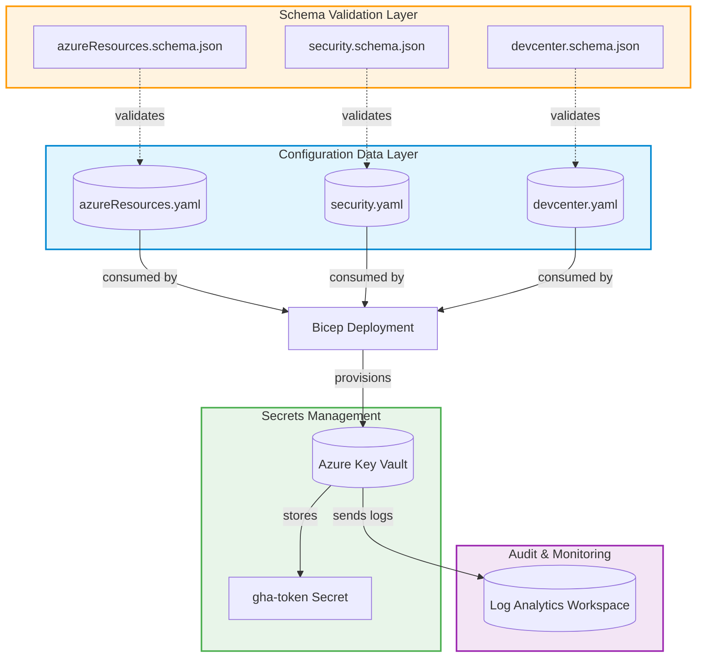
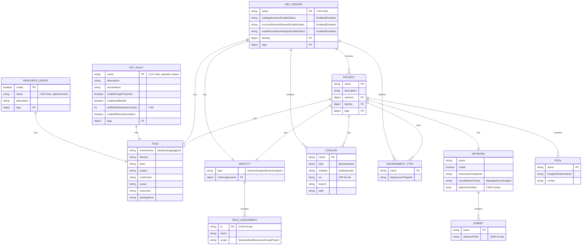
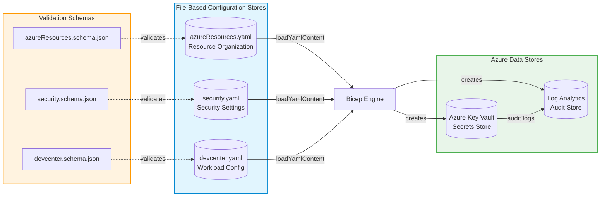
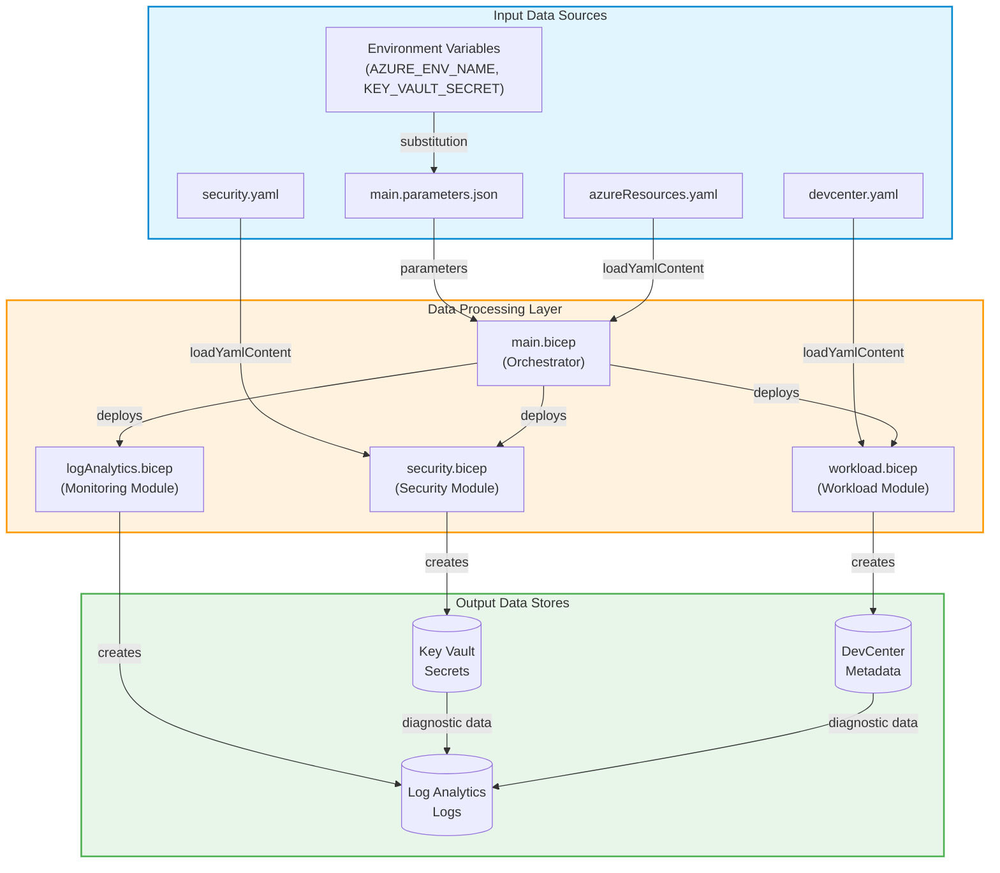
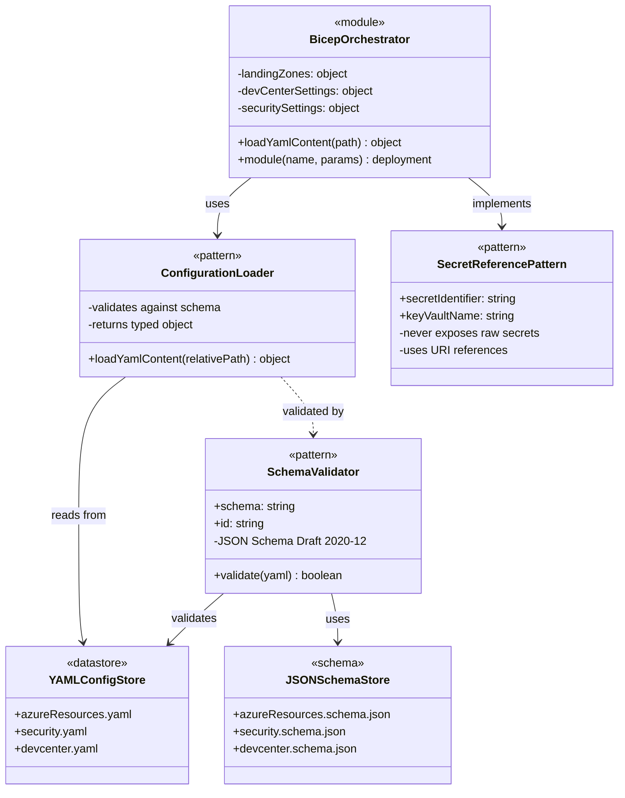

# Data Architecture

## Executive Summary

This document describes the Data Layer architecture for the DevExp-DevBox
accelerator, an infrastructure-as-code solution for provisioning Azure Dev Box
environments. The data architecture primarily consists of configuration schemas
(JSON Schema), configuration data stores (YAML files), and a secrets management
store (Azure Key Vault). Data flows are managed through infrastructure
deployment pipelines that consume configuration files and provision Azure
resources.

## Table of Contents

- [1. Overview](#1-overview)
  - [1.1 Purpose](#11-purpose)
  - [1.2 Scope](#12-scope)
  - [1.3 Data Architecture Diagram](#13-data-architecture-diagram)
- [2. Data Entities](#2-data-entities)
  - [2.1 Overview](#21-overview)
  - [2.2 Entity Diagram](#22-entity-diagram)
  - [2.3 Entity Catalog](#23-entity-catalog)
- [3. Data Stores](#3-data-stores)
  - [3.1 Overview](#31-overview)
  - [3.2 Storage Architecture Diagram](#32-storage-architecture-diagram)
  - [3.3 Store Catalog](#33-store-catalog)
- [4. Data Flows](#4-data-flows)
  - [4.1 Overview](#41-overview)
  - [4.2 Data Flow Diagram](#42-data-flow-diagram)
  - [4.3 Flow Catalog](#43-flow-catalog)
- [5. Data Access Patterns](#5-data-access-patterns)
  - [5.1 Overview](#51-overview)
  - [5.2 Pattern Diagram](#52-pattern-diagram)
  - [5.3 Pattern Catalog](#53-pattern-catalog)
- [6. Data Governance](#6-data-governance)
  - [6.1 Overview](#61-overview)
  - [6.2 Governance Components](#62-governance-components)
- [7. Appendix](#7-appendix)
  - [7.1 Glossary](#71-glossary)
  - [7.2 References](#72-references)

---

## 1. Overview

### 1.1 Purpose

The Data Architecture defines how configuration data, schemas, and secrets are
structured, stored, validated, and consumed within the DevExp-DevBox
accelerator. This architecture ensures consistent, validated, and secure data
management for infrastructure provisioning.

### 1.2 Scope

This document covers:

- **Data Entities**: Configuration schemas defining the structure of DevCenter,
  Security, and Resource Organization settings
- **Data Stores**: YAML configuration files and Azure Key Vault for secrets
  management
- **Data Flows**: Configuration data consumption during Bicep deployments
- **Data Schemas**: JSON Schema definitions for configuration validation
- **Data Access Patterns**: Bicep `loadYamlContent()` function for configuration
  consumption
- **Data Governance**: Schema validation, RBAC-based access control, and audit
  logging

### 1.3 Data Architecture Diagram

---

## 2. Data Entities

### 2.1 Overview

Data entities in this codebase are defined as **JSON Schema definitions** that
specify the structure, validation rules, and constraints for configuration data.
These schemas follow JSON Schema Draft 2020-12 standard and define the data
contracts for the infrastructure-as-code solution.

Three primary entity domains exist:

1. **Resource Organization Entities**: Define Azure resource group structures
   and tagging standards
2. **Security Entities**: Define Key Vault configuration and security settings
3. **Workload Entities**: Define DevCenter, Projects, Catalogs, Environment
   Types, and Pools

### 2.2 Entity Diagram

### 2.3 Entity Catalog

| Entity Name       | Description                                                                      | File Path                                                                                                                        | Relationships                                                       |
| ----------------- | -------------------------------------------------------------------------------- | -------------------------------------------------------------------------------------------------------------------------------- | ------------------------------------------------------------------- |
| `resourceGroup`   | Azure Resource Group configuration with create flag, name, description, and tags | [infra/settings/resourceOrganization/azureResources.schema.json](infra/settings/resourceOrganization/azureResources.schema.json) | Contains Tags                                                       |
| `tags`            | Azure resource tags for governance, cost management, and organization            | [infra/settings/resourceOrganization/azureResources.schema.json](infra/settings/resourceOrganization/azureResources.schema.json) | Used by ResourceGroup, KeyVault, DevCenter, Project                 |
| `keyVault`        | Azure Key Vault configuration including security settings and RBAC               | [infra/settings/security/security.schema.json](infra/settings/security/security.schema.json)                                     | Contains Tags                                                       |
| `devCenter`       | Microsoft Dev Center configuration with identity and feature toggles             | [infra/settings/workload/devcenter.schema.json](infra/settings/workload/devcenter.schema.json)                                   | Contains Identity, Tags, Catalogs, EnvironmentTypes, Projects       |
| `identity`        | Managed identity configuration for DevCenter and Projects                        | [infra/settings/workload/devcenter.schema.json](infra/settings/workload/devcenter.schema.json)                                   | Contains RoleAssignments                                            |
| `roleAssignment`  | Azure RBAC role assignment configuration                                         | [infra/settings/workload/devcenter.schema.json](infra/settings/workload/devcenter.schema.json)                                   | Referenced by Identity                                              |
| `catalog`         | Git repository catalog configuration for DevCenter                               | [infra/settings/workload/devcenter.schema.json](infra/settings/workload/devcenter.schema.json)                                   | Owned by DevCenter, Project                                         |
| `environmentType` | Deployment environment type configuration (dev, staging, UAT)                    | [infra/settings/workload/devcenter.schema.json](infra/settings/workload/devcenter.schema.json)                                   | Defined by DevCenter, used by Project                               |
| `project`         | DevCenter Project configuration with network, pools, and identity                | [infra/settings/workload/devcenter.schema.json](infra/settings/workload/devcenter.schema.json)                                   | Contains Network, Identity, Tags, Catalogs, EnvironmentTypes, Pools |
| `network`         | Virtual Network configuration for Project connectivity                           | [infra/settings/workload/devcenter.schema.json](infra/settings/workload/devcenter.schema.json)                                   | Contains Subnets, owned by Project                                  |
| `subnet`          | Subnet configuration within virtual networks                                     | [infra/settings/workload/devcenter.schema.json](infra/settings/workload/devcenter.schema.json)                                   | Owned by Network                                                    |
| `pool`            | Dev Box pool configuration for developer workstations                            | [infra/settings/workload/devcenter.schema.json](infra/settings/workload/devcenter.schema.json)                                   | Owned by Project                                                    |

---

## 3. Data Stores

### 3.1 Overview

The data storage architecture consists of two primary categories:

1. **Configuration Data Stores**: YAML files that persist infrastructure
   configuration settings, validated against JSON Schema definitions
2. **Secrets Data Store**: Azure Key Vault for secure storage of sensitive
   credentials (GitHub tokens, ADO PATs)

All data stores implement governance through:

- Schema validation for configuration files
- RBAC authorization for Key Vault access
- Diagnostic logging to Log Analytics

### 3.2 Storage Architecture Diagram

### 3.3 Store Catalog

| Store Name                | Type               | Technology                               | Purpose                                                                          | File Path                                                                                                          |
| ------------------------- | ------------------ | ---------------------------------------- | -------------------------------------------------------------------------------- | ------------------------------------------------------------------------------------------------------------------ |
| `azureResources.yaml`     | Configuration File | YAML                                     | Stores resource group definitions for workload, security, and monitoring         | [infra/settings/resourceOrganization/azureResources.yaml](infra/settings/resourceOrganization/azureResources.yaml) |
| `security.yaml`           | Configuration File | YAML                                     | Stores Key Vault configuration and security settings                             | [infra/settings/security/security.yaml](infra/settings/security/security.yaml)                                     |
| `devcenter.yaml`          | Configuration File | YAML                                     | Stores DevCenter, Projects, Catalogs, Environment Types, and Pools configuration | [infra/settings/workload/devcenter.yaml](infra/settings/workload/devcenter.yaml)                                   |
| `Azure Key Vault`         | Cloud Secret Store | Microsoft.KeyVault/vaults                | Secure storage for GitHub tokens and other credentials                           | [src/security/keyVault.bicep](src/security/keyVault.bicep)                                                         |
| `Key Vault Secret`        | Secret Entry       | Microsoft.KeyVault/vaults/secrets        | Stores the `gha-token` secret for GitHub authentication                          | [src/security/secret.bicep](src/security/secret.bicep)                                                             |
| `Log Analytics Workspace` | Audit Data Store   | Microsoft.OperationalInsights/workspaces | Centralized logging and monitoring data storage                                  | [src/management/logAnalytics.bicep](src/management/logAnalytics.bicep)                                             |

---

## 4. Data Flows

### 4.1 Overview

Data flows in this architecture follow a unidirectional pattern:

1. **Configuration Load Flow**: YAML configuration files are loaded into Bicep
   modules at deployment time using `loadYamlContent()`
2. **Secret Provisioning Flow**: Secrets are passed as secure parameters and
   stored in Key Vault
3. **Audit Logging Flow**: All Azure resources send diagnostic logs to Log
   Analytics Workspace

### 4.2 Data Flow Diagram

### 4.3 Flow Catalog

| Flow Name                  | Source                 | Target           | Type               | Description                                             | File Path                                                                        |
| -------------------------- | ---------------------- | ---------------- | ------------------ | ------------------------------------------------------- | -------------------------------------------------------------------------------- |
| Resource Organization Load | `azureResources.yaml`  | `main.bicep`     | Configuration Load | Loads resource group definitions into main orchestrator | [infra/main.bicep#L34](infra/main.bicep)                                         |
| Security Settings Load     | `security.yaml`        | `security.bicep` | Configuration Load | Loads Key Vault configuration into security module      | [src/security/security.bicep#L18](src/security/security.bicep)                   |
| DevCenter Settings Load    | `devcenter.yaml`       | `workload.bicep` | Configuration Load | Loads DevCenter and project configuration               | [src/workload/workload.bicep#L43](src/workload/workload.bicep)                   |
| Secret Value Flow          | `main.parameters.json` | Key Vault Secret | Secure Parameter   | Passes GitHub token from parameters to Key Vault        | [src/security/secret.bicep#L21](src/security/secret.bicep)                       |
| Key Vault Diagnostic Flow  | Azure Key Vault        | Log Analytics    | Audit Logging      | Sends Key Vault audit logs to centralized monitoring    | [src/security/secret.bicep#L32-L52](src/security/secret.bicep)                   |
| DevCenter Diagnostic Flow  | DevCenter              | Log Analytics    | Audit Logging      | Sends DevCenter operational logs to monitoring          | [src/workload/core/devCenter.bicep#L179-L197](src/workload/core/devCenter.bicep) |
| VNet Diagnostic Flow       | Virtual Network        | Log Analytics    | Audit Logging      | Sends network diagnostic data to monitoring             | [src/connectivity/vnet.bicep#L62-L79](src/connectivity/vnet.bicep)               |

---

## 5. Data Access Patterns

### 5.1 Overview

The codebase implements the following data access patterns:

1. **Configuration-as-Code Pattern**: YAML configuration files serve as the
   single source of truth, loaded at deployment time
2. **Immutable Infrastructure Pattern**: Configuration changes require
   redeployment; no runtime modifications
3. **Secrets Reference Pattern**: Key Vault secret URIs are passed between
   modules rather than actual secret values
4. **Declarative Schema Validation**: JSON Schema provides compile-time
   validation of configuration data

### 5.2 Pattern Diagram

### 5.3 Pattern Catalog

| Pattern                     | Implementation                               | Purpose                                             | File Path                                                                                                                                                                |
| --------------------------- | -------------------------------------------- | --------------------------------------------------- | ------------------------------------------------------------------------------------------------------------------------------------------------------------------------ |
| Configuration-as-Code       | `loadYamlContent()` Bicep function           | Loads YAML configuration at deployment time         | [infra/main.bicep#L34](infra/main.bicep), [src/workload/workload.bicep#L43](src/workload/workload.bicep), [src/security/security.bicep#L18](src/security/security.bicep) |
| JSON Schema Validation      | `$schema` directive in YAML files            | Validates configuration structure before deployment | [infra/settings/resourceOrganization/azureResources.yaml#L1](infra/settings/resourceOrganization/azureResources.yaml)                                                    |
| Secret Reference            | `@secure()` parameter decorator + secret URI | Passes secret references instead of values          | [src/security/secret.bicep#L6-L8](src/security/secret.bicep), [src/workload/workload.bicep#L14-L15](src/workload/workload.bicep)                                         |
| Typed Configuration         | Bicep `type` definitions                     | Enforces type safety for configuration objects      | [src/security/keyVault.bicep#L14-L36](src/security/keyVault.bicep), [src/workload/core/devCenter.bicep#L33-L148](src/workload/core/devCenter.bicep)                      |
| Existing Resource Reference | `existing` keyword in Bicep                  | References pre-existing Azure resources safely      | [src/security/security.bicep#L28-L31](src/security/security.bicep), [src/security/secret.bicep#L15-L18](src/security/secret.bicep)                                       |

---

## 6. Data Governance

### 6.1 Overview

Data governance in this architecture is implemented through multiple layers:

1. **Schema Validation**: JSON Schema definitions enforce data structure and
   constraints
2. **Type Safety**: Bicep type definitions provide compile-time validation
3. **Access Control**: Azure RBAC controls access to Key Vault secrets
4. **Audit Logging**: All data access is logged to Log Analytics Workspace
5. **Soft Delete Protection**: Key Vault implements soft delete and purge
   protection

### 6.2 Governance Components

| Component               | Purpose                                                | Implementation                                                             | File Path                                                                                                                                                                                                                                                                                                                      |
| ----------------------- | ------------------------------------------------------ | -------------------------------------------------------------------------- | ------------------------------------------------------------------------------------------------------------------------------------------------------------------------------------------------------------------------------------------------------------------------------------------------------------------------------ |
| JSON Schema Validation  | Validates YAML configuration structure and data types  | JSON Schema Draft 2020-12 with required fields, patterns, enums            | [infra/settings/resourceOrganization/azureResources.schema.json](infra/settings/resourceOrganization/azureResources.schema.json), [infra/settings/security/security.schema.json](infra/settings/security/security.schema.json), [infra/settings/workload/devcenter.schema.json](infra/settings/workload/devcenter.schema.json) |
| Bicep Type Definitions  | Compile-time type checking for configuration objects   | Custom Bicep types with `@description` annotations                         | [src/security/keyVault.bicep#L14-L36](src/security/keyVault.bicep), [src/workload/core/devCenter.bicep#L33-L148](src/workload/core/devCenter.bicep)                                                                                                                                                                            |
| RBAC Authorization      | Controls access to Key Vault secrets                   | `enableRbacAuthorization: true` in Key Vault config                        | [infra/settings/security/security.yaml#L26](infra/settings/security/security.yaml), [src/security/keyVault.bicep#L52](src/security/keyVault.bicep)                                                                                                                                                                             |
| Soft Delete Protection  | Prevents accidental permanent deletion of secrets      | `enableSoftDelete: true`, `softDeleteRetentionInDays: 7`                   | [infra/settings/security/security.yaml#L23-L25](infra/settings/security/security.yaml), [src/security/keyVault.bicep#L49-L50](src/security/keyVault.bicep)                                                                                                                                                                     |
| Purge Protection        | Prevents malicious purging of soft-deleted secrets     | `enablePurgeProtection: true`                                              | [infra/settings/security/security.yaml#L22](infra/settings/security/security.yaml), [src/security/keyVault.bicep#L48](src/security/keyVault.bicep)                                                                                                                                                                             |
| Diagnostic Logging      | Audit trail for all Key Vault operations               | Diagnostic settings to Log Analytics with `allLogs` category               | [src/security/secret.bicep#L32-L52](src/security/secret.bicep)                                                                                                                                                                                                                                                                 |
| Resource Tagging        | Governance metadata for cost allocation and ownership  | Mandatory tags: environment, division, team, project, costCenter, owner    | All YAML configuration files                                                                                                                                                                                                                                                                                                   |
| Name Pattern Validation | Ensures resource names follow Azure naming conventions | Regex patterns in JSON Schema (e.g., `^[a-zA-Z0-9-]{3,24}$` for Key Vault) | [infra/settings/security/security.schema.json#L67-L72](infra/settings/security/security.schema.json)                                                                                                                                                                                                                           |
| GUID Format Validation  | Ensures role IDs follow proper GUID format             | Regex pattern: `^[0-9a-fA-F]{8}-[0-9a-fA-F]{4}...`                         | [infra/settings/workload/devcenter.schema.json#L13-L17](infra/settings/workload/devcenter.schema.json)                                                                                                                                                                                                                         |

---

## 7. Appendix

### 7.1 Glossary

| Term                  | Definition                                                           |
| --------------------- | -------------------------------------------------------------------- |
| **Bicep**             | Domain-specific language for deploying Azure resources declaratively |
| **DevCenter**         | Microsoft Azure service for managing developer environments          |
| **Dev Box**           | Cloud-based developer workstation provisioned through DevCenter      |
| **Environment Type**  | Deployment target configuration (dev, staging, UAT, prod)            |
| **JSON Schema**       | Vocabulary for annotating and validating JSON/YAML documents         |
| **Key Vault**         | Azure service for securely storing secrets, keys, and certificates   |
| **Landing Zone**      | Azure environment configuration following Cloud Adoption Framework   |
| **Log Analytics**     | Azure service for collecting and analyzing operational data          |
| **loadYamlContent()** | Bicep function that loads and parses YAML files at deployment time   |
| **Pool**              | Collection of Dev Boxes with identical configuration                 |
| **RBAC**              | Role-Based Access Control for Azure resource authorization           |
| **Soft Delete**       | Feature allowing recovery of deleted Key Vault objects               |

### 7.2 References

| Reference                      | URL                                                                                    |
| ------------------------------ | -------------------------------------------------------------------------------------- |
| Azure Dev Box Documentation    | <https://learn.microsoft.com/en-us/azure/dev-box/>                                     |
| Azure Key Vault Best Practices | <https://learn.microsoft.com/en-us/azure/key-vault/general/best-practices>             |
| Azure Landing Zones            | <https://learn.microsoft.com/en-us/azure/cloud-adoption-framework/ready/landing-zone/> |
| Bicep Documentation            | <https://learn.microsoft.com/en-us/azure/azure-resource-manager/bicep/>                |
| JSON Schema Specification      | <https://json-schema.org/draft/2020-12/schema>                                         |
| DevExp-DevBox Accelerator      | <https://evilazaro.github.io/DevExp-DevBox/>                                           |
| TOGAF 10 Framework             | <https://www.opengroup.org/togaf>                                                      |
