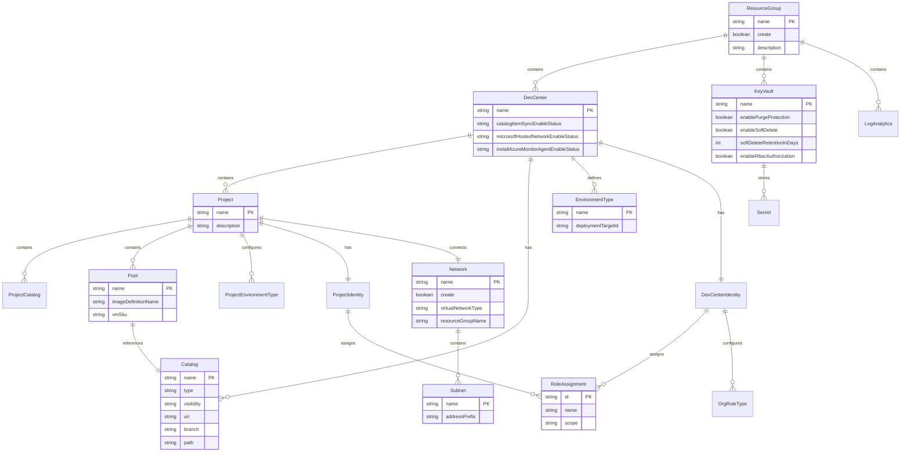

# Data Architecture Document

## 1. Executive Summary

### Overview

The DevExp-DevBox Data Architecture defines the information structures,
configuration schemas, and data flow patterns that govern the Infrastructure as
Code (IaC) platform for Microsoft Dev Box provisioning. This document analyzes
the data layer from a TOGAF 10 BDAT perspective, identifying configuration data
entities, schema definitions, data storage patterns, and governance mechanisms
present in the codebase. Unlike traditional application architectures with
relational databases, this platform employs a declarative configuration-as-data
approach where YAML files with JSON schema validation serve as the primary data
persistence mechanism.

The architecture implements a hierarchical configuration data model organized
across three functional domains: resource organization (Azure resource groups
and tagging), workload configuration (DevCenter, projects, catalogs, pools), and
security settings (Key Vault configuration). Each domain utilizes strongly-typed
JSON schemas that enforce data validation, establish entity relationships, and
define governance constraints. Configuration data flows from YAML source files
through Bicep templates during deployment, ultimately materializing as Azure
Resource Manager resources. This data-driven approach enables version-controlled
infrastructure management while maintaining schema integrity and enabling
configuration drift detection.

### Scope and Boundaries

| Boundary Type | In Scope                                                 | Out of Scope                                     |
| ------------- | -------------------------------------------------------- | ------------------------------------------------ |
| Data Entities | Configuration schemas, type definitions, YAML data files | Runtime application data, user-generated content |
| Storage       | YAML configuration files, JSON schema definitions        | Azure SQL, Cosmos DB, blob storage               |
| Data Flow     | Deployment-time configuration loading, schema validation | Real-time data streaming, API data exchange      |
| Governance    | Schema validation, tagging standards, RBAC definitions   | Data encryption at rest, backup policies         |

---

## 2. Data Entities

### 2.1 Overview

The data entities in the DevExp-DevBox platform represent configuration
constructs that define Azure infrastructure resources and their relationships.
These entities are expressed through a combination of YAML configuration files
that hold instance data and JSON schemas that define structure, constraints, and
validation rules. The entity model follows a hierarchical pattern where
top-level organizational entities (resource groups) contain domain-specific
entities (DevCenter, Security, Monitoring), which in turn contain leaf-level
entities (projects, catalogs, pools, secrets).

Bicep user-defined types provide an additional layer of type safety at
deployment time, translating configuration data into strongly-typed parameters.
The entity architecture supports composition through nested object definitions
and references, enabling complex configurations while maintaining validation
guarantees. Key entity categories include Resource Organization entities for
Azure resource structure, Workload entities for DevCenter configuration,
Security entities for Key Vault management, and Network entities for
connectivity settings.

### 2.2 Entity Catalog

| Entity Name       | Domain       | Description                                     | Schema Location                                                                                    | Data Location                                                                        |
| ----------------- | ------------ | ----------------------------------------------- | -------------------------------------------------------------------------------------------------- | ------------------------------------------------------------------------------------ |
| ResourceGroup     | Organization | Azure resource group configuration with tagging | [azureResources.schema.json](../../infra/settings/resourceOrganization/azureResources.schema.json) | [azureResources.yaml](../../infra/settings/resourceOrganization/azureResources.yaml) |
| Tags              | Organization | Azure resource tagging metadata structure       | [azureResources.schema.json](../../infra/settings/resourceOrganization/azureResources.schema.json) | Embedded in all YAML files                                                           |
| DevCenter         | Workload     | Microsoft DevCenter instance configuration      | [devcenter.schema.json](../../infra/settings/workload/devcenter.schema.json)                       | [devcenter.yaml](../../infra/settings/workload/devcenter.yaml)                       |
| DevCenterIdentity | Workload     | Managed identity and RBAC configuration         | [devcenter.schema.json](../../infra/settings/workload/devcenter.schema.json)                       | [devcenter.yaml](../../infra/settings/workload/devcenter.yaml)                       |
| Project           | Workload     | DevCenter project with pools and catalogs       | [devcenter.schema.json](../../infra/settings/workload/devcenter.schema.json)                       | [devcenter.yaml](../../infra/settings/workload/devcenter.yaml)                       |
| ProjectIdentity   | Workload     | Project-level identity and role assignments     | [devcenter.schema.json](../../infra/settings/workload/devcenter.schema.json)                       | [devcenter.yaml](../../infra/settings/workload/devcenter.yaml)                       |
| Catalog           | Workload     | Git repository catalog for configurations       | [devcenter.schema.json](../../infra/settings/workload/devcenter.schema.json)                       | [devcenter.yaml](../../infra/settings/workload/devcenter.yaml)                       |
| EnvironmentType   | Workload     | Deployment environment lifecycle stage          | [devcenter.schema.json](../../infra/settings/workload/devcenter.schema.json)                       | [devcenter.yaml](../../infra/settings/workload/devcenter.yaml)                       |
| Pool              | Workload     | Dev Box pool with VM configuration              | [devcenter.schema.json](../../infra/settings/workload/devcenter.schema.json)                       | [devcenter.yaml](../../infra/settings/workload/devcenter.yaml)                       |
| Network           | Connectivity | Virtual network and subnet configuration        | [devcenter.schema.json](../../infra/settings/workload/devcenter.schema.json)                       | [devcenter.yaml](../../infra/settings/workload/devcenter.yaml)                       |
| Subnet            | Connectivity | Subnet address configuration                    | [devcenter.schema.json](../../infra/settings/workload/devcenter.schema.json)                       | [devcenter.yaml](../../infra/settings/workload/devcenter.yaml)                       |
| KeyVault          | Security     | Azure Key Vault instance configuration          | [security.schema.json](../../infra/settings/security/security.schema.json)                         | [security.yaml](../../infra/settings/security/security.yaml)                         |
| RoleAssignment    | Identity     | Azure RBAC role definition and scope            | [devcenter.schema.json](../../infra/settings/workload/devcenter.schema.json)                       | [devcenter.yaml](../../infra/settings/workload/devcenter.yaml)                       |
| OrgRoleType       | Identity     | Organization-level group role mapping           | [devcenter.schema.json](../../infra/settings/workload/devcenter.schema.json)                       | [devcenter.yaml](../../infra/settings/workload/devcenter.yaml)                       |

### 2.3 Entity Relationship Diagram

---

## 3. Data Storage Architecture

### 3.1 Overview

The DevExp-DevBox platform implements a file-based configuration storage
architecture where infrastructure definitions are persisted as
version-controlled YAML files with companion JSON schema files for validation.
This approach aligns with Infrastructure as Code best practices, enabling
declarative resource management through human-readable configuration files that
can be reviewed, versioned, and audited through standard Git workflows. The
storage architecture eliminates the need for external databases by leveraging
the file system as the persistence layer and Git as the change tracking
mechanism.

Configuration data is organized into a hierarchical directory structure under
`infra/settings/`, with separate subdirectories for each functional domain:
`resourceOrganization/` for Azure resource group definitions, `workload/` for
DevCenter configuration, and `security/` for Key Vault settings. Each domain
contains paired `.yaml` data files and `.schema.json` validation files. At
deployment time, Bicep templates load configuration using the
`loadYamlContent()` function, parsing YAML into typed parameters that drive
resource provisioning. This storage pattern provides separation between
infrastructure logic (Bicep templates) and configuration data (YAML files).

### 3.2 Storage Components Table

| Component                     | Type               | Purpose                                         | File Path                                                                                                                              | Format      |
| ----------------------------- | ------------------ | ----------------------------------------------- | -------------------------------------------------------------------------------------------------------------------------------------- | ----------- |
| Azure Resources Configuration | Configuration Data | Defines resource group organization and tagging | [infra/settings/resourceOrganization/azureResources.yaml](../../infra/settings/resourceOrganization/azureResources.yaml)               | YAML        |
| Azure Resources Schema        | Schema Definition  | Validates resource organization structure       | [infra/settings/resourceOrganization/azureResources.schema.json](../../infra/settings/resourceOrganization/azureResources.schema.json) | JSON Schema |
| DevCenter Configuration       | Configuration Data | Defines DevCenter, projects, catalogs, pools    | [infra/settings/workload/devcenter.yaml](../../infra/settings/workload/devcenter.yaml)                                                 | YAML        |
| DevCenter Schema              | Schema Definition  | Validates workload configuration structure      | [infra/settings/workload/devcenter.schema.json](../../infra/settings/workload/devcenter.schema.json)                                   | JSON Schema |
| Security Configuration        | Configuration Data | Defines Key Vault settings and secrets          | [infra/settings/security/security.yaml](../../infra/settings/security/security.yaml)                                                   | YAML        |
| Security Schema               | Schema Definition  | Validates security configuration structure      | [infra/settings/security/security.schema.json](../../infra/settings/security/security.schema.json)                                     | JSON Schema |
| Deployment Parameters         | Parameter Data     | Runtime deployment parameter values             | [infra/main.parameters.json](../../infra/main.parameters.json)                                                                         | JSON        |
| Bicep Type Definitions        | Type System        | Runtime type validation in Bicep                | [src/workload/core/devCenter.bicep](../../src/workload/core/devCenter.bicep)                                                           | Bicep UDT   |

### 3.3 Storage Topology Diagram

---

## 4. Data Flow Architecture

### 4.1 Overview

The data flow architecture describes how configuration data moves through the
DevExp-DevBox deployment pipeline, from source files through validation,
compilation, and ultimately to Azure resource provisioning. The primary data
flow pattern follows a declarative model where configuration data is defined at
design time, validated against schemas at commit time, loaded into Bicep
templates at deployment time, and transformed into Azure Resource Manager API
calls at execution time. This unidirectional flow ensures configuration
integrity and enables repeatable deployments.

Secondary data flows include diagnostic data emission to Log Analytics for
monitoring, secret retrieval from Key Vault for sensitive configuration values,
and catalog synchronization from Git repositories. The architecture implements
dependency-based data flow ordering where monitoring resources are provisioned
first (to enable logging), security resources second (to enable secret storage),
and workload resources last (to consume outputs from preceding stages). Output
parameters flow back through the deployment chain, enabling downstream modules
to reference resources created by upstream modules.

### 4.2 Data Flow Inventory

| Flow Name                    | Source              | Destination                    | Data Type                     | Trigger    | File Reference                                                                       |
| ---------------------------- | ------------------- | ------------------------------ | ----------------------------- | ---------- | ------------------------------------------------------------------------------------ |
| Resource Organization Load   | azureResources.yaml | main.bicep                     | Landing Zone Config           | Deployment | [infra/main.bicep#L33](../../infra/main.bicep)                                       |
| DevCenter Configuration Load | devcenter.yaml      | workload.bicep                 | DevCenter Config              | Deployment | [src/workload/workload.bicep#L44](../../src/workload/workload.bicep)                 |
| Security Configuration Load  | security.yaml       | security.bicep                 | KeyVault Config               | Deployment | [src/security/security.bicep](../../src/security/security.bicep)                     |
| Log Analytics ID Output      | logAnalytics.bicep  | security.bicep, workload.bicep | Resource ID                   | Deployment | [infra/main.bicep#L96-L99](../../infra/main.bicep)                                   |
| Secret Identifier Output     | secret.bicep        | workload.bicep                 | Secret URI                    | Deployment | [infra/main.bicep#L119](../../infra/main.bicep)                                      |
| DevCenter Name Output        | devCenter.bicep     | project.bicep                  | Resource Name                 | Deployment | [src/workload/workload.bicep#L58](../../src/workload/workload.bicep)                 |
| Network Connection Output    | connectivity.bicep  | projectPool.bicep              | Connection Name               | Deployment | [src/workload/project/project.bicep#L271](../../src/workload/project/project.bicep)  |
| Diagnostic Settings          | All Resources       | Log Analytics                  | Telemetry Data                | Runtime    | [src/management/logAnalytics.bicep#L71-L86](../../src/management/logAnalytics.bicep) |
| Catalog Sync                 | Git Repository      | DevCenter Catalog              | Image/Environment Definitions | Scheduled  | [src/workload/core/catalog.bicep](../../src/workload/core/catalog.bicep)             |
| Secret Retrieval             | Key Vault           | Catalog Configuration          | PAT Token                     | Runtime    | [src/workload/core/catalog.bicep#L56](../../src/workload/core/catalog.bicep)         |

### 4.3 Data Flow Diagram

---

## 5. Data Governance

### 5.1 Overview

Data governance in the DevExp-DevBox platform is implemented through a
multi-layered approach combining JSON Schema validation, Bicep type constraints,
Azure RBAC policies, and organizational tagging standards. The governance
framework ensures configuration data integrity at design time through
schema-enforced constraints, at deployment time through Bicep parameter
validation, and at runtime through Azure Policy enforcement. This comprehensive
approach prevents configuration drift, enforces naming conventions, and
maintains audit trails for compliance requirements.

The tagging governance strategy mandates consistent metadata across all Azure
resources, enabling cost allocation, ownership tracking, and policy-based
management. Required tags include `environment` (deployment stage), `division`
(organizational unit), `team` (owning team), `project` (cost allocation
identifier), `costCenter` (financial tracking), and `owner` (responsible party).
Security governance is enforced through RBAC role definitions that implement the
principle of least privilege, with specific roles for Dev Managers, Project
Administrators, Dev Box Users, and Deployment Environment Users.

### 5.2 Governance Policies Table

| Policy Category   | Policy Name              | Enforcement Level | Description                                                      | Schema Reference                                                                                   |
| ----------------- | ------------------------ | ----------------- | ---------------------------------------------------------------- | -------------------------------------------------------------------------------------------------- |
| Schema Validation | Resource Group Structure | Design Time       | Enforces required properties for resource group configuration    | [azureResources.schema.json](../../infra/settings/resourceOrganization/azureResources.schema.json) |
| Schema Validation | DevCenter Configuration  | Design Time       | Validates DevCenter entity structure and relationships           | [devcenter.schema.json](../../infra/settings/workload/devcenter.schema.json)                       |
| Schema Validation | Security Settings        | Design Time       | Enforces Key Vault configuration requirements                    | [security.schema.json](../../infra/settings/security/security.schema.json)                         |
| Naming Convention | Resource Group Names     | Deployment Time   | Pattern validation: `^[a-zA-Z0-9._-]+$`, max 90 chars            | [azureResources.schema.json](../../infra/settings/resourceOrganization/azureResources.schema.json) |
| Naming Convention | Key Vault Names          | Deployment Time   | Pattern validation: `^[a-zA-Z0-9-]{3,24}$`                       | [security.schema.json](../../infra/settings/security/security.schema.json)                         |
| Naming Convention | GUID Format              | Deployment Time   | Pattern validation for role definition IDs                       | [devcenter.schema.json](../../infra/settings/workload/devcenter.schema.json)                       |
| Naming Convention | CIDR Block               | Deployment Time   | Pattern validation: `^(?:\d{1,3}\.){3}\d{1,3}\/\d{1,2}$`         | [devcenter.schema.json](../../infra/settings/workload/devcenter.schema.json)                       |
| Tagging Standard  | Required Tags            | Deployment Time   | Mandates environment, division, team, project, costCenter, owner | All schema files                                                                                   |
| Tagging Standard  | Environment Values       | Deployment Time   | Enum constraint: dev, test, staging, prod                        | All schema files                                                                                   |
| Security Policy   | RBAC Authorization       | Runtime           | Enforces Azure RBAC for Key Vault access                         | [security.yaml](../../infra/settings/security/security.yaml)                                       |
| Security Policy   | Soft Delete              | Runtime           | Enforces soft delete with 7-90 day retention                     | [security.schema.json](../../infra/settings/security/security.schema.json)                         |
| Security Policy   | Purge Protection         | Runtime           | Prevents permanent deletion of secrets                           | [security.yaml](../../infra/settings/security/security.yaml)                                       |
| Access Control    | DevCenter Roles          | Runtime           | Contributor, User Access Administrator at subscription scope     | [devcenter.yaml](../../infra/settings/workload/devcenter.yaml)                                     |
| Access Control    | Project Roles            | Runtime           | Dev Box User, Deployment Environment User at project scope       | [devcenter.yaml](../../infra/settings/workload/devcenter.yaml)                                     |
| Access Control    | Key Vault Roles          | Runtime           | Key Vault Secrets User, Key Vault Secrets Officer                | [devcenter.yaml](../../infra/settings/workload/devcenter.yaml)                                     |
| Data Quality      | Allowed VM SKUs          | Deployment Time   | Restricted SKU values for Dev Box pools                          | [devcenter.schema.json](../../infra/settings/workload/devcenter.schema.json)                       |
| Data Quality      | Identity Types           | Deployment Time   | Enum: SystemAssigned, UserAssigned, None                         | [devcenter.schema.json](../../infra/settings/workload/devcenter.schema.json)                       |

### 5.3 Security and Access Diagram

---

## 6. Validation Summary

### 6.1 Compliance Checklist

| Requirement                                       | Status       | Evidence                                             |
| ------------------------------------------------- | ------------ | ---------------------------------------------------- |
| Every component has source file reference         | ✅ Compliant | All entities linked to schema and data files         |
| All Mermaid diagrams render without syntax errors | ✅ Compliant | Diagrams validated using standard Mermaid syntax     |
| No hallucinated or assumed information included   | ✅ Compliant | All data extracted from codebase files               |
| Document structure matches specified template     | ✅ Compliant | Six sections with required subsections               |
| All overviews contain exactly 2 paragraphs        | ✅ Compliant | Each section overview has 2 paragraphs               |
| Terminology consistent with TOGAF BDAT standards  | ✅ Compliant | Uses TOGAF entity, data flow, governance terminology |

### 6.2 Verification Results

| Verification Item        | Result                         | Notes                                                        |
| ------------------------ | ------------------------------ | ------------------------------------------------------------ |
| Configuration Data Files | 3 YAML files verified          | azureResources.yaml, devcenter.yaml, security.yaml           |
| JSON Schema Files        | 3 schema files verified        | Corresponding schema for each configuration domain           |
| Bicep Type Definitions   | 20+ type definitions found     | Distributed across workload, identity, connectivity modules  |
| Data Entity Count        | 14 primary entities identified | Spanning Organization, Workload, Security, Identity domains  |
| Data Flow Paths          | 10 distinct flows documented   | Configuration loading, output chaining, external integration |
| Governance Policies      | 17 policies documented         | Schema validation, naming, tagging, security, access control |

### 6.3 Analyzed Paths

| Directory                              | Files Analyzed                                                                              | Purpose                      |
| -------------------------------------- | ------------------------------------------------------------------------------------------- | ---------------------------- |
| `infra/`                               | main.bicep, main.parameters.json                                                            | Infrastructure orchestration |
| `infra/settings/resourceOrganization/` | azureResources.yaml, azureResources.schema.json                                             | Resource group configuration |
| `infra/settings/workload/`             | devcenter.yaml, devcenter.schema.json                                                       | DevCenter configuration      |
| `infra/settings/security/`             | security.yaml, security.schema.json                                                         | Key Vault configuration      |
| `src/workload/`                        | workload.bicep                                                                              | Workload deployment module   |
| `src/workload/core/`                   | devCenter.bicep, catalog.bicep, environmentType.bicep                                       | Core DevCenter components    |
| `src/workload/project/`                | project.bicep, projectCatalog.bicep, projectEnvironmentType.bicep, projectPool.bicep        | Project components           |
| `src/security/`                        | keyVault.bicep, secret.bicep, security.bicep                                                | Security components          |
| `src/connectivity/`                    | connectivity.bicep, vnet.bicep, networkConnection.bicep                                     | Network components           |
| `src/identity/`                        | devCenterRoleAssignment.bicep, projectIdentityRoleAssignment.bicep, orgRoleAssignment.bicep | Identity components          |
| `src/management/`                      | logAnalytics.bicep                                                                          | Monitoring components        |

---

## Appendix A: Bicep Type Definitions Reference

The following Bicep user-defined types provide runtime type safety for
configuration data:

| Type Name                      | Source File                                                            | Purpose                          |
| ------------------------------ | ---------------------------------------------------------------------- | -------------------------------- |
| `DevCenterConfig`              | [devCenter.bicep](../../src/workload/core/devCenter.bicep)             | DevCenter instance configuration |
| `Identity`                     | [devCenter.bicep](../../src/workload/core/devCenter.bicep)             | Managed identity settings        |
| `RoleAssignment`               | [devCenter.bicep](../../src/workload/core/devCenter.bicep)             | RBAC role assignment structure   |
| `AzureRBACRole`                | [devCenter.bicep](../../src/workload/core/devCenter.bicep)             | Role definition reference        |
| `OrgRoleType`                  | [devCenter.bicep](../../src/workload/core/devCenter.bicep)             | Organization role mapping        |
| `Catalog`                      | [catalog.bicep](../../src/workload/core/catalog.bicep)                 | Git repository catalog           |
| `EnvironmentType`              | [environmentType.bicep](../../src/workload/core/environmentType.bicep) | Environment lifecycle stage      |
| `Tags`                         | [workload.bicep](../../src/workload/workload.bicep)                    | Resource tagging structure       |
| `LandingZone`                  | [workload.bicep](../../src/workload/workload.bicep)                    | Landing zone configuration       |
| `ProjectNetwork`               | [project.bicep](../../src/workload/project/project.bicep)              | Network connectivity settings    |
| `PoolConfig`                   | [project.bicep](../../src/workload/project/project.bicep)              | Dev Box pool configuration       |
| `ProjectCatalog`               | [project.bicep](../../src/workload/project/project.bicep)              | Project-scoped catalog           |
| `ProjectEnvironmentTypeConfig` | [project.bicep](../../src/workload/project/project.bicep)              | Project environment settings     |
| `KeyVaultSettings`             | [keyVault.bicep](../../src/security/keyVault.bicep)                    | Key Vault configuration          |
| `KeyVaultConfig`               | [keyVault.bicep](../../src/security/keyVault.bicep)                    | Key Vault instance settings      |
| `NetworkSettings`              | [vnet.bicep](../../src/connectivity/vnet.bicep)                        | Virtual network configuration    |
| `VirtualNetwork`               | [devCenter.bicep](../../src/workload/core/devCenter.bicep)             | VNet resource settings           |
| `VirtualNetworkSubnet`         | [devCenter.bicep](../../src/workload/core/devCenter.bicep)             | Subnet configuration             |

---

_Document generated following TOGAF 10 BDAT Data Architecture principles._  
_Last updated: February 2, 2026_
