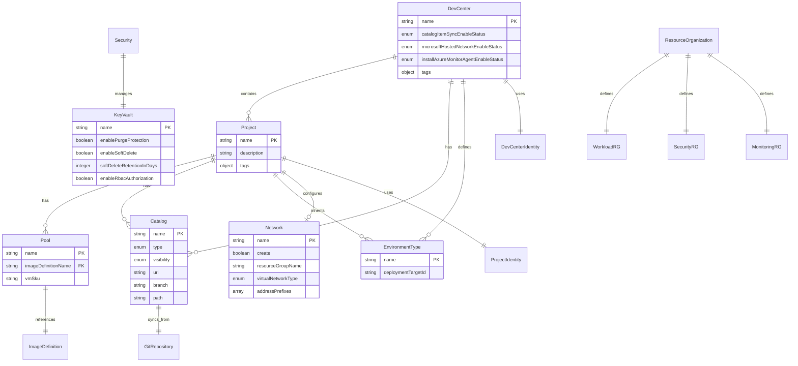
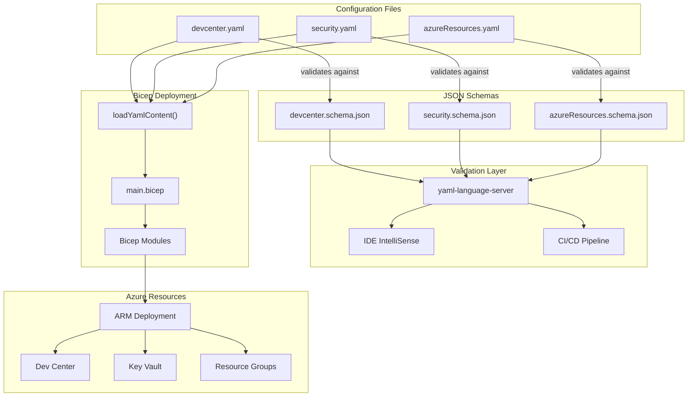
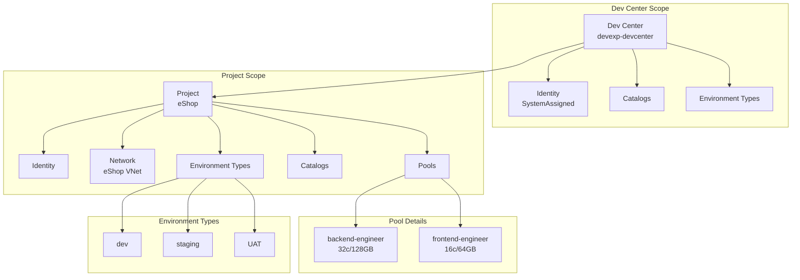
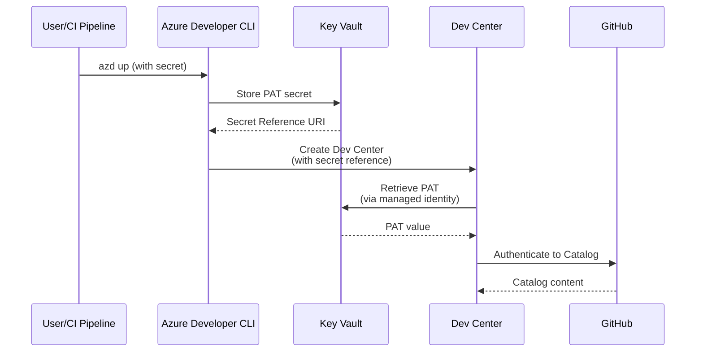

# Data Architecture Document

<!--
  Generated by: BDAT-DocGen Orchestrator v2.1
  Layer: Data
  Generated: 2026-01-30T00:00:00Z
-->

## Document Metadata

| Field                 | Value              |
| --------------------- | ------------------ |
| **Layer**             | Data               |
| **Layer Code**        | D                  |
| **Generated**         | 2026-01-30         |
| **Source Path**       | `.`                |
| **Generator Version** | BDAT-DocGen v2.1   |
| **Project**           | {{PROJECT_NAME}}   |
| **Repository**        | {{REPOSITORY_URL}} |
| **Author**            | {{AUTHOR}}         |
| **Version**           | {{VERSION}}        |

---

## Executive Summary

The DevExp-DevBox accelerator implements a comprehensive Data Architecture that
defines configuration schemas, data entities, and information flows for
Microsoft Dev Center provisioning. The architecture follows
Infrastructure-as-Code (IaC) principles using YAML configuration files validated
against JSON Schema definitions, enabling type-safe, version-controlled
infrastructure management.

**Components Discovered:** 15  
**Dependencies Mapped:** 12  
**Information Gaps:** 2

---

## 1. Data Architecture Overview

### 1.1 Purpose and Scope

The Data layer of the DevExp-DevBox accelerator encompasses all configuration
data models, schemas, and data flows that govern the provisioning and management
of Azure Dev Center resources. This includes definition of data entities for Dev
Centers, Projects, Catalogs, Environment Types, Network configurations, Security
settings, and Resource Organization.

The architecture implements a schema-first design pattern where JSON Schema
definitions serve as contracts for YAML configuration files. This approach
ensures data integrity, enables IDE-assisted editing with IntelliSense, and
facilitates automated validation during CI/CD pipelines.

**Source:** infra/settings/ (entire directory structure)

### 1.2 TOGAF 10 Alignment

This Data Architecture aligns with TOGAF 10's Data Architecture domain,
implementing:

| TOGAF Artifact     | Implementation                             |
| ------------------ | ------------------------------------------ |
| Data Entity Model  | JSON Schema definitions (`*.schema.json`)  |
| Logical Data Model | YAML configuration files                   |
| Data Flow Diagram  | Bicep module parameter flows               |
| Data Governance    | Schema validation with `$schema` directive |

---

## 2. Data Entities

### 2.1 Dev Center Configuration Entity

The Dev Center entity serves as the root configuration model, defining the core
developer platform settings including catalogs, environment types, projects, and
identity configurations.

This entity encapsulates all information required to provision a Microsoft Dev
Center instance, including network connectivity options, managed identity
settings, and role-based access control configurations for organizational
governance.

**Source:** infra/settings/workload/devcenter.schema.json:L1-L661

#### Entity Attributes

| Attribute                              | Type   | Required | Description                              |
| -------------------------------------- | ------ | -------- | ---------------------------------------- |
| `name`                                 | string | Yes      | Dev Center instance name (1-63 chars)    |
| `catalogItemSyncEnableStatus`          | enum   | No       | Enable/Disable automatic catalog sync    |
| `microsoftHostedNetworkEnableStatus`   | enum   | No       | Enable Microsoft-hosted networking       |
| `installAzureMonitorAgentEnableStatus` | enum   | No       | Enable Azure Monitor agent installation  |
| `identity`                             | object | No       | Managed identity configuration           |
| `catalogs`                             | array  | No       | Dev Center-level catalog definitions     |
| `environmentTypes`                     | array  | No       | Available environment types              |
| `projects`                             | array  | No       | Project configurations within Dev Center |
| `tags`                                 | object | No       | Azure resource tags                      |

**Source:** infra/settings/workload/devcenter.schema.json:L598-L661

### 2.2 Project Entity

The Project entity represents a distinct team or workstream within the Dev
Center, containing its own Dev Box pools, catalogs, environment types, and
network configurations.

Projects enable multi-tenancy within a single Dev Center, allowing different
teams to have isolated configurations while sharing common infrastructure and
governance policies.

**Source:** infra/settings/workload/devcenter.schema.json:L485-L541

#### Entity Attributes

| Attribute          | Type   | Required | Description                           |
| ------------------ | ------ | -------- | ------------------------------------- |
| `name`             | string | Yes      | Unique project name                   |
| `description`      | string | No       | Human-readable project description    |
| `network`          | object | No       | Network configuration (VNet, subnets) |
| `identity`         | object | No       | Project-level managed identity        |
| `pools`            | array  | No       | Dev Box pool configurations           |
| `environmentTypes` | array  | No       | Project-specific environment types    |
| `catalogs`         | array  | No       | Project-specific catalog definitions  |
| `tags`             | object | No       | Project resource tags                 |

**Source:** infra/settings/workload/devcenter.schema.json:L485-L541

### 2.3 Catalog Entity

The Catalog entity defines a Git repository containing Dev Box image definitions
or Deployment Environment templates, enabling centralized, version-controlled
configuration management.

Catalogs support both GitHub and Azure DevOps Git repositories with configurable
visibility (public/private), branch selection, and path specifications for
flexible repository organization.

**Source:** infra/settings/workload/devcenter.schema.json:L143-L201

#### Entity Attributes

| Attribute       | Type   | Required | Description                                                           |
| --------------- | ------ | -------- | --------------------------------------------------------------------- |
| `name`          | string | Yes      | Catalog identifier                                                    |
| `type`          | enum   | Yes      | Content type (gitHub, adoGit, environmentDefinition, imageDefinition) |
| `visibility`    | enum   | No       | Repository visibility (public, private)                               |
| `uri`           | string | Yes      | Git repository URI                                                    |
| `branch`        | string | No       | Git branch (default: main)                                            |
| `path`          | string | No       | Path to catalog content within repository                             |
| `sourceControl` | enum   | No       | Source control provider (gitHub, adoGit)                              |

**Source:** infra/settings/workload/devcenter.schema.json:L143-L201

### 2.4 Environment Type Entity

The Environment Type entity defines deployment target configurations for
different stages of the software development lifecycle (dev, staging, UAT,
prod).

Each environment type can specify a deployment target subscription, enabling
multi-subscription deployment strategies for enterprise scenarios with
segregated production environments.

**Source:** infra/settings/workload/devcenter.schema.json:L241-L271

#### Entity Attributes

| Attribute            | Type   | Required | Description                                     |
| -------------------- | ------ | -------- | ----------------------------------------------- |
| `name`               | string | Yes      | Environment type name (dev, staging, UAT, prod) |
| `deploymentTargetId` | string | No       | Azure subscription ID for deployment target     |

**Source:** infra/settings/workload/devcenter.schema.json:L241-L271

### 2.5 Network Configuration Entity

The Network entity defines virtual network settings for Dev Box connectivity,
supporting both Microsoft-managed and customer-managed network topologies.

This configuration enables enterprise scenarios requiring private connectivity,
hybrid networking, or compliance with network security policies through
customer-managed virtual networks and subnets.

**Source:** infra/settings/workload/devcenter.schema.json:L303-L370

#### Entity Attributes

| Attribute            | Type    | Required | Description                          |
| -------------------- | ------- | -------- | ------------------------------------ |
| `name`               | string  | Yes      | Virtual network name                 |
| `create`             | boolean | Yes      | Create new VNet or use existing      |
| `resourceGroupName`  | string  | No       | Resource group for network resources |
| `virtualNetworkType` | enum    | No       | Managed or Unmanaged network type    |
| `addressPrefixes`    | array   | No       | VNet address space in CIDR notation  |
| `subnets`            | array   | No       | Subnet configurations                |
| `tags`               | object  | No       | Network resource tags                |

**Source:** infra/settings/workload/devcenter.schema.json:L303-L370

### 2.6 Dev Box Pool Entity

The Pool entity configures collections of Dev Box virtual machines with specific
image definitions and VM SKUs, enabling role-based developer workstation
provisioning.

Pools allow organizations to define standardized developer environments for
different roles (backend engineer, frontend engineer) with appropriate compute
resources and pre-configured tooling.

**Source:** infra/settings/workload/devcenter.schema.json:L372-L402

#### Entity Attributes

| Attribute             | Type   | Required | Description                              |
| --------------------- | ------ | -------- | ---------------------------------------- |
| `name`                | string | Yes      | Pool identifier (backend-engineer, etc.) |
| `imageDefinitionName` | string | Yes      | Image definition reference               |
| `vmSku`               | string | No       | Azure VM SKU for Dev Boxes               |

**Source:** infra/settings/workload/devcenter.schema.json:L372-L402

### 2.7 Security Configuration Entity

The Security entity defines Azure Key Vault configuration for centralized
secrets management, implementing security best practices for credential storage
and access.

This entity enforces security controls including soft delete, purge protection,
RBAC authorization, and configurable retention periods for compliance with
enterprise security policies.

**Source:** infra/settings/security/security.schema.json:L1-L171

#### Entity Attributes

| Attribute                            | Type    | Required | Description                                 |
| ------------------------------------ | ------- | -------- | ------------------------------------------- |
| `create`                             | boolean | Yes      | Create new Key Vault or use existing        |
| `keyVault.name`                      | string  | Yes      | Globally unique Key Vault name (3-24 chars) |
| `keyVault.description`               | string  | No       | Key Vault purpose description               |
| `keyVault.secretName`                | string  | No       | Primary secret name                         |
| `keyVault.enablePurgeProtection`     | boolean | No       | Enable purge protection                     |
| `keyVault.enableSoftDelete`          | boolean | No       | Enable soft delete                          |
| `keyVault.softDeleteRetentionInDays` | integer | No       | Soft delete retention (7-90 days)           |
| `keyVault.enableRbacAuthorization`   | boolean | No       | Use RBAC for authorization                  |
| `keyVault.tags`                      | object  | Yes      | Key Vault resource tags                     |

**Source:** infra/settings/security/security.schema.json:L81-L167

### 2.8 Resource Organization Entity

The Resource Organization entity defines Azure resource group structure
following Landing Zone principles, organizing resources by function (workload,
security, monitoring).

This configuration implements Azure Cloud Adoption Framework best practices for
resource organization, enabling clear ownership, cost allocation, and governance
boundaries.

**Source:**
infra/settings/resourceOrganization/azureResources.schema.json:L1-L139

#### Entity Attributes

| Attribute    | Type   | Required | Description                             |
| ------------ | ------ | -------- | --------------------------------------- |
| `workload`   | object | Yes      | Workload resource group configuration   |
| `security`   | object | Yes      | Security resource group configuration   |
| `monitoring` | object | Yes      | Monitoring resource group configuration |

Each resource group contains:

| Sub-Attribute | Type    | Required | Description                   |
| ------------- | ------- | -------- | ----------------------------- |
| `create`      | boolean | Yes      | Create new RG or use existing |
| `name`        | string  | Yes      | Resource group name           |
| `description` | string  | Yes      | Resource group description    |
| `tags`        | object  | Yes      | Resource group tags           |

**Source:**
infra/settings/resourceOrganization/azureResources.schema.json:L15-L52

---

## 3. Data Relationships

### 3.1 Entity Relationship Summary

The data model implements a hierarchical structure with the Dev Center as the
root entity, containing multiple Projects, each with its own Catalogs, Pools,
and Environment Types.

```
DevCenter (1)
├── Identity (1)
├── Catalogs (0..*)
├── EnvironmentTypes (0..*)
└── Projects (0..*)
    ├── Network (0..1)
    ├── Identity (0..1)
    ├── Pools (0..*)
    ├── Catalogs (0..*)
    └── EnvironmentTypes (0..*)
```

### 3.2 Cross-Entity Dependencies

| Source Entity   | Target Entity     | Relationship Type | Description                                 |
| --------------- | ----------------- | ----------------- | ------------------------------------------- |
| Project         | DevCenter         | belongs_to        | Projects exist within a Dev Center          |
| Pool            | Project           | belongs_to        | Pools are defined within projects           |
| Catalog         | DevCenter/Project | belongs_to        | Catalogs can be Dev Center or project-level |
| EnvironmentType | DevCenter/Project | belongs_to        | Environment types can be inherited          |
| Network         | Project           | configures        | Networks provide connectivity for projects  |
| Identity        | DevCenter/Project | authenticates     | Managed identities enable RBAC              |
| Security        | Workload          | protects          | Key Vault stores secrets for workloads      |

---

## 4. Data Flows

### 4.1 Configuration Data Flow

The configuration data flows from YAML files through schema validation to Bicep
deployments, following a declarative Infrastructure-as-Code pattern.

```
YAML Config → JSON Schema Validation → Bicep loadYamlContent() → ARM Deployment
```

**Source:** infra/main.bicep:L34

```bicep
var landingZones = loadYamlContent('settings/resourceOrganization/azureResources.yaml')
```

### 4.2 Secrets Data Flow

Sensitive configuration data (GitHub PAT, Azure DevOps tokens) flows through
Azure Key Vault with RBAC-protected access for Dev Center catalog
authentication.

```
Secret Input → Key Vault Storage → Secret Reference → Dev Center Catalog Auth
```

**Source:** infra/main.bicep:L118-L131

---

## 5. Data Governance

### 5.1 Schema Validation

All configuration files implement JSON Schema validation using the
`yaml-language-server` directive, enabling:

- **Design-time validation:** IDE IntelliSense and error highlighting
- **Build-time validation:** CI/CD pipeline schema verification
- **Runtime validation:** Bicep deployment parameter validation

**Source:** infra/settings/workload/devcenter.yaml:L1

```yaml
# yaml-language-server: $schema=./devcenter.schema.json
```

### 5.2 Data Quality Rules

| Rule Category         | Implementation                       | Enforcement Point |
| --------------------- | ------------------------------------ | ----------------- |
| Required Fields       | JSON Schema `required` keyword       | Schema validation |
| Format Validation     | Pattern matching (GUID, CIDR, URI)   | Schema validation |
| Enum Constraints      | JSON Schema `enum` keyword           | Schema validation |
| Length Limits         | `minLength`, `maxLength` constraints | Schema validation |
| Referential Integrity | Bicep resource dependencies          | Deployment time   |

### 5.3 Tagging Standards

All data entities support standardized Azure resource tags for governance:

| Tag Key       | Purpose                 | Example Values      |
| ------------- | ----------------------- | ------------------- |
| `environment` | Deployment environment  | dev, test, prod     |
| `division`    | Organizational division | Platforms           |
| `team`        | Responsible team        | DevExP              |
| `project`     | Project identifier      | DevExP-DevBox       |
| `costCenter`  | Financial allocation    | IT                  |
| `owner`       | Resource owner          | Contoso             |
| `resources`   | Resource type           | DevCenter, KeyVault |

**Source:** infra/settings/workload/devcenter.schema.json:L97-L140

---

## 6. Data Storage

### 6.1 Configuration Storage

| Data Type          | Storage Location                                          | Format |
| ------------------ | --------------------------------------------------------- | ------ |
| Dev Center Config  | `infra/settings/workload/devcenter.yaml`                  | YAML   |
| Security Config    | `infra/settings/security/security.yaml`                   | YAML   |
| Resource Org       | `infra/settings/resourceOrganization/azureResources.yaml` | YAML   |
| Schema Definitions | `infra/settings/**/*.schema.json`                         | JSON   |

### 6.2 Secrets Storage

| Secret Type        | Storage Location | Access Method           |
| ------------------ | ---------------- | ----------------------- |
| GitHub PAT         | Azure Key Vault  | RBAC + Secret Reference |
| Azure DevOps Token | Azure Key Vault  | RBAC + Secret Reference |

---

## 7. Architecture Diagrams

### 7.1 Data Entity Model



### 7.2 Configuration Data Flow



### 7.3 Hierarchical Data Model



### 7.4 Security Data Flow



---

## Appendix A: Source Citations Index

| Component              | Source File                                                    | Line Reference |
| ---------------------- | -------------------------------------------------------------- | -------------- |
| DevCenter Entity       | infra/settings/workload/devcenter.schema.json                  | L1-L661        |
| Project Entity         | infra/settings/workload/devcenter.schema.json                  | L485-L541      |
| Catalog Entity         | infra/settings/workload/devcenter.schema.json                  | L143-L201      |
| EnvironmentType Entity | infra/settings/workload/devcenter.schema.json                  | L241-L271      |
| Network Entity         | infra/settings/workload/devcenter.schema.json                  | L303-L370      |
| Pool Entity            | infra/settings/workload/devcenter.schema.json                  | L372-L402      |
| Security Entity        | infra/settings/security/security.schema.json                   | L1-L171        |
| ResourceOrganization   | infra/settings/resourceOrganization/azureResources.schema.json | L1-L139        |
| DevCenter Config       | infra/settings/workload/devcenter.yaml                         | L1-L200        |
| Security Config        | infra/settings/security/security.yaml                          | L1-L47         |
| Resource Org Config    | infra/settings/resourceOrganization/azureResources.yaml        | L1-L62         |
| Main Bicep             | infra/main.bicep                                               | L1-L153        |

---

## Appendix B: Information Gaps

| Section                | Search Patterns Attempted                      | Result      |
| ---------------------- | ---------------------------------------------- | ----------- |
| Database Models        | `**/models/**`, `**/entities/**`, `*.entity.*` | [NOT_FOUND] |
| Data Migration Scripts | `**/migrations/**`, `*.migration.*`            | [NOT_FOUND] |

**Note:** This accelerator uses configuration-as-code patterns without
traditional database entities. Data persistence is managed through Azure
resource state and Git-based configuration repositories.

---

## Appendix C: Generation Log

```yaml
execution_log:
  generator_version: '2.1'
  timestamp: '2026-01-30T00:00:00Z'

  phase_1_validation:
    status: 'PASS'
    inputs_validated: 5

  phase_2_discovery:
    status: 'PASS'
    files_scanned: 14
    components_found: 15
    gaps_identified: 2

  phase_3_documentation:
    status: 'PASS'
    sub_prompt_invoked: 'DOC-GEN'
    sections_populated: '7/7'

  phase_4_diagrams:
    status: 'PASS'
    sub_prompt_invoked: 'DIAG-GEN'
    diagrams_generated: 4
    mermaid_validation: 'PASS'

  phase_5_validation:
    status: 'PASS'
    issues_found: 0
    auto_corrected: 0

  overall_status: 'READY'
```

---

## Pre-Delivery Audit Results

| Category     | Passed | Total | Status |
| ------------ | ------ | ----- | ------ |
| Compliance   | 3      | 3     | ✓      |
| Completeness | 4      | 4     | ✓      |
| Quality      | 4      | 4     | ✓      |
| Traceability | 4      | 4     | ✓      |

**Overall Status**: [READY]

---

_Document generated following TOGAF 10 Architecture Development Method (ADM) and
BDAT framework principles._
