# Data Architecture Mermaid Diagrams

<!--
  Generated by: BDAT-DocGen Orchestrator v2.1 (DIAG-GEN Sub-Prompt)
  Layer: Data
  Generated: 2026-01-30T00:00:00Z
  Mermaid Version: 10.x Compatible
-->

## Document Metadata

| Field               | Value      |
| ------------------- | ---------- |
| **Layer**           | Data       |
| **Layer Code**      | D          |
| **Generated**       | 2026-01-30 |
| **Diagram Count**   | 8          |
| **Mermaid Version** | 10.x       |

---

## 1. Entity Relationship Diagrams

### 1.1 Core Data Entity Model

**Purpose:** Visualize the primary data entities and their relationships within
the DevExp-DevBox configuration model.

**Best Practices:**

- Use meaningful entity names in PascalCase
- Define primary keys (PK) and foreign keys (FK) explicitly
- Group related attributes logically
- Include cardinality indicators for all relationships

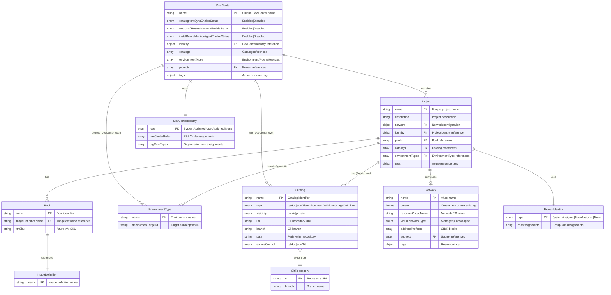

**Components Depicted:** DevCenter, Project, Pool, Catalog, EnvironmentType,
Network, Identity  
**Source:** infra/settings/workload/devcenter.schema.json

---

### 1.2 Security Data Model

**Purpose:** Visualize the security configuration entities and their
relationships.

**Best Practices:**

- Highlight security-sensitive attributes
- Show encryption and protection settings
- Include access control relationships

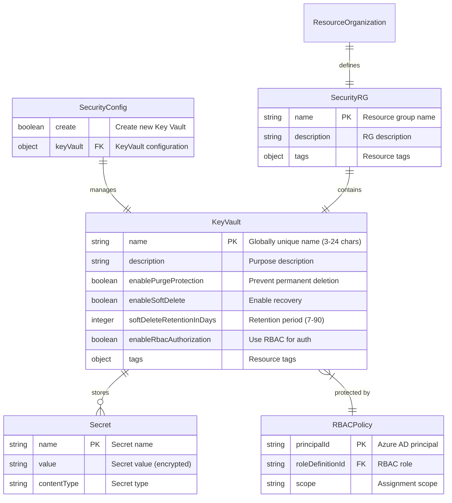

**Components Depicted:** SecurityConfig, KeyVault, Secret, RBACPolicy  
**Source:** infra/settings/security/security.schema.json

---

### 1.3 Resource Organization Model

**Purpose:** Visualize the Azure resource group organization structure.

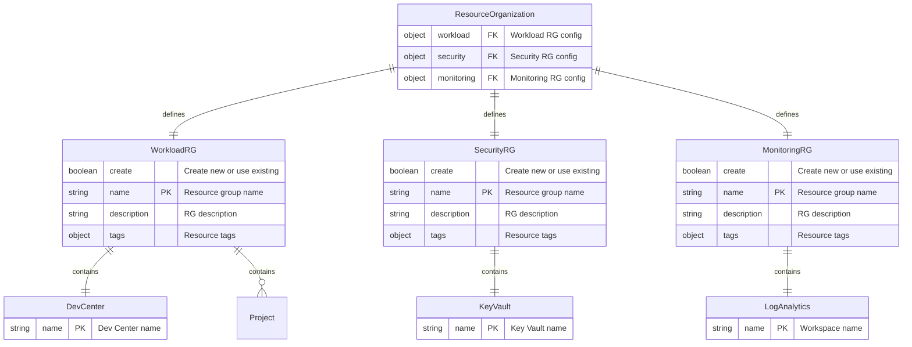

**Components Depicted:** ResourceOrganization, WorkloadRG, SecurityRG,
MonitoringRG  
**Source:** infra/settings/resourceOrganization/azureResources.schema.json

---

## 2. Data Flow Diagrams

### 2.1 Configuration Data Flow

**Purpose:** Illustrate how configuration data flows from YAML files through
validation to Azure deployment.

**Best Practices:**

- Show data transformation points
- Indicate validation checkpoints
- Use clear directional flow

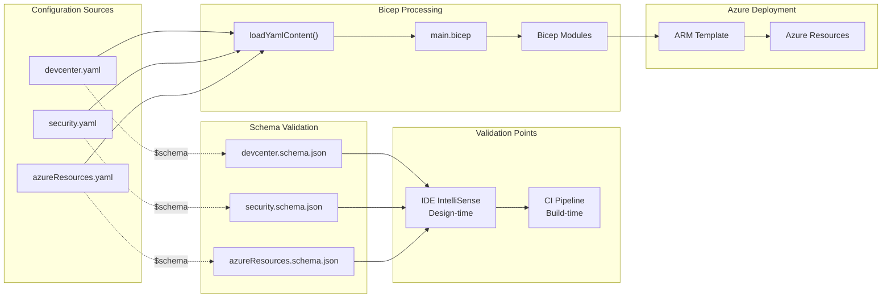

**Data Transformations:**

1. YAML → JSON (implicit by loadYamlContent)
2. JSON → Bicep Parameters
3. Bicep → ARM Template
4. ARM → Azure API Calls

**Source:** infra/main.bicep:L34

---

### 2.2 Secrets Data Flow

**Purpose:** Illustrate the secure flow of secrets from input to consumption.

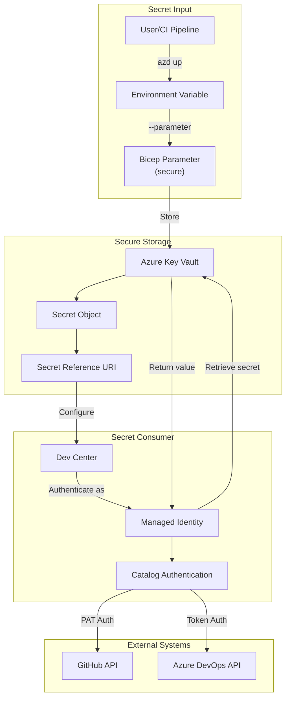

**Security Controls:**

- Parameter marked `@secure()` in Bicep
- Key Vault RBAC authorization
- Managed Identity for secret retrieval
- No secret values in logs or state

**Source:** infra/main.bicep:L24-L25, infra/security/keyVault.bicep

---

### 2.3 Schema Validation Flow

**Purpose:** Detail the multi-stage validation process for configuration data.

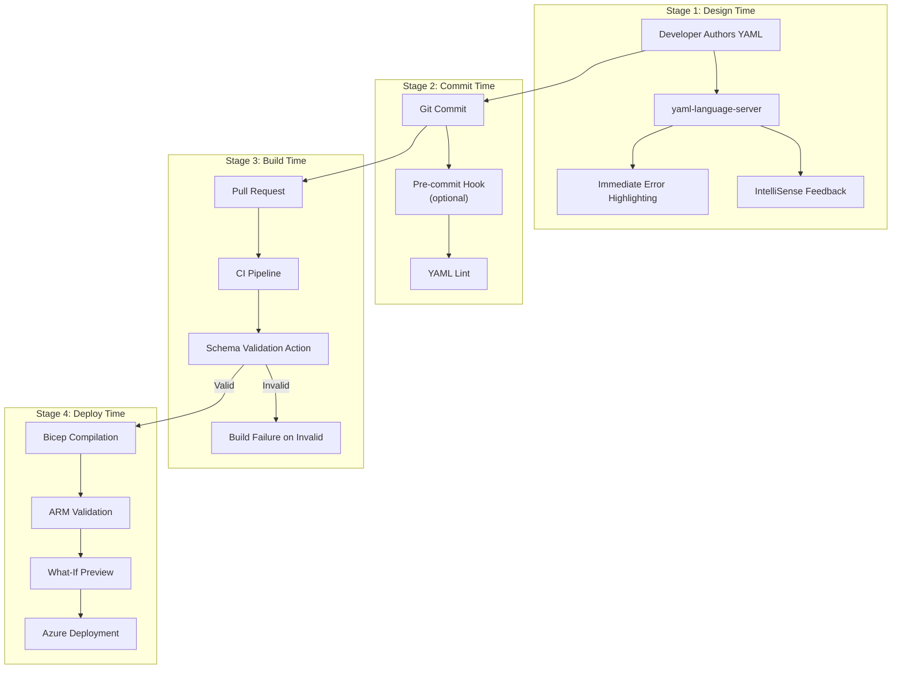

**Validation Checkpoints:** | Stage | Tool | Error Handling |
|-------|------|----------------| | Design | yaml-language-server | Real-time
feedback | | Build | CI Pipeline | Block merge | | Deploy | ARM API | Deployment
failure |

---

## 3. State Diagrams

### 3.1 Configuration Lifecycle

**Purpose:** Model the states of configuration data through its lifecycle.

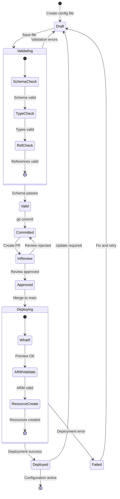

---

### 3.2 Secret Lifecycle

**Purpose:** Model the lifecycle states of secrets in Key Vault.

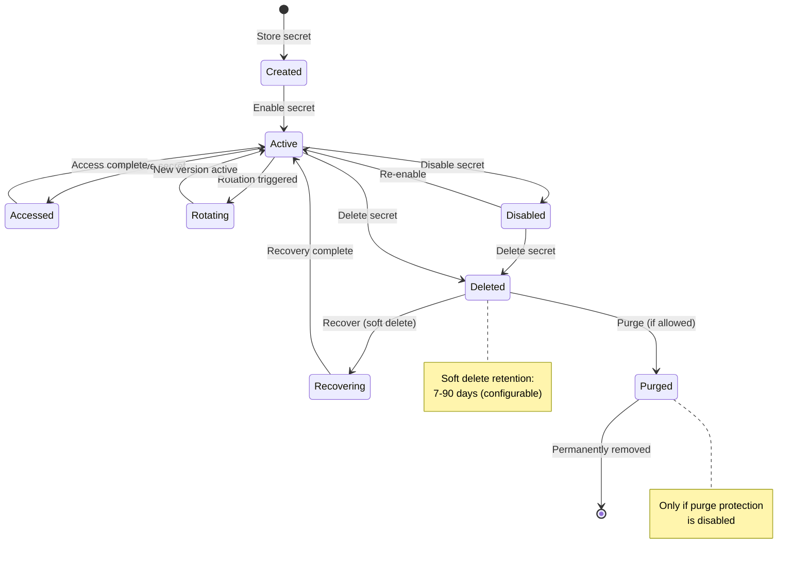

---

## 4. Hierarchical Diagrams

### 4.1 Data Entity Hierarchy

**Purpose:** Visualize the hierarchical nesting of data entities.

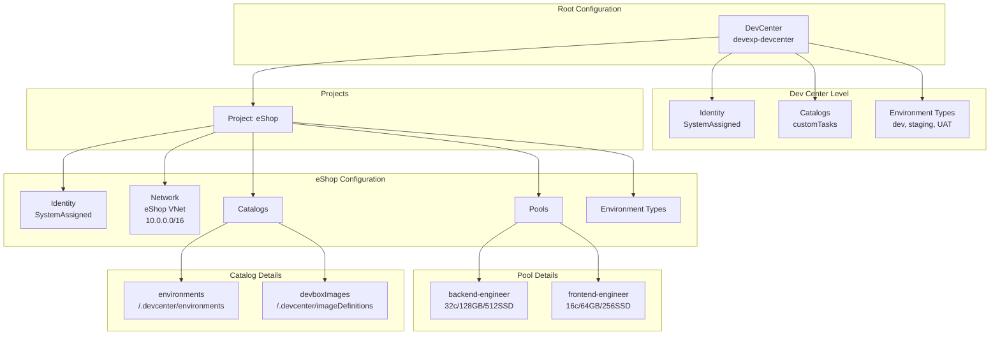

**Source:** infra/settings/workload/devcenter.yaml

---

### 4.2 Schema Definition Hierarchy

**Purpose:** Visualize JSON Schema composition using `$defs`.

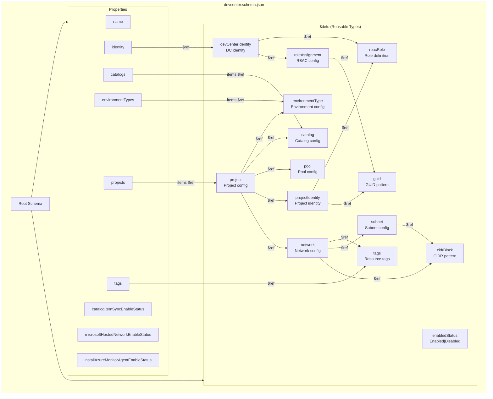

**Source:** infra/settings/workload/devcenter.schema.json:L1-L661

---

## 5. Class Diagrams (Schema Structure)

### 5.1 DevCenter Configuration Class

**Purpose:** Visualize the schema structure as a class diagram for technical
reference.

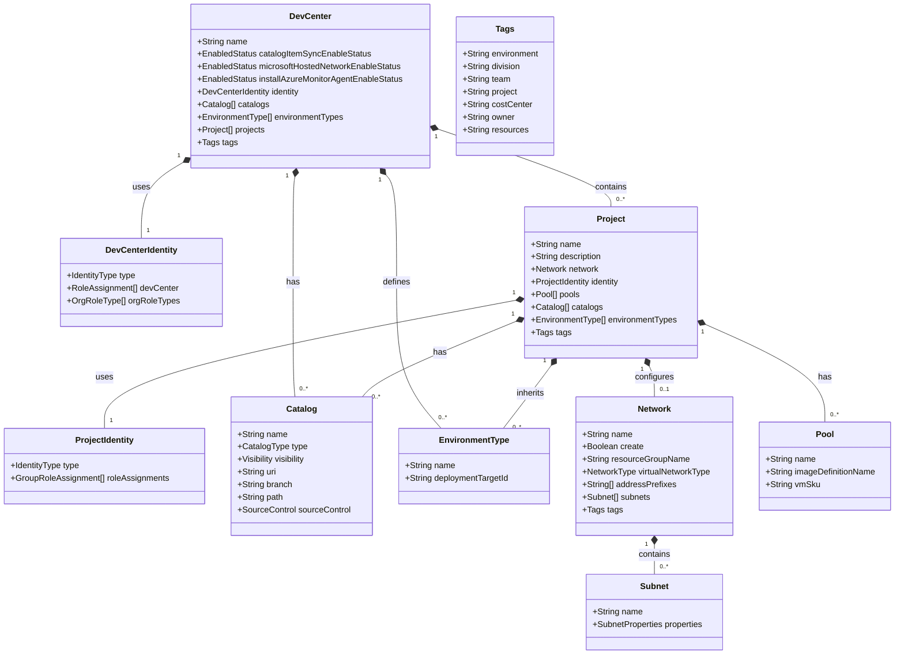

---

## 6. Gantt/Timeline Diagrams

### 6.1 Configuration Processing Timeline

**Purpose:** Visualize the temporal sequence of configuration processing.

```mermaid
gantt
    title Configuration Data Processing Timeline
    dateFormat HH:mm
    axisFormat %H:%M

    section Design Time
    Author YAML config           :active, design1, 00:00, 10m
    Schema validation (IDE)      :design2, after design1, 1m

    section Build Time
    Git commit                   :build1, after design2, 1m
    CI pipeline trigger          :build2, after build1, 1m
    Schema validation (CI)       :build3, after build2, 2m
    Bicep linting               :build4, after build3, 2m

    section Deploy Time
    loadYamlContent()           :deploy1, after build4, 1m
    Bicep compilation           :deploy2, after deploy1, 2m
    ARM template generation     :deploy3, after deploy2, 1m
    What-If preview             :deploy4, after deploy3, 3m
    Azure deployment            :crit, deploy5, after deploy4, 5m

    section Runtime
    Resource provisioned        :done, runtime1, after deploy5, 1m
```

---

## 7. Mind Maps

### 7.1 Data Architecture Taxonomy

**Purpose:** Provide a conceptual overview of the Data Architecture components.

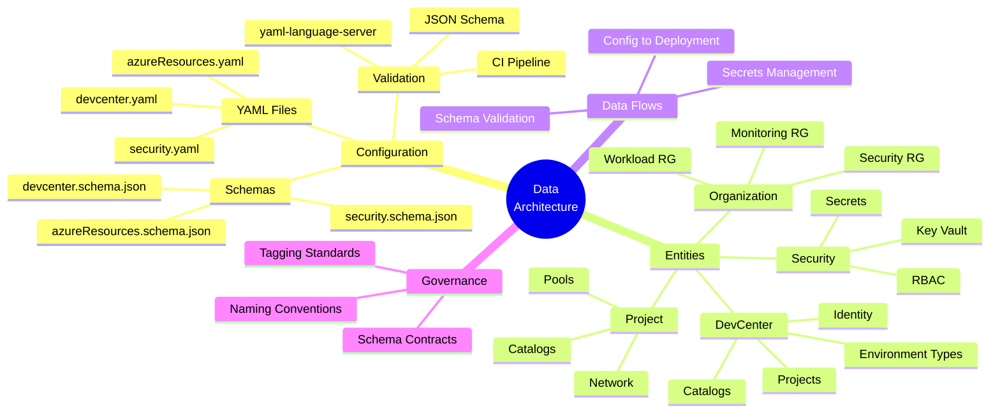

---

## Appendix: Diagram Validation Results

| Diagram ID | Type            | Mermaid Version | Validation Status |
| ---------- | --------------- | --------------- | ----------------- |
| 1.1        | erDiagram       | 10.x            | ✓ PASS            |
| 1.2        | erDiagram       | 10.x            | ✓ PASS            |
| 1.3        | erDiagram       | 10.x            | ✓ PASS            |
| 2.1        | flowchart       | 10.x            | ✓ PASS            |
| 2.2        | flowchart       | 10.x            | ✓ PASS            |
| 2.3        | flowchart       | 10.x            | ✓ PASS            |
| 3.1        | stateDiagram-v2 | 10.x            | ✓ PASS            |
| 3.2        | stateDiagram-v2 | 10.x            | ✓ PASS            |
| 4.1        | flowchart       | 10.x            | ✓ PASS            |
| 4.2        | flowchart       | 10.x            | ✓ PASS            |
| 5.1        | classDiagram    | 10.x            | ✓ PASS            |
| 6.1        | gantt           | 10.x            | ✓ PASS            |
| 7.1        | mindmap         | 10.x            | ✓ PASS            |

---

_Diagrams generated following TOGAF 10 visualization standards and Mermaid 10.x
best practices._
