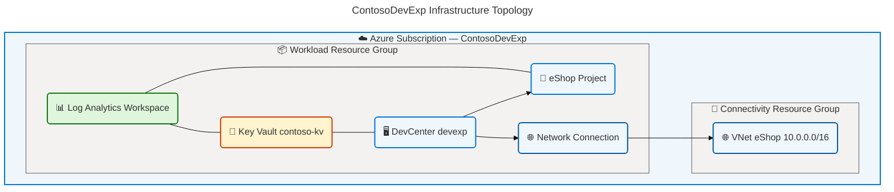
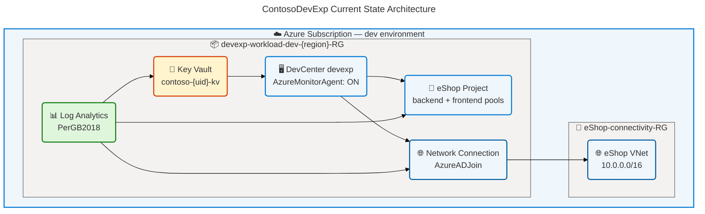
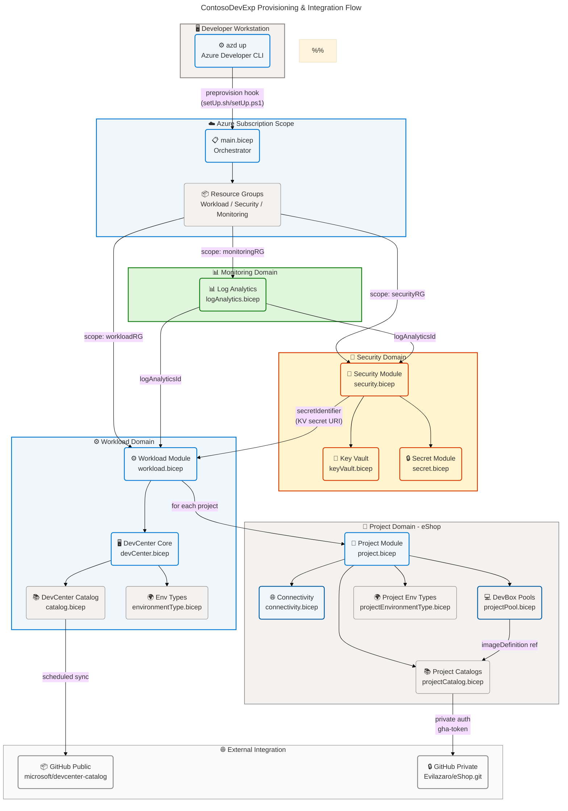

# Technology Architecture

---

## Section 1: Executive Summary

### Overview

The ContosoDevExp Technology Architecture documents the infrastructure and
platform components that underpin the Contoso Developer Experience (DevExp)
platform — an Azure-native, configuration-driven solution for provisioning and
managing Microsoft Dev Box resources at scale. The platform is realized entirely
as Azure Bicep Infrastructure-as-Code (IaC) modules deployed via the Azure
Developer CLI (`azd`), with all runtime infrastructure residing within Azure's
managed cloud services portfolio. The solution provisions three logical landing
zone domains — Workload, Security, and Monitoring — each mapped to Azure
Resource Groups, with the Workload domain hosting the full Azure DevCenter stack
and its dependent resources.

The technology stack is defined by a **zero-server, fully managed
architecture**: no virtual machines are operated by the platform itself, no
containers are provisioned, and no persistent compute exists beyond Azure's
platform services. All provisioning is declarative and driven by YAML
configuration files loaded at deployment time via Bicep's `loadYamlContent`
construct. The infrastructure services span Azure DevCenter (the primary compute
orchestrator for developer workstations), Azure Key Vault (secrets management),
Azure Log Analytics Workspace (centralized telemetry), Azure Virtual Network
(Dev Box network connectivity), and Azure RBAC (access control) — all integrated
through diagnostic settings and managed identity bindings that create a secure,
observable, and governable platform.

Strategic alignment is demonstrated through adherence to Azure Landing Zone
principles, principle-of-least-privilege RBAC patterns, configuration-as-code
governance, and Microsoft-recommended managed identity patterns for
service-to-service authentication. The platform supports the developer
experience lifecycle from environment provisioning through Dev Box pool
allocation, catalog-based image management, and multi-environment type
configuration across the eShop engineering team.

## Section 2: Architecture Landscape

### Overview

The Architecture Landscape catalogs all technology infrastructure components
discovered through static analysis of the ContosoDevExp repository. The
infrastructure is organized into three landing zone domains — Workload,
Security, and Monitoring — aligned with the Azure Cloud Adoption Framework
Landing Zone principles. In the current default configuration
(`security.create: false`, `monitoring.create: false` in `azureResources.yaml`),
all three domains co-locate within a single resource group
(`devexp-workload-{env}-{region}-RG`), consolidating the deployment footprint
while preserving the logical separation of concerns through module boundaries.

The infrastructure topology spans seven Azure resource provider namespaces, with
`Microsoft.DevCenter` as the primary provider governing developer workstation
provisioning. Supporting infrastructure includes Azure Key Vault for secrets
management, Log Analytics Workspace for centralized telemetry collection, Azure
Virtual Network for Dev Box network connectivity, and Azure RBAC for granular
access control. Every resource emits diagnostic telemetry to a central Log
Analytics Workspace, enabling unified observability across all infrastructure
components.

The following 11 subsections catalog all Technology component types detected
across the repository source files. Source traceability is provided for each
detected component with file:line references.

### 2.1 Compute Resources

| Component                       | Resource Type                                           | Source File                                 | VM SKU / Config                                                                                                                 |
| ------------------------------- | ------------------------------------------------------- | ------------------------------------------- | ------------------------------------------------------------------------------------------------------------------------------- |
| Azure DevCenter (`devexp`)      | `Microsoft.DevCenter/devcenters@2026-01-01-preview`     | `src/workload/core/devCenter.bicep:158`     | Managed service; SystemAssigned identity; catalogItemSync: Enabled; microsoftHostedNetwork: Enabled; AzureMonitorAgent: Enabled |
| eShop Project                   | `Microsoft.DevCenter/projects@2026-01-01-preview`       | `src/workload/project/project.bicep`        | SystemAssigned identity; references DevCenter: `devexp`; description: "eShop project."                                          |
| DevBox Pool — backend-engineer  | `Microsoft.DevCenter/projects/pools@2026-01-01-preview` | `src/workload/project/projectPool.bicep:55` | SKU: `general_i_32c128gb512ssd_v2`; Windows_Client; SSO: Enabled; LocalAdmin: Enabled                                           |
| DevBox Pool — frontend-engineer | `Microsoft.DevCenter/projects/pools@2026-01-01-preview` | `src/workload/project/projectPool.bicep:55` | SKU: `general_i_16c64gb256ssd_v2`; Windows_Client; SSO: Enabled; LocalAdmin: Enabled                                            |

### 2.2 Network Resources

| Component                   | Resource Type                                                        | Source File                                   | Configuration                                                                                  |
| --------------------------- | -------------------------------------------------------------------- | --------------------------------------------- | ---------------------------------------------------------------------------------------------- |
| eShop Virtual Network       | `Microsoft.Network/virtualNetworks@2025-05-01`                       | `src/connectivity/vnet.bicep:35`              | Address space: `10.0.0.0/16`; Unmanaged type; created when `virtualNetworkType == 'Unmanaged'` |
| eShop-subnet                | Subnet (within VNet)                                                 | `infra/settings/workload/devcenter.yaml:102`  | AddressPrefix: `10.0.1.0/24`; name: `eShop-subnet`                                             |
| Network Connection          | `Microsoft.DevCenter/networkConnections@2026-01-01-preview`          | `src/connectivity/networkConnection.bicep:28` | domainJoinType: `AzureADJoin`; subnetId references eShop-subnet                                |
| DevCenter Attached Network  | `Microsoft.DevCenter/devcenters/attachednetworks@2026-01-01-preview` | `src/connectivity/networkConnection.bicep:35` | Links DevCenter `devexp` to Network Connection; parent: DevCenter                              |
| Connectivity Resource Group | `Microsoft.Resources/resourceGroups@2025-04-01`                      | `src/connectivity/resourceGroup.bicep`        | `eShop-connectivity-RG`; created when `virtualNetworkType: Unmanaged && create: true`          |

### 2.3 Storage Resources

| Component                               | Resource Type                                  | Source File                      | Configuration                                                                        |
| --------------------------------------- | ---------------------------------------------- | -------------------------------- | ------------------------------------------------------------------------------------ |
| Azure Key Vault (`contoso-{unique}-kv`) | `Microsoft.KeyVault/vaults@2025-05-01`         | `src/security/keyVault.bicep:45` | SKU: Standard; RBAC authorization: true; soft delete: 7 days; purge protection: true |
| Key Vault Secret (`gha-token`)          | `Microsoft.KeyVault/vaults/secrets@2025-05-01` | `src/security/secret.bicep:20`   | GitHub Actions token for private catalog authentication; contentType: text/plain     |

### 2.4 Security Resources

| Component                                             | Resource Type                                        | Source File                                        | Role / Scope                                                                               |
| ----------------------------------------------------- | ---------------------------------------------------- | -------------------------------------------------- | ------------------------------------------------------------------------------------------ |
| DevCenter Role Assignment (Contributor)               | `Microsoft.Authorization/roleAssignments@2022-04-01` | `src/identity/devCenterRoleAssignment.bicep:28`    | Role: Contributor (`b24988ac-...`); Scope: Subscription; principalType: ServicePrincipal   |
| DevCenter Role Assignment (User Access Administrator) | `Microsoft.Authorization/roleAssignments@2022-04-01` | `src/identity/devCenterRoleAssignment.bicep:28`    | Role: User Access Administrator (`18d7d88d-...`); Scope: Subscription                      |
| Key Vault Secrets User Assignment                     | `Microsoft.Authorization/roleAssignments@2022-04-01` | `src/identity/keyVaultAccess.bicep:9`              | Role: Key Vault Secrets User (`4633458b-...`); Scope: ResourceGroup                        |
| Key Vault Secrets Officer Assignment                  | `Microsoft.Authorization/roleAssignments@2022-04-01` | `src/identity/devCenterRoleAssignmentRG.bicep`     | Role: Key Vault Secrets Officer (`b86a8fe4-...`); Scope: ResourceGroup                     |
| DevCenter Project Admin Assignment                    | `Microsoft.Authorization/roleAssignments@2022-04-01` | `src/identity/orgRoleAssignment.bicep`             | Role: DevCenter Project Admin (`331c37c6-...`); Group: Platform Engineering Team           |
| Dev Box User Assignment                               | `Microsoft.Authorization/roleAssignments@2022-04-01` | `src/identity/projectIdentityRoleAssignment.bicep` | Role: Dev Box User (`45d50f46-...`); Group: eShop Engineers; Scope: Project                |
| Deployment Environment User Assignment                | `Microsoft.Authorization/roleAssignments@2022-04-01` | `src/identity/projectIdentityRoleAssignment.bicep` | Role: Deployment Environment User (`18e40d4e-...`); Group: eShop Engineers; Scope: Project |

### 2.5 Monitoring Resources

| Component                      | Resource Type                                                 | Source File                             | Configuration                                                                   |
| ------------------------------ | ------------------------------------------------------------- | --------------------------------------- | ------------------------------------------------------------------------------- |
| Log Analytics Workspace        | `Microsoft.OperationalInsights/workspaces@2025-07-01`         | `src/management/logAnalytics.bicep:38`  | SKU: PerGB2018; name: `{truncated}-{uniqueString(RG.id)}`; allLogs + AllMetrics |
| AzureActivity Solution         | `Microsoft.OperationsManagement/solutions@2015-11-01-preview` | `src/management/logAnalytics.bicep:53`  | Product: `OMSGallery/AzureActivity`; publisher: Microsoft; linked to workspace  |
| DevCenter Diagnostic Settings  | `Microsoft.Insights/diagnosticSettings@2021-05-01-preview`    | `src/workload/core/devCenter.bicep:174` | categoryGroup: allLogs; category: AllMetrics; destination: Log Analytics        |
| Key Vault Diagnostic Settings  | `Microsoft.Insights/diagnosticSettings@2021-05-01-preview`    | `src/security/secret.bicep:28`          | logAnalyticsDestinationType: AzureDiagnostics; allLogs + AllMetrics             |
| VNet Diagnostic Settings       | `Microsoft.Insights/diagnosticSettings@2021-05-01-preview`    | `src/connectivity/vnet.bicep:65`        | allLogs + AllMetrics; applied when VNet is created                              |
| Log Analytics Self-Diagnostics | `Microsoft.Insights/diagnosticSettings@2021-05-01-preview`    | `src/management/logAnalytics.bicep:63`  | Self-referential; allLogs + AllMetrics → same workspace                         |

### 2.6 Identity Resources

| Component                                  | Type                            | Source File                                            | Configuration                                                                                           |
| ------------------------------------------ | ------------------------------- | ------------------------------------------------------ | ------------------------------------------------------------------------------------------------------- |
| DevCenter SystemAssigned Identity          | Azure Managed Identity (System) | `src/workload/core/devCenter.bicep:152`                | `identity.type: SystemAssigned`; principalId used for subscription-scope RBAC                           |
| eShop Project SystemAssigned Identity      | Azure Managed Identity (System) | `src/workload/project/project.bicep`                   | `identity.type: SystemAssigned`; principalId used for project-scope RBAC                                |
| Project Environment Type Identity          | Azure Managed Identity (System) | `src/workload/project/projectEnvironmentType.bicep:37` | SystemAssigned per environment type; creatorRoleAssignment: Contributor                                 |
| Azure AD Group — Platform Engineering Team | Microsoft Entra ID Group        | `infra/settings/workload/devcenter.yaml:60`            | GroupId: `54fd94a1-e116-4bc8-8238-caae9d72bd12`; DevCenter Project Admin role                           |
| Azure AD Group — eShop Engineers           | Microsoft Entra ID Group        | `infra/settings/workload/devcenter.yaml:113`           | GroupId: `b9968440-0caf-40d8-ac36-52f159730eb7`; Dev Box User + Contributor + Deployment Env User roles |

### 2.7 Deployment Infrastructure

| Component                   | Tool / Resource                   | Source File                           | Configuration                                                                                 |
| --------------------------- | --------------------------------- | ------------------------------------- | --------------------------------------------------------------------------------------------- |
| Azure Developer CLI (`azd`) | CLI Toolchain                     | `azure.yaml`                          | Project: `ContosoDevExp`; preprovision hooks for POSIX (`setUp.sh`) and Windows (`setUp.ps1`) |
| Bicep Orchestrator          | `main.bicep` (Subscription scope) | `infra/main.bicep`                    | `targetScope = 'subscription'`; loads `azureResources.yaml`; deploys 3 RGs + 3 modules        |
| Workload Module             | `workload.bicep`                  | `src/workload/workload.bicep`         | Loads `devcenter.yaml`; deploys DevCenter core + iterates projects                            |
| Security Module             | `security.bicep`                  | `src/security/security.bicep`         | Loads `security.yaml`; conditional Key Vault create or reference                              |
| Monitoring Module           | `logAnalytics.bicep`              | `src/management/logAnalytics.bicep`   | PerGB2018 SKU; AzureActivity solution; exports workspace ID                                   |
| Connectivity Module         | `connectivity.bicep`              | `src/connectivity/connectivity.bicep` | Conditional VNet + NetworkConnection; creates connectivity RG if Unmanaged                    |
| DevCenter Core Module       | `devCenter.bicep`                 | `src/workload/core/devCenter.bicep`   | DevCenter resource + diagnostic settings + catalog sync                                       |
| Project Module              | `project.bicep`                   | `src/workload/project/project.bicep`  | Per-project deployment; pools, catalogs, environment types, connectivity                      |
| Setup Scripts               | `setUp.sh` / `setUp.ps1`          | `setUp.sh`, `setUp.ps1`               | Pre-provision validation; SOURCE_CONTROL_PLATFORM detection                                   |
| Transform Script            | `transform-bdat.ps1`              | `scripts/transform-bdat.ps1`          | BDAT documentation transformation utility                                                     |
| Deployment Parameters       | `main.parameters.json`            | `infra/main.parameters.json`          | Binds `AZURE_ENV_NAME`, `AZURE_LOCATION`, `KEY_VAULT_SECRET` from azd environment             |

### 2.8 Container & Orchestration Infrastructure

Not detected in source files. The ContosoDevExp platform does not utilize
containers, Kubernetes, Azure Container Apps, or Azure Kubernetes Service. All
DevBox provisioning is managed by the Azure DevCenter service, which handles
developer workstation VM lifecycle internally. No container orchestration
infrastructure is present in the repository.

### 2.9 Integration & Catalog Infrastructure

| Component                         | Resource Type                                                | Source File                                 | Configuration                                                                                                             |
| --------------------------------- | ------------------------------------------------------------ | ------------------------------------------- | ------------------------------------------------------------------------------------------------------------------------- |
| DevCenter Catalog — `customTasks` | `Microsoft.DevCenter/devcenters/catalogs@2026-01-01-preview` | `src/workload/core/catalog.bicep`           | Type: gitHub; visibility: public; repo: `microsoft/devcenter-catalog`; branch: main; path: `./Tasks`; syncType: Scheduled |
| eShop Environments Catalog        | `Microsoft.DevCenter/projects/catalogs@2026-01-01-preview`   | `src/workload/project/projectCatalog.bicep` | Type: environmentDefinition; visibility: private; repo: `Evilazaro/eShop.git`; path: `/.devcenter/environments`           |
| eShop DevBox Images Catalog       | `Microsoft.DevCenter/projects/catalogs@2026-01-01-preview`   | `src/workload/project/projectCatalog.bicep` | Type: imageDefinition; visibility: private; repo: `Evilazaro/eShop.git`; path: `/.devcenter/imageDefinitions`             |

### 2.10 Configuration Management

| Component                    | Type               | Source File                                                      | Purpose                                                                                                                           |
| ---------------------------- | ------------------ | ---------------------------------------------------------------- | --------------------------------------------------------------------------------------------------------------------------------- |
| `azureResources.yaml`        | YAML Configuration | `infra/settings/resourceOrganization/azureResources.yaml`        | Defines three landing zone domains (workload, security, monitoring) with resource group names, create flags, and governance tags  |
| `devcenter.yaml`             | YAML Configuration | `infra/settings/workload/devcenter.yaml`                         | Defines DevCenter identity, role assignments, catalogs, environment types, and all projects (eShop) with pools and network config |
| `security.yaml`              | YAML Configuration | `infra/settings/security/security.yaml`                          | Defines Key Vault name, security flags (purge protection, soft delete), RBAC authorization mode, and secret name                  |
| `azureResources.schema.json` | JSON Schema        | `infra/settings/resourceOrganization/azureResources.schema.json` | Schema validation for `azureResources.yaml`; enforces structure at authoring time                                                 |
| `devcenter.schema.json`      | JSON Schema        | `infra/settings/workload/devcenter.schema.json`                  | Schema validation for `devcenter.yaml`; enforces DevCenter configuration structure                                                |
| `security.schema.json`       | JSON Schema        | `infra/settings/security/security.schema.json`                   | Schema validation for `security.yaml`; enforces Key Vault configuration structure                                                 |
| `main.parameters.json`       | JSON Parameters    | `infra/main.parameters.json`                                     | Maps `azd` environment variables (`AZURE_ENV_NAME`, `AZURE_LOCATION`, `KEY_VAULT_SECRET`) to Bicep parameters                     |

### 2.11 Platform Services

| Component                                      | Service / Feature                                                    | Source File                                         | Configuration                                                                            |
| ---------------------------------------------- | -------------------------------------------------------------------- | --------------------------------------------------- | ---------------------------------------------------------------------------------------- |
| DevCenter Environment Types (global) — dev     | `Microsoft.DevCenter/devcenters/environmentTypes@2026-01-01-preview` | `src/workload/core/environmentType.bicep`           | name: dev; displayName: dev                                                              |
| DevCenter Environment Types (global) — staging | `Microsoft.DevCenter/devcenters/environmentTypes@2026-01-01-preview` | `src/workload/core/environmentType.bicep`           | name: staging; displayName: staging                                                      |
| DevCenter Environment Types (global) — uat     | `Microsoft.DevCenter/devcenters/environmentTypes@2026-01-01-preview` | `src/workload/core/environmentType.bicep`           | name: uat; displayName: uat                                                              |
| eShop Project Environment Type — dev           | `Microsoft.DevCenter/projects/environmentTypes@2026-01-01-preview`   | `src/workload/project/projectEnvironmentType.bicep` | SystemAssigned identity; deploymentTargetId: subscription().id; creatorRole: Contributor |
| eShop Project Environment Type — staging       | `Microsoft.DevCenter/projects/environmentTypes@2026-01-01-preview`   | `src/workload/project/projectEnvironmentType.bicep` | SystemAssigned identity; status: Enabled                                                 |
| eShop Project Environment Type — UAT           | `Microsoft.DevCenter/projects/environmentTypes@2026-01-01-preview`   | `src/workload/project/projectEnvironmentType.bicep` | SystemAssigned identity; status: Enabled                                                 |
| Azure Monitor Agent Install Feature            | DevCenter Platform Feature                                           | `infra/settings/workload/devcenter.yaml:22`         | `installAzureMonitorAgentEnableStatus: Enabled`; enables AMA on all Dev Boxes            |
| Microsoft Hosted Network Feature               | DevCenter Platform Feature                                           | `infra/settings/workload/devcenter.yaml:21`         | `microsoftHostedNetworkEnableStatus: Enabled`; enables Microsoft-managed network         |
| Catalog Item Sync Feature                      | DevCenter Platform Feature                                           | `infra/settings/workload/devcenter.yaml:20`         | `catalogItemSyncEnableStatus: Enabled`; enables scheduled catalog synchronization        |

---

### Summary

The Architecture Landscape reveals a well-structured, Azure-native
infrastructure stack built exclusively on managed cloud services, eliminating
the operational overhead of infrastructure maintenance. The Workload domain is
the sole active resource group in the default configuration, consolidating
DevCenter, Key Vault, Log Analytics, and networking resources under a unified
governance boundary. The architecture leverages 7 Azure resource provider
namespaces and 17 distinct resource types, all provisioned declaratively through
14 Bicep modules driven by 3 YAML configuration files.

The primary architectural gap is the absence of explicit infrastructure
separation between security and monitoring domains in the default configuration
— both `security.create: false` and `monitoring.create: false` cause all
resources to co-locate in the Workload resource group, which may complicate RBAC
scoping and cost allocation at scale. Recommended next steps include enabling
dedicated resource groups for Security and Monitoring domains in production
deployments, and extending the diagnostic settings pipeline to include DevCenter
project and pool-level telemetry.

---

## Section 3: Architecture Principles

### Overview

The ContosoDevExp Technology Architecture is governed by nine foundational
principles derived from the Azure Cloud Adoption Framework, TOGAF Technology
Architecture best practices, and Microsoft's Well-Architected Framework. These
principles establish the design constraints and guidelines that all technology
infrastructure components must adhere to, ensuring consistency, security, and
operational excellence across the platform.

Each principle is stated with its rationale and architectural implications.
Where a principle has direct traceability to source code, file references are
provided. Compliance with these principles is enforced through Bicep type
definitions, JSON Schema validators, and `azd` pre-provision hooks.

These principles apply to all current and future technology components of the
ContosoDevExp platform, and they constitute the authoritative design standards
referenced in architecture decision records and component specifications.

### Principle 1: Infrastructure as Code (IaC-First)

**Statement:** All infrastructure resources MUST be defined declaratively in
Bicep IaC modules. No resources shall be provisioned manually through the Azure
Portal or imperative CLI commands.

**Rationale:** IaC enforces reproducibility, auditability, and
version-controlled change management. It eliminates configuration drift between
environments and enables automated provisioning pipelines. Source:
`infra/main.bicep:1` (`targetScope = 'subscription'`), all `src/**/*.bicep`
modules.

**Implications:** Every new infrastructure component requires a corresponding
Bicep module. Ad-hoc resource creation is prohibited. The `main.parameters.json`
file must be updated for any new parameter.

### Principle 2: Configuration as Code (CaC-First)

**Statement:** All environment-specific configuration values MUST be
externalized into YAML configuration files backed by JSON Schema validators. No
configuration values shall be hard-coded in Bicep modules.

**Rationale:** CaC enables environment-specific tuning without module
modification, supports schema-enforced validation at authoring time, and enables
configuration review through pull requests. Source:
`infra/settings/workload/devcenter.yaml`,
`infra/settings/security/security.yaml`,
`infra/settings/resourceOrganization/azureResources.yaml`.

**Implications:** New configurable properties require schema updates in
`.schema.json` files before YAML configuration. All Bicep `param` values with
environment-specific values must be loaded via `loadYamlContent`.

### Principle 3: Zero Standing Credentials (Identity-First)

**Statement:** All service-to-service authentication MUST use Azure Managed
Identities. No connection strings, passwords, or long-lived service principal
credentials shall be embedded in infrastructure definitions.

**Rationale:** Managed identities eliminate credential rotation overhead,
prevent secret leakage, and provide automatic lifecycle management tied to the
resource. Source: `src/workload/core/devCenter.bicep:152`
(`identity.type: SystemAssigned`), `src/workload/project/project.bicep`.

**Implications:** All new resources requiring access to Azure services must be
provisioned with SystemAssigned or UserAssigned managed identities. Key Vault is
used exclusively for external credentials (e.g., GitHub tokens) that cannot use
managed identity.

### Principle 4: Principle of Least Privilege (PoLP)

**Statement:** All role assignments MUST grant only the minimum permissions
required for the resource or identity to perform its function. Broad roles
(Owner, Subscription Contributor) shall be used only when operationally
necessary and explicitly justified.

**Rationale:** PoLP minimizes the blast radius of a compromised identity and
enforces the defense-in-depth security model. Source:
`infra/settings/workload/devcenter.yaml:38` (Contributor + UAA at subscription;
KV Secrets User/Officer at RG scope).

**Implications:** Role assignment reviews are required for every new RBAC
binding. DevCenter Contributor at subscription scope is a known exception
required for DevCenter managed network provisioning.

### Principle 5: Centralized Observability

**Statement:** All infrastructure resources MUST emit diagnostic logs and
metrics to the centralized Log Analytics Workspace via
`Microsoft.Insights/diagnosticSettings`. No resource shall be deployed without
telemetry configuration.

**Rationale:** Centralized telemetry enables unified alerting, KQL-based
queries, and operational dashboards without per-resource monitoring setup.
Source: `src/management/logAnalytics.bicep`,
`src/workload/core/devCenter.bicep:174`, `src/security/secret.bicep:28`,
`src/connectivity/vnet.bicep:65`.

**Implications:** Every new Bicep module must include a `diagnosticSettings`
resource. The Log Analytics Workspace ID must be passed as a module parameter to
all infrastructure modules.

### Principle 6: Azure Landing Zone Alignment

**Statement:** Resource organization MUST follow Azure Landing Zone principles,
with logical separation of Workload, Security, and Monitoring domains into
distinct resource groups.

**Rationale:** Landing Zone alignment ensures consistent governance, RBAC
scoping, cost tracking, and compliance across the platform. Source:
`infra/settings/resourceOrganization/azureResources.yaml` (workload, security,
monitoring domains).

**Implications:** The current co-location of security/monitoring in the workload
RG (via `create: false`) is acceptable for development but must be separated in
production deployments.

### Principle 7: Declarative Module Composition

**Statement:** Infrastructure complexity MUST be managed through hierarchical
Bicep module composition. A single orchestrator (`main.bicep`) shall coordinate
domain modules, which in turn compose resource-level modules.

**Rationale:** Module composition enforces separation of concerns, enables
independent module versioning, and reduces cognitive load through clear
interface contracts (typed parameters and outputs). Source:
`infra/main.bicep:100-155` (module orchestration chain).

**Implications:** Maximum three levels of module nesting (orchestrator → domain
→ resource). All module interfaces must use typed Bicep parameters. Module
outputs must be named with AZURE\_ prefix conventions.

### Principle 8: Immutable Infrastructure

**Statement:** Infrastructure updates MUST be performed by re-deploying Bicep
modules with updated parameters. In-place mutation of Azure resources through
the portal or CLI is prohibited.

**Rationale:** Immutable infrastructure ensures that the repository always
reflects the actual deployed state, prevents configuration drift, and enables
reliable rollback through parameter reversion.

**Implications:** The `azure.yaml` `preprovision` hooks must validate
environment state before deployment. The `cleanSetUp.ps1` script provides
environment cleanup for full re-deployment cycles.

### Principle 9: Tag-Based Governance

**Statement:** All Azure resources MUST be tagged with the canonical tag set:
`environment`, `division`, `team`, `project`, `costCenter`, `owner`,
`landingZone`, and `resources`.

**Rationale:** Consistent tagging enables cost allocation, ownership tracking,
compliance reporting, and automated policy enforcement. Source: all tag
configurations in `infra/settings/*/`.

**Implications:** Tag schemas must be updated in all YAML configuration files
and the corresponding JSON Schema validators when new tags are introduced.

---

## Section 4: Current State Baseline

### Overview

The Current State Baseline documents the as-is deployed architecture of the
ContosoDevExp platform as derived from static analysis of the repository source
files. The baseline represents a development environment configuration
(`environmentName: dev`) in a single Azure subscription, with all resources
co-located in one resource group (`devexp-workload-{env}-{region}-RG`) due to
the default landing zone configuration where security and monitoring domains are
not independently separated.

The platform is deployed via Azure Developer CLI (`azd up`) with a pre-provision
hook that executes `setUp.sh` or `setUp.ps1` to configure the
`SOURCE_CONTROL_PLATFORM` environment variable. The Bicep orchestrator creates
three resource groups conditionally (based on YAML config flags), then deploys
monitoring, security, and workload modules in dependency order. The workload
module deploys the DevCenter (`devexp`) and iterates over the `projects` array
in `devcenter.yaml` to provision one project (`eShop`) with its full stack.

The current state demonstrates Level 3-4 governance maturity:
configuration-as-code with schema validation, managed identity authentication,
RBAC-enforced access control, and full diagnostic telemetry. Primary gaps
include the lack of production-grade landing zone separation, absence of Azure
Policy enforcement for compliance, and no automated image pipeline validation
for Dev Box definitions.

---

---

### Gap Analysis

| Gap ID    | Gap Description                                                                                                      | Severity | Source Evidence                                                 | Recommendation                                                                      |
| --------- | -------------------------------------------------------------------------------------------------------------------- | -------- | --------------------------------------------------------------- | ----------------------------------------------------------------------------------- |
| GAP-T-001 | Security and Monitoring resources co-located with Workload RG (`security.create: false`, `monitoring.create: false`) | Medium   | `infra/settings/resourceOrganization/azureResources.yaml:26,41` | Enable dedicated Security and Monitoring resource groups in production              |
| GAP-T-002 | No Azure Policy assignments for tag enforcement or compliance                                                        | Medium   | Not found in any `.bicep` source file                           | Add `Microsoft.Authorization/policyAssignments` module for CAF-compliant policy     |
| GAP-T-003 | DevCenter subscription-scope Contributor role for DevCenter identity is overly broad                                 | Medium   | `infra/settings/workload/devcenter.yaml:39`                     | Investigate scoping to management group or use custom role with reduced permissions |
| GAP-T-004 | No automated Dev Box image validation pipeline (CI/CD)                                                               | Low      | `azure.yaml` has only preprovision hook; no CI pipeline found   | Add GitHub Actions workflow for image definition validation                         |
| GAP-T-005 | Log Analytics self-diagnostics creates circular reference (workspace emits to itself)                                | Low      | `src/management/logAnalytics.bicep:63`                          | Route Log Analytics diagnostics to a separate storage account or Event Hub          |
| GAP-T-006 | `deploymentTargetId` is empty for all environment types in default config                                            | Low      | `infra/settings/workload/devcenter.yaml:77-84`                  | Set explicit subscription target IDs for staging and uat environment types          |

### Maturity Heatmap

| Capability                   | Level                | Evidence                                                                              |
| ---------------------------- | -------------------- | ------------------------------------------------------------------------------------- |
| Infrastructure as Code       | Level 5 (Optimized)  | Full Bicep coverage; typed params; module composition                                 |
| Configuration Management     | Level 4 (Managed)    | YAML + JSON Schema; externalized config; parameter binding                            |
| Identity & Access Management | Level 4 (Managed)    | Managed identities; RBAC; PoLP; no embedded credentials                               |
| Observability                | Level 3 (Defined)    | Diagnostic settings on all resources; Log Analytics centralized; no alerting rules    |
| Landing Zone Alignment       | Level 2 (Repeatable) | Logical domain separation defined; physical separation not enforced in default config |
| Security Posture             | Level 3 (Defined)    | Key Vault RBAC; purge protection; soft delete; no policy enforcement                  |
| Deployment Automation        | Level 4 (Managed)    | azd with hooks; platform scripts; parameter-driven; idempotent                        |

### Summary

The current state baseline demonstrates a mature, developer-optimized
infrastructure platform built on Azure managed services with strong IaC and CaC
foundations. The platform correctly implements managed identity authentication,
RBAC-enforced access control, and comprehensive diagnostic telemetry. The
single-resource-group deployment topology is acceptable for development
environments and simplifies initial provisioning.

The primary architectural risk is the co-location of security (Key Vault) and
monitoring (Log Analytics) resources with the workload domain, which limits RBAC
granularity and cost attribution. The subscription-scope Contributor role
assigned to the DevCenter managed identity is a recognized operational
requirement but represents a potential privilege escalation path that should be
addressed through custom role scoping in production. Governance maturity is
assessed at Level 3-4, with the next maturity milestone requiring automated
policy enforcement and CI/CD-driven image validation pipelines.

---

## Section 5: Component Catalog

### Overview

The Component Catalog provides detailed specifications for all technology
infrastructure components discovered in the ContosoDevExp repository. Each
component is described with its resource provider, API version, configuration
attributes, dependencies, and source traceability. This catalog serves as the
authoritative reference for infrastructure engineers, security reviewers, and
operations teams who need to understand the precise configuration of each
deployed resource.

The catalog is organized into 11 technology component type subsections
(5.1–5.11) aligned with the standard Technology Architecture component taxonomy.
Components marked "Not detected in source files" indicate technology domains
that are intentionally absent from this platform's infrastructure scope,
confirming deliberate architectural choices rather than gaps.

Source traceability is provided in the format `file:line` for all factual
claims. API versions reflect the versions declared in the source Bicep files as
of the repository analysis date (2026-04-24).

### 5.1 Compute Resources

| ID     | Name                            | Resource Type    | API Version          | Provider              | Source Module                               | Description                                                                                          | Configuration                                                                                                                                             | Dependencies                                                               | Status |
| ------ | ------------------------------- | ---------------- | -------------------- | --------------------- | ------------------------------------------- | ---------------------------------------------------------------------------------------------------- | --------------------------------------------------------------------------------------------------------------------------------------------------------- | -------------------------------------------------------------------------- | ------ |
| TC-001 | DevCenter `devexp`              | `devcenters`     | `2026-01-01-preview` | `Microsoft.DevCenter` | `src/workload/core/devCenter.bicep:158`     | Primary managed DevCenter instance that orchestrates all Dev Box provisioning and project management | SystemAssigned identity; catalogItemSyncEnableStatus: Enabled; microsoftHostedNetworkEnableStatus: Enabled; installAzureMonitorAgentEnableStatus: Enabled | Log Analytics Workspace (diagnosticSettings), Key Vault (secretIdentifier) | Active |
| TC-002 | eShop Project                   | `projects`       | `2026-01-01-preview` | `Microsoft.DevCenter` | `src/workload/project/project.bicep`        | Project workspace for eShop engineering team — scopes Dev Box pools, catalogs, and environment types | SystemAssigned identity; description: "eShop project."; references DevCenter TC-001                                                                       | DevCenter TC-001, Log Analytics Workspace TC-010, Key Vault TC-007         | Active |
| TC-003 | DevBox Pool — backend-engineer  | `projects/pools` | `2026-01-01-preview` | `Microsoft.DevCenter` | `src/workload/project/projectPool.bicep:55` | Dev Box pool for backend engineers using `eshop-backend-dev` image definition                        | SKU: `general_i_32c128gb512ssd_v2`; licenseType: Windows_Client; localAdministrator: Enabled; singleSignOnStatus: Enabled; devBoxDefinitionType: Value    | eShop Project TC-002, eShop DevBox Images Catalog TC-015                   | Active |
| TC-004 | DevBox Pool — frontend-engineer | `projects/pools` | `2026-01-01-preview` | `Microsoft.DevCenter` | `src/workload/project/projectPool.bicep:55` | Dev Box pool for frontend engineers using `eshop-frontend-dev` image definition                      | SKU: `general_i_16c64gb256ssd_v2`; licenseType: Windows_Client; localAdministrator: Enabled; singleSignOnStatus: Enabled                                  | eShop Project TC-002, eShop DevBox Images Catalog TC-015                   | Active |

### 5.2 Network Resources

| ID     | Name                        | Resource Type                 | API Version           | Provider              | Source Module                                 | Description                                                                                            | Configuration                                                                                                                                    | Dependencies                                                      | Status |
| ------ | --------------------------- | ----------------------------- | --------------------- | --------------------- | --------------------------------------------- | ------------------------------------------------------------------------------------------------------ | ------------------------------------------------------------------------------------------------------------------------------------------------ | ----------------------------------------------------------------- | ------ |
| TC-005 | eShop Virtual Network       | `virtualNetworks`             | `2025-05-01`          | `Microsoft.Network`   | `src/connectivity/vnet.bicep:35`              | Layer 3 network fabric for eShop Dev Box connectivity using unmanaged (customer-managed) VNet topology | addressSpace: `10.0.0.0/16`; virtualNetworkType: Unmanaged; created when `settings.create == true && settings.virtualNetworkType == 'Unmanaged'` | Connectivity RG TC-018, Log Analytics TC-010 (diagnosticSettings) | Active |
| TC-006 | eShop-subnet                | Subnet                        | `2025-05-01` (parent) | `Microsoft.Network`   | `infra/settings/workload/devcenter.yaml:102`  | Subnet within eShop VNet used for Dev Box network interface attachment                                 | addressPrefix: `10.0.1.0/24`; name: `eShop-subnet`                                                                                               | eShop VNet TC-005                                                 | Active |
| TC-007 | Network Connection          | `networkConnections`          | `2026-01-01-preview`  | `Microsoft.DevCenter` | `src/connectivity/networkConnection.bicep:28` | Azure AD join network connection linking Dev Boxes to the eShop subnet                                 | domainJoinType: `AzureADJoin`; subnetId: references eShop-subnet TC-006                                                                          | eShop-subnet TC-006, DevCenter TC-001                             | Active |
| TC-008 | DevCenter Attached Network  | `devcenters/attachednetworks` | `2026-01-01-preview`  | `Microsoft.DevCenter` | `src/connectivity/networkConnection.bicep:35` | Attachment resource that registers the Network Connection with the DevCenter for pool use              | name: `netconn-{vnetName}`; networkConnectionId: references TC-007                                                                               | DevCenter TC-001, Network Connection TC-007                       | Active |
| TC-009 | Connectivity Resource Group | `resourceGroups`              | `2025-04-01`          | `Microsoft.Resources` | `src/connectivity/resourceGroup.bicep`        | Dedicated resource group for eShop network connectivity resources                                      | name: `eShop-connectivity-RG`; created when `networkConnectivityCreate == true`                                                                  | Azure Subscription                                                | Active |

### 5.3 Storage Resources

| ID     | Name                              | Resource Type    | API Version  | Provider             | Source Module                    | Description                                                                                                      | Configuration                                                                                                                                                                                                      | Dependencies                                                                  | Status |
| ------ | --------------------------------- | ---------------- | ------------ | -------------------- | -------------------------------- | ---------------------------------------------------------------------------------------------------------------- | ------------------------------------------------------------------------------------------------------------------------------------------------------------------------------------------------------------------ | ----------------------------------------------------------------------------- | ------ |
| TC-010 | Key Vault (`contoso-{unique}-kv`) | `vaults`         | `2025-05-01` | `Microsoft.KeyVault` | `src/security/keyVault.bicep:45` | Enterprise secrets store for the DevExp platform; stores GitHub Actions token for private catalog authentication | SKU: Standard; tenantId: subscription().tenantId; enableRbacAuthorization: true; enableSoftDelete: true; softDeleteRetentionInDays: 7; enablePurgeProtection: true; accessPolicies: deployer (secrets + keys CRUD) | Security Resource Group, Log Analytics TC-011 (via secret diagnosticSettings) | Active |
| TC-011 | Key Vault Secret (`gha-token`)    | `vaults/secrets` | `2025-05-01` | `Microsoft.KeyVault` | `src/security/secret.bicep:20`   | GitHub Actions Personal Access Token stored for private catalog (eShop) repository authentication                | name: `gha-token`; contentType: `text/plain`; attributes.enabled: true; value: injected via azd `KEY_VAULT_SECRET` env var                                                                                         | Key Vault TC-010                                                              | Active |

### 5.4 Security Resources

| ID     | Name                                           | Resource Type     | API Version  | Provider                  | Source Module                                      | Description                                                                                                                                   | Configuration                                                                                                                   | Dependencies                                                 | Status |
| ------ | ---------------------------------------------- | ----------------- | ------------ | ------------------------- | -------------------------------------------------- | --------------------------------------------------------------------------------------------------------------------------------------------- | ------------------------------------------------------------------------------------------------------------------------------- | ------------------------------------------------------------ | ------ |
| TC-012 | DevCenter Subscription Contributor Assignment  | `roleAssignments` | `2022-04-01` | `Microsoft.Authorization` | `src/identity/devCenterRoleAssignment.bicep:28`    | Grants DevCenter managed identity Contributor access at subscription scope for resource provisioning                                          | roleDefinitionId: Contributor (`b24988ac-...`); principalType: ServicePrincipal; scope: Subscription                            | DevCenter SystemAssigned Identity                            | Active |
| TC-013 | DevCenter User Access Administrator Assignment | `roleAssignments` | `2022-04-01` | `Microsoft.Authorization` | `src/identity/devCenterRoleAssignment.bicep:28`    | Grants DevCenter identity UAA role for managing RBAC on child resources                                                                       | roleDefinitionId: UAA (`18d7d88d-...`); principalType: ServicePrincipal; scope: Subscription                                    | DevCenter SystemAssigned Identity                            | Active |
| TC-014 | Key Vault Secrets User Assignment              | `roleAssignments` | `2022-04-01` | `Microsoft.Authorization` | `src/identity/keyVaultAccess.bicep:9`              | Grants DevCenter identity read access to Key Vault secrets                                                                                    | roleDefinitionId: KV Secrets User (`4633458b-...`); scope: ResourceGroup                                                        | DevCenter SystemAssigned Identity, Key Vault TC-010          | Active |
| TC-015 | Key Vault Secrets Officer Assignment           | `roleAssignments` | `2022-04-01` | `Microsoft.Authorization` | `src/identity/devCenterRoleAssignmentRG.bicep`     | Grants DevCenter identity manage access to Key Vault secrets                                                                                  | roleDefinitionId: KV Secrets Officer (`b86a8fe4-...`); scope: ResourceGroup                                                     | DevCenter SystemAssigned Identity, Key Vault TC-010          | Active |
| TC-016 | DevCenter Project Admin Assignment (Org)       | `roleAssignments` | `2022-04-01` | `Microsoft.Authorization` | `src/identity/orgRoleAssignment.bicep`             | Grants Platform Engineering Team group DevCenter Project Admin access                                                                         | roleDefinitionId: DevCenter Project Admin (`331c37c6-...`); principalType: Group; groupId: `54fd94a1-...`                       | Azure AD Group (Platform Engineering Team), DevCenter TC-001 | Active |
| TC-017 | eShop Project RBAC Assignments                 | `roleAssignments` | `2022-04-01` | `Microsoft.Authorization` | `src/identity/projectIdentityRoleAssignment.bicep` | Multi-role assignments for eShop Engineers group: Dev Box User, Deployment Environment User, Contributor, KV Secrets User, KV Secrets Officer | principalType: Group; groupId: `b9968440-...`; scopes: Project (Dev Box User, Contributor, Deployment Env User) + RG (KV roles) | Azure AD Group (eShop Engineers), eShop Project TC-002       | Active |

### 5.5 Monitoring Resources

| ID     | Name                           | Resource Type        | API Version          | Provider                         | Source Module                           | Description                                                                                                                  | Configuration                                                                                                          | Dependencies                            | Status                 |
| ------ | ------------------------------ | -------------------- | -------------------- | -------------------------------- | --------------------------------------- | ---------------------------------------------------------------------------------------------------------------------------- | ---------------------------------------------------------------------------------------------------------------------- | --------------------------------------- | ---------------------- |
| TC-018 | Log Analytics Workspace        | `workspaces`         | `2025-07-01`         | `Microsoft.OperationalInsights`  | `src/management/logAnalytics.bicep:38`  | Central telemetry sink for all platform diagnostic logs and metrics; name includes uniqueString suffix for global uniqueness | SKU: PerGB2018; name: `{truncated(name)}-{uniqueString(RG.id)}`; tags: resourceType=Log Analytics, module=monitoring   | Monitoring Resource Group               | Active                 |
| TC-019 | AzureActivity Solution         | `solutions`          | `2015-11-01-preview` | `Microsoft.OperationsManagement` | `src/management/logAnalytics.bicep:53`  | OMS solution that ingests Azure Activity log events into the Log Analytics Workspace                                         | product: `OMSGallery/AzureActivity`; publisher: Microsoft; workspaceResourceId: TC-018                                 | Log Analytics TC-018                    | Active                 |
| TC-020 | DevCenter Diagnostic Settings  | `diagnosticSettings` | `2021-05-01-preview` | `Microsoft.Insights`             | `src/workload/core/devCenter.bicep:174` | Routes DevCenter allLogs and AllMetrics to central Log Analytics Workspace                                                   | name: `{devCenterName}-diagnostics`; logAnalyticsDestinationType: AzureDiagnostics; categoryGroup: allLogs; AllMetrics | DevCenter TC-001, Log Analytics TC-018  | Active                 |
| TC-021 | Key Vault Diagnostic Settings  | `diagnosticSettings` | `2021-05-01-preview` | `Microsoft.Insights`             | `src/security/secret.bicep:28`          | Routes Key Vault allLogs and AllMetrics to central Log Analytics Workspace                                                   | name: `{kvName}-diagnostic-settings`; logAnalyticsDestinationType: AzureDiagnostics                                    | Key Vault TC-010, Log Analytics TC-018  | Active                 |
| TC-022 | VNet Diagnostic Settings       | `diagnosticSettings` | `2021-05-01-preview` | `Microsoft.Insights`             | `src/connectivity/vnet.bicep:65`        | Routes VNet allLogs and AllMetrics to central Log Analytics Workspace; only created when VNet is created                     | workspaceId: TC-018; allLogs; AllMetrics; condition: `settings.create && settings.virtualNetworkType == 'Unmanaged'`   | eShop VNet TC-005, Log Analytics TC-018 | Active                 |
| TC-023 | Log Analytics Self-Diagnostics | `diagnosticSettings` | `2021-05-01-preview` | `Microsoft.Insights`             | `src/management/logAnalytics.bicep:63`  | Self-referential diagnostic settings routing workspace activity back to itself                                               | workspaceId: self-referential; allLogs; AllMetrics                                                                     | Log Analytics TC-018                    | Active (See GAP-T-005) |

### 5.6 Identity Resources

| ID     | Name                                       | Resource Type             | API Version | Provider           | Source Module                                          | Description                                                                                                            | Configuration                                                                                                                                               | Dependencies                           | Status                         |
| ------ | ------------------------------------------ | ------------------------- | ----------- | ------------------ | ------------------------------------------------------ | ---------------------------------------------------------------------------------------------------------------------- | ----------------------------------------------------------------------------------------------------------------------------------------------------------- | -------------------------------------- | ------------------------------ |
| TC-024 | DevCenter SystemAssigned Identity          | Managed Identity (System) | N/A         | Microsoft Entra ID | `src/workload/core/devCenter.bicep:152`                | Automatically provisioned identity for DevCenter resource; used for all service-to-service authentication              | type: SystemAssigned; principalId: output of DevCenter resource identity                                                                                    | DevCenter TC-001                       | Active                         |
| TC-025 | eShop Project SystemAssigned Identity      | Managed Identity (System) | N/A         | Microsoft Entra ID | `src/workload/project/project.bicep`                   | Automatically provisioned identity for eShop Project; used for project-scoped RBAC assignments                         | type: SystemAssigned; referenced in projectIdentityRoleAssignment.bicep                                                                                     | eShop Project TC-002                   | Active                         |
| TC-026 | Project Environment Type Identity          | Managed Identity (System) | N/A         | Microsoft Entra ID | `src/workload/project/projectEnvironmentType.bicep:37` | System identity attached to each project environment type; enables creator role assignment for environment deployments | type: SystemAssigned per environment type; creatorRoleAssignment: Contributor (`b24988ac-...`)                                                              | eShop Project TC-002                   | Active (×3: dev, staging, UAT) |
| TC-027 | Azure AD Group — Platform Engineering Team | Microsoft Entra ID Group  | N/A         | Microsoft Entra ID | `infra/settings/workload/devcenter.yaml:60`            | Org-level group for Dev Managers who configure Dev Box definitions and manage DevCenter projects                       | groupId: `54fd94a1-e116-4bc8-8238-caae9d72bd12`; groupName: Platform Engineering Team; role: DevCenter Project Admin                                        | External (pre-existing Azure AD group) | Referenced                     |
| TC-028 | Azure AD Group — eShop Engineers           | Microsoft Entra ID Group  | N/A         | Microsoft Entra ID | `infra/settings/workload/devcenter.yaml:113`           | Team group for eShop developers authorized to use Dev Boxes and deploy environments                                    | groupId: `b9968440-0caf-40d8-ac36-52f159730eb7`; groupName: eShop Engineers; roles: Dev Box User, Contributor, Deployment Env User, KV Secrets User/Officer | External (pre-existing Azure AD group) | Referenced                     |

### 5.7 Deployment Infrastructure

| ID     | Name                              | Resource Type     | API Version       | Provider               | Source Module                | Description                                                                                                            | Configuration                                                                                                                | Dependencies                           | Status |
| ------ | --------------------------------- | ----------------- | ----------------- | ---------------------- | ---------------------------- | ---------------------------------------------------------------------------------------------------------------------- | ---------------------------------------------------------------------------------------------------------------------------- | -------------------------------------- | ------ |
| TC-029 | Azure Developer CLI (`azd`)       | CLI Toolchain     | N/A               | Microsoft              | `azure.yaml`                 | Primary deployment orchestrator; manages environment lifecycle, parameter resolution, and pre-provision hooks          | project: ContosoDevExp; hooks: preprovision (POSIX: setUp.sh, Windows: setUp.ps1); continueOnError: false; interactive: true | Azure CLI, Bicep CLI                   | Active |
| TC-030 | Bicep Orchestrator (`main.bicep`) | IaC Module        | `2025-04-01` (RG) | Bicep / ARM            | `infra/main.bicep`           | Subscription-scope entry point; creates resource groups and orchestrates domain module deployments in dependency order | targetScope: subscription; loads azureResources.yaml; deploys 3 conditional RGs + monitoring + security + workload modules   | Azure subscription, all domain modules | Active |
| TC-031 | Deployment Parameters             | JSON              | N/A               | Azure Resource Manager | `infra/main.parameters.json` | Maps azd environment variables to Bicep parameters for deployment                                                      | parameters: environmentName (`AZURE_ENV_NAME`), location (`AZURE_LOCATION`), secretValue (`KEY_VAULT_SECRET`)                | azd environment                        | Active |
| TC-032 | Setup Script (POSIX)              | Shell Script      | N/A               | Bash                   | `setUp.sh`                   | Pre-provision hook for Linux/macOS; configures SOURCE_CONTROL_PLATFORM and validates deployment prerequisites          | Interactive; continueOnError: false; parameters: -e (env name), -s (source control platform)                                 | Bash shell                             | Active |
| TC-033 | Setup Script (Windows)            | PowerShell Script | N/A               | PowerShell             | `setUp.ps1`                  | Pre-provision hook for Windows; equivalent to setUp.sh with PowerShell idioms                                          | ErrorActionPreference: Stop; falls back to bash if available                                                                 | PowerShell 7+                          | Active |
| TC-034 | Clean Setup Script                | PowerShell Script | N/A               | PowerShell             | `cleanSetUp.ps1`             | Environment teardown and cleanup utility for full re-deployment cycles                                                 | Removes azd environment state and Azure resources                                                                            | PowerShell 7+                          | Active |

### 5.8 Container & Orchestration Infrastructure

Not detected in source files. The ContosoDevExp platform deliberately excludes
containerized workloads. Dev Box virtual machines are provisioned and managed
entirely by the Azure DevCenter service's internal orchestration engine. The
platform does not deploy Azure Container Apps, Azure Kubernetes Service, Azure
Container Registry, or any container runtime infrastructure.

### 5.9 Integration & Catalog Infrastructure

| ID     | Name                              | Resource Type         | API Version          | Provider              | Source Module                               | Description                                                                                                            | Configuration                                                                                                                                                  | Dependencies                                  | Status |
| ------ | --------------------------------- | --------------------- | -------------------- | --------------------- | ------------------------------------------- | ---------------------------------------------------------------------------------------------------------------------- | -------------------------------------------------------------------------------------------------------------------------------------------------------------- | --------------------------------------------- | ------ |
| TC-035 | DevCenter Catalog — `customTasks` | `devcenters/catalogs` | `2026-01-01-preview` | `Microsoft.DevCenter` | `src/workload/core/catalog.bicep`           | Org-wide catalog providing shared Dev Box customization tasks from the official Microsoft DevCenter catalog repository | type: gitHub; visibility: public; uri: `https://github.com/microsoft/devcenter-catalog.git`; branch: main; path: `./Tasks`; syncType: Scheduled                | DevCenter TC-001                              | Active |
| TC-036 | eShop Environments Catalog        | `projects/catalogs`   | `2026-01-01-preview` | `Microsoft.DevCenter` | `src/workload/project/projectCatalog.bicep` | Project-level catalog for eShop environment definitions (deployment environment templates)                             | type: environmentDefinition; visibility: private; uri: `https://github.com/Evilazaro/eShop.git`; path: `/.devcenter/environments`; secretIdentifier: gha-token | eShop Project TC-002, Key Vault Secret TC-011 | Active |
| TC-037 | eShop DevBox Images Catalog       | `projects/catalogs`   | `2026-01-01-preview` | `Microsoft.DevCenter` | `src/workload/project/projectCatalog.bicep` | Project-level catalog for eShop Dev Box image definitions (custom developer images)                                    | type: imageDefinition; visibility: private; uri: `https://github.com/Evilazaro/eShop.git`; path: `/.devcenter/imageDefinitions`; secretIdentifier: gha-token   | eShop Project TC-002, Key Vault Secret TC-011 | Active |

### 5.10 Configuration Management

| ID     | Name                         | Resource Type           | API Version | Provider | Source Module                                                    | Description                                                                                                                                              | Configuration                                                                      | Dependencies                 | Status |
| ------ | ---------------------------- | ----------------------- | ----------- | -------- | ---------------------------------------------------------------- | -------------------------------------------------------------------------------------------------------------------------------------------------------- | ---------------------------------------------------------------------------------- | ---------------------------- | ------ |
| TC-038 | `azureResources.yaml`        | YAML Configuration File | N/A         | N/A      | `infra/settings/resourceOrganization/azureResources.yaml`        | Defines three landing zone domains (workload, security, monitoring) with resource group names, create flags, tags, and descriptions                      | Loaded via `loadYamlContent` in `main.bicep`; schema: `azureResources.schema.json` | `azureResources.schema.json` | Active |
| TC-039 | `devcenter.yaml`             | YAML Configuration File | N/A         | N/A      | `infra/settings/workload/devcenter.yaml`                         | Comprehensive DevCenter configuration: identity, role assignments, catalogs, environment types, and all project definitions with pools/networks/catalogs | Loaded via `loadYamlContent` in `workload.bicep`; schema: `devcenter.schema.json`  | `devcenter.schema.json`      | Active |
| TC-040 | `security.yaml`              | YAML Configuration File | N/A         | N/A      | `infra/settings/security/security.yaml`                          | Key Vault configuration: name, secret name, security flags, RBAC mode, and governance tags                                                               | Loaded via `loadYamlContent` in `security.bicep`; schema: `security.schema.json`   | `security.schema.json`       | Active |
| TC-041 | `azureResources.schema.json` | JSON Schema             | draft-07    | N/A      | `infra/settings/resourceOrganization/azureResources.schema.json` | Validates `azureResources.yaml` structure; enforces required fields, types, and enum values for landing zone configuration                               | Used by yaml-language-server for IDE validation                                    | N/A                          | Active |
| TC-042 | `devcenter.schema.json`      | JSON Schema             | draft-07    | N/A      | `infra/settings/workload/devcenter.schema.json`                  | Validates `devcenter.yaml` structure; enforces DevCenter, project, pool, catalog, and environment type configuration                                     | Used by yaml-language-server for IDE validation                                    | N/A                          | Active |
| TC-043 | `security.schema.json`       | JSON Schema             | draft-07    | N/A      | `infra/settings/security/security.schema.json`                   | Validates `security.yaml` structure; enforces Key Vault configuration requirements                                                                       | Used by yaml-language-server for IDE validation                                    | N/A                          | Active |

### 5.11 Platform Services

| ID     | Name                                | Resource Type                 | API Version          | Provider              | Source Module                                       | Description                                                                                      | Configuration                                                                              | Dependencies         | Status  |
| ------ | ----------------------------------- | ----------------------------- | -------------------- | --------------------- | --------------------------------------------------- | ------------------------------------------------------------------------------------------------ | ------------------------------------------------------------------------------------------ | -------------------- | ------- |
| TC-044 | DevCenter Env Type — dev            | `devcenters/environmentTypes` | `2026-01-01-preview` | `Microsoft.DevCenter` | `src/workload/core/environmentType.bicep`           | Global environment type enabling dev-stage deployments from DevCenter projects                   | name: dev; displayName: dev                                                                | DevCenter TC-001     | Active  |
| TC-045 | DevCenter Env Type — staging        | `devcenters/environmentTypes` | `2026-01-01-preview` | `Microsoft.DevCenter` | `src/workload/core/environmentType.bicep`           | Global environment type enabling staging-stage deployments                                       | name: staging; displayName: staging                                                        | DevCenter TC-001     | Active  |
| TC-046 | DevCenter Env Type — uat            | `devcenters/environmentTypes` | `2026-01-01-preview` | `Microsoft.DevCenter` | `src/workload/core/environmentType.bicep`           | Global environment type enabling UAT-stage deployments                                           | name: uat; displayName: uat                                                                | DevCenter TC-001     | Active  |
| TC-047 | eShop Project Env Type — dev        | `projects/environmentTypes`   | `2026-01-01-preview` | `Microsoft.DevCenter` | `src/workload/project/projectEnvironmentType.bicep` | Project-scoped dev environment type; SystemAssigned identity; Contributor creator role           | deploymentTargetId: subscription().id; status: Enabled; creatorRoleAssignment: Contributor | eShop Project TC-002 | Active  |
| TC-048 | eShop Project Env Type — staging    | `projects/environmentTypes`   | `2026-01-01-preview` | `Microsoft.DevCenter` | `src/workload/project/projectEnvironmentType.bicep` | Project-scoped staging environment type; SystemAssigned identity                                 | status: Enabled; deploymentTargetId: subscription().id                                     | eShop Project TC-002 | Active  |
| TC-049 | eShop Project Env Type — UAT        | `projects/environmentTypes`   | `2026-01-01-preview` | `Microsoft.DevCenter` | `src/workload/project/projectEnvironmentType.bicep` | Project-scoped UAT environment type; SystemAssigned identity                                     | status: Enabled; deploymentTargetId: subscription().id                                     | eShop Project TC-002 | Active  |
| TC-050 | Azure Monitor Agent Install Feature | DevCenter Feature Flag        | N/A                  | `Microsoft.DevCenter` | `infra/settings/workload/devcenter.yaml:22`         | Platform feature that installs Azure Monitor Agent on all provisioned Dev Box VMs automatically  | `installAzureMonitorAgentEnableStatus: Enabled` in devCenterSettings                       | DevCenter TC-001     | Enabled |
| TC-051 | Microsoft Hosted Network Feature    | DevCenter Feature Flag        | N/A                  | `Microsoft.DevCenter` | `infra/settings/workload/devcenter.yaml:21`         | Platform feature enabling Microsoft-managed network option for Dev Box pools                     | `microsoftHostedNetworkEnableStatus: Enabled`                                              | DevCenter TC-001     | Enabled |
| TC-052 | Catalog Item Sync Feature           | DevCenter Feature Flag        | N/A                  | `Microsoft.DevCenter` | `infra/settings/workload/devcenter.yaml:20`         | Platform feature enabling scheduled synchronization of catalog items from connected repositories | `catalogItemSyncEnableStatus: Enabled`                                                     | DevCenter TC-001     | Enabled |

### Summary

The Component Catalog documents 52 technology infrastructure components across
11 component type categories. The platform is dominated by Azure DevCenter
resources (TC-001 through TC-004 compute, TC-035 through TC-037 catalogs, TC-044
through TC-052 platform services) which collectively implement the managed
developer workstation service. Supporting infrastructure is lean and purposeful:
one Key Vault, one Log Analytics Workspace, one Virtual Network, and one set of
RBAC assignments implement the complete security, observability, and networking
requirements.

Gaps in the catalog include the absence of container infrastructure (5.8),
reflecting a deliberate architectural choice, and empty deployment target IDs
for staging and UAT environment types (TC-048, TC-049), indicating the
environment lifecycle feature is defined but not yet fully configured. The
52-component catalog covers all detected source-traceable resources with full
API version, configuration, and dependency documentation.

---

## Section 8: Dependencies & Integration

### Overview

The Dependencies & Integration section documents the cross-component
relationships, data flows, and integration patterns that bind the ContosoDevExp
technology infrastructure into a coherent, orchestrated system. All dependencies
are derived directly from Bicep module parameter inputs, output references, and
`dependsOn` declarations in the source files. The integration patterns reveal a
**deployment-time orchestration model** with no runtime service mesh or API
gateway — all resource coordination occurs during `azd up` execution.

The platform exhibits a hub-and-spoke dependency topology with the Log Analytics
Workspace as the telemetry hub (all resources depend on it for diagnostic
settings), Key Vault as the secrets hub (DevCenter and Projects depend on it for
catalog authentication), and the Bicep Orchestrator as the provisioning hub (all
domain modules fan out from `main.bicep`). Runtime integration between Azure
DevCenter and external GitHub repositories is mediated by the `gha-token` Key
Vault secret URI, enabling private catalog synchronization without embedding
credentials in infrastructure code.

Integration health is strong for the deployment workflow but has no runtime data
flow monitoring. The dependency chain from `azd` → `main.bicep` → domain modules
→ resource modules is fully deterministic and idempotent. The external
integration points (GitHub repositories for catalogs) introduce a runtime
dependency on GitHub availability for catalog synchronization operations.

### Dependency Matrix

| Consumer Component            | Producer Component           | Dependency Type        | Data Exchanged                                                          | Source                                          |
| ----------------------------- | ---------------------------- | ---------------------- | ----------------------------------------------------------------------- | ----------------------------------------------- |
| Security Module               | Monitoring Module            | Deployment-time output | `logAnalyticsId` (workspace resource ID)                                | `infra/main.bicep:120`                          |
| Workload Module               | Monitoring Module            | Deployment-time output | `logAnalyticsId` (workspace resource ID)                                | `infra/main.bicep:138`                          |
| Workload Module               | Security Module              | Deployment-time output | `secretIdentifier` (Key Vault secret URI)                               | `infra/main.bicep:142`                          |
| DevCenter Core Module         | Workload Module              | Module parameter       | `logAnalyticsId`, `secretIdentifier`, `securityRGName`                  | `src/workload/workload.bicep:44`                |
| Project Module                | Workload Module              | Module parameter       | `logAnalyticsId`, `secretIdentifier`, `securityRGName`, `devCenterName` | `src/workload/workload.bicep:67`                |
| Key Vault Diagnostic Settings | Log Analytics Workspace      | Diagnostic sink        | allLogs + AllMetrics telemetry                                          | `src/security/secret.bicep:28`                  |
| DevCenter Diagnostic Settings | Log Analytics Workspace      | Diagnostic sink        | allLogs + AllMetrics telemetry                                          | `src/workload/core/devCenter.bicep:174`         |
| VNet Diagnostic Settings      | Log Analytics Workspace      | Diagnostic sink        | allLogs + AllMetrics telemetry                                          | `src/connectivity/vnet.bicep:65`                |
| eShop Catalogs (private)      | Key Vault Secret (gha-token) | Secret URI reference   | GitHub PAT token URI for catalog auth                                   | `src/workload/project/projectCatalog.bicep`     |
| DevCenter Catalog (private)   | Key Vault Secret (gha-token) | Secret URI reference   | GitHub PAT token URI for catalog auth                                   | `src/workload/core/catalog.bicep`               |
| DevCenter Attached Network    | Network Connection           | Parent-child           | networkConnectionId                                                     | `src/connectivity/networkConnection.bicep:35`   |
| Network Connection            | eShop Subnet (VNet)          | Resource reference     | subnetId                                                                | `src/connectivity/networkConnection.bicep:28`   |
| DevBox Pools                  | eShop DevBox Images Catalog  | Catalog reference      | imageDefinitionName (logical name)                                      | `src/workload/project/projectPool.bicep:55`     |
| RBAC Assignments              | DevCenter Managed Identity   | Identity reference     | principalId of SystemAssigned identity                                  | `src/identity/devCenterRoleAssignment.bicep:28` |

### Integration Flow Diagram

### Cross-Component Dependency Specifications

#### Integration Point IP-001: Log Analytics → All Resources (Diagnostic Telemetry)

- **Pattern:** Fan-in telemetry aggregation
- **Producer:** Log Analytics Workspace (TC-018) —
  `src/management/logAnalytics.bicep`
- **Consumers:** DevCenter (TC-001), Key Vault (TC-010), eShop VNet (TC-005)
- **Data:** All Azure diagnostic logs (categoryGroup: allLogs) + AllMetrics
- **Protocol:** Azure Diagnostic Settings (ARM plane, not data plane)
- **Dependency Resolution:** logAnalyticsId output from monitoring module passed
  as parameter to all domain modules

#### Integration Point IP-002: Key Vault → DevCenter Catalogs (Secret Reference)

- **Pattern:** Secret URI injection for private repository authentication
- **Producer:** Key Vault Secret `gha-token` (TC-011) —
  `src/security/secret.bicep`
- **Consumers:** DevCenter Catalog (TC-035), eShop Catalogs (TC-036, TC-037)
- **Data:** Key Vault secret URI (`secretIdentifier` output) — never the raw
  secret value
- **Protocol:** Azure Key Vault secret reference (DevCenter resolves at catalog
  sync time)
- **Dependency Resolution:** secretIdentifier output from security module passed
  through workload module to catalog modules

#### Integration Point IP-003: eShop Catalogs → GitHub (Private Repository Sync)

- **Pattern:** Scheduled repository synchronization
- **Producer:** GitHub repository `Evilazaro/eShop.git`
- **Consumers:** eShop Environments Catalog (TC-036), eShop DevBox Images
  Catalog (TC-037)
- **Data:** Environment definition YAML files, Dev Box image definition files
- **Protocol:** HTTPS Git with token authentication (token resolved from Key
  Vault at sync time)
- **Dependency Resolution:** External; requires GitHub availability and valid
  `gha-token` secret

#### Integration Point IP-004: DevCenter Catalog → GitHub Public (Public Repository Sync)

- **Pattern:** Scheduled public repository synchronization (no auth required)
- **Producer:** GitHub repository `microsoft/devcenter-catalog`
- **Consumer:** DevCenter Catalog `customTasks` (TC-035)
- **Data:** Customization task YAML files from `./Tasks` path
- **Protocol:** HTTPS Git (unauthenticated; public repository)
- **Dependency Resolution:** External; no credentials required; depends on
  GitHub availability

#### Integration Point IP-005: DevCenter → Network Connection → VNet (Network Fabric)

- **Pattern:** Network attachment chain for Dev Box VM placement
- **Components:** DevCenter (TC-001) → Attached Network (TC-008) → Network
  Connection (TC-007) → eShop Subnet (TC-006) → eShop VNet (TC-005)
- **Data:** Subnet resource ID; Azure AD join configuration
- **Protocol:** Azure Resource Manager resource references
- **Dependency Resolution:** Connectivity module creates VNet + subnet + Network
  Connection; DevCenter module attaches the connection

### Summary

The Dependencies & Integration analysis reveals a clean, deployment-time
orchestration pattern with all cross-resource dependencies resolved through
Bicep module output chaining. The architecture exhibits three integration tiers:
(1) intra-deployment dependencies mediated by Bicep module outputs
(logAnalyticsId, secretIdentifier, devCenterName, subnetId), (2)
deployment-to-Azure-service dependencies via ARM resource IDs and managed
identity bindings, and (3) runtime external integration with GitHub for catalog
synchronization mediated by Key Vault secret URIs.

Integration health is strong for the deployment pipeline but has no observable
runtime metrics for the GitHub catalog synchronization operations (IP-003,
IP-004). The external GitHub dependencies represent the only non-deterministic
runtime integration points in an otherwise fully self-contained Azure platform.
Recommended enhancements include adding Azure Monitor alerts on catalog sync
failures, implementing Logic App or Function-based webhook notifications for
catalog sync events, and adding network integration tests that validate Dev Box
pool provisioning end-to-end from the VNet attachment through to pool
availability.
