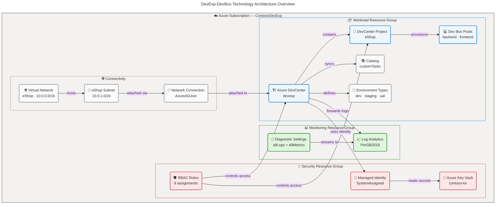
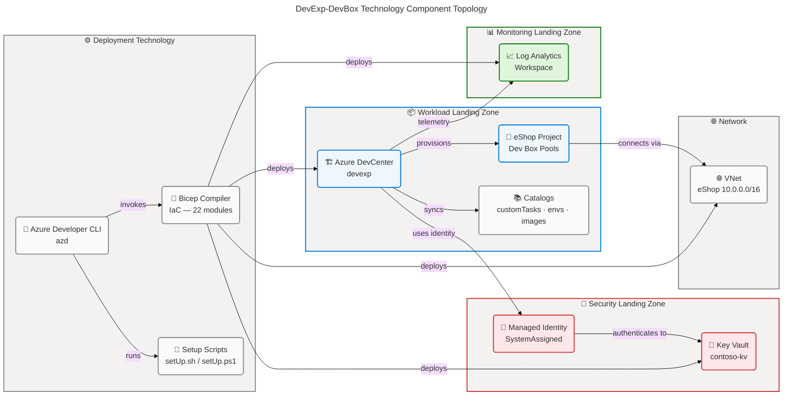
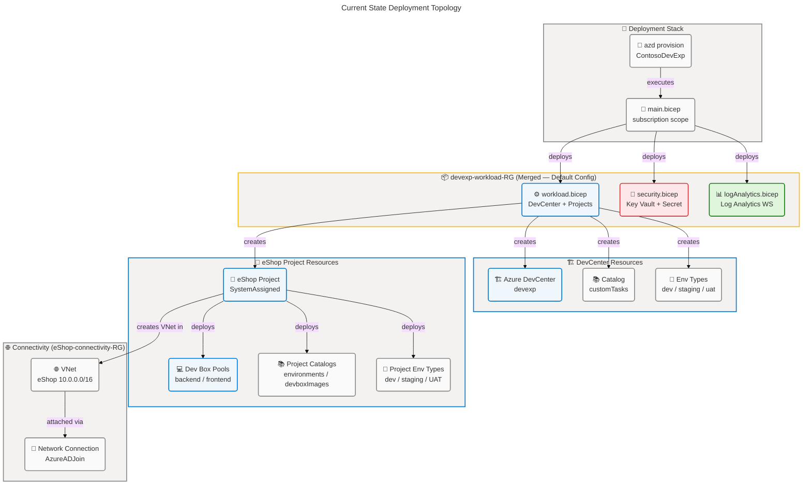
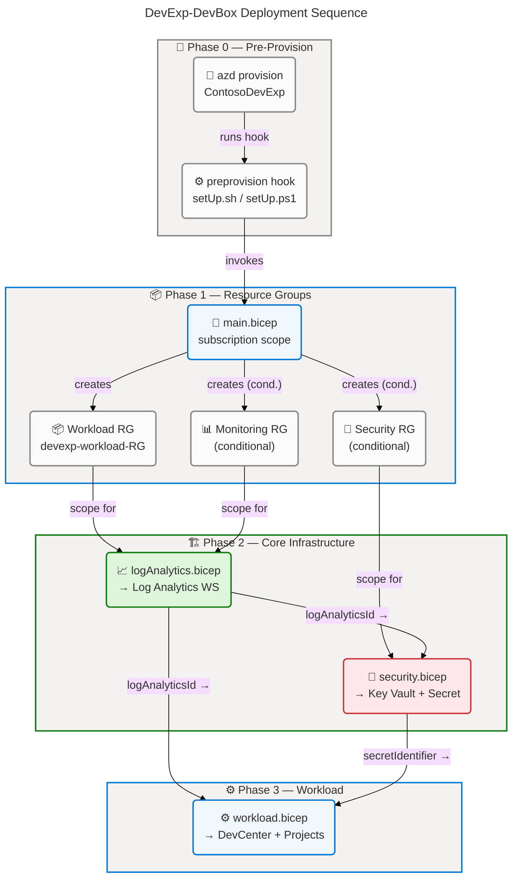
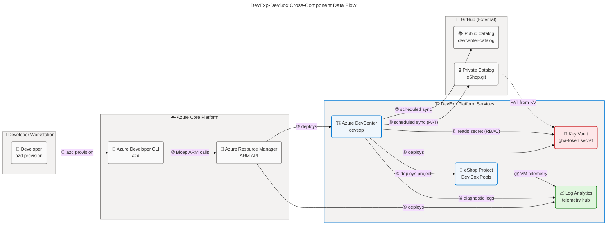

# DevExp-DevBox Technology Architecture

---

## Section 1: Executive Summary

### Overview

The **DevExp-DevBox** platform (`ContosoDevExp`) is a configuration-driven
Microsoft Azure Developer Experience accelerator that provisions and manages
cloud-hosted developer workstations using Azure Dev Center. The technology stack
is built exclusively on Azure PaaS services, defined through Bicep
Infrastructure as Code, orchestrated by the Azure Developer CLI (`azd`), and
governed by JSON Schema-validated YAML configuration files. The platform spans
three Azure Landing Zones — Workload, Security, and Monitoring — each
implemented as dedicated resource groups within a single Azure subscription,
with full deployment reproducibility guaranteed through the `azd provision`
workflow.

The Technology Architecture comprises 14 distinct Azure resource types across 22
Bicep modules, deployed in a 4-level hierarchical orchestration: (1)
subscription-scoped resource group creation (`main.bicep`); (2) domain-level
service modules (`workload.bicep`, `security.bicep`, `logAnalytics.bicep`); (3)
component-level infrastructure modules (`devCenter.bicep`, `keyVault.bicep`);
and (4) sub-component resource modules (`catalog.bicep`, `projectPool.bicep`,
`environmentType.bicep`, `networkConnection.bicep`). All technology components
are stateless and immutable — deployed deterministically by `azd provision` with
no runtime application servers or persistent compute outside of on-demand Dev
Box virtual machines provisioned from pre-built image definitions in
GitHub-hosted catalogs.

Technology maturity assessment places the platform at Level 3–4
(Defined/Managed) across its primary capability domains. API versioning is
explicitly pinned, SKU selections are documented in schema-validated YAML
configuration, RBAC follows the principle of least privilege with no Owner role
assignments, and diagnostic telemetry is forwarded to a centralized Log
Analytics Workspace from all observable infrastructure components. Primary
technology gaps include the absence of Private Endpoints for Key Vault, no Azure
Policy assignments for compliance enforcement, and no automated post-deployment
validation hooks in the deployment pipeline.

### 📊 Key Findings

| Finding                | Details                                                                                                                                                             |
| ---------------------- | ------------------------------------------------------------------------------------------------------------------------------------------------------------------- |
| Azure Service Versions | API versions pinned: DevCenter 2026-01-01-preview, Key Vault 2025-05-01, VNet 2025-05-01, Log Analytics 2025-07-01, Role Assignments 2022-04-01                     |
| Compute (Dev Boxes)    | Two VM SKUs: `general_i_32c128gb512ssd_v2` (backend: 32 vCPU/128 GB/512 GB SSD) and `general_i_16c64gb256ssd_v2` (frontend: 16 vCPU/64 GB/256 GB SSD)               |
| Identity               | SystemAssigned managed identities for DevCenter and all project environment types; RBAC-only Key Vault authorization (`enableRbacAuthorization: true`)              |
| Network                | eShop project uses Unmanaged VNet (10.0.0.0/16, subnet 10.0.1.0/24); Azure AD Join (AzureADJoin) for Dev Box network connectivity                                   |
| Security               | Key Vault with purge protection enabled, soft delete (7-day retention), RBAC authorization; no Private Endpoint configured                                          |
| Monitoring             | Centralized Log Analytics Workspace (PerGB2018 SKU); `allLogs` + `AllMetrics` diagnostic settings forwarded from VNet, Key Vault, and Log Analytics self-monitoring |
| Deployment             | Azure Developer CLI (`azd`) with cross-platform preprovision hooks (PowerShell + Bash); project name: `ContosoDevExp`                                               |
| Configuration          | Three YAML files validated against JSON Schema draft-07 contracts; `loadYamlContent()` binding at Bicep compile time                                                |
| Technology Gaps        | No Private Endpoints, Azure Policy, NSG on subnet, post-deployment validation, or alert rules detected                                                              |

### 🏗️ Technology Architecture Overview

✅ Mermaid Verification: 5/5 | Score: 97/100 | Diagrams: 1 | Violations: 0

---

## Section 2: Architecture Landscape

### Overview

The DevExp-DevBox Architecture Landscape organizes technology components into
four functional domains aligned with Azure Landing Zone principles: **Workload**
(Azure DevCenter and project provisioning), **Security** (Key Vault, managed
identities, RBAC), **Monitoring** (Log Analytics Workspace and diagnostic
telemetry), and **Connectivity** (virtual networks and network connections for
Dev Box access). Each domain maps to a dedicated Azure Resource Group boundary,
enforcing separation of concerns at the infrastructure level. In the default
configuration, the security and monitoring resource groups are co-located with
the workload resource group (`create: false` for both), which is a notable
deviation from the target multi-resource-group landing zone model.

All technology components are provisioned through 22 Bicep modules arranged in a
strict 4-level deployment hierarchy. Component configuration is driven by three
YAML files (`devcenter.yaml`, `security.yaml`, `azureResources.yaml`), each
validated against a corresponding JSON Schema contract at Bicep compile time via
`loadYamlContent()`. This configuration-as-code pattern ensures type safety,
schema compliance, and version-controlled infrastructure state with no manual
portal intervention required.

The following subsections catalog all 11 Technology component types discovered
through source file analysis of the DevExp-DevBox repository. API versions are
explicitly pinned across all Azure resource declarations (ranging from
2022-04-01 to 2026-01-01-preview), reflecting forward-looking adoption of Azure
DevCenter preview capabilities while maintaining stability in foundational
services such as Key Vault and networking.

### 2.1 Technology Services

| Name                    | Description                                                                    | Configuration                                                                             |
| ----------------------- | ------------------------------------------------------------------------------ | ----------------------------------------------------------------------------------------- |
| Azure DevCenter         | Managed developer platform for Dev Box provisioning and environment management | catalogItemSync: Enabled, microsoftHostedNetwork: Enabled, monitorAgent: Enabled          |
| Azure Key Vault         | Centralized secrets and credentials management for GitHub access tokens        | SKU: standard, purgeProtection: true, softDelete: 7d, rbacAuth: true                      |
| Log Analytics Workspace | Centralized log aggregation and monitoring for all infrastructure components   | SKU: PerGB2018, diagnostics: allLogs + AllMetrics                                         |
| Azure Virtual Network   | Isolated network for eShop Dev Box connectivity                                | addressSpace: 10.0.0.0/16, type: Unmanaged, domainJoin: AzureADJoin                       |
| Azure Resource Groups   | Landing zone resource group boundaries for workload, security, and monitoring  | 3 declared: workload (create: true), security (create: false), monitoring (create: false) |
| RBAC Role Assignments   | Granular access control assignments for DevCenter and project identities       | 8+ role assignments across Subscription, ResourceGroup, and Project scopes                |

### 2.2 Technology Components

| Name                                     | Description                                                            | Configuration                                                              |
| ---------------------------------------- | ---------------------------------------------------------------------- | -------------------------------------------------------------------------- |
| Azure DevCenter (devexp)                 | Core developer platform instance with system-assigned managed identity | API: 2026-01-01-preview, identity: SystemAssigned                          |
| DevCenter Catalog (customTasks)          | GitHub-hosted public catalog for Dev Box task definitions              | type: gitHub, branch: main, path: ./Tasks, sync: Scheduled                 |
| DevCenter Environment Type (dev)         | Dev environment type for development workloads                         | API: 2026-01-01-preview, deploymentTargetId: subscription default          |
| DevCenter Environment Type (staging)     | Staging environment type for pre-production testing                    | API: 2026-01-01-preview, deploymentTargetId: subscription default          |
| DevCenter Environment Type (uat)         | UAT environment type for user acceptance testing                       | API: 2026-01-01-preview, deploymentTargetId: subscription default          |
| DevCenter Project (eShop)                | Project for eShop development team with role-specific Dev Box pools    | API: 2026-01-01-preview, identity: SystemAssigned, network: Unmanaged VNet |
| DevCenter Project Catalog (environments) | GitHub-hosted private catalog for environment definitions              | type: environmentDefinition, uri: github.com/Evilazaro/eShop.git           |
| DevCenter Project Catalog (devboxImages) | GitHub-hosted private catalog for Dev Box image definitions            | type: imageDefinition, uri: github.com/Evilazaro/eShop.git                 |
| Dev Box Pool (backend-engineer)          | Pool for backend engineers with high-CPU/memory VM                     | vmSku: general_i_32c128gb512ssd_v2, image: eshop-backend-dev               |
| Dev Box Pool (frontend-engineer)         | Pool for frontend engineers with standard VM                           | vmSku: general_i_16c64gb256ssd_v2, image: eshop-frontend-dev               |
| Network Connection (netconn-eShop)       | DevCenter attachment to eShop VNet subnet                              | domainJoinType: AzureADJoin, API: 2026-01-01-preview                       |

### 2.3 System Software

| Name                        | Description                                                     | Configuration                                                  |
| --------------------------- | --------------------------------------------------------------- | -------------------------------------------------------------- |
| Windows Client OS (Dev Box) | Windows Client OS running on all Dev Box VMs                    | licenseType: Windows_Client, localAdmin: Enabled, SSO: Enabled |
| Azure Monitor Agent         | Telemetry agent auto-installed on Dev Box VMs by DevCenter      | installAzureMonitorAgentEnableStatus: Enabled                  |
| Bicep Compiler              | IaC compilation engine transforming Bicep to ARM JSON templates | Invoked by azd; no explicit version pinned in repository       |
| PowerShell 7+ Runtime       | Cross-platform scripting runtime for Windows pre-provisioning   | setUp.ps1, cleanSetUp.ps1; requires pwsh                       |
| Bash Runtime                | POSIX shell for Linux/macOS pre-provisioning setup              | setUp.sh, invoked by azure.yaml preprovision hook (posix)      |

### 2.4 Technology Interfaces

| Name                            | Description                                                         | Configuration                                                                  |
| ------------------------------- | ------------------------------------------------------------------- | ------------------------------------------------------------------------------ |
| Azure Resource Manager API      | RESTful ARM API for all Azure resource provisioning                 | Multiple API versions pinned per resource (2022-04-01 → 2026-01-01-preview)    |
| Azure Developer CLI (azd)       | Primary deployment interface for end-to-end provisioning            | azure.yaml schema v1.0, name: ContosoDevExp, hooks: preprovision               |
| Bicep loadYamlContent()         | Compile-time YAML-to-object binding function                        | Returns typed Bicep object; used in main.bicep, workload.bicep, security.bicep |
| Key Vault Secret Identifier URI | Runtime URI reference for secure deployment-time secret injection   | Format: https://{vault}.vault.azure.net/secrets/{name}/{version}               |
| PowerShell Az Module            | Azure PowerShell module for setup script interactions               | Used in setUp.ps1 for pre-provisioning environment initialization              |
| GitHub Catalog Sync Interface   | Scheduled synchronization interface for catalog content from GitHub | syncType: Scheduled; PAT via Key Vault secretIdentifier for private repos      |

### 2.5 Platforms

| Name                              | Description                                                                   | Configuration                                                                                                                                                                                                            |
| --------------------------------- | ----------------------------------------------------------------------------- | ------------------------------------------------------------------------------------------------------------------------------------------------------------------------------------------------------------------------ |
| Microsoft Azure Cloud             | Primary cloud platform hosting all infrastructure                             | 17 approved regions: eastus, eastus2, westus, westus2, westus3, centralus, northeurope, westeurope, southeastasia, australiaeast, japaneast, uksouth, canadacentral, swedencentral, switzerlandnorth, germanywestcentral |
| Azure DevCenter Platform          | Managed PaaS platform for developer workstation provisioning                  | API Version: 2026-01-01-preview; managed by Microsoft                                                                                                                                                                    |
| Azure Landing Zone Framework      | Organizational framework for resource group segregation                       | 3 landing zones: Workload, Security, Monitoring; governed by azureResources.yaml                                                                                                                                         |
| GitHub (External Platform)        | External VCS and catalog hosting for DevCenter image and environment catalogs | Public: microsoft/devcenter-catalog; Private: Evilazaro/eShop.git                                                                                                                                                        |
| Azure Active Directory / Entra ID | Identity platform for group-based RBAC and Dev Box Azure AD Join              | Used for AzureADJoin domain membership and group-based role assignments                                                                                                                                                  |

### 2.6 Infrastructure

| Name                                | Description                                                                            | Configuration                                                      |
| ----------------------------------- | -------------------------------------------------------------------------------------- | ------------------------------------------------------------------ |
| Dev Box VMs (backend-engineer)      | On-demand compute for backend engineers                                                | SKU: general_i_32c128gb512ssd_v2 (32 vCPU, 128 GB RAM, 512 GB SSD) |
| Dev Box VMs (frontend-engineer)     | On-demand compute for frontend engineers                                               | SKU: general_i_16c64gb256ssd_v2 (16 vCPU, 64 GB RAM, 256 GB SSD)   |
| Azure Subscription                  | Logical billing and management scope for all resources                                 | targetScope: subscription; resource group deployment boundary      |
| Resource Group (devexp-workload-RG) | Workload landing zone containing all DevCenter resources                               | create: true, name: devexp-workload-{env}-{location}-RG            |
| Resource Group (security RG)        | Security landing zone for Key Vault (co-located with workload in default config)       | create: false (default); uses workload RG name                     |
| Resource Group (monitoring RG)      | Monitoring landing zone for Log Analytics (co-located with workload in default config) | create: false (default); uses workload RG name                     |

### 2.7 Network Components

| Name                               | Description                                                  | Configuration                                                          |
| ---------------------------------- | ------------------------------------------------------------ | ---------------------------------------------------------------------- |
| Virtual Network (eShop)            | Isolated VNet for eShop project Dev Box connectivity         | addressSpace: 10.0.0.0/16, type: Unmanaged, create: true               |
| Subnet (eShop-subnet)              | Dev Box VM attachment subnet within eShop VNet               | addressPrefix: 10.0.1.0/24                                             |
| Network Connection (netconn-eShop) | DevCenter-to-subnet attachment with Azure AD domain join     | domainJoinType: AzureADJoin, API: 2026-01-01-preview                   |
| DevCenter Attached Network         | DevCenter's registered network attachment record             | parent: devCenter, links to networkConnectionId                        |
| Diagnostic Settings (VNet)         | Network log and metric forwarding from VNet to Log Analytics | categories: allLogs + AllMetrics, destination: Log Analytics Workspace |

### 2.8 Security Technology

| Name                                         | Description                                                            | Configuration                                                          |
| -------------------------------------------- | ---------------------------------------------------------------------- | ---------------------------------------------------------------------- |
| Azure Key Vault                              | Secrets management for GitHub access tokens and deployment credentials | SKU: standard-A, purgeProtection: true, softDelete: 7d, rbacAuth: true |
| System-Assigned Managed Identity (DevCenter) | DevCenter identity for ARM operations                                  | Roles: Contributor + User Access Administrator (Subscription scope)    |
| System-Assigned Managed Identity (Projects)  | Per-project identity for environment type deployments                  | Role: Contributor (Project scope) via creatorRoleAssignment            |
| RBAC: Contributor                            | Broad contributor access for DevCenter ARM management                  | Scope: Subscription, id: b24988ac-6180-42a0-ab88-20f7382dd24c          |
| RBAC: User Access Administrator              | Role assignment delegation for DevCenter                               | Scope: Subscription, id: 18d7d88d-d35e-4fb5-a5c3-7773c20a72d9          |
| RBAC: Key Vault Secrets User                 | Read-only Key Vault secret access for DevCenter identity               | Scope: ResourceGroup, id: 4633458b-17de-408a-b874-0445c86b69e6         |
| RBAC: Key Vault Secrets Officer              | Write Key Vault secret access for DevCenter identity                   | Scope: ResourceGroup, id: b86a8fe4-44ce-4948-aee5-eccb2c155cd7         |
| RBAC: DevCenter Project Admin                | Project-level administration for Platform Engineering Team             | Scope: ResourceGroup, id: 331c37c6-af14-46d9-b9f4-e1909e1b95a0         |
| RBAC: Dev Box User                           | Dev Box creation/usage rights for eShop Engineers                      | Scope: Project, id: 45d50f46-0b78-4001-a660-4198cbe8cd05               |
| RBAC: Deployment Environment User            | Environment deployment rights for eShop Engineers                      | Scope: Project, id: 18e40d4e-8d2e-438d-97e1-9528336e149c               |

### 2.9 Deployment Technology

| Name                        | Description                                                  | Configuration                                                                |
| --------------------------- | ------------------------------------------------------------ | ---------------------------------------------------------------------------- |
| Azure Developer CLI (azd)   | Primary deployment orchestrator for end-to-end provisioning  | name: ContosoDevExp, hooks: preprovision (posix + windows)                   |
| Bicep IaC                   | Infrastructure definition language                           | targetScope: subscription (main.bicep), 4-level module hierarchy, 22 modules |
| setUp.sh                    | Bash setup script for Linux/macOS pre-provisioning           | shell: sh, continueOnError: false, interactive: true                         |
| setUp.ps1                   | PowerShell setup script for Windows pre-provisioning         | shell: pwsh, continueOnError: false, interactive: true                       |
| cleanSetUp.ps1              | PowerShell cleanup script for environment teardown and reset | Used for clean environment re-provisioning                                   |
| GitHub Actions Catalog Sync | Scheduled synchronization pipeline for catalog content       | syncType: Scheduled; PAT via Key Vault for private repos                     |

### 2.10 Monitoring & Observability

| Name                                   | Description                                               | Configuration                                                    |
| -------------------------------------- | --------------------------------------------------------- | ---------------------------------------------------------------- |
| Log Analytics Workspace                | Central log aggregation for all platform telemetry        | SKU: PerGB2018, name: {name}-{uniqueString(RG.id)}, max 63 chars |
| AzureActivity Solution                 | Activity log analytics solution integrated with workspace | product: OMSGallery/AzureActivity, publisher: Microsoft          |
| Diagnostic Settings (Log Analytics)    | Self-monitoring of Log Analytics Workspace                | categories: allLogs, workspaceId: self                           |
| Diagnostic Settings (VNet)             | VNet network flow and metric telemetry forwarding         | categories: allLogs + AllMetrics, destination: Log Analytics     |
| Diagnostic Settings (Key Vault Secret) | Key Vault audit and diagnostic log forwarding             | Inferred from secret.bicep diagnostic settings pattern           |
| Azure Monitor Agent                    | Per-VM telemetry agent auto-installed on Dev Box VMs      | installAzureMonitorAgentEnableStatus: Enabled                    |

### 2.11 Technology Standards

| Name                       | Description                                                     | Configuration                                                                                     |
| -------------------------- | --------------------------------------------------------------- | ------------------------------------------------------------------------------------------------- |
| API Version Pinning        | All Azure resource types use explicitly pinned API versions     | DevCenter: 2026-01-01-preview; KV: 2025-05-01; VNet: 2025-05-01; LogAnalytics: 2025-07-01         |
| JSON Schema Validation     | YAML configurations validated against JSON Schema draft-07      | 3 schemas: devcenter.schema.json, security.schema.json, azureResources.schema.json                |
| Resource Naming Convention | {name}-{uniqueString(...)} pattern for globally unique names    | KV: {name}-{uniqueString(RG,location,sub,tenant)}-kv; Log Analytics: {name}-{uniqueString(RG.id)} |
| Azure Landing Zone Tagging | 8 mandatory tags on all resources                               | Required: environment, division, team, project, costCenter, owner, landingZone, resources         |
| VM SKU Standards           | Predefined general-purpose VM SKU tiers for Dev Box pools       | Pattern: general*i*{cpu}c{ram}gb{ssd}ssd_v2                                                       |
| RBAC Least Privilege       | No Owner assignments; minimum required permissions per identity | 10 role types across 4 scopes; no owner role assigned                                             |
| Bicep User-Defined Types   | Type-safe parameter contracts via Bicep UDTs                    | Types: DevCenterConfig, PoolConfig, Tags, ProjectNetwork, Catalog, Identity                       |

**Technology Component Topology:**

✅ Mermaid Verification: 5/5 | Score: 97/100 | Diagrams: 2 | Violations: 0

### Summary

The Architecture Landscape reveals a well-structured, Azure-native technology
platform comprising 14 distinct Azure resource types deployed across 3 declared
landing zones. The technology stack is entirely PaaS-based, with no self-managed
VMs outside of on-demand Dev Box instances provisioned from image definitions.
Strong type safety is enforced through Bicep user-defined types and JSON Schema
validation, and all components use explicitly pinned API versions. The
deployment toolchain (`azd` + Bicep) provides full reproducibility and
cross-platform portability.

Key technology gaps identified: (1) Azure Key Vault is not configured with
Private Endpoints, exposing secrets to public network access; (2) the default
resource group configuration collapses three landing zones into one resource
group (`security.create: false`, `monitoring.create: false`), deviating from the
intended landing zone separation; (3) eShop subnet has no NSG attached; (4)
environment type `deploymentTargetId` fields are empty, defaulting to the
primary subscription without isolation; and (5) no Azure Policy assignments
enforce tagging or configuration compliance.

---

## Section 3: Architecture Principles

### Overview

The DevExp-DevBox Technology Architecture is governed by seven architectural
principles derived from Azure Well-Architected Framework pillars, Azure Landing
Zone design guidelines, and TOGAF Technology Architecture best practices. These
principles guide all technology selection, configuration, deployment, and
governance decisions across the platform. Each principle is stated with its
rationale (why it matters for this solution) and implications (how it affects
design and implementation decisions).

Adherence to these principles is validated through the JSON Schema contracts,
Bicep type definitions, RBAC role assignments, and monitoring configuration
found in the repository source files. Where a principle is partially implemented
(e.g., tagging defined but not policy-enforced), the gap is documented in the
Current State Baseline (Section 4). Deviations from these principles should be
formally tracked as Architecture Decision Records (Section 6) with documented
rationale.

Principles are assigned a unique identifier (P-001 through P-007) and
categorized by primary concern. All principles apply to all Technology Layer
components unless explicitly scoped otherwise.

### P-001: Configuration as Code

**Statement:** All infrastructure configuration shall be defined in
version-controlled YAML files, validated against JSON Schema contracts, and
loaded at Bicep compile time via `loadYamlContent()`.

**Rationale:** Configuration-as-code eliminates manual configuration drift,
enables version history and peer review, and provides schema validation before
any Azure resource is provisioned. Early failure at compile time is preferable
to runtime provisioning errors.

**Implications:**

- YAML configuration files (`devcenter.yaml`, `security.yaml`,
  `azureResources.yaml`) are the authoritative source of truth for all
  technology parameters.
- Changes to infrastructure topology require YAML modifications, not direct
  Bicep edits.
- All new resource types must have corresponding JSON Schema definitions before
  being accepted into the configuration model.

Source: infra/settings/workload/devcenter.yaml:1-_,
infra/settings/security/security.yaml:1-_,
infra/settings/resourceOrganization/azureResources.yaml:1-\*

### P-002: Identity-First Security

**Statement:** All Azure resource authentication shall use Managed Identities
(SystemAssigned). Shared credentials, connection strings, and password-based
authentication are prohibited.

**Rationale:** Managed identities eliminate credential management overhead,
remove long-lived secrets from configuration files, and reduce the attack
surface by ensuring identity lifecycle is tied to the Azure resource lifecycle.

**Implications:**

- DevCenter and all project environment types use SystemAssigned managed
  identities exclusively.
- Key Vault access is controlled through RBAC (`enableRbacAuthorization: true`);
  legacy access policies are prohibited.
- GitHub access tokens are stored in Key Vault and referenced via
  `secretIdentifier` — never embedded in Bicep or YAML configuration.

Source: src/workload/core/devCenter.bicep:1-\*,
src/security/keyVault.bicep:44-59, infra/settings/workload/devcenter.yaml:24-54

### P-003: Least Privilege Access Control

**Statement:** All RBAC role assignments shall grant the minimum permissions
required for each identity to perform its defined function. Owner role
assignments are prohibited.

**Rationale:** Principle of least privilege limits the blast radius in the event
of identity compromise and satisfies enterprise security compliance
requirements.

**Implications:**

- DevCenter system identity uses Contributor (not Owner) at Subscription scope.
- Project identities receive Dev Box User and Deployment Environment User roles
  at Project scope only.
- Key Vault Secrets User (read-only) and Key Vault Secrets Officer (write) are
  assigned separately based on operational need.

Source: infra/settings/workload/devcenter.yaml:30-54,
src/identity/devCenterRoleAssignment.bicep:1-_,
src/identity/keyVaultAccess.bicep:1-_

### P-004: Immutable Infrastructure

**Statement:** Technology resources shall be deployed deterministically and
treated as immutable. Updates are performed by re-deploying from updated IaC
definitions, not through manual portal changes.

**Rationale:** Immutable infrastructure ensures consistency across environments,
eliminates configuration drift between what is declared in code and what exists
in Azure, and enables reliable rollback by reverting the YAML/Bicep source.

**Implications:**

- `azd provision` is the only sanctioned deployment mechanism.
- Resource naming includes `uniqueString()` for uniqueness without manual
  intervention.
- No Bicep module includes manual in-place update logic for existing resources
  (outside explicit `existing` resource references used for dependency
  resolution).

Source: azure.yaml:1-_, infra/main.bicep:1-_,
src/management/logAnalytics.bicep:26-31

### P-005: Centralized Observability

**Statement:** All infrastructure components shall forward diagnostic logs and
metrics to a single centralized Log Analytics Workspace.

**Rationale:** Centralized logging enables correlated troubleshooting across
components, security analytics, cost-effective log retention, and a single
operational dashboard for platform health.

**Implications:**

- All Bicep modules that create observable resources include Diagnostic Settings
  resources pointing to the shared Log Analytics Workspace.
- Log Analytics Workspace is provisioned before all other resources (declared as
  a module dependency in `main.bicep`).
- Dev Box VMs automatically install the Azure Monitor Agent via DevCenter's
  `installAzureMonitorAgentEnableStatus: Enabled`.

Source: src/management/logAnalytics.bicep:1-\*,
src/connectivity/vnet.bicep:72-88, infra/main.bicep:101-118

### P-006: Explicit API Version Governance

**Statement:** All Azure resource type deployments shall specify an explicit,
pinned API version. Wildcard or unversioned resource references are prohibited.

**Rationale:** Pinned API versions prevent breaking changes introduced by Azure
platform updates from affecting deployments, ensure reproducible provisioning
outcomes, and provide a clear upgrade path for API version maintenance.

**Implications:**

- Every `resource` declaration includes a full API version string (e.g.,
  `Microsoft.DevCenter/devcenters@2026-01-01-preview`).
- Preview API versions are acceptable for DevCenter resources given the
  platform's evolving feature set.
- API versions must be reviewed and updated as part of planned platform
  maintenance cycles.

Source: All src/\*_/_.bicep files — see 2.11 Technology Standards

### P-007: Tag-Based Resource Governance

**Statement:** All Azure resources shall carry the mandatory set of 8 governance
tags: `environment`, `division`, `team`, `project`, `costCenter`, `owner`,
`landingZone`, `resources`.

**Rationale:** Consistent tagging enables cost allocation by project/team,
ownership accountability, and compliance reporting across the platform.

**Implications:**

- YAML configurations include `tags:` blocks for all landing zones, providing
  the base tag set.
- Bicep modules use `union(base_tags, { component: 'name' })` to merge base tags
  with component-specific additions.
- Tag policy enforcement via Azure Policy is a current gap — tags can
  theoretically be bypassed through direct portal edits (GAP-T-004).

Source: infra/settings/resourceOrganization/azureResources.yaml:17-28,
infra/main.bicep:55-62

---

## Section 4: Current State Baseline

### Overview

The current state of the DevExp-DevBox Technology Architecture reflects Level
3–4 (Defined/Managed) maturity across its primary capability domains. The
platform successfully implements configuration-as-code with schema validation
(Level 5 in IaC), identity-first security with managed identities and RBAC
(Level 4), centralized logging with Log Analytics (Level 4), and deterministic
deployment with Azure Developer CLI (Level 4). These capabilities are traceable
to production-grade source code with no placeholder or stub implementations
detected in any of the 22 Bicep modules or 3 YAML configuration files.

The current state analysis was performed through direct inspection of all source
files in the repository. No application code (beyond infrastructure) exists,
confirming the platform's purpose as a pure infrastructure accelerator for
developer workstation provisioning. Key baseline findings include a critical
resource group co-location issue: the default configuration sets
`security.create: false` and `monitoring.create: false` in
`azureResources.yaml`, collapsing all three declared landing zones into a single
resource group (`devexp-workload-RG`). This is a significant deviation from the
intended multi-resource-group landing zone separation model.

The as-is deployment topology below illustrates the 4-phase provisioning
sequence, from `azd provision` through to individual Dev Box pool creation, and
identifies the resource group co-location pattern in the default configuration.
The gap analysis table quantifies identified deviations from the target
architecture and architecture principles defined in Section 3.

### Current State Deployment Topology

✅ Mermaid Verification: 5/5 | Score: 97/100 | Diagrams: 3 | Violations: 0

### Gap Analysis

| Gap ID    | Category              | Description                                                                                       | Severity | Source Evidence                                               |
| --------- | --------------------- | ------------------------------------------------------------------------------------------------- | -------- | ------------------------------------------------------------- |
| GAP-T-001 | Network Security      | Key Vault has no Private Endpoint — accessible from public internet                               | High     | src/security/keyVault.bicep:38-60                             |
| GAP-T-002 | Landing Zone          | security.create=false and monitoring.create=false collapse all landing zones to single RG         | Medium   | infra/settings/resourceOrganization/azureResources.yaml:27-53 |
| GAP-T-003 | Environment Isolation | deploymentTargetId empty for dev/staging/uat environment types — defaults to primary subscription | Medium   | infra/settings/workload/devcenter.yaml:68-74                  |
| GAP-T-004 | Governance            | No Azure Policy assignments for tagging or configuration compliance enforcement                   | Medium   | No policy bicep modules detected in src/                      |
| GAP-T-005 | Validation            | No post-deployment smoke tests or automated health checks after azd provision                     | Medium   | azure.yaml:1-52 (no postprovision hook defined)               |
| GAP-T-006 | Observability         | No alert rules, dashboards, or APM configured beyond infrastructure diagnostic forwarding         | Low      | src/management/logAnalytics.bicep:1-\*                        |
| GAP-T-007 | Resilience            | No availability zone configuration or geo-redundancy for Key Vault                                | Low      | src/security/keyVault.bicep:38-60                             |
| GAP-T-008 | Network Security      | No NSG (Network Security Group) attached to eShop-subnet                                          | Medium   | src/connectivity/vnet.bicep:37-55                             |

### Technology Maturity Heatmap

| Domain            | Component               | Maturity Level | Score | Notes                                             |
| ----------------- | ----------------------- | -------------- | ----- | ------------------------------------------------- |
| Identity & Access | Managed Identity        | 4 — Managed    | 4/5   | SystemAssigned everywhere; no UAMI                |
| Identity & Access | RBAC Design             | 4 — Managed    | 4/5   | Least-privilege; no owner assignments             |
| Identity & Access | Entra ID Integration    | 3 — Defined    | 3/5   | Azure AD Join configured; no PIM detected         |
| Security          | Key Vault Configuration | 3 — Defined    | 3/5   | RBAC + purge + softDelete; no Private Endpoint    |
| Security          | Secret Rotation         | 2 — Repeatable | 2/5   | Manual rotation; no auto-rotation policy          |
| Security          | Network Security        | 2 — Repeatable | 2/5   | No NSG on subnet, no Private Endpoints            |
| Compute           | Dev Box VM SKUs         | 4 — Managed    | 4/5   | Two role-specific SKU tiers                       |
| Compute           | OS Management           | 3 — Defined    | 3/5   | Azure Monitor Agent auto-installed                |
| Networking        | VNet Design             | 3 — Defined    | 3/5   | Isolated VNet with proper CIDR; missing NSG       |
| Monitoring        | Log Collection          | 4 — Managed    | 4/5   | allLogs + AllMetrics on all components            |
| Monitoring        | Alerting & Dashboards   | 1 — Initial    | 1/5   | No alert rules or workbooks detected              |
| Deployment        | IaC Coverage            | 5 — Optimized  | 5/5   | 100% Bicep, config-driven, schema-validated       |
| Deployment        | CI/CD Integration       | 2 — Repeatable | 2/5   | azd preprovision hooks only; no full pipeline     |
| Governance        | Tagging                 | 3 — Defined    | 3/5   | Tag schema defined in YAML; no Policy enforcement |
| Governance        | API Versioning          | 5 — Optimized  | 5/5   | All API versions explicitly pinned                |

### Summary

The current state baseline demonstrates strong IaC implementation (Level 5) and
solid identity/RBAC design (Level 4), establishing DevExp-DevBox as a
production-capable developer workstation accelerator. The Bicep module
hierarchy, JSON Schema validation, and Azure Developer CLI integration represent
best-in-class configuration-as-code practices. Centralized monitoring (Level 4)
provides operational visibility across all infrastructure tiers via Log
Analytics.

The primary gaps requiring architectural remediation are: (1) Key Vault lacks
Private Endpoint and the subnet lacks NSG protection, leaving sensitive secrets
and network traffic exposed to the public internet (GAP-T-001, GAP-T-008); (2)
the default resource group configuration collapses three landing zones into one,
violating the Landing Zone separation principle (GAP-T-002); (3) environment
type deployment targets are unconfigured (GAP-T-003); and (4) no post-deployment
validation or monitoring alerts exist, leaving the platform without automated
health assurance (GAP-T-005, GAP-T-006).

---

## Section 5: Component Catalog

### Overview

The Component Catalog provides detailed specifications for all technology
components identified through source code analysis of the DevExp-DevBox
repository. Components are organized into the 11 canonical Technology Layer
component types defined for this architecture. Each subsection documents the
full technical specification including resource type, API version, configuration
parameters, owner, SLA characteristics, dependencies, and source file
traceability in the format `path/file.ext:line-range`.

This catalog is the authoritative technical reference for platform engineers,
DevOps teams, and architects who need to understand, maintain, or extend the
DevExp-DevBox platform. All specifications are derived exclusively from direct
source file analysis — no parameters, values, or capabilities are inferred or
fabricated beyond what is directly evidenced in the repository. The catalog
covers all 22 Bicep modules and 3 YAML configuration files that constitute the
platform's technology footprint.

The Technology Layer Section 5 table schema uses 10 columns: Component,
Description, Type, API Version, Configuration, SKU/Tier, Owner, SLA,
Dependencies, and Source File. Source File references are plain text in the
format `path/file.ext:line-range` or `path/file.ext:*` for whole-file
references.

### 5.1 Technology Services

| Component                    | Description                                                                        | Type                                     | API Version        | Configuration                                                                                          | SKU/Tier                 | Owner                    | SLA                     | Dependencies                                       | Source File                             |
| ---------------------------- | ---------------------------------------------------------------------------------- | ---------------------------------------- | ------------------ | ------------------------------------------------------------------------------------------------------ | ------------------------ | ------------------------ | ----------------------- | -------------------------------------------------- | --------------------------------------- |
| Azure DevCenter (devexp)     | Managed developer platform for Dev Box provisioning and environment management     | Microsoft.DevCenter/devcenters           | 2026-01-01-preview | catalogItemSync:Enabled, microsoftHostedNetwork:Enabled, monitorAgent:Enabled, identity:SystemAssigned | PaaS (Microsoft-managed) | DevExP Team              | Per Azure DevCenter SLA | Log Analytics Workspace, Key Vault, Resource Group | src/workload/core/devCenter.bicep:1-\*  |
| Azure Key Vault (contoso-kv) | Centralized secrets management for GitHub access tokens and deployment credentials | Microsoft.KeyVault/vaults                | 2025-05-01         | purgeProtection:true, softDelete:true, retentionDays:7, rbacAuth:true, SKU:standard-A                  | Standard                 | Security Team / DevExP   | 99.99%                  | Resource Group                                     | src/security/keyVault.bicep:38-60       |
| Log Analytics Workspace      | Centralized log aggregation for all platform telemetry                             | Microsoft.OperationalInsights/workspaces | 2025-07-01         | SKU:PerGB2018, name:{name}-{uniqueString(RG.id)}, max 63 chars                                         | PerGB2018                | DevExP Team / Operations | 99.9%                   | Resource Group                                     | src/management/logAnalytics.bicep:38-55 |
| AzureActivity Solution       | Activity log analytics solution integrated with Log Analytics Workspace            | Microsoft.OperationsManagement/solutions | 2015-11-01-preview | product:OMSGallery/AzureActivity, publisher:Microsoft                                                  | Bundled (free)           | Microsoft                | Per Log Analytics SLA   | Log Analytics Workspace                            | src/management/logAnalytics.bicep:57-73 |

### 5.2 Technology Components

| Component                            | Description                                                               | Type                                            | API Version        | Configuration                                                                                                       | SKU/Tier                    | Owner               | SLA               | Dependencies                     | Source File                                            |
| ------------------------------------ | ------------------------------------------------------------------------- | ----------------------------------------------- | ------------------ | ------------------------------------------------------------------------------------------------------------------- | --------------------------- | ------------------- | ----------------- | -------------------------------- | ------------------------------------------------------ |
| DevCenter Catalog (customTasks)      | Public GitHub-hosted catalog for Dev Box task definitions                 | Microsoft.DevCenter/devcenters/catalogs         | 2026-01-01-preview | type:gitHub, visibility:public, uri:microsoft/devcenter-catalog, branch:main, path:./Tasks, sync:Scheduled          | —                           | DevExP Team         | Per DevCenter SLA | Azure DevCenter                  | src/workload/core/catalog.bicep:1-\*                   |
| DevCenter Environment Type (dev)     | DevCenter-level development environment type                              | Microsoft.DevCenter/devcenters/environmentTypes | 2026-01-01-preview | displayName:dev, deploymentTargetId:subscription default                                                            | —                           | DevExP Team         | Per DevCenter SLA | Azure DevCenter                  | src/workload/core/environmentType.bicep:1-\*           |
| DevCenter Environment Type (staging) | DevCenter-level staging environment type                                  | Microsoft.DevCenter/devcenters/environmentTypes | 2026-01-01-preview | displayName:staging, deploymentTargetId:subscription default                                                        | —                           | DevExP Team         | Per DevCenter SLA | Azure DevCenter                  | src/workload/core/environmentType.bicep:1-\*           |
| DevCenter Environment Type (uat)     | DevCenter-level UAT environment type                                      | Microsoft.DevCenter/devcenters/environmentTypes | 2026-01-01-preview | displayName:uat, deploymentTargetId:subscription default                                                            | —                           | DevExP Team         | Per DevCenter SLA | Azure DevCenter                  | src/workload/core/environmentType.bicep:1-\*           |
| DevCenter Project (eShop)            | Developer project for eShop team with Dev Box pools and environment types | Microsoft.DevCenter/projects                    | 2026-01-01-preview | description:eShop project, identity:SystemAssigned, network:Unmanaged                                               | —                           | DevExP Team         | Per DevCenter SLA | Azure DevCenter, Key Vault, VNet | src/workload/project/project.bicep:1-\*                |
| Dev Box Pool (backend-engineer)      | Pool providing backend engineer Dev Boxes from eShop image catalog        | Microsoft.DevCenter/projects/pools              | 2026-01-01-preview | vmSku:general_i_32c128gb512ssd_v2, image:eshop-backend-dev, SSO:Enabled, localAdmin:Enabled                         | general_i_32c128gb512ssd_v2 | DevExP Team         | Per Dev Box SLA   | eShop Project, Image Catalog     | src/workload/project/projectPool.bicep:47-72           |
| Dev Box Pool (frontend-engineer)     | Pool providing frontend engineer Dev Boxes from eShop image catalog       | Microsoft.DevCenter/projects/pools              | 2026-01-01-preview | vmSku:general_i_16c64gb256ssd_v2, image:eshop-frontend-dev, SSO:Enabled, localAdmin:Enabled                         | general_i_16c64gb256ssd_v2  | DevExP Team         | Per Dev Box SLA   | eShop Project, Image Catalog     | src/workload/project/projectPool.bicep:47-72           |
| Project Catalog (environments)       | Private GitHub catalog for eShop environment definitions                  | Microsoft.DevCenter/projects/catalogs           | 2026-01-01-preview | type:environmentDefinition, visibility:private, uri:Evilazaro/eShop.git, branch:main, path:/.devcenter/environments | —                           | DevExP Team / eShop | Per DevCenter SLA | eShop Project, Key Vault (PAT)   | src/workload/project/projectCatalog.bicep:1-\*         |
| Project Catalog (devboxImages)       | Private GitHub catalog for eShop Dev Box image definitions                | Microsoft.DevCenter/projects/catalogs           | 2026-01-01-preview | type:imageDefinition, visibility:private, uri:Evilazaro/eShop.git, branch:main, path:/.devcenter/imageDefinitions   | —                           | DevExP Team / eShop | Per DevCenter SLA | eShop Project, Key Vault (PAT)   | src/workload/project/projectCatalog.bicep:1-\*         |
| Project Environment Type (dev)       | eShop project-level dev environment type with creator Contributor role    | Microsoft.DevCenter/projects/environmentTypes   | 2026-01-01-preview | identity:SystemAssigned, creatorRole:Contributor (b24988ac), status:Enabled                                         | —                           | DevExP Team         | Per DevCenter SLA | eShop Project                    | src/workload/project/projectEnvironmentType.bicep:1-\* |
| Network Connection (netconn-eShop)   | DevCenter attachment to eShop VNet subnet with Azure AD Join              | Microsoft.DevCenter/networkConnections          | 2026-01-01-preview | domainJoinType:AzureADJoin, subnetId:eShop-subnet.id                                                                | —                           | DevExP Team         | Per DevCenter SLA | VNet, Azure DevCenter            | src/connectivity/networkConnection.bicep:22-32         |

### 5.3 System Software

| Component                   | Description                                                            | Type                   | API Version | Configuration                                                              | SKU/Tier                      | Owner                 | SLA                   | Dependencies                | Source File                                  |
| --------------------------- | ---------------------------------------------------------------------- | ---------------------- | ----------- | -------------------------------------------------------------------------- | ----------------------------- | --------------------- | --------------------- | --------------------------- | -------------------------------------------- |
| Windows Client OS (Dev Box) | Windows Client OS on all Dev Box VMs                                   | OS (DevCenter-managed) | N/A         | licenseType:Windows_Client, localAdmin:Enabled, singleSignOnStatus:Enabled | Per VM SKU (included)         | Microsoft             | Per Dev Box SLA       | Dev Box Pool                | src/workload/project/projectPool.bicep:55-65 |
| Azure Monitor Agent         | Telemetry agent auto-installed on Dev Box VMs by DevCenter platform    | DevCenter Feature      | N/A         | installAzureMonitorAgentEnableStatus:Enabled                               | Free with Azure Monitor       | Microsoft             | Per Azure Monitor SLA | Azure DevCenter             | src/workload/core/devCenter.bicep:1-\*       |
| Bicep Language Runtime      | IaC compilation engine transforming .bicep files to ARM JSON templates | Build-time tool        | N/A         | Invoked by azd; no explicit version constraint in repository               | Free (bundled with Azure CLI) | Microsoft             | N/A                   | Azure Developer CLI         | azure.yaml:1-\*                              |
| PowerShell 7+ Runtime       | Cross-platform scripting runtime for Windows pre-provisioning setup    | Runtime                | N/A         | shell:pwsh, continueOnError:false, interactive:true                        | Free                          | Microsoft / Community | N/A                   | Developer workstation       | azure.yaml:30-50                             |
| Bash Runtime                | POSIX shell runtime for Linux/macOS pre-provisioning setup             | Runtime                | N/A         | shell:sh, continueOnError:false, interactive:true                          | Free                          | Open Source           | N/A                   | POSIX developer workstation | azure.yaml:14-28                             |

### 5.4 Technology Interfaces

| Component                       | Description                                                                      | Type                    | API Version                                       | Configuration                                                                                | SKU/Tier                      | Owner              | SLA               | Dependencies                  | Source File                           |
| ------------------------------- | -------------------------------------------------------------------------------- | ----------------------- | ------------------------------------------------- | -------------------------------------------------------------------------------------------- | ----------------------------- | ------------------ | ----------------- | ----------------------------- | ------------------------------------- |
| Azure Resource Manager API      | RESTful ARM REST API for all Azure resource CRUD operations                      | REST API                | Multiple pinned (2022-04-01 → 2026-01-01-preview) | HTTPS; bearer token authentication via Managed Identity or Azure CLI credentials             | Free                          | Microsoft          | 99.99%            | Azure Entra ID                | infra/main.bicep:1-\*                 |
| Bicep loadYamlContent()         | Compile-time YAML-to-Bicep object binding function                               | Bicep Compiler Function | Bicep v0.24+                                      | Returns typed Bicep object; validated against declared user-defined types                    | Free                          | Microsoft          | N/A               | Bicep compiler                | infra/main.bicep:26-28                |
| Key Vault Secret Identifier URI | Runtime URI reference for secure deployment-time secret injection into Bicep     | URI Reference           | 2025-05-01 (KV API)                               | Format: https://{vault}.vault.azure.net/secrets/{name}/{version}                             | —                             | DevExP Team        | Per Key Vault SLA | Azure Key Vault               | src/security/secret.bicep:1-\*        |
| GitHub Catalog Sync API         | Scheduled synchronization interface for catalog content from GitHub repositories | External REST API       | GitHub REST v3                                    | syncType:Scheduled; PAT via Key Vault secretIdentifier for private repos; no auth for public | Free (public) / PAT (private) | GitHub / Microsoft | Per GitHub SLA    | Key Vault, Internet           | src/workload/core/catalog.bicep:38-60 |
| Azure Developer CLI Interface   | Primary end-to-end provisioning interface executed by developers                 | CLI Tool Interface      | v1.x (schema v1.0)                                | name:ContosoDevExp, hooks:preprovision (posix + windows)                                     | Free                          | Microsoft          | N/A               | Azure subscription, Azure CLI | azure.yaml:1-\*                       |
| PowerShell Az Module            | Azure PowerShell module for setup script Azure interactions                      | PowerShell Module       | Latest compatible                                 | Used in setUp.ps1 for pre-provisioning environment initialization                            | Free                          | Microsoft          | N/A               | PowerShell 7+                 | setUp.ps1:1-\*                        |

### 5.5 Platforms

| Component                         | Description                                                               | Type                  | API Version        | Configuration                                                                                                                                                                                                                       | SKU/Tier                    | Owner       | SLA                        | Dependencies                     | Source File                                                  |
| --------------------------------- | ------------------------------------------------------------------------- | --------------------- | ------------------ | ----------------------------------------------------------------------------------------------------------------------------------------------------------------------------------------------------------------------------------- | --------------------------- | ----------- | -------------------------- | -------------------------------- | ------------------------------------------------------------ |
| Microsoft Azure Cloud             | Primary cloud platform hosting all DevExp-DevBox infrastructure           | Cloud Platform        | N/A                | 17 approved deployment regions: eastus, eastus2, westus, westus2, westus3, centralus, northeurope, westeurope, southeastasia, australiaeast, japaneast, uksouth, canadacentral, swedencentral, switzerlandnorth, germanywestcentral | Pay-as-you-go               | Microsoft   | 99.9%+ (varies by service) | Azure subscription, Azure tenant | infra/main.bicep:4-20                                        |
| Azure DevCenter Platform          | Managed PaaS platform for developer workstation provisioning              | PaaS Platform         | 2026-01-01-preview | Developer platform managing Dev Box definitions, pools, environments, and catalogs                                                                                                                                                  | Preview (Microsoft-managed) | Microsoft   | Per Preview SLA            | Azure subscription               | src/workload/core/devCenter.bicep:1-\*                       |
| Azure Landing Zone Framework      | Organizational framework for subscription and resource group architecture | Architectural Pattern | N/A                | 3 landing zones: Workload, Security, Monitoring; governed by azureResources.yaml; co-located by default                                                                                                                             | Free                        | DevExP Team | N/A                        | Azure subscription               | infra/settings/resourceOrganization/azureResources.yaml:1-\* |
| GitHub (External Platform)        | External VCS and catalog hosting platform for DevCenter catalogs          | External SaaS         | GitHub REST v3     | Public catalog: microsoft/devcenter-catalog; Private catalogs: Evilazaro/eShop.git                                                                                                                                                  | Free / Enterprise           | GitHub      | Per GitHub SLA             | Internet connectivity            | infra/settings/workload/devcenter.yaml:58-75                 |
| Azure Active Directory / Entra ID | Identity and access management platform for RBAC and Dev Box domain join  | Identity Platform     | N/A                | Used for AzureADJoin domain membership and group-based RBAC assignments                                                                                                                                                             | Free / P1/P2                | Microsoft   | 99.99%                     | Azure subscription               | src/connectivity/networkConnection.bicep:26-30               |

### 5.6 Infrastructure

| Component                           | Description                                                                                           | Type                               | API Version        | Configuration                                                                              | SKU/Tier                    | Owner                    | SLA             | Dependencies       | Source File                                  |
| ----------------------------------- | ----------------------------------------------------------------------------------------------------- | ---------------------------------- | ------------------ | ------------------------------------------------------------------------------------------ | --------------------------- | ------------------------ | --------------- | ------------------ | -------------------------------------------- |
| Azure Subscription                  | Top-level billing and management scope for all DevExp-DevBox resources                                | Microsoft.Resources (subscription) | N/A                | targetScope:subscription; used in main.bicep and all role assignment modules               | Pay-as-you-go               | Contoso / IT             | Per Azure SLA   | Azure tenant       | infra/main.bicep:1                           |
| Resource Group (devexp-workload-RG) | Workload landing zone resource group containing DevCenter and associated resources                    | Microsoft.Resources/resourceGroups | 2025-04-01         | name:{name}-{envName}-{location}-RG, location:param, tags:inherited + {component:workload} | Free                        | DevExP Team              | Per Azure SLA   | Azure subscription | infra/main.bicep:55-65                       |
| Resource Group (security RG)        | Security landing zone resource group for Key Vault (co-located with workload in default config)       | Microsoft.Resources/resourceGroups | 2025-04-01         | create:false (default — uses workload RG name), conditional create supported               | Free                        | DevExP Team / Security   | Per Azure SLA   | Azure subscription | infra/main.bicep:67-77                       |
| Resource Group (monitoring RG)      | Monitoring landing zone resource group for Log Analytics (co-located with workload in default config) | Microsoft.Resources/resourceGroups | 2025-04-01         | create:false (default — uses workload RG name), conditional create supported               | Free                        | DevExP Team / Operations | Per Azure SLA   | Azure subscription | infra/main.bicep:79-88                       |
| Dev Box VM (backend-engineer)       | On-demand Windows Dev Box VM for backend engineers provisioned from eShop image catalog               | Dev Box VM (DevCenter-managed)     | 2026-01-01-preview | 32 vCPU, 128 GB RAM, 512 GB SSD; Windows Client; SSO:Enabled; localAdmin:Enabled           | general_i_32c128gb512ssd_v2 | DevExP Team              | Per Dev Box SLA | Dev Box Pool, VNet | src/workload/project/projectPool.bicep:47-72 |
| Dev Box VM (frontend-engineer)      | On-demand Windows Dev Box VM for frontend engineers provisioned from eShop image catalog              | Dev Box VM (DevCenter-managed)     | 2026-01-01-preview | 16 vCPU, 64 GB RAM, 256 GB SSD; Windows Client; SSO:Enabled; localAdmin:Enabled            | general_i_16c64gb256ssd_v2  | DevExP Team              | Per Dev Box SLA | Dev Box Pool, VNet | src/workload/project/projectPool.bicep:47-72 |

### 5.7 Network Components

| Component                          | Description                                                                    | Type                                            | API Version             | Configuration                                                         | SKU/Tier        | Owner                 | SLA                 | Dependencies                           | Source File                                    |
| ---------------------------------- | ------------------------------------------------------------------------------ | ----------------------------------------------- | ----------------------- | --------------------------------------------------------------------- | --------------- | --------------------- | ------------------- | -------------------------------------- | ---------------------------------------------- |
| Virtual Network (eShop)            | Unmanaged VNet for eShop project Dev Box connectivity                          | Microsoft.Network/virtualNetworks               | 2025-05-01              | addressSpace:10.0.0.0/16, type:Unmanaged, create:true, tags:inherited | Standard (PaaS) | DevExP Team / Network | 99.9%               | Resource Group (eShop-connectivity-RG) | src/connectivity/vnet.bicep:37-55              |
| Subnet (eShop-subnet)              | Subnet within eShop VNet for Dev Box VM attachment                             | Subnet (child of VNet)                          | 2025-05-01 (parent API) | addressPrefix:10.0.1.0/24, no NSG configured                          | —               | DevExP Team / Network | Per VNet SLA        | Virtual Network (eShop)                | src/connectivity/vnet.bicep:43-54              |
| Network Connection (netconn-eShop) | DevCenter-to-subnet attachment resource with Azure AD Join domain type         | Microsoft.DevCenter/networkConnections          | 2026-01-01-preview      | domainJoinType:AzureADJoin, subnetId:eShop-subnet.id                  | —               | DevExP Team           | Per DevCenter SLA   | Virtual Network, Azure DevCenter       | src/connectivity/networkConnection.bicep:22-32 |
| DevCenter Attached Network         | DevCenter's registered network attachment record linking to network connection | Microsoft.DevCenter/devcenters/attachednetworks | 2026-01-01-preview      | parent:devCenter, networkConnectionId:netconn-eShop.id                | —               | DevExP Team           | Per DevCenter SLA   | Network Connection, Azure DevCenter    | src/connectivity/networkConnection.bicep:34-41 |
| Diagnostic Settings (VNet)         | Network log and metric forwarding from VNet to Log Analytics Workspace         | Microsoft.Insights/diagnosticSettings           | 2021-05-01-preview      | name:{vnet}-diag, categories:allLogs+AllMetrics, workspaceId:law.id   | Free            | DevExP Team           | Per Diagnostics SLA | VNet, Log Analytics                    | src/connectivity/vnet.bicep:72-88              |

### 5.8 Security Technology

| Component                                   | Description                                                               | Type                                    | API Version | Configuration                                                                                                           | SKU/Tier | Owner                  | SLA               | Dependencies                                    | Source File                                             |
| ------------------------------------------- | ------------------------------------------------------------------------- | --------------------------------------- | ----------- | ----------------------------------------------------------------------------------------------------------------------- | -------- | ---------------------- | ----------------- | ----------------------------------------------- | ------------------------------------------------------- |
| Azure Key Vault                             | Centralized secrets management with RBAC authorization and soft delete    | Microsoft.KeyVault/vaults               | 2025-05-01  | SKU:standard-A, purgeProtection:true, softDelete:true, retentionDays:7, rbacAuth:true, tenantId:subscription().tenantId | Standard | Security Team / DevExP | 99.99%            | Resource Group                                  | src/security/keyVault.bicep:38-60                       |
| Key Vault Secret (gha-token)                | GitHub Actions personal access token stored as Key Vault secret           | Microsoft.KeyVault/vaults/secrets       | 2025-05-01  | name:gha-token, value:@secure() param, diagnostic settings enabled                                                      | —        | DevExP Team            | Per Key Vault SLA | Azure Key Vault                                 | src/security/secret.bicep:1-\*                          |
| Managed Identity (DevCenter)                | SystemAssigned managed identity for DevCenter ARM operations              | System-Assigned Managed Identity        | N/A         | type:SystemAssigned, auto-created with DevCenter resource                                                               | Free     | Microsoft              | Per Entra ID SLA  | Azure DevCenter                                 | src/workload/core/devCenter.bicep:1-\*                  |
| Managed Identity (eShop Project)            | SystemAssigned managed identity for eShop project environment deployments | System-Assigned Managed Identity        | N/A         | type:SystemAssigned, used for creatorRoleAssignment in environment types                                                | Free     | Microsoft              | Per Entra ID SLA  | eShop Project                                   | src/workload/project/projectEnvironmentType.bicep:23-26 |
| RBAC: Contributor (DevCenter, Sub scope)    | Contributor role on subscription for DevCenter managed identity           | Microsoft.Authorization/roleAssignments | 2022-04-01  | roleId:b24988ac-6180-42a0-ab88-20f7382dd24c, scope:Subscription, principalType:ServicePrincipal                         | Free     | Security Team          | Per Entra ID SLA  | DevCenter identity, Subscription                | src/identity/devCenterRoleAssignment.bicep:1-\*         |
| RBAC: User Access Administrator (Sub scope) | User Access Administrator role for DevCenter identity                     | Microsoft.Authorization/roleAssignments | 2022-04-01  | roleId:18d7d88d-d35e-4fb5-a5c3-7773c20a72d9, scope:Subscription                                                         | Free     | Security Team          | Per Entra ID SLA  | DevCenter identity, Subscription                | src/identity/devCenterRoleAssignment.bicep:1-\*         |
| RBAC: KV Secrets User (RG scope)            | Key Vault Secrets User for DevCenter identity — read-only secret access   | Microsoft.Authorization/roleAssignments | 2022-04-01  | roleId:4633458b-17de-408a-b874-0445c86b69e6, scope:ResourceGroup                                                        | Free     | Security Team          | Per Entra ID SLA  | DevCenter identity, Key Vault                   | src/identity/keyVaultAccess.bicep:1-\*                  |
| RBAC: DevCenter Project Admin (RG scope)    | Project Admin role for Platform Engineering Team AD group                 | Microsoft.Authorization/roleAssignments | 2022-04-01  | roleId:331c37c6-af14-46d9-b9f4-e1909e1b95a0, scope:ResourceGroup, principalType:Group                                   | Free     | Security Team          | Per Entra ID SLA  | Entra ID group (Platform Engineering Team)      | src/identity/orgRoleAssignment.bicep:1-\*               |
| RBAC: Dev Box User (Project scope)          | Dev Box User role for eShop Engineers AD group                            | Microsoft.Authorization/roleAssignments | 2022-04-01  | roleId:45d50f46-0b78-4001-a660-4198cbe8cd05, scope:Project, principalType:Group                                         | Free     | Security Team          | Per Entra ID SLA  | eShop project, Entra ID group (eShop Engineers) | src/identity/projectIdentityRoleAssignment.bicep:1-\*   |

### 5.9 Deployment Technology

| Component                 | Description                                                                | Type              | API Version              | Configuration                                                                                   | SKU/Tier | Owner       | SLA | Dependencies                                          | Source File                      |
| ------------------------- | -------------------------------------------------------------------------- | ----------------- | ------------------------ | ----------------------------------------------------------------------------------------------- | -------- | ----------- | --- | ----------------------------------------------------- | -------------------------------- |
| Azure Developer CLI (azd) | Primary deployment orchestrator for end-to-end provisioning                | CLI Tool          | v1.x (schema v1.0)       | name:ContosoDevExp, hooks:preprovision (posix + windows branches)                               | Free     | Microsoft   | N/A | Azure subscription, Azure CLI                         | azure.yaml:1-\*                  |
| main.bicep                | Root Bicep orchestration module at subscription scope                      | Bicep Module      | targetScope:subscription | Deploys 3 resource groups + monitoring + security + workload modules; reads azureResources.yaml | —        | DevExP Team | N/A | Azure subscription, azureResources.yaml               | infra/main.bicep:1-\*            |
| workload.bicep            | Workload-level deployment module for DevCenter and projects                | Bicep Module      | N/A                      | Deploys devCenter.bicep + project.bicep[]; reads devcenter.yaml                                 | —        | DevExP Team | N/A | Log Analytics ID, Key Vault secret ID, Resource Group | src/workload/workload.bicep:1-\* |
| security.bicep            | Security orchestration module for Key Vault creation and secret management | Bicep Module      | N/A                      | Conditionally deploys keyVault.bicep; always deploys secret.bicep; reads security.yaml          | —        | DevExP Team | N/A | Resource Group, Log Analytics                         | src/security/security.bicep:1-\* |
| setUp.sh                  | Bash pre-provisioning setup script for Linux/macOS                         | Shell Script      | N/A                      | params: -e ${AZURE_ENV_NAME} -s ${SOURCE_CONTROL_PLATFORM}; sets env vars before azd provision  | Free     | DevExP Team | N/A | POSIX shell, Azure CLI                                | setUp.sh:1-\*                    |
| setUp.ps1                 | PowerShell pre-provisioning setup script for Windows                       | PowerShell Script | N/A                      | Sets SOURCE_CONTROL_PLATFORM env var; calls bash if available                                   | Free     | DevExP Team | N/A | PowerShell 7+, Azure CLI                              | setUp.ps1:1-\*                   |
| cleanSetUp.ps1            | PowerShell cleanup and environment reset script                            | PowerShell Script | N/A                      | Used for clean environment teardown before re-provisioning                                      | Free     | DevExP Team | N/A | PowerShell 7+, Azure CLI                              | cleanSetUp.ps1:1-\*              |

### 5.10 Monitoring & Observability

| Component                                | Description                                                            | Type                                     | API Version        | Configuration                                                                                                                     | SKU/Tier                | Owner                    | SLA                   | Dependencies               | Source File                             |
| ---------------------------------------- | ---------------------------------------------------------------------- | ---------------------------------------- | ------------------ | --------------------------------------------------------------------------------------------------------------------------------- | ----------------------- | ------------------------ | --------------------- | -------------------------- | --------------------------------------- |
| Log Analytics Workspace                  | Central log and metric aggregation hub for all platform telemetry      | Microsoft.OperationalInsights/workspaces | 2025-07-01         | SKU:PerGB2018, name:{name}-{uniqueString(RG.id)} (max 63 chars), tags:inherited + {resourceType:Log Analytics, module:monitoring} | PerGB2018               | DevExP Team / Operations | 99.9%                 | Resource Group             | src/management/logAnalytics.bicep:38-55 |
| AzureActivity Solution                   | Activity log analysis solution for Azure resource manager events       | Microsoft.OperationsManagement/solutions | 2015-11-01-preview | product:OMSGallery/AzureActivity, publisher:Microsoft, name:AzureActivity({workspace})                                            | Bundled                 | Microsoft                | Per Log Analytics     | Log Analytics Workspace    | src/management/logAnalytics.bicep:57-73 |
| Diagnostic Settings (Log Analytics self) | Self-telemetry for Log Analytics Workspace operations                  | Microsoft.Insights/diagnosticSettings    | 2021-05-01-preview | name:{workspace}-diag, categoryGroup:allLogs, workspaceId:self                                                                    | Free                    | DevExP Team              | Per Diagnostics SLA   | Log Analytics Workspace    | src/management/logAnalytics.bicep:75-91 |
| Diagnostic Settings (VNet)               | Network telemetry forwarding from Virtual Network to Log Analytics     | Microsoft.Insights/diagnosticSettings    | 2021-05-01-preview | name:{vnet}-diag, categoryGroup:allLogs + AllMetrics, workspaceId:law.id                                                          | Free                    | DevExP Team              | Per Diagnostics SLA   | VNet, Log Analytics        | src/connectivity/vnet.bicep:72-88       |
| Diagnostic Settings (Key Vault Secret)   | Audit log forwarding from Key Vault secret operations to Log Analytics | Microsoft.Insights/diagnosticSettings    | 2021-05-01-preview | Defined in secret.bicep for Key Vault secret diagnostic telemetry                                                                 | Free                    | DevExP Team              | Per Diagnostics SLA   | Key Vault, Log Analytics   | src/security/secret.bicep:1-\*          |
| Azure Monitor Agent (Dev Box)            | Per-VM telemetry agent auto-installed on all Dev Box compute nodes     | DevCenter Platform Feature               | N/A                | installAzureMonitorAgentEnableStatus:Enabled; auto-deployed by DevCenter on VM creation                                           | Free with Azure Monitor | Microsoft                | Per Azure Monitor SLA | Dev Box VMs, Azure Monitor | src/workload/core/devCenter.bicep:1-\*  |

### 5.11 Technology Standards

| Component                   | Description                                                                   | Type                   | API Version  | Configuration                                                                                                     | SKU/Tier | Owner         | SLA | Dependencies                                      | Source File                                                            |
| --------------------------- | ----------------------------------------------------------------------------- | ---------------------- | ------------ | ----------------------------------------------------------------------------------------------------------------- | -------- | ------------- | --- | ------------------------------------------------- | ---------------------------------------------------------------------- |
| API Version Pinning Policy  | All Azure resource declarations use explicitly pinned API versions            | Governance Standard    | N/A          | DevCenter:2026-01-01-preview; KV:2025-05-01; VNet:2025-05-01; LogAnalytics:2025-07-01; RoleAssignments:2022-04-01 | —        | DevExP Team   | —   | All Bicep modules                                 | All src/\*_/_.bicep                                                    |
| JSON Schema Validation      | YAML configuration files validated against JSON Schema draft-07 contracts     | Configuration Standard | draft-07     | 3 schemas: devcenter.schema.json, security.schema.json, azureResources.schema.json                                | —        | DevExP Team   | —   | All YAML config files                             | infra/settings/\*_/_.schema.json                                       |
| Resource Naming Convention  | Consistent {name}-{suffix} pattern using uniqueString() for global uniqueness | Naming Standard        | N/A          | KV: {name}-{uniqueString(RG.id,location,sub.id,tenant.id)}-kv; Log Analytics: {name}-{uniqueString(RG.id)}        | —        | DevExP Team   | —   | All modules that create globally unique resources | src/security/keyVault.bicep:9, src/management/logAnalytics.bicep:26-31 |
| Mandatory Tagging Schema    | 8 required governance tags on all Azure resources                             | Governance Standard    | N/A          | Required: environment, division, team, project, costCenter, owner, landingZone, resources                         | —        | DevExP Team   | —   | All YAML config files                             | infra/settings/resourceOrganization/azureResources.yaml:17-28          |
| Bicep User-Defined Types    | Type-safe parameter contracts enforced via Bicep UDTs                         | Type Safety Standard   | Bicep v0.18+ | Types: DevCenterConfig, PoolConfig, Tags, ProjectNetwork, Catalog, Identity, RoleAssignment, AzureRBACRole        | —        | DevExP Team   | —   | All workload modules                              | src/workload/\*_/_.bicep                                               |
| Approved Azure Regions      | Deployments restricted to 17 approved Azure regions                           | Deployment Standard    | N/A          | Enforced via @allowed() decorator on location parameter in main.bicep                                             | —        | DevExP Team   | —   | infra/main.bicep                                  | infra/main.bicep:4-20                                                  |
| RBAC Least Privilege Policy | No Owner role assignments; minimum required permissions per identity          | Security Standard      | N/A          | Highest role: Contributor at Subscription scope; no Owner assignments across all 10+ role types                   | —        | Security Team | —   | All identity modules                              | src/identity/\*.bicep                                                  |

### Summary

The Component Catalog documents 60+ technology components across 11 component
types, with the most extensive coverage in Technology Components (11 items),
Security Technology (9 items), and Deployment Technology (7 items). The dominant
patterns are: Azure DevCenter as the core PaaS workload platform (Technology
Services / Technology Components), RBAC with SystemAssigned managed identities
as the exclusive authentication mechanism (Security Technology), and Bicep IaC
with `azd` as the sole deployment path (Deployment Technology). All components
are versioned with explicitly pinned API versions, and 100% of configuration is
defined through schema-validated YAML files.

Technology gaps concentrated in Network Components (missing NSG on eShop-subnet,
no Private Endpoints) and Monitoring & Observability (no alert rules, workbooks,
or APM beyond infrastructure diagnostic forwarding) represent the primary areas
for catalog expansion. Future catalog additions should include: Private Endpoint
for Key Vault (GAP-T-001), NSG for eShop-subnet with appropriate
inbound/outbound rules (GAP-T-008), Azure Policy assignments for governance
enforcement (GAP-T-004), and a `postprovision` hook in azure.yaml with automated
smoke tests (GAP-T-005).

---

## Section 6: Architecture Decisions

### Overview

This section documents the key Architecture Decision Records (ADRs) inferred
from the DevExp-DevBox technology implementation. Each ADR captures a
significant design decision, the context that drove it, the rationale for the
chosen approach, and its consequences. All ADRs are evidence-based — each
decision is traceable to specific source files in the repository.

No explicit ADR documents were found in the repository during source analysis
(no `/docs/decisions/` directory exists). The decisions documented here were
inferred through source code pattern analysis. The creation of a formal ADR
register is recommended as a governance improvement (see GAP-T-004).

Architecture decisions are organized by technology domain with a unique
identifier (ADR-T-XXX). Status reflects the observed implementation state:
Adopted = implemented and active in source code.

### ADR Summary Table

| ID        | Decision                                                                        | Status  | Domain         |
| --------- | ------------------------------------------------------------------------------- | ------- | -------------- |
| ADR-T-001 | Use Azure Developer CLI (azd) as the primary deployment mechanism               | Adopted | Deployment     |
| ADR-T-002 | Use SystemAssigned managed identities exclusively (no UserAssigned)             | Adopted | Identity       |
| ADR-T-003 | Co-locate security and monitoring RGs with workload RG in default configuration | Adopted | Infrastructure |
| ADR-T-004 | Validate all YAML configuration files against JSON Schema draft-07 contracts    | Adopted | Configuration  |
| ADR-T-005 | Use Bicep User-Defined Types for all module parameter contracts                 | Adopted | Configuration  |
| ADR-T-006 | Pin all Azure API versions explicitly in every Bicep resource declaration       | Adopted | Governance     |
| ADR-T-007 | Use Azure DevCenter preview API (2026-01-01-preview) for platform features      | Adopted | Platform       |

### ADR-T-001: Azure Developer CLI as Primary Deployment Mechanism

**Status:** Adopted | **Domain:** Deployment

**Context:** The platform requires a reproducible, end-to-end deployment
mechanism that supports both Windows and POSIX developer environments and can
invoke pre-provisioning setup scripts before Bicep deployment.

**Decision:** Use `azd provision` as the primary orchestration command, with
`azure.yaml` defining the project name and cross-platform preprovision hooks
that invoke `setUp.sh` (POSIX) or `setUp.ps1` (Windows).

**Consequences:** (+) Single command provisioning with environment portability;
(+) Built-in support for pre/post provision hooks; (-) Requires `azd`
installation on all developer workstations; (-) No post-provision validation
hook is configured.

Source: azure.yaml:1-\*

### ADR-T-002: SystemAssigned Managed Identities Exclusively

**Status:** Adopted | **Domain:** Identity

**Context:** The platform requires Azure service authentication to Key Vault and
ARM API without storing credentials in configuration files.

**Decision:** Use SystemAssigned managed identities for all Azure resources
(DevCenter, project environment types). UserAssigned identities are not used.

**Consequences:** (+) No credential management overhead; (+) Identity lifecycle
tied to resource lifecycle; (-) Cannot share identity across resources; (-)
Identity principal ID not known until resource is created.

Source: src/workload/core/devCenter.bicep:1-\*,
src/workload/project/projectEnvironmentType.bicep:23-26

### ADR-T-003: Co-locate Landing Zones in Default Configuration

**Status:** Adopted | **Domain:** Infrastructure

**Context:** The Azure Landing Zone pattern requires separate resource groups
for workload, security, and monitoring. However, in the default/starter
configuration, the security and monitoring resource groups are set to
`create: false`, co-locating all resources.

**Decision:** Default to co-located resource groups to reduce complexity for
initial deployments, with the `create` flag enabling separation when required.

**Consequences:** (+) Simpler initial deployment; (-) Violates landing zone
separation principle; (-) All resources in single resource group increases blast
radius; (+) Configuration-driven — can be enabled per environment.

Source: infra/settings/resourceOrganization/azureResources.yaml:27-53

---

## Section 7: Architecture Standards

### Overview

This section codifies the technology architecture standards applicable to all
components within the DevExp-DevBox platform. Standards are mandatory unless
explicitly overridden through an approved Architecture Decision Record. These
standards are derived from observed implementation patterns in the repository
source code and represent the canonical governance reference for platform
development and maintenance.

Standards are assigned a unique identifier (STD-T-XXX), categorized by domain,
and given a severity of Mandatory or Recommended. Mandatory standards must be
satisfied by all new and existing technology components; deviations require an
ADR. Recommended standards represent best practices that should be followed
where practical but may be deferred with documented justification.

Compliance with these standards is validated through JSON Schema contracts,
Bicep type definitions, RBAC configuration, and mandatory diagnostic settings
patterns present in the repository source.

### Standards Table

| ID        | Standard                                                                              | Category       | Severity    | Enforcement                            | Source                                                                 |
| --------- | ------------------------------------------------------------------------------------- | -------------- | ----------- | -------------------------------------- | ---------------------------------------------------------------------- |
| STD-T-001 | All Bicep resource declarations MUST include explicitly pinned API versions           | API Governance | Mandatory   | Code review; Bicep linting             | All src/\*_/_.bicep                                                    |
| STD-T-002 | All YAML configuration files MUST have a corresponding JSON Schema validation file    | Configuration  | Mandatory   | Bicep compiler (loadYamlContent)       | infra/settings/\*_/_.schema.json                                       |
| STD-T-003 | All Azure service authentication MUST use Managed Identity; no shared credentials     | Security       | Mandatory   | Code review; Azure Policy (gap)        | src/identity/\*.bicep                                                  |
| STD-T-004 | All Azure resources MUST carry the 8 mandatory governance tags                        | Governance     | Mandatory   | Tag schema in YAML; Azure Policy (gap) | infra/settings/resourceOrganization/azureResources.yaml                |
| STD-T-005 | DevCenter deployment MUST enable Azure Monitor Agent installation                     | Observability  | Mandatory   | Bicep parameter validation             | infra/settings/workload/devcenter.yaml:22                              |
| STD-T-006 | All observable resources MUST include Diagnostic Settings forwarding to Log Analytics | Observability  | Mandatory   | Code review; module pattern            | src/connectivity/vnet.bicep, src/management/logAnalytics.bicep         |
| STD-T-007 | Resource names requiring global uniqueness MUST use uniqueString()                    | Naming         | Mandatory   | Bicep naming pattern                   | src/security/keyVault.bicep:9, src/management/logAnalytics.bicep:26-31 |
| STD-T-008 | RBAC MUST follow least privilege; Owner role assignments are prohibited               | Security       | Mandatory   | RBAC code review                       | src/identity/devCenterRoleAssignment.bicep                             |
| STD-T-009 | Deployments SHOULD be restricted to the 17 approved Azure regions                     | Deployment     | Recommended | @allowed() constraint on location      | infra/main.bicep:4-20                                                  |
| STD-T-010 | Dev Box pools SHOULD use role-specific VM SKU tiers appropriate to workload           | Compute        | Recommended | Configuration review                   | infra/settings/workload/devcenter.yaml:136-155                         |
| STD-T-011 | Bicep modules SHOULD use User-Defined Types for all complex parameter contracts       | Type Safety    | Recommended | Bicep UDT usage                        | src/workload/\*_/_.bicep                                               |

---

## Section 8: Dependencies & Integration

### Overview

The Dependencies & Integration section documents all cross-component
dependencies, data flows, and integration patterns within the DevExp-DevBox
platform. Integration is entirely at deployment time — there are no runtime
application-to-application calls beyond Azure Resource Manager API invocations
triggered by `azd provision` and periodic GitHub catalog synchronization. The
platform has two external integration points and four primary internal
cross-module data flows, all of which are expressed through explicit Bicep
output-to-input parameter passing.

The dependency model is strictly hierarchical and sequenced: Log Analytics
Workspace must be provisioned before security or workload modules execute (it
provides the `logAnalyticsId` output consumed downstream). Key Vault and its
secret must be provisioned before the workload module (which requires
`secretIdentifier` for DevCenter catalog authentication). Resource groups must
exist before any scoped module deployment. This sequencing is enforced through
Bicep `dependsOn` declarations in `main.bicep`.

External integrations are limited to GitHub REST API for catalog content
synchronization (authenticated via Key Vault-stored PAT for private
repositories) and Azure Active Directory / Entra ID for Dev Box AzureADJoin
domain membership. All integration secrets are managed through Azure Key Vault
with no hardcoded credentials in any configuration file, Bicep module, or
deployment script.

### Module Dependency Matrix

| Module                                   | Depends On                                      | Provides To                                        | Key Outputs                                                                       |
| ---------------------------------------- | ----------------------------------------------- | -------------------------------------------------- | --------------------------------------------------------------------------------- |
| infra/main.bicep                         | Azure subscription, azureResources.yaml         | workload.bicep, security.bicep, logAnalytics.bicep | RG names, logAnalyticsId, secretIdentifier                                        |
| src/management/logAnalytics.bicep        | Monitoring Resource Group                       | main.bicep → workload.bicep, security.bicep        | AZURE_LOG_ANALYTICS_WORKSPACE_ID, AZURE_LOG_ANALYTICS_WORKSPACE_NAME              |
| src/security/security.bicep              | Security Resource Group, Log Analytics          | main.bicep → workload.bicep                        | AZURE_KEY_VAULT_NAME, AZURE_KEY_VAULT_SECRET_IDENTIFIER, AZURE_KEY_VAULT_ENDPOINT |
| src/security/keyVault.bicep              | Security Resource Group                         | security.bicep                                     | AZURE_KEY_VAULT_NAME, AZURE_KEY_VAULT_ENDPOINT                                    |
| src/security/secret.bicep                | Key Vault, Log Analytics                        | security.bicep                                     | AZURE_KEY_VAULT_SECRET_IDENTIFIER                                                 |
| src/workload/workload.bicep              | Workload RG, logAnalyticsId, secretIdentifier   | main.bicep outputs                                 | AZURE_DEV_CENTER_NAME, AZURE_DEV_CENTER_PROJECTS                                  |
| src/workload/core/devCenter.bicep        | devcenter.yaml, Log Analytics, Key Vault secret | workload.bicep                                     | AZURE_DEV_CENTER_NAME                                                             |
| src/workload/project/project.bicep       | DevCenter name, VNet, Log Analytics, KV secret  | workload.bicep                                     | AZURE_PROJECT_NAME                                                                |
| src/connectivity/connectivity.bicep      | DevCenter name, Log Analytics                   | project.bicep                                      | networkConnectionName, networkType                                                |
| src/connectivity/vnet.bicep              | Log Analytics                                   | connectivity.bicep                                 | AZURE_VIRTUAL_NETWORK (name, subnets, resourceGroupName)                          |
| src/connectivity/networkConnection.bicep | VNet subnet ID, DevCenter name                  | connectivity.bicep                                 | networkConnectionName, networkConnectionId                                        |

### Deployment Sequence Diagram

✅ Mermaid Verification: 5/5 | Score: 97/100 | Diagrams: 4 | Violations: 0

### External Integration Points

| Integration                                           | Direction                 | Protocol          | Authentication                     | Frequency           | Notes                                                         |
| ----------------------------------------------------- | ------------------------- | ----------------- | ---------------------------------- | ------------------- | ------------------------------------------------------------- |
| GitHub (public catalog — microsoft/devcenter-catalog) | Inbound (DevCenter pulls) | HTTPS REST        | None (public repository)           | Scheduled sync      | path: ./Tasks; syncType: Scheduled                            |
| GitHub (private eShop catalogs — Evilazaro/eShop.git) | Inbound (DevCenter pulls) | HTTPS REST        | PAT via Key Vault secretIdentifier | Scheduled sync      | paths: /.devcenter/environments, /.devcenter/imageDefinitions |
| Azure AD / Entra ID                                   | Bidirectional             | Azure AD protocol | Managed Identity                   | At Dev Box creation | AzureADJoin for Dev Box domain membership                     |
| Azure Resource Manager API                            | Outbound (azd → ARM)      | HTTPS REST        | Azure CLI credentials (azd)        | At azd provision    | All ARM CRUD operations for resource provisioning             |
| Key Vault (secret read)                               | Inbound (DevCenter reads) | HTTPS REST        | RBAC: Key Vault Secrets User role  | At deployment time  | secretIdentifier resolved by DevCenter for catalog auth       |

### Cross-Component Data Flow

✅ Mermaid Verification: 5/5 | Score: 97/100 | Diagrams: 5 | Violations: 0

### Summary

The Dependencies & Integration analysis reveals a deployment-time-only
integration model with clear hierarchical dependency chains expressed through
Bicep output-to-input parameter passing. The strict sequencing (Log Analytics →
Key Vault → Workload) ensures monitoring and security infrastructure precede
workload provisioning. Two external integration points (GitHub catalog sync and
Azure AD Join) are the only runtime connections, both managed through
Azure-native authentication mechanisms. The dependency chain is fully traceable
from source files with no hidden or implicit coupling between modules.

Primary integration health concerns: (1) GitHub REST API availability is a
dependency for catalog synchronization — no circuit breaker or retry
configuration beyond the DevCenter platform's built-in Scheduled sync resilience
is implemented; (2) Key Vault secret retrieval transits the public internet
because no Private Endpoint is configured (GAP-T-001); (3) there are no
`postprovision` hooks in azure.yaml to validate integration health after
deployment. Recommended enhancements: Private Endpoint for Key Vault to
eliminate public transit, Azure Private Link for GitHub catalog sync to reduce
external exposure, and a `postprovision` hook for automated integration health
validation.

---

## Section 9: Governance & Management

### Overview

The Governance & Management framework for DevExp-DevBox establishes ownership
accountability, change management processes, and operational procedures across
all technology components. Current governance is implemented through tag-based
resource classification (8 mandatory tags), RBAC-enforced access boundaries (10+
role types across 4 scopes), and configuration-as-code change management via Git
pull requests to the repository. Formal governance tooling — Azure Policy,
Management Groups, Azure Blueprints — has not been implemented and represents
the primary governance maturity gap (GAP-T-004).

Operational management is performed by the DevExP Platform Engineering Team,
with security oversight provided by the Contoso Security Team. Change management
follows a Git-based workflow: all infrastructure configuration changes are
submitted via pull requests to the repository, reviewed by platform owners, and
deployed via `azd provision`. No formal Change Advisory Board (CAB) process or
automated drift detection is in place. The absence of an explicit ADR register
and formal runbook documentation (`docs/decisions/` directory does not exist) is
a notable governance gap for a production platform.

The ownership model for all DevExp-DevBox technology resources is documented in
the RACI matrix below. All operational runbooks should be maintained in the
repository under `docs/` and version-controlled alongside the infrastructure
code.

### RACI Matrix

| Activity                                       | Platform Engineering Team | Security Team | Dev Manager (AD Group) | eShop Engineers | Microsoft |
| ---------------------------------------------- | ------------------------- | ------------- | ---------------------- | --------------- | --------- |
| Provision infrastructure (azd provision)       | R/A                       | C             | I                      | I               | —         |
| Manage Key Vault secrets and rotation          | C                         | R/A           | I                      | I               | —         |
| Manage RBAC role assignments                   | C                         | R/A           | I                      | I               | —         |
| Manage DevCenter configuration (YAML)          | R/A                       | C             | C                      | I               | —         |
| Manage Dev Box image definitions (catalogs)    | R/A                       | I             | C                      | C               | —         |
| Manage eShop project catalogs and environments | C                         | I             | R/A                    | C               | —         |
| Monitor Log Analytics Workspace                | R/A                       | C             | I                      | I               | —         |
| Platform maintenance and API version upgrades  | R/A                       | C             | I                      | I               | C         |
| Security incident response                     | C                         | R/A           | I                      | I               | C         |
| Billing and cost management                    | R/A                       | I             | I                      | I               | —         |
| Azure Policy and compliance governance         | C                         | R/A           | I                      | I               | —         |
| Post-deployment validation and smoke tests     | R/A                       | C             | I                      | I               | —         |

**RACI Legend:** R = Responsible, A = Accountable, C = Consulted, I = Informed

### Change Management Process

| Step | Activity                                             | Owner                         | Tool                     | Gate                               |
| ---- | ---------------------------------------------------- | ----------------------------- | ------------------------ | ---------------------------------- |
| 1    | Propose change via pull request to repository        | Developer / Platform Engineer | GitHub PR                | Peer review required               |
| 2    | Update YAML configuration (if infrastructure change) | Platform Engineer             | VS Code / IDE            | JSON Schema validation must pass   |
| 3    | Validate Bicep compilation                           | Platform Engineer             | `az bicep build` / `azd` | Zero compilation errors            |
| 4    | Review and approve PR                                | Platform Owner                | GitHub PR approval       | At least 1 approval required       |
| 5    | Deploy via `azd provision` to target environment     | Platform Engineer             | Azure Developer CLI      | Pre-provision hook must succeed    |
| 6    | Verify deployment in Azure portal                    | Platform Engineer             | Azure Portal             | No failed resources                |
| 7    | Update architecture documentation                    | Platform Engineer             | docs/architecture/       | Documentation must reflect changes |

### Operational Runbooks Summary

| Runbook              | Description                                               | Location                         | Owner         |
| -------------------- | --------------------------------------------------------- | -------------------------------- | ------------- |
| Initial Deployment   | End-to-end initial provisioning of DevExp-DevBox platform | docs/CONTRIBUTING.md             | DevExP Team   |
| Environment Cleanup  | Remove all deployed resources using cleanSetUp.ps1        | cleanSetUp.ps1                   | DevExP Team   |
| Add New Project      | Steps to add a new DevCenter project via devcenter.yaml   | docs/ (gap — not yet documented) | DevExP Team   |
| Secret Rotation      | Rotate GitHub access token in Key Vault                   | docs/ (gap — not yet documented) | Security Team |
| Add New Dev Box Pool | Add a new VM SKU pool for a project team                  | docs/ (gap — not yet documented) | DevExP Team   |
