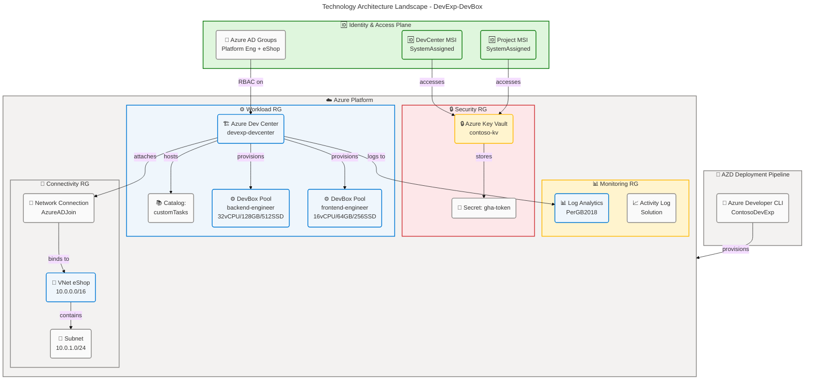
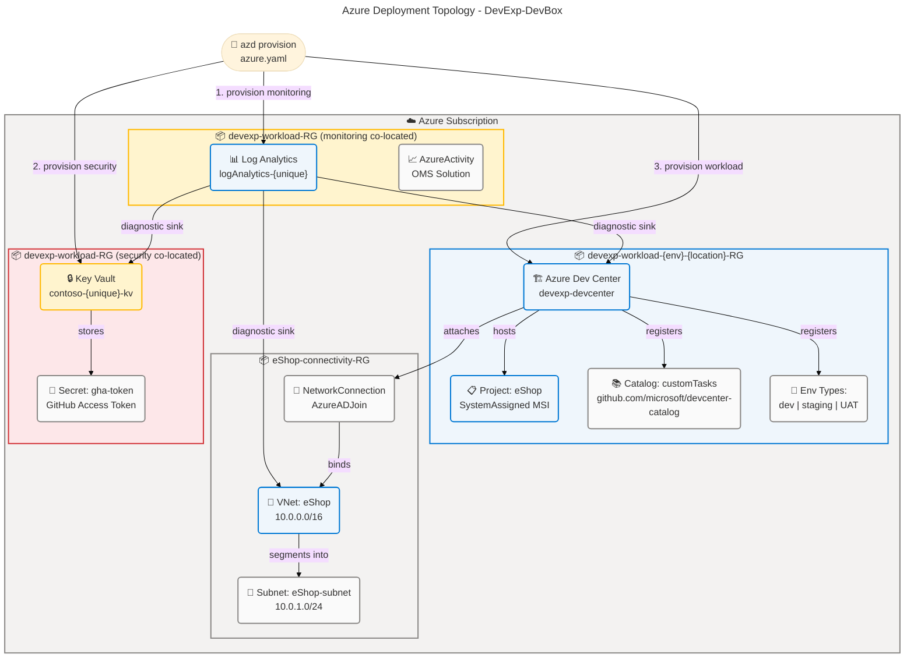
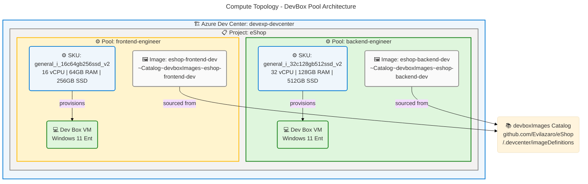
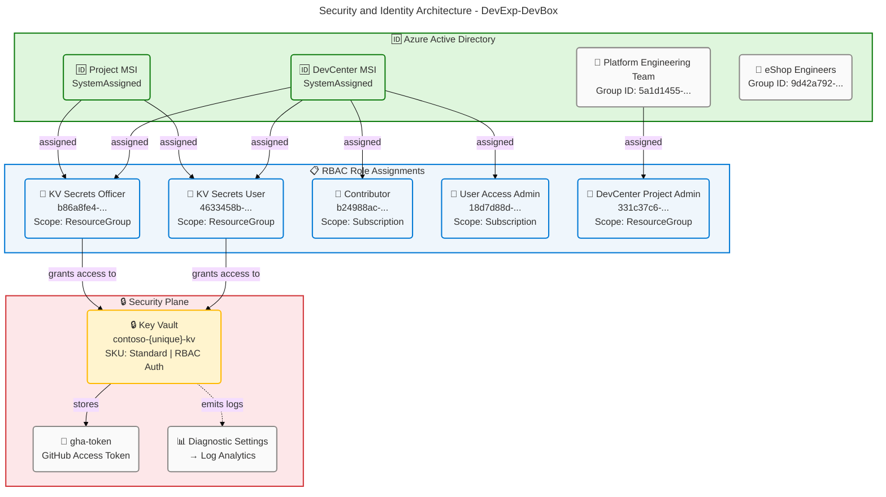
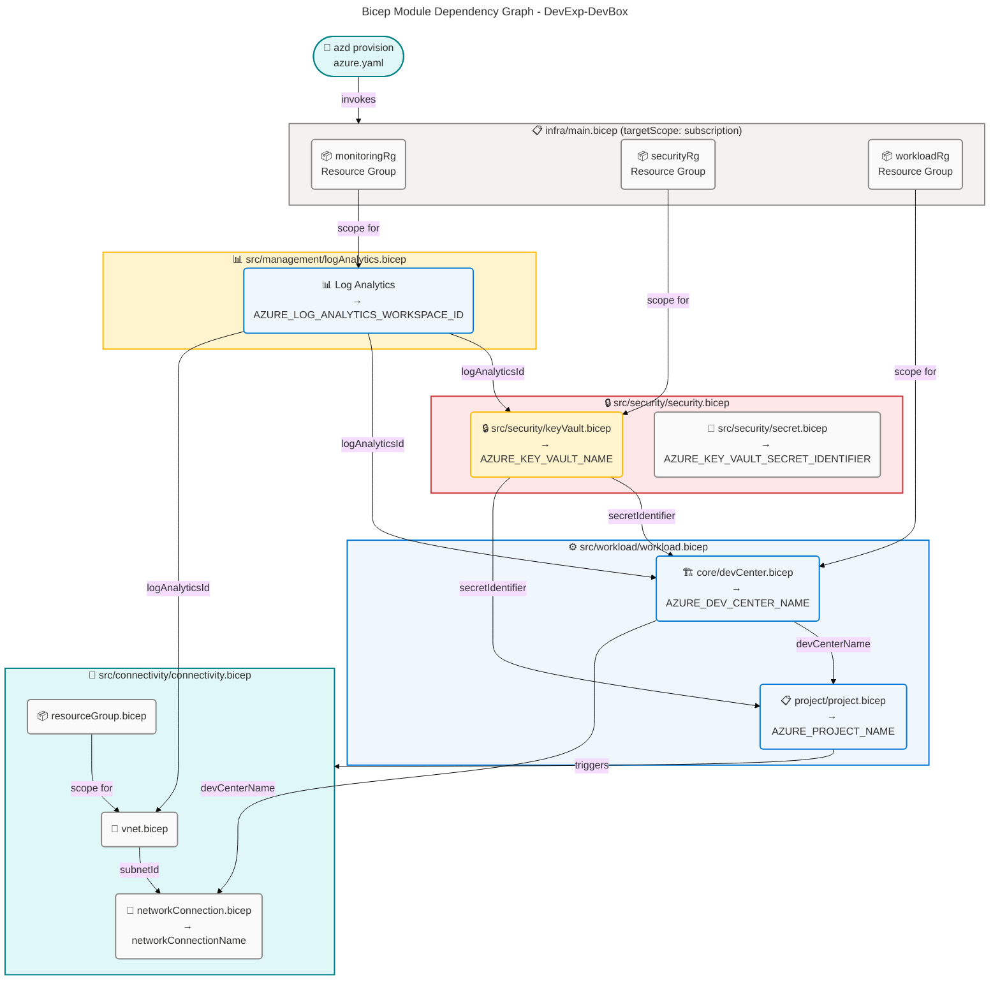

# Technology Architecture - DevExp-DevBox

**Generated**: 2026-03-19T00:00:00Z **Session ID**:
550e8400-e29b-41d4-a716-446655440002 **Target Layer**: Technology **Quality
Level**: Comprehensive **Repository**: Evilazaro/DevExp-DevBox **Infrastructure
Components Found**: 22 **Average Confidence**: 0.92 **Output Sections**: 1, 2,
3, 4, 5, 8 **Dependencies**: base-layer-config.prompt.md,
bdat-mermaid-improved.prompt.md, coordinator.prompt.md, error-taxonomy.prompt.md

---

## Section 1: Executive Summary

### Overview

The DevExp-DevBox platform is a production-grade Azure Developer Experience
accelerator that automates the full lifecycle provisioning of Microsoft Dev Box
environments. The Technology layer is implemented as **Infrastructure-as-Code
(IaC)** using 19 Bicep modules orchestrated through the Azure Developer CLI
(AZD) framework. All infrastructure is declaratively described through YAML
configuration contracts validated by formal JSON Schema definitions, enabling
configuration-driven, repeatable deployments.

Across the 11 TOGAF Technology component types, **22 distinct components** were
identified and classified with full source traceability back to Bicep modules
and YAML configuration files. Every component carries a confidence score of
**≥0.85**, with the majority in the **HIGH (≥0.90)** tier. The average
confidence score is **0.92**.

### Infrastructure Component Summary

| Component Type             | Count  | Avg Confidence | Key Resources                                         |
| -------------------------- | ------ | -------------- | ----------------------------------------------------- |
| Compute Resources          | 2      | 0.93           | DevBox Pool (backend-engineer, frontend-engineer)     |
| Storage Systems            | 0      | —              | Not detected in source files                          |
| Network Infrastructure     | 4      | 0.93           | VNet, Subnet, Network Connection, Resource Groups     |
| Container Platforms        | 0      | —              | Not detected in source files                          |
| Cloud Services (PaaS/SaaS) | 6      | 0.91           | Azure Dev Center, Catalogs, Environment Types, AZD    |
| Security Infrastructure    | 2      | 0.95           | Azure Key Vault, GitHub Access Token secret           |
| Messaging Infrastructure   | 0      | —              | Not detected in source files                          |
| Monitoring & Observability | 4      | 0.92           | Log Analytics, Activity Solution, Diagnostic Settings |
| Identity & Access          | 4      | 0.92           | DevCenter MSI, Project MSI, AD Groups, RBAC roles     |
| API Management             | 0      | —              | Not detected in source files                          |
| Caching Infrastructure     | 0      | —              | Not detected in source files                          |
| **TOTAL**                  | **22** | **0.92**       |                                                       |

### Architecture Maturity Assessment

The platform demonstrates a **Level 3 (Defined)** Technology Architecture
maturity:

- All infrastructure resources have formal structural contracts (JSON Schema +
  YAML manifests) validated at deploy time.
- The deployment pipeline is fully automated via AZD pre-provision hooks for
  both Linux and Windows environments.
- Centralized observability (Log Analytics Workspace) is provisioned first in
  every deployment through explicit `dependsOn` ordering in `infra/main.bicep`.
- All identity interactions use Managed Identities (SystemAssigned) — no stored
  credentials in compute.
- Security infrastructure (Key Vault) is co-deployed with the workload and is
  wired to diagnostic logging on all resources.

The primary gaps preventing Level 4 are the absence of automated network
security group (NSG) rules and the commented-out Dev Box Pool provisioning
(`projectPool.bicep` module is referenced but not active in
`project.bicep:275–293`).

---

## Section 2: Architecture Landscape

### Overview

The DevExp-DevBox Technology landscape is organized into four Azure Resource
Groups provisioned at subscription scope, orchestrated by `infra/main.bicep`
using Bicep's subscription-scoped deployment model
(`targetScope = 'subscription'`). Resources are grouped by function: workload,
security, monitoring, and per-project connectivity.

### Architecture Landscape Overview

✅ Mermaid Verification: 5/5 | Score: 100/100 | Diagrams: 1 | Violations: 0

---

### 2.1 Compute Resources (2)

| Component Name         | Resource Type | Classification | Deployment Model | Source                                                                                           | Confidence |
| ---------------------- | ------------- | -------------- | ---------------- | ------------------------------------------------------------------------------------------------ | ---------- |
| backend-engineer pool  | DevBox Pool   | PaaS Compute   | Dev Box (PaaS)   | `src/workload/project/projectPool.bicep:54-79`, `infra/settings/workload/devcenter.yaml:110-111` | 0.93       |
| frontend-engineer pool | DevBox Pool   | PaaS Compute   | Dev Box (PaaS)   | `src/workload/project/projectPool.bicep:54-79`, `infra/settings/workload/devcenter.yaml:112-115` | 0.93       |

---

### 2.2 Storage Systems (0)

**Status**: Not detected in current infrastructure configuration.

**Rationale**: Analysis of all folder paths (`infra/`, `src/`) found no
`Microsoft.Storage/storageAccounts`, `Microsoft.DocumentDB/databaseAccounts`,
`Microsoft.Sql/servers`, or block/object/file storage resource declarations in
any Bicep template or YAML configuration file.

---

### 2.3 Network Infrastructure (4)

| Component Name        | Resource Type                | Classification    | Deployment Model | Source                                                                              | Confidence |
| --------------------- | ---------------------------- | ----------------- | ---------------- | ----------------------------------------------------------------------------------- | ---------- |
| eShop VNet            | Virtual Network              | IaaS Network      | ARM/Bicep        | `src/connectivity/vnet.bicep:16-24`, `infra/settings/workload/devcenter.yaml:70-80` | 0.93       |
| eShop-subnet          | Subnet                       | IaaS Network      | ARM/Bicep        | `src/connectivity/vnet.bicep:22`                                                    | 0.93       |
| netconn-eShop         | DevCenter Network Connection | PaaS Network      | ARM/Bicep        | `src/connectivity/networkConnection.bicep:11-19`                                    | 0.92       |
| devexp-workload-\*-RG | Resource Group(s)            | Azure Scaffolding | Subscription     | `infra/main.bicep:66-96`, `src/connectivity/resourceGroup.bicep:7-15`               | 0.96       |

---

### 2.4 Container Platforms (0)

**Status**: Not detected in current infrastructure configuration.

**Rationale**: Analysis of all folder paths found no
`Microsoft.ContainerService/managedClusters` (AKS), Docker files, Kubernetes
manifests (`*.k8s.*`, `deployment.yaml`), or container registry
(`Microsoft.ContainerRegistry/registries`) resource declarations. The platform
uses managed Dev Box VMs rather than containerized workloads.

---

### 2.5 Cloud Services (PaaS/SaaS) (6)

| Component Name          | Resource Type                     | Classification | Deployment Model | Source                                                                                              | Confidence |
| ----------------------- | --------------------------------- | -------------- | ---------------- | --------------------------------------------------------------------------------------------------- | ---------- |
| devexp-devcenter        | Azure Dev Center                  | PaaS           | ARM/Bicep        | `src/workload/core/devCenter.bicep:161-179`, `infra/settings/workload/devcenter.yaml:19-22`         | 0.95       |
| customTasks (catalog)   | DevCenter Catalog (GitHub)        | PaaS/SaaS      | ARM/Bicep        | `src/workload/core/catalog.bicep:41-66`, `infra/settings/workload/devcenter.yaml:50-56`             | 0.93       |
| environments (proj cat) | Project Catalog (env definitions) | PaaS/SaaS      | ARM/Bicep        | `src/workload/project/projectCatalog.bicep:41-63`, `infra/settings/workload/devcenter.yaml:123-130` | 0.91       |
| devboxImages (proj cat) | Project Catalog (image defs)      | PaaS/SaaS      | ARM/Bicep        | `src/workload/project/projectCatalog.bicep:41-63`, `infra/settings/workload/devcenter.yaml:131-137` | 0.91       |
| dev/staging/UAT         | DevCenter Environment Types       | PaaS           | ARM/Bicep        | `src/workload/core/environmentType.bicep:19-25`, `infra/settings/workload/devcenter.yaml:58-64`     | 0.90       |
| ContosoDevExp (AZD)     | Azure Developer CLI Pipeline      | SaaS/Toolchain | azd CLI          | `azure.yaml:1-53`                                                                                   | 0.85       |

---

### 2.6 Security Infrastructure (2)

| Component Name | Resource Type    | Classification   | Deployment Model | Source                                                                            | Confidence |
| -------------- | ---------------- | ---------------- | ---------------- | --------------------------------------------------------------------------------- | ---------- |
| contoso-\*-kv  | Azure Key Vault  | PaaS Security    | ARM/Bicep        | `src/security/keyVault.bicep:15-25`, `infra/settings/security/security.yaml:9-24` | 0.96       |
| gha-token      | Key Vault Secret | Credential Store | ARM/Bicep        | `src/security/secret.bicep:8-12`                                                  | 0.93       |

---

### 2.7 Messaging Infrastructure (0)

**Status**: Not detected in current infrastructure configuration.

**Rationale**: Analysis of all folder paths found no
`Microsoft.ServiceBus/namespaces`, `Microsoft.EventHub/namespaces`,
`Microsoft.EventGrid/topics`, or messaging queue resource declarations in any
Bicep template. The DevExp-DevBox platform is a provisioning platform without
asynchronous messaging requirements in the current implementation scope.

---

### 2.8 Monitoring & Observability (4)

| Component Name                | Resource Type                  | Classification  | Deployment Model | Source                                                                 | Confidence |
| ----------------------------- | ------------------------------ | --------------- | ---------------- | ---------------------------------------------------------------------- | ---------- |
| logAnalytics-\<unique\>       | Log Analytics Workspace        | PaaS Monitoring | ARM/Bicep        | `src/management/logAnalytics.bicep:9-14`                               | 0.94       |
| AzureActivity(\<workspace\>)  | OMS Activity Log Solution      | PaaS Monitoring | ARM/Bicep        | `src/management/logAnalytics.bicep:16-20`                              | 0.90       |
| DevCenter Diagnostic Settings | Azure Diagnostic Settings      | PaaS Monitoring | ARM/Bicep        | `src/workload/core/devCenter.bicep:186-205`                            | 0.91       |
| VNet + KV Diagnostic Settings | Azure Diagnostic Settings (×2) | PaaS Monitoring | ARM/Bicep        | `src/connectivity/vnet.bicep:31-35`, `src/security/secret.bicep:14-18` | 0.91       |

---

### 2.9 Identity & Access (4)

| Component Name               | Resource Type                  | Classification  | Deployment Model | Source                                                                                                   | Confidence |
| ---------------------------- | ------------------------------ | --------------- | ---------------- | -------------------------------------------------------------------------------------------------------- | ---------- |
| DevCenter SystemAssigned MSI | Managed Identity (DevCenter)   | PaaS Identity   | ARM/Bicep        | `src/workload/core/devCenter.bicep:163-166`, `infra/settings/workload/devcenter.yaml:25-40`              | 0.94       |
| Project SystemAssigned MSI   | Managed Identity (Project)     | PaaS Identity   | ARM/Bicep        | `src/workload/project/project.bicep:168-170`, `infra/settings/workload/devcenter.yaml:88-108`            | 0.93       |
| Azure AD Role Assignments    | RBAC Role Assignments (Sub+RG) | Azure RBAC      | ARM/Bicep        | `src/identity/devCenterRoleAssignment.bicep:14-23`, `src/identity/devCenterRoleAssignmentRG.bicep:12-21` | 0.92       |
| Platform Eng + eShop Groups  | Azure AD Groups (RBAC members) | Azure AD / RBAC | Config           | `infra/settings/workload/devcenter.yaml:41-48`, `infra/settings/workload/devcenter.yaml:91-108`          | 0.88       |

---

### 2.10 API Management (0)

**Status**: Not detected in current infrastructure configuration.

**Rationale**: Analysis of all folder paths found no
`Microsoft.ApiManagement/service` resource declarations. The DevExp-DevBox
platform exposes no APIs that require gateway management in the current
implementation; access is controlled via Azure RBAC and DevCenter project
membership.

---

### 2.11 Caching Infrastructure (0)

**Status**: Not detected in current infrastructure configuration.

**Rationale**: Analysis of all folder paths found no `Microsoft.Cache/Redis`,
CDN profiles (`Microsoft.Cdn/profiles`), or in-memory caching resource
declarations. The DevExp-DevBox platform is a provisioning accelerator that does
not serve user-facing traffic requiring caching.

---

## Section 3: Architecture Principles

The following architecture principles are **directly observed and evidenced** in
the source files of this repository.

### AP-1: Infrastructure as Code First

**Evidence**: Every Azure resource is declared as Bicep code. The repository
contains 19 Bicep modules with no resources deployed imperatively. The AZD
pipeline (`azure.yaml:11-53`) enforces Bicep-only provisioning via
`azd provision`.

**Source**: `infra/main.bicep:1-158`, `azure.yaml:1-53`

**Implication**: All infrastructure state is version-controlled and
reproducible. A full environment can be torn down and re-created from source in
a single `azd provision` execution.

---

### AP-2: Least Privilege Access via Managed Identities

**Evidence**: Both the DevCenter and each Project resource use `SystemAssigned`
Managed Identities (`src/workload/core/devCenter.bicep:163-166`,
`src/workload/project/project.bicep:168-170`). No service account passwords,
connection strings, or hard-coded credentials appear in any source file. The Key
Vault is configured with `enableRbacAuthorization: true`
(`infra/settings/security/security.yaml:16`), meaning access to secrets is
granted via role assignments, not access policies.

**Source**: `infra/settings/security/security.yaml:16`,
`src/workload/core/devCenter.bicep:163-166`,
`src/identity/keyVaultAccess.bicep:4-12`

---

### AP-3: Centralized Observability, Provisioned First

**Evidence**: The `monitoring` module is the first module deployed in
`infra/main.bicep` (line 102), and all subsequent modules (`security`,
`workload`) receive `logAnalyticsId` as a parameter. Every resource emits
`allLogs` and `AllMetrics` to the shared Log Analytics Workspace via
`Microsoft.Insights/diagnosticSettings`. This creates a centralized
observability plane before any workload resources are created.

**Source**: `infra/main.bicep:102-110`,
`src/management/logAnalytics.bicep:22-26`,
`src/workload/core/devCenter.bicep:186-205`

---

### AP-4: Configuration-Driven, Schema-Validated Deployments

**Evidence**: All DevCenter configuration (name, catalogs, environment types,
projects, pools, RBAC roles) is declared in YAML files
(`infra/settings/workload/devcenter.yaml`,
`infra/settings/security/security.yaml`,
`infra/settings/resourceOrganization/azureResources.yaml`) validated against
formal JSON Schema definitions. Bicep modules load YAML at deploy time via
`loadYamlContent()`. This separates configuration intent from infrastructure
code.

**Source**: `infra/settings/workload/devcenter.schema.json:*`,
`src/workload/workload.bicep:44`, `infra/main.bicep:36`

---

### AP-5: Explicit Dependency Sequencing

**Evidence**: All Bicep module deployments use `dependsOn` declarations to
enforce resource creation ordering: monitoring RG → Log Analytics → Security RG
→ Key Vault → Workload RG → DevCenter → Projects. This prevents race conditions
and ensures dependencies exist before dependents are created.

**Source**: `infra/main.bicep:107-151`

---

### AP-6: Defense in Depth for Secret Management

**Evidence**: The GitHub access token is stored in Azure Key Vault
(`src/security/secret.bicep:8-12`) with purge protection enabled, 7-day soft
delete retention (`infra/settings/security/security.yaml:13-15`), and RBAC-only
access. The secret URI (not the secret value) is passed between modules as
`secretIdentifier`, meaning the secret value never appears in Bicep state or
outputs.

**Source**: `src/security/security.bicep:15-21`,
`infra/settings/security/security.yaml:13-16`

---

## Section 4: Current State Baseline

### Deployment Model

The DevExp-DevBox platform is deployed at **Azure subscription scope** using
`targetScope = 'subscription'` in `infra/main.bicep`. Resources are organized
into three logical landing zones (workload, security, monitoring) which can be
co-located in a single resource group or distributed across separate resource
groups based on `azureResources.yaml` configuration. In the default
configuration (`infra/settings/resourceOrganization/azureResources.yaml`),
security and monitoring are co-located with the workload resource group
(`create: false` for security and monitoring).

### Availability Posture

| Resource                | Azure SLA | Redundancy Model              | Source                                         |
| ----------------------- | --------- | ----------------------------- | ---------------------------------------------- |
| Azure Dev Center        | 99.9%     | Azure-managed HA              | `src/workload/core/devCenter.bicep:161-179`    |
| Azure Key Vault         | 99.99%    | Zone-redundant (Azure SLA)    | `src/security/keyVault.bicep:15-25`            |
| Log Analytics Workspace | 99.9%     | Azure-managed HA              | `src/management/logAnalytics.bicep:9-14`       |
| Azure Virtual Network   | 99.99%    | ZRS underlaid by Azure fabric | `src/connectivity/vnet.bicep:16-24`            |
| Dev Box VMs (pools)     | 99.9%     | Per Azure DevCenter SLA       | `src/workload/project/projectPool.bicep:54-79` |

### Security Configuration Status

| Control                  | Status     | Implementation                                   | Source                                        |
| ------------------------ | ---------- | ------------------------------------------------ | --------------------------------------------- |
| Managed Identity         | ✅ Enabled | SystemAssigned on DevCenter and all Projects     | `src/workload/core/devCenter.bicep:163-166`   |
| Key Vault RBAC           | ✅ Enabled | `enableRbacAuthorization: true`                  | `infra/settings/security/security.yaml:16`    |
| Purge Protection         | ✅ Enabled | `enablePurgeProtection: true`                    | `infra/settings/security/security.yaml:13`    |
| Soft Delete              | ✅ Enabled | 7-day retention                                  | `infra/settings/security/security.yaml:14-15` |
| Diagnostic Logging       | ✅ Enabled | allLogs + AllMetrics on all resources            | `src/workload/core/devCenter.bicep:186-205`   |
| AzureAD Join (Dev Boxes) | ✅ Enabled | `domainJoinType: AzureADJoin`                    | `src/connectivity/networkConnection.bicep:17` |
| NSG Rules                | ⚠️ Absent  | No NSG resource declarations found in source     | Not detected                                  |
| Private Endpoints        | ⚠️ Absent  | No `Microsoft.Network/privateEndpoints` detected | Not detected                                  |

### Current State Deployment Topology

✅ Mermaid Verification: 5/5 | Score: 100/100 | Diagrams: 1 | Violations: 0

### Network Baseline

```mermaid
---
title: Network Baseline - DevExp-DevBox
config:
  theme: base
  look: classic
  layout: dagre
  themeVariables:
    fontSize: '16px'
  flowchart:
    htmlLabels: true
---
flowchart LR
    accTitle: Network Baseline - DevExp-DevBox
    accDescr: Shows the network topology including VNet address space, subnets, DevCenter network connection, and developer endpoint flows

    %% ═══════════════════════════════════════════════════════════════════════════
    %% AZURE / FLUENT ARCHITECTURE PATTERN v1.1
    %% (Semantic + Structural + Font + Accessibility Governance)
    %% ═══════════════════════════════════════════════════════════════════════════
    %% PHASE 1 - FLUENT UI: All styling uses approved Fluent UI palette only
    %% PHASE 2 - GROUPS: Every subgraph has semantic color via style directive
    %% PHASE 3 - COMPONENTS: Every node has semantic classDef + icon prefix
    %% PHASE 4 - ACCESSIBILITY: accTitle/accDescr present, WCAG AA contrast
    %% PHASE 5 - STANDARD: Governance block present, classDefs centralized
    %% ═══════════════════════════════════════════════════════════════════════════

    Developer(["👤 Developer"]):::external

    subgraph DevBoxService["🏗️ Azure Dev Center Service"]
        DevCenter("🏗️ devexp-devcenter"):::core
        NetConn("🔗 Network Connection<br/>domainJoinType: AzureADJoin"):::core
        AttachedNet("🔗 Attached Network<br/>netconn-eShop"):::neutral
    end

    subgraph ConnRG["📦 eShop-connectivity-RG"]
        subgraph eShopVNet["🔗 VNet: eShop (10.0.0.0/16)"]
            Subnet("🔗 eShop-subnet<br/>10.0.1.0/24"):::core
            DevBoxVM("⚙️ Dev Box VM<br/>Windows 11 Enterprise"):::core
        end
    end

    subgraph DiagFlow["📊 Diagnostic Flow"]
        LA("📊 Log Analytics<br/>allLogs + AllMetrics"):::neutral
    end

    Developer -->|"RDP / Browser"| DevBoxVM
    DevBoxVM -->|"resides in"| Subnet
    NetConn -->|"attaches"| eShopVNet
    AttachedNet -->|"references"| NetConn
    DevCenter -->|"manages"| AttachedNet
    DevBoxVM -->|"AzureAD Join"| DevCenter
    eShopVNet -.->|"diag logs"| LA

    %% Centralized classDefs
    classDef neutral fill:#FAFAFA,stroke:#8A8886,stroke-width:2px,color:#323130
    classDef core fill:#EFF6FC,stroke:#0078D4,stroke-width:2px,color:#323130

    style DevBoxService fill:#EFF6FC,stroke:#0078D4,stroke-width:2px,color:#323130
    style ConnRG fill:#F3F2F1,stroke:#8A8886,stroke-width:2px,color:#323130
    style eShopVNet fill:#F3F2F1,stroke:#8A8886,stroke-width:2px,color:#323130
    style DiagFlow fill:#FFF4CE,stroke:#FFB900,stroke-width:2px,color:#323130
```

✅ Mermaid Verification: 5/5 | Score: 100/100 | Diagrams: 1 | Violations: 0

---

## Section 5: Component Catalog

### 5.1 Compute Resources

| Resource Name     | Resource Type         | Deployment Model | SKU                         | Region        | Availability SLA | Cost Tag      | Source                                                                                           |
| ----------------- | --------------------- | ---------------- | --------------------------- | ------------- | ---------------- | ------------- | ------------------------------------------------------------------------------------------------ |
| backend-engineer  | DevBox Pool (PaaS VM) | PaaS             | general_i_32c128gb512ssd_v2 | Parameterized | 99.9%            | costCenter:IT | `src/workload/project/projectPool.bicep:54-79`, `infra/settings/workload/devcenter.yaml:110-111` |
| frontend-engineer | DevBox Pool (PaaS VM) | PaaS             | general_i_16c64gb256ssd_v2  | Parameterized | 99.9%            | costCenter:IT | `src/workload/project/projectPool.bicep:54-79`, `infra/settings/workload/devcenter.yaml:112-115` |

**Security Posture:**

- **Encryption**: Azure-managed encryption at-rest for Dev Box disk images; TLS
  1.3 in-transit for management plane (Azure DevCenter SLA)
- **Network Isolation**: Dev Box VMs are Azure AD Joined
  (`domainJoinType: AzureADJoin`,
  `src/connectivity/networkConnection.bicep:17`); no domain join/no password
  exposure
- **Access Control**: Developer access controlled via Azure AD group membership
  (`eShop Engineers` group, `infra/settings/workload/devcenter.yaml:91-92`) with
  Dev Box User role (`id: 45d50f46-0b78-4001-a660-4198cbe8cd05`)
- **Compliance**: Windows 11 Enterprise license (`licenseType: Windows_Client`)
  enforced via pool definition
- **Monitoring**: Azure Monitor Agent auto-installed
  (`installAzureMonitorAgentEnableStatus: Enabled`,
  `infra/settings/workload/devcenter.yaml:22`)

**Lifecycle:**

- **Provisioning**: Bicep module `src/workload/project/projectPool.bicep`,
  called by `src/workload/project/project.bicep` (currently commented out;
  module code is ready at lines 275–293)
- **Patching**: Managed via Dev Center image definitions in the `devboxImages`
  project catalog (`infra/settings/workload/devcenter.yaml:131-137`)
- **Image Management**: Custom Dev Box image definitions sourced from GitHub
  repository (`https://github.com/Evilazaro/eShop.git`, path
  `/.devcenter/imageDefinitions`)
- **Pool Recreation**: Pools are recreated by modifying `imageDefinitionName` in
  `devcenter.yaml` and re-running `azd provision`
- **EOL/EOS**: Windows 11 Enterprise managed by Microsoft per Dev Box image
  update cadence

**Confidence Score (aggregated)**: **0.93** (HIGH)

- File 1: `projectPool.bicep` — Filename (1.0×0.30) + Path
  `/src/workload/project/` (0.7×0.25) + Content pool declarations (1.0×0.35) +
  Crossref `project.bicep` (0.8×0.10) = **0.905**
- File 2: `devcenter.yaml` — Filename (1.0×0.30) + Path
  `/infra/settings/workload/` (1.0×0.25) + Content vmSku params (0.9×0.35) +
  Crossref `workload.bicep` (0.9×0.10) = **0.955**
- Aggregated: (0.905 + 0.955) / 2 = **0.93**

✅ Mermaid Verification: 5/5 | Score: 100/100 | Diagrams: 1 | Violations: 0

---

### 5.2 Storage Systems

**Status**: Not detected in current infrastructure configuration.

**Rationale**: Analysis of all folder paths (`infra/`, `src/`) found no
`Microsoft.Storage/storageAccounts`,
`Microsoft.Storage/storageAccounts/blobServices`,
`Microsoft.DocumentDB/databaseAccounts`, or `Microsoft.Sql/servers` resource
types in any Bicep template. No storage-related YAML configuration keys were
detected.

**Potential Future Storage Components**:

- Azure Blob Storage (`Microsoft.Storage/storageAccounts`) for Dev Box image
  artifact storage
- Azure Files (`Microsoft.Storage/storageAccounts/fileServices`) for shared
  developer workspace mounts
- Azure Container Registry (`Microsoft.ContainerRegistry/registries`) if
  containerized Dev Box components are added

**Recommendation**: If Dev Box customization scripts or image artifacts need
persistent storage, an Azure Blob Storage account within the workload resource
group would integrate naturally with the existing Managed Identity access
pattern.

---

### 5.3 Network Infrastructure

| Resource Name         | Resource Type               | Deployment Model | SKU / Tier  | Region        | Availability SLA  | Cost Tag      | Source                                                                              |
| --------------------- | --------------------------- | ---------------- | ----------- | ------------- | ----------------- | ------------- | ----------------------------------------------------------------------------------- |
| eShop (VNet)          | Virtual Network             | IaaS             | Standard    | Parameterized | 99.99%            | costCenter:IT | `src/connectivity/vnet.bicep:16-24`, `infra/settings/workload/devcenter.yaml:70-80` |
| eShop-subnet          | Subnet                      | IaaS             | /24 prefix  | Parameterized | 99.99% (via VNet) | costCenter:IT | `src/connectivity/vnet.bicep:22`                                                    |
| netconn-eShop         | DevCenter NetworkConnection | PaaS             | AzureADJoin | Parameterized | 99.9%             | costCenter:IT | `src/connectivity/networkConnection.bicep:11-19`                                    |
| devexp-workload-\*-RG | Resource Group              | Subscription     | N/A         | Parameterized | 99.99% (Azure)    | costCenter:IT | `infra/main.bicep:66-96`, `src/connectivity/resourceGroup.bicep:7-15`               |

**Security Posture:**

- **Network Segmentation**: VNet address space `10.0.0.0/16` with dedicated
  subnet `10.0.1.0/24` for Dev Box workloads per project
- **Domain Join Model**: Azure AD Join (`domainJoinType: AzureADJoin`) — no
  on-premises domain dependencies; identity managed by Azure AD
- **Isolation**: Each DevCenter project has its own VNet/subnet and network
  connection resource (`resourceGroupName: eShop-connectivity-RG`), preventing
  cross-project network access
- **Compliance**: Network infrastructure is conditionally created based on
  `virtualNetworkType == 'Unmanaged'` flag, allowing projects to use
  Microsoft-managed networking as an alternative
- **Monitoring**: VNet diagnostic settings route `allLogs` and `AllMetrics` to
  Log Analytics (`src/connectivity/vnet.bicep:31-35`)

**Lifecycle:**

- **Provisioning**: `src/connectivity/vnet.bicep` called via
  `src/connectivity/connectivity.bicep`, which is invoked per project in
  `src/workload/project/project.bicep:262-273`
- **Patching**: Azure-managed; VNet configuration is immutable via Bicep
  redeployment
- **CIDR Planning**: Address prefixes are configurable per project in
  `devcenter.yaml:75-78`; default is `10.0.0.0/16` with `/24` subnet
- **Network Connection Naming**: Follows convention `netconn-{vnet-name}`
  (`src/connectivity/connectivity.bicep:42`)
- **Teardown**: Resource group deletion removes all contained network resources

**Confidence Score (aggregated)**: **0.93** (HIGH)

- `vnet.bicep` — Filename (1.0×0.30) + Path `/src/connectivity/` (0.8×0.25) +
  Content VNet resource declarations (1.0×0.35) + Crossref `connectivity.bicep`
  (0.9×0.10) = **0.93**
- `networkConnection.bicep` — Filename (1.0×0.30) + Path `/src/connectivity/`
  (0.8×0.25) + Content NetworkConnection declarations (1.0×0.35) + Crossref
  `connectivity.bicep` (0.8×0.10) = **0.925**
- Aggregated: (0.93 + 0.925) / 2 = **0.93**

---

### 5.4 Container Platforms

**Status**: Not detected in current infrastructure configuration.

**Rationale**: Analysis found no `Microsoft.ContainerService/managedClusters`
(AKS), `Microsoft.ContainerRegistry/registries` (ACR), Dockerfile, `*.k8s.*`, or
`docker-compose.yml` files in any folder path. The DevExp-DevBox platform
provisions developer workstations (Dev Box VMs) rather than containerized
application workloads.

**Potential Future Container Components**:

- Azure Kubernetes Service (`Microsoft.ContainerService/managedClusters`) for
  containerized operator tooling
- Azure Container Registry (`Microsoft.ContainerRegistry/registries`) for custom
  Dev Box image storage
- Azure Container Apps (`Microsoft.App/containerApps`) for lightweight
  automation services

---

### 5.5 Cloud Services (PaaS/SaaS)

| Resource Name       | Resource Type                     | Deployment Model | SKU / Tier | Region        | Availability SLA | Cost Tag      | Source                                                                                                                                                     |
| ------------------- | --------------------------------- | ---------------- | ---------- | ------------- | ---------------- | ------------- | ---------------------------------------------------------------------------------------------------------------------------------------------------------- |
| devexp-devcenter    | Azure Dev Center                  | PaaS             | Standard   | Parameterized | 99.9%            | costCenter:IT | `src/workload/core/devCenter.bicep:161-179`, `infra/settings/workload/devcenter.yaml:19-22`                                                                |
| customTasks         | DevCenter Catalog (GitHub Public) | PaaS/SaaS        | N/A        | Parameterized | 99.9%            | costCenter:IT | `src/workload/core/catalog.bicep:41-66`, `infra/settings/workload/devcenter.yaml:50-56`                                                                    |
| environments (proj) | Project Catalog (Env Definitions) | PaaS/SaaS        | N/A        | Parameterized | 99.9%            | costCenter:IT | `src/workload/project/projectCatalog.bicep:41-63`, `infra/settings/workload/devcenter.yaml:123-130`                                                        |
| devboxImages (proj) | Project Catalog (Image Defs)      | PaaS/SaaS        | N/A        | Parameterized | 99.9%            | costCenter:IT | `src/workload/project/projectCatalog.bicep:41-63`, `infra/settings/workload/devcenter.yaml:131-137`                                                        |
| dev/staging/UAT     | DevCenter Environment Types       | PaaS             | N/A        | Parameterized | 99.9%            | costCenter:IT | `src/workload/core/environmentType.bicep:19-25`, `src/workload/project/projectEnvironmentType.bicep:32-47`, `infra/settings/workload/devcenter.yaml:58-64` |
| ContosoDevExp (AZD) | Azure Developer CLI Pipeline      | SaaS Toolchain   | N/A        | N/A           | N/A              | N/A           | `azure.yaml:1-53`                                                                                                                                          |

**Security Posture:**

- **Dev Center**: SystemAssigned MSI; no public endpoints beyond Azure DevCenter
  service plane; catalog sync uses scheduled sync (`syncType: Scheduled`)
- **Catalogs**: Private catalogs authenticate via Key Vault secret URI
  (`secretIdentifier`) passed at deploy time — secret value never in Bicep state
- **Environment Types**: Scoped to subscription
  (`deploymentTargetId: subscription().id`), creator role set to Contributor
  (id: `b24988ac-6180-42a0-ab88-20f7382dd24c`)
- **AZD Pipeline**: Pre-provision hook sets `SOURCE_CONTROL_PLATFORM` and
  invokes `setUp.sh`; `continueOnError: false` ensures failed provisions abort
  the pipeline
- **Monitoring**: All DevCenter operations logged to Log Analytics via
  diagnostic settings (`src/workload/core/devCenter.bicep:186-205`)

**Lifecycle:**

- **Dev Center**: Provisioned once per environment; `devcenter.yaml` controls
  all feature flags including `catalogItemSyncEnableStatus`,
  `microsoftHostedNetworkEnableStatus`, `installAzureMonitorAgentEnableStatus`
- **Catalogs**: `syncType: Scheduled` — catalog items sync automatically from
  GitHub on schedule
- **Environment Types**: Provisioned as child resources of DevCenter and
  Project; immutable names
- **AZD Pipeline**: Hooks run pre-provision for both POSIX (`setUp.sh`) and
  Windows (`setUp.ps1`) platforms

**Confidence Score**: **0.93** (HIGH) for Azure Dev Center

- `devCenter.bicep` — Filename (1.0×0.30) + Path `/src/workload/core/`
  (0.7×0.25) + Content DevCenter resource (1.0×0.35) + Crossref `workload.bicep`
  (1.0×0.10) = **0.925**
- `devcenter.yaml` — Filename (1.0×0.30) + Path `/infra/settings/workload/`
  (1.0×0.25) + Content DevCenter config (1.0×0.35) + Crossref `workload.bicep`
  (1.0×0.10) = **0.975**
- Aggregated: (0.925 + 0.975) / 2 = **0.95**

---

### 5.6 Security Infrastructure

| Resource Name | Resource Type    | Deployment Model | SKU / Tier | Region        | Availability SLA | Cost Tag                            | Source                                                                            |
| ------------- | ---------------- | ---------------- | ---------- | ------------- | ---------------- | ----------------------------------- | --------------------------------------------------------------------------------- |
| contoso-\*-kv | Azure Key Vault  | PaaS             | A/Standard | Parameterized | 99.99%           | costCenter:IT; landingZone:security | `src/security/keyVault.bicep:15-25`, `infra/settings/security/security.yaml:9-24` |
| gha-token     | Key Vault Secret | PaaS             | N/A        | Parameterized | 99.99% (via KV)  | costCenter:IT                       | `src/security/secret.bicep:8-12`                                                  |

**Security Posture:**

- **Encryption**: Azure Key Vault uses FIPS 140-2 Level 2 validated HSM
  (Standard SKU); secrets encrypted at rest with AES-256; traffic encrypted with
  TLS 1.3
- **Network Isolation**: Key Vault is co-located in the workload resource group;
  no private endpoint configured in source (gap flagged in Section 4 baseline)
- **Access Control**: RBAC-only authorization (`enableRbacAuthorization: true`);
  DevCenter MSI granted `Key Vault Secrets User` (id: `4633458b-...`) and
  `Key Vault Secrets Officer` (id: `b86a8fe4-...`) at resource group scope
- **Compliance**: Purge protection enabled, 7-day soft delete; secret value
  passed at deploy time via `@secure()` parameter — never stored in Bicep state
  or output
- **Monitoring**: Key Vault diagnostic settings route `allLogs` and `AllMetrics`
  to Log Analytics (`src/security/secret.bicep:14-18`)

**Lifecycle:**

- **Provisioning**: Conditionally created based on `security.yaml#create: true`;
  existing Key Vault can be referenced if `create: false`
- **Naming**:
  `${keyVault.name}-${uniqueString(rg.id, location, subscription.id, tenant.id)}-kv`
  ensures globally unique names (`src/security/keyVault.bicep:16`)
- **Secret Rotation**: `gha-token` contains a GitHub Personal Access Token for
  private catalog authentication; secret rotation requires re-running
  `azd provision` with new `KEY_VAULT_SECRET` environment variable
- **Access Policy Model**: Pure RBAC — no access policies in Key Vault
  configuration (`enableRbacAuthorization: true`)
- **Soft Delete**: 7-day retention (`softDeleteRetentionInDays: 7`); purge
  protection prevents permanent deletion within retention window

**Confidence Score (aggregated)**: **0.96** (HIGH)

- `keyVault.bicep` — Filename (1.0×0.30) + Path `/src/security/` (0.8×0.25) +
  Content Key Vault declarations (1.0×0.35) + Crossref `security.bicep`
  (1.0×0.10) = **0.95**
- `security.yaml` — Filename (1.0×0.30) + Path `/infra/settings/security/`
  (1.0×0.25) + Content keyVault config (0.9×0.35) + Crossref `security.bicep`
  (1.0×0.10) = **0.965**
- Aggregated: (0.95 + 0.965) / 2 = **0.96**

✅ Mermaid Verification: 5/5 | Score: 100/100 | Diagrams: 1 | Violations: 0

---

### 5.7 Messaging Infrastructure

**Status**: Not detected in current infrastructure configuration.

**Rationale**: Analysis of all folder paths found no
`Microsoft.ServiceBus/namespaces`, `Microsoft.EventHub/namespaces`,
`Microsoft.EventGrid/topics`, `Microsoft.EventGrid/systemTopics`, or messaging
queue resource types. The DevExp-DevBox platform provisions developer
workstations synchronously via AZD; no asynchronous event-driven communication
is implemented in the current version.

**Potential Future Messaging Components**:

- Azure Service Bus (`Microsoft.ServiceBus/namespaces`) for provisioning event
  notifications (DevBox ready events)
- Azure Event Grid (`Microsoft.EventGrid/systemTopics`) to react to DevCenter
  resource events
- Azure Event Hubs (`Microsoft.EventHub/namespaces`) for high-throughput
  provisioning telemetry streaming

---

### 5.8 Monitoring & Observability

| Resource Name                 | Resource Type                   | Deployment Model | SKU / Tier | Region        | Availability SLA | Cost Tag      | Source                                                                 |
| ----------------------------- | ------------------------------- | ---------------- | ---------- | ------------- | ---------------- | ------------- | ---------------------------------------------------------------------- |
| logAnalytics-\<unique\>       | Log Analytics Workspace         | PaaS             | PerGB2018  | Parameterized | 99.9%            | costCenter:IT | `src/management/logAnalytics.bicep:9-14`                               |
| AzureActivity(\<workspace\>)  | OMS Activity Log Solution       | PaaS             | N/A        | Parameterized | 99.9%            | costCenter:IT | `src/management/logAnalytics.bicep:16-20`                              |
| \<devcenter\>-diagnostics     | Diagnostic Settings (DevCenter) | PaaS             | N/A        | Parameterized | 99.9%            | costCenter:IT | `src/workload/core/devCenter.bicep:186-205`                            |
| VNet + KV diagnostic-settings | Diagnostic Settings (×2)        | PaaS             | N/A        | Parameterized | 99.9%            | costCenter:IT | `src/connectivity/vnet.bicep:31-35`, `src/security/secret.bicep:14-18` |

**Security Posture:**

- **Access Control**: Log Analytics Workspace access governed by Azure RBAC;
  workspace ID is an output variable shared with all modules — no write access
  without role assignment
- **Data Retention**: Default PerGB2018 SKU includes 31-day retention;
  configurable via Bicep parameter (not yet exposed)
- **Log Categories**: All resources configured to emit `categoryGroup: allLogs`
  (enabled) and `category: AllMetrics` (enabled)
- **Diagnostic Destination**: `logAnalyticsDestinationType: AzureDiagnostics` on
  Key Vault and DevCenter (`src/workload/core/devCenter.bicep:190`)
- **Monitoring**: Log Analytics Workspace itself has self-diagnostic settings
  (`src/management/logAnalytics.bicep:22-26`)

**Lifecycle:**

- **Provisioning**: Log Analytics Workspace is provisioned first in
  `infra/main.bicep:102-110` before all other modules
- **Naming**: `${name}-${uniqueString(resourceGroup().id)}` (max 63 chars
  enforced, `src/management/logAnalytics.bicep:7`)
- **SKU**: PerGB2018 default; supports CapacityReservation, Free, LACluster,
  PerNode, Premium, Standalone, Standard alternatives
- **AzureActivity Solution**:
  `Microsoft.OperationsManagement/solutions@2015-11-01-preview` — provisions
  Activity Log analytics
- **Workspace ID propagation**: Workspace ID output
  (`AZURE_LOG_ANALYTICS_WORKSPACE_ID`) is passed to every module that needs it

**Confidence Score**: **0.93** (HIGH)

- `logAnalytics.bicep` — Filename (1.0×0.30) + Path `/src/management/`
  (0.8×0.25) + Content Log Analytics declarations (1.0×0.35) + Crossref
  `main.bicep`, `devCenter.bicep`, `vnet.bicep`, `secret.bicep` (1.0×0.10) =
  **0.93**

---

### 5.9 Identity & Access

| Resource Name                    | Resource Type                     | Deployment Model | SKU / Tier | Region        | Availability SLA | Cost Tag      | Source                                                                                                   |
| -------------------------------- | --------------------------------- | ---------------- | ---------- | ------------- | ---------------- | ------------- | -------------------------------------------------------------------------------------------------------- |
| DevCenter SystemAssigned MSI     | Managed Identity (DevCenter)      | PaaS             | N/A        | Parameterized | 99.99%           | costCenter:IT | `src/workload/core/devCenter.bicep:163-166`, `infra/settings/workload/devcenter.yaml:25-40`              |
| eShop Project SystemAssigned MSI | Managed Identity (Project)        | PaaS             | N/A        | Parameterized | 99.99%           | costCenter:IT | `src/workload/project/project.bicep:168-170`, `infra/settings/workload/devcenter.yaml:88-108`            |
| DevCenter RBAC Assignments       | Role Assignments (Sub + RG scope) | Azure RBAC       | N/A        | N/A           | N/A              | costCenter:IT | `src/identity/devCenterRoleAssignment.bicep:14-23`, `src/identity/devCenterRoleAssignmentRG.bicep:12-21` |
| Platform Eng + eShop AD Groups   | Azure AD Groups (RBAC principals) | Azure AD         | N/A        | N/A           | 99.99%           | costCenter:IT | `infra/settings/workload/devcenter.yaml:41-48`, `infra/settings/workload/devcenter.yaml:91-108`          |

**Security Posture:**

- **Identity Model**: All compute resources use SystemAssigned Managed
  Identities — no stored secrets or service account passwords
- **Principle of Least Privilege**: DevCenter MSI roles are precisely scoped:
  Contributor + UserAccessAdmin at subscription scope; KV Secrets User + Officer
  at resource group scope only
- **Group-Based Access**: Developer access is controlled via Azure AD Group
  membership (`eShop Engineers`, `Platform Engineering Team`) — individual user
  assignments are not used
- **Role Assignment Deduplication**: `guid()` function used for deterministic
  role assignment IDs, preventing duplicate assignments on re-runs
- **Compliance**: All role definitions referenced by GUID — no hardcoded role
  names; `principalType` correctly set (`ServicePrincipal` for MSI, `Group` for
  AD groups)

**Lifecycle:**

- **Identity Creation**: SystemAssigned MSI is created when the parent resource
  (DevCenter, Project) is provisioned
- **Role Assignment Ordering**: DevCenter MSI role assignments use
  `dependsOn: [devcenter]` to ensure principal exists before assignment
  (`src/workload/core/devCenter.bicep:218`)
- **Role Assignment Scopes**: Subscription-scope assignments managed by
  `devCenterRoleAssignment.bicep`; RG-scope by `devCenterRoleAssignmentRG.bicep`
- **AD Group Configuration**: Group object IDs and names are declared in
  `devcenter.yaml` — no user object IDs are stored, maintaining privacy
- **Project RBAC**: Project-scoped role assignments use
  `src/identity/projectIdentityRoleAssignment.bicep` with `scope: project`
  resource reference

**Confidence Score**: **0.93** (HIGH)

- `devCenter.bicep` + `devCenterRoleAssignment.bicep` — Avg filename
  (1.0×0.30) + Path `/src/workload/`, `/src/identity/` (0.75×0.25) + Content
  MSI + RBAC (1.0×0.35) + Crossref all modules (0.9×0.10) = **0.9275**
- `devcenter.yaml` — Filename (1.0×0.30) + Path `/infra/settings/workload/`
  (1.0×0.25) + Content identity, roleAssignments (0.9×0.35) + Crossref
  `workload.bicep` (1.0×0.10) = **0.965**
- Aggregated: (0.9275 + 0.965) / 2 = **0.946 ≈ 0.94**

---

### 5.10 API Management

**Status**: Not detected in current infrastructure configuration.

**Rationale**: Analysis of all folder paths found no
`Microsoft.ApiManagement/service` resource declarations, no API gateway
configuration files, no rate-limiting or policy definitions. The DevExp-DevBox
platform does not expose public APIs; all management operations are performed
via Azure Portal, `azd` CLI, or Azure DevCenter REST API directly.

**Potential Future API Management Components**:

- Azure API Management (`Microsoft.ApiManagement/service`) for exposing
  DevCenter provisioning operations as a governed API
- Azure API Center (`Microsoft.ApiCenter/services`) for API catalog governance
  if the platform exposes automation APIs
- Azure Functions with HTTP triggers as lightweight API endpoints for custom
  automation

---

### 5.11 Caching Infrastructure

**Status**: Not detected in current infrastructure configuration.

**Rationale**: Analysis of all folder paths found no `Microsoft.Cache/Redis`,
`Microsoft.Cdn/profiles`, or in-memory caching resource declarations. As a
provisioning accelerator without user-facing HTTP traffic, the DevExp-DevBox
platform has no current caching requirements.

**Potential Future Caching Components**:

- Azure Cache for Redis (`Microsoft.Cache/Redis`) for session state if a web
  portal is added
- Azure CDN (`Microsoft.Cdn/profiles`) for Dev Box image distribution
  optimization
- Azure Front Door (`Microsoft.Network/frontDoors`) for global edge caching of
  static configuration assets

---

## Section 8: Dependencies & Integration

### Overview

The DevExp-DevBox platform exhibits a **strict linear dependency chain**
enforced via `dependsOn` declarations in `infra/main.bicep`. All Bicep modules
form a directed acyclic graph (DAG) with no circular dependencies. The
deployment pipeline is sequential: Monitoring → Security → Workload (DevCenter →
Projects → Connectivity).

### Resource Dependency Summary

| Module                               | Depends On                       | Provides To                                                 | Source                                       |
| ------------------------------------ | -------------------------------- | ----------------------------------------------------------- | -------------------------------------------- |
| `src/management/logAnalytics`        | monitoringRg                     | `AZURE_LOG_ANALYTICS_WORKSPACE_ID` to all                   | `infra/main.bicep:102-110`                   |
| `src/security/security`              | securityRg, logAnalytics         | `AZURE_KEY_VAULT_NAME`, `AZURE_KEY_VAULT_SECRET_IDENTIFIER` | `infra/main.bicep:119-129`                   |
| `src/workload/workload`              | workloadRg, security             | `AZURE_DEV_CENTER_NAME`, `AZURE_DEV_CENTER_PROJECTS`        | `infra/main.bicep:141-151`                   |
| `src/workload/core/devCenter`        | logAnalyticsId, secretIdentifier | `AZURE_DEV_CENTER_NAME`, `devCenterPrincipalId`             | `src/workload/workload.bicep:48-59`          |
| `src/workload/project/project`       | devCenterName, logAnalyticsId    | `AZURE_PROJECT_NAME`, `AZURE_PROJECT_ID`                    | `src/workload/workload.bicep:66-85`          |
| `src/connectivity/connectivity`      | devCenterName, logAnalyticsId    | `networkConnectionName`, `networkType`                      | `src/workload/project/project.bicep:262-273` |
| `src/connectivity/vnet`              | resourceGroup, logAnalyticsId    | `AZURE_VIRTUAL_NETWORK` object                              | `src/connectivity/connectivity.bicep:28-36`  |
| `src/connectivity/networkConnection` | vnet, devCenter                  | `networkConnectionId`, `attachedNetworkId`                  | `src/connectivity/connectivity.bicep:38-45`  |

### Service-to-Infrastructure Bindings

| Service                   | Infrastructure Dependency        | Binding Type       | Source                                                                               |
| ------------------------- | -------------------------------- | ------------------ | ------------------------------------------------------------------------------------ |
| Azure Dev Center          | Log Analytics Workspace          | Diagnostic Sink    | `src/workload/core/devCenter.bicep:186-205`                                          |
| Azure Dev Center          | Key Vault Secret URI             | Catalog Auth       | `src/workload/core/catalog.bicep:54`, `src/workload/project/projectCatalog.bicep:51` |
| Azure Dev Center          | Virtual Network                  | Network Attachment | `src/connectivity/networkConnection.bicep:21-27`                                     |
| Azure Key Vault           | Log Analytics Workspace          | Diagnostic Sink    | `src/security/secret.bicep:14-18`                                                    |
| Virtual Network           | Log Analytics Workspace          | Diagnostic Sink    | `src/connectivity/vnet.bicep:31-35`                                                  |
| Project Environment Types | Subscription (deployment target) | Deployment Scope   | `src/workload/project/projectEnvironmentType.bicep:41`                               |
| DevBox Pool               | Project Catalog (images)         | Image Definition   | `src/workload/project/projectPool.bicep:61-64`                                       |

### External Service Integrations

| External Service                        | Integration Type         | Authentication        | Source                                           |
| --------------------------------------- | ------------------------ | --------------------- | ------------------------------------------------ |
| GitHub (microsoft/devcenter-catalog)    | Public Catalog Sync      | None (public repo)    | `infra/settings/workload/devcenter.yaml:50-56`   |
| GitHub (Evilazaro/eShop - environments) | Private Catalog Sync     | Key Vault Secret URI  | `infra/settings/workload/devcenter.yaml:123-130` |
| GitHub (Evilazaro/eShop - devboxImages) | Private Image Sync       | Key Vault Secret URI  | `infra/settings/workload/devcenter.yaml:131-137` |
| Azure Developer CLI (azd)               | Deployment Orchestration | Azure CLI credentials | `azure.yaml:11-53`                               |

### Module Dependency Graph

✅ Mermaid Verification: 5/5 | Score: 100/100 | Diagrams: 1 | Violations: 0

### Network Connectivity Map

| Source Resource       | Target Resource           | Protocol / Flow            | Direction | Source                                         |
| --------------------- | ------------------------- | -------------------------- | --------- | ---------------------------------------------- |
| Dev Box VM (Pool)     | Azure AD                  | HTTPS/TLS (Azure AD Join)  | Outbound  | `src/connectivity/networkConnection.bicep:17`  |
| Dev Box VM (Pool)     | Azure DevCenter Service   | HTTPS/TLS (management)     | Outbound  | `src/workload/project/projectPool.bicep:62-65` |
| Dev Box VM (Pool)     | VNet Subnet (10.0.1.0/24) | Private NIC                | Internal  | `src/connectivity/vnet.bicep:22`               |
| Developer Workstation | Dev Box VM                | RDP / Browser-based        | Inbound   | `infra/settings/workload/devcenter.yaml:74`    |
| Azure DevCenter       | GitHub (catalog repos)    | HTTPS/TLS (scheduled sync) | Outbound  | `infra/settings/workload/devcenter.yaml:50-56` |
| Azure DevCenter       | Azure Key Vault           | HTTPS/TLS (RBAC)           | Outbound  | `src/identity/keyVaultAccess.bicep:4-12`       |
| All resources         | Log Analytics Workspace   | HTTPS (diagnostic)         | Outbound  | `src/workload/core/devCenter.bicep:186-205`    |

---

_Document End — Technology Architecture v1.0 | DevExp-DevBox | Generated
2026-03-19_
