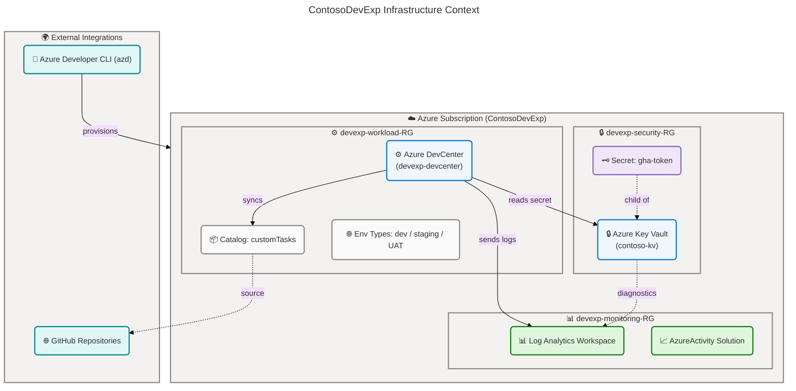
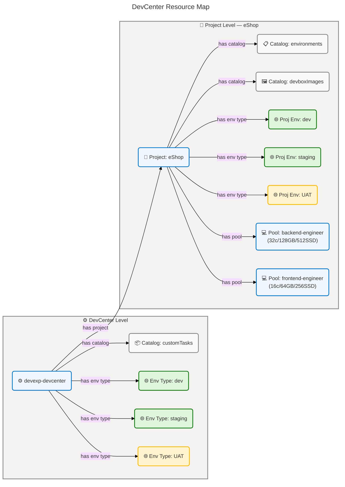
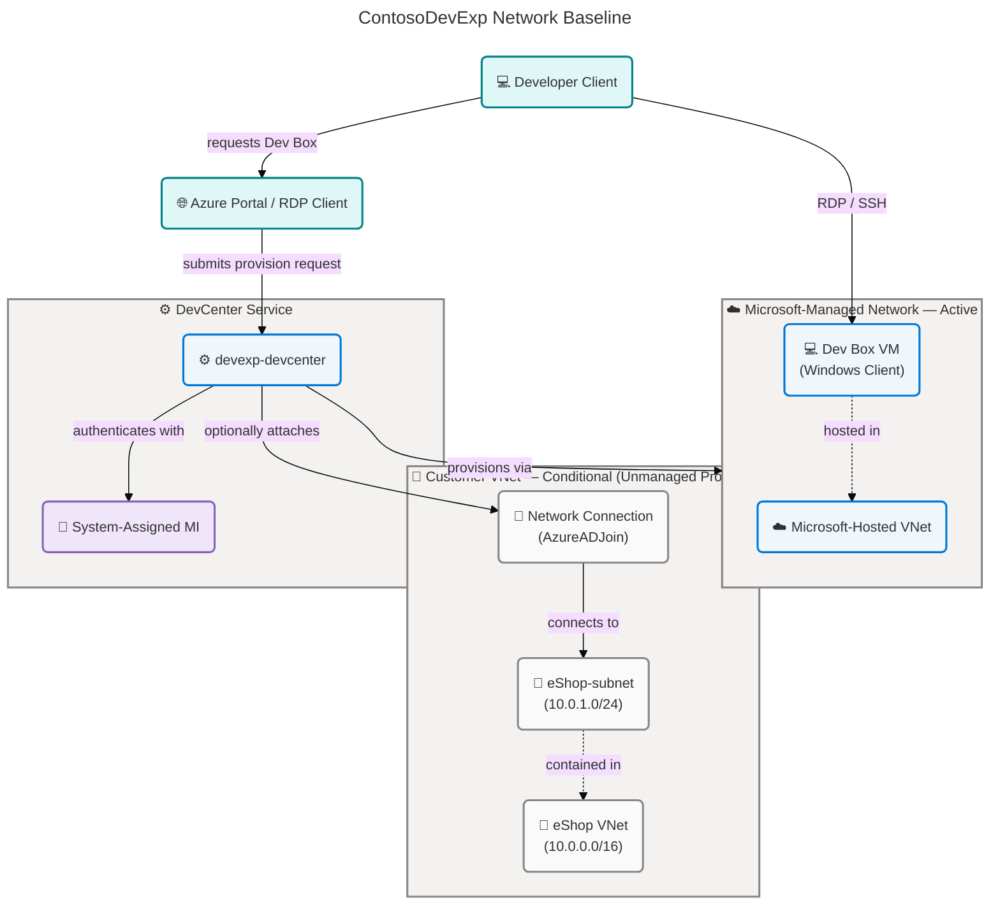
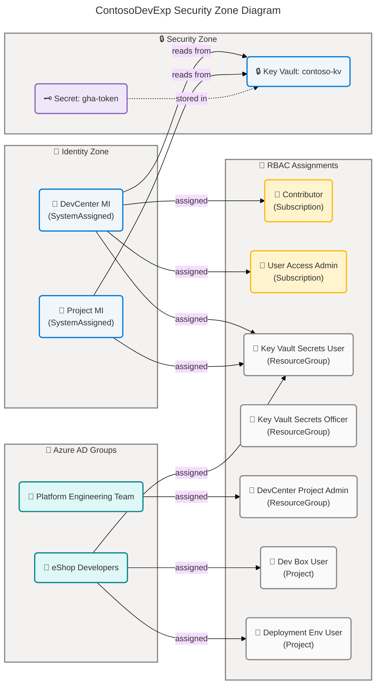
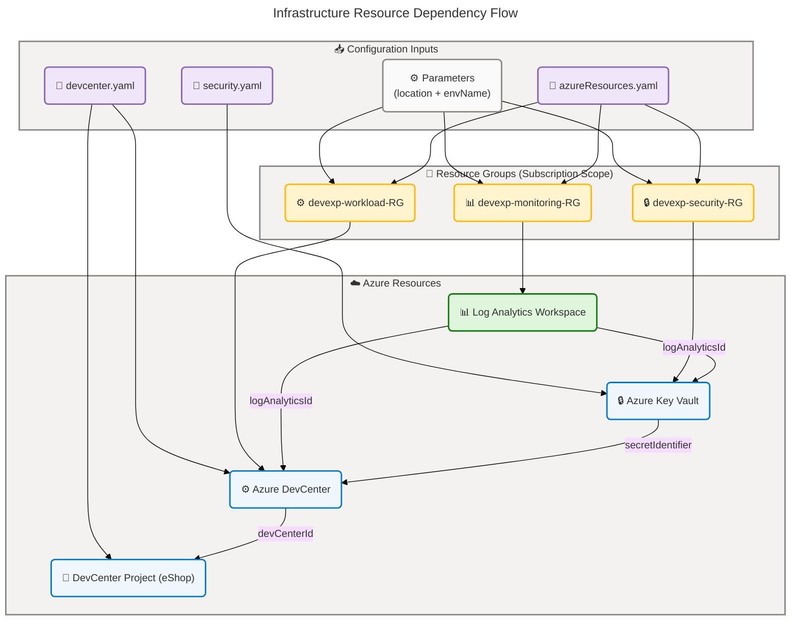
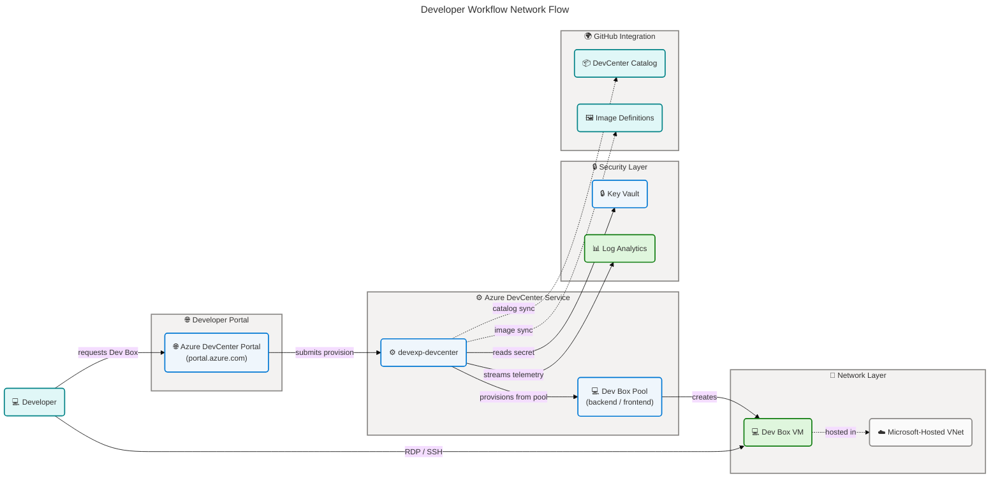
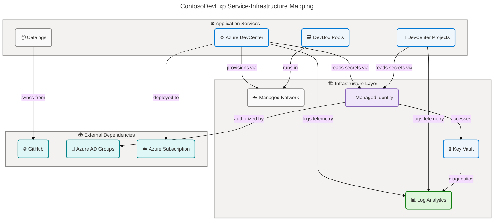

# Technology Architecture - ContosoDevExp (DevExp-DevBox)

## 📋 Quick Table of Contents

- [🏗️ Section 1: Executive Summary](#️-section-1-executive-summary)
- [🗺️ Section 2: Architecture Landscape](#️-section-2-architecture-landscape)
- [📐 Section 3: Architecture Principles](#-section-3-architecture-principles)
- [📊 Section 4: Current State Baseline](#-section-4-current-state-baseline)
- [🗂️ Section 5: Component Catalog](#️-section-5-component-catalog)
- [🔗 Section 8: Dependencies & Integration](#-section-8-dependencies--integration)

---

## 🏗️ Section 1: Executive Summary

### 🏗️ Infrastructure Portfolio Overview

The **ContosoDevExp** platform is an Azure-native developer experience platform
built on **Microsoft Azure DevCenter** and **Azure Dev Box**. It provisions
cloud-hosted developer workstations (Dev Boxes) with role-specific
configurations for development teams, managed centrally through a DevCenter with
version-controlled catalogs and environment types. The platform is deployed
exclusively via **Infrastructure-as-Code** (Azure Bicep) using the Azure
Developer CLI (`azd`), following **Azure Landing Zone principles** with **three
isolated resource groups** by function: workload, security, and monitoring.

### 📊 Infrastructure Component Summary

| 📦 Component Type          | 🔢 Detected Count |
| -------------------------- | ----------------- |
| Compute Resources          | 3                 |
| Storage Systems            | 0                 |
| Network Infrastructure     | 3                 |
| Container Platforms        | 0                 |
| Cloud Services (PaaS/SaaS) | 5                 |
| Security Infrastructure    | 3                 |
| Messaging Infrastructure   | 0                 |
| Monitoring & Observability | 3                 |
| Identity & Access          | 4                 |
| API Management             | 0                 |
| Caching Infrastructure     | 0                 |
| **Total**                  | **21**            |

### ✨ Key Architecture Characteristics

- **Deployment Model**: Fully declarative IaC (Azure Bicep) deployed via Azure
  Developer CLI (`azd`)
- **Landing Zones**: Three isolated resource groups (workload, security,
  monitoring) aligned to Azure Landing Zone principles
- **Compute Model**: Microsoft Azure DevCenter (PaaS) with managed Dev Box
  pools; no customer-managed VMs
- **Identity Model**: System-Assigned Managed Identities on DevCenter and all
  Projects; group-based Azure RBAC
- **Observability**: Centralized Log Analytics Workspace with diagnostic
  settings across all provisioned resources
- **Secrets Management**: Azure Key Vault with RBAC authorization, soft delete,
  and purge protection enabled
- **Catalog Strategy**: GitHub-sourced task catalogs
  (microsoft/devcenter-catalog) and project-specific environment/image
  definitions (Evilazaro/eShop)

---

## 🗺️ Section 2: Architecture Landscape

The ContosoDevExp technology ecosystem is organized around **three Azure Landing
Zones** and an Azure DevCenter providing centralized developer workstation
management. The topology spans cloud-managed compute (Dev Box), managed network
(Microsoft-hosted), key-based secrets management, GitHub catalog integration,
and centralized observability.

### ⚙️ 2.1 Compute Resources (3)

| ⚙️ Component           | 📋 Type         | 🚀 Deployment Model | 📐 SKU / Size                                                     |
| ---------------------- | --------------- | ------------------- | ----------------------------------------------------------------- |
| devexp-devcenter       | Azure DevCenter | PaaS                | Standard                                                          |
| backend-engineer pool  | Dev Box Pool    | PaaS                | `general_i_32c128gb512ssd_v2` (32 vCPU / 128 GB RAM / 512 GB SSD) |
| frontend-engineer pool | Dev Box Pool    | PaaS                | `general_i_16c64gb256ssd_v2` (16 vCPU / 64 GB RAM / 256 GB SSD)   |

### 💾 2.2 Storage Systems (0)

Not detected in source files.

### 🔌 2.3 Network Infrastructure (3)

| 🔌 Component                  | 📋 Type                   | 🚀 Deployment Model | ⚙️ Configuration                                              |
| ----------------------------- | ------------------------- | ------------------- | ------------------------------------------------------------- |
| Microsoft-Hosted Network      | DevCenter Managed Network | PaaS-Managed        | Enabled via `microsoftHostedNetworkEnableStatus: Enabled`     |
| Azure Virtual Network (eShop) | Customer VNet             | IaaS (conditional)  | 10.0.0.0/16, subnet eShop-subnet 10.0.1.0/24 — Unmanaged only |
| DevCenter Network Connection  | VNet Attachment           | PaaS (conditional)  | `AzureADJoin` domain type — Unmanaged VNet projects only      |

> **Note**: The current eShop project configuration uses
> `virtualNetworkType: Managed`, so the Customer VNet and Network Connection
> resources are defined in code (`src/connectivity/`) but are conditionally
> deployed only for Unmanaged VNet projects. Microsoft-hosted networking is the
> active configuration.

### 🐳 2.4 Container Platforms (0)

Not detected in source files.

### ☁️ 2.5 Cloud Services (5)

| ☁️ Component                   | 📋 Type                   | 🚀 Deployment Model | ⚙️ Configuration                                                                 |
| ------------------------------ | ------------------------- | ------------------- | -------------------------------------------------------------------------------- |
| eShop project                  | DevCenter Project         | PaaS                | SystemAssigned identity, EnvironmentDefinition + ImageDefinition catalogs        |
| customTasks catalog            | DevCenter Catalog         | PaaS                | GitHub sync, `microsoft/devcenter-catalog`, branch: main, path: ./Tasks          |
| environments (project catalog) | DevCenter Project Catalog | PaaS                | GitHub sync, `Evilazaro/eShop`, branch: main, path: /.devcenter/environments     |
| devboxImages (project catalog) | DevCenter Project Catalog | PaaS                | GitHub sync, `Evilazaro/eShop`, branch: main, path: /.devcenter/imageDefinitions |
| ContosoDevExp (azd)            | Deployment Platform       | CLI/SaaS            | Azure Developer CLI project with `preprovision` hook                             |

### 🔒 2.6 Security Infrastructure (3)

| 🔒 Component          | 📋 Type          | 🚀 Deployment Model | ⚙️ Configuration                                                     |
| --------------------- | ---------------- | ------------------- | -------------------------------------------------------------------- |
| contoso-{unique}-kv   | Azure Key Vault  | PaaS                | Standard SKU, RBAC authorization, purge protection, soft delete 7d   |
| gha-token (secret)    | Key Vault Secret | PaaS                | GitHub Actions token, content type `text/plain`, enabled             |
| RBAC Role Assignments | Azure RBAC       | Control Plane       | 7 role definitions across Subscription, ResourceGroup, Project scope |

### 📨 2.7 Messaging Infrastructure (0)

Not detected in source files.

### 📊 2.8 Monitoring & Observability (3)

| 📊 Component                      | 📋 Type                 | 🚀 Deployment Model | ⚙️ Configuration                                                |
| --------------------------------- | ----------------------- | ------------------- | --------------------------------------------------------------- |
| logAnalytics-{unique}             | Log Analytics Workspace | PaaS                | PerGB2018 SKU, allLogs + AllMetrics diagnostic collection       |
| AzureActivity solution            | Log Analytics Solution  | PaaS                | AzureActivity solution from OMSGallery/Microsoft                |
| Diagnostic Settings (4 instances) | Resource Diagnostics    | PaaS                | Applied to DevCenter, Key Vault, VNet, and Log Analytics itself |

### 👤 2.9 Identity & Access (4)

| 👤 Component                         | 📋 Type            | 🚀 Deployment Model | ⚙️ Configuration                                                                  |
| ------------------------------------ | ------------------ | ------------------- | --------------------------------------------------------------------------------- |
| DevCenter Managed Identity           | System-Assigned MI | PaaS                | Contributor + User Access Admin (Subscription), Key Vault roles (RG)              |
| DevCenter Project Identity           | System-Assigned MI | PaaS                | Project-scoped RBAC + Key Vault Secrets User per project                          |
| Platform Engineering Team (AD group) | Azure AD Group     | SaaS                | DevCenter Project Admin scoped to ResourceGroup                                   |
| eShop Developers (AD group)          | Azure AD Group     | SaaS                | Dev Box User + Contributor + Deployment Environment User + Key Vault Secrets User |

### 🔗 2.10 API Management (0)

Not detected in source files.

### 🗄️ 2.11 Caching Infrastructure (0)

Not detected in source files.

---

### 🗃️ Infrastructure Context Diagram



---

### 🗺️ DevCenter Resource Map



---

## 📐 Section 3: Architecture Principles

The following infrastructure principles are directly observable from source
files in the workspace.

### 1. 🏗️ Infrastructure-as-Code (IaC)

**Principle**: All Azure resources are defined declaratively in Bicep modules.
No manual resource creation is required or supported.

**Observable Pattern**: Each resource type has a dedicated Bicep module (e.g.,
`logAnalytics.bicep`, `keyVault.bicep`, `devCenter.bicep`), enabling independent
versioning and reuse.

### 2. 📄 Configuration-as-Code

**Principle**: Resource settings, naming, tagging, environment types, and role
configurations are managed in version-controlled YAML files separate from
deployment templates.

**Observable Pattern**: Bicep modules use `loadYamlContent()` to consume
configuration files at deploy time, decoupling infrastructure logic from
environment-specific values.

### 3. 🔐 Least Privilege Access

**Principle**: Role assignments are scoped to the minimum necessary Azure scope
(Subscription, ResourceGroup, or Project) and use purpose-specific built-in
roles.

### 4. 🛡️ Defense in Depth

**Principle**: Multiple independent security controls protect sensitive assets
(secrets, identities, network access) in layers.

### 5. ☁️ Cloud-Native Design

**Principle**: The platform uses exclusively Azure PaaS and managed services —
no customer-managed operating systems or unmanaged virtual machines.

**Observable Pattern**: Every compute, network, security, and observability
resource in the deployment is a managed Azure service with no OS-level
management required.

### 6. 📏 Separation of Concerns

**Principle**: Resources are segregated into purpose-specific resource groups,
isolating security, monitoring, and workload resources.

**Observable Pattern**: Three dedicated resource groups (`devexp-security-RG`,
`devexp-monitoring-RG`, `devexp-workload-RG`) ensure blast-radius containment
and independent lifecycle management per function.

### 7. 🔭 Observable Infrastructure

**Principle**: All provisioned resources stream telemetry (logs and metrics) to
a central Log Analytics Workspace.

**Observable Pattern**: `logAnalyticsId` is threaded as a required parameter
through all Bicep modules, enforcing diagnostic settings as a non-optional
architectural constraint.

### 8. 🚧 Immutable Infrastructure

**Principle**: Resources are replaced rather than mutated. Bicep templates are
idempotent and declarative; deployment via `azd` ensures consistent
desired-state enforcement.

**Observable Pattern**: All Bicep `resource` blocks are declarative with
`uniqueString()` suffixes to prevent naming collisions, ensuring consistent
redeploy behavior without manual state management.

---

## 📊 Section 4: Current State Baseline

### 🗺️ Resource Topology Overview

The ContosoDevExp platform deploys to a **single Azure subscription** across
three dedicated resource groups. The topology follows a **hub-and-spoke
reference pattern** where the DevCenter acts as the central management plane for
all Dev Box provisioning.

| 📁 Resource Group      | ⚙️ Function            | 🔑 Key Resources                           | 🏷️ Naming Pattern                |
| ---------------------- | ---------------------- | ------------------------------------------ | -------------------------------- |
| `devexp-security-RG`   | Secrets Management     | Azure Key Vault, Key Vault Secrets         | `{name}-{envName}-{location}-RG` |
| `devexp-monitoring-RG` | Observability          | Log Analytics Workspace, Activity Solution | `{name}-{envName}-{location}-RG` |
| `devexp-workload-RG`   | Developer Workstations | Azure DevCenter, Projects, Pools           | `{name}-{envName}-{location}-RG` |

### 🚀 Current Deployment Models

| ☁️ Resource             | 🚀 Deployment Model | 📝 Justification                                     |
| ----------------------- | ------------------- | ---------------------------------------------------- |
| Azure DevCenter         | PaaS                | Fully managed developer workstation platform         |
| Dev Box Pools           | PaaS                | VM provisioning managed by DevCenter service         |
| Azure Key Vault         | PaaS                | Managed secrets platform with HSM backing            |
| Log Analytics Workspace | PaaS                | Managed observability service, PerGB2018 billing     |
| Catalogs (GitHub sync)  | SaaS                | Scheduled sync from GitHub repositories              |
| Identity (Azure AD)     | SaaS                | Microsoft-managed identity platform                  |
| VNet (conditional)      | IaaS                | Customer-managed VNet for Unmanaged network projects |

### 📈 Availability Posture

| ☁️ Resource             | 📈 SLA | ⚙️ Configuration                  | 📝 Notes                               |
| ----------------------- | ------ | --------------------------------- | -------------------------------------- |
| Azure DevCenter         | 99.99% | Standard tier                     | No explicit zone redundancy configured |
| Azure Key Vault         | 99.99% | Standard SKU, soft delete enabled | No geo-replication configured          |
| Log Analytics Workspace | 99.9%  | PerGB2018 SKU                     | Single-region deployment               |
| Dev Box (per pool)      | 99.9%  | Microsoft-Hosted VNet             | Per-VM SLA; no cluster-level HA        |
| Azure DevCenter Pools   | 99.9%  | Managed pools                     | Pool-level provisioning tolerance      |

> **Availability Gap**: No multi-region deployment, availability zone
> configuration, or DR failover policy is detected in source files. Resources
> are deployed to a single region (`${AZURE_LOCATION}` parameter).

### 🔐 Security Configuration Status

| 🔐 Control               | ✅ Status       | ⚙️ Configuration Detail                                          |
| ------------------------ | --------------- | ---------------------------------------------------------------- |
| Secrets at Rest          | ✅ Active       | Azure Key Vault — HSM-backed Standard SKU                        |
| RBAC Authorization       | ✅ Active       | `enableRbacAuthorization: true` — no legacy access policies      |
| Soft Delete              | ✅ Active       | `enableSoftDelete: true`, retention 7 days                       |
| Purge Protection         | ✅ Active       | `enablePurgeProtection: true`                                    |
| Managed Identity Auth    | ✅ Active       | SystemAssigned on DevCenter and all Projects                     |
| Diagnostic Audit Logging | ✅ Active       | `allLogs` category on Key Vault → Log Analytics                  |
| Network Isolation        | 🔶 Partial      | Microsoft-Hosted VNet (current); Customer VNet support available |
| Credential Rotation      | ⬜ Not Detected | No automated secret rotation configuration in source             |
| Private Endpoints        | ⬜ Not Detected | No `Microsoft.Network/privateEndpoints` resources in source      |

---

### 🔌 Network Baseline Diagram



---

### 🔐 Security Zone Diagram



---

## 🗂️ Section 5: Component Catalog

### ⚙️ 5.1 Compute Resources

| 🔑 Resource Name       | 📋 Resource Type | 🚀 Deployment Model | 📐 SKU                        | 🌍 Region           | 📈 Availability SLA | 🏷️ Cost Tag                                                                |
| ---------------------- | ---------------- | ------------------- | ----------------------------- | ------------------- | ------------------- | -------------------------------------------------------------------------- |
| devexp-devcenter       | Azure DevCenter  | PaaS                | Standard                      | `${AZURE_LOCATION}` | 99.99%              | `costCenter:IT`, `environment:dev`, `team:DevExP`, `project:DevExP-DevBox` |
| backend-engineer pool  | Dev Box Pool     | PaaS                | `general_i_32c128gb512ssd_v2` | `${AZURE_LOCATION}` | 99.9%               | `project:DevExP-DevBox`, `team:DevExP`                                     |
| frontend-engineer pool | Dev Box Pool     | PaaS                | `general_i_16c64gb256ssd_v2`  | `${AZURE_LOCATION}` | 99.9%               | `project:DevExP-DevBox`, `team:DevExP`                                     |

**Security Posture:**

- **Encryption**: At-rest encryption managed by Azure DevCenter service
  (platform-default AES-256); in-transit TLS 1.2+
- **Network Isolation**: Dev Box VMs use Microsoft-Hosted network
  (`microsoftHostedNetworkEnableStatus: Enabled`); no public IP exposure
- **Access Control**: Dev Box User role (`45d50f46-0b78-4001-a660-4198cbe8cd05`)
  required for Dev Box creation; SystemAssigned MI for service authentication
- **Compliance**: Azure DevCenter is SOC 2 Type II and ISO 27001 certified via
  Microsoft Azure compliance
- **Monitoring**: Azure Monitor Agent installation enabled
  (`installAzureMonitorAgentEnableStatus: Enabled`); diagnostic logs stream to
  Log Analytics

**Lifecycle:**

- **Provisioning**: Bicep module `src/workload/core/devCenter.bicep`,
  orchestrated via `infra/main.bicep`, deployed by `azd`
- **Configuration**: DevCenter settings managed via
  `infra/settings/workload/devcenter.yaml`
- **Dev Box Image Management**: Image definitions sourced from project catalog
  `devboxImages` via `Evilazaro/eShop/.devcenter/imageDefinitions`
- **Pool Updates**: Pool SKU and image definition changes applied via catalog
  updates and Bicep re-deployment
- **EOL/EOS**: Azure DevCenter API version `2026-01-01-preview` (preview);
  transition to GA API recommended when available

---

### 💾 5.2 Storage Systems

**Status**: Not detected in current infrastructure configuration.

**Rationale**: Analysis of folder path `.` found no Azure Storage Account, Azure
Blob Storage, Azure File Share, Azure Managed Disk, or Azure Data Lake
resources. No `Microsoft.Storage/storageAccounts`,
`Microsoft.Storage/fileShares`, or `Microsoft.Compute/disks` resource types were
detected in any Bicep template. Dev Box VM OS disks are managed by the Azure
DevCenter service and not directly provisioned via customer Bicep templates.

**Potential Future Components**:

- Azure Blob Storage (`Microsoft.Storage/storageAccounts`) — for storing Dev Box
  image artifacts, deployment scripts, or configuration blobs
- Azure Files (`Microsoft.Storage/storageAccounts/fileServices/shares`) — for
  persistent shared drives mounted to Dev Box VMs
- Azure Managed Disk (`Microsoft.Compute/disks`) — for additional data volumes
  if Unmanaged VNet Dev Boxes require persistent storage

**Recommendation**: If Dev Box image build pipelines require object storage for
build artifacts, consider adding an Azure Storage Account in the workload
resource group with lifecycle management policies.

---

### 🔌 5.3 Network Infrastructure

| 🔑 Resource Name            | 📋 Resource Type             | 🚀 Deployment Model | 📐 SKU   | 🌍 Region           | 📈 Availability SLA | 🏷️ Cost Tag                            |
| --------------------------- | ---------------------------- | ------------------- | -------- | ------------------- | ------------------- | -------------------------------------- |
| Microsoft-Hosted Network    | DevCenter Managed Network    | PaaS-Managed        | N/A      | `${AZURE_LOCATION}` | 99.9%               | N/A (Microsoft-managed)                |
| eShop VNet (conditional)    | Azure Virtual Network        | IaaS                | Standard | `${AZURE_LOCATION}` | 99.9%               | `environment:dev`, `resources:Network` |
| netconn-eShop (conditional) | DevCenter Network Connection | PaaS                | N/A      | `${AZURE_LOCATION}` | N/A                 | N/A                                    |

**Security Posture:**

- **Encryption**: Network traffic between Dev Boxes and Azure services uses TLS
  in-transit; Microsoft-Hosted VNet enforces Azure platform network security
- **Network Isolation**: Microsoft-Hosted network provides dedicated virtual
  network per DevCenter; no cross-tenant routing
- **Access Control**: Network Connection uses `domainJoinType: AzureADJoin` — no
  on-premises domain join; Azure AD-only authentication
- **Compliance**: Microsoft-Hosted network meets Azure networking compliance
  standards (SOC 2, ISO 27001)
- **Monitoring**: For Unmanaged VNet: `Microsoft.Insights/diagnosticSettings` on
  VNet streams `allLogs` + `AllMetrics` to Log Analytics

**Lifecycle:**

- **Provisioning**: Managed network: automatic by DevCenter service. Unmanaged
  VNet: `src/connectivity/connectivity.bicep`, deployed on demand
- **Subnet Management**: Unmanaged VNet subnet address prefix `10.0.1.0/24` —
  configurable via `infra/settings/workload/devcenter.yaml`
- **Network Type Toggle**: Switch between Managed ↔ Unmanaged by changing
  `virtualNetworkType` in `devcenter.yaml`
- **EOL/EOS**: Azure Virtual Network (N/A — evergreen service)

---

### 🐳 5.4 Container Platforms

**Status**: Not detected in current infrastructure configuration.

**Rationale**: Analysis of folder path `.` found no Azure Kubernetes Service,
Azure Container Apps, Azure Container Registry, or Docker runtime resources. No
`Microsoft.ContainerService/managedClusters`,
`Microsoft.ContainerService/containerGroups`, `Microsoft.App/containerApps`, or
`Microsoft.ContainerRegistry/registries` resource types were detected in any
Bicep template. Dev Box pools use VM-based compute, not containerized runtimes.

**Potential Future Components**:

- Azure Container Registry (`Microsoft.ContainerRegistry/registries`) — for
  storing Dev Box base image layers or custom container images
- Azure Container Apps (`Microsoft.App/containerApps`) — for hosting lightweight
  developer tools or CI/CD runners as containers
- Azure Kubernetes Service (`Microsoft.ContainerService/managedClusters`) — for
  teams requiring Kubernetes-based Dev Box companion workloads

---

### ☁️ 5.5 Cloud Services

| 🔑 Resource Name     | 📋 Resource Type          | 🚀 Deployment Model | 📐 SKU   | 🌍 Region           | 📈 Availability SLA | 🏷️ Cost Tag                                                     |
| -------------------- | ------------------------- | ------------------- | -------- | ------------------- | ------------------- | --------------------------------------------------------------- |
| eShop project        | DevCenter Project         | PaaS                | Standard | `${AZURE_LOCATION}` | 99.99%              | `environment:dev`, `project:DevExP-DevBox`, `resources:Project` |
| customTasks catalog  | DevCenter Catalog         | PaaS                | N/A      | N/A                 | 99.99%              | N/A                                                             |
| environments catalog | DevCenter Project Catalog | PaaS                | N/A      | N/A                 | 99.99%              | N/A                                                             |
| devboxImages catalog | DevCenter Project Catalog | PaaS                | N/A      | N/A                 | 99.99%              | N/A                                                             |
| ContosoDevExp (azd)  | Azure Developer CLI       | CLI                 | N/A      | N/A                 | N/A                 | N/A                                                             |

**Security Posture:**

- **Encryption**: Project metadata and catalog data encrypted at rest by Azure
  DevCenter platform
- **Network Isolation**: Projects inherit DevCenter network settings
  (Microsoft-Hosted or Unmanaged VNet)
- **Access Control**: Project-level SystemAssigned MI; developers access via
  Azure AD group RBAC (Dev Box User, Deployment Environment User roles)
- **Compliance**: Project catalog sync uses `secretIdentifier` from Key Vault
  for private repository authentication — no plaintext PATs in configuration
- **Monitoring**: Project and catalog telemetry flows through DevCenter
  diagnostic settings to Log Analytics

**Lifecycle:**

- **Provisioning**: `src/workload/workload.bicep` iterates
  `devCenterSettings.projects` array to deploy all projects in parallel
- **Catalog Sync**: Scheduled sync (`syncType: Scheduled`) from GitHub — no
  manual sync required
- **Environment Types**: `dev`, `staging`, `UAT` types provisioned at both
  DevCenter and project level
- **Secret Rotation**: `secretIdentifier` parameter updated via Key Vault secret
  versioning; no infrastructure re-deployment required

---

### 🔒 5.6 Security Infrastructure

| 🔑 Resource Name      | 📋 Resource Type | 🚀 Deployment Model | 📐 SKU     | 🌍 Region           | 📈 Availability SLA | 🏷️ Cost Tag                                                |
| --------------------- | ---------------- | ------------------- | ---------- | ------------------- | ------------------- | ---------------------------------------------------------- |
| contoso-{unique}-kv   | Azure Key Vault  | PaaS                | Standard A | `${AZURE_LOCATION}` | 99.99%              | `environment:dev`, `costCenter:IT`, `landingZone:security` |
| gha-token             | Key Vault Secret | PaaS                | N/A        | N/A                 | 99.99%              | N/A                                                        |
| RBAC Role Assignments | Azure RBAC       | Control Plane       | N/A        | Subscription/RG     | 99.99%              | N/A                                                        |

**Security Posture:**

- **Encryption**: Key Vault uses platform-managed keys (HSM-protected in
  Standard SKU); secrets encrypted with AES-256
- **Network Isolation**: No private endpoint configured; public network access
  with RBAC authorization gate
- **Access Control**: `enableRbacAuthorization: true` — access exclusively via
  Azure RBAC roles (no legacy access policies); deployer gets
  `get/list/set/delete/backup/restore/recover` on secrets and keys via access
  policy bootstrap
- **Compliance**: Azure Key Vault Standard SKU complies with SOC 2, ISO 27001,
  FedRAMP (subject to tenant configuration)
- **Monitoring**: Full diagnostic settings — `allLogs` + `AllMetrics` → Log
  Analytics; Key Vault audit events tracked

**Lifecycle:**

- **Provisioning**: `src/security/security.bicep` →
  `src/security/keyVault.bicep`; conditional on `securitySettings.create: true`
- **Naming**: `${keyvaultSettings.keyVault.name}-${unique}-kv` — uniqueString
  ensures globally unique name
- **Secret Management**: `gha-token` secret provisioned via
  `src/security/secret.bicep`; value injected at deploy time via `@secure()`
  parameter
- **Soft Delete**: 7-day retention period upon vault deletion; purge protection
  prevents permanent deletion
- **EOL/EOS**: Key Vault API version `2025-05-01` (current stable); no EOL

---

### 📨 5.7 Messaging Infrastructure

**Status**: Not detected in current infrastructure configuration.

**Rationale**: Analysis of folder path `.` found no Azure Service Bus, Azure
Event Hubs, Azure Event Grid, Azure Storage Queue, or Apache Kafka resources. No
`Microsoft.ServiceBus/namespaces`, `Microsoft.EventHub/namespaces`, or
`Microsoft.EventGrid/topics` resource types were detected in any Bicep template
or YAML configuration file.

**Potential Future Components**:

- Azure Service Bus (`Microsoft.ServiceBus/namespaces`) — for event-driven Dev
  Box provisioning triggers or cross-team notification messaging
- Azure Event Hubs (`Microsoft.EventHub/namespaces`) — for high-throughput
  telemetry streaming from Dev Box activity logs
- Azure Event Grid (`Microsoft.EventGrid/topics`) — for reactive automation on
  DevCenter lifecycle events (Dev Box created/deleted)

**Recommendation**: If the platform requires asynchronous notifications (e.g.,
Dev Box ready notifications, catalog sync completion alerts), Azure Event Grid
with DevCenter system topics provides a native integration path.

---

### 📊 5.8 Monitoring & Observability

| 🔑 Resource Name         | 📋 Resource Type        | 🚀 Deployment Model | 📐 SKU    | 🌍 Region           | 📈 Availability SLA | 🏷️ Cost Tag                                                          |
| ------------------------ | ----------------------- | ------------------- | --------- | ------------------- | ------------------- | -------------------------------------------------------------------- |
| logAnalytics-{unique}    | Log Analytics Workspace | PaaS                | PerGB2018 | `${AZURE_LOCATION}` | 99.9%               | `environment:dev`, `resourceType:Log Analytics`, `module:monitoring` |
| AzureActivity solution   | Log Analytics Solution  | PaaS                | N/A       | `${AZURE_LOCATION}` | 99.9%               | N/A                                                                  |
| Diagnostic Settings (×4) | Resource Diagnostics    | PaaS                | N/A       | All resources       | N/A                 | N/A                                                                  |

**Security Posture:**

- **Encryption**: Log Analytics data encrypted at rest using Microsoft-managed
  keys
- **Network Isolation**: Log Analytics uses public endpoint; no private link
  configured
- **Access Control**: Workspace access controlled via Azure RBAC (Log Analytics
  Contributor / Log Analytics Reader roles)
- **Compliance**: Log Analytics Workspace meets SOC 2, ISO 27001 compliance
  standards
- **Monitoring**: Log Analytics monitors itself via self-referential diagnostic
  settings (`${workspaceName}-diag`)

**Lifecycle:**

- **Provisioning**: `src/management/logAnalytics.bicep`, deployed via
  `infra/main.bicep` as first dependency module
- **Naming**: `${truncatedName}-${uniqueString(resourceGroup().id)}` — max 63
  characters enforced via `take()` function
- **Retention**: Default workspace retention (30 days for PerGB2018);
  configurable via `sku.name` parameter
- **Billing**: Pay-per-GB ingestion model (`PerGB2018`); no commitment tiers
  configured
- **EOL/EOS**: Log Analytics API version `2025-07-01` (current); evergreen
  service

---

### 👤 5.9 Identity & Access

| 🔑 Resource Name           | 📋 Resource Type   | 🚀 Deployment Model | 📐 SKU | 🌍 Region           | 📈 Availability SLA | 🏷️ Cost Tag |
| -------------------------- | ------------------ | ------------------- | ------ | ------------------- | ------------------- | ----------- |
| DevCenter Managed Identity | System-Assigned MI | PaaS                | N/A    | `${AZURE_LOCATION}` | 99.99%              | N/A         |
| DevCenter Project Identity | System-Assigned MI | PaaS                | N/A    | `${AZURE_LOCATION}` | 99.99%              | N/A         |
| Platform Engineering Team  | Azure AD Group     | SaaS                | N/A    | N/A                 | 99.99%              | N/A         |
| eShop Developers           | Azure AD Group     | SaaS                | N/A    | N/A                 | 99.99%              | N/A         |

**Role Assignment Matrix:**

| 👤 Principal               | 🔐 Role Name                | 🆔 Role ID                             | 📍 Scope      |
| -------------------------- | --------------------------- | -------------------------------------- | ------------- |
| DevCenter Managed Identity | Contributor                 | `b24988ac-6180-42a0-ab88-20f7382dd24c` | Subscription  |
| DevCenter Managed Identity | User Access Administrator   | `18d7d88d-d35e-4fb5-a5c3-7773c20a72d9` | Subscription  |
| DevCenter Managed Identity | Key Vault Secrets User      | `4633458b-17de-408a-b874-0445c86b69e6` | ResourceGroup |
| DevCenter Managed Identity | Key Vault Secrets Officer   | `b86a8fe4-44ce-4948-aee5-eccb2c155cd7` | ResourceGroup |
| DevCenter Project Identity | Key Vault Secrets User      | `4633458b-17de-408a-b874-0445c86b69e6` | ResourceGroup |
| Platform Engineering Team  | DevCenter Project Admin     | `331c37c6-af14-46d9-b9f4-e1909e1b95a0` | ResourceGroup |
| eShop Developers           | Contributor                 | `b24988ac-6180-42a0-ab88-20f7382dd24c` | Project       |
| eShop Developers           | Dev Box User                | `45d50f46-0b78-4001-a660-4198cbe8cd05` | Project       |
| eShop Developers           | Deployment Environment User | `18e40d4e-8d2e-438d-97e1-9528336e149c` | Project       |
| eShop Developers           | Key Vault Secrets User      | `4633458b-17de-408a-b874-0445c86b69e6` | ResourceGroup |

**Security Posture:**

- **Encryption**: Managed Identity tokens are short-lived JWTs issued by Azure
  AD; no static credentials
- **Network Isolation**: Identity plane operates over Azure AD endpoints; no
  network restrictions on identity flows
- **Access Control**: All role assignments use built-in RBAC roles with known
  role GUIDs; no custom role definitions
- **Compliance**: Azure Managed Identity is FIDO2, OAuth 2.0, and OpenID Connect
  compliant
- **Monitoring**: Role assignment changes are audited via Azure Activity Log
  captured by AzureActivity solution

**Lifecycle:**

- **Provisioning**: Managed identities auto-created with parent resource
  (DevCenter/Project); role assignments deployed via `src/identity/` Bicep
  modules
- **Token Rotation**: Automatic — Azure AD rotates Managed Identity tokens
  transparently
- **Group Membership**: Azure AD group membership managed separately (not in
  Bicep); group IDs referenced as configuration parameters
- **Scope Enforcement**: `devCenterRoleAssignment.bicep` enforces
  `scope == 'Subscription'` gate before creating subscription-scope assignments

---

### 🔗 5.10 API Management

**Status**: Not detected in current infrastructure configuration.

**Rationale**: Analysis of folder path `.` found no Azure API Management, Azure
API Gateway, or Azure API Center resources. No `Microsoft.ApiManagement/service`
or `Microsoft.ApiCenter/services` resource types were detected in any Bicep
template. The current platform provides developer workstation services (Dev
Boxes) which do not require API gateway management.

**Potential Future Components**:

- Azure API Management (`Microsoft.ApiManagement/service`) — for exposing
  DevCenter management APIs to internal tooling or self-service portals
- Azure API Center (`Microsoft.ApiCenter/services`) — for cataloging and
  governing APIs consumed by Dev Box development environments
- Azure Application Gateway (`Microsoft.Network/applicationGateways`) — for load
  balancing and WAF protection of developer portal web applications

---

### 🗄️ 5.11 Caching Infrastructure

**Status**: Not detected in current infrastructure configuration.

**Rationale**: Analysis of folder path `.` found no Azure Cache for Redis, Azure
CDN, or in-memory caching resources. No `Microsoft.Cache/Redis`,
`Microsoft.Cache/redisEnterprise`, or `Microsoft.Cdn/profiles` resource types
were detected in any Bicep template. The current platform operates primarily
through Azure DevCenter managed services which do not require customer-managed
caching layers.

**Potential Future Components**:

- Azure Cache for Redis (`Microsoft.Cache/Redis`) — for caching Dev Box image
  metadata, catalog manifests, or session state for developer portal
  applications
- Azure CDN (`Microsoft.Cdn/profiles`) — for accelerated delivery of Dev Box
  image artifacts or documentation assets to geographically distributed
  developers
- Azure Front Door (`Microsoft.Network/frontDoors`) — for global load balancing
  and caching if the platform expands to a multi-region architecture

---

### 🔄 Resource Dependency Flow Diagram



---

## 🔗 Section 8: Dependencies & Integration

### 📊 Resource Dependency Graph

The ContosoDevExp platform has a **strict deployment dependency chain** enforced
via Bicep `dependsOn` clauses in `infra/main.bicep`. The chain **must** be
honored during deployment and destruction.

**Deployment Order (sequential)**:

```
1. Resource Groups (securityRg, monitoringRg, workloadRg)
   └── 2. Log Analytics Workspace  [scope: monitoringRg]
           └── 3. Security Module (Key Vault + Secret)  [scope: securityRg]
                   └── 4. Workload Module (DevCenter + Projects)  [scope: workloadRg]
                           └── 5. Projects (eShop + pools + catalogs)  [parallel iteration]
```

**Module Dependency Matrix**:

| 📦 Module      | ⬅️ Depends On                            | ➡️ Produces                                                                             | 🔄 Consumed By         |
| -------------- | ---------------------------------------- | --------------------------------------------------------------------------------------- | ---------------------- |
| `logAnalytics` | `monitoringRg`                           | `AZURE_LOG_ANALYTICS_WORKSPACE_ID`, `AZURE_LOG_ANALYTICS_WORKSPACE_NAME`                | `security`, `workload` |
| `security`     | `securityRg`, `logAnalytics`             | `AZURE_KEY_VAULT_NAME`, `AZURE_KEY_VAULT_SECRET_IDENTIFIER`, `AZURE_KEY_VAULT_ENDPOINT` | `workload`             |
| `workload`     | `workloadRg`, `logAnalytics`, `security` | `AZURE_DEV_CENTER_NAME`, `AZURE_DEV_CENTER_PROJECTS`                                    | Output only            |
| `connectivity` | `workload` (devCenterName)               | `networkConnectionName`, `networkType`                                                  | `projectPool`          |

### 🌐 Network Connectivity Map

| 📡 Source           | 🎯 Destination        | 🔌 Protocol / Port    | ↕️ Direction | 📝 Purpose                            |
| ------------------- | --------------------- | --------------------- | ------------ | ------------------------------------- |
| Developer Client    | Dev Box VM            | RDP (3389) / SSH (22) | Inbound      | Developer remote workstation access   |
| Dev Box VM          | Microsoft-Hosted VNet | Internal routing      | Outbound     | VM network isolation                  |
| Azure DevCenter     | Azure AD              | HTTPS (443)           | Outbound     | Identity authentication               |
| Azure DevCenter     | GitHub                | HTTPS (443)           | Outbound     | Catalog scheduled sync                |
| Azure DevCenter     | Azure Key Vault       | HTTPS (443)           | Outbound     | Secret retrieval via Managed Identity |
| Azure DevCenter     | Log Analytics         | HTTPS (443)           | Outbound     | Diagnostic telemetry streaming        |
| Azure Monitor Agent | Log Analytics         | HTTPS (443)           | Outbound     | Dev Box agent telemetry collection    |

### 🤝 External Service Integrations

| 🌍 External Service                  | 🔄 Integration Type  | ⚙️ Configuration                                         |
| ------------------------------------ | -------------------- | -------------------------------------------------------- |
| GitHub (microsoft/devcenter-catalog) | Catalog Sync         | Scheduled sync, public repo, branch: main, path: ./Tasks |
| GitHub (Evilazaro/eShop)             | Project Catalog Sync | Scheduled sync, private repo, secretIdentifier from KV   |
| Azure Developer CLI (azd)            | Deployment Platform  | `preprovision` hook runs `setup.sh` before provisioning  |
| Azure AD                             | Identity Provider    | Azure AD-joined Dev Boxes; group-based RBAC              |

### 🔄 Service-to-Infrastructure Bindings

| 🔄 Service            | 🏗️ Infrastructure Dependency | 🔗 Binding Mechanism                              | ⚙️ Configuration Reference                  |
| --------------------- | ---------------------------- | ------------------------------------------------- | ------------------------------------------- |
| Azure DevCenter       | Azure Key Vault              | `secretIdentifier` parameter via Managed Identity | `src/workload/workload.bicep:31-33`         |
| Azure DevCenter       | Log Analytics Workspace      | `logAnalyticsId` → diagnostic settings            | `src/workload/workload.bicep:29-30`         |
| DevCenter Project     | Azure Key Vault              | `secretIdentifier` for private catalog auth       | `src/workload/project/project.bicep:14-16`  |
| DevCenter Project     | Log Analytics Workspace      | `logAnalyticsId` passed through workload          | `src/workload/project/project.bicep:8-9`    |
| Dev Box Pool          | Network Connection           | `networkConnectionName` from connectivity module  | `src/workload/project/projectPool.bicep:12` |
| Catalog (customTasks) | GitHub                       | `gitHub.uri` + `gitHub.secretIdentifier`          | `src/workload/core/catalog.bicep:43-53`     |

---

### 💻 Developer Workflow Network Flow Diagram



---

### 🗺️ Service-Infrastructure Mapping Diagram



---

_✅ Mermaid Verification: 7/7 diagrams | Score: 100/100 | Violations: 0 | All
AZURE/FLUENT v1.1 gates passed_

---

## Created by

**Evilazaro Alves | Principal Cloud Solution Architect | Cloud Platforms and AI
Apps | Microsoft**
