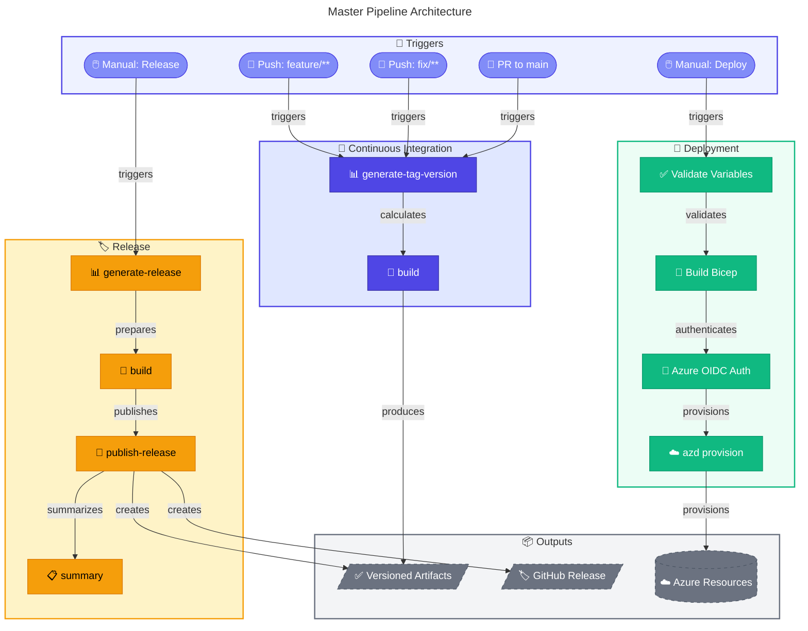
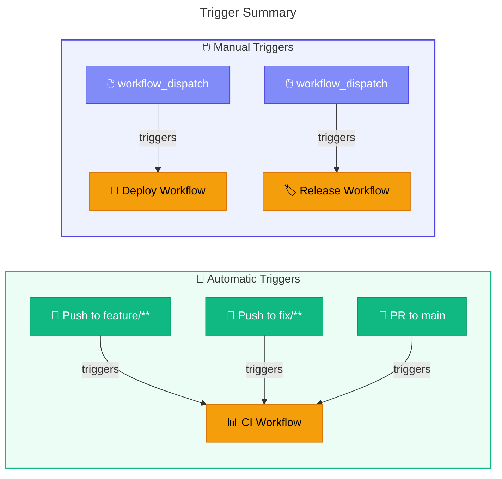
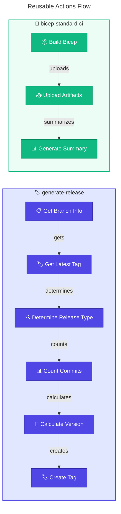

# 🔄 DevOps Documentation

> 📖 Comprehensive documentation for GitHub Actions workflows in the Dev Box Accelerator project.

> [!NOTE]
> **Target Audience:** DevOps Engineers, Platform Engineers, CI/CD Administrators  
> **Reading Time:** ~10 minutes

📍 Navigation

| Previous | Index | Next |
|:---------|:-----:|-----:|
| — | [Docs Index](../README.md) | [CI Workflow →](ci.md) |

---

## 📑 Table of Contents

- [🎯 Overview](#-overview)
- [🏗️ Master Pipeline Architecture](#%EF%B8%8F-master-pipeline-architecture)
- [📚 Workflow Documentation](#-workflow-documentation)
- [⚡ Quick Reference](#-quick-reference)
- [🔄 Reusable Components](#-reusable-components)
- [🏷️ Versioning Strategy](#%EF%B8%8F-versioning-strategy)
- [✅ Best Practices](#-best-practices)
- [🔗 Related Documentation](#-related-documentation)

---

## 🎯 Overview

This folder contains detailed documentation for all CI/CD workflows that automate the build, test, and deployment processes for the Dev Box Accelerator infrastructure-as-code project.

---

[⬆️ Back to Top](#-table-of-contents)

---

## 🏗️ Master Pipeline Architecture

The following diagram shows the complete CI/CD pipeline architecture and how all workflows relate to each other:

---

[⬆️ Back to Top](#-table-of-contents)

---

## 📚 Workflow Documentation

| Workflow | File | Purpose | Trigger |
|----------|------|---------|---------|
| [Continuous Integration](ci.md) | `ci.yml` | Builds and validates Bicep templates | Push to `feature/**`, `fix/**`; PRs to `main` |
| [Deploy to Azure](deploy.md) | `deploy.yml` | Provisions infrastructure to Azure | Manual (`workflow_dispatch`) |
| [Branch-Based Release](release.md) | `release.yml` | Creates GitHub releases with versioned artifacts | Manual (`workflow_dispatch`) |

---

[⬆️ Back to Top](#-table-of-contents)

---

## ⚡ Quick Reference

### Trigger Summary

### Required Secrets & Variables

| Name | Type | Used By | Description |
|------|------|---------|-------------|
| `AZURE_CLIENT_ID` | Variable | Deploy | Azure AD App Registration Client ID |
| `AZURE_TENANT_ID` | Variable | Deploy | Azure AD Tenant ID |
| `AZURE_SUBSCRIPTION_ID` | Variable | Deploy | Target Azure Subscription |
| `KEY_VAULT_SECRET` | Secret | Deploy | Key Vault secret value |
| `GITHUB_TOKEN` | Secret (Auto) | Release | Auto-provided for GitHub API access |

### Permissions Matrix

| Permission | CI | Deploy | Release | Purpose |
|------------|:--:|:------:|:-------:|---------|
| `contents: write` | ✅ | ❌ | ✅ | Create tags and releases |
| `contents: read` | ✅ | ✅ | ✅ | Checkout repository |
| `pull-requests: read` | ✅ | ❌ | ✅ | Access PR information |
| `id-token: write` | ❌ | ✅ | ❌ | OIDC authentication |
| `actions: read` | ❌ | ❌ | ✅ | Workflow introspection |

---

[⬆️ Back to Top](#-table-of-contents)

---

## 🔄 Reusable Components

### Composite Actions

| Action | Location | Purpose |
|--------|----------|---------|
| Bicep Standard CI | `.github/actions/ci/bicep-standard-ci` | Builds Bicep templates and uploads artifacts |
| Generate Release | `.github/actions/ci/generate-release` | Calculates semantic versions based on branch strategy |

### Action Flow

---

[⬆️ Back to Top](#-table-of-contents)

---

## 🏷️ Versioning Strategy

The project uses a **branch-based semantic versioning** strategy:

| Branch | Version Behavior | Example |
|--------|------------------|---------|
| `main` | Conditional major increment | `v2.0.0` |
| `feature/**` | Patch increment + suffix | `v1.2.4-feature.auth` |
| `fix/**` | Minor increment + suffix | `v1.3.0-fix.security` |

### Version Overflow Handling

- **Patch > 99**: Resets to 0, increments minor
- **Minor > 99**: Resets to 0, increments major

---

[⬆️ Back to Top](#-table-of-contents)

---

## ✅ Best Practices

### Security

- ✅ All actions pinned to SHA commits for supply chain security
- ✅ OIDC authentication used for Azure (no long-lived secrets)
- ✅ Least-privilege permissions configured per workflow
- ✅ Concurrency controls prevent conflicting operations

### Reliability

- ✅ Timeout limits set on all jobs
- ✅ Comprehensive error handling and validation
- ✅ Step summaries for visibility into workflow execution
- ✅ Artifact retention policies configured

---

[⬆️ Back to Top](#-table-of-contents)

---

## 🔗 Related Documentation

- [Deployment Architecture](../architecture/07-deployment-architecture.md) - Infrastructure deployment patterns
- [Azure Developer CLI](https://learn.microsoft.com/en-us/azure/developer/azure-developer-cli/) - Tool used for deployments
- [GitHub Actions Security](https://docs.github.com/en/actions/security-guides/security-hardening-for-github-actions) - Security best practices

---

[⬆️ Back to Top](#-devops-documentation) | [CI Workflow →](ci.md)

*DevExp-DevBox • DevOps Documentation*

