# 🔄 DevOps Documentation

> 📖 Comprehensive documentation for GitHub Actions workflows in the Dev Box Accelerator project.

---

## 📑 Table of Contents

- [🎯 Overview](#overview)
- [🏗️ Master Pipeline Architecture](#master-pipeline-architecture)
- [📚 Workflow Documentation](#workflow-documentation)
- [⚡ Quick Reference](#quick-reference)
- [🔄 Reusable Components](#reusable-components)
- [🏷️ Versioning Strategy](#versioning-strategy)
- [✅ Best Practices](#best-practices)
- [🔗 Related Documentation](#related-documentation)

---

## 🎯 Overview

This folder contains detailed documentation for all CI/CD workflows that automate the build, test, and deployment processes for the Dev Box Accelerator infrastructure-as-code project.

---

[⬆️ Back to Top](#-table-of-contents)

---

## 🏗️ Master Pipeline Architecture

The following diagram shows the complete CI/CD pipeline architecture and how all workflows relate to each other:

```mermaid
flowchart TB
    subgraph "🎯 Triggers"
        direction LR
        T1([Push: feature/**])
        T2([Push: fix/**])
        T3([PR to main])
        T4([Manual: Deploy])
        T5([Manual: Release])
    end

    subgraph "🔄 Continuous Integration"
        direction TB
        CI1["📊 generate-tag-version"]
        CI2["🔨 build"]
        CI1 --> CI2
    end

    subgraph "🚀 Deployment"
        direction TB
        D1["✅ Validate Variables"]
        D2["🔨 Build Bicep"]
        D3["🔐 Azure OIDC Auth"]
        D4["☁️ azd provision"]
        D1 --> D2 --> D3 --> D4
    end

    subgraph "🏷️ Release"
        direction TB
        R1["📊 generate-release"]
        R2["🔨 build"]
        R3["🎉 publish-release"]
        R4["📋 summary"]
        R1 --> R2 --> R3 --> R4
    end

    subgraph "📦 Outputs"
        direction TB
        O1[/"Versioned Artifacts"/]
        O2[/"GitHub Release"/]
        O3[(Azure Resources)]
    end

    T1 & T2 & T3 --> CI1
    T4 --> D1
    T5 --> R1

    CI2 --> O1
    R3 --> O1
    R3 --> O2
    D4 --> O3

    classDef trigger fill:#2196F3,stroke:#1565C0,color:#fff
    classDef ci fill:#FF9800,stroke:#EF6C00,color:#fff
    classDef deploy fill:#4CAF50,stroke:#2E7D32,color:#fff
    classDef release fill:#9C27B0,stroke:#6A1B9A,color:#fff
    classDef output fill:#607D8B,stroke:#455A64,color:#fff

    class T1,T2,T3,T4,T5 trigger
    class CI1,CI2 ci
    class D1,D2,D3,D4 deploy
    class R1,R2,R3,R4 release
    class O1,O2,O3 output
```

---

[⬆️ Back to Top](#-table-of-contents)

---

## 📚 Workflow Documentation

| Workflow | File | Purpose | Trigger |
|----------|------|---------|---------|
| [Continuous Integration](ci.md) | `ci.yml` | Builds and validates Bicep templates | Push to `feature/**`, `fix/**`; PRs to `main` |
| [Deploy to Azure](deploy.md) | `deploy.yml` | Provisions infrastructure to Azure | Manual (`workflow_dispatch`) |
| [Branch-Based Release](release.md) | `release.yml` | Creates GitHub releases with versioned artifacts | Manual (`workflow_dispatch`) |

---

[⬆️ Back to Top](#-table-of-contents)

---

## ⚡ Quick Reference

### Trigger Summary

### Required Secrets & Variables

| Name | Type | Used By | Description |
|------|------|---------|-------------|
| `AZURE_CLIENT_ID` | Variable | Deploy | Azure AD App Registration Client ID |
| `AZURE_TENANT_ID` | Variable | Deploy | Azure AD Tenant ID |
| `AZURE_SUBSCRIPTION_ID` | Variable | Deploy | Target Azure Subscription |
| `KEY_VAULT_SECRET` | Secret | Deploy | Key Vault secret value |
| `GITHUB_TOKEN` | Secret (Auto) | Release | Auto-provided for GitHub API access |

### Permissions Matrix

| Permission | CI | Deploy | Release | Purpose |
|------------|:--:|:------:|:-------:|---------|
| `contents: write` | ✅ | ❌ | ✅ | Create tags and releases |
| `contents: read` | ✅ | ✅ | ✅ | Checkout repository |
| `pull-requests: read` | ✅ | ❌ | ✅ | Access PR information |
| `id-token: write` | ❌ | ✅ | ❌ | OIDC authentication |
| `actions: read` | ❌ | ❌ | ✅ | Workflow introspection |

---

[⬆️ Back to Top](#-table-of-contents)

---

## 🔄 Reusable Components

### Composite Actions

| Action | Location | Purpose |
|--------|----------|---------|
| Bicep Standard CI | `.github/actions/ci/bicep-standard-ci` | Builds Bicep templates and uploads artifacts |
| Generate Release | `.github/actions/ci/generate-release` | Calculates semantic versions based on branch strategy |

### Action Flow

---

[⬆️ Back to Top](#-table-of-contents)

---

## 🏷️ Versioning Strategy

The project uses a **branch-based semantic versioning** strategy:

| Branch | Version Behavior | Example |
|--------|------------------|---------|
| `main` | Conditional major increment | `v2.0.0` |
| `feature/**` | Patch increment + suffix | `v1.2.4-feature.auth` |
| `fix/**` | Minor increment + suffix | `v1.3.0-fix.security` |

### Version Overflow Handling

- **Patch > 99**: Resets to 0, increments minor
- **Minor > 99**: Resets to 0, increments major

---

[⬆️ Back to Top](#-table-of-contents)

---

## ✅ Best Practices

### Security

- ✅ All actions pinned to SHA commits for supply chain security
- ✅ OIDC authentication used for Azure (no long-lived secrets)
- ✅ Least-privilege permissions configured per workflow
- ✅ Concurrency controls prevent conflicting operations

### Reliability

- ✅ Timeout limits set on all jobs
- ✅ Comprehensive error handling and validation
- ✅ Step summaries for visibility into workflow execution
- ✅ Artifact retention policies configured

---

[⬆️ Back to Top](#-table-of-contents)

---

## 🔗 Related Documentation

- [Deployment Architecture](../architecture/07-deployment-architecture.md) - Infrastructure deployment patterns
- [Azure Developer CLI](https://learn.microsoft.com/en-us/azure/developer/azure-developer-cli/) - Tool used for deployments
- [GitHub Actions Security](https://docs.github.com/en/actions/security-guides/security-hardening-for-github-actions) - Security best practices
