# 🔄 Continuous Integration Workflow

> [!NOTE]
> **Target Audience:** DevOps Engineers, Platform Engineers  
> **Reading Time:** ~8 minutes

<details>
<summary>📍 Navigation</summary>

| Previous | Index | Next |
|:---------|:-----:|-----:|
| [← DevOps Overview](README.md) | [DevOps Index](README.md) | [Deploy Workflow →](deploy.md) |

</details>

---

## 📑 Table of Contents

- [🎯 Overview](#-overview)
- [📊 Pipeline Visualization](#-pipeline-visualization)
- [🎯 Triggers](#-triggers)
- [⚙️ Jobs & Steps](#%EF%B8%8F-jobs--steps)
- [🔐 Prerequisites](#-prerequisites)
- [🏷️ Versioning Strategy](#%EF%B8%8F-versioning-strategy)
- [📦 Artifacts](#-artifacts)
- [🔧 Troubleshooting](#-troubleshooting)
- [🔗 Related Documentation](#-related-documentation)

---

## 🎯 Overview

The **Continuous Integration (CI)** workflow validates and builds Bicep templates for the Dev Box Accelerator project. It runs automatically on feature and fix branches, as well as pull requests to the main branch, ensuring code quality before merging.

---

[⬆️ Back to Top](#-table-of-contents)

---

## 📊 Pipeline Visualization

```mermaid
---
title: CI Pipeline Visualization
---
flowchart TD
    %% ===== TRIGGERS =====
    subgraph Triggers["🎯 Triggers"]
        T1(["🌿 Push to feature/**"])
        T2(["🔧 Push to fix/**"])
        T3(["📝 PR to main"])
    end

    %% ===== GENERATE TAG VERSION JOB =====
    subgraph GenerateTag["📊 generate-tag-version"]
        direction TB
        GTV1["🔄 Checkout Repository"]
        GTV2["🏷️ Generate Release Information"]
        GTV3[/"📦 new_version, release_type, previous_tag"/]
        GTV1 -->|clones| GTV2 -->|outputs| GTV3
    end

    %% ===== BUILD JOB =====
    subgraph Build["🔨 build"]
        direction TB
        B1["🔄 Checkout Repository"]
        B2["📦 Build Bicep Code"]
        B3[/"✅ Versioned Artifacts"/]
        B1 -->|clones| B2 -->|produces| B3
    end

    %% ===== CONNECTIONS =====
    T1 & T2 & T3 -->|triggers| GTV1
    GTV3 -->|success| B1
    GTV3 -.->|failure| SKIP((⏭️ Skipped))

    %% ===== STYLES =====
    classDef trigger fill:#818CF8,stroke:#4F46E5,color:#FFFFFF
    classDef primary fill:#4F46E5,stroke:#3730A3,color:#FFFFFF
    classDef secondary fill:#10B981,stroke:#059669,color:#FFFFFF
    classDef datastore fill:#F59E0B,stroke:#D97706,color:#000000
    classDef external fill:#6B7280,stroke:#4B5563,color:#FFFFFF,stroke-dasharray:5 5

    class T1,T2,T3 trigger
    class GTV1,GTV2,B1,B2 primary
    class GTV3,B3 secondary
    class SKIP external
    
    %% ===== SUBGRAPH STYLES =====
    style Triggers fill:#EEF2FF,stroke:#4F46E5,stroke-width:2px
    style GenerateTag fill:#E0E7FF,stroke:#4F46E5,stroke-width:2px
    style Build fill:#FEF3C7,stroke:#F59E0B,stroke-width:2px
```



---

[⬆️ Back to Top](#-table-of-contents)

---

## 🎯 Triggers

| Trigger Type   | Condition                                    | Description                                      |
| -------------- | -------------------------------------------- | ------------------------------------------------ |
| `push`         | Branches: `feature/**`, `fix/**`             | Runs on every push to feature or fix branches    |
| `pull_request` | Target: `main`, Types: opened, synchronize, reopened | Runs on PRs targeting the main branch |

---

[⬆️ Back to Top](#-table-of-contents)

---

## ⚙️ Jobs & Steps

### Job: `generate-tag-version`

**Purpose:** Calculate semantic version based on branch and commit history.

| Property         | Value           |
| ---------------- | --------------- |
| **Runner**       | `ubuntu-latest` |
| **Timeout**      | 10 minutes      |
| **Dependencies** | None            |

#### Steps

| Step | Name                           | Description                                                |
| ---- | ------------------------------ | ---------------------------------------------------------- |
| 1    | Checkout Repository            | Clones the repository with full history (`fetch-depth: 0`) |
| 2    | Generate Release Information   | Uses composite action `.github/actions/ci/generate-release` to calculate version |

#### Outputs

| Output           | Description                                              |
| ---------------- | -------------------------------------------------------- |
| `new_version`    | The new semantic version (e.g., `v1.2.3`)                |
| `release_type`   | Type of release: `main`, `feature`, `fix`, or `none`     |
| `previous_tag`   | The last tag before this release                         |
| `should_release` | Whether a release tag should be created (`true`/`false`) |
| `should_publish` | Whether to publish a GitHub release (`true`/`false`)     |
| `branch_name`    | The name of the branch being built                       |

---

### Job: `build`

**Purpose:** Compile Bicep templates and create versioned artifacts.

| Property         | Value                                           |
| ---------------- | ----------------------------------------------- |
| **Runner**       | `ubuntu-latest`                                 |
| **Timeout**      | 15 minutes                                      |
| **Dependencies** | `generate-tag-version`                          |
| **Condition**    | `needs.generate-tag-version.result == 'success'` |

#### Steps

| Step | Name                 | Description                                                           |
| ---- | -------------------- | --------------------------------------------------------------------- |
| 1    | Checkout Repository  | Clones the repository for the current branch                          |
| 2    | Build Bicep Code     | Uses composite action `.github/actions/ci/bicep-standard-ci` to build |

---

[⬆️ Back to Top](#-table-of-contents)

---

## 🔐 Prerequisites

### Permissions

```yaml
permissions:
  contents: write      # Required for creating tags
  pull-requests: read  # Required for PR triggers
```

### Required Actions

This workflow depends on the following composite actions:

| Action                                    | Purpose                                    |
| ----------------------------------------- | ------------------------------------------ |
| `.github/actions/ci/generate-release`     | Generates semantic version and release metadata |
| `.github/actions/ci/bicep-standard-ci`    | Builds Bicep templates and uploads artifacts |

---

[⬆️ Back to Top](#-table-of-contents)

---

## 🌐 Environment Variables

This workflow does not use environment-specific variables. All configuration is derived from the branch name and commit history.

---

[⬆️ Back to Top](#-table-of-contents)

---

## 🏷️ Versioning Strategy

The CI workflow implements a **branch-based versioning strategy**:

| Branch Pattern | Version Behavior                           | Example Output                |
| -------------- | ------------------------------------------ | ----------------------------- |
| `main`         | Major version increment (conditional)      | `v2.0.0`                      |
| `feature/**`   | Patch increment with feature suffix        | `v1.2.4-feature.my-feature`   |
| `fix/**`       | Minor increment with fix suffix            | `v1.3.0-fix.bugfix-name`      |
| Pull Request   | Adds `-pr<number>` suffix to version       | `v1.2.4-feature.test-pr123`   |

---

[⬆️ Back to Top](#-table-of-contents)

---

## 📦 Artifacts

| Artifact Name              | Contents                        | Retention |
| -------------------------- | ------------------------------- | --------- |
| `artifacts-{version}`      | Compiled ARM templates          | 30 days   |

---

[⬆️ Back to Top](#-table-of-contents)

---

## 🔧 Troubleshooting

### Common Issues

| Issue                              | Cause                                      | Solution                                           |
| ---------------------------------- | ------------------------------------------ | -------------------------------------------------- |
| Build fails with "Azure CLI not available" | Missing Azure CLI in runner       | Ensure runner has `az` CLI installed               |
| Version calculation incorrect      | Missing git history                        | Ensure `fetch-depth: 0` in checkout step           |
| Tag already exists                 | Duplicate version calculated               | Check branch naming and commit history             |

### Debugging Tips

1. Check the **GitHub Actions summary** for version calculation details
2. Review the `generate-tag-version` job outputs for version information
3. Verify branch name follows supported patterns (`feature/**`, `fix/**`, or `main`)

---

[⬆️ Back to Top](#-table-of-contents)

---

## 🔗 Related Documentation

- [Release Workflow](release.md) - Full release process with GitHub Releases
- [Deploy Workflow](deploy.md) - Azure deployment process

---

<div align="center">

[← DevOps Overview](README.md) | [⬆️ Back to Top](#-continuous-integration-workflow) | [Deploy Workflow →](deploy.md)

*DevExp-DevBox • CI Workflow Documentation*

</div>
