# 🚀 Deploy to Azure Workflow

> [!NOTE]
> **Target Audience:** DevOps Engineers, Platform Engineers, Release Managers  
> **Reading Time:** ~12 minutes

<details>
<summary>📍 Navigation</summary>

| Previous | Index | Next |
|:---------|:-----:|-----:|
| [← CI Workflow](ci.md) | [DevOps Index](README.md) | [Release Workflow →](release.md) |

</details>

---

## 📑 Table of Contents

- [🎯 Overview](#overview)
- [📊 Pipeline Visualization](#pipeline-visualization)
- [🎯 Triggers](#triggers)
- [⚙️ Jobs & Steps](#jobs--steps)
- [🔐 Prerequisites](#prerequisites)
- [🌐 Environment Variables](#environment-variables)
- [🔒 Concurrency Control](#concurrency-control)
- [📦 Artifacts](#artifacts)
- [📝 Usage Examples](#usage-examples)
- [🔧 Troubleshooting](#troubleshooting)
- [🛡️ Security Considerations](#security-considerations)
- [🔗 Related Documentation](#related-documentation)

---

## 🎯 Overview

The **Deploy to Azure** workflow provisions infrastructure to Azure using the Azure Developer CLI (azd) with OIDC authentication. This is a **manual workflow** that deploys the Dev Box Accelerator infrastructure to a specified Azure environment.

---

[⬆️ Back to Top](#-table-of-contents)

---

## 📊 Pipeline Visualization

```mermaid
flowchart TD
    subgraph "🎯 Trigger"
        T1([Manual Dispatch])
    end

    subgraph "📝 Inputs"
        direction LR
        I1[/"AZURE_ENV_NAME"/]
        I2[/"AZURE_LOCATION"/]
    end

    subgraph "🚀 build-and-deploy-to-azure"
        direction TB
        V1["✅ Validate Required Variables"]
        V1 --> C1["🔄 Checkout Repository"]
        C1 --> AZD["📥 Install Azure Developer CLI"]
        AZD --> B1["🔨 Build Bicep Templates"]
        B1 --> U1["📤 Upload Build Artifacts"]
        U1 --> S1["📊 Generate Build Summary"]
        S1 --> AUTH["🔐 Authenticate with Azure (OIDC)"]
        AUTH --> D1["🚀 Deploy Infrastructure to Azure"]
        D1 --> DS["📋 Generate Deployment Summary"]
    end

    subgraph "☁️ Azure Resources"
        AZ1[(Azure Subscription)]
        AZ2[Dev Center]
        AZ3[Key Vault]
        AZ4[Virtual Network]
    end

    T1 --> I1 & I2
    I1 & I2 --> V1
    D1 --> AZ1
    AZ1 --> AZ2 & AZ3 & AZ4

    classDef trigger fill:#2196F3,stroke:#1565C0,color:#fff
    classDef input fill:#9C27B0,stroke:#6A1B9A,color:#fff
    classDef build fill:#FF9800,stroke:#EF6C00,color:#fff
    classDef deploy fill:#4CAF50,stroke:#2E7D32,color:#fff
    classDef azure fill:#0078D4,stroke:#005A9E,color:#fff

    class T1 trigger
    class I1,I2 input
    class V1,C1,AZD,B1,U1,S1 build
    class AUTH,D1,DS deploy
    class AZ1,AZ2,AZ3,AZ4 azure
```



---

[⬆️ Back to Top](#-table-of-contents)

---

## 🎯 Triggers

| Trigger Type        | Description                                           |
| ------------------- | ----------------------------------------------------- |
| `workflow_dispatch` | Manual trigger only - requires user to start workflow |

### Workflow Inputs

| Input             | Type     | Required | Default     | Description                                    |
| ----------------- | -------- | -------- | ----------- | ---------------------------------------------- |
| `AZURE_ENV_NAME`  | `string` | Yes      | `demo`      | Azure environment name (e.g., dev, staging, prod) |
| `AZURE_LOCATION`  | `string` | Yes      | `eastus2`   | Azure region for deployment                    |

---

[⬆️ Back to Top](#-table-of-contents)

---

## ⚙️ Jobs & Steps

### Job: `build-and-deploy-to-azure`

**Purpose:** Build Bicep templates and deploy infrastructure to Azure.

| Property         | Value                           |
| ---------------- | ------------------------------- |
| **Runner**       | `ubuntu-latest`                 |
| **Timeout**      | 60 minutes                      |
| **Environment**  | `${{ inputs.AZURE_ENV_NAME }}`  |
| **Concurrency**  | One deployment per environment  |

#### Steps

| Step | Name                               | Description                                              |
| ---- | ---------------------------------- | -------------------------------------------------------- |
| 1    | Validate Required Variables        | Checks for required Azure configuration variables        |
| 2    | Checkout Repository                | Clones the repository                                    |
| 3    | Install Azure Developer CLI        | Installs azd CLI v2.2.1                                  |
| 4    | Build Bicep Templates              | Compiles `infra/main.bicep` to ARM templates             |
| 5    | Upload Build Artifacts             | Uploads compiled templates as artifacts                  |
| 6    | Generate Build Summary             | Creates a summary of the build process                   |
| 7    | Authenticate with Azure (OIDC)     | Uses federated credentials to authenticate with Azure    |
| 8    | Deploy Infrastructure to Azure     | Runs `azd provision` to deploy resources                 |
| 9    | Generate Deployment Summary        | Creates a summary of the deployment result               |

---

[⬆️ Back to Top](#-table-of-contents)

---

## 🔐 Prerequisites

### Permissions

```yaml
permissions:
  id-token: write   # Required for requesting OIDC JWT token
  contents: read    # Required for actions/checkout
```

### Required Repository Variables

These variables must be configured in the repository settings under **Settings > Secrets and variables > Actions > Variables**:

| Variable                 | Description                                     |
| ------------------------ | ----------------------------------------------- |
| `AZURE_CLIENT_ID`        | Service Principal/App Registration Client ID    |
| `AZURE_TENANT_ID`        | Azure AD Tenant ID                              |
| `AZURE_SUBSCRIPTION_ID`  | Target Azure Subscription ID                    |
| `AZURE_LOCATION`         | Default Azure region (fallback)                 |

### Required Secrets

| Secret            | Description                                     |
| ----------------- | ----------------------------------------------- |
| `KEY_VAULT_SECRET`| Secret value for Key Vault configuration        |

### Azure OIDC Configuration

This workflow uses **OpenID Connect (OIDC)** for secure, secretless authentication. You must configure federated credentials in Azure AD:

1. Create an App Registration in Azure AD
2. Add a Federated Credential for GitHub Actions
3. Configure the credential with:
   - Organization: `{your-org}`
   - Repository: `DevExp-DevBox`
   - Entity type: `Environment`
   - Environment name: `{AZURE_ENV_NAME}`

> 📖 See [Azure OIDC Authentication Documentation](https://learn.microsoft.com/en-us/azure/developer/github/connect-from-azure)

---

[⬆️ Back to Top](#-table-of-contents)

---

## 🌐 Environment Variables

| Variable                | Source                              | Description                           |
| ----------------------- | ----------------------------------- | ------------------------------------- |
| `AZURE_CLIENT_ID`       | Repository variable                 | Azure AD Application ID               |
| `AZURE_TENANT_ID`       | Repository variable                 | Azure AD Tenant ID                    |
| `AZURE_SUBSCRIPTION_ID` | Repository variable                 | Target Azure Subscription             |
| `AZURE_ENV_NAME`        | Workflow input                      | Environment name for deployment       |
| `AZURE_LOCATION`        | Workflow input / Repository variable| Azure region                          |
| `KEY_VAULT_SECRET`      | Repository secret                   | Key Vault secret value                |
| `SOURCE_CONTROL_PLATFORM`| Hardcoded                          | Set to `github`                       |

---

[⬆️ Back to Top](#-table-of-contents)

---

## 🔒 Concurrency Control

```yaml
concurrency:
  group: deploy-${{ github.event.inputs.AZURE_ENV_NAME || 'default' }}
  cancel-in-progress: false
```

- **Group:** Deployments are grouped by environment name
- **Behavior:** Only one deployment can run per environment at a time
- **Cancellation:** Running deployments are NOT cancelled if a new one is triggered

---

[⬆️ Back to Top](#-table-of-contents)

---

## 📦 Artifacts

| Artifact Name                           | Contents                | Retention |
| --------------------------------------- | ----------------------- | --------- |
| `bicep-artifacts-{run_number}`          | Compiled ARM templates  | 7 days    |

---

[⬆️ Back to Top](#-table-of-contents)

---

## 📝 Usage Examples

### Manual Trigger via GitHub UI

1. Navigate to **Actions** tab in the repository
2. Select **Deploy to Azure** workflow
3. Click **Run workflow**
4. Fill in the inputs:
   - `AZURE_ENV_NAME`: `dev` (or your environment)
   - `AZURE_LOCATION`: `eastus2` (or your region)
5. Click **Run workflow**

### Manual Trigger via GitHub CLI

```bash
gh workflow run deploy.yml \
  -f AZURE_ENV_NAME=dev \
  -f AZURE_LOCATION=eastus2
```

---

[⬆️ Back to Top](#-table-of-contents)

---

## 🔧 Troubleshooting

### Common Issues

| Issue                                    | Cause                                      | Solution                                               |
| ---------------------------------------- | ------------------------------------------ | ------------------------------------------------------ |
| "Missing required repository variables"  | Variables not configured                   | Add `AZURE_CLIENT_ID`, `AZURE_TENANT_ID`, `AZURE_SUBSCRIPTION_ID` |
| OIDC authentication failed               | Federated credential misconfigured         | Verify federated credential entity type and values     |
| "Azure CLI not available"                | CLI not installed on runner                | The workflow uses `Azure/setup-azd@v2.2.1`            |
| Deployment timeout                       | Large infrastructure or network issues     | Increase timeout or check Azure service health         |
| Concurrent deployment blocked            | Another deployment running                 | Wait for the current deployment to complete            |

### Debugging Steps

1. **Check Variable Configuration:**

   ```bash
   gh variable list
   ```

2. **Verify OIDC Setup:**
   - Ensure the App Registration has the correct federated credential
   - Check the subject identifier matches the workflow environment

3. **Review Deployment Logs:**
   - Check the `azd provision` output for specific errors
   - Look for ARM template validation errors

4. **Validate Bicep Templates Locally:**

   ```bash
   az bicep build --file ./infra/main.bicep --outdir ./test-output
   ```

---

[⬆️ Back to Top](#-table-of-contents)

---

## 🛡️ Security Considerations

- ✅ Uses **OIDC authentication** - no long-lived secrets stored
- ✅ **Least-privilege permissions** - only requests necessary scopes
- ✅ **Environment protection** - can be combined with environment approval rules
- ✅ **Concurrency control** - prevents conflicting deployments

---

[⬆️ Back to Top](#-table-of-contents)

---

## 🔗 Related Documentation

- [CI Workflow](ci.md) - Continuous integration process
- [Release Workflow](release.md) - GitHub release creation
- [Azure Developer CLI](https://learn.microsoft.com/en-us/azure/developer/azure-developer-cli/)

---

<div align="center">

[← CI Workflow](ci.md) | [⬆️ Back to Top](#-table-of-contents) | [Release Workflow →](release.md)

*DevExp-DevBox • Deploy Workflow Documentation*

</div>
