# Branch-Based Release Strategy Workflow

## Overview

The **Branch-Based Release Strategy** workflow generates semantic versions and publishes GitHub releases for the Dev Box Accelerator project. It implements a sophisticated versioning strategy that supports multiple branch types with overflow handling and automated release notes generation.

## Pipeline Visualization

```mermaid
flowchart TD
    subgraph "🎯 Trigger"
        T1([Manual Dispatch])
        I1[/"force_release: boolean"/]
        T1 --> I1
    end

    subgraph "📊 generate-release"
        direction TB
        GR1["🔄 Checkout Repository"]
        GR2["🏷️ Generate Release Information"]
        GR3["📋 Release Strategy Summary"]
        GR4[/"new_version, release_type, should_release"/]
        GR1 --> GR2 --> GR3 --> GR4
    end

    subgraph "🔨 build"
        direction TB
        B1["🔄 Checkout Repository"]
        B2["📦 Build Bicep Templates"]
        B3["📊 Build Summary"]
        B1 --> B2 --> B3
    end

    subgraph "🚀 publish-release"
        direction TB
        PR1["🔄 Checkout Repository"]
        PR2["📥 Download Build Artifacts"]
        PR3["📝 Generate Release Notes"]
        PR4["🎉 Create GitHub Release"]
        PR5["📋 Release Summary"]
        PR1 --> PR2 --> PR3 --> PR4 --> PR5
    end

    subgraph "📊 summary"
        direction TB
        S1["📈 Workflow Summary"]
    end

    I1 --> GR1
    GR4 --> |"should_release == true"| B1
    GR4 -.-> |"should_release == false"| SKIP1((Skip Build))
    B3 --> |"build.result == success"| PR1
    B3 -.-> |"build failed"| SKIP2((Skip Release))
    GR4 -.-> |"should_publish == false"| SKIP2
    PR5 --> S1
    SKIP1 --> S1
    SKIP2 --> S1

    classDef trigger fill:#2196F3,stroke:#1565C0,color:#fff
    classDef generate fill:#9C27B0,stroke:#6A1B9A,color:#fff
    classDef build fill:#FF9800,stroke:#EF6C00,color:#fff
    classDef publish fill:#4CAF50,stroke:#2E7D32,color:#fff
    classDef summary fill:#607D8B,stroke:#455A64,color:#fff
    classDef skip fill:#9E9E9E,stroke:#616161,color:#fff

    class T1,I1 trigger
    class GR1,GR2,GR3,GR4 generate
    class B1,B2,B3 build
    class PR1,PR2,PR3,PR4,PR5 publish
    class S1 summary
    class SKIP1,SKIP2 skip
```



## Triggers

| Trigger Type        | Description                                           |
| ------------------- | ----------------------------------------------------- |
| `workflow_dispatch` | Manual trigger only - requires user to start workflow |

### Workflow Inputs

| Input           | Type      | Required | Default | Description                                      |
| --------------- | --------- | -------- | ------- | ------------------------------------------------ |
| `force_release` | `boolean` | No       | `false` | Force create a release even for non-main branches |

## Jobs & Steps

### Job: `generate-release`

**Purpose:** Calculate semantic version and prepare release metadata.

| Property         | Value           |
| ---------------- | --------------- |
| **Runner**       | `ubuntu-latest` |
| **Timeout**      | 15 minutes      |
| **Dependencies** | None            |

#### Steps

| Step | Name                           | Description                                                |
| ---- | ------------------------------ | ---------------------------------------------------------- |
| 1    | Checkout Repository            | Clones repository with full history (`fetch-depth: 0`)     |
| 2    | Generate Release Information   | Uses `.github/actions/ci/generate-release` composite action|
| 3    | Release Strategy Summary       | Outputs summary to GitHub Actions UI                       |

#### Outputs

| Output           | Description                                              |
| ---------------- | -------------------------------------------------------- |
| `new_version`    | The new semantic version (e.g., `v1.2.3`)                |
| `release_type`   | Type of release: `main`, `feature`, `fix`, or `none`     |
| `previous_tag`   | The last tag before this release                         |
| `should_release` | Whether a release tag should be created                  |
| `should_publish` | Whether to publish a GitHub release                      |
| `branch_name`    | The name of the branch being released                    |
| `commit_sha`     | The commit SHA being released                            |

---

### Job: `build`

**Purpose:** Compile Bicep templates and create versioned artifacts.

| Property         | Value                                            |
| ---------------- | ------------------------------------------------ |
| **Runner**       | `ubuntu-latest`                                  |
| **Timeout**      | 20 minutes                                       |
| **Dependencies** | `generate-release`                               |
| **Condition**    | `needs.generate-release.outputs.should_release == 'true'` |

#### Steps

| Step | Name                  | Description                                                      |
| ---- | --------------------- | ---------------------------------------------------------------- |
| 1    | Checkout Repository   | Clones repository with full history                              |
| 2    | Build Bicep Templates | Uses `.github/actions/ci/bicep-standard-ci` composite action     |
| 3    | Build Summary         | Outputs artifact information to GitHub Actions UI                |

---

### Job: `publish-release`

**Purpose:** Create and publish GitHub Release with artifacts.

| Property         | Value                                                |
| ---------------- | ---------------------------------------------------- |
| **Runner**       | `ubuntu-latest`                                      |
| **Timeout**      | 15 minutes                                           |
| **Dependencies** | `generate-release`, `build`                          |
| **Condition**    | Complex - see below                                  |

#### Condition Logic

```yaml
if: |
  always() &&
  needs.generate-release.outputs.should_release == 'true' && 
  needs.build.result == 'success' &&
  (needs.generate-release.outputs.should_publish == 'true' || 
   github.event.inputs.force_release == 'true')
```

This job runs when:

- `should_release` is `true` AND
- Build job succeeded AND
- Either `should_publish` is `true` OR `force_release` input is `true`

#### Steps

| Step | Name                    | Description                                               |
| ---- | ----------------------- | --------------------------------------------------------- |
| 1    | Checkout Repository     | Clones repository with full history                       |
| 2    | Download Build Artifacts| Downloads artifacts from the build job                    |
| 3    | Generate Release Notes  | Creates markdown release notes with version information   |
| 4    | Create GitHub Release   | Uses `softprops/action-gh-release` to publish release     |
| 5    | Release Summary         | Outputs release link to GitHub Actions UI                 |

---

### Job: `summary`

**Purpose:** Provide workflow execution summary.

| Property         | Value                                                    |
| ---------------- | -------------------------------------------------------- |
| **Runner**       | `ubuntu-latest`                                          |
| **Dependencies** | `generate-release`, `build`, `publish-release`           |
| **Condition**    | `always()` - runs regardless of previous job results     |

## Prerequisites

### Permissions

```yaml
permissions:
  contents: write      # Required for creating tags and releases
  pull-requests: read  # Required for PR information
  actions: read        # Required for workflow introspection
```

### Required Actions

| Action                                 | Purpose                                           |
| -------------------------------------- | ------------------------------------------------- |
| `.github/actions/ci/generate-release`  | Generates semantic version and release metadata   |
| `.github/actions/ci/bicep-standard-ci` | Builds Bicep templates and uploads artifacts      |
| `softprops/action-gh-release@v2.3.2`   | Creates GitHub Releases                           |

## Versioning Strategy

### Branch-Based Version Calculation


### Version Rules by Branch

| Branch Pattern | Version Component | Overflow Handling | Example               |
| -------------- | ----------------- | ----------------- | --------------------- |
| `main`         | Conditional major | Patch → Minor → Major | `v2.0.0`           |
| `feature/**`   | Patch + commits   | Patch > 99 → Minor++ | `v1.2.45-feature.auth` |
| `fix/**`       | Minor + commits   | Minor > 99 → Major++ | `v1.5.0-fix.security` |

### Main Branch Special Rule

For the `main` branch, the version increment follows this rule:

- **If** `minor == 0` AND `patch == 0`: Increment `major` (e.g., `v1.0.0` → `v2.0.0`)
- **Otherwise**: Increment `patch` with overflow handling

### Pre-release Versions

| Source           | Pre-release Suffix              |
| ---------------- | ------------------------------- |
| Feature branch   | `-feature.{branch-name}`        |
| Fix branch       | `-fix.{branch-name}`            |
| Pull Request     | Additional `-pr{number}` suffix |

## Concurrency Control

```yaml
concurrency:
  group: release-${{ github.ref }}
  cancel-in-progress: false
```

- **Group:** Releases are grouped by branch reference
- **Behavior:** Only one release workflow can run per branch at a time
- **Cancellation:** Running releases are NOT cancelled if a new one is triggered

## Artifacts

| Artifact Name              | Contents                        | Retention |
| -------------------------- | ------------------------------- | --------- |
| `artifacts-{version}`      | Compiled ARM templates          | 30 days   |

## GitHub Release Contents

Each published release includes:

| Content                  | Description                                      |
| ------------------------ | ------------------------------------------------ |
| **Tag**                  | Semantic version tag (e.g., `v1.2.3`)            |
| **Release Name**         | `Release {version}`                              |
| **Release Notes**        | Auto-generated with version info and commit link |
| **Artifacts**            | Compiled ARM templates from `./artifacts/`       |
| **Pre-release Flag**     | Set for non-main branches                        |

## Usage Examples

### Trigger Release from Main Branch

1. Navigate to **Actions** tab
2. Select **Branch-Based Release Strategy**
3. Click **Run workflow**
4. Select `main` branch
5. Leave `force_release` unchecked
6. Click **Run workflow**

### Force Release from Feature Branch

1. Navigate to **Actions** tab
2. Select **Branch-Based Release Strategy**
3. Click **Run workflow**
4. Select your feature branch (e.g., `feature/new-feature`)
5. Check `force_release` ✅
6. Click **Run workflow**

### Via GitHub CLI

```bash
# Release from main
gh workflow run release.yml -r main

# Force release from feature branch
gh workflow run release.yml -r feature/my-feature -f force_release=true
```

## Troubleshooting

### Common Issues

| Issue                              | Cause                                      | Solution                                           |
| ---------------------------------- | ------------------------------------------ | -------------------------------------------------- |
| "Tag already exists"               | Version collision                          | Check existing tags, may need to delete duplicate  |
| Build job skipped                  | `should_release` is false                  | Verify branch name follows supported patterns      |
| Publish job skipped                | `should_publish` is false                  | Use `force_release: true` for non-main branches    |
| Release notes empty                | Failed to generate release notes           | Check `release_notes.md` generation step           |

### Debugging Tips

1. **Check Release Strategy Summary** in the `generate-release` job output
2. **Verify Job Conditions:**
   - `should_release`: Must be `true` for build
   - `should_publish`: Must be `true` for publish (or use `force_release`)
3. **Review Tag History:**

   ```bash
   git tag --list 'v*' | sort -V | tail -10
   ```

## Related Documentation

- [CI Workflow](ci.md) - Continuous integration process
- [Deploy Workflow](deploy.md) - Azure deployment process
