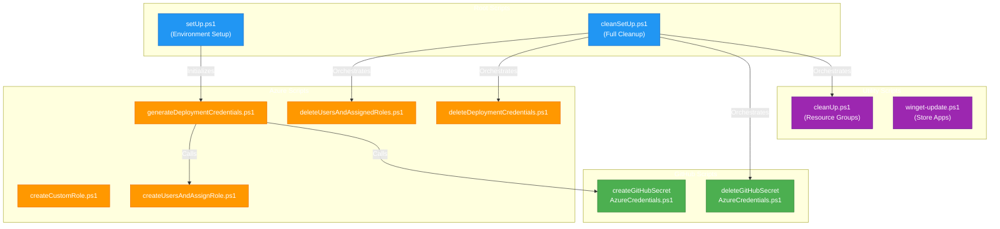

# 📜 DevExp-DevBox PowerShell Scripts Documentation

> 📖 Comprehensive documentation for all PowerShell automation scripts in the DevExp-DevBox project.

> [!NOTE]
> **Target Audience:** DevOps Engineers, Platform Engineers, System Administrators  
> **Reading Time:** ~10 minutes

<details>
<summary>📍 Navigation</summary>

| Previous | Index | Next |
|:---------|:-----:|-----:|
| — | [Docs Index](../README.md) | [setUp.ps1 →](setup.md) |

</details>

---

## 📑 Table of Contents

- [🎯 Overview](#overview)
- [🏗️ Scripts Architecture](#scripts-architecture)
- [⚡ Quick Reference](#quick-reference)
- [📂 Scripts by Category](#scripts-by-category)
- [⚙️ Prerequisites Summary](#prerequisites-summary)
- [🔄 Common Workflows](#common-workflows)
- [⚠️ Error Handling Patterns](#error-handling-patterns)
- [📁 File Structure](#file-structure)
- [🔗 Related Documentation](#related-documentation)
- [🤝 Contributing](#contributing)

---

## 🎯 Overview

This documentation covers the PowerShell scripts used to set up, manage, and clean up Azure Dev Box environments with GitHub or Azure DevOps integration. The scripts follow Azure best practices for security, error handling, and resource management.

---

[⬆️ Back to Top](#-table-of-contents)

---

## 🏗️ Scripts Architecture



---

[⬆️ Back to Top](#-table-of-contents)

---

## ⚡ Quick Reference

### Setup Scripts (Execute in Order)

| # | Script | Purpose | Required |
|---|--------|---------|----------|
| 1 | [setUp.ps1](setup.md) | Initialize azd environment | Yes |
| 2 | [createCustomRole.ps1](azure/create-custom-role.md) | Create RBAC role for assignments | Optional |
| 3 | [generateDeploymentCredentials.ps1](azure/generate-deployment-credentials.md) | Create service principal + GitHub secret | For CI/CD |
| 4 | [createUsersAndAssignRole.ps1](azure/create-users-and-assign-role.md) | Assign DevCenter roles | Yes |

### Cleanup Scripts (Execute in Order)

| # | Script | Purpose |
|---|--------|---------|
| 1 | [cleanSetUp.ps1](clean-setup.md) | **Full orchestrated cleanup** (calls all below) |
| 2 | [deleteUsersAndAssignedRoles.ps1](azure/delete-users-and-assigned-roles.md) | Remove role assignments |
| 3 | [deleteDeploymentCredentials.ps1](azure/delete-deployment-credentials.md) | Remove service principal |
| 4 | [deleteGitHubSecretAzureCredentials.ps1](github/delete-github-secret-azure-credentials.md) | Remove GitHub secret |
| 5 | [cleanUp.ps1](configuration/clean-up.md) | Delete resource groups |

### Utility Scripts

| Script | Purpose |
|--------|---------|
| [winget-update.ps1](configuration/winget-update.md) | Update Microsoft Store apps (Dev Box workloads) |

---

[⬆️ Back to Top](#-table-of-contents)

---

## 📂 Scripts by Category

### Root Scripts

Entry-point scripts for environment lifecycle management.

| Script | Description | Documentation |
|--------|-------------|---------------|
| `setUp.ps1` | Sets up Azure Dev Box environment with GitHub/ADO integration | [setup.md](setup.md) |
| `cleanSetUp.ps1` | Complete environment cleanup orchestrator | [clean-setup.md](clean-setup.md) |

### Azure Identity & Access Scripts

Scripts for managing Azure AD and RBAC configurations.

| Script | Description | Documentation |
|--------|-------------|---------------|
| `createCustomRole.ps1` | Creates custom RBAC role for role assignment management | [azure/create-custom-role.md](azure/create-custom-role.md) |
| `createUsersAndAssignRole.ps1` | Assigns DevCenter roles to current user | [azure/create-users-and-assign-role.md](azure/create-users-and-assign-role.md) |
| `deleteUsersAndAssignedRoles.ps1` | Removes DevCenter role assignments | [azure/delete-users-and-assigned-roles.md](azure/delete-users-and-assigned-roles.md) |
| `generateDeploymentCredentials.ps1` | Creates service principal for CI/CD | [azure/generate-deployment-credentials.md](azure/generate-deployment-credentials.md) |
| `deleteDeploymentCredentials.ps1` | Removes service principal and app registration | [azure/delete-deployment-credentials.md](azure/delete-deployment-credentials.md) |

### GitHub Integration Scripts

Scripts for managing GitHub repository secrets.

| Script | Description | Documentation |
|--------|-------------|---------------|
| `createGitHubSecretAzureCredentials.ps1` | Creates AZURE_CREDENTIALS secret | [github/create-github-secret-azure-credentials.md](github/create-github-secret-azure-credentials.md) |
| `deleteGitHubSecretAzureCredentials.ps1` | Removes GitHub repository secret | [github/delete-github-secret-azure-credentials.md](github/delete-github-secret-azure-credentials.md) |

### Configuration & Utility Scripts

Scripts for resource management and Dev Box configuration.

| Script | Description | Documentation |
|--------|-------------|---------------|
| `cleanUp.ps1` | Deletes Azure resource groups | [configuration/clean-up.md](configuration/clean-up.md) |
| `winget-update.ps1` | Updates Microsoft Store applications | [configuration/winget-update.md](configuration/winget-update.md) |

---

[⬆️ Back to Top](#-table-of-contents)

---

## ⚙️ Prerequisites Summary

### Required Tools

| Tool | Version | Required For | Installation |
|------|---------|--------------|--------------|
| PowerShell | 5.1+ | All scripts | Pre-installed on Windows |
| Azure CLI | Latest | Azure operations | [Install](https://docs.microsoft.com/cli/azure/install-azure-cli) |
| Azure Developer CLI | Latest | Environment setup | [Install](https://learn.microsoft.com/azure/developer/azure-developer-cli/install-azd) |
| GitHub CLI | Latest | GitHub operations | [Install](https://cli.github.com/) |
| Windows Package Manager | 1.11+ | winget-update.ps1 | [App Installer](https://apps.microsoft.com/store/detail/app-installer/9NBLGGH4NNS1) |

### Required Permissions

| Resource | Permission | Scripts |
|----------|------------|---------|
| Azure Subscription | Owner or Contributor + UAA | All Azure scripts |
| Azure AD | Application Administrator | Credential scripts |
| GitHub Repository | Admin | Secret scripts |

---

[⬆️ Back to Top](#-table-of-contents)

---

## 🔄 Common Workflows

### New Environment Setup


```powershell
# 1. Authenticate to Azure
az login

# 2. Run setup script
.\setUp.ps1 -EnvName "prod" -SourceControl "github"

# 3. Generate CI/CD credentials (if needed)
.\.configuration\setup\powershell\Azure\generateDeploymentCredentials.ps1 `
    -AppName "myapp-cicd" `
    -DisplayName "MyApp CI/CD Service Principal"

# 4. Provision Azure resources
azd provision -e prod
```

### Environment Cleanup

```powershell
# Full cleanup with one command
.\cleanSetUp.ps1 -EnvName "prod" -Location "eastus2"
```

Or step-by-step:

```powershell
# 1. Remove user role assignments
.\.configuration\setup\powershell\Azure\deleteUsersAndAssignedRoles.ps1

# 2. Remove deployment credentials
.\.configuration\setup\powershell\Azure\deleteDeploymentCredentials.ps1 `
    -AppDisplayName "MyApp CI/CD Service Principal"

# 3. Remove GitHub secret
.\.configuration\setup\powershell\GitHub\deleteGitHubSecretAzureCredentials.ps1 `
    -GhSecretName "AZURE_CREDENTIALS"

# 4. Delete resource groups
.\.configuration\powershell\cleanUp.ps1 -EnvName "prod" -Location "eastus2"
```

---

[⬆️ Back to Top](#-table-of-contents)

---

## ⚠️ Error Handling Patterns

All scripts follow consistent error handling:

```powershell
# Standard error preference
$ErrorActionPreference = 'Stop'
$WarningPreference = 'Stop'

# Exit codes
# 0 = Success
# 1 = Failure

# WhatIf support (where applicable)
[CmdletBinding(SupportsShouldProcess)]
```

---

[⬆️ Back to Top](#-table-of-contents)

---

## 📁 File Structure

```
DevExp-DevBox/
├── setUp.ps1                     # Main setup entry point
├── cleanSetUp.ps1                # Main cleanup entry point
├── .configuration/
│   ├── powershell/
│   │   └── cleanUp.ps1           # Resource group cleanup
│   ├── devcenter/
│   │   └── workloads/
│   │       └── winget-update.ps1 # Store app updates
│   └── setup/
│       └── powershell/
│           ├── Azure/
│           │   ├── createCustomRole.ps1
│           │   ├── createUsersAndAssignRole.ps1
│           │   ├── deleteDeploymentCredentials.ps1
│           │   ├── deleteUsersAndAssignedRoles.ps1
│           │   └── generateDeploymentCredentials.ps1
│           └── GitHub/
│               ├── createGitHubSecretAzureCredentials.ps1
│               └── deleteGitHubSecretAzureCredentials.ps1
└── docs/
    └── scripts/                  # This documentation
        ├── README.md             # This file
        ├── setup.md
        ├── clean-setup.md
        ├── azure/
        │   ├── create-custom-role.md
        │   ├── create-users-and-assign-role.md
        │   ├── delete-deployment-credentials.md
        │   ├── delete-users-and-assigned-roles.md
        │   └── generate-deployment-credentials.md
        ├── github/
        │   ├── create-github-secret-azure-credentials.md
        │   └── delete-github-secret-azure-credentials.md
        └── configuration/
            ├── clean-up.md
            └── winget-update.md
```

---

[⬆️ Back to Top](#-table-of-contents)

---

## 🔗 Related Documentation

| Document | Description |
|----------|-------------|
| [Architecture Overview](../architecture/07-deployment-architecture.md) | Deployment architecture details |
| [CI/CD Overview](../devops/README.md) | DevOps pipeline documentation |
| [Deployment Guide](../devops/deploy.md) | Deployment instructions |

---

[⬆️ Back to Top](#-table-of-contents)

---

## 🤝 Contributing

When adding new PowerShell scripts:

1. Follow the established patterns for error handling and logging
2. Include comprehensive comment-based help (`.SYNOPSIS`, `.DESCRIPTION`, `.PARAMETER`, `.EXAMPLE`)
3. Create corresponding documentation in this folder
4. Update this README with the new script reference
5. Use consistent parameter validation (`ValidateNotNullOrEmpty`, `ValidateSet`, etc.)

---

<div align="center">

[⬆️ Back to Top](#-table-of-contents) | [setUp.ps1 →](setup.md)

*DevExp-DevBox • PowerShell Scripts Documentation*

</div>
