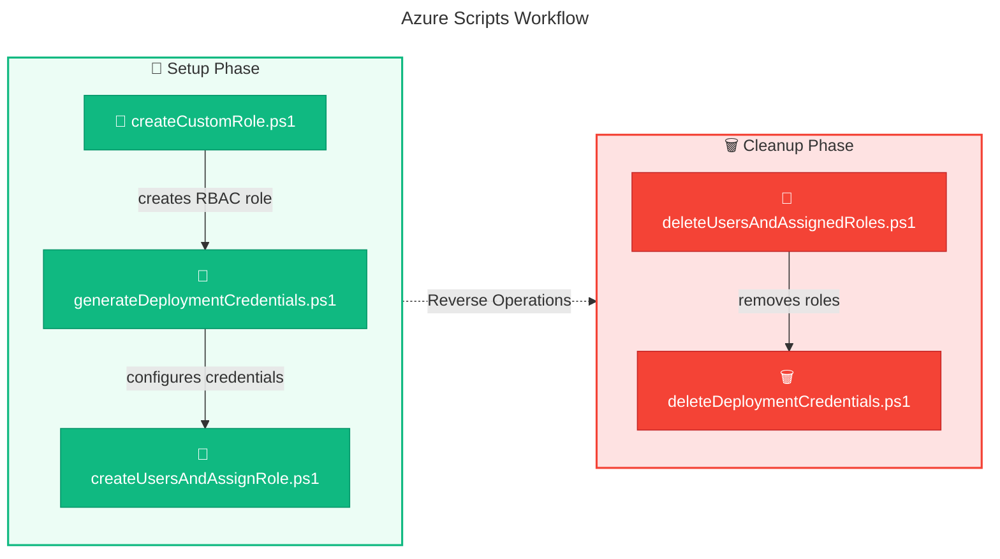

# ☁️ Azure PowerShell Scripts

> **Documentation for Azure RBAC, service principal, and credential management scripts**

> [!NOTE]
> **Target Audience:** Azure Administrators, DevOps Engineers, Platform Engineers  
> **Reading Time:** ~5 minutes

<details>
<summary>📍 Navigation</summary>

| Previous | Index | Next |
|:---------|:-----:|-----:|
| [← Scripts Index](../README.md) | [Scripts Index](../README.md) | [GitHub Scripts →](../github/README.md) |

</details>

---

## 📑 Table of Contents

- [🎯 Overview](#-overview)
- [📜 Scripts Inventory](#-scripts-inventory)
- [🔄 Workflow Diagram](#-workflow-diagram)
- [⚙️ Prerequisites](#%EF%B8%8F-prerequisites)
- [🚀 Quick Start](#-quick-start)
- [🔗 Related Documentation](#-related-documentation)

---

## 🎯 Overview

This folder contains PowerShell scripts for managing Azure Role-Based Access Control (RBAC), service principals, and deployment credentials. These scripts are essential for setting up secure CI/CD pipelines and managing DevCenter access.

---

[⬆️ Back to Top](#-table-of-contents)

---

## 📜 Scripts Inventory

| Script | Purpose | Documentation |
|--------|---------|---------------|
| 🔑 `createCustomRole.ps1` | Creates custom Azure RBAC role for role assignment management | [create-custom-role.md](create-custom-role.md) |
| 👥 `createUsersAndAssignRole.ps1` | Assigns DevCenter roles to the current signed-in user | [create-users-and-assign-role.md](create-users-and-assign-role.md) |
| 🗑️ `deleteDeploymentCredentials.ps1` | Removes Azure AD service principal and application registration | [delete-deployment-credentials.md](delete-deployment-credentials.md) |
| 👥 `deleteUsersAndAssignedRoles.ps1` | Removes DevCenter role assignments from users | [delete-users-and-assigned-roles.md](delete-users-and-assigned-roles.md) |
| 🔑 `generateDeploymentCredentials.ps1` | Creates service principal and GitHub secret for CI/CD | [generate-deployment-credentials.md](generate-deployment-credentials.md) |

---

[⬆️ Back to Top](#-table-of-contents)

---

## 🔄 Workflow Diagram



---

[⬆️ Back to Top](#-table-of-contents)

---

## ⚙️ Prerequisites

> [!IMPORTANT]
> All scripts require the following tools and permissions to be configured.

### Required Tools

| Tool | Purpose | Installation |
|------|---------|--------------|
| Azure CLI (`az`) | Manage Azure resources and RBAC | [Install Azure CLI](https://docs.microsoft.com/cli/azure/install-azure-cli) |
| PowerShell 5.1+ | Script execution | Pre-installed on Windows |
| GitHub CLI (`gh`) | Create repository secrets (for credential scripts) | [Install GitHub CLI](https://cli.github.com/) |

### Required Permissions

| Permission | Scripts | Purpose |
|------------|---------|---------|
| **Owner** or **User Access Administrator** | All scripts | Manage role assignments |
| **Application Administrator** | Credential scripts | Manage service principals |
| **GitHub Repository Admin** | `generateDeploymentCredentials.ps1` | Create secrets |

---

[⬆️ Back to Top](#-table-of-contents)

---

## 🚀 Quick Start

### Initial Setup

> [!TIP]
> Run these scripts in order for complete environment setup.

```powershell
# 1. Login to Azure
az login

# 2. Create custom RBAC role (optional)
.\createCustomRole.ps1

# 3. Generate deployment credentials and configure GitHub
.\generateDeploymentCredentials.ps1 -AppName "my-app-cicd" -DisplayName "My App CI/CD"
```

### Cleanup

> [!WARNING]
> Cleanup operations are irreversible. Ensure CI/CD pipelines are updated before running.

```powershell
# 1. Remove user role assignments
.\deleteUsersAndAssignedRoles.ps1

# 2. Delete service principal and app registration
.\deleteDeploymentCredentials.ps1 -AppDisplayName "My App CI/CD"
```

---

[⬆️ Back to Top](#-table-of-contents)

---

## 🔗 Related Documentation

| Document | Description |
|----------|-------------|
| [Scripts Index](../README.md) | Main scripts documentation |
| [GitHub Scripts](../github/README.md) | GitHub secret management scripts |
| [Security Architecture](../../architecture/05-security-architecture.md) | Security design and RBAC strategy |
| [Deployment Architecture](../../architecture/07-deployment-architecture.md) | CI/CD pipeline configuration |

---

[⬆️ Back to Top](#-table-of-contents)

---

<div align="center">

[← Scripts Index](../README.md) | [⬆️ Back to Top](#-table-of-contents) | [GitHub Scripts →](../github/README.md)

*DevExp-DevBox • Azure Scripts Documentation*

</div>
