# 🔑 createCustomRole.ps1

> **Creates a custom Azure RBAC role for role assignment management**

> [!IMPORTANT]
> This script requires **Owner** or **User Access Administrator** permissions on the target subscription.

> [!NOTE]
> **Target Audience:** Azure Administrators, Security Engineers  
> **Reading Time:** ~8 minutes

<details>
<summary>📍 Navigation</summary>

| Previous | Index | Next |
|:---------|:-----:|-----:|
| [← cleanSetUp.ps1](../clean-setup.md) | [Scripts Index](../README.md) | [createUsersAndAssignRole.ps1 →](create-users-and-assign-role.md) |

</details>

---

## 📑 Table of Contents

- [🎯 Overview](#-overview)
- [📊 Flow Visualization](#-flow-visualization)
- [📝 Parameters](#-parameters)
- [⚙️ Prerequisites](#%EF%B8%8F-prerequisites)
- [📜 Role Definition](#-role-definition)
- [🔧 Functions Reference](#-functions-reference)
- [📝 Usage Examples](#-usage-examples)
- [⚠️ Error Handling](#%EF%B8%8F-error-handling)
- [🔧 Troubleshooting](#-troubleshooting)
- [🔐 Security Considerations](#-security-considerations)
- [🔗 Related Scripts](#-related-scripts)

---

## 🎯 Overview

This script creates a custom Azure RBAC role definition that grants permissions to manage role assignments. The role includes permissions to read, write, and delete role assignments within a specified subscription scope. Use this script when you need to delegate role assignment capabilities without granting full User Access Administrator permissions.

---

[⬆️ Back to Top](#-table-of-contents)

---

## 📊 Flow Visualization

```mermaid
---
title: Create Custom Role Flow
---
flowchart TD
    %% ===== SCRIPT ENTRY =====
    subgraph Entry["📥 Script Entry"]
        A(["🚀 createCustomRole.ps1 Start"])
        B[/"📝 Parse Parameters"/]
    end
    
    %% ===== SUBSCRIPTION RESOLUTION =====
    subgraph SubCheck["🔍 Subscription Resolution"]
        C{"📋 SubscriptionId provided?"}
        D["⚙️ Get-CurrentSubscriptionId"]
        E[("☁️ Azure CLI")]
    end
    
    %% ===== ROLE CREATION =====
    subgraph RoleCreation["🔐 Role Definition Creation"]
        F["⚙️ New-CustomRoleDefinition"]
        F1["📄 Build role definition JSON"]
        F2["📝 Write to temp file"]
        F3{"🔄 Force flag set?"}
        F4["🗑️ Delete existing role"]
        F5[("🔑 az role definition create")]
    end
    
    %% ===== CLEANUP =====
    subgraph Cleanup["🧹 Cleanup"]
        G["🗑️ Remove temp file"]
    end
    
    %% ===== SCRIPT EXIT =====
    subgraph Exit["📤 Script Exit"]
        H{"✅ Success?"}
        I[\"🎉 Role Created"\]
        J{{"❌ Error Handler"}}
    end
    
    %% ===== CONNECTIONS =====
    A -->|parses| B -->|checks| C
    C -->|No| D -->|calls| E
    C -->|Yes| F
    E -->|provides| F
    F -->|builds| F1 -->|writes| F2 -->|checks| F3
    F3 -->|Yes| F4 -->|creates| F5
    F3 -->|No| F5
    F5 -->|cleans| G -->|evaluates| H
    H -->|Yes| I
    H -->|No| J

    %% ===== STYLES =====
    classDef trigger fill:#818CF8,stroke:#4F46E5,color:#FFFFFF
    classDef input fill:#F59E0B,stroke:#D97706,color:#000000
    classDef primary fill:#4F46E5,stroke:#3730A3,color:#FFFFFF
    classDef external fill:#6B7280,stroke:#4B5563,color:#FFFFFF,stroke-dasharray:5 5
    classDef decision fill:#FFFBEB,stroke:#F59E0B,color:#000000
    classDef secondary fill:#10B981,stroke:#059669,color:#FFFFFF
    classDef failed fill:#F44336,stroke:#C62828,color:#FFFFFF
    
    class A trigger
    class B input
    class D,F,F1,F2,F4,G primary
    class E,F5 external
    class C,F3,H decision
    class I secondary
    class J failed
    
    %% ===== SUBGRAPH STYLES =====
    style Entry fill:#EEF2FF,stroke:#4F46E5,stroke-width:2px
    style SubCheck fill:#FEF3C7,stroke:#F59E0B,stroke-width:2px
    style RoleCreation fill:#E0E7FF,stroke:#4F46E5,stroke-width:2px
    style Cleanup fill:#ECFDF5,stroke:#10B981,stroke-width:2px
    style Exit fill:#FEF3C7,stroke:#F59E0B,stroke-width:2px
```



---

[⬆️ Back to Top](#-table-of-contents)

---

## 📝 Parameters

| Parameter | Type | Required | Default | Validation | Description |
|-----------|------|----------|---------|------------|-------------|
| `-RoleName` | `string` | No | `"Contoso DevBox - Role Assignment Writer"` | `ValidateNotNullOrEmpty` | Display name for the custom role |
| `-SubscriptionId` | `string` | No | Current subscription | `ValidatePattern` (GUID format) | Azure subscription ID for scope |
| `-Description` | `string` | No | `"Allows creating role assignments."` | - | Description for the custom role |
| `-Force` | `switch` | No | `$false` | - | Delete existing role before creating |

---

[⬆️ Back to Top](#-table-of-contents)

---

## ⚙️ Prerequisites

### Required Tools

| Tool | Purpose | Installation |
|------|---------|--------------|
| Azure CLI (`az`) | Create role definitions | [Install Azure CLI](https://docs.microsoft.com/cli/azure/install-azure-cli) |
| PowerShell 5.1+ | Script execution | Pre-installed on Windows |

### Required Permissions

- **Azure**: `Microsoft.Authorization/roleDefinitions/write` at subscription scope
- Typically requires **Owner** or **User Access Administrator** role

---

[⬆️ Back to Top](#-table-of-contents)

---

## 📜 Role Definition

The created role includes these permissions:

```json
{
  "Name": "Contoso DevBox - Role Assignment Writer",
  "IsCustom": true,
  "Description": "Allows creating role assignments.",
  "Actions": [
    "Microsoft.Authorization/roleAssignments/write",
    "Microsoft.Authorization/roleAssignments/delete",
    "Microsoft.Authorization/roleAssignments/read"
  ],
  "NotActions": [],
  "DataActions": [],
  "NotDataActions": [],
  "AssignableScopes": [
    "/subscriptions/{subscriptionId}"
  ]
}
```

---

[⬆️ Back to Top](#-table-of-contents)

---

## 🔧 Functions Reference

### Function: `Get-CurrentSubscriptionId`

**Purpose:** Retrieves the current Azure subscription ID from Azure CLI context.

**Parameters:** None

**Returns:** `[string]` - The subscription ID GUID

**Throws:** Error if not logged into Azure CLI

---

### Function: `New-CustomRoleDefinition`

**Purpose:** Creates a custom Azure RBAC role definition from a JSON template.

**Parameters:**

| Name | Type | Required | Description |
|------|------|----------|-------------|
| `RoleName` | `string` | Yes | Name of the custom role |
| `SubscriptionId` | `string` | Yes | Subscription ID for scope |
| `Description` | `string` | No | Role description |
| `RemoveExisting` | `switch` | No | Delete existing role first |

**Returns:** `[bool]` - `$true` if successful, `$false` otherwise

**Behavior:**

1. Builds role definition hashtable
2. Converts to JSON and writes to temp file in `$env:TEMP`
3. Optionally deletes existing role with same name
4. Creates role via `az role definition create`
5. Cleans up temp file (in finally block)

---

[⬆️ Back to Top](#-table-of-contents)

---

## 📝 Usage Examples

### Basic Usage (Current Subscription)

```powershell
.\createCustomRole.ps1
```

Creates role with default name in the current subscription.

### Specific Subscription

```powershell
.\createCustomRole.ps1 -SubscriptionId "12345678-1234-1234-1234-123456789012"
```

### Custom Role Name

```powershell
.\createCustomRole.ps1 -RoleName "MyCompany - Role Writer" -Description "Custom role for CI/CD pipelines"
```

### Replace Existing Role

```powershell
.\createCustomRole.ps1 -Force
```

Deletes any existing role with the same name before creating.

### Dry Run (WhatIf)

```powershell
.\createCustomRole.ps1 -WhatIf
```

Shows what would be created without making changes.

---

[⬆️ Back to Top](#-table-of-contents)

---

## ⚠️ Error Handling

### Error Action Preference

```powershell
$ErrorActionPreference = 'Stop'
$ProgressPreference = 'SilentlyContinue'
```

### Exit Codes

| Code | Meaning |
|------|---------|
| `0` | Role created successfully |
| `1` | Role creation failed |

### Cleanup Guarantee

The temporary JSON file is always cleaned up via `finally` block, even if creation fails.

## 🔧 Troubleshooting

### Common Issues

| Issue | Cause | Solution |
|-------|-------|----------|
| "Failed to retrieve current subscription ID" | Not logged into Azure | Run `az login` |
| "Failed to create custom role definition" | Insufficient permissions | Verify Owner/UAA role |
| Role already exists error | Role with same name exists | Use `-Force` parameter |
| Invalid subscription ID format | GUID validation failed | Check subscription ID format |

---

### Verify Role Creation

```powershell
# List custom roles
az role definition list --custom-role-only true --query "[?roleName=='Contoso DevBox - Role Assignment Writer']"
```

---

[⬆️ Back to Top](#-table-of-contents)

---

## 🔐 Security Considerations

- Custom roles should follow **least privilege** principle
- The created role only grants role assignment permissions, not resource management
- Consider scope carefully - subscription-wide vs resource group specific
- Temporary JSON file is written to `$env:TEMP` and immediately deleted

---

[⬆️ Back to Top](#-table-of-contents)

---

## 🔗 Related Scripts

| Script | Purpose | Link |
|--------|---------|------|
| `createUsersAndAssignRole.ps1` | Assign DevCenter roles to users | [create-users-and-assign-role.md](create-users-and-assign-role.md) |
| `deleteUsersAndAssignedRoles.ps1` | Remove role assignments | [delete-users-and-assigned-roles.md](delete-users-and-assigned-roles.md) |
| `generateDeploymentCredentials.ps1` | Create CI/CD service principal | [generate-deployment-credentials.md](generate-deployment-credentials.md) |

---

[⬆️ Back to Top](#-table-of-contents)

---

<div align="center">

[← cleanSetUp.ps1](../clean-setup.md) | [⬆️ Back to Top](#-table-of-contents) | [createUsersAndAssignRole.ps1 →](create-users-and-assign-role.md)

*DevExp-DevBox • createCustomRole.ps1 Documentation*

</div>
