# 👥 createUsersAndAssignRole.ps1

> **Assigns Azure DevCenter roles to the current signed-in user**

> [!NOTE]
> **Target Audience:** Azure Administrators, Platform Engineers  
> **Reading Time:** ~8 minutes

<details>
<summary>📍 Navigation</summary>

| Previous | Index | Next |
|:---------|:-----:|-----:|
| [← createCustomRole.ps1](create-custom-role.md) | [Scripts Index](../README.md) | [deleteDeploymentCredentials.ps1 →](delete-deployment-credentials.md) |

</details>

---

## 📑 Table of Contents

- [🎯 Overview](#overview)
- [📊 Flow Visualization](#flow-visualization)
- [📝 Parameters](#parameters)
- [⚙️ Prerequisites](#prerequisites)
- [🔑 Assigned Roles](#assigned-roles)
- [🔧 Functions Reference](#functions-reference)
- [📝 Usage Examples](#usage-examples)
- [⚠️ Error Handling](#error-handling)
- [🔧 Troubleshooting](#troubleshooting)

---

## 🎯 Overview

This script retrieves the current Azure AD signed-in user and assigns DevCenter-related RBAC roles at the subscription scope. Use this script when setting up a new user for DevCenter access or as part of environment initialization.

---

[⬆️ Back to Top](#-table-of-contents)

---

## 📊 Flow Visualization

```mermaid
---
title: Create Users and Assign Role Flow
---
flowchart TD
    %% ===== SCRIPT ENTRY =====
    subgraph Entry["📥 Script Entry"]
        A(["🚀 createUsersAndAssignRole.ps1 Start"])
        B[/"📝 Parse Parameters"/]
    end
    
    %% ===== SUBSCRIPTION RESOLUTION =====
    subgraph SubCheck["🔍 Subscription Resolution"]
        C{"📋 SubscriptionId provided?"}
        D[("☁️ az account show")]
    end
    
    %% ===== USER IDENTIFICATION =====
    subgraph UserLookup["👤 User Identification"]
        E["⚙️ New-UserRoleAssignments"]
        F[("🔍 az ad signed-in-user show")]
        G["🆔 Get current user Object ID"]
    end
    
    %% ===== ROLE ASSIGNMENT LOOP =====
    subgraph RoleLoop["🔄 Role Assignment Loop"]
        H["📋 For each DevCenter role"]
        I["🔐 Set-AzureRole"]
        I1{"✅ Role already assigned?"}
        I2["⏭️ Skip - already assigned"]
        I3[("🔑 az role assignment create")]
    end
    
    %% ===== SCRIPT EXIT =====
    subgraph Exit["📤 Script Exit"]
        J{"✅ All succeeded?"}
        K[\"🎉 Roles Assigned"\]
        L{{"❌ Error Handler"}}
    end
    
    %% ===== CONNECTIONS =====
    A -->|parses| B -->|checks| C
    C -->|No| D -->|continues| E
    C -->|Yes| E
    E -->|calls| F -->|retrieves| G -->|iterates| H
    H -->|assigns| I -->|checks| I1
    I1 -->|Yes| I2 -->|next| H
    I1 -->|No| I3 -->|next| H
    H -->|All roles processed| J
    J -->|Yes| K
    J -->|No| L

    %% ===== STYLES =====
    classDef trigger fill:#818CF8,stroke:#4F46E5,color:#FFFFFF
    classDef input fill:#F59E0B,stroke:#D97706,color:#000000
    classDef primary fill:#4F46E5,stroke:#3730A3,color:#FFFFFF
    classDef external fill:#6B7280,stroke:#4B5563,color:#FFFFFF,stroke-dasharray:5 5
    classDef decision fill:#FFFBEB,stroke:#F59E0B,color:#000000
    classDef secondary fill:#10B981,stroke:#059669,color:#FFFFFF
    classDef failed fill:#F44336,stroke:#C62828,color:#FFFFFF
    
    class A trigger
    class B input
    class E,G,H,I,I2 primary
    class D,F,I3 external
    class C,I1,J decision
    class K secondary
    class L failed
    
    %% ===== SUBGRAPH STYLES =====
    style Entry fill:#EEF2FF,stroke:#4F46E5,stroke-width:2px
    style SubCheck fill:#FEF3C7,stroke:#F59E0B,stroke-width:2px
    style UserLookup fill:#E0E7FF,stroke:#4F46E5,stroke-width:2px
    style RoleLoop fill:#E0E7FF,stroke:#4F46E5,stroke-width:2px
    style Exit fill:#FEF3C7,stroke:#F59E0B,stroke-width:2px
```



---

[⬆️ Back to Top](#-table-of-contents)

---

## 📝 Parameters

| Parameter | Type | Required | Default | Validation | Description |
|-----------|------|----------|---------|------------|-------------|
| `-SubscriptionId` | `string` | No | Current subscription | `ValidatePattern` (GUID format) | Azure subscription ID for role scope |

---

[⬆️ Back to Top](#-table-of-contents)

---

## ⚙️ Prerequisites

### Required Tools

| Tool | Purpose | Installation |
|------|---------|--------------|
| Azure CLI (`az`) | Manage role assignments | [Install Azure CLI](https://docs.microsoft.com/cli/azure/install-azure-cli) |
| PowerShell 5.1+ | Script execution | Pre-installed on Windows |

### Required Permissions

- **Azure**: `Microsoft.Authorization/roleAssignments/write` at subscription scope
- Typically requires **Owner** or **User Access Administrator** role

---

[⬆️ Back to Top](#-table-of-contents)

---

## 🔑 Assigned Roles

The script assigns these DevCenter-specific roles:

| Role Name | Purpose |
|-----------|---------|
| `DevCenter Dev Box User` | Create and manage Dev Boxes |
| `DevCenter Project Admin` | Administer DevCenter projects |
| `Deployment Environments Reader` | View deployment environments |
| `Deployment Environments User` | Use deployment environments |

---

[⬆️ Back to Top](#-table-of-contents)

---

## 🔧 Functions Reference

### Function: `Set-AzureRole`

**Purpose:** Assigns an Azure RBAC role to a user, checking for existing assignment first.

**Parameters:**

| Name | Type | Required | Description |
|------|------|----------|-------------|
| `UserIdentityId` | `string` | Yes | Object ID of the user |
| `RoleName` | `string` | Yes | Name of the RBAC role |
| `PrincipalType` | `string` | Yes | Type: User, ServicePrincipal, or Group |
| `SubscriptionId` | `string` | Yes | Subscription ID for scope |

**Returns:** `[bool]` - `$true` if assignment succeeded or already exists, `$false` on error

**Behavior:**

1. Checks if role is already assigned using `az role assignment list`
2. If not assigned, creates new assignment
3. Skips with message if already assigned

---

### Function: `New-UserRoleAssignments`

**Purpose:** Creates all DevCenter role assignments for the current signed-in user.

**Parameters:**

| Name | Type | Required | Description |
|------|------|----------|-------------|
| `SubscriptionId` | `string` | Yes | Subscription ID for role assignments |

**Returns:** `[bool]` - `$true` if all assignments succeeded, `$false` otherwise

**Behavior:**

1. Retrieves current user's Object ID via `az ad signed-in-user show`
2. Iterates through predefined DevCenter roles
3. Calls `Set-AzureRole` for each role
4. Tracks success/failure of each assignment

---

[⬆️ Back to Top](#-table-of-contents)

---

## 📝 Usage Examples

### Basic Usage (Current Subscription)

```powershell
.\createUsersAndAssignRole.ps1
```

Assigns all DevCenter roles to the currently signed-in user.

### Specific Subscription

```powershell
.\createUsersAndAssignRole.ps1 -SubscriptionId "12345678-1234-1234-1234-123456789012"
```

<details>
<summary>Expected Output</summary>

```
Creating role assignments for user: a1b2c3d4-e5f6-7890-abcd-ef1234567890
Assigning 'DevCenter Dev Box User' role to identity a1b2c3d4-e5f6-7890-abcd-ef1234567890...
Role 'DevCenter Dev Box User' assigned successfully.
Assigning 'DevCenter Project Admin' role to identity a1b2c3d4-e5f6-7890-abcd-ef1234567890...
Role 'DevCenter Project Admin' assigned successfully.
Assigning 'Deployment Environments Reader' role to identity a1b2c3d4-e5f6-7890-abcd-ef1234567890...
Role 'Deployment Environments Reader' assigned successfully.
Assigning 'Deployment Environments User' role to identity a1b2c3d4-e5f6-7890-abcd-ef1234567890...
Role 'Deployment Environments User' assigned successfully.
All role assignments completed successfully for user: a1b2c3d4-e5f6-7890-abcd-ef1234567890
```

</details>

---

[⬆️ Back to Top](#-table-of-contents)

---

## ⚠️ Error Handling

### Error Action Preference

```powershell
$ErrorActionPreference = 'Stop'
$WarningPreference = 'Stop'
```

### Exit Codes

| Code | Meaning |
|------|---------|
| `0` | All role assignments succeeded |
| `1` | One or more role assignments failed |

### Idempotency

The script is **idempotent** - running it multiple times will:

- Skip roles that are already assigned
- Only attempt to assign missing roles
- Not cause errors for existing assignments

---

[⬆️ Back to Top](#-table-of-contents)

---

## 🔧 Troubleshooting

### Common Issues

| Issue | Cause | Solution |
|-------|-------|----------|
| "Failed to retrieve current subscription ID" | Not logged into Azure | Run `az login` |
| "Failed to retrieve current signed-in user's object ID" | Not logged into Azure AD | Run `az login` with Azure AD account |
| "Failed to assign role" | Insufficient permissions | Verify Owner/UAA role |
| Role already exists warning | Role previously assigned | This is expected - script continues |

### Verify Role Assignments

```powershell
# List current user's role assignments
$userId = az ad signed-in-user show --query id --output tsv
az role assignment list --assignee $userId --query "[].roleDefinitionName" --output table
```

## Security Considerations

- Script requires elevated Azure permissions to create role assignments
- Roles are assigned at **subscription scope** - consider if more restrictive scope is needed
- DevCenter roles grant access to Dev Box and Environment resources
- Review role capabilities before assignment

## Related Scripts

| Script | Purpose | Link |
|--------|---------|------|
| `deleteUsersAndAssignedRoles.ps1` | Remove these role assignments | [delete-users-and-assigned-roles.md](delete-users-and-assigned-roles.md) |
| `createCustomRole.ps1` | Create custom role definitions | [create-custom-role.md](create-custom-role.md) |
| `generateDeploymentCredentials.ps1` | Create CI/CD service principal | [generate-deployment-credentials.md](generate-deployment-credentials.md) |

---

<div align="center">

[← createCustomRole.ps1](create-custom-role.md) | [⬆️ Back to Top](#-table-of-contents) | [deleteDeploymentCredentials.ps1 →](delete-deployment-credentials.md)

*DevExp-DevBox • createUsersAndAssignRole.ps1 Documentation*

</div>
