# 🗑️ deleteDeploymentCredentials.ps1

> **Removes Azure AD service principal and application registration for CI/CD cleanup**

> [!WARNING]
> This script permanently deletes service principals. Ensure CI/CD pipelines are updated before execution.

> [!NOTE]
> **Target Audience:** Azure Administrators, DevOps Engineers  
> **Reading Time:** ~8 minutes

<details>
<summary>📍 Navigation</summary>

| Previous | Index | Next |
|:---------|:-----:|-----:|
| [← createUsersAndAssignRole.ps1](create-users-and-assign-role.md) | [Scripts Index](../README.md) | [deleteUsersAndAssignedRoles.ps1 →](delete-users-and-assigned-roles.md) |

</details>

---

## 📑 Table of Contents

- [🎯 Overview](#-overview)
- [📊 Flow Visualization](#-flow-visualization)
- [📝 Parameters](#-parameters)
- [⚙️ Prerequisites](#%EF%B8%8F-prerequisites)
- [🔧 Functions Reference](#-functions-reference)
- [📝 Usage Examples](#-usage-examples)
- [⚠️ Error Handling](#%EF%B8%8F-error-handling)
- [🔧 Troubleshooting](#-troubleshooting)
- [🔐 Security Considerations](#-security-considerations)
- [🔗 Related Scripts](#-related-scripts)

---

## 🎯 Overview

This script removes an Azure AD service principal and its associated application registration by looking up the display name. Use this script to clean up deployment credentials created for CI/CD pipelines, such as those used by GitHub Actions.

---

[⬆️ Back to Top](#-table-of-contents)

---

## 📊 Flow Visualization

```mermaid
---
title: Delete Deployment Credentials Flow
---
flowchart TD
    %% ===== SCRIPT ENTRY =====
    subgraph Entry["📥 Script Entry"]
        A(["🚀 deleteDeploymentCredentials.ps1 Start"])
        B[/"📝 Parse Parameters"/]
    end
    
    %% ===== APPLICATION LOOKUP =====
    subgraph Lookup["🔍 Application Lookup"]
        C["⚙️ Remove-AzureDeploymentCredentials"]
        D[("🔍 az ad app list")]
        E{"📋 App found?"}
        F["🆔 Get App ID"]
    end
    
    %% ===== CREDENTIAL DELETION =====
    subgraph Delete["🗑️ Credential Deletion"]
        G[("🗑️ az ad sp delete")]
        H["👤 Delete service principal"]
        I[("🗑️ az ad app delete")]
        J["📝 Delete app registration"]
    end
    
    %% ===== SCRIPT EXIT =====
    subgraph Exit["📤 Script Exit"]
        K{"✅ Success?"}
        L[\"🎉 Credentials Deleted"\]
        M[\"⏭️ Not Found - Skip"\]
        N{{"❌ Error Handler"}}
    end
    
    %% ===== CONNECTIONS =====
    A -->|parses| B -->|invokes| C -->|queries| D -->|checks| E
    E -->|No| M
    E -->|Yes| F -->|deletes| G -->|continues| H -->|deletes| I -->|completes| J -->|evaluates| K
    K -->|Yes| L
    K -->|No| N

    %% ===== STYLES =====
    classDef trigger fill:#818CF8,stroke:#4F46E5,color:#FFFFFF
    classDef input fill:#F59E0B,stroke:#D97706,color:#000000
    classDef primary fill:#4F46E5,stroke:#3730A3,color:#FFFFFF
    classDef external fill:#6B7280,stroke:#4B5563,color:#FFFFFF,stroke-dasharray:5 5
    classDef decision fill:#FFFBEB,stroke:#F59E0B,color:#000000
    classDef secondary fill:#10B981,stroke:#059669,color:#FFFFFF
    classDef failed fill:#F44336,stroke:#C62828,color:#FFFFFF
    
    class A trigger
    class B input
    class C,F,H,J primary
    class D,G,I external
    class E,K decision
    class L,M secondary
    class N failed
    
    %% ===== SUBGRAPH STYLES =====
    style Entry fill:#EEF2FF,stroke:#4F46E5,stroke-width:2px
    style Lookup fill:#FEF3C7,stroke:#F59E0B,stroke-width:2px
    style Delete fill:#FEE2E2,stroke:#F44336,stroke-width:2px
    style Exit fill:#FEF3C7,stroke:#F59E0B,stroke-width:2px
```



---

[⬆️ Back to Top](#-table-of-contents)

---

## 📝 Parameters

| Parameter | Type | Required | Default | Validation | Description |
|-----------|------|----------|---------|------------|-------------|
| `-AppDisplayName` | `string` | Yes | - | `ValidateNotNullOrEmpty` | Display name of the application registration to delete |

---

[⬆️ Back to Top](#-table-of-contents)

---

## ⚙️ Prerequisites

### Required Tools

| Tool | Purpose | Installation |
|------|---------|--------------|
| Azure CLI (`az`) | Manage Azure AD objects | [Install Azure CLI](https://docs.microsoft.com/cli/azure/install-azure-cli) |
| PowerShell 5.1+ | Script execution | Pre-installed on Windows |

### Required Permissions

- **Azure AD**: `Application.ReadWrite.All` or **Application Administrator** role
- Permission to delete service principals in the tenant

---

[⬆️ Back to Top](#-table-of-contents)

---

## 🔧 Functions Reference

### Function: `Remove-AzureDeploymentCredentials`

**Purpose:** Removes an Azure AD service principal and application registration by display name.

**Parameters:**

| Name | Type | Required | Description |
|------|------|----------|-------------|
| `DisplayName` | `string` | Yes | Display name of the application |

**Returns:** `[bool]` - `$true` if deletion succeeded or app not found, `$false` on error

**Deletion Sequence:**

1. Look up application by display name
2. If not found, return `$true` with warning (idempotent)
3. Delete service principal first (`az ad sp delete`)
4. Delete application registration (`az ad app delete`)

**Important:** Service principal must be deleted before the application registration.

---

[⬆️ Back to Top](#-table-of-contents)

---

## 📝 Usage Examples

### Delete Default CI/CD Credentials

```powershell
.\deleteDeploymentCredentials.ps1 -AppDisplayName "ContosoDevEx GitHub Actions Enterprise App"
```

### Delete Custom Named Application

```powershell
.\deleteDeploymentCredentials.ps1 -AppDisplayName "MyCompany DevOps Service Principal"
```

### Dry Run (WhatIf)

```powershell
.\deleteDeploymentCredentials.ps1 -AppDisplayName "ContosoDevEx GitHub Actions Enterprise App" -WhatIf
```

<details>
<summary>Expected Output (Successful Deletion)</summary>

```
Starting deployment credentials cleanup for: ContosoDevEx GitHub Actions Enterprise App
Found application with App ID: a1b2c3d4-e5f6-7890-abcd-ef1234567890
Deleting service principal...
Service principal deleted successfully.
Deleting application registration...
Application registration deleted successfully.
Deployment credentials cleanup completed for: ContosoDevEx GitHub Actions Enterprise App
Cleanup completed successfully.
```

</details>

<details>
<summary>Expected Output (Application Not Found)</summary>

```
Starting deployment credentials cleanup for: NonExistentApp
Application with display name 'NonExistentApp' not found. Nothing to delete.
Cleanup completed successfully.
```

</details>

---

[⬆️ Back to Top](#-table-of-contents)

---

## ⚠️ Error Handling

### Error Action Preference

```powershell
$ErrorActionPreference = 'Stop'
$WarningPreference = 'Stop'
```

### Exit Codes

| Code | Meaning |
|------|---------|
| `0` | Deletion succeeded or application not found |
| `1` | Deletion failed |

### Idempotency

The script is **idempotent**:

- If application doesn't exist, returns success with warning
- Safe to run multiple times

---

[⬆️ Back to Top](#-table-of-contents)

---

## 🔧 Troubleshooting

### Common Issues

| Issue | Cause | Solution |
|-------|-------|----------|
| "Failed to query Azure AD applications" | Not logged into Azure | Run `az login` |
| "Application not found" | Wrong display name or already deleted | Verify display name |
| "Failed to delete service principal" | SP already deleted | Continue to app deletion |
| "Failed to delete application registration" | Insufficient permissions | Verify Azure AD admin role |

### Verify Deletion

```powershell
# Check if application still exists
az ad app list --display-name "ContosoDevEx GitHub Actions Enterprise App" --query "[].appId" --output tsv
```

---

[⬆️ Back to Top](#-table-of-contents)

---

## 🔐 Security Considerations

- Deleting service principals **immediately revokes** all associated credentials
- Any CI/CD pipelines using these credentials will **fail** after deletion
- Consider rotating credentials first if gradual transition is needed
- This action is **not reversible** - app must be recreated

### Before Deletion Checklist

- [ ] Verify no active deployments are using these credentials
- [ ] Update or disable CI/CD workflows that use `AZURE_CREDENTIALS`
- [ ] Confirm you have permission to recreate if needed

---

[⬆️ Back to Top](#-table-of-contents)

---

## 🔗 Related Scripts

| Script | Purpose | Link |
|--------|---------|------|
| `generateDeploymentCredentials.ps1` | Create new deployment credentials | [generate-deployment-credentials.md](generate-deployment-credentials.md) |
| `deleteGitHubSecretAzureCredentials.ps1` | Remove GitHub secret | [../github/delete-github-secret-azure-credentials.md](../github/delete-github-secret-azure-credentials.md) |
| `cleanSetUp.ps1` | Full environment cleanup | [../clean-setup.md](../clean-setup.md) |

---

[⬆️ Back to Top](#-table-of-contents)

---

<div align="center">

[← createUsersAndAssignRole.ps1](create-users-and-assign-role.md) | [⬆️ Back to Top](#-table-of-contents) | [deleteUsersAndAssignedRoles.ps1 →](delete-users-and-assigned-roles.md)

*DevExp-DevBox • deleteDeploymentCredentials.ps1 Documentation*

</div>
