# 👥 deleteUsersAndAssignedRoles.ps1

> **Removes DevCenter role assignments from the current signed-in user**

> [!NOTE]
> **Target Audience:** Azure Administrators, Platform Engineers  
> **Reading Time:** ~8 minutes

<details>
<summary>📍 Navigation</summary>

| Previous | Index | Next |
|:---------|:-----:|-----:|
| [← deleteDeploymentCredentials.ps1](delete-deployment-credentials.md) | [Scripts Index](../README.md) | [generateDeploymentCredentials.ps1 →](generate-deployment-credentials.md) |

</details>

---

## 📑 Table of Contents

- [🎯 Overview](#-overview)
- [📊 Flow Visualization](#-flow-visualization)
- [📝 Parameters](#-parameters)
- [⚙️ Prerequisites](#%EF%B8%8F-prerequisites)
- [🔑 Removed Roles](#-removed-roles)
- [🔧 Functions Reference](#-functions-reference)
- [📝 Usage Examples](#-usage-examples)
- [⚠️ Error Handling](#%EF%B8%8F-error-handling)
- [🔧 Troubleshooting](#-troubleshooting)
- [🔐 Security Considerations](#-security-considerations)
- [🔗 Related Scripts](#-related-scripts)

---

## 🎯 Overview

This script removes Azure RBAC role assignments that were created for DevCenter operations from the current signed-in user. Use this script during environment cleanup or when revoking DevCenter access.

---

[⬆️ Back to Top](#-table-of-contents)

---

## 📊 Flow Visualization

```mermaid
---
title: Delete Users and Assigned Roles Flow
---
flowchart TD
    %% ===== SCRIPT ENTRY =====
    subgraph Entry["📥 Script Entry"]
        A(["🚀 deleteUsersAndAssignedRoles.ps1 Start"])
        B[/"📝 Parse Parameters"/]
    end
    
    %% ===== SUBSCRIPTION RESOLUTION =====
    subgraph SubCheck["🔍 Subscription Resolution"]
        C{"📋 SubscriptionId provided?"}
        D[("☁️ az account show")]
    end
    
    %% ===== USER IDENTIFICATION =====
    subgraph UserLookup["👤 User Identification"]
        E["⚙️ Remove-UserRoleAssignments"]
        F[("🔍 az ad signed-in-user show")]
        G["🆔 Get current user Object ID"]
    end
    
    %% ===== ROLE REMOVAL LOOP =====
    subgraph RoleLoop["🔄 Role Removal Loop"]
        H["📋 For each DevCenter role"]
        I["🗑️ Remove-UserRoleAssignment"]
        I1{"✅ Role assigned?"}
        I2["⏭️ Skip - not assigned"]
        I3[("🗑️ az role assignment delete")]
    end
    
    %% ===== SCRIPT EXIT =====
    subgraph Exit["📤 Script Exit"]
        J{"✅ All succeeded?"}
        K[\"🎉 Roles Removed"\]
        L{{"❌ Error Handler"}}
    end
    
    %% ===== CONNECTIONS =====
    A -->|parses| B -->|checks| C
    C -->|No| D -->|continues| E
    C -->|Yes| E
    E -->|calls| F -->|retrieves| G -->|iterates| H
    H -->|checks| I -->|evaluates| I1
    I1 -->|No| I2 -->|next| H
    I1 -->|Yes| I3 -->|next| H
    H -->|All roles processed| J
    J -->|Yes| K
    J -->|No| L

    %% ===== STYLES =====
    classDef trigger fill:#818CF8,stroke:#4F46E5,color:#FFFFFF
    classDef input fill:#F59E0B,stroke:#D97706,color:#000000
    classDef primary fill:#4F46E5,stroke:#3730A3,color:#FFFFFF
    classDef external fill:#6B7280,stroke:#4B5563,color:#FFFFFF,stroke-dasharray:5 5
    classDef decision fill:#FFFBEB,stroke:#F59E0B,color:#000000
    classDef secondary fill:#10B981,stroke:#059669,color:#FFFFFF
    classDef failed fill:#F44336,stroke:#C62828,color:#FFFFFF
    
    class A trigger
    class B input
    class E,G,H,I,I2 primary
    class D,F,I3 external
    class C,I1,J decision
    class K secondary
    class L failed
    
    %% ===== SUBGRAPH STYLES =====
    style Entry fill:#EEF2FF,stroke:#4F46E5,stroke-width:2px
    style SubCheck fill:#FEF3C7,stroke:#F59E0B,stroke-width:2px
    style UserLookup fill:#E0E7FF,stroke:#4F46E5,stroke-width:2px
    style RoleLoop fill:#FEE2E2,stroke:#F44336,stroke-width:2px
    style Exit fill:#FEF3C7,stroke:#F59E0B,stroke-width:2px
```



---

[⬆️ Back to Top](#-table-of-contents)

---

## 📝 Parameters

| Parameter | Type | Required | Default | Validation | Description |
|-----------|------|----------|---------|------------|-------------|
| `-AppDisplayName` | `string` | No | - | - | Associated application name (for logging) |
| `-SubscriptionId` | `string` | No | Current subscription | `ValidatePattern` (GUID format) | Azure subscription ID for role scope |

---

[⬆️ Back to Top](#-table-of-contents)

---

## ⚙️ Prerequisites

### Required Tools

| Tool | Purpose | Installation |
|------|---------|--------------|
| Azure CLI (`az`) | Manage role assignments | [Install Azure CLI](https://docs.microsoft.com/cli/azure/install-azure-cli) |
| PowerShell 5.1+ | Script execution | Pre-installed on Windows |

### Required Permissions

- **Azure**: `Microsoft.Authorization/roleAssignments/delete` at subscription scope
- Typically requires **Owner** or **User Access Administrator** role

---

[⬆️ Back to Top](#-table-of-contents)

---

## 🔑 Removed Roles

The script removes these DevCenter-specific roles:

| Role Name | Purpose |
|-----------|---------|
| `DevCenter Dev Box User` | Create and manage Dev Boxes |
| `DevCenter Project Admin` | Administer DevCenter projects |
| `Deployment Environments Reader` | View deployment environments |
| `Deployment Environments User` | Use deployment environments |

---

[⬆️ Back to Top](#-table-of-contents)

---

## 🔧 Functions Reference

### Function: `Remove-UserRoleAssignment`

**Purpose:** Removes a specific Azure RBAC role assignment from a user.

**Parameters:**

| Name | Type | Required | Description |
|------|------|----------|-------------|
| `UserIdentityId` | `string` | Yes | Object ID of the user |
| `RoleName` | `string` | Yes | Name of the RBAC role |
| `SubscriptionId` | `string` | Yes | Subscription ID for scope |

**Returns:** `[bool]` - `$true` if removal succeeded or role not assigned, `$false` on error

**Behavior:**

1. Checks if role is assigned using `az role assignment list`
2. If assigned, removes via `az role assignment delete`
3. If not assigned, skips with informational message
4. Supports `-WhatIf` via `SupportsShouldProcess`

---

### Function: `Remove-UserRoleAssignments`

**Purpose:** Removes all DevCenter role assignments from the current signed-in user.

**Parameters:**

| Name | Type | Required | Description |
|------|------|----------|-------------|
| `SubscriptionId` | `string` | Yes | Subscription ID for role removal |

**Returns:** `[bool]` - `$true` if all removals succeeded, `$false` otherwise

**Behavior:**

1. Retrieves current user's Object ID via `az ad signed-in-user show`
2. Iterates through predefined DevCenter roles
3. Calls `Remove-UserRoleAssignment` for each role
4. Tracks success/failure of each removal

---

[⬆️ Back to Top](#-table-of-contents)

---

## 📝 Usage Examples

### Basic Usage (Current Subscription)

```powershell
.\deleteUsersAndAssignedRoles.ps1
```

Removes all DevCenter roles from the currently signed-in user.

### With Application Context (for logging)

```powershell
.\deleteUsersAndAssignedRoles.ps1 -AppDisplayName "ContosoDevEx GitHub Actions Enterprise App"
```

### Specific Subscription

```powershell
.\deleteUsersAndAssignedRoles.ps1 -SubscriptionId "12345678-1234-1234-1234-123456789012"
```

### Dry Run (WhatIf)

```powershell
.\deleteUsersAndAssignedRoles.ps1 -WhatIf
```

<details>
<summary>Expected Output</summary>

```
Starting role cleanup for application: ContosoDevEx GitHub Actions Enterprise App
Removing role assignments for user: a1b2c3d4-e5f6-7890-abcd-ef1234567890
Removing 'DevCenter Dev Box User' role from identity a1b2c3d4-e5f6-7890-abcd-ef1234567890...
Role 'DevCenter Dev Box User' removed successfully.
Removing 'DevCenter Project Admin' role from identity a1b2c3d4-e5f6-7890-abcd-ef1234567890...
Role 'DevCenter Project Admin' removed successfully.
Removing 'Deployment Environments Reader' role from identity a1b2c3d4-e5f6-7890-abcd-ef1234567890...
Role 'Deployment Environments Reader' removed successfully.
Removing 'Deployment Environments User' role from identity a1b2c3d4-e5f6-7890-abcd-ef1234567890...
Role 'Deployment Environments User' removed successfully.
All role assignments removed successfully for user: a1b2c3d4-e5f6-7890-abcd-ef1234567890
User role assignments cleanup completed successfully.
```

</details>

---

[⬆️ Back to Top](#-table-of-contents)

---

## ⚠️ Error Handling

### Error Action Preference

```powershell
$ErrorActionPreference = 'Stop'
$WarningPreference = 'Stop'
```

### Exit Codes

| Code | Meaning |
|------|---------|
| `0` | All role removals succeeded |
| `1` | One or more role removals failed |

### Idempotency

The script is **idempotent** - running it multiple times will:

- Skip roles that are not assigned
- Not cause errors for missing assignments
- Only attempt to remove existing assignments

---

[⬆️ Back to Top](#-table-of-contents)

---

## 🔧 Troubleshooting

### Common Issues

| Issue | Cause | Solution |
|-------|-------|----------|
| "Failed to retrieve current subscription ID" | Not logged into Azure | Run `az login` |
| "Failed to retrieve current signed-in user's object ID" | Not logged into Azure AD | Run `az login` |
| "Failed to remove role" | Insufficient permissions | Verify Owner/UAA role |
| Role not assigned warning | Role already removed or never assigned | Expected behavior |

### Verify Role Removal

```powershell
# List current user's remaining role assignments
$userId = az ad signed-in-user show --query id --output tsv
az role assignment list --assignee $userId --query "[].roleDefinitionName" --output table
```

---

[⬆️ Back to Top](#-table-of-contents)

---

## 🔐 Security Considerations

- Removing roles **immediately revokes** DevCenter access
- User will lose ability to create Dev Boxes or access Deployment Environments
- Verify user doesn't have active Dev Boxes before removing access
- Consider if role removal affects ongoing work

### Before Removal Checklist

- [ ] Verify user has no active Dev Boxes that need access
- [ ] Confirm role removal aligns with access policy
- [ ] Document reason for access revocation

---

[⬆️ Back to Top](#-table-of-contents)

---

## 🔗 Related Scripts

| Script | Purpose | Link |
|--------|---------|------|
| `createUsersAndAssignRole.ps1` | Create these role assignments | [create-users-and-assign-role.md](create-users-and-assign-role.md) |
| `deleteDeploymentCredentials.ps1` | Remove service principal | [delete-deployment-credentials.md](delete-deployment-credentials.md) |
| `cleanSetUp.ps1` | Full environment cleanup | [../clean-setup.md](../clean-setup.md) |

---

[⬆️ Back to Top](#-table-of-contents)

---

<div align="center">

[← deleteDeploymentCredentials.ps1](delete-deployment-credentials.md) | [⬆️ Back to Top](#-table-of-contents) | [generateDeploymentCredentials.ps1 →](generate-deployment-credentials.md)

*DevExp-DevBox • deleteUsersAndAssignedRoles.ps1 Documentation*

</div>
