# 🔑 generateDeploymentCredentials.ps1

> **Creates Azure service principal and GitHub secret for CI/CD pipelines**

> [!IMPORTANT]
> This script creates credentials with elevated permissions. Review the [Security Considerations](#security-considerations) section before use.

> [!NOTE]
> **Target Audience:** DevOps Engineers, Platform Engineers  
> **Reading Time:** ~12 minutes

<details>
<summary>📍 Navigation</summary>

| Previous | Index | Next |
|:---------|:-----:|-----:|
| [← deleteUsersAndAssignedRoles.ps1](delete-users-and-assigned-roles.md) | [Scripts Index](../README.md) | [Configuration Scripts →](../configuration/clean-up.md) |

</details>

---

## 📑 Table of Contents

- [🎯 Overview](#-overview)
- [📊 Flow Visualization](#-flow-visualization)
- [🔄 Service Principal Creation Flow](#-service-principal-creation-flow)
- [📝 Parameters](#-parameters)
- [⚙️ Prerequisites](#-prerequisites)
- [👥 Assigned Roles](#-assigned-roles)
- [🔧 Functions Reference](#-functions-reference)
- [📝 Usage Examples](#-usage-examples)
- [⚠️ Error Handling](#-error-handling)
- [🔒 Security Considerations](#-security-considerations)
- [🛠️ Troubleshooting](#-troubleshooting)
- [🔗 Related Scripts](#-related-scripts)

---

## 🎯 Overview

This script creates an Azure AD service principal with required roles for CI/CD pipelines and configures the credentials as a GitHub repository secret. Use this script when setting up GitHub Actions workflows that need to deploy Azure resources.

---

[⬆️ Back to Top](#-table-of-contents)

---

## 📊 Flow Visualization

```mermaid
---
title: Generate Deployment Credentials Flow
---
flowchart TD
    %% ===== SCRIPT ENTRY =====
    subgraph Entry["📥 Script Entry"]
        A(["🚀 generateDeploymentCredentials.ps1 Start"])
        B[/"📝 Parse Parameters"/]
    end
    
    %% ===== SERVICE PRINCIPAL CREATION =====
    subgraph SPCreation["🔐 Service Principal Creation"]
        C["⚙️ New-AzureDeploymentCredentials"]
        D[("🔑 az ad sp create-for-rbac")]
        E["👤 Assign Contributor role"]
        F[("🛡️ az role assignment create")]
        G["🔐 Assign User Access Administrator"]
        H["🆔 Assign Managed Identity Contributor"]
    end
    
    %% ===== USER ROLE SETUP =====
    subgraph UserRoles["👥 User Role Setup"]
        I["⚙️ Invoke-UserRoleAssignment"]
        J[("🔧 createUsersAndAssignRole.ps1")]
    end
    
    %% ===== GITHUB SECRET CREATION =====
    subgraph GitHubSecret["🐙 GitHub Secret Creation"]
        K["⚙️ Invoke-GitHubSecretCreation"]
        L[("📝 createGitHubSecretAzureCredentials.ps1")]
    end
    
    %% ===== SCRIPT EXIT =====
    subgraph Exit["📤 Script Exit"]
        M{"✅ All succeeded?"}
        N[\"🎉 Credentials Created"\]
        O{{"⚠️ Warning: Partial failure"}}
    end
    
    %% ===== CONNECTIONS =====
    A -->|parses| B -->|invokes| C -->|creates| D -->|assigns| E -->|calls| F -->|assigns| G -->|assigns| H
    H -->|invokes| I -->|runs| J
    J -->|invokes| K -->|runs| L -->|evaluates| M
    M -->|Yes| N
    M -->|No| O

    %% ===== STYLES =====
    classDef trigger fill:#818CF8,stroke:#4F46E5,color:#FFFFFF
    classDef input fill:#F3F4F6,stroke:#6B7280,color:#000000
    classDef primary fill:#4F46E5,stroke:#3730A3,color:#FFFFFF
    classDef external fill:#6B7280,stroke:#4B5563,color:#FFFFFF,stroke-dasharray:5 5
    classDef decision fill:#FFFBEB,stroke:#F59E0B,color:#000000
    classDef secondary fill:#10B981,stroke:#059669,color:#FFFFFF
    classDef failed fill:#F44336,stroke:#C62828,color:#FFFFFF
    
    class A trigger
    class B input
    class C,E,G,H,I,K primary
    class D,F,J,L external
    class M decision
    class N secondary
    class O failed
    
    %% ===== SUBGRAPH STYLES =====
    style Entry fill:#EEF2FF,stroke:#4F46E5,stroke-width:2px
    style SPCreation fill:#E0E7FF,stroke:#4F46E5,stroke-width:2px
    style UserRoles fill:#ECFDF5,stroke:#10B981,stroke-width:2px
    style GitHubSecret fill:#ECFDF5,stroke:#10B981,stroke-width:2px
    style Exit fill:#FEF3C7,stroke:#F59E0B,stroke-width:2px
```



---

[⬆️ Back to Top](#-table-of-contents)

---

## 🔄 Service Principal Creation Flow


---

[⬆️ Back to Top](#-table-of-contents)

---

## 📝 Parameters

| Parameter | Type | Required | Default | Validation | Description |
|-----------|------|----------|---------|------------|-------------|
| `-AppName` | `string` | Yes | - | `ValidateNotNullOrEmpty` | Name for the Azure AD application registration |
| `-DisplayName` | `string` | Yes | - | `ValidateNotNullOrEmpty` | Display name for the service principal |

---

[⬆️ Back to Top](#-table-of-contents)

---

## ⚙️ Prerequisites

### Required Tools

| Tool | Purpose | Installation |
|------|---------|--------------|
| Azure CLI (`az`) | Create service principal and roles | [Install Azure CLI](https://docs.microsoft.com/cli/azure/install-azure-cli) |
| GitHub CLI (`gh`) | Create repository secret | [Install GitHub CLI](https://cli.github.com/) |
| PowerShell 5.1+ | Script execution | Pre-installed on Windows |

### Required Permissions

- **Azure**: Owner or Contributor + User Access Administrator on subscription
- **Azure AD**: `Application.ReadWrite.All` or Application Administrator
- **GitHub**: Repository admin access to create secrets

---

[⬆️ Back to Top](#-table-of-contents)

---

## 👥 Assigned Roles

The created service principal receives these roles at subscription scope:

| Role | Purpose |
|------|---------|
| `Contributor` | Deploy and manage Azure resources |
| `User Access Administrator` | Create role assignments for deployed resources |
| `Managed Identity Contributor` | Create and manage managed identities |

---

[⬆️ Back to Top](#-table-of-contents)

---

## 🔧 Functions Reference

### Function: `New-AzureDeploymentCredentials`

**Purpose:** Creates an Azure service principal with required roles for CI/CD.

**Parameters:**

| Name | Type | Required | Description |
|------|------|----------|-------------|
| `AppName` | `string` | Yes | Application registration name |
| `DisplayName` | `string` | Yes | Service principal display name |

**Returns:** `[string]` - JSON credentials body for GitHub Actions, or `$null` on failure

**Created Credentials Format:**

```json
{
  "clientId": "xxxxxxxx-xxxx-xxxx-xxxx-xxxxxxxxxxxx",
  "clientSecret": "xxxxxxxxxxxxxxxxxxxxxxxxxxxxxxxxxx",
  "subscriptionId": "xxxxxxxx-xxxx-xxxx-xxxx-xxxxxxxxxxxx",
  "tenantId": "xxxxxxxx-xxxx-xxxx-xxxx-xxxxxxxxxxxx"
}
```

---

### Function: `Invoke-UserRoleAssignment`

**Purpose:** Executes the `createUsersAndAssignRole.ps1` script to assign DevCenter roles.

**Returns:** `[bool]` - `$true` if successful, `$false` otherwise

**Called Script:** `createUsersAndAssignRole.ps1` (same directory)

---

### Function: `Invoke-GitHubSecretCreation`

**Purpose:** Executes the GitHub secret creation script.

**Parameters:**

| Name | Type | Required | Description |
|------|------|----------|-------------|
| `CredentialsJson` | `string` | Yes | JSON credentials to store as secret |

**Returns:** `[bool]` - `$true` if successful, `$false` otherwise

**Called Script:** `..\GitHub\createGitHubSecretAzureCredentials.ps1`

---

[⬆️ Back to Top](#-table-of-contents)

---

## 📝 Usage Examples

### Create Deployment Credentials

```powershell
.\generateDeploymentCredentials.ps1 -AppName "contoso-devbox-cicd" -DisplayName "Contoso DevBox CI/CD"
```

### With Verbose Output

```powershell
.\generateDeploymentCredentials.ps1 -AppName "myapp-deploy" -DisplayName "MyApp Deployment SP" -Verbose
```

<details>
<summary>Expected Output</summary>

```
Starting deployment credentials generation...
App Name: contoso-devbox-cicd
Display Name: Contoso DevBox CI/CD
Creating service principal 'Contoso DevBox CI/CD' in subscription: 12345678-1234-1234-1234-123456789012
Service principal created with App ID: a1b2c3d4-e5f6-7890-abcd-ef1234567890
Assigning additional roles...
Assigned: User Access Administrator
Assigned: Managed Identity Contributor
Role assignments completed successfully.

Service principal credentials (for reference):
{
  "clientId": "a1b2c3d4-e5f6-7890-abcd-ef1234567890",
  "clientSecret": "xxx~xxxxxxxxxxxxxxxxxxxxxxxxxxxxxxxxxxx",
  "subscriptionId": "12345678-1234-1234-1234-123456789012",
  "tenantId": "xxxxxxxx-xxxx-xxxx-xxxx-xxxxxxxxxxxx"
}

Creating user role assignments...
User role assignments completed successfully.
Creating GitHub secret for Azure credentials...
GitHub secret created successfully.

Deployment credentials generation completed.
```

</details>

---

[⬆️ Back to Top](#-table-of-contents)

---

## ⚠️ Error Handling

### Error Action Preference

```powershell
$ErrorActionPreference = 'Stop'
$WarningPreference = 'Stop'
```

### Exit Codes

| Code | Meaning |
|------|---------|
| `0` | Credentials created (GitHub secret may have warnings) |
| `1` | Critical failure during credential creation |

### Partial Failure Handling

The script continues with warnings if:

- User role assignment fails (non-critical)
- GitHub secret creation fails (credentials still valid)

Credentials are displayed on console if GitHub secret creation fails.

---

[⬆️ Back to Top](#-table-of-contents)

---

## 🔒 Security Considerations

### Credential Exposure

- Credentials are displayed on console during creation
- Ensure console output is not logged or captured
- Credentials are immediately stored as encrypted GitHub secret

### Secret Rotation

- Client secret has default 1-year expiration
- Plan for credential rotation before expiration
- Use `deleteDeploymentCredentials.ps1` to clean up old credentials

### Principle of Least Privilege

The service principal has elevated permissions:

- **User Access Administrator**: Can grant any role
- **Managed Identity Contributor**: Can create identities

Consider if these are necessary for your workflow.

### GitHub Secret Security

- Secret is encrypted at rest in GitHub
- Only accessible to repository workflows
- Secret value cannot be read after creation
- Audit logs track secret usage

---

[⬆️ Back to Top](#-table-of-contents)

---

## 🛠️ Troubleshooting

### Common Issues

| Issue | Cause | Solution |
|-------|-------|----------|
| "Failed to retrieve subscription ID" | Not logged into Azure | Run `az login` |
| "Failed to create service principal" | Insufficient Azure AD permissions | Verify Application Administrator role |
| "Failed to assign role" | Insufficient Azure permissions | Verify Owner/UAA role |
| "GitHub secret script not found" | Directory structure issue | Verify script paths |

### Verify Service Principal

```powershell
# List service principal details
az ad sp list --display-name "Contoso DevBox CI/CD" --query "[].{appId:appId, displayName:displayName}" --output table
```

### Verify GitHub Secret

```powershell
# List repository secrets
gh secret list
```

---

[⬆️ Back to Top](#-table-of-contents)

---

## 🔗 Related Scripts

| Script | Purpose | Link |
|--------|---------|------|
| `deleteDeploymentCredentials.ps1` | Remove service principal | [delete-deployment-credentials.md](delete-deployment-credentials.md) |
| `createUsersAndAssignRole.ps1` | Assign user roles | [create-users-and-assign-role.md](create-users-and-assign-role.md) |
| `createGitHubSecretAzureCredentials.ps1` | Create GitHub secret | [../github/create-github-secret-azure-credentials.md](../github/create-github-secret-azure-credentials.md) |
| `cleanSetUp.ps1` | Full environment cleanup | [../clean-setup.md](../clean-setup.md) |

---

[⬆️ Back to Top](#-table-of-contents)

---

<div align="center">

[← deleteUsersAndAssignedRoles.ps1](delete-users-and-assigned-roles.md) | [⬆️ Back to Top](#-table-of-contents) | [Configuration Scripts →](../configuration/clean-up.md)

*DevExp-DevBox • generateDeploymentCredentials.ps1 Documentation*

</div>
