# 🧹 cleanSetUp.ps1

> **Complete DevExp-DevBox infrastructure cleanup orchestrator**

> [!WARNING]
> This script performs **destructive operations**. Ensure you have backups and have verified the target environment before execution.

> [!NOTE]
> **Target Audience:** DevOps Engineers, Platform Engineers, System Administrators  
> **Reading Time:** ~10 minutes

<details>
<summary>📍 Navigation</summary>

| Previous | Index | Next |
|:---------|:-----:|-----:|
| [← setUp.ps1](setup.md) | [Scripts Index](README.md) | [Azure Scripts →](azure/create-custom-role.md) |

</details>

---

## 📑 Table of Contents

- [🎯 Overview](#overview)
- [📊 Flow Visualization](#flow-visualization)
- [📝 Parameters](#parameters)
- [⚙️ Prerequisites](#prerequisites)
- [🔧 Functions Reference](#functions-reference)
- [📝 Usage Examples](#usage-examples)
- [⚠️ Error Handling](#error-handling)
- [🔧 Troubleshooting](#troubleshooting)
- [🔗 Related Scripts](#related-scripts)

---

## 🎯 Overview

This script orchestrates the complete cleanup of DevExp-DevBox infrastructure, including Azure deployments, user role assignments, service principals, GitHub secrets, and resource groups. Use this script when you need to tear down an entire DevExp-DevBox environment.

---

[⬆️ Back to Top](#-table-of-contents)

---

## 📊 Flow Visualization

```mermaid
---
title: Clean Setup Script Flow
---
flowchart TD
    %% ===== SCRIPT ENTRY =====
    subgraph Entry["📥 Script Entry"]
        A(["🚀 cleanSetUp.ps1 Start"])
        B[/"📝 Parse Parameters"/]
    end
    
    %% ===== MAIN ORCHESTRATION =====
    subgraph Main["🎯 Main Orchestration"]
        C["⚙️ Start-FullCleanup"]
    end
    
    %% ===== SUBSCRIPTION DEPLOYMENTS =====
    subgraph Deployments["📋 Subscription Deployments"]
        D["🗑️ Remove-SubscriptionDeployments"]
        D1{"📊 Deployments exist?"}
        D2["🔄 Delete each deployment"]
        D3[\"✅ Deployments removed"\]
    end
    
    %% ===== USER CLEANUP =====
    subgraph Users["👥 User Cleanup"]
        E["⚙️ Invoke-CleanupScript"]
        E1[("🔧 deleteUsersAndAssignedRoles.ps1")]
    end
    
    %% ===== CREDENTIALS CLEANUP =====
    subgraph Credentials["🔑 Credentials Cleanup"]
        F["⚙️ Invoke-CleanupScript"]
        F1[("🔧 deleteDeploymentCredentials.ps1")]
    end
    
    %% ===== GITHUB SECRET CLEANUP =====
    subgraph GitHub["🐙 GitHub Secret Cleanup"]
        G["⚙️ Invoke-CleanupScript"]
        G1[("🔧 deleteGitHubSecretAzureCredentials.ps1")]
    end
    
    %% ===== RESOURCE GROUPS =====
    subgraph Resources["🏢 Resource Groups"]
        H["⚙️ Invoke-CleanupScript"]
        H1[("🔧 cleanUp.ps1")]
    end
    
    %% ===== SCRIPT EXIT =====
    subgraph Exit["📤 Script Exit"]
        I{"✅ All succeeded?"}
        J[\"🎉 Success"\]
        K{{"❌ Error Handler"}}
    end
    
    %% ===== CONNECTIONS =====
    A -->|parses| B -->|orchestrates| C
    C -->|removes| D
    D -->|checks| D1
    D1 -->|Yes| D2 -->|completes| D3
    D1 -->|No| D3
    D3 -->|invokes| E -->|runs| E1
    E1 -->|invokes| F -->|runs| F1
    F1 -->|invokes| G -->|runs| G1
    G1 -->|invokes| H -->|runs| H1
    H1 -->|evaluates| I
    I -->|Yes| J
    I -->|No| K

    %% ===== STYLES =====
    classDef trigger fill:#818CF8,stroke:#4F46E5,color:#FFFFFF
    classDef input fill:#F59E0B,stroke:#D97706,color:#000000
    classDef primary fill:#4F46E5,stroke:#3730A3,color:#FFFFFF
    classDef secondary fill:#10B981,stroke:#059669,color:#FFFFFF
    classDef external fill:#6B7280,stroke:#4B5563,color:#FFFFFF,stroke-dasharray:5 5
    classDef decision fill:#FFFBEB,stroke:#F59E0B,color:#000000
    classDef failed fill:#F44336,stroke:#C62828,color:#FFFFFF

    class A trigger
    class B input
    class C,D,E,F,G,H primary
    class D2,D3,J secondary
    class E1,F1,G1,H1 external
    class D1,I decision
    class K failed
    
    %% ===== SUBGRAPH STYLES =====
    style Entry fill:#EEF2FF,stroke:#4F46E5,stroke-width:2px
    style Main fill:#E0E7FF,stroke:#4F46E5,stroke-width:2px
    style Deployments fill:#FEF3C7,stroke:#F59E0B,stroke-width:2px
    style Users fill:#ECFDF5,stroke:#10B981,stroke-width:2px
    style Credentials fill:#ECFDF5,stroke:#10B981,stroke-width:2px
    style GitHub fill:#ECFDF5,stroke:#10B981,stroke-width:2px
    style Resources fill:#ECFDF5,stroke:#10B981,stroke-width:2px
    style Exit fill:#FEF3C7,stroke:#F59E0B,stroke-width:2px
```



---

[⬆️ Back to Top](#-table-of-contents)

---

## 📝 Parameters

| Parameter | Type | Required | Default | Validation | Description |
|-----------|------|----------|---------|------------|-------------|
| `-EnvName` | `string` | No | `"gitHub"` | `ValidateNotNullOrEmpty` | The environment name used in resource naming |
| `-Location` | `string` | No | `"eastus2"` | `ValidateSet` | Azure region (eastus, eastus2, westus, westus2, westus3, northeurope, westeurope) |
| `-AppDisplayName` | `string` | No | `"ContosoDevEx GitHub Actions Enterprise App"` | `ValidateNotNullOrEmpty` | Display name of the Azure AD application to delete |
| `-GhSecretName` | `string` | No | `"AZURE_CREDENTIALS"` | `ValidateNotNullOrEmpty` | Name of the GitHub secret to delete |

---

[⬆️ Back to Top](#-table-of-contents)

---

## ⚙️ Prerequisites

### Required Tools

| Tool | Purpose | Installation |
|------|---------|--------------|
| Azure CLI (`az`) | Manage Azure resources and deployments | [Install Azure CLI](https://docs.microsoft.com/cli/azure/install-azure-cli) |
| GitHub CLI (`gh`) | Manage GitHub secrets | [Install GitHub CLI](https://cli.github.com/) |
| PowerShell 5.1+ | Script execution | Pre-installed on Windows |

### Required Permissions

- **Azure**: Owner or Contributor + User Access Administrator on the subscription
- **Azure AD**: Application Administrator to delete service principals
- **GitHub**: Repository admin access to delete secrets

### Environment Variables

None required - all configuration via parameters.

---

[⬆️ Back to Top](#-table-of-contents)

---

## 🔧 Functions Reference

### Function: `Remove-SubscriptionDeployments`

**Purpose:** Deletes all Azure Resource Manager deployments at the subscription level.

**Parameters:** None

**Returns:** `[bool]` - `$true` if successful, `$false` otherwise

**Behavior:**

1. Lists all subscription-level deployments using `az deployment sub list`
2. Iterates through each deployment and deletes it
3. Supports `-WhatIf` via `SupportsShouldProcess`
4. Continues on individual deployment failures

<details>
<summary>Example Output</summary>

```
Retrieving subscription deployments...
Deleting deployment: main-deployment-20240115
Deployment 'main-deployment-20240115' deleted.
```

</details>

---

### Function: `Invoke-CleanupScript`

**Purpose:** Executes a cleanup PowerShell script with proper error handling and path resolution.

**Parameters:**

| Name | Type | Required | Description |
|------|------|----------|-------------|
| `ScriptPath` | `string` | Yes | Relative path to the script from script directory |
| `Parameters` | `hashtable` | No | Parameters to pass to the invoked script |
| `Description` | `string` | Yes | Description for logging purposes |

**Returns:** `[bool]` - `$true` if successful or script not found (non-fatal), `$false` on execution failure

**Behavior:**

1. Resolves full path using `$Script:ScriptDirectory`
2. Validates script exists (returns `$true` with warning if missing)
3. Executes script with splatted parameters
4. Checks `$LASTEXITCODE` for success

---

### Function: `Start-FullCleanup`

**Purpose:** Orchestrates the complete cleanup process by calling all cleanup operations in sequence.

**Parameters:**

| Name | Type | Required | Description |
|------|------|----------|-------------|
| `AppDisplayName` | `string` | Yes | Azure AD application display name |
| `GhSecretName` | `string` | Yes | GitHub secret name |
| `EnvName` | `string` | Yes | Environment name |
| `Location` | `string` | Yes | Azure region |

**Returns:** `[bool]` - `$true` if all operations succeeded, `$false` otherwise

**Cleanup Sequence:**

1. Delete subscription deployments
2. Delete users and assigned roles
3. Delete deployment credentials (service principal)
4. Delete GitHub secret
5. Clean up resource groups

---

[⬆️ Back to Top](#-table-of-contents)

---

## 📝 Usage Examples

### Basic Cleanup (Default Parameters)

```powershell
.\cleanSetUp.ps1
```

Cleans up the environment using:

- Environment: `gitHub`
- Location: `eastus2`
- App: `ContosoDevEx GitHub Actions Enterprise App`
- Secret: `AZURE_CREDENTIALS`

### Production Environment Cleanup

```powershell
.\cleanSetUp.ps1 -EnvName "prod" -Location "westus2"
```

### Custom Application Cleanup

```powershell
.\cleanSetUp.ps1 -AppDisplayName "MyCompany DevOps Service Principal" -GhSecretName "AZURE_SP_CREDENTIALS"
```

### Dry Run (WhatIf)

```powershell
.\cleanSetUp.ps1 -WhatIf
```

Shows what would be deleted without making changes.

---

[⬆️ Back to Top](#-table-of-contents)

---

## ⚠️ Error Handling

### Error Action Preference

```powershell
$ErrorActionPreference = 'Stop'
$WarningPreference = 'Stop'
```

The script uses strict error handling - any unhandled error terminates execution.

### Exit Codes

| Code | Meaning |
|------|---------|
| `0` | All cleanup operations completed successfully |
| `1` | One or more cleanup operations failed |

### Error Recovery

- Individual operation failures are logged but don't stop other cleanup operations
- The script tracks success/failure of each operation
- Final status reflects whether all operations succeeded

---

[⬆️ Back to Top](#-table-of-contents)

---

## 🔧 Troubleshooting

### Common Issues

| Issue | Cause | Solution |
|-------|-------|----------|
| "Not logged into Azure" | Azure CLI not authenticated | Run `az login` before executing |
| "Failed to delete deployment" | Deployment in progress or locked | Wait for operations to complete or remove locks |
| Script not found warnings | Missing dependency scripts | Ensure all scripts exist in `.configuration` folder |
| Permission denied | Insufficient Azure/GitHub permissions | Verify role assignments |

### Debugging

Enable verbose output:

```powershell
.\cleanSetUp.ps1 -Verbose
```

---

[⬆️ Back to Top](#-table-of-contents)

---

## 🔗 Related Scripts

| Script | Purpose | Link |
|--------|---------|------|
| `setUp.ps1` | Initial environment setup (opposite of cleanup) | [setup.md](setup.md) |
| `deleteUsersAndAssignedRoles.ps1` | Remove user role assignments | [azure/delete-users-and-assigned-roles.md](azure/delete-users-and-assigned-roles.md) |
| `deleteDeploymentCredentials.ps1` | Remove service principals | [azure/delete-deployment-credentials.md](azure/delete-deployment-credentials.md) |
| `deleteGitHubSecretAzureCredentials.ps1` | Remove GitHub secrets | [github/delete-github-secret-azure-credentials.md](github/delete-github-secret-azure-credentials.md) |
| `cleanUp.ps1` | Remove Azure resource groups | [configuration/clean-up.md](configuration/clean-up.md) |

---

<div align="center">

[← setUp.ps1](setup.md) | [⬆️ Back to Top](#-table-of-contents) | [Azure Scripts →](azure/create-custom-role.md)

*DevExp-DevBox • cleanSetUp.ps1 Documentation*

</div>
