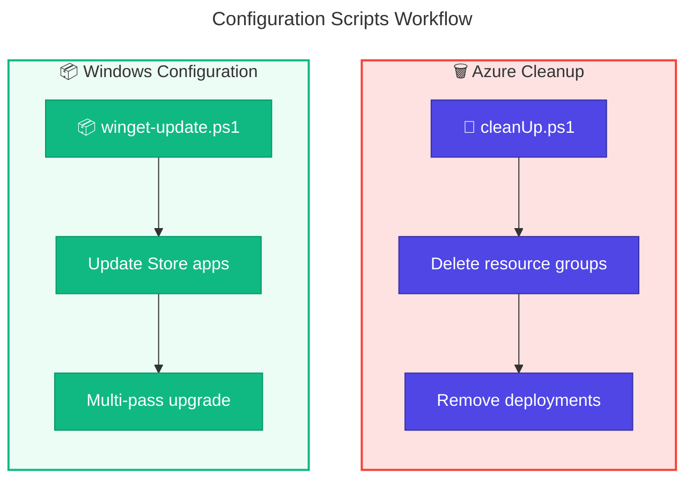

# ⚙️ Configuration PowerShell Scripts

> **Documentation for Azure resource cleanup and Windows configuration scripts**

> [!NOTE]
> **Target Audience:** Azure Administrators, System Administrators, DevOps Engineers  
> **Reading Time:** ~3 minutes

<details>
<summary>📍 Navigation</summary>

| Previous | Index | Next |
|:---------|:-----:|-----:|
| [← GitHub Scripts](../github/README.md) | [Docs Index](../../README.md) | — |

</details>

---

## 📑 Table of Contents

- [🎯 Overview](#-overview)
- [📜 Scripts Inventory](#-scripts-inventory)
- [🔄 Workflow Diagram](#-workflow-diagram)
- [⚙️ Prerequisites](#-prerequisites)
- [🚀 Quick Start](#-quick-start)
- [🔗 Related Documentation](#-related-documentation)

---

## 🎯 Overview

This folder contains PowerShell scripts for managing Azure resource groups and configuring Windows environments. These utility scripts support environment cleanup and Dev Box workload configuration.

---

[⬆️ Back to Top](#-table-of-contents)

---

## 📜 Scripts Inventory

| Script | Purpose | Documentation |
|:-------|:--------|:--------------|
| 🧹 `cleanUp.ps1` | Deletes Azure resource groups for DevExp-DevBox | [clean-up.md](clean-up.md) |
| 📦 `winget-update.ps1` | Updates Microsoft Store applications silently | [winget-update.md](winget-update.md) |

---

[⬆️ Back to Top](#-table-of-contents)

---

## 🔄 Workflow Diagram



---

[⬆️ Back to Top](#-table-of-contents)

---

## ⚙️ Prerequisites

> [!IMPORTANT]
> Each script has specific requirements. See individual documentation for details.

### cleanUp.ps1 Requirements

| Tool | Purpose | Installation |
|:-----|:--------|:-------------|
| Azure CLI (`az`) | Delete Azure resources | [Install Azure CLI](https://docs.microsoft.com/cli/azure/install-azure-cli) |
| PowerShell 5.1+ | Script execution | Pre-installed on Windows |

### winget-update.ps1 Requirements

| Tool | Purpose | Installation |
|:-----|:--------|:-------------|
| Windows Package Manager (`winget`) | Package management | [App Installer](https://apps.microsoft.com/store/detail/app-installer/9NBLGGH4NNS1) |
| PowerShell 5.1+ | Script execution | Pre-installed on Windows |
| Administrator privileges | Machine-wide updates | Run as Administrator |

---

[⬆️ Back to Top](#-table-of-contents)

---

## 🚀 Quick Start

### Resource Group Cleanup

> [!CAUTION]
> This operation is **destructive** and cannot be undone.

```powershell
# 1. Login to Azure
az login

# 2. Run cleanup with default parameters
.\cleanUp.ps1

# 3. Or specify environment and location
.\cleanUp.ps1 -EnvName "prod" -Location "westus2"
```

### Windows Store App Updates

> [!TIP]
> Run as Administrator for machine-wide updates.

```powershell
# Run with elevated privileges
Start-Process powershell -Verb RunAs -ArgumentList "-File `".\winget-update.ps1`""
```

---

[⬆️ Back to Top](#-table-of-contents)

---

## 🔗 Related Documentation

| Document | Description |
|:---------|:------------|
| [Scripts Index](../README.md) | Main scripts documentation |
| [cleanSetUp.ps1](../clean-setup.md) | Full environment cleanup orchestrator |
| [Azure Scripts](../azure/README.md) | Azure RBAC and credential management |
| [GitHub Scripts](../github/README.md) | GitHub secret management |

---

[⬆️ Back to Top](#-table-of-contents)

---

<div align="center">

[← GitHub Scripts](../github/README.md) | [⬆️ Back to Top](#-table-of-contents)

*DevExp-DevBox • Configuration Scripts Documentation*

</div>
