# 🧹 cleanUp.ps1

> **Removes Azure resource groups for DevExp-DevBox environment**

> [!CAUTION]
> This script **permanently deletes** Azure resource groups and all their contents. This action cannot be undone.

> [!NOTE]
> **Target Audience:** Azure Administrators, Platform Engineers  
> **Reading Time:** ~10 minutes

<details>
<summary>📍 Navigation</summary>

| Previous | Index | Next |
|:---------|:-----:|-----:|
| [← generateDeploymentCredentials.ps1](../azure/generate-deployment-credentials.md) | [Scripts Index](../README.md) | [winget-update.ps1 →](winget-update.md) |

</details>

---

## 📑 Table of Contents

- [🎯 Overview](#-overview)
- [📊 Flow Visualization](#-flow-visualization)
- [📝 Parameters](#-parameters)
- [⚙️ Prerequisites](#️-prerequisites)
- [🗂️ Resource Groups Deleted](#️-resource-groups-deleted)
- [🔧 Functions Reference](#-functions-reference)
- [📝 Usage Examples](#-usage-examples)
- [⚠️ Error Handling](#️-error-handling)
- [🛠️ Troubleshooting](#️-troubleshooting)
- [🔒 Security Considerations](#-security-considerations)
- [🔗 Related Scripts](#-related-scripts)

---

## 🎯 Overview

This script deletes Azure resource groups and their associated deployments for the DevExp-DevBox infrastructure. It removes workload, connectivity, monitoring, security, and supporting resource groups based on a naming convention.

---

[⬆️ Back to Top](#-table-of-contents)

---

## 📊 Flow Visualization

```mermaid
---
title: Resource Group Cleanup Flow
---
flowchart TD
    %% ===== SCRIPT ENTRY =====
    subgraph Entry["📥 Script Entry"]
        A(["🚀 cleanUp.ps1 Start"])
        B[/"📝 Parse Parameters"/]
    end
    
    %% ===== MAIN ORCHESTRATION =====
    subgraph Main["🎯 Main Orchestration"]
        C["⚙️ Remove-AllResourceGroups"]
        D["📋 Build resource group names"]
    end
    
    %% ===== RESOURCE GROUP DELETION LOOP =====
    subgraph RGLoop["🔄 Resource Group Deletion Loop"]
        E["📋 For each resource group"]
        F["🗑️ Remove-AzureResourceGroup"]
        F1[("☁️ az group exists")]
        F2{"📋 RG exists?"}
        F3[("📋 az deployment group list")]
        F4["🗑️ Delete deployments"]
        F5[("🗑️ az group delete --no-wait")]
    end
    
    %% ===== SCRIPT EXIT =====
    subgraph Exit["📤 Script Exit"]
        G{"✅ All succeeded?"}
        H[\"🎉 Deletions Initiated"\]
        I{{"⚠️ Partial Failure"}}
    end
    
    %% ===== CONNECTIONS =====
    A -->|parses| B -->|invokes| C -->|builds| D -->|iterates| E
    E -->|processes| F -->|checks| F1 -->|evaluates| F2
    F2 -->|No| E
    F2 -->|Yes| F3 -->|clears| F4 -->|deletes| F5 -->|next| E
    E -->|All processed| G
    G -->|Yes| H
    G -->|No| I

    %% ===== STYLES =====
    classDef trigger fill:#818CF8,stroke:#4F46E5,color:#FFFFFF
    classDef primary fill:#4F46E5,stroke:#3730A3,color:#FFFFFF
    classDef secondary fill:#10B981,stroke:#059669,color:#FFFFFF
    classDef datastore fill:#F59E0B,stroke:#D97706,color:#000000
    classDef external fill:#6B7280,stroke:#4B5563,color:#FFFFFF,stroke-dasharray:5 5
    classDef failed fill:#F44336,stroke:#C62828,color:#FFFFFF
    classDef decision fill:#FFFBEB,stroke:#F59E0B,color:#000000
    classDef input fill:#F3F4F6,stroke:#6B7280,color:#000000
    classDef matrix fill:#D1FAE5,stroke:#10B981,color:#000000
    
    class A trigger
    class B input
    class C,D,E,F,F4 primary
    class F1,F3,F5 external
    class F2,G decision
    class H secondary
    class I failed
    
    %% ===== SUBGRAPH STYLES =====
    style Entry fill:#EEF2FF,stroke:#4F46E5,stroke-width:2px
    style Main fill:#E0E7FF,stroke:#4F46E5,stroke-width:2px
    style RGLoop fill:#FEE2E2,stroke:#F44336,stroke-width:2px
    style Exit fill:#FEF3C7,stroke:#F59E0B,stroke-width:2px
```



---

[⬆️ Back to Top](#-table-of-contents)

---

## 📝 Parameters

| Parameter | Type | Required | Default | Validation | Description |
|:----------|:-----|:--------:|:--------|:-----------|:------------|
| `-EnvName` | `string` | No | `"demo"` | `ValidateNotNullOrEmpty` | Environment name for resource group naming |
| `-Location` | `string` | No | `"eastus2"` | `ValidateSet` | Azure region (eastus, eastus2, westus, westus2, westus3, northeurope, westeurope) |
| `-WorkloadName` | `string` | No | `"devexp"` | `ValidateNotNullOrEmpty` | Workload name prefix for resource groups |

---

[⬆️ Back to Top](#-table-of-contents)

---

## ⚙️ Prerequisites

### Required Tools

| Tool | Purpose | Installation |
|:-----|:--------|:-------------|
| Azure CLI (`az`) | Delete Azure resources | [Install Azure CLI](https://docs.microsoft.com/cli/azure/install-azure-cli) |
| PowerShell 5.1+ | Script execution | Pre-installed on Windows |

### Required Permissions

- **Azure**: Contributor or Owner on the subscription
- Permission to delete resource groups and deployments

---

[⬆️ Back to Top](#-table-of-contents)

---

## 🗂️ Resource Groups Deleted

Based on the naming convention `{WorkloadName}-{type}-{EnvName}-{Location}-rg`:

| Resource Group Pattern | Purpose |
|:-----------------------|:--------|
| `{workload}-workload-{env}-{location}-rg` | DevCenter and related resources |
| `{workload}-connectivity-{env}-{location}-rg` | VNets and network connections |
| `{workload}-monitoring-{env}-{location}-rg` | Log Analytics and monitoring |
| `{workload}-security-{env}-{location}-rg` | Key Vault and security resources |
| `NetworkWatcherRG` | Azure-managed network watcher |
| `Default-ActivityLogAlerts` | Default alert rules |
| `DefaultResourceGroup-WUS2` | Default Azure-created resources |

### Example Resource Groups (with defaults)

```
devexp-workload-demo-eastus2-rg
devexp-connectivity-demo-eastus2-rg
devexp-monitoring-demo-eastus2-rg
devexp-security-demo-eastus2-rg
```

---

[⬆️ Back to Top](#-table-of-contents)

---

## 🔧 Functions Reference

### Function: `Remove-AzureResourceGroup`

**Purpose:** Deletes an Azure resource group and its deployments.

**Parameters:**

| Name | Type | Required | Description |
|:-----|:-----|:--------:|:------------|
| `ResourceGroupName` | `string` | Yes | Name of the resource group to delete |

**Returns:** `[bool]` - `$true` if deletion initiated successfully, `$false` on error

**Behavior:**

1. Checks if resource group exists (`az group exists`)
2. If exists, lists all deployments in the group
3. Deletes each deployment first
4. Waits 10 seconds for deployment deletions
5. Initiates async resource group deletion (`--no-wait`)
6. Supports `-WhatIf` via `SupportsShouldProcess`

---

### Function: `Remove-AllResourceGroups`

**Purpose:** Removes all DevExp-DevBox related resource groups.

**Parameters:**

| Name | Type | Required | Description |
|:-----|:-----|:--------:|:------------|
| `WorkloadName` | `string` | Yes | Workload name prefix |
| `Environment` | `string` | Yes | Environment name |
| `Location` | `string` | Yes | Azure region |

**Returns:** `[bool]` - `$true` if all deletions initiated, `$false` otherwise

**Builds and deletes these resource groups:**

- `{WorkloadName}-workload-{Environment}-{Location}-rg`
- `{WorkloadName}-connectivity-{Environment}-{Location}-rg`
- `{WorkloadName}-monitoring-{Environment}-{Location}-rg`
- `{WorkloadName}-security-{Environment}-{Location}-rg`
- `NetworkWatcherRG`
- `Default-ActivityLogAlerts`
- `DefaultResourceGroup-WUS2`

---

[⬆️ Back to Top](#-table-of-contents)

---

## 📝 Usage Examples

### Default Cleanup

```powershell
.\cleanUp.ps1
```

Deletes resource groups for:

- Workload: `devexp`
- Environment: `demo`
- Location: `eastus2`

### Production Environment Cleanup

```powershell
.\cleanUp.ps1 -EnvName "prod" -Location "westus2"
```

### Custom Workload Name

```powershell
.\cleanUp.ps1 -WorkloadName "mycompany" -EnvName "dev" -Location "northeurope"
```

### Dry Run (WhatIf)

```powershell
.\cleanUp.ps1 -WhatIf
```

<details>
<summary>Expected Output</summary>

```
DevExp-DevBox Resource Cleanup
==============================
Starting cleanup of resource groups...
Environment: demo
Location: eastus2

Deleting deployment: initial-deployment
Deployment 'initial-deployment' deleted.
Deleting resource group: devexp-workload-demo-eastus2-rg (async)...
Resource group 'devexp-workload-demo-eastus2-rg' deletion initiated.
Resource group 'devexp-connectivity-demo-eastus2-rg' does not exist. Skipping.
...

All resource group deletions initiated successfully.
```

</details>

---

[⬆️ Back to Top](#-table-of-contents)

---

## ⚠️ Error Handling

### Error Action Preference

```powershell
$ErrorActionPreference = 'Stop'
$WarningPreference = 'Stop'
```

### Exit Codes

| Code | Meaning |
|:----:|:--------|
| `0` | All deletions initiated successfully |
| `1` | One or more deletions failed |

### Asynchronous Deletion

Resource groups are deleted with `--no-wait` flag:

- Script returns immediately after initiating deletion
- Actual deletion continues in the background
- May take several minutes to complete

### Idempotency

The script is **idempotent**:

- Non-existent resource groups are skipped with message
- Safe to run multiple times
- No error if already deleted

---

[⬆️ Back to Top](#-table-of-contents)

---

## 🛠️ Troubleshooting

### Common Issues

| Issue | Cause | Solution |
|:------|:------|:---------|
| "Failed to check if resource group exists" | Not logged into Azure | Run `az login` |
| "Failed to initiate resource group deletion" | Resource locks present | Remove locks first |
| Deployment deletion fails | Deployment in progress | Wait and retry |
| Slow deletion | Large resources (Dev Boxes) | Allow more time |

### Monitor Deletion Progress

```powershell
# Check if resource group still exists
az group exists --name "devexp-workload-demo-eastus2-rg"

# List resource groups matching pattern
az group list --query "[?contains(name, 'devexp')]" --output table
```

### Force Delete Locked Resources

```powershell
# Remove lock first
az lock delete --name {lock-name} --resource-group {rg-name}
```

---

[⬆️ Back to Top](#-table-of-contents)

---

## 🔒 Security Considerations

### Destructive Operation

- This script **permanently deletes** Azure resources
- Deleted resources cannot be recovered
- All data in the resource groups will be lost

### Before Execution Checklist

- [ ] Verify correct environment and location parameters
- [ ] Confirm no production workloads in target resource groups
- [ ] Back up any important data or configurations
- [ ] Consider using `-WhatIf` first

### Resource Locks

Azure resource locks can prevent accidental deletion:

- Remove locks before running cleanup
- Or use Azure portal to delete locked resources

---

[⬆️ Back to Top](#-table-of-contents)

---

## 🔗 Related Scripts

| Script | Purpose | Link |
|:-------|:--------|:-----|
| `cleanSetUp.ps1` | Full environment cleanup orchestrator | [../clean-setup.md](../clean-setup.md) |
| `setUp.ps1` | Environment setup (opposite operation) | [../setup.md](../setup.md) |

---

<div align="center">

[← generateDeploymentCredentials.ps1](../azure/generate-deployment-credentials.md) | [⬆️ Back to Top](#-table-of-contents) | [winget-update.ps1 →](winget-update.md)

*DevExp-DevBox • cleanUp.ps1 Documentation*

</div>
